*I love AI tools and I use them all the time, but everything in this article was written by me with my dumb, imprecise monkey fingers.*

I built lopsy.art to replace photoshop in my daily life. It’s not a 1-for-1 replacement, but it provides everything I need for my casual image editing needs. And the best part: I can add any [feature I dream up](https://github.com/theseamusjames/lopsy.art/pull/719) and make it work exactly the way I want it to. I love it.

But of course there are bugs. A lot of bugs. The engine is written in rust, compiled in WASM, rendered in a React app, and the whole thing was written by Claude. I’ve offered a lot of guidance on best practices and systems (sparse arrays to lower the memory footprint, contracting/expanding layers to their content size when not active, floating selections for independent editing and compositing, and many more), but the implementations are all straight from the agent.

With that, there’s a particularly pernicious class of bug that’s hard to spot: the kind that only appears in sequence. Undo, for example. You might undo once and it works. You might undo twice and it works. But maybe a bunch of undos in a row on a particular sequence of actions causes redo to fail. Your regular e2e won’t catch that.

## Design as Diagnosis
So to combat that, I let Claude build unique, randomized compositions, using the tool the way a user would [through Playwright](https://lopsy.art/SKILL.md).

First, I give Claude a `/random` skill that allows for actual random selection via node (because LLMs are really bad at choosing randomly on their own, particularly for the same prompt). 

Then I use the skill to choose two letters randomly – these will be initials for the name of its creation. By using random letters to guide the ideation, I get far more interesting, less repetitive designs.

Then it chooses a style like art nouveau or neobrutalist and a project type like album cover or holiday card.

And then it just goes.

It creates full compositions using lopsy the way a graphic designer would, drawing with the tools, adding external images and cropping them, laying out text. From concept to completion, it designs the entire project autonomously in the browser, through the same UI as you or I. 

(The complete prompt is at the bottom of this page).

  tutorial.")

## This is trash. Start again.
Once the design is complete, an agent assumes the role of Art Director and judges the output qualitatively. 

This allows for two things: token optimization by using a more powerful, more critical model to both assess the result as well as suggest improvements. And second, we have a bounded iterative loop. Continue revising until you satisfy the critics. This can take hours, but the results are impressive.

## This year's model
This only became possible with the recent class of models. Early experiments were… less successful.

 created by Opus 4.7 in April 2026.")

 Now that models can control software competently, a whole new class of generative capabilities becomes possible. Things like photo retouching or color grading – this is no different than a human moving the knobs and buttons, and the product that comes out the other side isn’t generative in the sense of a nano banana retouch that bears the anomalies and watermark of generative AI.

 , we've come a long way in 6 months.")

## Waste nothing
As it started producing these designs, I was seeing the results and thinking, “That’s awesome, I wonder how it did that.” So to answer that question, I thought, “Well, I could have it give me a step-by-step showing what it’s doing.” Hmm, a step-by-step set of instructions… with screenshots.

That’s a tutorial.

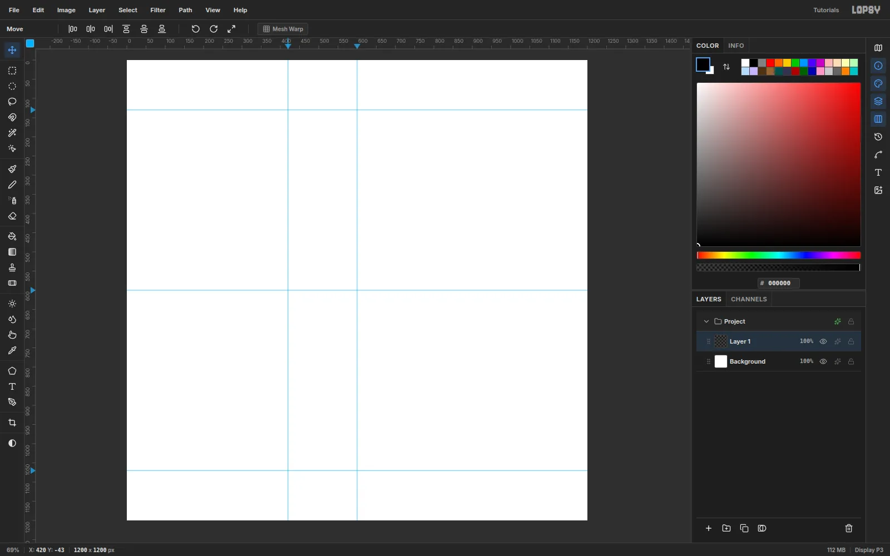

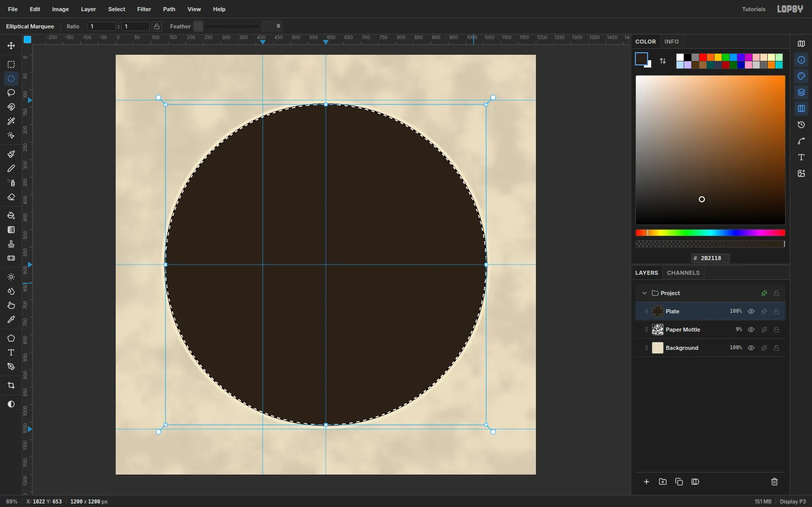
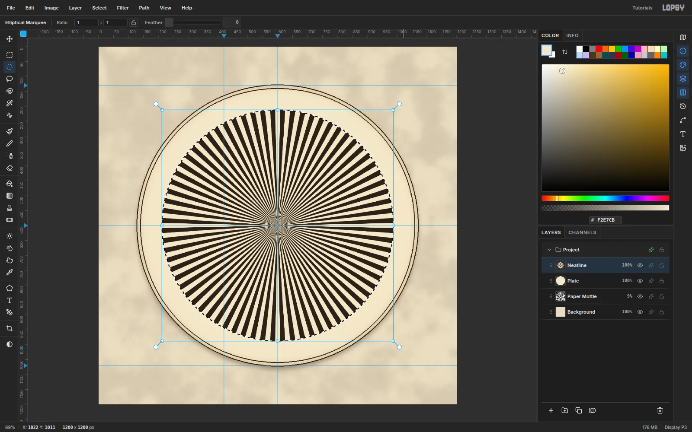


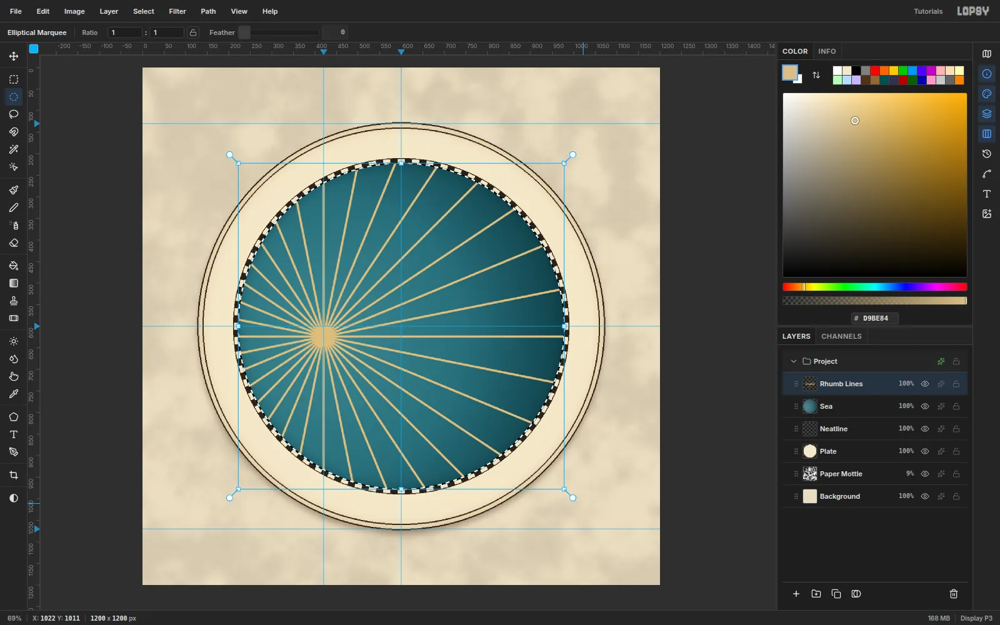
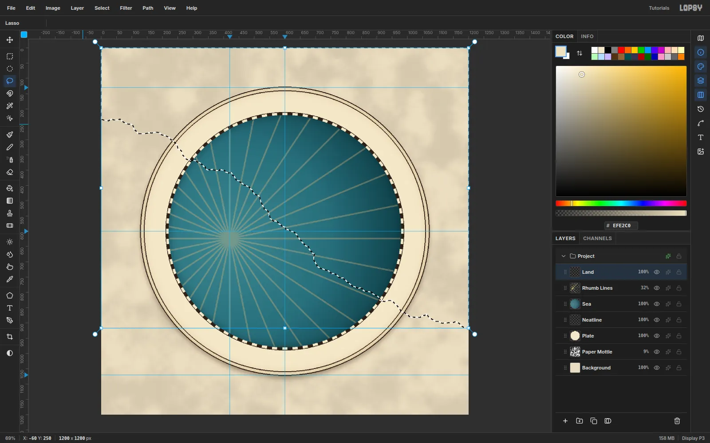
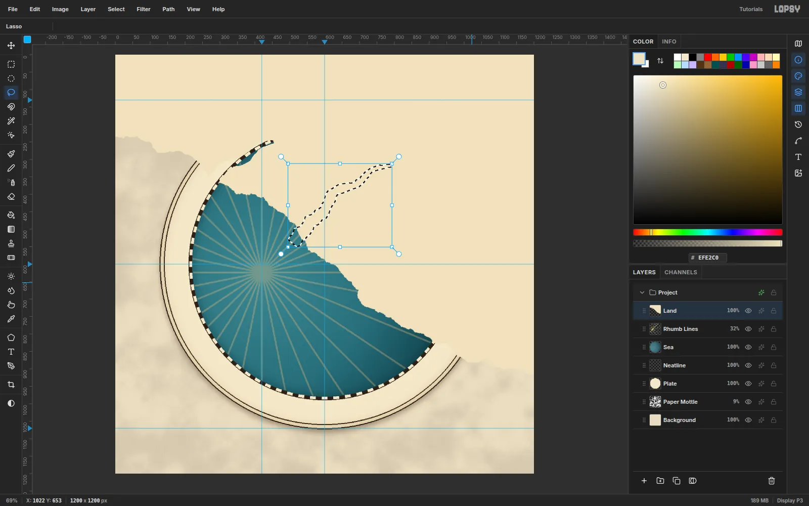
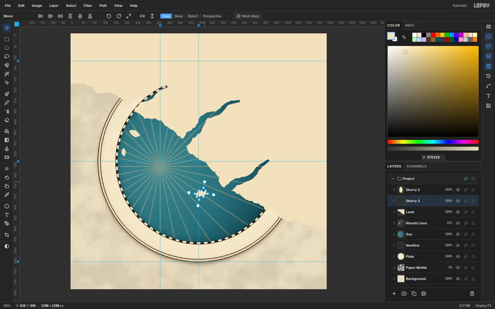
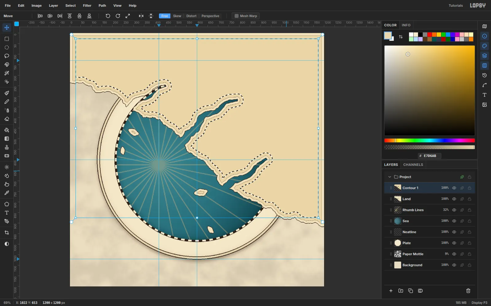

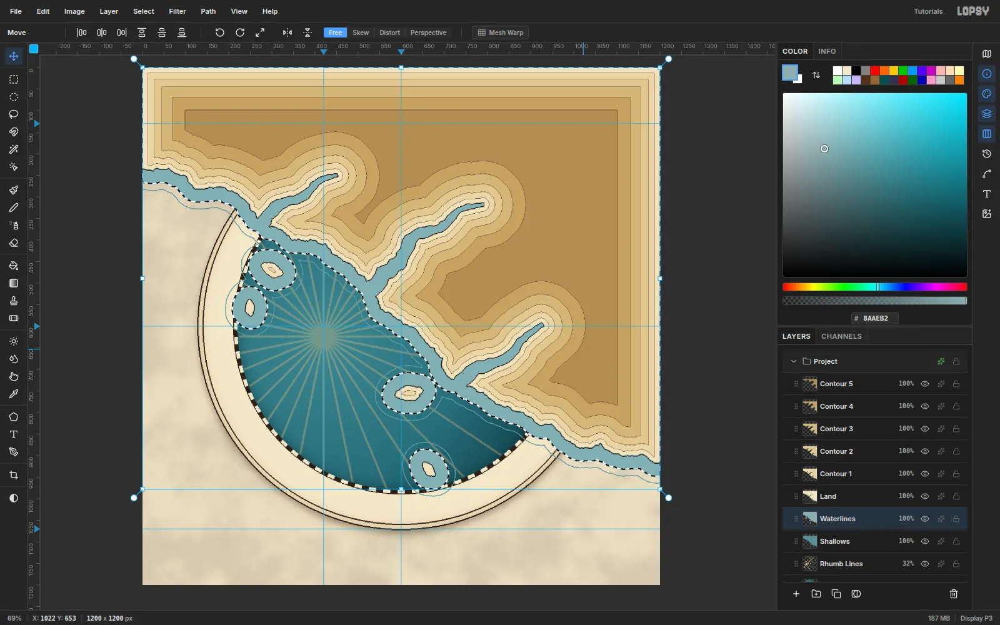
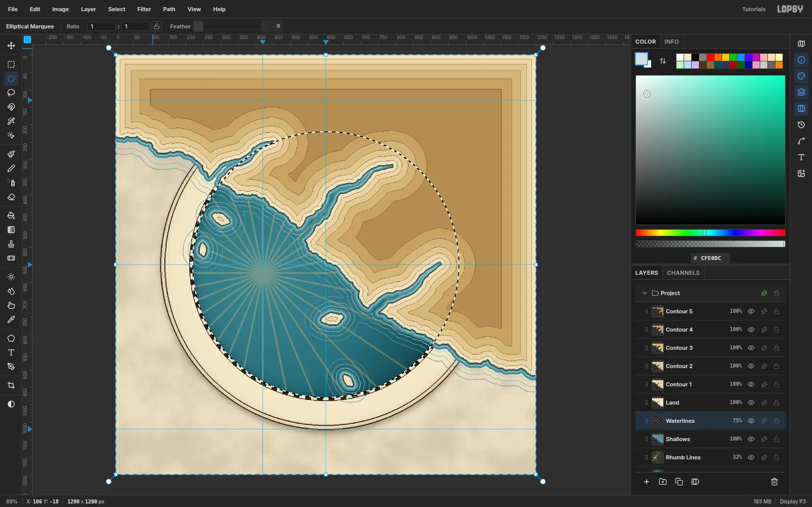
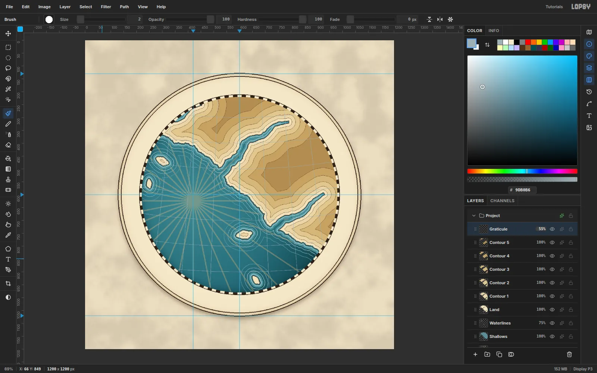


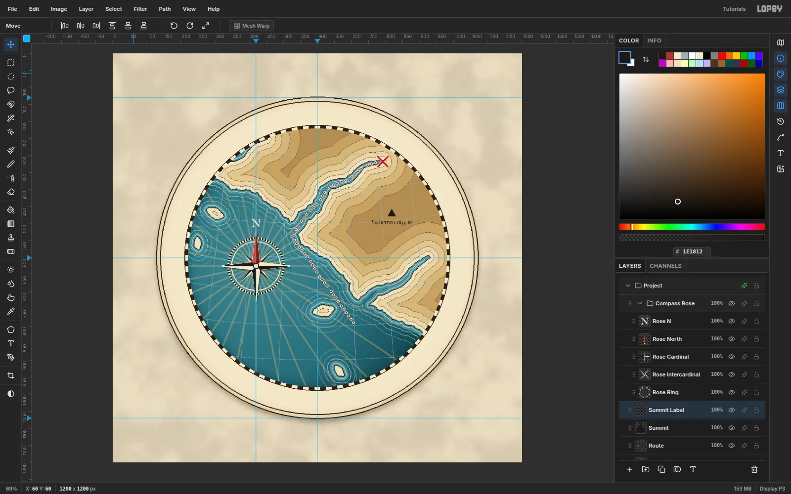

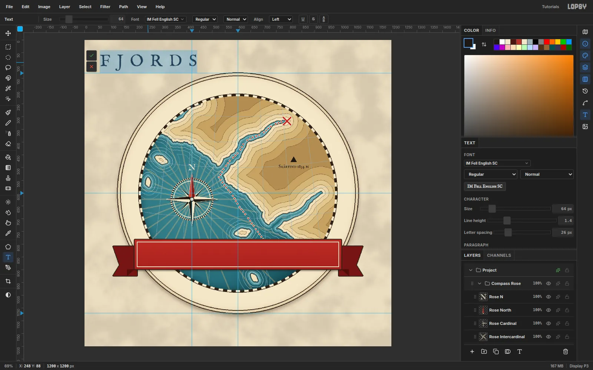


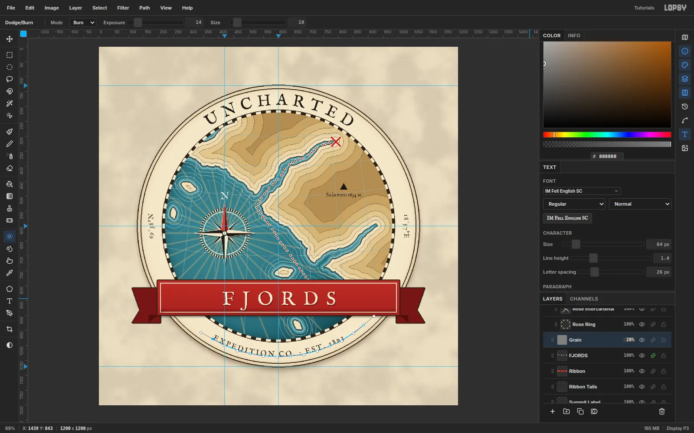
.")

And then it hit me: **my QA process is now a two-fer.** I can have Claude test the product, report bugs that it finds, and then write up that QA as a full tutorial that I can post on lopsy. Instead of wasting all this work on QA runs that may or may not find bugs (hint: they almost always find bugs), these tokens can do double duty and create artifacts that are interesting in their own right.

There’s a lot of upside:

- I can see what it’s doing when it creates the images (and lo-and-behold it was doing some [weird stuff](https://github.com/theseamusjames/lopsy.art/commit/61b36638966bb4a2941380832552db20bdabf83d)).
- Create a showcase of what’s possible with the tool
- It solves my mobile problem. The tool doesn’t work on mobile, so now people can see *something* when they land from a phone.
- They can be educational for particular techniques. I’ve been pretty surprised with some of the things it’s doing particularly around texture.

I run this as a Claude Routine, so now every 2-4 hours (depending on how many tokens I can spare), my app is improving, my content library is growing, and I get these really fun artifacts to look at. Not all of them are amazing. Some are better than others. But it’s been tremendously valuable as a catalyst for improvement and adds a lot of fun to my day.

*Here’s my full QA/Autonomous Content building routine.*

```markdown
# Goals
1. Create a complex composition that uses the website the way a real person would to help me test that things work as expected. Try to find bugs while producing realistic graphic design/digital art compositions.
2. Use the final step-by-step, screenshots, and final image to create a tutorial entry. Make sure you use a process screenshot for the og-image on the tutorial page. 

## Steps
- Rebase on main before starting.
- Do a little research about graphic design techniques. Find inspiration on the web. Try to make something visually impressive.
- You can also use reference images from the web as any digital artist would.
- Review FEATURES.md to understand what is available.
- Check for LAST_RUN.md in the [base project folder]/compositions folder. Review what was used in the previous run and when making choices about what features, colors, and iconagraphy to use, try to avoid repeating too closely. Sometimes it will be unavoidable, ie. if you need a gradient, just use a gradient, but we're just generally trying to get a good variety in the techniques and tools being tested.
- Use the e2e system with playwright 
- You're working on a worktree, so [base project folder] would be the folder for the main trunk
- Use an agent and run `/random a,b,c,d,e,f,g,h,i,j,k,l,m,n,o,p,q,r,s,t,u,v,w,x,y,z` to choose two random letters, and then choose a topic that starts with those letters to base your composition on.
- Use an agent and run `/random cyberpunk,art-nouveau,art-deco,psychedelic,bauhaus,vaporwave,retro-futurism,swiss/international,memphis,brutalist,grunge,pop-art,constructivist,de-stijl,futurism,dadaist,surrealist,isometric,glitch,y2k,synthwave,steampunk,dieselpunk,atompunk,solarpunk,gothic,victorian,baroque,rococo,neo-expressionist,abstract-expressionist,suprematist,op-art,kinetic,lowbrow,kawaii,ukiyo-e,woodcut,risograph,lithographic,screen-print,collage,photomontage,typographic,hand-lettered,calligraphic,illuminated-manuscript,propaganda-poster,pulp,noir,mid-century-modern,tropical,tiki,americana,folk-art,naive,outsider,street-art,graffiti,stencil,sticker-bomb,skate,punk,zine,lo-fi,maximalist,anti-design,neubrutalism,claymorphism,skeuomorphic,blueprint,technical-illustration,infographic,cartographic,scientific-illustration,botanical,anatomical,woodblock,etching,engraving,halftone,duotone,neon,holographic,iridescent,chrome,liquid-metal,pixel-art,8-bit,16-bit,ascii-art,voxel,op-pop,neo-pop,post-modern,deconstructivist,anti-aesthetic,vernacular` to get an art style.
- Use an agent and run `/random poster,logo,albumCover,zineCover,invitation,restaurantMenu,billboard,digitalPainting,tshirtDesign,holidayCard,birthdayCard,flierDesign,editorialMagazineCover,dataVisualization,tattooFlashSheet` to choose a project type.
- Use playwright to create your composition using the UI. Simulate mouse movements, clicks, etc -- control the UI the way a person would. 
- It's also acceptable to bring in images from the internet to assemble in your composition the way a graphic designer might. 
- Use many layers, layer effects, filters, tools, colors, blend modes. 
- Use marquees, rotate things, resize them, etc. Test the transforms.
- Use undo and redo often, undo multiple steps, redo back to where you were. Verify that things don't change unexpectedly.
- When needed, use erase, cut and paste for duplication, etc. 
- Use groups and group manipulation, like setting the group as active and moving the whole thing at once.
- Use snap, grid, guides, etc.
- For some of your compositions (but not all) use text. Manipulate it. Rotate it, select and fill it, etc. Use the google fonts we have available. Something like a digital painting or a holiday card need not have text to convey the meaning. IMPORTANT: when positioning text inside a shape make sure it's properly seated -- descenders inside the container, appropriate margins, etc. 
- Act as an expert, incredibly creative graphic designer. You have a powerful tool available. Push it to the limits of its ability. 
- At the end, spin off an Art Director agent and ask for a critique. Ask for feedback and suggestions around composition, readability, color and texture, and technical competence. Don't excuse mistakes in the name of artistic license. If using text, ask specifically about the position of it. Then run a new iteration with those suggestions in place. 

**IMPORTANT: After each step, take a screenshot. If using marquees or making transformations, make sure you screenshot with the marquees active. Evaluate the screenshots for bugs and ensure that the app is performing to spec, as intended.**

## Bug reports
- When you discover a bug, check github issues to see if a similar bug already exists.
- If it does exist and you have a new way to replicate it, add a comment with the new replication.
- If it doesn't exist, add a github issue for it. Attach a screenshot if possible. 
- Don't solve the bugs you find, just report them. I want to triage first. 
-  In your bug reports add very clear steps to recreate it.
- Before submitting your report, open a new window and make sure your steps actually do recreate the bug. If your steps don't recreate the bug, you should still submit the bug report, just make a note that you had trouble recreating the bug.

## Composition files
- Export a PNG of your composition with the topic you came up with as the file name. 
- Save all screenshots and exports in e2e/screenshots with a prefix for your project.
- Also save your .lopsy project file. 
- I will review your work and score it on artistic quality, originality, complexity and composition. 

## Tutorial Entry
We have highly seo-optimized tutorial pages. Use your screenshots and the final step-by-step to make one of these entries. Create a PR with the new entry. 
- Only use the screenshots from the final process. If you're testing/iterating, make sure your process shots include the elements that actually made it into the final product and not the stuff that didn't. Especially fonts. 
- Be careful with "the rest of the fucking owl" -- make sure you're showing the right intermediate steps such that someone could reasonably follow along. 
- Use the tools the way a human would, and write in a way that's reasonable for a human to understand. For example, don' t use a marquee to make 1px line -- we have a pencil with cmd+shift+click for that purpose. 
Bad instruction: "Draw a marquee from (17,134) to (2871,2499)" -- that's not how people write tutorials. 
Good instruction: "Draw a marquee from the top left to the bottom right, leaving some margin around the edge. 
- Make sure your og-image screenshot is of the final project, not an intermediate shot. 
- Begin each tutorial post with the final exported image just below the headline/subheadline section. 
- Make sure you're using the swatch-style component for the palette section.
- Review how other tutorials include the "Follow along in lopsy" flow to incorporate the .lopsy files publicly and allow users to open them in the app. This should be included with every tutorial.  
- When you're done, use and adversarial review agent to verify that the tutorial reads like something a human would write, it's comprehensible, and doesn't overly condense or skip steps. 

## Overwrite the summary
In the [base project folder]/compositions folder, look for LAST_RUN.md and overwrite it with a summary of the project you just did. Summarize the tools used, the type of project (poster, logo, etc), and a general summary of the palette (ex: "muted beige background with bold red and black overlays" or "vivid blues, purples and greens") . Keep it very brief. It doesn't need the full e2e or all of the steps, just a summary of the exact features we used. If the file doesn't exist, create it.

## Cleanup
Delete the worktree at the end. The only artifacts should be the composition png file, .lopsy project file, and any github issues.
```
