The Antarctic ozone hole grew fast through the 1980s. The world banned the chemicals that caused it in 1987, but the hole kept growing for another thirteen years before it levelled off. Recovery is now expected around 2066. That's a long game, so this tutorial charts it like one: a level from an old console, with a "hi-score", a power-up box and a penguin at the start line.

The data is real. It's the largest daily ozone hole of each year from NASA Ozone Watch, 1979 to 2025. There's no measurement for 1995, and the poster says so instead of hiding the gap.

Everything sits on an **8 px grid**. One grid cell is one "pixel" of the 8-bit picture, so every bar, sprite and border lines up with the same lattice. That one rule does most of the work. (The type is the one exception: pixel fonts have their own grid, so the letters are close to the lattice but not locked to it.)

Along the way you'll use:

- **View → Show Grid** at 8 px with **Snap**, so marquees land on whole cells
- **Define Pattern** and **Fill with Pattern** for dithering, bevels and ice bricks
- **Add Noise**, **Threshold** and **Pixelate** to make a starfield
- marquees that add (**Shift**) and intersect (**Shift+Alt**), and **Cmd**-clicking a thumbnail to load a layer as a selection
- a "stencil" trick with **Pixelate**, **Threshold** and the **Magic Wand** that turns any shape into a stepped pixel shape
- **Copy**, **Paste** and the **Move** tool's rotate handle, then **Merge Down**
- the **Drop Shadow** and **Color Overlay** effects and the **Multiply** blend mode
- live text in **Press Start 2P** and **Silkscreen**
- groups, arrow-key nudges, and undo and redo to check your work

The palette comes from the PICO-8 fantasy console. Its colours are bright, flat and few:

- Night `#000000`, navy `#1D2B53`, plum `#7E2553`, slate `#5F574F`
- Snow `#FFF1E8`, silver `#C2C3C7`, lavender `#83769C`
- Green `#00E436`, yellow `#FFEC27`, orange `#FFA300`, red `#FF004D` (the four data bands)
- Sky blue `#29ADFF`, pink `#FF77A8`, brick `#AB5236`

> **Tip:** With snap on, a marquee's corners jump to grid lines, so you only need to get close. Positions below are in pixels, written as `x, y` when there are two, or as a single height down the page when a strip runs the full width. The **Info** panel shows where the pointer is while you drag.

## Set up a pixel grid

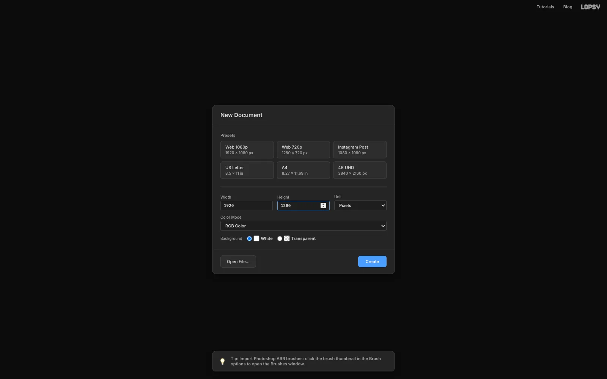

Open [Lopsy](/). In the **New Document** dialog, set **Width** to `1920` and **Height** to `1280` and click **Create**.

1. Choose **View → Show Grid**. A **Grid** slider appears at the right end of the options bar. Drag it down to `8px`.
2. Make sure the **Snap** checkbox next to it is ticked.

From now on the grid is your pixel. A bar that's "3 cells wide" is 24 px.

## Paint the night sky

Select **Background** and rename it `Sky` (double-click its name in the Layers panel).

1. Set the foreground colour to navy `#1D2B53` and choose **Edit → Fill**. With nothing selected, it fills the whole layer.
2. With the **Rectangular Marquee**, select the top of the canvas from the top-left corner down to `272`. Fill it with black `#000000`.
3. Select a strip across the bottom, from `1240` to the bottom edge, and fill it with plum `#7E2553`.

Old consoles couldn't blend colours smoothly, so skies were drawn in flat bands like these.

## Make a checker tile for dithering

To soften the jump between two bands, 8-bit artists used *dithering*, a checkerboard of the two colours. You'll make one checker tile and reuse it all through the poster.

1. Click **Add Layer** and name it `Tile`.
2. Zoom into the top-left corner. Select the first cell (0 to 8 px) and **Shift**-drag the diagonal cell below and to the right of it, so you have two cells touching at a corner. Fill with black.
3. Select the 16 × 16 square around both cells and choose **Edit → Define Pattern**. Lopsy saves it as **Pattern 1**.
4. Delete the `Tile` layer with the trash button.

> **Tip:** Patterns are kept only for the current session; they aren't saved in the project file. If you reload, define the tile again.

## Dither the sky bands together

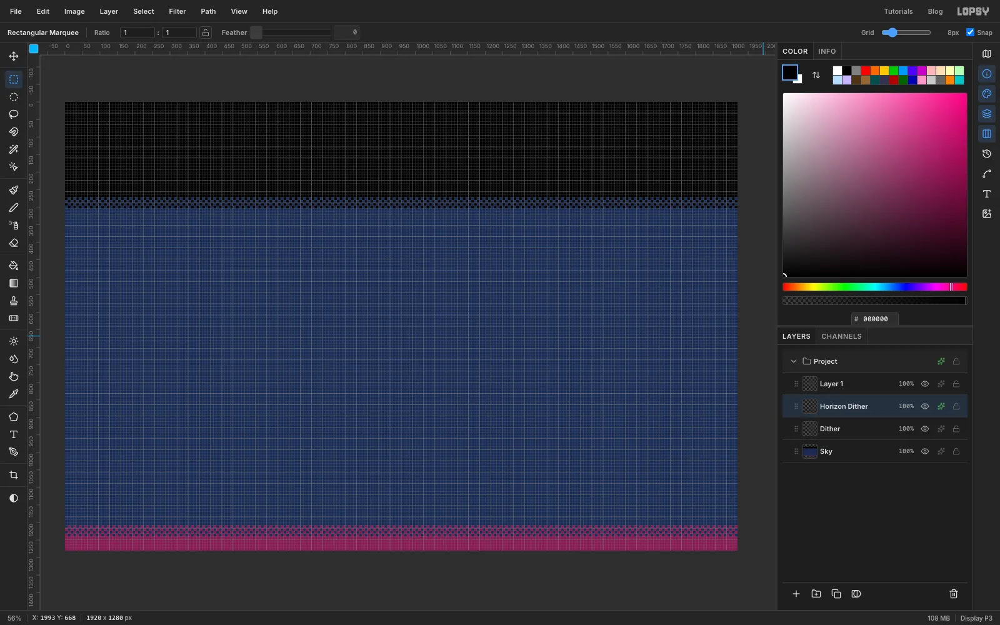

1. Add a layer named `Dither`. Select a strip from `272` to `304` across the full width, choose **Edit → Fill with Pattern…**, pick **Pattern 1** and click **Apply**. Deselect with [[Cmd+D]].
2. Add a layer named `Horizon Dither`. Select the strip from `1208` to `1240`, just above the plum band, and fill it with Pattern 1 the same way.
3. The checker is black, so it needs recolouring for the horizon. Open the layer's effects (the **fx** button on its row), turn on **Color Overlay** and set it to plum `#7E2553`.

Pattern fills line up with the canvas's top-left corner, and each 16 px tile holds exactly two cells, so the checks stay on the grid.

## Scatter pixel stars

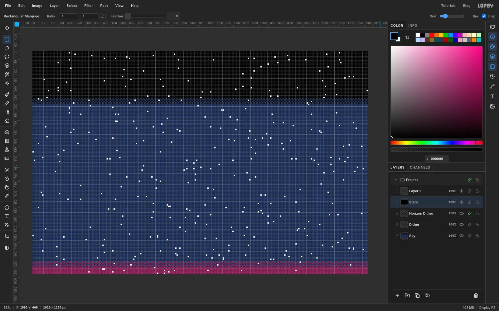

Stars come from noise, but noise is far too fine for an 8-bit sky. So you make it coarse, then clean it up.

1. Add a layer named `Stars` and fill it with black.
2. Choose **Filter → Add Noise…**, set **Amount** to `100`, pick **Mono** and apply.
3. **Filter → Threshold…** at about `48` keeps only the brightest specks, about 2 in every 100 pixels.
4. **Filter → Pixelate…** with **Block Size** `8` averages the specks into grey grid cells.
5. **Threshold** again at about `17`. Only cells that held several specks turn white, so you get roughly one star per hundred cells.
6. Set the layer's blend mode to **Screen** (in the effects drawer). Black disappears and only the stars stay.

Your stars will land in different places. That's fine, because noise is random every time.

## Build the game window

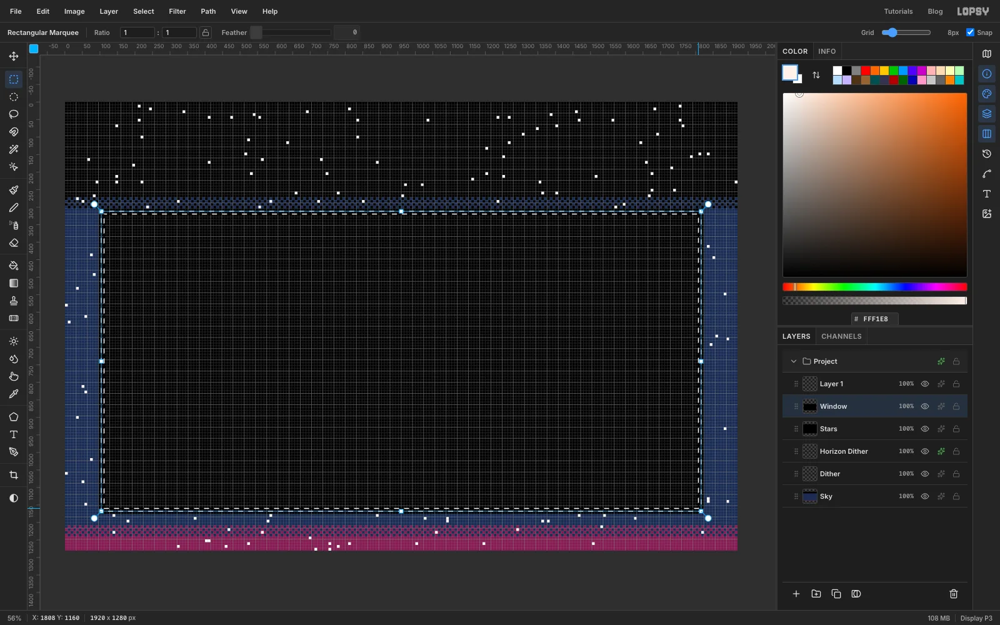

The chart sits in a game-style window: a black panel with a white border.

1. Add a layer named `Window`. Select from `96, 304` to `1824, 1176` and fill with black.
2. Select from `104, 312` to `1816, 1168`. Then hold **Alt** and drag from `112, 320` to `1808, 1160`. **Alt** subtracts, which leaves a ring one cell wide.
3. Fill the ring with snow `#FFF1E8` and deselect.

## Group the backdrop

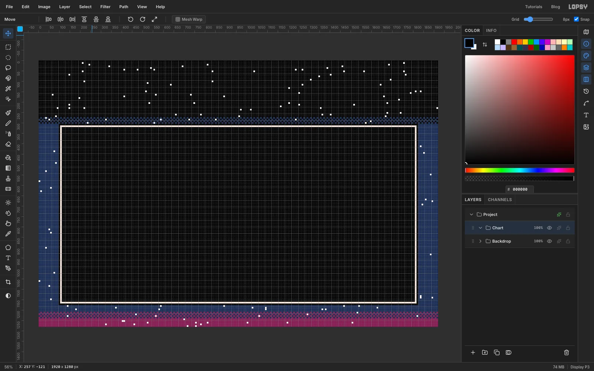

First delete the empty **Layer 1** with the trash button; you've made your own layers. Then click `Sky` and **Shift**-click `Window` to select all five backdrop layers. Choose **Layer → Group Layers** and rename the group `Backdrop`. Collapse it with its arrow.

With `Backdrop` selected, click **New Group** and name it `Chart`. New layers you add while `Chart` is selected and expanded go inside it.

## Draw dotted gridlines

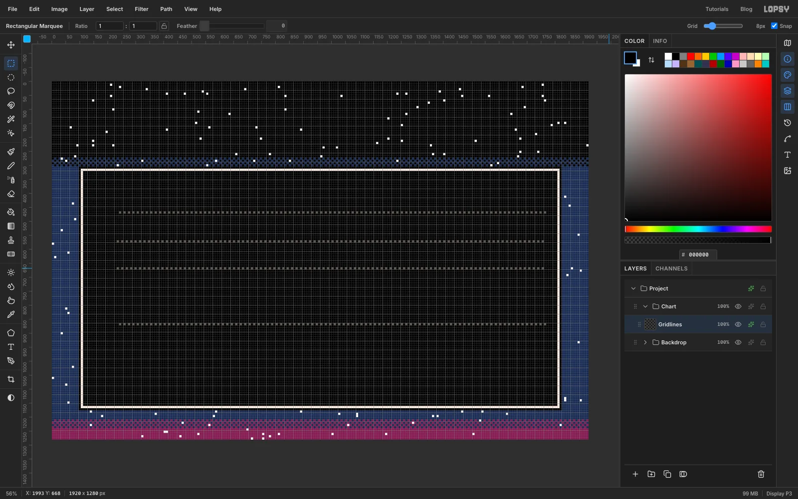

The scale is 20 px per million km², so 2.5 cells per million. The baseline (zero) is at `1064`, which puts 10 at `864`, 20 at `664` and 30 at `464`. 25 works out to 564, half a cell off the grid, so round it to `568`.

1. Add a layer named `Gridlines` inside `Chart`.
2. Select a strip one cell tall running from x `232` to `1768`, with its top at `864`. **Shift**-add the same strip at `664`, `568` and `464`.
3. Fill with Pattern 1. A one-cell strip of a checkerboard is a dotted line.
4. Deselect and give the layer a **Color Overlay** of slate `#5F574F`, so the lines sit back behind the data.

## Mark out one bar per year

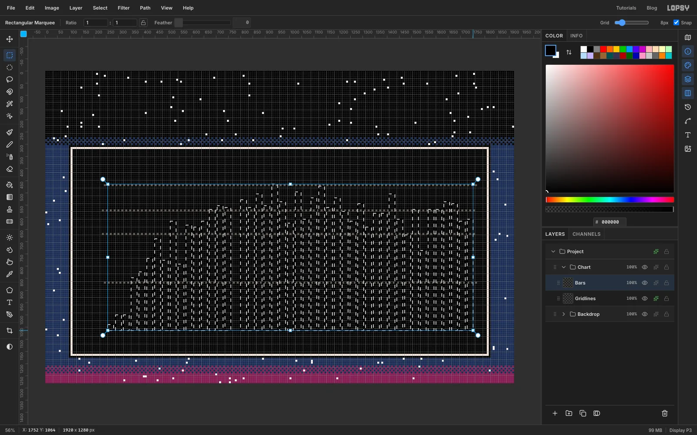

Add a layer named `Bars`. Each year gets a bar 3 cells (24 px) wide with a one-cell gap, so bars start every 32 px. 1979 starts at `256`, 1980 at `288`, and so on. Leave 1995's slot (`768`) empty, because there's no data for that year.

Every bar stands on the baseline at `1064`. Its height in cells is the area times 2.5, rounded, and its top is 8 px per cell above the baseline. Here are the tops, year by year:

- 1979–1989: 1040, 1000, 1000, 848, 824, 768, 688, 776, 616, 792, 632
- 1990–1999: 640, 616, 568, 552, 560, (none), 528, 560, 504, 552
- 2000–2009: 464, 536, 624, 496, 608, 520, 472, 560, 520, 576
- 2010–2019: 616, 544, 640, 584, 584, 504, 608, 672, 568, 736
- 2020–2025: 568, 568, 536, 544, 616, 608

Drag the first bar with the **Rectangular Marquee** from its top-left corner down to the baseline, watching the **Info** panel for the top value. Hold **Shift** for every bar after it, so they add up into one selection. When all 46 are marked, fill them with snow `#FFF1E8` and deselect.

> **Tip:** If one bar goes wrong, undo just that marquee with [[Cmd+Z]]. Each Shift-drag is its own history step.

## Colour the bars by value

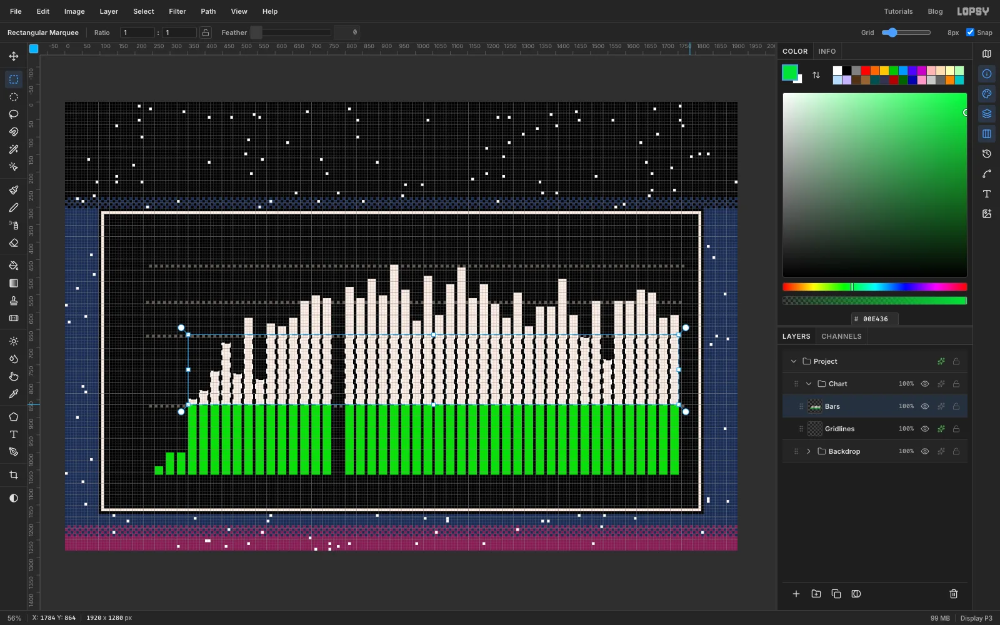

Each bar gets the colour of the band it reaches, like a power meter. Green is under 10, yellow 10–20, orange 20–25 and red over 25.

For each band:

1. **Cmd**-click the `Bars` thumbnail to load all the bars as a selection.
2. Hold **Shift+Alt** and drag a rectangle across the whole chart covering just that band. For green, that's `864` to `1064`. **Shift+Alt** intersects, so only the parts of bars inside the band stay selected.
3. Fill with the band colour: green `#00E436`, yellow `#FFEC27` (`664`–`864`), orange `#FFA300` (`568`–`664`) and red `#FF004D` (`400`–`568`).

The red rectangle starts above the tallest bar, so it catches every bar top over 25.

## Give the bars a pixel bevel

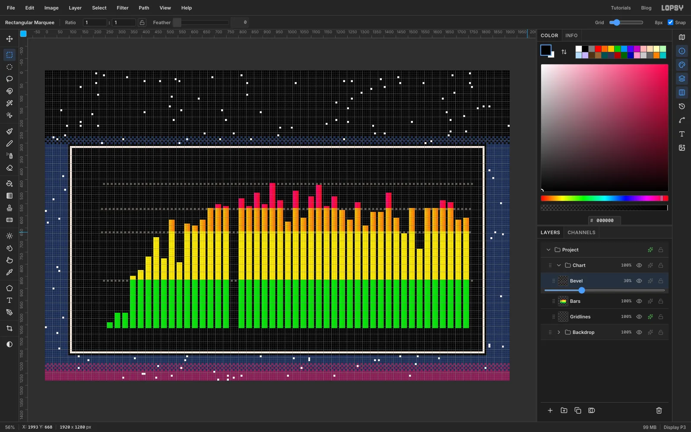

Pixel art fakes depth with a light edge and a dark edge.

1. Add a layer named `Bevel`. In the top-left corner, fill the first cell (`0`–`8`, one cell tall) white, and the third cell (`16`–`24`) black.
2. Select from `0, 0` to `32, 8` and **Define Pattern**. That's **Pattern 2**. Press **Delete** to clear the tile and deselect.
3. **Cmd**-click the `Bars` thumbnail, then **Fill with Pattern** with Pattern 2. The tile is 32 px wide, the same as the bar spacing, so every bar gets a light left column and a dark right column.
4. Set the layer to **Overlay** at `30%` opacity. Any stronger and the orange starts to look red.

## Lay an ice-brick floor

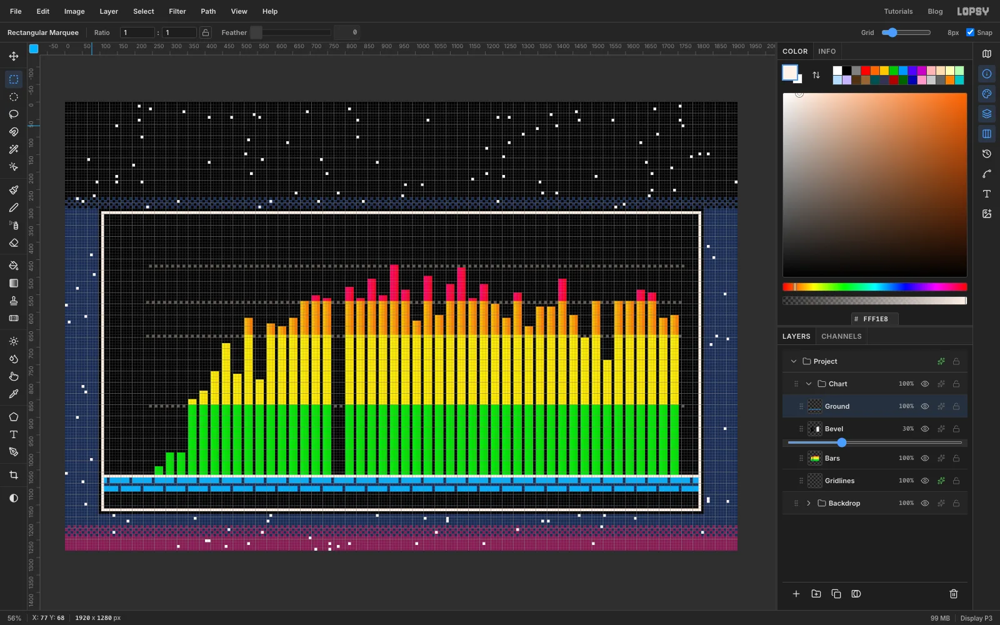

The level needs a floor.

1. Add a layer named `Ground`. In the top-left corner, select `0, 0` to `64, 48` and fill it sky blue `#29ADFF`.
2. Draw the mortar in navy `#1D2B53` as one Shift-added selection. Add two horizontal rows across the tile, at y `8`–`16` and y `32`–`40`. Then add the vertical joints, each one cell wide: x `56`–`64` in the brick strip between the rows (y `16`–`32`), and x `24`–`32` in the strips above and below them (y `0`–`8` and y `40`–`48`). Fill it.
3. Select the whole 64 × 48 tile and **Define Pattern** (Pattern 3). Delete the tile and deselect.
4. Select the floor from `112, 1072` to `1808, 1112` and fill it with Pattern 3. The rows of bricks are offset like a real wall.
5. Select the cell row along the top, `1064` to `1072`, and fill it snow `#FFF1E8`.

## Add the no-data block and year ticks

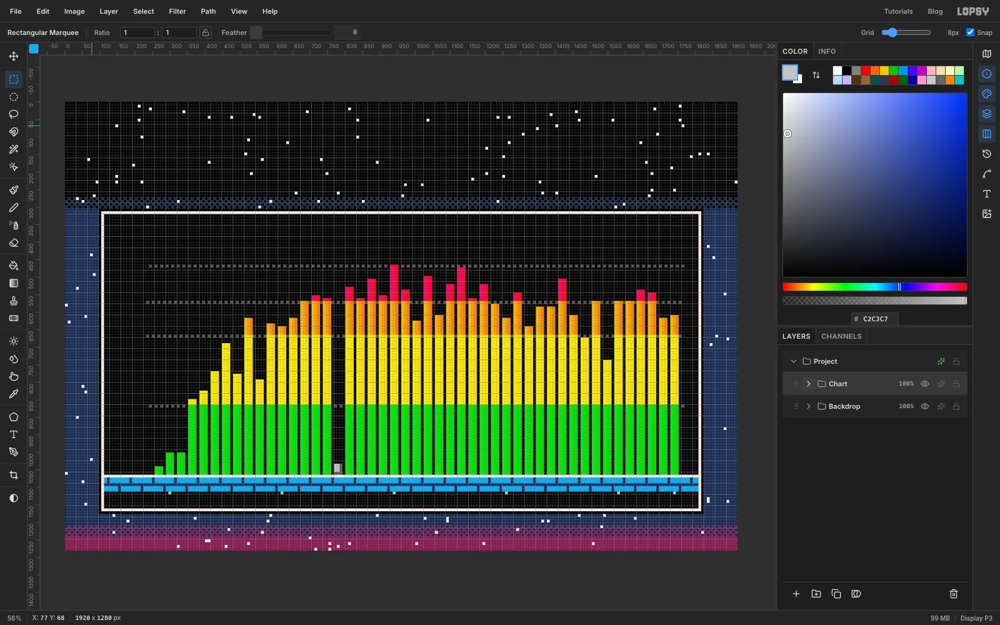

1. Add a layer named `No Data Block`. Fill the 1995 slot from `768, 1032` to `792, 1064` silver `#C2C3C7`. Fill its right column and bottom row slate `#5F574F` for a shadow. It's grey on purpose, so nobody reads it as a data bar.
2. Add a layer named `Ticks`. Under the floor, Shift-select a one-cell tick (`1112`–`1120`) centred under 1980, 1990, 2000, 2010, 2020 and 2025. Those are the cells at `296`, `616`, `936`, `1256`, `1576` and `1736`. Fill them silver.

Collapse the `Chart` group.

## Make a pixel-perfect circle with a stencil

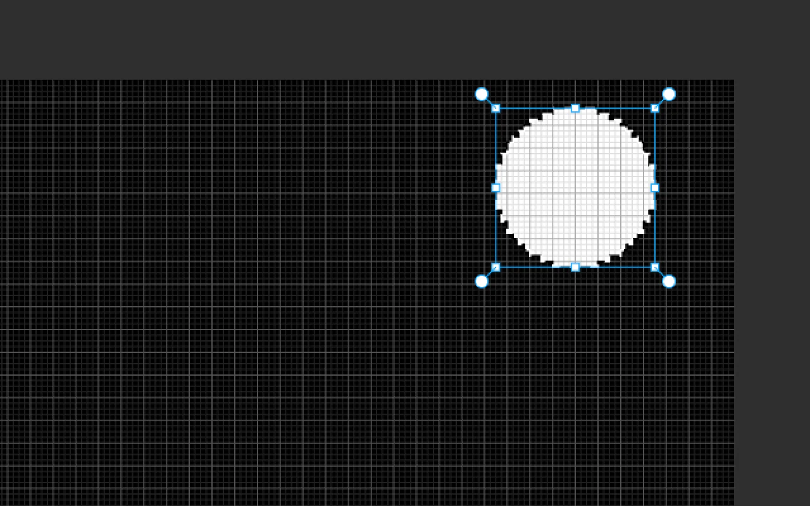

**Pixelate** keeps a shape's outline smooth: it only averages the colours inside it. To get the stair-stepped edge of real pixel art, use a throwaway stencil. You'll repeat this trick for every round sprite.

Select `Chart`, click **New Group** and name it `Sprites`. Add a layer named `Earth Outline`. Then make the stencil:

1. Add a layer named `Stencil` and fill it black.
2. With the **Elliptical Marquee**, draw a circle centred at `1696, 152` with a radius of `112` (from `1584, 40` to `1808, 264`). Fill it white and deselect.
3. **Pixelate** at `8`, then **Threshold** at `128`. Every cell is now pure black or pure white.
4. Pick the **Magic Wand**, untick **Contiguous**, and click the white circle. You now have a stepped circle selection.
5. Delete the `Stencil` layer. The selection stays.

Select `Earth Outline` and fill the selection snow `#FFF1E8`. It will show as a one-cell rim once the Earth sits on top.

## Paint the Earth

Add a layer named `Earth` and make another stencil the same way, a circle of radius `104` at the same centre. Fill it sky blue `#29ADFF`.

This is the Earth seen from below the South Pole. Antarctica sits in the middle, and the tips of the other continents peek in at the edge.

1. With the **Lasso**, draw three small blobs near the rim, at the upper left, upper right and lower right. Fill each green `#00E436`.
2. Lasso a rounded, slightly lumpy shape about 100 px across in the centre for Antarctica, and fill it snow.
3. Deselect.

## Pixelate the Earth

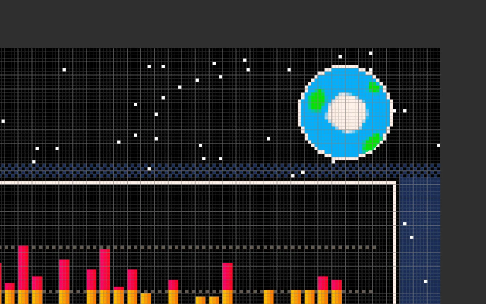

**Pixelate** `Earth` at `8`.

The edge was already stepped by the stencil. Now the inside is chunky too, and the continents become little clusters of cells. Cells along Antarctica's coast average into in-between blues. On a planet that reads as shallow ice, so leave them.

> **Tip:** Pixelate starts its blocks at the layer's edge. If your cells don't line up with the grid, click another layer and then click `Earth` again to reset it, and run Pixelate again.

## Shade the night side

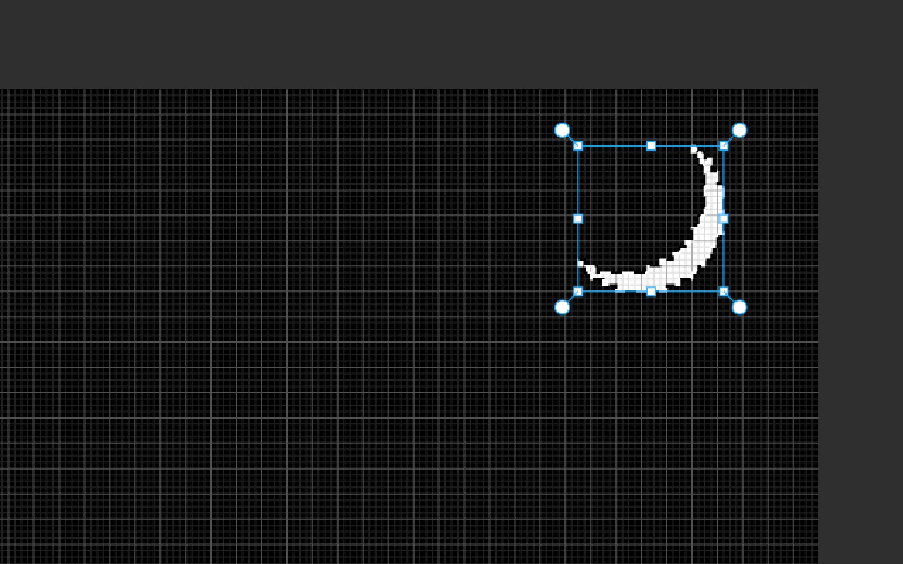

Add a layer named `Earth Shade`. Make a crescent stencil:

1. Add a black `Stencil` layer, and draw a white circle of radius `104` at `1696, 152`, the same as the Earth.
2. Draw a second circle of the same size centred three cells up and three cells left, at `1672, 128`, and fill it black. A white crescent is left at the lower right.
3. **Pixelate** `8`, **Threshold** `128`, Magic Wand the crescent, and delete the stencil.

Fill the crescent navy `#1D2B53` on `Earth Shade` and set that layer to `70%` opacity. Some of the land shows through the shadow.

## Dither the ozone hole

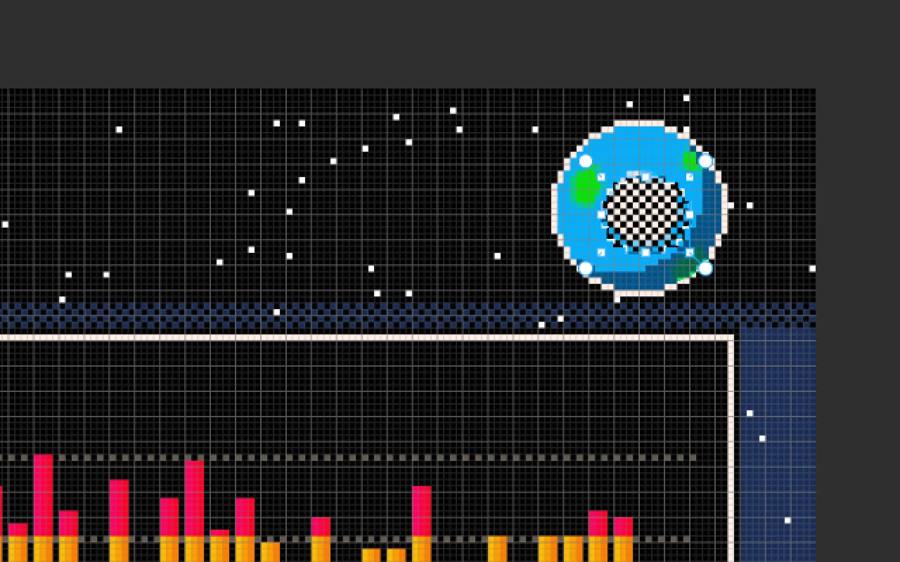

The hole should look thin, not solid, so draw it with the checker.

1. Add a layer named `Ozone Hole`. Make a stencil of an oval over Antarctica, from about `1648, 104` to `1752, 208`, and Magic Wand it.
2. **Fill with Pattern** using Pattern 1, the checker.
3. Deselect and add a **Color Overlay** in pink `#FF77A8`.

Half the cells are pink and half let Antarctica through. That's how 8-bit games drew see-through things.

## Rotate copies of the sun's rays

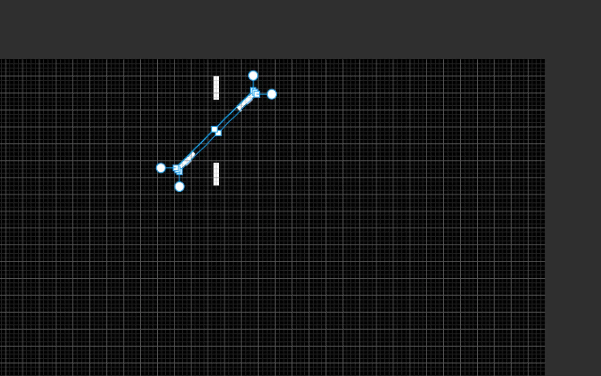

Add a layer named `Rays`. Turn off **Snap** for this step. You want 10 px bars centred on the sun's axis, which the grid won't allow, and that thin source is what turns the diagonals into neat single-cell staircases later.

1. Add a black `Stencil` layer. Draw two thin white bars, about 10 px wide and 44 px long: one above the sun's centre at `1296, 136`, running from `32` to `76`, and one below it, from `196` to `240`.
2. With the bars still selected, press [[Cmd+C]], then [[Cmd+V]]. The copy pastes in place on a new layer, selected, with the **Move** tool active.
3. Drag the round rotate handle just outside the top-right corner. Hold **Cmd** to snap the angle, and stop at **45°**. Deselect.
4. Paste twice more, rotating one copy to **90°** and the other to **135°**.
5. Choose **Layer → Merge Down** three times to merge the copies into the stencil.

Turn **Snap** back on.

## Snap the rays to the grid

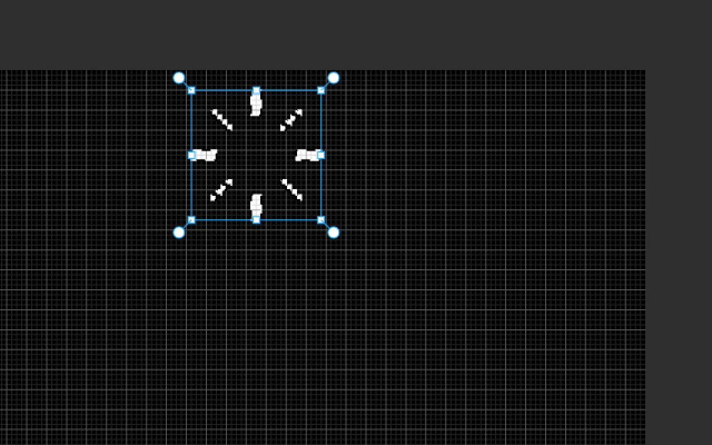

Finish the stencil as usual: **Pixelate** `8`, **Threshold** `128`, then Magic Wand one ray with **Contiguous** off, so all eight are selected. Delete the stencil.

The straight rays come out two cells thick. The diagonals become single-cell staircases, the classic pixel-art 45° line. Fill the selection orange `#FFA300` on `Rays`.

## Light the sun and fire the UV

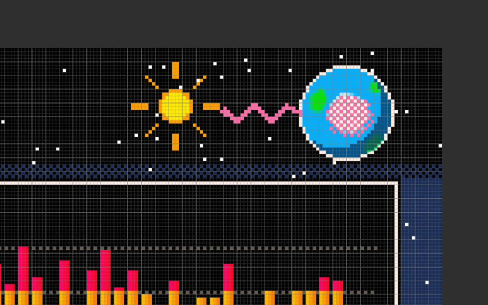

1. Add a layer named `Sun`. Stencil a circle of radius `40` at `1296, 136` and fill it orange. Then stencil a circle of radius `32` at the same centre and fill it yellow `#FFEC27`. This leaves an orange rim one cell wide.
2. Add a layer named `UV` and a black `Stencil` layer. Pick the **Pencil** at **Size** `10` in white. Click at `1408, 144`, just past the sun's right ray. Then **Shift**-click `1440, 172`, `1480, 132`, `1520, 172`, `1556, 136` and finally the Earth's rim at `1588, 152`. Each **Shift**-click draws a straight line from the last point, so you get a zig-zag about 40 px tall.
3. **Pixelate**, **Threshold** and Magic Wand it. Delete the stencil, and fill the zig-zag pink.

Pink is saved for the bad things: the hole and the UV that gets through it.

## Draw the penguin

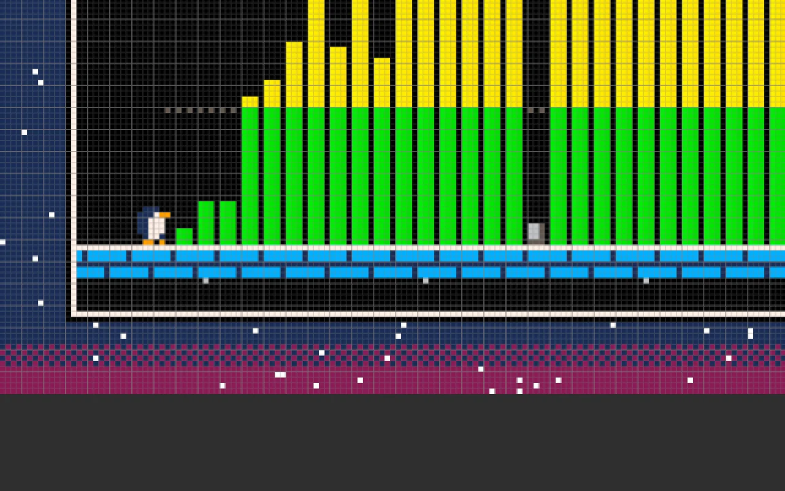

The player character stands at the start of the level, on the floor just left of 1979. Add a layer named `Penguin`. It's 6 cells wide and 7 tall, with its top-left corner at `200, 1008`, so its feet touch the snow at `1064`.

Here's the sprite, row by row from the top. `N` is navy `#1D2B53`, `W` is snow, `O` is orange and `.` is empty:

1. `.NNN..`
2. `NNNWOO`
3. `NNWWW.`
4. `NNWWW.`
5. `NNWWW.`
6. `.NWWN.`
7. `.OO.O.`

Draw one colour at a time: Shift-select all of its cells, then fill. The single snow cell in row 2 is the eye.

The penguin faces right, toward the data.

## Mark the story points

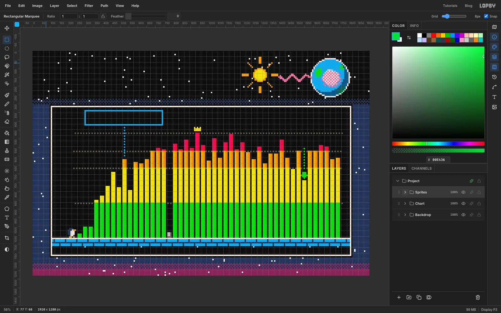

Add each of these on its own layer inside `Sprites`:

1. **Protocol Marker**. A dotted leader in sky blue: Shift-select one cell every 16 px at `520`, from `432` down to `600`. Fill it. It runs from the dialog box down to the top of the 1987 bar.
2. **Callout**. A dialog box from `296, 336` to `744, 424`. Fill it black, then make a one-cell ring inside its edge (select it, **Alt**-drag one cell in) and fill the ring sky blue.
3. **Crown**. On the 2000 record bar, a crown 5 cells wide starting at `920, 432`. The top row is cells 1, 3 and 5, with two full rows under it. Fill it yellow. It sits one cell above the bar, clear of the 30 line.
4. **Low Arrow**. Over 2019's dip, a down arrow 5 cells wide at `1528, 688`. The rows are `.XXX.`, `.XXX.`, `XXXXX`, `.XXX.`, `..X..`. Add a dotted leader above it at `1544`, from `552` to `680`. Fill both green. Green means good news here.

Collapse `Sprites`.

## Set the title in Press Start 2P

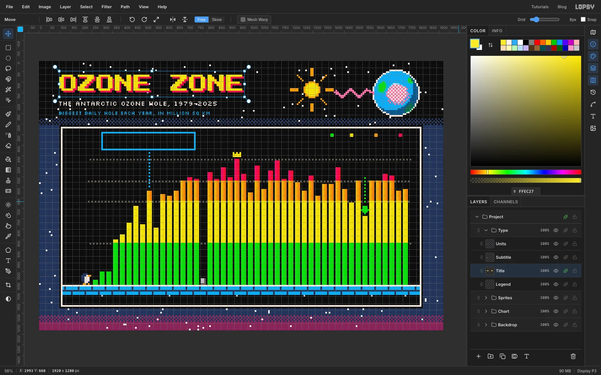

Select `Sprites`, click **New Group** and name it `Type`. Turn **Snap** off for all the type steps, so the arrow keys nudge 1 px at a time.

Inside `Type`, add a layer named `Legend`. Draw four 16 px squares in a row at the top right of the window, with their tops at `344`, in the four band colours. They start at x `1384`, `1476`, `1592` and `1708`, which leaves room for each label and ends the row at `1768`.

Create text from the bottom up, so a click never lands on an existing line. Click the **Legend** layer before each new text: if a text layer is selected, changing the font restyles that layer instead.

1. **Text** tool, **Silkscreen**, **Size** `24`, sky blue. Click at the left margin about `240` down and type `BIGGEST DAILY HOLE EACH YEAR, IN MILLION SQ KM`. Its letters should start at y `240`.
2. **Silkscreen** `32` in snow: `THE ANTARCTIC OZONE HOLE, 1979-2025`, with its top at `192`.
3. **Press Start 2P** `88` in yellow: `OZONE ZONE`, with its top at `64`.

Lopsy names each text layer after its text. Rename them (`Units`, `Subtitle`, `Title` and so on) to keep the panel readable.

Line up each line's left edge with the window's left edge at `96`, using the arrow keys with the **Move** tool. Then give the title a **Drop Shadow**: colour red `#FF004D`, **Offset X** and **Y** `8`, **Blur** `0`, **Opacity** `100`. One hard cell of shadow, like an arcade marquee.

## Clear the stars off the type

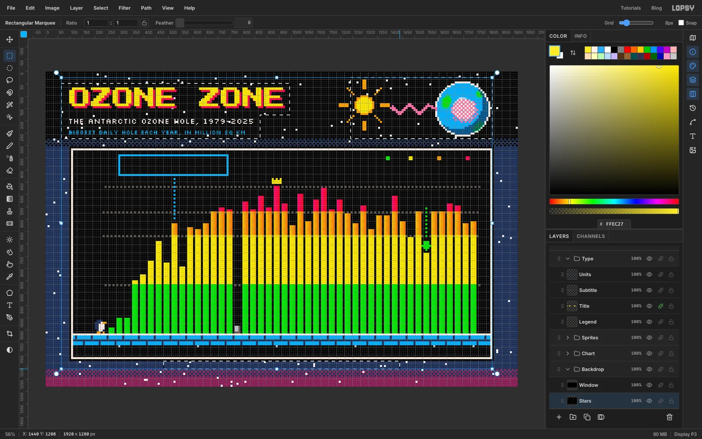

A star touching a letter reads as punctuation. "SQ KM" can turn into "SQ.KM". Expand `Backdrop` and select `Stars`. Draw a marquee over the title block, then **Shift**-add rectangles over the subtitle lines, the sun-and-Earth area, and the strip under the window where the source line will go. Press **Delete**, deselect and collapse `Backdrop`.

## Label the chart

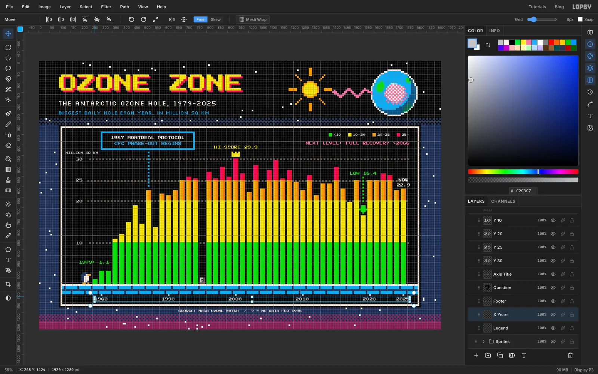

Everything inside the window is **Press Start 2P**, at size `16` unless noted. Every letter is exactly as wide as the font size, which makes spacing easy to work out. Centre each label on whatever it describes, nudging it into place with the arrow keys.

- The dialog box, `16` px. Write `CFC PHASE-OUT BEGINS` in sky blue, and above it `1987 MONTREAL PROTOCOL` in snow. Centre both on the box (x `520`), with the same space above and below the pair.
- `NEXT LEVEL: FULL RECOVERY ~2066` in pink, under the legend, with its right edge at `1768`, where the gridlines end. Make the legend labels (`<10`, `10-20`, `20-25`, `25+`) at size `12` in silver, each one cell after its square, ending at the same edge.
- `HI-SCORE 29.9` in yellow over the crown, `LOW 16.4` in green over its leader, and `1979: 1.1` in green over the first bar.
- Two lines over the 2025 bar: `NOW` and `22.9` in snow, centred on the bar.
- Axis numbers `10`, `20`, `25` and `30` in silver, right-aligned at `208` and centred on their gridlines, plus `MILLION SQ KM` at size `12` above the 30.
- The years in one line: `1980`, 16 spaces, `1990`, 16 spaces, `2000`, 16 spaces, `2010`, 16 spaces, `2020`, 6 spaces, `2025`. Start it at `268` under the floor. Because every character is 16 px, each year lands centred over its tick.
- A black `?` centred on the grey block, and the source line centred under the window in snow at size `12`: `SOURCE: NASA OZONE WATCH  /  ? = NO DATA FOR 1995`.

Size `12` is a compromise. It fits in tight spots but doesn't fall on whole font pixels, so keep it to these small notes.

## Knock out the gridline behind NOW

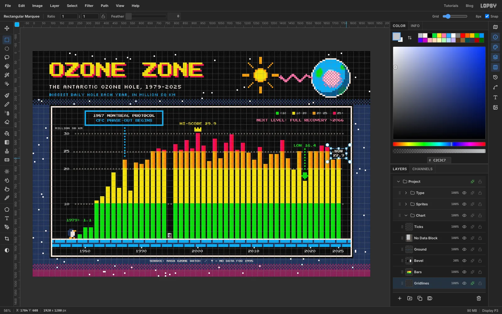

The 25 line runs right through `NOW`. Expand `Chart`, select `Gridlines`, draw a marquee around the label and press **Delete**. Leaving a gap in a gridline for a label is normal practice in data viz.

## Finish with soft scanlines

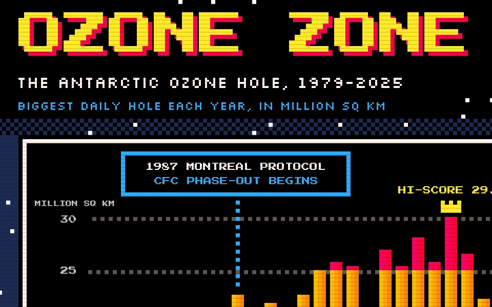

Last, a nod to the CRT television these games ran on.

1. Select `Type`, click **New Group** and name it `CRT`. Add a layer named `Scanlines`.
2. With **Snap** off, fill a 2 px strip black at the bottom of an 8 × 8 tile in the top-left corner (`0, 6` to `8, 8`). Select the 8 × 8 square and **Define Pattern**, then delete the tile.
3. **Select → All** and fill with the new pattern.
4. Set the layer to **Multiply** at `12%`.

Every pixel row now has a slightly darker bottom edge, like a TV's scanlines. At 12% the colours barely shift. A heavier setting, or a smooth radial vignette, would wash the whole poster in in-between colours, and it would stop looking 8-bit.

Turn off the grid with **View → Show Grid**, save the project with **File → Save Project** and export with **File → Quick Export PNG**.
