80s chrome lettering is a trick of reflection. The top of each letter
mirrors a blue sky, a hard dark line marks the horizon, and the bottom
mirrors warm desert ground. In this tutorial you'll use that one gradient
again and again to make **Unicorn Inauguration**, a 1200 × 1680 party
invitation. The chrome shows up on the medallion ring, the unicorn's head,
the block title and the frame.

You'll draw the unicorn with the Lasso and fill it through a selection. You'll
fade a sunburst and a synthwave grid with layer masks. The block title is
rasterized, filled through its own alpha selection and given a bevel. A cyan
neon script is rotated across it as live text. At the end you'll copy, scale
and rotate a star glint, then do a critique pass that re-seats the script and
rebalances the emblem.

The palette:

- Night ground `#0A0712`, violet glow `#4A1A63`, ray violet `#9A6CC8`
- Chrome: `#1C2B63` → `#86B9F2` → `#F2FAFF` | horizon `#2A1A12` → `#A0602E` → `#F4C58E` → `#FFF6E8`
- Gold horn: `#5A3208` → `#E8B04A` → `#FFF6D0` | `#6A3A0C` → `#D89A3A` → `#FFE9A8`
- Mane violet `#3A1466` → `#B86CF0` → `#F2D0FF` → white
- Neon cyan `#5CF4FF`, hot pink `#FF3FB4` / `#FF4FC0`, ink `#140B22`
- Type: gold `#F4C58E`, lavender `#C9B6FF`, cream `#F2E6D6`

## Lay down a dark violet ground

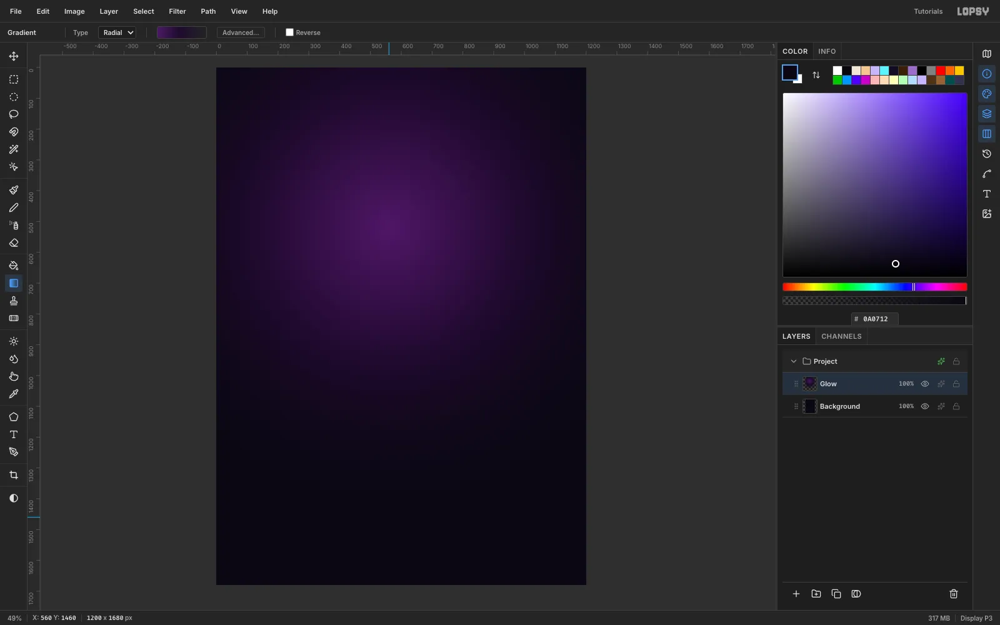

Choose **File → New**, enter **1200 × 1680** with **Unit: Pixels**, and click
**Create**. Click the **Background** row, set the foreground to `#0A0712` and
choose **Edit → Fill** with nothing selected.

Rename **Layer 1** to **Glow**. Pick the **Gradient** tool, set **Type** to
**Radial** and open **Advanced…**. Make three stops: `#4A1A63` at 0,
`#1E0B2E` at 45% and `#0A0712` at 100% with its opacity at 0. Drag from
**(560, 520)** straight down to about **(560, 1460)**. The emblem will sit at
(560, 520), so the light comes from behind it.

## Cut a sunburst with the Lasso

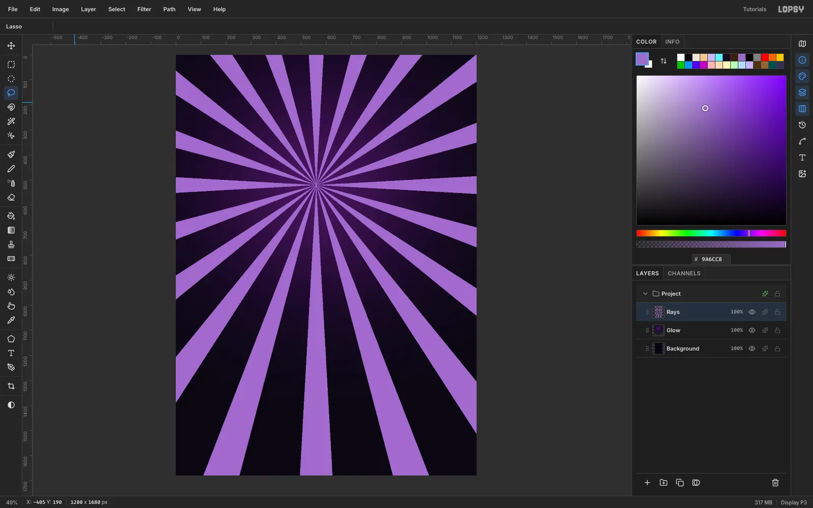

Add a layer named **Rays** and set the foreground to `#9A6CC8`. With the
**Lasso** (L), draw a thin triangle that starts at **(560, 520)** and ends well
past the canvas edge, then **Edit → Fill**. Repeat every 18° to make 20 rays,
each about 6° wide. The Lasso replaces the selection each time, so fill each
wedge before you draw the next one.

## Fade the rays with a layer mask

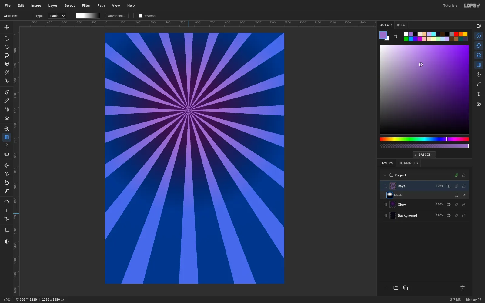

With **Rays** active, click **Add Mask** in the Layers footer, then click the
**Mask** row to edit it. The blue overlay shows the parts that will be
hidden. Choose a **Radial** gradient with stops white at 0, white at 30% and
black at 100%, and drag from **(560, 520)** to **(560, 1210)**. A mask hides
pixels without erasing them, so you can re-drag it as often as you like.

## Lower the rays' opacity

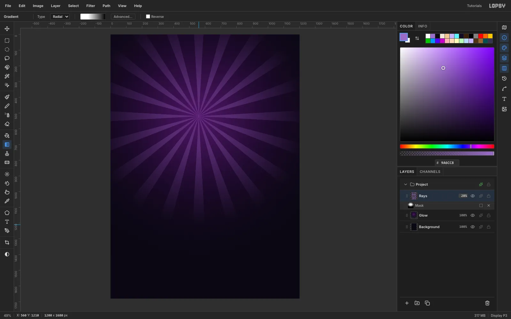

Click the **Rays** row to leave mask editing. Then open the row's opacity
control and set it to **28%**. Rays at full strength fight with everything
you'll put on top of them. At 28% they add energy without drawing the eye.

## Make the chrome ring

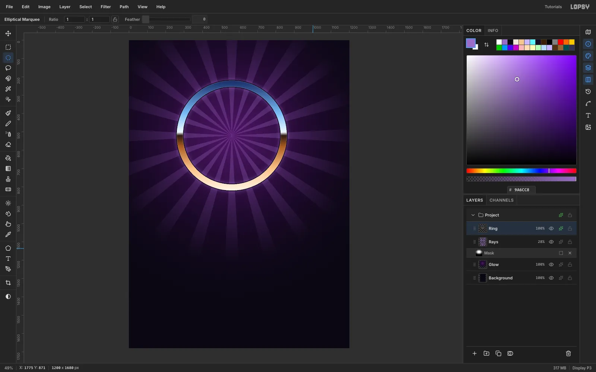

This gradient is the heart of the whole piece. Add a layer named **Ring**.
With the **Elliptical Marquee**, drag a circle from **(260, 220)** to
**(860, 820)**. Choose a **Linear** gradient with these stops:

- `#1C2B63` at 0 and `#86B9F2` at 30% (the sky)
- `#F2FAFF` at 47% (the bright line just above the horizon)
- `#2A1A12` at 50% (the horizon itself)
- `#A0602E` at 60%, `#F4C58E` at 80% and `#FFF6E8` at 100% (the ground)

Drag it from the top of the circle to the bottom. Then select a smaller
circle from **(294, 254)** to **(826, 786)** and press **Delete**, which
leaves a 34 px band.

Open the layer's effects and turn on three of them:

- **Stroke:** `#140B22`, Width 4
- **Inner Glow:** white, Size 5, Opacity 70 (this is the bevel)
- **Outer Glow:** `#C08CFF`, Size 40, Opacity 55

## Draw the unicorn's head

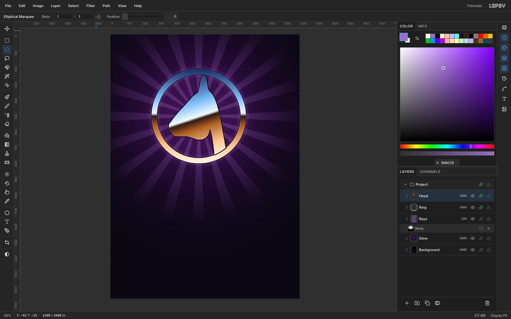

Add a layer named **Head**. With the **Lasso**, trace a horse head in profile
facing left. Place the muzzle near **(375, 580)**, the ear tip near
**(592, 258)** and the neck running down past the bottom of the ring. Horse
heads read best when you exaggerate three things:

- a deep, round jowl under the cheek
- a throat that curves in behind the jowl
- a neck much narrower than the head is long

Fill the selection with the same chrome gradient, but drag it at an angle
from **(470, 280)** to **(640, 800)**. The diagonal horizon makes the head
look like a curved metal surface instead of a striped flag. To trim the neck
to the ring, select the circle **(296, 256)–(824, 784)**, choose
**Select → Inverse** and press **Delete**. Give the head a `#140B22`
**Stroke** of 5 and a white **Inner Glow** of 6.

## Add a flowing S-curve mane

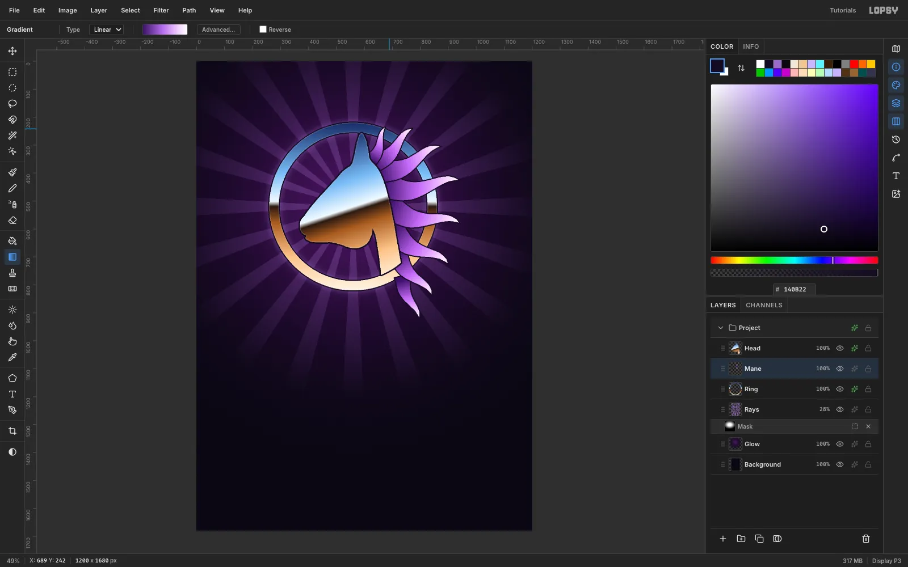

Click **Ring**, then add a layer named **Mane**. New layers go directly above
the active one, so the mane sits between the ring and the head. For each
lock, work in this order:

1. Lasso a tapering S-shaped flame that starts on the crest of the neck and
   flows right.
2. Fill it with `#140B22`.
3. Choose **Select → Shrink… 3 px**.
4. Drag a linear gradient from the root to the tip: `#3A1466`, `#B86CF0`,
   `#F2D0FF`, white.

Shrinking before the gradient leaves a clean ink outline on every lock. Draw
the bottom lock first and work upward, so each lock overlaps the one below.
Vary their widths (56–100 px) and lengths, and let a few cross the ring. That
overlap is what makes the emblem feel 3D.

## Add a spiral gold horn

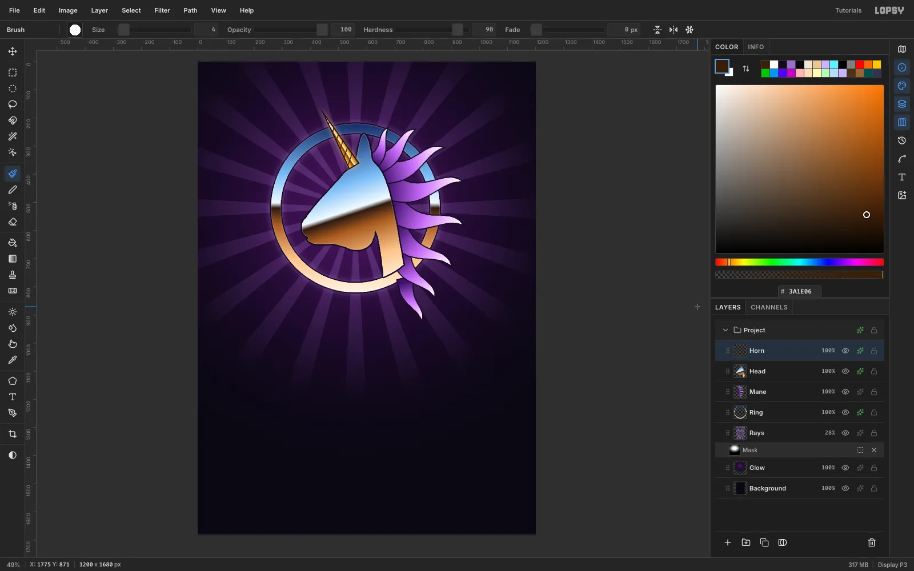

Add a **Horn** layer above **Head**. Lasso a narrow cone from the forehead at
**(556, 372)** to a tip at **(436, 166)**, about 42 px wide at the base. Fill
it with ink and shrink it by 3 px, as you did for the mane. Then drag the
gold gradient *across* the cone, from one side of the base to the other.

Keep the cone selected so the brush can't paint outside it. With a 4 px
`#3A1E06` **Brush**, draw seven grooves slanted along the horn; slanting them
is what reads as a spiral. Deselect, then add an **Outer Glow** of `#FFD27A`,
Size 22.

## Finish the face and group the emblem

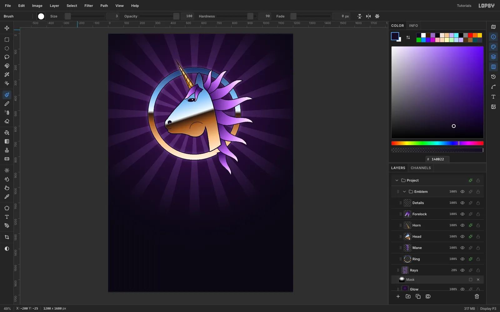

Add a **Forelock** layer and paint two short mane locks falling forward over
the horn base, using the same fill, shrink and gradient method. Then add a
**Details** layer:

- an ink almond eye with a white highlight dot
- a 3 px lid line above the eye
- a flared comma-shaped nostril
- a short mouth curve

Click **Ring**, **Shift**-click **Details**, choose **Layer → Group Layers**
and rename the group **Emblem**. The stacking order inside the group stays as
it was.

## Rule a synthwave grid floor

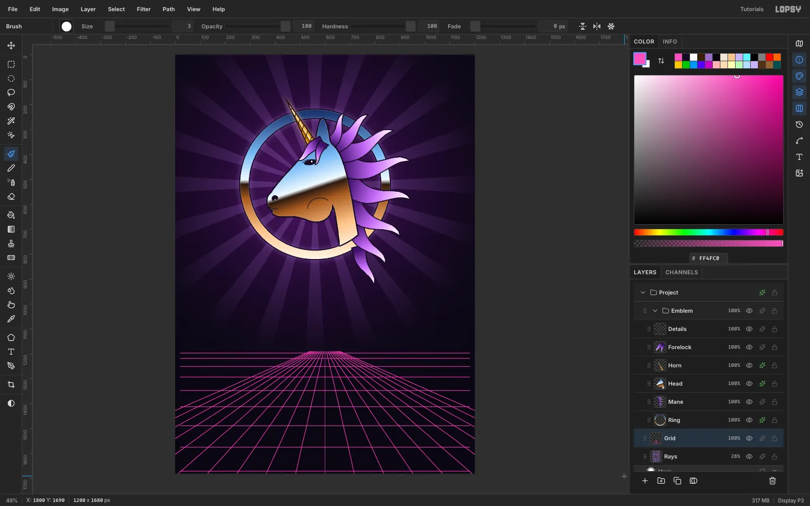

Click **Rays** and add a layer named **Grid**. With a 3 px `#FF4FC0` brush at
Hardness 100, draw nine horizontal lines. The first sits on the horizon at
**y = 1190**, and the gaps grow toward the bottom
(y = 1190 + 480 × (k/9)^1.9). Then draw 21 lines from points near
**(600, 1190)** to x = 600 ± 120 px steps along the bottom edge. The
widening gaps are what make the floor feel like it runs toward you.

## Fade the grid and light the horizon

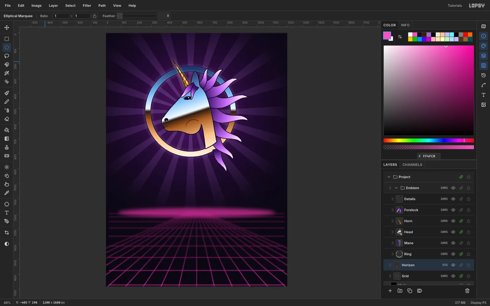

Add a mask to **Grid**, click it, and drag a **Linear** gradient from black
at **y = 1190** through dark grey at 55% to white at the bottom (y = 1660).
Give the grid a hot-pink **Outer Glow** (`#FF3FB4`, Size 10) and set its
opacity to **50%**.

Next add a **Horizon** layer. Set the Elliptical Marquee's **Feather** to 24,
select **(80, 1160)–(1120, 1220)** and fill it with `#FF4FC0`. Set Feather back
to 0 when you're done.

## Set the block title

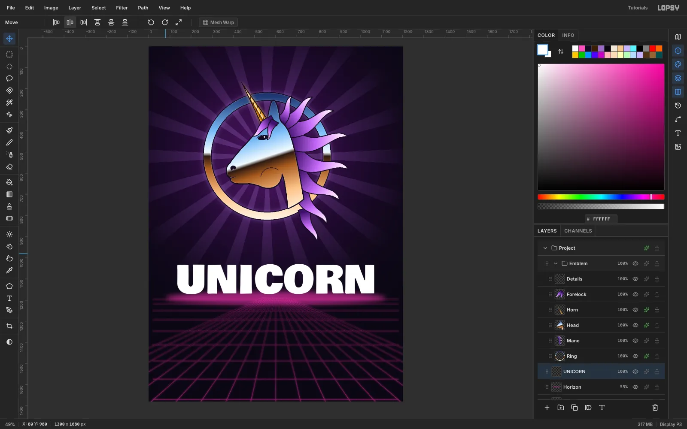

Click the **Horizon** row so the new type is created above it, not inside the
Emblem group. Pick the **Text** tool, choose **Bowlby One**, set Size to
**182** and click in empty canvas to type `UNICORN`. Press **Tab** to commit.
Switch to the **Move** tool and click **Align center horizontally**. Chrome
needs heavy, flat-sided letters, and Bowlby One has almost no counters to
break the reflection.

## Fill the title with chrome

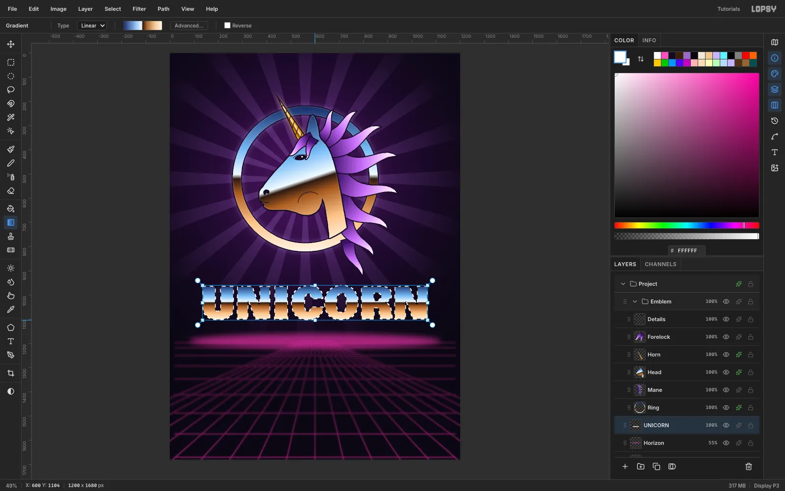

Click **Rasterize Layer** in the Layers footer and drag the title so its cap
tops sit at **y = 960**. **⌘-click** the layer's thumbnail to select its
letter shapes. Then drag the chrome gradient from the top of the caps
(**y = 960**) to the bottom (**y = 1104**). Because the gradient spans only
the cap height, the horizon lands at mid-letter on every glyph.

## Bevel and glow the title

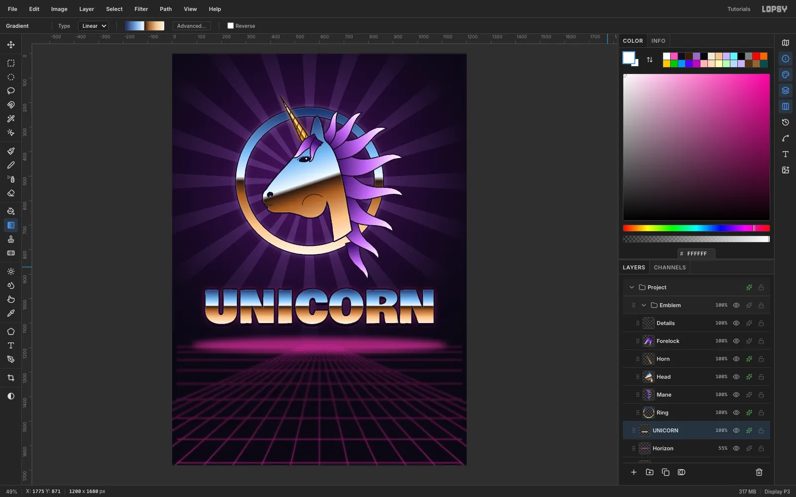

Press **⌘D** and open the title's effects:

- **Stroke:** `#140B22`, Width 6
- **Inner Glow:** white, Size 4, Opacity 75 (a thin polished edge)
- **Drop Shadow:** `#05030A`, Offset Y 10, Blur 0
- **Outer Glow:** `#FF3FB4`, Size 34, Opacity 55

The hard, unblurred shadow gives the letters thickness.

## Rotate the neon script

Set the text tool to **Yellowtail**, Size **140**, color `#5CF4FF`. Click in
empty space, type `Inauguration` and press **Tab**. Use the **Move** tool to
drag it across the lower part of UNICORN, then press **⌘D**.

Draw a **Rectangular Marquee** just around the script, switch back to
**Move**, and drag the rotate handle (the crosshair just off the top-right
corner) up by **6°**. Press **⌘D** to commit. The text stays live and
editable after rotating.

## Make the script glow like neon tube

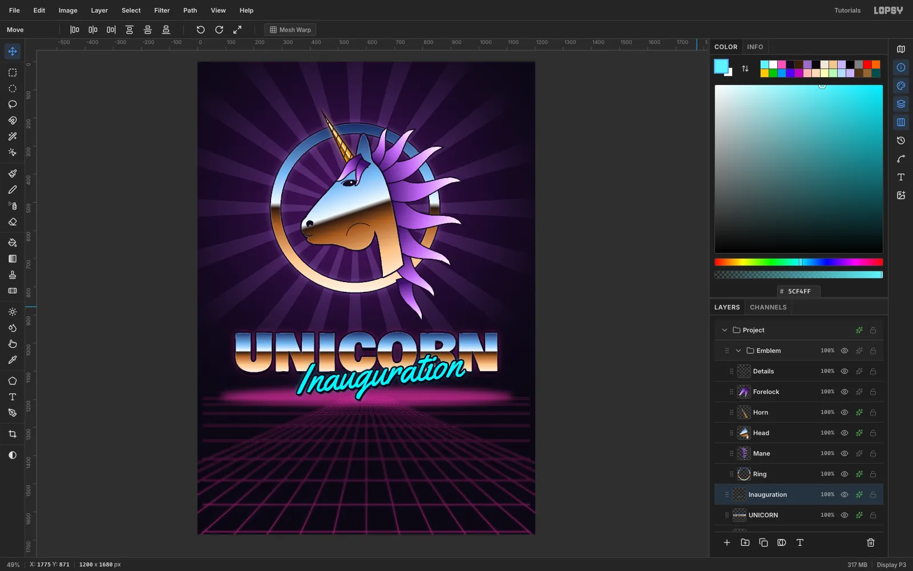

Open the script's effects:

- **Stroke:** `#0B0716`, Width 5
- **Outer Glow:** `#39E6FF`, Size 26, Opacity 80
- **Drop Shadow:** Offset 4, 8 and Blur 4

The dark stroke matters. Without it, the cyan glow bleeds straight into the
bright chrome and neither one reads.

## Add a chrome double frame

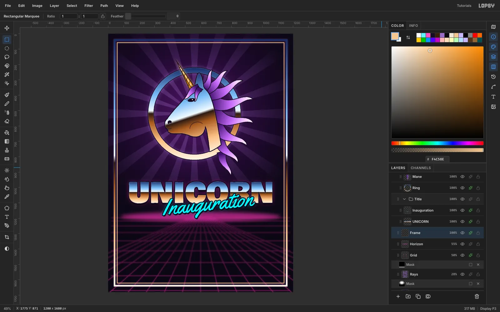

Click **Horizon** and add a **Frame** layer:

1. Select **(36, 36)** with size **1128 × 1608**, and drag the chrome gradient
   from the top edge to the bottom edge.
2. Select **(46, 46)**, 1108 × 1588, and press **Delete**. That leaves a
   10 px band.
3. Select **(56, 56)**, 1088 × 1568, fill it with `#F4C58E`, then select
   **(60, 60)**, 1080 × 1560, and press **Delete**. That makes the gold inner
   line.

Finish with a soft `#C08CFF` **Outer Glow** (Size 12).

## Set the invitation details

Build the details block from the bottom up, clicking **Frame** before each new
text layer so earlier type isn't restyled. Center each line with
**Align center horizontally**.

- **Michroma** 20, cream: `YOU ARE CORDIALLY INVITED TO THE`
- **Marcellus** 52, gold: `Saturday, the 14th of November · 8 pm`
- **Michroma** 22, lavender: `THE GLASS STABLE · 9 MERCURY LANE`
- **Michroma** 20: `BLACK TIE · GLITTER HORNS OPTIONAL`
- **Michroma** 18, cream: `KINDLY RSVP BY THE FIRST OF NOVEMBER`

The date is the only large, warm line, so it leads. Give each line a small
dark **Drop Shadow** (Offset Y 3, Blur 6) so it stays legible over the grid.
Group the five lines as **Info**.

## Add star glints, Bloom and grain

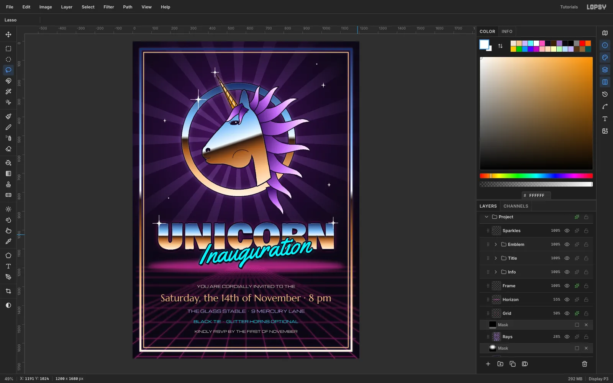

Add a **Sparkles** layer and Lasso thin four-point stars in white. Put them
on the *corners* of the chrome: the U's top-left, the N's top-right, the
ring's upper-left rim and the horn tip. Add a few tiny ones in the sky. A
glint in the middle of a letter face looks like a smudge. On a corner it
looks like light catching an edge.

Run **Filter → Bloom** (Threshold 40, Radius 24, Intensity 160). Collapse the
groups and drag **Sparkles** to the top of the stack. Finally, click
**Background** and run **Filter → Add Noise** at **4, Mono** to add a little
print grain.

## Copy and scale a glint

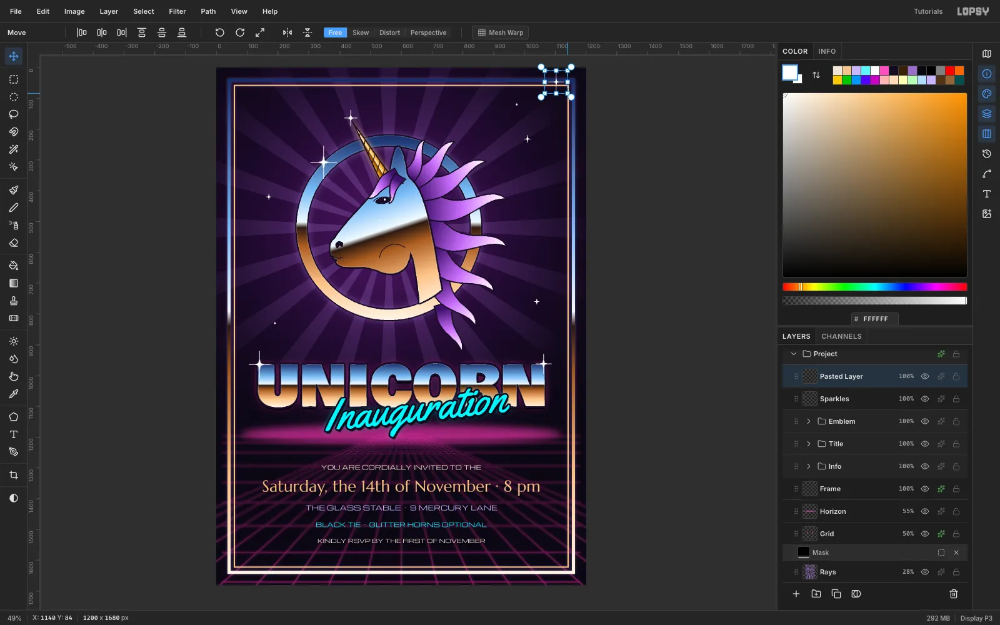

Marquee the big ring glint, press **⌘C** and then **⌘V**. The paste lands on
a new layer in place. With the **Move** tool, drag it to the top-right frame
corner and press **⌘D**. Marquee around it again and **⌘-drag** a corner
handle inward to scale it to about 60%. Holding ⌘ keeps the scale uniform.
Press **⌘D** to commit.

## Rotate it into an X

Marquee the scaled glint again and drag the rotate handle through **45°**. The
plus-shaped star turns into an X, which sits naturally on a mitered frame
corner. Press **⌘D**. Copy this glint, paste it and drag it to the
bottom-left corner. Then choose **Layer → Merge Down** twice to fold both
copies into **Sparkles**.

## Soften and clip the grid

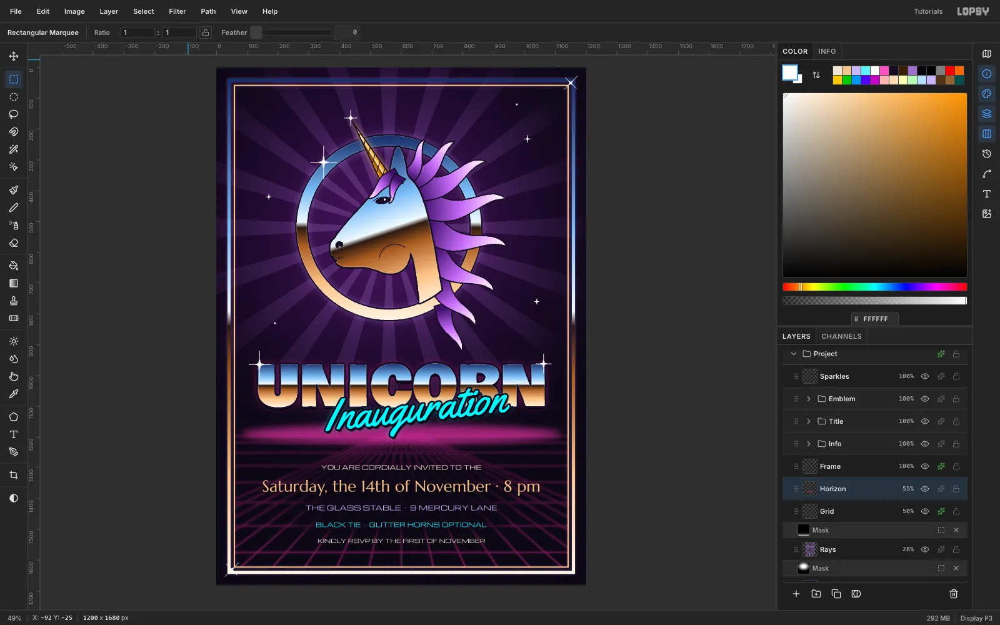

On **Grid**, take the **Eraser** at Size **260** and Opacity **45**, and make
one pass across the middle of the details block. Reset the Opacity to 100
afterwards.

Then select **(58, 58)** with size **1084 × 1564**, choose
**Select → Inverse** and press **Delete**. Do the same on **Horizon**. The
grid should never run outside the frame.

## Re-seat the script and add a scrim

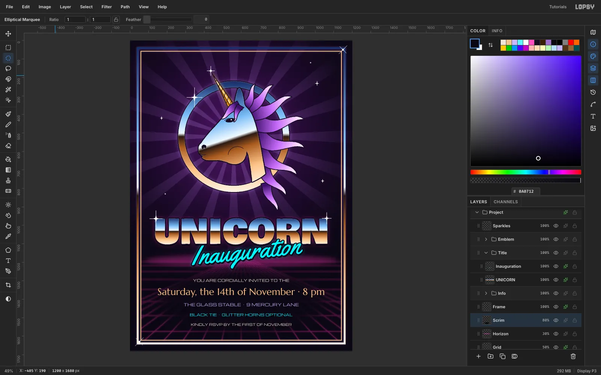

Step back and critique. The script covered too much of CORN, and its
descenders stacked on the horizon glow.

1. Expand **Title**, click **Inauguration**, and drag it about **35 px down and
   20 px left**. It should now cross only the bottom of the capitals.
2. Set **Horizon** to **30%**.
3. Click **Horizon**, add a **Scrim** layer, and set the Elliptical Marquee's
   **Feather** to **70**.
4. Fill the oval **(150, 1250)–(1050, 1590)** with `#0A0712` and set the layer
   to 80%.

The grid now fades out behind the text instead of ruling lines through it.

## Tighten the mane and soften the head's chrome

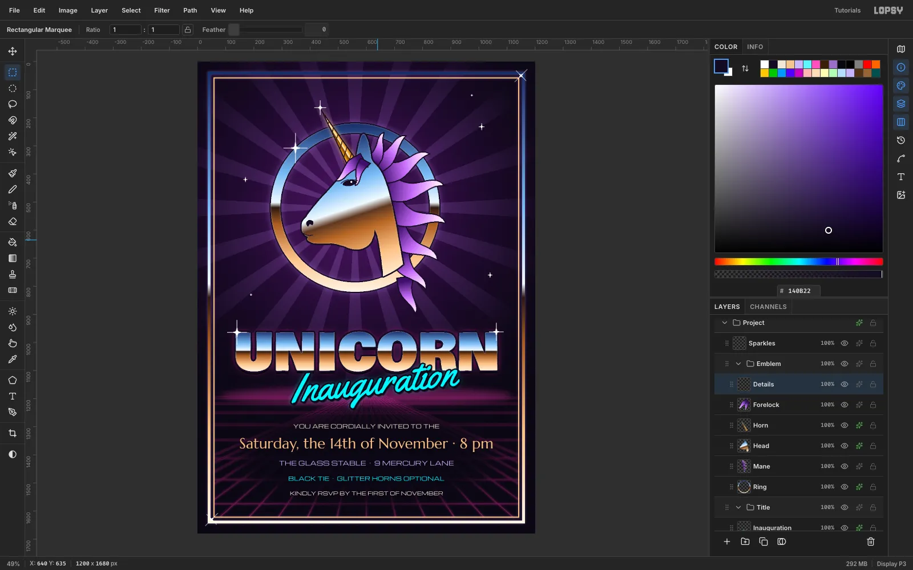

The emblem was right-heavy: the ring starts at x = 260 but the mane reached
x = 940. To fix it:

1. Clear the **Mane** layer with a rectangle and **Delete**, then redraw the
   locks about **50 px shorter**.
2. **⌘-click** the **Head** thumbnail and redrag the diagonal gradient with a
   softer horizon: white at 46%, `#5A3A26` at 52%, `#B06E36` at 62%. A thin,
   soft reflection reads as polished metal. A thick black band reads as a
   stripe.
3. Delete the lone cheek line from **Details**.

## Demote the dress code

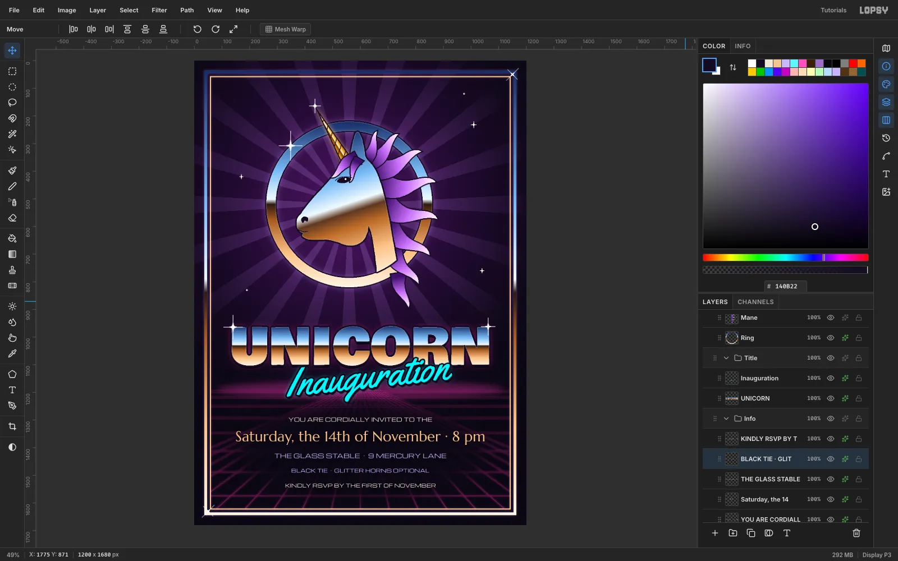

Click the **BLACK TIE** row and, with the Text tool, set its Size to **18**.
Center it again, then give it a `#C9B6FF` **Color Overlay**. Now the gold date
is the only warm, dominant line in the details, and the cyan belongs to the
neon script alone.

Choose **File → Quick Export PNG** for the invitation and
**File → Save Project** to keep every layer, mask and live text layer
editable.
