In the 1950s, the painters of the New York School and the bebop players
shared the same downtown bars, and a lot of jazz records went out in
abstract expressionist sleeves. This tutorial paints one for an invented
record, **Gravel Lullaby** by the Odile Marsh Quintet. It mixes two kinds of
abstract expressionism:

- Mark Rothko's soft, glowing **colour fields**, stacked one above the other
- Franz Kline's huge **black brush beams**, painted with a house-painter's brush that's running out of paint

Most of the work is making paint look like paint. Clean digital strokes
look wrong in this style, so you'll build a ragged bristle brush and let
every stroke end dry and broken.

Along the way you'll use:

- feathered marquees and the **Smudge** tool
- **Clouds**, **Add Noise**, **Motion Blur** and **Emboss**
- **Edit → Define Brush**, and the Brushes modal's angle dial, texture and Taper settings
- the Move tool's **rotate** handle
- a **layer mask** with a gradient
- the **Outer Glow** effect and the Soft Light, Overlay and Screen blend modes
- point text with letter spacing, positioned to the pixel

The palette is warm and dark, with one bright field:

- Oxblood ground `#4A1A1C`
- Cadmium orange `#D65A2A`, glow `#F0762E`
- Crimson `#9E2F2A`
- Lamp black `#15110F`
- Bone white `#EDE3CF`
- Ochre `#C28A3C`

## Start a square sleeve

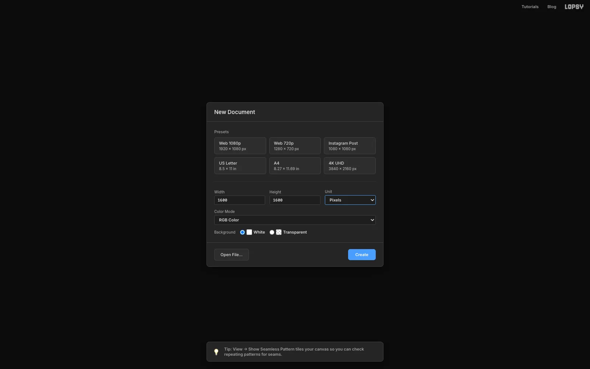

Album covers are square. Open [Lopsy](/) and press [[Cmd+N]] (or choose
**File → New**). Set **Width** and **Height** to `1600`, leave the
background on white, and click **Create**.

## Lay the oxblood ground and the guides

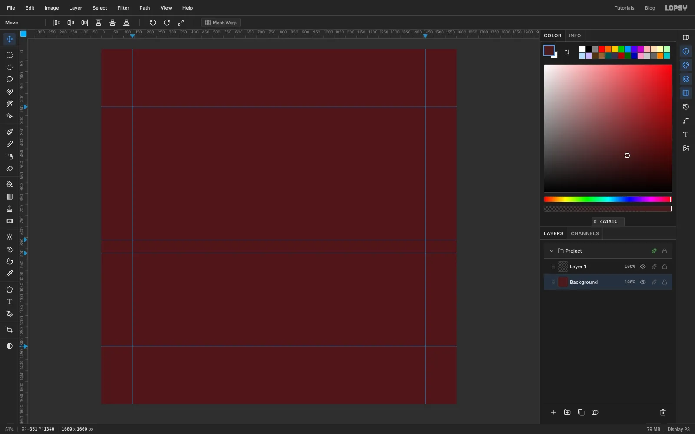

Click the **Background** layer. Type `4A1A1C` into the hex field of the
Color panel and choose **Edit → Fill**.

The layout is two stacked fields with a thin gap between them, and a
generous margin above and below for the type. Click the top ruler at
`140` and `1460` to drop two vertical guides. Then click the left ruler at
`260`, `860`, `920` and `1340` to drop four horizontal ones.

## Fill the orange field

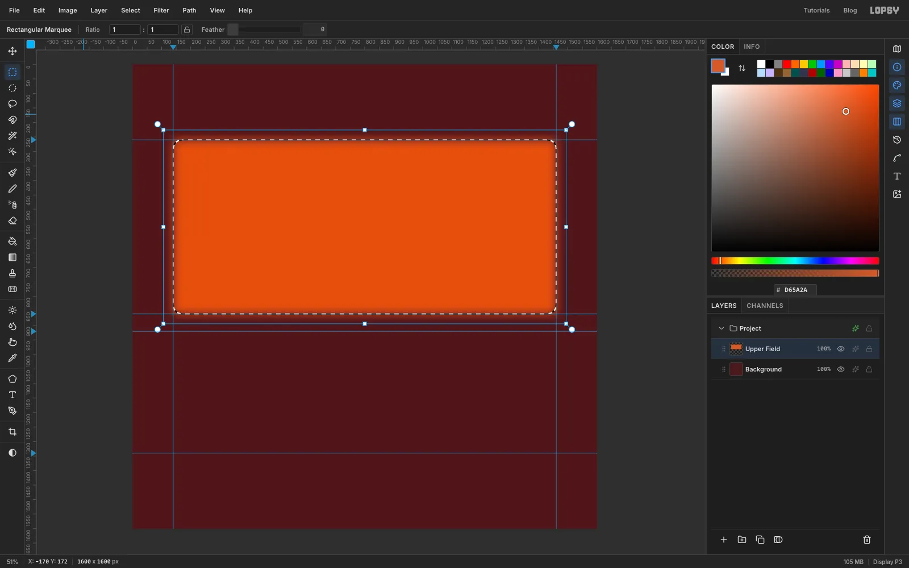

Double-click **Layer 1** and rename it `Upper Field`. Press [[M]] for the
**Rectangular Marquee** and drag from the top-left guide crossing
(`140, 260`) to the crossing at `1460, 860`. The marquee snaps to the
guides.

Choose **Select → Feather…**, set it to `34` and click **Apply**. Set the
foreground to `#D65A2A` and choose **Edit → Fill**. Press [[Cmd+D]] to
deselect.

## Fill the crimson field

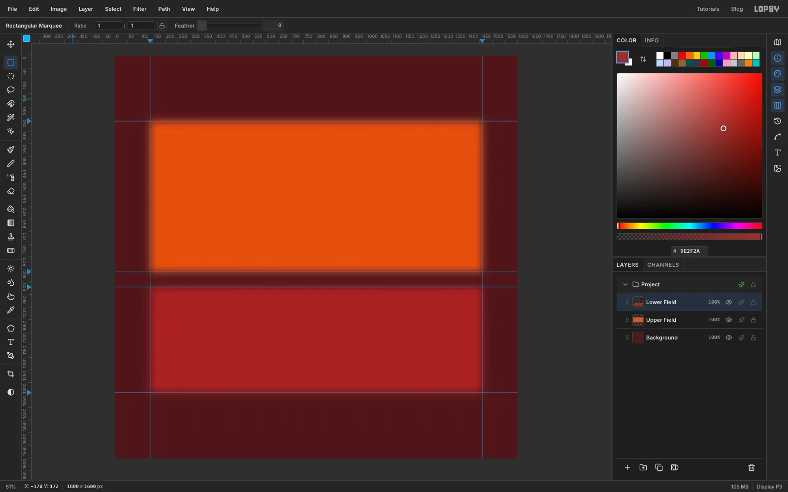

Click **Add Layer** at the bottom of the Layers panel and rename it
`Lower Field`. Marquee from `140, 920` to `1460, 1340`, feather it by `34`
again, and fill it with `#9E2F2A`. Deselect.

Rothko's fields are close in value and slightly blurred, so they seem to
hover. These two already do.

## Smudge the edges unevenly

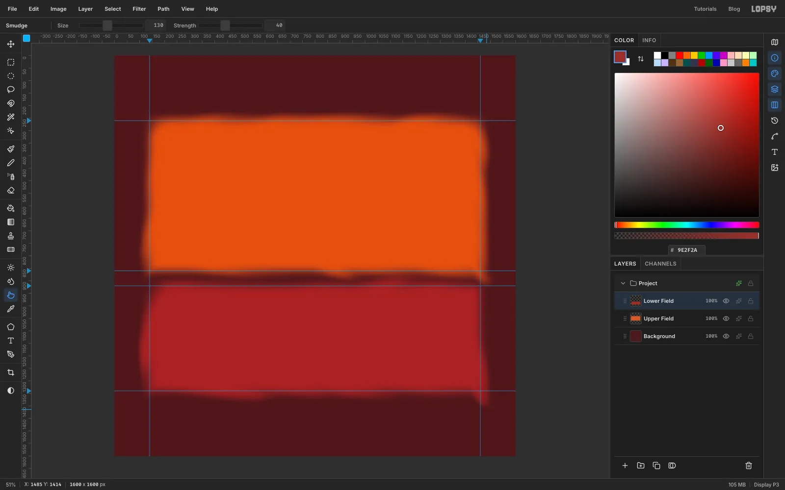

A feathered rectangle still looks machine-made. Press [[R]] for the
**Smudge** tool and set **Size** `130` and **Strength** `40`.

Select **Upper Field** and make slow, curved drags. Each one starts just
inside an edge and drifts 20 to 50 px out into the ground. Work your way
round the field, with the most drags along the top and right edges and
only a few on the left. Vary their length and spacing. Then do the same on
**Lower Field**, this time favouring the bottom edge. Uneven sides are what
make the field feel painted.

> **Tip:** Don't make short flicks at right angles to the edge. Evenly
> spaced flicks turn the edge into a postage-stamp scallop.

## Mottle the paint with Clouds

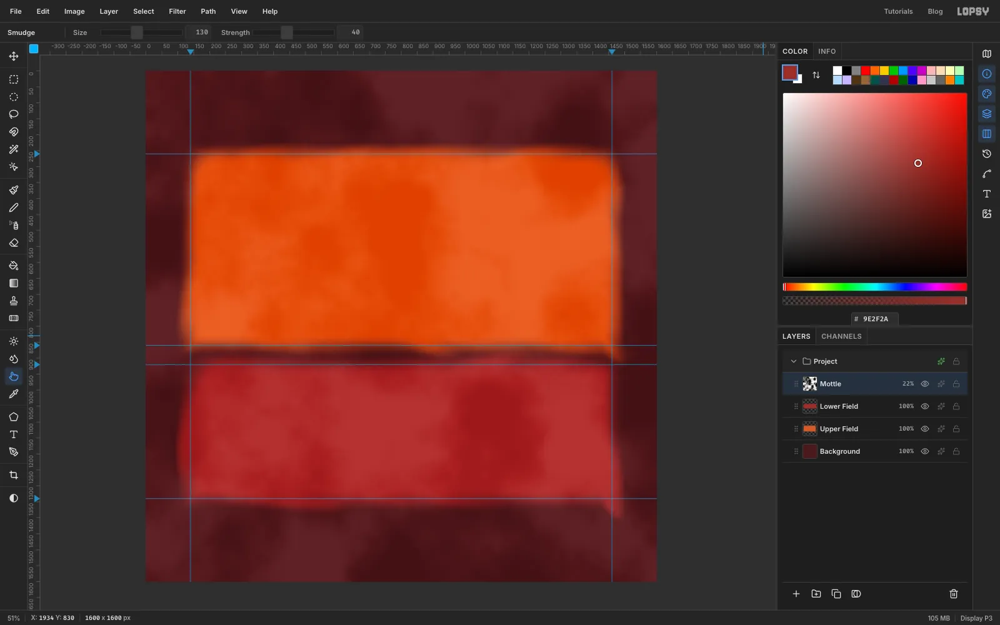

Add a layer named `Mottle` above the fields. Choose **Filter → Clouds…**,
set **Scale** to `6` and click **Apply**.

Open the layer's effects drawer with the ✦ button on its row, and set
**Blend** to **Soft Light**. Then click the layer's opacity readout
(`100%`) and drag the slider that opens to `22%`. The fields now look like
layers of thin stain.

## Build a dry bristle brush

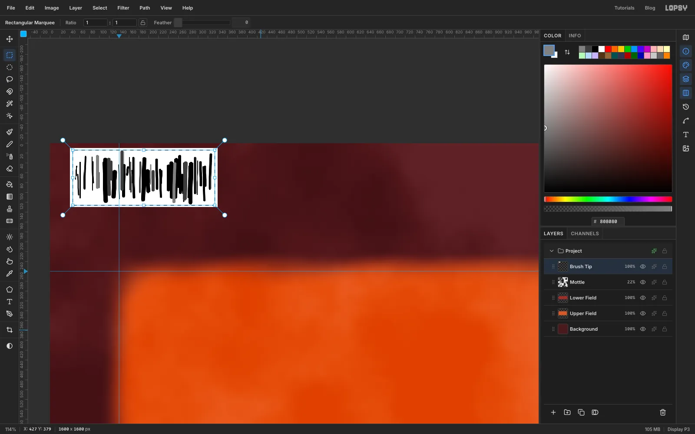

Kline worked with cheap, wide house-painter's brushes, which leave
separate bristle tracks. You'll make that tip yourself.

1. Add a layer named `Brush Tip`. Set the foreground to white. In the empty top-left corner of the canvas, marquee a box about 300 × 120 px, choose **Edit → Fill** and deselect.
2. Press [[B]] for the **Brush**. Click the brush thumbnail at the left of the options bar to open the **Brushes** modal and pick **Hard Round**.
3. Switch the foreground to black and draw about fifty short vertical ticks side by side across the box. Change the **Size** between `2` and `10` as you go, make some ticks three times longer than others, and leave small, uneven gaps.
4. Redo a few ticks in dark grey `#3C3C3C` and a few in `#808080`. Grey becomes partial coverage, like a bristle that's nearly dry.
5. Marquee round the ticks and choose **Edit → Define Brush…**. Name it `Dry Flat`.
6. Delete the **Brush Tip** layer with the trash button.

Define Brush turns dark pixels into paint, so the black ticks become
bristles. The uneven tick lengths are important, because they give every
stroke a ragged start and end.

## Dry-brush the field edges

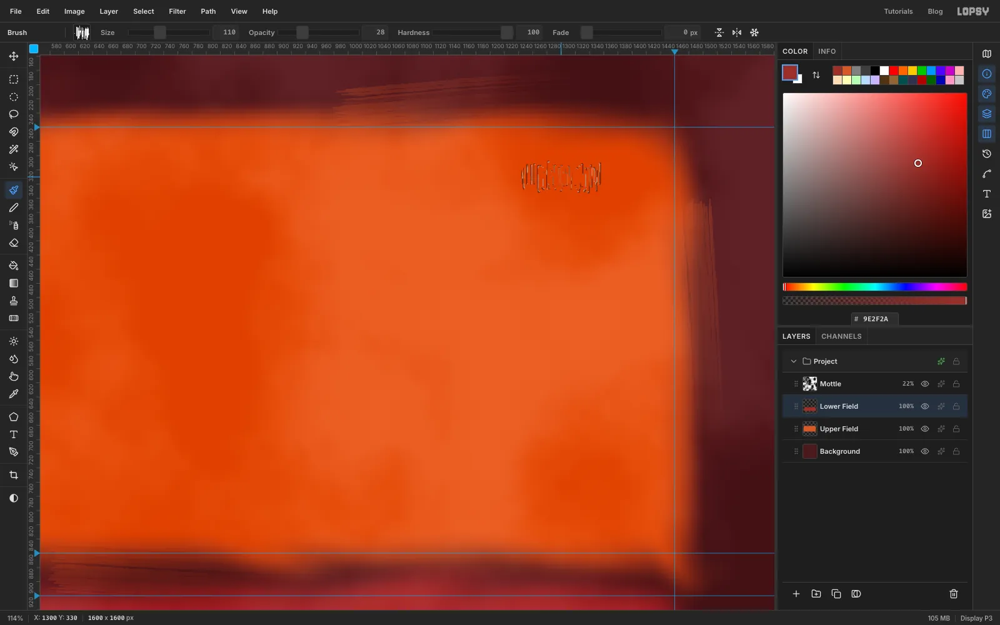

Open the Brushes modal again. **Dry Flat** is now the active tip.

- **Shape:** **Size** `120`, **Opacity** `28`
- **Dynamics:** **Opacity Jitter** `30`
- **Texture:** **Grain**

Set **Fade** in the options bar to `320`.

The tip is a horizontal row of bristles, so it leaves streaks when you
drag *across* the row. The **angle dial** on the Shape tab rotates it:

- `90°` for strokes that go left or right
- `0°` for strokes that go up or down (drop the **Size** to `110` for these)

Select **Upper Field** and set the foreground to `#D65A2A`. Brush two or
three short strokes along its top and bottom edges, half on the edge and
half off, and one up its right side.

Then select **Lower Field**, switch to `#9E2F2A` and do the same, with one
stroke up its left side. Set **Fade** back to `0` when you're done.

## Underpaint the creams

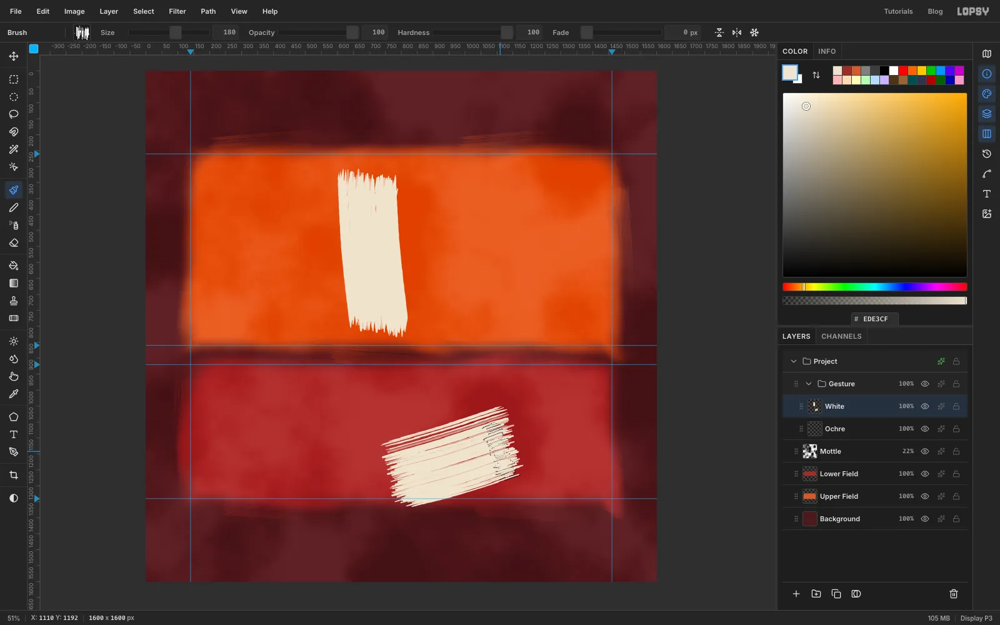

Kline's whites are as important as his blacks. Click **Mottle**, then
click **New Group** in the Layers panel and rename the group `Gesture`.
Inside it, add a layer named `Ochre` and then one named `White`.

On **White**, set the foreground to `#EDE3CF`. In the Brushes modal, set
**Size** `180`, **Opacity** `100`, **Opacity Jitter** `0` and **Texture**
to **No Texture**.

1. Set the angle to `8°`. In the orange field, a little left of centre, drag from just above the field's bottom edge up to near its top.
2. Set the angle to `14°` and go over it once more, slightly offset, so the bristles don't line up.
3. In the crimson field, set the angle to `75°` and drag a band that rises gently from the middle of the field to the right.
4. Set the angle to `70°` and add a second, slightly lower pass.

## Scumble a little ochre

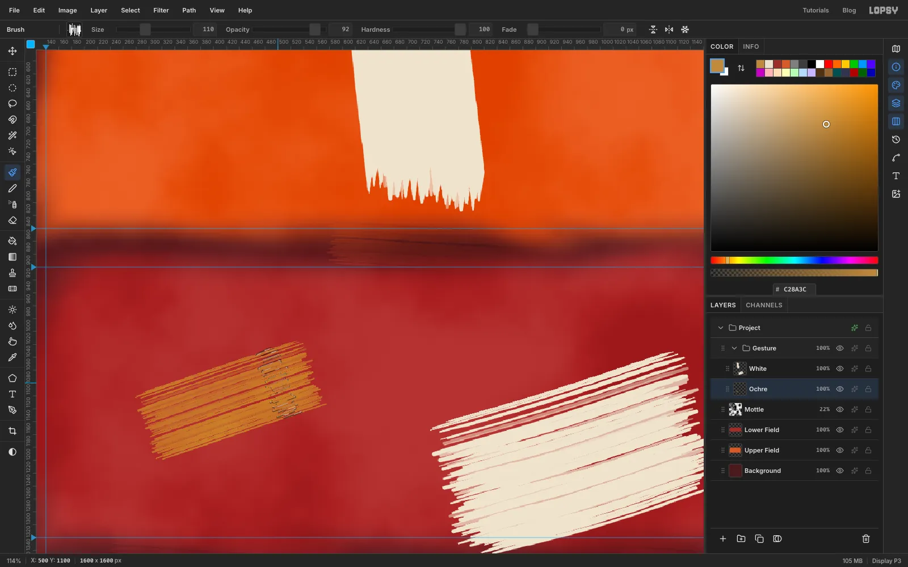

Click the **Ochre** layer and set the foreground to `#C28A3C`. Set the brush
to **Size** `110`, **Opacity** `92`, **Opacity Jitter** `15`, **Texture**
**Grain** and angle `70°`.

Make one short stroke, rising slightly, in the left third of the crimson
field. It's an accent, so keep it small.

## Paint the black beam

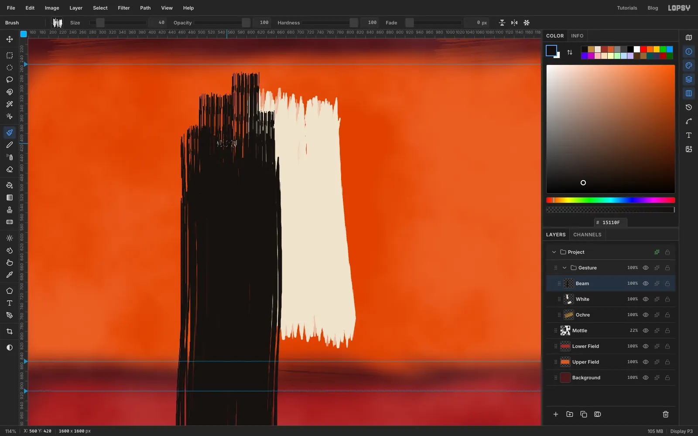

Click **White** and add a layer named `Beam` above it. Set the foreground
to `#15110F`. In the Brushes modal, set **Size** `190`, **Opacity** `100`,
**Opacity Jitter** `0`, **No Texture** and angle `0°`.

Start in the bottom margin, just left of the cream stroke, and drag
straight up until you're about 100 px below the top of the orange field.
Make two more passes, each slightly offset and with a slightly different
angle (`4°` and `357°`), and stop each one at a different height.

A loaded brush runs dry at the end of a stroke. To show that, use narrow
strokes that run out at different heights:

- Set the **Size** to `70` and drag from inside the beam up past its top.
- Do the same at **Size** `55`, `45` and `40`, at different places across the beam's width.

Each one should stop at a different height.

## Lean the beam off plumb

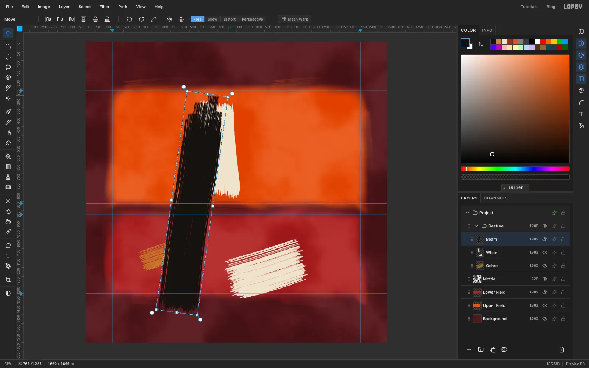

A perfectly upright beam crossed by an arm reads as a cross. Tilt it
instead:

1. Open the **View** menu and untick **Snap to Guides**. Otherwise the marquee's bottom edge snaps to the `1340` guide and leaves the bristle tips behind. Leave it off for the rest of the painting.
2. Press [[M]] and marquee round the whole beam, with a little room to spare.
3. Press [[V]] for the **Move** tool. Drag the round handle just outside the top-right corner clockwise, about 8°.
4. Press [[Cmd+D]] to commit.

## Add the arm

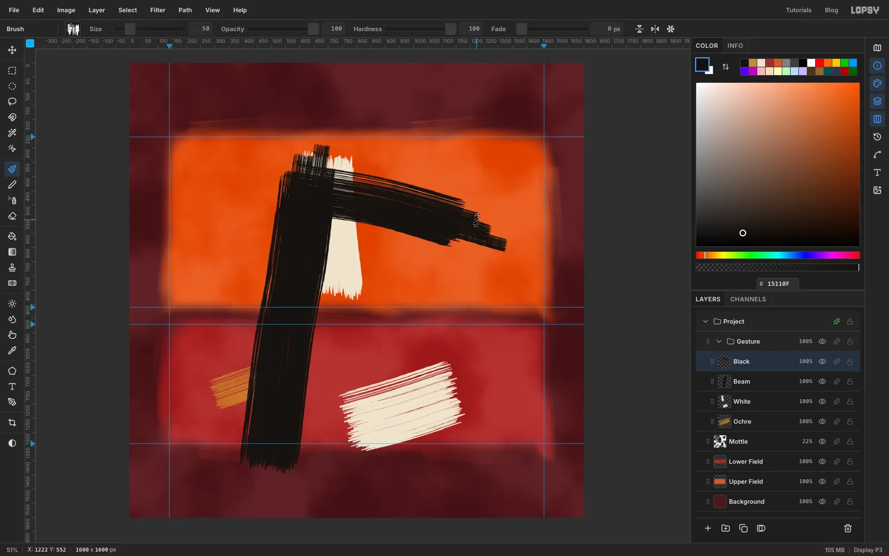

Click **Beam** and add a layer named `Black` above it. Press [[B]] and set
the brush to **Size** `150` and angle `100°`.

Start inside the upper part of the beam and drag right and slightly
downhill, until you're about 130 px short of the right-hand guide. Then:

1. Make a second pass at **Size** `125` and `97°`, a little lower.
2. Finish with three narrow strokes (**Size** `60`, `45` and `50`) that carry on past the end and stop at different lengths.

Letting the arm grow out of the beam, rather than crossing it, is what
keeps the shape abstract.

## Throw a counter-diagonal

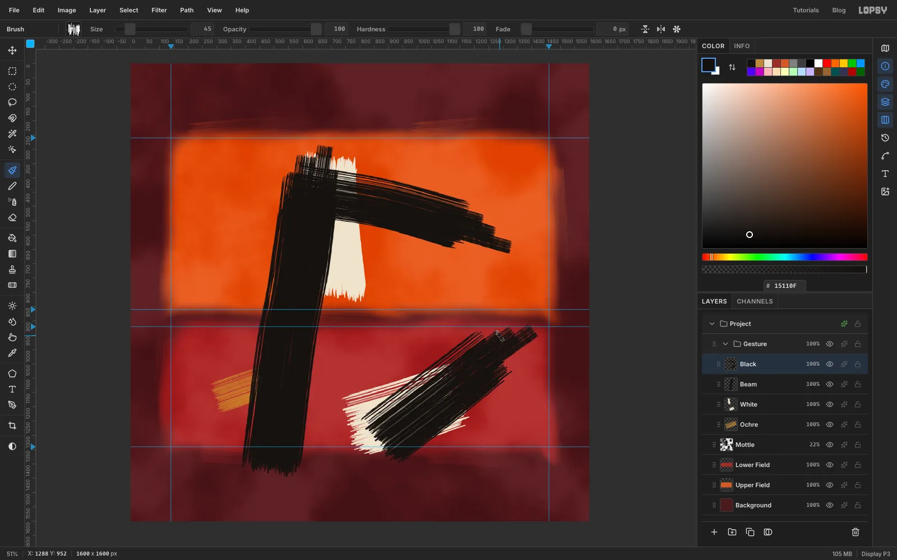

Stay on **Black**. Set **Size** `190` and angle `53°`. In the crimson
field, start below the cream band and drag up and to the right, ending
near the field's top-right corner.

Add a second pass at **Size** `165` and `49°`. Then add three narrow
strokes at **Size** `70`, `55` and `45` that run out towards the top-right
corner. The diagonal pushes against the beam and stops the picture from
feeling static.

## Push cream back over the black

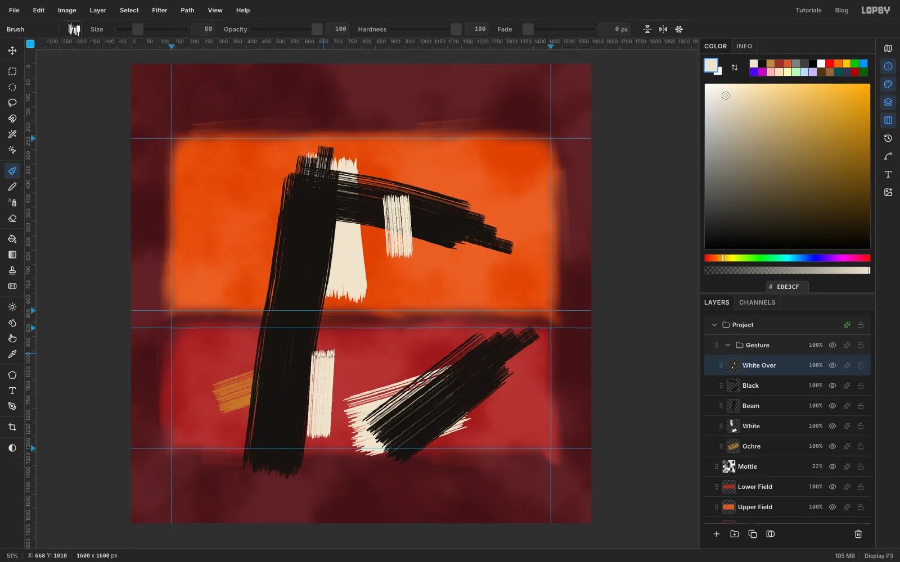

Kline painted white back over his blacks, so the edges fight. Add a layer
named `White Over` above **Black**. Set the foreground to `#EDE3CF`,
**Size** `90` and angle `0°`.

1. Drag a short stroke straight up across the arm, about halfway along it.
2. At **Size** `80` and `355°`, drag a second one up beside the lower right edge of the beam.

You'll tilt both of these later, once the rest is in place.

## Fade a stroke with a mask

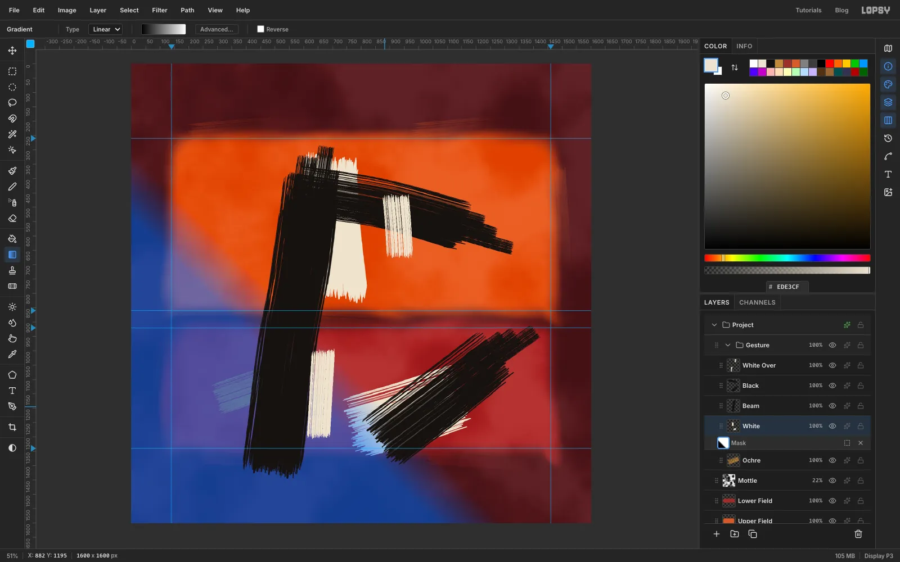

The lower cream band starts with a blunt end. Click **White**, then click
**Add Mask** at the bottom of the Layers panel. Click the new mask
thumbnail to edit the mask.

Choose the **Gradient** tool from the toolbox. Its default runs from black
to white. Drag a short diagonal, up and to the right, across the band's
left tip. Black hides, so the tip fades out. The blue overlay shows what's
hidden.

> **Tip:** A gradient on a mask ignores any active selection. It always
> covers the whole mask, so drag in a direction where the black end only
> reaches the part you want to hide.

Click the **White** row to leave mask editing.

## Let a few drips run

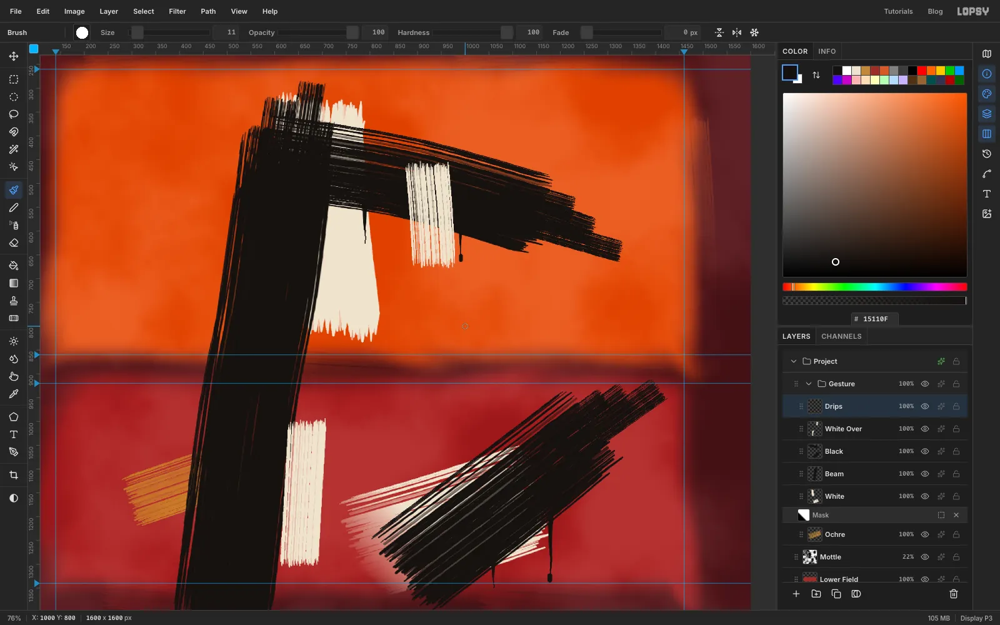

Click **White Over**, then add a layer named `Drips`. Choose the **Brush**
with **Hard Round**, and set the foreground back to lamp black `#15110F`.
Each drip is a single wobbly drag straight down from just inside a black
edge.

- In the Brushes modal, set **Size** between `9` and `12`.
- Set **Taper** to a little more than the drip's length, so it narrows to a point.

Make one or two from the underside of the arm and two from the bottom edge
of the diagonal, between 50 and 120 px long. On two of them, set **Taper**
back to `0` and add a tiny 10 px drag at the end for a bead.

> **Tip:** Keep the drips short. A long drip hanging from the arm makes the
> whole shape read as a gallows.

## Throw a few splats

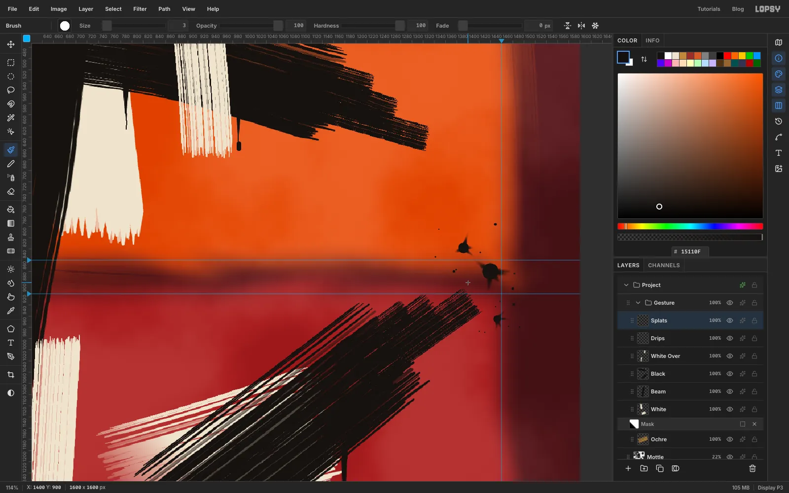

Add a layer named `Splats`. Click once with the **Hard Round** brush at
**Size** `30`, just beyond the top-right end of the diagonal.

Switch to **Smudge** at **Size** `14` and **Strength** `80`. Drag four or
five short spikes outward from the dot's centre. Then go back to the brush
at **Size** `3` to `6` and click a few flecks around it. Make two smaller
splats (sizes `20` and `14`) nearby.

## Give the splats a direction

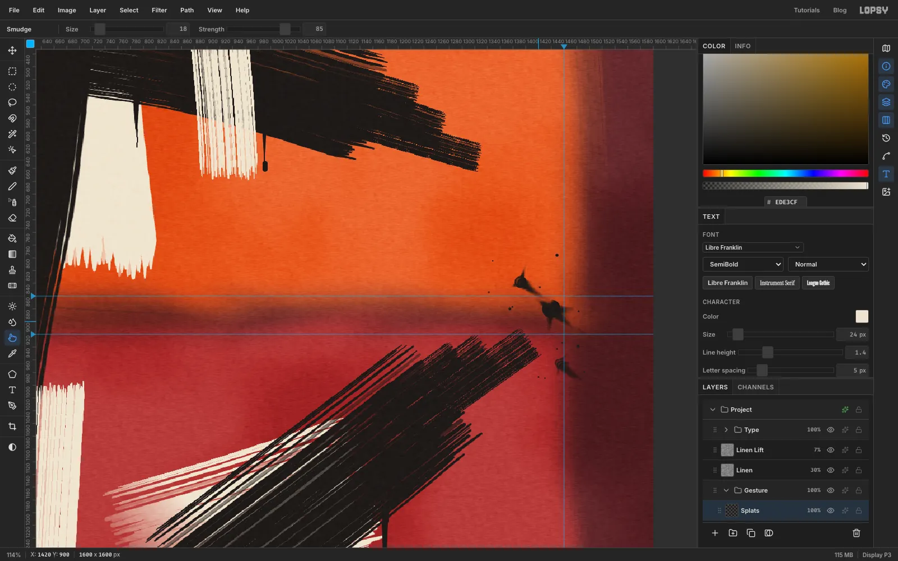

Step back and look at the whole painting. A few marks still look stamped,
and the splats are the first: they're too round. Choose **Smudge** at
**Size** `18` and **Strength** `85`. Drag one long tail out of each splat,
down and to the right, as if the paint was flung from the upper left.

## Tilt the cream boxes

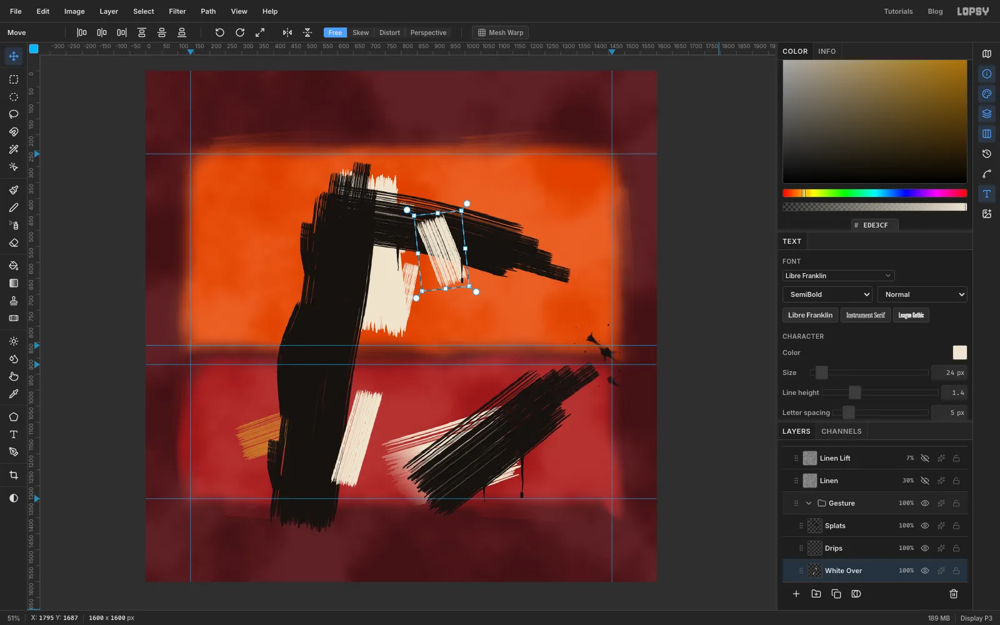

The two creams on **White Over** stand perfectly upright and read as
boxes. Select **White Over**, press [[M]] and marquee round the cream on
the arm. With the **Move** tool, drag the rotate handle about 11°
anticlockwise and press [[Cmd+D]]. Then marquee the cream beside the beam
and rotate it about 13° clockwise.

## Swell the beam

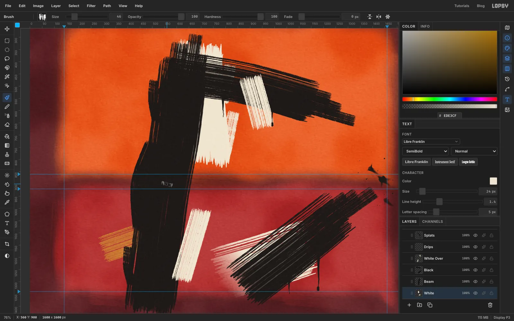

A beam with dead-straight sides still looks like a letter. Select
**Beam**, set the foreground to `#15110F` and choose the **Brush** with
**Dry Flat** at **Size** `90` and angle `8°`. Drag up along the beam's left
edge, bowing out about 20 px around the middle of the picture, as if you
leaned on the brush there. Go over it again at **Size** `50`.

Add two narrow stray tines (**Size** `36`) on the left edge, one high and
one low. Then select **White**, switch to `#EDE3CF`, and add two narrow
tines at **Size** `46` that stray past the right edge of the big cream.

## Make the orange field glow

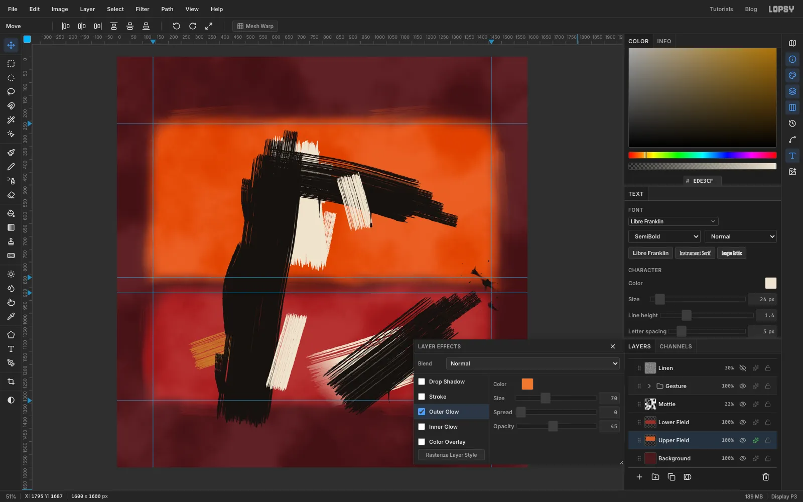

Rothko's fields seem lit from behind. Select **Upper Field**, open its
effects drawer and tick **Outer Glow**. Set the colour to `#F0762E`,
**Size** `70`, **Spread** `0` and **Opacity** `45`.

## Add a linen weave

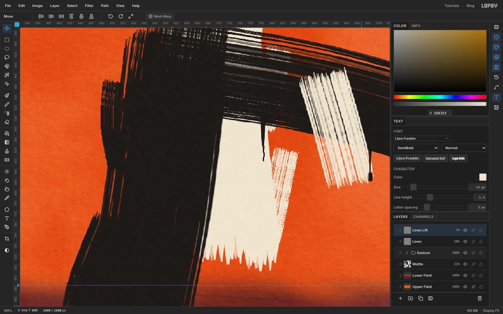

Collapse the **Gesture** group with its arrow, click its row and add a
layer named `Linen`. A new layer added while a collapsed group is selected
lands above it.

Set the foreground to `#808080` and choose **Edit → Fill** with nothing
selected. Then run these filters:

1. **Filter → Add Noise…**: **Amount** `100`, **Mono**, **Uniform**.
2. **Filter → Motion Blur…**: **Angle** `90`, **Distance** `5`.
3. **Add Noise** again: **Amount** `70`, **Mono**, **Uniform**.
4. **Motion Blur** again: **Angle** `0`, **Distance** `5`.
5. **Filter → Emboss…**: **Angle** `135`, **Strength** `40`.

The two noise-and-blur passes make crossing threads, and Emboss gives them
relief. Set the layer's blend to **Overlay** at `30%`.

Overlay doesn't change pure black, so choose **Layer → Duplicate Layer**.
Rename the copy `Linen Lift` and set it to **Screen** at `7%`. Now the
weave shows on the beams too.

## Set the title and artist

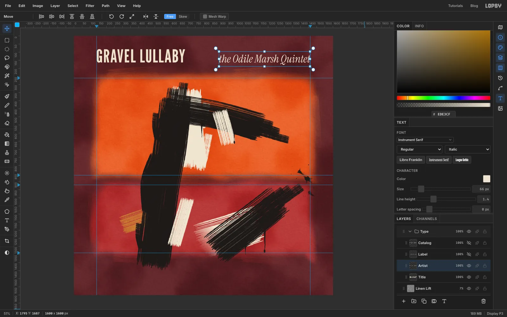

With **Linen Lift** selected, click **New Group** and rename it `Type`.

Changing font or size in the Text options restyles whichever text layer is
selected. So before each new piece of text, click **Add Layer** to select
an empty layer, and delete these helpers at the end.

1. Add an empty layer inside **Type**. Press [[T]] for the **Text** tool and pick **League Gothic** at **Size** `112`, with the foreground set to `#EDE3CF`.
2. Click in the top margin, type `GRAVEL LULLABY` and press [[Tab]] to commit.
3. In the Text panel, set **Letter spacing** to `3`.
4. With the **Move** tool and the arrow keys, put the left edge of the letters on the `140` guide and the cap tops 80 px from the top. The baseline lands at `164`.

Add another empty layer. Choose **Instrument Serif**, **Italic**, **Size**
`66`, and set **Letter spacing** back to `0` (the panel keeps the last
value). Type `the Odile Marsh Quintet`.

Nudge it until its right edge sits on the `1460` guide. Line up the bottom
of the lowercase "the" with the title's baseline, not the tail of the
**Q**, which hangs below the line.

## Set the label lines

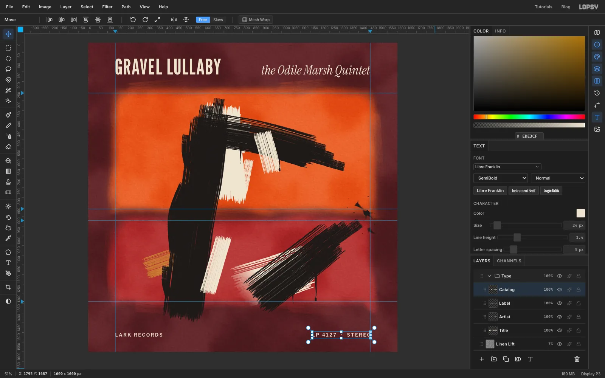

Add another empty layer and set **Libre Franklin**, **SemiBold**, **Size**
`24`, **Letter spacing** `5`. Type `LARK RECORDS` and put it on the left
guide with its baseline at `1520`. That's 80 px from the bottom, the same
margin as above the title.

Add one more empty layer and type `LP 4127  ·  STEREO`, right-aligned to
the `1460` guide on the same baseline. Delete the empty helper layers.

Choose **File → Quick Export PNG** for the finished sleeve and **File →
Save Project** to keep every layer, mask and effect editable.

For a whole series, keep the brush and the type layout and change the
fields. A blue-over-black sleeve with a single white beam would make a
good companion record.
