Small-town fair posters were set by hand. The printer used wood type, carved
cuts and two or three flat inks, then ran the sheet through a letterpress. That
look is worth copying because it comes from limits: flat colour, hard offset
shadows, halftone dots for shading, and ink that didn't quite cover.

In this tutorial you'll make a **1200 × 1800 px** flier for the fictional
*26th Annual Strawberry Festival*. Everything is drawn in Lopsy with lasso
shapes, marquees, filters and type. Nothing is imported.

The palette is four inks on cream paper:

- Paper `#F2E4C6`, cream ink `#F7ECD3`
- Navy `#1F2D52`, red `#C8272F`, shade red `#9E1B24`
- Mustard `#E9A825` and `#F3C65A`, seed gold `#F4D06A`, leaf green `#3F7F38`

Fonts: **Ultra** (the arched wood type), **Lobster** (the script),
**Alfa Slab One** and **Fjalla One** (the details).

## Set up the paper and guides

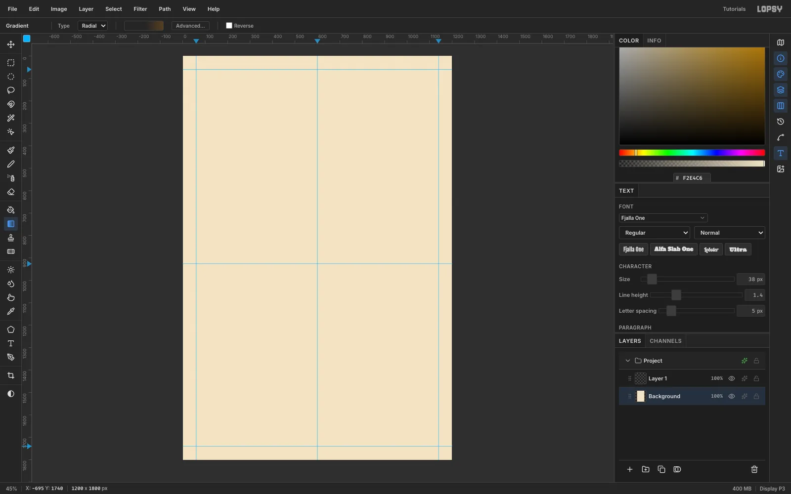

Choose **File → New**, set the unit to **Pixels**, and create a
**1200 × 1800** document with a white background.

1. Select **Background**, set the foreground to `#F2E4C6`, and choose **Edit → Fill**.
2. Choose **Filter → Add Noise…**, pick **Mono** and **Gaussian**, and set Amount **7**. This gives the paper a faint tooth.
3. Click the top ruler about 60 px in from each side, then [[Cmd]]-click ([[Ctrl]]-click) the middle of it to drop a guide exactly at the centre. On the left ruler, click about 60 px from the top and from the bottom, and once a little below halfway (the ruler readout says about 926).

That last guide marks the centre of the badge you'll build later.

## Rule a double frame

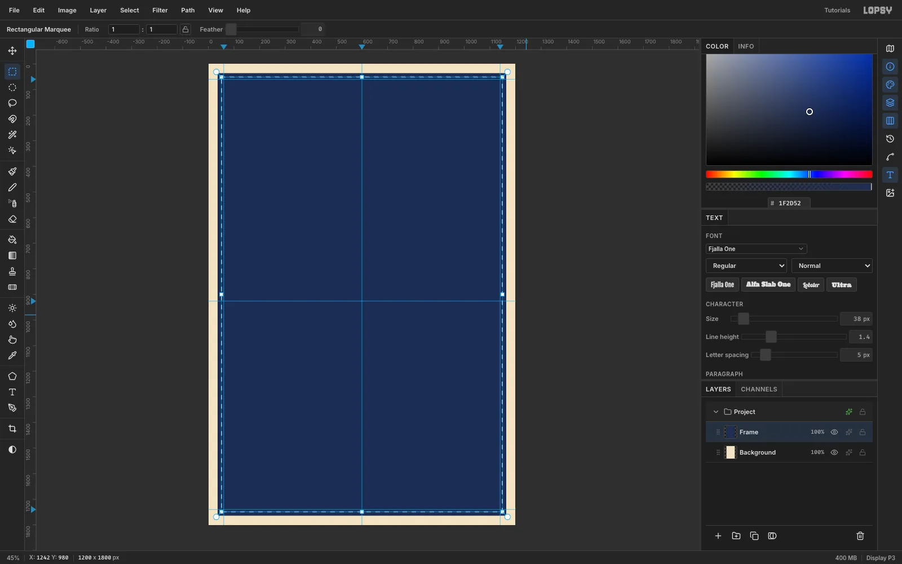

Rename **Layer 1** to *Frame* and set the foreground to navy `#1F2D52`.

1. With the **Rectangular Marquee**, drag a rectangle over almost the whole page, leaving a margin of about 36 px on every side, and choose **Edit → Fill**.
2. Choose **Select → Shrink…** and enter **14**, then press [[Delete]]. That leaves a 14 px border.
3. Press [[Cmd+D]], then do the same with a rectangle running along the four margin guides and a Shrink of **4**, for a thin inner rule.

Fill, shrink, then delete is the fastest way to draw any ring or border in
Lopsy. You'll use it again for the badge and the ribbon stitching.

> **Tip:** For exact borders, press [[Cmd+D]] and then *click* (don't drag)
> with the marquee. A dialog opens where you can type the corners, for
> example From **36, 36** To **1164, 1764** for the outer rule.

## Draw a sunburst with one lasso

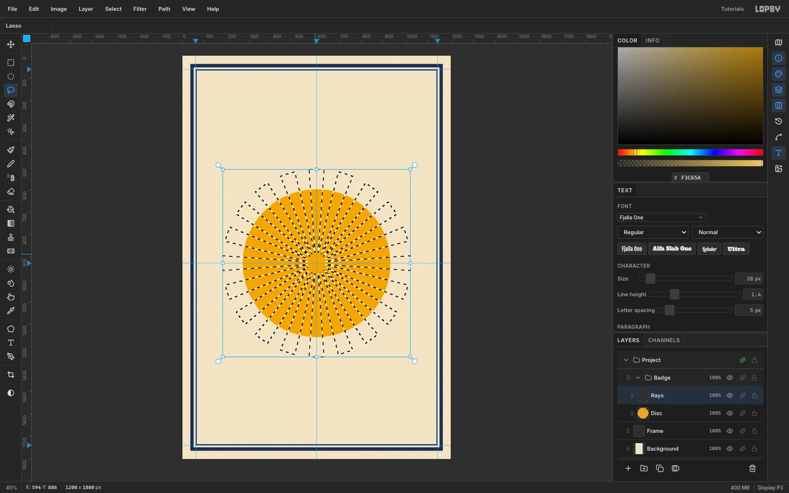

Click **New Group** and name it *Badge*. Add a layer called *Disc*,
[[Cmd]]-drag an **Elliptical Marquee** into a circle about 660 px across,
centred where the centre guide crosses the badge guide, and fill it with
`#E9A825`.

On a new layer called *Rays*, draw the whole sunburst as **one Lasso
selection**. Work your way round the badge centre twenty times: start near
the centre, go out about 420 px, across a short way, and back to the centre.
That makes twenty thin wedges in one outline. Fill it with the lighter mustard
`#F3C65A`.

> **Tip:** **Filter → Sunburst…** draws even rays for you in the foreground
> colour. Set the foreground to `#F3C65A`, and on the *Rays* layer set **Rays** to 20 and **Center X** / **Center
> Y** to about 50 / 51 so they radiate from the badge centre. You'll clip them
> to a circle in the next step either way.

## Clip the rays and ring the badge

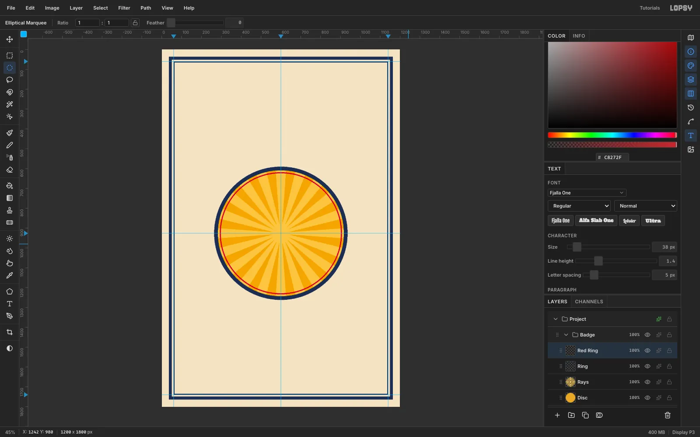

All three circles share the badge centre, so the rings come out even.

1. On the *Rays* layer, select a circle a little smaller than the disc (about 636 px across), choose **Select → Inverse**, and press [[Delete]].
2. On a new *Ring* layer, fill a circle a little larger than the disc (about 672 px across) with navy, **Shrink** 18, and delete.
3. On a *Red Ring* layer, fill a circle about 616 px across with red, **Shrink** 5, and delete.

Keep the red ring on its own layer. At the end you'll nudge it off register,
the way a real second ink plate slips.

> **Tip:** Circles on one centre are easiest with the exact-corners dialog:
> click with the Elliptical Marquee and type a box of the circle's width
> around the centre. For a radius *r* on this badge that's From
> **600 − r, 926 − r** To **600 + r, 926 + r**, so the disc (radius 330) is
> From **270, 596** To **930, 1256**.

## Cut the strawberry

Click the *Frame* row, click **New Group** (*Berry*), and drag the group's row above
*Badge*. Inside it:

1. On a *Stem* layer, lasso a short curved stem rising from about 200 px above the badge centre, and fill it with `#2F6A2E`.
2. On a *Berry Body* layer, lasso the berry: broad, rounded shoulders just below the stem, sides that taper to a tip a little left of the centre guide, and a slightly fuller left side. Fill it with red `#C8272F`.

The navy ribbon will cross the bottom of the badge, so keep the tip about
30 px clear of it. Otherwise the two edges touch.

## Shade it with halftone dots

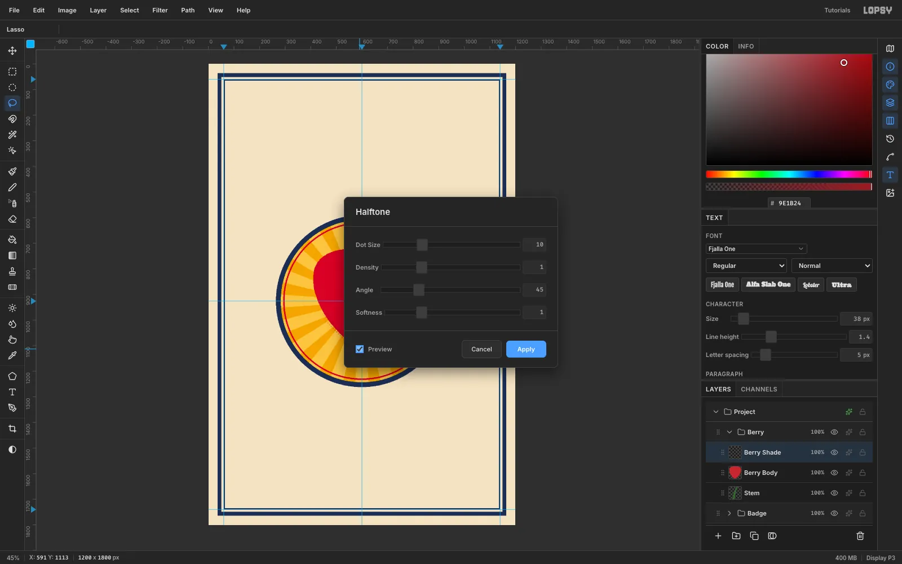

On a *Berry Shade* layer, fill the berry lasso with shade red `#9E1B24`. Then
lasso a copy of the berry shape shifted up and to the left, and delete it. That
leaves a crescent on the lower right.

1. **Filter → Gaussian Blur…**, Radius **28**.
2. **Filter → Halftone…**: Dot Size **10**, Angle **45**, Softness **1**.
3. Lasso the berry again, **Select → Inverse**, and [[Delete]] to trim the dots to the edge.

The blur's falloff becomes dot size, which is exactly how a printer fakes
shading with one ink. You'll widen this crescent in a later step.

## Place the seeds along the surface

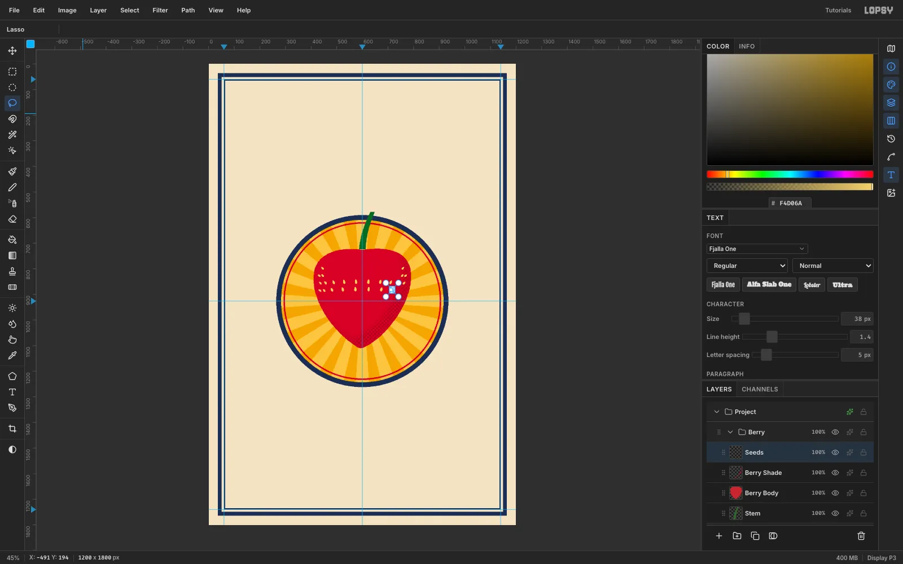

On a *Seeds* layer, lasso small teardrops one at a time and fill each with
`#F4D06A`, about seventy in all. Put them in staggered rows, and make them
narrower and closer together toward the sides so the berry reads as round.

Then open **Layer effects ✦** and turn on **Drop Shadow**: colour `#7A1320`,
Offset X **2**, Offset Y **3**, Blur **0**, Spread **1**. The hard shadow
becomes the little pocket each seed sits in.

## Add the calyx with a hard shadow

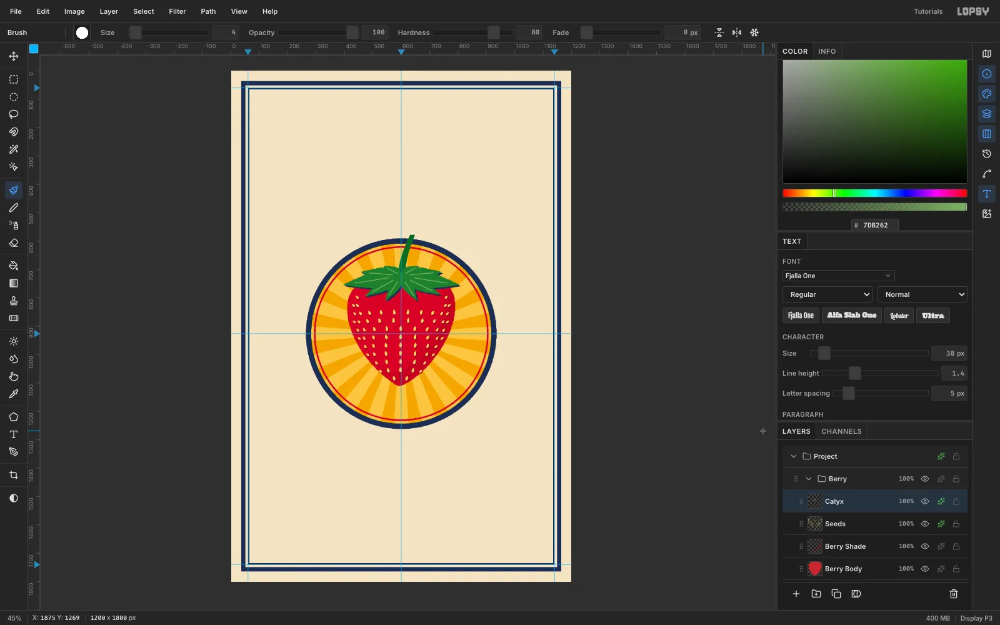

On a *Calyx* layer, lasso ten pointed sepals radiating from the base of the
stem, and fill them with `#3F7F38`. Fill a small ellipse over the hub to close
the centre.

- **Brush** at size **4** in `#7DB262`: draw one vein down the middle of each sepal.
- **Drop Shadow**: navy, offset **5 / 5**, Blur **0**.

That 5 px navy offset with no blur is the flier's only shadow style. Every
shadow on the sheet uses it.

## Build the ribbon and its stitching

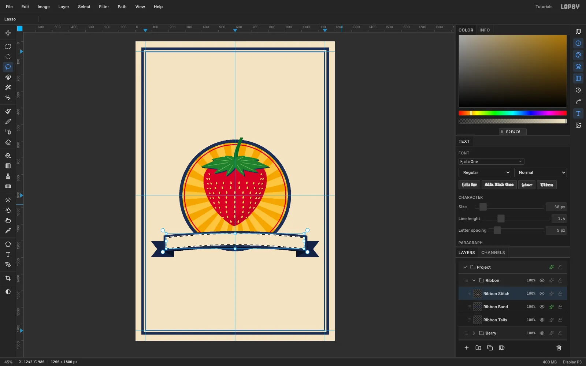

Create a *Ribbon* group above *Berry*.

1. On *Ribbon Tails*, lasso two swallow-tailed ends in `#172243`, plus the dark folds in `#0B1227`.
2. On *Ribbon Band*, lasso a gently arched band across the bottom of the badge. Run it from about 170 px in from each side of the page, make it about 96 px deep, and let it rise about 26 px in the middle. Fill it with navy and add the 5 / 5 navy shadow.
3. On *Ribbon Stitch*, lasso the band again, **Shrink 10**, fill with paper cream, **Shrink 3**, and delete. Then marquee over each short end of the stitching and delete it, so only the top and bottom stitch lines remain.

## Hang half the bunting

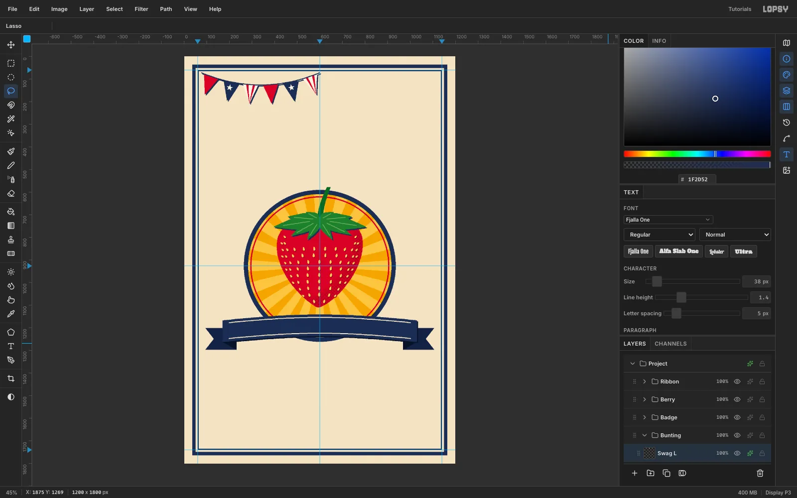

Create a *Bunting* group and a *Swag L* layer. You only draw the left half;
the right half is a mirrored copy.

Lasso six triangular pennants along a gentle sag, from just inside the
frame's top-left corner to the centre guide. Tilt each one to follow the
string's slope, and fill them in turn with red, navy and `#FBF4E4`.

Add two red stripe wedges to each cream pennant and a small star to each
navy one. Then fill a thin lasso for the string and give the layer the 5 / 5 navy
shadow.

## Copy and flip the swag

Marquee the whole left swag, from the frame corner to just past the centre
guide, and press [[Cmd+C]] then [[Cmd+V]]. The paste lands in place as a new
layer, so rename it *Swag R*.

Marquee the same area again, switch to the **Move** tool, and click
**Flip Horizontal** in the options bar. Press [[Cmd+D]] to commit.

> **Tip:** Use the Move tool's Flip button on a selection here rather than
> **Image → Flip Horizontal**. The selection flip mirrors exactly what you
> selected, in place.

## Slide it into mirror position

With the Move tool, drag *Swag R* to the right until the two strings meet at
the centre guide. Finish with the arrow keys for an exact meet ([[Shift]]+arrow
moves 10 px at a time), then add the same 5 / 5 navy shadow.

Because the copy is a true mirror, the colours read red, navy, stripe outward from
the middle on both sides.

## Set STRAWBERRY on an arch

Create a *Type* group above *Ribbon*. Inside it, on an *Admission Band* layer,
marquee a band across the bottom of the page, just inside the inner rule and
about 84 px tall, and fill it with navy for the footer.

1. With the **Pen Tool**, press about 110 px in from the left edge and roughly a quarter of the way down the page, and drag up and to the right to pull out a long handle. Then press at the same height about 110 px in from the right edge and drag down and to the right, mirroring the first handle. Click **Commit path** in the options bar. (Pressing [[Enter]] would also stroke the path onto the active layer.)
2. Keep *Admission Band* selected, so the new type settings don't restyle an existing text layer. With the **Text** tool, set **Ultra**, Size **110**, red, then click in empty canvas, type `STRAWBERRY`, and press [[Tab]].
3. In the options bar **Path** dropdown, pick your new path. In the **Text** panel, set Letter spacing to **2**.
4. Switch to the Move tool and nudge with the arrow keys until the word is centred on the centre guide.

> **Tip:** Settle the Size and letter spacing **before** you centre path
> text. Both change the word's length, so changing them later means centring
> it again.

## Give the wood type a cream outline and a navy shade

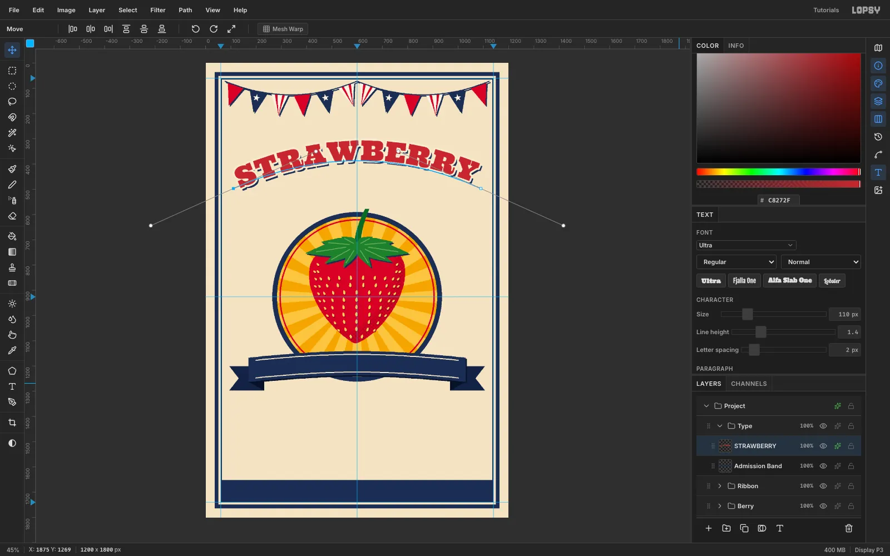

Open **Layer effects ✦** on *STRAWBERRY*.

- **Stroke**: `#F7ECD3`, Width **7**, position outside.
- **Drop Shadow**: navy, offset **9 / 11**, Blur **0**, Spread **7**.

The spread makes the shadow as fat as the outlined letters, so it reads as a
solid second ink printed behind them. It's the classic Hatch Show Print look.

## Scale the script to fit under the arch

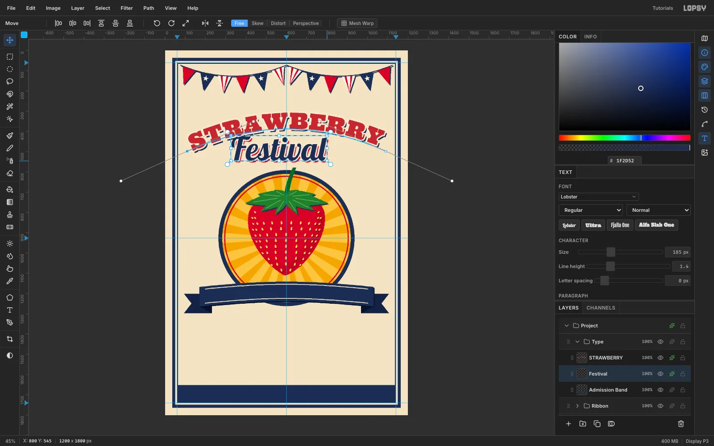

Click the *Admission Band* row again. Create `Festival` in **Lobster** at Size
**185** in navy, and click **Rasterize Layer** in the Layers footer, so the
scale and tilt you're about to apply are baked into pixels.

Give it a cream **Stroke** of **6** and a red **Drop Shadow** of **8 / 10**,
Blur 0, Spread 6.

It has to clear both the arch and the badge, so it needs to shrink. Marquee it,
switch to the Move tool, and hold [[Cmd]] while you drag the bottom-right handle
inward to about **86 %**, then press [[Cmd+D]]. Holding [[Cmd]] keeps the scale uniform.

## Tilt the script

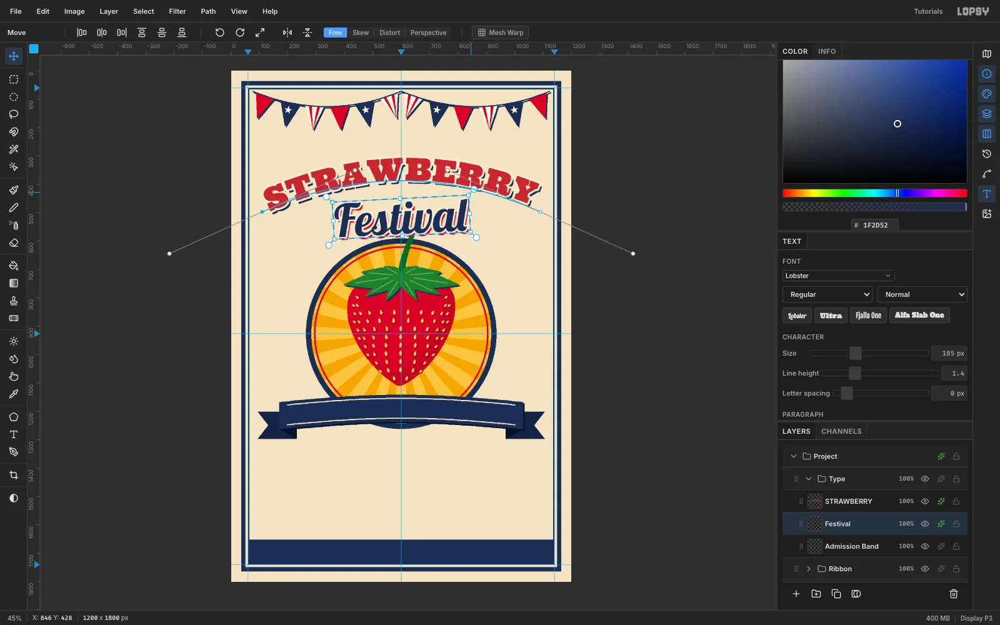

Move *Festival* so it's centred on the centre guide and tucked under the arch,
with at least 20 px of clear paper between it and the arch's ends.

Marquee it again, and with the Move tool drag the **rotate handle** just
outside the top-right corner **3°** counter-clockwise. Press [[Cmd+D]].

A small upward tilt adds energy without fighting the symmetric arch above.

## Curve the date along the ribbon

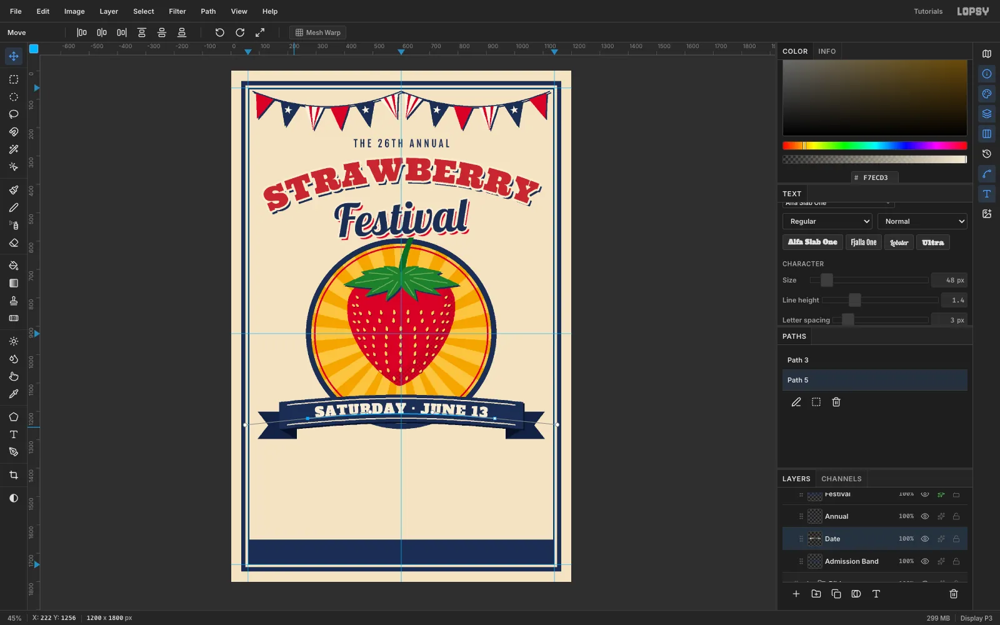

Pen a second path along the ribbon's centre line. Press near the ribbon's left
end and drag along the band to the right, then press near its right end and
drag outward to the right, so the curve follows the band's gentle arch. Click
**Commit path**.

Create `  SATURDAY · JUNE 13` in **Alfa Slab One** at Size **48**, in cream, with letter spacing
**3**. The two leading spaces push the start inward. Bind it to the new path.

Nudge it until the caps sit centred between the stitch lines, with the same
gap above and below.

> **Tip:** If the last letters disappear, the text is longer than its path.
> Path text doesn't overflow, so lengthen the path, and leave a little spare
> at the end rather than fitting it exactly.

## Stack the details and ornaments

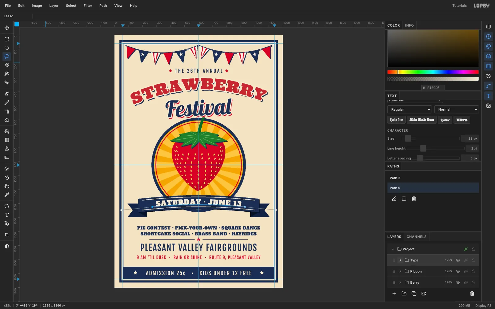

Create each line in empty canvas (a click inside an existing text layer edits
it instead), then switch to the Move tool, click **Align center horizontally**
and drag it down into place:

- `THE 26TH ANNUAL` in **Fjalla One 34**, navy, letter spacing 8, just under the bunting.
- Two event lines in **Alfa Slab One 30**, navy, letter spacing 1, stacked just below the ribbon: `PIE CONTEST • PICK-YOUR-OWN • SQUARE DANCE` and `SHORTCAKE SOCIAL • BRASS BAND • HAYRIDES`. Keep each under about 880 px wide.
- `PLEASANT VALLEY FAIRGROUNDS` in **Fjalla One 62**, letter spacing 4, below the events.
- The hours, `9 AM 'TIL DUSK • RAIN OR SHINE • ROUTE 9, PLEASANT VALLEY`, in **Fjalla One 30**, red, letter spacing 3, below that.
- `ADMISSION 25¢ • KIDS UNDER 12 FREE` in **Fjalla One 38**, cream, centred in the band.

On an *Ornaments* layer, lasso red stars either side of the tagline. Draw a
thin two-part navy rule between the events and the venue line, with a red star
at its centre, and add cream stars at the ends of the band.

## Loosen the top with group and selection nudges

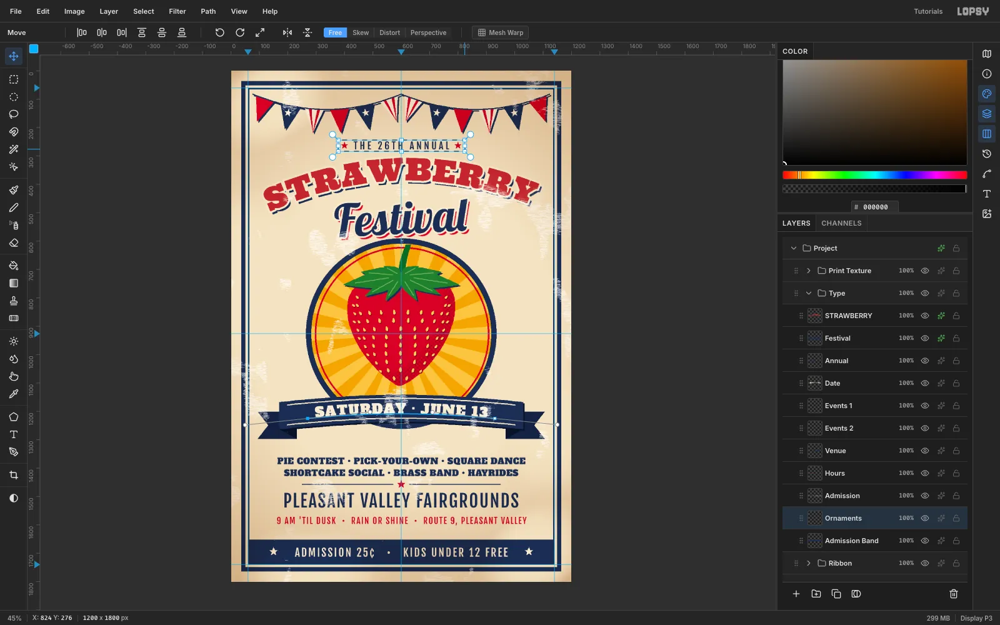

The pennant tips and the tagline were crowding each other.

1. Click the *Bunting* **group** row, switch to the Move tool, and press [[Shift+Down]] once to move it 10 px. The whole garland moves together.
2. Nudge the *Annual* text down **8**.
3. On *Ornaments*, marquee just the two tagline stars and press [[Down]] eight times. With a selection active, the arrows move only the selected pixels.

## Deepen the halftone shade

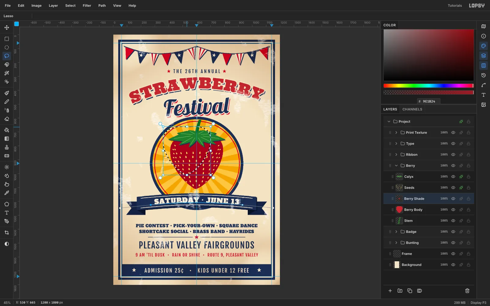

A thin crescent makes the berry look flat. Clear *Berry Shade*, refill the
berry lasso with shade red, then lasso a slightly smaller copy of the berry
(about 90 % size) shifted well up and to the left, roughly 70–80 px each way,
and delete it.

Run **Gaussian Blur** at **40** and **Halftone** at **10 / 45° / 1**, then trim
to the berry again. Now the dots cover the whole lower-right third.

## Merge and bulge the berry

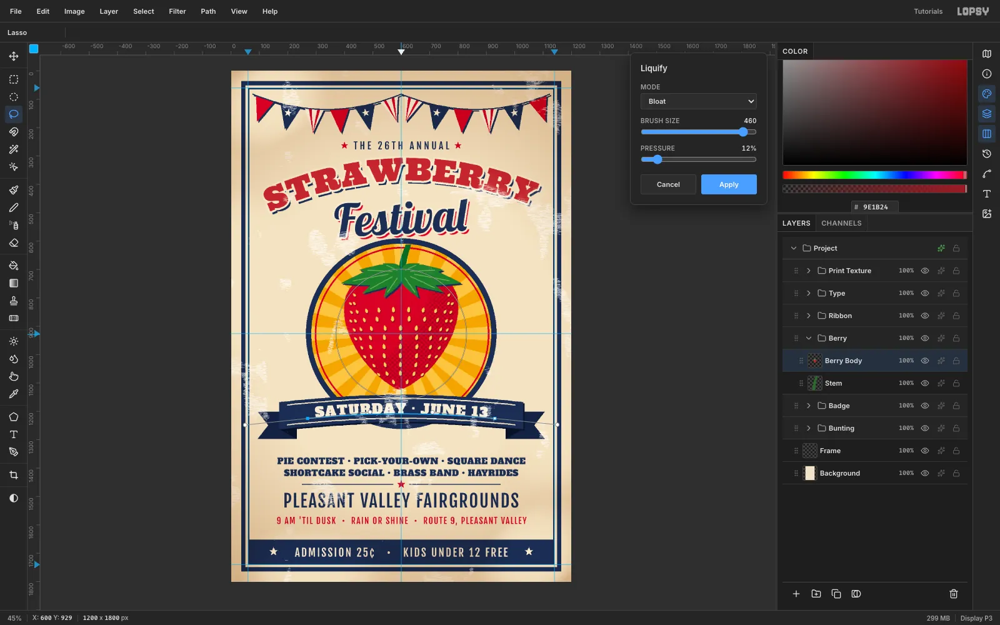

Click *Calyx* and choose **Layer → Merge Down** three times. Calyx, seeds and
shade fold into *Berry Body*, and their shadows bake in.

Open **Filter → Liquify…**, set the mode to **Bloat**, and set Brush size **460**
and Pressure **12**. Press once at the middle of the berry with the smallest
wiggle, then click **Apply**.

The centre seeds swell and the edge seeds stay small, so the rows now wrap
around a sphere.

> **Tip:** Bloat builds up with every mouse move. One short press is plenty,
> and a long circle will blow the berry apart.

## Break the symmetry with Distort

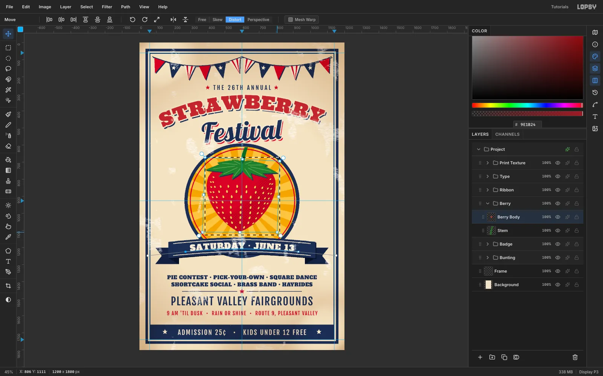

Marquee the berry. With the Move tool, click **Distort** in the options bar
and drag the corner handles:

- Top-right corner **down about 22 px** to drop the right shoulder.
- Both bottom corners **about 15 px left and 16 px up** to move the tip off centre.

Press [[Cmd+D]]. A real berry is never symmetric, and this also opens up clear
paper between the tip and the ribbon. Finally, on *Stem*, marquee the part of
the stem that pokes past the navy ring and delete it, so the stem stops just
inside the ring.

## Knock the red plate off register

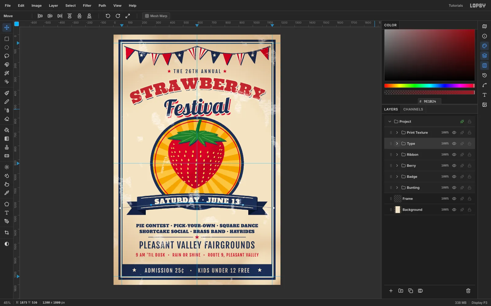

Two-colour presses never line up perfectly. Fake it with arrow-key nudges on
the Move tool:

- Nudge *Red Ring* **3 right, 2 down**, and *Hours* **2 right, 1 down**.
- Nudge *STRAWBERRY* **3 right, 2 down**, then change its shadow offset to **6 / 9** so the navy stays put.
- Change *Festival*'s red shadow to **10 / 12**.

The result is a hairline of cream where the inks drift apart.

## Build an ink-wear texture

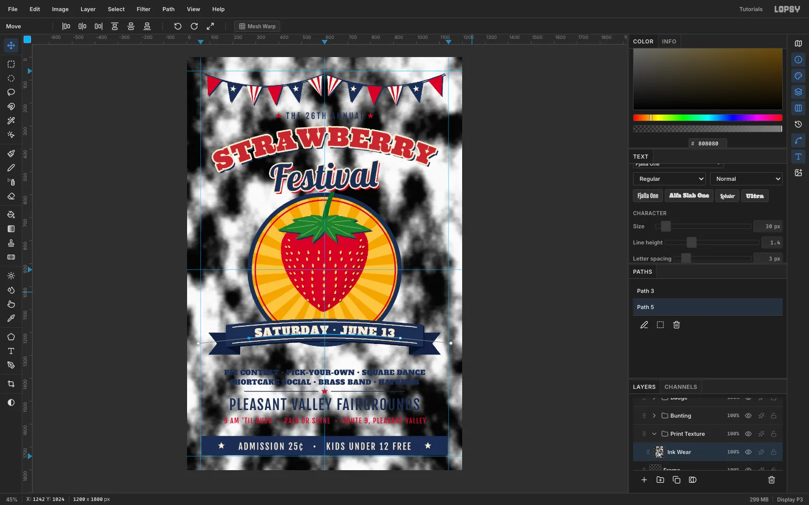

Create a *Print Texture* group and drag it to the top of the stack.

On an *Ink Wear* layer:

1. Fill it with grey `#808080`.
2. **Filter → Clouds…**, Scale **12**, to get clumps.
3. **Filter → Add Noise…**, Mono, Gaussian, **70**.
4. **Filter → Motion Blur…**, Angle **0**, Distance **14**, to streak it like a roller.
5. **Filter → Threshold…** at Level **250**. Only a few percent of the pixels stay white.

Marquee-delete the texture over the small text lines so they stay readable.

## Turn it into paper showing through

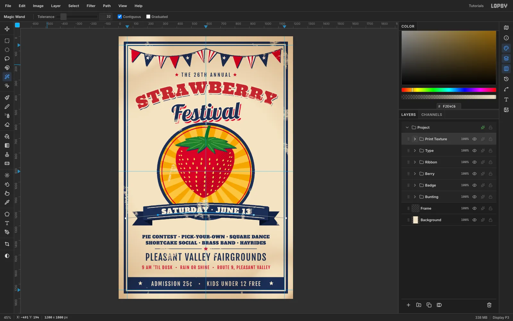

Worn ink should only ever show *paper*, and only where there was ink.

1. Take the **Magic Wand**, untick **Contiguous**, zoom in, and click right in the middle of a white speck on *Ink Wear*.
2. Click **Add Layer** (*Paper Show*), set the foreground to paper `#F2E4C6`, and choose **Edit → Fill**. Press [[Cmd+D]].
3. Delete the *Ink Wear* layer and set *Paper Show* to **85 %**.

On bare paper the specks match the paper and vanish. On the inks they read as
dropouts. Marquee-delete any specks that land in small text.

## Tone the edges unevenly

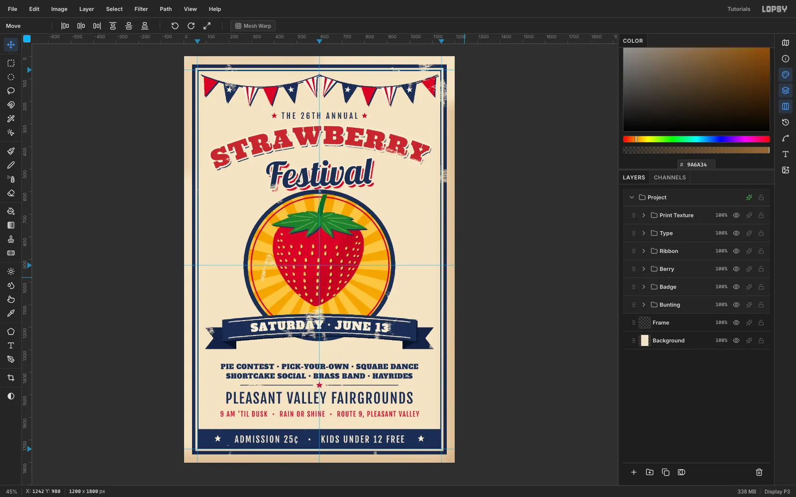

Add an *Edge Toning* layer set to **Multiply** at **45 %**. With the **Brush**
at Size **170**, Hardness **0** and foreground `#9A6A34`:

- At **60 %** opacity, paint down the right edge and along the bottom.
- At **30 %**, paint a short run at the top-left.

Finish with **Gaussian Blur 40**. Uneven, soft toning looks like years in a shop window,
where a uniform radial vignette looks like a camera.

Save with **File → Save Project**, then **File → Quick Export PNG**.
