This poster is a bar chart dressed as a page from a Victorian anatomy atlas.
The data is the **maximum bite force** of five animals. Each bar is drawn as a
**jaw-closing muscle**: a pale tendon springs from the zero line, a red
striated belly swells out, and the tip of the insertion tendon marks the value.

The crocodile's 16,400 N makes every mammal a sliver, so the four mammals are
drawn again in a framed **Fig. 6** at exactly eight times the scale. That's the
classic "detail enlarged" device from scientific plates, and it keeps the
chart honest.

The skulls are public-domain engravings from Wikimedia Commons:

- **Tiger, lion and wolf:** Blainville's *Ostéographie* (1839–64).
- **Crocodile:** a Brockhaus *Konversations-Lexikon* drawing.
- **Human:** the 1911 *Encyclopædia Britannica*.

The values and their sources:

- **Saltwater crocodile:** 16,400 N, measured in a live animal (Erickson et al. 2012).
- **Tiger:** 1,470 N, estimated at the canine tip (Christiansen & Wroe 2007).
- **Lion:** 1,320 N, estimated at the canine tip (same source).
- **Human:** 850 N, measured at the molars of adult men (Waltimo & Könönen 1993).
- **Grey wolf:** 490 N, estimated at the canine tip (Christiansen & Wroe 2007).

The palette:

- Paper: `#EDE0C4`
- Sepia ink: `#3A2718`
- Plate red: `#7E2A1E`
- Muscle carmine: `#9E2A22`
- Muscle hatching: `#6B1A15`
- Tendon: `#FBF5E6` → `#C9B994`

## Age the paper

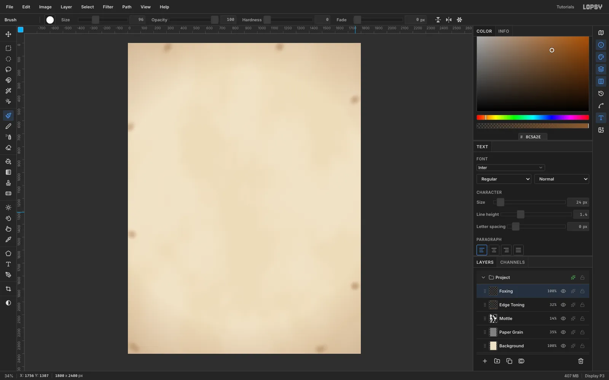

Create an **1800 × 2400 px** document and **Edit → Fill** the Background with `#EDE0C4`. Build the paper on three layers:

1. **Paper Grain:** fill with mid-grey, then run **Filter → Add Noise** (40, Mono, Gaussian) and **Gaussian Blur** 2. Set it to **Overlay** at 35%. The grain has no direction, so it reads as rag paper, not wood.
2. **Mottle:** run **Filter → Clouds** (scale 6) and set it to **Soft Light** at 14%.
3. **Edge Toning:** draw a radial **Gradient** from transparent brown at the centre to `#7A4A22` at the corners. Set it to **Multiply** at 32%.

For foxing, use a soft **Brush** (Hardness 0, Opacity 14) at a few sizes. Dab a few irregular clusters of rust `#8C5A2E` in the margins, away from anything you'll print on.

## Rule the frame and set the title

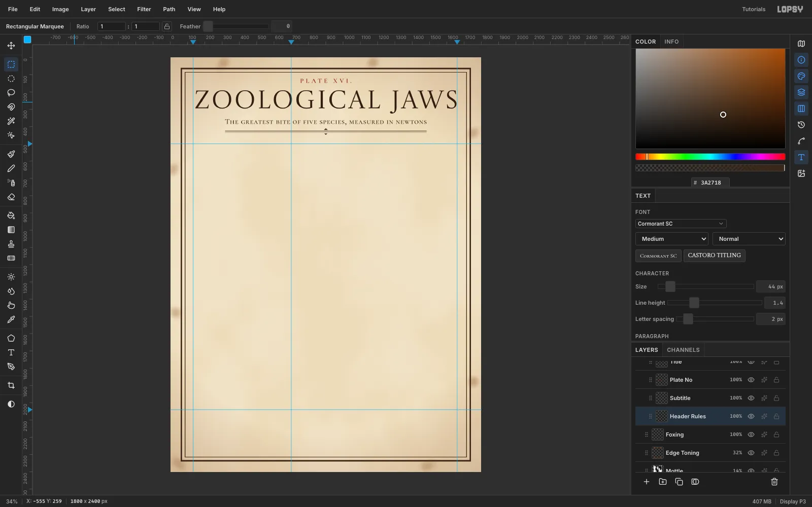

Click the rulers to drop guides:

- **Vertical:** x **132** (skull column), **700** (the zero line) and **1660** (the right edge of the chart).
- **Horizontal:** y **500** (top of the chart) and **2040** (the axis).

On a **Plate Frame** layer, marquee-fill a 7 px sepia ring 60 px in from the edge, and a 2 px ring 84 px in. The ring recipe is: marquee, Fill, **Select → Shrink**, then Delete.

Set the type with the Text tool, centring each line with **Align center horizontally**:

- **Title:** "ZOOLOGICAL JAWS" in **Castoro Titling**, 146 px, letter spacing 8.
- **Plate number:** "PLATE XVI." in **Cormorant SC** SemiBold, 38 px, in plate red.
- **Subtitle:** Cormorant SC Medium, 44 px.

Under the subtitle, draw a thick and a thin rule the same width as the subtitle, and a small diamond lassoed at the centre.

## Draw dashed gridlines with a pattern

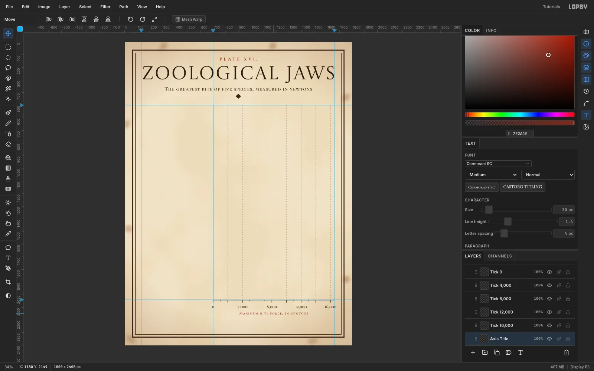

The main scale is **0.058 px per newton**, so 2,000 N is exactly 116 px. Make a dash tile to match:

1. On a scratch layer, fill a 2 × 9 px sepia dash at x 4.
2. Marquee a **116 × 20** box from x 0 and run **Edit → Define Pattern**.
3. On a **Gridlines** layer, marquee the chart area (x 700–1664, y 500–2040), run **Edit → Fill with Pattern…** and set the layer to 45%.

A pattern fill anchors to the document origin. Because 700 ÷ 116 leaves 4, the dash at x 4 in the tile lands on x 700, 816, 932 and so on.

Draw the zero line and the x-axis as 4 px marquee fills. Add ticks every 58 px, with a long tick every 116. Label 0, 4,000, 8,000, 12,000 and 16,000 in Cormorant SC.

> **Tip:** Cormorant's old-style figures have different heights. Place every label from the same text anchor, not by its top edge, or "8,000" will sit lower than "4,000".

## Paste a public-domain engraving

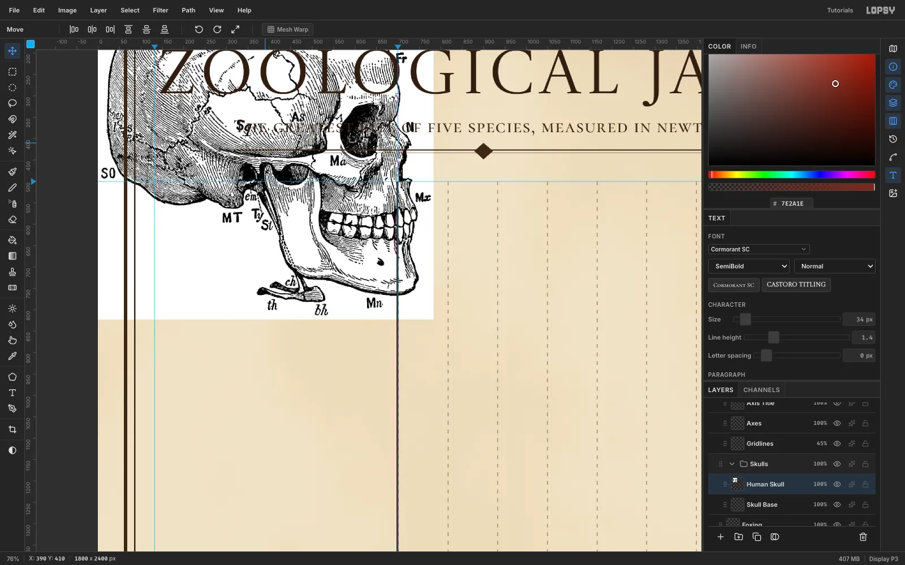

Make a **Skulls** group. Copy the human skull engraving from your browser and press [[Cmd+V]]. Lopsy pastes it at full size at the top-left of the canvas, with transform handles. Press [[Cmd+D]] to drop the transform and rename the layer **Human Skull**.

Clean the engraving now, while it's full size and the lettering is easy to hit.

## Retouch the lettering away

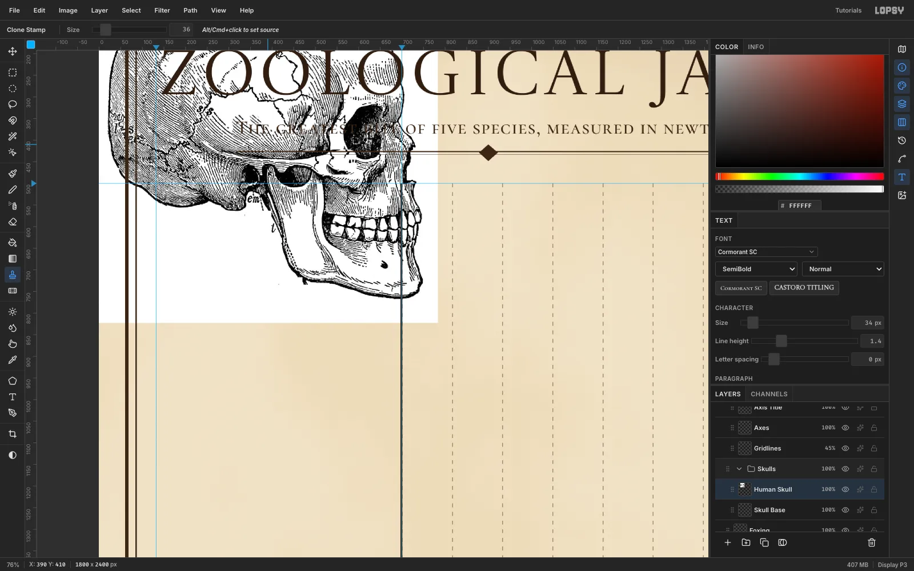

This old engraving has bone abbreviations printed all over it:

- **Labels on white paper** (Pa, Fr, SO, MT, Mn) and the hyoid bone under the jaw: marquee each one and **Edit → Fill** it white.
- **Labels on the hatching** (Sq, As, Ma, em): use the **Clone Stamp** at about 36 px. [[Alt]]-click clean hatching just beside the letters, then paint over them. The stamp keeps the same offset for the whole stroke, so the hatch lines carry straight through.

Finish with **Filter → Desaturate** so every engraving starts neutral.

## Scale the skulls into their rows

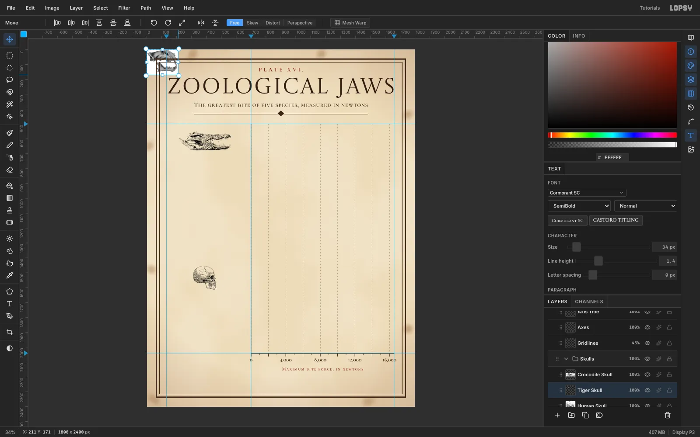

Paste the tiger, lion, wolf and crocodile the same way, desaturating each one. The crocodile drawing is pale, so give it **Brightness/Contrast** (−12, +45).

Draw a marquee around each skull, switch to the **Move** tool and [[Cmd]]-drag the bottom-right handle to scale it uniformly:

- Mammal skulls: **190 px tall**.
- Crocodile: **420 px wide**.

Press [[Cmd+D]] to commit, then drag each skull to x 390 in its row. The rows are 308 px apart, starting at y 500.

## Multiply the skulls onto the paper

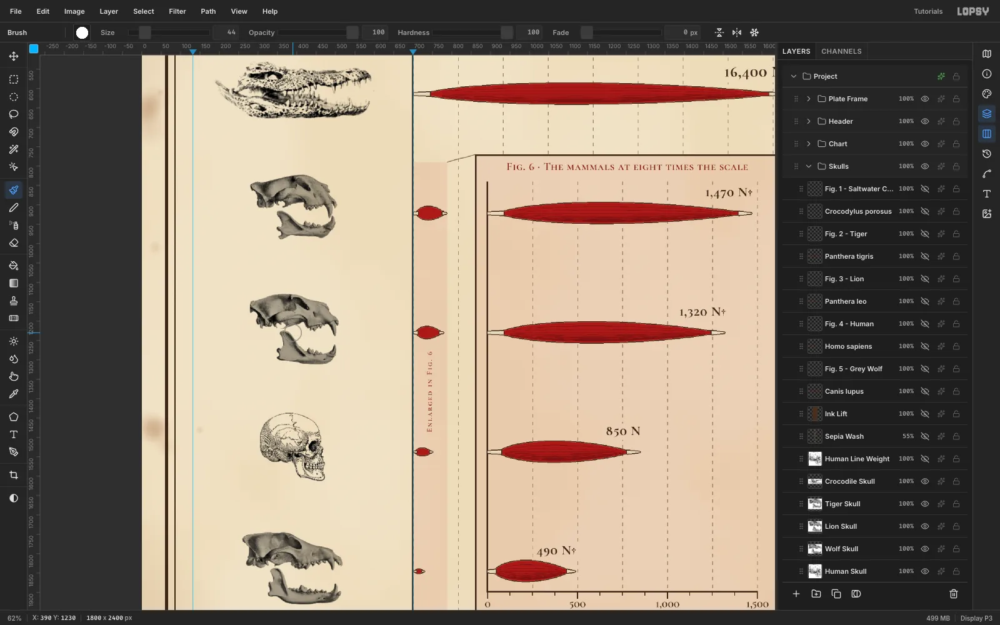

Set every skull layer to **Multiply** in the effects drawer. White multiplies to nothing, so the paper shows through, and the grey engravings sit on it like printed ink.

The human engraving has much thinner lines than the lithographs. To thicken them, run **Layer → Duplicate Layer**, click the copy's row, and nudge it so it sits exactly **1 px to the right** of the original. Keep it on Multiply too.

## Tone the set to one sepia

Two layers make the mixed engravings look like one printing:

1. **Ink Lift:** fill a rectangle over the skull column with `#4A2E1F` and set it to **Lighten**. Any ink darker than that brown is lifted to it. The paper is lighter, so it doesn't change.
2. **Sepia Wash:** for each skull, marquee its box, then use the **Magic Wand** with [[Alt]]-click on the white background to subtract it, leaving only the ink. Fill that selection with `#6B4A30` on the wash layer. Set the layer to **Color** at 55%. Then wand the pure whites with **Contiguous** off and Delete them from the wash, so bare bone stays paper-coloured.

> **Tip:** Start the Alt-click well away from the marquee's corners. At low zoom a click near a corner grabs the scale handle instead.

## Caption each figure

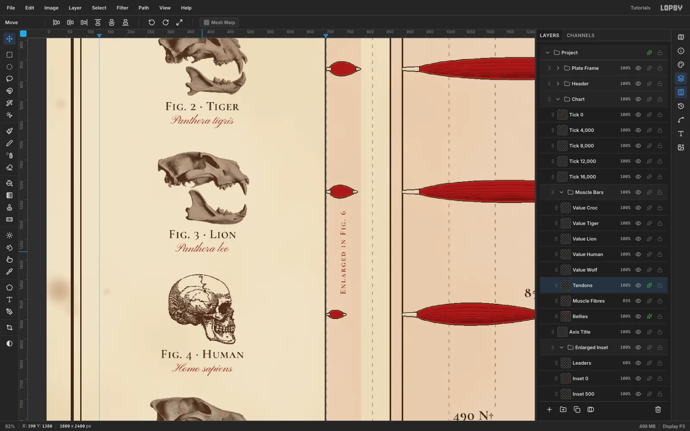

Under each skull, add two centred lines:

- **"Fig. 2 · Tiger":** Cormorant SC SemiBold, 32 px, sepia.
- ***Panthera tigris*:** Pinyon Script, 30 px, plate red. Google Fonts' italics don't render, so a copperplate script plays the italic.

Place every caption **16 px below the lowest ink** of its skull, counting faint tooth tips. That keeps each caption clearly with its own figure, and at least 45 px from the skull below.

## Frame the enlarged inset

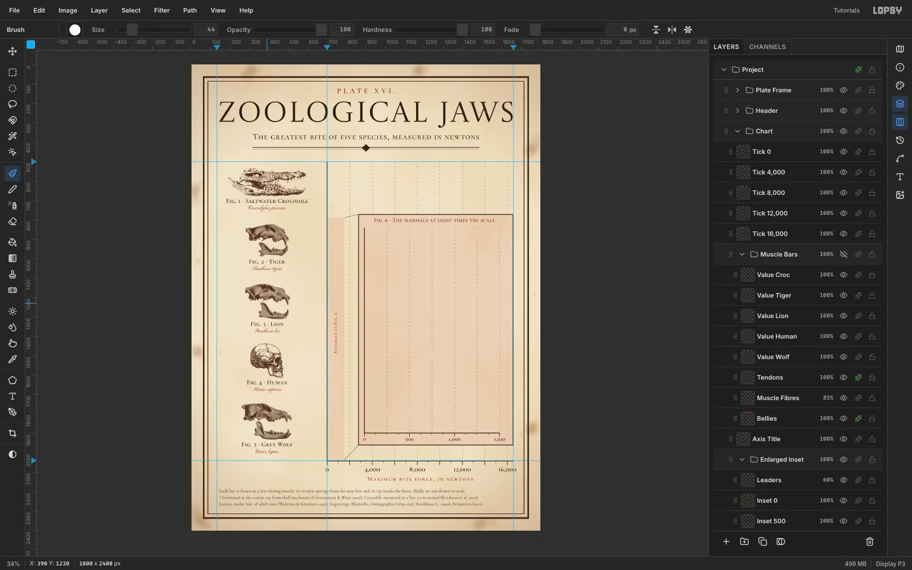

This is the honest way to show the small bars. In an **Enlarged Inset** group:

1. **Magnified Tint:** fill a strip over the main chart's 0–1,500 N range (x 700–787, down to the axis) and the inset box (x 860–1660, y 770–1962) with carmine, at 6%. The shared tint links the two.
2. **Knock out the main grid:** on the Gridlines layer, marquee the inset box and Delete, so the two scales never mix.
3. **Inset grid:** the inset scale is 8 × 0.058 = **0.464 px/N**, so 250 N is 116 px again. Define a second 116 px dash tile with its dash at x 80, so it lands on the inset zero at x 892. Pattern-fill it inside the box.
4. **Inset frame and axis:** add the frame, its own axis and ticks, and labels 0, 500, 1,000 and 1,500.
5. **Leaders:** draw two thin lassoed lines from the strip's corners to the inset's corners, at 60%.

Title the inset "Fig. 6 · The mammals at eight times the scale", centred on the plot area.

## Rotate a label into the strip

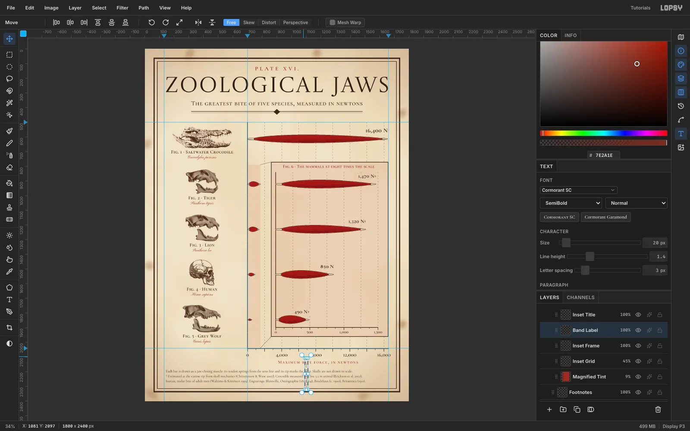

Type "Enlarged in Fig. 6" in Cormorant SC, 20 px, in plate red, and click **Rasterize Layer**. Rasterize before transforming, because a rotated live text layer can re-flow. Marquee it and switch to **Move**. Hold [[Cmd]] and drag the rotate handle, just outside the top-right corner, to snap to **−90°**. Press [[Cmd+D]].

Centre it in the strip at y 1383, in the gap between the lion and human bars.

## Draw the muscle bars

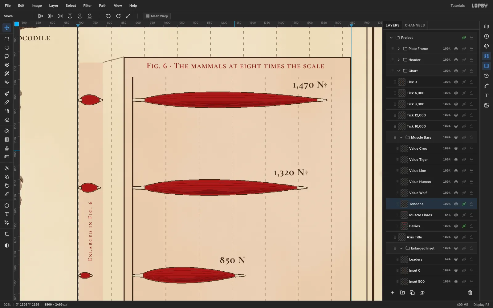

Plan each muscle as a polygon, and let the length carry the data:

- **Origin tendon:** a strap from the zero line, about 8% of the bar's length (capped at 38 px).
- **Belly:** an asymmetric spindle, 56 px deep. On very short bars the depth shrinks with the length.
- **Insertion tendon:** tapers to a point **exactly at the value**.

For the crocodile, 16,400 × 0.058 = 951 px, so its tip is at x 1653. The inset muscles use 0.464 px/N from x 892.

In a **Muscle Bars** group:

1. **Bellies:** lasso each belly and fill it flat `#9E2A22`.
2. **Muscle Fibres:** lasso thin tapered strands in `#6B1A15` that follow the spindle. Pack them tighter toward the bottom, so they shade like an engraver's hatching. Set the layer to 85%.
3. **Tendons:** lasso each tendon and fill it with a `#FBF5E6` → `#C9B994` gradient.

Run **Gaussian Blur** 2 on Bellies and Tendons to soften the lasso steps. Then give both a 2 px outside **Stroke** in `#3A2718`, like an engraved keyline.

## Label the values

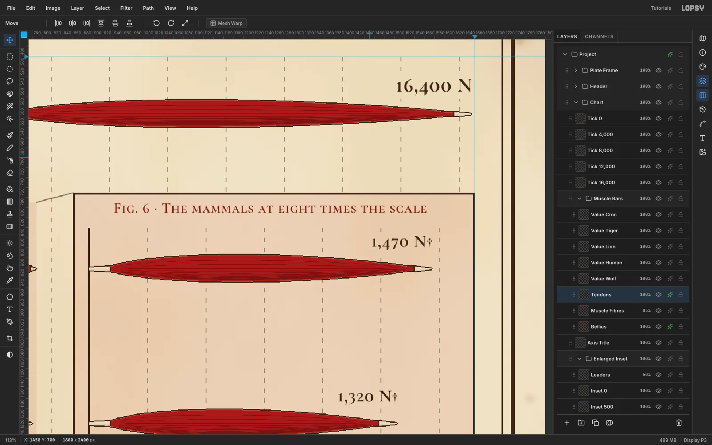

Right-align each value to its tendon tip, 10 px above the bar:

- **Crocodile:** "16,400 N" in Cormorant SC Bold, 40 px.
- **Inset values:** 34 px, with a dagger (†) on the three estimates.

Then marquee around each label, 10 px out, and Delete the dashes on the gridline layer underneath, so no line runs through a number.

## Add the key and sources

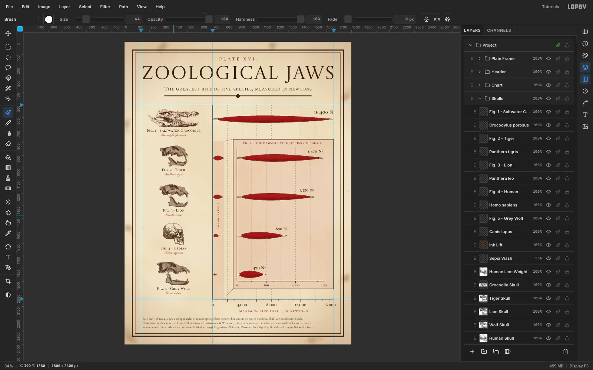

Under the axis title, set three lines of Cormorant Garamond at 24 px, left-aligned to the title's left edge (x 144). The lines explain three things:

- How to read a muscle bar.
- What the dagger means.
- Where every number and engraving comes from.

Leave equal space above and below the block. Check the whole plate at 100%, then **File → Quick Export PNG** and **File → Save Project**.
