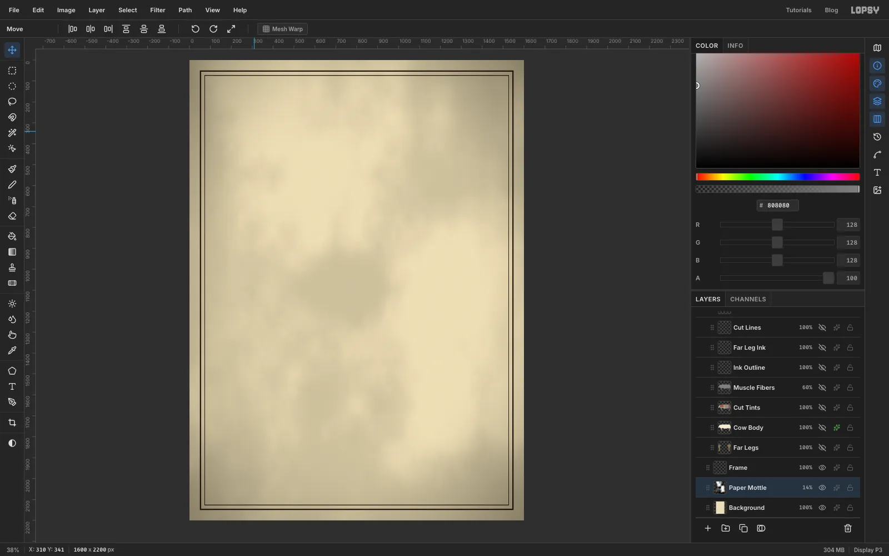
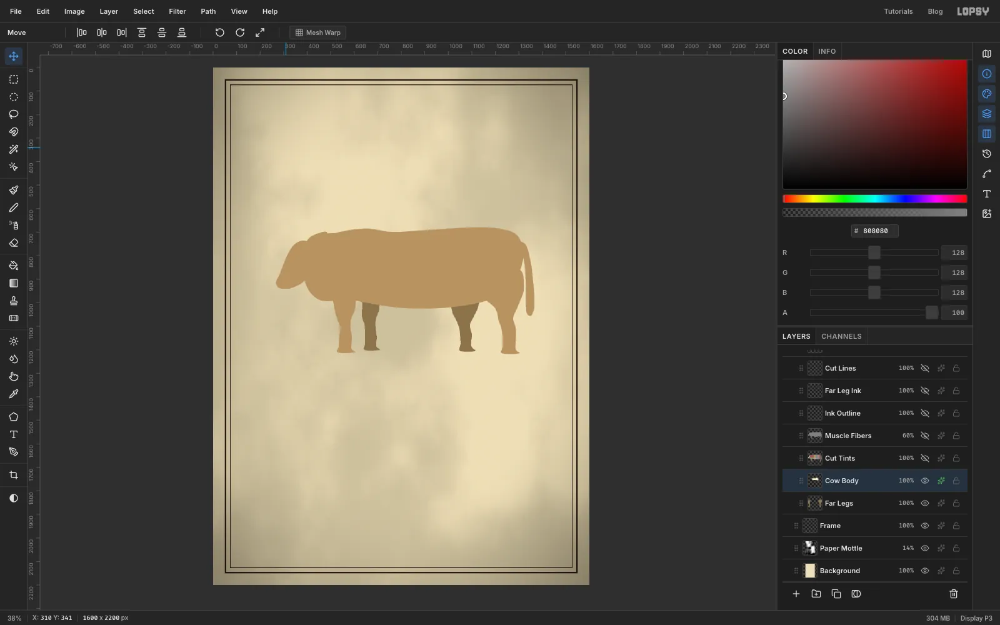
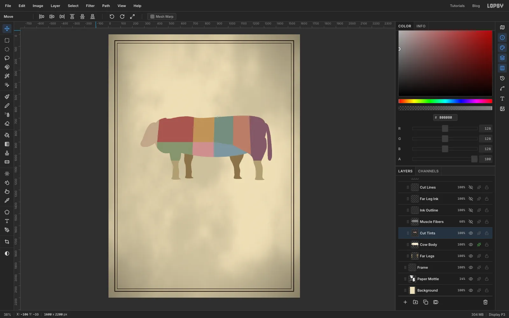
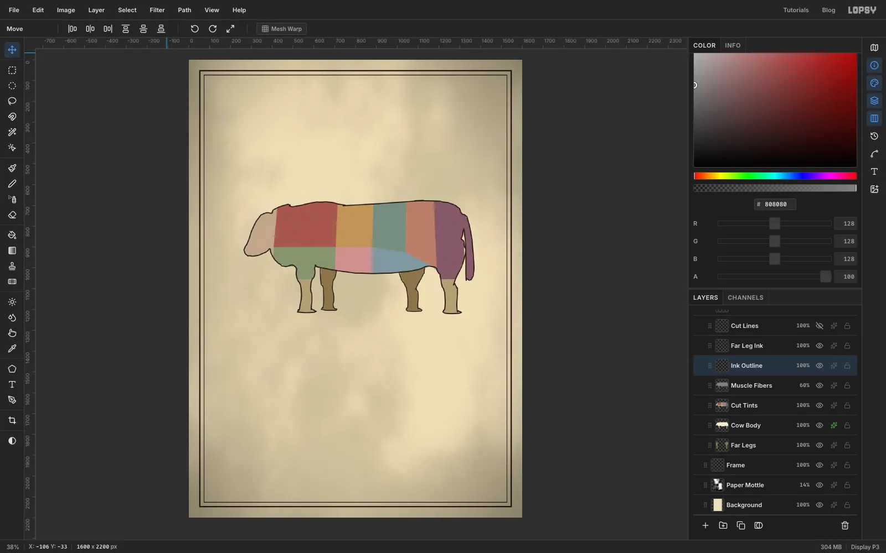
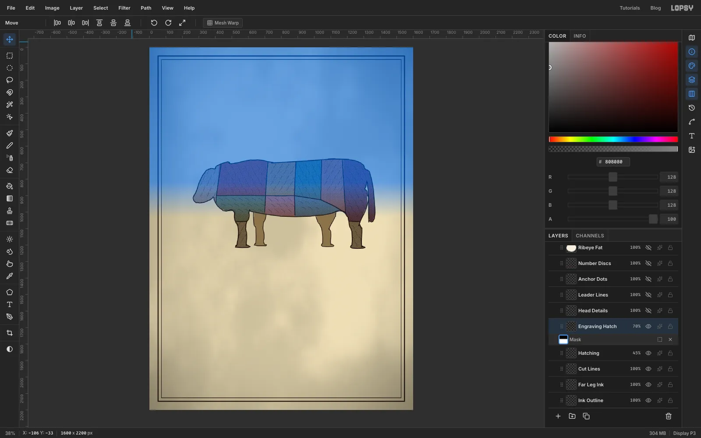
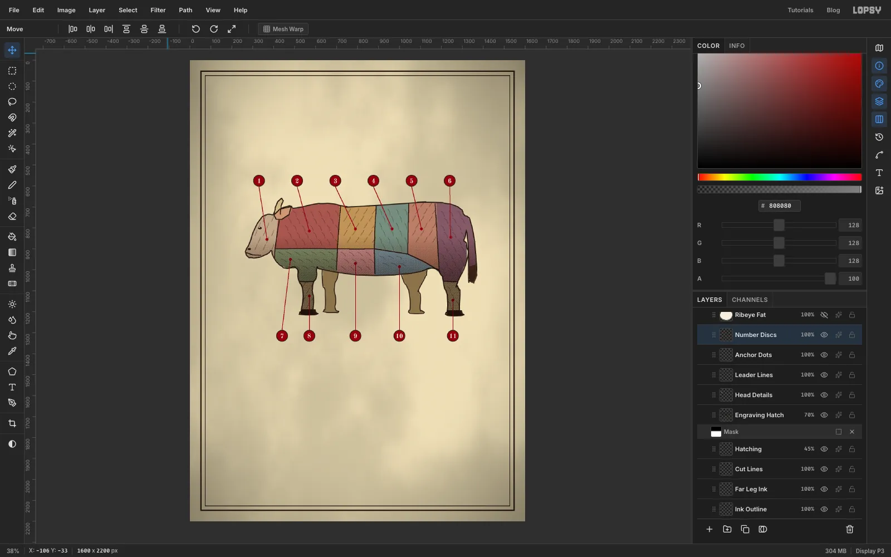
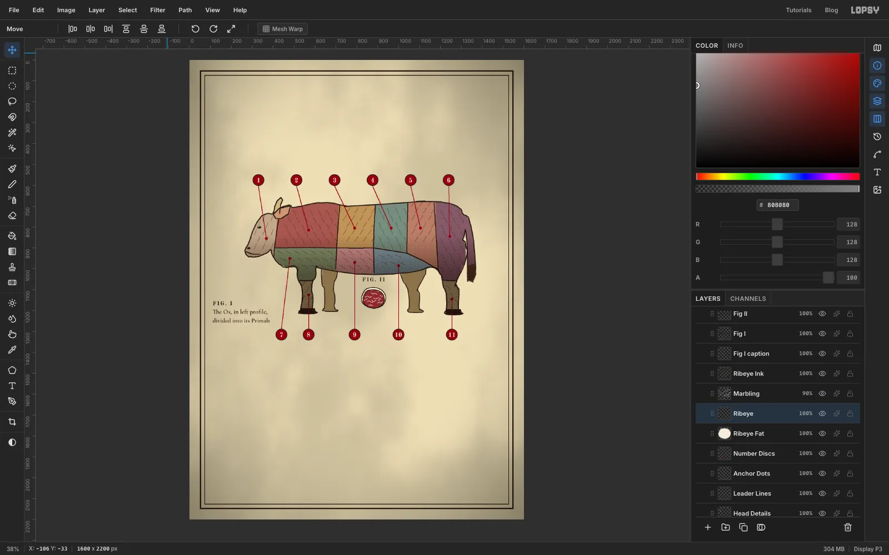
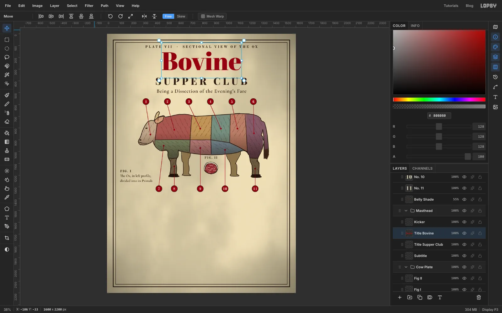
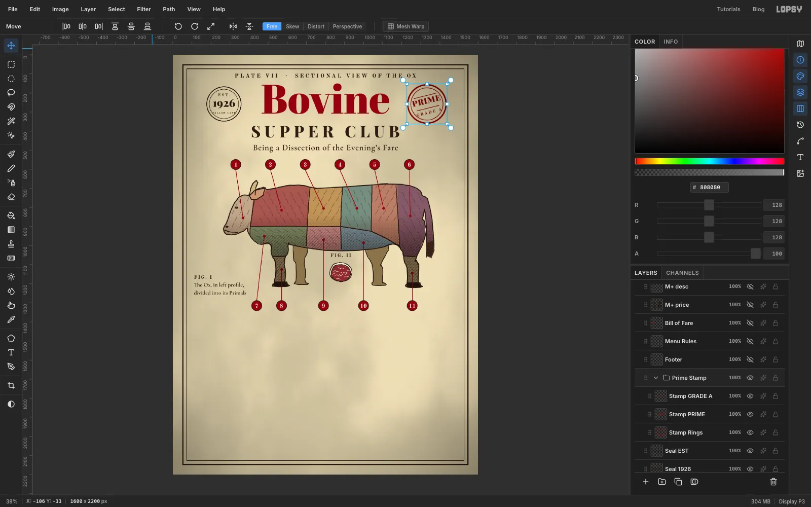
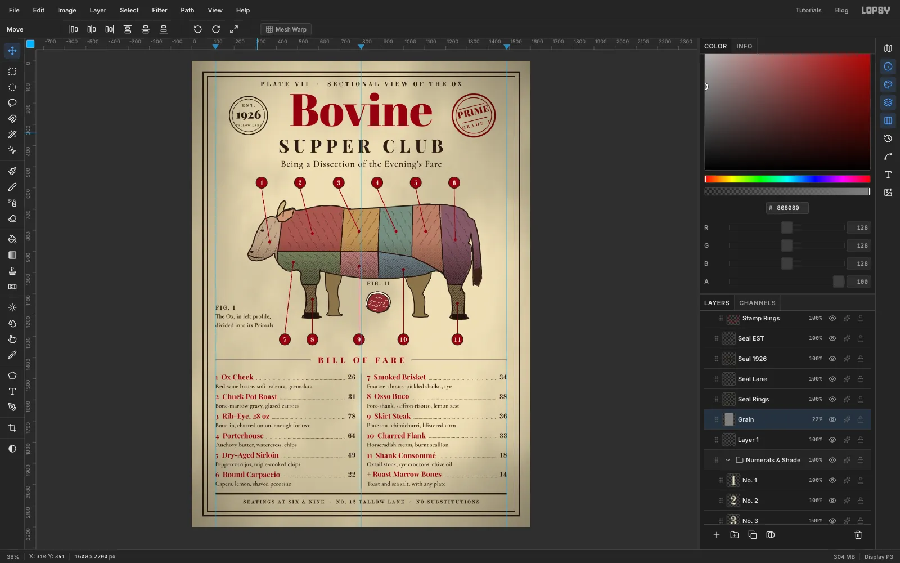

Old butcher's charts and anatomy plates have a look people still love: a
tinted animal in profile, divided by thin ink lines, with numbers that point
to a key. This tutorial borrows that look for a restaurant. The ox is
divided into its **primal cuts**, and each number on the chart matches a dish
in the **bill of fare** underneath. The page is 1600 × 2200 px, and the whole
thing is drawn with a Lasso, a Pencil and a handful of filters.

The engraving look comes from three cheap tricks:
muted flat tints, a tiny **diagonal hatch pattern** that you define once and
fill with, and a **layer mask** that fades the hatching so it only shows on
the shaded underside.

Screenshots only show the layers made so far, so later layers are hidden in the early shots. The tools you'll meet along the way:

- the **Lasso**, the **Pencil** and the **Elliptical** / **Rectangular Marquee**
- **Select → Inverse**, **Shrink** and **Selection → Path** with **Stroke Path**

- **Define Pattern** and **Fill with Pattern**, a layer **mask** and the **Gradient** tool
- the **Brush** with a wide Spacing for dotted leaders
- guides you drop from the ruler, and snapping marquees to them
- **Abril Fatface**, **Playfair Display**, **Cormorant Garamond** and **Old Standard TT** text
- **Group Layers**, the **Move** tool's rotate handle, a root **Vignette**, and **undo / redo**

The palette is aged paper, sepia ink and oxblood, plus muted tints for the cuts:

- Paper `#ECDFBA`, ink `#2B1D14`
- Oxblood `#8B1A1A`, numeral cream `#F4E9CB`
- Brick `#C4574A`, ochre `#DBA85E`, sage `#86A08E`, clay `#CF8A6C`, plum `#9D5B72`
- Olive `#9BAB7A`, rose `#DE9A96`, slate `#8DA7B5`, khaki `#C9B47E`, fawn `#D5B894`
- Body underfill `#B39468`, far legs `#B79F72`, horn `#CDB98A`, ear `#C79A78`
- Rib-eye fat `#F6EEDC`, meat `#A02A2A`, marbling `#F1DDD6`, body `#F7ECD2`, tail tuft `#4A3226`

## Start with the paper

Choose **File → New**, set the units to **Pixels**, type **1600** and **2200**
and click **Create**. Set the foreground to `#ECDFBA` and choose **Edit →
Fill** on the *Background* layer, then run **Filter → Add Noise** with
**Amount** 6 so the paper isn't dead flat. Add a layer called *Paper Mottle*,
run **Filter → Clouds** with **Scale** 4, open the effects drawer and set its
**Blend** to **Multiply**, then drop the layer opacity to **14%**.

For the border, add a layer called *Frame*, set the foreground to ink
`#2B1D14` and drag a **Rectangular Marquee** a little in from the edge of the
page. **Edit → Fill** it, choose **Select → Shrink…**, type **6**, and press
[[Delete]] to leave a thin rule. Drag a second marquee about twenty pixels
inside the first, fill it, shrink it by **3** and delete again.

## Draw the ox's silhouette

The ox is built from simple blobs. Add a layer called *Far Legs*, set the
foreground to `#B79F72` and use the **Lasso** to drag around the two legs on
the far side of the body, filling each with **Edit → Fill**. Add a layer above
it called *Cow Body* and set the foreground to a pale `#F7ECD2`. Lasso the
torso, the neck, the head, the two near legs, the tail and the ear as separate
overlapping loops, filling each one. They're the same colour on the same layer,
so the overlaps simply merge into one silhouette. Keep the head modest and the legs a little tapered, and don't worry about perfect anatomy. As you go, select the ox layers and choose **Layer → Group Layers**, then name the group *Cow Plate*.

## Fill the primal cuts

Add a layer called *Cut Tints* above the body. Lasso each cut as a loop that
overshoots the outline, so no gap is left, and fill it. From the head backwards
along the top they are head `#D5B894`, chuck `#C4574A`, rib `#DBA85E`, short
loin `#86A08E`, sirloin `#CF8A6C` and round `#9D5B72`. Along the bottom they
are brisket `#9BAB7A`, plate `#DE9A96`, flank `#8DA7B5`, and both shanks
`#C9B47E`. Neighbouring loops should meet along a straight line, because that
becomes the cut line later.

Then trim the overshoot: [[Cmd]]/[[Ctrl]]-click the *Cow Body* thumbnail to
load the ox as a selection, choose **Select → Inverse**, click the *Cut Tints*
row and press [[Delete]]. The colours now stop exactly at the silhouette.

## Mute the colours

Straight from the fill the colours look like a children's book, not a Victorian
plate. With *Cut Tints* selected, choose **Filter → Hue/Saturation…**, set
**Saturation** to **−38** and **Lightness** to **−6**, and click **Apply**.

Select *Cow Body*, open the effects drawer and turn on **Color Overlay**.
Click its colour swatch and set it to `#B39468`. A dark tan under the tints
hides the thin light slivers that otherwise show between a fill and the ink
line.

## Texture the muscle and ink the outline

For muscle grain, [[Cmd]]/[[Ctrl]]-click the *Cow Body* thumbnail again, add a
layer called *Muscle Fibers*, set the foreground to `#808080` and **Edit →
Fill**. Run **Filter → Add Noise** with **Amount** 100, then **Filter → Motion
Blur** with **Angle** 12 and **Distance** 46. Set the layer's **Blend** to
**Overlay** and its opacity to **60%**.

The outline is a stroked path, which gives a slightly wobbly ink line. Add a
layer called *Ink Outline*, [[Cmd]]/[[Ctrl]]-click the *Cow Body* thumbnail and
choose **Select → Selection → Path**. Pick the **Pencil** at size 5 in ink
`#2B1D14`, open the **Paths** panel, select the new path and click **Stroke
Path**. For the far legs add a layer called *Far Leg Ink*, and do the same for
each leg on its own, because **Selection → Path** only follows one outline at
a time (a Lasso loop around each leg is enough). Finally,
[[Cmd]]/[[Ctrl]]-click *Cow Body*, click *Far Leg Ink* and press [[Delete]] to
remove the ink that would otherwise show through the body.

## Divide the cuts and add hair ticks

Add a layer called *Cut Lines*. With the **Pencil** at size 4, drag along each
boundary between two colours, letting the line bend slightly as you go so it
reads as hand-drawn. Trim anything that pokes past the body the same way as
before: load *Cow Body*, **Select → Inverse**, click *Cut Lines*, [[Delete]].

Add a layer called *Hatching*, set the Pencil to size 2, and drag short curved
ticks in loose rows across every region, leaning each region's ticks in
its own direction so the cuts feel like different muscles. Clip them to the
body the same way, then set the layer's opacity to **45%**.

## Define a hatch pattern and fill the ox

Make a throwaway layer called *Hatch Tile*. Drag a tiny **Rectangular
Marquee** about 8 px square in a spare corner, pick the **Pencil** at size 1,
and drag one diagonal line from corner to corner. Keep the square selected and
choose **Edit → Define Pattern**. You can delete the tile layer afterwards.

Add a layer called *Engraving Hatch* above *Hatching*, [[Cmd]]/[[Ctrl]]-click
*Cow Body*, and choose **Edit → Fill with Pattern…**. Leave **Scale** at 100 and
click **Apply**. Set the layer's **Blend** to **Multiply** and its opacity to
**70%**.

For a soft belly shadow, load *Cow Body* once more, add a layer called *Belly
Shade*, and drag the **Gradient** tool from the back down to the belly with a
stop that is `#5A3A28` and fully transparent at the start, still transparent at 45%, and `#3A2418` at 75% opacity at the end. Set it to **Multiply** at **55%**. This screenshot was taken after the next step's mask, so your hatching will cover the whole ox until then.

## Fade the hatching with a layer mask

Right now the hatching covers the whole ox, which looks flat. With *Engraving
Hatch* selected, click **Add Mask** at the bottom of the Layers panel, then
click the mask thumbnail to edit it. Choose the **Gradient** tool and open its
**Advanced** editor. Make the first stop black at 0%, add a second black stop
at 35%, and make the last stop white at 100%, then click **Done**. Drag from the
withers down to the belly. The hatching is now hidden on the upper back and
fades in towards the belly. Click the layer row again to leave mask editing.

## Add the head details

Add a layer called *Head Details*. Lasso a curved horn above the ear and fill
it with `#CDB98A`, lasso the ear and fill it `#C79A78`, then switch to ink and
fill the four hooves and a short tuft at the end of the tail (`#4A3226`) with
the Lasso too. Use the **Elliptical Marquee** to fill a small eye and a
nostril, drag a short **Pencil** line for the mouth, and outline the ear and
horn with a size 4 Pencil. A single cream dot makes the eye glint.

## Number the cuts

Add *Leader Lines*, set the **Pencil** to size 3 in oxblood `#8B1A1A`, and click where a disc will sit, then [[Shift]]-click inside its cut to draw the straight line. Add
*Anchor Dots* and fill a small 14 px ellipse at the end of each line. Add *Number
Discs*, draw an ink circle about 56 px across with the **Elliptical Marquee** ([[Shift]]-drag keeps it round), fill it, choose
**Select → Shrink…** with **3** and fill the inside with oxblood. Space the six
top discs evenly and put the bottom row where the lines don't cross the legs.

For the numerals, use the **Text** tool in **Old Standard TT** Bold, size 30,
cream `#F4E9CB`. Click on empty paper well away from other text and type the
number, press [[Tab]] to finish the text, then use the **Move** tool to drag it onto its disc and nudge it with the arrow keys until it is centred. Clicking inside another text
layer's box edits that layer instead, which is why the empty corner matters.

Put the discs, numerals and *Belly Shade* into a second group, *Numerals & Shade*, so the whole plate can move later.

## Add the figure labels and the rib-eye

Under the belly, Lasso a pale
oval of fat in `#F6EEDC`, a slightly smaller red oval on top in `#A02A2A`, and
run **Hue/Saturation…** with **Saturation** −22 on the red one. Drag short wavy
**Pencil** strokes in `#F1DDD6` across it for the marbling, and trace both ovals
with a size 3 ink Pencil.

Add the labels with the **Text** tool: **FIG. II** and **FIG. I** in **Old
Standard TT** Bold 26 with **Letter spacing** 4, and a two-line caption (*The Ox, in left profile, divided into its Primals*) in **Cormorant Garamond** SemiBold 30 under FIG. I.

## Set the masthead

Type four lines, each as its own text layer, and keep them all centred on the
page: the kicker `PLATE VII · SECTIONAL VIEW OF THE OX` in **Old Standard TT**
Bold 30 with **Letter spacing** 8 in ink; **Bovine** in **Abril Fatface** 215 in
oxblood; **SUPPER CLUB** in **Playfair Display** ExtraBold 84 with **Letter
spacing** 20; and the subtitle, *Being a Dissection of the Evening's Fare*, in **Cormorant Garamond** SemiBold 44 in ink. After
typing each one, pick the **Move** tool and click **Align center horizontally**
in the options bar, then use the arrow keys to set the gap between lines. Shift-
click the four rows and choose **Layer → Group Layers**, and name the group *Masthead*.

## Stamp and seal

For each round mark, add a raster layer, fill an **Elliptical Marquee** with
ink (or oxblood for the stamp), shrink the selection by 4 and press [[Delete]]
to leave a ring, then repeat a little smaller for a thin inner ring. Name the layers *Seal Rings* and *Stamp Rings*. The seal reads `EST.`, `1926` and `TALLOW LANE` (Old Standard TT Bold 20, Playfair Display Black 56, Old Standard TT Bold 12) in ink. The stamp reads `PRIME` (Playfair Display Black 42) and `GRADE A` (Old Standard TT Bold 21) in oxblood, between two short Pencil rules. The long `TALLOW LANE` line is a tight fit inside the ring.

The stamp tilts. Shift-click its ring and two text layers, choose **Layer →
Group Layers**, select the group, and with the **Move** tool drag a corner's
rotate handle about −14°. Set the group's blend to **Multiply** so the red
ink looks pressed into the paper.

## Rule out the bill of fare

Click the top ruler to drop vertical guides at the left margin, the centre and
the right margin. Add a layer called *Menu Rules*. With **Snap to Guides** on,
use the **Pencil** at size 3 and [[Shift]]-click lines from each margin guide to just short of the **BILL OF FARE** heading, and a double rule above the footer. Another [[Shift]]-click line down the centre guide makes the gutter. If a small marquee near a guide refuses to draw, **Snap to Guides** is collapsing it onto the guide, so switch snapping off for that job.

Set each dish in three text layers, rows about 92 px apart (names like `1  Ox Cheek`, `2  Chuck Pot Roast`, `3  Rib-Eye, 28 oz`, each with a short description and a price from 14 to 78; the number is part of the name text). Dishes 1–6 go in the left column, 7–11 plus `+ Roast Marrow Bones` in the right: the name in **Playfair Display** Bold 34
in oxblood, the description in **Cormorant Garamond** SemiBold 29 in ink, and the
price in **Old Standard TT** Bold 32, placed so its right edge sits on the column's right edge. For the
dotted leader, add a layer, pick the **Brush** at size 3 with hardness 100, open the
brush settings and set **Spacing** to 200%, then **Shift**-click from the end
of the name to the start of the price, one line per dish, all on a single *Dot Leaders* layer.

## Finish with grain and a vignette

Delete the empty *Layer 1* left over from the new document, then add the footer line, **SEATINGS AT SIX & NINE · NO. 12 TALLOW LANE · NO
SUBSTITUTIONS**, in **Old Standard TT** Bold 23 with **Letter spacing** 4. Add a
layer called *Grain* at the very top, fill it with `#808080`, run **Filter →
Add Noise** at **Amount** 40, set its **Blend** to **Overlay** and the opacity
to **22%**. Finally, open the adjustments for the **Project** group, add a
**Vignette** and set it to **42** so the corners fall away like old paper.

## Try moving the plate as one piece

Optional, and a good check on your groups. Select the *Cow Plate* group and, holding
[[Cmd]]/[[Ctrl]], click the *Numerals & Shade* group, pick the **Move** tool and
press [[Shift]]+[[→]] a few times. The ox, hatching, leader lines and numbers
all slide together while the title and menu stay put.

## Undo and export

Press [[Cmd]]/[[Ctrl]]+[[Z]] once for each move and the plate goes straight back.
Export the menu with **File → Quick Export PNG**, or save the project to
keep every layer.
