Anti-design covers, the kind David Carson made for *Ray Gun* in the 90s,
break rules on purpose. Type runs off the page, baselines break, and the
whole cover looks like it went through a cheap photocopier. The trick is
to make that chaos look *deliberate*, not accidental.

In this tutorial you'll make the cover of **SPITE**, a fictional quarterly,
for an issue about **hostile furniture**: benches built so nobody can lie
on them. The document is **1200 × 1550 px**. You'll use a Perspective
transform, Halftone, Threshold and Motion Blur for the xerox look, Pattern
Fill for the hazard stripes, rotated live text, copy and paste, layer
effects and groups.

The palette uses three inks:

- Photocopy paper `#D7D3C7`
- Toner black `#141312`
- Safety orange `#FF5A14`
- Stamp red-orange `#FF4A00`

## Make the photocopy paper

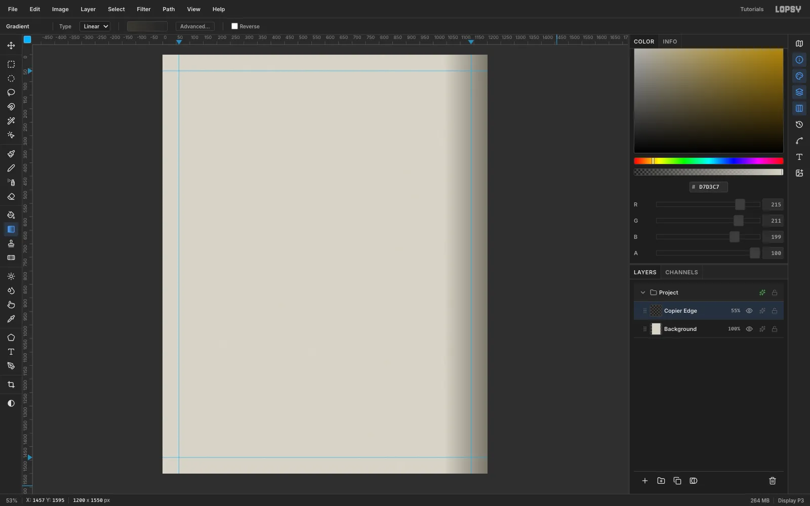

Choose **File → New**, set **1200 × 1550** with **Unit: Pixels**, and
click **Create**. Click the **Background** row, set the foreground to
`#D7D3C7` and choose **Edit → Fill**. Then run **Filter → Add Noise** with
**Mono**, **Gaussian** and **Amount 16** so the paper has grain.

Rename **Layer 1** to **Copier Edge**. With the **Gradient** tool, drag a
linear gradient from `#3A372F` to transparent, starting at the right edge
and ending about 160 px in. Set the layer to **Multiply** at **55%**. That's the shadow a
photocopier lid leaves. Click the rulers to add margin guides at 60 px from
each edge.

## Rotate a safety-orange slab

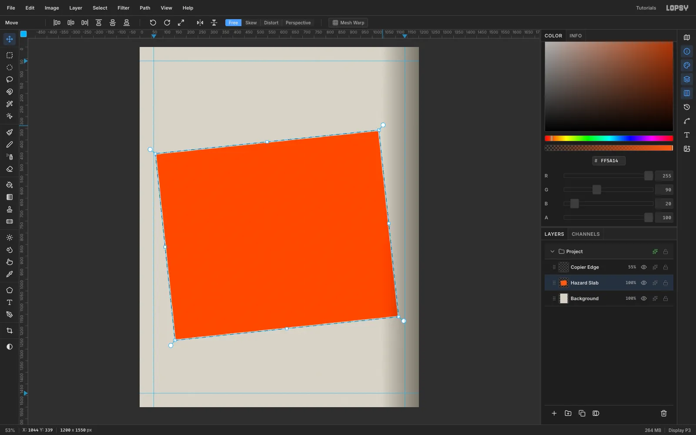

Add a layer called **Hazard Slab**. Draw a rectangular marquee about
**960 × 800**, roughly centred across the page and starting a little over a
quarter of the way down, and fill it with `#FF5A14`. Deselect, marquee the
slab again with a few pixels of padding, switch to the **Move** tool (V) and
drag a corner's round rotation handle to about **−6°**. Press [[Cmd+D]] to
commit. Transforms commit on [[Cmd+D]], not Enter.

> **Tip:** To type an exact rectangle, press [[Cmd+D]] and *click* with the
> Rectangular Marquee. In the dialog, From **110, 410** To **1070, 1210** gives
> this slab.

## Add a halftone screen to the slab

Flat vector orange looks too clean for print. Choose **Layer → Duplicate
Layer** and rename the copy **Slab Screen**. Duplicate places the copy 10 px
right and 10 px down, so with the Move tool press [[Shift+Left]] and
[[Shift+Up]] once each to put it back in register. Run **Filter →
Halftone** with **Dot Size 8**, **Angle 30** and **Softness 2**. Set the
copy to **Multiply** at **30%**. The dots now read as printed ink.

## Build the pavement in perspective

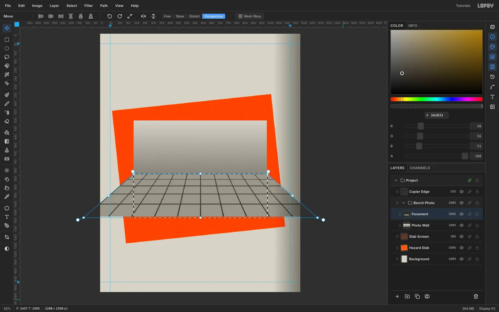

Click the **New Group** button and call it **Bench Photo**. Inside it, add
**Photo Wall**: marquee an **800 × 330** rectangle over the upper middle of
the slab and drag a vertical `#D4D0C6` → `#85827A` gradient through it. Add
**Pavement**: directly below the wall, fill an **800 × 260** rectangle of the
same width with `#9A968C`, overlapping the wall's bottom edge slightly. Then
rule the paving joints with the **Pencil** ([[N]]) at **Size 4** in `#3A3833`:
a line every 52 px down and every 80 px across. Click at one end of each line
and [[Cmd+Shift]]-click at the other so it snaps straight.

Marquee the pavement, pick the **Move** tool and click **Perspective** in
the options bar. Drag the bottom-right corner **300 px** to the right. The
bottom-left mirrors it, and the rows foreshorten like a real floor. Press
[[Cmd+D]], click **Free**, then marquee the photo area, **Select →
Inverse** and press [[Delete]] to trim the overhang.

## Draw the bench and its hoop armrests

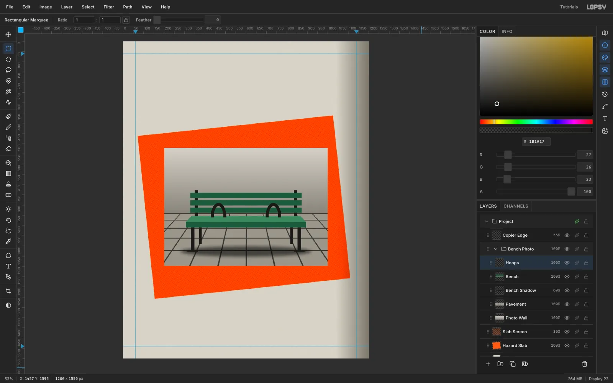

Add **Bench Shadow**. Set the elliptical marquee's **Feather** to 16, fill
a wide flat ellipse under the bench area with black, then set **Feather**
back to 0. Set the layer to **Multiply** at 60%.

On a **Bench** layer, draw the frame with marquee fills: 16 px uprights,
18 px legs and small feet. Add three 26 px back slats and a 28 px front seat
slat, with a lighter lasso trapezoid for the seat top. The hostile part
goes on a **Hoops** layer. For each divider, click with the **Shape** tool
([[U]]) set to an ellipse with a black **Stroke** of **15** and no **Fill**,
and type **61 × 113**. The stroke straddles the edge, so the ring is 76 × 128
outside and 46 × 98 inside. Then marquee the bottom half and delete it. That
leaves an arch that stops anyone lying down.

## Duplicate the spikes with copy and paste

On a **Spikes** layer, use the **Lasso** to fill three triangles, each
22 px wide and 40 px tall, in `#1B1A17`. Add a thin `#A8A69F` highlight
triangle on each one's left side. Marquee the three spikes, press
[[Cmd+C]], then [[Cmd+V]] and drag the paste into the next gap with the
**Move** tool. Repeat until every gap between the hoops is spiked. Then
click the top **Pasted Layer** and choose **Layer → Merge Down** three
times.

## Desaturate and crush the contrast

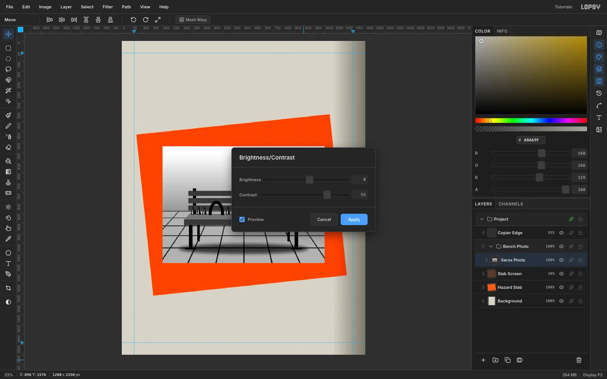

Click the top photo layer and choose **Layer → Merge Down** until
**Spikes**, **Hoops**, **Bench**, **Bench Shadow** and **Pavement** are
merged into **Photo Wall**. Rename it **Xerox Photo**. Run **Filter →
Desaturate**, then **Filter → Brightness/Contrast** with **Brightness 8**
and **Contrast 55**. Photocopies blow out the highlights and crush the
darks, and that's the point.

## Screen it like a photocopy

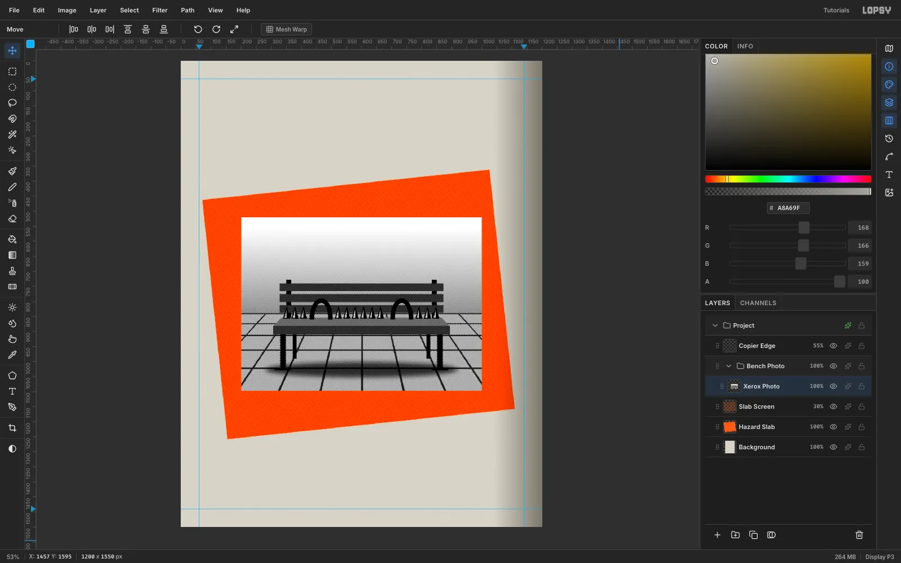

Duplicate **Xerox Photo** and nudge the copy back into register
([[Shift+Left]] and [[Shift+Up]] once each). Run
**Filter → Halftone** with **Dot Size 6**, **Angle 45** and **Softness
2**. Set the copy to **Multiply** at **60%** and **Merge Down**. Finish with
**Filter → Add Noise** (**Mono**, **Gaussian**, **14**). Now the clip-art
bench reads as a grainy newspaper photo.

## Turn it into a taped print

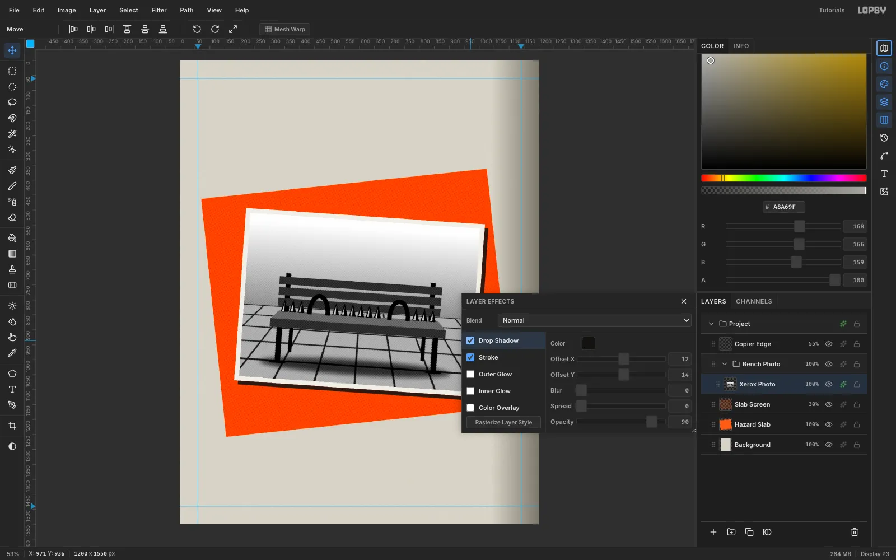

Marquee the photo, rotate it **+4°** with the **Move** tool's rotation
handle, and press [[Cmd+D]]. It now leans against the slab. Open the
layer's effects and add a **Stroke** in `#F1EEE6`, **Width 14**, with
**Position: inside**. That's the white border of a photo print. Add a
**Drop Shadow** in `#141312` with **Offset 12 / 14**, **Blur 0** and
**Opacity 90**, so it sits on the slab like a paste-up.

## Slice the masthead off the page

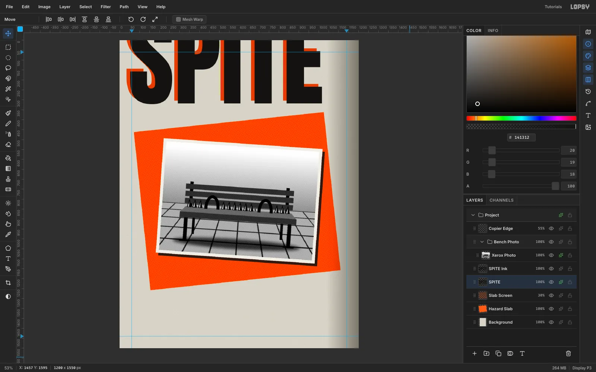

Click **Slab Screen** so the text lands at the root. Choose the **Text**
tool, set **Anton** at **500 px** in `#141312`, click in empty canvas and
type **SPITE**. Drag it so the letter tops sit about **130 px above** the
canvas top. The page cuts the masthead, and that's the anti-design move.

**Duplicate Layer** and rename the copy **SPITE Ink**. It lands 10 px right
and 10 px down; nudge it a further 8 px right and 4 px down. On the original
**SPITE** underneath, add a **Color Overlay** in `#FF5A14` and set the layer's
**Blend** to **Multiply** in the same drawer. The orange ghost reads as a
misregistered second ink.

## Run HOSTILE up the left edge

Create **HOSTILE** in **Abril Fatface** at **190 px** in empty space. A
clashing high-contrast serif against the condensed masthead is part of the
look. Drag it to the middle of the canvas, where the handles are easy to
reach, and press [[Cmd+D]]. Marquee it and hold [[Cmd]] while dragging a
rotation handle so it snaps to **−90°**. Press [[Cmd+D]] again, then drag it
to the left edge, about **22 px** in, so it runs from roughly the top of the
slab down to about 325 px above the bottom of the page.

> **Tip:** Settle the font and size before you rotate live text. Editing a
> rotated text layer afterwards sets it again from scratch, unrotated.

## Hinge FURNITURE under it

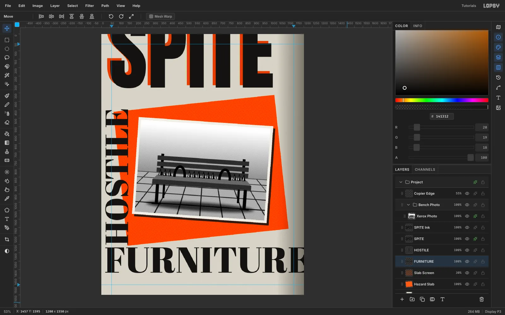

Create **FURNITURE** in Abril Fatface at **214 px**. Move it so its left
edge is flush with HOSTILE's, 22 px in, and its capitals sit just under
HOSTILE's bottom end. The two words form an L-shaped hinge. The right edge cuts
through the final **E**, but the E's arms still show, so it reads as
FURNITURE and not FURNITURI. Keep at least **40 px** between HOSTILE's
bottom and FURNITURE's cap line. A gap of 15 px looks like a mistake, not a
choice.

## Make a hazard-stripe pattern

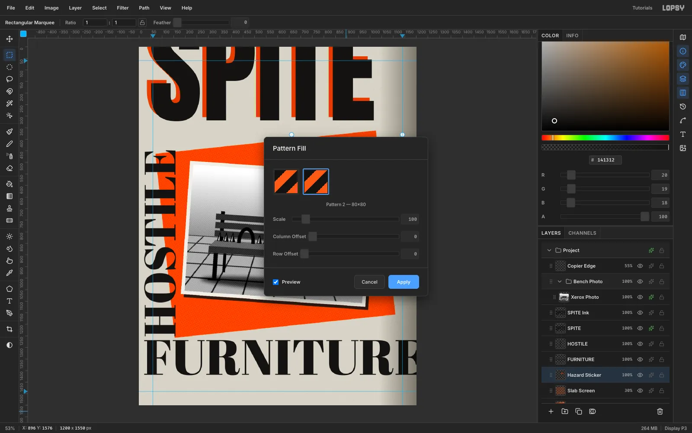

On a temporary **Tile** layer, fill an **80 × 80** square with `#FF5A14`
in an empty corner of the canvas. Fill two black shapes to make diagonal
stripes that repeat seamlessly:

- A triangle in the top-left corner, cut off by a line between the midpoints of the top and left edges.
- A band whose top edge runs from the top-right corner to the bottom-left corner, and whose bottom edge runs from the midpoint of the right edge to the midpoint of the bottom edge.

Marquee the tile exactly and choose **Edit → Define Pattern**, then delete
the Tile layer.

> **Tip:** The stripes only tile cleanly if their corners land exactly on
> the square's corners and midpoints. Zoom in, click those points with the
> **Pen Tool**, click **Commit path**, then **Path to Selection** in the Paths
> panel. That gives you perfectly straight edges to fill.

Add a **Hazard Sticker** layer, marquee a **440 × 170** rectangle over the
slab's top-right corner, and choose **Edit → Fill with Pattern…**. Pick the
new pattern.

## Build the DO NOT SIT sticker

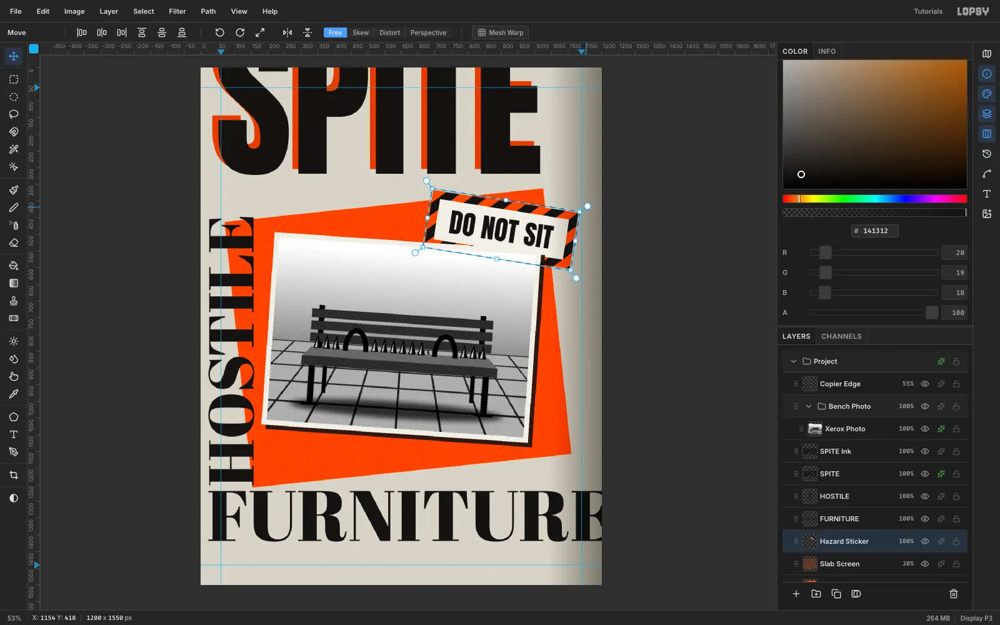

With the sticker rectangle still selected, choose **Select → Shrink…**
**24** and fill with `#F1EEE6`. That leaves an even 24 px of stripes all
round. Type **DO NOT SIT** in **Anton 80** and centre it on the label. Zoom
in and nudge until the cream padding matches on the left and right, and on
the top and bottom. **Merge Down** the text, rotate the sticker **+9°**, and add a hard black
**Drop Shadow** (8 / 10, blur 0, 85%). Drag its row above the **Bench
Photo** group so it overlaps the photo's corner.

## Add the tagline strip

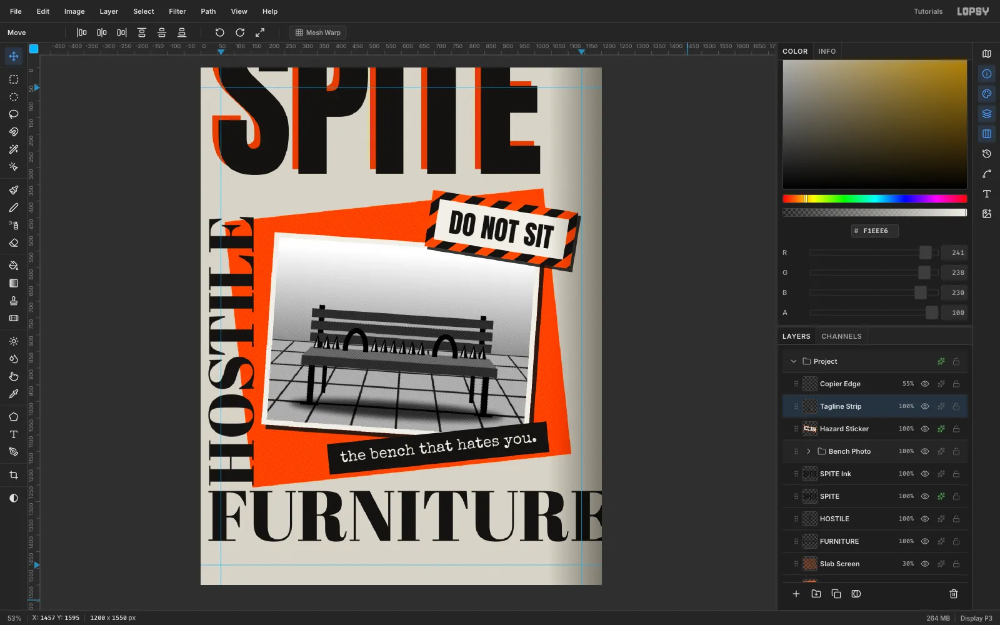

Type **the bench that hates you.** in **Special Elite 46** in `#F1EEE6`.
Under it, fill a black strip that leaves about **36 px** of padding left and
right of the words and **25 px** top and bottom (about **661 × 92**), across
the lower part of the slab. Centre the text, **Merge Down**, then rotate the
strip **−6°** so it matches the slab. It should clear FURNITURE by about 50 px.

## Add a barcode label

Build the label flat first. Fill a `#D9D3C7` rectangle **360 × 104**, set
`*SPITE07*` in **Libre Barcode 39** at **74 px**, and add **SPITE — 07
— 2026** in **IBM Plex Mono** (Medium, 18 px) below it. Merge them down,
rotate the label **87°** (upright, minus 3° of tilt) and drag it so it
overlaps the masthead's **E** by about 10 px. A 2 px black inside
**Stroke** makes it look like a printed sticker.

## Circle the evidence in marker

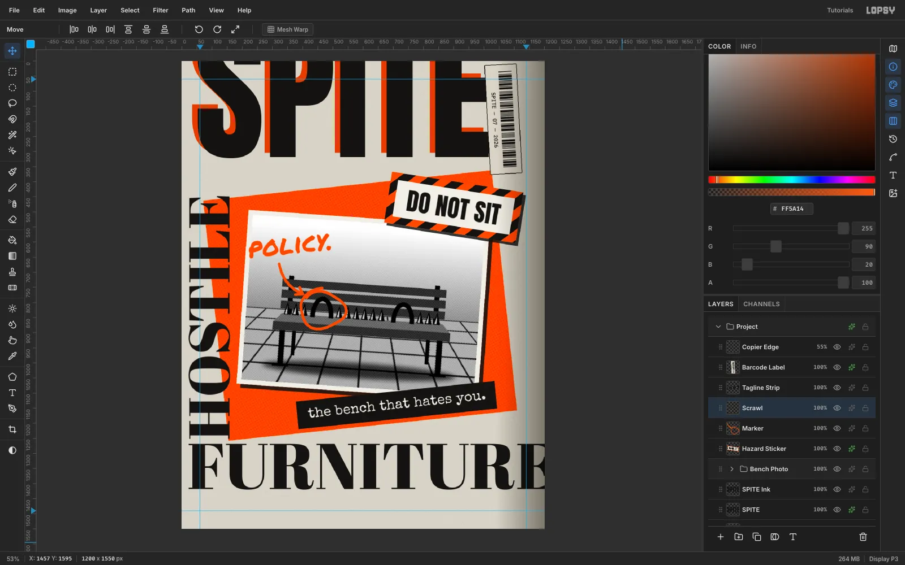

On a **Marker** layer, set the **Brush** to **Size 10**, **Hardness 90**,
in `#FF5A14`. Draw a loose loop around the left hoop that overshoots where
it closes, then draw a curved arrow that stops about 15 px short of the
loop. Add **policy.** in **Permanent Marker** at **90 px** (it sets in
capitals), rotate it **−6°** and place it above the arrow on the photo's
light wall area.

## Tape the photo down

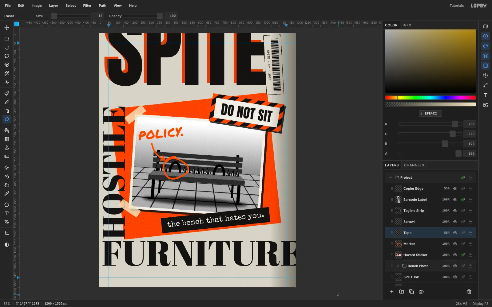

On a **Tape** layer, fill a **160 × 48** rectangle in `#EFE4C2` over the
photo's top-left corner and rotate it **−38°**. Make **Tape 2** over the
bottom-left corner, rotate it **+34°** and **Merge Down**. With the
**Eraser** at **Size 12**, zig-zag across each end so the tape looks torn.
Set the layer to **70%** and give it **Add Noise** (Mono, 22) so it isn't a
flat peach.

## Fill the dead zones

Two empty areas make the layout feel unfinished. Beside the photo, set
**EXHIBIT A** in **Anton 30**, orange on a black box with 16 px / 13 px
padding. **Merge Down** and tilt it **+8°**.

For the stamp, fill a **226 × 101** rectangle in `#FF4A00`, run **Select
→ Shrink** by **5** and press [[Delete]] to leave a frame. Centre
**UNSEATED** (**Anton 50**) and **SINCE 1998** (**IBM Plex Mono** Bold,
20) inside it, then merge both. Rotate the stamp **−9°** and set it to
**Multiply** at **75%**. Nudge it up so it overlaps FURNITURE's baseline,
not just touches it.

## Set the coverlines on the grid

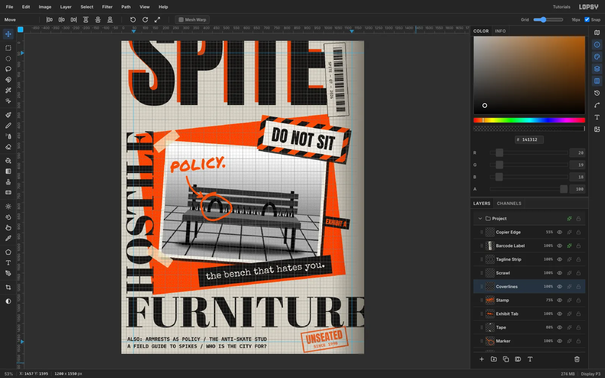

Turn on **View → Show Grid**, which also turns on Snap. Type the coverlines
in **IBM Plex Mono** Bold at **25 px** on two lines: **ALSO: ARMRESTS AS
POLICY / THE ANTI-SKATE STUD** and **A FIELD GUIDE TO SPIKES / WHO IS THE
CITY FOR?**. Drag them into the bottom-left corner, under FURNITURE. Then
untick **Snap** in the options bar and turn **Show Grid** off, and nudge with
the arrow keys until the left edge lines up exactly with HOSTILE and
FURNITURE. (While Snap is on, each arrow press jumps a whole grid cell.)
That hidden grid keeps the chaos readable.

## Run the issue line down the right edge

Type **NO.07  //  AUTUMN 2026  //  $9.00  //  A QUARTERLY AGAINST
COMFORT** in **IBM Plex Mono** Medium, **22 px**, `#111111`. Rotate it
**+90°** with [[Cmd]] held for the 15° snap, then drag it onto the right
margin guide. Put it and the coverlines in a **Small Type**
group: click **New Group**, then drag each row's grip onto the group row.
Now you can move both blocks together.

## Add toner specks

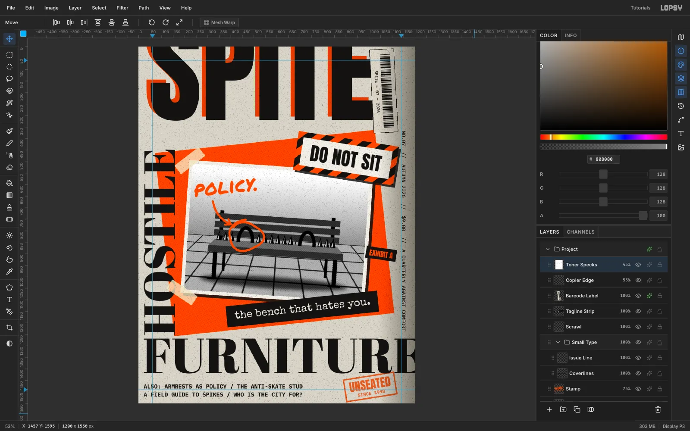

Above **Copier Edge**, add **Toner Specks**. Fill it with `#808080` and
run **Add Noise** (**Mono**, **Uniform**, **100**). That spreads values
from about 78 to 178. Run **Filter → Threshold** at **Level 80**: only the
darkest 2% turn black and everything else turns white. Set the layer to
**Multiply** at **45%**, and the white disappears.

Make a **Dropouts** layer the same way, but use **Threshold 176** and set
it to **Screen** at 55%. It leaves white specks where the toner didn't
stick.

## Add copier streaks

Add **Copier Streaks**: fill with `#808080`, run **Add Noise** (Mono,
Gaussian, **60**), then **Filter → Motion Blur** with **Angle 90** and
**Distance 80**. Set it to **Overlay** at **45%**. The vertical streaks
look like a dirty photocopier drum dragging toner down the page.

## Slice through the masthead

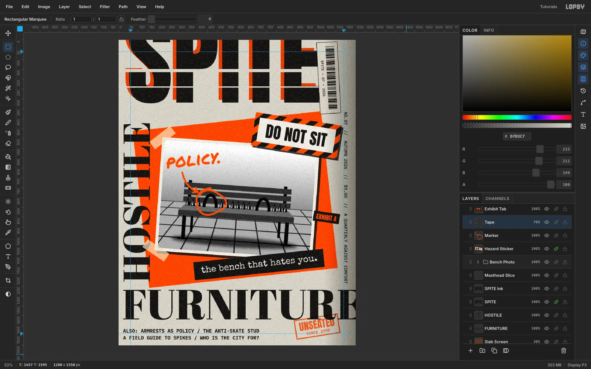

Cropping the top of SPITE isn't enough on its own. Click **SPITE Ink**,
add a **Masthead Slice** layer, and fill two paper-coloured (`#D7D3C7`)
bands across the masthead: one **16 px** tall a little below the top of the
page, through the upper part of the letters, and one **6 px** tall about
90 px lower. Give the layer **Add Noise** (Mono, 16) so the bands
match the paper grain. The letters now look cut apart and re-pasted.

Save with **File → Save Project** and export with **File → Quick Export
PNG**.

> **Tip:** Anti-design still needs a grid. Here, HOSTILE, FURNITURE and the
> coverlines all share one left edge, 22 px in, and every label has even padding. Let the
> type break the page, but keep the spacing consistent.
