Anti-design breaks the rules on purpose: default-looking fonts, clashing colours, type stretched out of shape, and bits of computer interface where they don't belong. The trick is that every broken rule still has to look like a decision. In this tutorial you'll make the front cover for an imaginary novel, **Misprint Oracle**, about an oracle that speaks in typos.

The cover pretends to be a printer's proof that's been marked up and sent back. The title is misspelled **MISPIRNT**, and a red proofreader's mark tells the printer to swap the I and the R. The page also has crop marks, registration targets, a colour bar and a cyan plate that's slipped out of register. In the middle, a photo of an eye is pixelated and printed in three flat inks. Below it, **ORACLE** is set like a web link, with a cursor hovering over it.

The fonts are free Google Fonts that stand in for the defaults everyone recognises:

- **Tinos** (Times New Roman) for the title and *a novel*
- **Arimo** (Arial) for ORACLE, the author and the stamp
- **Cousine** (Courier) for the tagline and tooltip
- **Comic Neue** (Comic Sans) for the blurb
- **Reenie Beanie** for the handwritten margin note

The palette:

- Paper `#F1EEE4`, ink `#111111`
- Proof red `#E3120B`, eye yellow `#FFF23A`
- Misregistration cyan `#00AEEF`, band yellow `#FFF200`
- Link blue `#0000EE`, selection blue `#A9CBFF`, tooltip cream `#FFFFE1`
- Stamp blue `#2B3FBF`
- Colour bar `#00AEEF` / `#EC008C` / `#FFF200` / `#111111` / `#E3120B` / `#22B14C` / `#0000EE` / `#808080` / `#C0C0C0`

The eye is a public-domain (CC0) close-up photo from Wikimedia Commons, *A human male brown eye*. Any sharp close-up of an eye will work.

Each part of the cover gets its own group. New layers appear above whichever layer is selected, so every group starts with an empty base layer: click it, and anything you add lands inside that group. Some screenshots were re-taken from the finished file, so the Layers panel sometimes lists a layer you haven't made yet.

## Set up the paper and margins

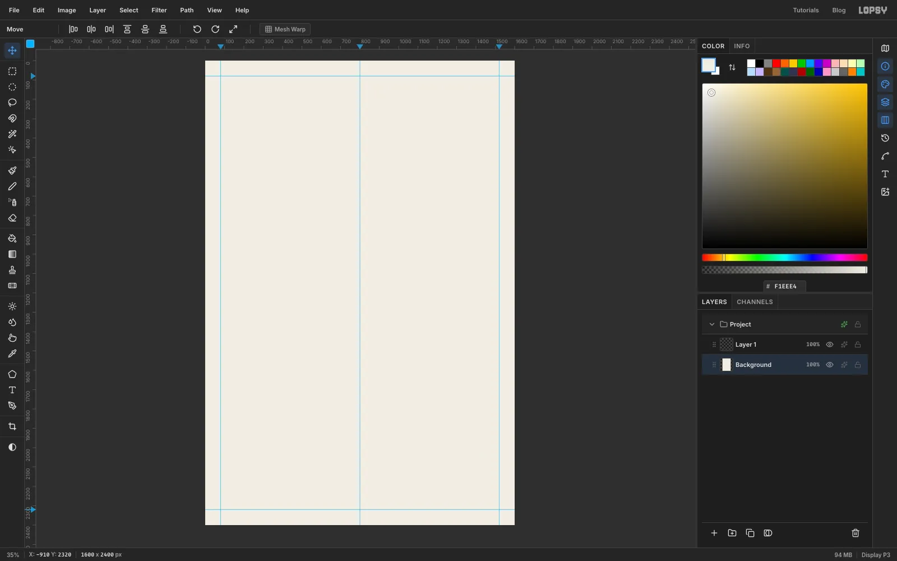

Open [Lopsy](/) and create a **1600 × 2400** pixel document. That's a 2:3 portrait, the usual shape for a paperback.

Select **Background**, set the foreground to paper `#F1EEE4` and choose **Edit → Fill**. Rename the empty **Layer 1** to `Toner Grain` and leave it empty until the last step.

Now add guides. Click the top ruler at **80**, **800** and **1520** to make three vertical guides, and click the left ruler at **80** and **2320** for two horizontal ones. The outer four mark the trim: keep everything that matters inside them. The middle one is the centre line.

## Print a registration target

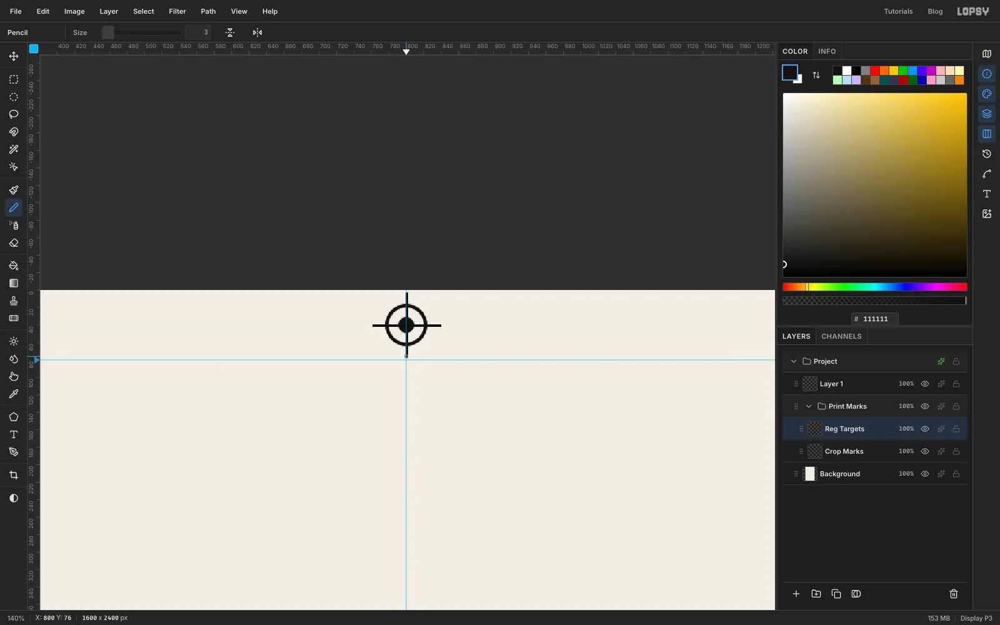

Printers put small targets outside the trim so they can line up each ink. Add them here and the cover reads as a proof sheet straight away.

Click **New Group** and name it `Print Marks`. Inside it, add a layer called `Crop Marks`. Pick the **Pencil** at **Size 3** in ink `#111111`. At each corner, click and [[Shift]]-click two lines about 50 px long in the margin, one lined up with each trim guide and pointing away from the page. Leave a small gap between each line and the corner.

Add a layer called `Reg Targets`, then zoom in to the top margin where it meets the centre guide. Centre the target on the guide, about 40 px down from the top edge.

1. Drag an **Elliptical Marquee** about 48 px across and choose **Edit → Fill**.
2. Drag a circle about 40 px across on the same centre and press [[Delete]], which leaves a thin ring.
3. Drag a small circle about 18 px across in the middle and fill it.
4. With the **Pencil**, [[Shift]]-click a horizontal and a vertical line through the centre, each a little longer than the ring.

Make a second target in the bottom margin.

> **Tip:** Marquees snap to guides. If a small circle collapses to a sliver, zoom in further so its edges are clear of the guide.

## Add a colour bar

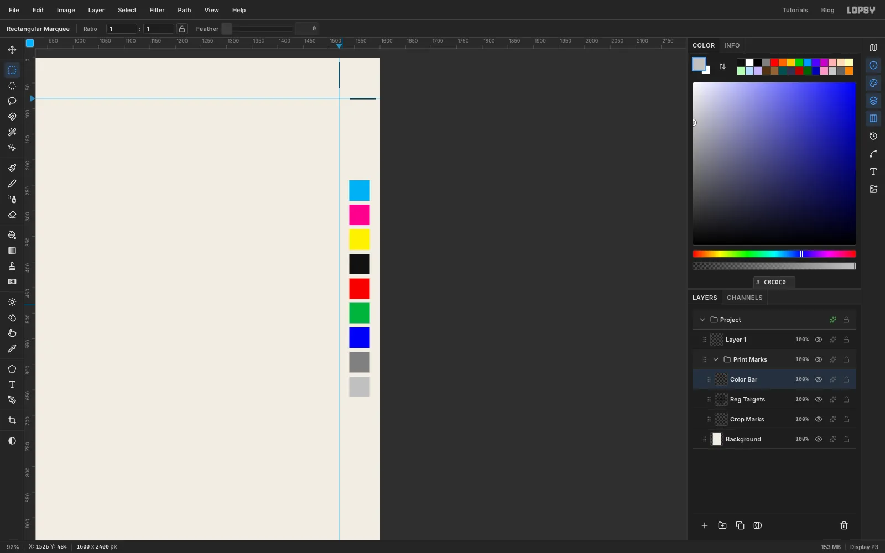

Add a layer called `Color Bar`. You'll make a column of nine 40 px squares in the right margin, 8 px apart, starting about 240 px from the top.

Choose the **Rectangular Marquee** and click once on the canvas without dragging. That opens a dialog where you type the corners exactly. For the first square, enter From **1540, 240** to **1580, 280**, then fill it with cyan `#00AEEF`. Repeat for each square, moving down 48 px each time, and fill them in order with magenta, yellow, black, red, green, blue, mid grey and light grey.

## Set the misspelled title

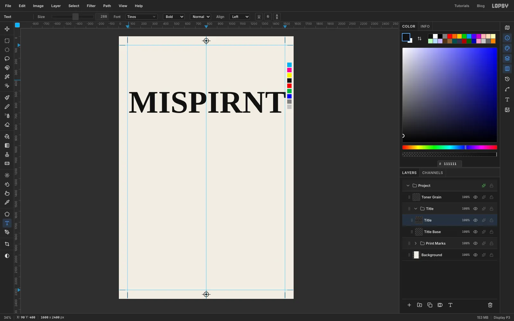

Click the `Print Marks` group and choose **New Group**. Name it `Title` and add an empty layer inside it called `Title Base`.

Pick the **Text** tool. Choose **Tinos**, **Bold**, size **288**, in ink. Click in the empty space below the top margin and type `MISPIRNT`. Yes, it's spelled wrong. That's the joke the proof marks will fix later. Press [[Tab]] to commit.

At this size the word spans almost the full width between the margin guides. Rename the layer `Title Type`.

## Stretch the title

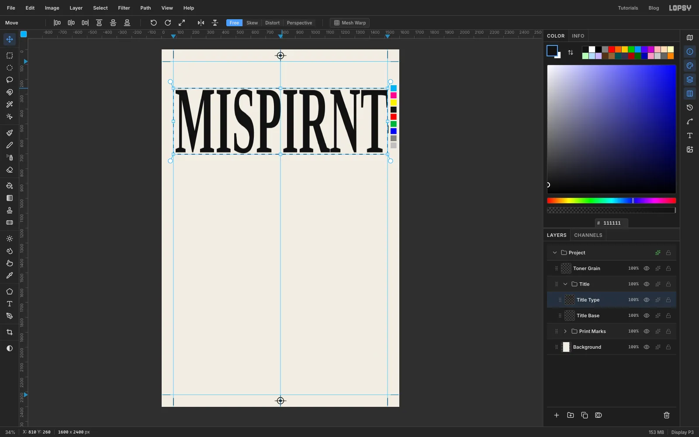

Distorted type is a classic anti-design move. You'll stretch the title to more than twice its height without changing its width.

1. Click **Rasterize Layer** in the Layers panel.
2. Drag a marquee tightly around the word.
3. Switch to the **Move** tool and drag the **top middle** handle up by about 240 px. The letters should now be roughly 430 px tall.
4. Press [[Cmd+D]] to commit.

Nudge the word with the arrow keys until it's centred between the margins.

> **Tip:** Draw that marquee well clear of the guides. If one of its edges snaps onto a guide, the letters outside the selection aren't stretched and get left behind as a thin sliver.

## Knock the cyan plate out of register

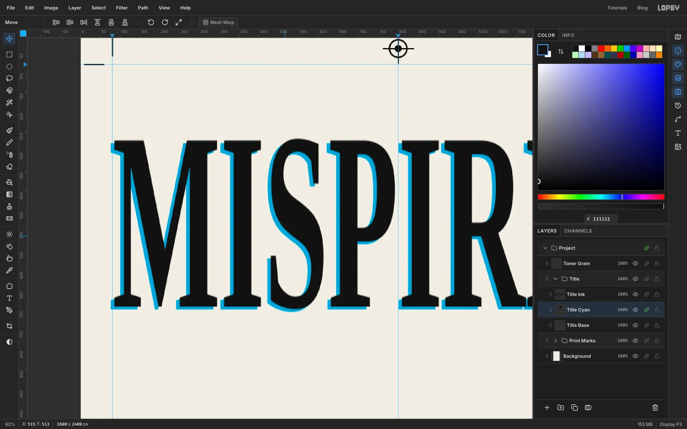

On a cheap print run the inks don't always line up. Fake it with a cyan copy:

1. With `Title Type` selected, click **Duplicate Layer**. Click the copy's row, then rename it `Title Ink`.
2. Rename the original, which is underneath, to `Title Cyan`.
3. Give `Title Cyan` a **Color Overlay** effect in cyan `#00AEEF`. Then set the layer's own blend mode in the Layers panel to **Multiply**.
4. With the **Move** tool, nudge `Title Cyan` about 9 px left and 7 px down.

## Cut a Difference band through the title

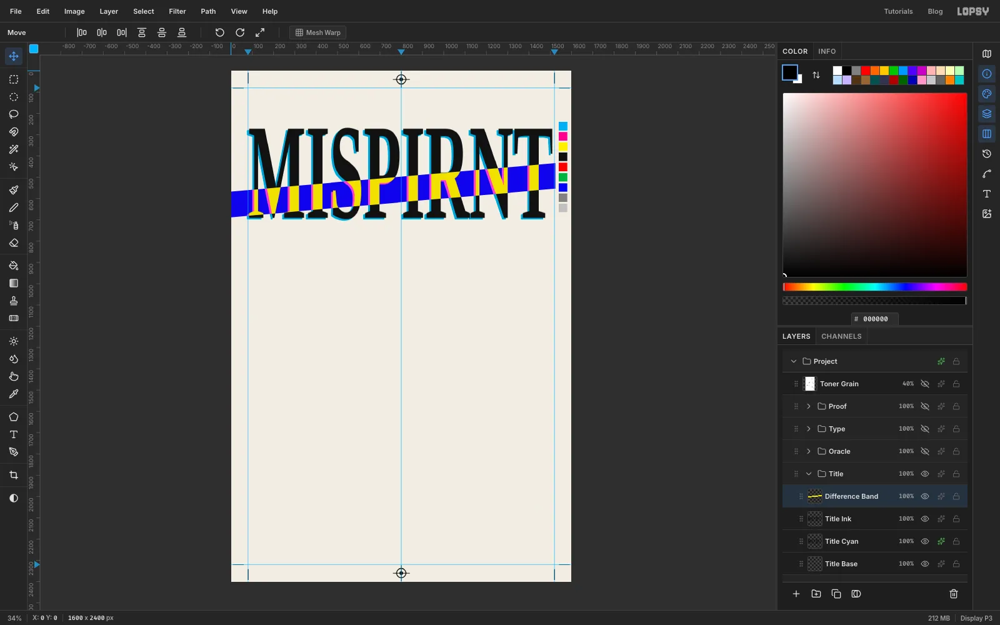

Add a layer called `Difference Band` above `Title Ink`. With the **Lasso**, draw a long, thin slanted band, about 120 px tall, across the lower half of the letters. Start it at the left edge of the page and end it at the right trim guide, so it doesn't run into the colour bar. Let it rise gently from left to right.

Fill the band with yellow `#FFF200` and set the layer to **Difference**. Difference subtracts colours. Yellow taken away from the off-white paper leaves a deep blue, and yellow taken away from black ink stays yellow. One fill gives you a blue band with yellow letters inside it, and the cyan fringe turns hot pink.

## Paste, pixelate and tilt the eye

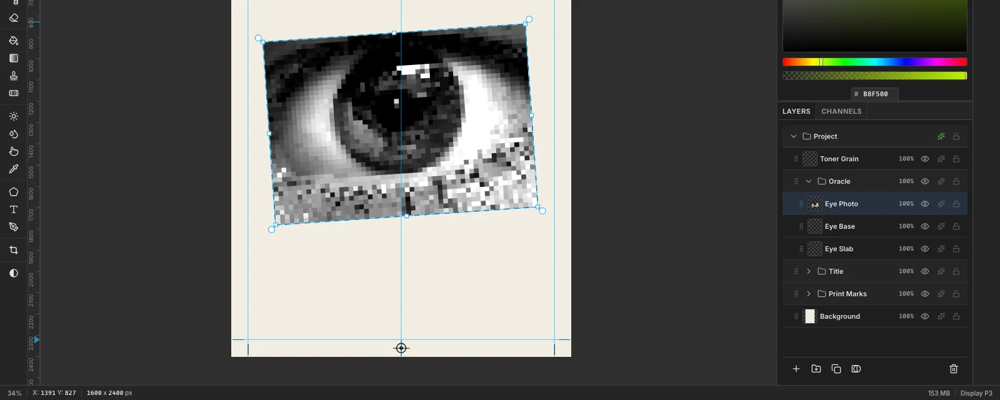

Collapse `Title`, click it and make a new group called `Oracle`. Inside it, add two empty layers: `Eye Slab` for the black card you'll add later, then `Eye Base` above it as the base layer for the paste. You can delete `Eye Base` once the photo is in.

First crop and scale your photo to about 1240 × 850. Copy it, click `Eye Base` and press [[Cmd+V]]. It pastes as a new layer at the top-left corner with a transform box. Press [[Cmd+D]] to drop the paste selection, then rename the layer `Eye Photo`.

1. **Filter → Desaturate.**
2. **Filter → Brightness/Contrast…** with **Brightness −5** and **Contrast 40**.
3. **Filter → Pixelate…** with **Block Size 22**.
4. With the **Move** tool, drag the eye down into the middle third of the page, centred left to right.
5. Marquee around it and drag the rotate handle (just outside the top-right corner) about **4° anticlockwise**. Press [[Cmd+D]].

> **Tip:** Pixelate takes each block's colour from the pixel at its centre, so a partly filled block on the photo's edge can vanish or fill in completely. Pixelate before you trim the photo, not after.

## Separate the eye into three inks

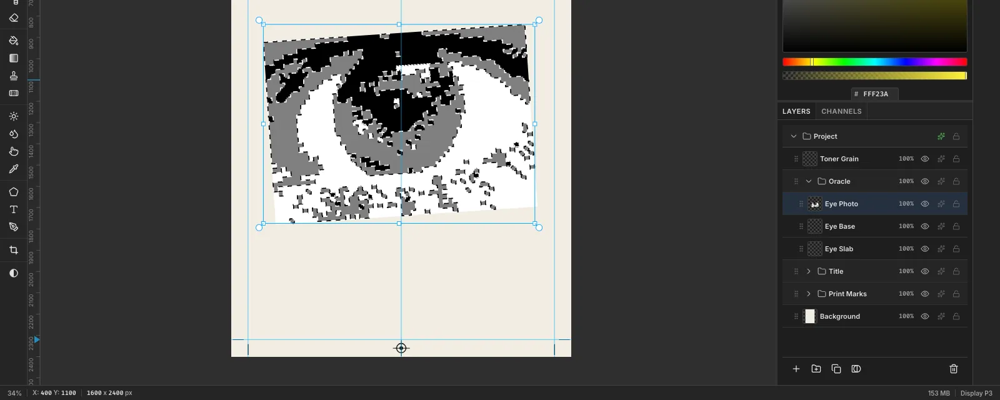

Now print the eye in three flat inks, like a cheap screen print.

1. Run **Brightness/Contrast** again at **Brightness 22**, **Contrast 15**. This lightens the brown iris so it doesn't merge with the pupil.
2. Run **Filter → Posterize…** with **Levels 3**. Every block is now black, mid grey or white.
3. Pick the **Magic Wand** with **Tolerance 20** and **Contiguous** turned off. Click any grey block to select all of them, and fill the selection with red `#E3120B`.
4. Press [[Cmd+D]], click a white block, and fill with yellow `#FFF23A`.

The black stays black. The iris becomes a red ring around a black pupil, the white of the eye turns yellow, and the lashes stay black.

## Put a black slab behind it

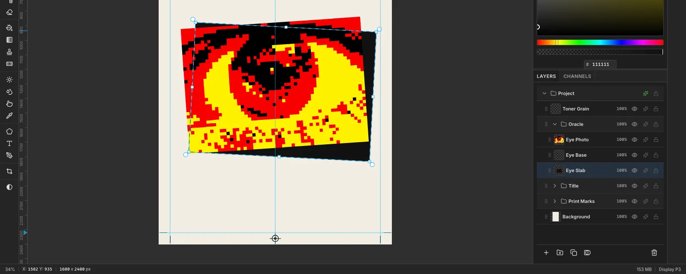

Select `Eye Slab`. Drag a marquee about the size of the eye panel, but offset about 50 px to the right and 30 px down from it. Fill it with ink.

Switch to the **Move** tool and rotate the slab about **3° clockwise**, the opposite way to the eye. Press [[Cmd+D]]. The two tilts disagree, so the card peeks out on the right and along the bottom. That looks like a badly pasted-up print, not a drop shadow.

## Set ORACLE as a hyperlink

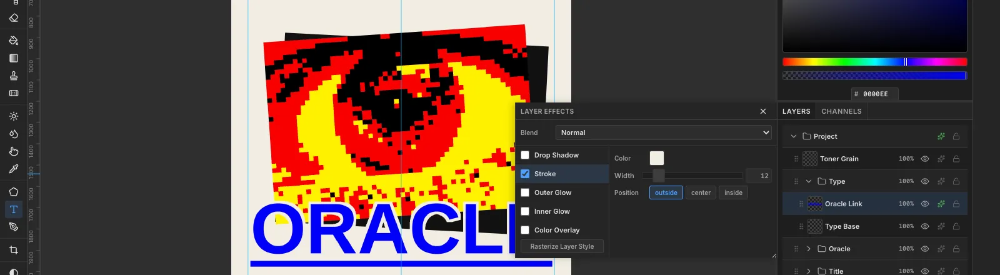

Collapse `Oracle`, click it and make a group called `Type` with an empty layer inside called `Type Base`.

Pick the **Text** tool and turn on **Underline** in the options bar. Choose **Arimo**, **Bold**, size **336**, in link blue `#0000EE`. Click in empty space, type `ORACLE` and press [[Tab]]. Rename the layer `Oracle Link`.

Move it so the top third of the letters overlaps the bottom of the eye. Blue on black is hard to read, so give the layer a **Stroke** effect in paper `#F1EEE4` at **Width 12**. That cuts a clean outline through the eye wherever the letters cross it.

> **Tip:** Clicking a text layer in the Layers panel loads its style into the Text tool. Before you type the next piece of text, click a normal layer and turn **Underline** off, or everything after this will be underlined too.

## Add a cursor and a tooltip

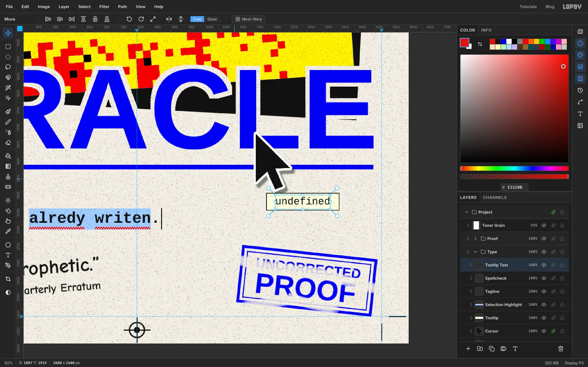

A mouse pointer resting on the link makes it obvious this is a web link.

1. Add a layer called `Cursor` above `Oracle Link`. Zoom in and use the **Lasso** to draw a classic arrow pointer from straight segments, about 160 px tall, with its tip on the bottom of the L. Go from the tip straight down the left side, slant in to the notch where the tail starts, down and right along the tail, back up the other side of the tail, out to the right-hand point of the arrowhead, and back to the tip. Fill it with ink.
2. Give it a white `#FFFFFF` **Stroke** at **Width 7** and a soft **Drop Shadow** (**Offset X 8**, **Offset Y 10**, **Blur 6**, **Opacity 45**).
3. Add a layer called `Tooltip`. Marquee a box about 216 × 52 px just under the cursor's tail and fill it with ink. Choose **Select → Shrink…** by **2** and fill with tooltip cream `#FFFFE1`, which leaves a 2 px border.
4. Type `undefined` in **Cousine** at **30** in ink, name the layer `Tooltip Text`, and centre it in the box with the arrow keys.

## Spell-check the tagline

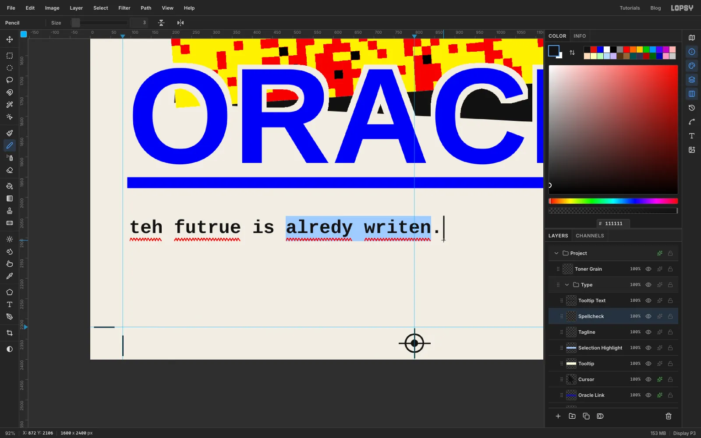

Add a layer called `Selection Highlight` first, then set the tagline above it. Type `teh futrue is alredy writen.` in **Cousine**, **Bold**, **46**, in ink. Line its left edge up with the O of ORACLE, about 120 px below the underline. Name the layer `Tagline`.

Cousine is monospaced, so every letter is the same width. That makes the rest easy to line up.

- **Selection.** On `Selection Highlight`, marquee from the start of *alredy* to the end of *writen*, a little taller than the line, and fill with selection blue `#A9CBFF`.
- **Squiggles.** Add a layer called `Spellcheck` above the tagline. With the **Pencil** at **Size 2** in proof red, zoom in and drag a tight zig-zag under each misspelled word: *teh*, *futrue*, *alredy* and *writen*. Zig up and down about 6 px every 3–4 px along. The red wavy line from a word processor's spell-checker is what you're imitating.
- **Caret.** With the **Pencil** at **Size 3** in ink, [[Shift]]-click a short vertical line just after the full stop.

## Draw the transposition mark

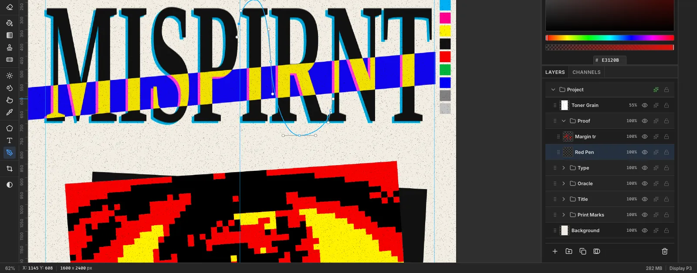

Proofreaders mark two swapped letters with an S-shaped line. It goes over the first letter, crosses down between them, and goes under the second.

Make a group called `Proof` above `Type`, with a layer inside called `Red Pen`. Set the foreground to proof red. Pick the **Pen** tool and set **Stroke** to **10** in the options bar.

Drag out five smooth anchors. At each one, press and drag in the direction the line should travel:

1. Start on the left side of the I, partway up, and drag upwards.
2. Go just above the top of the I and drag to the right.
3. Go into the narrow gap between the I and the R, halfway down, and drag straight down with long handles.
4. Go just below the bottom of the R and drag to the right.
5. Finish on the right side of the R and drag upwards.

Press [[Enter]] to stroke the path in red.

## Circle the margin note and add the author

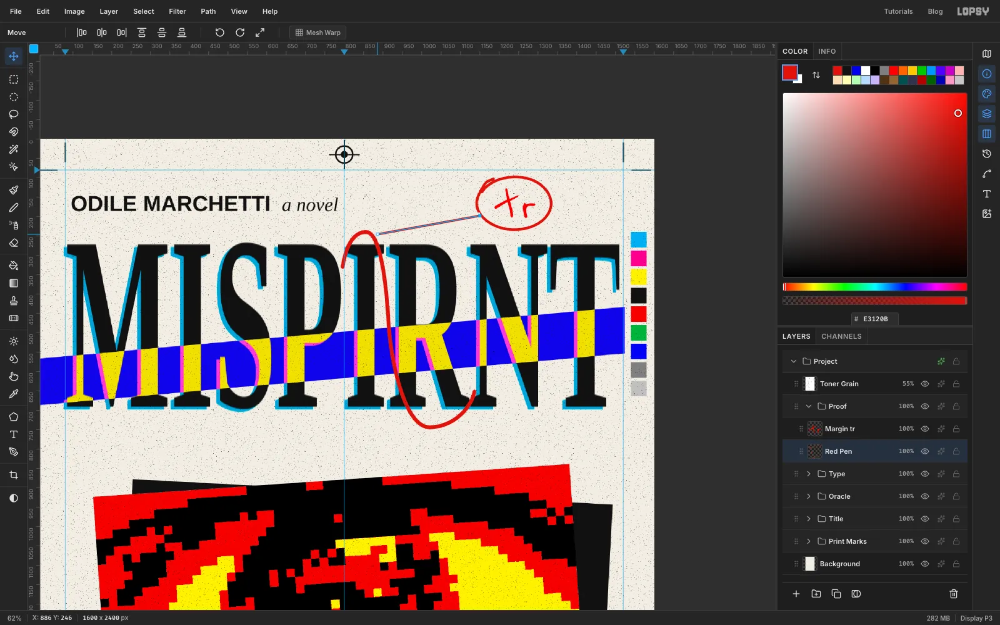

A proof mark always comes with a note in the margin.

1. Type `tr` in **Reenie Beanie** at **150** in proof red, and move it to the top margin, above the R and N. Name it `Margin tr`.
2. On `Red Pen`, draw a loose circle around it with the **Pen**, using five smooth anchors. End slightly past the start and a little outside it, so it looks drawn by hand rather than with a compass. Press [[Enter]] at **Stroke 7**.
3. Draw a two-anchor line from the circle down to the top of the S-curve and stroke it at **6**. Start at the circle, not the S-curve: if you click on a path that's still selected, the Pen adds an anchor to it instead of starting a new line.

Click `Type Base` in the `Type` group. On the left of the same margin, type the author's name, `ODILE MARCHETTI`, in **Arimo Bold** at **56** in ink, and name it `Author`. Then type `a novel` in **Tinos**, **Italic**, at **50** in ink, on the same baseline, and name it `A Novel`. Switch the Text tool back to **Normal** style afterwards, or the next text will be italic too.

## Tilt the blurb as a group

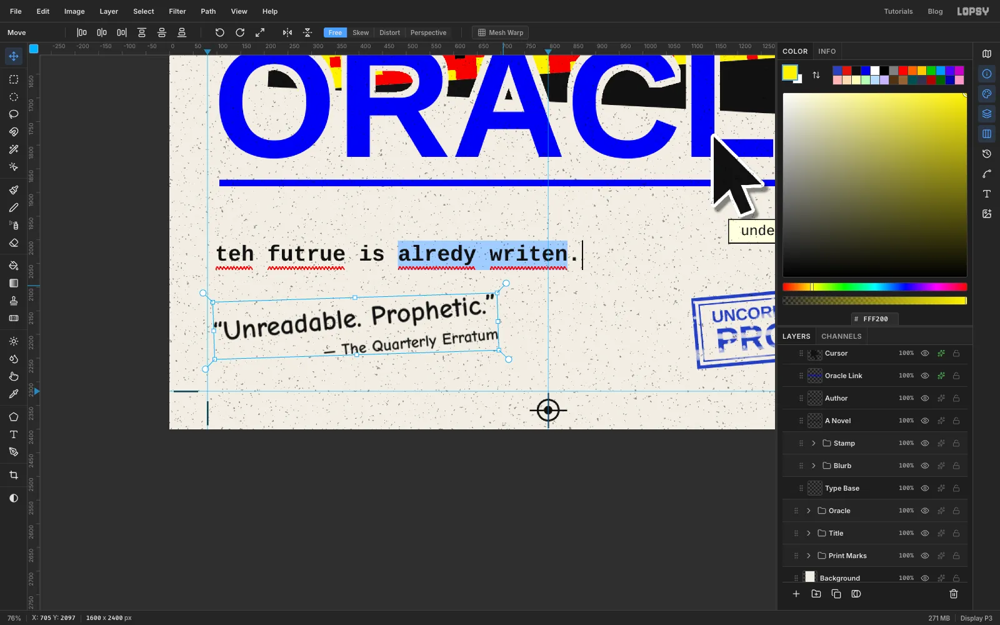

Inside `Type`, make a group called `Blurb` with an empty `Blurb Base` layer. Type `“Unreadable. Prophetic.”` in **Comic Neue**, **Bold**, **58** in ink, and `— The Quarterly Erratum` in **Comic Neue**, **Regular**, **34** in ink. Put the quote at the left margin, under the tagline, then move the attribution under it so its right end lines up with the closing quote mark.

Rasterize both layers. Then click the `Blurb` group row, pick the **Move** tool with nothing selected and drag the rotate handle about **4° anticlockwise**. Both lines turn together around one centre. Press [[Escape]] to commit. A transform with nothing selected is committed with [[Escape]]. [[Cmd+D]] is for transforms of a marquee selection.

> **Tip:** Rasterize text before you rotate a group that contains it. Live text that gets edited after the turn can re-render upright.

## Stamp it UNCORRECTED PROOF

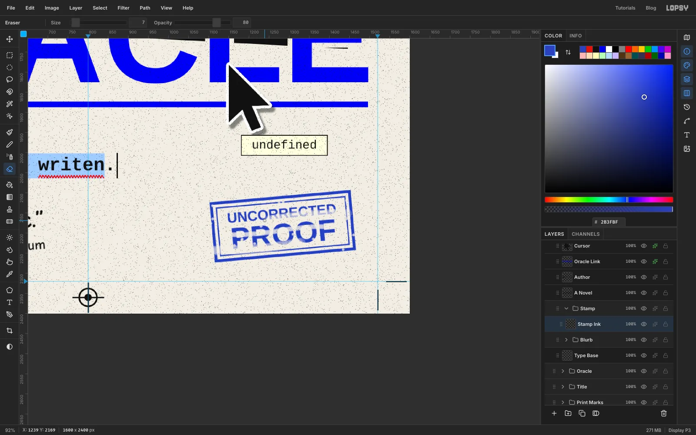

Make a group called `Stamp` inside `Type`, with a layer called `Stamp Ink`. Work in stamp blue `#2B3FBF`, which is duller than the link blue, so the stamp doesn't compete with ORACLE.

1. **Frame.** Marquee about 350 × 150 px at the bottom right, inside the margins, and fill it. **Shrink** the selection by **7** and press [[Delete]]. Marquee a second box whose edges sit 14 px inside the outside of the first, fill it, **Shrink** by **3** and delete again to leave a thin inner frame.
2. **Words.** Type `UNCORRECTED` in **Arimo Bold** at **35** and `PROOF` at **74**. Centre them both in the inner frame with an equal gap above and below.
3. Rasterize both, then use **Layer → Merge Down** twice to merge them into `Stamp Ink`.
4. Click the `Stamp` group row and rotate it about **5° anticlockwise** with the **Move** tool, as you did the blurb. That's the same direction as the blurb. Press [[Escape]] to commit.
5. **Wear.** Pick the **Eraser** at **Size 26**, **Opacity 28**. Drag two long streaks that follow the stamp's angle, one through the top line and one along the bottom. Add a thinner streak at **Size 14**, then click a scatter of small specks at **Size 7**, **Opacity 80**.

## Close the gap with a group move

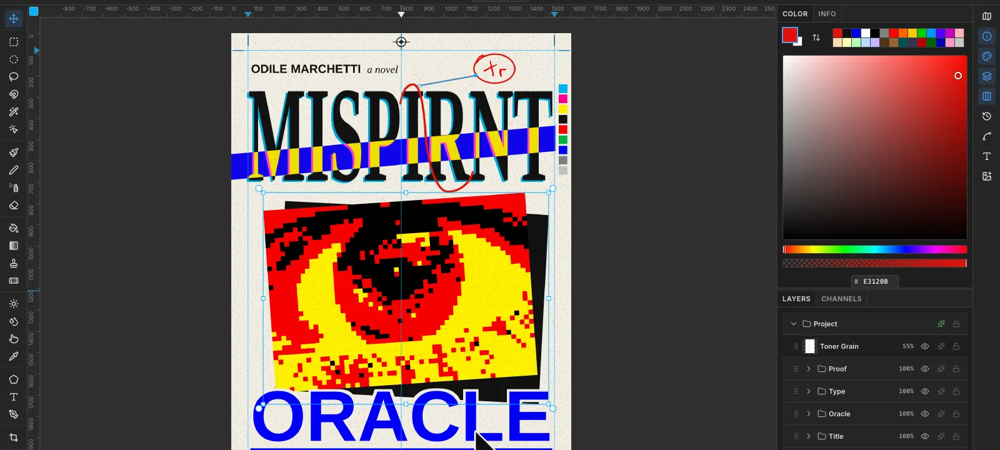

Step back and look at the whole page. There's a dead band of empty paper between the title and the eye, which splits the cover in two. Pull everything closer together:

1. Click the `Oracle` group row, pick the **Move** tool, and drag the eye up about **90 px**. The eye and its slab move as one.
2. Click `Oracle Link`, then [[Shift]]-click `Cursor` to select both. With the **Move** tool, press [[Shift+↑]] nine times. Each press moves 10 px, so they go up the same 90 px.
3. Select the tagline layers the same way, `Selection Highlight` through `Spellcheck`. Press [[Shift+↑]] four times and [[↑]] four times to move them up 44 px.
4. Move `Tooltip` and `Tooltip Text` by the same amount so the box sits just under the cursor's tail again.

## Trim the underline

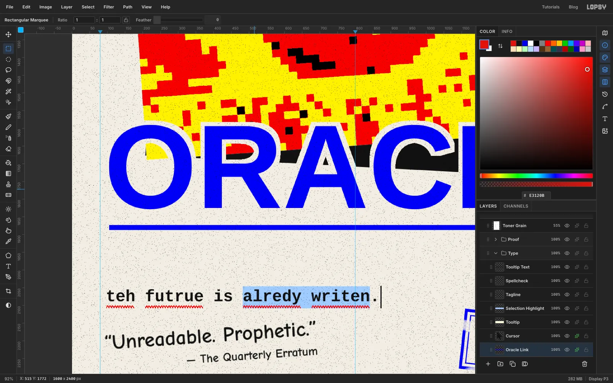

A text underline runs the full width of the text box, so it starts a little left of the O. It's also quite heavy. Rasterize `Oracle Link` and zoom in on the underline:

- Drag a marquee over the top half of the underline, across the whole width of the page, and press [[Delete]]. That leaves a line about 14 px thick.
- Marquee and delete the short bits that stick out past the left edge of the O and the right edge of the E.

## Give the eye a pupil

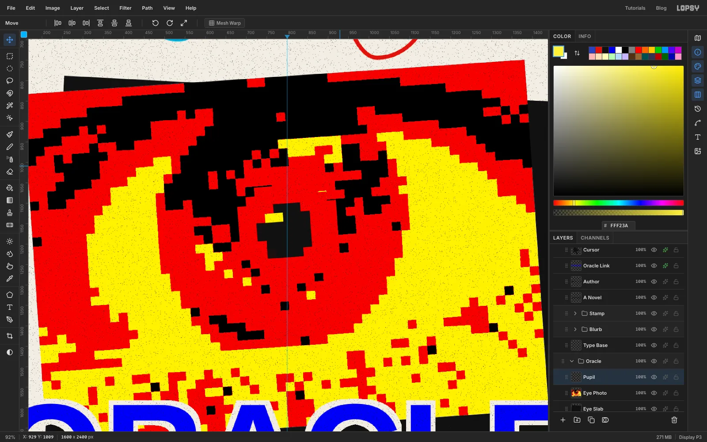

The posterized pupil is a ragged blob, so add a clean one on top.

1. In the `Oracle` group, add a layer called `Pupil` above `Eye Photo`.
2. Drag a circle about 256 px across over the iris and fill it with proof red. On the same centre, drag a circle about 136 px across and fill it with ink.
3. Marquee a small rectangle, about two blocks wide and one tall, at the top-left of the pupil, and fill it with eye yellow. That's the catch-light.
4. Run **Pixelate** at **22** so the pupil matches the eye's blocks. Marquee it and rotate it **4° anticlockwise** to match the eye's tilt.

## Add photocopier toner

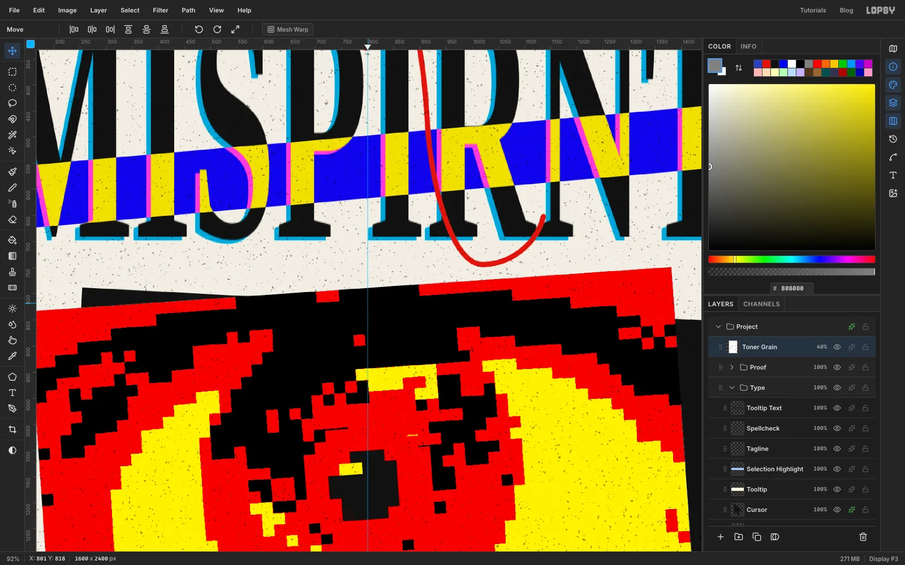

Finish with the speckle a photocopier leaves behind. Select the empty `Toner Grain` layer at the top of the stack.

1. Fill the layer with mid grey `#808080`.
2. Run **Add Noise** at **100** with **Mono** and **Uniform**.
3. Run **Gaussian Blur** at **3** so the noise clumps into small blobs.
4. Run **Threshold** at about **111**, so only a sparse scatter of the darkest blobs stays black and everything else turns white. The right level depends on the noise, so watch the preview.
5. Set the layer to **Multiply** at **40%**. The white disappears and only the specks print.

Save with **File → Save Project**, then **File → Quick Export PNG**.

> **Tip:** Anti-design still needs a hierarchy. Here the title, the eye and ORACLE are the only big things. Everything else is small, and the mess is limited to a few clashing inks.
