In the 1920s and 30s, Portugal had hundreds of fish canneries. Each one wrapped its tins in small lithographed labels that now look like miniature posters: arched windows, sunbursts, stepped "ziggurat" ornaments, and gold type on deep colours. In this tutorial you'll design one for an invented brand, **Jubilee Sardines**, packed in Matosinhos in 1925.

It's a fully drawn piece with no photos. Period labels were drawn by studio artists and printed in a few flat inks, so you'll stick to five inks plus a few lighter tints of the green.

Along the way you'll use:

- **Combined selections**: Shift to add, Alt to subtract and Shift+Alt to intersect.
- **Select → Grow and Shrink** for rims, outlines and an inline title.
- **Filter → Sunburst** clipped to a selection, used three different ways.
- **Edit → Define Pattern** and **Fill with Pattern** for pinstripes and engraved belly hatching.
- **Move-tool scaling and rotation**, **Duplicate Layer** and **Merge Down**.
- **Pencil** Shift+click lines for every gold rule and ornament.
- The **Pen tool** plus **text on a path** for the arched line.
- **Groups**, **layer effects** (Stroke, Drop Shadow) and **blend modes** for the print texture.

The fonts are free Google Fonts:

- **Limelight**, a 1930s Deco display face, for JUBILEE and 1925
- **Josefin Sans** SemiBold, a geometric sans, for everything else

The palette:

- Label green `#0F4A3A`, pinstripe `#1F5C49`, deep green `#0A2E24`
- Sky tints `#2C6B55` → `#5B917A` → `#8DB59C` → `#BFD6BF` → `#EFE3C2`
- Gold `#C9973F` / `#D9AE5C` / `#E6C47E`, leaf veins `#8E6A2C`
- Cream `#EFE3C2`, band black `#141414`, red `#A8322B`
- Sardine back `#17392F`, belly hatching `#667764`, olives `#3F4A1E`

## Create a 2400 × 1500 document

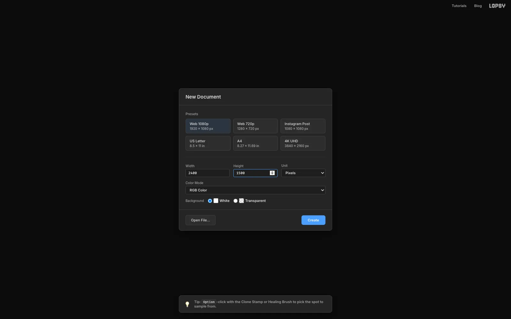

Open [Lopsy](/). In the **New Document** dialog, set **Width** to `2400` and **Height** to `1500` pixels and click **Create**. A wide landscape sheet suits the long lid of a sardine tin.

## Fill the background and place guides

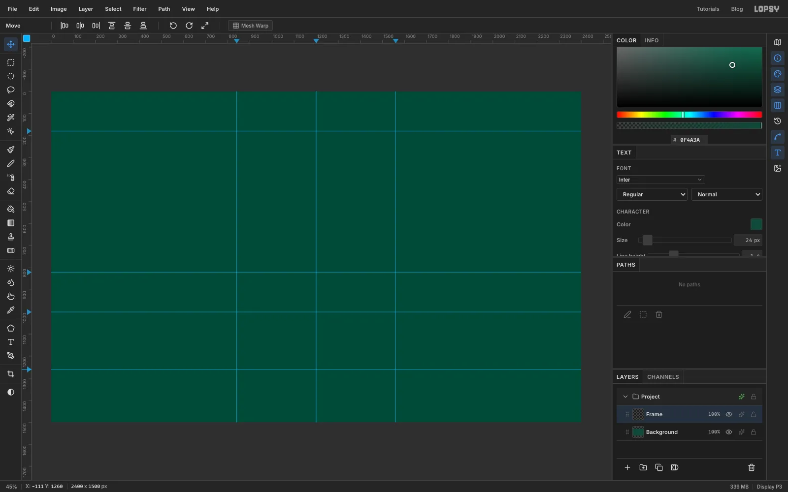

1. Select **Background**, set the foreground colour to `#0F4A3A` and choose **Edit → Fill**.
2. Click once on the top ruler at x `840`, `1200` and `1560` to drop three vertical guides. These are the two walls of the arched window and its centre line.
3. Click on the left ruler at y `180`, `820`, `1000` and `1260`. They mark the top of the arch, the sea's horizon, the top of the title band and the bottom of the band.
4. Open the **View** menu and make sure **Snap to Guides** is ticked. For now, you want marquees to lock onto the guides.

## Draw the double gold frame

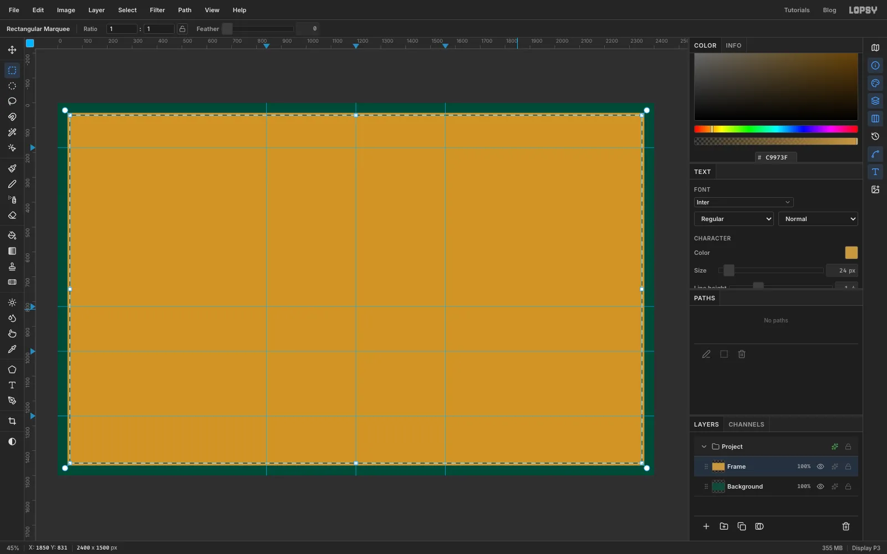

Rename **Layer 1** to *Frame* and set the foreground to gold `#C9973F`.

1. Drag a rectangular marquee about 40 px in from every edge of the canvas and choose **Edit → Fill**.
2. Choose **Select → Shrink…** by `10` and press [[Delete]]. That leaves a 10 px gold frame.
3. Drag a second marquee about 22 px inside the first, fill it, shrink it by `3` and press [[Delete]]. You now have a heavy frame and a fine keyline.

## Make a pinstripe pattern for the side panels

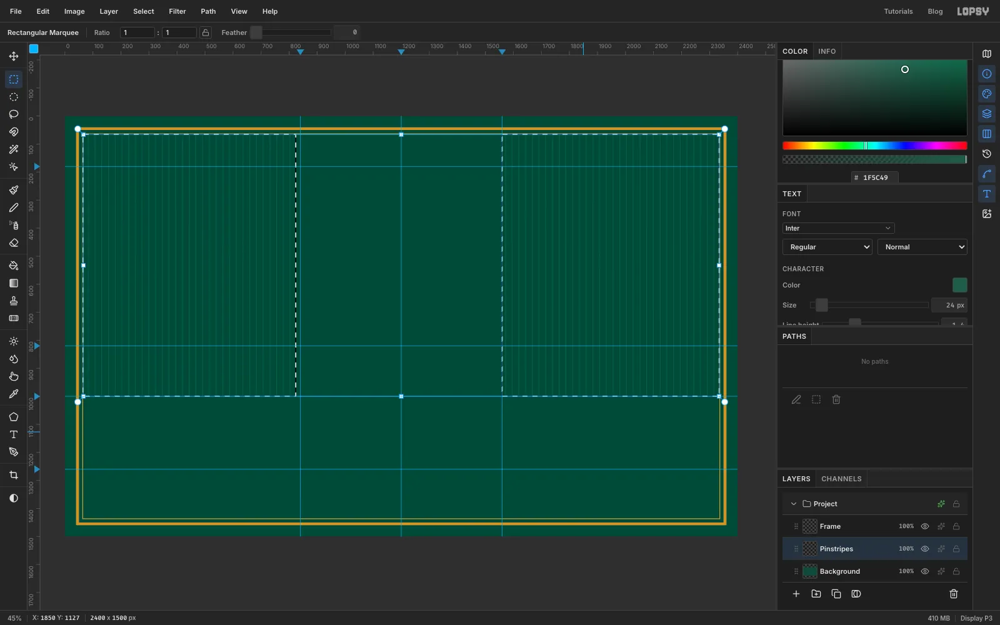

Select **Background** and click **Add Layer** to make a layer called *Pinstripes*. Before you fill the panels, draw a tiny pattern tile:

1. Pick the **Rectangular Marquee** and click once on the canvas without dragging. A dialog opens where you can type the selection's corners. Enter From `10`, `0` To `13`, `24`, click **Select** and fill with `#1F5C49`. That's a 3 px stripe.
2. Click again and select From `0`, `0` To `24`, `24`. Choose **Edit → Define Pattern**, then press [[Delete]] to clear the tile.
3. Drag a marquee over the left panel, from just inside the frame to a little left of the 840 guide, down to the 1000 guide. Hold **Shift** and drag a matching marquee over the right panel.
4. Choose **Edit → Fill with Pattern…**, pick **Pattern 1** at 100% and click **Apply**.

Keep the stripe colour close to the background. Pinstripes are a texture, not a feature.

## Select the arched window

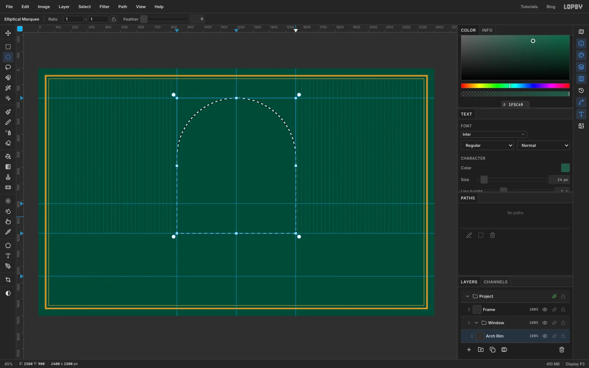

With *Pinstripes* selected, click **New Group** and call it *Window*. Add a layer inside it called *Arch Rim*. Now build the arch shape:

1. Drag a rectangular marquee from the 840 guide at y 540 down to the 1560 guide and the 1000 guide.
2. Pick the **Elliptical Marquee**. Hold **Shift** (to add) and [[Cmd]] (to keep it a perfect circle), and drag from where the 840 guide meets the 180 guide across to the 1560 guide. That's a 720 px circle; its bottom half overlaps the rectangle, and its top half rounds off the arch.

You'll reuse this exact selection several times, so get used to drawing it. Choose **Select → Grow…** by `16` and fill with gold. Then draw the arch selection again and press [[Delete]]. A 16 px gold rim is left around an empty window.

## Paint a stepped Deco sky

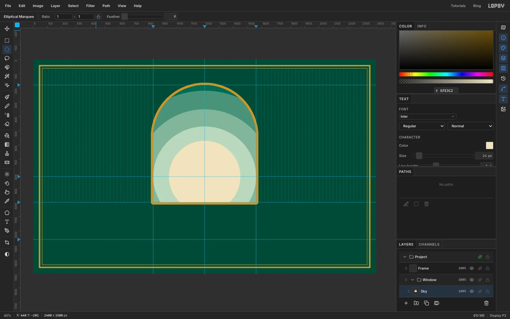

Period labels didn't use smooth airbrushed gradients. They built skies from flat tints, so you'll do the same.

Add a layer called *Sky*. Draw the arch selection and fill it with `#2C6B55`.

The rings are circles centred on the sunrise point, where the 1200 guide meets the 820 guide. Press [[Cmd+D]] to deselect, pick the **Elliptical Marquee** and click once without dragging. In the **Elliptical Selection** dialog, enter From `600`, `220` To `1800`, `1420` and click **Select**. That's a 1,200 px circle around the sunrise. Then step inwards:

1. Fill it with `#5B917A`.
2. Choose **Select → Shrink…** by `130` and fill with `#8DB59C`.
3. Shrink by `120` and fill with `#BFD6BF`.
4. Shrink by `100` and fill with cream `#EFE3C2`. That's the 500 px halo.

Shrink pulls the circle in evenly, so the rings stay perfectly concentric. They spill outside the arch for now: draw the arch selection, choose **Select → Inverse** and press [[Delete]].

## Add sunburst rays

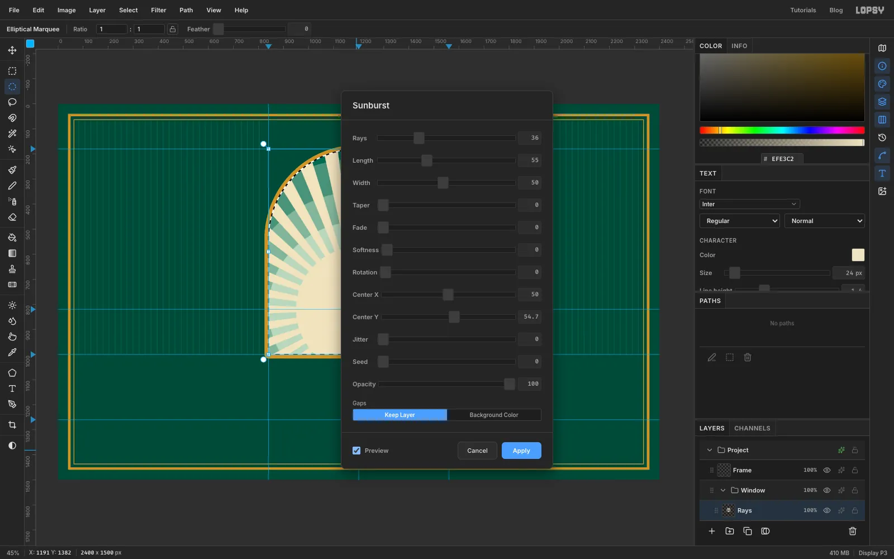

Add a layer called *Rays*, set the foreground to cream `#EFE3C2` and draw the arch selection again. Choose **Filter → Sunburst…** and set:

- **Rays** `36`, **Length** `55`, **Width** `50`, **Fade** `0`
- **Center X** `50` and **Center Y** `54.7`. Both are percentages of the canvas, and 54.7% of 1500 is the horizon at y 820.

Tick **Preview** to check the rays fan out from the horizon, then click **Apply**. Deselect and set the layer's opacity to `30%`, so the rays read as a pale tint over the stepped rings.

## Draw a striped half sun

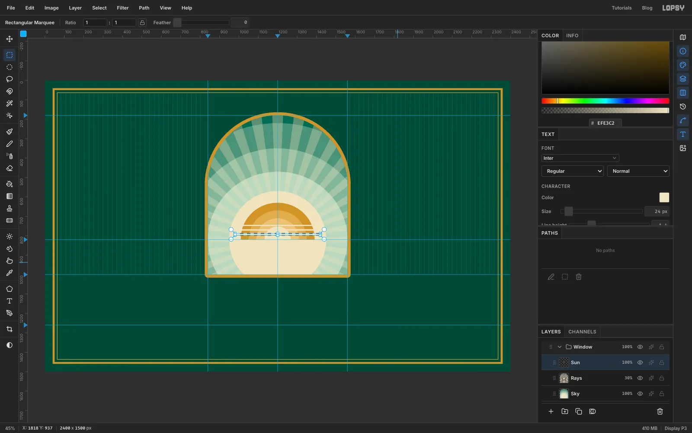

Add a layer called *Sun*. Use the same trick: click with the Elliptical Marquee and enter From `1010`, `630` To `1390`, `1010`, a 380 px circle on the sunrise point.

1. Fill it with gold `#C9973F`.
2. Shrink by `40` and fill with `#D9AE5C`.
3. Shrink by `40` and fill with `#E6C47E`.
4. Shrink by `42` and fill with cream `#EFE3C2`.

Draw a rectangular marquee covering everything below the horizon guide and press [[Delete]], so only the top half of the sun is left. Then cut the classic Deco slits: drag three thin marquees across the lower part of the sun and press [[Delete]] after each. Make them about 6, 8 and 10 px tall, each lower one a little thicker, with roughly 16 px of sun between them.

## Lasso the waves and add a sill

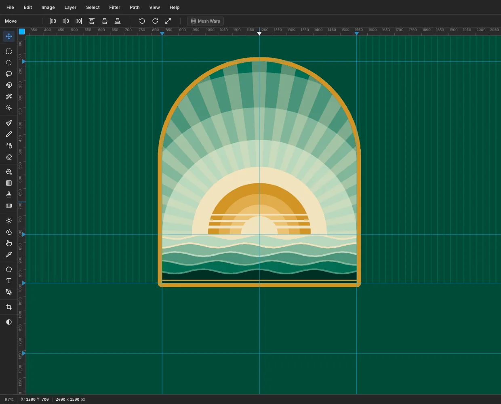

Add a layer called *Waves*. Each wave is two lasso fills: a light crest, then the wave colour 6 px lower so only a thin crest line shows.

1. With the **Lasso**, draw a gentle wavy line across the window just below the horizon, with about three and a half waves across. Carry on down and around below the bottom of the window to close the shape, and fill it with the crest colour.
2. Draw the same wavy shape 6 px lower and fill it with the wave colour.
3. Repeat four more times, each wave about 32 px lower than the last and shifted sideways so the crests don't line up.

From top to bottom, use these crest / wave pairs:

- `#EFE3C2` / `#BFD6BF`
- `#EFE3C2` / `#8DB59C`
- `#BFD6BF` / `#5B917A`
- `#8DB59C` / `#2C6B55`
- `#5B917A` / `#0A2E24`

Draw the arch selection, choose **Select → Inverse** and press [[Delete]] to trim the waves to the window.

The bottom wave is deep green, so finish it with a sill. Pick the **Pencil** at Size `4` in gold. Click just inside the left wall about 10 px above the bottom of the window, then **Shift+click** at the right wall. That draws a straight gold line.

## Draw the sardine silhouette

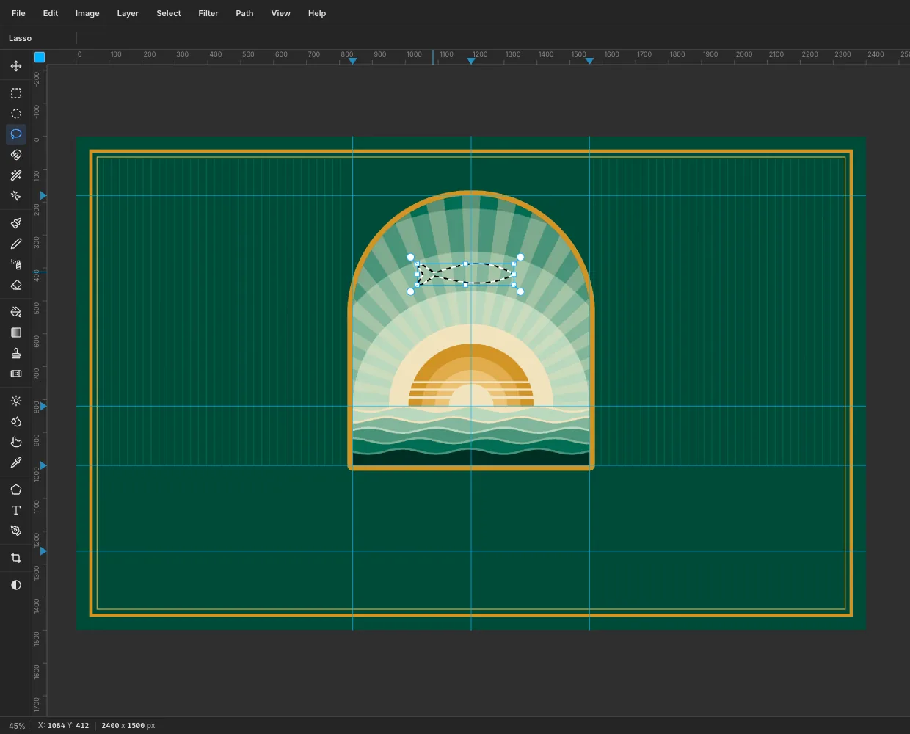

Before you start transforming things, open **View** and untick **Snap to Guides**. A marquee edge near a guide jumps onto it. If that cuts off part of a fish, the cut-off pixels stay behind when you rotate.

Add a layer called *Sardine* above *Waves*. Sardines are slim: make the body about 260 px long and only about 60 px deep.

1. Use the **Lasso** to draw the body high in the window, centred on the 1200 guide. Give it a pointed snout on the right and a deeper belly about two-thirds of the way along. It should taper to a narrow tail stem on the left.
2. Hold **Shift** and lasso a forked tail onto the tail stem, about 34 px long, with two pointed tips.
3. Fill with `#BFD6BF`.

## Colour the sardine in flat bands

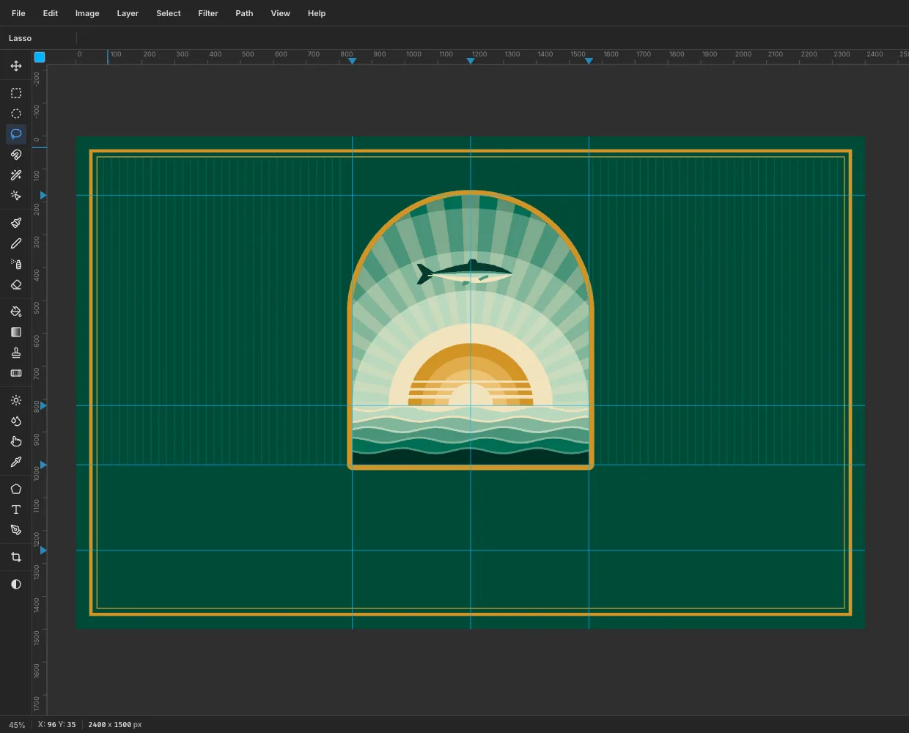

[[Cmd]]-click the *Sardine* thumbnail to load the fish as a selection. Then lasso each band with **Shift+Alt** held, so the lasso is intersected with the fish: you only need to draw the inner edge of each band carefully, and can loop loosely around the outside. Fill, then [[Cmd]]-click the thumbnail again before the next band.

- **Back** `#17392F`: everything from the top edge down to about a third of the body's depth, plus the whole tail.
- **Side stripe** `#5B917A`: a narrow band just below the back, tapering at both ends.
- **Belly** `#EFE3C2`: the bottom third.
- **Fins**: deselect and lasso these on their own, since they stick out of the outline. A low, swept-back dorsal fin in the middle of the back in `#17392F`, a small pointed pectoral fin just behind the head and a small fin hanging under the belly, both in `#5B917A`.

Leave the pale `#BFD6BF` showing between the stripe and the belly. It reads as the silver flank.

## Add the details and engraved belly hatching

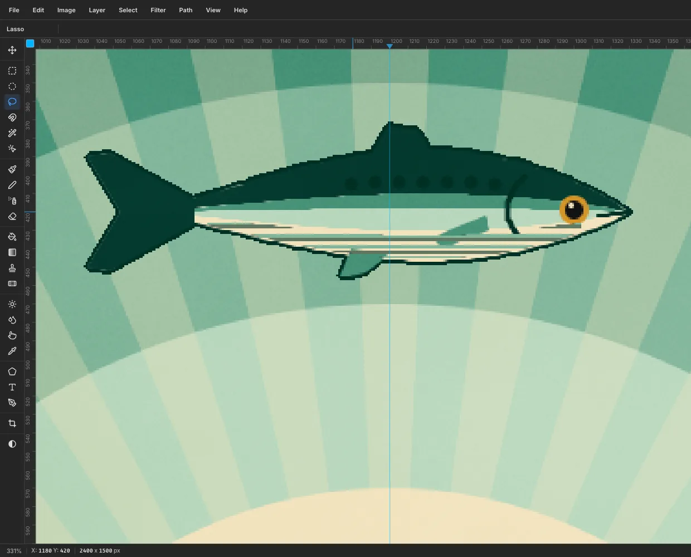

1. With the **Brush** at Size `4` and Hardness `100` in `#0A2E24`, drag a short curve behind the head for the gill cover. Switch to Size `3` and drag a short line, about 20 px, back from the snout for the mouth.
2. At Size `8`, click a row of seven dots along the top of the side stripe. That row of spots is what makes a sardine look like a sardine.
3. For the eye, fill a 16 px gold circle, a 10 px black circle inside it and a tiny cream highlight.

Now hatch the belly so it looks engraved:

1. Add a layer called *Belly Hatch*. Click once with the Rectangular Marquee and select From `0`, `0` To `7`, `2`. Fill with `#667764`.
2. Select From `0`, `0` To `7`, `7`, choose **Edit → Define Pattern** and press [[Delete]].
3. [[Cmd]]-click the *Sardine* thumbnail, then **Shift+Alt** lasso the lower half of the belly so the hatching can't spill outside the fish. Use **Edit → Fill with Pattern…** with **Pattern 2**.
4. Choose **Layer → Merge Down** to fold the hatching into *Sardine*.

Finally, open the layer effects drawer, enable **Stroke** with Width `2` in `#0A2E24`. The fine dark contour is what makes it read like a printed illustration.

## Scale the sardine up

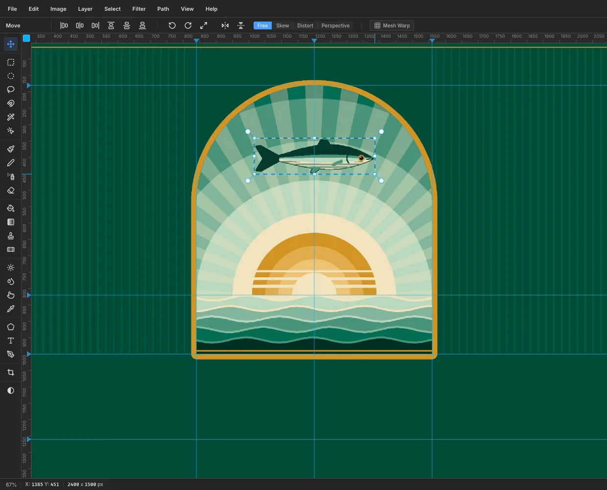

The fish needs to fill the window. Draw a marquee just around the sardine and pick the **Move** tool so the transform handles appear. Hold [[Cmd]] (to keep the proportions) and drag the bottom-right corner outward until the fish is about 360 px long, about 122%. Press [[Cmd+D]] to commit.

Drag the fish so it's centred on the 1200 guide, with its middle about 220 px below the top of the arch.

## Duplicate and rotate the side fish

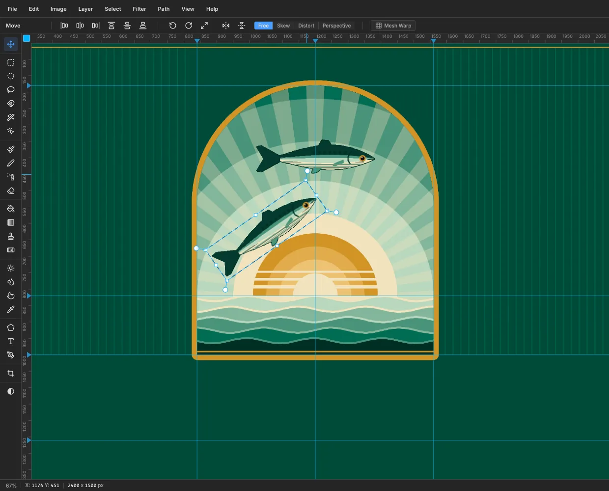

1. Choose **Layer → Duplicate Layer** and rename the copy *Sardine Left*. Drag it down and to the left so its middle sits about level with the top of the sun.
2. Draw a marquee around it with a little room to spare and pick the **Move** tool.
3. Move the pointer just outside the top-right corner handle until it changes to the rotate cursor. Drag up and around until the fish points 35° nose-up, then press [[Cmd+D]] to commit.
4. Duplicate the top *Sardine* again, call it *Sardine Right*, move it to the right and rotate it 35° nose-down. It looks like it's diving back into the sea.

## Arrange the leaping arc

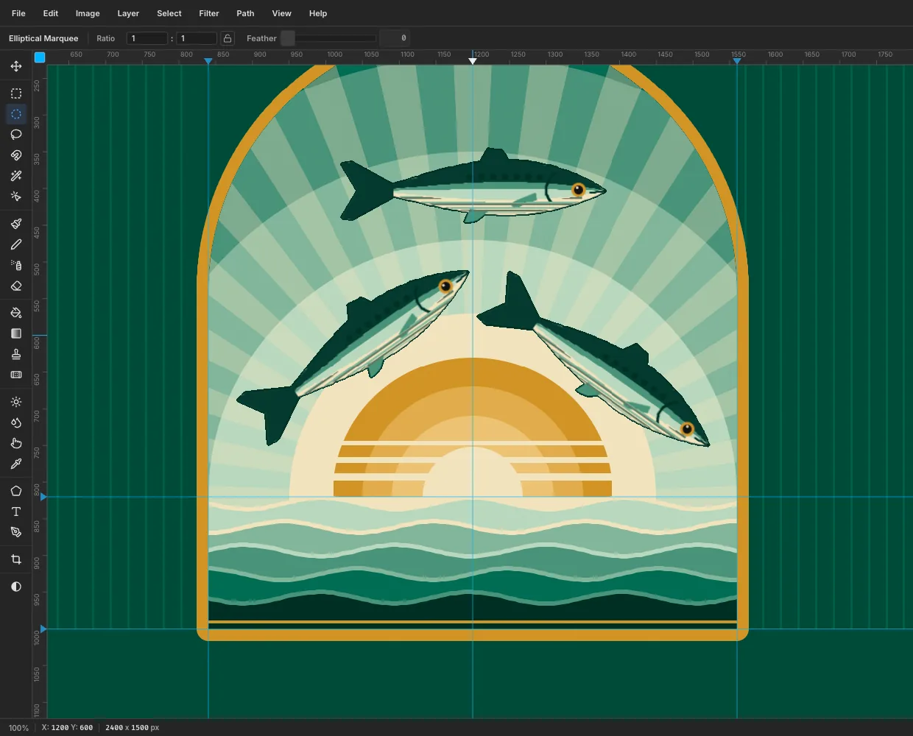

Line the two side fish up as mirror images. Their outer edges should be the same distance from the 1200 guide, and their tops level. Nudge them with the arrow keys until:

- each one is at least 40 px from the gold arch wall,
- the rising fish's snout and the diving fish's tail don't touch in the middle,
- and both overlap the top of the sun halo a little. The overlap ties the fish into the sky.

## Lay down the title band

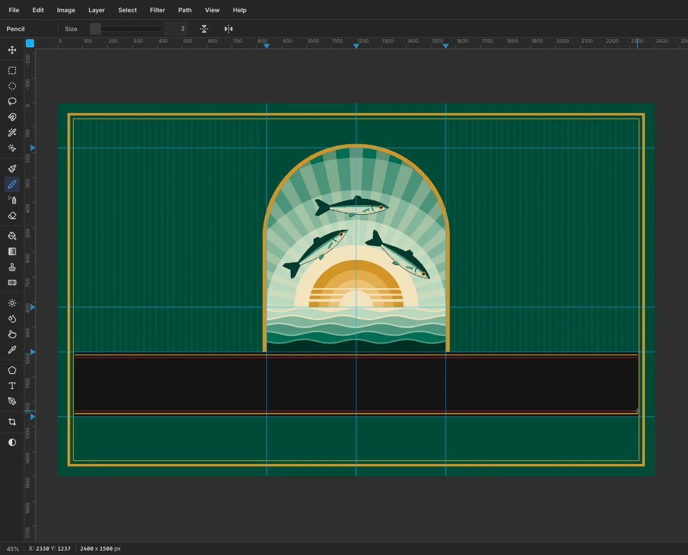

Select *Frame* (outside the *Window* group) and add a layer called *Title Band*. Drag a marquee from just inside the frame's keyline at the 1000 guide to the other side at the 1260 guide, and fill it with `#141414`.

Pick the **Pencil**:

1. At Size `4` in gold, click 12 px below the top edge of the band at the left and **Shift+click** at the right. Do the same 12 px above the bottom edge.
2. At Size `2` in red `#A8322B`, draw a second pair of lines about 11 px inside the gold ones.

## Select a fan shape

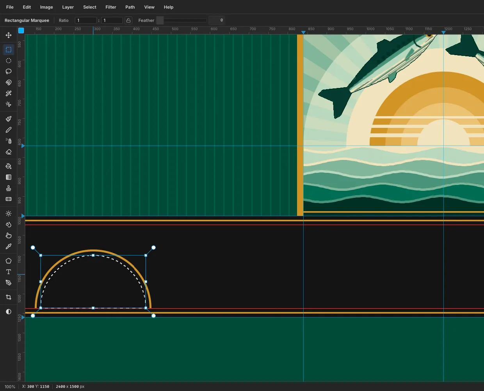

Deco fans fill the empty ends of the band. Add a layer called *Band Fans*. The left fan is centred at x 300 and sits on the lower red line.

1. Click once with the **Elliptical Marquee** and enter From `150`, `1086` To `450`, `1386`. That's a 300 px circle centred on the red line. Fill it with gold, choose **Select → Shrink…** by `5` and press [[Delete]], which leaves a gold ring.
2. Drag a rectangular marquee over the part of the ring below the red line and press [[Delete]]. Only the upper arch is left.
3. Deselect, click with the Elliptical Marquee again and enter From `165`, `1101` To `435`, `1371` for a 270 px circle. Switch to the **Rectangular Marquee**, hold **Shift+Alt** and drag over everything above the red line to intersect. This half-disc is the area the rays will fill.

## Fill the fans with sunburst rays

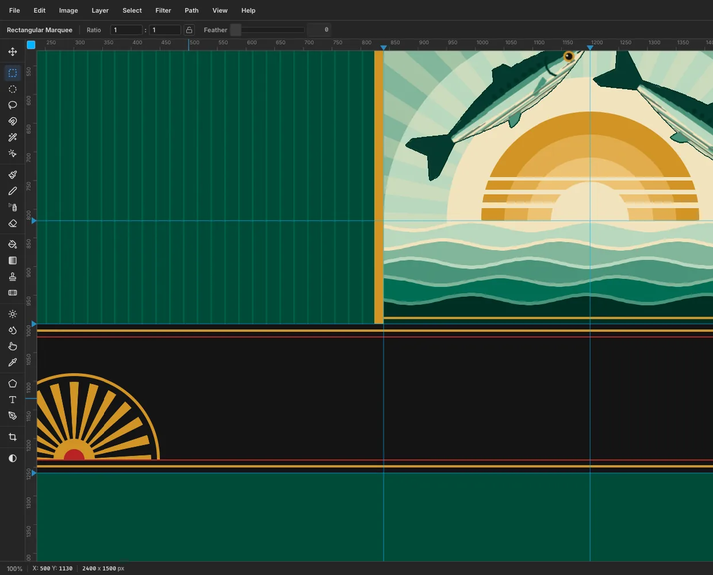

With the half-disc selected and gold as the foreground, choose **Filter → Sunburst…** with **Rays** `24`, **Length** `30`, **Width** `45`, **Center X** `12.5` and **Center Y** `82.4`. The rays stop at the selection edge.

Add a hub in the same way: a 72 px circle on the centre point, intersected with the area above the red line, filled gold, then a 36 px one filled red. Repeat everything for the right fan, centred at x 2100 (circle corners From `1950`, `1086` To `2250`, `1386`), with **Center X** `87.5`. Keep the fans small. They frame the title, they shouldn't compete with it.

## Set the title in Limelight

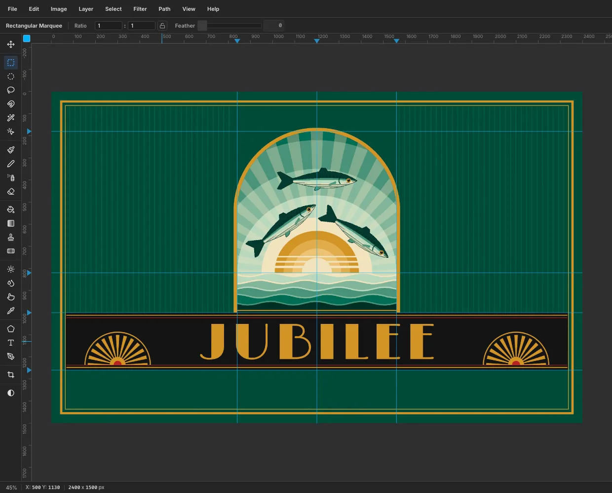

Click the *Band Fans* row first. If a text layer is selected, the Text options restyle it instead of setting up the next one.

Pick the **Text** tool. Choose **Limelight**, Size `230`, gold, then click in the band and type `JUBILEE`. Press [[Tab]] to commit. In the **Text** panel, set **Letter spacing** to `18`.

With the **Move** tool, drag the title roughly into the middle of the band, then use the arrow keys to centre it exactly. It should sit on the 1200 guide, with equal space above and below between the red lines.

## Select the inside of the letters

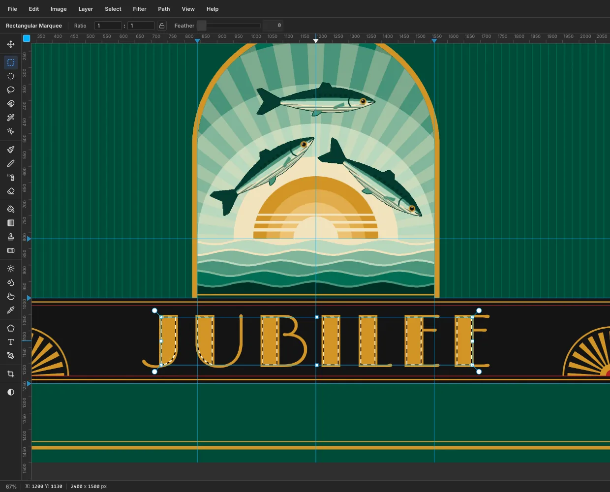

Deco titles often have an **inline**: a thin light line running inside each thick stroke. You'll build one from the text's own shape:

1. Add a layer called *Title Gold* above *JUBILEE*.
2. [[Cmd]]-click the *JUBILEE* thumbnail to load the letters as a selection, and fill with gold on *Title Gold*.
3. Choose **Select → Shrink…** by `7`. The selection pulls in from every edge, and the hairline strokes drop out of it completely.

## Finish the inline gold title

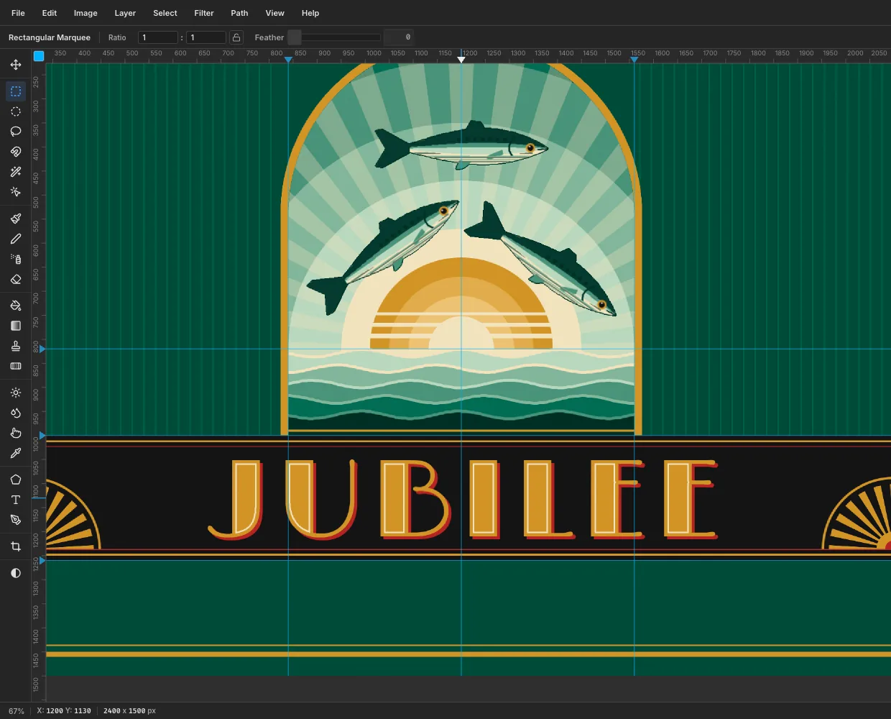

1. Fill the shrunken selection with cream.
2. Shrink by `3` more and fill with gold. A 3 px cream line is left running inside the thick stems only, exactly like a Deco inline face.
3. Deselect and hide the *JUBILEE* text layer with its eye icon. You don't need it any more, but keep it in case you want to change the title later.
4. With *Title Gold* selected, enable **Drop Shadow** in red `#A8322B` with Offset X `6`, Offset Y `6`, Blur `1` and Opacity `100`. A blur of 1 keeps the shadow crisp without a light seam along the edges.

## Set SARDINES and the side lines

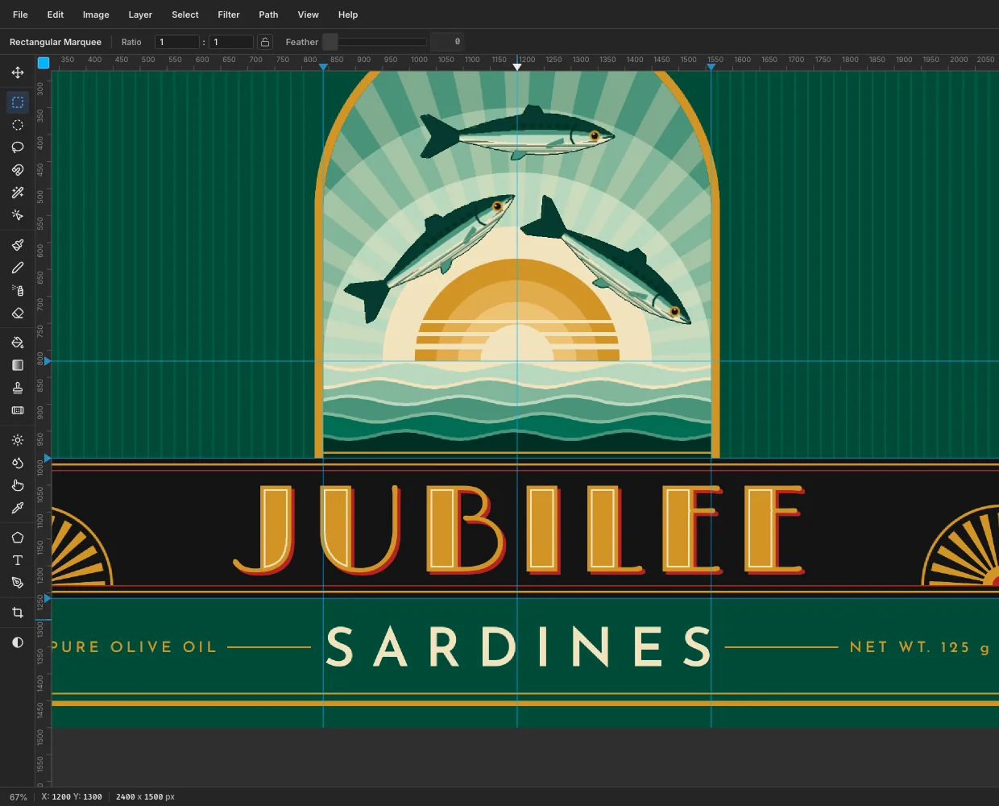

Select *Title Band* and add a layer called *Rules*. With *Rules* selected each time, create three text layers in **Josefin Sans SemiBold**:

- `SARDINES` at Size `100` in cream, with **Letter spacing** `30`. Centre it on the 1200 guide, halfway between the band and the frame.
- `IN PURE OLIVE OIL` and `NET WT. 125 g` at Size `28` in gold, Letter spacing `6`. Centre each one in the space between SARDINES and the frame, at the same height as the middle of the SARDINES capitals.

Then pick the **Pencil** at Size `3` in gold and fill the gaps with rules. Shift+click straight lines level with the middle of the small capitals. Leave about 24 px between a rule and the small text, and about 30 px next to SARDINES.

> **Tip:** Measure gaps from the ink, not from the text box. Letter spacing adds space after the last letter, which can make a label look off-centre.

## Draw the medallion rings

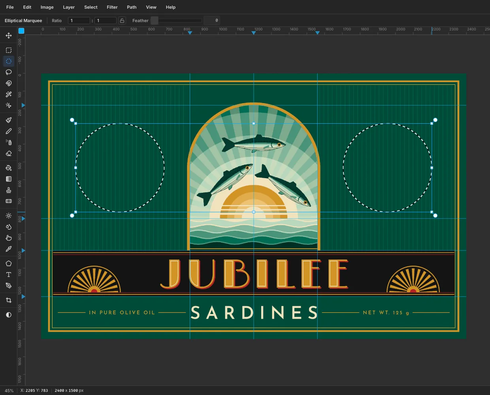

Select *Pinstripes* and click **New Group**, called *Medallions*. Add a layer called *Medallion Discs*.

Each medallion is a 500 px circle centred halfway down the side panel. Build both at once:

1. Click once with the **Elliptical Marquee** and enter From `195`, `283` To `695`, `783` for the left circle.
2. Hold **Shift** and [[Cmd]] and drag a matching 500 px circle in the right panel, from x 1705, y 283. The Info panel shows the cursor position, and the right circle should mirror the left one.
3. Fill both with gold.
4. **Select → Shrink…** by `12` and fill with deep green `#0A2E24`.
5. Shrink by `16` and fill with red.
6. Shrink by `3` and fill with deep green again. That leaves a fine red inner ring inside a gold rim.

## Add rays inside the medallions

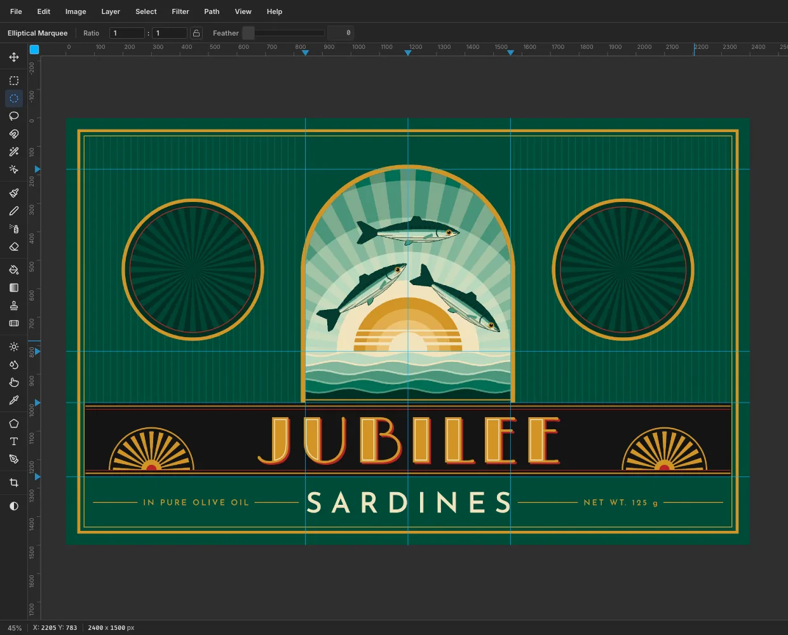

Add a layer called *Medallion Rays* and set the foreground to `#2C6B55`. Sunburst takes one centre, so do one medallion at a time:

1. Deselect, click once with the **Elliptical Marquee** and enter From `226`, `314` To `664`, `752`. That's the dark inner disc of the left medallion.
2. Run **Filter → Sunburst…** with **Rays** `32`, **Length** `20`, **Width** `50`, **Center X** `18.5` and **Center Y** `35.5`.
3. Do the same for the right disc, From `1736`, `314` To `2174`, `752`, with **Center X** `81.5`.

Set the layer's opacity to `35%`. The rays should be a quiet texture behind the contents.

## Draw a gold olive sprig

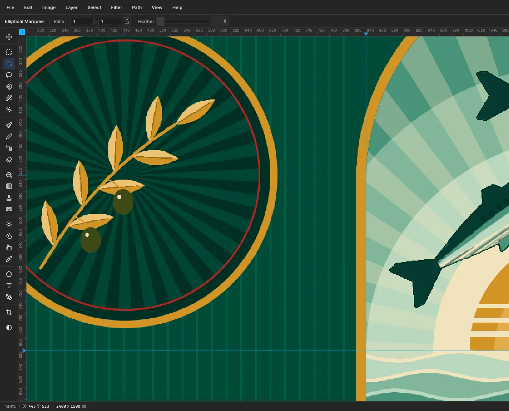

The olive sprig says "in olive oil" without words. Add a layer called *Olive Sprig*.

1. With the **Brush** at Size `6` in gold, drag a gently curving stem from the lower left of the medallion up to the upper right.
2. Lasso seven narrow, pointed leaves along the stem, alternating sides, plus one at the tip. Fill each with gold, then lasso one half of each leaf and fill it with `#E6C47E` so the leaves look lit from one side.
3. With the Brush at Size `2` in `#8E6A2C`, drag a vein down the middle of each leaf.
4. For each olive, draw a short 3 px gold stalk from the stem, then fill a small upright oval in `#3F4A1E` and add a cream highlight dot.

Use the **Move** tool to drag the sprig so it sits in the optical centre of the disc. Put it a touch below centre, because a sprig that leans up and to the right looks top-heavy.

## Set the year medallion

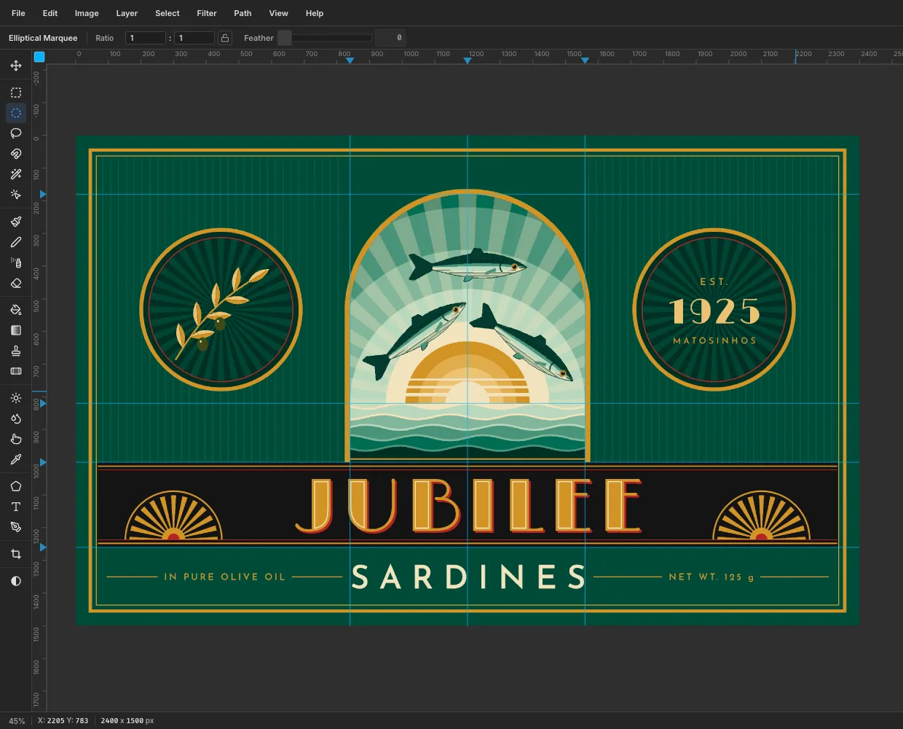

Select *Medallion Rays* before each new text layer, then create:

- `1925` in **Limelight**, Size `108`, `#E6C47E`, Letter spacing `8`.
- `EST.` in Josefin Sans SemiBold, Size `30`, gold, Letter spacing `10`.
- `MATOSINHOS` in Josefin Sans SemiBold, Size `26`, gold, Letter spacing `8`.

Centre all three on the medallion. Put 1925 in the middle, with EST. above it and MATOSINHOS below, with about 42 px between EST. and 1925, and the same between 1925 and MATOSINHOS. Using Limelight for both the title and the year keeps the whole label in one Deco voice.

## Add the ziggurat brackets

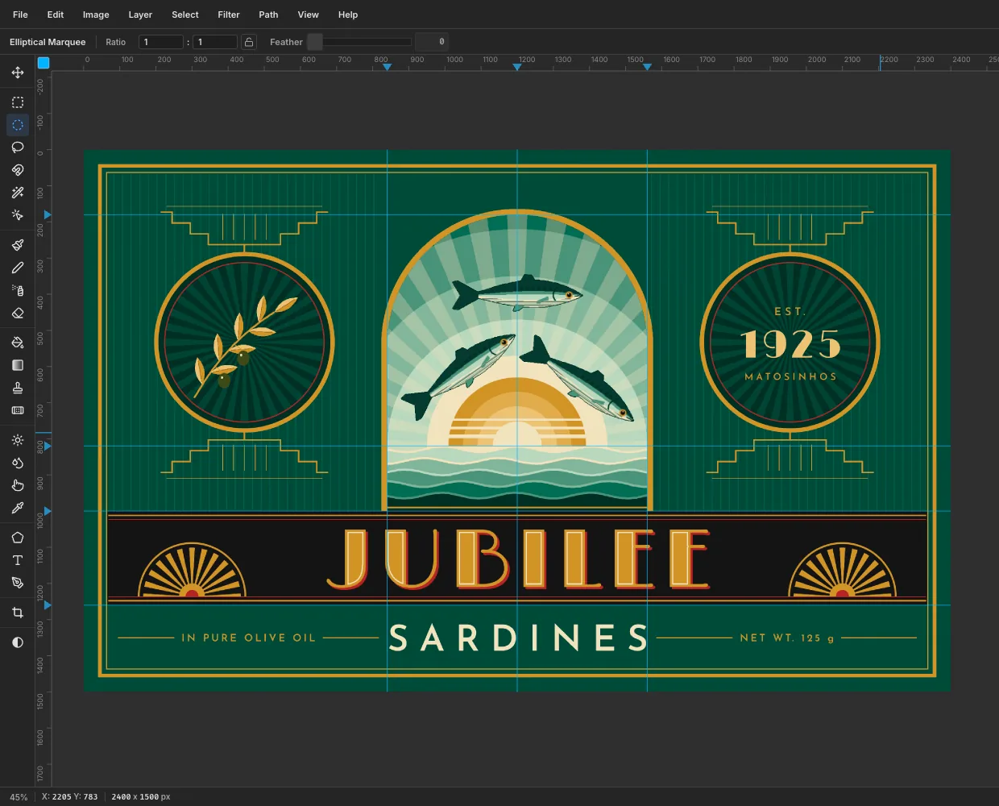

Stepped "skyscraper" setbacks are the most recognisable Deco ornament. Add a layer called *Ziggurats* in the *Medallions* group and pick the **Pencil** at Size `4` in gold.

The bracket under each medallion is one continuous stepped line. Each Shift+click draws a straight segment from the last point:

1. Click at the bottom of the left foot, 230 px left of the medallion's centre line and 110 px below the ring.
2. Shift+click 30 px to the right, then 30 px up.
3. Shift+click 50 px right and 30 px up, then 50 px right and 30 px up again. That's two steps climbing inwards.
4. Shift+click across the top step, 200 px wide and 20 px below the ring.
5. Mirror the steps down the right-hand side, finishing with a 30 px foot.

Shift+click a short vertical line from the bottom of the ring down to the top step. Draw the same bracket upside down above the medallion, then repeat both for the right medallion.

At Pencil Size `2`, add a fine base line just past each bracket and five short vertical lines 30 px apart inside each one.

## Draw an arc with the Pen tool

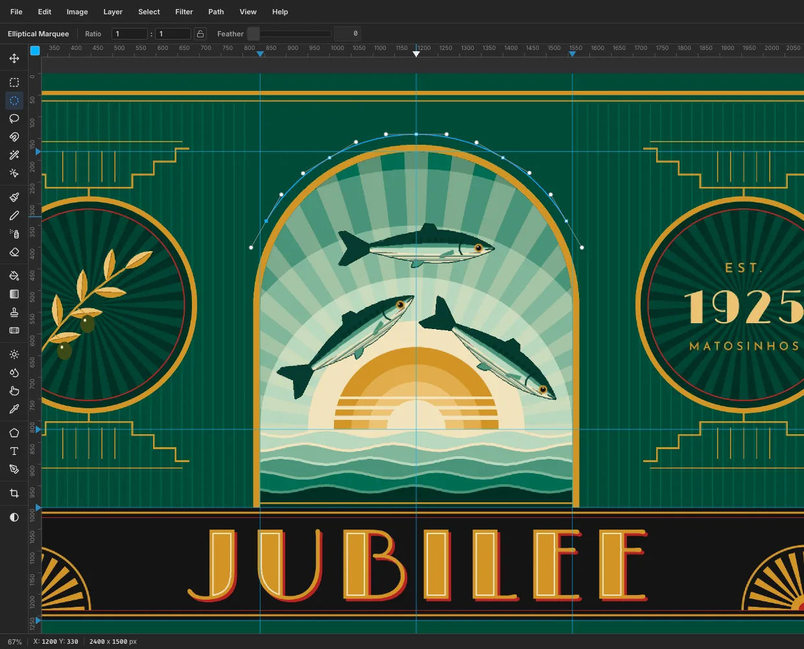

Select *Rules* and pick the **Pen** tool. You'll draw an arc 400 px from the centre of the arch's curve, so the type sits just outside the rim.

Place five anchors, starting at the lower left and working round to the lower right:

- above the left wall at about y 340,
- up and to the right,
- over the top of the arch at y 140,
- down and to the right,
- above the right wall at about y 340.

At each one, drag a short way (about 70 px) in the direction the curve is travelling, which pulls out smooth handles. Then click the **✓** (Commit path) button in the options bar.

> **Tip:** Pressing Enter in the Pen tool strokes the path onto the active layer. Use the ✓ button when you only want to keep the path.

## Run text along the arc

With *Rules* still selected, pick the **Text** tool, choose Josefin Sans SemiBold, Size `36`, gold, click in empty space and type `CONSERVAS DE PORTUGAL`. Commit with [[Tab]] and set **Letter spacing** to `14` in the Text panel.

In the options bar, set **Path** to *Path 1* and **Align** to **Center**. The capitals now follow the curve, centred over the arch. If the run looks slightly off-centre, nudge the layer a few pixels with the arrow keys; it keeps its place on the curve. Click the path's row in the **Paths** panel to hide the path outline.

> **Tip:** Text longer than its path is cut off at the end. If letters go missing, shorten the line or reduce the letter spacing.

## Add a printed texture and export

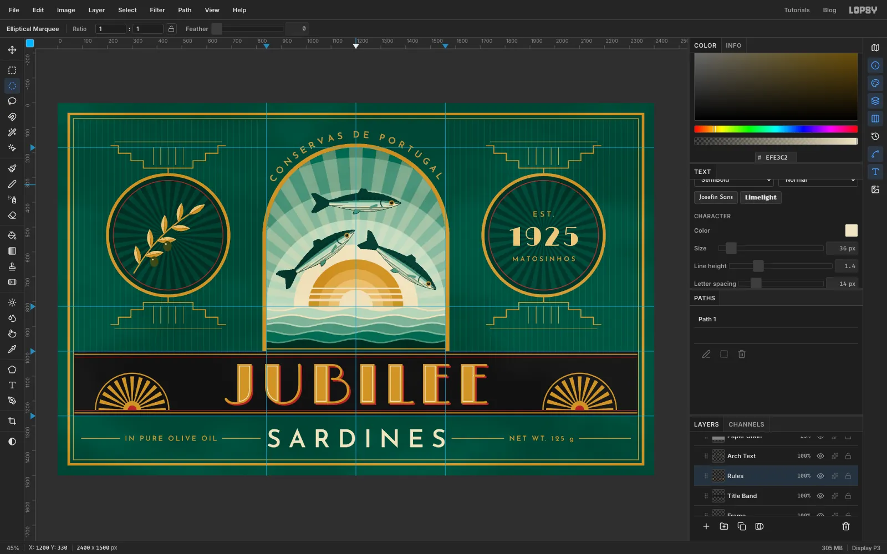

Real tin labels have paper tooth and uneven ink. Add two layers at the very top:

1. *Paper Grain*: fill with grey `#808080`, run **Filter → Add Noise…** at `40` with **Mono** and **Gaussian**, set the blend mode to **Overlay** in the layer effects drawer, and set the opacity to `25%`.
2. *Ink Mottle*: fill with grey, run **Filter → Clouds…** (Scale `5`), set it to **Soft Light** at `12%`. Any stronger and the clouds look like stains.

Choose **File → Save Project** to keep a layered `.lopsy` copy, and **File → Quick Export PNG** for the finished label. If you want another flavour, try swapping the greens for oxblood and navy. Or set a new brand name in the band, since the inline gold trick works on any heavy display face.
