Art Deco print design is all about **symmetry, stepped shapes and rays**: a
skyscraper climbing in setbacks, a sunburst fanning out behind it, and tall
geometric capitals in gold. This tutorial builds a T-shirt front for an
imaginary 1931 supper club, **NOCTURNE UPTOWN**, at 1800 × 2200 px. The warm
black background stands in for the shirt, so anything you leave unpainted is
the fabric showing through.

The look is kept **flat on purpose**. Every colour is a solid fill, as it would
be in a screen print, and the metallic shine comes from three flat bands of gold
side by side rather than a gradient. At the end you'll knock tiny specks out of
the whole design so it looks like a print that has been through the wash a few
times.

The tools you'll meet along the way:

- **ruler guides**, the **Elliptical** and **Rectangular Marquee** with [[Shift]] to add, and **Select → Shrink**
- **Filter → Sunburst** for the sky and for the crown's windows
- the **Shape** tool for stroke-only rings and eight-point stars
- **Edit → Define Pattern** and **Edit → Fill with Pattern** for a chevron band
- **Image → Flip Horizontal** to mirror a tower across the page
- **Limelight** and **Syncopate** text, letter spacing, two-tone gold and rotated live text
- the **Stroke**, **Drop Shadow** and **Color Overlay** layer effects
- **Add Noise**, **Gaussian Blur**, **Threshold** and the **Magic Wand** for the worn texture
- **groups**, group scaling, and **undo / redo**

The screenshots come from the finished project file, with later layers hidden
until their step. So the Layers panel sometimes lists a layer you haven't made
yet, with its eye switched off. Everything sits inside the **Project** group,
the root group every Lopsy document starts with.

The palette is one shirt colour and a handful of inks:

- Shirt `#16110E` (the background, not an ink)
- Gold `#D9B46A` / `#E2BE72`
- Gold bands `#C99A4E` / `#F2D58E` / `#A87A2E`, rails `#8E6524`
- Star gold `#F2D896`
- Title gold `#F4DC9C` / `#C08A3A`
- Ivory `#F2E8D0`, window light `#F6E7B8`
- Oxblood `#4A1020` / `#6B1C2A` / `#6E1A24` / `#7A1E2C`
- Tower plum `#2B1520`

## Set up the shirt and guides

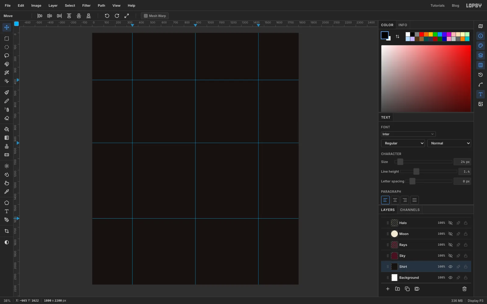

Choose **File → New**, set the units to **Pixels**, make the document
**1800 × 2200** and click **Create**. Double-click **Layer 1**, rename it
*Shirt*, set the foreground to `#16110E` and choose **Edit → Fill**.

Now lay out the guides the whole design hangs on. Click once on the top ruler
at **350**, **900** and **1450** to drop three vertical guides: the arch's two
sides and the centre line. Then click the left ruler at **412**, **962** and
**1622** for the top of the arch, the point where its curve meets the straight
sides, and the arch's base. A click on a ruler adds a guide. Click the same
spot again if you need to remove one.

## Draw the gold arch

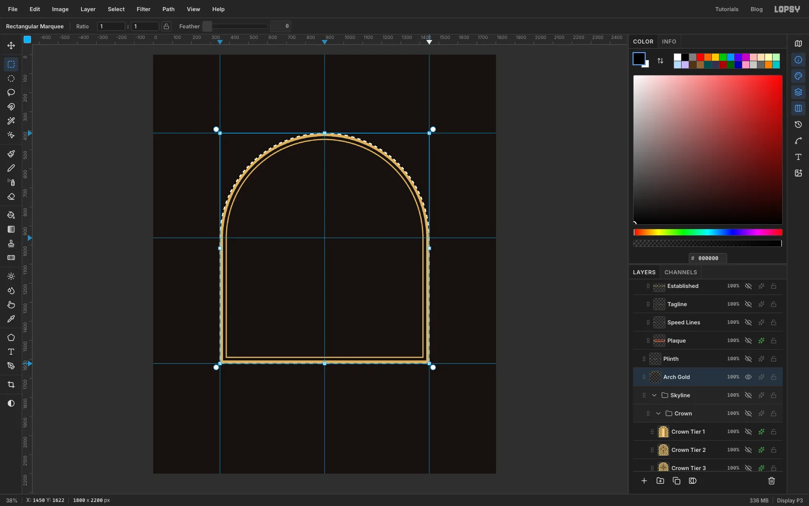

Add a layer called *Arch Gold*. An arch is a circle with a rectangle under it,
so build the selection in two pieces:

1. With the **Elliptical Marquee**, hold [[Shift]] and drag a circle that
   touches the left and right guides and the top guide. Because the circle is
   1100 px wide, its middle lands right on the 962 guide.
2. Switch to the **Rectangular Marquee**. Hold [[Shift]] to add to the
   selection, and drag from where the circle's middle meets the left guide down
   to the bottom-right guide crossing. Marquee drags snap to guides, so the
   corners click into place.

Set the foreground to gold `#D9B46A` and choose **Edit → Fill**. The selection
stays put, so you can keep working inward from it:

- **Select → Shrink** by **16** and press [[Delete]] to hollow out a thick outline.
- **Shrink** by another **14** and fill again.
- **Shrink** by **6** and press [[Delete]], which leaves a thin second line inside the first.

Press [[Cmd]]+[[D]] to deselect.

## Fill the night sky

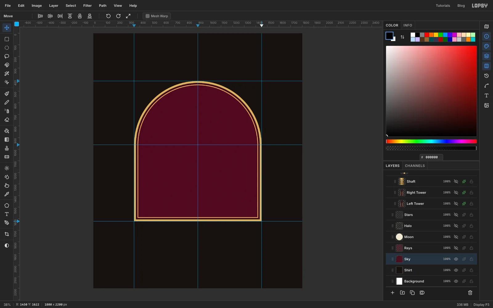

Click the *Shirt* layer and add a layer called *Sky*, so it sits under the gold.
Build the arch selection once more, shrink it by **20** so the colour tucks just
under the gold lines, and fill it with oxblood `#4A1020`. This is the last time
you need to build the arch by hand: from now on, [[Cmd]]-click the *Sky*
thumbnail in the Layers panel to get the arch shape back.

## Burst some rays across the sky

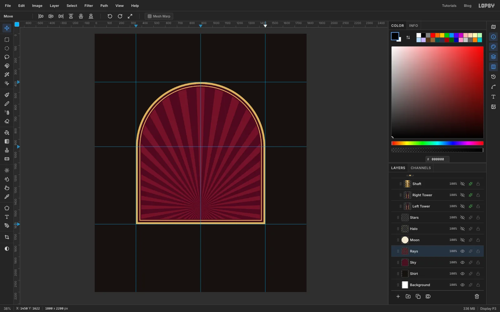

Add a layer called *Rays* above *Sky*. [[Cmd]]-click the *Sky* thumbnail and
shrink the selection by **24**. Set the foreground to `#6B1C2A` and open
**Filter → Sunburst**:

- **Rays** 40, **Length** 60, **Width** 45
- **Taper**, **Fade** and **Softness** 0
- **Center X** 50, **Center Y** 67
- **Opacity** 100

That puts the burst's origin low in the arch, right behind where the
skyscraper will stand. The selection keeps the rays inside the arch. Click
**Apply** and deselect.

## Hang the moon and its halo

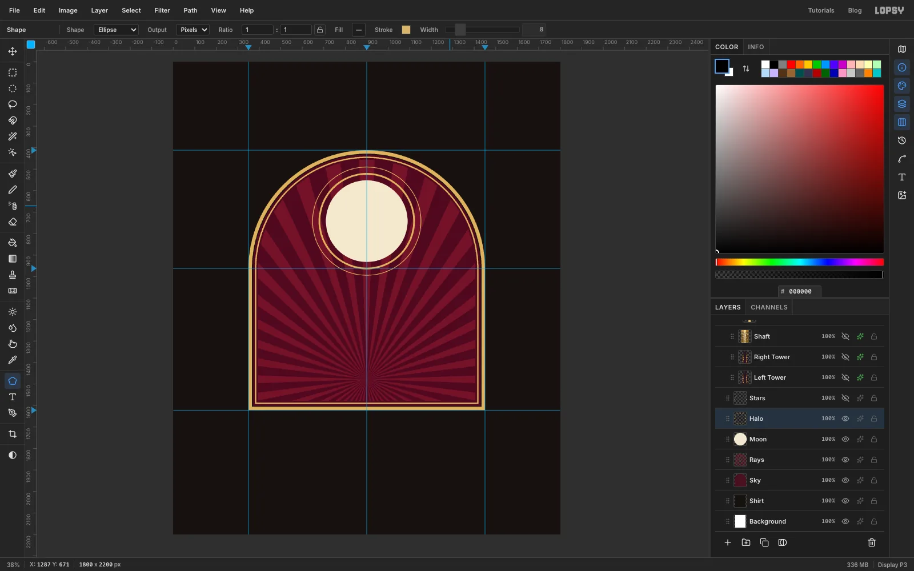

Add a layer called *Moon*. With the **Elliptical Marquee**, hold [[Shift]] and
drag a circle about 380 px across, centred on the middle guide, a little way
below the top of the arch. Fill it with ivory `#F2E8D0`.

Add a layer called *Halo* and pick the **Shape** tool. Set **Shape** to
**Ellipse**, click the **Fill** swatch and choose **Remove fill**, then add a
**Stroke** in gold `#D9B46A` with **Width** 8. The Shape tool draws outward
from where you press, so hold [[Cmd]] (for a perfect circle) and drag from the
centre of the moon to draw a ring a little outside it. Drop the **Width** to 3
and draw a second, thinner ring a little further out.

## Add four eight-point stars

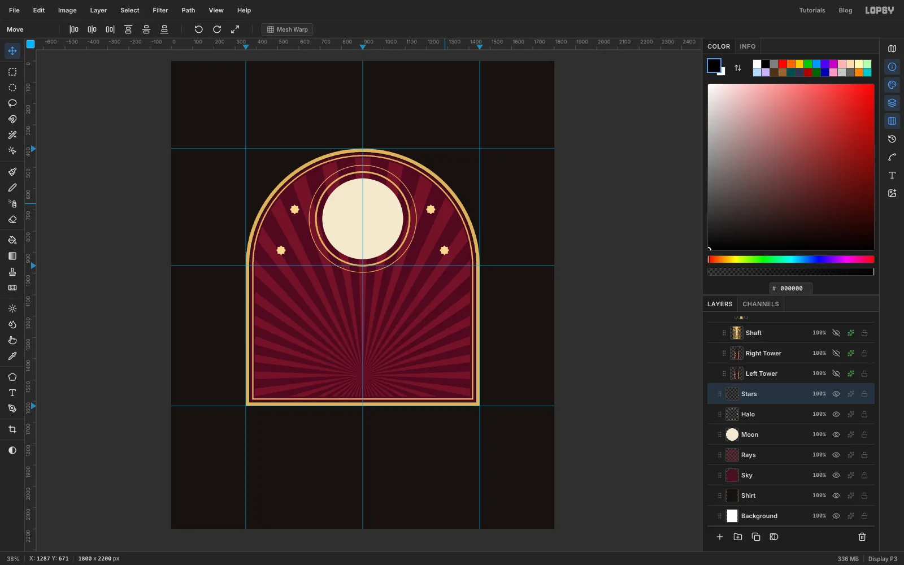

Add a layer called *Stars*. In the **Shape** tool choose **Rectangle**, set the
fill to `#F2D896` and remove the stroke. Hold [[Cmd]] and drag out a small
square, about 30 px across, up and to the left of the moon.

To turn it into a star, marquee the square, switch to the **Move** tool and
drag the rotation handle just outside a corner while holding [[Cmd]] (it snaps
in 15° steps) until it turns **45°**. Press [[Cmd]]+[[D]] to commit. Draw a
second, unrotated square of the same size directly on top, and the two make an
eight-point star.

Marquee the star, press [[Cmd]]+[[C]] and [[Cmd]]+[[V]], and drag the pasted
copy down and a little left. Choose **Layer → Merge Down** to fold it back into
*Stars*. Then mirror the pair: **Layer → Duplicate Layer**, **Image → Flip
Horizontal**, and **Merge Down** again.

## Build a pair of stepped towers

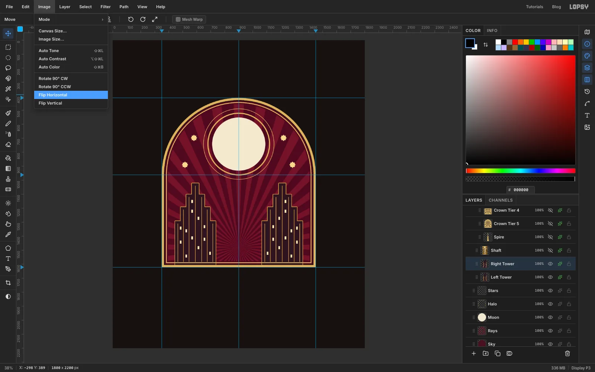

Click the **New Group** button and name the group *Skyline*. Inside it, add a
layer called *Left Tower*. Draw the tower as a stack of rectangles with the
**Rectangular Marquee**, holding [[Shift]] for each one to add it:

- a wide base from about 95 px inside the left guide to about 165 px left of the middle guide, running down to the arch's base guide
- three narrower setbacks stacked on top, each one 40 px narrower on both sides and about 100 px tall

Fill it with plum `#2B1520`. Open the layer's **effects** drawer and turn on
**Stroke**, **4** px, gold `#C99A4E`. Pick the **Pencil**, set **Size** 4 and
the same gold, then click at the top of each setback and [[Shift]]-click at the
bottom to rule a pinstripe down the tower. For lit windows, marquee small
rectangles, about 12 × 22 px, here and there and fill them with `#F6E7B8`.

When the left tower looks right, choose **Layer → Duplicate Layer**, rename the
copy *Right Tower*, and choose **Image → Flip Horizontal**. Flip mirrors the
layer across the whole canvas, so the copy lands on the right side, already in
position.

## Band the skyscraper's shaft

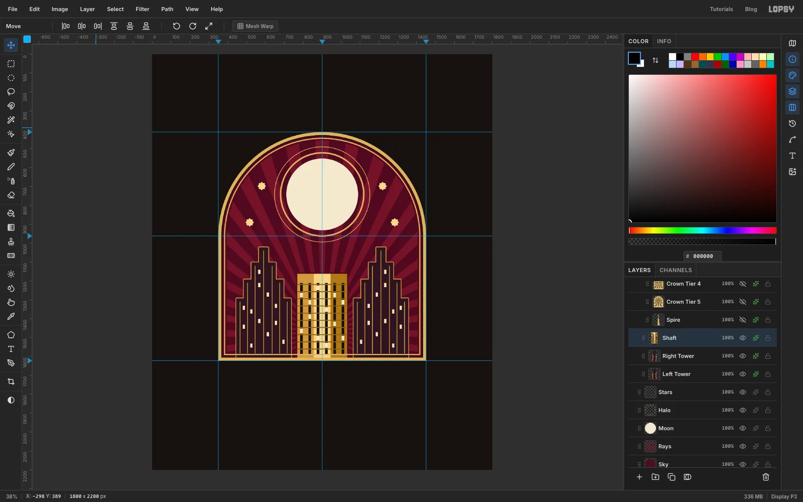

Add a layer called *Shaft* above the towers. Here's the trick for metal without
a gradient: three flat bands side by side. Marquee and fill three tall
rectangles, each about 88 px wide and 450 px tall, standing on the arch's base
guide and centred on the middle guide. Use `#C99A4E` on the left, `#F2D58E` in
the middle and `#A87A2E` on the right, so the light seems to hit the middle.

With the **Pencil** at **Size** 14 in shirt black `#16110E`, [[Shift]]-click six
evenly spaced vertical window strips down the shaft. Switch to **Size** 5 in
`#8E6524` and [[Shift]]-click horizontal rails right across the shaft, edge to
edge, every 38 px. Fill a few window slots between the rails with `#F6E7B8`, and
give the layer a **Stroke** of **6** px in oxblood `#4A1020`.

## Stack the crown

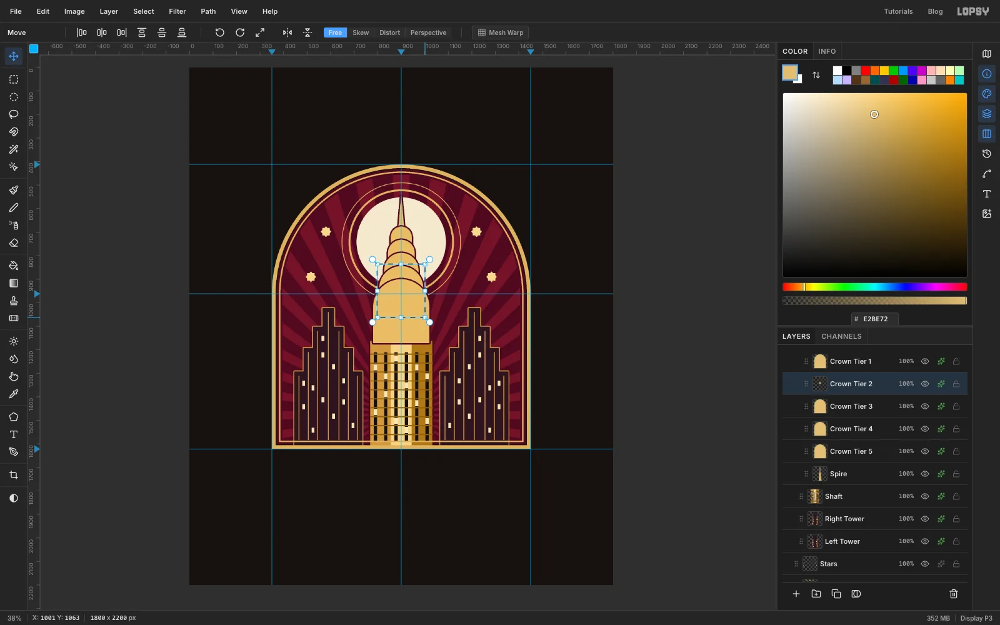

The Chrysler-style crown is a stack of shrinking arches. Add a layer called
*Crown Tier 1*. Build an arch selection the same way as the big one, an
Elliptical Marquee circle plus a [[Shift]]-dragged rectangle under it, about
**240 px** wide. That's a little narrower than the shaft, so it reads as a
setback. Sit it on top of the shaft and fill it with `#E2BE72`. Give it a
**Stroke** of **6** px in oxblood `#4A1020`. Oxblood outlines separate the gold
from the pale moon without the harshness of black.

Now make the smaller tiers:

1. **Duplicate** the layer and [[Cmd]]-click the copy's thumbnail to select it.
2. With the **Move** tool, hold [[Cmd]] and drag a corner handle inward until
   it's about **78%** of the size, then press [[Cmd]]+[[D]].
3. Drag the copy up so it overlaps the top of the tier below.

Repeat until you have **five tiers**, named *Crown Tier 1* (bottom) to
*Crown Tier 5* (top). Duplicates keep the stroke. On a layer under the tiers,
hold the mouse down and drag the **Lasso** around a tall, thin triangle for the
**spire**. Fill it with the same gold and give it the same stroke.

## Cut sunburst windows into the crown

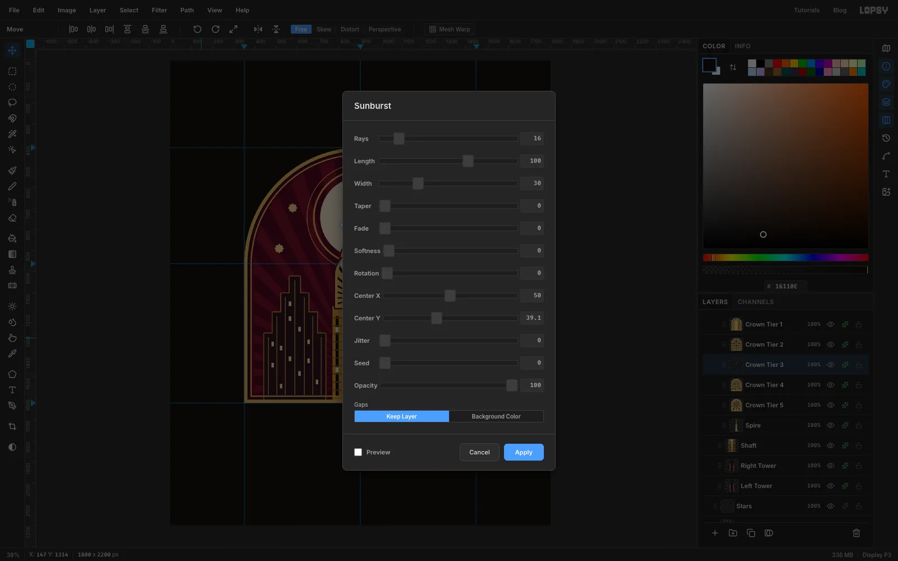

The crown's famous triangular windows are just another sunburst. For each tier:

1. [[Cmd]]-click the tier's thumbnail to select its shape.
2. **Select → Shrink** by **12** (use **16** on the bottom tier) so the windows
   stop short of the edge.
3. Set the foreground to shirt black `#16110E` and open **Filter → Sunburst**.
   Use **Length** 100, **Width** 30 and **Opacity** 100, with Taper, Fade and
   Softness at 0, and **Center X** 50.
4. Tick **Preview** and drag **Center Y** until the rays fan out from the centre
   of that tier's curve.
5. Use more rays on the bigger tiers: about **26** on the bottom tier, then
   **20**, **16**, **14** and **12**.

## Add a door and group the crown

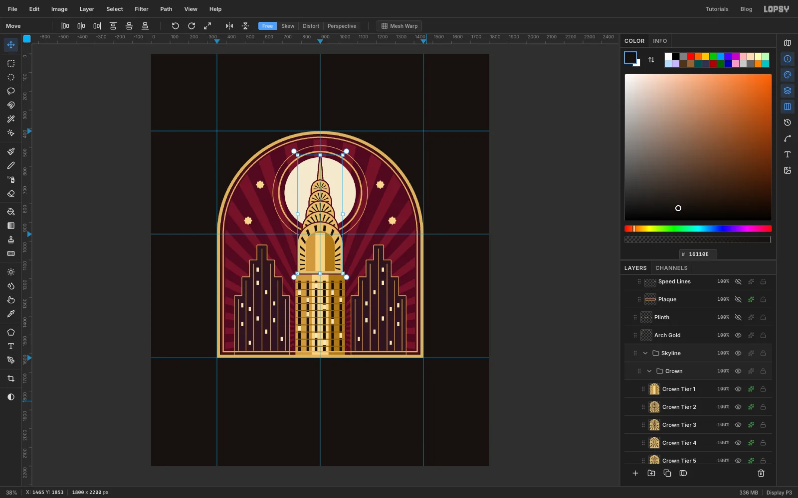

Give the bottom tier a door in the same three gold bands as the shaft:

1. Build a small arch selection inside the tier and fill it with `#A87A2E`.
2. [[Alt]]-drag a rectangle over its right two-thirds to take that part out of
   the selection, and fill what's left with `#C99A4E`.
3. Marquee the middle third and fill it with `#F2D58E`.

[[Cmd]]-click the five tier rows and the spire in the Layers panel to select
them all, choose **Layer → Group Layers**, and name the group *Crown*. With the
group row selected, the arrow keys nudge the whole crown at once
([[Shift]] moves 10 px). Use them to centre it on the middle guide, sitting
neatly on the shaft.

## Lay a chevron band along the base

Make the pattern tile first. Add a temporary layer, marquee a **48 × 36** px
rectangle in an empty corner and fill it with `#16110E`. With the **Pencil** at
**Size** 6 in gold `#D9B46A`, click at the tile's top-left and [[Shift]]-click
the bottom middle, then [[Shift]]-click the top-right to draw a V. Marquee the
tile again and choose **Edit → Define Pattern**.

Delete the tile layer and add a layer called *Plinth* above *Arch Gold*.
Marquee a strip about 36 px tall across the bottom of the arch, just inside the
gold lines. Choose **Edit → Fill with Pattern…**, pick the new pattern and set
**Horizontal Offset** 25 % and **Vertical Offset** 11 % so a full V sits at each
end. Click **Apply**. Finish with a **Pencil** line at **Size** 5 in gold:
click at one end just above the band and [[Shift]]-click the other end.

## Set the title

Pick the **Text** tool, choose **Limelight** and set the colour to `#E2BE72`.
Click above the arch, type **NOCTURNE**, and press [[Tab]] to finish. Adjust
**Size** in the **Text** panel until the word reaches from the left arch guide
to the right one. That's just under 200 px here.

Switch to the **Move** tool and click **Align center horizontally** in the
options bar. Then nudge it up or down until the bottom of the letters sits
about 90 px above the top of the arch. Open the effects drawer and add a
**Drop Shadow** in `#7A1E2C` with **Offset X** 0, **Offset Y** 10, **Blur** 0
and **Opacity** 100. A hard, offset shadow is the classic Deco "inline" look.

## Paint the title two-tone gold

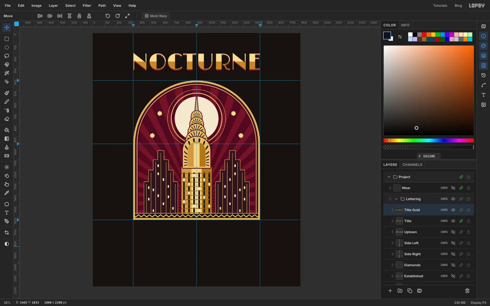

Add a layer called *Title Gold* above the title, then [[Cmd]]-click the title's
thumbnail to select its letters. Keep *Title Gold* as the active layer, pick
the **Gradient** tool and click **Advanced…** in the options bar. Click empty
spots on the gradient bar to add stops until you have four, then set them to:

- `#F4DC9C` at 0 % and 50 %
- `#C08A3A` at 52 % and 100 %

Two stops that sit almost on top of each other give a hard break instead of a
blend. Click **Done**, drag the gradient from the top of the letters to the
bottom, and deselect. The title is now pale gold on top and deep gold
underneath, split across the middle like a polished metal sign.

## Seat UPTOWN in a plaque

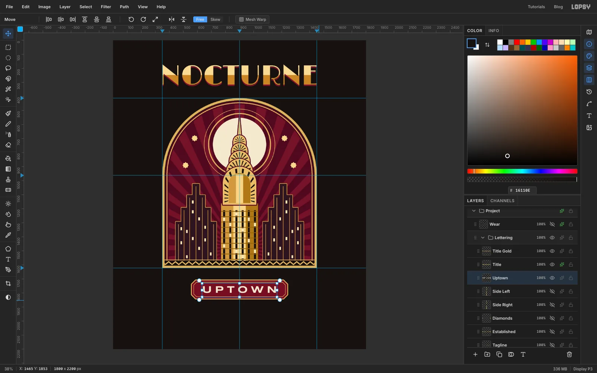

Add a layer called *Plaque*. With the **Rectangular Marquee**, drag a box about
**680 × 130** px, centred on the middle guide and about 90 px below the arch.
Clip its corners: pick the **Lasso**, hold [[Alt]] and drag a small triangle
over each corner, about 28 px along each side, to take it out of the selection.
Then:

- fill with `#6E1A24`
- **Shrink** by 12 and fill with gold `#D9B46A`
- **Shrink** by 3 and fill with `#6E1A24` again

That leaves a hairline of gold just inside the edge. Add a **Stroke** of **6**
px in gold.

Type **UPTOWN** in **Syncopate**, **Bold**, **Size** 70, ivory `#F2E8D0`, with
**Letter spacing** 22. Move it into the plaque so the space on its left and
right is equal and the letters sit in the vertical middle of the inner panel.

## Add the tagline and date

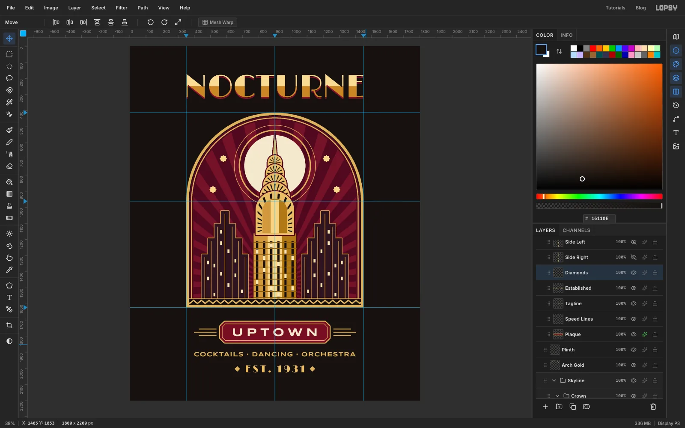

On a *Speed Lines* layer, use the **Pencil** at **Size** 5 in gold to draw three
short horizontal lines on each side of the plaque. Click, then [[Shift]]-click
for each one, with the middle line reaching a little further out.

Type **COCKTAILS · DANCING · ORCHESTRA** in **Syncopate** **Regular**, **Size**
38, in gold `#D9B46A`. On a Mac, [[Alt]]+[[Shift]]+[[9]] types the middle dot.
Centre it under the plaque and adjust **Letter spacing** (about 3) until its
ends line up with the outer ends of the speed lines. Below it, type **EST.
1931** in **Limelight**, **Size** 64, **Letter spacing** 10, in `#E2BE72`.

For the diamonds, add a layer called *Diamonds*, marquee a 24 px square just
left of the date and fill it with gold. Switch to the **Move** tool, hold
[[Cmd]] and drag the rotation handle to 45°, then press [[Cmd]]+[[D]].
**Duplicate** the layer, **Flip Horizontal** to send the copy to the other side
of the date, and **Merge Down**.

## Run the side text up the arch

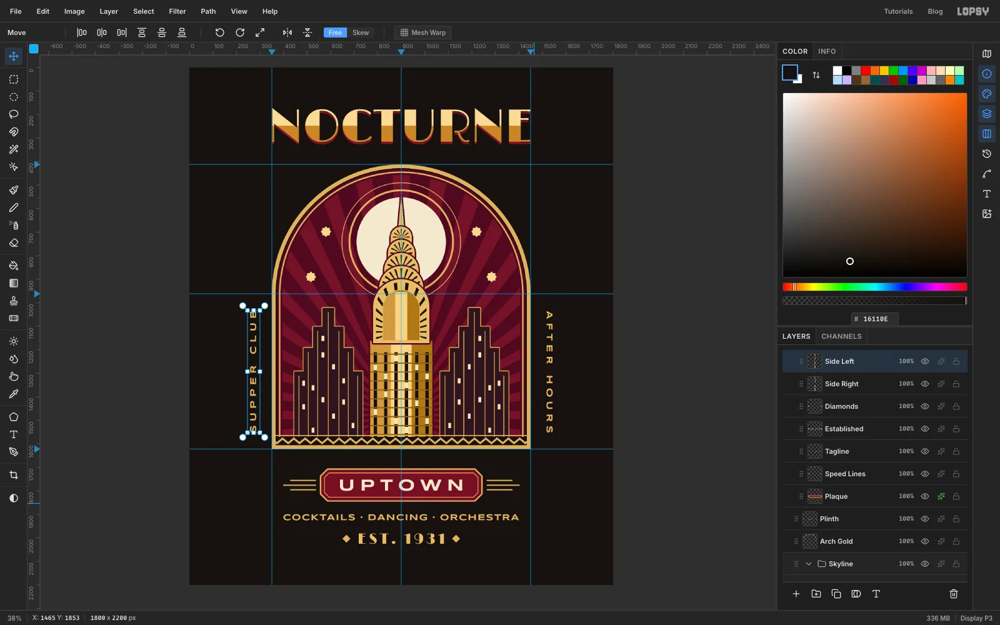

Type **SUPPER CLUB** and **AFTER HOURS** as two separate text layers in
**Syncopate**, **Size** 38, **Letter spacing** 16, gold. They're the same length,
so the two sides balance.

Select *SUPPER CLUB*, pick the **Move** tool and hold [[Cmd]] while you drag the
rotation handle a quarter turn anticlockwise, to **-90°**. Press
[[Cmd]]+[[D]]. Do the same to *AFTER HOURS*, turning it clockwise to **+90°**.
Both stay live text. Move each one just outside the arch, with the same gap on
both sides, and centre it on the arch's straight sides.

## Group the lettering and try a resize

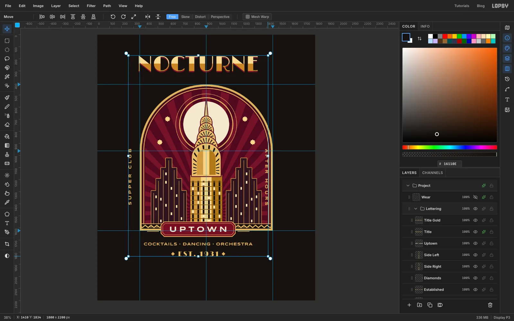

[[Cmd]]-click every text, plaque, speed-line and diamond row, choose **Layer →
Group Layers** and name the group *Lettering*. Now everything moves together.

Try it: select the *Lettering* group, pick the **Move** tool, hold [[Cmd]] and
drag the bottom-right handle inward. All the type and the plaque shrink
together around the arch, and the rotated side text stays rotated. Press
[[Cmd]]+[[D]] to commit, then [[Cmd]]+[[Z]] to undo it. Everything goes back
exactly where it was, and [[Cmd]]+[[Shift]]+[[Z]] would redo it. Leave it at
full size.

## Wear it in

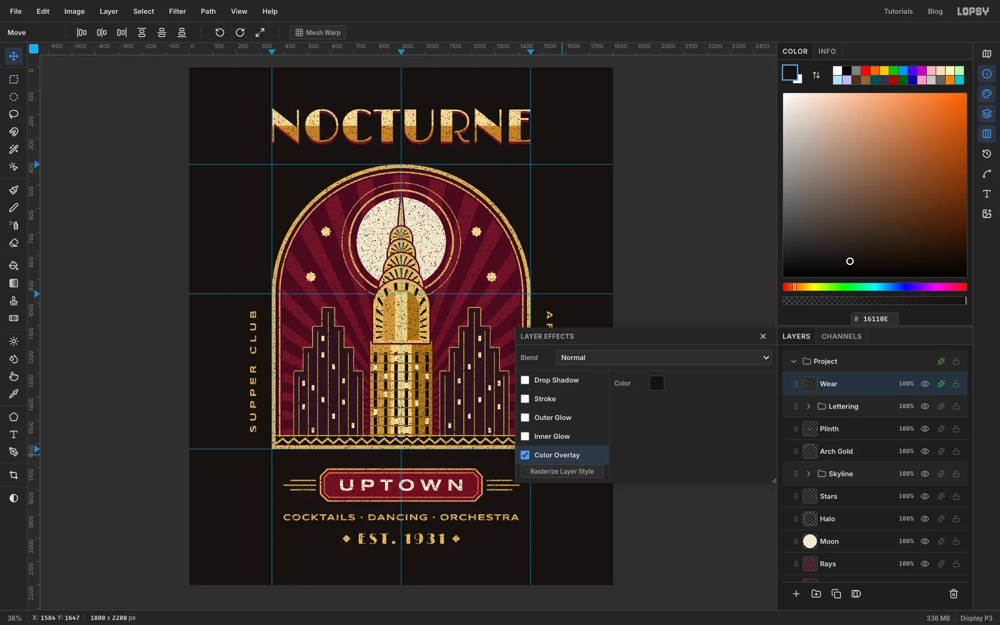

A good worn print loses a little ink everywhere, in small clumps, never as
dirty blotches. Add a layer called *Wear* at the very top and fill it with mid
grey `#808080`. Then:

1. **Filter → Add Noise**: **Mono**, **Gaussian**, **Amount** 100.
2. **Filter → Gaussian Blur**, **Radius** 3, which clumps the noise.
3. **Filter → Threshold**, **Level** 121. Only the darkest clumps turn black,
   about 7 % of the layer.
4. Pick the **Magic Wand**, untick **Contiguous**, set **Tolerance** to 40 and
   click a white area. Press [[Delete]], then [[Cmd]]+[[D]]. With thousands of
   tiny islands selected, the selection can take a few seconds to clear.
5. Open the effects drawer and turn on **Color Overlay** in the shirt colour
   `#16110E`.

The specks now read as bare fabric showing through the ink. Export with **File →
Quick Export PNG**, and use **File → Save Project** to keep the layers.
