Around 1900 René Lalique made insects into jewellery. He set dragonflies,
scarabs and cicadas in gold, and filled their wings with
**plique-à-jour**: backless, translucent enamel held in gold wires
(*cloisons*), like a tiny stained-glass window. In this tutorial you'll turn
that idea into a **tattoo flash sheet**, a bordered page of numbered
designs a client can pick from, framed the way Alphonse Mucha framed his
posters. It gets a halo, an arched title band and whiplash iris stems.

It's fully drawn. There are no photos, and almost no brushwork. Every shape is a
**Lasso** or **Elliptical Marquee** selection, and every piece uses the same
three-part recipe:

1. Fill the silhouette with ink.
2. **Select → Shrink** a few pixels and fill again with a gold gradient, which leaves an even black outline.
3. Shrink again and either fill with an enamel gradient or **Delete** to hollow the metal out.

The palette:

- Paper `#E4CFA0`, ink `#1A1410`, frame teal `#16403E`
- Gold ramp `#F6DC8E` → `#C99A3B` → `#7A5418`
- Enamels: teal `#0E6A66` → `#34AE9E` → violet `#7450B4`, jade `#1E5B3A` / `#8CCB8A`, amethyst `#D9B8F2` → `#7A4BB0` → `#2A1446`, amber `#7A3E0C` / `#F0B545`

## Start a 1350 × 1800 sheet

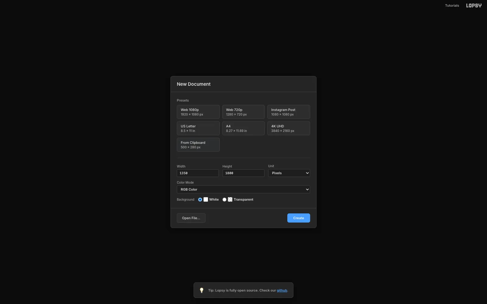

Choose **File → New**, set **Unit** to **Pixels** and enter **1350 × 1800**
(3:4, close to an 11 × 14 inch flash sheet), then click **Create**. If you
clicked a print preset such as US Letter or A4 first, the unit will have
switched to Inches, so check it says Pixels before you type the size.

## Make laid paper with Add Noise, Motion Blur and Emboss

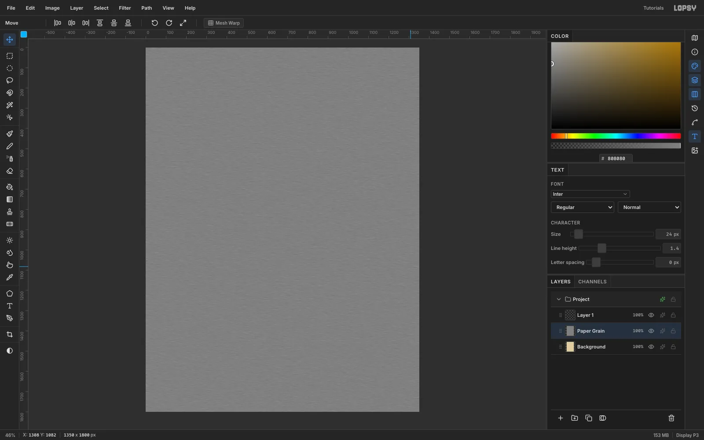

Click **Background**, set the foreground to `#E4CFA0` and choose
**Edit → Fill**. Add a layer named **Paper Grain**, fill it with `#808080`,
then run three filters:

1. **Filter → Add Noise…** with **Amount 60**, **Mono**, **Gaussian**.
2. **Filter → Motion Blur…** with **Angle 0** and **Distance 14**. The specks become horizontal fibres.
3. **Filter → Emboss…** with **Angle 135** and **Strength 40**.

## Blend the grain and draw the frame

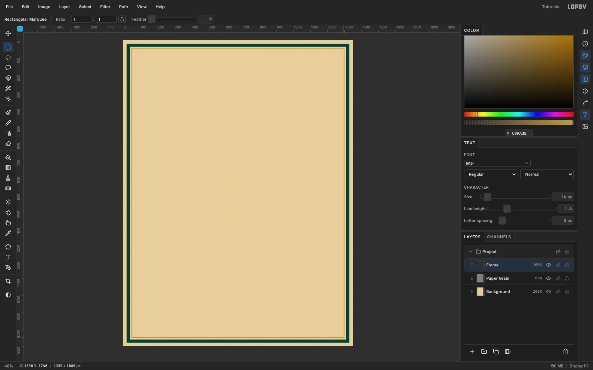

Open Paper Grain's effects drawer (✦), set **Blend** to **Overlay**, and set
the row's opacity to **65%**. The grey disappears and only the embossed
fibres stay.

On a new **Frame** layer:

1. Draw a **Rectangular Marquee** 22 px in from every edge and fill it with frame teal.
2. Choose **Select → Shrink…** **18** and press **Delete**, which leaves an 18 px band.
3. Repeat inside it in gold: press [[Cmd+D]], marquee a rectangle 50 px in from every edge and fill it with `#C99A3B`, then **Shrink 4** and delete, which leaves a 4 px rule.

> **Tip:** With nothing selected, *click* (don't drag) with the Rectangular
> Marquee to type exact corners: From **22, 22** To **1328, 1778** for the
> teal band, and From **50, 50** To **1300, 1750** for the gold rule.

## Build the halo from shrunken ellipses

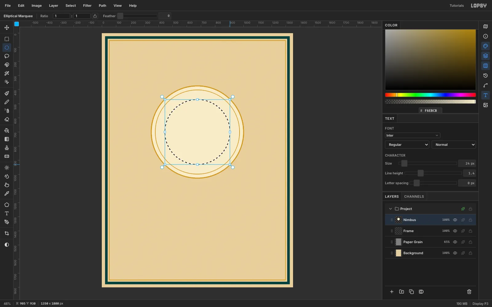

Mucha put a halo behind every figure. On a **Nimbus** layer, build it from
three circles that share one centre: on the sheet's centre line, 700 px down
from the top.

1. Select a circle **660 px** across (radius 330) with the **Elliptical Marquee**, fill it gold, then **Select → Shrink… 6** and fill cream `#F6EBCB`.
2. Do the same with a circle of radius **300** and **Shrink 3**.
3. Do it again at radius **230** in light gold `#E9C77A` with **Shrink 3** and `#EFDDB0`.

Each pair of fills leaves a crisp gold ring.

> **Tip:** Concentric circles are easiest to get exact from the marquee's
> click-for-corners dialog. For radius *r* around this centre, type From
> **675 − r, 700 − r** To **675 + r, 700 + r**: From **345, 370** To
> **1005, 1030** for the outer circle.

## Paint beads and rays with Radial Symmetry

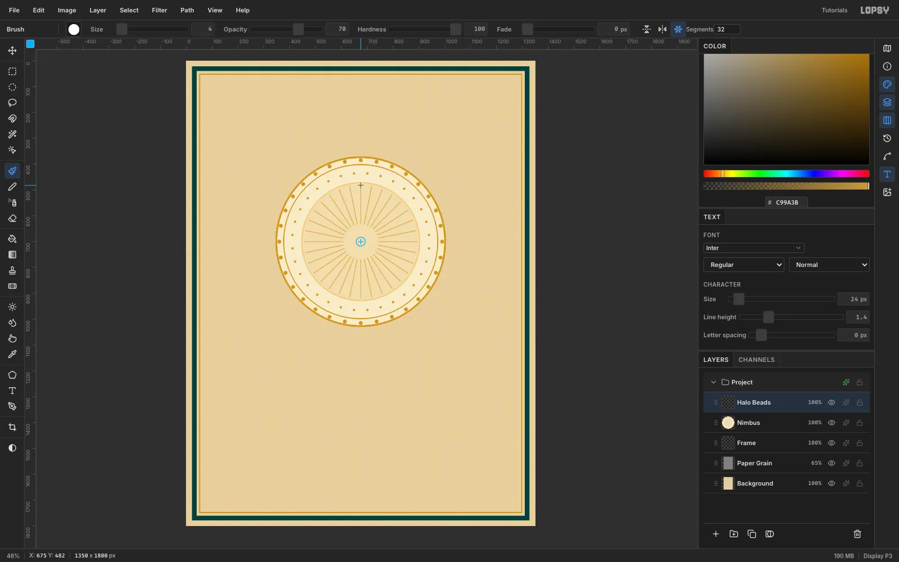

Add a **Halo Beads** layer and pick the **Brush** (**Size 16**,
**Hardness 100**, gold). Click **Radial Symmetry** in the options bar and set
**Segments** to **32**. [[Cmd]]-click the centre of the halo to move the
symmetry centre there. Zoom in and use the pointer markers on the rulers to
land on 675 across and 700 down. Then:

- One click in the outer cream band, straight above the centre, paints 32 beads.
- At **Size 10**, one click in the inner cream band (about 265 px from the centre), half a step round from the beads, gives the inner ring.
- At **Size 4** and **Opacity 70**, click about 70 px above the centre, then [[Shift]]-click straight up, just short of the innermost gold ring. That straight line is mirrored into 32 rays.

Click **Radial Symmetry** again to switch it off. It captures every [[Cmd]]-click while it's on.

## Arch the title band

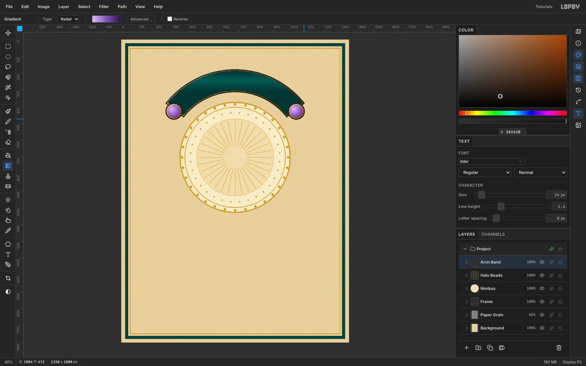

The band is a ring segment around the halo centre, running from −141° to −39°
between radii **395** and **515**. Lasso it slightly oversized and fill ink,
**Shrink 5**, then drag a **Gradient** of the gold ramp across it. Lasso the
exact band and drag a vertical gradient `#0F3533` → `#1F5A56` → `#0F3533`
through it.

At each end, add a cabochon:

1. Fill an ink circle with radius 50 and add the gold ring the same way.
2. Set the Gradient tool to **Radial** and drag the amethyst ramp outward from a point up and to the left of centre inside a radius-39 circle. The off-centre start gives it a highlight.

## Grow whiplash irises up both sides

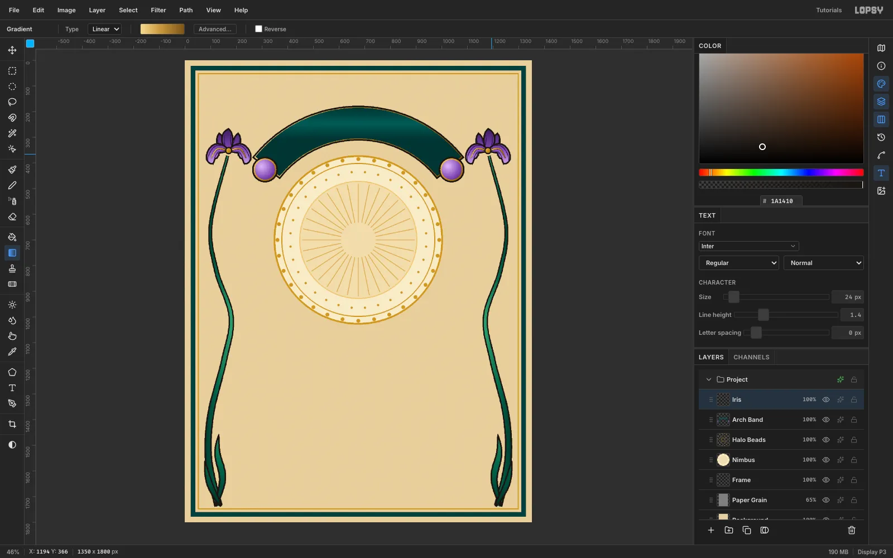

On an **Iris** layer, lasso each stem as a ribbon that swings in an S from
the bottom corner up to the top corner:

1. Taper each stem from 32 px wide at the base to 12 px at the top, and fill it with ink.
2. Lasso a thinner ribbon inside it and fill that with a green gradient (`#0E3A30` → `#4F9A70`).
3. Add two sword-shaped leaves at the base.

Each bloom has five petals: three standards pointing up and two falls
curling down. Fill each petal ink, **Shrink 5**, and fill it with the amethyst ramp.
Add thin `#2A1446` vein lines, a gold beard on each fall, and a small gold
knob at the centre.

## Draw the dragonfly's hollow gold wings

Click **Iris**, then click **New Group** and name it **Dragonfly**. Add a
**DF Wing Metal** layer. For each of the four wings:

1. Lasso the wing silhouette and fill it with ink.
2. **Shrink 5** and fill it with the gold gradient.
3. **Shrink 11** and press **Delete**. You're left with a hollow wire.

Then lasso the veins as thin strips and fill each one gold: three long
veins from base to tip, and seven cross veins. Give the layer a **Drop
Shadow** in `#3A2A10` (**Offset** 3 / 4, **Blur 4**, **Opacity 40**) so the
metal sits slightly above the paper.

## Fill one side with enamel

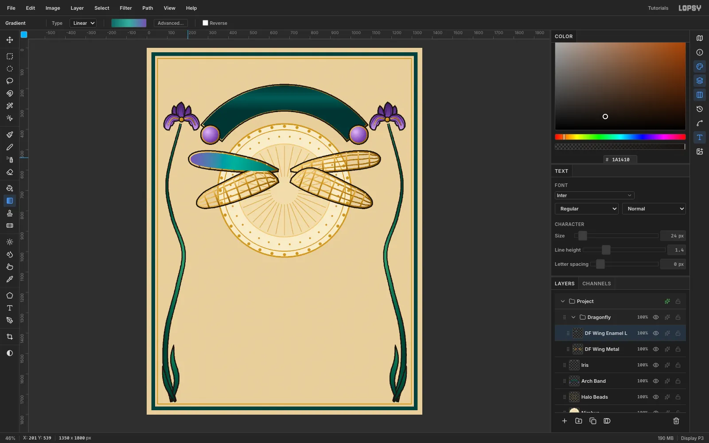

Add a layer named **DF Wing Enamel L**. Lasso the left forewing,
**Shrink 11**, and drag a **Linear Gradient** from the wing base to its tip
using `#0E6A66` → `#34AE9E` → `#7450B4`. Repeat for the left hindwing.
You'll mirror these later instead of painting the right side.

## Cut the veins through the enamel

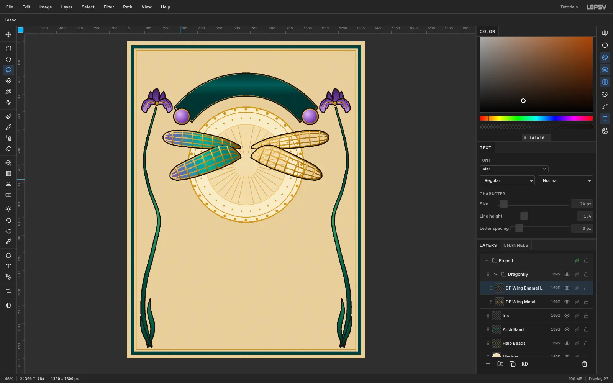

Lasso the same vein strips again on the enamel layer and press **Delete**
for each one. The enamel splits into separate cells, and the gold veins on
the metal layer show through the gaps. That's plique-à-jour: coloured
windows held by gold.

## Mirror the enamel with Duplicate and Flip

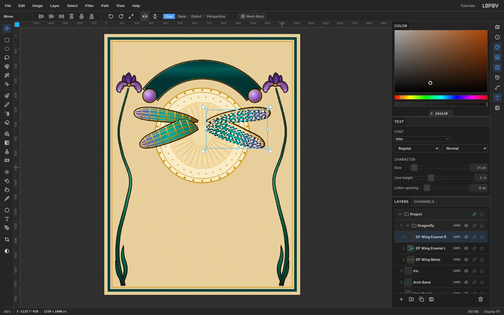

Switch to the **Move** tool, click **Duplicate Layer**, click the copy's row
and rename it **DF Wing Enamel R**. Draw a **Rectangular Marquee** around
both wing pairs that is exactly symmetric about the body, which sits on the
sheet's centre line. Then click **Flip Horizontal** in the options bar: the
flip happens about the marquee's centre. Press [[Cmd+D]].

> **Tip:** The click-for-corners dialog makes the symmetric marquee easy.
> Any box centred on x 675 works, such as From **125, 420** To **1225, 920**.

Duplicate offsets the copy 10 px right and 10 px down, and the flip mirrors
that into 10 px left and 10 px down. Press [[Shift+Right]] and [[Shift+Up]]
once each to cancel it. The two sides then match exactly.

## Make the wings translucent

Click the right copy's row and choose **Layer → Merge Down**, then rename
the result **DF Wing Enamel**. Add an **Inner Glow** in white (**Size 6**,
**Spread 0**, **Opacity 45**). Every cell gets a bright glassy rim. Set the
row's opacity to **72%**. The halo's beads and rays now glow through the
wings, because the metal underneath is hollow.

## Add the body

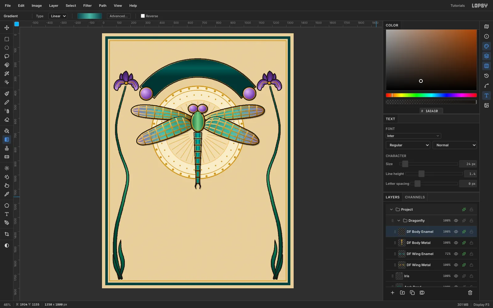

Add **DF Body Metal**, with the same Drop Shadow as the wing metal, and
**DF Body Enamel** above it. Build each part on these two layers:

- **Eyes:** two ellipses (38 × 34) filled with a radial amethyst gradient.
- **Face:** a small capsule below the eyes.
- **Thorax:** a jade ellipse (52 × 76), with its gradient dragged across it (`#1E5B3A` → `#8CCB8A` → `#1E5B3A`).
- **Abdomen:** a ribbon tapering from 60 px to 28 px. Split it into 8 segments with thin ink bars, and give each segment its own left-to-right teal gradient.
- **Tip:** two small claspers.

Give the enamel layer an **Inner Glow** in `#F4FFF8` (**6 / 0 / 50**).

## Flash design II: the scarab

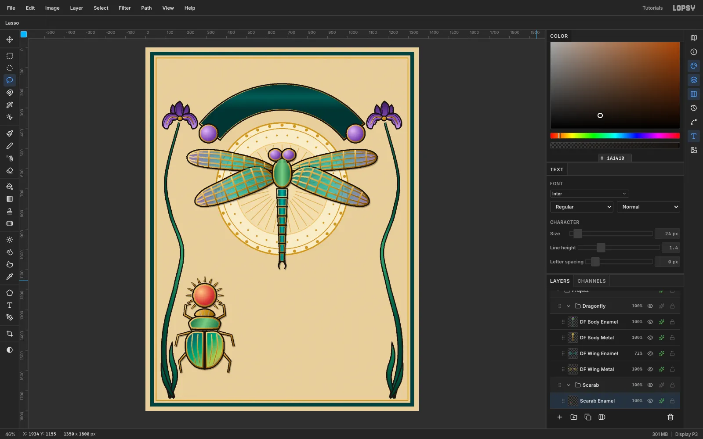

Click **Iris**, then **New Group**, and name it **Scarab**. Add
**Scarab Metal** and **Scarab Enamel** layers. Draw the parts in this order:

1. **Legs first,** so the body covers their roots. Each leg is a 17 px ink ribbon with a 7 px gold core.
2. **Sun disc:** radial gradient `#F7C98A` → `#C8453E` → `#5E0F24`, with 13 gold rays and a gap where the head is.
3. **Fan-shaped head** with three grooves.
4. **Jade pronotum.**
5. **Two elytra** with a diagonal iridescent gradient (`#123F5C` → `#2E9C77` → `#B7C95A` → `#6B3A7E`). Delete two thin curved grooves in each.

## Flash design III: the cicada's clear wings

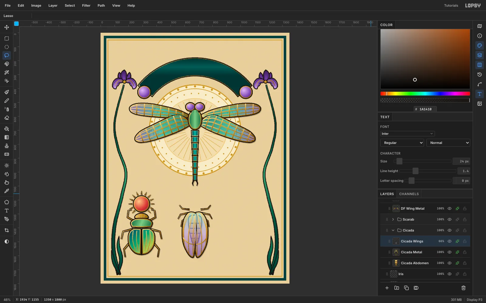

The cicada has its wings folded like a roof over a visible body, so it uses
four layers in its **Cicada** group:

1. **Cicada Abdomen:** a gold abdomen with ink bands.
2. **Cicada Metal:** gold-cored legs, plus two long hollow wings that cross at the midline, with gold veins.
3. **Cicada Wings:** the wing enamel (`#9FE3DA` → `#B9A2E4` → `#6A44A0`) with the veins cut out. Give it an Inner Glow and set it to **66%**, so the banded body reads through.
4. **Cicada Body Metal** and **Cicada Enamel:** the head, the amber pronotum and the jade mesonotum.

Finish with amethyst eyes at the head's corners and two garnet ocelli.

## Flash design IV: the bee

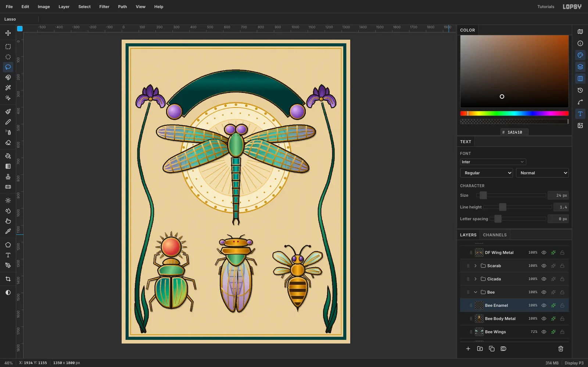

The **Bee** group repeats the same layer stack:

- **Wings:** four hollow wings with gold veins, plus an enamel layer (`#3E9A98` → `#A8DDD2` → `#EAF6EE`) at **72%**.
- **Thorax and head:** amber.
- **Abdomen:** fill the inside of the gold rim with dark `#3A2410`. Fill the amber enamel on top, then **Delete** four horizontal bands. The dark shows through as stripes.

Draw the gold-cored legs first so they tuck under the thorax.

Add a **Shine** layer and paint small white `#FFF8E6` ellipse highlights on
the eyes, thoraxes and wing cases. Drag it above all the groups using its
grip.

## Draw an arc for the title with the Pen

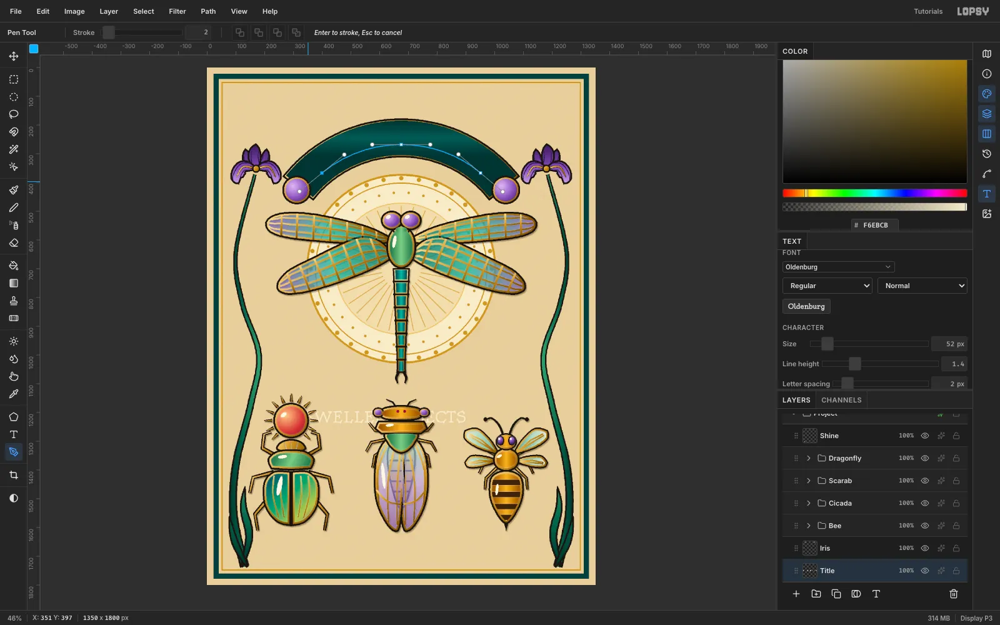

Set the text first:

1. Click **Arch Band** and pick the **Text** tool.
2. Choose **Oldenburg**, a Mucha-era display face, at **Size 52**, with colour `#F6EBCB` and **Letter spacing 2**.
3. Click in empty canvas and type **JEWELLED INSECTS**. It comes out about **600 px** wide.

Now draw the arc. To seat the capitals in the middle of the band, the
baseline needs a radius of **432** around the halo centre. A 600 px line on
that circle spans about **79°**, so the arc runs about 40° either side of
straight up.

With the **Pen Tool**, click-drag three anchors along that circle:

- **Start:** about 276 px left of the centre line and about 100 px lower than the top anchor. Drag the handle up and to the right, along the curve.
- **Top:** on the centre line, 432 px above the halo centre, just below the middle of the band. Drag the handle straight to the right.
- **End:** the mirror of the start. Drag the handle down and to the right.

Keep each handle about **100 px** long (roughly a quarter of the radius). Click
**Commit path** rather than pressing [[Enter]], which would also stroke the
path onto the active layer.

## Bind the title to the arc

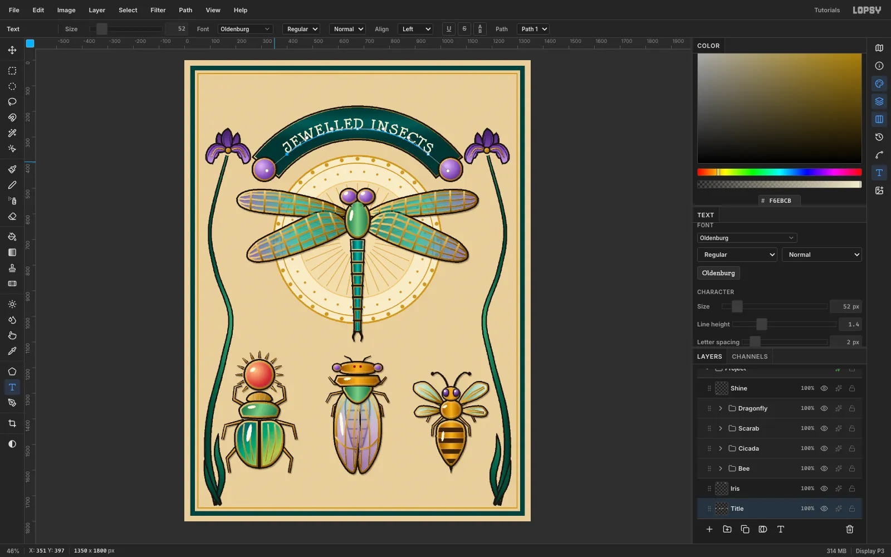

Click the title's row. With the Text tool active, choose the new path in the
options bar's **Path** dropdown. The capitals follow the arc and sit centred
in the band, with the same space above and below.

Work the arc's length out from the text's width rather than by eye. A path
that's too short silently cuts off the last letters, so if you're unsure,
make it a little long.

## Set the labels and curved captions

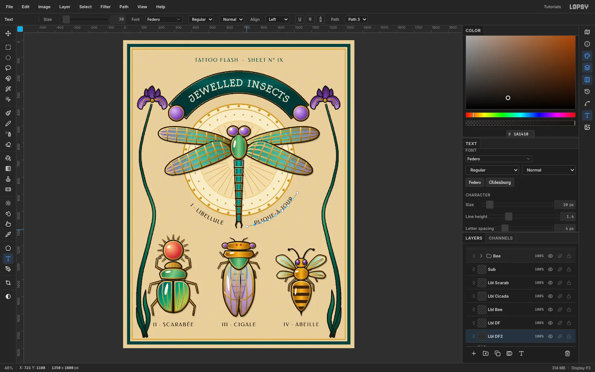

Use **Federo** at **Size 30** with **Letter spacing 4** for all the small type:

- **Subtitle:** TATTOO FLASH · SHEET Nº IX in frame teal. Centre it with **Align center horizontally**.
- **Bottom labels:** II · SCARABÉE, III · CIGALE and IV · ABEILLE, each centred under its insect on the same baseline.
- **Dragonfly captions:** draw two more Pen arcs at radius **390** that run **counter-clockwise**, so the text reads left to right with the letters upright. Start each one **14°** either side of the tail, so both captions sit the same distance from the abdomen. Bind I · LIBELLULE to the left arc and PLIQUE-À-JOUR to the right.

## Make an 8-point sparkle with Rotate and Scale

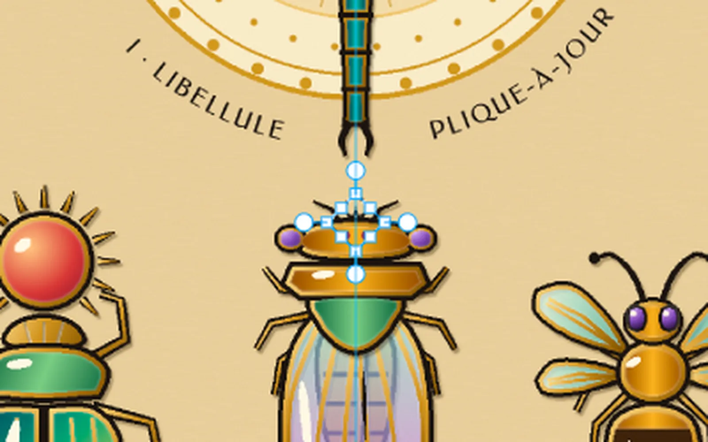

On a **Sparkles** layer, lasso a four-point star with radius 20. Fill it ink,
**Shrink 4** and fill it gold, then add a small white centre. It's on its
own layer, so you can draw it anywhere and move it later.

1. Marquee the star, press [[Cmd+C]], then press [[Cmd+V]].
2. Marquee the paste. With the **Move** tool, drag the rotation handle just outside the top-right corner through **45°**, then press [[Cmd+D]].
3. Marquee it again and [[Cmd]]-drag a corner to scale it to about **62%**. Press [[Cmd+D]].
4. Re-centre it on the original star and choose **Merge Down**. You now have an eight-point sparkle.

## Place the sparkles with guides

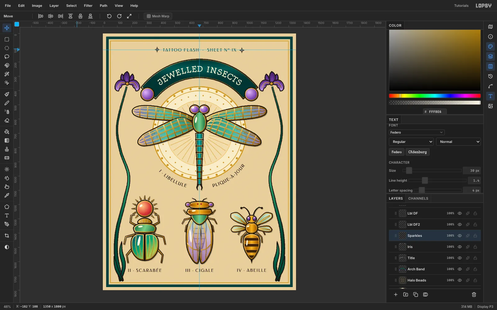

Add two guides: [[Cmd]]-click ([[Ctrl]]-click) the middle of the top ruler
for a vertical guide exactly at the centre, and click the left ruler level
with the middle of the subtitle's capitals. Copy and paste the sparkle, then
drag one copy to each end of the subtitle, centred about 30 px beyond the
first and last letters and on the horizontal guide. Merge them onto the **Sparkles** layer.
Nudge the layer until it's symmetric about the centre guide. Turn guides off
with **View → Show Guides**.

## Connect the iris stems and export

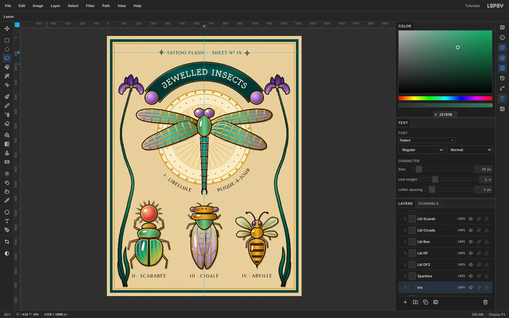

Zoom in on the bloom bases. A gap between the stem and the gold knob makes
the flowers look like they float. On the **Iris** layer, lasso a small
tapered calyx from each stem top up to its knob:

1. Fill it with ink.
2. **Shrink 3** and fill it with green `#2E7D5B`.

Save the project with **File → Save Project**, then **File → Quick Export
PNG**.

> **Tip:** Every design here is the same ink → Shrink → gold → Shrink →
> enamel recipe. The metal is hollowed wherever you want light to pass
> through, and the enamel layer's opacity controls how much of the
> background glows through it.
