Around 1900, Alphonse Mucha and his contemporaries sold champagne, cigarettes
and biscuits with the same few devices:

- a figure in front of a huge decorated disc (the *nimbus*)
- whiplash plant stems
- mosaic grounds
- heavy outlined lettering

In this tutorial you'll use all of them in **Lemon Elixir**, a 2100 × 720
billboard for an imaginary lemon tonic. A teal bottle takes the place of the
Mucha figure, and the nimbus is a giant slice of lemon.

Along the way you'll use:

- Edit → Fill, guides and Select → Shrink
- the **Voronoi**, Brightness/Contrast, Hue/Saturation, Clouds and Add Noise filters
- **Radial Symmetry** on the Brush
- linear and radial gradients
- the **Pen** tool with **Stroke Path**
- a transform-handle stretch and a multi-layer nudge
- Stroke, Drop Shadow, Outer Glow and Inner Glow effects
- two Google Fonts: Metamorphous and Marcellus

Palette:

- cream paper `#EFE3C2`
- sage `#8FA079`
- lemon `#F2C230`
- teal glass `#2E6B6A`
- outline brown `#3B2A1E`

## Set up the paper and guides

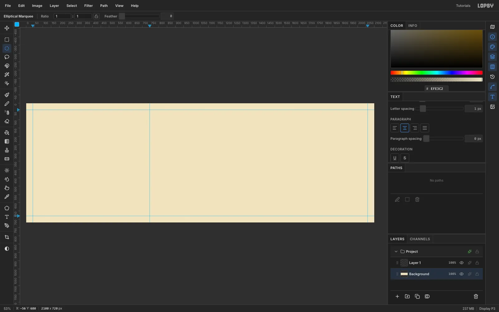

Choose **File → New**. Set **Unit** to Pixels, **Width** to `2100` and
**Height** to `720`, then click **Create**.

Select the Background, set the foreground to `#EFE3C2` and choose
**Edit → Fill**. Run **Filter → Add Noise** at `6` in **Mono** so the paper
isn't dead flat.

Click the rulers to drop guides:

- on the top ruler, one about 40 px in from each end, and one a little over a third of the way across (the readout says about `745`)
- on the left ruler, one about 40 px from the top and one about 40 px from the bottom

The guide at 745 divides the illustration half from the lettering half.

## Break the panel into tesserae with Voronoi

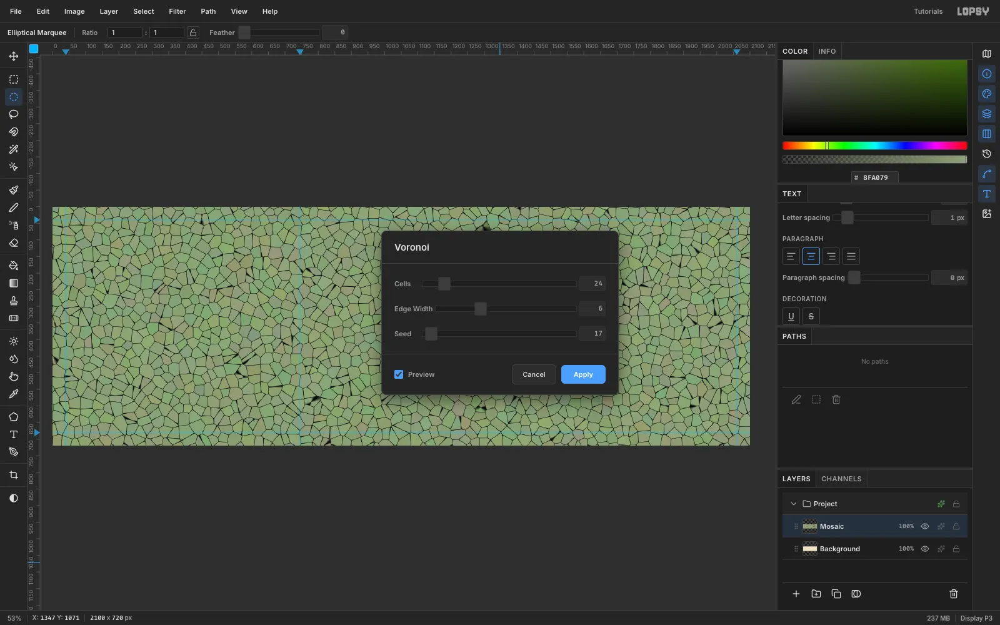

Rename `Layer 1` to `Mosaic`. With no selection, fill the whole layer with
sage `#8FA079`, then run **Add Noise** at `22` in **Color**. The noise gives
every tile a slightly different tone.

Open **Filter → Voronoi…** and set **Cells** `24`, **Edge Width** `2` and
**Seed** `17`. Turn on **Preview** and click **Apply**.

> **Tip:** Cells counts cells along the *height* of the layer, so 24 on a
> 720 px tall document gives tiles about 30 px across. Edge Width is in
> pixels, so `2` draws roughly 2 px grout.

Fill the whole layer first. Voronoi samples a colour at each cell centre, and
the cells need something to sample right up to the panel edge.

## Clip the mosaic to an arched cartouche

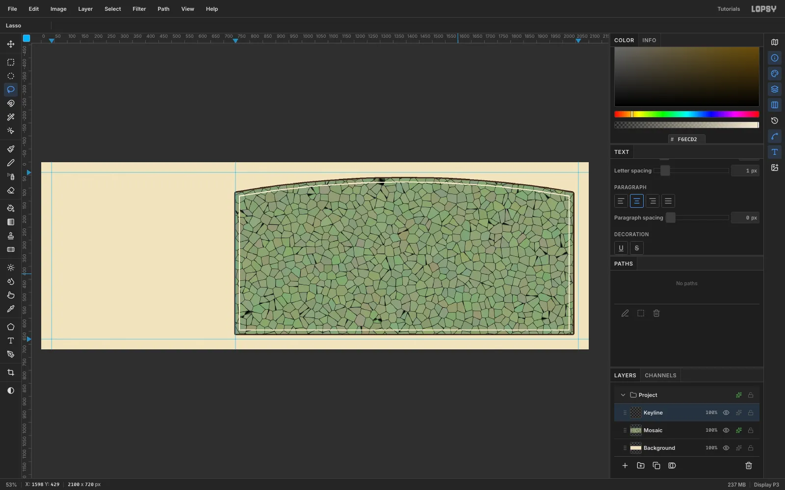

Art Nouveau panels rarely have square tops. Use the **Lasso** to draw a
panel that runs from the divide guide to about 20 px short of the right-hand
guide, and down to about 20 px above the bottom guide. Give it a shallow arch
on top: the top corners sit about a sixth of the way down the page, and the
arch peaks just below the top guide in the middle. Choose
**Select → Inverse** and press [[Delete]].

On the Mosaic layer, open **Layer effects** and turn on **Stroke**: `#3B2A1E`,
Width `5`, **outside**.

For the keyline, add a layer named `Keyline`. Lasso the same arch 13 px
inside the panel and fill it cream `#F6ECD2`. Choose **Select → Shrink** by
`3` and press [[Delete]], which leaves a 3 px cream line.

## Soften the grout

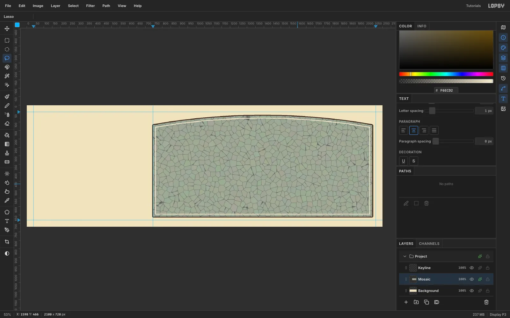

Black grout fights the lettering. Select `Mosaic` and apply:

1. **Filter → Brightness/Contrast** with Brightness `10` and Contrast `-55`.
2. **Filter → Hue/Saturation** with Saturation `55` and Lightness `-4`, to
   bring the sage back.

The panel should now read as quiet texture rather than pattern.

## Draw the double frame

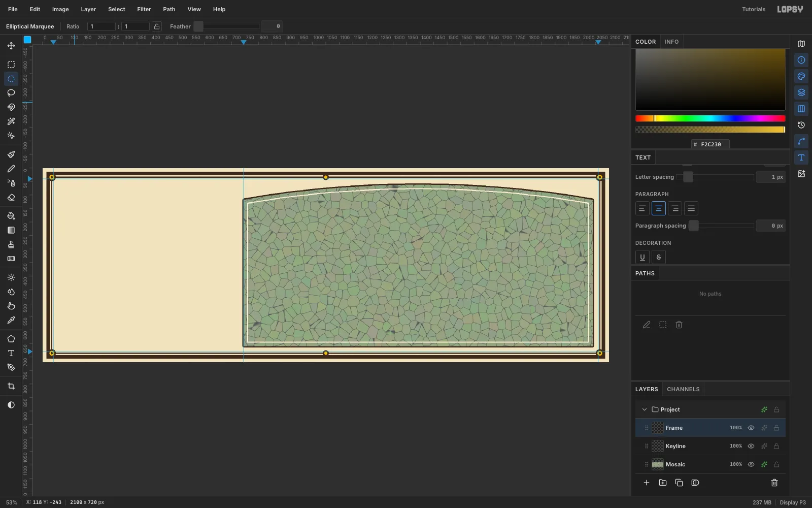

Add a layer named `Frame`. Draw a rectangular marquee 14 px in from every
edge and fill it `#3B2A1E`. Choose **Select → Shrink** by `12` and press
[[Delete]] to leave a thick border.

Repeat with a marquee 32 px in from every edge, shrinking by `3`, for the
thin inner rule.

> **Tip:** With nothing selected, a plain *click* with the Rectangular Marquee
> opens a dialog for exact corners. From `14, 14` To `2086, 706` gives the
> outer border.

For the corner ornaments, fill three stacked ellipse marquees at each corner
of the inner rule:

- a dark 30 px circle
- a lemon `#F2C230` 18 px circle
- a dark 8 px centre

Add two smaller dots at the middle of the top and bottom rules.

## Build the nimbus with Radial Symmetry

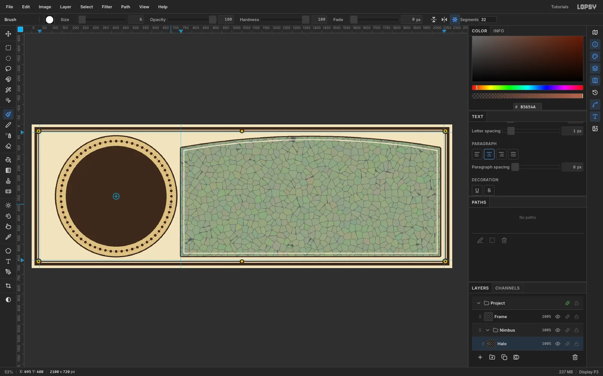

Select `Keyline` and click **New Group**. Name the group `Nimbus`, then add a
layer named `Halo` inside it. The halo sits in the illustration half,
centred on the page's middle row and 422 px in from the left edge. Fill these
concentric circles with the **Elliptical Marquee**:

- radius 306 in `#3B2A1E`
- radius 300 in gold `#D8C28A`
- radius 252 in `#3B2A1E`

Pick the **Brush** at Size `14` and Hardness `100`, then turn on
**Radial Symmetry** with `32` segments. [[Cmd]]-click the halo centre to move
the symmetry centre there. Click once in the middle of the gold band, level
with the centre, then again one half-step around. That gives 64 evenly
spaced dots.

> **Tip:** Circles that share a centre are easiest to get exact with the
> marquee's click-for-corners dialog. For radius *r*, type From
> `422 − r, 360 − r` To `422 + r, 360 + r`, for example From `116, 54`
> To `728, 666` for the radius-306 circle.

Switch to Size `6` and terracotta `#B5654A`, and click between the dots.

## Slice the lemon wheel

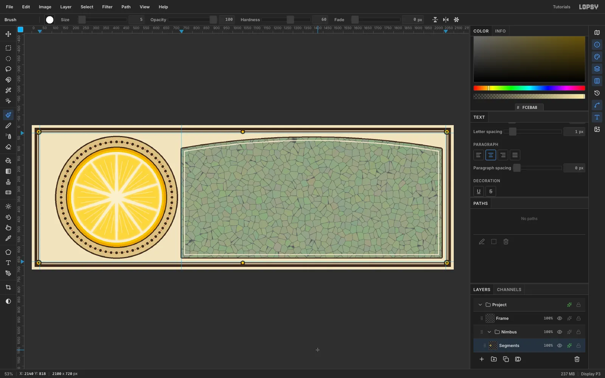

Add a `Lemon Wheel` layer and fill three more circles: rind `#E3A91F` at
radius 247, zest `#F0C53A` at 236 and pith `#F8EFD0` at 226.

On a new `Segments` layer, lasso ten wedges in `#F6D65A`. Each one runs from
near the centre out to about 214 px, with a 5 px pith gap on either side.

> **Tip:** For perfectly even wedges, select a circle of radius 214 on the
> same centre and run **Filter → Sunburst…** in `#F6D65A` with **Rays** `10`,
> **Width** about `90` and **Center X** / **Center Y** at `20` / `50`. The
> rays only land inside the selection.

For the juice, set **Radial Symmetry** to `10`, [[Cmd]]-click the centre again
and drag three short strokes inside one segment:

- Size `5`
- Opacity `70`
- colour `#FCEBA8`

Symmetry copies them into every segment. Turn Radial Symmetry off, then add an
**Inner Glow** in `#FFF4C4` (Size `16`, Opacity `80`) so the segments look
juicy.

## Shape and stretch the bottle

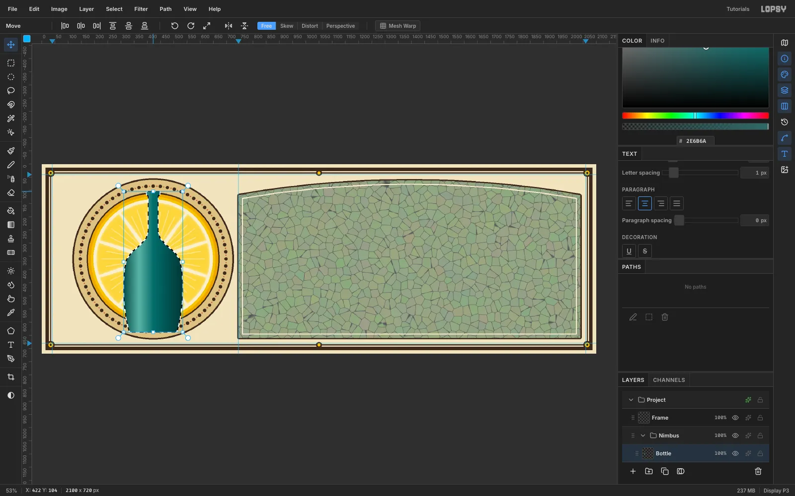

Add a `Bottle` layer above `Segments`. Lasso a bottle silhouette centred on
the halo: a narrow neck starting about 150 px from the top, sloping
shoulders about 290 px down, and a body about 224 px wide that ends about
80 px above the bottom edge. Fill it with teal `#2E6B6A`.

Pick the **Gradient** tool and open **Advanced…**. Set four stops:

- `#1E4A48` at 0 %
- `#6FB2A6` at 26 %
- `#2E6B6A` at 50 %
- `#143534` at 100 %

Choose **Linear** and drag across the selection from left to right.

For a more elegant neck, marquee the bottle, switch to the **Move** tool and
drag the top-centre handle up about 46 px. Press [[Cmd+D]] to commit.

## Add the cork, glints and label

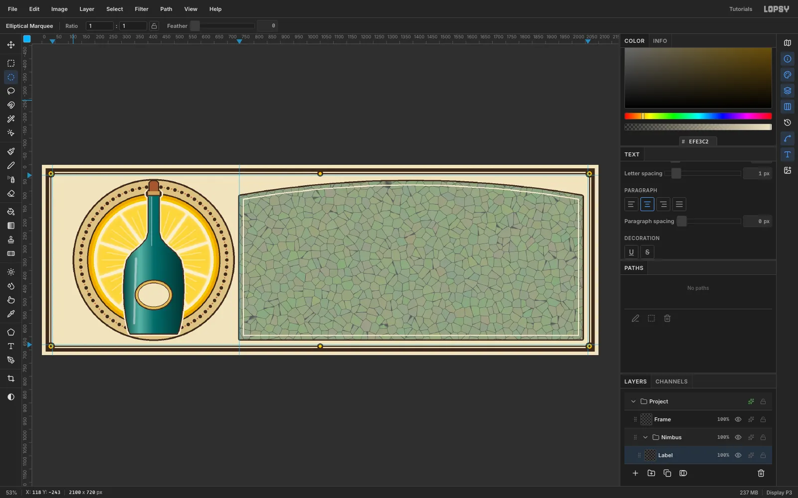

Give the bottle two effects:

- **Stroke**: `#3B2A1E`, Width `4`, outside.
- **Outer Glow**: cream `#F6ECD2`, Size `9`, **Spread 100**, which makes a
  crisp cream band.

That cream band is the *cerne*, the light contour that poster artists used to
lift a figure off a busy background.

Build the rest from simple shapes:

- **Cork layer:** a copper `#9C5A38` rectangle with a rounded top and a gold
  foil band, with a 4 px Stroke.
- **Glint layer:** two soft white brush strokes at Opacity `45`.
- **Label layer:** four stacked ovals (dark, gold `#D9B865`, dark, cream).

## Set a monogram

With the **Text** tool, set Size `54` and click in the label to type `LE`.
Switch to the Move tool, zoom in, and nudge with the arrow keys until the
letters sit dead centre in the label.

This shot uses **Metamorphous**. In the final polish step it gets swapped for
**Marcellus**, because the uncial E read as "L€".

## Draw whiplash vines with the Pen

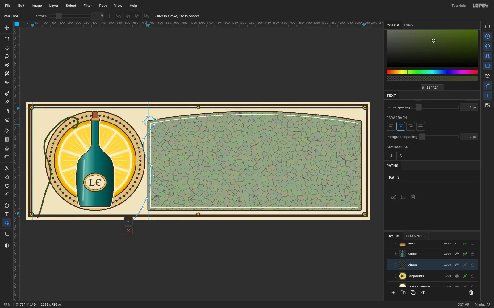

Add a `Vines` layer under the bottle. Pick the **Pen Tool** and
**click-drag** each anchor, so every point gets a smooth handle. Start the
left vine at the bottom edge, just inside the left frame. Climb up the left
of the halo in a lazy S, with anchors about a quarter, half and
three-quarters of the way up, then swing right over the halo's top-left and
curl back in on itself with two small anchors.

Click the ✓ **Commit path** button. Set the foreground to olive `#3E4A24` and
click **Stroke Path** in the Paths panel with Width `9`. Draw a second vine up
the right side of the halo the same way.

> **Tip:** Set **Stroke** to `9` in the Pen options bar and press [[Enter]]
> instead: it commits the path and strokes it in the foreground colour in one go.

## Add hair tendrils

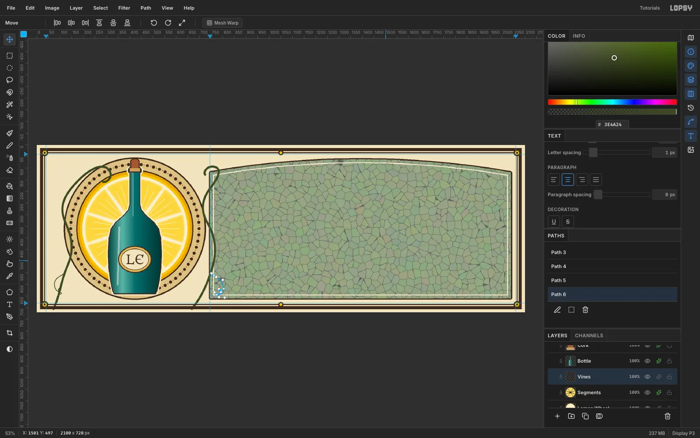

Mucha's whiplash lines come in two weights. Add thin spiral tendrils with the
Pen and stroke them at Width `3`.

Start each tendril at its curled tip in empty canvas. If the first click lands
on an existing vine, it selects that path instead of starting a new one.

## Hang the leaves

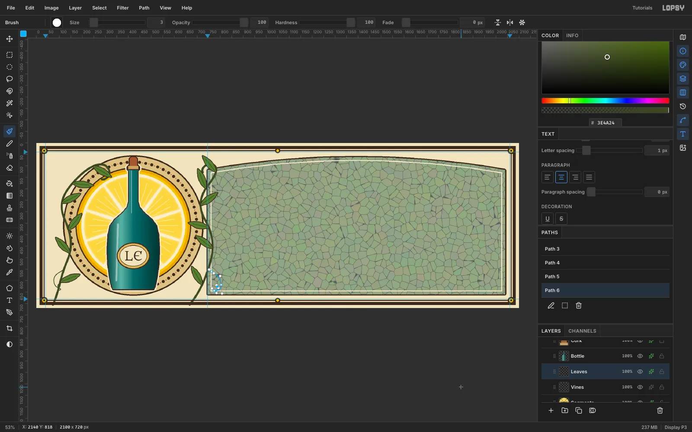

On a `Leaves` layer, lasso almond-shaped leaves in `#5E7F3A` (about 92 px
long). Place them along the vines, alternating sides at about 55° to the
stem. Keep every tip inside the inner frame.

Draw a 3 px midrib down each leaf with the Brush in `#3E4A24`, then add a
3 px outside **Stroke**.

## Paint the lemons

In the Gradient Editor, set stops `#FAE68E` → `#F2C230` at 45 % → `#C98E17`.
Switch the tool to **Radial**.

On a `Lemons` layer, lasso each lemon as an ellipse with a small nub at both
ends. Fill it `#F2C230`, then drag a radial gradient from a highlight at the
upper left out past the lower right. Make six:

- two hanging from each vine
- two lying at the foot of the halo

Brush a curved 4 px stem from each hanging lemon to its vine. Then give the
layer a 4 px outside **Stroke**, so the fruit matches the bottle's outline
weight.

## Fold a swallowtail ribbon

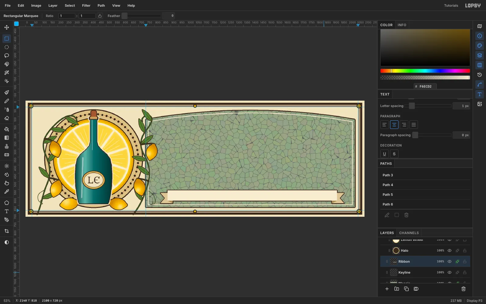

Select `Keyline` and add a `Ribbon` layer. Build the banner back to front:

1. **Lasso the two notched tails** in shaded cream `#D9C79B`, dropped 16 px
   below the band.
2. **Lasso two small fold triangles** in `#A98E5E` where each tail tucks
   under the band.
3. **Fill the main band** with a rectangle about 1050 × 64 px in
   `#F6ECD2`, across the bottom of the panel with roughly 120 px of mosaic
   showing at each end.

A 4 px outside **Stroke** outlines the whole banner.

## Set the headline

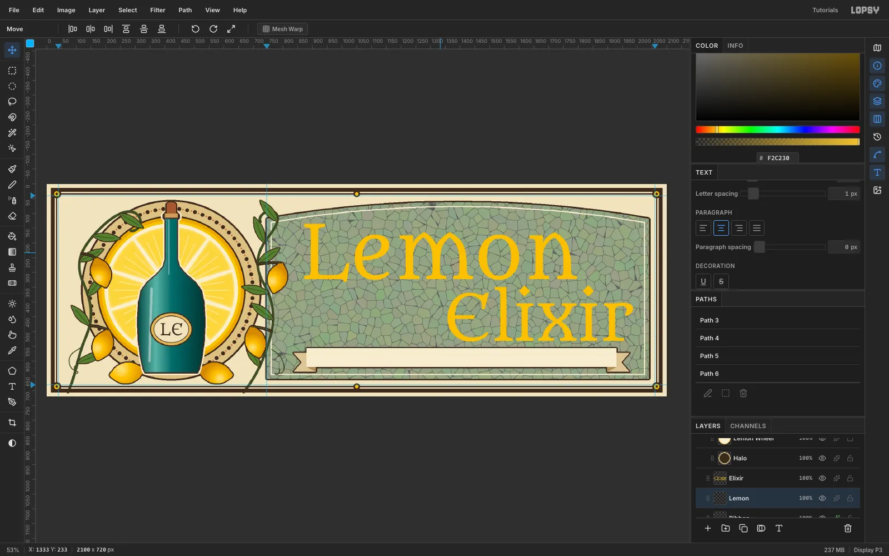

Set the headline in **Metamorphous**, a Google Font with organic,
Nouveau-style curves, in `#F2C230`:

- **Elixir** at Size `215`, right-aligned so its last letter ends about
  55 px inside the panel's right edge, with its top a little above the middle
  of the page.
- **Lemon** at Size `250`, starting about 130 px inside the panel's left
  edge, with its top about 135 px down, under the arch.

Type **Elixir** first. A new text click inside an existing text layer's
bounds edits that layer instead of creating a new one.

Staggering the two words leaves a pocket at the lower left for the medallion.

## Outline the lettering

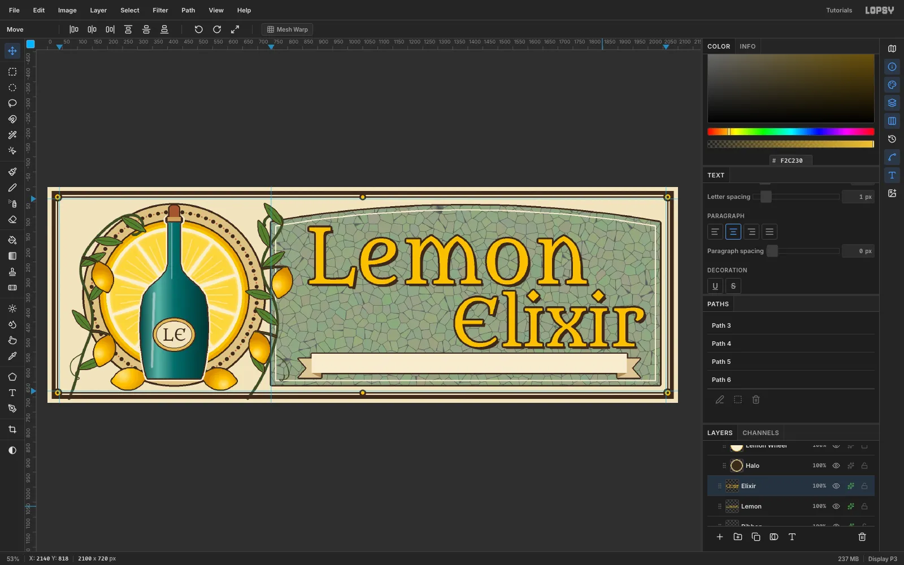

On both text layers, add these effects:

- **Drop Shadow**: `#3B2A1E`, offset `9, 9`, Blur `0`, Opacity `100`.
- **Stroke**: `#3B2A1E`, Width `6`, outside.

Together they give the classic poster look: a light fill with a heavy dark
contour and a printed shadow.

## Seat the tagline

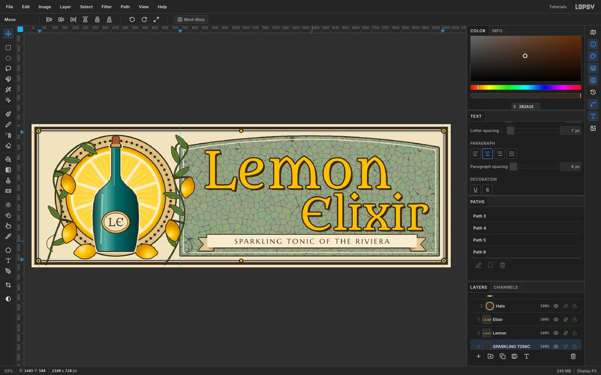

Type `SPARKLING TONIC OF THE RIVIERA` in **Marcellus**, Size `36`, colour
`#3B2A1E`. In the Text panel, set **Letter spacing** to `7`.

Move it onto the ribbon and nudge with the arrow keys until it's centred on
the band, with equal air above and below the caps and the same length of
band showing at each end.

## Add the Maison Citron medallion

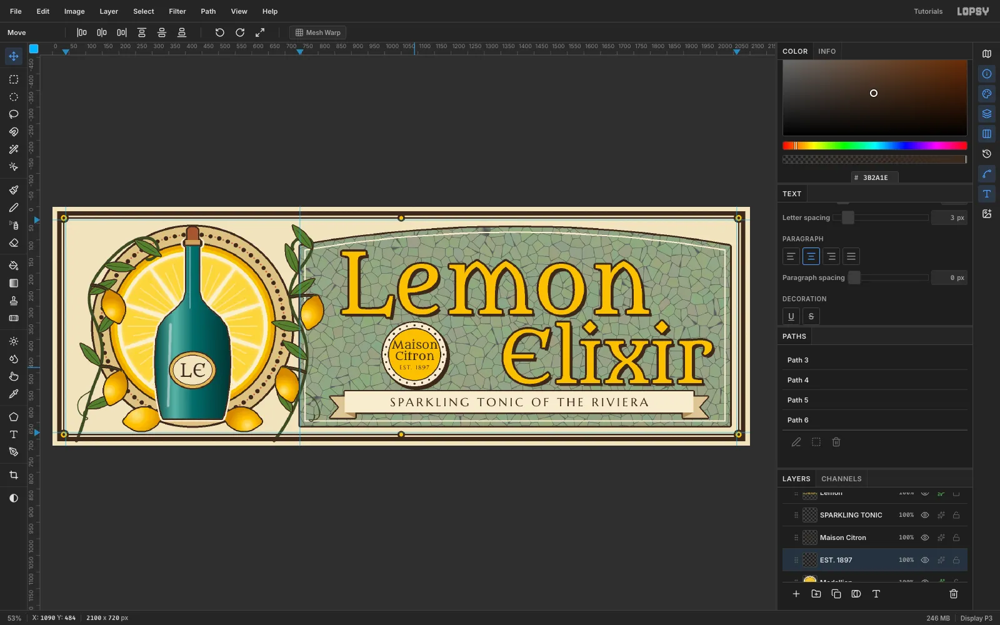

On a `Medallion` layer, fill four concentric circles in the pocket at the
lower left of the lettering, left of `Elixir` and above the ribbon:

- radius 100 in `#3B2A1E`
- radius 96 in cream
- radius 80 in `#3B2A1E`
- radius 77 in lemon

Add 24 dark dots on the cream ring with **Radial Symmetry**, and a hard
`7, 7` **Drop Shadow** to match the headline.

For the text, create a centred area-text block `Maison` / `Citron` in
Metamorphous. Add `EST. 1897` in Marcellus at Size `17` with letter spacing
`3`, and centre both in the disc.

## Add a lithograph grain

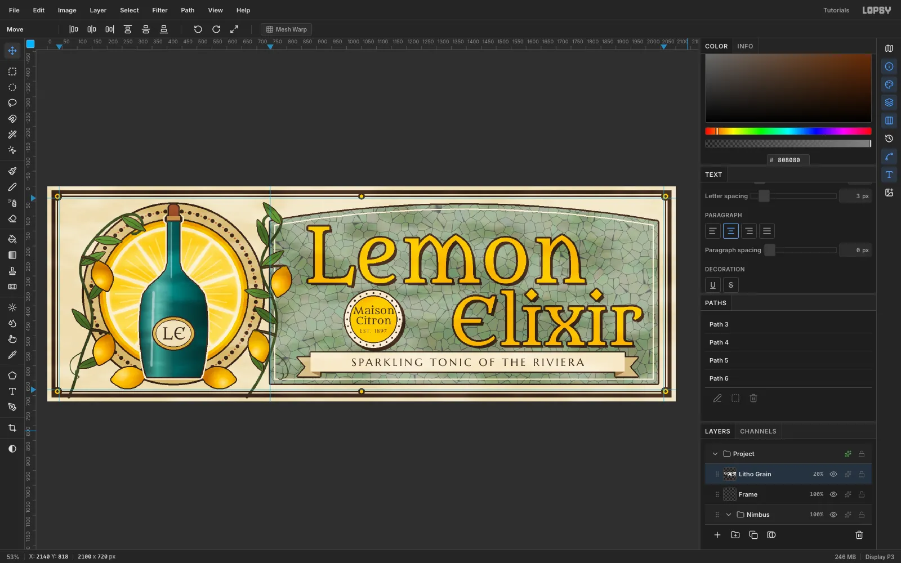

Select `Frame` and add a `Litho Grain` layer on top. Fill it with mid grey
`#808080`, run **Filter → Clouds** at Scale `14`, then **Add Noise** at `25`
in Mono.

Set the layer's blend mode to **Overlay** and its opacity to about `14%`. The
grey disappears, leaving a faint stone-litho mottle over everything.

## Polish the details

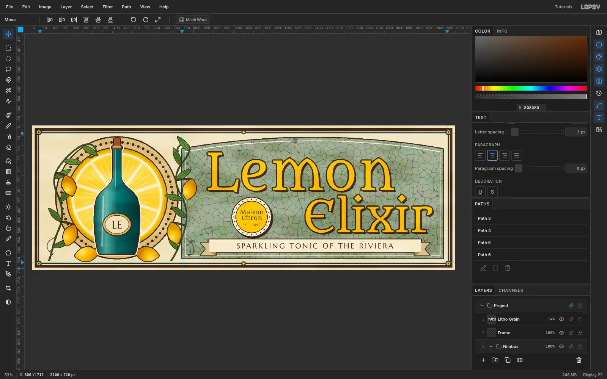

A last critique pass caught four small problems:

- **Medallion lettering:** it crowded the dotted ring, so drop `Maison Citron`
  to Size `29` and re-centre it.
- **Monogram:** switch `LE` to **Marcellus** so it can't read as "L€".
- **Ribbon spacing:** select the ribbon and tagline together
  ([[Shift]]-click the second row) and, with the Move tool, press
  [[Shift+↓]] once to move them 10 px. That gives `Elixir` room above the
  banner.
- **Vine ends:** on `Vines`, marquee the strip just above the bottom rule and
  press [[Delete]] so no stem touches the frame.

Save with **File → Save Project**, then export with **File → Quick Export PNG**.
