Mucha's decorative panels had a recipe:

- a single figure set against a huge disc (the halo)
- a stylised plant border
- sinuous *whiplash* lines
- a patterned plinth at the base

**Crescent Raven** swaps the figure for a raven on a branch. The halo is a gilded moon, and the plants are poppies, the Victorian flower of sleep. It's a 1200 × 1800 painting built entirely from selections, brushes and paths, with no text and no photos.

Along the way you'll use:

- the Lasso, Elliptical Marquee and Magic Wand, with Select → Shrink, Grow and Inverse
- linear and radial gradients with custom stops
- Clouds and Smoke filters, a layer mask and blend modes
- a brush with high Spacing (for dotted rings) and Taper (for whiplash lines)
- Dodge/Burn and the Clone Stamp
- the Pen tool's Enter-to-stroke
- Duplicate, scale, rotate, flip and Move
- Define Pattern with Edit → Fill with Pattern
- Grid, Snap and guides
- Outer Glow and Stroke effects, plus Photo Filter and Vignette adjustments

Palette:

- cream paper `#EDE0C0`
- night teal `#15303A` → sage `#7FA08E`
- gold `#B48A34`
- halo ochre `#A87A2A`
- raven ink `#14171F`
- poppy red `#B8452E`
- leaf green `#6A7B4A`
- frame olive-black `#26302A`

## Set up the paper and guides

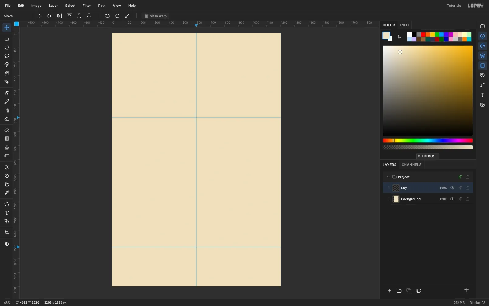

In the New Document dialog, set **Width** `1200` and **Height** `1800`, then click **Create**. Select the Background, set the foreground to `#EDE0C0` and choose **Edit → Fill**.

Click the top ruler at `600` for a centre guide. Click the left ruler at `600`, where the arch starts, and at `1520`, the bottom of the window. Rename *Layer 1* to **Sky**.

## Lasso the arched window and fill it with a night sky

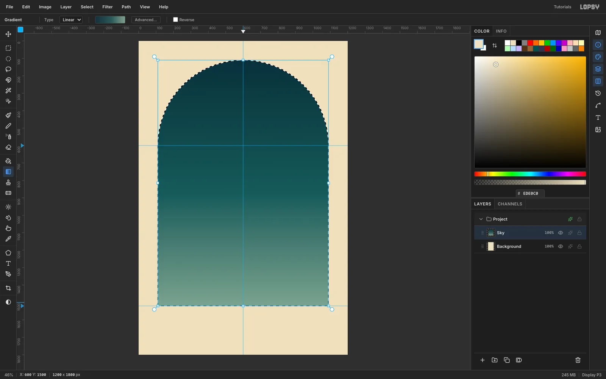

With the **Lasso**, trace the window:

- up the left side at x `110` from `1520` to `600`
- a semicircle of radius `490` over the top, centred on (600, 600)
- down the right side at x `1090`

Pick the **Gradient** tool and click **Advanced…**. The editor has no hex field, so set each stop with the hue strip and the brightness square:

- `#15303A` at the left
- `#2C5A5A` at 55% (click the bar to add it)
- `#7FA08E` at the right

Drag from the top of the arch to the bottom.

## Add a cloudy mist with a layer mask

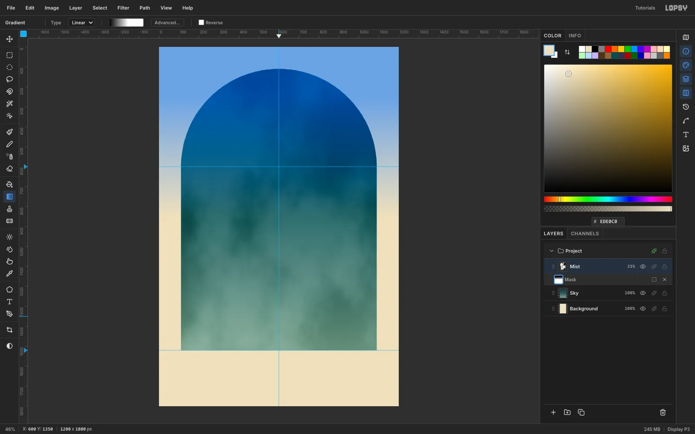

Keep the selection and click **Add Layer**; name it **Mist**. Run **Filter → Clouds** at Scale `4`. In the Layer Effects drawer, set **Blend** to *Soft Light*, and set the layer's opacity to `35%`.

Click **Add Mask**, then **Edit mask for Mist**. Set the gradient stops to black → white and drag from y `250` to y `1350`. The mist fades out toward the top, where the moon will sit. The blue tint shows what the mask hides.

## Build the halo from shrinking circles

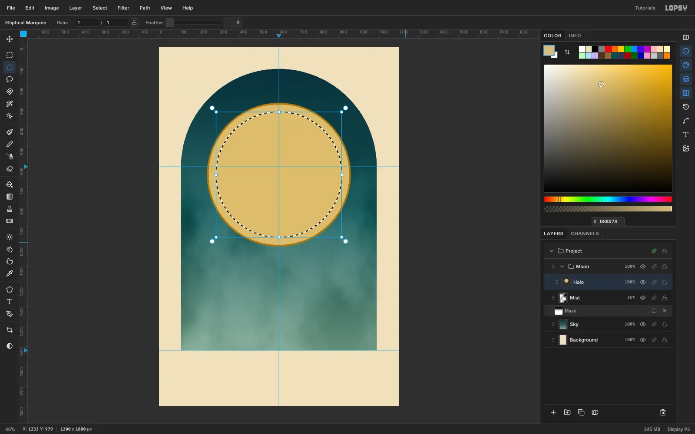

With the Mist row active, click **New Group** and name it **Moon**. Add a **Halo** layer inside it, then fill three bands:

1. An **Elliptical Marquee** circle of radius `360` centred on (600, 640), filled with `#A87A2A`.
2. **Select → Shrink** `8`, filled with `#D8BD78`.
3. **Shrink** `36` again, filled with `#E4D09A`.

On a **Halo Lines** layer, draw two thin rings: circles of radius `304` and `214`, each filled `#A87A2A`, then **Shrink** `4` (or `3`) and **Delete**.

## Stamp a dotted ring with brush spacing

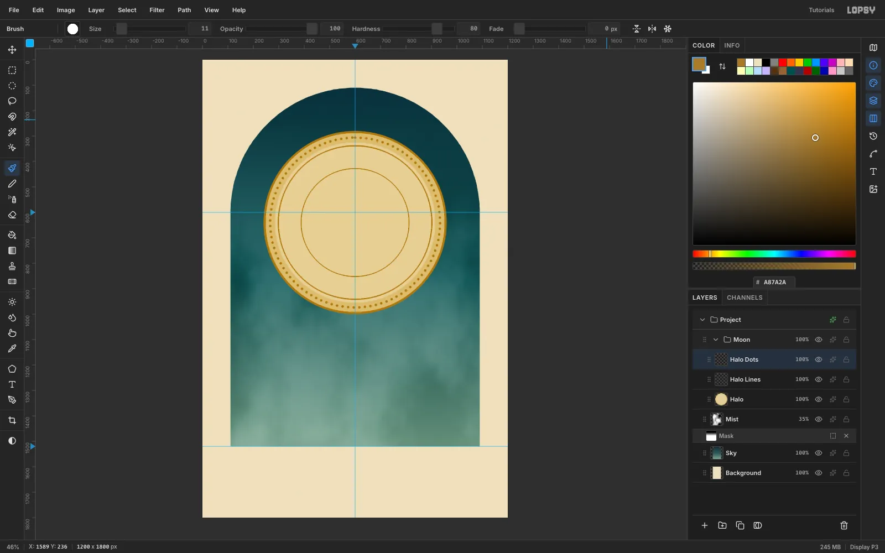

On a **Halo Dots** layer, click the brush-tip thumbnail to open the **Brushes** modal. On the **Shape** tab, set **Size** `11` and **Spacing** `200`. At 200% the dabs no longer overlap, so a single drag lays down beads.

Drag the brush around a circle of radius `334` in `#A87A2A`. Set Spacing back to `10` afterwards.

## Cut out the crescent

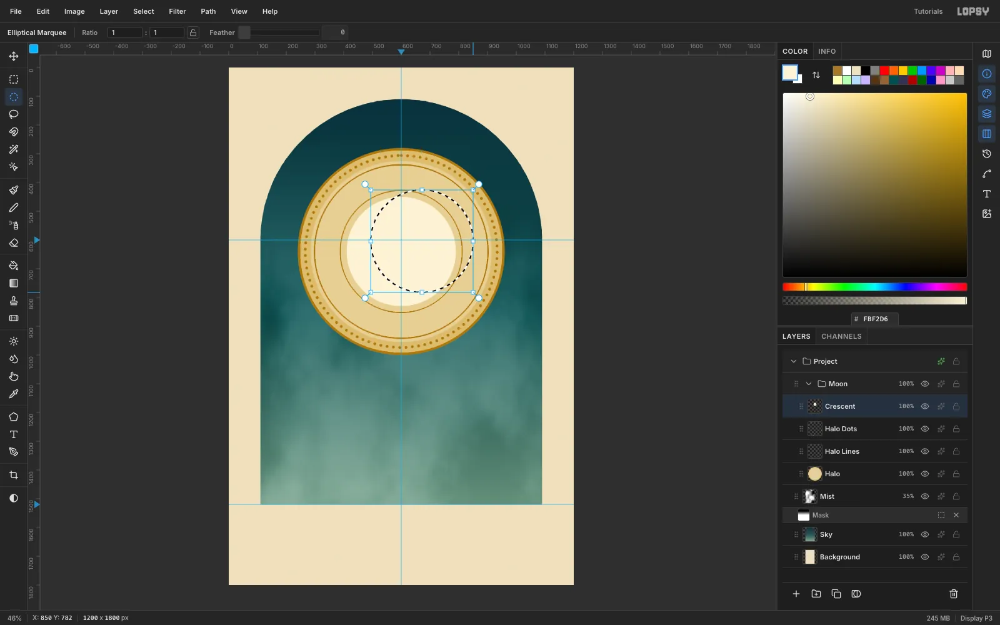

On a **Crescent** layer, fill a radius-`190` circle at (600, 640) with `#FBF2D6`. Draw a second circle of radius `178` centred on (672, 604) and press [[Delete]].

What remains is a crescent. If the top horn looks clipped flat against the inner ring, delete once more with a radius-`186` circle at (668, 606). That thins both horns to points.

## Make the crescent glow from within

Click the crescent with the **Magic Wand** to select it. Switch the Gradient **Type** to *Radial*, set the stops to `#FFFCF2` → `#F2DDA8`, and drag from (470, 690) outward about 250 px. The thick part of the crescent now glows and the horns cool off.

## Scatter the stars

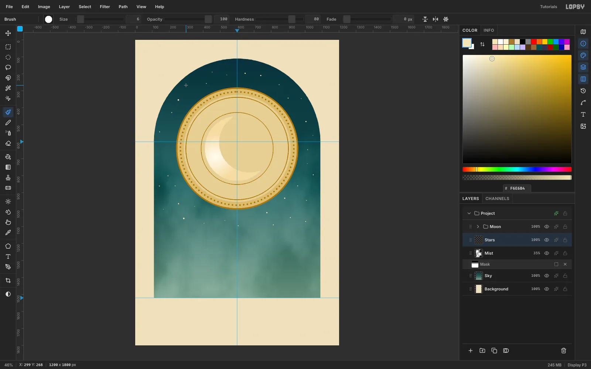

Add a **Stars** layer above Mist, outside the Moon group. With the Brush in `#F6E6B4`, click single dabs at sizes `4`, `5`, `6`, `8` and `10`. Keep them out of the halo, and space them about 70 px apart so they don't clump.

## Lasso the branch

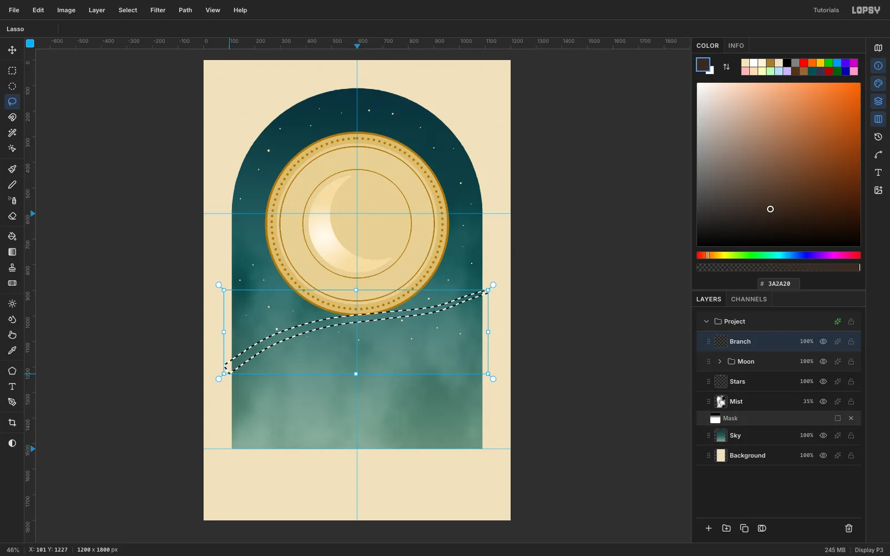

Add a **Branch** layer and drag its row above the Moon group. Lasso a ribbon that tapers from about 40 px wide at the left to 12 px at the right:

- start at (90, 1210)
- pass through (470, 1030) and (900, 975)
- end at (1110, 905)

Fill it with `#3A2A20`. Lasso and fill a short twig rising from (470, 1030) to (436, 905).

## Round the bark with Dodge and Burn

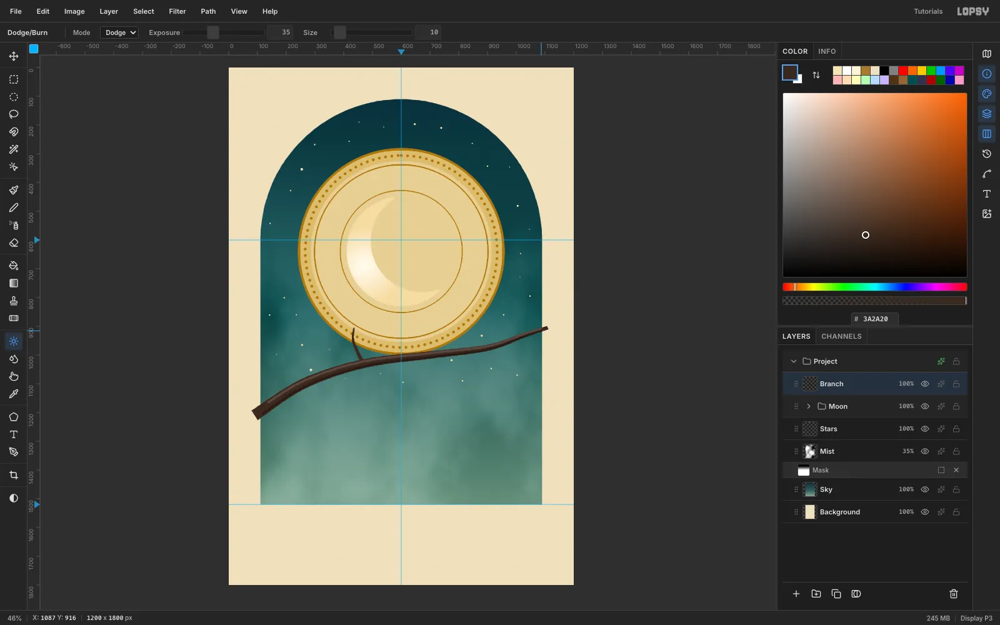

Pick **Dodge/Burn**. In *Dodge* mode at **Exposure** `15` and Size `10`, drag once along the top edge. Switch **Mode** to *Burn* at Exposure `35` and drag along the underside.

> **Tip:** Dodge moves colour toward white by the Exposure fraction on every stroke. Two passes at 80% turn dark brown almost white, so stay low and use one pass.

## Add two-tone leaves

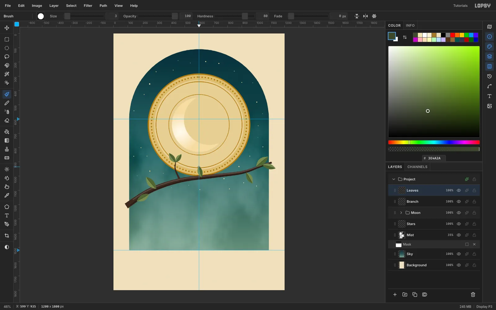

On a **Leaves** layer, lasso almond-shaped leaves along the branch and a pair at the twig tip, and fill them `#7A8B55`. Lasso the lower half of each leaf, from the midline to the edge, and fill it `#55653A`. Brush a `3` px midrib in `#3E4A2A`.

Select Branch, [[Shift]]-click Leaves, and choose **Layer → Group Layers**. Name the group **Bough**.

## Lasso the raven silhouette

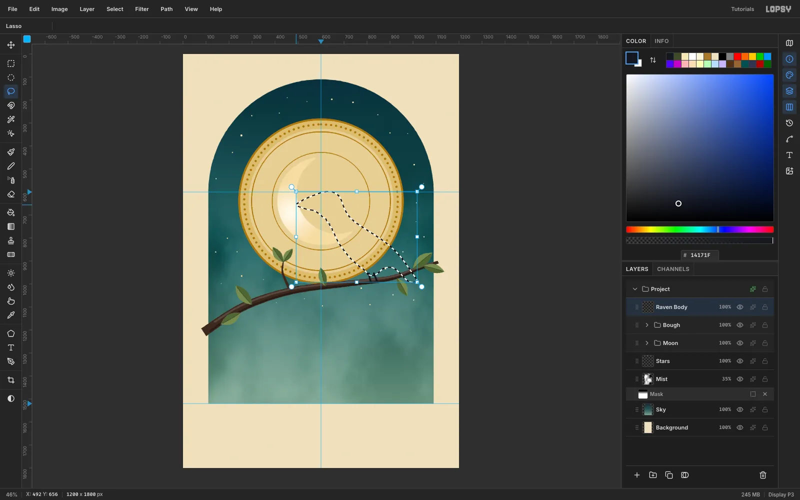

Add a **Raven Body** layer above Bough. Brush two short legs down to the branch (Size `9`, `#14171F`). Then lasso the bird:

- a heavy wedge beak at about (492, 656)
- a rounded crown
- a thick neck
- the back sloping down to a wedge tail ending near (1018, 985)
- the belly curving back over the feet

Fill it with `#14171F`. Put the head inside the crescent so the beak cuts across the bright horn.

## Add the eye, beak line and rim light

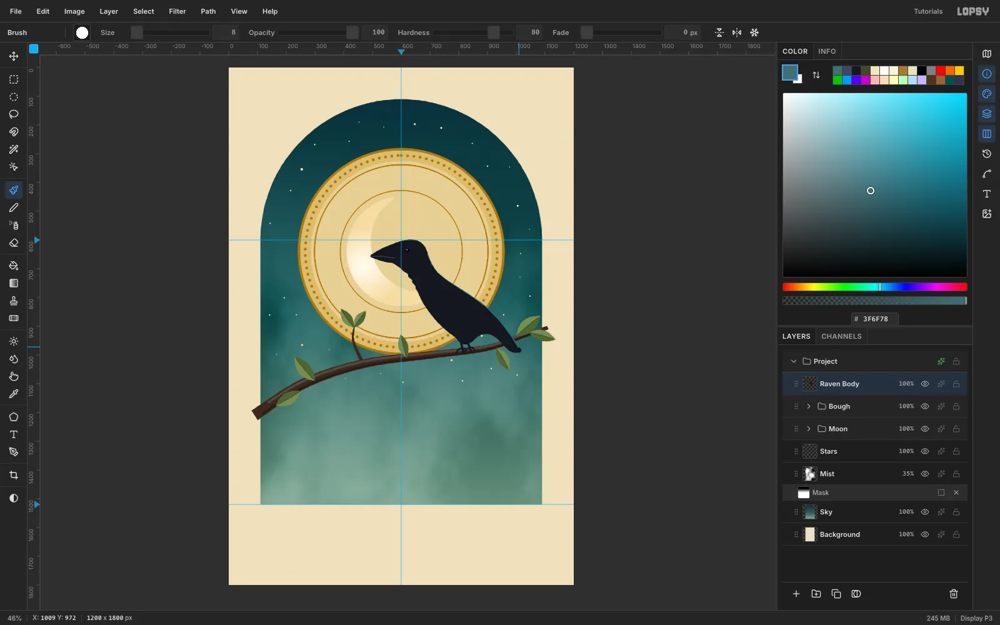

1. Marquee and **Delete** the leg ends that poke below the branch, then brush curled toes over its top edge.
2. Brush a `3` px gape line in `#3C4A5E` along the beak.
3. Lasso the silhouette again. With the selection active, brush a Size `8` teal `#3F6F78` line along the back and tail. The selection clips the stroke, so only a thin rim light shows inside the edge.

## Paint the wing and clipped feathers

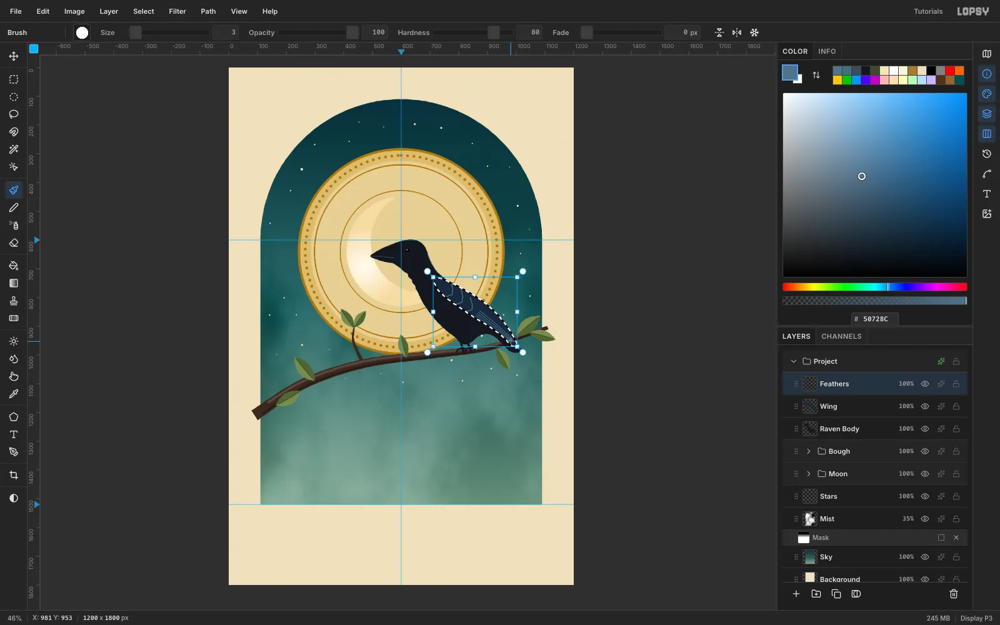

On a **Wing** layer, lasso a folded wing from the shoulder to the tail tip and fill it `#1C293B`.

Keep that selection active and add a **Feathers** layer. With the brush in `#50728C`:

- drag three shallow chevron bands across the coverts at Size `4`
- drag five long primary lines toward the tip at Size `3`

The selection keeps every stroke inside the wing. Group Raven Body, Wing and Feathers as **Raven**.

## Build a poppy from outlined lobes

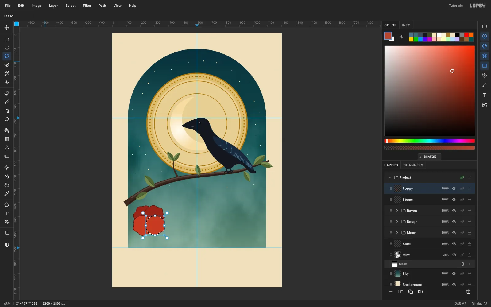

Add a **Stems** layer above Raven (you'll use it later) and a **Poppy** layer above that. Make four wavy, rounded lobes around (260, 1330): two behind and two in front. For each one, back lobes first:

1. Lasso the lobe and fill it `#5A1B13`.
2. **Select → Shrink** `3`.
3. Fill `#8E2E20` for the back lobes or `#B8452E` for the front ones.

The 3 px outline is what keeps overlapping lobes from merging into one blob.

## Detail the poppy

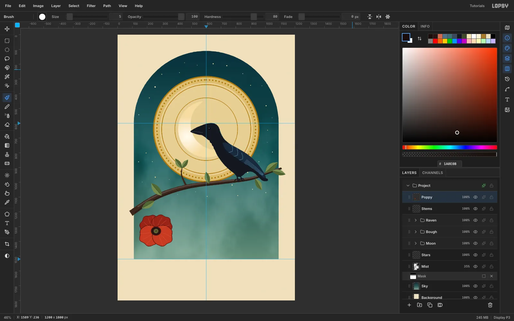

- **Creases:** brush short radial lines at Size `3`, Opacity `55` in `#D36A4A`.
- **Basal blotch:** an ellipse (34 × 30), **Select → Feather** `3`, filled `#2A1512`.
- **Seed pod:** a smaller ellipse filled `#6B7340`, with eight `2` px stigma rays.
- **Stamens:** in the Brushes modal set Spacing `200` and Size `5`, then drag a small ring around the pod.

## Duplicate, scale and rotate a second poppy

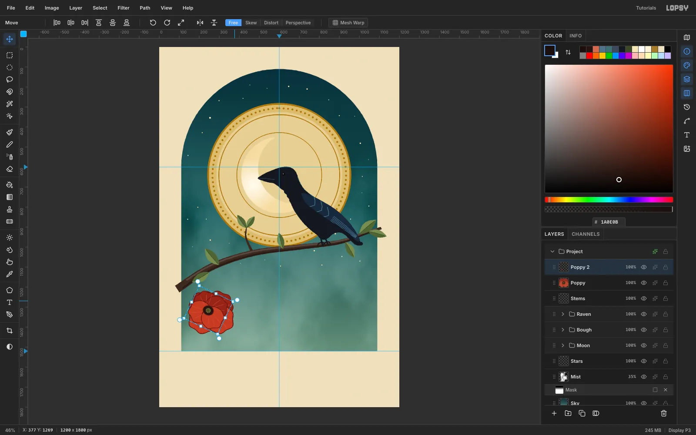

Click **Duplicate Layer** and rename the copy **Poppy 2**.

1. Marquee around it and switch to the **Move** tool.
2. Drag the bottom-right handle in until the box is 80% of its size. The opposite corner stays pinned.
3. Drag just outside a corner to rotate it about 25°.
4. Press [[Cmd+D]] to commit.

## Flip, shrink and place three poppies

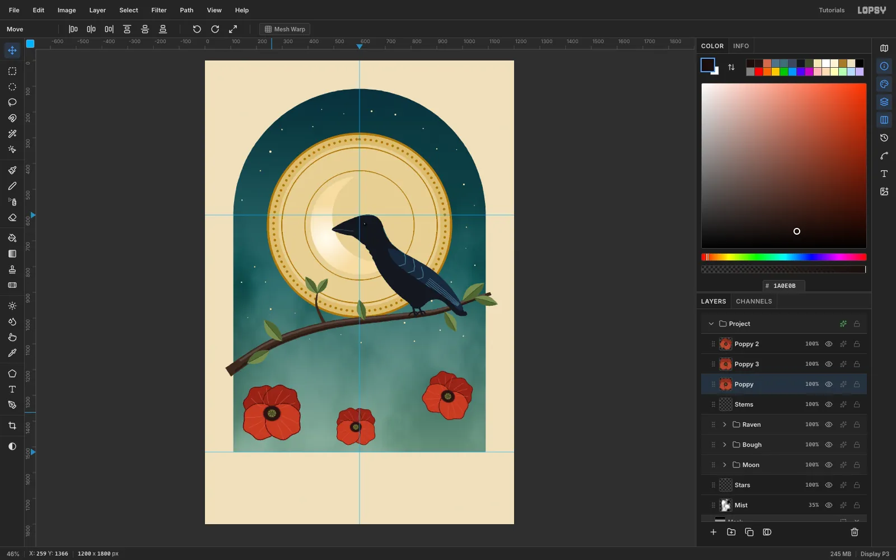

Move **Poppy 2** so its centre is at (940, 1300).

Duplicate the original again and name it **Poppy 3**. Choose **Image → Flip Horizontal**, scale it to `67%` and move it to (585, 1420). Finally, drag the original down 40 px. Staggered heights read as a field; one baseline reads as a planter box.

## Draw the stems with the Pen

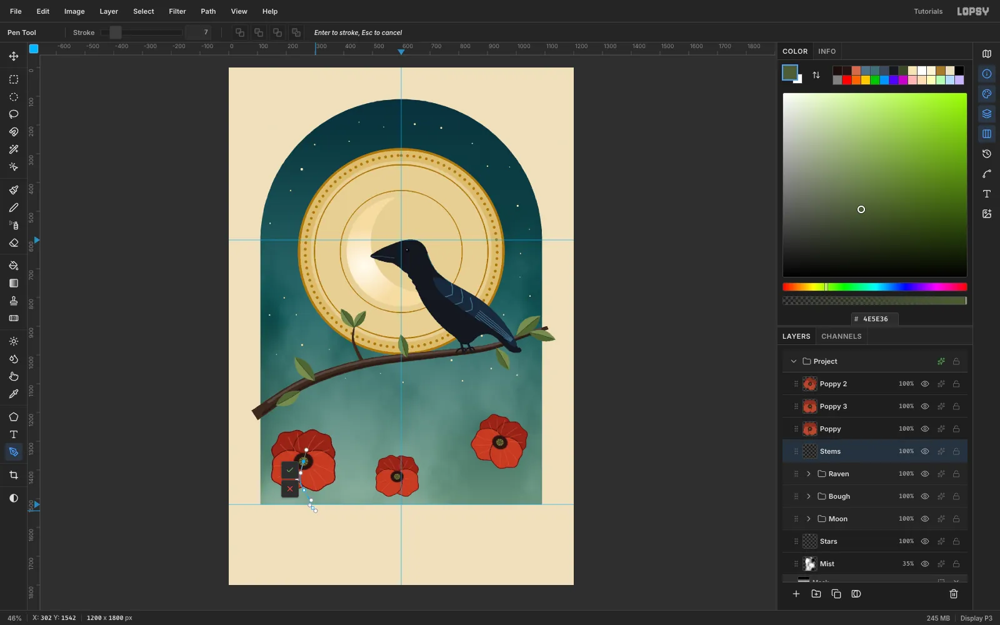

Select **Stems**, set the foreground to `#4E5E36`, pick the **Pen** tool and set **Stroke** to `7`. Click and drag at each anchor to pull smooth handles. Start at a poppy's centre and end just below y `1520`, so the frame will hide the end. Press [[Enter]] to stroke the path onto the layer.

For the buds, set Stroke to `5`:

- an S-curve from (395, 1532) up to (470, 1138)
- a stem that climbs to (770, 1120) and hooks down to (738, 1152), so its bud nods like a real poppy bud

Click the selected path in the **Paths** panel to deselect it.

## Add lobed leaves and buds

On a **Poppy Leaves** layer, lasso wavy, lobed leaves in pairs at each stem base. Vary their angles and sizes so no two pairs match. Fill them `#6A7B4A` and brush a midrib.

On a **Buds** layer, draw each bud as follows:

1. Fill an ellipse (16 × 26) `#3E4A2A`, **Shrink** `2`, and fill `#687A45`.
2. Lasso a narrow red slit of `#C8482B` at the tip. It points down on the nodding bud.

Group everything poppy-related as **Poppies**.

## Frame the arch

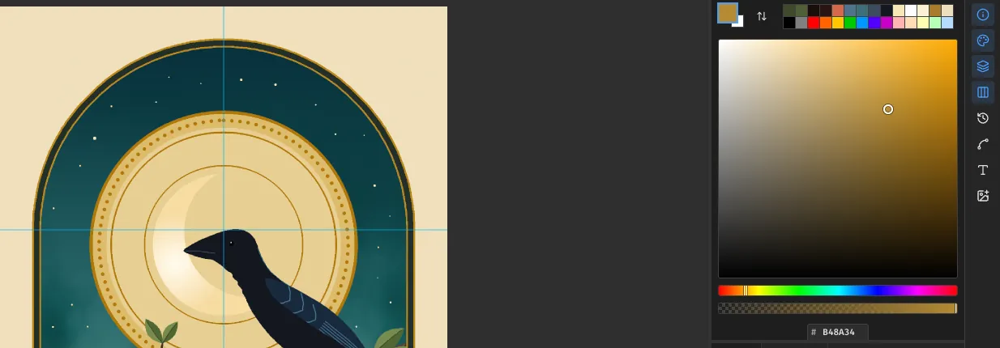

Add a **Frame** layer above Poppies. Using the same arch lasso each time:

1. **Grow** `24` and fill gold `#B48A34`.
2. **Grow** `19` and fill `#26302A`.
3. **Grow** `4` and fill gold.
4. Lasso the arch itself and **Delete**, which leaves a dark band with gold edges.

To trim the branch and leaves where they cross the frame: on Branch, then on Leaves, select the arch, **Grow** `12`, choose **Select → Inverse**, and press [[Delete]].

## Tile a dotted panel with a pattern

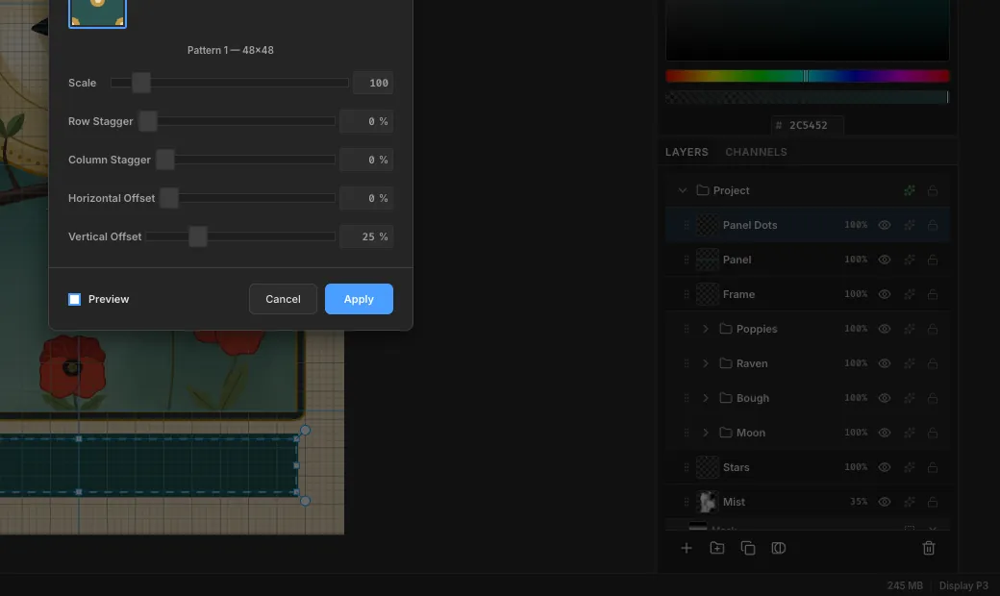

1. **Draw the tile.** On a temporary layer, fill a 48 × 48 square `#2C5452`. Add gold `#C39A45` dots of radius `7` at its centre and at all four corners (the corners are quarter-dots), each with a cream `2.5` px centre.
2. **Define it.** Marquee the square, choose **Edit → Define Pattern**, then delete the temporary layer.
3. **Panel.** Turn on **View → Show Grid** and tick **Snap**. On a **Panel** layer, fill a snapped rectangle from (104, 1572) to (1096, 1716) with `#2C5452`.
4. **Dots.** On a **Panel Dots** layer, untick Snap, marquee (108, 1584) to (1092, 1704) and choose **Edit → Fill with Pattern** with **Vertical Offset** `25%`. The rows land between the edges, so no dot is cut in half.
5. **Calm it.** Set Panel Dots to `60%` opacity.

## Snap a double border

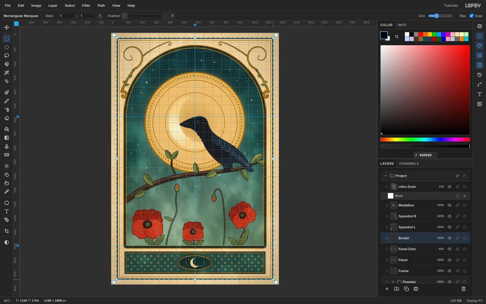

With Snap still on, add a **Border** layer. Draw a marquee from (40, 36) to (1160, 1764); it locks onto the grid. Fill it `#26302A`, **Shrink** `6` and **Delete**. Repeat with a gold `3` px line from (56, 52) to (1144, 1748).

Turn Snap off and ring the panel the same way: an 8 px dark line from (96, 1564) to (1104, 1724) and a 3 px gold line on the panel edge.

## Paint whiplash spandrels with a tapered brush

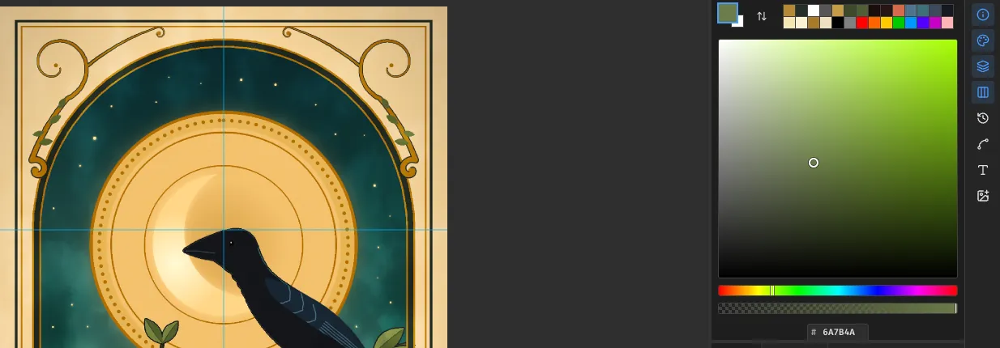

On a **Spandrel L** layer, open the Brushes modal and set **Spacing** `5`. **Taper** shrinks the dabs over that many pixels of stroke, which gives the classic whiplash swell-and-fade. Make two passes along the same path:

- **Dark contour:** Size `22`, Taper about `930`, colour `#26302A`.
- **Gold line:** Size `16`, Taper about `890`, colour gold.

The path starts in a small curl near (90, 440), follows the arch at radius `548`, and winds into a spiral in the corner around (150, 158). Add a finer branch toward the top centre that ends in a little curl. Finish with gold dots at the curl centres and four small leaves.

**Duplicate Layer**, choose **Image → Flip Horizontal**, then nudge the copy with the arrow keys until its bounds exactly mirror the left one (here: left 66–431, right 768–1133).

## Add the crescent medallion

On a **Medallion** layer, fill an ellipse (126 × 60) at (600, 1644) with `#26302A`. Shrink `6` and fill gold, then Shrink `4` and fill `#173034`. Inside it, put a small crescent: a gold circle with an offset circle filled over it in `#173034`. Add four gold dots.

On Panel Dots, select a slightly larger ellipse (148 × 80) and **Delete**. The medallion now sits in a clear halo of ground colour.

## Clone a leaf onto the branch

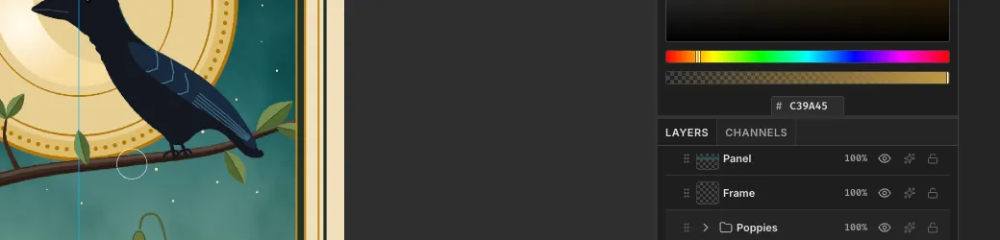

Select the **Leaves** layer and pick the **Clone Stamp** at Size `70`. [[Alt]]-click the middle of an existing leaf to set the source. Then drag along a new spot under the branch. The live preview shows exactly what will land.

## Give the moon and stars a glow

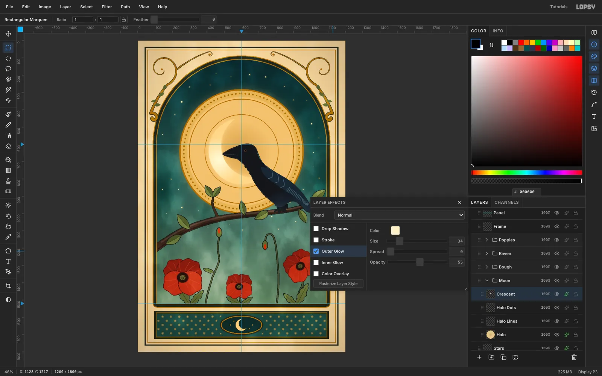

Open each layer's **Layer effects** and enable **Outer Glow**:

- **Crescent:** `#FFF1C4`, Size `34`, Opacity `55`
- **Halo:** `#E9C97A`, Size `70`, Opacity `30`
- **Stars:** `#FFE9A8`, Size `9`, Opacity `70`

## Unify everything with ink outlines

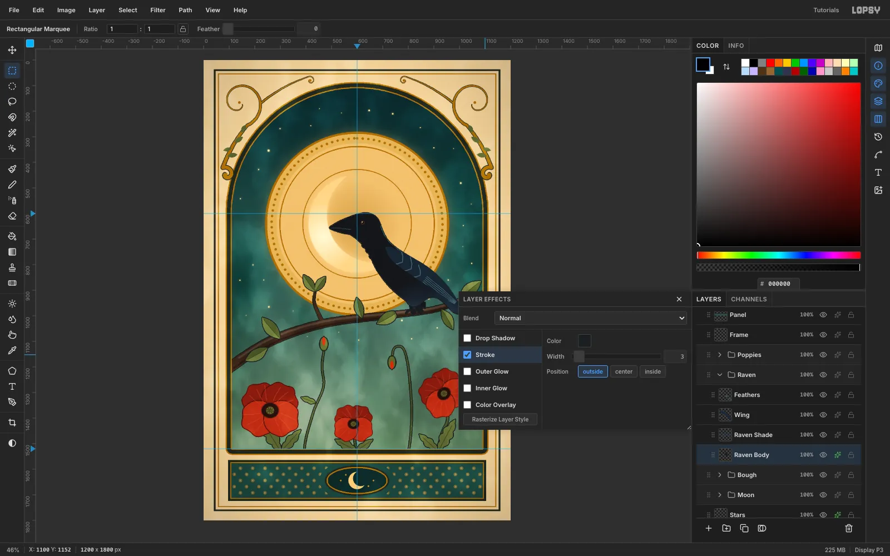

A lithograph holds together because every shape shares one contour weight. Enable **Stroke** at Width `3`, Position *outside*, colour `#1A1F22` on each of these layers:

- Branch
- Leaves
- Raven Body
- Stems
- Poppy Leaves
- Buds

The poppies already have their painted outlines.

## Polish the raven

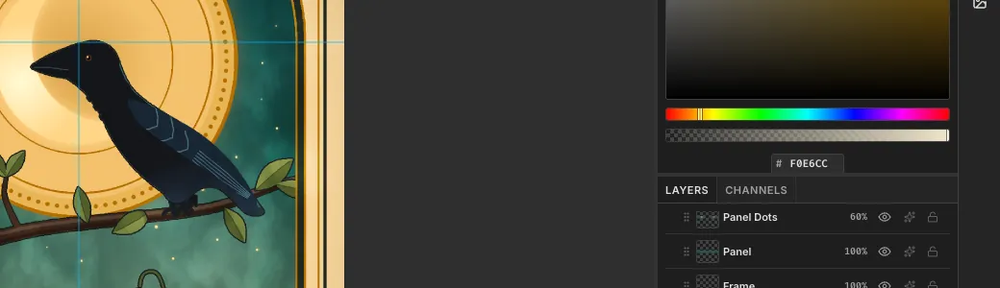

Small anatomy fixes make it a raven rather than a crow cut-out:

- **Throat:** on Raven Body, lasso a band just outside the throat edge and **Delete**, leaving soft hackle bumps instead of spikes.
- **Thighs:** lasso a ruffle of feathers over the tops of the feet and fill it with the body colour.
- **Eye:** a `7` px brown `#4A3220` iris, a `4` px black pupil, and a tiny cream highlight.
- **Belly shade:** on a **Raven Shade** layer inside the group, lasso the body and drag a linear gradient from `#2A3A55` at 60% opacity to transparent, up from the belly.

## Flip and rotate the right poppy in place

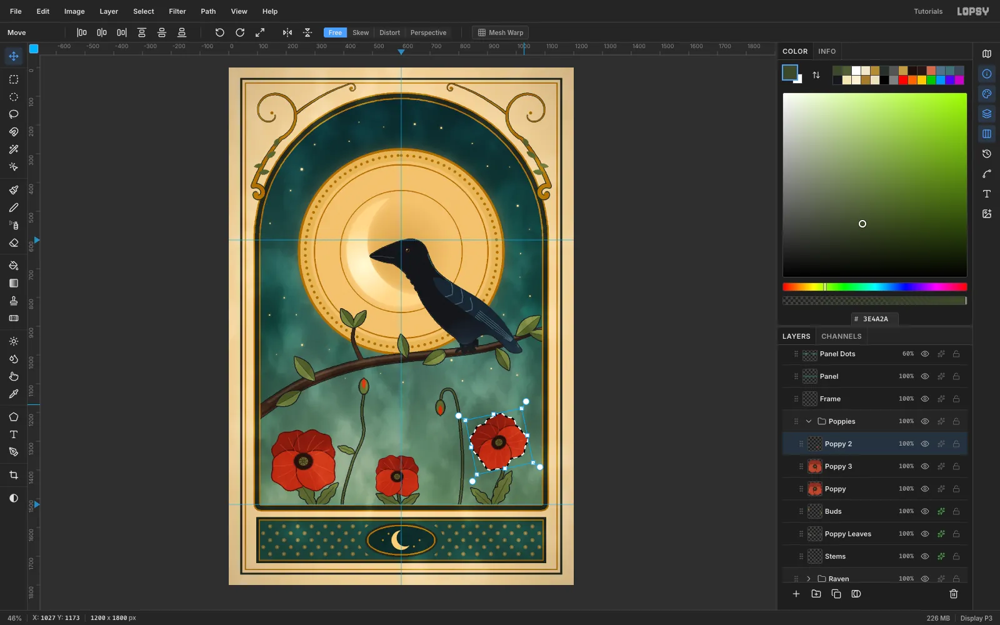

Three front-facing copies of one flower look stamped. Select **Poppy 2** and marquee around it. With the **Move** tool, click **Flip Horizontal** in the options bar, which mirrors inside the selection. Rotate it `-12°` and press [[Cmd+D]].

## Deepen the halo behind the crescent

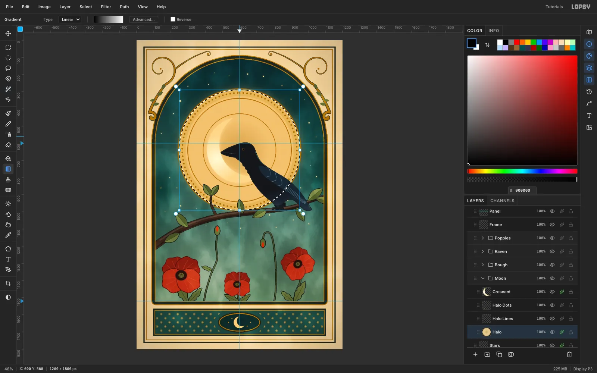

On the **Halo** layer, Magic Wand the pale inner field. Drag a radial gradient from the centre, `#C9AA68` to `#E2C98E`. The darker core behind the moon makes the crescent read clearly again.

## Add lithograph grain and keep it off the moon

On a **Litho Grain** layer at the top of the stack, run **Filter → Smoke** at Scale `14` and Turbulence `70`. Set it to *Overlay* at `18%`. That mottles the paper and sky like a printing stone.

Add a mask and click **Edit mask for Litho Grain**. Select the halo (a radius-`362` circle at (600, 640)), **Feather** it `12`, and fill it with grey `#555555`. The grain stays off the gold.

## Warm and vignette the whole panel

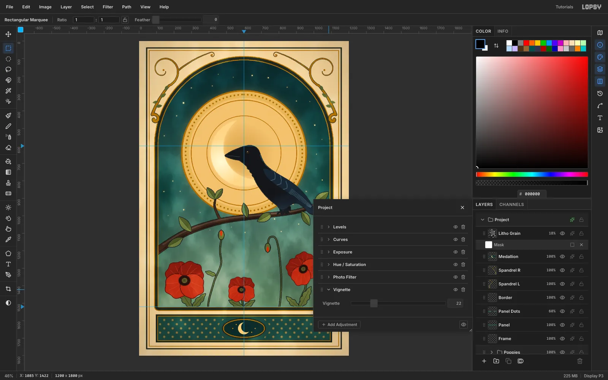

Open the **Project** group's adjustments. Click **Add Adjustment → Photo Filter** and set Density `14` for an aged, warm cast. Add a **Vignette** at `22`.

Adjustments go last: they apply to everything below, and they make every later brush stroke slower to preview.
