Before laser printers, restaurants, offices and computer labs printed on
**fanfold paper**. It came as one long strip with holes down both edges for
the printer's sprockets, and pale green stripes so you could follow a row
across the page. A **dot-matrix** printer hammered every letter out of tiny
pins through an inked ribbon. Some ribbons had two colours, black and red.
People made big banners from repeated keyboard characters, which is where
**ASCII art** comes from.

This tutorial makes a menu for an imaginary all-night diner called
**BUFFER OVERFLOW**. In programming, a buffer overflow is data that runs
past the space set aside for it, so the joke is a title that spills out of
its own box. The menu is 1800 × 2400 px. It's a single torn-off sheet lying
at a slight angle on a 1950s formica counter, with a waitress's pen marks
and two coffee-cup rings.

Every letter is real text in a pixel-style monospace font, so the hard part
is lining characters up. The dot-matrix look comes from one filter, applied
after the type is finished.

The tools you'll meet along the way:

- **Edit → Define Pattern** and **Fill with Pattern** for the formica counter
- **Guides**, **Snap to Guides** and **Duplicate Layer** for evenly spaced
  stripes and tractor holes
- the **Brush** with a wide **Spacing** setting for perforated edges
- **VT323**, a pixel terminal font, as live text, and **Reenie Beanie**
  for the handwriting
- **Filter → Halftone**, **Color Overlay** and the **Multiply** blend mode
  for printed ink
- a **layer mask** with a gradient for a fading ribbon
- **Select → Shrink**, **Liquify** and the **Eraser** for coffee stains
- **groups**, multi-layer selection, and the **Move** tool's rotate handle

The palette is two inks on pale paper, over a dark teal counter:

- Counter teal `#3F8F8A`, boomerangs `#24363B` / `#E8846B` / `#D7EEE8`, flecks `#E6BE5A`
- Paper `#F3EEDD`, green bar `#D2E5C8`, perforations `#A39E8D`
- Black ribbon `#1E1F28`, red ribbon `#B5212A`
- Ballpoint blue `#22408E`
- Coffee `#5E3316` / `#7A4521`

## Create the document

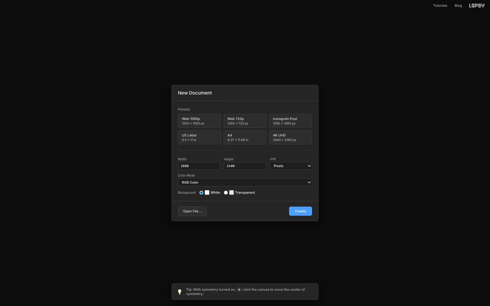

Choose **File → New**. Make sure **Unit** is set to **Pixels**, type
**1800** for the width and **2400** for the height, pick a **White**
background and click **Create**. The finished menu is about the shape of
a letter-size page.

## Draw one tile of boomerang formica

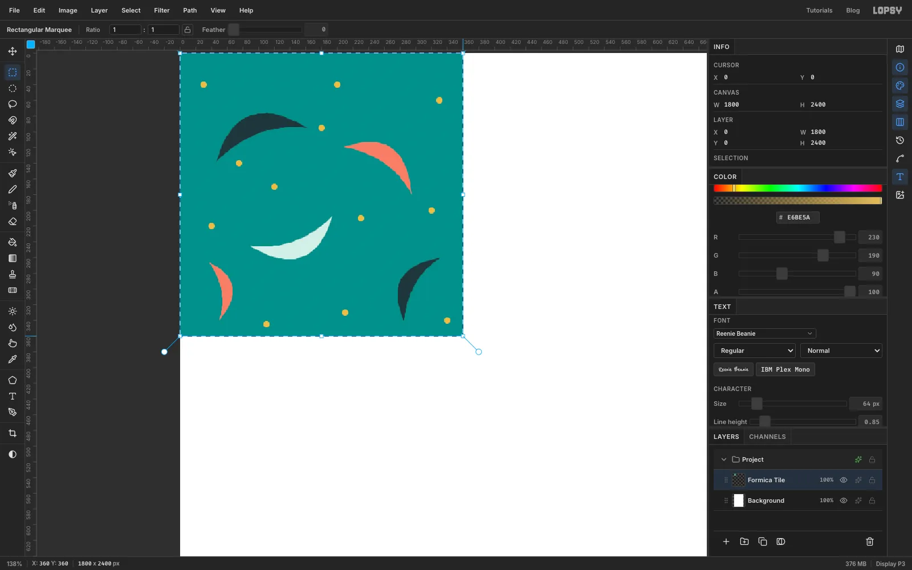

Diner counters of the 1950s were covered in **boomerang** laminate:
little curved wings and flecks scattered over a flat colour. You'll draw
one square of it and tile it.

Add a layer and name it *Formica Tile*. Zoom in on the top-left corner,
pick the **Rectangular Marquee** and drag a 360 × 360 px square starting
at the corner. Fill it with teal `#3F8F8A` (**Edit → Fill** fills a
selection with the foreground colour).

Now pick the **Lasso** and draw five boomerangs: a thick arc that tapers
to a point at each end, like a crescent moon with a shallow bite. Fill
each one as you go, two in dark slate `#24363B`, two in coral `#E8846B`
and one in pale mint `#D7EEE8`. Turn them in different directions and
keep them a little away from the edges of the square, so none gets cut
off when the tile repeats.

Finish with gold flecks. Pick the **Brush**, set **Size** to 9 and
**Hardness** to 100, set the colour to `#E6BE5A` and click a dozen single
dots between the shapes.

## Define the pattern and fill the counter

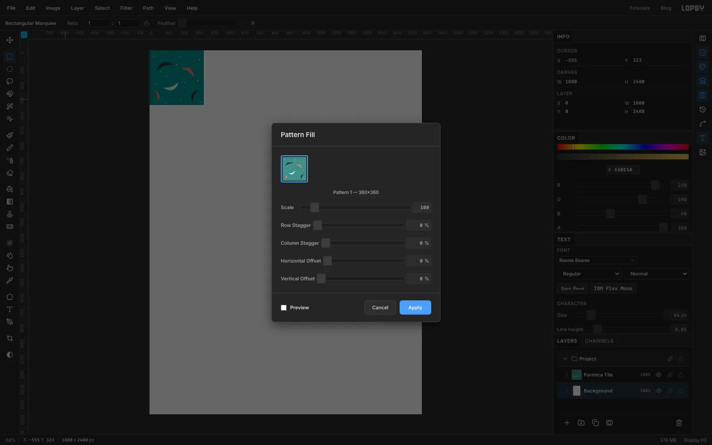

Drag the marquee over the square again, exactly from corner to corner,
and choose **Edit → Define Pattern**. Lopsy saves it as *Pattern 1*.

Click the **Background** layer and choose **Edit → Fill with Pattern…**.
Pick the boomerang tile, leave **Scale** at 100 and all the offsets at 0,
and click **Apply**. The whole background is now formica. Delete the
*Formica Tile* layer, because you don't need it any more.

## Age the formica

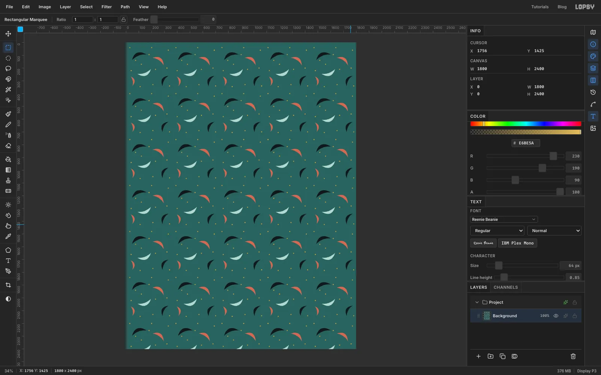

Fresh laminate looks too clean. With the Background still selected, run
**Filter → Add Noise…** with **Amount** 10 and **Mode** set to **Mono**, for a fine
grain. Then open **Filter → Hue/Saturation…** and set **Saturation** to
−30 and **Lightness** to −10. The counter should look like it's been
wiped down for thirty years.

## Mark out the sheet with guides

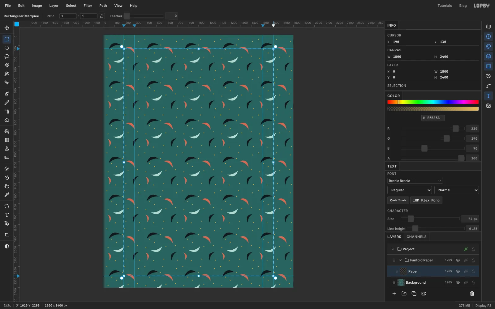

Turn on **View → Show Rulers** if they aren't showing. Click the top ruler
at **190**, **290**, **1510** and **1610** to drop four vertical guides.
The outer pair is the paper's edge and the inner pair is where the
tractor-feed strips end. Click the left ruler at **130** and **2290** for
the top and bottom of the sheet. Zoom in while you place them: at
fit-to-screen each screen pixel covers about three document pixels.

Make sure **View → Snap to Guides** is ticked. Choose **Layer → New
Group** and call it *Fanfold Paper*. Inside it, add a layer called
*Paper*. Then drag the **Rectangular Marquee** from the top-left guide
crossing to the bottom-right one, so it snaps neatly to all four edges.

Fill the marquee with paper cream `#F3EEDD`, then run **Filter → Add
Noise…** at **Amount** 5 with **Mode** set to **Mono**, so it looks like paper rather
than flat colour. Press [[Cmd+D]] to deselect.

## Draw the first green bar

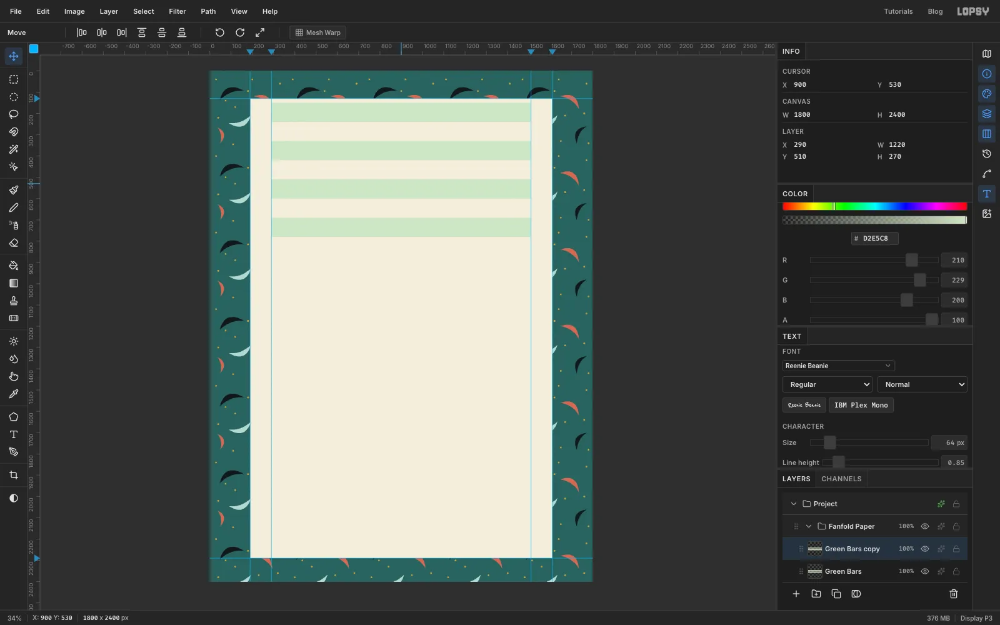

Green-bar paper alternates three lines of green with three lines of
white. Here each band is 90 px tall.

Add a layer called *Green Bars*. With the **Rectangular Marquee** and
nothing selected, click once on the canvas without dragging: a
**Rectangular Selection** dialog opens. Enter **From** 290, 150 and **To**
1510, 240, so the band runs between the two inner guides, and confirm.
Fill it with green `#D2E5C8` and deselect.

To repeat a band without drawing each one, **double** it:

1. Choose **Layer → Duplicate Layer**.
2. Use the **Move** tool to drag the copy down by **180 px**, which is
   one green band plus one white band. Watch the layer position in the
   **Info** panel, and use the arrow keys for the last pixel or two.
3. Choose **Layer → Merge Down**.

You now have two bars. Do it again, moving the copy down **360**, then
**720**, then **1440** px. Each round doubles the count, so four rounds
make sixteen bars, which is more than the sheet needs.

## Trim the bars to the sheet

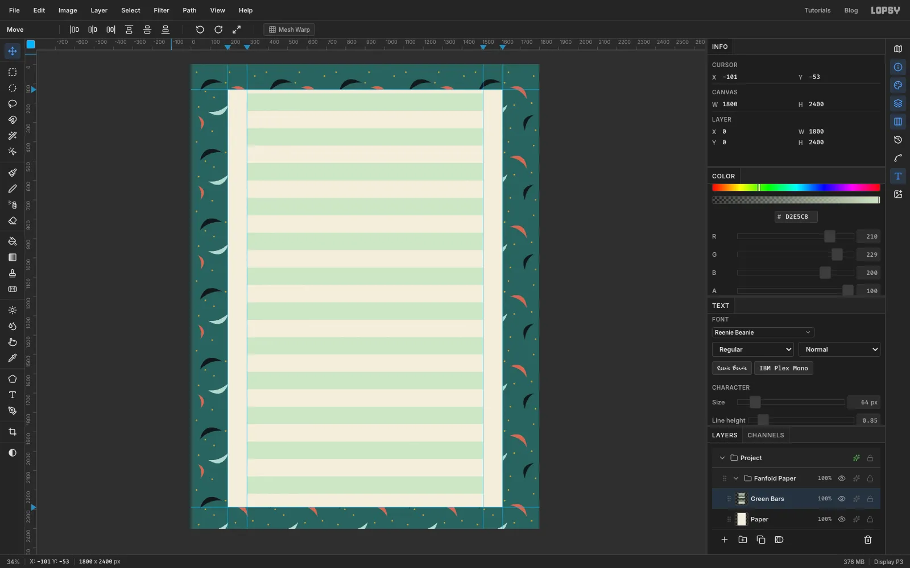

The last few bars hang off the bottom of the sheet. [[Cmd]]-click the
*Paper* layer's thumbnail to select the paper's shape, click back on
*Green Bars*, choose **Select → Inverse** and press [[Delete]]. Everything
outside the paper goes.

## Make one column of tractor holes

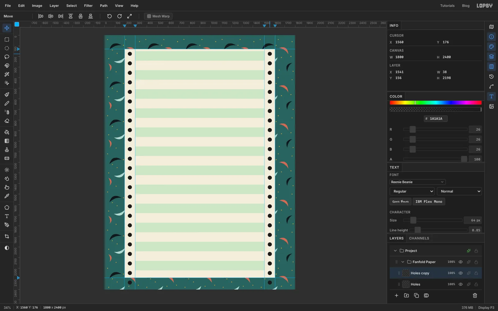

Add a layer called *Holes*. Pick the **Elliptical Marquee**, hold
[[Shift]] and drag a circle about 38 px across. Centre it in the left
strip (between the paper's edge and the first inner guide), level with
the middle of the first band. Fill it with near-black `#1A1A1A`.

Use the same duplicate, move and merge trick, but with a 90 px step, so
there is one hole per band: 90, 180, 360, 720, 1440. Finally duplicate
the whole column once more, drag the copy **1320 px** to the right into
the right strip, and merge it down.

These black dots are only a stencil. In a moment you'll use them to
punch real holes through the paper.

## Add the torn perforation along the ends

When a sheet is torn off a fanfold stack, the perforation leaves a
scalloped edge. Add a layer called *Teeth*.

Pick the **Brush**, open the **Brushes** panel (the brush preview at the
left of the options bar), choose **Hard Round** and, on the **Shape**
tab, set **Size** 9 and **Spacing** 200. That spacing leaves a gap of one
dot between every dot. Click on the top-left corner of the sheet, hold
[[Shift]] and click the top-right corner to stamp a straight row of dots.
Do the same along the bottom edge.

## Punch the holes through the paper

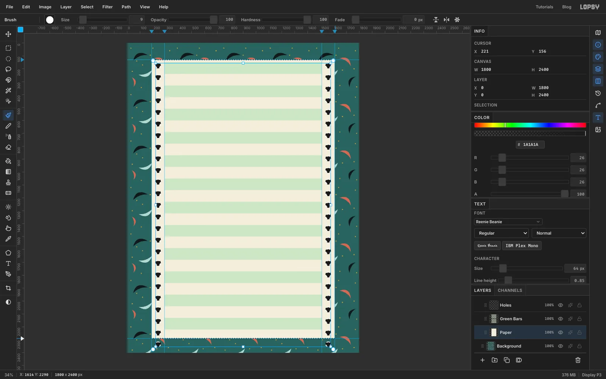

[[Cmd]]-click the *Holes* thumbnail to select every hole, click the
*Paper* layer and press [[Delete]]. Hide *Holes* with its eye icon.
Repeat with *Teeth*: [[Cmd]]-click its thumbnail, select *Paper*,
[[Delete]], and hide *Teeth*.

Now you can see the counter through the holes, and the ends of the sheet
are scalloped.

## Draw the strip perforations

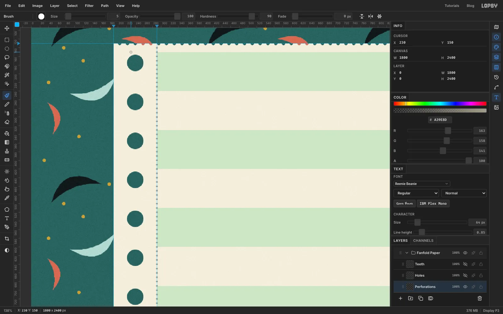

The side strips tear off too, so they need their own perforations. Add a
layer called *Perforations*. Keep the Brush at **Spacing** 200, but set
**Size** 5, **Hardness** 90 and the colour to warm grey `#A39E8D`. Click
at the top of the left inner guide and [[Shift]]-click at the bottom.
Repeat on the right.

## Lift the sheet off the counter

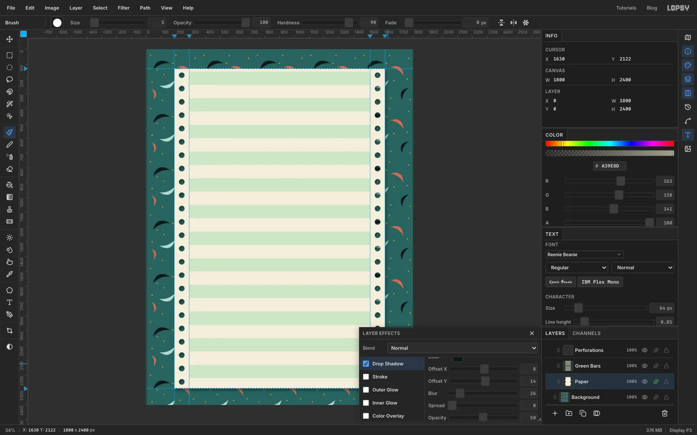

Select the *Paper* layer and open its layer effects (the ✦ button on
its row). Tick **Drop Shadow** and set the colour to a very dark teal
`#081A19`, **Offset X** 8, **Offset Y** 14, **Blur** 26 and **Opacity**
50. The shadow falls on the counter and inside every punched hole, so the
sheet now sits on the counter rather than being printed on it.

## Tone the counter down

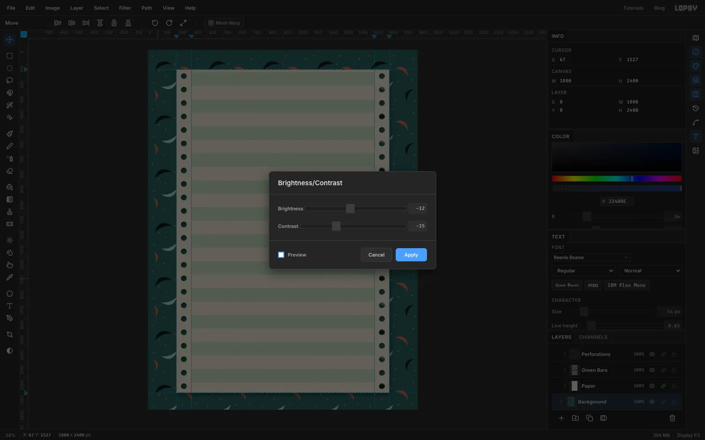

With the sheet in place, the black boomerangs fight the paper for
attention. Select the **Background** and run **Filter →
Brightness/Contrast…** with **Brightness** −12 and **Contrast** −35. The
counter steps back and the white page becomes the brightest thing on the
canvas.

While you're down here, add an empty layer called *Paper Grime* above the
*Fanfold Paper* group. You'll fill it with grime near the end.

## Write the banner in a text editor

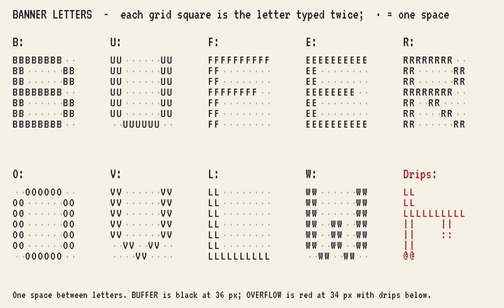

Old banner programs built each big letter on a 5 × 7 grid. Every filled
square is the letter typed **twice** and every empty square is two
spaces, with one space between letters. The sheet above shows every
letter you need. Lining up dozens of spaces is much easier in a plain
text editor than in an image editor, so build both words there first.

For OVERFLOW, add up to six extra lines under the word for drips. Under
some of the letters, put `||` on each line and end the drip with `oo`,
`@@` or `..`. Make them different lengths, from a single `::` to five
lines long.

## Type the BUFFER banner

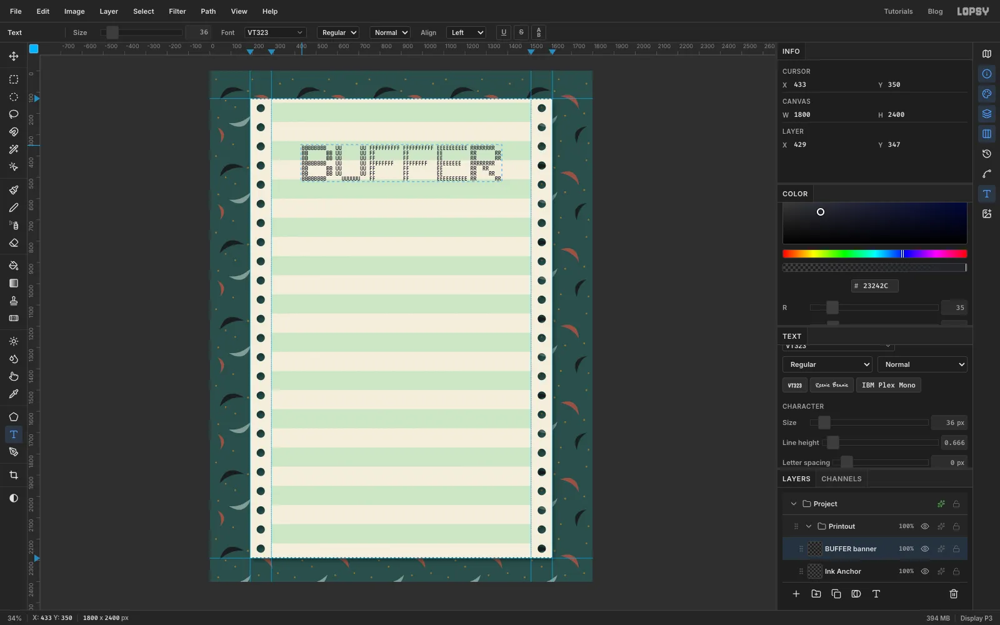

Choose **Layer → New Group** and call it *Printout*. Everything printed
goes in here.

Add one empty layer inside the group (it's *Ink Anchor* in the
screenshots). New layers appear above whichever layer is active, so with
this one selected, new text lands inside the group. It also stops the
Text tool's font settings from restyling a text layer that happens to be
selected. You can delete it at the end.

Copy BUFFER from your text editor. Pick the **Text** tool and choose
**VT323** in the font browser. Set **Size** to 36, and in the **Text**
panel set **Line height** to 0.67 so the rows sit 24 px apart and the
letters look square. Click inside the top part of the sheet and paste
with [[Cmd+V]]. Press [[Tab]] to commit and drag it with the **Move**
tool until it is centred.

## Make OVERFLOW spill out

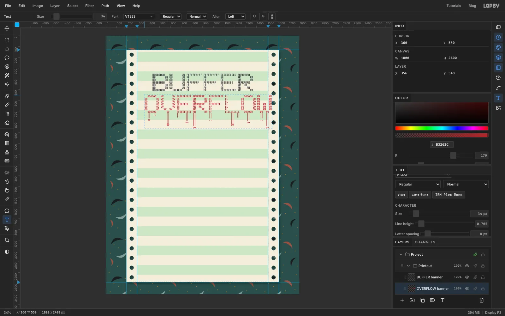

OVERFLOW is the joke, so it should break out of the layout. Click the
*Ink Anchor* layer again and copy OVERFLOW with its drips.

Set the foreground to red `#B5212A`, size **34** and line height **0.71**
(slightly smaller than BUFFER, because OVERFLOW has eight letters).
Paste it under BUFFER and line it up so the final W runs past the right
inner guide onto the tractor strip. The drips should hang well below
everything else in the title.

## Draw the box around the title

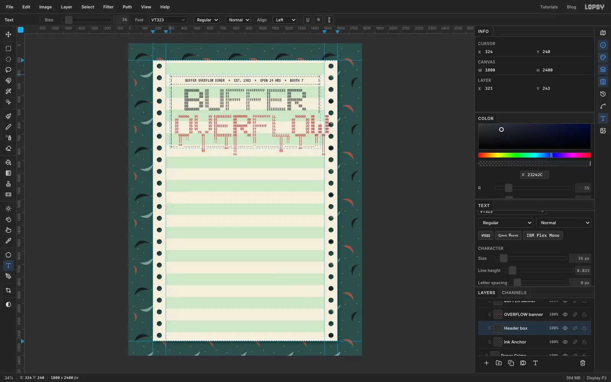

Now the box the title is supposed to stay inside. Make it 80 characters
wide, the width of a classic printer line:

- a top border: `+`, 78 dashes, `+`
- one row reading `BUFFER OVERFLOW DINER * EST. 1983 * OPEN 24 HRS * BOOTH 7`, centred between two `|` bars
- a second border
- fifteen rows with a `|` at each end and spaces between
- a bottom border

Set black `#1E1F28`, size **36** and line height **0.83** (rows 30 px
apart), paste it so the top border sits about 100 px below the top of the
sheet, and move it so the box frames both banners.

Now break the box. Click into the box text and delete the right-hand
`|` beside each row the red W covers, and the dashes in the bottom border
wherever a drip crosses it. OVERFLOW now looks like it has broken
through.

## Set the menu in two columns

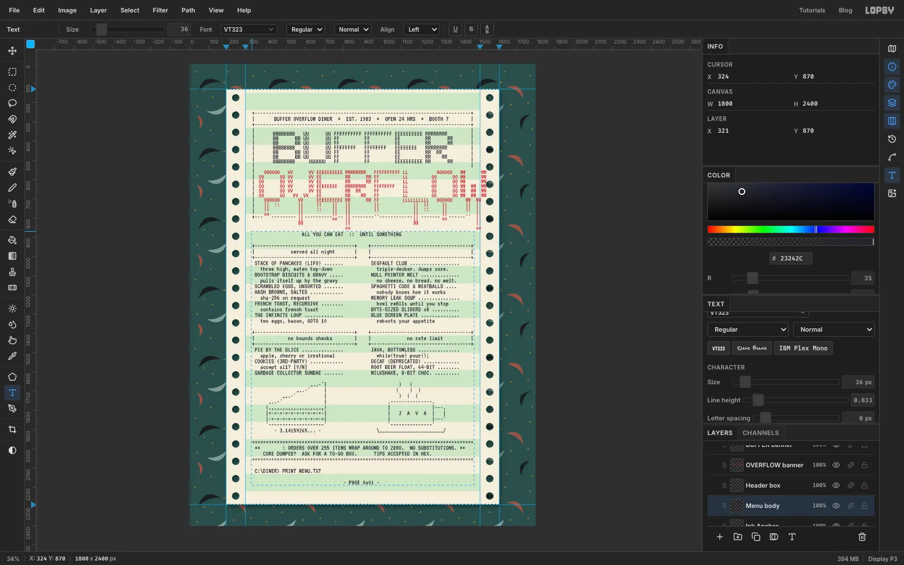

Write the menu in your text editor as 80-character lines. Each column is
38 characters wide with a 4-space gutter, and every item follows the same
rule: name, a space, dots, a space, then the price ending exactly on the
column edge (`STACK OF PANCAKES (LIFO) ....... 7.50`). Section headings
sit in little `+---+` boxes. The pie is a slice drawn with `_..-'` steps
and a `|` back wall over a crust of `(_,_,_,)`. The mug is a box with a
`|---.` handle on a `\____/` saucer.

The menu has four sections: BREAKFAST (served all night), PLATES &
SANDWICHES, DESSERTS and HOT DRINKS, with names like *Stack of Pancakes
(LIFO)*, *Segfault Club* and *Java, Bottomless*. Above them sits a
tagline, ALL YOU CAN EAT :: UNTIL SOMETHING CRASHES. Below them are a
WARNING footer between two rows of `=`, a `C:\DINER> PRINT MENU.TXT`
prompt with READY. at the right, and a centred `- PAGE 0x01 -`.

The headings and prices will be printed in red, so before you paste, make
a copy of the menu in your editor and replace every red word (the section
titles, prices, WARNING, CRASHES and READY.) with the same number of
spaces. Paste that black version with the same black, size 36 and line
height 0.83, so it starts on the 30 px rhythm just below the title box.

> **Tip:** Some pixel fonts, VT323 included, join "fi" and "fl" into one
> character, which knocks every column after it out of line. If a box
> border or price comes out one character short, look for one of those
> pairs and reword that line.

## Add the red ribbon

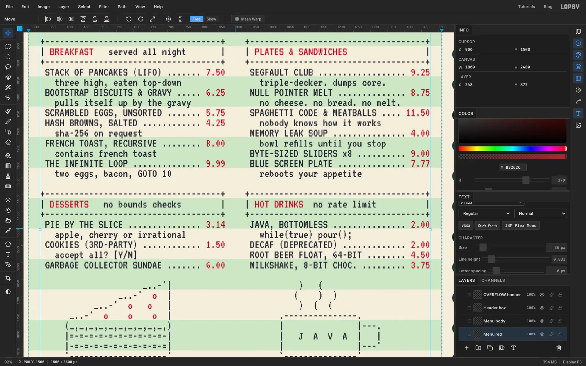

Two-colour ribbons printed headings and prices in red. Make a second copy
of the menu in your editor that keeps only the red words and turns
everything else into spaces.

Rasterize the black menu with the **Rasterize Layer** button at the
bottom of the Layers panel, so the Text tool starts a new layer instead
of editing it. Select *Ink Anchor*, click where you clicked for the
black menu and paste the red version in red `#B5212A`. Because the font
is monospaced, every red word drops into its gap. Compare the two
layers' X and Y in the **Info** panel and nudge with the arrow keys until
they match.

## Merge the inks into two layers

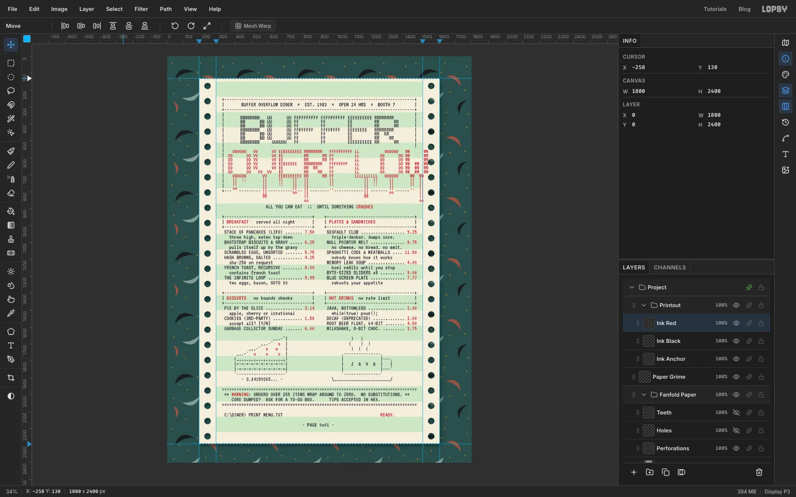

Rasterize the remaining text layers. Drag the rows so all the black
layers (box, BUFFER, menu) are next to each other with the red ones
(OVERFLOW, red menu) above them. Then **Merge Down** until you have just
two ink layers: *Ink Black* and *Ink Red*. Treating each ribbon colour as one
layer makes the next steps quick.

## Turn the type into dot-matrix print

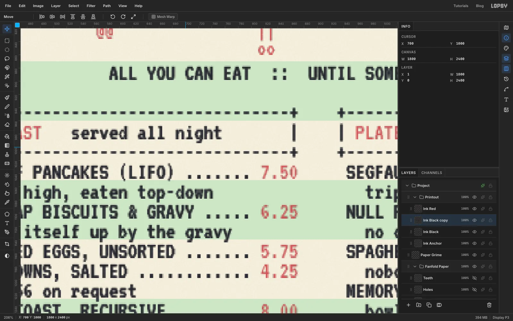

Select *Ink Black* and choose **Filter → Halftone…**. Set **Dot Size**
3, **Density** 1.5, **Angle** 0 and **Softness** 1, then **Apply**. With
the angle at 0 the dots line up in a square grid, like the pins in a
print head. Do the same on *Ink Red*.

Dot-matrix printers made bold text by striking each line twice, slightly
offset. Copy that: **Duplicate Layer**, switch to the **Move** tool,
press the right arrow key once to shift the copy 1 px, and **Merge
Down**. Do it for both inks. Zoom right in to check that letters like M
and W still read. A bigger dot or a bigger offset fills in their middle
strokes.

## Colour the ink and press it into the paper

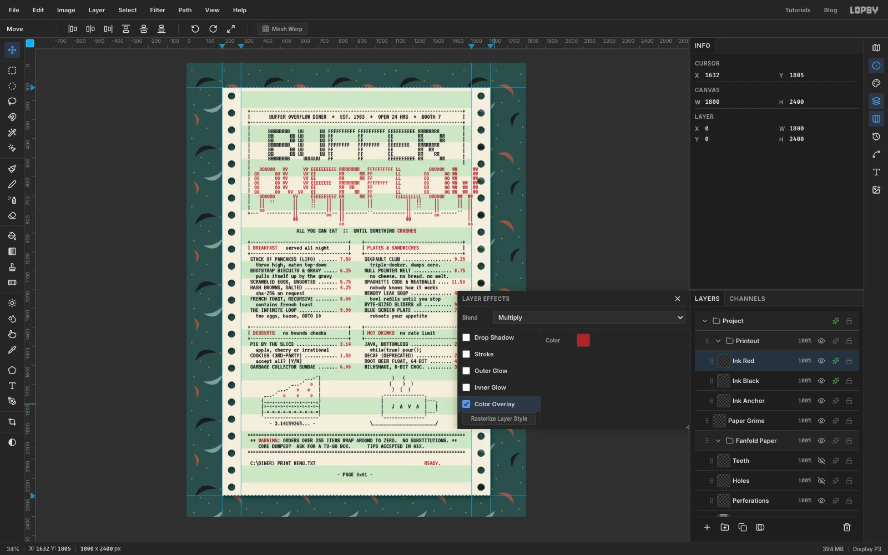

Halftone leaves slightly uneven colours. Open the layer effects for *Ink
Black*, tick **Color Overlay** and set it to `#1E1F28`. Then set the
layer's **Blend** to **Multiply**, so the green bars show through the
ink the way they would on real paper. Do the same on *Ink Red* with
`#B5212A`.

Ink can't land in a hole that isn't there, and the W of OVERFLOW runs
over the tractor strip. [[Cmd]]-click the hidden *Holes* layer's
thumbnail, select *Ink Red* and press [[Delete]].

## Fade the ribbon with a mask

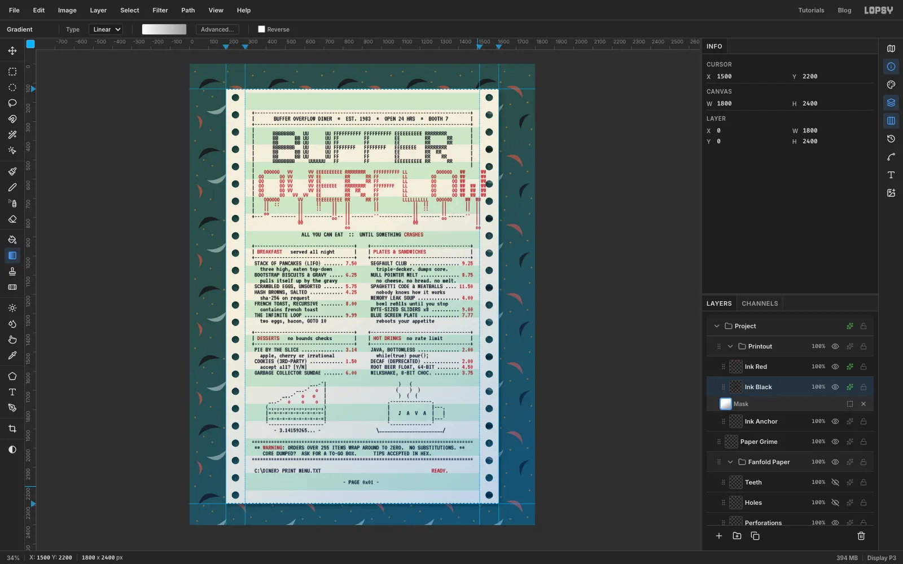

A ribbon runs dry as it prints, so the text gets lighter towards the end
of the page. Select *Ink Black* and click **Add Mask** at the bottom of
the Layers panel, then click the new mask thumbnail to edit the mask. The
canvas turns blue while you're editing it.

Pick the **Gradient** tool, click **Advanced…**, and set the stops to
white `#FFFFFF` and light grey `#9C9C9C`. Drag from the middle of the
menu down to the bottom-right corner. Grey in a mask means partly
transparent, so the lower right of the menu prints a little paler. Click
the layer's own thumbnail when you're done to leave mask editing.

For a little grime, select the empty *Paper Grime* layer you made
earlier. Run **Filter → Clouds…** at **Scale** 3,
then trim it to the paper the same way as the bars ([[Cmd]]-click
*Paper*, **Select → Inverse**, [[Delete]]). Set it to **Multiply** at
**6%** opacity.

## Start a coffee ring

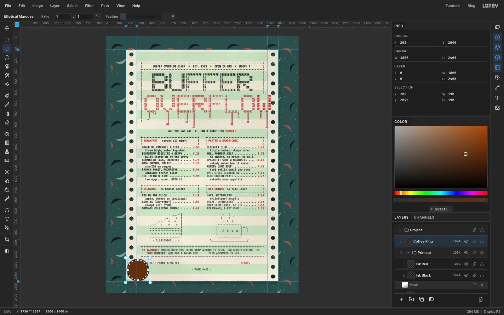

Coffee rings are dark at the rim and almost clear in the middle, because
the coffee dries towards the edge. Add a layer called *Coffee Ring* at
the top of the stack, outside the groups.

Draw a circle about 210 px across with the **Elliptical Marquee**, half
over the left tractor strip near the bottom of the sheet, and fill it
with dark coffee `#5E3316`. Choose **Select → Shrink…**, enter **11**
and **Apply**, then press [[Delete]]. You're left with a thick ring and
the inner circle still selected. Fill that circle with the same brown at
about **10%** in the colour picker's **A** (alpha) field, for a faint
stain. Set alpha back to 100 afterwards.

## Make the ring look spilled, not stamped

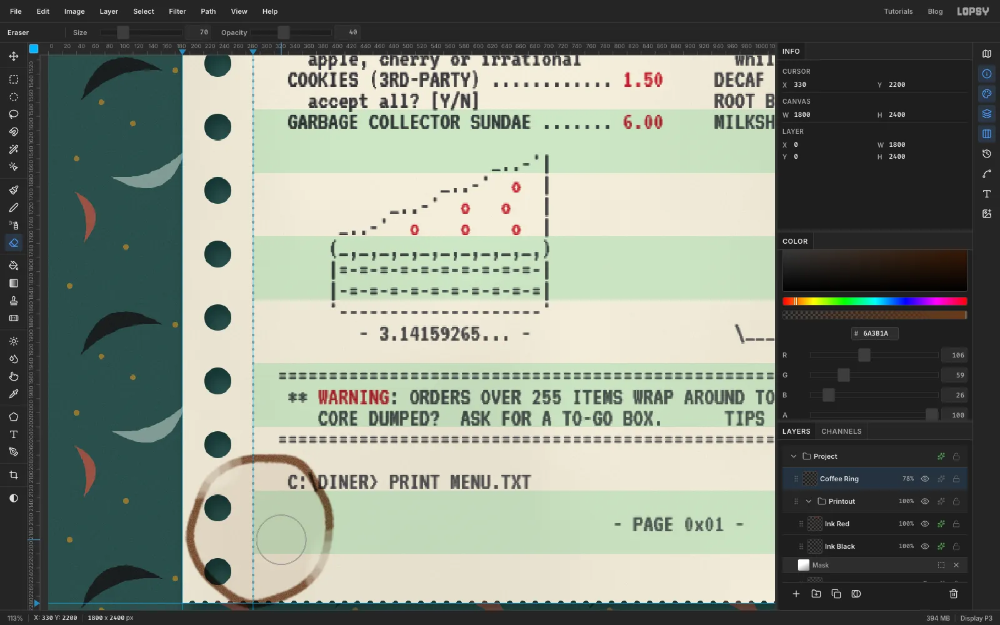

A real ring is never perfectly round. Deselect, open **Filter →
Liquify…**, keep **Push Forward**, and nudge the rim outward or inward
in three or four places with short drags. Then **Apply**.

Run **Filter → Gaussian Blur…** at **3** px to soften it and **Add
Noise…** at **35** with **Mode** set to **Mono** for a grainy edge. Set the layer to
**Multiply** at **78%**. Finally pick the **Eraser** with **Size** 70
and **Opacity** 40 and drag across two short parts of the rim, so the
ring fades out where the cup didn't sit flat.

## Add a second, fainter ring

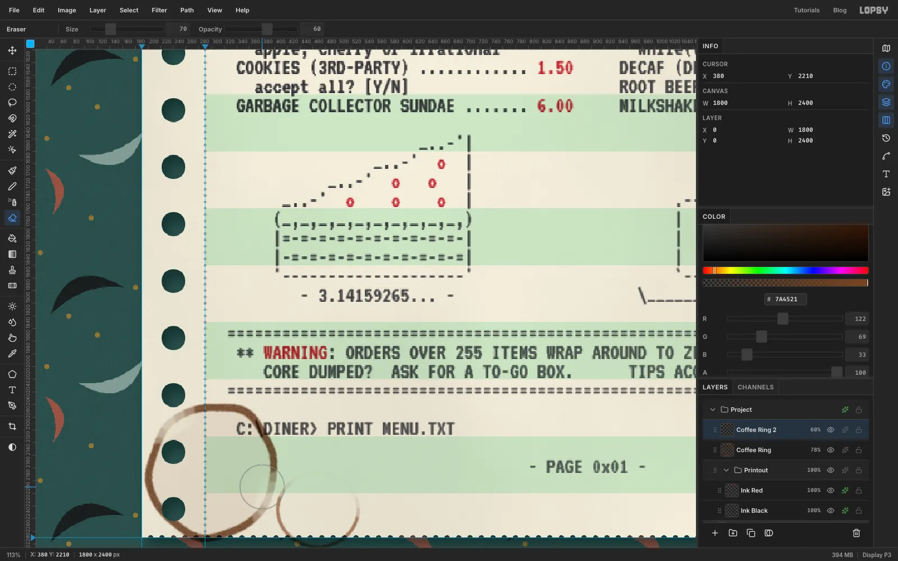

Add a layer called *Coffee Ring 2*. Draw a slightly oval selection about
130 px wide overlapping the first ring on the right, fill it with a
lighter coffee `#7A4521`, **Shrink** by **5** and [[Delete]]. Blur it by
**2**, set it to **Multiply** at **60%**, and erase most of its top half
with one Eraser stroke at 60% opacity. Two rings of different weights
look like someone set their cup down twice.

The rings shouldn't be visible inside the punched holes. On each ring
layer, [[Cmd]]-click the *Holes* thumbnail and press [[Delete]].

## Mark up the menu in ballpoint

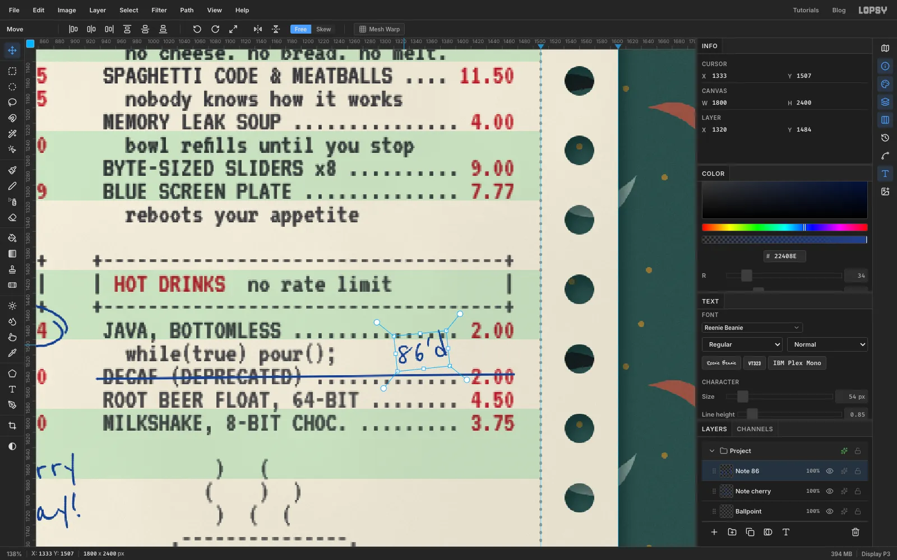

Waitresses always scribble on the menu. Add a layer called *Ballpoint*.
Pick the **Brush** with **Hard Round**, set **Size** 4, **Spacing** 10,
**Hardness** 85 and the colour to ballpoint blue `#22408E`.

- To cross out a line, click at the start of DECAF and [[Shift]]-click
  past its price.
- To circle a price, drag one loose loop around the pie's **3.14** and
  let the end overshoot the start, the way a hand does.

Then switch to the **Text** tool, choose **Reenie Beanie** at **54 px**
in the same blue, and click in the clear space on the row above the
crossed-out price to write *86'd* (diner slang for "we're out"). Drag it
with the **Move** tool so it sits right above the struck-out 2.00.

## Write a note and tilt the handwriting

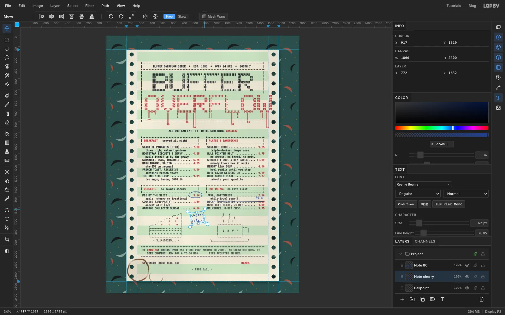

Make another Reenie Beanie text at **62 px** with **Line height** 0.85
in the clear space beside the pie: *cherry* on one line and *today!* on
the next. With the **Move** tool, drag just outside a corner handle
until the cursor turns into a curved arrow, then turn the note a little anticlockwise, about
as far as a minute hand moves in a minute and a half. Press [[Cmd+D]] to commit. Tilt *86'd* a few degrees
the same way. Nobody writes level on a menu.

Back on the *Ballpoint* layer, draw an arrow from the note towards the
pie with one curved stroke, plus two short [[Shift]]-click barbs at the
tip. Stop it a little short of the pie so it doesn't touch the ASCII
art.

Click *Coffee Ring*, [[Shift]]-click the top note, and choose **Layer →
Group Layers**. Name the group *Diner Marks*.

## Select the whole sheet

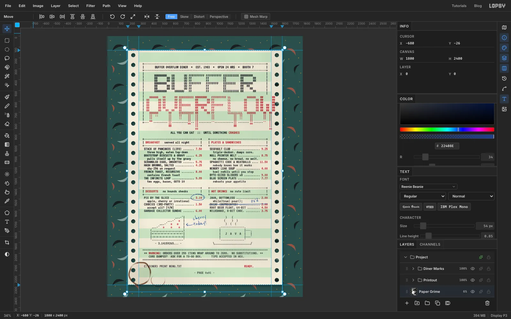

The last touch is to knock the sheet off square, as if it had been
dropped on the counter. Collapse the groups. Click *Fanfold Paper*, then
[[Shift]]-click *Diner Marks*, so *Fanfold Paper*, *Paper Grime*,
*Printout* and *Diner Marks* are all selected. Leave the Background out.
Pick the **Move** tool with nothing selected on the canvas. One set of
handles appears around everything you selected.

## Rotate the sheet

Drag just outside the top-right handle and turn the sheet slightly
anticlockwise, until its top edge drops by about 40 px across its width.
It doesn't need more than that. Everything turns
together around the middle: paper, shadow, ink, pen marks and stains.
Press [[Cmd+D]] to commit.

Press [[Cmd+Z]] and [[Cmd+Shift+Z]] to flick between straight and tilted
and judge the angle. Then delete the empty *Ink Anchor* layer, export with **File → Quick
Export PNG** and save the project with **File → Save Project**.
