Periodical cicadas spend 13 or 17 years underground, then come up by the billion for about six weeks of noise. Each population, or *brood*, keeps its own calendar. Some summers no brood is due at all, and those quiet years are the story of this chart. It's printed the way a 1970s computer centre would have printed it: on fanfold green-bar paper, in capital letters, with the picture made from characters. Then someone went over it with a highlighter and a red grease pencil.

The data is real. It covers the 15 surviving broods (12 on a 17-year cycle and 3 on a 13-year cycle) for 2025 to 2045, taken from published brood calendars. Five of those 21 summers have no brood scheduled: 2026, 2039 and three in a row from 2043 to 2045.

Along the way you'll use:

- **ruler guides** with snapping, and a **duplicate, move and Merge Down** trick that repeats a shape by doubling it
- **Fibers**, **Motion Blur** and **Add Noise** for wood and paper texture
- **Define Brush** with 200% **Spacing** to make a dashed line
- **Cmd**-clicking a layer thumbnail to punch holes with **Delete**
- live text in **IBM Plex Mono** and **Caveat Brush**, the **Text panel**'s **Line height**, and swapping a duplicate's text
- **Copy** and **Paste** in place, **Merge Down** and arrow-key nudges for overstrikes
- **layer masks** edited with **Clouds**, **Brightness/Contrast**, **Add Noise** and **Threshold**
- the **Square** and **Hard Round** brush presets with **Shift**-click straight lines
- **Magic Wand**, **Inverse**, **Shrink**, **Feather** and the **Lasso** to cut out a photo
- the **Move** tool's scale and rotate handles on a whole group, and on two layers at once
- **Drop Shadow**, **Gaussian Blur**, blend modes and radial **gradients** for light

The palette is a computer-room one. Most of the colour comes from the paper and two marker pens:

- Desk `#2E2119`
- Paper `#F4F1E6`, green bar `#D2E5CC`, perforations `#B9B09A`
- Ribbon ink `#1E1F24`
- Red ribbon and grease pencil `#B8302A`
- Highlighter `#F4DC4C`
- Lamp `#FFD9A0`

> **Tip:** Positions are in document pixels, `x, y`. The **Info** panel shows where the pointer is. Hide the Color panel when you need more room for the Layers panel.

## Start a landscape document

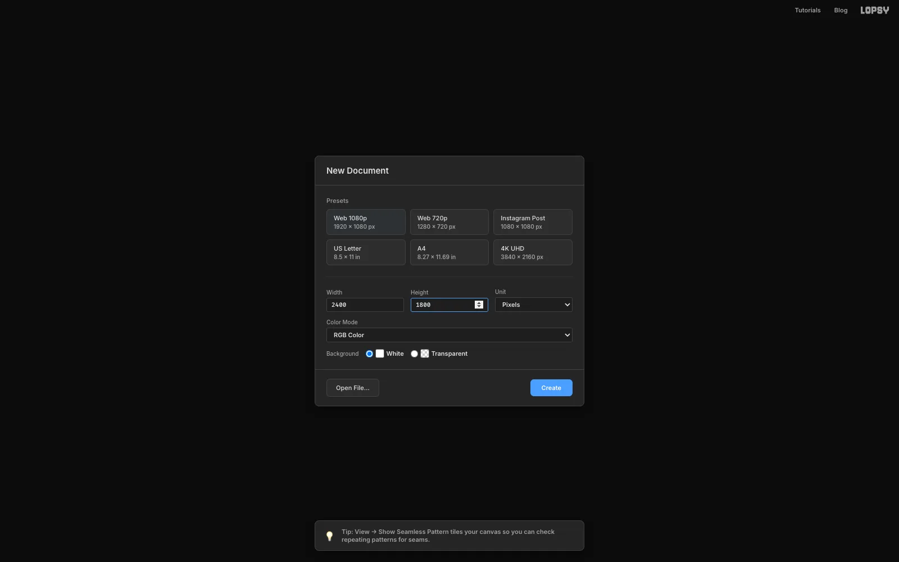

Open [Lopsy](/). In the **New Document** dialog, set **Width** to `2400` and **Height** to `1800`, leave **Background** on White, and click **Create**.

The canvas is a desk seen from above. The printout will cover most of it, so only the margins will show wood.

## Grow some wood fibres

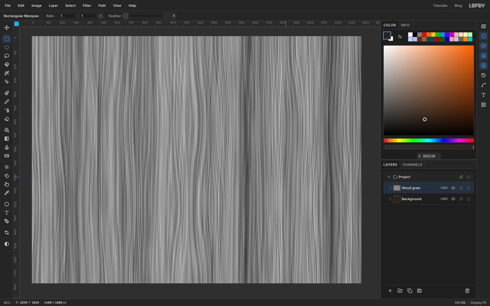

1. Select **Background**, set the foreground colour to dark brown `#2E2119` and choose **Edit → Fill**.
2. Select **Layer 1** and rename it `Wood grain` (double-click its name).
3. Choose **Filter → Fibers…** and set **Variance** to `20` and **Strength** to `52`. Click **Apply**.

Fibers paints long grey strands that run top to bottom. A high Strength keeps them fairly straight, like the grain of a plank.

## Turn the fibres into a desk

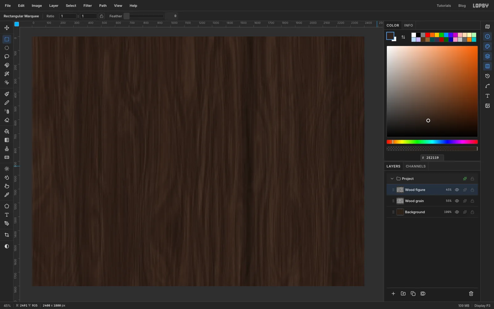

1. Run **Filter → Motion Blur…** on `Wood grain` with **Angle** `90` and **Distance** `40`. That smears the strands along their own length.
2. Click the effects button on the layer's row to open its effects drawer, and set the blend mode to **Overlay**. Then click the layer's opacity percentage and set it to `55%`.
3. Click **Add Layer**, name it `Wood figure`, and run **Fibers** again with **Variance** `30` and **Strength** `6`. A low Strength makes wavy, tangled strands.
4. Blur it with **Motion Blur** (`90`, `25`), set it to **Soft Light** and drop it to `45%`.

The second, wavier pass breaks up the straight lines so the wood has some figure.

## Place guides for the paper

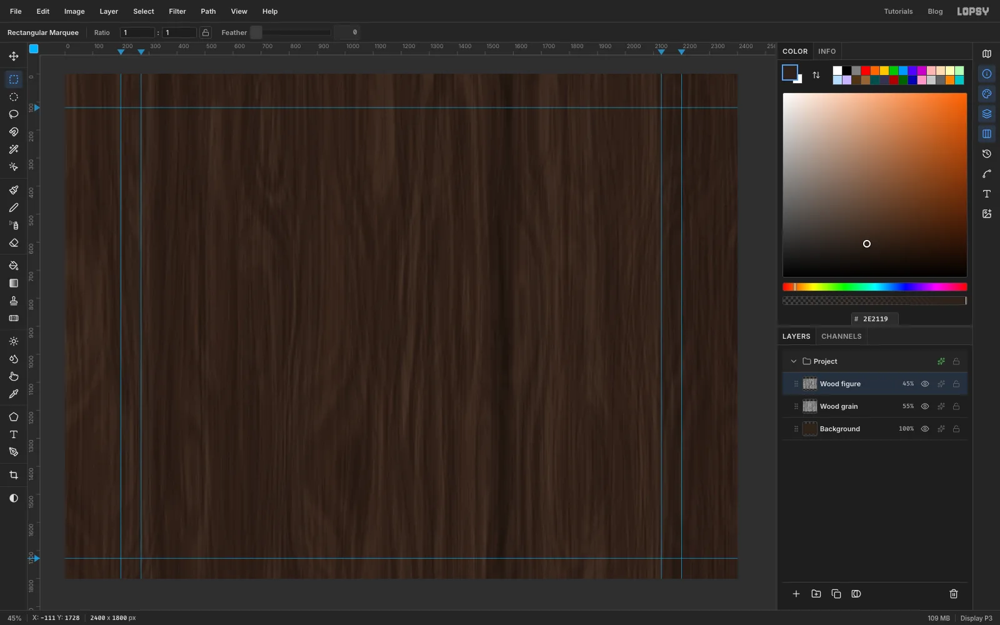

Fanfold paper is about 15 by 11 inches, so the sheet is 2000 by 1608 px here. Each edge has a half-inch strip with the sprocket holes.

1. Click the top ruler at `200`, `272`, `2128` and `2200` to drop four vertical guides. The two inner ones mark the tractor strips.
2. Click the left ruler at `120` and `1728` for the top and bottom of the sheet.

A single click on a ruler makes a guide; you don't drag them out. Marquee edges snap to guides, which saves a lot of fiddling in the next steps.

## Lay down the paper

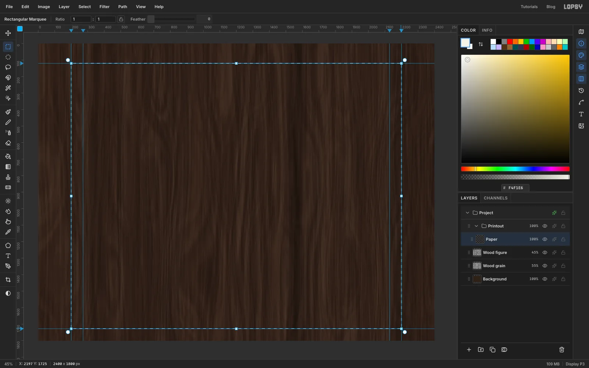

1. Click **New Group** and name it `Printout`. Everything printed on the sheet will go in here.
2. Inside it, click **Add Layer** and name it `Paper`.
3. Set the foreground to off-white `#F4F1E6`. With the **Rectangular Marquee**, drag from the top-left guide corner to the bottom-right one. The edges snap onto the guides.
4. Choose **Edit → Fill**, then deselect with [[Cmd+D]].

## Draw the first green bar

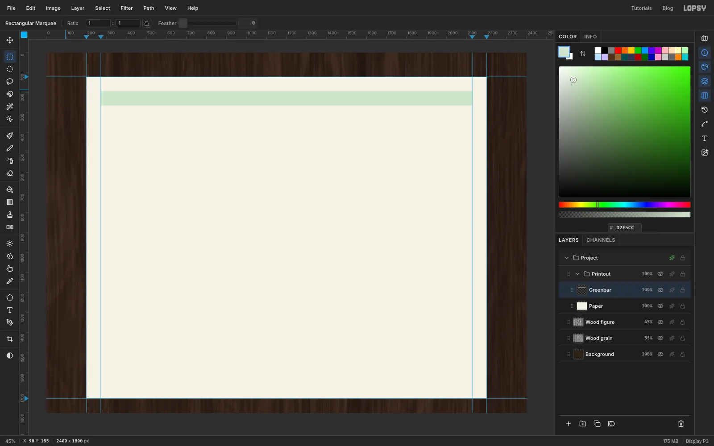

Green-bar paper alternates three lines of green with three lines of white. At 24 px per printed line, each band is 72 px tall.

1. Add a layer called `Greenbar` and set the foreground to pale green `#D2E5CC`.
2. Drag a marquee between the two *inner* guides, from `192` down to `264`. That's one band, starting one band below the top of the sheet.
3. Fill it and deselect.

## Repeat the band by doubling

Instead of drawing eleven bands, copy what you have and double it each time:

1. Choose **Layer → Duplicate Layer**, then click the copy's row in the Layers panel.
2. With the **Move** tool, drag the copy straight down by `144` px (one green band plus one white one). Use the arrow keys for the last pixel or two.
3. Press [[Cmd+E]] to merge it down. You now have 2 bands.
4. Do it again, moving the copy by `288` px to get 4 bands, then by `576` px to get 8.

Each round doubles the count, and the spacing stays exact because you're moving a copy of bands that are already spaced correctly.

## Finish the green bars

Duplicate once more and move the copy down by `1152` px, then merge it. Some bands now hang off the bottom of the paper. Select everything below the bottom guide with a marquee and press [[Delete]].

## Mark the tractor holes

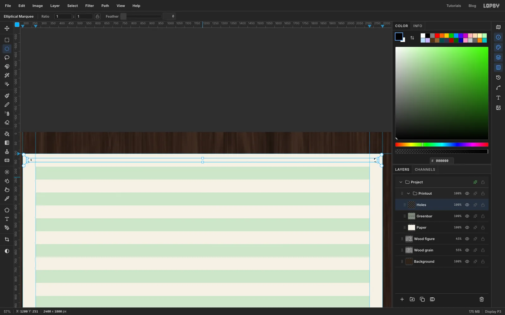

The sprocket holes sit in the middle of each strip, one every 72 px, so they line up with the bands.

1. Add a layer called `Holes` and set the foreground to black.
2. With the **Elliptical Marquee**, drag a 22 px circle centred at `236, 156`, near the top of the left strip.
3. Hold **Shift** and drag a second circle at `2164, 156` on the right strip. Shift adds it to the selection.
4. Fill both and deselect.

## Double the holes down the strips

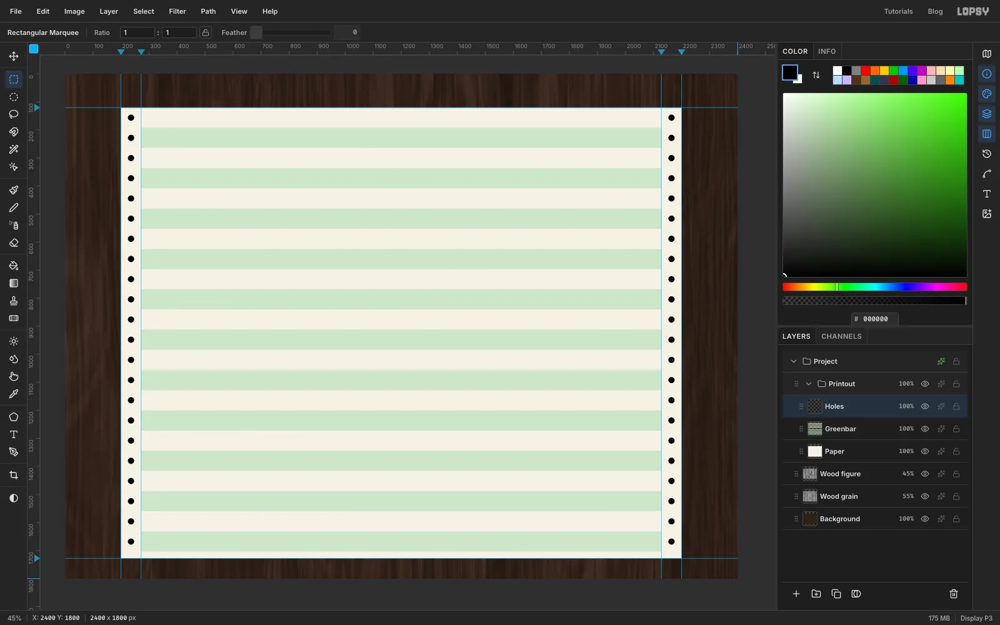

Use the same doubling trick: duplicate, move the copy down by `72`, merge. Then repeat with `144`, `288`, `576` and `1152`. Delete any holes that land below the paper.

## Load the holes as a selection

1. **Cmd**-click the `Holes` layer's thumbnail. That loads its pixels as a selection.
2. Click the `Paper` row to make it the active layer. The selection stays.

## Punch the holes

1. Press [[Delete]] to cut the holes out of the paper, then deselect.
2. Delete the `Holes` layer with the trash button. You don't need it any more.

## Make a dash brush

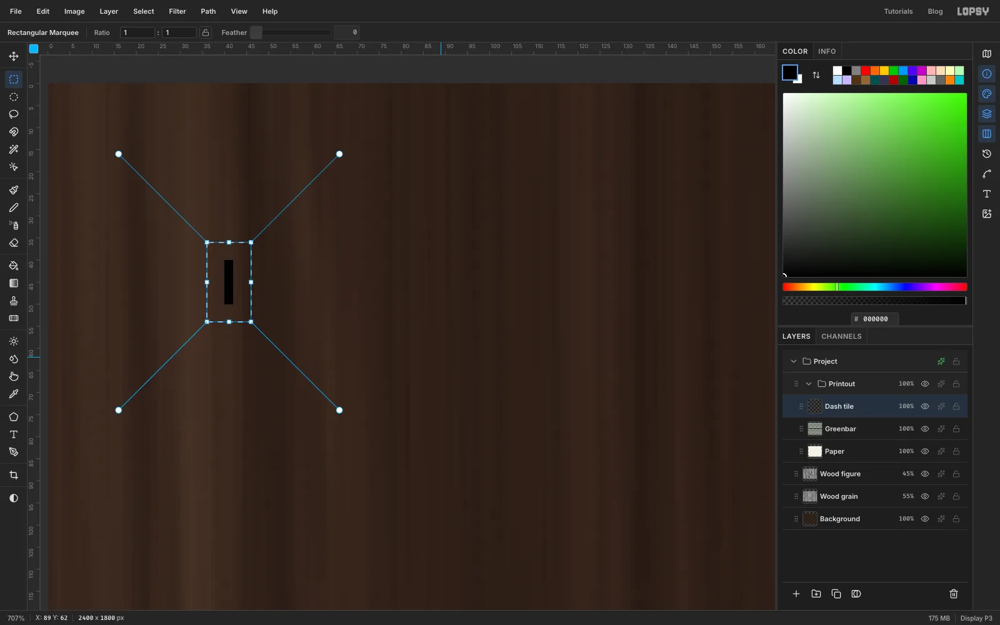

Fanfold paper has a perforated line between the tractor strip and the page. You'll draw it with a brush that prints one dash per dab.

1. Add a layer called `Dash tile` and zoom right in on an empty corner. With the **Rectangular Marquee**, select a rectangle 2 px wide and 10 px tall, then **Edit → Fill** it with black.
2. Marquee around it and choose **Edit → Define Brush…**. Name it `Perforation dash`.
3. Delete the `Dash tile` layer.

Lopsy trims the new tip to the dark pixels, so the brush is exactly one dash.

## Draw the perforations

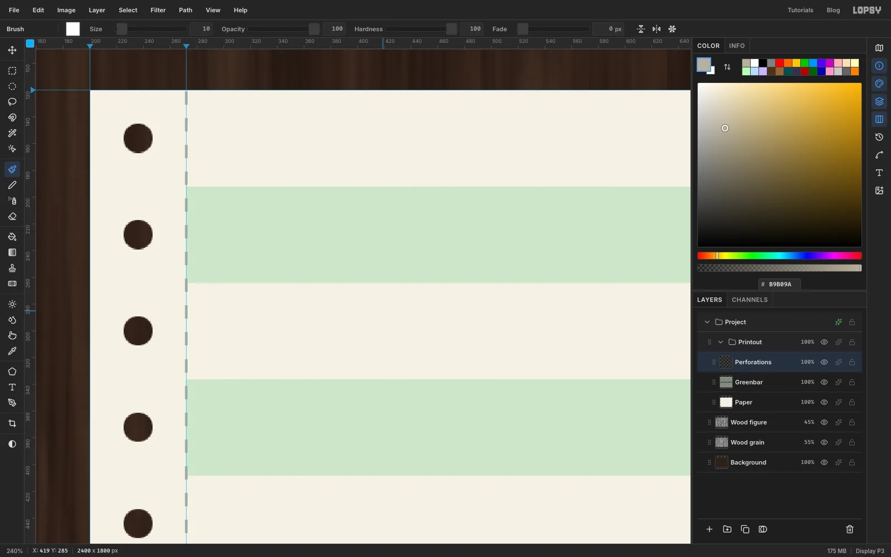

1. Add a layer called `Perforations` and pick the **Brush**. The `Perforation dash` preset is already active.
2. Open the brush presets (click the tip thumbnail in the options bar), go to **Shape** and set **Spacing** to `200%`. That puts one dash-length of gap between dashes.
3. Set the foreground to `#B9B09A`. Click at the top of the left inner guide, then **Shift**-click at the bottom. Shift-click draws a straight line from the last dab.
4. Do the same on the right inner guide.

## Give the paper some tooth

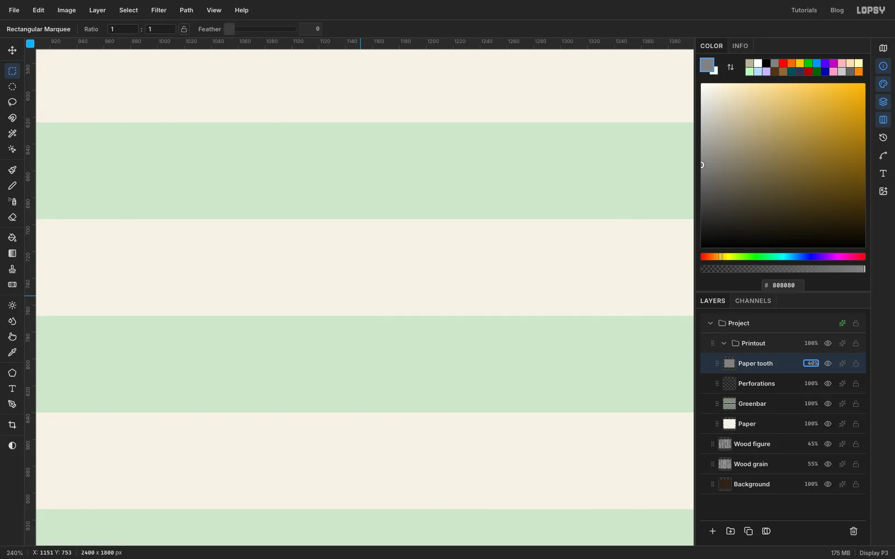

1. Add a layer called `Paper tooth` and fill it with mid grey `#808080`.
2. Run **Filter → Add Noise…** with **Amount** `22`, **Mono** and **Gaussian**.
3. **Cmd**-click the `Paper` thumbnail, choose **Select → Inverse** and press [[Delete]], so the grain only covers the sheet.
4. Set the layer to **Overlay** at `40%`.

Grey disappears in Overlay, so only the speckle shows. That's paper grain.

## Lift the paper off the desk

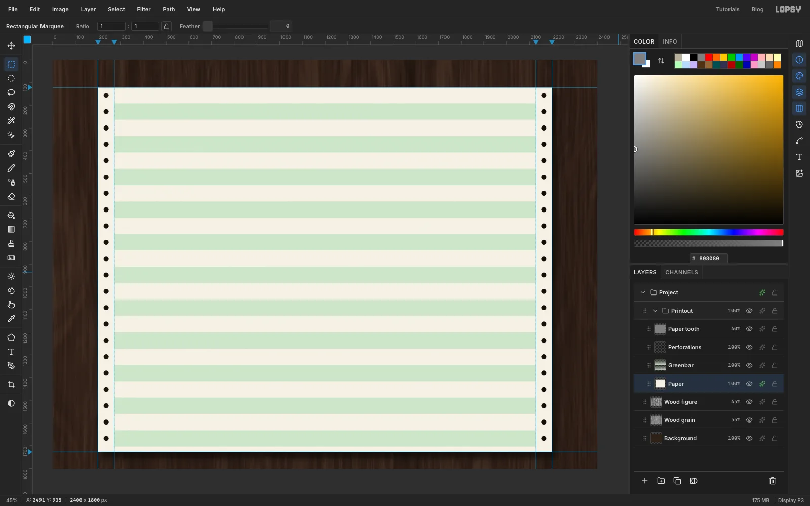

Open the effects drawer on `Paper` and turn on **Drop Shadow**: **Offset X** `16`, **Offset Y** `28`, **Blur** `44`, **Opacity** `75`, shadow colour `#0B0705`. The holes show the shadow through them too, which helps sell the paper.

## Print the banner

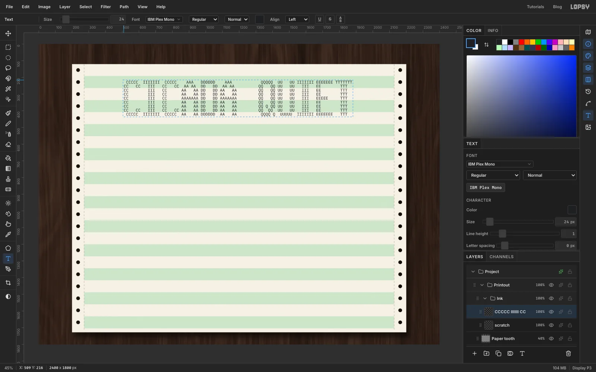

Line-printer banners were built from the letters themselves. Write yours in a plain-text editor first, where it's easy to line up the columns:

- Each letter is 7 characters wide and 9 lines tall, drawn with its own letter: the C is made of Cs, the Q of Qs.
- Strokes are two characters thick. The top of the C is ` CCCCC ` and its sides are `CC   CC`. The I is `IIIIIII` top and bottom with `  III  ` in between.
- Put one space between letters, and a blank 7-character "letter" between the two words. The whole banner is 95 characters wide.

1. Press [[Cmd+;]] to hide the guides. Select `Paper tooth` and click **New Group** to make a group called `Ink` inside `Printout`. Add a spare layer called `scratch` inside it. Select it before each new block of text: if a text layer is selected, changing the font size restyles that layer instead of setting up the next one.
2. Pick the **Text** tool. In the options bar, choose **IBM Plex Mono**, size `24`, colour `#1E1F24`.
3. Click at about `509, 216` and paste the banner ([[Cmd+V]]). Press [[Tab]] to commit. That spot is line 4 of the page, 12 characters in from the left margin of the text, which centres the 95-character banner on the 120-character line.
4. In the **Text** panel, set **Line height** to `1`.

IBM Plex Mono is 0.6 em wide, so at 24 px every character is 14.4 px and every line is 24 px. That makes three printed lines exactly one green band.

## Print the cicada

The drawing is printed in "condensed" mode, at 15 characters per inch and 8 lines per inch. Draw it in your text editor, about 81 characters wide and 22 lines tall, with the head pointing right:

- **Wings:** an oval outline, with `/`, `\`, `_` and `-` on the edges and `(` at the rounded tip. Add a dotted `:` seam where the two wings meet, and a few long `-` veins fanning out from the base.
- **Thorax:** a block of `#` and `%`.
- **Head:** a short band of `#` with a one-column gap in front of the thorax.
- **Eyes:** leave a 4-character gap on each corner of the head, two lines above it and two below. They'll be printed in red later.

Select `scratch`, set the **Text** tool's size to `16`, then click at about `631, 606` and paste. Set **Line height** to `1.125`. At 16 px a character is 9.6 px and a line is 18 px, which is 15 CPI and 8 LPI.

## Print the report

The rest of the page is one text layer of 63 lines, 120 characters wide. Build it in your editor. Here's the data, one brood per row, in the order they come up:

- 17-year broods: XIV 2025 and 2042, I 2029, II 2030, III 2031, IV 2032, V 2033, VI 2034, VII 2035, VIII 2036, IX 2037, X 2038, XIII 2041
- 13-year broods: XXII 2027 and 2040, XXIII 2028 and 2041, XIX 2037
- Row order: XIV, XXII, XXIII, I to IX, XIX, X, XIII. That gives the diagonal staircase.

And here's the layout:

- **Line 1:** the header `CICQT01   PERIODICAL CICADA EMERGENCE FORECAST   BROODS I-XXIII`, with `RUN 10/05/26   PAGE 0001` pushed to the right edge. Line 2 is 120 `=` signs.
- **Line 14:** the tagline `SEVENTEEN YEARS UNDERGROUND  .  SIX WEEKS OF NOISE  .  THEN THE QUIET`, centred.
- **Line 16:** `SECTION 1   PERIODICAL CICADA (MAGICICADA), DORSAL VIEW, PRINTED AT 15 CPI / 8 LPI`, with `PLOT 01 OF 01` on the right. Leave lines 17 to 39 empty for the drawing.
- **Line 40:** `SECTION 2   EMERGENCE SCHEDULE BY BROOD, 2025-2045`, with `15 BROODS, 21 YEARS` on the right.
- **The chart, from line 42:** each year gets a 4-character cell. The header row reads `  YEAR  25  26  27 …`, and the next line is ` BROOD` followed by a row of dashes under the years. Each brood row starts with its name, right-aligned in 5 characters. Its emergence year shows the cycle, `17` or `13`. Leave the other cells blank for now; the dots come next. A second row of dashes closes the chart.
- **TOTAL row:** counts zero-padded to two digits (`01`, `00`, `02`), so they sit under the years.
- **Legend and summary:** on the right from column 96. The legend reads `17  17-YEAR BROOD`, `13  13-YEAR BROOD`, `UNDERGROUND` and `QUIET YEAR`. Leave space in front of the last two for the dot and the highlighter swatch. The summary lists `BROODS 15`, `17-YR / 13-YR 12/3`, `EMERGENCE YRS 16`, `QUIET YEARS 5` (with `2026 2039 2043-45` on the line below) and `DOUBLE BROODS 2037 2041`. Right-align the numbers and leave the gaps between label and number as spaces for now; the leader dots go on the dots layer next.
- **Footer:** `SOURCE: PERIODICAL CICADA BROOD CALENDARS (USFS, CICADA MANIA)` on line 63, with `*** END OF REPORT ***` on the right.

Select `scratch` again and set the size back to `24`. Click at `336, 144`, the left margin of the text, one line below the top of the sheet, and paste. Set **Line height** to `1`.

> **Tip:** Make new text by clicking in empty space. A click inside an existing text layer's box edits that layer instead.

## Fade the filler dots

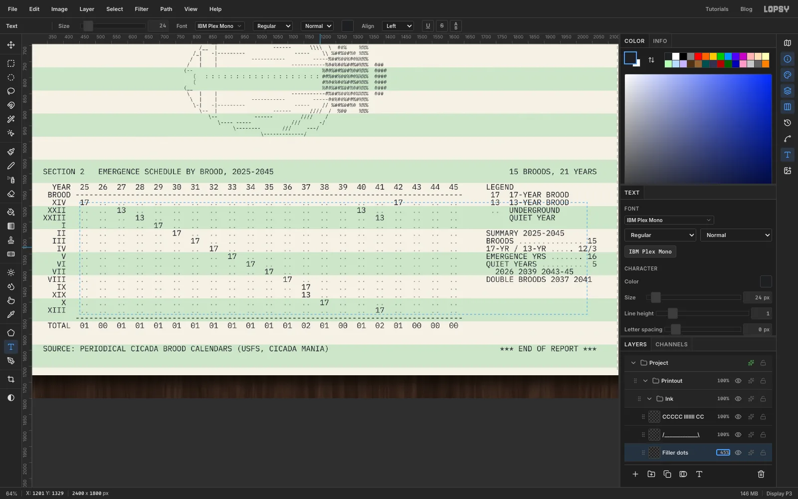

Every empty cell gets `..` for "underground", along with the dot leaders in the summary. Printed as dark as the data, they would bury the staircase of `17`s, so they go on their own, lighter layer:

1. In your editor, make a copy of the report with `..` in every empty chart cell, in front of `UNDERGROUND`, and as leader dots in the summary. Then turn everything except the dots into spaces.
2. Back in Lopsy, with the report layer active, choose **Layer → Duplicate Layer**.
3. Check that the copy's row is the highlighted one, so you don't overwrite the report. Then click into the text with the **Text** tool, press [[Cmd+A]] and paste the dots-only version. Press [[Tab]]. Because it's a copy of the report, it stays exactly in register.
4. Rename it `Filler dots` and set its opacity to `45%`.

## Merge the ink into one layer

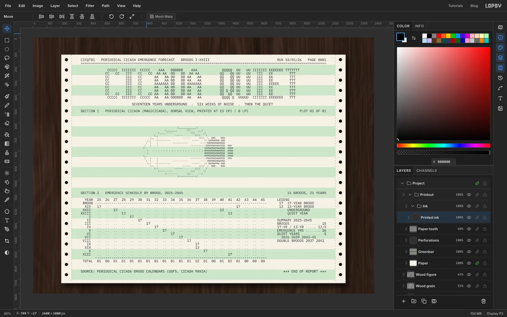

1. Delete the `scratch` layer.
2. Select `Filler dots` and press [[Cmd+E]] to merge it into the report. Merging bakes its 45% opacity in.
3. Select the banner, the top text layer in `Ink`, and press [[Cmd+E]] until everything is one layer. Rename it `Printed ink`.

From here on the type is pixels, which you need for the strike effects.

## Double-strike the page

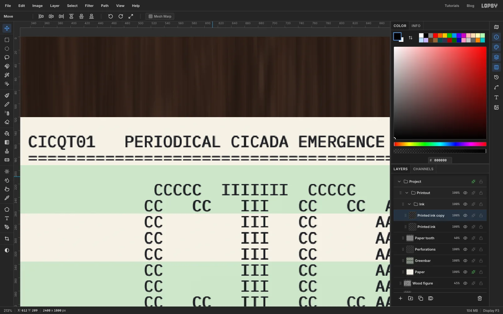

Impact printers often hit each character twice. Fake it:

1. Duplicate `Printed ink` and click the copy's row.
2. With the **Move** tool, press [[→]] once to nudge it 1 px right.
3. Press [[Cmd+E]] to merge it back down.

## Give the banner a third strike

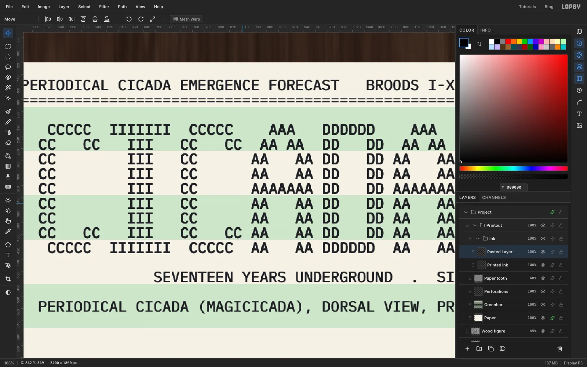

The title should be the darkest type on the page.

1. Marquee around the banner and press [[Cmd+C]] then [[Cmd+V]]. Pasting something you copied in Lopsy puts it back in the same place, on a new layer.
2. Deselect, switch to the **Move** tool, press [[↓]] once, and merge it down.

## Add grain and bleed to the ink

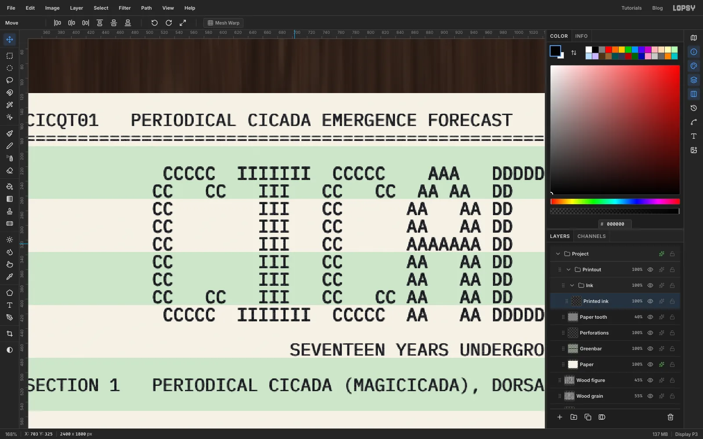

On `Printed ink`:

1. Run **Add Noise…** with **Amount** `35`, **Mono** and **Uniform**. This roughs up the ink.
2. Run **Gaussian Blur…** with **Radius** `1`. This makes the ink bleed slightly into the paper.
3. Set the layer to **Multiply**, so the green bands show through the ink as they would on real paper.

## Vary the strike pressure with a mask

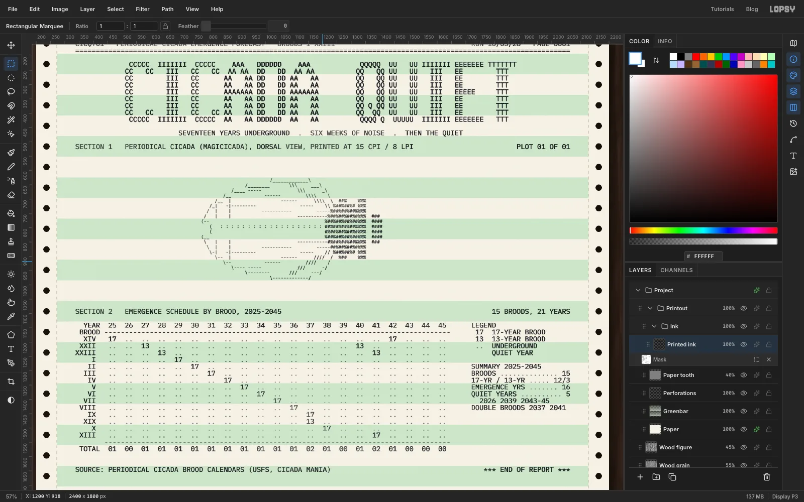

Real print hammers don't hit evenly, so some patches come out paler.

1. Click **Add Mask**, then click the mask thumbnail (**Edit mask for Printed ink**). Filters now work on the mask.
2. Run **Filter → Clouds…** with **Scale** `6`.
3. Run **Filter → Brightness/Contrast…** with **Brightness** `45` and **Contrast** `-60`. The mask now ranges from about 75% to full, so the ink never fades too far.
4. Set the foreground to white, marquee around the banner and **Edit → Fill**. The title stays at full strength.
5. Click the layer's name to leave mask editing.

## Print the eyes in red

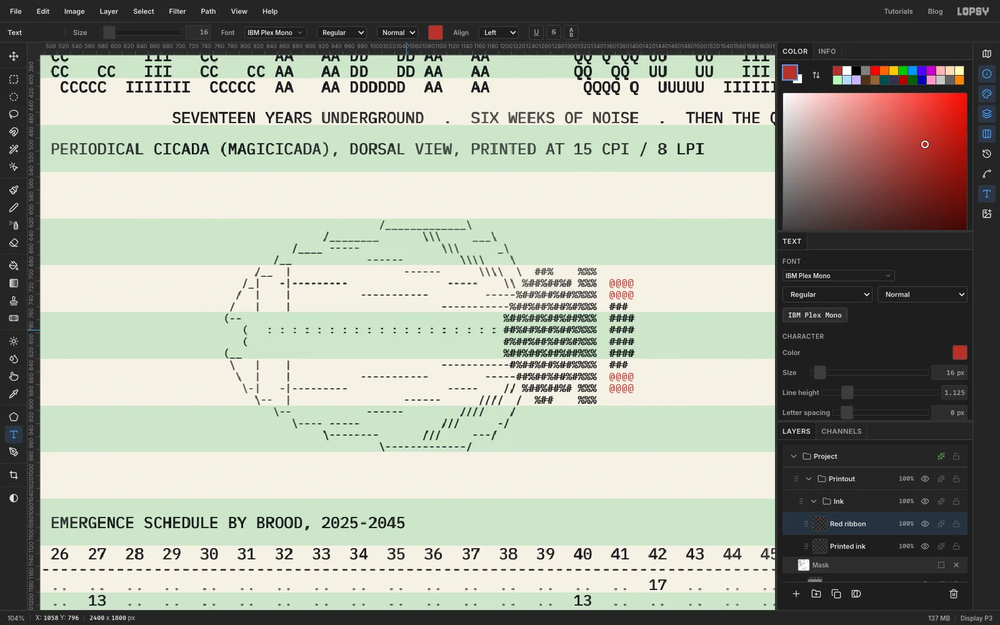

Many line printers had a two-colour ribbon. Use the red half for the eyes, the one feature that says "periodical cicada".

1. Select `Printed ink`, set the foreground to `#B8302A`, and set the **Text** tool's size to `16`.
2. In your editor, make a copy of the cicada drawing that keeps only the eyes: two rows of `@@@@` in each of the gaps you left on the head's corners, with everything else turned into spaces.
3. Click at the same spot you used for the cicada plot and paste it. Set **Line height** to `1.125`.
4. Rename it `Red ribbon`, click **Rasterize Layer**, and set it to **Multiply**.

## Highlight the quiet years

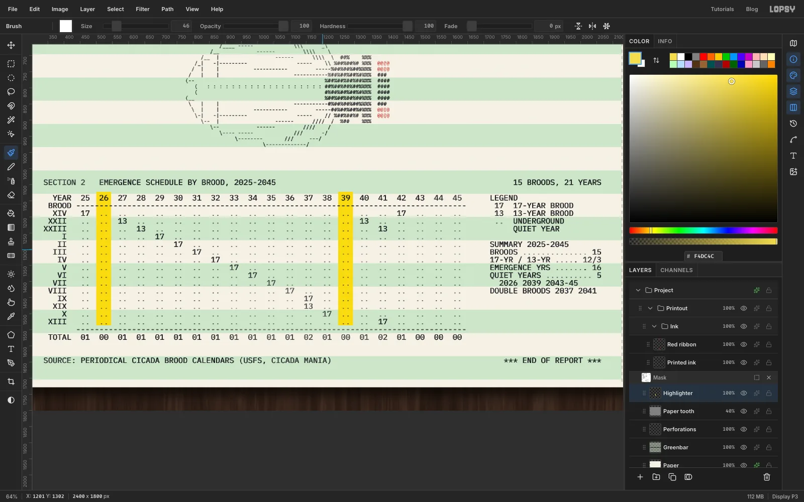

1. Select `Paper tooth` and add a layer called `Highlighter`. It sits under the ink, so the type stays crisp on top.
2. Pick the **Brush**, open the presets and choose **Square**. Set **Size** `46`, **Hardness** `100`.
3. Set the foreground to `#F4DC4C`. Click just above the 2026 heading, then **Shift**-click down at the dashed line above TOTAL. Do the same for 2039.

## Finish the highlighting

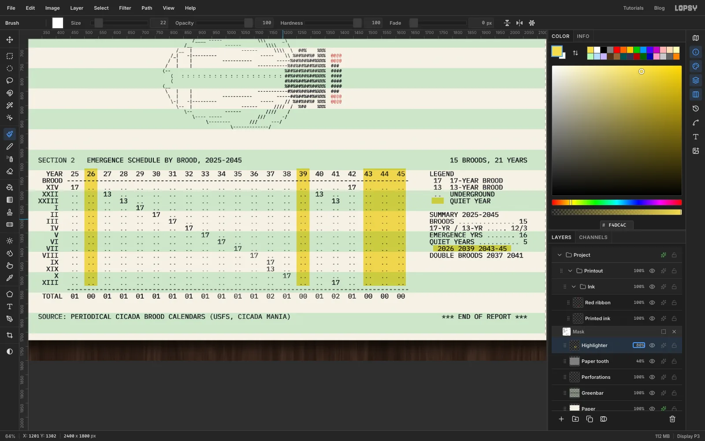

1. Change the **Size** to `150` and draw one wide stroke over the 2043, 2044 and 2045 columns, with the same top and bottom as the other two bars.
2. Set the **Size** to `22`. Draw a short stroke in the legend, in front of `QUIET YEAR`. That's the key.
3. Draw one more along the `2026 2039 2043-45` line in the summary.
4. Set the layer to **Multiply** at `80%`. The yellow turns olive over the green bands, like real highlighter.

## Circle the empty totals

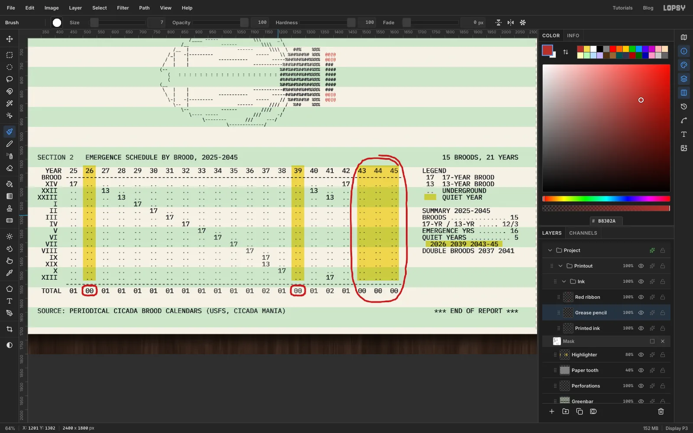

1. Select `Printed ink` and add a layer above it called `Grease pencil`.
2. Choose the **Hard Round** preset at **Size** `7` and set the foreground to `#B8302A`.
3. Draw a loose loop around the whole 2043–2045 block, from just above the year headings to below the `00 00 00` totals. Let the end overshoot the start, like a real pencil loop. Keep it in the gaps either side of the columns, so it doesn't cross `42` or `43`.
4. Draw small rings around the `00` totals under 2026 and 2039.
5. Draw a slightly wavy line under QUIET in the banner.

## Write the note

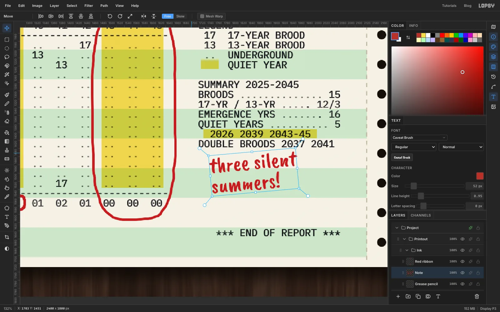

1. Pick the **Text** tool and choose **Caveat Brush** at size `52`. The foreground should still be the pencil red `#B8302A`.
2. Click in the empty space under the summary, type `three silent`, press [[Enter]], type `summers!` and press [[Tab]].
3. Rename the layer `Note` and set **Line height** to `0.95` so the two lines sit together.
4. With the **Move** tool, drag just outside a corner of the note's box to tilt it about 5° anticlockwise. Press [[Cmd+D]] to commit.

## Point the note at the loop

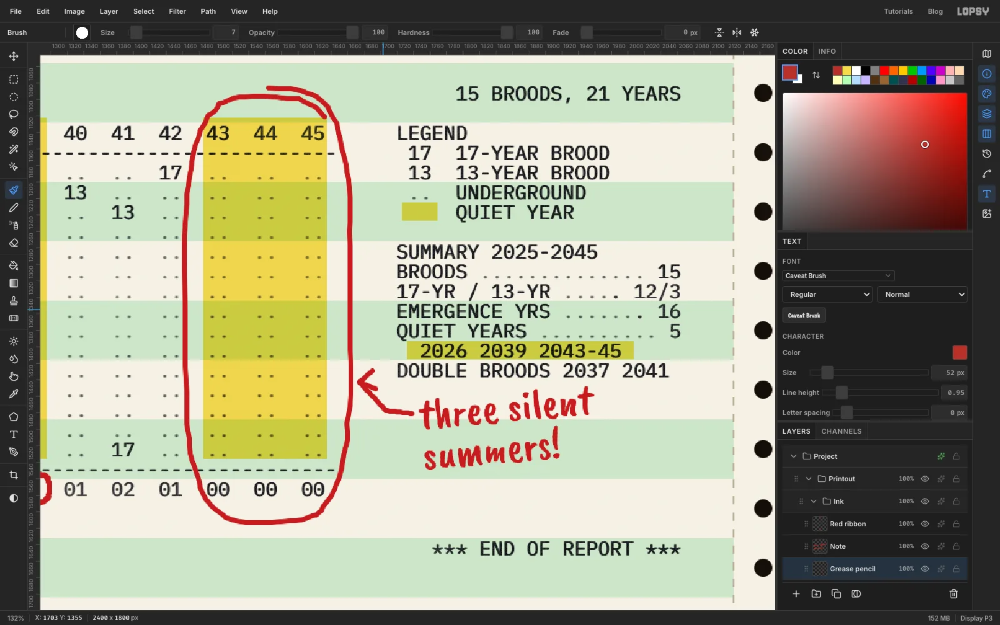

Select `Grease pencil` again and pick the **Brush**. Draw a short curve from the start of "three" to the right edge of the loop, then two short strokes for the arrowhead.

## Make the pencil skip like wax

The note is still crisp vector text. Make it the same pencil as the rings:

1. Select `Note`, click **Rasterize Layer** and press [[Cmd+E]] to merge it into `Grease pencil`. Set the layer's opacity to `90%`.
2. Click **Add Mask**, then the mask thumbnail.
3. Run **Add Noise…** at **Amount** `100` (**Mono**, **Uniform**), then **Filter → Threshold…** at **Level** `214`.
4. Click the layer's name to leave mask editing.

About a fifth of the mask turns black in tiny specks (the blue speckle in the screenshot is Lopsy's mask overlay), so the red skips over the paper grain the way wax does.

## Scale the printout

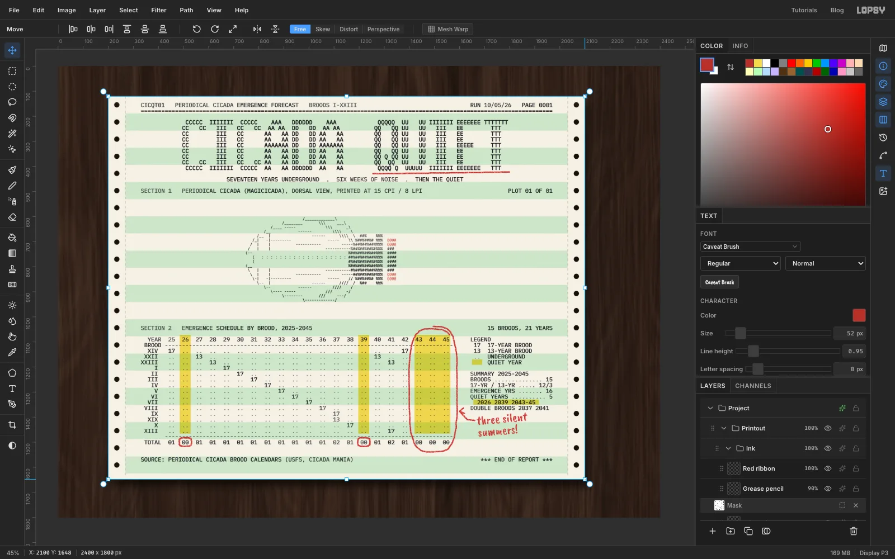

The sheet nearly touches the bottom of the canvas. Shrink and turn the whole group at once:

1. Click the `Printout` row and press [[Cmd+D]] so nothing is selected. The **Move** tool's handles now frame everything in the group.
2. Hold **Cmd** and drag the bottom-right handle up and to the left until the sheet is about 95% of its size. Cmd keeps the proportions.

## Turn the printout

Drag just outside the top-left corner handle to rotate the group a degree or two anticlockwise (1.6° here). A small tilt makes it look like a sheet that was dropped on the desk. Press [[Cmd+D]] to commit.

## Centre the sheet

With the **Move** tool, drag the group so the sheet sits in the middle and a little high, with wood showing on all four sides.

## Bring in a cicada photo

Find a dorsal (top-down) photo of a periodical cicada on a plain dark background. The USGS Bee Lab's public-domain specimen photos are ideal. This one is a *Magicicada cassini*, about 1200 px wide.

1. Click the `Printout` row, so the photo lands at the top of the group.
2. Copy the image in your browser and press [[Cmd+V]] in Lopsy. It arrives as a new layer at the top-left. Rename it `Specimen photo`.

## Select the cicada

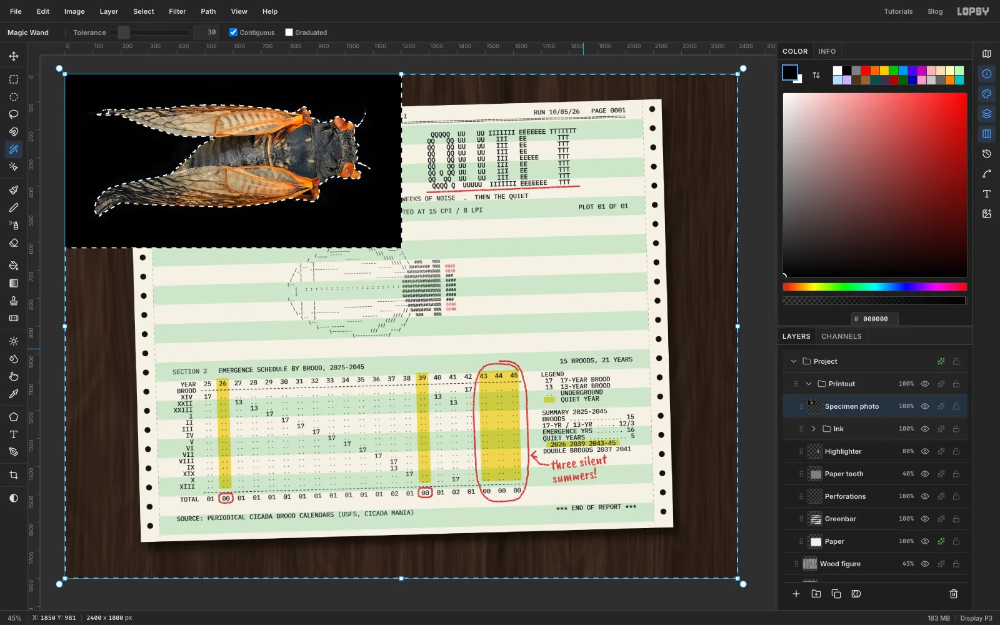

1. Pick the **Magic Wand**, set **Tolerance** to `30` with **Contiguous** on, and click the black background.
2. Choose **Select → Inverse** to select the cicada instead.
3. Choose **Select → Shrink…** by `1` and **Select → Feather…** by `1` to clean the edge.
4. Press [[Cmd+X]] then [[Cmd+V]] to lift the cicada onto its own layer, in place. Rename it `Cicada` and deselect.
5. Click the `Specimen photo` row and delete it with the trash button.

## Separate the body from the wings

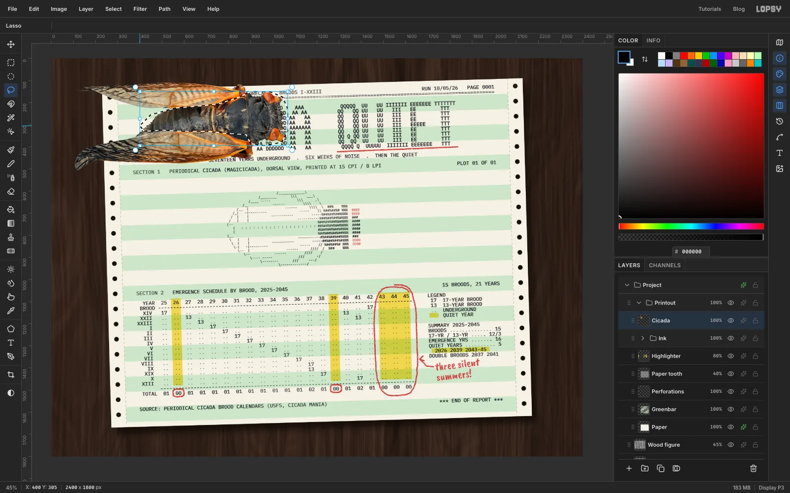

Cicada wings are clear. On the black background they look solid, so they need to let the paper through.

With the **Lasso**, draw around the body only: the head and eyes, the thorax, and the strip of abdomen between the two wings.

## Make the wings see-through

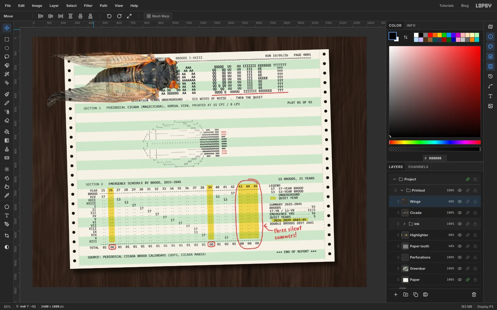

1. Choose **Select → Inverse**, so everything except the body is selected.
2. Press [[Cmd+X]] then [[Cmd+V]]. The wings land on a new layer in place. Rename it `Wings` and set its opacity to `60%`.

## Scale both layers together

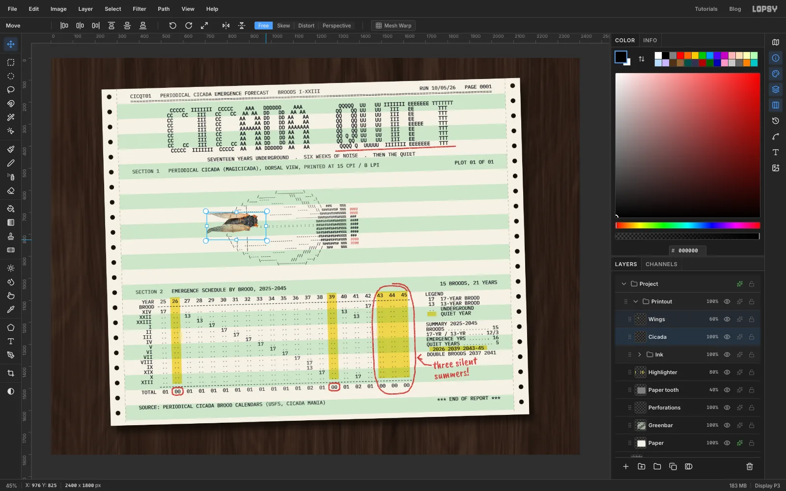

1. Click `Cicada`, then **Shift**-click `Wings`, so both are selected.
2. With the **Move** tool, drag them into the middle of the canvas, where there's room to work.
3. **Cmd**-drag a corner handle until the cicada is about a quarter of its size, about 240 px long.
4. Drag outside a corner to rotate it about 5° clockwise, so its body lines up with the ASCII drawing. Press [[Cmd+D]].

## Place it and give it a shadow

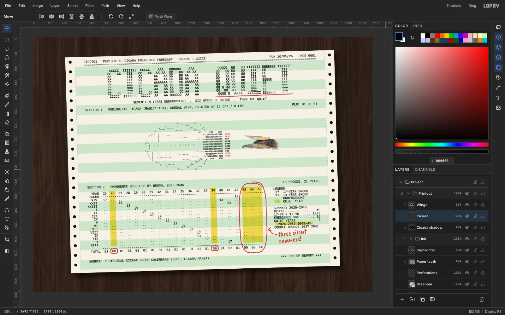

1. Drag the cicada onto the paper, to the right of the ASCII cicada and facing the same way.
2. Select `Cicada`, duplicate it, and select the original underneath. Rename it `Cicada shadow`.
3. **Cmd**-click its thumbnail, set the foreground to black, choose **Edit → Fill** and deselect.
4. Run **Gaussian Blur…** with **Radius** `16`. With the **Move** tool, press [[Shift+→]] twice and [[Shift+↓]] twice to push it 20 px down and right, and set its opacity to `40%`.
5. Rename the copy back to `Cicada` and give it a small **Drop Shadow** (**Offset** `4, 6`, **Blur** `5`, **Opacity** `70`) for the contact shadow.

## Light it with a desk lamp

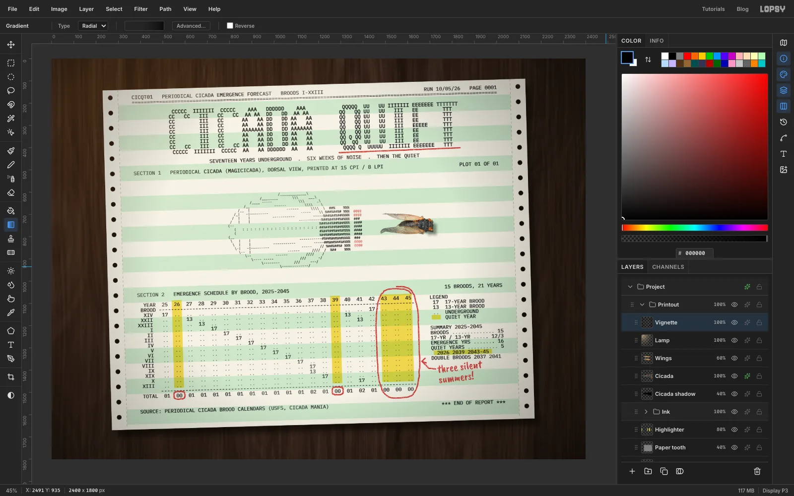

1. Select `Wings` and add a layer called `Lamp`. Pick the **Gradient** tool, set it to **Radial**, and open **Advanced…**. Make the stops `#FFD9A0` at 55% opacity, 20% halfway, and 0% at the end.
2. Drag from the top-left of the desk toward the middle of the sheet, and set the layer to **Soft Light**.
3. Add a layer called `Vignette` with a radial gradient: transparent black in the middle, about 30% at three-quarters of the way, and about 70% at the edge. Drag from the middle of the sheet to past the bottom-right corner, then set it to **Multiply**.

Keep the lamp's hotspot over the wood, not the banner. Soft Light lifts dark ink, and the title should stay the blackest thing on the page.
