Dutch flower painters of the 1600s put impossible bouquets on stone ledges and pulled them out of the dark with one raking light. Luxury perfume ads still borrow that look. This tutorial builds a 48-sheet (3:1) billboard for a made-up fragrance, *Duchess Peony* by *Maison Verdelet*, in the same spirit:
- real peony photos, lassoed out, darkened and warmed into a painted palette
- a crystal flacon, velvet curtain and bronze vase drawn entirely with gradients
- pearls painted with a colour brush made from one pearl
- gilded baroque type, with the retail line inlaid in the ledge

The peonies are six CC0 photos by Daderot on Wikimedia Commons: `Tree peony - Arlington, MA - 04.jpg` (crimson), `Tree peony - Arlington, MA - 01.jpg` (pink), and `Peony - Arlington, MA - 13.jpg`, `05.jpg`, `14.jpg` and `03.jpg` (blush, cream, coral and the bud). Crop each one tight around the flower and scale it to roughly 300–470 px wide before you start.

The palette:

- Umber ground `#0C0806` → `#2E1C10` → `#6A4428`
- Velvet `#4A0C14`, fold light `#8A2A38`
- Bronze `#24160A` → `#7A5228` → `#E0B464` → `#1A1006`
- Gold `#3A2408` → `#B8862A` → `#F4DA8E` → `#7A5418` → `#C99A3A`
- Amber juice `#3A1A06` → `#D8962E` → `#241004`, label `#2A0409`
- Pearl `#FFFFFF` → `#FBF3E8` → `#C9B8A0` → `#4A3E32`

The light comes from the upper left in every step. Keep it that way, and the photos and the drawn objects will sit in the same room.

## Lay down the dark ground and a Rembrandt light

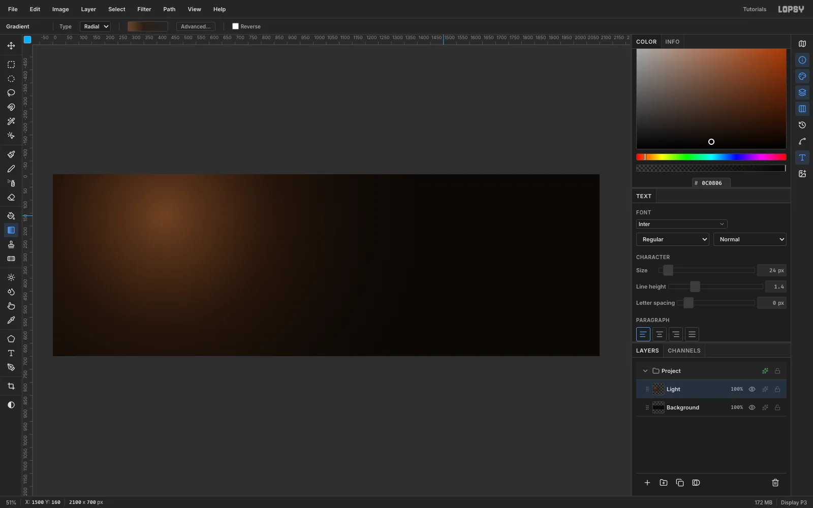

1. Create a **2100 × 700 px** document (**File → New**, Unit = Pixels).
2. Fill the Background with `#0C0806` (**Edit → Fill** with nothing selected).
3. Rename `Layer 1` to `Light`. Pick the **Gradient** tool, set **Type** to **Radial**, and open **Advanced…**.
4. Set three stops: `#6A4428` at full opacity, `#2E1C10` at 70% in the middle, and `#0C0806` at 0% on the right.
5. Drag from **(430, 160)** out about **1,070 px** to the right.

The transparent end stop is what makes this a glow: the gradient composites over the black instead of replacing it.

## Hang a velvet curtain with a gold tie-back

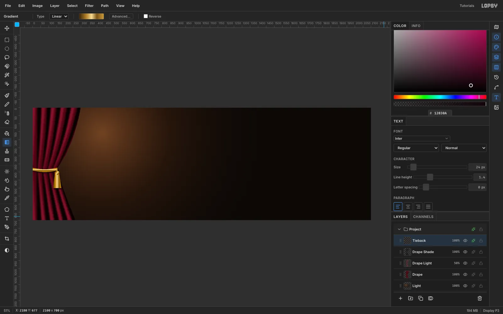

1. On a new layer `Drape`, lasso the curtain's outline. It runs from the top-left corner, curves in to about x 150 at y 380 (the tie point), and flares back out to x 270 at the bottom. Fill it with `#4A0C14`.
2. On `Drape Light`, lasso five narrow bands that start wide at the top, pinch to 6 px at the tie point and widen again below. Put them on the **left** side of each fold, facing the light. Fill them with `#8A2A38`.
3. Run **Gaussian Blur** at radius **14**. Lasso the outline again, **Select → Inverse**, and press [[Delete]] so nothing spills past the curtain. Set the layer to **Screen** at **50%**.
4. Repeat on `Drape Shade` with darker bands on the right of each fold, filled `#12030A`, blurred **12**, clipped and set to **Multiply**.
5. On `Tieback`, lasso a cord that dips as it reaches the tie point, then a small rope, a tassel cap and a flared tassel. Fill each with the five-stop gold gradient, dragged across its short side.
6. Give `Tieback` a **Drop Shadow** (offset 4, 7, blur 8, 70%).

## Build a stone ledge

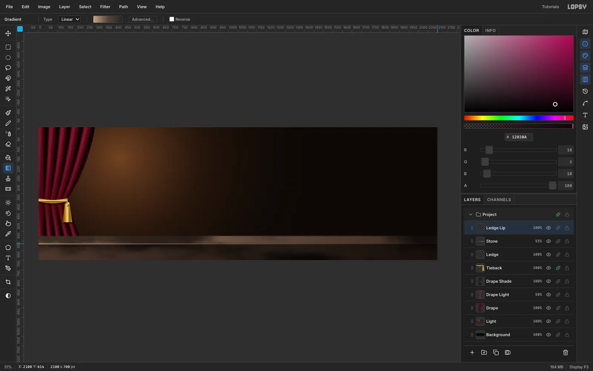

1. On `Ledge`, marquee **y 572–614** across the whole width and drag a linear gradient left to right from `#7A6450` to `#231B16`. That's the top plane, lit from the left.
2. Marquee **y 614–700** and drag `#30251E` to `#0E0A08` for the front face.
3. On `Stone`, select the whole ledge and run **Filter → Clouds** (Scale 6) and **Add Noise** (22). Set it to **Overlay** at **55%**.
4. On `Ledge Lip`, fill a 4 px strip at y 612–616 with a gradient from pale `#C4A482` to transparent. That edge catches the light.

## Draw the foliage, stems and a fluted bronze tazza

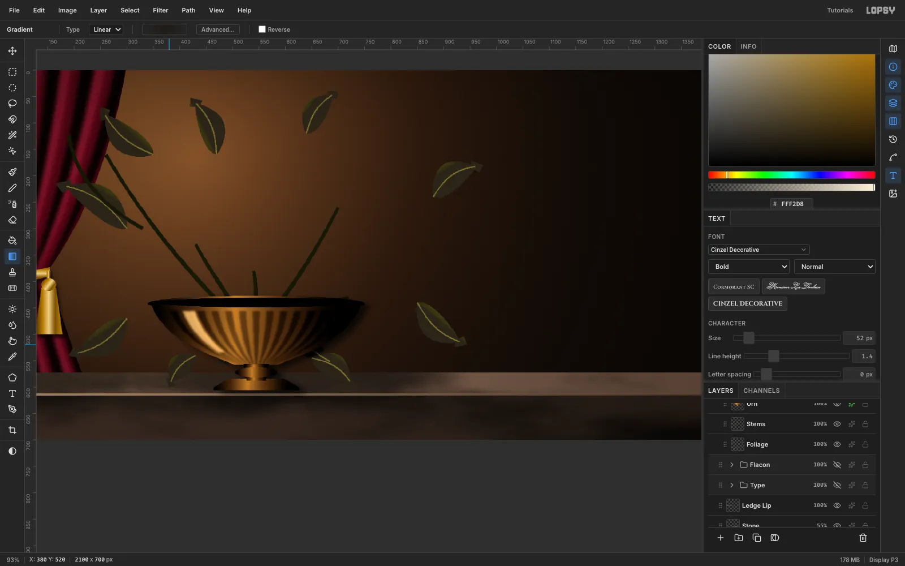

1. On `Foliage`, lasso about a dozen pointed peony leaves around where the bouquet will sit. Drag an olive gradient (`#71823C` → `#1A240E`) across each leaf, pale side toward the light. Then paint a thin midrib down each one with a small hard **Brush**.
2. On `Stems`, lasso narrow tapering ribbons from the bowl's mouth up to where each flower will sit, and fill them `#34421C`.
3. On `Urn`, lasso the bowl (about 400 px wide, rim at y 440), the knop, the stem and the foot. Fill each with the bronze gradient, dragged across its width. Add a dark ellipse for the mouth and a **Drop Shadow** (12, 6, blur 16).
4. On `Urn Flutes`, draw thirteen thin vertical lines across the bowl in `#2A1A0A` with the **Pencil**: click at the top of each and [[Cmd+Shift]]-click at the bottom to keep it upright. Blur them **5**, clip them to the bowl, and set the layer to **Multiply** at **40%**. That gives the bowl its gadroons.
5. On `Urn Shine`, fill one pale strip on the left of the bowl, blur it **6**, clip it, and set it to **Screen** at 70%.

Most of this ends up behind flowers. It still has to be there, or the bouquet floats.

## Paste the first peony photo

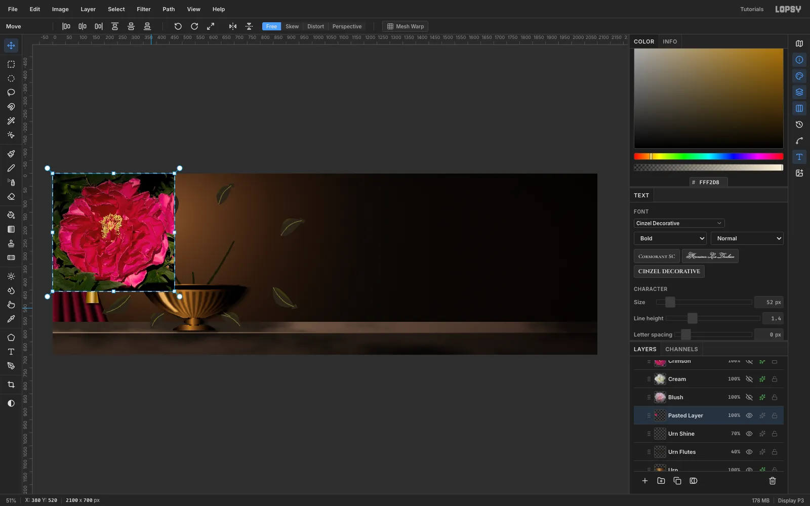

1. Click `Urn Shine` so the photo lands above it, then copy the crimson peony photo and press [[Cmd+V]].
2. The paste arrives at the top-left, auto-selected, with the Move tool active. Press [[Cmd+D]] to commit it, and rename the layer `Crimson`.

## Trace the flower with the Lasso

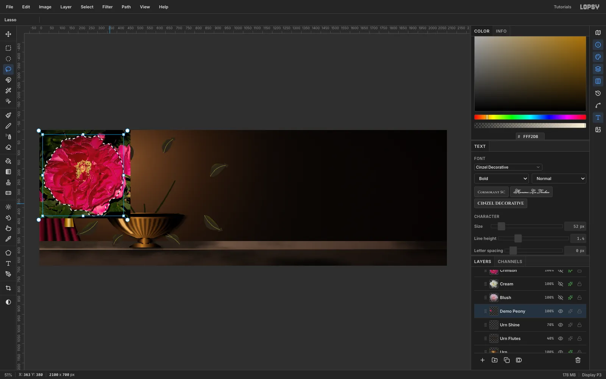

Pick the **Lasso** and trace just outside the petals. The leaves are dark and busy, so **Quick Selection** tends to leak into them. A careful lasso gives a cleaner edge, and it's what an old master's silhouette needs anyway.

## Cut the peony out

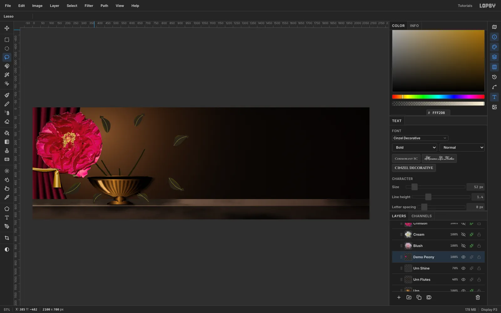

1. Run **Select → Feather…** with **Radius 1** so the edge doesn't stair-step.
2. Run **Select → Inverse**, press [[Delete]], then [[Cmd+D]].

## Scale it down with a Cmd-drag

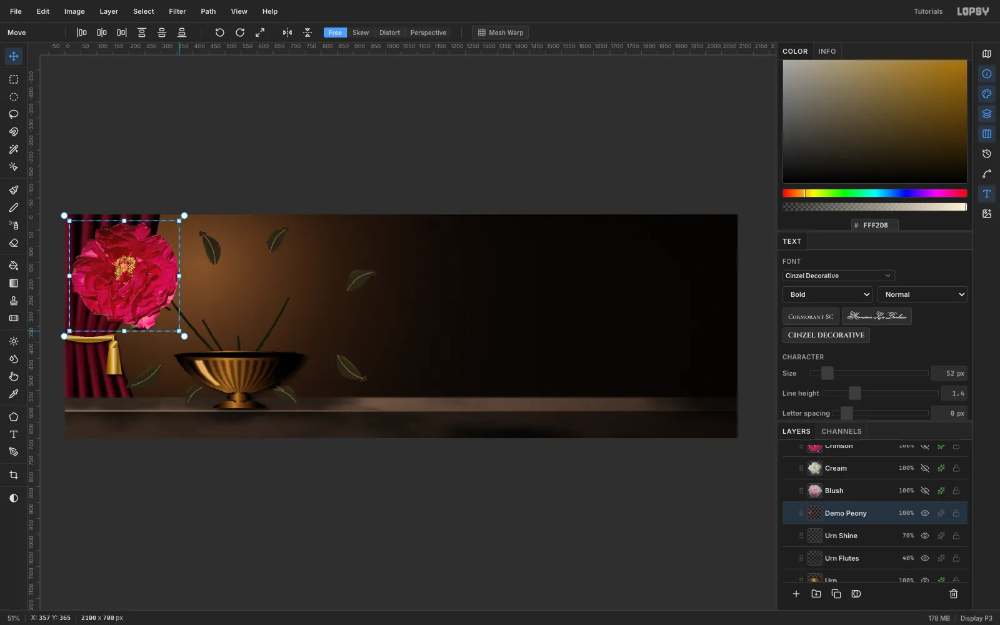

1. Draw a rectangular marquee just outside the flower and switch to the **Move** tool.
2. Hold [[Cmd]] and drag the bottom-right handle inward. [[Cmd]] keeps the proportions, and the opposite corner stays pinned.
3. Stop at about **81%**: the crimson bloom goes from 418 to 338 px wide.
4. Drag inside the box so the flower's centre sits at about **(545, 300)**, right over the tazza, and press [[Cmd+D]].

## Rotate and arrange the bouquet

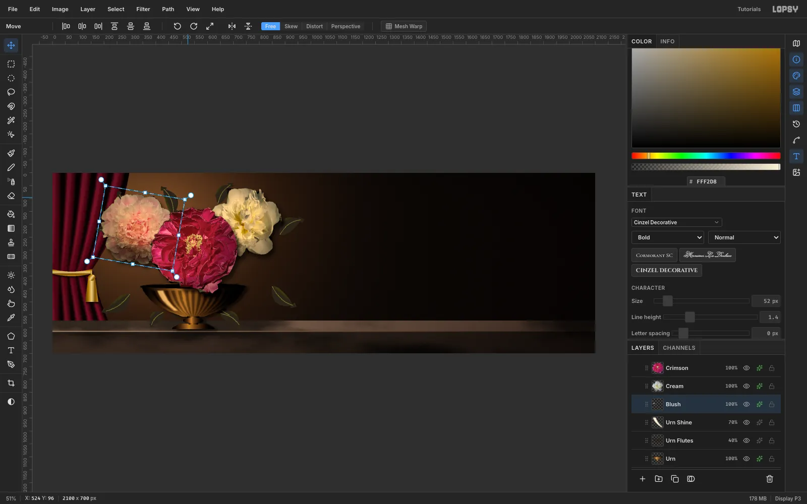

Repeat the paste, lasso and scale steps for the other five photos, and give each one a turn so no two blooms face the camera the same way:
1. Marquee the flower with the Move tool active.
2. Grab just outside the top-right corner (the cursor becomes a crosshair) and drag around.
3. Press [[Cmd+D]].

Stack them back to front: cream, blush, crimson, coral, pink, bud. Use these centres, scales and turns:
- **Cream:** (745, 190), 80%, −8°
- **Blush:** (335, 215), 77%, +10°
- **Crimson:** (545, 300), 81%
- **Coral:** (755, 420), 81%, −12°
- **Pink:** (335, 430), 79%, +15°, overlapping the rim
- **Bud:** (185, 95), 85%, +35°

## Add cast shadows and burn the shadow sides

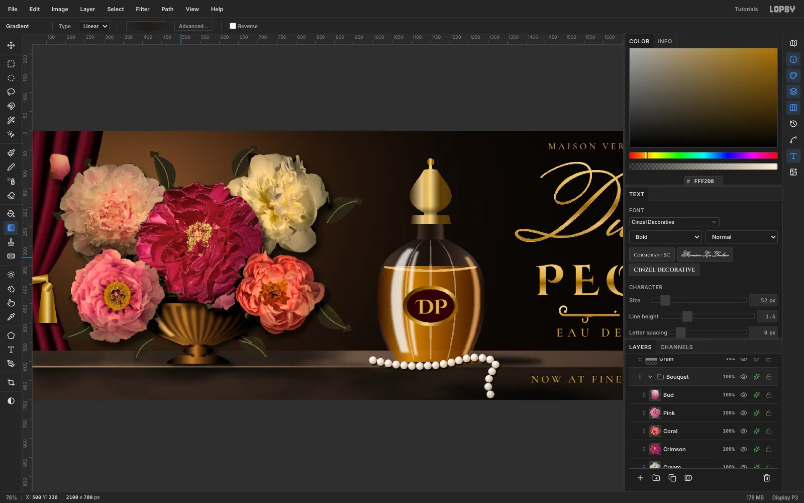

1. Shift-click `Foliage` through `Bud` in the Layers panel and choose **Layer → Group Layers**. Name the group `Bouquet`.
2. Give each flower a **Drop Shadow**: colour `#0A0402`, offset **10, 14**, blur **22**, opacity **65%**. Shadows falling onto the blooms behind are what turn five discs into a bouquet.
3. Pick **Dodge/Burn** and set **Mode** to **Burn**, **Exposure** to **26** and **Size** to **130**. On each flower's layer, sweep one stroke along the lower-right edge, away from the light.
4. Run **Filter → Hue/Saturation…** on `Crimson` (Saturation −25) and `Pink` (Saturation −20, Lightness −5). Run it on `Foliage` as well (Lightness −30, then +25) to push the leaves into shade.

## Grade the whole bouquet with group adjustments

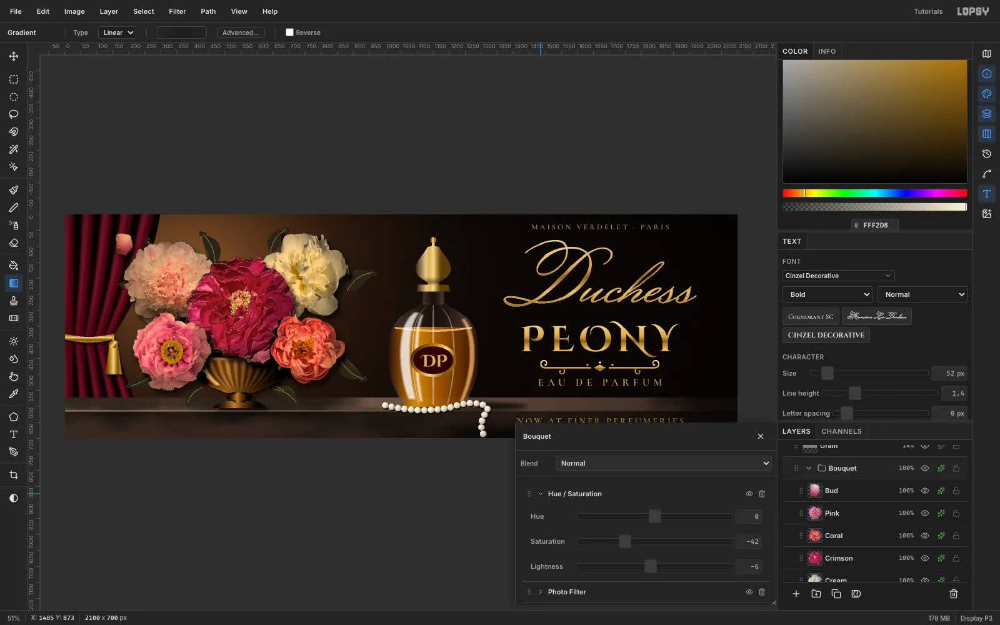

Open the group's effects (the ✦ button on the `Bouquet` row) and add three adjustments:
- **Hue / Saturation:** Saturation **−42**, Lightness **−6**
- **Photo Filter:** Density **40** (the default warm amber)
- **Contrast:** **+18**

This single step turns bright garden photos into a warm, muted palette. It also affects the tazza and leaves inside the group, so they all shift together.

## Draw a crystal flacon with amber juice

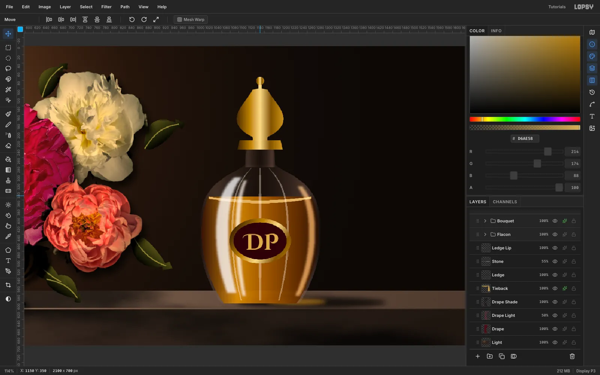

Build each part with a lasso fill or gradient on its own layer, bottom to top:
1. **Shadow:** an ellipse under and right of the bottle, **Feather** 12, filled black at 75%. Add a smaller amber ellipse on **Screen** for the light that shines through the juice.
2. **Glass:** the bottle body (about 286 × 330 px, shoulders at y 330). Drag a gradient that's dark and nearly opaque at both edges and almost clear in the middle, so the wall behind shows through.
3. **Liquid:** the body from y 392 down, filled `#3A1A06` → `#D8962E` → `#241004`, plus a pale meniscus band on top. Amber, not crimson: the bottle has to separate from the red peony.
4. **Facets:** three hairlines following the curve. Drag a few **Pen** anchors along it and press [[Enter]] to stroke each at a thin width, then set the layer to **Screen** at 38%.
5. **Highlights:** two long streaks on the lit side and a warm rim on the right. Blur them **7**, clip them to the body, and set **Screen** at 75%.
6. **Gold:** the collar, teardrop stopper, finial and label ring, all filled with the gold gradient. Then an oxblood oval for the label.
7. **Monogram:** type `DP` in **Cinzel Decorative Bold**, 52 px, gold, centred on the label.

## Give the stopper facets

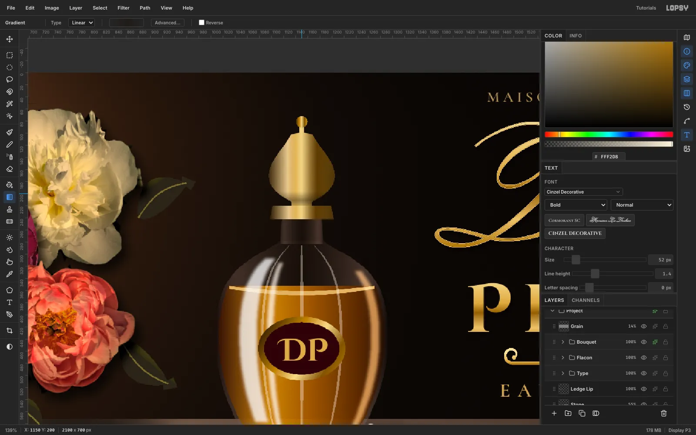

A flat gold fill reads as a playing-card spade. On a new layer `Stopper Facets`:
1. Lasso the stopper again and drag a horizontal gradient: dark at 55%, then a highlight at 60%, then clear, then dark again at 75% on the right. Do the same on the collar.
2. Add a faint vertical gradient band across the bulb for a bevel.

## Make a pearl brush

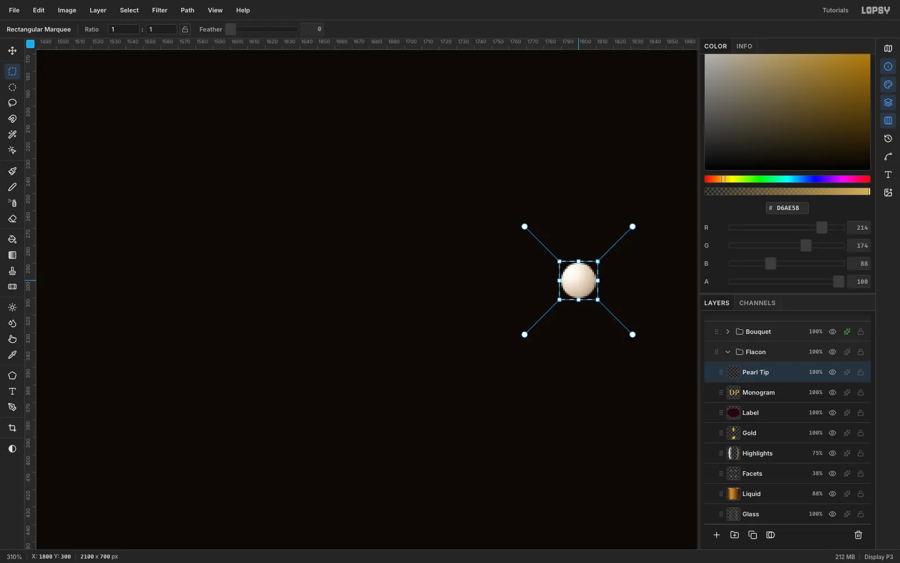

1. On a scratch layer in an empty area, make a **20 px** elliptical selection.
2. Drag a **radial** gradient from just above-left of centre: `#FFFFFF`, `#FBF3E8`, `#C9B8A0`, `#7A6A58`, `#4A3E32`.
3. Marquee a square around the pearl and choose **Edit → Define Color Brush…**. Name it `Pearl`, then delete the scratch layer.
4. Open the **Brushes** panel. On the **Shape** tab, set **Spacing** to **104%**. The tip keeps its full colour, so every dab is a shaded pearl.

## Paint the pearl strand

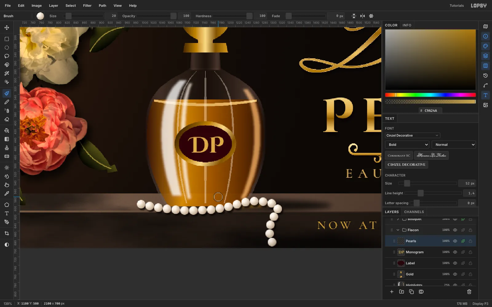

1. Add a layer `Pearls` above the monogram.
2. With the Pearl brush at Size 20, paint one slow stroke. Start in front of the bottle's foot, curve across the top of the ledge, loop back near x 1310, then roll over the lip and hang down the front face.
3. Give it a **Drop Shadow** (3, 4, blur 4, 80%). That's the contact shadow on the stone.

Keep the path on the ledge until it reaches the edge. Pearls hanging in mid-air look wrong immediately.

## Set the gold type on a centre guide

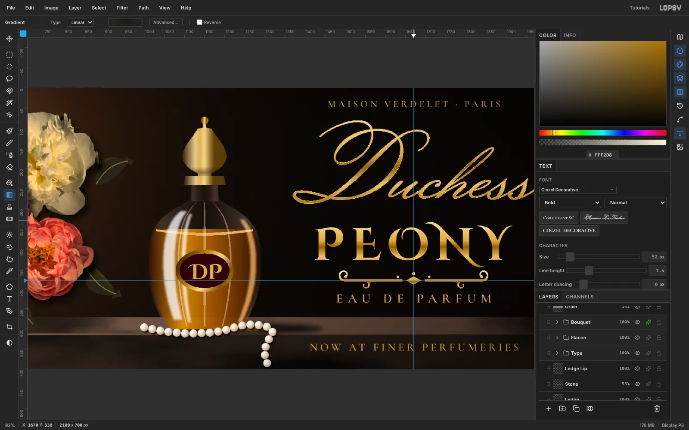

1. Click the top ruler at **x 1670** for a vertical guide, and the left ruler at **y 480** for the ornament's baseline.
2. Click `Pearls` before you set up each text. Create it in empty canvas and then move it into place, bottom line first.
   - **Eau de Parfum:** **Cormorant SC SemiBold** 32 px, letter spacing 12
   - **PEONY:** **Cinzel Decorative Bold** 112 px, spacing 16
   - **Duchess:** **Monsieur La Doulaise** 212 px, spacing 0
   - **Maison Verdelet · Paris:** Cormorant SC SemiBold 24 px, spacing 6
3. Centre each on x 1670. Leave about 45 px between the script and PEONY, and keep the D's swash more than 100 px from the right edge.
4. To gild the two titles, [[Cmd]]-click the text layer's thumbnail to load its shape as a selection. Add a layer above it and drag a vertical five-stop gold gradient from the top of the letters to the bottom. Hide the original text.
5. Give the PEONY gold layer a **Drop Shadow** (3, 6, blur 8, 85%). Give the script's gold layer a **Stroke** of 1 px `#E6C270`, so its hairlines hold up at a distance, and a **Drop Shadow** of (2, 5, blur 8, 85%).
6. Draw the scroll ornament as lasso ribbons: a centre lozenge, tapering rules and C-scroll volutes, mirrored. Fill it gold and gradient it the same way.

## Inlay the retail line in the ledge

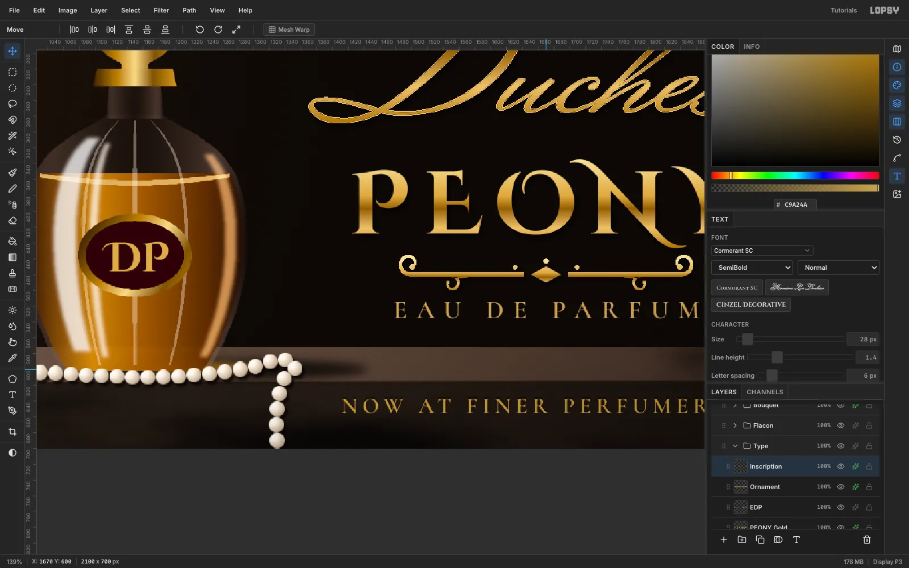

1. Type `NOW AT FINER PERFUMERIES` in Cormorant SC SemiBold, 28 px, letter spacing 6.
2. Add a **Color Overlay** of `#C9A24A`, and a **Drop Shadow** of `#070403` with offset **0, −2** and blur **0**.

The upward shadow darkens the top edge of every letter, as if it were cut into the stone. Centre the line on x 1670 and at y 645, the middle of the face.

## Finish the light, grain and vignette

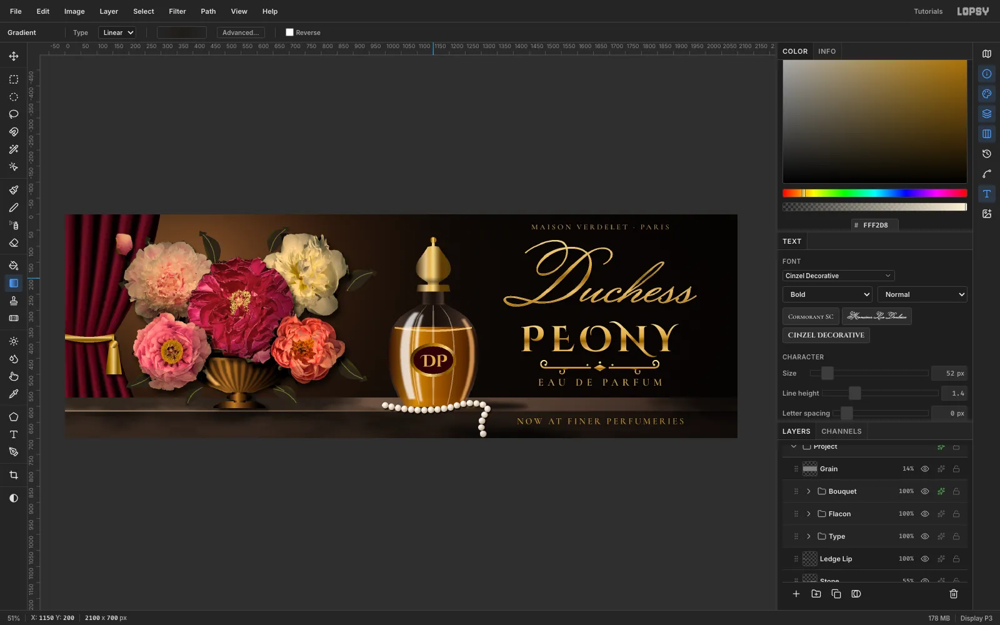

1. Above `Light`, add `Right Shade`, a linear gradient from transparent at x 1000 to `#030201` at 65% on the right edge. The gold type then sits in real darkness.
2. Add `Raking Light`, a radial gradient from `#7A4E28` at (200, 40) fading out by about x 1150, on **Screen** at 55%.
3. At the top of the stack, add `Grain`: fill it `#808080`, run **Add Noise** 40 **Mono**, and set it to **Overlay** at 14%.
4. Last, select the root `Project` group and add a **Vignette** adjustment at **38**.

Export with **File → Quick Export PNG**, and save the layered file with **File → Save Project**.
