Baroque design is about drama:

- deep shadows with warm light coming out of them (*chiaroscuro*)
- gold ornament that curls and repeats
- a centrepiece that looks like an old-master painting

In this tutorial you'll make a 1000 × 1400 px menu for **Quince & Elderberry**,
an imaginary candle-lit osteria. It has:

- a damask wallpaper made with the **Kaleidoscope** filter and **Pattern Fill**
- a triple gilded frame
- acanthus corners painted with **4-way symmetry**
- flipped shell crests
- a crimson cartouche snapped to the **grid**
- curved text on a **Pen** path
- a velvet-and-quince still life, shaded with **Dodge/Burn**, **Oil Paint** and cast shadows
- a two-column menu with a right-aligned price column

The palette:

- near-black oxblood ground `#140B09`
- a gold ramp: `#7A5418`, `#D9B25F` and `#F3DE9C`
- crimson `#4A0F1C` and `#8A2033`
- quince yellow `#C99A2E`
- elderberry purple `#2A0A34`
- olive `#4F5B23`

> **Tip:** Every text layer takes its settings from the Text panel, and those
> values carry over to the next text you type. Check **Letter spacing** and
> **Line height** every time you make a new text layer.

## Lay a dark ground with a warm glow

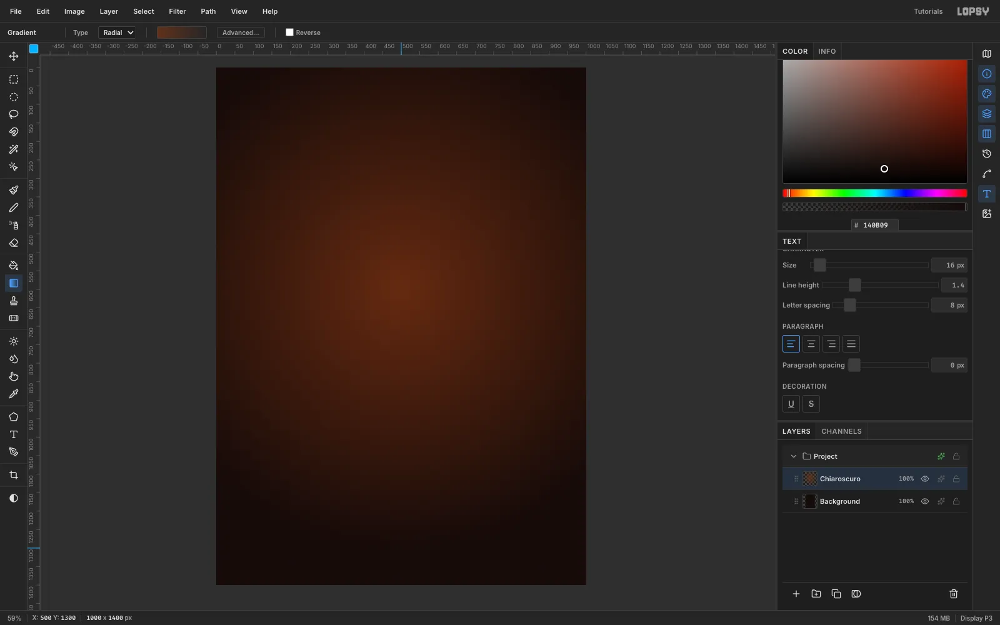

Create a **1000 × 1400** document with a white background. Select
`Background`, set the foreground to `#140B09` and choose **Edit → Fill**.

Rename `Layer 1` to `Chiaroscuro`. Choose the **Gradient** tool, set **Type**
to **Radial** and click **Advanced…**:

- Make both stops `#6B3219`.
- Drag the first stop's opacity to about 85% and the second stop's opacity to 0.
- Click **Done**.

Drag from (500, 600) down to (500, 1300). This is the pool of candlelight
that everything else will sit in.

## Sketch one wedge of a rosette

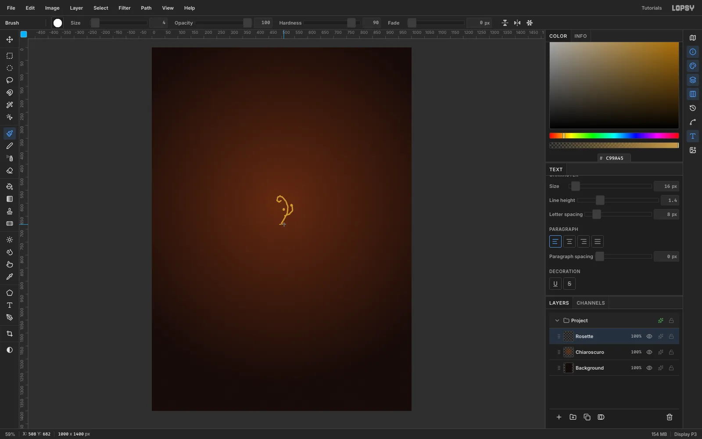

Add a layer called `Rosette`. Choose the **Brush** ([[B]]) with colour
`#C99A45`, **Size** `6` and **Hardness** `90`. From the canvas centre
(500, 700), draw straight **up**:

- a scroll about 130 px tall that curls over at the top
- a small side frond
- two size-11 dots

Keep all of it inside a narrow wedge above the centre. The Kaleidoscope only
samples a thin slice of the image.

## Mirror it with the Kaleidoscope filter

Choose **Filter → Kaleidoscope…**, set **Segments** to `10` and **Rotation**
to `270`, then click **Apply**. A rotation of 270° points the sampled wedge
straight up, where you drew. At 0° it samples to the right of the centre and
gives an empty layer.

On a portrait canvas the rosette comes out about 1.4× taller than it is
wide. That's the next thing to fix.

## Squash the rosette round

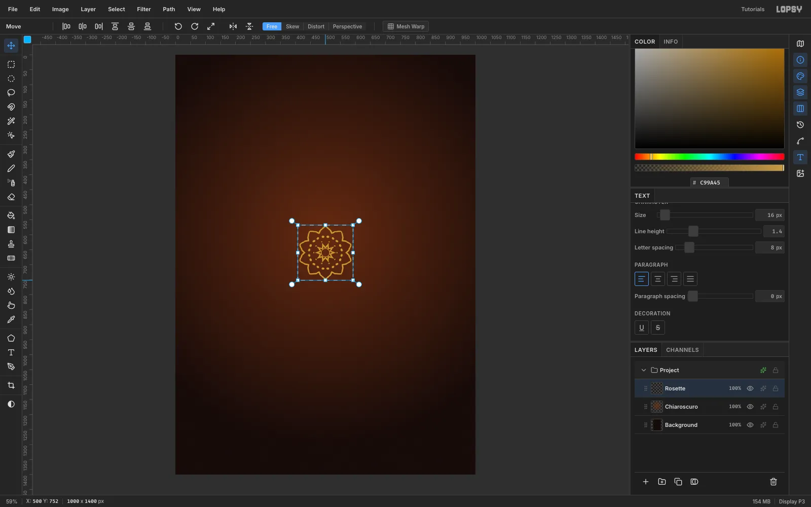

With the **Rectangular Marquee** ([[M]]), select (408, 568) to (592, 832).
Press [[V]] for the Move tool. Drag the **bottom-middle** handle up to
y = `752`, so the box is 184 px square. Press [[Cmd+D]] to commit.

## Turn it into a half-drop damask

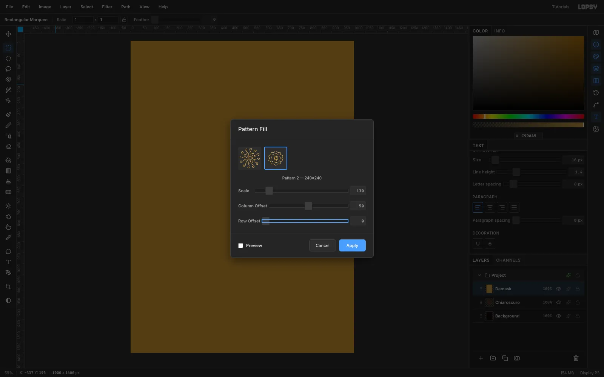

1. Marquee a 240 × 240 tile around the rosette, from (380, 540), and choose
   **Edit → Define Pattern**.
2. Deselect and delete the `Rosette` layer.
3. Add a layer called `Damask`. With no selection, choose **Edit → Fill** so
   the layer covers the whole canvas.
4. Choose **Edit → Fill with Pattern…**. Set **Scale** to `130` and
   **Column Offset** to `50` for a classic half-drop repeat, then click
   **Apply**.

## Knock the damask back

Open the `Damask` layer's effects button and set **Blend** to **Soft Light**.
Click its opacity (`100%`) in the Layers panel and click the slider at about
**60%**. The wallpaper should whisper, not compete with the menu.

## Cut three gilt rings

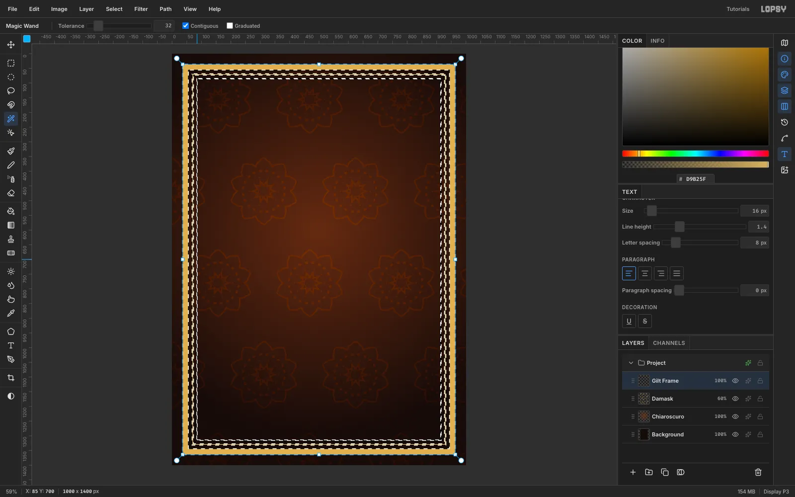

Add a layer called `Gilt Frame` and set the foreground to `#D9B25F`. Press
[[Cmd+D]] before every marquee: a drag that starts inside a live selection
moves the outline instead of drawing a new one.

1. Marquee (36, 36) to (964, 1364) and choose **Edit → Fill**. Then marquee
   (56, 56) to (944, 1344) and press [[Delete]].
2. Fill (68, 68) to (932, 1332), then delete (73, 73) to (927, 1327).
3. Fill (84, 84) to (916, 1316), then delete (86, 86) to (914, 1314).

Choose the **Magic Wand** ([[W]]). Click the outer ring, then
[[Shift]]-click the two inner rings to add them to the selection.

## Gild the frame

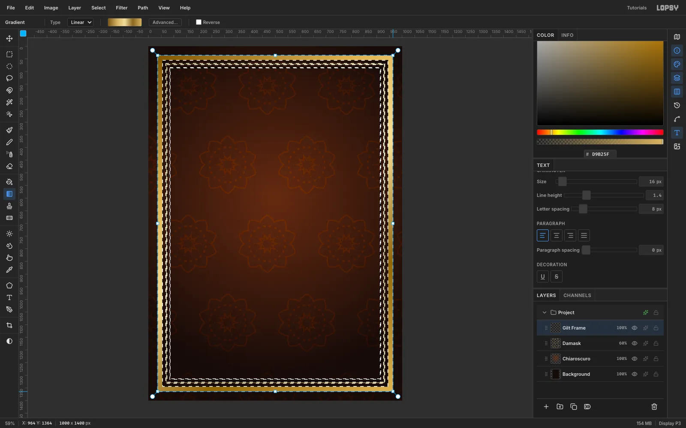

Choose the **Gradient** tool, set **Type** to **Linear**, and in
**Advanced…** set five stops:

- 0%: `#7A5418`
- 28%: `#D9B25F`
- 50%: `#F3DE9C`
- 74%: `#8C6420`
- 100%: `#D9B25F`

Drag from the top-left corner (36, 36) to the bottom-right (964, 1364). The
gradient only lands inside the wand selection.

Deselect, then add three layer effects:

- **Drop Shadow**: X `3`, Y `5`, Blur `8`, Opacity `75`, colour `#050201`
- **Stroke**: Width `2`, colour `#3A2208`
- **Inner Glow**: Size `4`, Opacity `55`, colour `#FFF1C4`, for a polished edge

## Paint acanthus corners with 4-way symmetry

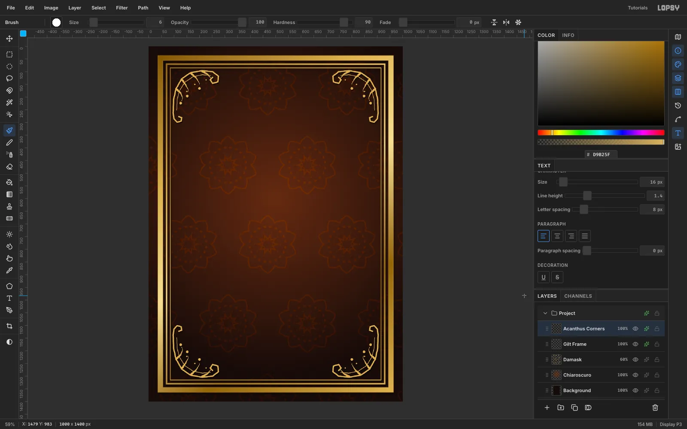

Add a layer called `Acanthus Corners`. Choose the Brush with `#D9B25F` and
Hardness `90`, and turn on both **Symmetry Horizontal** and
**Symmetry Vertical** in the options bar. Every stroke in the top-left corner
now appears in all four.

1. At **Size** `6`, draw a big C-scroll from (96, 262) up and around to
   (252, 100), and finish with a small volute.
2. Add a curl at the bottom end.
3. At Size `2.8`, draw an echo line just inside it.
4. Open the brush presets, set **Taper** to `60`, and draw a few short
   size-9 leaf ribs across the scroll.
5. Set Taper back to `0` and add size-11 and size-6 dots.

Turn symmetry off, then add:

- **Drop Shadow**: X `2`, Y `4`, Blur `5`, Opacity `75`
- **Inner Glow**: Size `2`, Opacity `70`, colour `#F3DE9C`

## Add a shell crest

Add a layer called `Crest`.

1. With the **Lasso** ([[L]]), trace a half-disc 46 px in radius sitting on
   (500, 88) and opening upwards.
2. Fill it with a **Radial** gradient: `#8C6420`, `#F3DE9C` at 35%, `#D9B25F`
   at 70% and `#7A5418`. Drag from (500, 88) to (500, 38).
3. Brush the ribs in `#5C3D0E` at Size `2.8`. Click the hinge at (500, 84),
   then [[Shift]]-click seven points around the arc; each Shift-click draws a
   straight line.
4. Add a `#F3DE9C` boss dot at Size `7`.
5. Give it a Drop Shadow (Y `5`, Blur `8`) and a 2 px `#3A2208` Stroke.

## Duplicate and flip the crest

With the Move tool active, click **Duplicate Layer**, then click the
`Crest copy` row so it's the only selected layer. Marquee tightly around the
copy and click **Flip Vertical** in the Move options bar. Press [[Cmd+D]].

## Drop the crest to the bottom

Drag the flipped copy with the Move tool until its flat edge sits on the
inner rule at y ≈ `1311`, centred on x = 500. Now the frame is symmetrical
top to bottom.

## Snap an oval cartouche to the grid

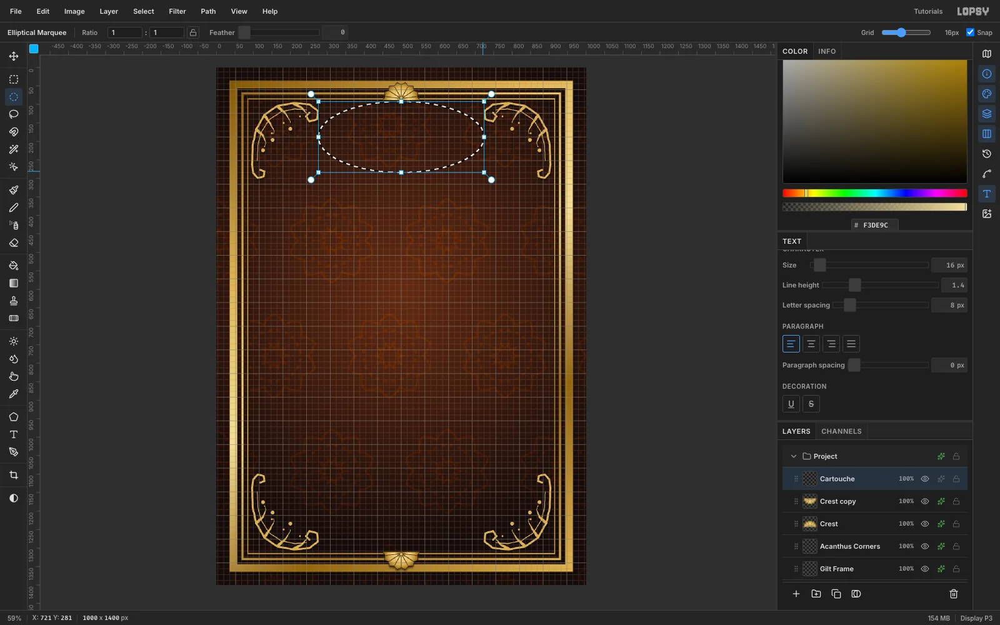

Add a layer called `Cartouche`. Choose **View → Show Grid**. The grid is
32 px and **Snap** is on. With the **Elliptical Marquee**, drag from about
(281, 95) to (721, 281). It snaps to the grid at 276, 92 to 724, 284.

Fill it with `#4A0F1C`. Then drag a **Radial** gradient of `#8A2033`, fading
from full to zero opacity, from (440, 150) to (440, 330).

## Finish the cartouche

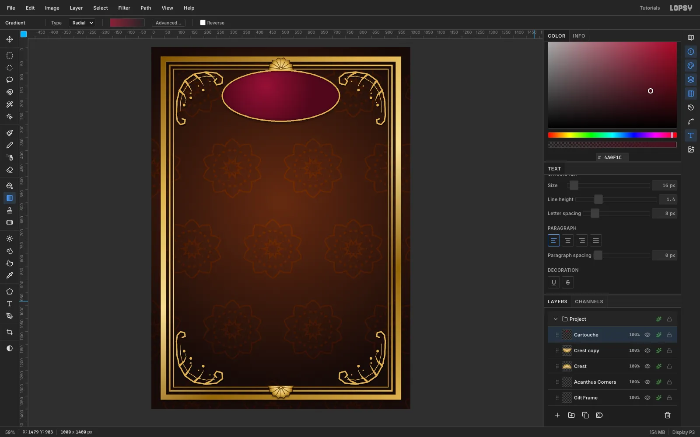

Deselect, turn **View → Show Grid** off and untick **Snap** in the options
bar. Add three effects to the cartouche:

- **Stroke**: Width `5`, `#D9B25F`
- **Inner Glow**: Size `18`, Opacity `70`, `#1A0408`, for depth
- **Drop Shadow**: Y `8`, Blur `16`, Opacity `75`

Click an empty spot away from the cartouche with the **Text** tool ([[T]]).
Pick **Cinzel Decorative**, weight **Bold**, size `100`, colour `#F0D48A`, and
type `Q E`. Press [[Tab]] to commit. Move it to the centre of the cartouche,
with its top at about y = 152, and give it a small warm Drop Shadow.

## Draw an arc with the Pen tool

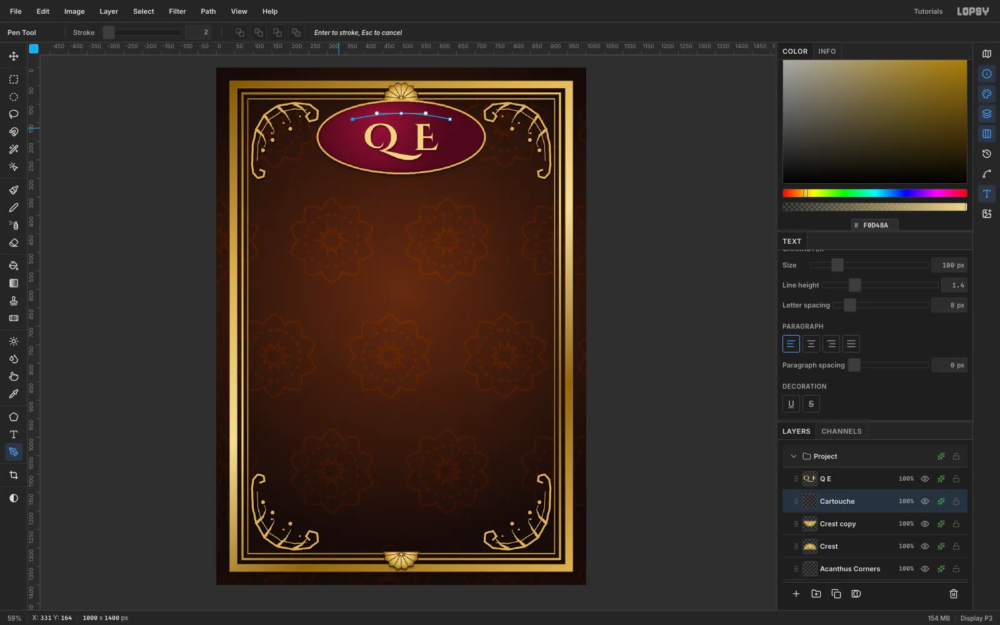

Choose the **Pen Tool** ([[P]]):

1. Click (368, 140).
2. **Drag** from (500, 124) to (566, 124). This makes a smooth anchor with
   horizontal handles.
3. Click (632, 140).
4. Click **Commit path** in the options bar.

## Set curved text on the path

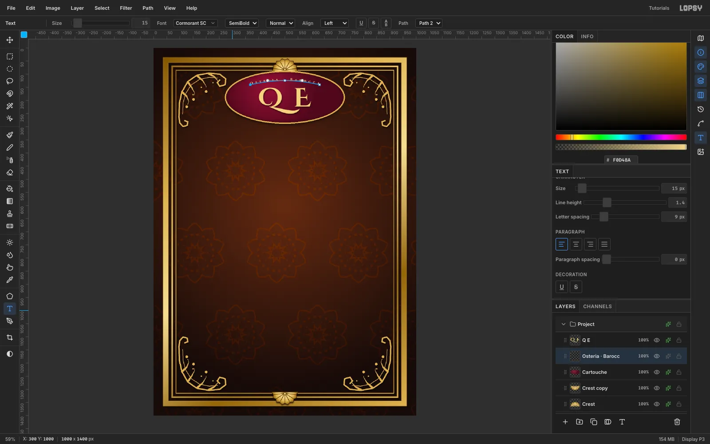

Select the `Cartouche` layer. Type `Osteria · Barocca` in empty space with
these settings:

- **Cormorant SC**, SemiBold, size `15`, colour `#F0D48A`
- **Letter spacing** `9` in the Text panel

Press [[Tab]]. With the text layer still active and the Text tool selected,
choose your path from the **Path** dropdown in the options bar. The words wrap
around the arc.

## Set the script title and a mirrored flourish

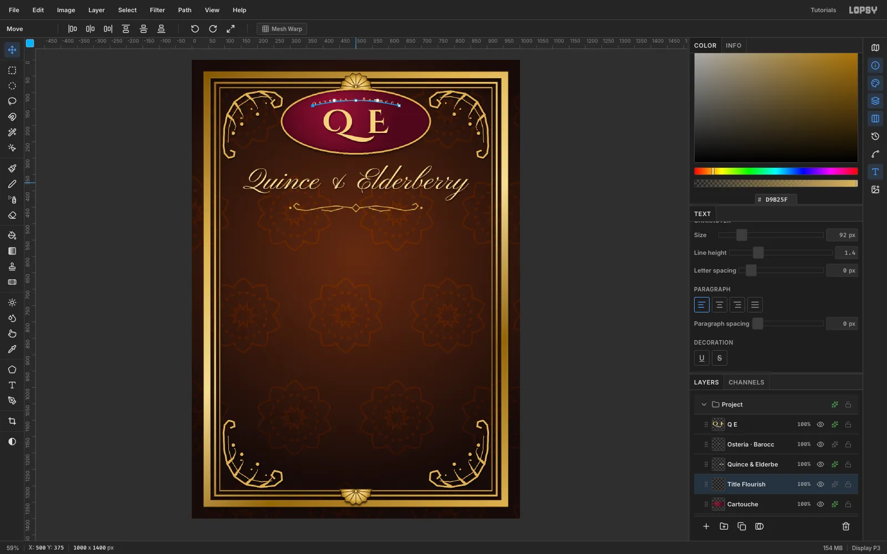

Type `Quince & Elderberry` in **Pinyon Script** at `92`, colour `#F3DE9C`.

> **Tip:** Set **Letter spacing** back to `0` first, or it inherits the 9 px
> from the arc text.

Centre it with its top at about y = 322 and add a soft Drop Shadow (Y `4`,
Blur `4`, Opacity `50`).

Add a `Title Flourish` layer. Turn on **Symmetry Vertical**, then
[[Cmd]]-click (500, 452) to move the mirror axis there. Now paint the right
half at Size `3.5`: a wave from (512, 452) out to a curl at (690, 446), a
dot at (700, 452), and a lozenge at the centre. The left half draws itself.
Turn symmetry off.

## Build a dark niche for the still life

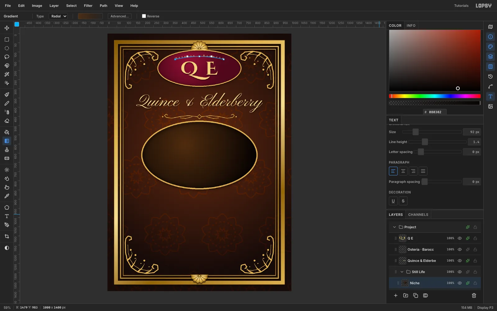

With `Title Flourish` active, click **New Group** and name it `Still Life`.
Inside it, add a `Niche` layer:

1. Draw an elliptical marquee from (190, 480) to (810, 840) and fill it with
   `#080302`.
2. Drag a Radial gradient with stops `#4A2C14`, `#3B2410` at 55%, and a
   transparent end, from (420, 600) to (720, 820). The light falls from the
   upper left.
3. Add a 7 px `#D9B25F` Stroke.
4. Add a big black **Inner Glow** (Size `40`, Opacity `90`) so the corners
   sink into darkness.
5. Add a Drop Shadow.

## Lay velvet over the ledge

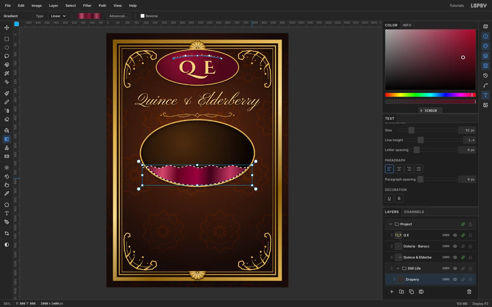

Add a `Drapery` layer. With the Lasso, trace a wavy "ledge" edge across the
niche at about y 726–744, then follow the lower arc of the oval back to the
start. Fill with `#5C0D20`.

In **Advanced…**, make a folds gradient with seven stops that alternate dark
and light:

- 0%: `#3A0816`
- 18%: `#C8506A`
- 32%: `#5A0C1E`
- 50%: `#8E1B3A`
- 62%: `#3A0816`
- 80%: `#B4405C`
- 100%: `#2A050F`

Drag it from (200, 760) to (800, 800).

## Let the cloth break the frame

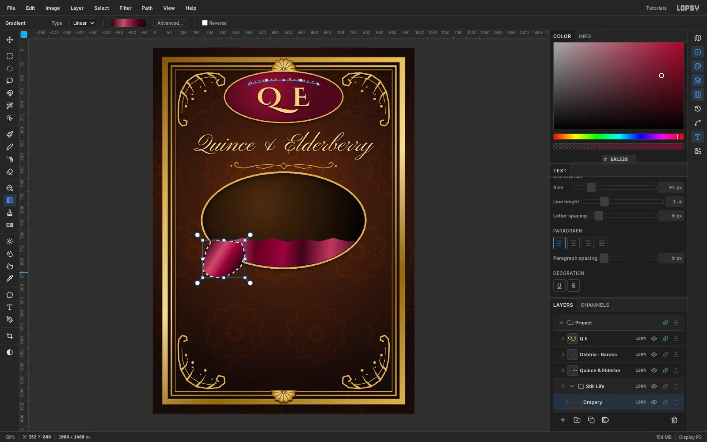

A classic Baroque move is to let something spill over the frame. On the same
layer, lasso a flap from (226, 736) down past the oval's edge to about
(214, 874) and back up to (352, 790). Fill it and drag a five-stop gradient
of `#2A050F`, `#C8506A`, `#8E1B3A`, `#3A0816` and `#1E0308` diagonally across
it.

## Model the folds with Dodge and Burn

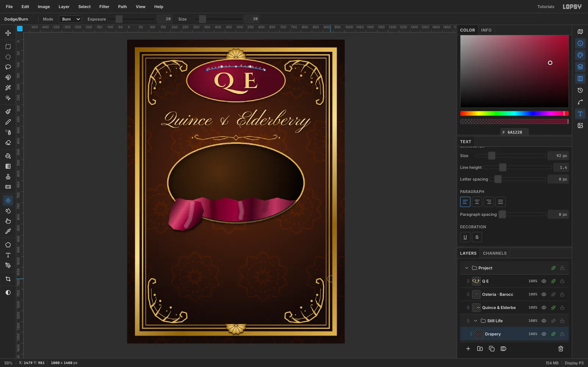

Deselect and choose **Dodge/Burn** ([[O]]):

- **Dodge** at Size `22`, Exposure `22`, down the fold crests.
- Switch to **Burn** at Size `30`, Exposure `20`, down the troughs.

Add a Drop Shadow (X `4`, Y `8`, Blur `12`). Then apply
**Filter → Gaussian Blur…** at Radius `3` to soften the brush marks.

## Paint a quince with a radial gradient

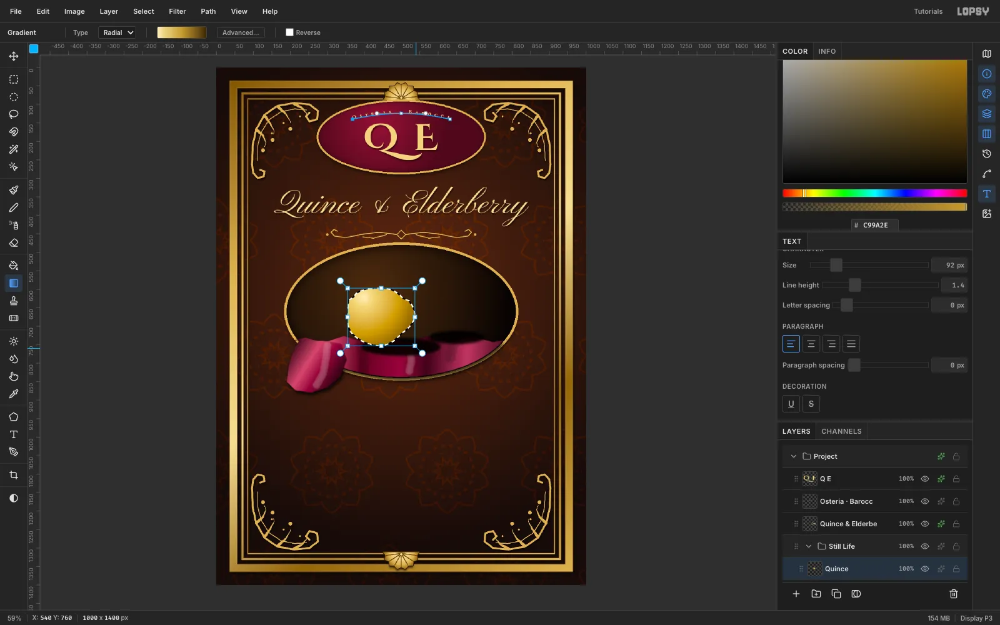

Add a `Cast Shadows` layer first:

1. Fill two flat ellipses in `#1A0A05`: (392, 732) 214 × 48, and
   (575, 712) 150 × 36.
2. Gaussian Blur them at `10`.
3. Set the layer to **Multiply**.

Now add a `Quince` layer. Lasso a slightly lumpy circle about 176 px across,
centred at (440, 668), narrowing a little towards the top. Fill it with
`#C99A2E`. Drag a **Radial** gradient from the highlight at (398, 622) to
(540, 760) with these stops:

- 0%: `#FFF1C4`
- 12%: `#F2D98A`
- 50%: `#C99A2E`
- 85%: `#6B4A12`
- 100%: `#3A2606`

## Give the fruit weight

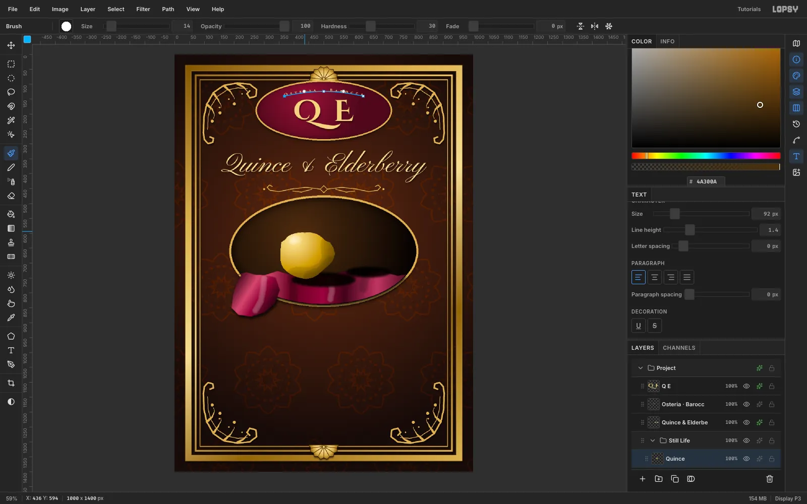

Deselect.

1. With **Burn** at Size `80`, Exposure `18`, sweep the lower-right third.
   Go over it again at Size `50`.
2. **Dodge** a tiny highlight at Size `26`.
3. Brush a soft stem cavity at the top: `#4A300A`, Size `14`, Hardness `30`,
   Opacity `70`.
4. Add an **Inner Glow** (Size `34`, Opacity `70`, `#4A2804`) to round the
   edge.
5. Nudge the quince down so it sits on its shadow.

## Duplicate, flip and scale a second quince

With the Move tool, click **Duplicate Layer**. The copy lands 10 px down and
right, so drag it back, then rename the copy `Quince Front`. The original,
underneath it, becomes `Quince Back`:

1. Select `Quince Back` and marquee around it.
2. Click **Flip Horizontal**, then press [[Cmd+D]].
3. Marquee it again and [[Cmd]]-drag the bottom-right handle in to about 74%.
   [[Cmd]] keeps the proportions.
4. Press [[Cmd+D]].

## Tuck the second quince behind

Move `Quince Back` so its centre is near (584, 650), partly hidden behind the
front fruit. Apply **Filter → Oil Paint…** (Radius `3`, Sharpness `1.5`) to
both quinces. The flat gradients turn into brushy, painterly patches of
colour.

## Blush the quince inside a selection

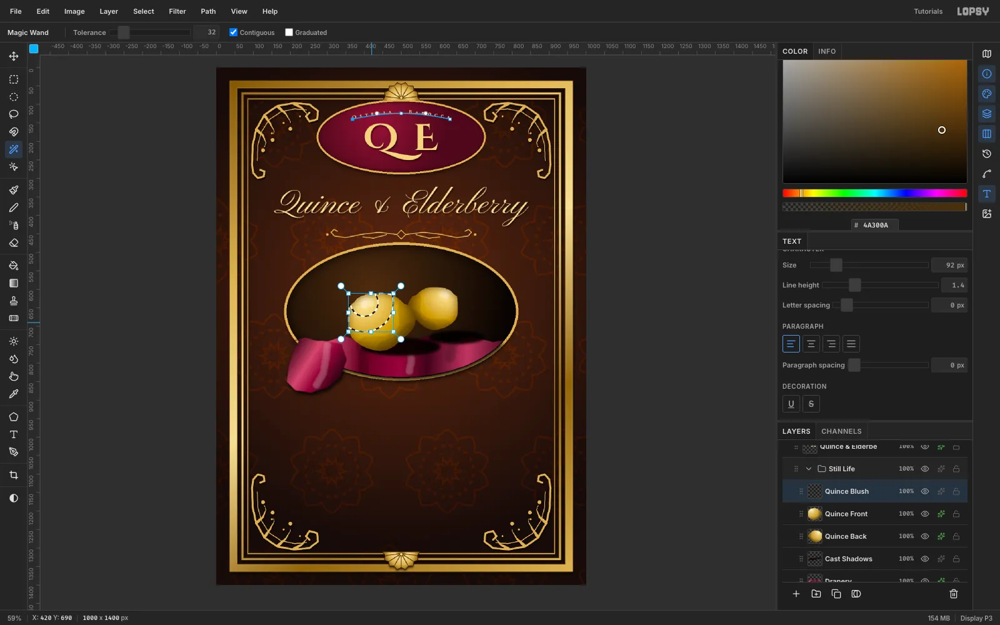

Add a `Quince Blush` layer.

1. Make `Quince Front` active and click it with the **Magic Wand**.
2. Switch back to `Quince Blush`.
3. Paint a soft `#8A8A3A` blush (Size `70`, Hardness `0`, Opacity `80`) on
   the lower left. The selection keeps it on the fruit.
4. Deselect and set the layer to **Soft Light**. Real quinces keep a green
   tinge.

## Add leaves and stems

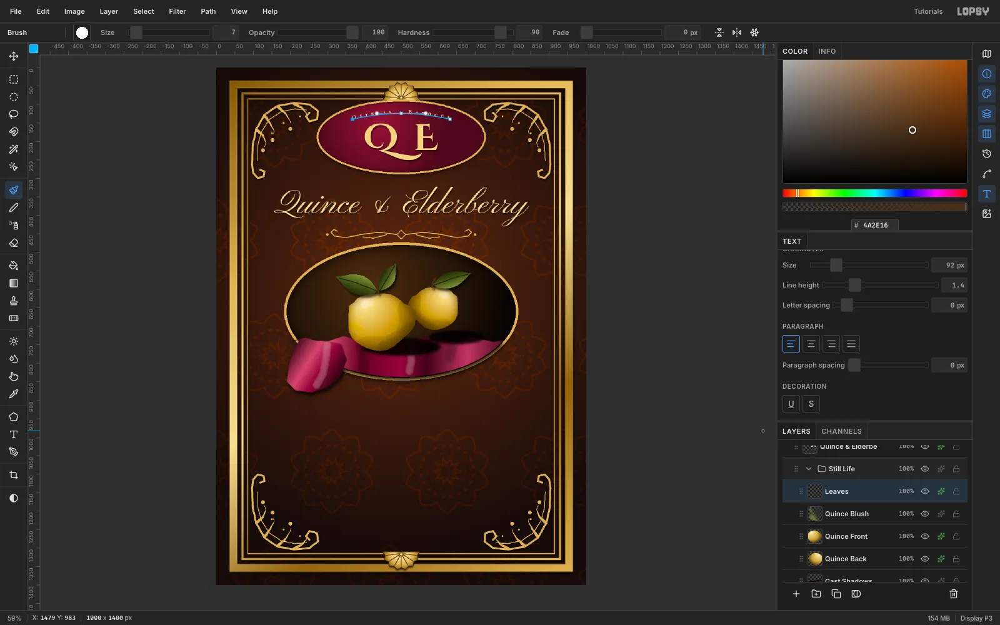

On a `Leaves` layer:

1. Lasso three pointed leaves from the stems at (436, 606) and (586, 590).
2. Fill each with `#4F5B23`, then drag a linear gradient across it:
   `#1C2408`, `#4F5B23` and `#8A9A48`.
3. Brush the midribs in `#1A2006` at Size `2.8`.
4. Brush short `#4A2E16` stems at Size `7`.
5. Add a Drop Shadow.

## Brush an elderberry cluster

On an `Elderberries` layer:

1. Draw thin `#5B2A3C` stems (Size `3`) from (676, 556) out to six small
   umbels.
2. Click about 60 berries at Size `14`, Hardness `95`, in `#2A0A34`.
3. Go over half of them again at Size `8` in `#4A1A5A` to round them.
4. Add pale `#E0C4EA` glints at Size `3.2`, up and to the left of each berry.
5. Add a Drop Shadow.

## Copy, paste and flip the cluster

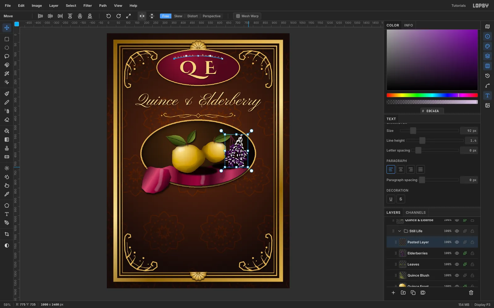

Marquee (640, 545) to (775, 735). Press [[Cmd+C]] and then [[Cmd+V]]; the
paste lands in place on a new layer. Draw the same marquee again, then click
**Flip Horizontal** and press [[Cmd+D]].

## Move the second cluster

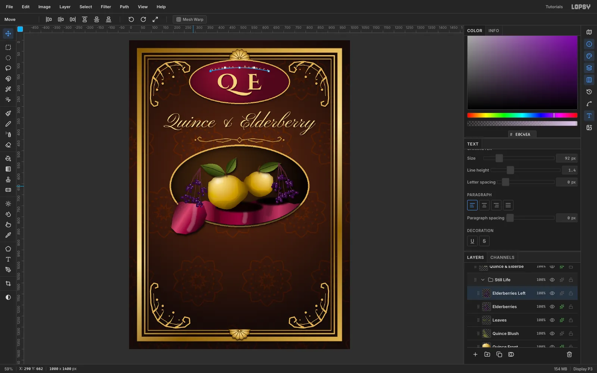

Move the pasted cluster to the left side, centred near (290, 662), where it
spills over the velvet flap. Rename it `Elderberries Left` and give it the
same Drop Shadow.

## Set a two-column menu with a price column

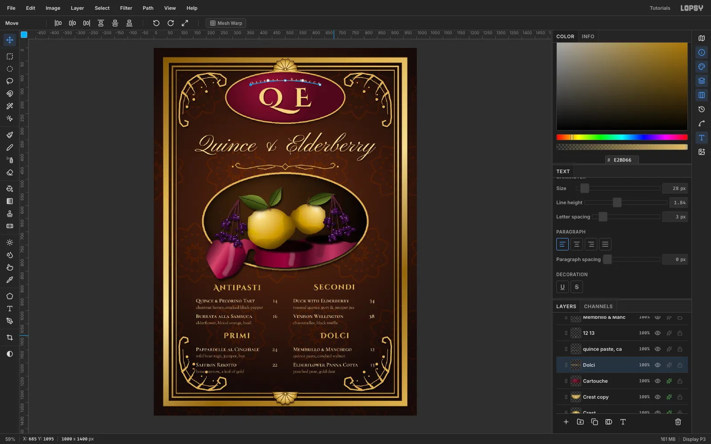

Each section is four text layers:

- **Heading:** Cinzel Decorative Bold, 28, `#E2BD66`, letter spacing 3.
- **Dish names:** Cormorant SC SemiBold, 21, `#F1DFB0`, line height 1.4.
- **Prices:** the same as the names, but set to **Align Right**.
- **Descriptions:** Sorts Mill Goudy, 16, `#C4A57A`, line height 1.84,
  placed 27 px below the names.

The names, prices and descriptions are **area text** 340 px wide (drag with
the Text tool). Put a blank line between the two items so that each
description falls into the gap under its dish.

Positions:

- **Left column:** names at x = 160, prices ending at x = 470.
- **Right column:** names at x = 530, prices ending at x = 840.
- **Headings** at y = 900 and 1085, with the items 48 px below each one.

> **Tip:** Clicking inside an existing text box edits it. Create each block
> in empty space at the bottom of the page, then press [[Shift]]+arrow keys
> with the Move tool. Each press moves exactly 10 px, so the names, prices and
> descriptions stay on the same baselines.

## Add a divider and footer

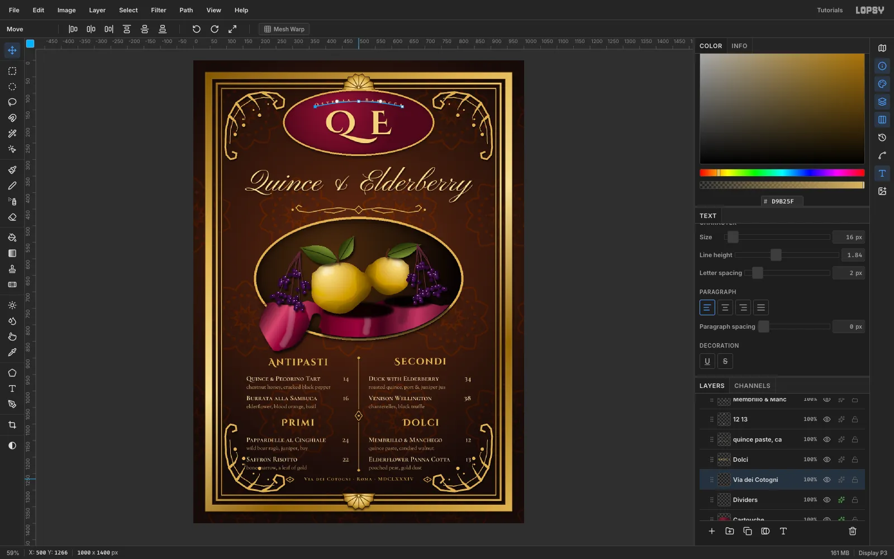

On a `Dividers` layer, draw the column divider in `#CAA052` at Size `2.8`:

1. Click (500, 905), then [[Shift]]-click (500, 1055).
2. Do the same from (500, 1095) to (500, 1235).
3. Add a lozenge at y = 1075 and dots at both ends.

Draw two small diamond fleurons at (292, 1268) and (708, 1268).

Type the footer `Via dei Cotogni · Roma · MDCLXXXIV` in Cormorant SC at `16`
with letter spacing `2` and centre it at y = 1260.

## Trim the hem and clear the corners

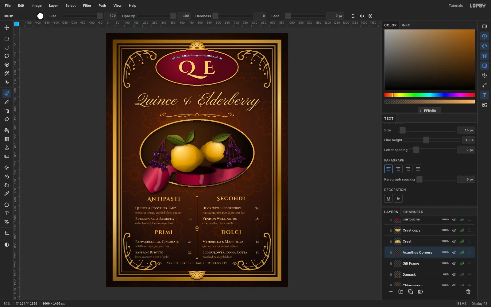

Tidy up:

- **Drapery:** use the **Eraser** ([[E]]) at Size `34` to shave the flap's
  rounded bottom corners into a hanging point.
- **Any gaps:** fill them with the **Clone Stamp** ([[S]]). [[Alt]]-click
  good velvet at (420, 766), then paint over the gap.
- **Corners:** on `Acanthus Corners`, turn on **Symmetry Vertical** and erase
  the few dots that touch the Primi items. The matching dots on the right
  disappear too, so the corners stay symmetrical.

## Light a candle glow

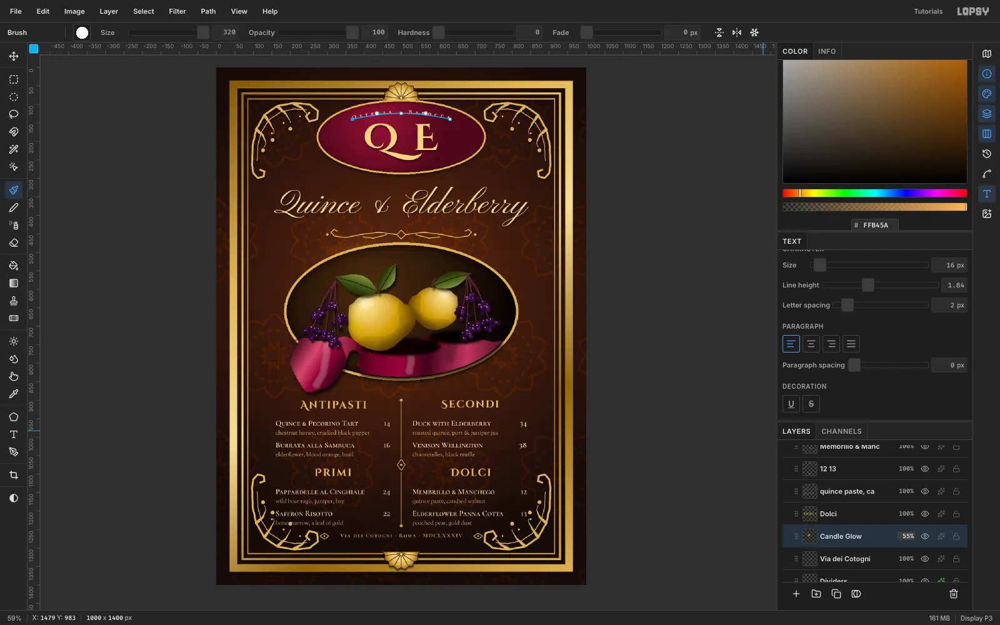

Add a `Candle Glow` layer at the top:

1. Click once at (400, 600) with a `#FFB45A` brush at Size `320`, Hardness
   `0`.
2. Apply **Gaussian Blur** at `60`.
3. Set the layer to **Screen** at `55%`.

The highlight on the fruit now has a light source.

## Finish with a vignette and warm filter

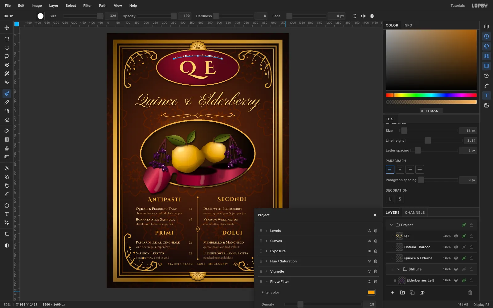

Open the **Project** group's effects drawer and click **Add Adjustment**:

- **Vignette** at `45`
- **Photo Filter** at Density `18`

This darkens the edges like an old varnished canvas and warms the whole
page.

## Export the finished menu

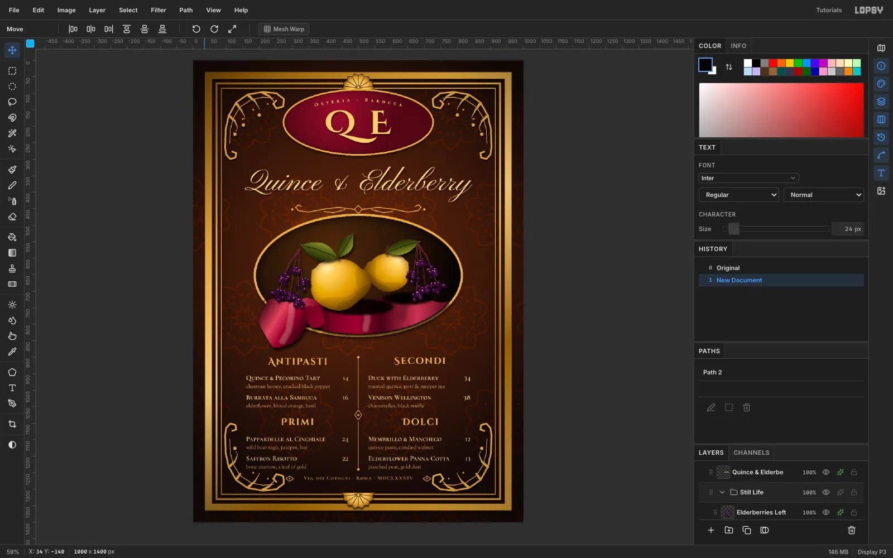

In the **Paths** panel, click the selected path so its overlay stops showing.
You can still move the whole still life as one piece: select the
`Still Life` group and drag it with the Move tool.

Choose **File → Quick Export PNG** for the artwork, and **File → Save Project**
to keep the layered `.lopsy` file.
