Spanish still-life painters around 1600 had a simple formula: put a few
ordinary things on a stone ledge, let a single light fall on them from the
upper left, and let everything else go black. The style is called the
*bodegón*, and it is a good workout for any painting app.

In this tutorial you'll paint **Midnight Artichokes**, a 1400 × 1050
bodegón. It has a pomegranate hanging on a string, two artichokes, a split
pomegranate, a knife that sticks out over the ledge and a candle that has just
been put out. The objects form a curve that starts at the hanging fruit and
steps down to the right.

Along the way you'll use:

- polygon lassos filled with linear and radial gradients
- **Select → Shrink** to add outlines
- copy, paste, flip, rotate and scale transforms
- a custom brush made with **Edit → Define Color Brush…**
- the Clouds, Emboss, Smoke, Gaussian Blur and Hue/Saturation filters
- the Smudge and Eraser tools
- Multiply and Screen layers clipped with the Magic Wand
- root-level Vignette and Photo Filter adjustments

## Build the stone niche

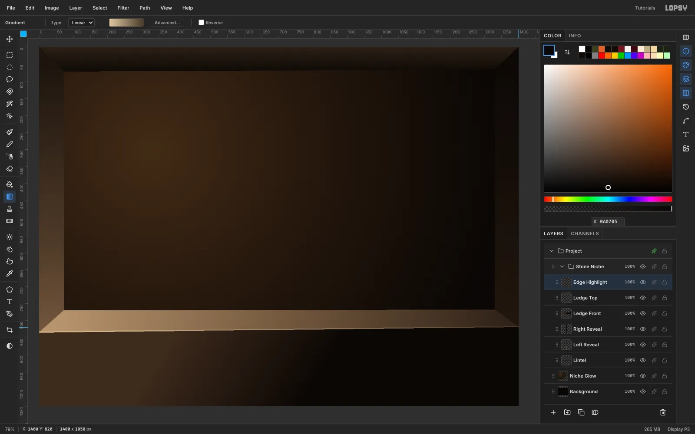

Choose **File → New** and set **Width** to `1400` and **Height** to `1050`.
Click **Create**.

1. Fill `Background` with `#0A0705` (**Edit → Fill**).
2. Rename `Layer 1` to `Niche Glow`. Add a **Radial** gradient that fades
   from `#3E2B19` to a transparent `#1E150D`. Start the drag in the upper
   left, roughly a quarter of the way across and down, and pull it toward the
   lower right. Set the layer to 75% opacity. That is your only light
   source.
3. Click **New Group**, name it `Stone Niche`, and add one layer for each
   stone surface. Draw each one with the **Lasso** as a four-point polygon,
   then fill it with a linear gradient:
   - **Lintel:** across the top, dark brown fading to near-black.
   - **Left Reveal:** the thin left wall, lighter toward the ledge.
   - **Right Reveal:** the thin right wall, almost black.
   - **Ledge Front:** the front face, `#3A2B1E` to `#0A0705`.
   - **Ledge Top:** the top surface. Run the gradient left to right from warm
     `#B09472` to dark `#2A2018`, so the light fades across it.
   - **Edge Highlight:** a 3 px strip along the ledge's front edge. It gives
     the stone a crisp lit lip.

## Give the stone a grain

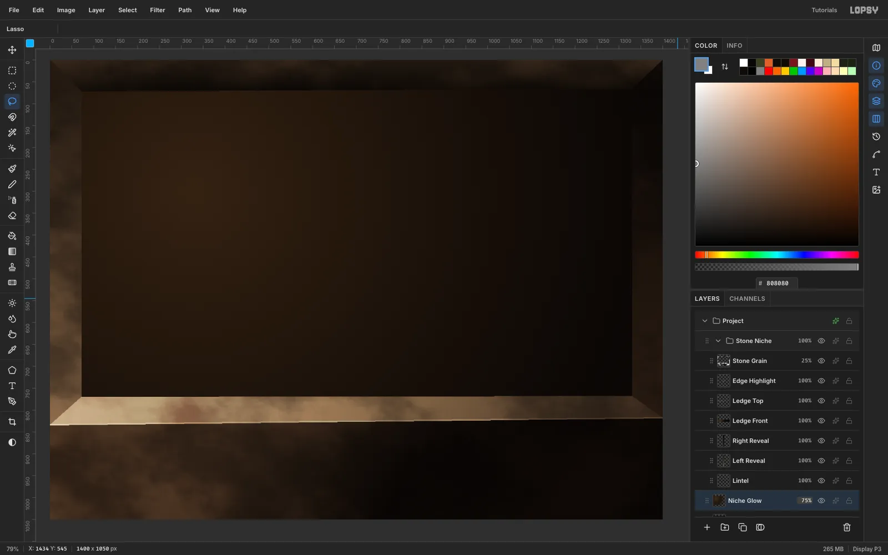

1. Add a layer called `Stone Grain` and fill it with `#808080`.
2. Run these three filters in order:
   - **Filter → Clouds** (Scale `9`)
   - **Add Noise** (Amount `35`, **Mono**, **Gaussian**)
   - **Emboss** (Angle `135`, Strength `45`)
3. Lasso the back-wall rectangle and press **Delete**, so the grain only
   covers stone.
4. Set the layer to **Overlay** at 25%.

## Paint the first artichoke bracts

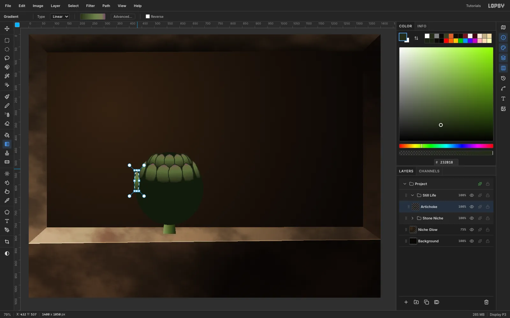

1. Select `Niche Glow`, click **New Group** and name it `Still Life`.
2. Drag its grip above `Stone Niche`, so everything you paint sits in front
   of the stone.
3. Add a layer called `Artichoke`. Lasso a short stem stub standing on the
   ledge and fill it with an olive gradient.
4. Just above the stem, fill an ellipse about 270 × 290 px with `#141A0E`.
   This dark body shows through the gaps between the bracts.

Each **bract** (leaf scale) is a pointed, rounded leaf shape:

1. Lasso the leaf shape and **Edit → Fill** it with `#232B18`.
2. Choose **Select → Shrink…**, set `2` px and click **Apply**.
3. Drag a linear gradient from the bract's base to its tip. For the inner
   rows, use `#2A2E1C` → `#5E6E40` → `#6C6C48` → a violet `#6E3E62`.

The violet appears only in the last few pixels, so each bract gets a purple
tip rather than a purple stripe. The dark ring left by the shrink becomes the
bract's outline.

## Finish the globe row by row

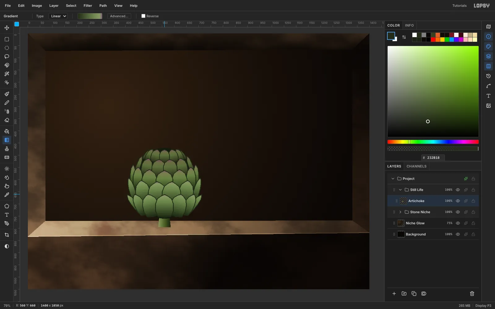

Paint 33 bracts in five rows, starting at the top and working down, so each
lower bract overlaps the one above it.

- **Draw each row as a shallow smile.** The front bract sits lowest and the
  side bracts ride slightly higher. This reads as a ring of leaves wrapped
  around a sphere seen from a little above.
- **Squeeze the side bracts sideways.** A bract at the edge of the globe can
  be a third as wide as the one facing you. That foreshortening is what makes
  it look round.
- **Tilt them to follow the form.** Upper rows lean toward the top, and lower
  rows lean outward.
- **Shift the colours down the globe.** The lower rows use a greener gradient
  (`#222C17` → `#6E8450` → `#889866`), with only a hint of violet at the tip.

## Clip the modelling layers with the Magic Wand

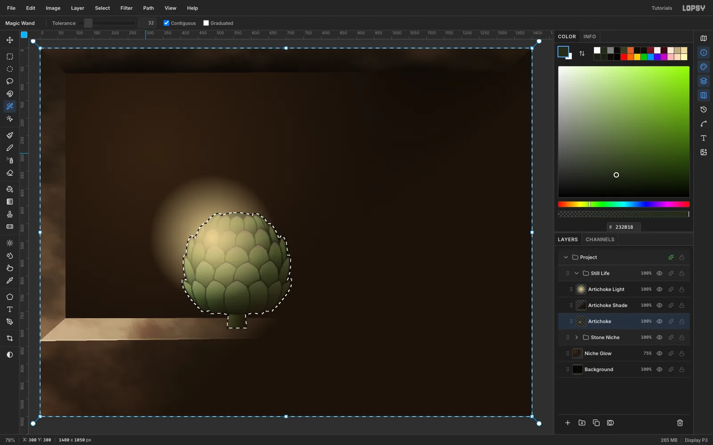

1. Run **Filter → Gaussian Blur** with Radius `2` on `Artichoke`. This
   softens the drawn outlines.
2. Add two helper layers above it:
   - `Artichoke Shade`: a linear gradient from `#1A120A` to transparent,
     dragged from the lower right toward the centre.
   - `Artichoke Light`: a radial `#E8D49A` to transparent, centred on the
     upper-left shoulder.
3. To keep them inside the artichoke, select `Artichoke` and click the
   **Magic Wand** on the empty wall beside it. That selects everything
   *outside* the artichoke.
4. Select each helper layer in turn and press **Delete** to trim the
   spill.

## Model the artichoke

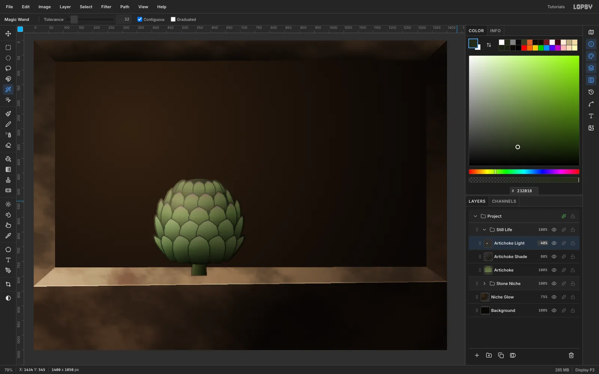

1. Set `Artichoke Shade` to **Multiply** at 80%.
2. Set `Artichoke Light` to **Screen** at 40%.
3. Select `Artichoke Shade` and choose **Layer → Merge Down**, then do the
   same with `Artichoke Light`.

Merge the Multiply layer first. Each blend mode then bakes directly into the
artichoke's pixels.

## Paste a copy and flip it

The second artichoke is the first one, turned over:

1. With `Artichoke` selected, draw a rectangular marquee a little larger than
   it.
2. Press **⌘C**, then **⌘V**, and rename the paste `Artichoke Lying`.
3. Switch to the **Move** tool and click **Flip Horizontal** in the options
   bar.

Flipping keeps the highlight on the upper left once the artichoke is rotated.
Press **⌘D**, then drag the copy to the right.

## Rotate it onto its side

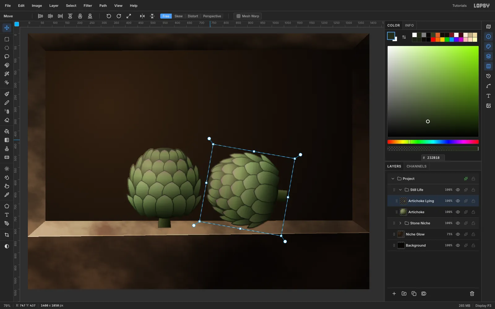

1. Draw a marquee around the copy.
2. With the Move tool, drag the round handle just off the box's top-right
   corner about **80° counter-clockwise**. The artichoke's top now points
   left and its stem stub points right.
3. Press **⌘D** to commit.

Commit each transform with ⌘D before starting the next one.

## Scale it down

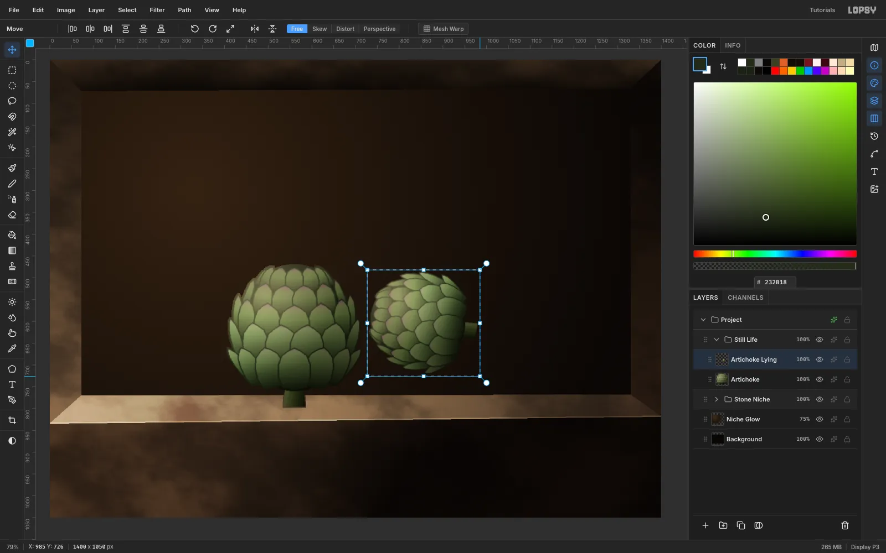

1. Draw a fresh marquee around the lying artichoke.
2. Hold **⌘** and drag the bottom-right corner handle inward to about 75%.
   ⌘ keeps the proportions.
3. Press **⌘D**.

A smaller second artichoke also reads as sitting a little further away.

## Bring it forward on the ledge

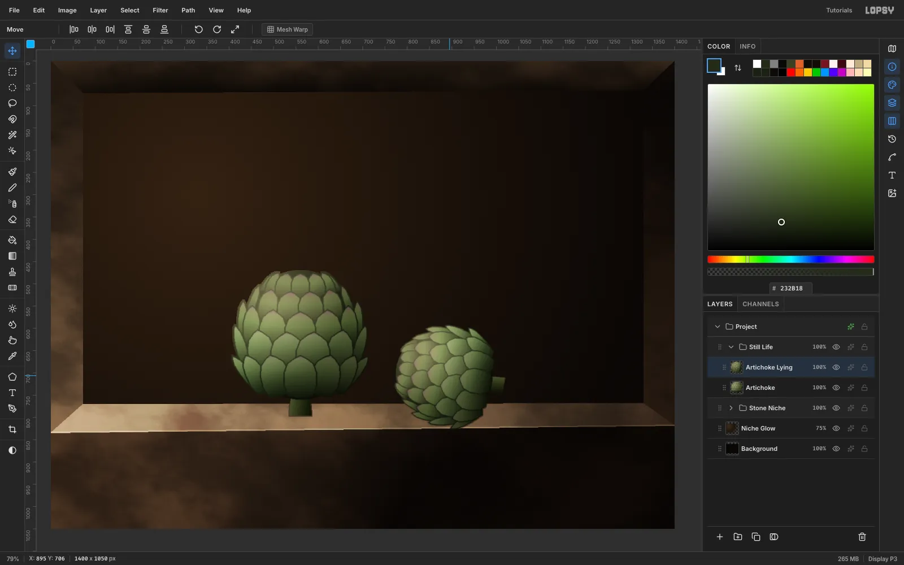

With the Move tool, drag the lying artichoke down and to the right until its
lowest bract rests on the front half of the ledge. It now sits *in front of*
the standing one, which breaks up the single baseline.

## Let the stem droop over the edge

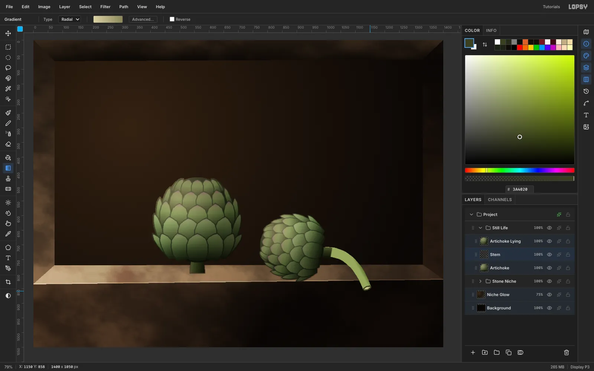

1. Select `Artichoke`, then click **Add Layer**. The new `Stem` layer lands
   between the two artichokes.
2. Lasso a stem about 34 px thick that starts at the lying artichoke's stub.
   Curve it out to the right, onto the ledge, and over the front edge.
3. Fill it with a gradient across its width: `#9AA866` → `#56672F` →
   `#1C2410`.
4. Finish the tip with the cut face:
   - Lasso a small tilted ellipse.
   - Fill it with `#3A4020`.
   - Shrink the selection by 3 px.
   - Fill the rest with a radial gradient from `#DCD3A4` to `#8A865A`.

Something poking out of the picture toward you is a classic Spanish
still-life trick.

## Hang a pomegranate

Select `Artichoke Lying` and click **New Group**. Name the group
`Hanging Pomegranate`, then add these layers inside it:

1. **String:** a 3 px Hard Round brush line in `#9C8C68`, from the lintel
   down to about a fifth of the way down the canvas, where the fruit will
   hang.
2. **Pom Body:**
   - Hang an ellipse about 196 × 186 px from the end of the string and fill
     it with a radial gradient: `#C85A4E` → `#96202A` → `#4A0A12` →
     `#10020A`. Drag it from the upper left.
   - Add Noise at `6`, Mono.
   - With the selection still live, dab a few low-opacity (22%) Soft Round
     blotches of `#9A6A34`, plus a darker stroke of `#2A060A` down the right
     side.
   - Run **Hue/Saturation** at Hue `+3`, Saturation `−12`, Lightness `−4`.
3. **Pom Crown:** a lassoed crown of six sepals with a red-to-black
   gradient. Add a couple of low-opacity `#C0604A` Soft Round strokes on the
   lit sepals so they aren't a flat silhouette.
4. **Pom Shade:** a Multiply layer at 75% with a dark gradient in the body
   ellipse from the lower right.
5. **Pom Shine:** a small ellipse with Feather `14`, filled with `#F2D8C4`,
   on **Screen** at 28%. Keep it dim, so the fruit looks matte rather than
   plastic.

## Lay a knife over the edge

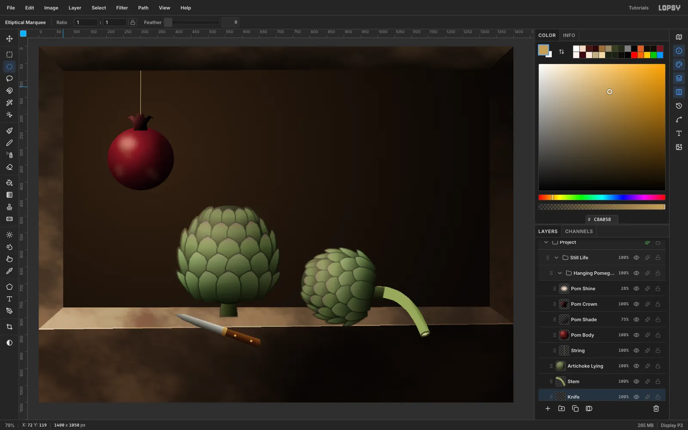

1. Select `Artichoke` and add a layer called `Knife`.
2. Build the knife as three lassoed pieces along a line about 19° below
   horizontal, each with a gradient across its width:
   - **Blade:** steel, `#CFCCC0` → `#848278` → `#262522`.
   - **Bolster:** brass, `#D8B870` → `#4A3010`.
   - **Handle:** wood, `#7A4A22` → `#40220E` → `#120804`.
3. Add two tiny brass rivets.

Put the tip at the back of the ledge, where the pomegranate will hide it,
and let the whole handle project past the front edge.

## Make a garnet seed brush

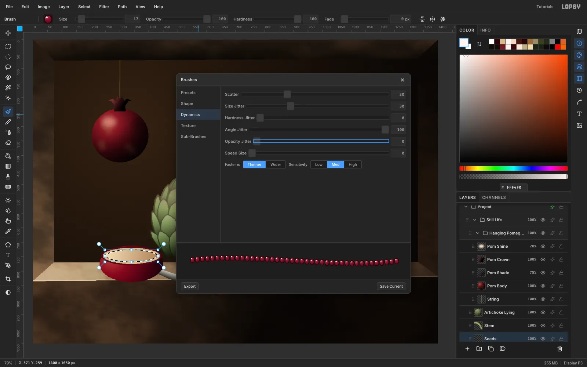

1. On a temporary layer, fill a 20 × 26 ellipse with `#2A030A`.
2. Draw a slightly smaller ellipse, about 16 × 22, centred inside it, and
   fill it with a radial gradient: `#C23A4E` → `#82102A` → `#3A0410`. At
   this tiny size a fresh marquee keeps a rounder shape than
   **Select → Shrink**.
3. Add a tiny `#FFF4F0` highlight.
4. Marquee the seed and choose **Edit → Define Color Brush…**. Name it
   `Garnet Seed`, then delete the temporary layer.
5. Open the brush presets, pick **Garnet Seed**, and set these values:
   - **Shape:** Size `17`, Spacing `80`.
   - **Dynamics:** Scatter `30`, Size Jitter `30`, Angle Jitter `100`.

Set the values *after* picking the preset, because choosing a preset resets
them.

## Paint the split pomegranate

1. Add a `Split Rind` layer above `Knife`:
   - Fill a 220 × 126 ellipse at the front left with a dark-red radial
     gradient that is lit from the left.
   - Add Noise (`6`).
   - Dab faint `#7A5530` Soft Round mottling at 18% so the rind looks dull.
2. Add a `Cut Face` layer:
   - Fill a 208 × 66 ellipse with `#5A0E16`.
   - Shrink it by 4 px and fill with the pale rind colour `#D9B98A`.
   - Shrink it by 7 px more and fill with a cream pith gradient
     (`#EFDDB8` → `#A8805A`).
3. Keep that selection live. On a `Seeds` layer, paint zig-zag strokes of the
   Garnet Seed brush across it, then dot 2 px white highlights on a dozen
   seeds.
4. On a `Membranes` layer, draw three curved 7 px strokes of `#EAD7AE` to
   divide the seeds into chambers.
5. Nudge the membranes with the **Smudge** tool (Size `12`, Strength `60`) so
   they wander instead of running straight like spokes.

## Add the chamberstick

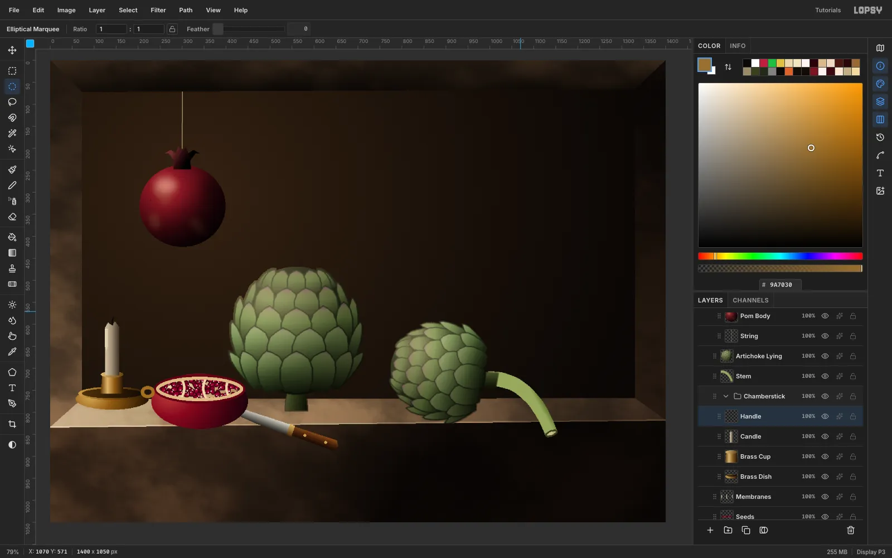

Select `Membranes` and create a `Chamberstick` group. Build it from these
layers:

- **Brass Dish:** three stacked ellipses with brass gradients (outer rim,
  top face and dark inner well).
- **Brass Cup:** a lassoed cylinder with a vertical highlight.
- **Candle:** a lasso with a ragged, melted top and a warm-grey gradient.
  Run Hue/Saturation at Lightness `−18`, so the candle isn't the brightest
  thing in the picture.
- **Wick:** a black 4 px brush stroke.
- **Handle:** a ring made by filling an ellipse, shrinking it by 7 px and
  pressing **Delete**. Drag it with the Move tool to the left side of the
  dish.

## Let the smoke rise

1. Add a `Smoke` layer and lasso a thin band that rises from the wick and
   widens as it goes.
2. **Select → Feather…** it by `8`, fill it with black, and run
   **Filter → Smoke**.
3. Run **Brightness/Contrast** at `+70` / `+45` to make the wisps visible,
   then set the layer to **Screen**.
4. Fade the upper part away with a large Eraser (Size `110`) at 30–70%
   opacity.
5. Drop the layer to about 42%.

Smoke should thin out as it climbs, not bend into a solid tube.

## Cast every shadow the same way

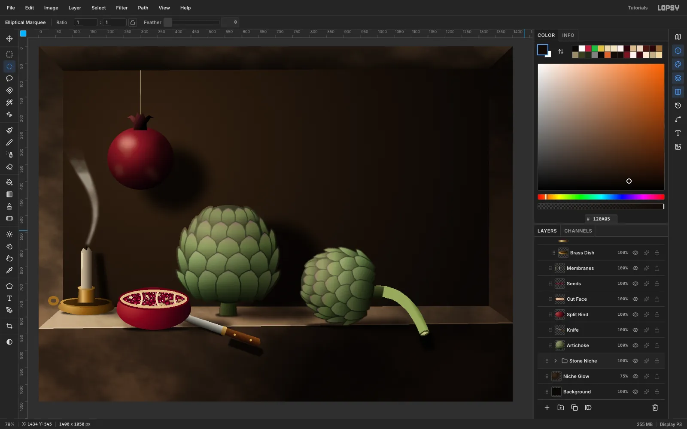

The light comes from the upper left, so every shadow falls down and to the
right. In `Stone Niche`, add a `Cast Shadows` layer above `Stone Grain`. Fill
all of these with `#120A05`:

- **Wall shadows:** Feather `34` ellipses behind the standing artichoke and
  the hanging pomegranate.
- **Floor shadows:** Feather `20` ellipses to the right of each object on the
  ledge.
- **Contact lines:** Feather `4` thin ellipses right at each object's base.
  These stop things from floating.
- **Knife handle:** a Feather `3` copy of the handle's outline, 30 px lower,
  on the ledge front.

Set the layer to **Multiply** at 80%.

## Push the void into darkness

Add three more layers in `Stone Niche`:

1. **Void Shade**, set to **Multiply**:
   - A radial gradient from `#0C0806` to transparent, centred on the upper
     right.
   - A darker linear gradient down the ledge front.
   - A Feather `30` fill of `#6A5139` over the left end of the ledge, which
     was the brightest spot and pulled the eye away from the subject.
2. **Ledge Light:** a Feather `40` ellipse of `#E8C890` on **Screen** at 30%.
   It pools the light on the ledge under the standing artichoke.

## Warm the artichoke's lit side

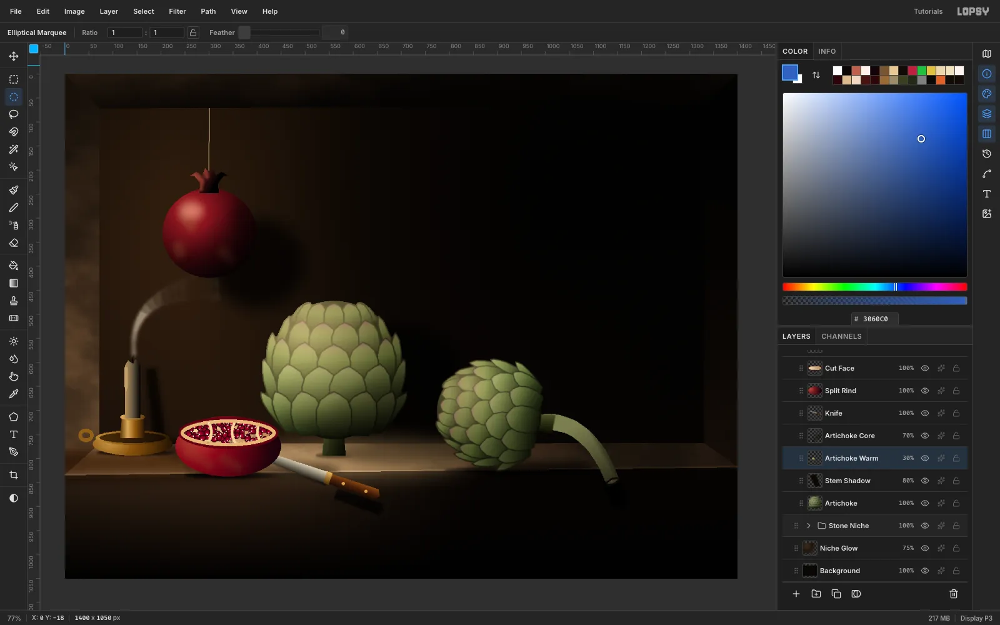

The blur left a soft halo around the artichoke. To trim it:

1. Magic Wand the empty wall on the `Artichoke` layer and press **⇧⌘I** to
   invert.
2. Shrink the selection by 2 px, invert again with **⇧⌘I**, and press
   **Delete**.

Then add two more layers and clip them the same way as before (Magic Wand
the empty wall on `Artichoke`, then **Delete** on each layer):

- `Artichoke Warm`: a radial `#CDB672` on **Screen** at 30%.
- `Artichoke Core`: a Multiply gradient at 70% from the lower right.

A little Add Noise (`4`) on the artichoke breaks up the flat gradients.

## Model the stem

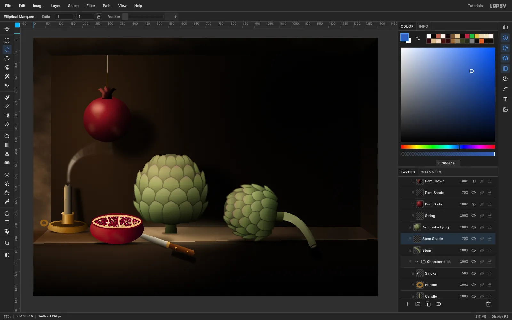

1. Run **Hue/Saturation** on `Stem` at Saturation `−40` and Lightness `−10`,
   so it's olive rather than lime.
2. Add a Multiply `Stem Shade` layer, clipped with the Magic Wand, that
   darkens the part hanging over the edge.
3. Add a hard `Stem Shadow` on the ledge front below the tip.

## Finish with a vignette and warm filter

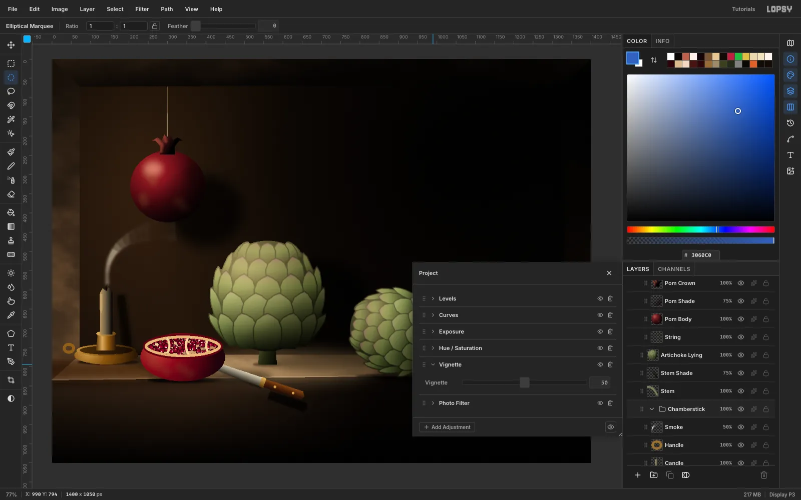

Choose **Layer → Adjustment Layer…** and click **Got it** to open the root
adjustments. Then:

1. **Add Adjustment → Vignette** and set it to `50`.
2. **Add Adjustment → Photo Filter** and set Density to `10`. It warms the
   whole scene like candle-lit varnish.

Root adjustments sit over the whole painting, so add them last, once
everything else is in place.

Export with **File → Quick Export PNG** and save your layers with
**File → Save Project**.
