Before CAD, ships and engines were drawn on **cyanotype paper**: white lines on deep Prussian blue, a drafting grid behind everything, and a title block in the corner. It's an easy look to fake, and it makes any subject feel engineered.

In this tutorial you'll draw a fictional deep-sea submarine, the *Zephyr Nautilus*, whose hull is a chambered nautilus shell. You'll build the spiral by hand with straight pencil segments, hang a periscope, a propeller and four portholes on it, then wrap it in the paperwork: dimension lines, numbered callouts and a title block.

Along the way you'll use:

- **Define Pattern** and **Fill with Pattern** for the grid paper
- the **Pencil** with Shift-click straight lines
- the **Lasso** and **Elliptical Marquee** with **Edit → Fill**, and **Select → Shrink…** for rings
- a layer **group** that you move as one piece and undo
- text in Oswald and IBM Plex Mono, including one rotated label
- **Outer Glow**, **Drop Shadow** and **Color Overlay** effects, a radial gradient vignette and **Add Noise**

The palette is small:

- Blueprint ground `#1257B8` → `#08306F` → `#05224F` (radial, bright in the middle)
- Grid line `#6FB4F2`
- Chalk white `#F4F9FF` (outlines and title)
- Ice cyan `#9ADBFF` (guides, dimensions and small text)
- Chamber blue `#2A78D2` / `#3A8CE6` (alternating chambers)
- Port glass `#082B66` / `#1B6FD0`
- Signal amber `#FFB547` (callouts only)

## Start with a blueprint-blue ground

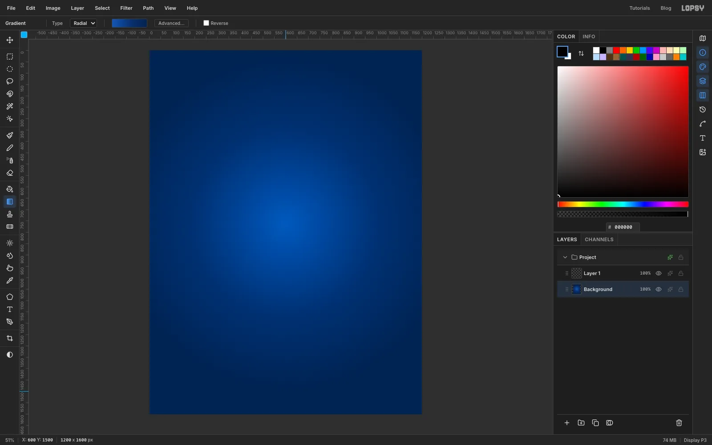

Choose **File → New**, set the units to **Pixels**, make the document **1200 × 1600** with a **White** background, and click **Create**.

Select the **Gradient** tool and set its type to **Radial**. Click **Advanced…** and make three stops: `#1257B8` at 0, `#08306F` at 0.55 and `#05224F` at 1. Click **Done**. With **Background** selected, drag from the middle of the page (a little below centre) down to near the bottom edge. The bright middle gives the sheet a "lit from behind" glow.

## Draw one tile of drafting grid

Select **Layer 1**. Press [[N]] for the **Pencil** and set the foreground to `#6FB4F2`. At **Size 1**, draw lines every 20 px across a 100 × 100 square, in both directions. Click where a line starts, then hold [[Shift]] and click where it ends for a ruler-straight line. Then raise the Pencil to **Size 2** and draw one heavier line along the square's top edge and one along its left edge.

Marquee exactly that 100 × 100 square with the **Rectangular Marquee** and choose **Edit → Define Pattern**. Press [[Cmd+D]], then click **Delete Layer**: the tile has done its job.

> **Tip:** With the Pencil set to a tiny size, zoom in with [[Cmd+1]] so you can see where the 1 px lines land. Press [[Cmd+0]] to fit the page again.

## Tile the grid over the page

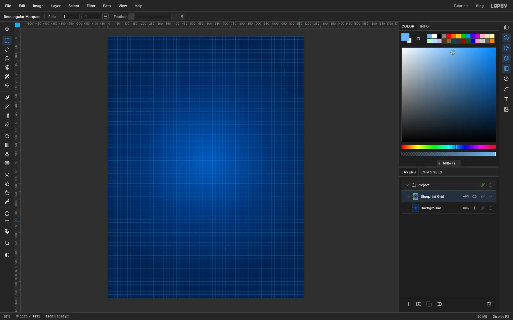

Select **Background**, click **Add Layer** and rename it `Blueprint Grid`. Choose **Edit → Fill with Pattern…**, pick the tile you just defined and click **Apply**. Then set the layer's opacity to **40%** so the grid sits behind the drawing like printed paper rather than a cage.

## Build the shell from chambers

A nautilus shell is a **logarithmic spiral**: every full turn is about **2.9 times wider** than the one inside it. You can draw that by eye with a simple rule.

1. Pick an *eye* for the spiral at about **x 490, y 765**. Hover the pointer there and check the **X / Y** readout in the status bar.
2. Start 64 px to the right of the eye and travel counter-clockwise. Every 30° around, put the next point about **9% farther out**. After a little over two turns you land at the upper right, near **x 970, y 415**. The finished shell fits between about x 170 and x 1030, which leaves room for callouts either side.
3. Add a layer called `Chamber Tints`. Each chamber is a slice between two lines running from the inner whorl out to the outer whorl. With the **Lasso** ([[L]]), click around one slice, choose **Edit → Fill** with `#2A78D2`, then lasso the next slice and fill it with `#3A8CE6`. Alternate the two blues all the way round, leaving the last three-quarters of the outer whorl for the next layer. About twenty chambers is plenty.
4. Add a layer called `Body Chamber`, lasso that long outer stretch in one go and fill it with `#9ADBFF`.

Afterwards drop `Chamber Tints` to **60%** and `Body Chamber` to **35%**, so the grid and construction lines show through. The next screenshots show those values.

> **Tip:** Don't worry if your spiral isn't mathematically perfect. A slightly wobbly nautilus looks better than a stiff one, and the grid makes any lopsidedness easy to spot.

## Trace the outline and add the septa

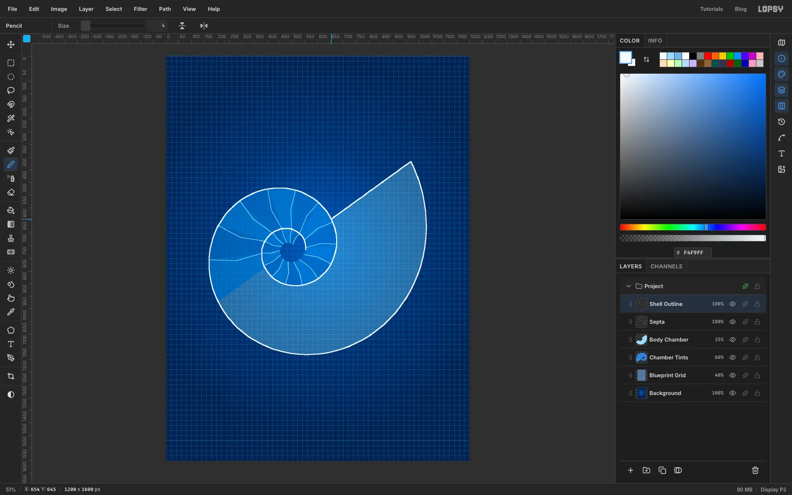

Add a layer called `Septa`. With the **Pencil** at **Size 2** in `#9ADBFF`, draw a line across each chamber boundary from the inner whorl to the outer one. About a dozen is enough to read as a chambered shell. Click the inner point, then [[Shift]]+click a middle point nudged slightly sideways, then [[Shift]]+click the outer point. The slight bow makes them look curved, as the real ones are. (The screenshot shows all twenty-odd.)

Add a layer called `Shell Outline`. Switch to **Size 4** in chalk white `#F4F9FF` and follow the whole spiral, from the eye outward, with [[Shift]]+clicks about 30° apart. Close the mouth with one straight white line for now.

## Add four observation ports

Add a layer called `Portholes` and work along the body chamber from the tight end to the open end, making each port a little bigger than the last:

1. Drag a circle with the **Elliptical Marquee** and fill it with chalk white.
2. **Select → Shrink…** by about 6 px and fill with `#082B66`.
3. **Shrink…** again by about a quarter of the radius and fill with `#1B6FD0`.
4. Deselect, then click eight single Pencil dots at Size 3 in `#9ADBFF` around the rim for rivets.

## Lay down the construction lines

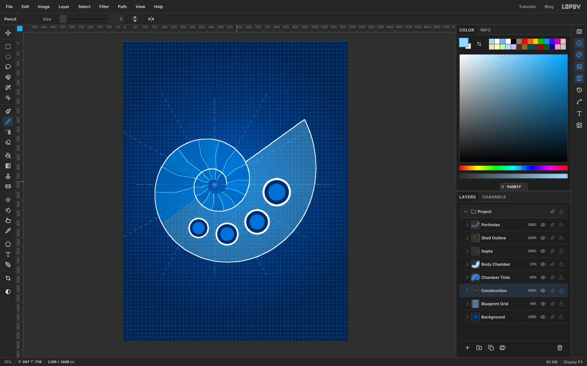

Technical drawings keep their construction lines. Select `Blueprint Grid` and add a layer called `Construction`, so it sits underneath the shell. With the **Pencil** at **Size 1** in `#9ADBFF`:

1. Draw a horizontal and a vertical **centre line** through the eye. Make them dash-dot by drawing a long segment ([[Shift]]+click), leaving a small gap, and repeating.
2. Draw a **growth ray** every 30° around the eye, about 560 px long. Dashes of about 16 px with 16 px gaps look best. A dozen solid rays at low opacity would also work, and is quicker.
3. Optionally click a ring of single dots at a few radii to mark the whorl growth. They are only 1 px, so they disappear at screenshot size, but they show in the export.

## Fit the propeller, bubbles and periscope

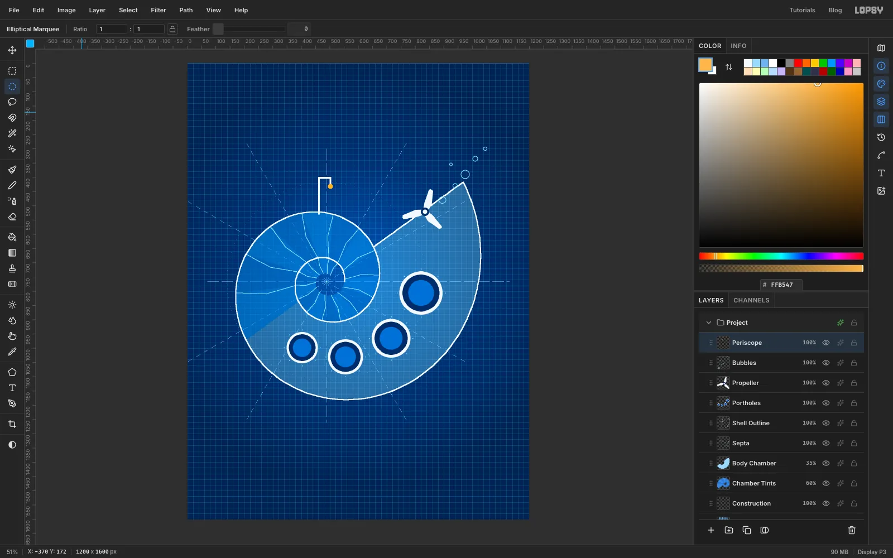

Select `Portholes` and add three layers above it:

- `Propeller`: pick a hub point near the shell's open mouth. With the **Lasso**, draw one blade as a long, slightly kinked kite pointing out from the hub and fill it chalk white. Draw two more blades the same way, each turned about 120° around the hub. (You could also fill one blade, duplicate the layer and rotate it with the Move handles twice, then merge them.) Finish with a navy circle on the hub and a smaller white one inside it.
- `Bubbles`: fill six cyan circles of different sizes with the **Elliptical Marquee**, **Shrink…** each by 2 and press [[Delete]] to hollow them into rings.
- `Periscope`: with the **Pencil** at **Size 6**, draw a stalk up from the shell, a hook to the right and a short drop, then dot an amber `#FFB547` lens at the end.

## Add the sheet border and the title

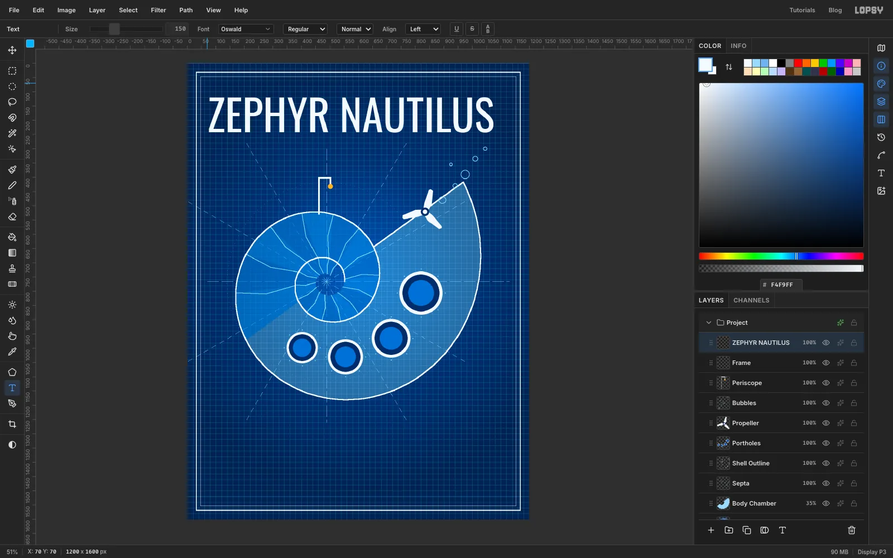

Add a layer called `Frame` above everything. Set the foreground to chalk white and, with the **Rectangular Marquee**, drag a rectangle about 30 px in from the edges. **Fill** it, **Shrink…** by 3 and press [[Delete]] for a 3 px rule. Make a second rectangle about 16 px inside that one, fill, **Shrink…** by 1 and delete for a hairline.

Pick the **Text** tool, choose **Oswald** and set the **Size** to 150. Click in the empty top-left corner of the page and type `ZEPHYR NAUTILUS`. Press [[Tab]] to commit it.

> **Tip:** Set the font and size **before** you click, and click in empty canvas. If a text layer is active when you change the font or size, that layer is restyled, and a click inside an existing text box edits that box instead of making a new one. Click a plain pixel layer first to be safe.

## Add the subtitle, dimension lines and callout leaders

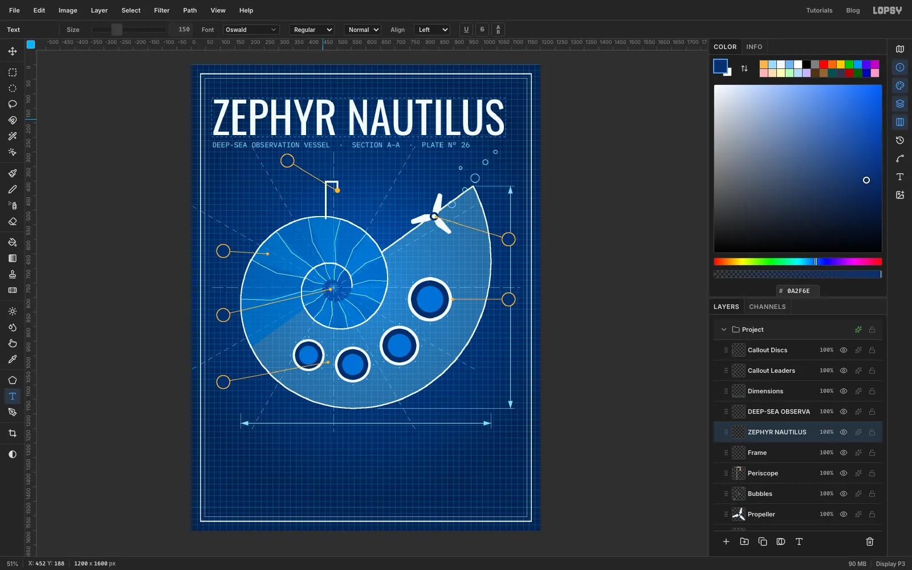

Select a pixel layer, switch the font to **IBM Plex Mono**, set the size to 25 and the foreground to `#9ADBFF`. Click below the title and type `DEEP-SEA OBSERVATION VESSEL  ·  SECTION A–A  ·  PLATE Nº 26`.

Add a layer called `Dimensions`. With the Pencil at Size 2 in `#9ADBFF`, draw a horizontal dimension line under the shell and a vertical one to its right, each with two thin **extension lines** (Size 1) reaching out from the extremes of the shell. Lasso a small cyan triangle at each end for the arrowheads.

Add `Callout Leaders` and `Callout Discs` layers. Pick six features (periscope, propeller, the ports, the septa, the eye and the body chamber), put a disc in the margin beside each, and draw a Size 2 amber `#FFB547` leader from each disc to its feature, ending in a dot. For the discs, fill an ellipse amber, **Shrink…** by 3 and fill again in navy `#0A2F6E`.

## Number the callouts

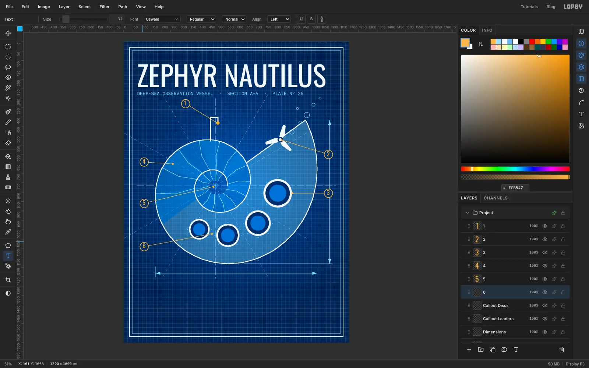

Set the foreground to amber, the font to **Oswald** and the size to 32. Click a plain pixel layer first, then click beside each ring in empty space and type its number. A text click inside an existing box edits that box, so keep the clicks outside other text. Number the rings 1 to 6 in legend order (periscope, propeller, ports, septa, eye, body chamber). If a digit lands off-centre, select its layer and drag it with the **Move** tool until it sits in the middle of its ring, with a band of navy all round.

## Draw the title block frame

Add a layer called `Title Block`. With the Pencil at **Size 3** in chalk white, draw the table's outline along the bottom of the sheet, inside the hairline frame and about a fifth of the sheet tall. Then:

1. Split it into three columns with two vertical lines at **Size 2**. Make the right-hand column a little narrower than the other two.
2. In `#9ADBFF` at **Size 1**, draw four horizontal row lines across the right column, and a rule under the heading of each of the other two.
3. For the scale bar, drag four short marquees of equal width side by side near the bottom of the middle column. Fill them alternately white and navy, then outline the whole bar with a thin white Pencil line.

> **Tip:** With nothing selected, a single click with the Rectangular Marquee opens a dialog where you can type exact **From** and **To** corners. That makes the box and the scale bar easy to line up.

## Fill in the title block and dimension labels

Type each block in **IBM Plex Mono**. Press [[Return]] for each new line, and keep a couple of spaces between each label and its value.

The legend, in `#9ADBFF` at size 19, with `LEGEND` as a white heading at size 20 above it:

- `1 PERISCOPE`
- `2 SCREW PROPELLER`
- `3 OBSERVATION PORTS`
- `4 SEPTA (21)`
- `5 PROTOCONCH`
- `6 BODY CHAMBER`

The specification list, with a white `SPECIFICATION` heading:

- `LENGTH 8.60 M`
- `HEIGHT 7.62 M`
- `CHAMBERS 21 + 1`
- `GROWTH x2.9 / TURN`
- `CREW THREE`

The plate details, one text layer per row so each sits on its own row line (size 21):

- `PLATE Nº 26`
- `SCALE 1 : 20`
- `DRAWN A. FORSYTH`
- `DATE 01.10.2026`
- `SHEET 1 OF 1`

Under the scale bar, type `0       1       2       3       4 M` at size 13. Finally, type `8.60 M` below the horizontal dimension line, and `7.62 M` beside the vertical one, both at size 28.

> **Tip:** The legend and specification texts are tall, so their boxes cover the spot where the scale numbers go. Tuck the scale labels clear of those boxes, or the click will add to the list instead of making a new label.

The `7.62 M` label lands right on top of callout 3. We'll fix that next.

> **Tip:** For small print, type it in `#E6F4FF` straight away. It reads much better than `#9ADBFF` on this blue. I didn't, which is why there's a clean-up step at the end.

## Rotate the vertical dimension label

Delete the `7.62 M` layer and type it again at size 28 in clear canvas lower on the right, where it won't touch callout 3. Then switch to the **Move** tool: the text layer's rotation handles appear around it. Drag the handle outside the top-left corner a quarter turn **counter-clockwise** so the label reads bottom to top. (Holding [[Cmd]] while you drag snaps the angle to 15° steps, so it lands on exactly -90°.) Press [[Cmd+D]] to commit. Text stays live, so it can still be edited.

## Group the vessel and move it as one

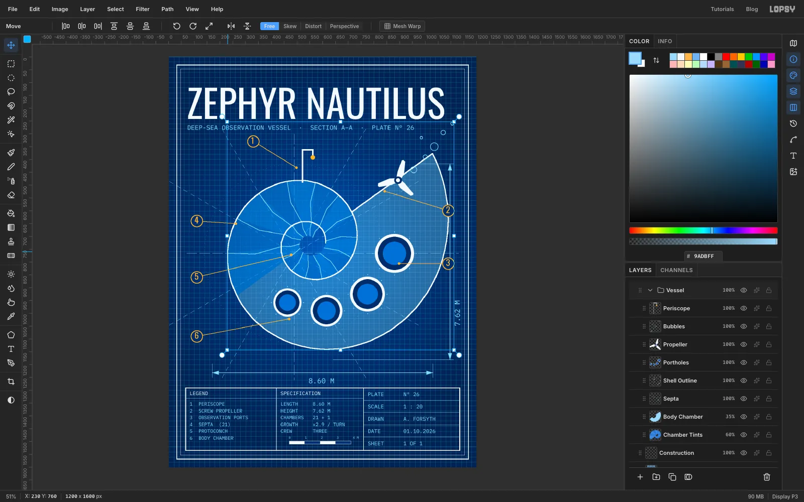

Click `Periscope` in the Layers panel, then [[Shift]]+click `Chamber Tints` to select that whole run of layers. Choose **Layer → Group Layers** and rename the new group `Vessel`.

Now test it: pick the **Move** tool and drag the shell. All eight layers travel together. Press [[Cmd+Z]] and the whole drawing snaps back exactly; [[Cmd+Shift+Z]] sends it forward again. Undo once more to leave it where it was.

## Add glows to make the white lines shine

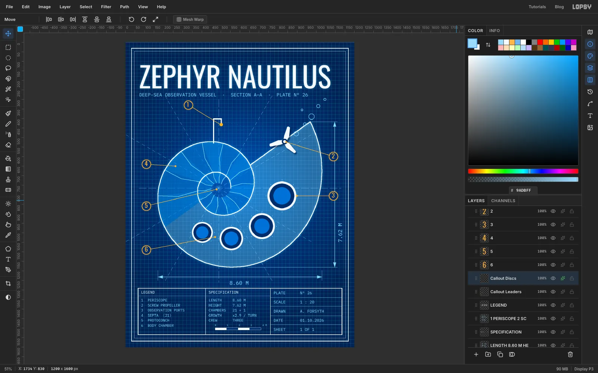

Open each layer's effects drawer (✦) and enable:

- `Shell Outline`: **Outer Glow**, Size 18, Opacity 65, colour `#7CC8FF`
- `ZEPHYR NAUTILUS`: **Outer Glow**, Size 22, Opacity 45, colour `#8FD3FF`
- `Callout Discs`: **Outer Glow**, Size 10, Opacity 60, colour amber

## Vignette and paper grain

Add a top layer called `Vignette`. Pick the **Gradient** tool, type **Radial**, and in **Advanced…** set three stops: `#000000` at 0 with 0% alpha, `#031634` at 0.6 with 0% alpha and `#020E26` at 1 with 80% alpha. Drag from the middle of the sheet to beyond the bottom-right corner.

Add a layer called `Paper Grain`, fill it with `#808080`, run **Filter → Add Noise…** at **Amount 45** in **Mono**, set its blend mode to **Overlay** and its opacity to **30%**.

## Look critically, then refine the shell

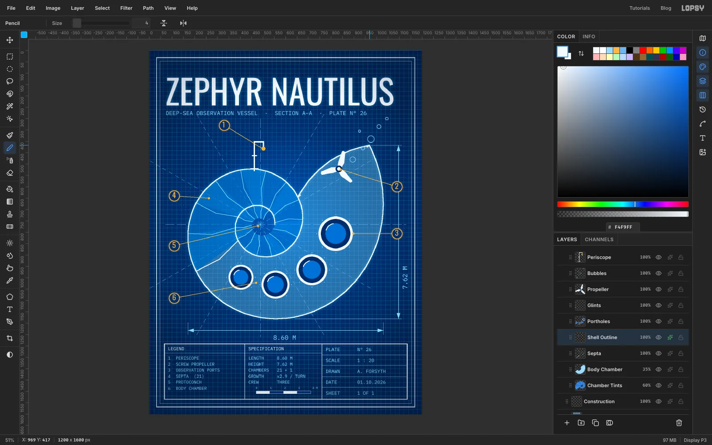

Export a draft and ask someone (or an AI art director) for a harsh critique. Mine found three drawing problems, all fixable with basic tools:

- **A straight-cut mouth.** The open end at the upper right was a hard diagonal, which looks nothing like a real shell. On `Body Chamber`, lasso a curved, lens-shaped bulge that bows outward over the straight edge and fill it with `#9ADBFF`. On `Shell Outline`, lasso a thin strip around the old straight line and press [[Delete]], then draw the new curved lip with the Pencil at Size 4 using a dozen [[Shift]]+clicks.
- **An unexplained seam** where the two tints meet. On `Septa`, add one more septum along it. I made this one white at Size 3 so it reads as a heavier wall between the older chambers and the open body chamber.
- **Flat portholes.** Add a `Glints` layer above `Portholes` and draw a short white arc in the upper left of each glass with the Pencil at Size 3.

I also dropped `Vignette` to **40%**, because at full strength it greyed out the text.

## Brighten the small print

Dim blue on dark blue is hard to read. (If you typed your small print in `#E6F4FF` from the start, skip this.) On each small text layer (the legend, specification, plate rows and scale labels, and the two dimension labels) open the effects drawer and add a **Color Overlay** of `#E6F4FF`. Then pick the subtitle layer, switch to **Move** and drag it down about 14 px so it stops crowding the title.

## Export and save

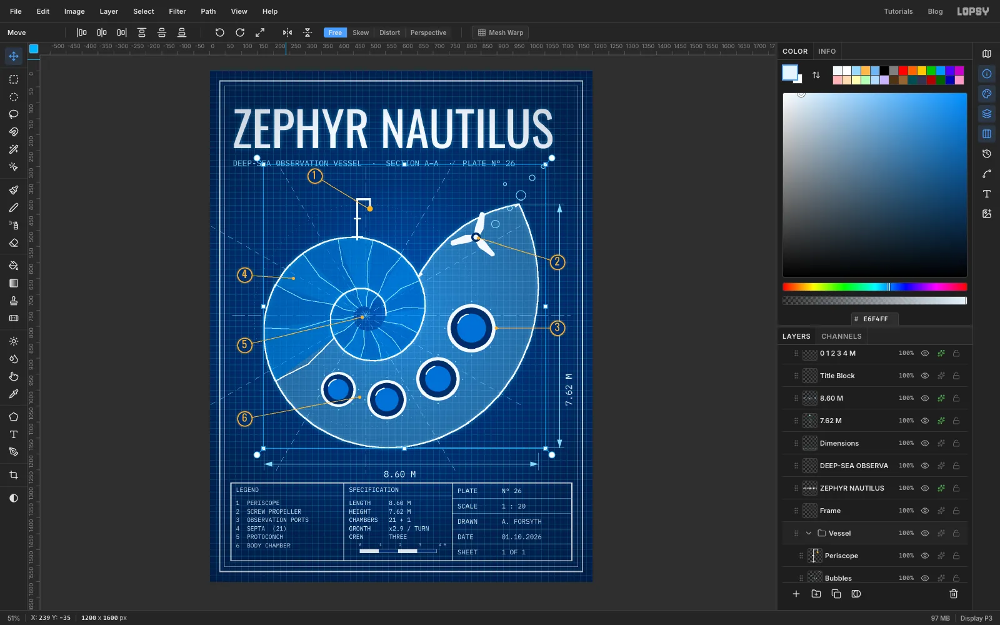

Choose **File → Quick Export PNG** for the poster and **File → Save Project** to keep the layers. Use **Follow along in Lopsy** at the top of this page to open the finished project and look at how it's built.
