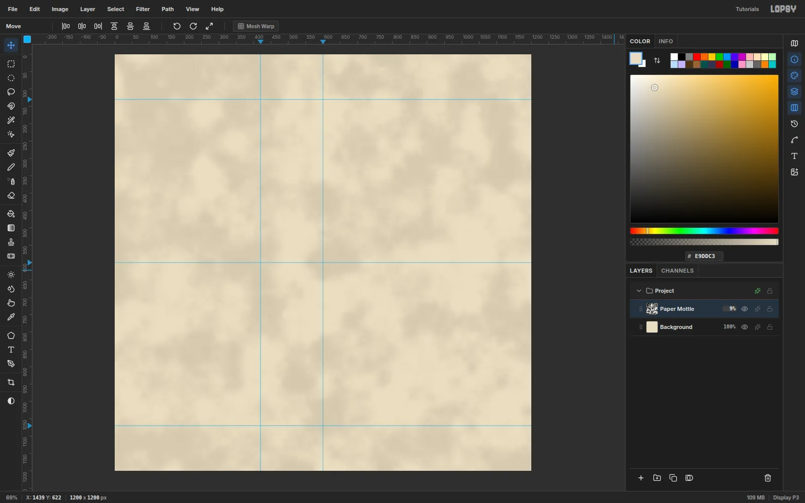
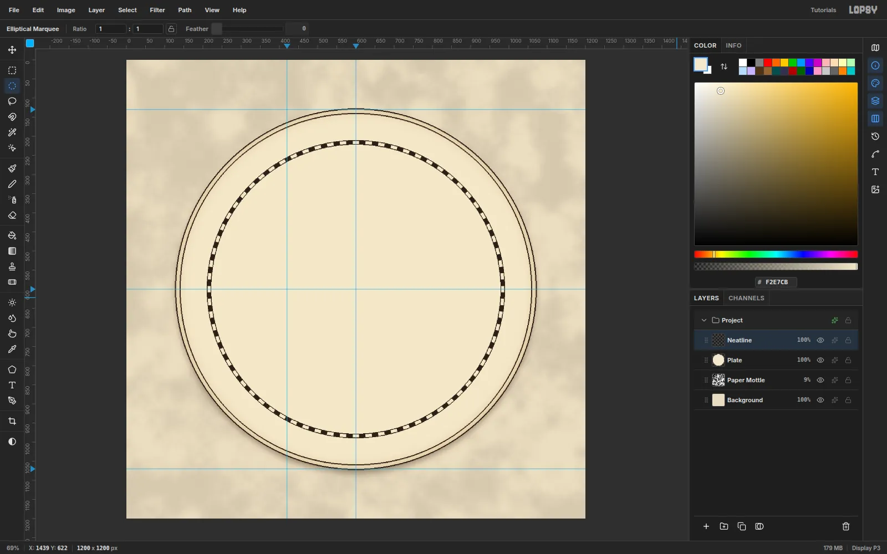
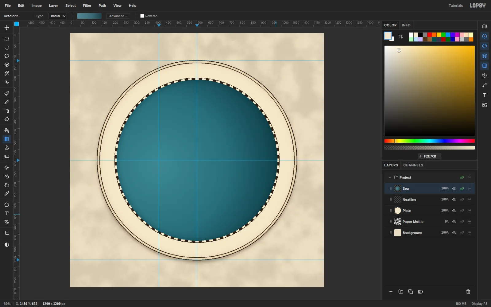
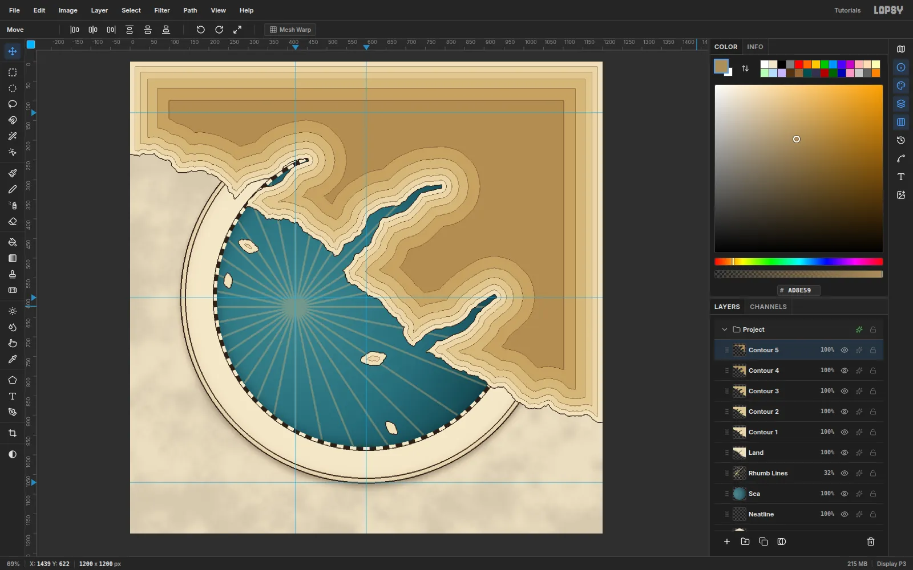
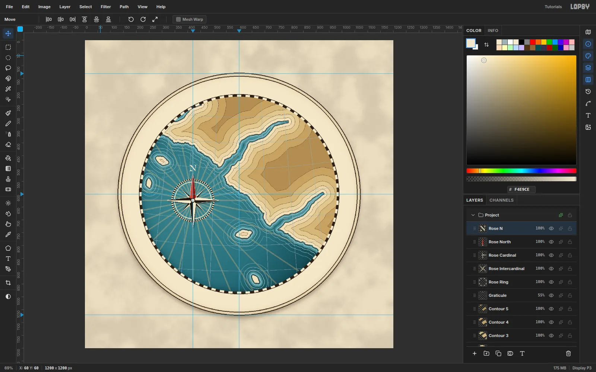
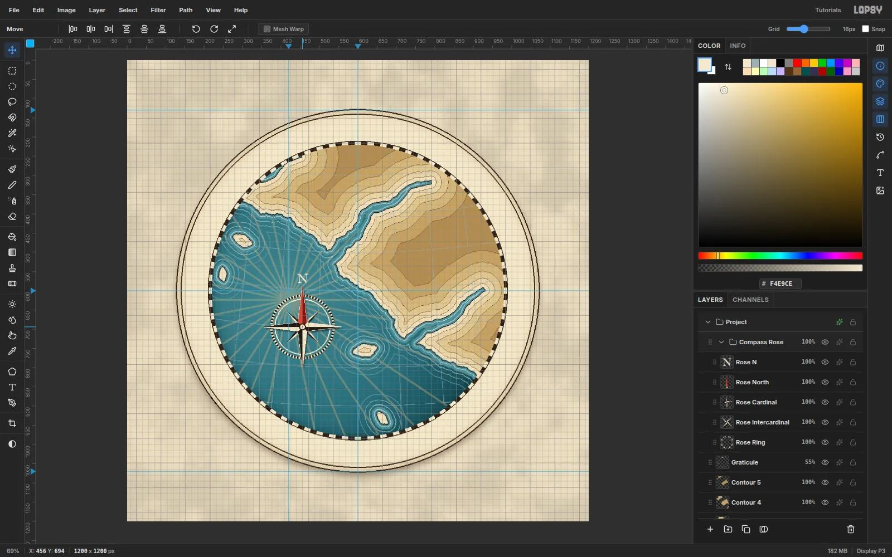
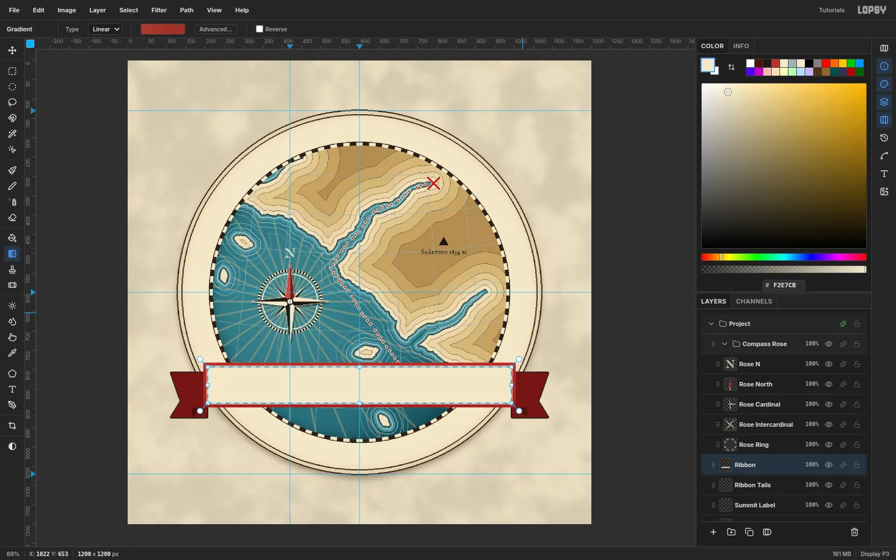
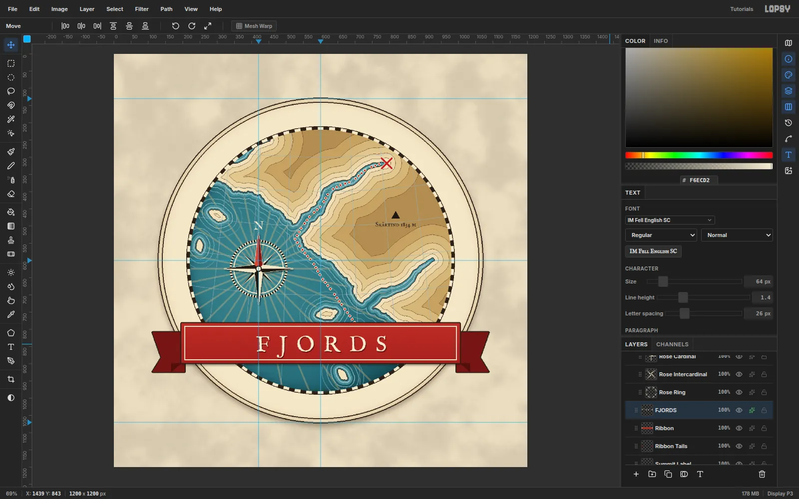
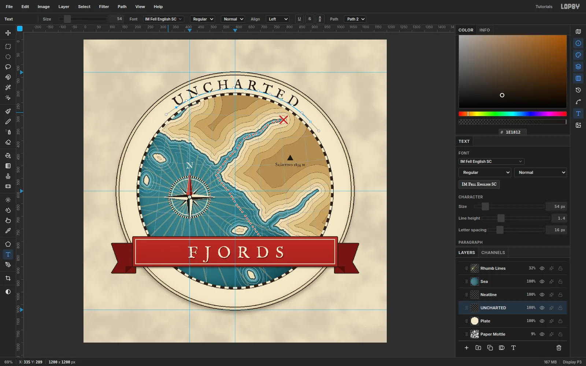
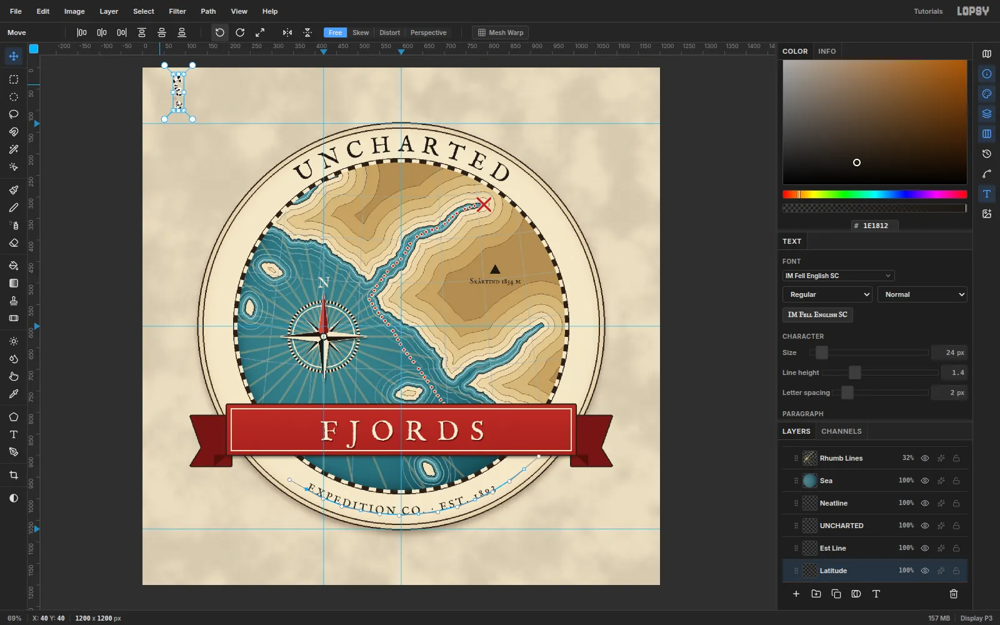

Antique sea charts are full of ready-made graphic devices: rhumb lines fan
out of a compass rose, engraved waterlines ripple round every coast, contour
tints step up into the hills, and a chequered degree border frames it all.
In this tutorial you'll turn those devices into an emblem logo for an
imaginary outfitter, **Uncharted Fjords Expedition Co.**

The chart shows a rocky northern coast cut by three fjords. A dotted
expedition route runs up the longest one to an X. **UNCHARTED** arches over
the top, a red ribbon carries **FJORDS**, and the coordinates sit on the rim.

Almost every shape is a selection that you fill, grow, shrink or invert. The
**Sunburst** filter draws both the degree border and the rhumb lines, and the
Pen tool gives the seal lettering its curves.

The palette:

- Paper `#E9DDC3`, plate cream `#F2E7CB`, ink `#2B2118`
- Sea `#4F8591` → `#3A6B78` → `#1F404A`, waterlines `#CFE0DC`
- Land `#EFE2C0` → `#AD8E59` (in flat steps)
- Contour ink `#6E5234`
- Ribbon red `#AE3A2E` / `#9A2E26`, route red `#B8322A`

Every face is **IM Fell English SC**, a revival of 17th-century type that
suits old maps. Its figures are old-style and its J drops below the baseline,
and you'll allow for both.

## Create the document and guides

Create a **1200 × 1200** document. The emblem is centred on the page, so
[[Cmd]]-click the middle of the top ruler and the middle of the left ruler.
[[Cmd]]-clicking a ruler snaps the guide to a layout fraction, so both land
exactly on the ½ mark and give you a centre cross.

Then click the left ruler at about `130` and `1070` for the top and bottom
of the emblem, and click the top ruler at about `420`. That last guide marks
the compass rose, which sits on it about 24 px below the centre line.

## Lay down the parchment

Click `Background`, set the foreground to `#E9DDC3` and choose
**Edit → Fill**. Rename `Layer 1` to `Paper Mottle` and run
**Filter → Clouds…** at **Scale** `14`. Open its effects drawer, set the
blend mode to **Multiply**, and drop the layer to `9%` opacity. The result
is a quiet mottle, not a cloudy sky.

## Make the plate and its double rule

Add a layer named `Plate`. With the **Elliptical Marquee**, hold [[Cmd]] and
drag a circle whose edges touch the top and bottom guides, centred on the
centre cross. That's a 940 px disc. Fill it with `#F2E7CB`.

> **Tip:** Every circle in this logo is centred, and a few pixels off shows.
> With nothing selected, a single click (no drag) with the Elliptical Marquee
> opens a dialog where you type the corners. For the plate, enter **From**
> `130`, `130` and **To** `1070`, `1070`. The later steps give these values
> in brackets.

Now build a double rule:

1. Choose **Select → Shrink…** `8` and fill with the ink `#2B2118`.
2. Choose **Select → Shrink…** `2` and fill with the cream again.

That leaves a 2 px ink ring 8 px inside the rim. Press [[Cmd+D]].

In the effects drawer, add these effects:

- **Stroke** `3` px in ink.
- **Inner Glow**, Size `46`, Opacity `45`, `#9C7A45`, for an aged rim.
- **Drop Shadow** with Offset Y `10`, Blur `26`, Opacity `45`, `#3A2A14`.

Click **Rasterize Layer Style** so the effects become pixels. Baked effects
keep a big document fast.

## Draw the degree bars with Sunburst

Add a layer named `Neatline`. Select a centred disc of radius 388 (From
`212`, `212` to `988`, `988`) and fill it with ink. Set the foreground to
the plate cream.

Choose **Filter → Sunburst…** with these settings, then click **Apply**:

- **Rays** `72`, **Width** `50`, **Taper** `0`
- **Center X** `50`, **Center Y** `50`

Half of every slot turns cream, so you get alternating wedges.

## Hollow out the neatline

Select a centred disc of radius 380 (From `220`, `220` to `980`, `980`) and
press [[Delete]]. Only an 8 px band of alternating bars is left, like the
degree border of an old chart. Deselect, add a `2` px ink **Stroke**, and
rasterize the layer style.

## Fill the sea

Add a layer named `Sea` and select the radius 380 disc again. Pick the
**Gradient** tool, set it to **Radial**, and open **Advanced…**. Set three
stops:

- `#4F8591` at 0%
- `#3A6B78` at 60%
- `#1F404A` at 100%

Start the drag on the compass guide, just below the centre line, and drag
straight right to the neatline, so the water is lightest where the rose will
sit. Deselect. Add an **Inner Glow** of Size `40`, Opacity `55` in
`#12272D` to darken the edge, then rasterize.

## Fan out the rhumb lines

Add `Rhumb Lines`. Select a centred disc of radius 378 (From `222`, `222` to
`978`, `978`) so the lines stop at the border, and set the foreground to
`#D9BE84`. Run **Sunburst** again with these settings:

- **Rays** `32`, **Width** `5`, **Taper** `50`
- **Center X** `35`, **Center Y** `52`

Taper 50 gives parallel-sided lines instead of wedges. Center X and Y are
percentages of the page, and 35% / 52% of 1200 px puts the burst right on
the compass point. Deselect and set the layer to `32%` opacity.

## Lasso the coastline

Add a layer named `Land`. With the **Lasso**, draw a rocky coast that runs
diagonally across the chart. Enter at the left edge about a fifth of the way
down, cross the compass guide about a third of the way down, run through the
centre cross, and leave the right edge about three quarters of the way
down. Then close the selection round the top-right
corner, outside the canvas, so the land is everything above the line.

Keep the line nervous and jagged. Real coasts double back on themselves.

Choose **Select → Feather…** `1` to soften the stair-steps, then fill with
`#EFE2C0`.

## Cut the fjords

Fjords are long, narrow channels that get thinner toward their heads. For
each one, lasso a wiggling channel about 30–40 px wide at the mouth and
8 px wide at the head. Feather it by `1`, then press [[Delete]].

1. A short one near the upper left, running up and to the right toward the
   neatline.
2. The main fjord, starting at the coast just above the centre and winding up
   and to the right until its head is close to the neatline at about one
   o'clock.
3. A third one lower down, from the coast below and right of centre, climbing
   up and to the right into the hills.

## Copy, rotate and scale the skerries

On `Land`, lasso a small ragged island about 52 × 30 px in the sea to the
left of the compass guide and fill it. To make an archipelago:

1. Marquee the island and press [[Cmd+C]], then [[Cmd+V]]. The copy is
   pasted in place.
2. Drag the copy with the Move tool.
3. [[Cmd]]-click its thumbnail to select it, then turn it with a corner
   rotation handle and resize it with [[Cmd]] held on a corner scale handle.
   Press [[Cmd+D]] to commit before you move on to the next copy.

Make three copies, scattered through the sea:

- one below the first island, turned 60° and scaled to 70%
- one below and right of the compass, turned −35° and scaled to 125%
- one near the bottom of the chart, turned 25° and scaled to 75%

Finally, **Layer → Merge Down** each copy into `Land`.

## Step the contours inland

Contour tints (hypsometric tints) colour land by height. Here each band is
simply the coast pushed further inland.

First give `Land` a `2` px ink **Stroke** for the coastline and rasterize it.
Then repeat these steps for each band:

1. [[Cmd]]-click the previous layer's thumbnail.
2. Choose **Select → Shrink…** by the amount below.
3. Add a layer named `Contour 1`, `Contour 2` and so on.
4. Fill it, then give it a `1` px `#6E5234` **Stroke** and rasterize.

- `Contour 1`: Shrink `12`, fill `#E7D6AB`
- `Contour 2`: Shrink `14`, fill `#DDC895`
- `Contour 3`: Shrink `18`, fill `#D0B780`
- `Contour 4`: Shrink `24`, fill `#C1A36B`
- `Contour 5`: Shrink `30`, fill `#AD8E59`

## See the hills appear

Because each band shrinks from the one before, the bands follow every
headland and fjord. The stroke on each band reads as an engraved contour line.

## Engrave the waterlines

Click `Rhumb Lines` and add `Shallows`. Load the coast from `Land` (see the
tip below), choose **Select → Grow…** `12` and fill with `#5A8E98`.

Add `Waterlines`. Each ring is made in two moves: grow and fill, then grow
2 px less and delete. Work from the outermost ring inward, because each
Delete clears everything nearer the coast.

1. Grow `46`, fill `#6E989F`
2. Grow `31`, fill `#8AAEB2`
3. Grow `19`, fill `#A9C6C6`
4. Grow `6`, fill `#CFE0DC`

Set the layer to `75%` opacity.

> **Tip:** Load the coast from `Land`'s own row: click `Land`, [[Cmd]]-click
> its thumbnail, then click back on the layer you're working on before you
> Grow. Clicking back on the row first means [[Delete]] clears only the grown
> area, not the whole layer.

## Clip everything to the sea disc

The land and rings run far past the chart. Select the radius 380 disc and
choose **Select → Inverse**. Then click each of these layers and press
[[Delete]]:

- `Shallows`
- `Waterlines`
- `Land`
- `Contour 1` to `Contour 5`

Deselect.

## Draw a conic graticule

Old charts often use a conic projection. The meridians lean toward a pole
far above the top of the map, and the parallels curve around it.

Add `Graticule` above `Contour 5` and select a centred disc of radius 379
(From `221`, `221` to `979`, `979`). Set the **Brush** to Size `2`, Hardness
`100`, Spacing `10`, colour `#9DB0B6`.

- **Meridians:** draw seven, crossing the centre line every 100 px. For each
  one, click near the top of the chart and [[Shift]]-click near the bottom.
  Lean them so they would meet far above the page: the middle one is
  vertical, and the outer ones splay out about 100 px from top to bottom.
- **Parallels:** every 100 px down the chart, draw a gentle curve with a
  chain of [[Shift]]-clicks. Make each one sag slightly in the middle, about
  20 px lower on the centre line than at the outer meridians.

Set the layer to `55%` opacity.

## Build the compass degree ring

Add `Rose Ring` and select a radius 84 disc centred on the compass point
(From `336`, `540` to `504`, `708`). Fill it with `#1E1812`.

Run **Sunburst** with **Rays** `64`, **Width** `50`, **Taper** `0`, and
**Center** `35` / `52`. Delete a radius 78 disc on the same centre (From
`342`, `546` to `498`, `702`) to leave the ticks.

For a hairline inside the ticks, select a radius 73 disc (From `347`, `551`
to `493`, `697`) and fill it cream. Then choose **Shrink** `2` and delete.

## Draw the cardinal star

Add `Rose Cardinal`. Each point is two thin triangles, lassoed and filled:

- **Light half:** centre, tip, and a shoulder 16 px out at 45° on the left.
  Fill it cream.
- **Dark half:** the same on the right. Fill it `#1E1812`.

Make the points 104 px long, pointing north, east, south and west. The split
shading makes the star look faceted.

## Rotate a copy for the intercardinals

Marquee the star, press [[Cmd+C]] and [[Cmd+V]], and name the pasted copy
`Rose Cardinal` (it lands on top). Rename the original underneath
`Rose Intercardinal`.

[[Cmd]]-click its thumbnail, pick the **Move** tool, and drag a corner
rotation handle with [[Cmd]] held. [[Cmd]] snaps rotation to 15° steps, so
stop at exactly **45°**. Press [[Cmd+D]] to commit.

## Scale the intercardinals to 60%

[[Cmd]]-click the thumbnail again. Hold [[Cmd]] and drag a corner scale
handle inward until the star is **60%** of its size. Press [[Cmd+D]], then
nudge it back so it's centred on the compass point with the arrow keys
([[Shift]]+arrow moves 10 px at a time).

Select the top `Rose Cardinal` and give it effects:

- **Stroke** `1` px in cream.
- **Drop Shadow** with Offset `3`, `4`, Blur `6`, Opacity `60`, `#050D14`.

Rasterize the layer style.

## Add the red north point and hub

Add `Rose North` and refill the north point's two halves in `#C8503E` and
`#7A2118`.

Build the hub from three circles on the compass point. At this size, draw
each circle fresh rather than shrinking the last one, so they stay round:

1. A radius 9 disc (From `411`, `615` to `429`, `633`) in `#1E1812`.
2. A radius 7 disc (From `413`, `617` to `427`, `631`) in cream.
3. A radius 3 disc (From `417`, `621` to `423`, `627`) in red.

Finally, set an **N** in IM Fell English SC at `34` px in `#F4E9CE`. Nudge
it so it's centred 22 px above the north tip.

## Group the rose and test a snapped move

Click `Rose Ring`, [[Shift]]-click `Rose N`, and choose
**Layer → Group Layers**. Rename the group `Compass Rose`.

Turn on **View → Show Grid**. It switches on **Snap to Grid** as well, and a
**Snap** checkbox appears in the options bar. With the group active, drag it
with the Move tool. Every piece travels together and snaps to the grid.

Press [[Cmd+Z]] to put it back, because the rhumb lines are centred on the
original spot. Then untick **Snap** in the options bar and turn off
**View → Show Grid**.

## Plot the route and the summit

Add `Route` above `Graticule`. Set the **Brush** to Size `6`, Hardness
`100`, Spacing `200`. At 200% spacing every dab stands alone, so the stroke
becomes a dotted line.

In `#B8322A`, click in the sea low on the chart, right of centre. Then
[[Shift]]-click your way up through the sea and along the middle of the main
fjord, stopping just short of its head.

Set Spacing back to `10` and draw a 30 px **X** at the fjord's head. Give
the layer a `2` px cream **Stroke** so the dots read against the water, then
rasterize.

Add `Summit` and fill a small triangle, about 24 px wide, in the hills to
the right of the main fjord with `#1E1812`. Under it, set `Skårtind 1834 m`
in IM Fell English SC at `18` px.

## Build the ribbon

Click `Summit Label` so the new layers stay outside the Compass Rose group.

1. Add `Ribbon Tails` and lasso two swallow-tailed ends. Each one sits
   26 px lower than the band and reaches 84 px past it. Fill them `#6E1F1A`.
2. Fill the small fold triangles `#4A150F`.
3. Add a `3` px ink **Stroke** and rasterize.

Add `Ribbon` and marquee the band across the lower third: about 808 × 116 px,
centred on the vertical centre guide, with its ends just inside the plate's
rim (From `196`, `782` to `1004`, `898` in the Rectangular Marquee's click
dialog). Fill it with a near-flat vertical gradient from `#AE3A2E` to
`#9A2E26`.

For the inner rule:

1. **Shrink** `7` and fill cream.
2. **Shrink** `2` and repaint the gradient, leaving a hairline rule.

Add a `3` px ink **Stroke** and a soft **Drop Shadow**, then rasterize.

## Set and recolour the wordmark

With the **Text** tool at `64` px, IM Fell English SC and `#1E1812`, click
an empty corner of the canvas and type `FJORDS`. Press [[Tab]].

In the **Text** panel, set **Letter spacing** to `26`. Click into the word
again, press [[Cmd+A]], and change the colour to `#F6ECD2`. The selected
text updates as you pick. Press [[Tab]].

## Seat the wordmark in the ribbon

Centre the word on the **capitals**, not on its bounding box. The J hangs
about 0.28 em below the baseline, so a box-centred word would ride high.

Move it so the caps sit halfway between the inner rules, with about 25 px
of red above and below them. The J then clears the bottom rule by about
8 px. Add a crisp **Drop Shadow**: Offset `2`, `3`, Blur `0`, Opacity `70`,
`#3D0F0A`.

## Arch UNCHARTED over the top

Click `Plate` and set `UNCHARTED` at `54` px, letter spacing `16`, in
`#1E1812`. Press [[Tab]].

Pick the **Pen** tool. Text on a path starts at the path's first anchor, so
the first anchor sets where the word begins. Trace an arc about 17 px
outside the chequered neatline, round the centre of the page. It crosses the
vertical centre guide about 195 px from the top.

Place five anchors, evenly spaced, from about eleven o'clock over the top to
about half past one. At each one, press and drag a short way along the
curve to pull out handles, so the path bends smoothly.

Click ✓ **Commit path**. Select the `UNCHARTED` layer with the Text tool and
pick the path in the options bar's **Path** dropdown. The caps now sit
midway between the neatline and the plate's inner rule.

If the word lands a little off centre, deselect the path in the **Paths**
panel and draw a fresh arc that starts a little earlier or later. With the
old path selected, Pen clicks edit it instead of starting a new one.

## Set the bottom seal line

Set `EXPEDITION CO. · EST. 1893` at `25` px with letter spacing `5`. For
text along the bottom, the path must run **left to right**, so its letters
face inward and read the right way up.

These letters hang *inside* their path, so draw this arc about 30 px further
out than the top one, so the caps fill the same band as UNCHARTED. It
crosses the vertical centre guide about 1037 px down. Place five anchors
from about seven o'clock round the bottom to about half past four, dragging
out handles as before.

Commit the path and bind the text to it.

## Turn the coordinates upright

Set `69°38'N` and `18°57'E` at `24` px with letter spacing `2`. IM Fell has
no prime sign, so use a straight apostrophe.

- **Latitude:** [[Cmd]]-click the label's thumbnail, pick the **Move** tool
  and click **Rotate 90° CCW** in the options bar. It now reads upward.
- **Longitude:** turn it the other way by dragging a rotation handle with
  [[Cmd]] held, which snaps it to exactly 90°.

Place the latitude in the rim band on the left and the longitude on the
right, each centred on the horizontal centre guide.

## Finish with shading and grain

Select `Ribbon`, pick **Dodge/Burn** in **Burn** mode, and set Exposure `14`
and Size `18`. Click near the left end of the ribbon's lower edge and
[[Shift]]-click near the right end to shade the foot of the ribbon.

Click `FJORDS` and add `Grain`. Fill it with `#808080`, then run
**Filter → Add Noise…** with **Mono**, **Gaussian** and Amount `24`. Set the
layer to **Overlay** at `28%`. The grain gives the flat fills a printed,
paper-like tooth.

## Export the logo

Turn off **View → Show Guides** and check the whole emblem. Choose
**File → Quick Export PNG** for the artwork.

A mark this detailed is for print, signage and hero use. For favicons and
social avatars, save a simplified version: hide the graticule, waterlines and
coordinates, and keep the compass rose and red X on the cream disc.
