Chrome lettering and chrome hearts are all over Valentine's merch right now. The Y2K "liquid metal" look is back.

Chrome is easier to fake than it looks. A polished surface just reflects its surroundings, so you paint a **sky** (light, getting darker toward the horizon), a hard **horizon line**, and a **ground** (dark at the horizon, lighter toward you). Add a few hard white window reflections and the eye reads metal.

In this tutorial you'll make a 5 × 7 card, *You're Electric*: a rosy chrome heart with a cyan lightning bolt through it.

Along the way you'll use:

- the **Lasso** and **Select → Shrink / Inverse / Feather / Grow**
- the **Gradient** tool with the Advanced gradient editor
- **Filter → Sunburst**, **Add Noise** and a gradient **layer mask**
- **Outer Glow**, **Inner Glow**, **Stroke** and **Drop Shadow** effects
- copy and paste, the rotate handle, the Move tool's **Flip Horizontal** and **Merge Down**
- the grid with Snap, a guide, and **Group Layers**
- the Google fonts **Michroma** and **Pacifico**

The palette:

- black cherry `#14040C` with a magenta glow `#9A1646`
- rosy chrome from white `#FFFFFF` through pink `#F48AB4` to near-black `#2A0614`
- electric cyan `#3FE8FF` with a white core
- blush pink `#FFC7DB` for the small type and `#FF9EC2` for the frame

## Make the canvas and a velvet glow

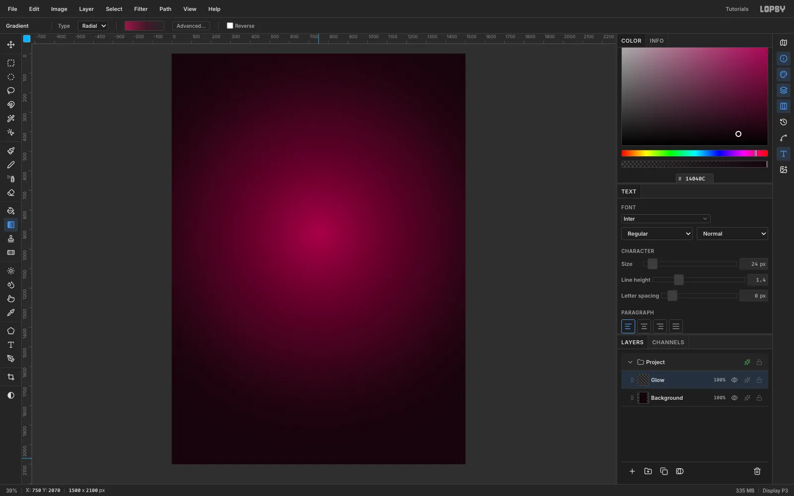

Create a **1500 × 2100 px** document (File → New, unit Pixels). That's a 5 × 7 inch card at 300 ppi.

1. Select the **Background** layer, set the foreground to `#14040C`, and choose **Edit → Fill**.
2. Rename **Layer 1** to *Glow*. Pick the **Gradient** tool, set Type to **Radial**, and open **Advanced…**.
3. Set three stops: `#9A1646` at 0, `#5A0C2A` at 55% (opacity 55%), and `#14040C` at 100% with opacity 0.
4. Drag from the centre of the future heart (750, 920) straight down about 1150 px.

## Burst rays with the Sunburst filter

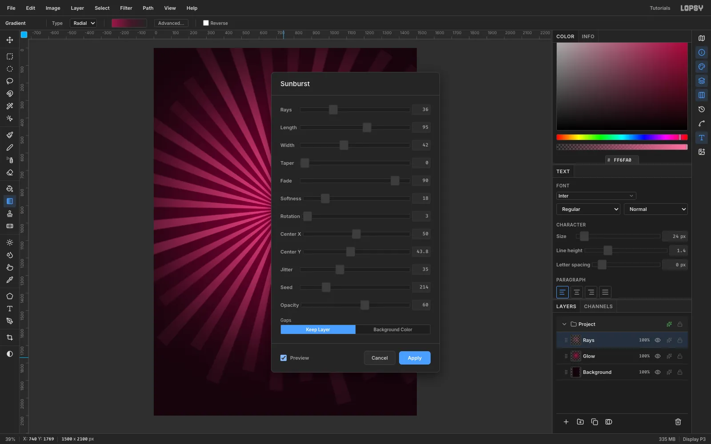

Add a layer called *Rays*, set the foreground to `#FF6FA0`, and choose **Filter → Sunburst**. Tick **Preview** so you can see it.

Use these settings:

- Rays **36**, Length **95**, Width **42**, Taper **0**
- Fade **90**, Softness **18**, Rotation **3**
- Center X **50**, Center Y **43.8** (the rays should fan out from behind the heart)
- Jitter **35**, Seed **214**, Opacity **60**
- Gaps: **Keep Layer**

Click **Apply**. Then set the layer's blend mode to **Screen** in the effects drawer, and its opacity to **30%**.

## Fade the rays with a layer mask

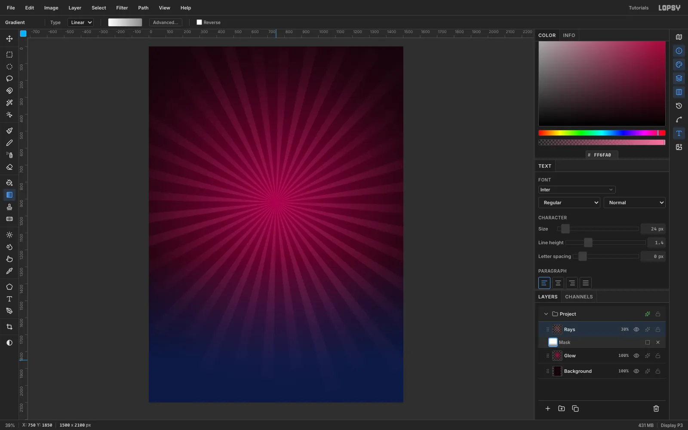

The rays will sit behind the headline later, so fade them out toward the bottom.

1. With *Rays* selected, click **Add Mask** in the Layers panel footer, then click the mask thumbnail (*Edit mask for Rays*).
2. With the Gradient tool, set a Linear gradient from white to `#8C8C8C`.
3. Drag from y 1250 down to y 1850.

The blue tint is Lopsy's mask-edit overlay; it disappears when you click the layer row again.

## Lasso the lightning bolt

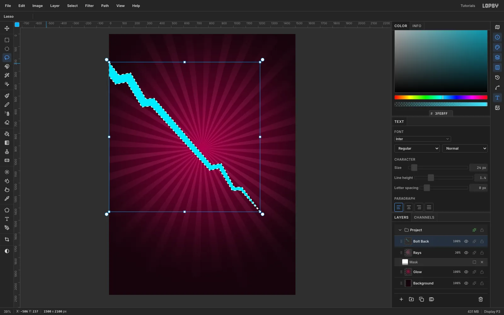

Add a layer called *Bolt Back*. With the **Lasso**, draw a jagged bolt:

- It starts off the **left edge** at about y 170 and runs down-right to a point at about (1230, 1440).
- Make it about 70 px wide at the tail, tapering to a sharp tip.
- Put two sharp zig-zags near the tail and two near the tip, and leave the middle straight (that part will be hidden behind the heart).

Start the lasso on the canvas, not over the ruler: a press on the ruler adds a guide instead.

Fill it with `#3FE8FF` (**Edit → Fill**). Keep the selection.

## Give the bolt a white-hot core

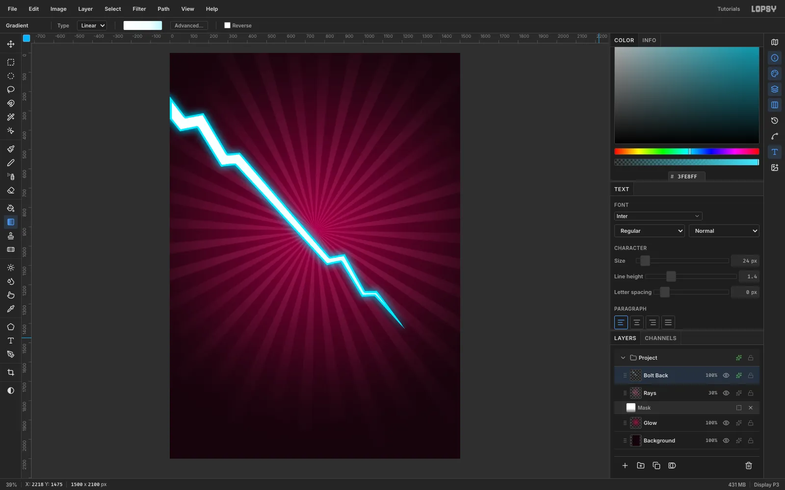

With the bolt still selected, choose **Select → Shrink** and shrink by **9 px**.

Then draw a Linear gradient along the bolt from its tail to its tip, with stops `#FFFFFF` → `#F2FFFF` (70%) → `#BDF6FF`. Only the core is filled, so a thin cyan edge stays around it.

Deselect (⌘D). Open the layer's effects and turn on **Outer Glow**: colour `#1FD6FF`, Size **55**, Spread **14**, Opacity **95**.

## Build the heart's bevelled rim

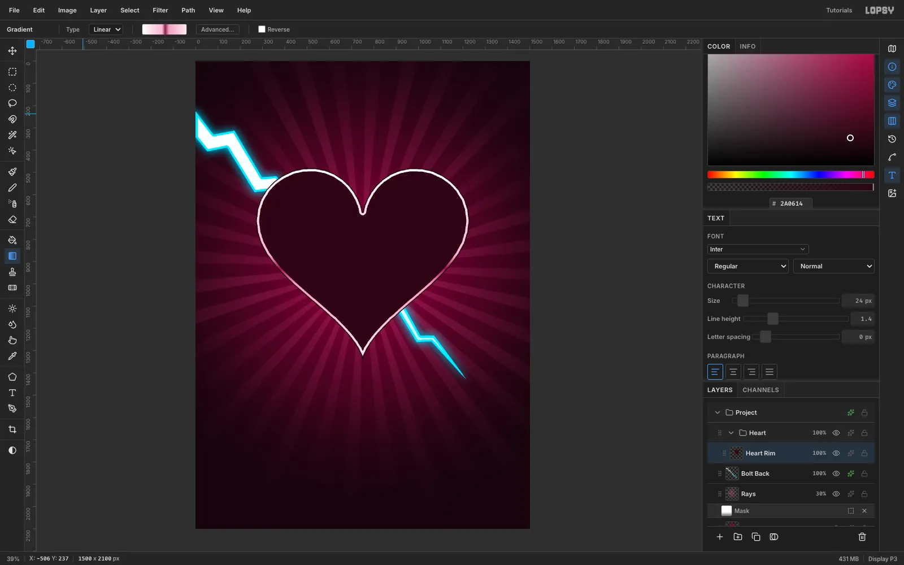

Click *Bolt Back*, then **New Group** and call it *Heart*. Add a layer inside it called *Heart Rim*.

Lasso a heart about **960 px wide and 870 px tall**, centred on x 750, with its top at y 480. Round lobes and a sharp tip matter more than exact numbers.

Now build the rim in three passes, keeping the selection active between them:

1. Fill the heart with `#1A0610` for a dark outer keyline.
2. **Shrink 4 px**, then drag a vertical gradient over the whole heart (y 480 → 1347): `#FFFFFF` 0, `#F7B5CF` 45%, `#8A1E48` 52%, `#F0A0C0` 60%, `#FFE9F2` 100%.
3. **Shrink 9 px** more and fill with `#2A0614`. This leaves a bright bevel between two dark lines.

## Paint the sky reflection

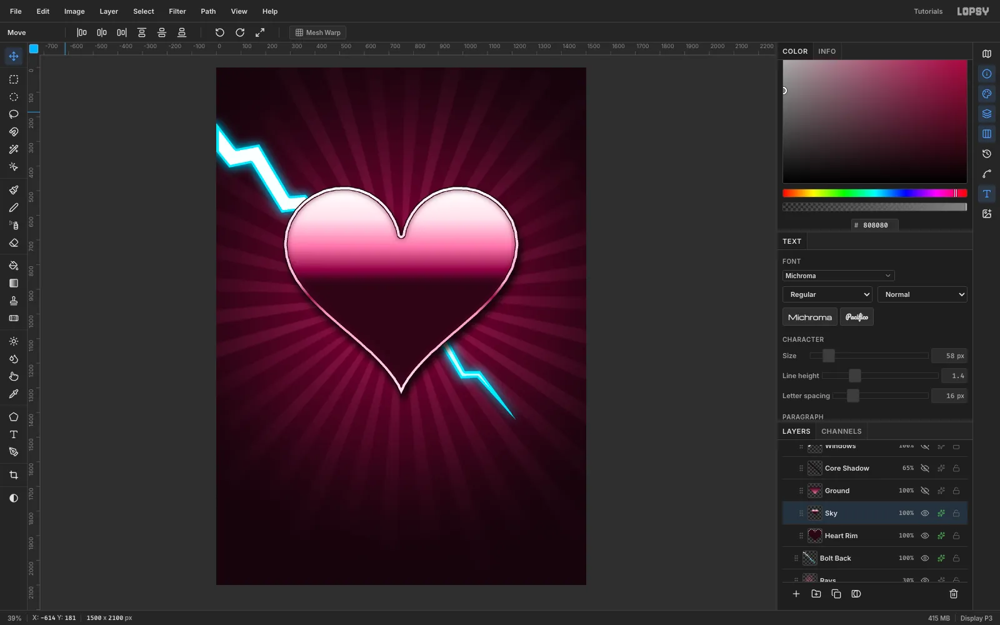

Add a layer called *Sky*. Lasso the heart again, then **Shrink 17 px** so the face sits inside the rim.

Drag a vertical gradient from y 500 to y 880 with these stops:

- `#FFFFFF` 0
- `#FFE1EC` 35%
- `#F48AB4` 70%
- `#C2306A` 93%
- `#7A1238` 100%

(In the last step you'll darken the bottom of this sky further.)

Give *Sky* an **Inner Glow** in `#5A0F2E` (Size **34**, Opacity **70**). The edges darken slightly, which rounds the form.

## Cut a curved horizon

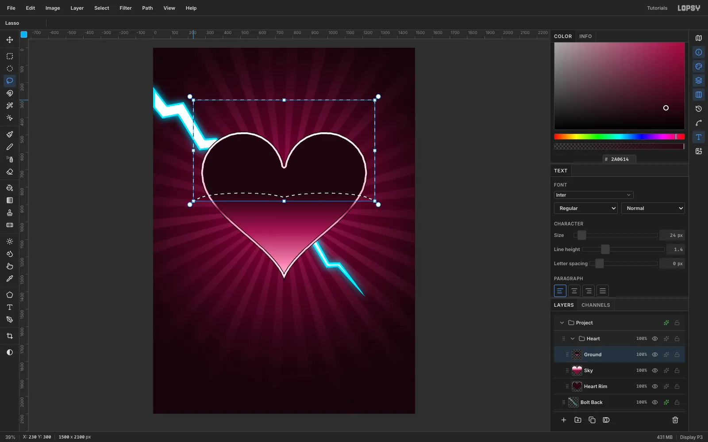

Add a layer called *Ground* above *Sky*. Lasso the heart, Shrink **17**, and drag a vertical gradient from y 830 to y 1340:

- `#1A0610` 0
- `#3A0A1E` 12%
- `#9C2856` 45%
- `#E788AE` 80%
- `#FFE3EE` 100%

This covers the whole face for now.

Now lasso everything **above** the horizon. The horizon should follow the form: arch it gently over each lobe (about 45 px higher over each lobe centre) and dip it at the middle of the heart. Press **Delete**.

A dead-straight horizon is what makes chrome look like a sticker.

## Add a glint on the horizon

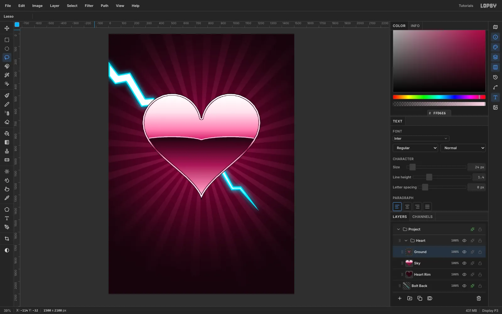

On the *Ground* layer:

1. Set the foreground to `#FFD6E6` and lasso a thin ribbon, 6 px tall, just **above** the horizon line. Fill it.
2. To trim the ribbon's ends, lasso the heart, **Shrink 17**, choose **Select → Inverse**, and press **Delete**.

The bright line against the near-black ground is the strongest chrome cue on the whole card.

## Windows and a core shadow

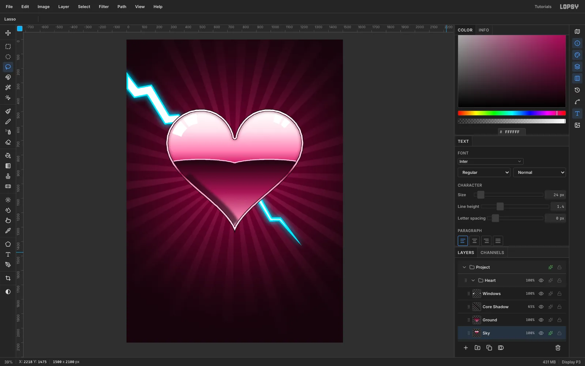

Add a layer called *Core Shadow*. Lasso a crescent about 45 px wide just inside the **lower-left** edge, from the horizon down to the tip. Choose **Select → Feather 18**, fill `#1A0610`, and trim it to the face with the same Shrink 17 / Inverse / Delete trick. Set the layer to **65%**.

Add a layer called *Windows*. Lasso two curved "window pane" bands on the upper left of the left lobe, following its curve. On the right lobe, lasso two smaller ones.

**Feather** each selection by **1 px** before you fill it white. That anti-aliases the edge without softening it; the reflections must stay hard.

Finally give *Heart Rim* a **Drop Shadow**: `#070003`, X **10**, Y **26**, Blur **40**, Opacity **85**.

## Copy the tip of the bolt

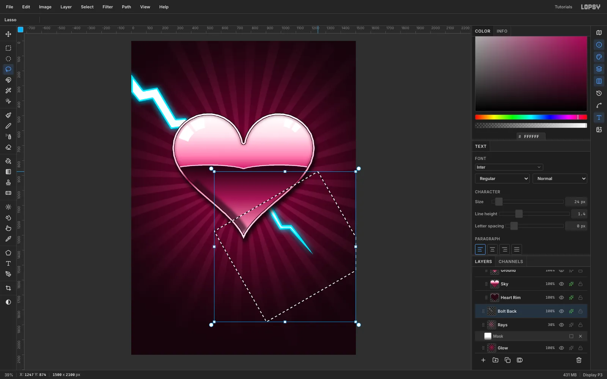

The bolt should look like it **pierces** the heart: behind it at the top left, bursting out of the front at the lower right.

1. Click *Bolt Back*.
2. Lasso a big four-sided area that starts about 50 px **inside** the heart, where the bolt exits, and covers everything toward the tip. Make its top edge perpendicular to the bolt.
3. Press ⌘C, wait a moment, then press ⌘V. The pasted copy lands right above *Bolt Back* in the same place.

## Put the tip in front of the heart

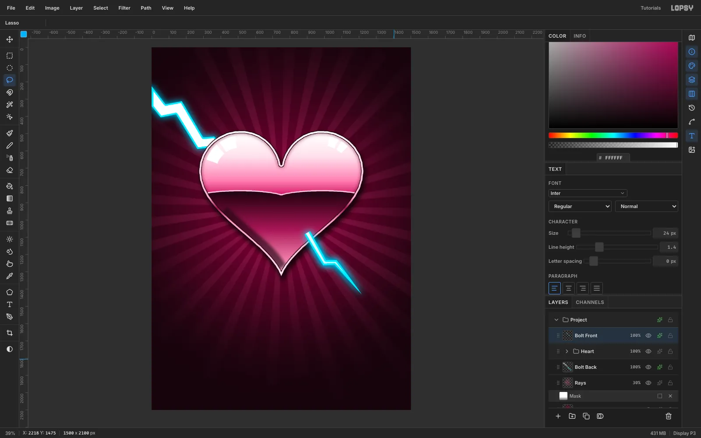

Rename the pasted layer *Bolt Front*. Collapse the *Heart* group and drag *Bolt Front* by its grip until it sits **above** the group.

Pasting copies pixels, not effects, so add the same **Outer Glow** (`#1FD6FF`, 55 / 14 / 95).

## Crack the chrome

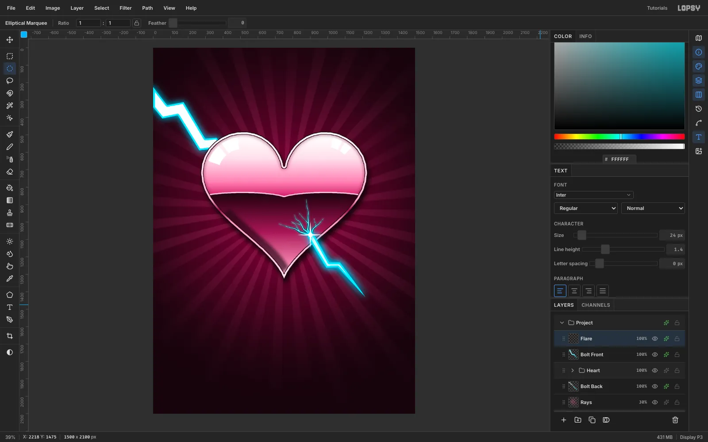

Expand *Heart* and click *Windows*. Add two layers above it: *Fissures* and *Crack Cores*.

1. On *Fissures*, lasso four tapered cracks that radiate from the exit point, each with one side branch. Make them about 18 px wide at the root and 1 px at the tip. Fill them `#14030A`.
2. On *Crack Cores*, lasso thinner copies (about a third of the width) along the same lines and fill them `#A8F9FF`.
3. Give *Crack Cores* an **Outer Glow**: `#1FD6FF`, Size **14**, Spread **20**, Opacity **100**.

Then click *Bolt Front* and add a layer called *Flare*. Fill a four-point star (radius about 74 px, very thin points) and a small circle in white at the exit point. Give it the same cyan Outer Glow (Size **30**, Spread **16**).

The flare hides the flat cut end of *Bolt Front*.

## Set the greeting

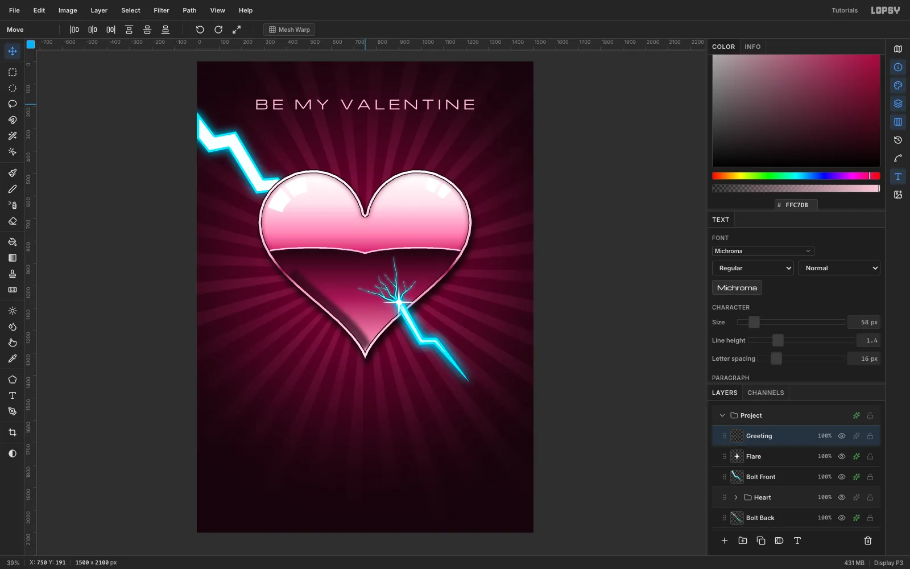

With a **raster** layer active (click *Flare*), pick the **Text** tool, choose **Michroma**, and set Size **58** and colour `#FFC7DB`.

Click in empty space and type **BE MY VALENTINE**. Press **Tab** to commit.

In the **Text** panel set **Letter spacing 16**. Then move the line so its caps sit at y 170, centred on x 750.

*BE MY VALENTINE* has no apostrophe, so the wide tracking doesn't open a hole the way *VALENTINE'S* would.

## Type the script headline

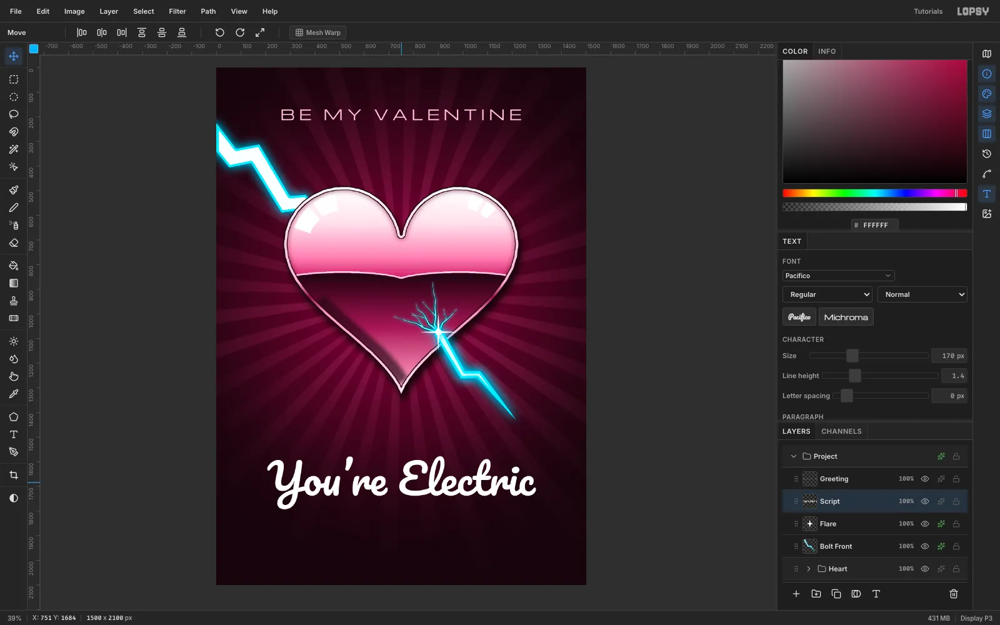

Click *Flare* again. **Don't start new type while a text layer is active:** changing the font or size would restyle that layer.

Choose **Pacifico**, Size **170**, white, and type **You’re Electric** (with a curly ’).

The Text panel still holds the greeting's letter spacing. Set it back to **0** for this layer. Then centre it with its top at y 1577.

## Load the script as a selection

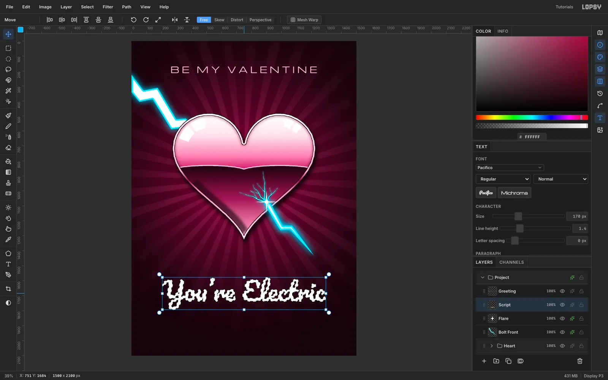

1. With *Script* selected, click **Rasterize Layer** in the Layers panel footer.
2. **⌘-click** the layer's thumbnail. That loads the letters' alpha as a selection.

## Chrome the script

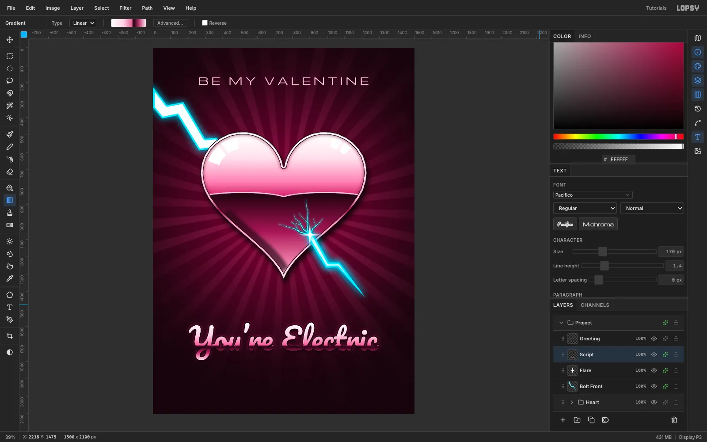

Drag a vertical gradient from the top of the letters to the bottom of the descenders. Use the same horizon idea, with the horizon just under the x-height:

- `#FFFFFF` 0
- `#FFD0E2` 35%
- `#E4679A` 60%
- `#4A0C26` 63%
- `#2A0614` 66%
- `#B8336B` 80%
- `#FFE2EE` 100%

Deselect, then add three effects:

- **Stroke**: outside, **5 px**, `#1A030C`
- **Outer Glow**: `#FF3D8B`, Size **30**, Spread **8**, Opacity **70**
- **Drop Shadow**: `#050002`, X **0**, Y **14**, Blur **16**, Opacity **80**

## XOXO and a mini bolt

Type **XOXO** in Michroma **47**, `#FFC7DB`, with **Letter spacing 14**. Centre it with its caps at y 1888, about 90 px below the script and 90 px above the inner frame line.

Add a layer called *Mini Bolts*. Lasso a small classic bolt about **27 × 48 px**, 32 px to the left of the X, and fill it `#BFF8FF`.

To tilt it:

1. Marquee around it and switch to the **Move** tool.
2. ⌘-drag the rotate handle (just outside the top-right corner) to **−15°**.
3. Press ⌘D to commit.

## Mirror it to the other side

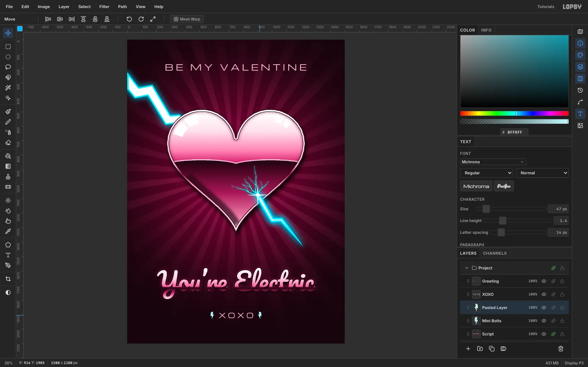

1. Marquee the mini bolt, copy it, wait a moment, and paste. Marquee the pasted copy with the same rectangle.
2. Click **Flip horizontal** in the Move tool's options bar, then press ⌘D.
3. Drag the copy to the right of **XOXO** so both bolts are the same distance from the centre line. Here that's x 574–598 and x 902–926, which mirror exactly around x 750.
4. **Merge Down** the copy into *Mini Bolts*. Give that layer a cyan **Outer Glow** (Size **14**, Spread **10**).

## Scatter a few sparkles

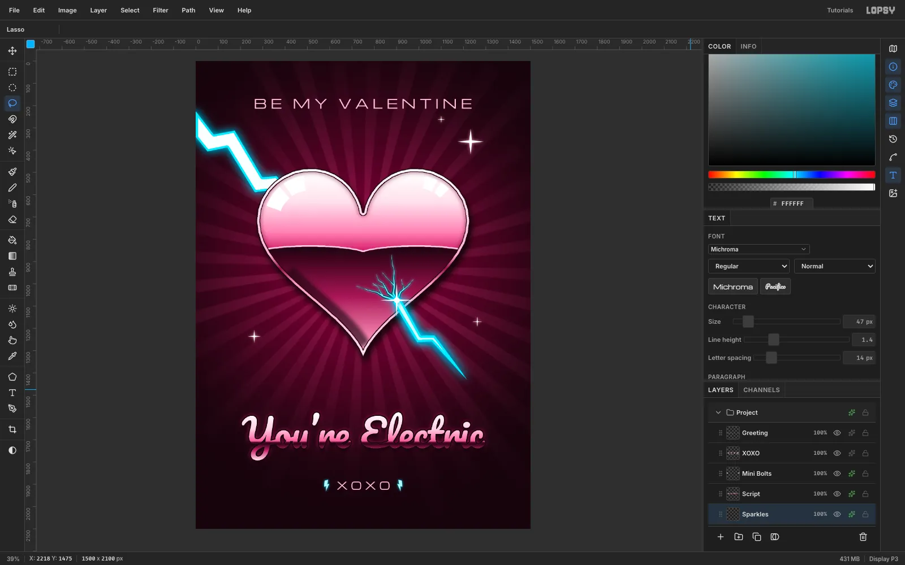

Click *Flare* and add a layer called *Sparkles*. Lasso a few thin four-point stars in white:

- one large, radius about 58, at the upper right
- two or three small ones in the empty space

Keep them at least 60 px from any type. Give the layer an **Outer Glow** in `#FFB3D1` (Size **18**, Spread **10**, Opacity **85**).

Resist adding more: identical sparkles scattered everywhere read as clip art.

## Snap a double frame to the grid

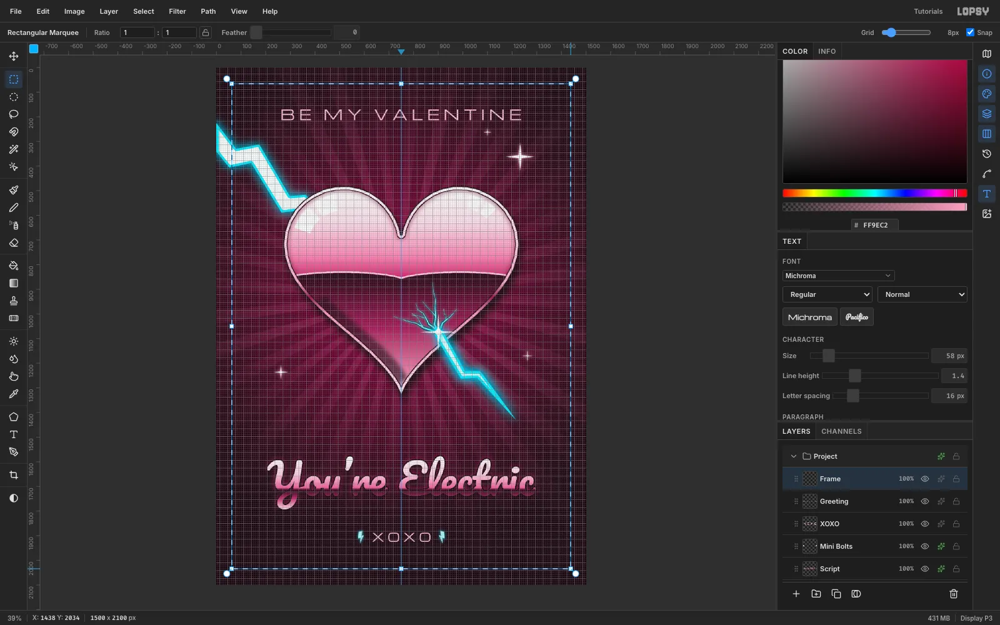

Click the top text layer and add a layer called *Frame*.

1. Choose **View → Show Grid** and set **Grid** to **8 px** in the options bar. Snap turns on with it.
2. Click the top ruler at 750 to drop a centre guide. Use it to check that the heart and every line of type are centred.
3. With the Rectangular Marquee, drag from (62, 66) to (1438, 2034). Fill it with `#FF9EC2`, **Shrink 3**, and **Delete** to leave a 3 px outline.
4. Repeat 16 px further in, from (78, 82) to (1422, 2018), with **Shrink 1**, for a hairline.

## Let the bolt break the frame

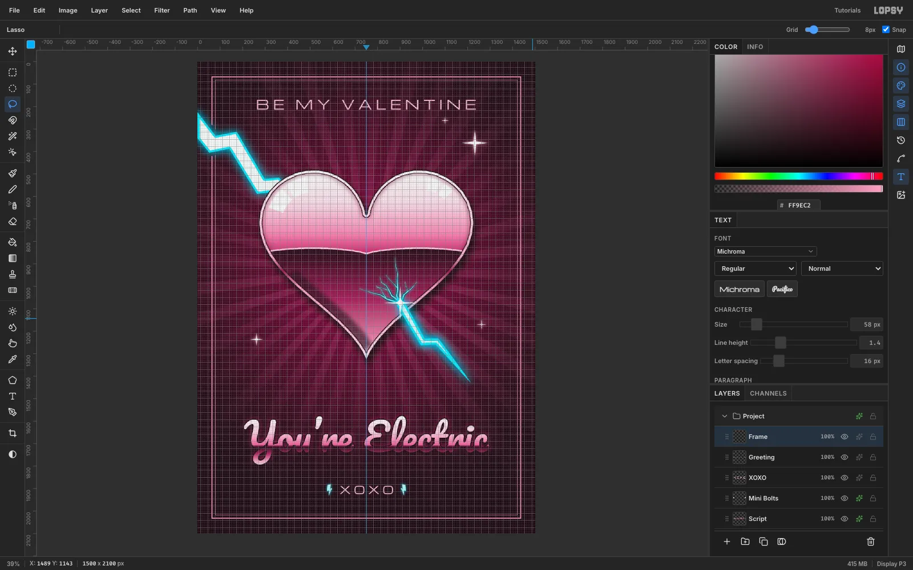

A bolt that sneaks behind the frame looks timid. Make it break through instead:

1. On *Frame*, lasso the bolt's outline again.
2. Choose **Select → Grow 16**, then press **Delete**.

The frame now stops short on both sides of the bolt. Hide the grid and choose **Edit → Clear Guides** when you're done.

## Add fine grain

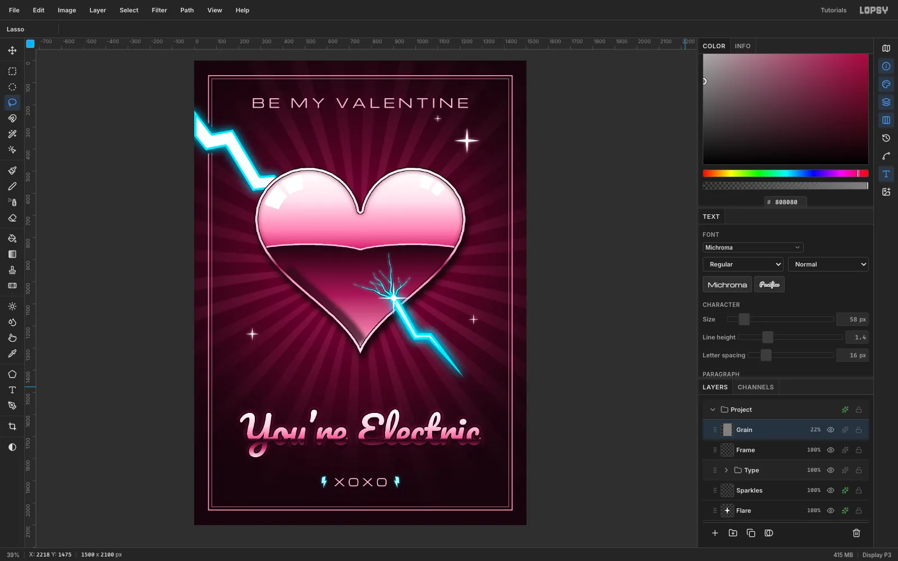

Click *Frame* and add a layer called *Grain*.

1. Fill it with `#808080`.
2. Choose **Filter → Add Noise**: **Mono**, **Gaussian**, Amount **40**.
3. Set the blend mode to **Overlay** and the opacity to **22%**.

Mid-grey is invisible in Overlay, so only the noise shows. It takes the digital edge off the gradients without dirtying the chrome.

Finally, select the *Script*, *XOXO*, *Mini Bolts* and *Greeting* rows (click the first, Shift-click the last). Choose **Layer → Group Layers** and name the group *Type*. You can now move all the lettering as one piece.

## Darken the sky toward the horizon

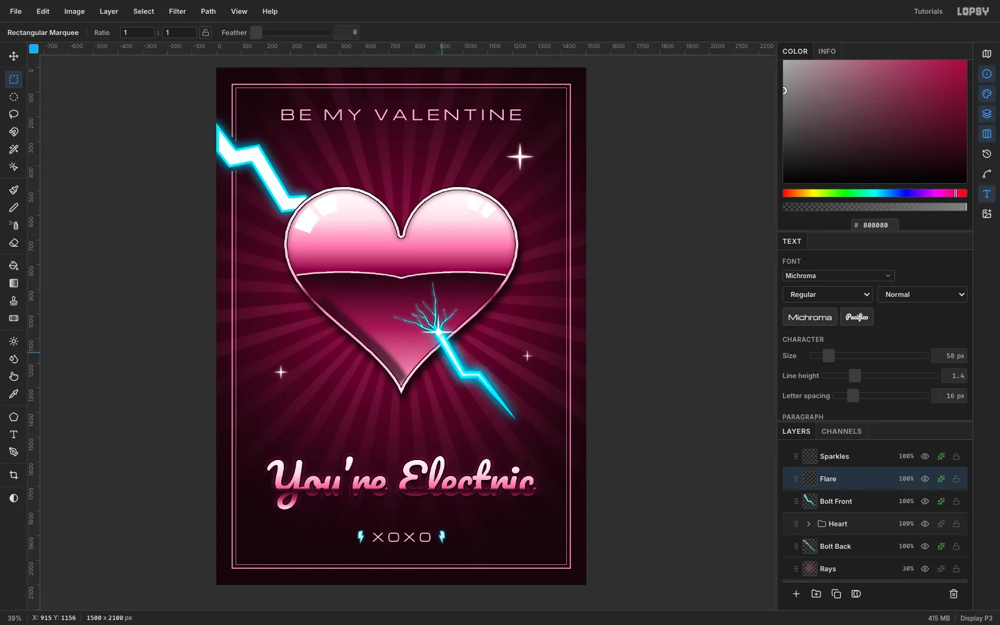

Step back and look at the heart. If it reads as pink candy rather than metal, it needs darker darks.

Re-lasso the heart, Shrink **17**, and redraw the *Sky* gradient (y 500 → 880) so it plunges almost to black just above the horizon:

- `#FFFFFF` 0
- `#FFE1EC` 30%
- `#EC7CA8` 60%
- `#8A1A48` 84%
- `#3A0A1E` 95%
- `#2A0614` 100%

Two small clean-ups at the same time:

- delete the small sparkle that crowded *BE MY VALENTINE*
- trim the flare's lower point, which ran down the bolt like a stray white sliver

## Kern the apostrophe

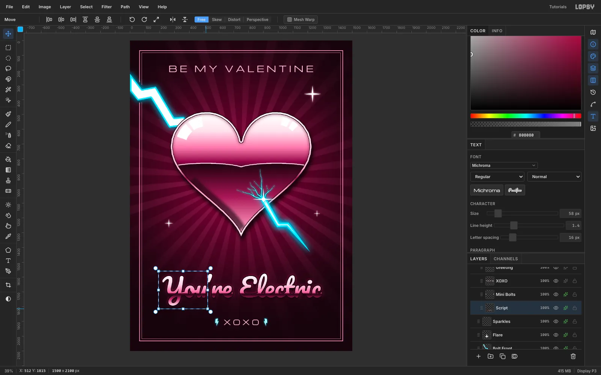

Pacifico leaves a wide gap before the apostrophe, so *You're* reads as *You 're*.

1. On the *Script* layer, marquee just the word **You**.
2. With the Move tool, press → **12 times** to close the gap. Press ⌘D.
3. Nudge the whole layer 6 px left so the headline is centred again.

## Export the card

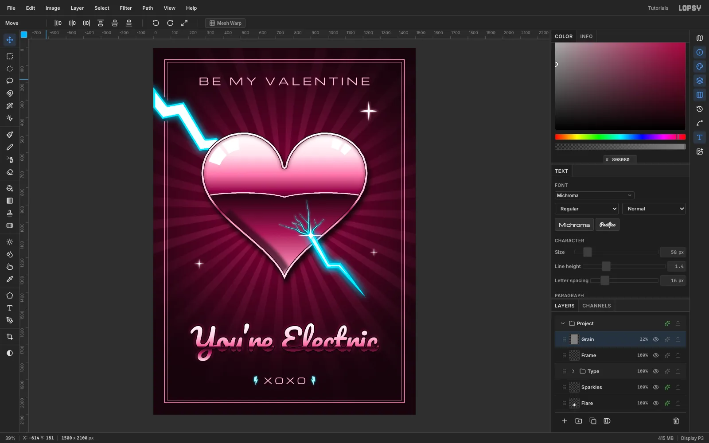

Save the project with **File → Save Project**, then **File → Quick Export PNG** for print.

Things to try next:

- swap the bolt's cyan for gold to make an anniversary card
- change the words (*You Light Me Up*, *Zap!*)
- turn the bolt into Cupid's arrow; the pierce trick is the same
