Chrome lettering was everywhere in the 1980s: on album covers, movie posters and the side of every arcade cabinet. The look comes from one trick. Shiny metal reflects the world around it, so the letters show a blue sky on top, a bright white horizon in the middle and brown ground underneath. Get that gradient right, add a crisp outline and a couple of glints, and flat type turns into polished metal.

In this tutorial you'll use that trick on a flier for an imaginary small business, **Nickel Moon Plating & Polish Co.** It's a chrome-plating shop for classic cars and motorcycles. A photo of a wire-spoke hubcap becomes the "nickel moon" in a starry sky, with the shop's monogram on its centre badge. Underneath, the flier does what a small-business flier has to do: list the services, make an offer and say how to get in touch.

The fonts are free Google Fonts:

- **Ultra** for NICKEL MOON, the badge monogram and the coupon headline
- **Yellowtail** for the *Plating & Polish Co.* script
- **Bebas Neue** for everything else

The palette:

- Midnight sky `#03061A` → `#13234F` → `#1B1C3D` → `#05060D`
- Chrome sky `#0E1B3D` → `#6F95C8` → `#EAF4FF` → `#FFFFFF`
- Chrome ground `#3A2717` → `#6B4A32` → `#F6E7CF` → `#A07A55` → `#EBD7B8` → `#FFFFFF`
- Candy red `#FF6B74` → `#E3182B` → `#7E0712`, ticket red `#B3101E`
- Copper `#F4B57E` → `#C06A3C` → `#6E2B12` → `#A4522A` → `#E9A36B`
- Badge enamel `#FF6A72` → `#C0101F` → `#4A030A`
- Cream `#F3E6CF`, steel blue `#9FB7DA`, silver outline `#CFDBEE`

The hubcap is from a public-domain (CC0) photo of a wall of hubcaps in the WordPress Photo Directory. Any straight-on photo of a wire-spoke hubcap or wheel cover will work. Crop it to just the hubcap, about 550 px square, before you start.

The moon and its badge sit directly in the Project group, and the rest is built in three groups: the headline, the tagline and the services panel. New layers and text appear above whichever layer is selected, so before you start each group you'll select a layer at the right level of the stack.

## Paint a midnight sky and set the margins

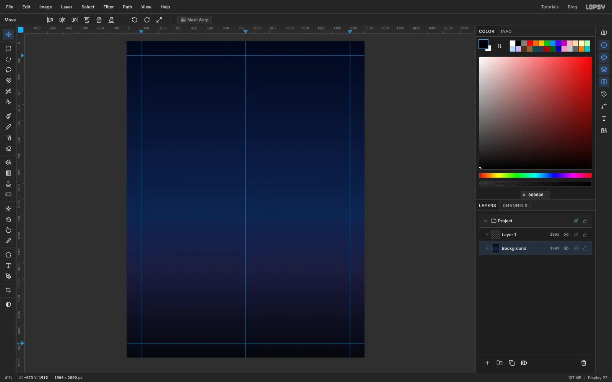

Open [Lopsy](/) and create a **1500 × 2000** pixel document. That's a 3:4 portrait, which prints well as a letter-size or A4 flier.

Select **Background** and pick the **Gradient** tool (Linear). Click **Advanced…** and set four stops:

- `#03061A` at 0 %
- `#13234F` at 55 %
- `#1B1C3D` at 72 %
- `#05060D` at 100 %

Hold [[Cmd]] and drag from the top of the canvas to the bottom. Cmd snaps the angle in 15° steps, so the drag stays exactly vertical.

Now add guides. Click the top ruler at **90**, **750** and **1410** for three vertical guides, and the left ruler at **90** and **1910** for two horizontal ones. Everything important stays inside the outer four, and the middle one marks the centre of the page.

## Scatter a starfield

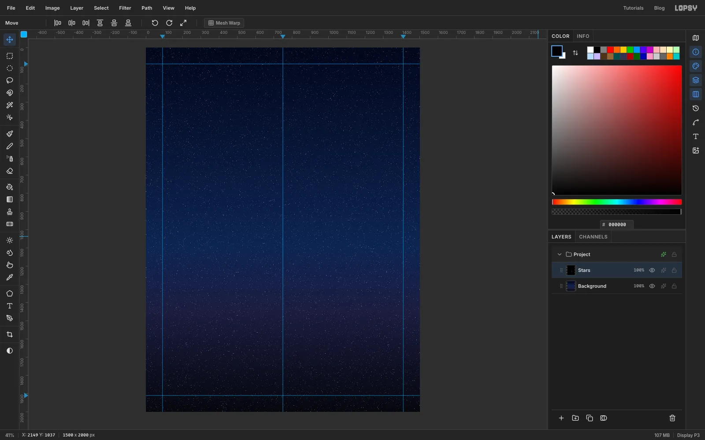

Rename **Layer 1** to `Stars`. Set the foreground to black and choose **Edit → Fill** to fill the layer.

Run **Filter → Add Noise…** with Amount **100**, **Mono** and **Uniform**, then **Filter → Gaussian Blur…** at Radius **1**. Now run **Filter → Threshold…** at Level **48**. Noise on black never gets much brighter than that, so only the brightest few specks turn white. Those are your stars.

Click the effects button (the sparkle icon) on the Stars row to open its Layer Effects panel, and set the blend mode at the top to **Screen**. The black disappears and the stars sit on the sky. You'll use this panel for every blend mode and effect from here on.

## Paste the hubcap and cut it out

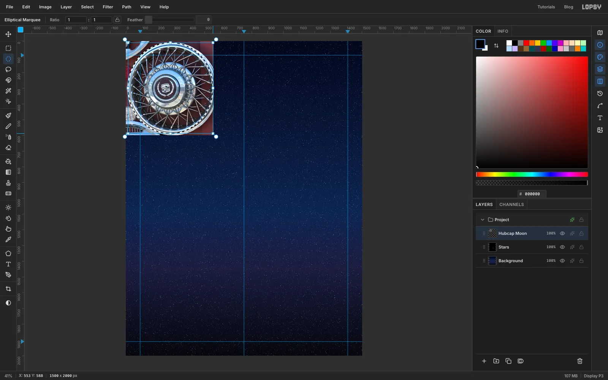

Copy your hubcap crop and paste it with [[Cmd+V]]. It lands in the top-left corner as **Pasted Layer**, so rename it `Hubcap Moon`.

Pick the **Elliptical Marquee** and drag a selection that hugs the outside of the chrome rim. The rim in a photo is rarely a perfect circle, so take your time. Then choose **Select → Inverse** and press [[Delete]] to clear the wall behind the hubcap.

## Scale the hubcap into a moon

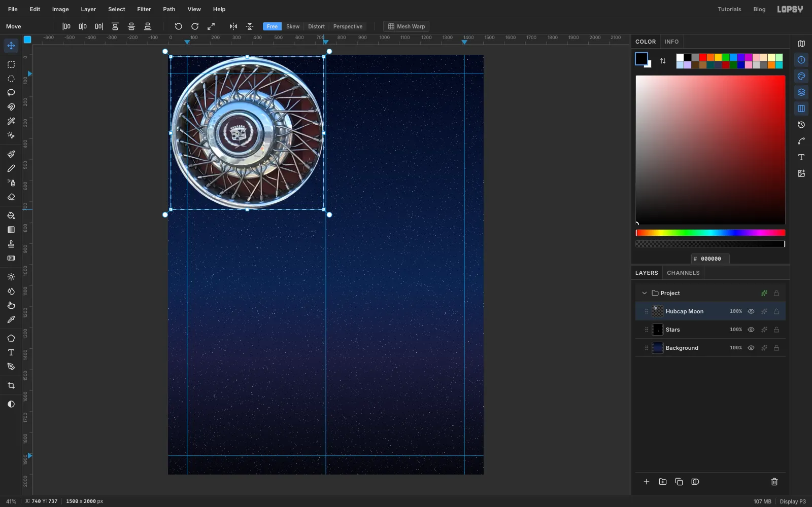

Draw a **Rectangular Marquee** around the hubcap and switch to the **Move** tool. Drag the bottom-right corner handle down and to the right until the hubcap is about 725 px across. If your hubcap is slightly oval like this one, drag a little further sideways than down so it ends up round. Press [[Cmd+D]] to apply the transform and deselect.

Drag the hubcap up into the top-right corner. Its right edge should sit just inside the right guide and its top about 120 px from the top of the page.

## Desaturate it to nickel

Choose **Filter → Desaturate** to strip out the colour. Then run **Filter → Brightness/Contrast…** with Brightness **14** and Contrast **30**.

The brightness matters here. It lifts the black gaps between the spokes to a dark grey, so the hubcap reads as a lit disc like a moon, not a black hole.

## Dodge and burn the rim

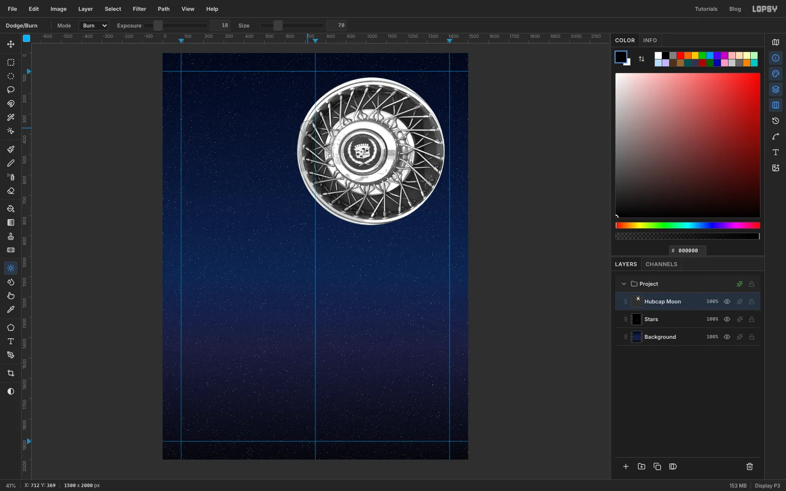

Pick the **Dodge/Burn** tool. Set Mode to **Dodge**, Exposure **20** and Size **46**, then trace along the upper-right part of the chrome rim in one stroke. Switch Mode to **Burn**, Exposure **18** and Size **70**, and trace the lower-left part of the rim.

This exaggerates the light so it clearly comes from the upper right. That matters for the next step.

## Shade the moon

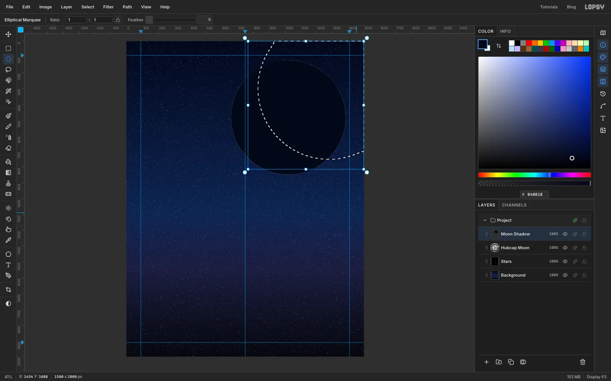

Click **Add Layer** and name it `Moon Shadow`. [[Cmd]]-click the **Hubcap Moon** thumbnail to select its shape, then select **Moon Shadow** again. Fill the selection with `#040818` (**Edit → Fill**) and deselect.

Now draw a large circle with the **Elliptical Marquee**, about 900 px across. Its lower-left edge should run through the middle of the moon, with most of the circle above and to the right of it. Choose **Select → Feather…** with a radius of **90** and press [[Delete]]. That leaves a soft crescent of shadow on the moon's lower-left side. Deselect, then set **Moon Shadow** to **Multiply** at **80 %** opacity so the hubcap shows through the shadow.

## Add a moonlight glow

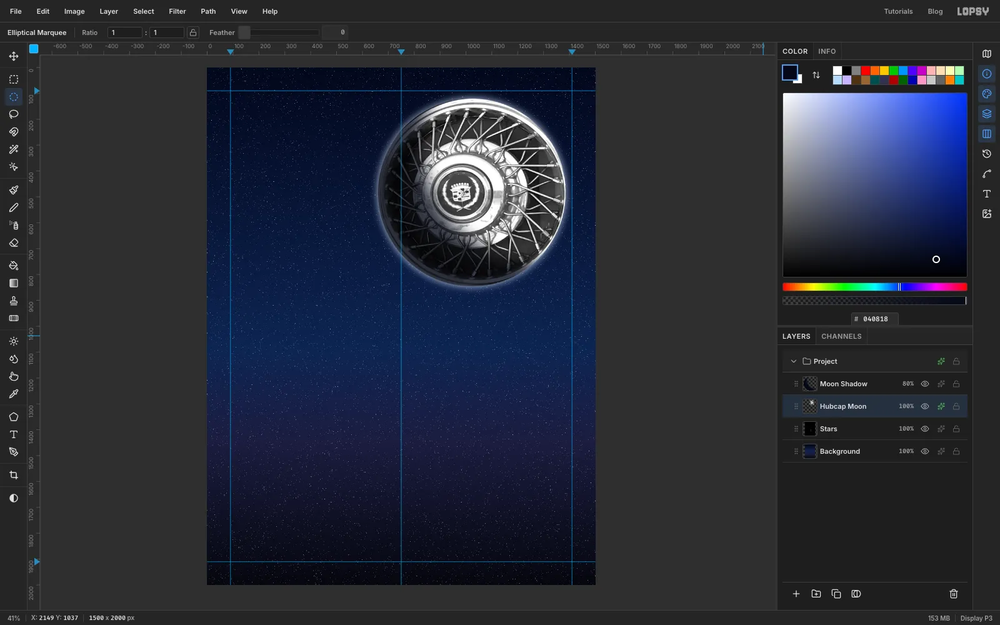

Select **Hubcap Moon**, open its Layer Effects and turn on **Outer Glow**. Use colour `#D6E6FF`, Size **40**, Spread **15** and Opacity **75**. Now the moon looks lit against the sky.

## Make a chrome monogram and an enamel badge

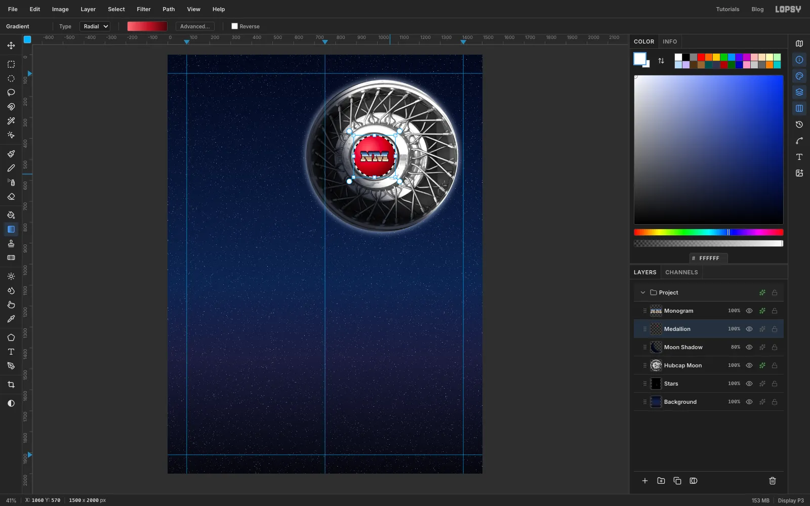

The hubcap's original maker's badge has to go. You'll cover it with the shop's own: a red enamel disc with **NM** in chrome.

First, set up the chrome gradient. You'll reuse it for all the chrome type. Pick the **Gradient** tool and open **Advanced…**. Set these ten stops:

- `#0E1B3D` at 0 %, `#6F95C8` at 30 %, `#EAF4FF` at 47 % and `#FFFFFF` at 49 %. That's the sky, fading to a white horizon.
- `#3A2717` at 51 %. The jump from white to near-black in two percent is the hard horizon line that makes chrome read as chrome.
- `#6B4A32` at 58 %, `#F6E7CF` at 66 %, `#A07A55` at 74 %, `#EBD7B8` at 90 % and `#FFFFFF` at 100 %. That's the ground, with a second reflection band in it.

Select **Moon Shadow** and click **Add Layer**. Name the new layer `Medallion`. Type **NM** in **Ultra** at size **64** in white, clicking just above and to the left of the badge, then nudge it onto the middle of the badge with the arrow keys ([[Shift]]+arrow moves 10 px at a time). Rename the text layer `Monogram` and rasterize it (the **Rasterize Layer** button under the Layers panel). [[Cmd]]-click its thumbnail and drag the gradient from the top of the letters to the bottom. Give it a 3 px **Stroke** in dark red `#2A0306`.

For the disc, switch the Gradient tool's Type to **Radial** and set three stops: `#FF6A72`, `#C0101F` at 55 % and `#4A030A`. This replaces the chrome stops, so keep a note of them. You'll enter them again for the headline. Select **Medallion** and draw a circle about 200 px across with the **Elliptical Marquee**, centred on the badge. Drag the gradient from a point just up and left of the centre out past the lower-right edge. The off-centre start gives the enamel a glossy highlight.

## Bevel the badge

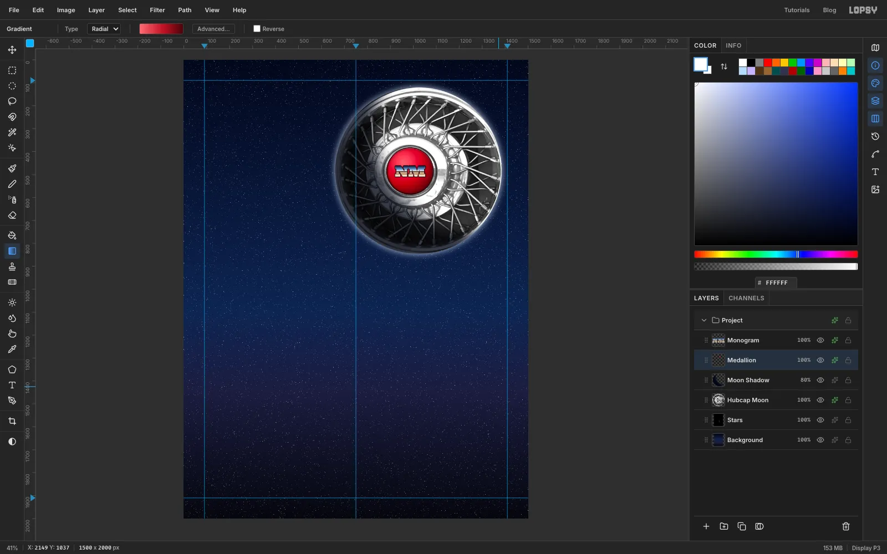

Deselect, then run **Filter → Emboss…** on **Medallion** with Strength **35** to give the disc a slight bevel. In its Layer Effects, add a 3 px **Stroke** in `#1A0204` and an **Inner Glow** in black at Size **18**, Opacity **60**. The disc now looks set into the hub, not stuck on top.

## Set the headline

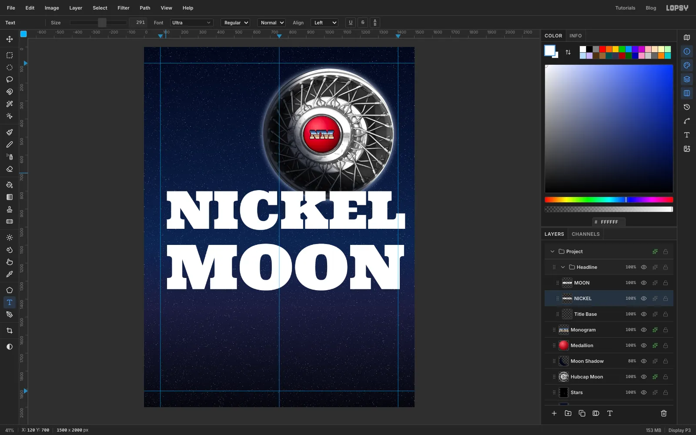

Select **Monogram** and click **New Group**. Name the group `Headline`, then click **Add Layer** and name the new layer `Title Base`. With **Title Base** selected, anything you add goes inside the group.

Pick the **Text** tool, choose **Ultra** in white, and type `MOON` at size **342** in the empty space under the moon. Select **Title Base** again and type `NICKEL` at size **291** above it. At those sizes, both words span exactly from the left guide to the right one.

Position them with the arrow keys:
- NICKEL with its top at about **850**, just clear of the moon.
- MOON with its top at about **1093**, leaving a gap of about 20 px.

> **Tip:** Click a little *above* where each word should end up, then nudge it down. At the moment, a gradient lands in the wrong place on a layer that's been nudged up or left ([#1169](https://github.com/theseamusjames/lopsy.art/issues/1169)).

## Fill the letters with chrome

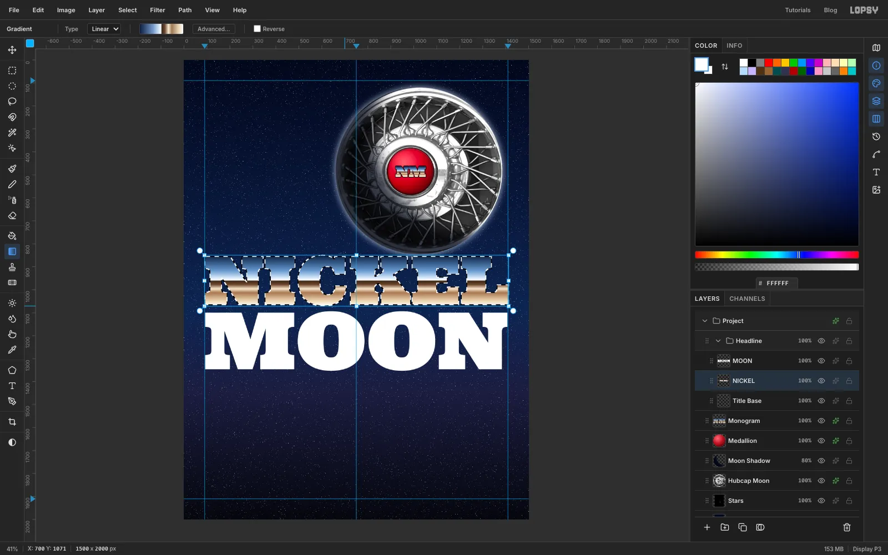

Rasterize both words. Pick the **Gradient** tool, set Type back to **Linear** and re-enter the ten chrome stops from the badge step in **Advanced…**. Then [[Cmd]]-click the **NICKEL** thumbnail to select the letters, hold [[Cmd]] and drag from the very top of the letters to the very bottom.

Do the same for **MOON**. Drag across its own letter height, not NICKEL's, so the horizon cuts through the middle of each word.

## Add an outline, edge light and shadow

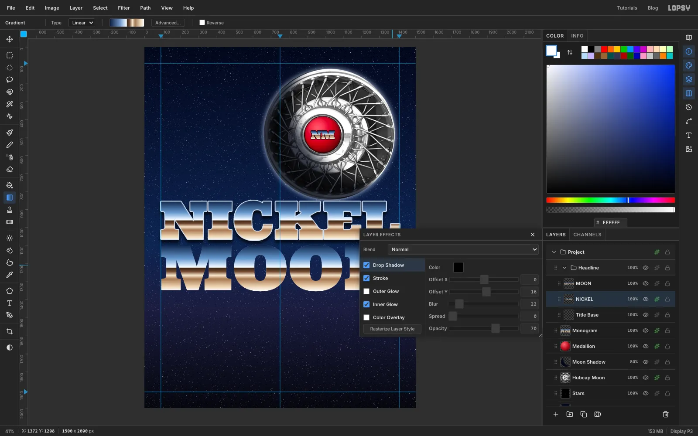

Open **NICKEL**'s Layer Effects and turn on three effects:

- **Stroke**: outside, Width **4**, colour `#CFDBEE`. A thin silver outline separates the chrome from the navy sky.
- **Inner Glow**: white, Size **6**, Opacity **70**. It catches light along the inside of every edge.
- **Drop Shadow**: Offset X **0**, Offset Y **16**, Blur **22**, Opacity **70**, in black.

Give **MOON** exactly the same three effects.

## Bevel the chrome with Emboss

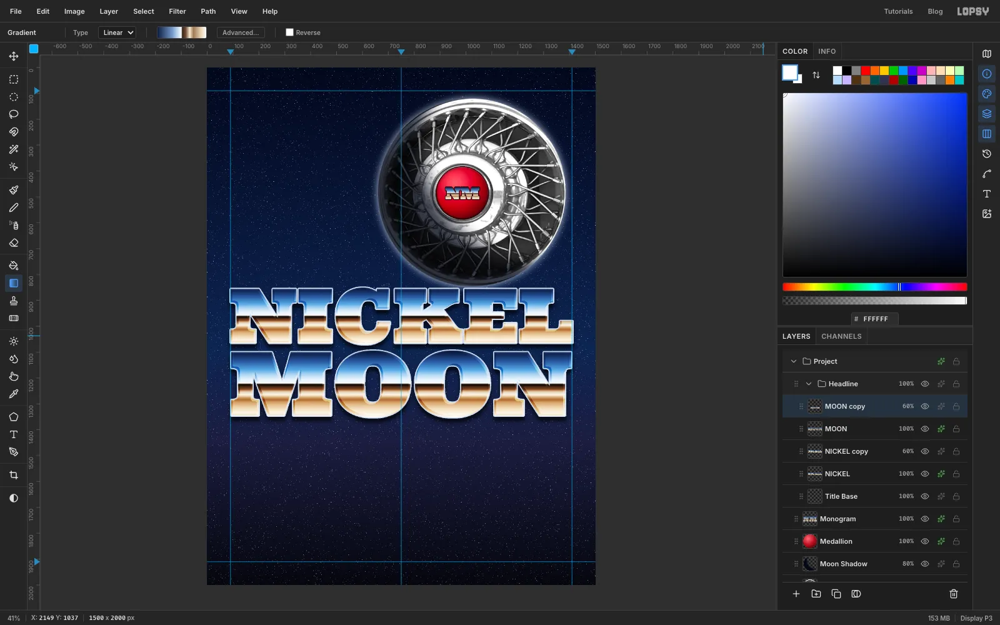

Select **NICKEL** and choose **Layer → Duplicate Layer**. In the copy's Layer Effects, turn all three effects off. Run **Filter → Emboss…** at Strength **70**. Then set the copy's blend mode to **Overlay** and its opacity to **60 %**.

Emboss adds light and dark edges to the letters. Overlay works them into the chrome underneath, so the letters look bevelled and the colours get punchier. Repeat for **MOON**.

## Write and tilt the script

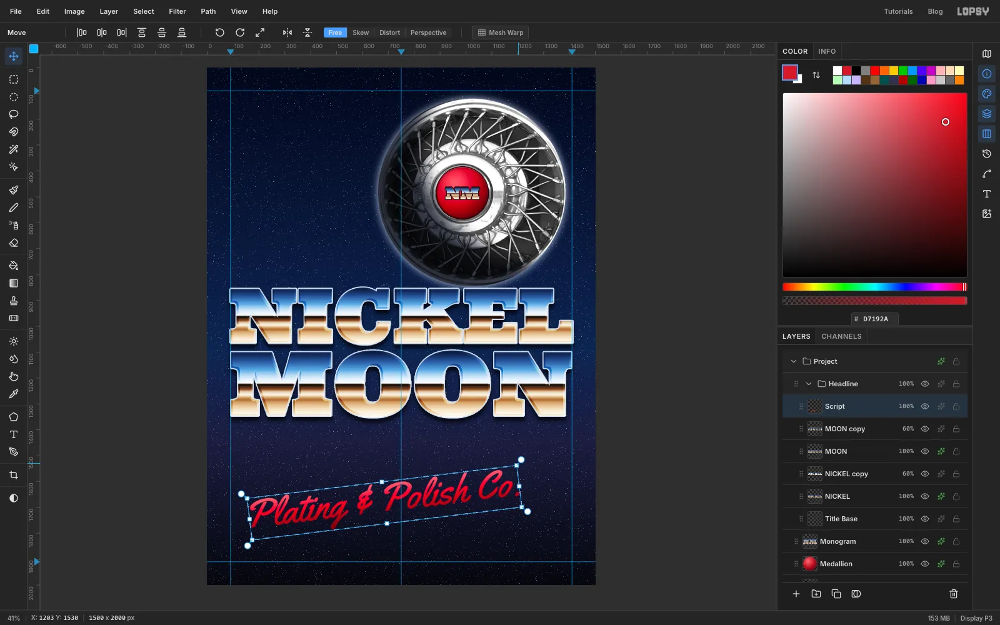

Select **MOON copy** so the script lands at the top of the Headline group. In the empty space at the bottom of the page, type `Plating & Polish Co.` in **Yellowtail** at size **150**. Rename the layer `Script` and rasterize it.

Set a three-stop linear gradient: `#FF6B74`, `#E3182B` at 45 % and `#7E0712`. [[Cmd]]-click the script's thumbnail and drag the gradient from the top of the letters to the baseline. Now it looks like candy-apple paint.

Draw a **Rectangular Marquee** around the script and switch to the **Move** tool. Drag just outside a corner handle to rotate it about **7°** counter-clockwise, so it climbs to the right. Press [[Cmd+D]] to apply the rotation and deselect.

## Seat the script over MOON

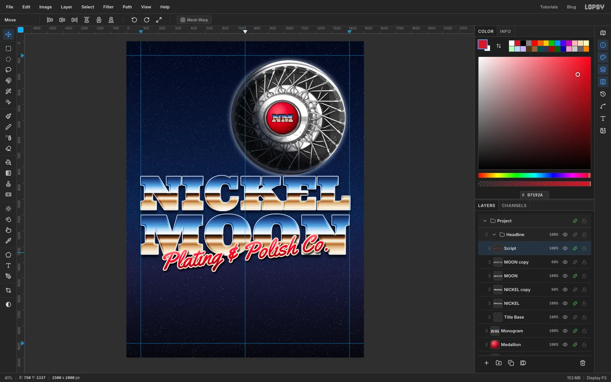

Give the script a **Stroke** (outside, Width **7**, `#F7EBD3`) and a **Drop Shadow** (Offset X **6**, Offset Y **10**, Blur **10**, Opacity **75**).

Drag it up so it's centred on the middle guide and overlaps the bottom half of MOON. The thick cream outline keeps it readable where it crosses the dark band of the chrome. Leave at least 40 px between the bottom of the *g* and the rule you'll add under it later.

## Draw a glint with Sunburst

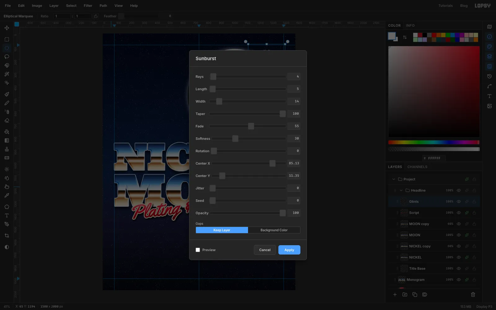

Glints are the classic chrome finishing touch. Two are plenty. More than that and they start to compete.

Select **Script** and add a layer called `Glints`. With the **Elliptical Marquee**, draw a circle about 200 px across, centred on the brightest point of the moon's upper-right rim. Feather it by **45** (**Select → Feather…**).

Set the foreground to white and open **Filter → Sunburst…**:
- Rays **4**, Length **5**, Width **14**, Taper **100**, Fade **55**, Softness **30**, Rotation **0**.
- Center X and Center Y are percentages of the page. Divide the point's x by 15 and its y by 20 (the page is 1500 × 2000). For the rim highlight, that's about **85** and **11**.

Taper 100 turns each ray into a sharp spike, and the feathered selection fades out the tips.

## Finish the glints

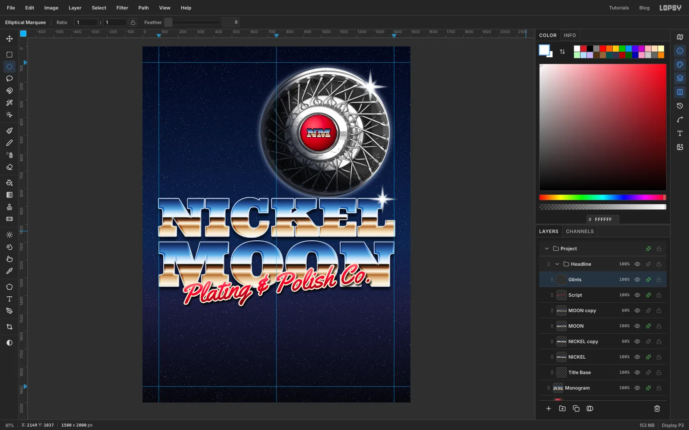

Draw a smaller circle, about 90 px across, at the same centre and feather it by **25**. Run **Sunburst** again with the same settings except Width **10**, Rotation **45** and Opacity **90**. That adds four shorter diagonal rays, so you get an eight-point star.

Make the second glint the same way on the top-right corner of the **L** in NICKEL, around (1345, 858). Use slightly smaller circles there: about 170 px feathered by 38 for the first pass, and about 75 px feathered by 20 for the diagonal pass. Center X and Y are about **90** and **43**. Finally, give the **Glints** layer an **Outer Glow** in `#BCD6FF` at Size **14**, Opacity **60**.

## Set the tagline

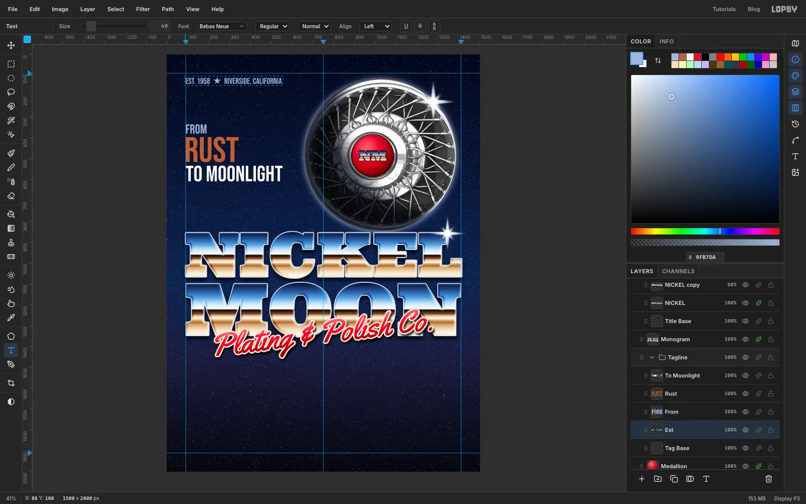

The empty sky to the left of the moon is the place for the shop's story. Select **Medallion** and click **New Group**. Name it `Tagline`, then add a layer called `Tag Base` inside it.

Add these four lines in **Bebas Neue**. Before typing each one, click **Tag Base** so your new font settings don't restyle the previous line.

- `EST. 1958  ★  RIVERSIDE, CALIFORNIA` at **40** in steel blue `#9FB7DA`, at the top margin
- `FROM` at **62** in `#9FB7DA`
- `RUST` at **170** in `#C06A3C` (the copper comes next)
- `TO MOONLIGHT` at **106** in white

Line up the left edge of every line with the left guide. Stack FROM, RUST and TO MOONLIGHT tightly, centred top to bottom on the moon. Their tops go at about **345**, **404** and **542**.

## Turn RUST into copper

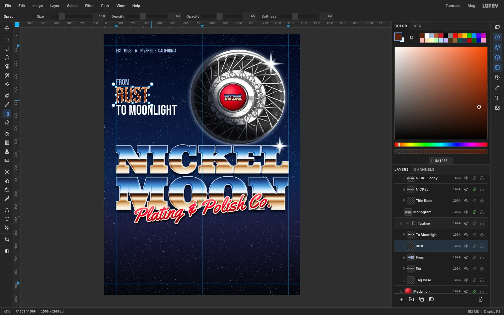

Rasterize **RUST** and [[Cmd]]-click its thumbnail. Set a five-stop linear gradient:
- `#F4B57E` at 0 %
- `#C06A3C` at 42 %
- `#6E2B12` at 50 %
- `#A4522A` at 62 %
- `#E9A36B` at 100 %

Drag it from the top of the letters to the bottom. It's the chrome idea again, in copper.

Keep the selection. Pick the **Spray** tool with Size **110**, Density **40**, Opacity **45** and Softness **40**, set the foreground to `#5A1F08`, and sweep across the letters three or four times. The speckle looks like patina and keeps the copper from looking too clean next to the chrome. Deselect.

## Chrome the payoff line

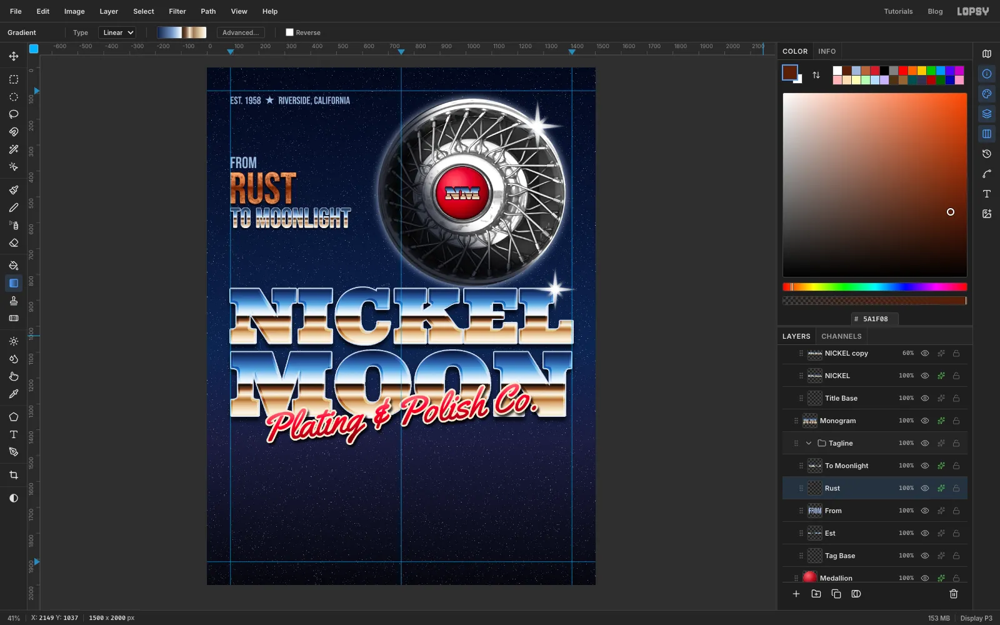

Rasterize **TO MOONLIGHT**. Switch the Gradient tool back to the ten linear chrome stops (the copper replaced them), [[Cmd]]-click the layer's thumbnail and drag the gradient across its letters, just as you did for the headline.

Give **TO MOONLIGHT** a 2 px outside **Stroke** in `#CFDBEE` and a **Drop Shadow** (Offset Y **6**, Blur **8**, Opacity **70**). Give **RUST** the same shadow and a 2 px stroke in dark brown `#3A1408`.

## List the services between two rules

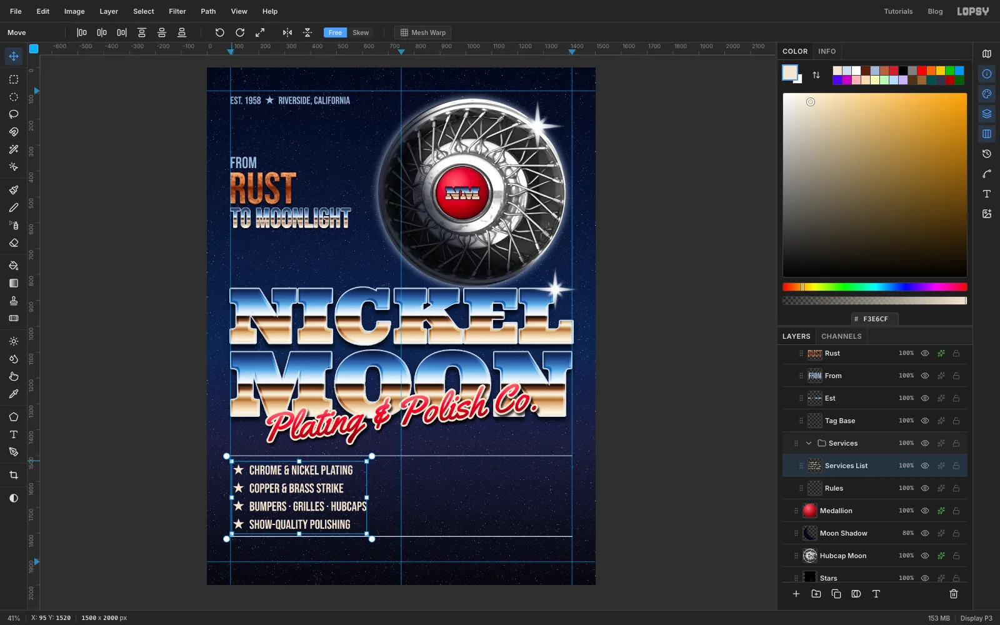

Select **Medallion** and click **New Group**. Name the group `Services`, then add a layer called `Rules`.

Pick the **Pencil** at Size **3** in `#CFDBEE`. Click on the left guide at a height of **1500**, then [[Shift]]-click on the right guide for a straight rule. Draw a second rule the same way at **1812**.

Add the services as one text layer in **Bebas Neue** at **50** in cream `#F3E6CF`, one per line, each starting with a star and two spaces. Name the layer `Services List`.

- `★  CHROME & NICKEL PLATING`
- `★  COPPER & BRASS STRIKE`
- `★  BUMPERS · GRILLES · HUBCAPS`
- `★  SHOW-QUALITY POLISHING`

Place the block just inside the left guide, with its top about 30 px below the first rule.

## Draw the coupon ticket

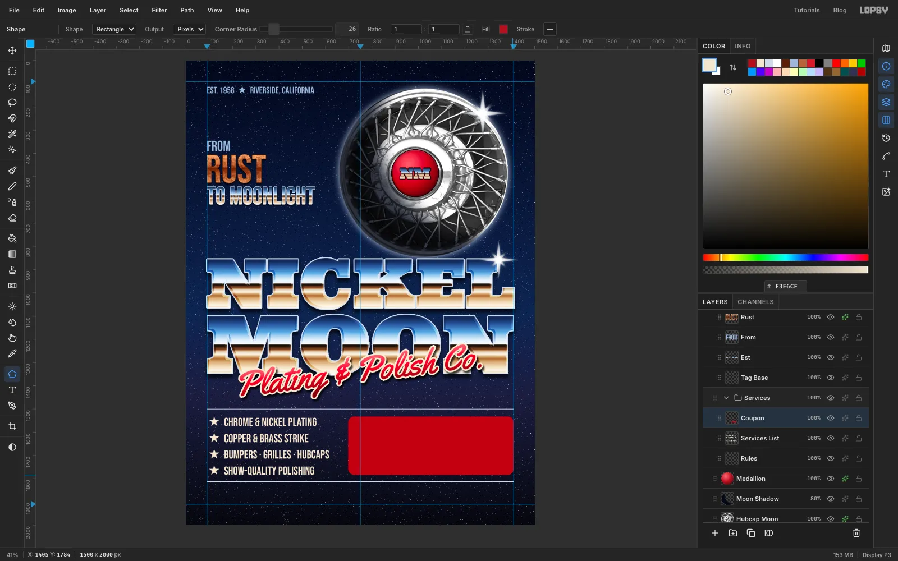

Select **Services List** and add a layer called `Coupon`. Pick the **Shape** tool with **Rectangle**, Output **Pixels**, Corner Radius **26**, fill `#B3101E` and no stroke. Pixels matters, because the next step cuts notches out of the ticket with [[Delete]].

Shapes draw outward from the centre. Press in the middle of the right half of the space between the rules, at about x 1055, and drag out to the right guide. The ticket should run from about x **700** to the right margin and from just under the first rule to just above the second.

## Notch and perforate it

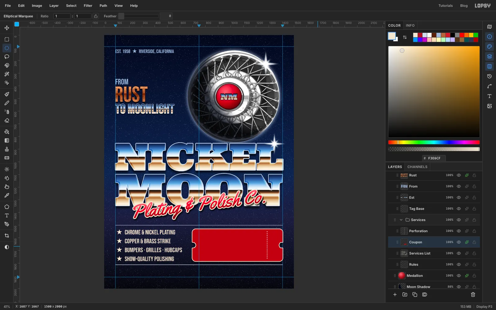

Zoom in close on the left end of the ticket. Draw a 48 px circle with the **Elliptical Marquee**, centred about 5 px inside the edge, and press [[Delete]]. Do the same on the right end.

> **Tip:** Stay zoomed in for both notches. At fit-to-screen zoom, the right-hand marquee snaps to the margin guide and the notch comes out as a thin sliver.

Give **Coupon** an outside **Stroke** (Width **5**, cream `#F3E6CF`) and a **Drop Shadow** (Offset Y **10**, Blur **18**, Opacity **65**).

For the perforation, add a layer called `Perforation` and pick the **Brush** in cream. Click the brush preview at the left of the options bar to open **Brushes**. On the **Shape** tab, set Size **8**, Hardness **100** and Spacing **220**. That spaces the dabs out into separate dots. Close the panel, click near the top of the ticket about 120 px in from its right end, and [[Shift]]-click straight below it near the bottom.

## Write the offer

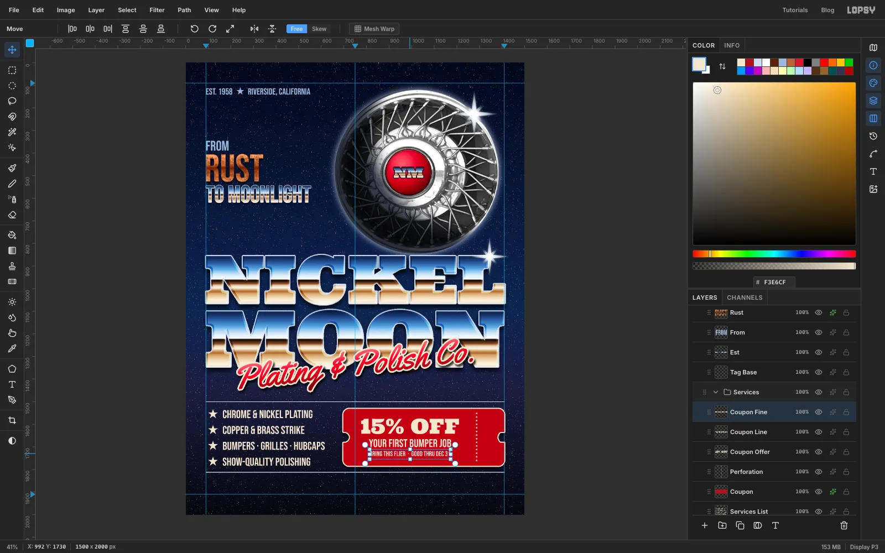

Select **Perforation** before each new line of text, so each one lands above the ticket and none of them restyles another. Type these lines in cream `#F3E6CF`:

- `15% OFF` in **Ultra** at **92**
- `YOUR FIRST BUMPER JOB` in **Bebas Neue** at **50**
- `BRING THIS FLIER  ·  GOOD THRU DEC 31` in **Bebas Neue** at **31**

Centre all three on x ≈ 995, the middle of the part of the ticket to the left of the perforation, and space them evenly from top to bottom. Cream on red stays easy to read even at the smallest size.

## Rotate a serial number into the stub

Select **Perforation** again and type `No. 0058` in **Bebas Neue** at **44**, in cream. With the text layer selected, switch to the **Move** tool and click **Rotate 90° CCW** in the options bar.

The text stays editable after it's rotated, so you can change the number later. Drag it into the middle of the stub.

## Add the contact details

Select **Rules** and add a layer called `Footer Base`. Then add three lines of text, selecting **Footer Base** before each one:

- `(555) 014-2290` in **Bebas Neue** at **96** in cream `#F3E6CF`
- `4410 MAGNOLIA AVE  ·  RIVERSIDE, CA` at **38** in cream
- `TUE – SAT  8AM – 6PM  ·  WALK-INS WELCOME` at **38** in steel blue `#9FB7DA`

The phone number is the most important call to action, so keep it solid cream. Chrome would lose its lower half against the dark navy. Give it a 2 px **Stroke** in `#6F95C8` and a small **Drop Shadow** (Offset Y **6**, Blur **8**).

Put the phone number on the left guide and the two smaller lines flush against the right guide. Line the bottom of the hours up with the bottom of the phone number's digits, so the footer shares one baseline.

## Finish with a vignette and a little vibrance

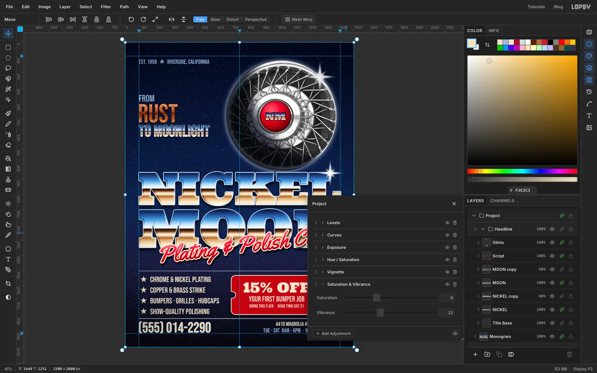

Select the **Project** group at the top of the Layers panel and open its effects to get the adjustment stack. Click **Add Adjustment**, choose **Vignette** and set it to **35**. Add **Saturation & Vibrance** and set Vibrance to **12**.

The vignette darkens the corners and pulls the eye toward the centre. The vibrance gives the chrome's blue and tan and the candy red a little more punch, without blowing out the cream.

Save the project with **File → Save Project**, and export with **File → Quick Export PNG**.
