Science magazines of the late 70s and 80s sold the future with airbrushed chrome. Their mastheads reflected a sky and a desert horizon, and their spaceships gleamed like new cars. In this tutorial you'll recreate that look for an imaginary 1985 issue of **APOGEE**. The cover story is a chrome rocket liner, *The Orbital Cruiser*, flying over the real cloud tops of Earth.

The whole trick behind chrome is one gradient. It runs from a dark blue "sky" at the top down to a razor-sharp white horizon, then drops straight into a dark brown "ground" that warms to peach. You'll use that gradient on the masthead and on every part of the ship, always running across the shape rather than along it.

You'll need a space photo. This tutorial uses NASA's public-domain [Top of Atmosphere](https://commons.wikimedia.org/wiki/File:Top_of_Atmosphere.jpg), taken from the International Space Station. Any photo of Earth's horizon with black space above it will work.

## Paste the NASA photo into a new document

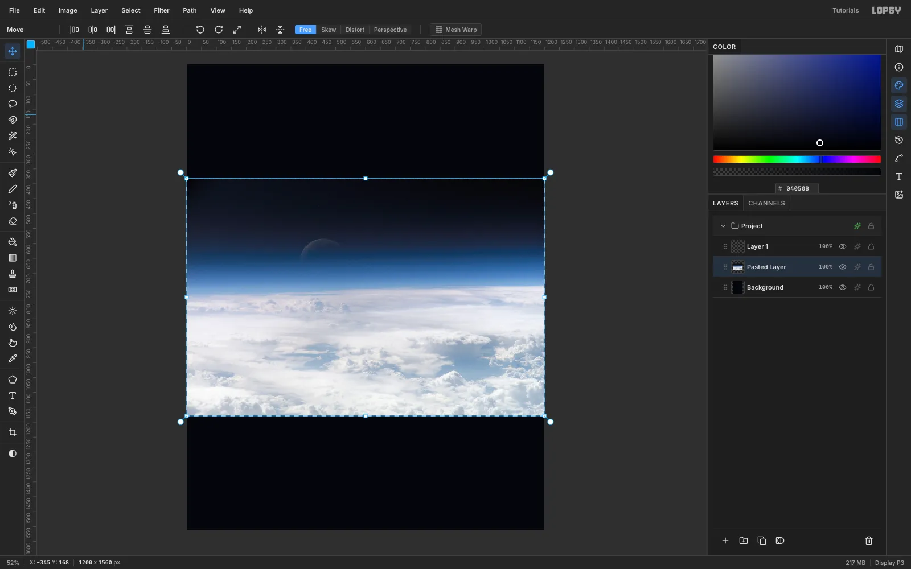

Create a **1200 × 1560** document. That's roughly the proportion of a US magazine. Select `Background`, set the foreground color to `#04050B`, and choose **Edit → Fill**.

Copy the photo in your browser and press [[Cmd+V]] in Lopsy. The photo is larger than the canvas, so Lopsy scales it to fit and centers it on a new `Pasted Layer`. The layer comes in already selected, with the **Move** tool active.

## Scale the photo past the edges

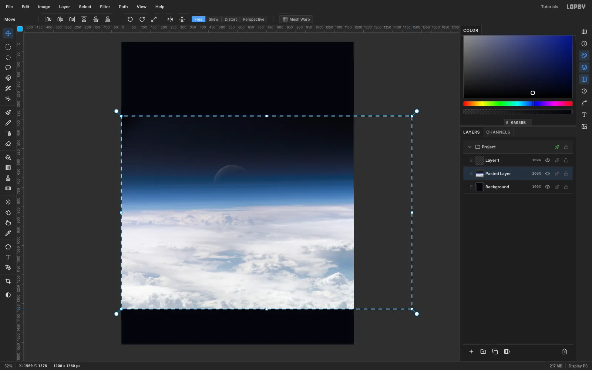

The Earth needs to fill the bottom of the cover edge to edge, so make it bigger. Hold [[Cmd]] and drag the bottom-right handle outward until the photo is **1500 px** wide. [[Cmd]] keeps the proportions locked. Press [[Cmd+D]] to commit the transform.

Double-click the layer name and rename it `Earth`. With the **Move** tool, drag it down and a little to the left (roughly 200 px down and 150 px left), so the curved blue edge of the atmosphere sits about two thirds of the way down the page and the photo still overhangs both sides.

## Fade the top of the photo with a layer mask

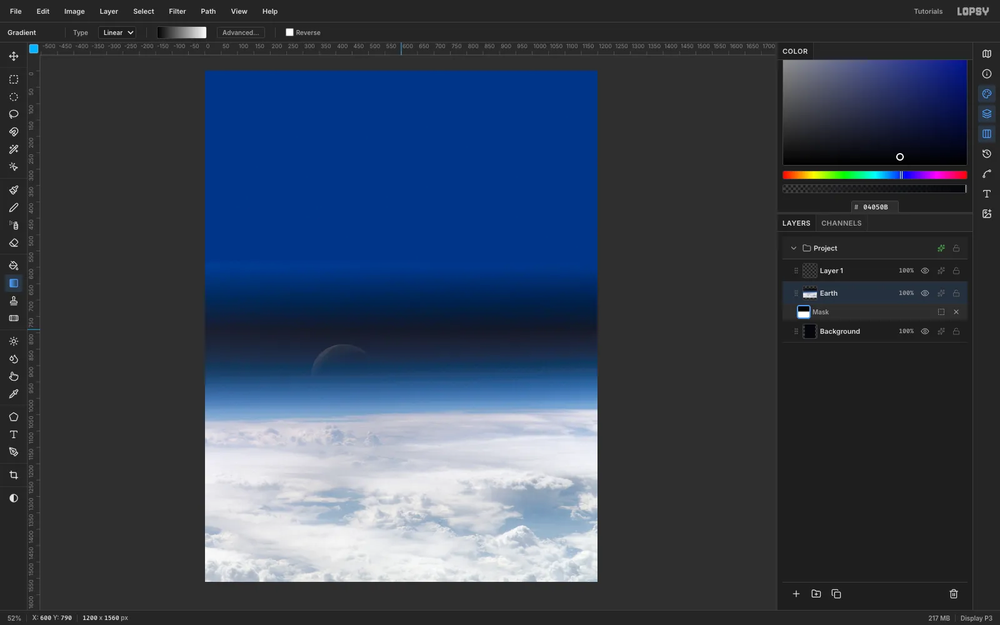

The top edge of the photo is a slightly lighter black than the background, so it shows as a visible seam. Click **Add Mask** at the bottom of the Layers panel, then click the mask row (**Edit mask for Earth**).

Pick the **Gradient** tool and open **Advanced…**. Set the stops to black at the left and white at the right. Drag straight down from about 40% of the way down the page to about halfway down, stopping above the faint crescent Moon. Hold [[Cmd]] while you drag to keep the line vertical. The top of the photo now melts into the background.

> **Tip:** In mask edit mode Lopsy tints the hidden areas blue. Click the `Earth` layer row to leave mask editing.

## Grade the photo for the 80s

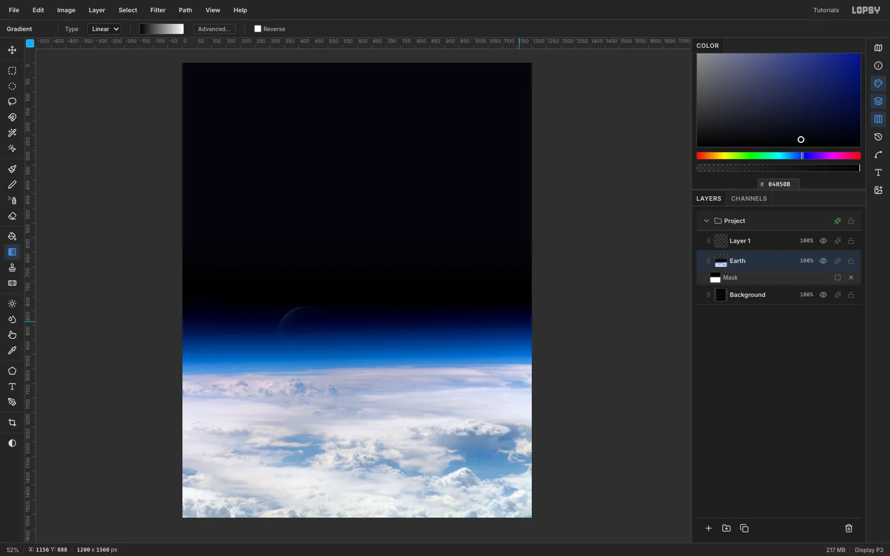

Airbrushed covers were never subtle. With `Earth` selected, open **Filter → Hue/Saturation…** and set **Saturation 30** and **Lightness −4**. Then open **Filter → Brightness/Contrast…** and set **Brightness −6** and **Contrast 22**. The atmosphere turns electric blue, and the space above it goes properly black.

## Add airglow and a starfield

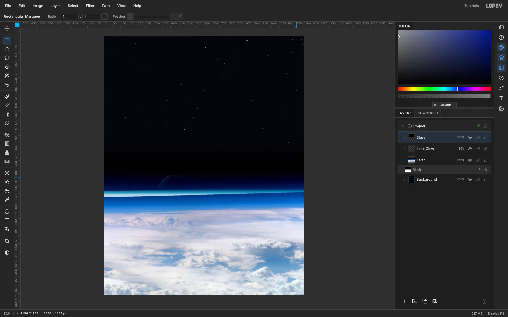

**Airglow.** Add a layer named `Limb Glow`. With the **Lasso**, draw a thin band that hugs the bright edge of the atmosphere, about 35 px tall, from edge to edge. In this photo that edge sits a little below 60% of the way down and rises slightly toward the right. Fill the band with a gradient that runs from transparent at the top to near-white cyan (`#E4FCFF`) at the bottom. Then apply **Gaussian Blur** at radius **3**, set the blend mode to **Screen**, and set the opacity to 80%.

**Stars.** Rename `Layer 1` to `Stars` and fill it with mid-gray `#808080`. Run **Filter → Add Noise…** with **Amount 100**, **Mono** and **Gaussian**. Then run **Filter → Threshold…** at **Level 185**. Only a few scattered pixels survive as white specks, which makes a believable, sparse starfield.

Set `Stars` to **Screen** so the black disappears. With the **Rectangular Marquee**, select the whole width of the page from about halfway down to the bottom, choose **Select → Feather…** 60 px, and press [[Delete]]. The stars now fade out before they reach the atmosphere.

## Set the masthead and the margin guides

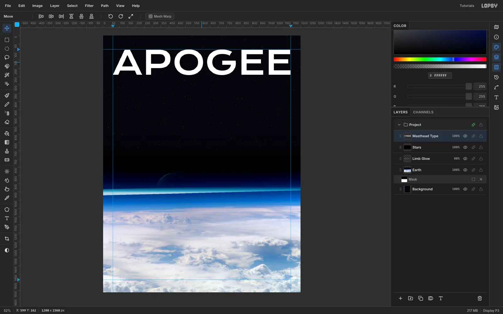

With the **Text** tool, click near the top and type `APOGEE` in **Krona One** at **199 px**. That size makes the word exactly span the page between 60 px margins.

Click the top ruler about 60 px in from each side (at `60` and `1140`) to add vertical margin guides. Click the left ruler at about `84` and `1484` for the top and bottom margins. With the **Move** tool, place the masthead so its top-left corner sits where the left and top guides cross.

## Fill the letters with a chrome gradient

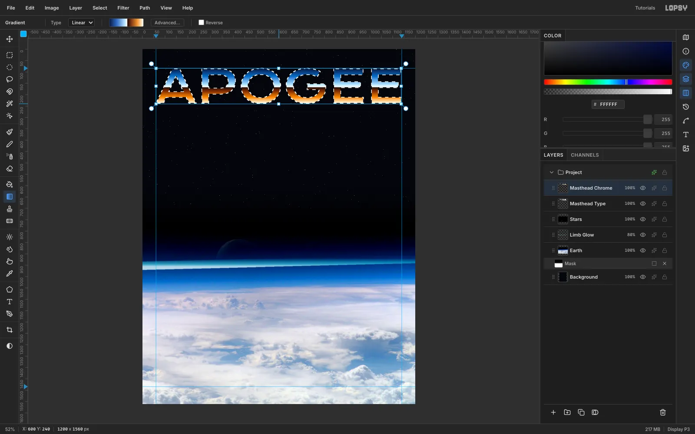

Click **Rasterize Layer**. Add a new layer named `Masthead Chrome`. Then [[Cmd]]-click the `Masthead Type` thumbnail to load the letters as a selection.

Pick the **Gradient** tool, open **Advanced…**, and build the chrome stops:

1. `#0B1A45` at 0%, the deep sky at the tops of the letters
2. `#2F6BC4` at 22%
3. `#BFE6FF` at 46%
4. `#FFFFFF` at 52%, the bright horizon
5. `#1E0E08` at 53.5%, the hard dark ground right under it
6. `#7A3510` at 64%
7. `#F0922E` at 82%
8. `#FFE2B0` at 94%
9. `#FFFFFF` at 100%

The 52% and 53.5% stops sit almost on top of each other. That's what makes the sharp horizon line. Drag straight down from the top of the letters to the bottom.

## Bevel the chrome with layer effects

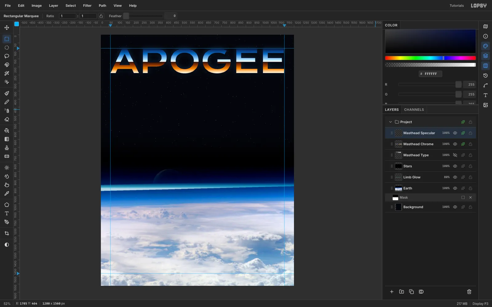

Open the **Layer effects** on `Masthead Chrome` and turn on:

- **Stroke**, 3 px, `#050B1E`, for a crisp keyline
- **Inner Glow**, `#1A0C05`, Size 4, Opacity 70, which darkens the inside edges like a bevel
- **Drop Shadow**, black, Offset 0 / 10, Blur 18, Opacity 80
- **Outer Glow**, `#4FA8FF`, Size 40, Opacity 30, for a faint glow in space

Hide `Masthead Type`. For the specular highlight, add a layer named `Masthead Specular`, marquee a 2 px strip across the whole word, right on the chrome's white horizon line, and fill it white. Zoom in to place it exactly.

To keep the line inside the letters, [[Cmd]]-click the `Masthead Type` thumbnail to load the letters as a selection. Then click the `Masthead Specular` row, choose **Select → Inverse**, and press [[Delete]]. Clicking the row before you delete makes sure [[Delete]] clears only the area outside the letters. Finish with a small white **Outer Glow** (Size 6).

## Draw the chrome hull

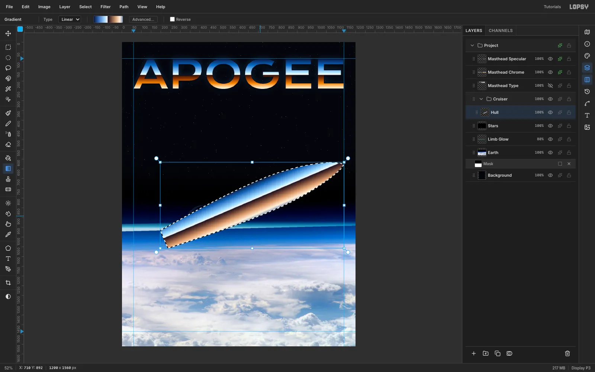

Select `Stars` and click **New Group**. Name it `Cruiser`, then add a layer inside it named `Hull`.

With the **Lasso**, draw a long cigar shape for the hull. Give it a pointed nose at the upper right and a blunt tail at the lower left, tilted up at about 23°. Choose **Select → Feather…** 1 px so the edges come out anti-aliased.

Set the Gradient stops to the hull version of the chrome ramp: `#0A1638`, `#2F63B5`, `#A9D8FF`, `#F4FBFF` at 47%, `#1C1220` at 49%, `#5A3A30`, `#D9A274`, `#FFF1DC` and `#7F93B8`. Drag the gradient **across** the hull, at right angles to its length, from the top edge to the bottom edge. Chrome reflects its surroundings across the shape, so a lengthwise gradient never reads as metal.

## Add the tail fins and engine bells

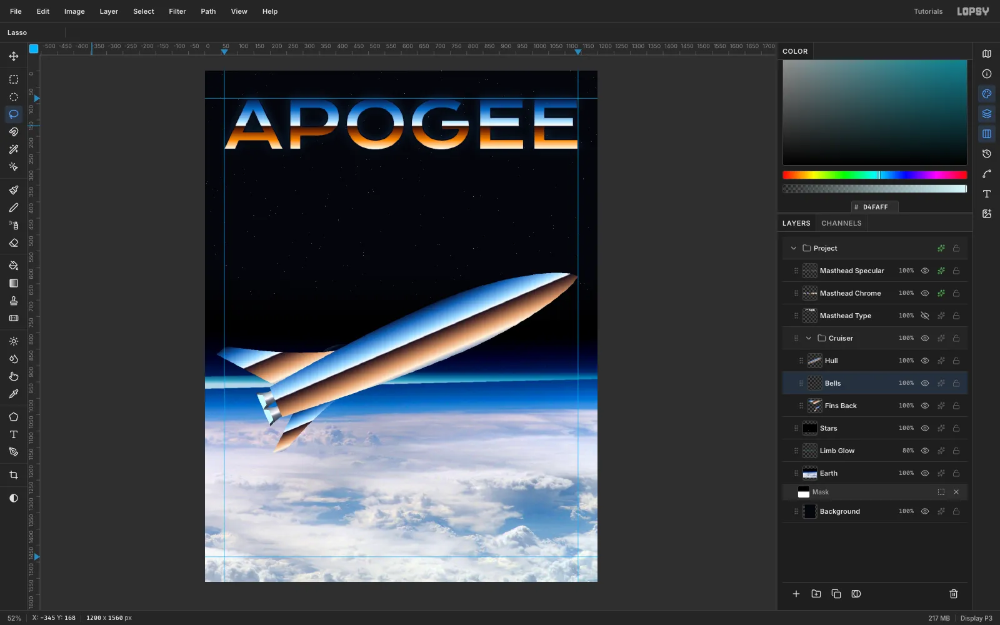

Add a layer named `Fins Back` and drag it below `Hull` in the Layers panel. Lasso a tall swept fin rising from the top of the tail, and a smaller one hanging below it.

Feather each by 1 px and fill it with the same chrome gradient. Again, drag across each fin at right angles to the hull, spanning that fin's own height. The horizon line then lands at the same point on every surface.

On a new `Bells` layer, lasso two flared nozzles at the tail. Fill them with a gunmetal gradient (`#20242F` → `#C9D0DE` → white → `#6E7488` → `#141720`). Then fill their open mouths with pale cyan `#D4FAFF`.

## Fire the engines and add speed lines

Add an `Exhaust` layer and drag it below `Fins Back`. Lasso a plume from each nozzle that widens slightly and then tapers, about 330 px long. Fill it with a gradient that runs along the plume: white-cyan `#F4FFFF`, then `#7FDCFF` at 20%, fading to transparent blue. Lasso a narrow core inside each plume and fill it with white fading to transparent.

Apply **Gaussian Blur** 3, add an **Outer Glow** in `#2FA8FF` (Size 40, Opacity 70), and set the layer to **Screen**.

On a `Speed Lines` layer below the exhaust, lasso five long, thin white slivers parallel to the hull. Blur them with **Gaussian Blur** 1.5, then apply **Filter → Motion Blur…** with **Angle 337** and **Distance 40**. Set the layer to **Screen** at 80%.

> **Tip:** Lopsy measures Motion Blur angles clockwise, so a line that climbs to the right at 23° needs an angle of 337°.

## Duplicate the portholes with copy and paste

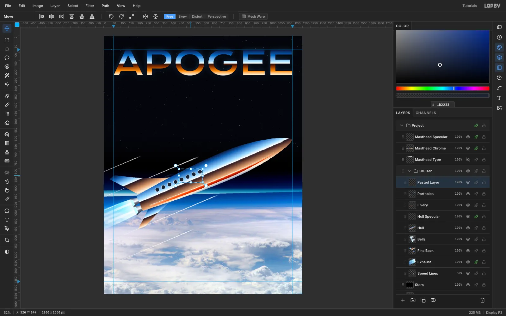

First, give the hull a specular line. Add a `Hull Specular` layer above `Hull`, lasso a 3 px sliver along the chrome's horizon line, fill it white, and add a white **Outer Glow** (Size 8, Opacity 70).

A liner needs a row of windows. On a new `Livery` layer above the hull, lasso a thin orange stripe that tapers to a point near the nose. Fill it with an orange gradient (`#FFC08A` → `#FF5A1F` → `#7A1404`), and add a cream pinstripe just above it.

Add a `Portholes` layer. Use the **Elliptical Marquee** to draw four chrome rims (radius 13, `#DCE6F4`) with dark insets (radius 11, `#1B2233`) along the upper hull.

Marquee all four and press [[Cmd+C]] and then [[Cmd+V]]. The copy pastes in place. Drag it along the hull by the width of four portholes, then choose **Layer → Merge Down**. Repeat once more for twelve windows.

## Light the windows and add the canopy and near fin

On a `Porthole Glass` layer, fill amber `#FFC46B` circles inside each rim, and add an orange **Outer Glow** (`#FF8A2A`, Size 10).

For the `Canopy`, lasso a dome on top of the hull near the nose. Fill it with a glass gradient (`#B8F0FF` → `#3A7CC0` → `#0D1F45` → `#03060F`), then add a small pale crescent highlight.

Finish the hull with a `Near Fin` layer: a small fairing pod along the hull, and a large fin sweeping down and back toward you. Fill both with the chrome gradient, dragged across the hull as before.

## Scale a strip of the photo into a reflection

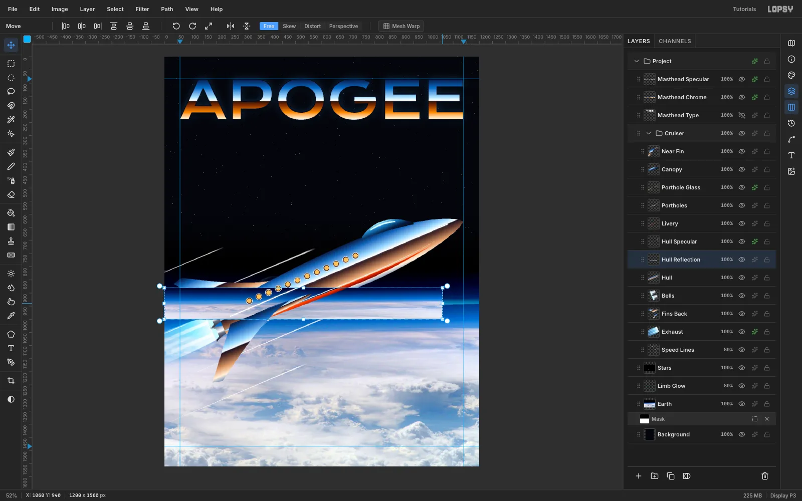

Real chrome reflects what's around it. Select `Earth` and marquee a full-width strip about 360 px tall across the horizon, from just above the glowing edge of the atmosphere down into the clouds. Press [[Cmd+C]] and [[Cmd+V]]. Rename the paste `Hull Reflection` and drag it into the `Cruiser` group, just above `Hull`.

With the strip still selected and the **Move** tool active, drag the bottom-middle handle up to squash the strip to 120 px tall. Then drag the right-middle handle in to make it 1060 px wide. Press [[Cmd+D]].

## Rotate the reflection to match the hull

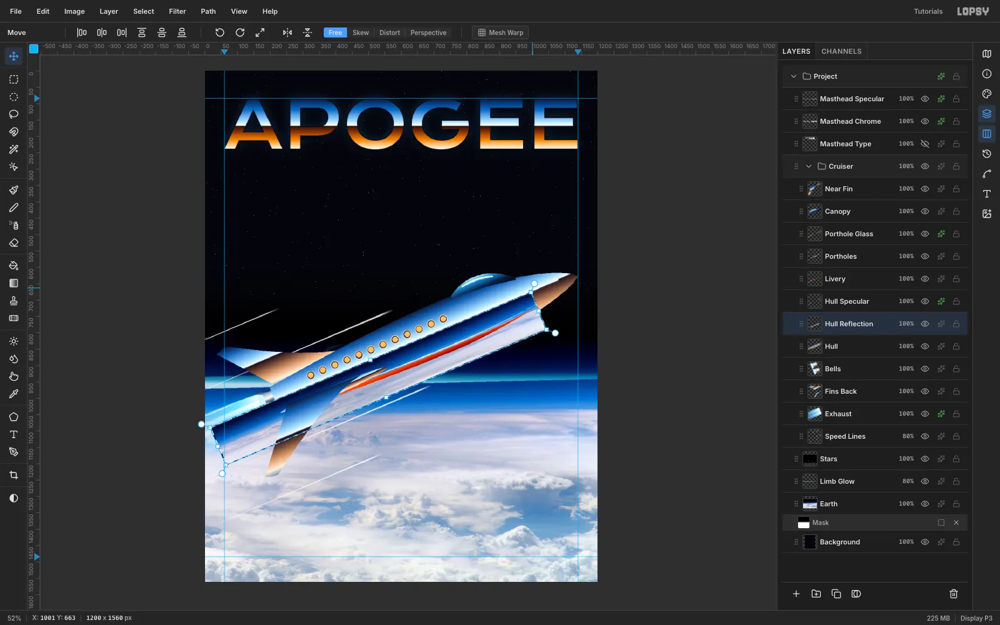

Marquee the strip again. Grab the round rotation handle just outside a corner and turn the strip about −23°, until it lines up with the hull. Press [[Cmd+D]] to commit, then drag it so it covers the lower half of the hull.

## Clip the reflection into the hull

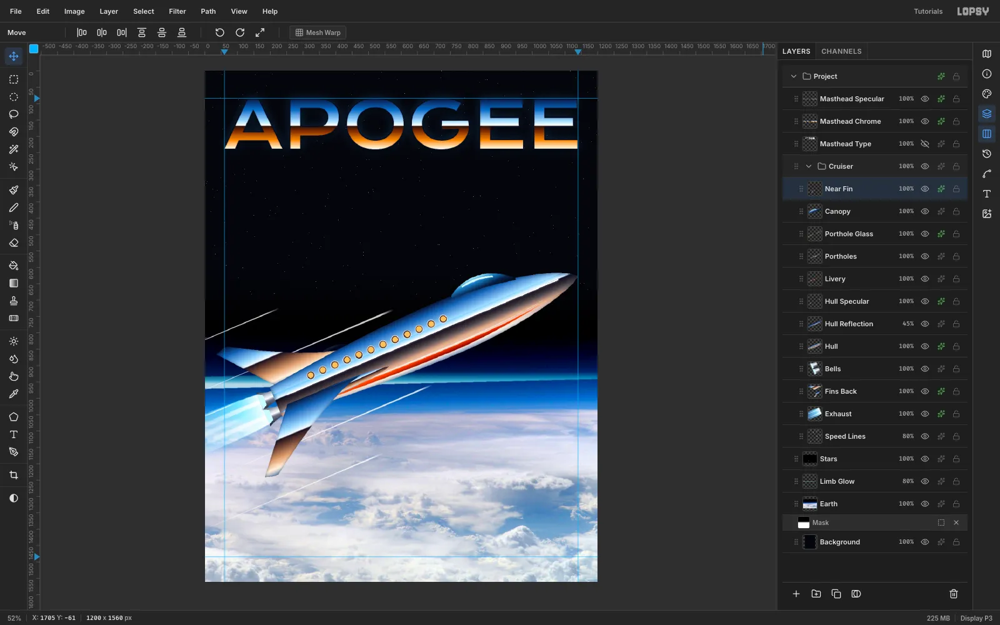

[[Cmd]]-click the `Hull` thumbnail to select its outline. Click `Hull Reflection`, choose **Select → Inverse**, and press [[Delete]]. Only the part over the hull survives. Set the layer to **Overlay** at 45%, so the chrome picks up the blues and whites of the planet below.

To make the hull read as a curved surface, add an **Inner Glow** in dark navy `#0A1430` to `Hull` (Size 22, Opacity 65) and a smaller one to both fin layers (Size 12). The edges darken the way a curved surface falls away from the light.

## Add star glints and film grain

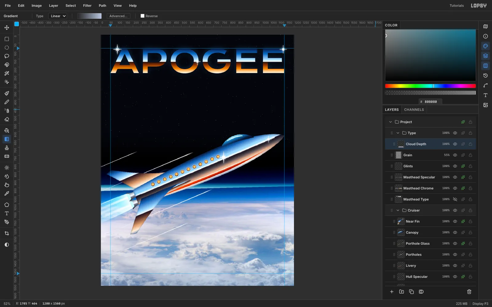

Every 80s chrome job needs glints. On a `Glints` layer above the masthead, lasso four-point stars, each a long thin cross with a shorter diagonal cross on top. Place them where the chrome is brightest: the tops of the A and the last E, the masthead horizon, and the highlight line on the hull. Give the layer a pale blue **Outer Glow** (`#CFE9FF`, Size 16).

For grain, add a `Grain` layer and fill it with `#808080`. Run **Add Noise** (Amount 40, Mono, Gaussian), then set the layer to **Overlay** at 55%.

## Snap the barcode box to the grid

Click **New Group**, name it `Type`, and add a `Cloud Depth` layer inside it. Give that layer a gradient from transparent about four fifths of the way down the page to light slate blue `#B9C6E0` at the bottom, and set it to **Multiply**. It gently darkens the clouds behind the bottom cover lines.

Turn on **View → Show Grid**, which also turns on **Snap to Grid**. On a new `Barcode Box` layer, marquee the bottom-right corner. The marquee snaps to the 16 px grid, so it's easy to get it square and aligned. Fill it with white. Then untick **Snap** in the options bar, turn off **View → Show Grid**, and trim the box so its right edge sits on the right margin guide and its bottom sits just above the bottom guide.

## Stretch the barcode to fit

Type the numbers `0 71486 02850 1` in **Michroma** at 11 px along the bottom of the box. Then type `*1185*` in **Libre Barcode 39** at 56 px above them. The asterisks are the barcode's start and stop characters.

The bars come out too short, so click **Rasterize Layer**. Then marquee the barcode, drag the bottom handle down a little (about 13 px) to make the bars taller, and drag the right handle in slightly so they fit the box. Press [[Cmd+D]], then center the bars and the digits in the box.

## Set the bottom cover lines

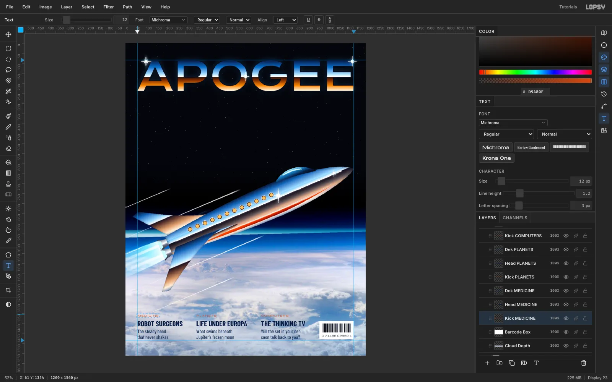

Each cover line has three parts. The kicker is **Michroma** 12 px in orange `#D9480F` with 3 px letter spacing. The headline is **Barlow Condensed Bold** 36 px in navy `#0B1A3F`. The description is **Barlow Condensed Medium** 25 px in `#22375F` with a line height of 1.15.

Start the first column on the left margin guide, and space the other two so there's about 70 px between each column and the next, and before the barcode. Line the headline cap tops up with the top of the barcode box.

> **Tip:** A Text-tool click on top of an existing text layer edits that layer instead of starting a new one. Click in clear space to start each block, then move it into place with the **Move** tool.

## Set the cover story headline

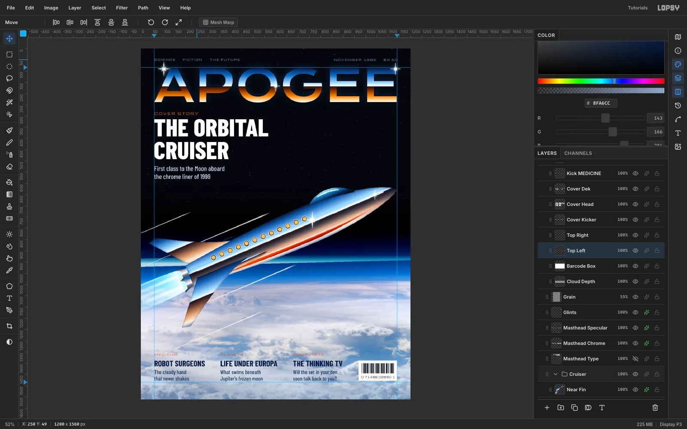

This is the text that sells the issue, so make it big:

- **Kicker:** `COVER STORY` in Michroma 15 px, `#FF7A2F`, letter spacing 4, a little way below the masthead.
- **Headline:** `THE ORBITAL` / `CRUISER` in Barlow Condensed ExtraBold 110 px, white, with a line height of 0.92. Put its cap tops 18 px under the kicker.
- **Description:** "First class to the Moon aboard the chrome liner of 1999" in Barlow Condensed Medium 30 px, `#C8D6EE`, 30 px under the headline.

Everything starts on the 60 px guide. Across the very top, set `SCIENCE · FICTION · THE FUTURE` and `NOVEMBER 1985 · $2.50` in Michroma 12 px, `#8FA6CC`. The date goes flush right to the 1140 guide.

## Build the anniversary badge

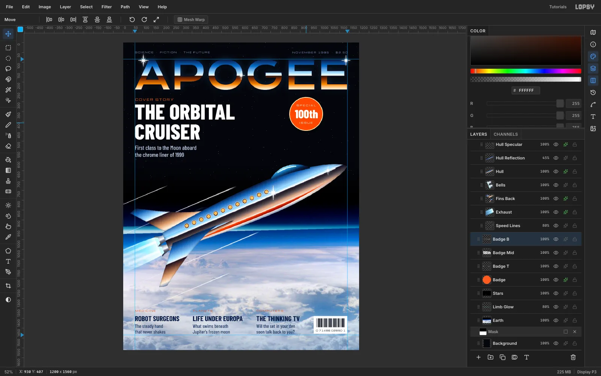

Select `Stars` and add a `Badge` layer. That keeps the badge below the ship. In the empty space to the right of the headline, fill an 82 px-radius circle with `#FF5A1F`, and give it a cream **Stroke** (`#FFE2B0`, 4 px) and a soft **Drop Shadow**.

Type `SPECIAL` and `ISSUE` in Michroma 12 px, and `100th` in Barlow Condensed ExtraBold 60 px, all in white. Center the three lines on the disc with equal 18 px gaps.

## Merge and rotate the badge

Click **Rasterize Layer** on each of the three text layers. Then choose **Layer → Merge Down** three times from the top one to fold them into `Badge`.

Marquee the badge, drag the rotation handle to tilt it about −12°, and press [[Cmd+D]]. The tilt gives it the slapped-on-sticker look of a newsstand special.

## Clone the Moon out of the sky

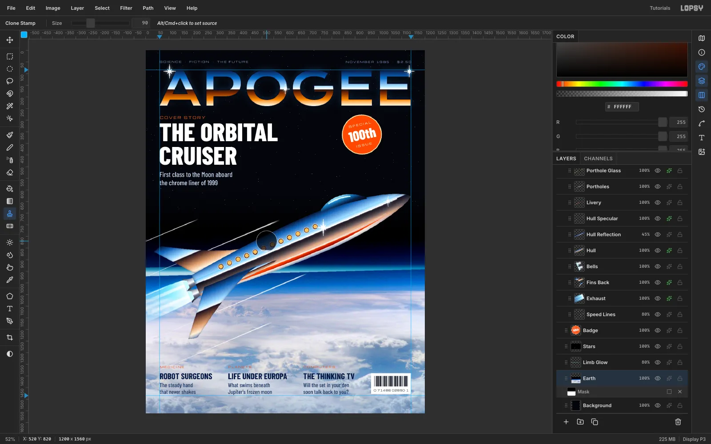

The photo's faint crescent Moon peeks out from behind the tail fin, and there it reads as a mistake. Select `Earth` and pick the **Clone Stamp** at Size 90.

[[Alt]]-click clean sky near the left edge of the page, level with the Moon. Then start your first stroke about 300 px to the right, at the same height, on the Moon itself. Paint horizontal strokes across the Moon, working down to the clouds.

> **Tip:** The Clone Stamp is *aligned*. The gap between your [[Alt]]-click and your first stroke stays fixed for every later stroke. Keep that offset purely sideways, and make sure the source strip doesn't overlap the thing you're removing.

## Check the retouch with the ship hidden

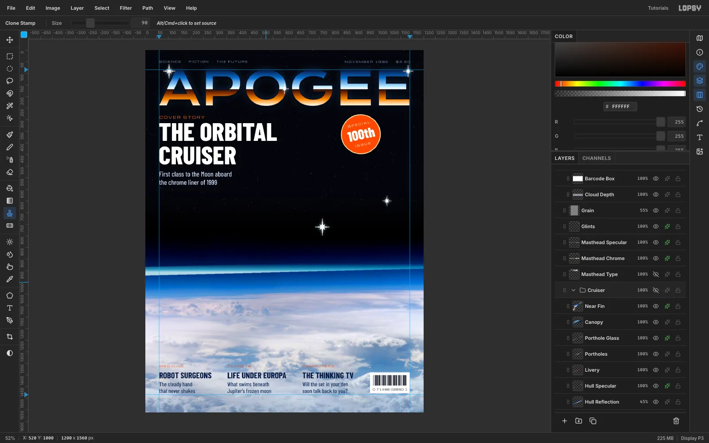

Click the eye on the `Cruiser` group to hide the whole ship at once. Check that the sky behind it is clean and has no repeated patterns, then click the eye again to bring the ship back.

## Do a final polish pass

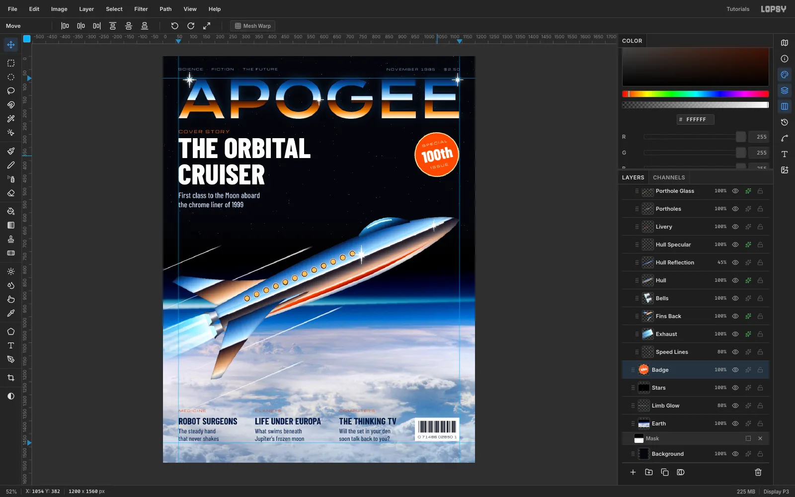

Step back and check the cover against the grid. Two things are worth a last pass:

- **The airglow's lower edge** can still read as a stripe laid on top of the photo. Run **Gaussian Blur** at radius **8** on `Limb Glow`, so it fades into the atmosphere below as well as the black above.
- **The badge** floats in the space with nothing to line up with. With the **Move** tool, drag it right until its edge sits on the 1140 px guide, then drop it about 15 px so it clears the kicker line.

## Save and export

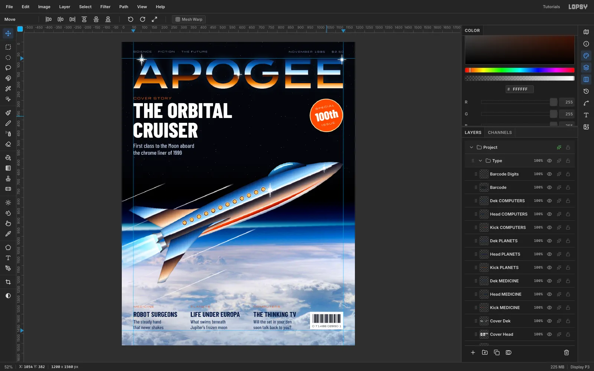

Everything now sits on the 60 px margins: the masthead, the cover story block, the bottom cover lines, the barcode and the badge. Choose **File → Save Project** to keep an editable `.lopsy` file, then **File → Quick Export PNG** for the finished cover.
