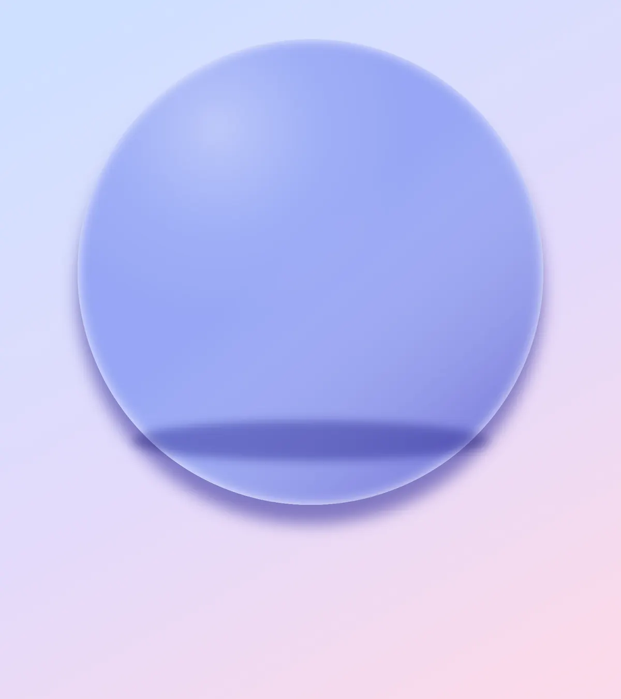
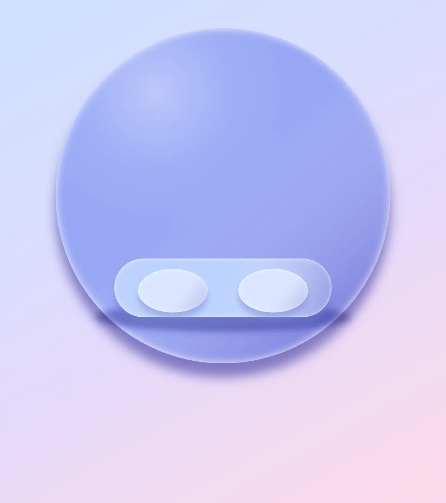
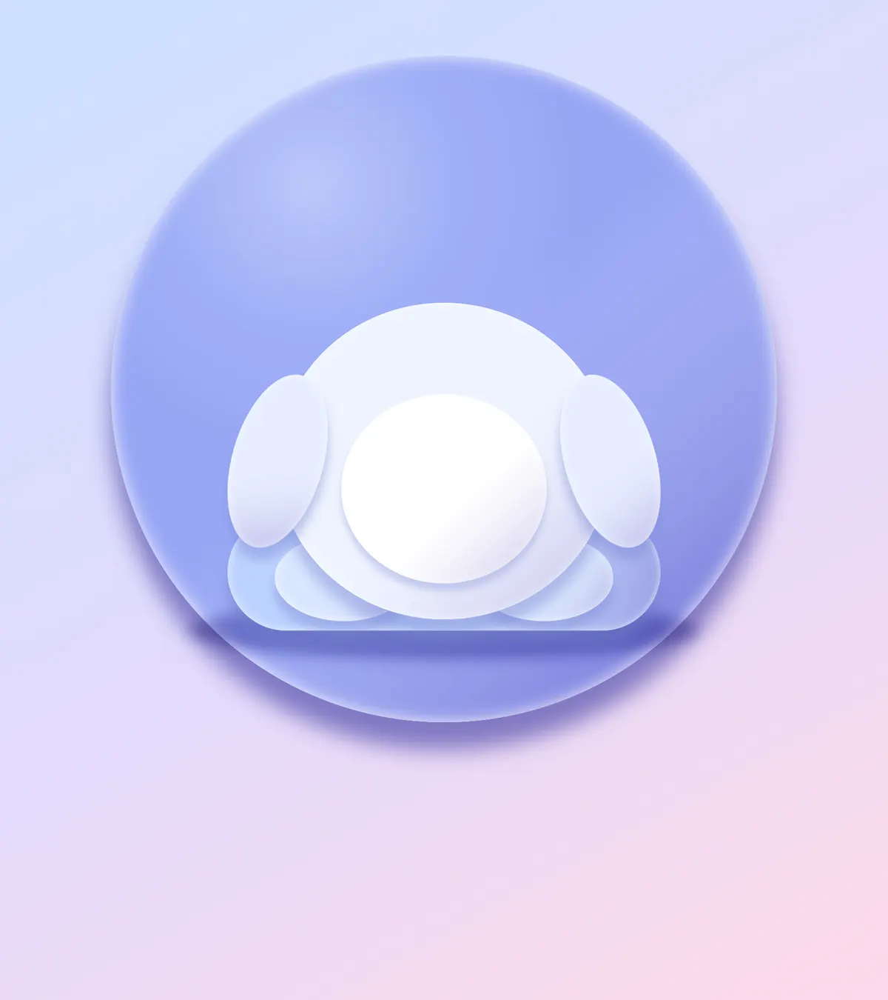
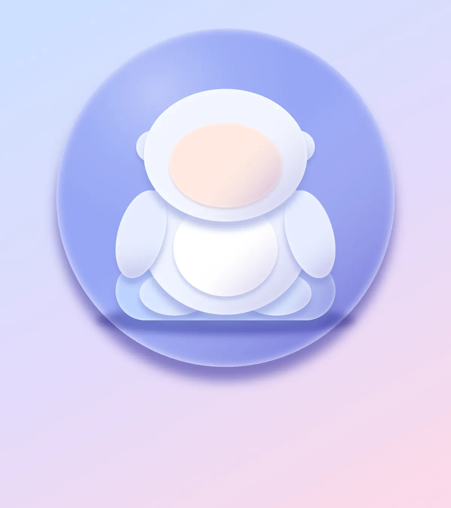
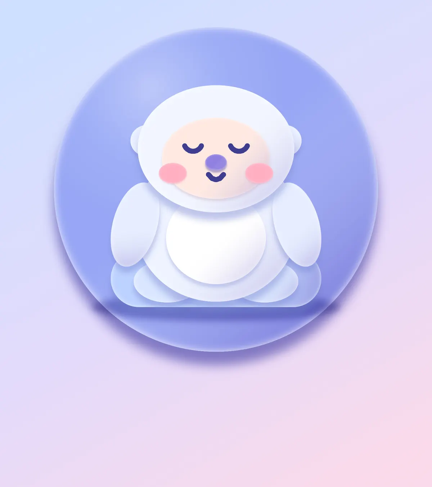
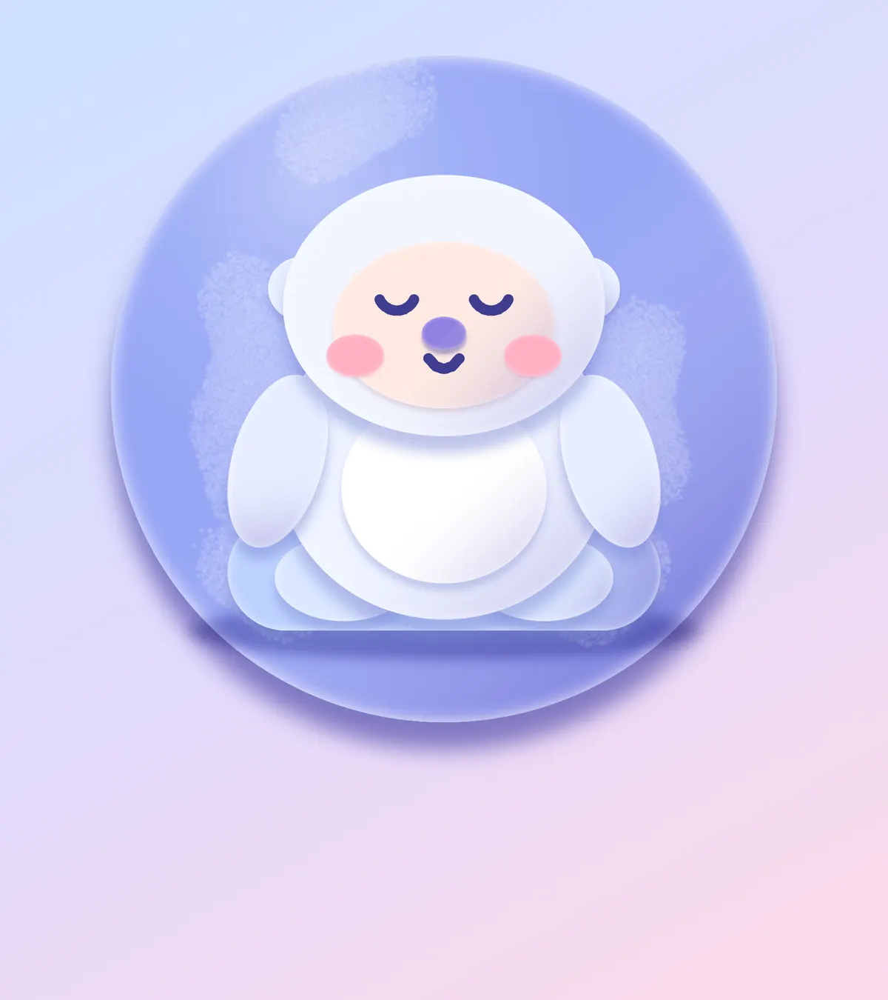

**Claymorphism** is the look of soft, puffy objects made from modelling clay:
rounded shapes, a pale rim of light on the inside edge, a darker tone on the
side away from the light and a soft shadow underneath. You don't need a 3D
program for it. Every blob in this 1600 × 1800 px logo is a flat **Shape**
tool fill with a gentle gradient across it, then an **Inner Glow** and a
**Drop Shadow** from the effects drawer.

The tools you'll meet along the way:

- the **Shape** tool in Ellipse, Rectangle and Polygon modes
- ⌘-click on a layer thumbnail to select a shape, then the **Gradient** tool to shade it
- layer effects: **Drop Shadow** and **Inner Glow**
- the **Move** tool's handles to squash and rotate, and a layer **group**
- the **Brush** for the sleepy face and the **Spray** for snow
- **Lilita One** text, a blurred shadow, and **undo / redo**

The palette is a cool periwinkle disc, warm accents and one dark indigo:

- Sky gradient `#CFE0FF` → `#E3DAFB` → `#FAD9EB`
- Disc `#97A6F5`, shadow indigo `#4A44A8`
- Fur `#EEF3FF`, belly white `#FFFFFF`, cushion `#BDD2FF`
- Face `#FFE9E1`, cheeks `#FFAFC2`, nose `#8F7FE0`, ink `#3F3D8F`
- Nightcap coral `#FF8F85`, brim cream `#FFF1D2`, butter yellow `#FFE08A`
- Feet `#D9E6FF`, head `#F2F6FF`, moon and Zs `#FFE08A`
- Title indigo `#4F4BB8`, ribbon coral `#FF8E84`, ribbon shadow `#C25A78`

## Start with a pastel sky

Choose **File → New**, set the units to **Pixels**, type **1600** by **1800**
and click **Create**. Select the *Background* layer and pick the **Gradient**
tool. Click **Advanced…**, then click the bar to add a middle stop and give the
three stops the colours above: pale blue, lavender and pink. Click **Done**,
then drag from the top left of the page to the bottom right.

## Puff up the disc

Add a layer and rename it *Plate*. Pick the **Shape** tool, set it to
**Ellipse**, click the **Fill** swatch and type `97A6F5` into the hex box. Hold
[[Cmd]]/[[Ctrl]] while you drag so the shape stays a circle. A shape grows from the point you
press, so press at the middle of the disc you want, about a third of the way down the page, and drag
out to the edge. Leave a wide margin left and right and extra room underneath for the title.
Or just click once and type 1200 × 1200 into the Shape Size box. New layers always appear above
the layer you had selected.

Now give it volume. [[Cmd]]-click the layer's thumbnail to select the disc, pick
the **Gradient** tool, and open **Advanced…** and set three stops. Stops 1 and 2 are `#FFFFFF` with the alpha bar at 0, the second
at the 45% mark, and stop 3 is `#6A5BC0` with alpha at 38%. Drag from the
upper left of the disc to the lower right so the shading builds up on the far
side. Deselect with [[Cmd]]+[[D]].

Click the effects button on the layer row and switch on **Drop Shadow**: Offset Y
about 50, Blur 60, in indigo `#4A44A8`. Switch on **Inner Glow** too, white, Size 44, Opacity 90.
That pale rim plus the soft shadow is the whole claymorphism recipe. Unless a step says otherwise,
every other blob gets Drop Shadow Y 22–26 / Blur 28–30 in a shadow tone and Inner Glow white / Size 22 / Opacity 75.

Last, add a layer called *Plate Gloss* above the disc, [[Cmd]]-click the *Plate* thumbnail, and
drag a **Radial** gradient from white at 85% opacity out to transparent, starting near the
upper left. Set the layer's blend mode to **Soft Light** so it only brightens that corner.

> **Tip:** The Gradient tool remembers its last stops. Keep this transparent-to-violet
> gradient loaded while you shape the yeti, and only change it for a different job.

## Build the cushion and feet

Add a layer called *Cushion*. With the Shape tool on **Rectangle**, raise **Corner Radius**
to its maximum so it becomes a pill, fill it `BDD2FF`, and drag a wide, low shape in the lower part of the disc. Select it from its thumbnail, drag the
shading gradient across it, then add **Drop Shadow** (Offset Y 26, Blur 30) and **Inner Glow**.

Do the same for *Foot L* and *Foot R*: two ellipses in `D9E6FF`, side by side on the cushion.
Soften the contact line with one more layer, *Contact Shadow*: draw an indigo
ellipse under the cushion, run **Filter → Gaussian Blur** with a radius around 25,
set its blend mode to **Multiply** and drop its opacity to about 45%. Drag *Contact Shadow* in the Layers
panel to just above *Plate Gloss*, below *Cushion*, so the feet stay clean.

## Shape the body

Add *Body*, a large ellipse in `EEF3FF`, sitting on the feet. Add *Belly*, a smaller
pure white ellipse in the middle of it. For the arms, make *Arm L* and *Arm R* as tall
narrow ellipses on either side.

To tilt an arm, drag a rectangular marquee around it, pick the **Move** tool and
drag the round handle outside a corner. Turn the left arm clockwise and the right arm
anticlockwise by about 15° so they hang outwards, then press [[Cmd]]/[[Ctrl]]+[[D]] to commit.
Draw the marquee so it fully contains the arm; only the pixels inside it rotate.

## Make the head and ears

Draw two small ellipses for *Ear L* and *Ear R* first, so they end up underneath. Then add
*Head*, a wide ellipse in `F2F6FF`, overlapping the ears and the top of the body. Finish
with *Face*, a smaller peach ellipse `FFE9E1` in the middle of the head. Give each of them
the same shading gradient, a Drop Shadow and an Inner Glow. For the face, lower both effects
a little (Drop Shadow Opacity 30, Inner Glow Size 16) so it reads as a soft dent, not another bulge.

## Paint the sleepy face

Add *Cheek L* and *Cheek R*, two flat pink ellipses `FFAFC2` with just a faint shadow
and no gradient, and a *Nose*, a small lavender ellipse `8F7FE0`.

Add a layer *Eyes & Mouth* above them. Set the foreground to dark indigo `3F3D8F`,
pick the **Brush**, set Size to 20 and Hardness to 90, and draw each eye as a short U-shaped arc with one curved drag, like a tiny smile on its side. Add a gentle smile below the nose with one more short drag.
Closed, U-shaped eyes are what make a character look asleep.

## Dust the disc with snow

Add a layer *Snow Specks* above *Plate Gloss*. [[Cmd]]-click the *Plate* thumbnail to select
the disc, so nothing can spill outside it. Set the foreground to white, pick the
**Spray** tool with Size 160, Density 30 and Softness 100, and drag a few loose strokes down both
sides of the yeti. Deselect, then lower the layer's opacity to about 45% so the flecks stay subtle.

## Add a nightcap

Pick the Shape tool, set it to **Polygon** with **Sides** 3 and a **Corner Radius** around
100, and draw a coral `FF8F85` triangle on a new *Nightcap* layer above the head. Drag a
marquee around it, pick the **Move** tool and pull the bottom-centre handle up to squash it
into a flatter cone, then [[Cmd]]/[[Ctrl]]+[[D]].

Add *Cap Brim*, a long rounded rectangle in cream `FFF1D2`, across its base, and *Pompom*, a
yellow `FFE08A` circle on the tip. Select the three layers (click one, then [[Shift]]-click
the other) and choose **Layer → Group Layers**; name the group *Nightcap Set*. With the group
selected and no marquee on the canvas, the Move tool shows one box around everything. Drag
its rotate handle about 14° clockwise so the hat flops to the side, then nudge the group up
with the arrow keys until the brim rests on the forehead.

## Hang a moon and some Zs

For the *Moon*, draw a yellow circle on a new layer, then drag an elliptical marquee that
overlaps one side and press [[Delete]] so only a crescent remains. Shade it and add the usual
Drop Shadow and Inner Glow.

Pick the **Text** tool, choose **Lilita One** and set the colour to `FFE08A`. Set Size to 190 *before* you click, click to the right of the hat and type `Z`. Then do the same with
Size 130 and Size 90, each a little higher and further right. Give each one a Drop Shadow in indigo and a small white Inner Glow so they read as clay too.

## Set the title

There is a clear strip under the disc for the title.

With the Text tool, Lilita One and indigo `4F4BB8`, click below the disc and type
`DOZY YETI` at size 210. Choose the Move tool and press **Align center horizontally**
so it sits in the middle of the page. Add a Drop Shadow (Offset Y 14, Blur 12, dark indigo `#2E2A86`) and a
pale lavender Inner Glow (`C9C7FF`, Size 14).

## Finish with a ribbon

Draw a coral `FF8E84` pill with the Shape tool on a layer called *Ribbon* and shade it with a
lighter gradient, so the right end stays warm. Add a Drop Shadow in rose `#C25A78` and a small Inner Glow.

Then type `SLEEPY SNOW CO.` in white Lilita One at size 56 and raise the **Letter spacing** in the
Text panel to 10. Use **Align center horizontally** again and check that the same amount of coral
shows at both ends of the word, with the descender-free capitals sitting in the middle of the pill.

## Add a touch of grain

Select the top of the layer stack and add *Clay Grain*. Set the foreground to mid grey `#808080` and choose **Edit → Fill**,
then run **Filter → Add Noise** with Amount 30 and **Mono** switched on, then in the effects drawer set the layer's
**Blend** to **Overlay** and its opacity to 35%. A grey overlay changes nothing except the noise,
so the clay picks up a fine matte tooth.

If the grain is too strong, press [[Cmd]]/[[Ctrl]]+[[Z]] and try a lower Amount;
[[Cmd]]/[[Ctrl]]+[[Shift]]+[[Z]] brings it back. Zoom to 100% to see the tooth.
Export with **File → Quick Export PNG**, or save the project to keep every layer editable.
