Claymorphism makes flat shapes look like soft, rounded objects modelled from plasticine. You see pastel colours, a darker crescent where each shape curves away from the light, a pale rim where it catches the light, and a soft shadow underneath. A tattoo **flash sheet** is the page of ready-made designs that hangs on a tattoo shop wall. It shows classic motifs, a bold dark outline round every shape, and a price under each design.

In this tutorial you'll put the two together in **Grumpy Quokka**, a 1200 × 1600 flash sheet. The quokka is famous for looking like it's always smiling, so the joke is a quokka that refuses to: it frowns out of a heart above a banner that says NO SMILES. Around it go six classic flash designs, a swallow, a dagger, a moon, an anchor, a rose and a pair of dice, all as puffy clay.

Every clay shape on the sheet gets the same four moves:

1. **Outline:** select the shape, **Grow** the selection and fill it plum, then **Shrink** it back and fill the colour. That leaves a soft, even outline.
2. **Shade:** fill the shape with a darker tint on a new layer, then slide the selection up and to the left, feather it and delete. What's left is a soft crescent on the lower right. Merge it down.
3. **Highlight:** the same with a lighter tint and a small slide down and to the right. That leaves a bright rim on the top-left edge.
4. **Shadow:** add a soft plum **Drop Shadow** to the layer.

You'll learn all four on the heart, then repeat them for every other piece.

The fonts are free Google Fonts: **Caprasimo** for the title, **Titan One** for the banner and prices, and **Sniglet** (ExtraBold) for the small type.

The palette:

- Paper `#E6F4EC` → `#C6E3D4`
- Ink `#3D2442` (outlines, type, eyes)
- Coral `#FF7A6B`, shade `#CC5156`, highlight `#FFC7BB`
- Quokka fur `#A8957C`, shade `#866263`, highlight `#DCD2C2`
- Cheeks `#E3D3BC`, inner ears `#6E5444`, eyelids `#7D6A55`
- Cream `#FFF6E8` (banner, tags, dice), shade `#CCA2BA`, fold `#A87C90`
- Swallow blue `#7C9CFF`, shade `#6367CC`
- Teal `#36B5A2`, shade `#2B7782`, leaf veins `#1F6E64`
- Butter `#FFD166`, shade `#CC8A52`
- Blade lilac `#B9AEEA`, fuller `#8C80CC`
- Deep coral `#E8555A` (rose cup, dice pips)
- Drop shadow `#4A2D55`

> **Tip:** The shade tints follow one rule: darken a colour slightly and push it towards dusty mauve. Keeping the shadow colour the same family as the plum ink is what makes all the clay look like it sits in the same light.

## Create a portrait canvas

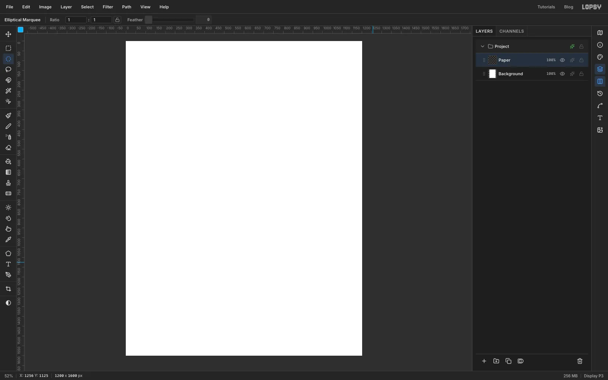

Open [Lopsy](/). In the **New Document** dialog, set **Width** to `1200` and **Height** to `1600` pixels, keep the **White** background and click **Create**.

Double-click **Layer 1** and rename it `Paper`. Lopsy puts everything inside a top-level **Project** group, and new layers land above whichever layer you have selected.

## Paint the mint paper

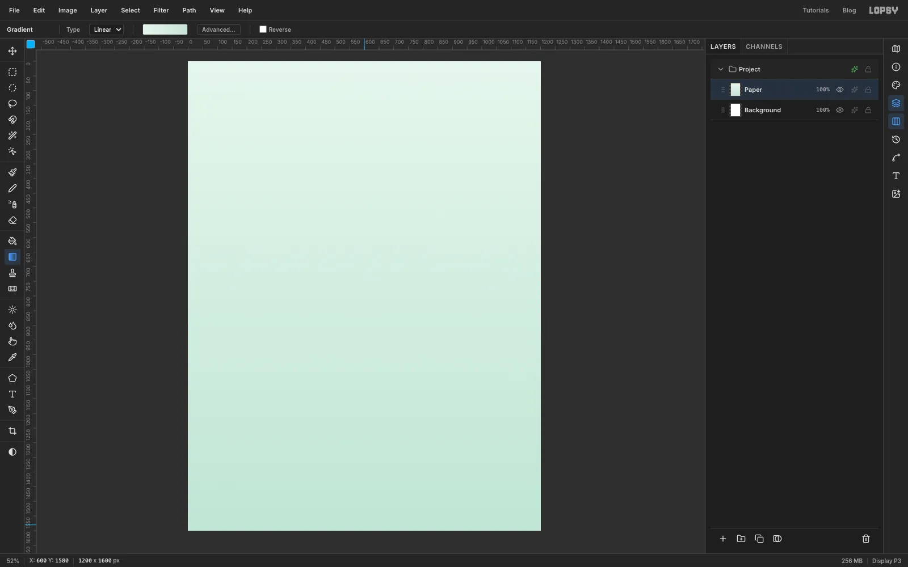

Pick the **Gradient** tool, click **Advanced…** and set two stops: `#E6F4EC` at the start and `#C6E3D4` at the end. Click **Done**. With nothing selected, drag from the top of the canvas straight down to the bottom.

Keep the paper pale and calm. The clay pieces will carry all the colour.

## Add a double border and guides

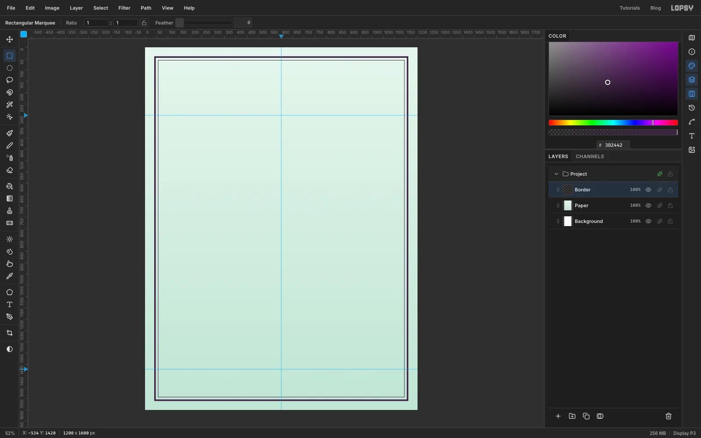

Add a layer named `Border`. Pick the **Rectangular Marquee** and click once on the canvas without dragging. A dialog asks for exact corners: enter **From** `40`, `40` and **To** `1160`, `1560`. Set the foreground to `#3D2442` and choose **Edit → Fill**. Then choose **Select → Shrink…**, enter `6`, and press [[Delete]]. That leaves a 6 px frame.

Make a second rectangle the same way, 16 px further in (`56`, `56` to `1144`, `1544`). Fill it, **Shrink** by `2` and delete again. Now you have the classic flash-sheet double line.

Add three guides by clicking on the rulers: one on the top ruler at `600` for the centre line, and two on the left ruler at `300` and `1420`. Those mark the top and bottom of the design area.

## Draw the heart with a clay outline

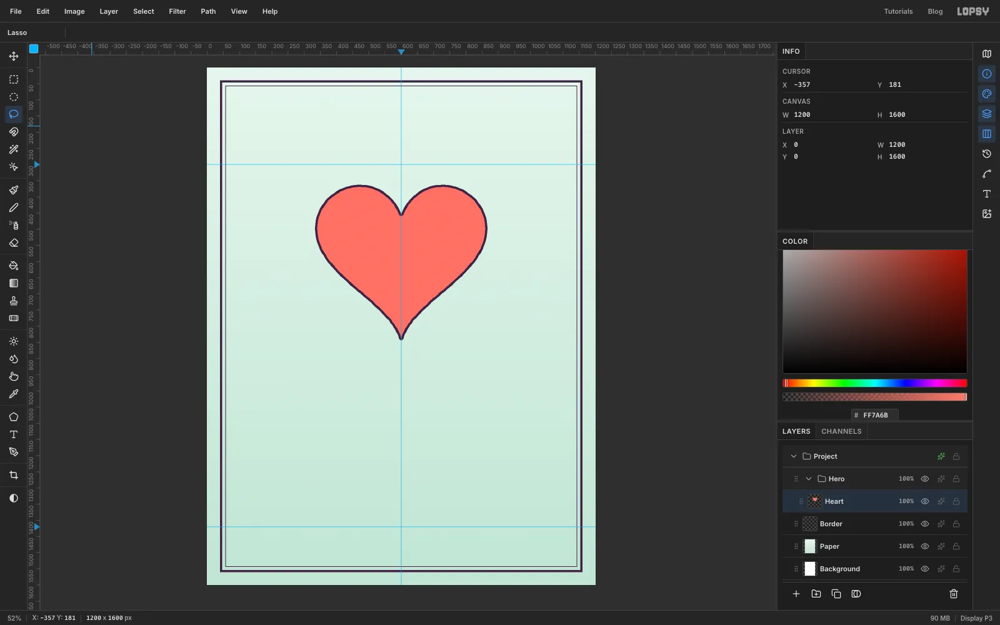

Select **Border** and click **New Group** at the bottom of the Layers panel. Name the group `Hero`, then click **Add Layer** and name it `Heart`. The new layer lands inside the group.

Pick the **Lasso** and drag round a big heart, centred on the middle guide. Its top should sit a little below the top guide and its point a little above the middle of the sheet (it's about 520 px wide). Then make the outline:

1. **Select → Grow…** by `7` px, set the foreground to the plum `#3D2442` and **Edit → Fill**.
2. **Select → Shrink…** by `7` px, set the foreground to coral `#FF7A6B` and fill again.

Deselect with [[Ctrl+D]]. Growing and shrinking measure true distances from the edge, so the outline comes out even all the way round and the corners stay soft.

## Shade the heart with a shifted selection

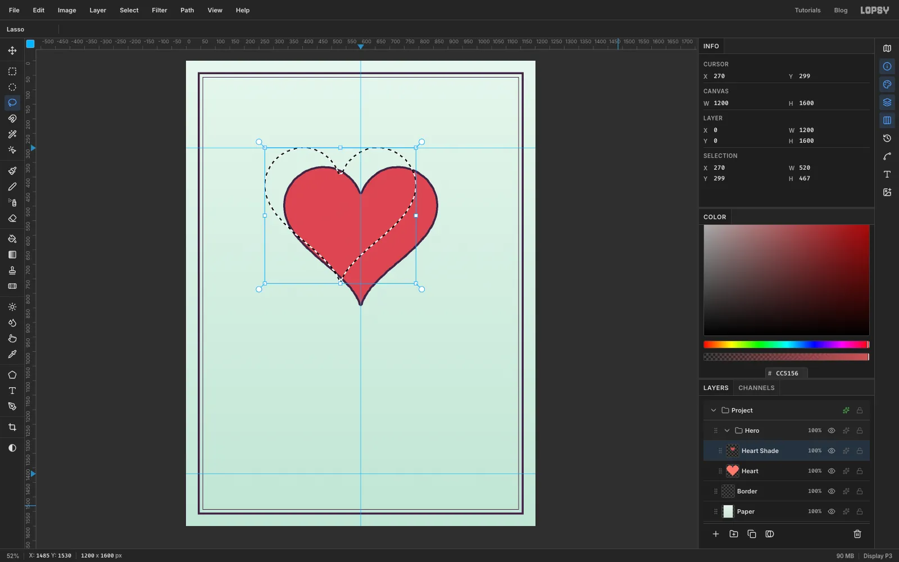

This is the trick that turns a flat shape into clay.

1. Hold [[Ctrl]] (Cmd on a Mac) and click the **Heart** layer's thumbnail. That selects everything on the layer. Choose **Select → Shrink…** by `7`, so the selection is the coral area without its outline.
2. Click **Add Layer**, name it `Heart Shade`, set the foreground to the darker coral `#CC5156` and choose **Edit → Fill**.
3. Pick the **Lasso**. With a selection tool active, the arrow keys move the selection outline and leave the pixels alone. Press [[Shift+↑]] and [[Shift+←]] seven times each to slide the outline 70 px up and to the left.
4. Choose **Select → Feather…** and enter `60`, then press [[Delete]] and deselect.

The delete removes most of the dark copy and fades it out across the feathered edge. What's left is a soft crescent along the lower right of the heart. Choose **Layer → Merge Down** to fold it into **Heart**.

## Add the highlight and the shadow

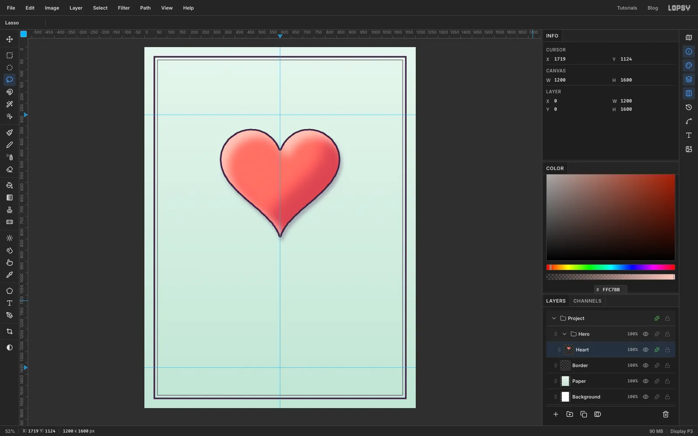

The highlight is the same move the other way round:

1. [[Ctrl]]/Cmd-click the **Heart** thumbnail and **Shrink** by `7` again.
2. Add a `Heart Shine` layer and fill it with the pale coral `#FFC7BB`.
3. With the Lasso active, slide the outline 30 px *down and right* ([[Shift+↓]] and [[Shift+→]] three times each).
4. **Feather** by `40`, press [[Delete]], deselect and **Merge Down**.

That leaves a thin bright rim on the top-left edge.

Finally, click the heart's effects button (the sparkle icon on its row) and turn on **Drop Shadow**: colour `#4A2D55`, **Blur** `22`, **Offset X** `8`, **Offset Y** `16`, **Opacity** `34`.

From here on, "give it the clay treatment" means all four moves: outline, shade, highlight, shadow. Scale the slide and the feather to the size of the piece. For a 60 px eye, slide about 10 px and feather about 12.

> **Tip:** When a layer holds several overlapping pieces (rose petals, the anchor's parts), shade each piece right after you fill it. After the colour fill, that piece is still selected, so you can skip the thumbnail click and go straight to step 2.

> **Tip:** For circles and squares, use the marquees and lock **Ratio** to `1 : 1` in the options bar, or hold Cmd (the Windows key on a PC) while you drag.

## Model the quokka's head

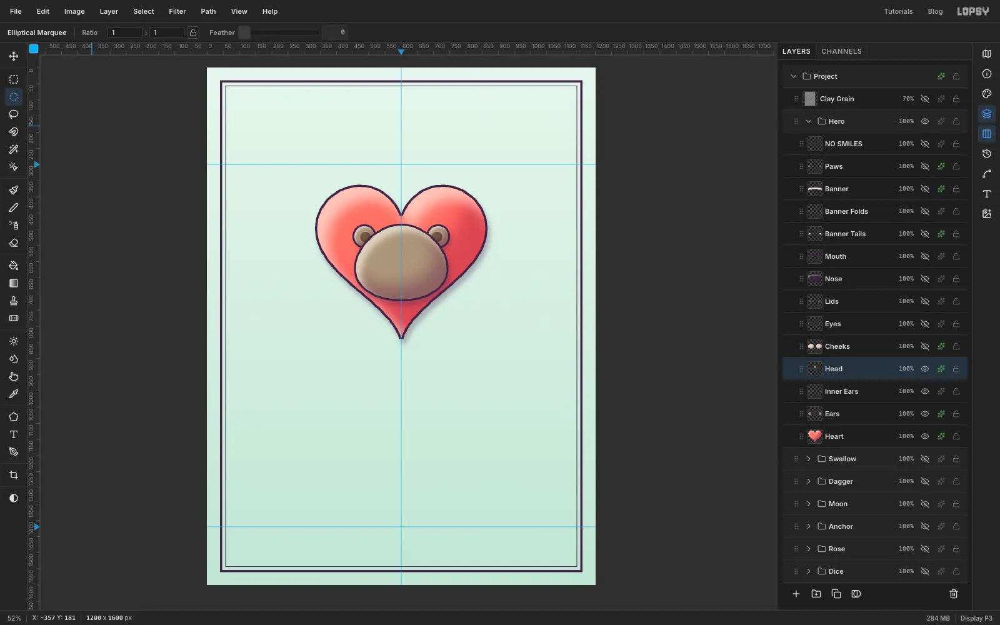

*This screenshot and the next were retaken from the finished project, so the Layers panel already shows the later layers, hidden.*

Click **Heart**, then add these layers one at a time, so each lands above the last:

- `Ears`: two small circles where the upper corners of the head will be, so the head will hide about half of each. Give them the clay treatment in fur `#A8957C`.
- `Inner Ears`: a smaller circle inside each ear in `#6E5444`. Skip the outline, and just shade the lower right.
- `Head`: an egg shape about 280 px wide, filling the middle of the heart. Make it a little wider at the bottom so the cheeks look full. Give it the clay treatment in fur, with a slightly bigger Drop Shadow (Blur `20`, Offset `7` / `14`, Opacity `34`).

Keep the ears small. Big round ears high on the head turn a quokka into a teddy bear.

## Give it a grumpy face

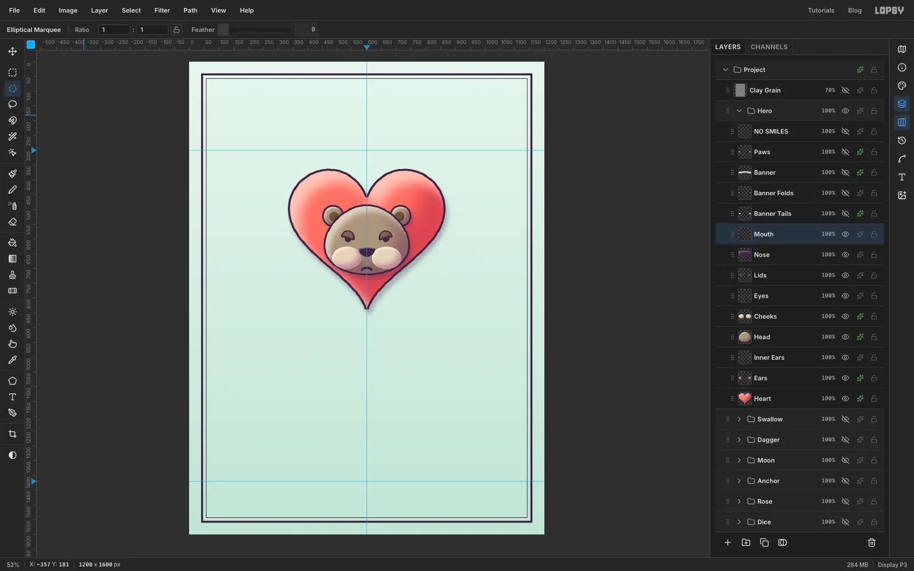

Add these layers above **Head**:

- `Cheeks`: two wide ovals in `#E3D3BC`, low on each side of the face and almost touching in the middle. No outline, but do shade and highlight them so they puff out. These are the quokka's famous smiling cheeks.
- `Eyes`: two small dark ovals in `#3D2442`, set wide apart, with a tiny highlight.
- `Lids`: over the top half of each eye, lasso a half-oval whose bottom edge slopes down towards the nose. **Grow** by `4` and fill plum, then **Shrink** by `4` and fill `#7D6A55`, the same outline move with a thinner line. The slope is what makes the face grumpy.
- `Nose`: a big rounded triangle in plum between the cheeks.
- `Mouth`: a short, thick downward arc under the nose.

## Add the banner and the paws

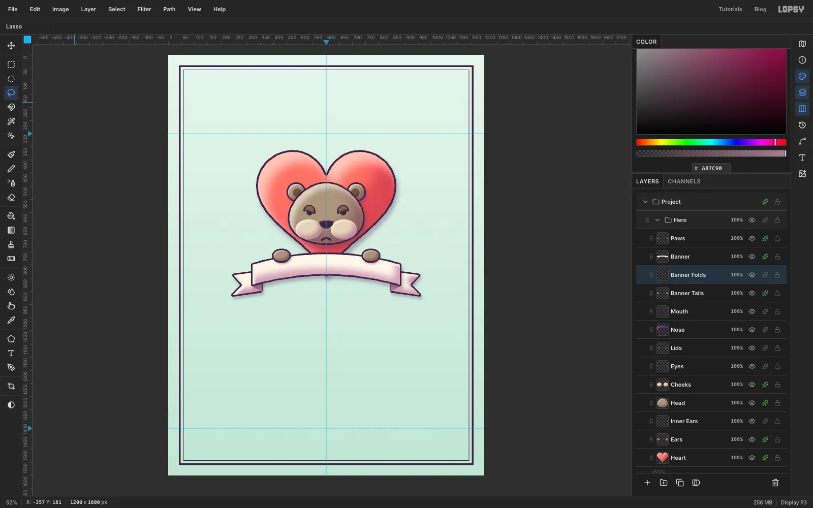

Click **Mouth** and add:

- `Banner Tails`: two ribbon ends sticking out a little lower than both ends of the banner, each with a V-shaped notch cut into its outer end. Lasso them in cream `#FFF6E8` and give them the clay treatment.
- `Banner Folds`: a small dark triangle in `#A87C90` at the inner end of each tail, just under where the banner will sit. It reads as the fold where the ribbon tucks behind itself.
- `Banner`: a gently arched band about 560 px long and 76 px tall, centred on the guide, low enough to cover the tip of the heart. With the Lasso, drag the top edge as a shallow upward curve, come down the right end, drag the bottom edge back parallel to the top, and close it at the left end.
- `Paws`: two small fur ovals resting on the banner's top edge, near its ends.

Keep the paws near the ends of the banner. The lettering goes in the middle.

## Draw an arch with the Pen tool

Select **Paws** and pick the **Text** tool. Choose **Titan One**, size `46`, colour plum. Click in an empty part of the canvas and type `NO SMILES`, then press [[Tab]] to commit.

Now pick the **Pen** tool. Press a little in from the left paw, slightly below the middle of the banner, and drag a little up and to the right to pull out a handle. Then press the same distance in from the right paw and drag down and to the right. That draws a gentle arch that follows the banner. Click **✓ Commit path** in the options bar.

Make the arch about as wide as the text: the type starts at the path's first anchor.

## Put the text on the arch

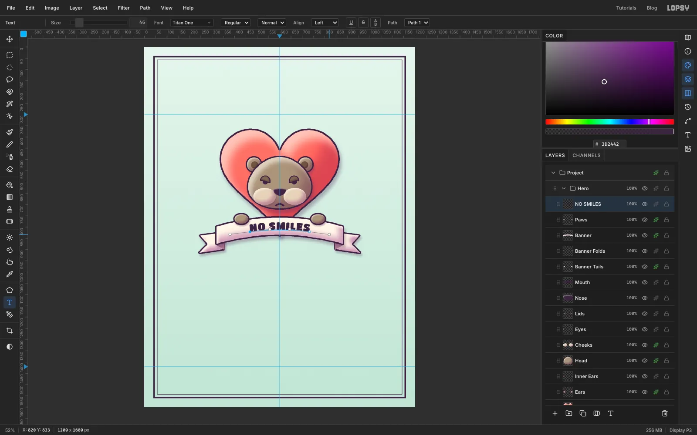

Click the **NO SMILES** layer, pick the **Text** tool, and choose **Path 1** in the **Text path** dropdown in the options bar. The letters jump onto the arch and tilt to follow it.

Check that the lettering sits in the middle of the banner, with the same gap above and below, and that it doesn't touch the paws. If it doesn't, drag the path's anchors or handles with the Pen tool, and the text follows.

> **Tip:** Text on a path can be selected from about one font size away from its letters. Create new text well away from the banner, then move it into place.

## Build the swallow

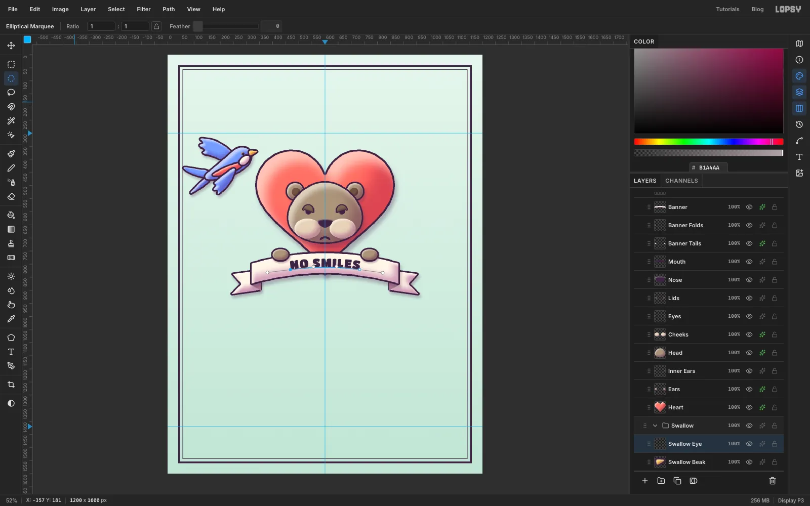

Select **Border**, click **New Group** and name it `Swallow`. It's the most fiddly design on the sheet, so take it piece by piece. Lasso each part on its own layer, from the back to the front:

1. `Swallow Wings`: the back wing, swept up and back, with three rounded feather notches.
2. `Swallow Tail`: two long streamers forking out behind.
3. `Swallow Body`: a plump teardrop with the head at the front.
4. `Swallow Belly`: a coral `#FF7A6B` stripe along the underside.
5. `Swallow Throat`: a cream patch under the beak.
6. `Swallow Front Wing`: the near wing, swept down and back.
7. `Swallow Beak` in butter `#FFD166`, and `Swallow Eye`, a small plum dot.

Give every piece the clay treatment and a small Drop Shadow (Blur `12`, Offset `5` / `9`, Opacity `28`). Overlapping shadows make each piece look pressed onto the one below.

Keep your lasso strokes round and smooth. Clay doesn't have sharp corners.

## Build the dagger upright

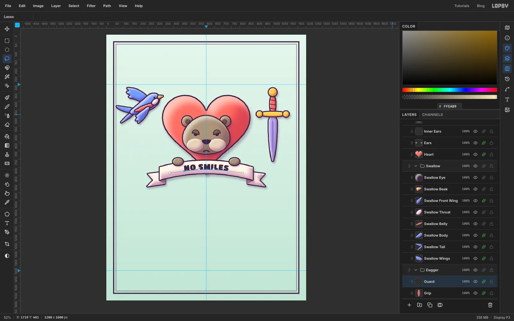

Make a `Dagger` group the same way, above **Border**. It's easier to build the dagger straight and tilt it afterwards.

- `Blade`: a long tapering point in `#B9AEEA`. Then lasso a thin strip down its middle, feather it by `2` and fill it with `#8C80CC` for the fuller.
- `Grip`: a rounded bar in coral. Pick the **Brush** at size `5` in plum, click on one side of the grip and [[Shift]]-click on the other to draw a straight wrap line. Draw three.
- `Guard`: a rounded crossbar with a ball at each end, and a ball pommel on top, all in butter on one layer.

## Rotate the whole dagger

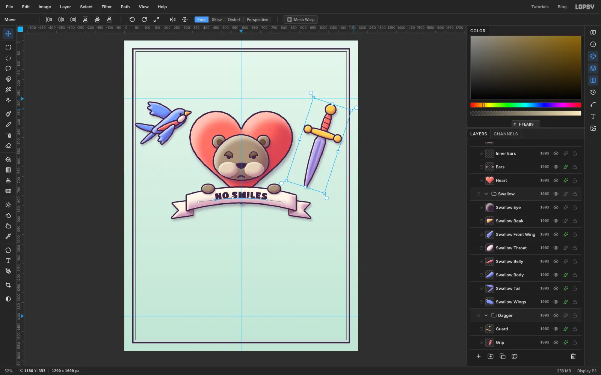

Select the **Dagger** group row and pick the **Move** tool. A box appears around the whole dagger, with a round rotate handle just outside each corner. Drag the top-right one down in a slow arc until the dagger leans about 18° to the right.

Press [[Ctrl+D]] to commit. Rotating the group turns the blade, grip and guard together. The drop shadows are worked out again after the rotation, so they still fall down and to the right.

## Make the moon

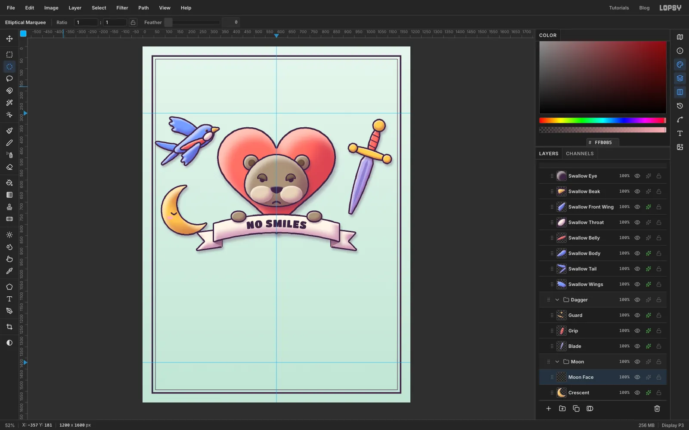

Add a `Moon` group with a `Crescent` layer. Draw a circle about 215 px across with the **Elliptical Marquee**, then hold [[Alt]] (Option) and drag a slightly smaller circle offset up and to the right. Holding Alt **subtracts** it, leaving a crescent. Give it the clay treatment in butter `#FFD166`.

On a `Moon Face` layer, draw a small closed eye as a plum arc and a soft pink cheek: an oval feathered by `4` and filled with `#FFB0B5`.

## Scale the moon down

The moon is a bit big for the space under the swallow. Select the **Moon** group, pick the **Move** tool, and hold Cmd (the Windows key on a PC) while you drag the bottom-right corner handle up and in to about 72% of the size. Holding the key keeps the proportions.

Press [[Ctrl+D]] to commit, then nudge the group with the arrow keys until it sits under the swallow, clear of the banner tail.

## Build the anchor

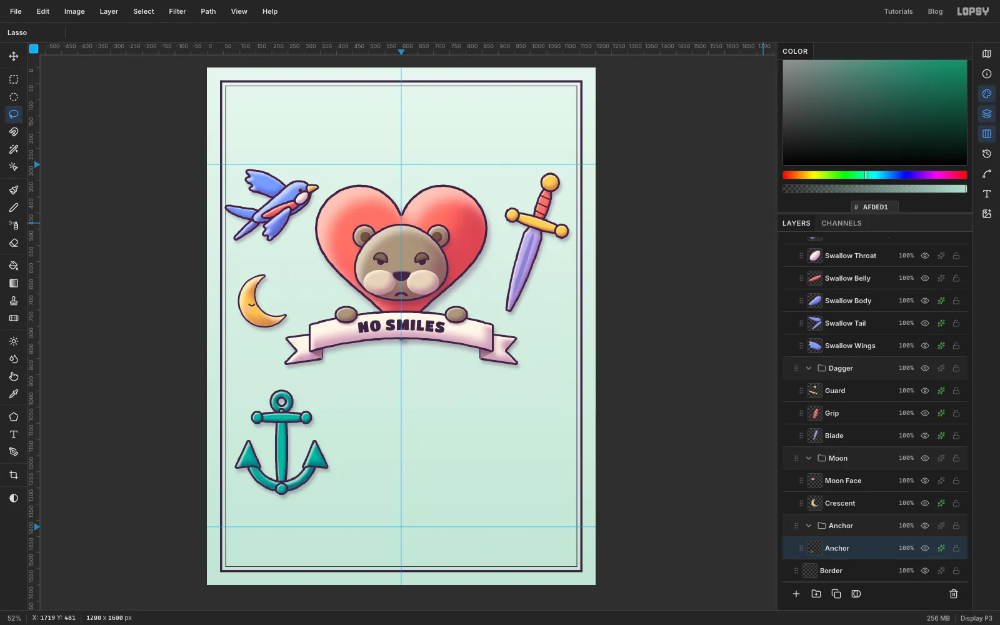

Add an `Anchor` group with an `Anchor` layer and build it from separate pieces in teal `#36B5A2`:

- the ring at the top (a circle with a smaller circle subtracted)
- the long shank
- the crossbar, with a ball at each end
- the curved arms (a thick arc)
- two arrowhead flukes and a ball at the bottom

Outline and shade each piece separately. Where pieces overlap, the outline of the newer piece runs across the older one, so it looks like clay parts pressed together.

## Paint the rope

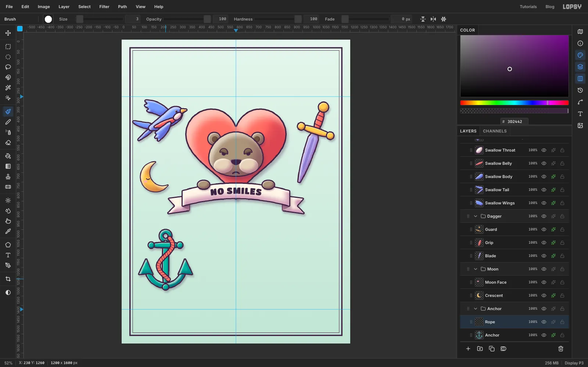

Add a `Rope` layer above **Anchor**. Pick the **Brush** with Hardness `100`:

1. At size `28` in plum, click where the rope comes out of the ring, then [[Shift]]-click a chain of points down the anchor in a loose S shape. Each Shift-click draws a straight segment from the last point.
2. Switch to size `17` and coral `#FF7A6B`, and repeat the same chain of points on top. The plum shows round the edge as an outline.
3. At size `3` in plum, Shift-click short diagonal strokes across the rope about every 16 px for the twist.

## Wrap the rope behind the shank

For the rope to wrap round the anchor, it has to disappear behind the shank once. With the **Rectangular Marquee**, select a narrow box exactly as wide as the shank and its outline, over the middle crossing. Start and end the box where the rope is clear of the shank. Press [[Delete]].

Add a `Rope Shine` layer, brush a thin `#FFE9E4` line along the upper-left side of the rope at size `4`, delete the same box, and set the layer to 60% opacity. Give **Rope** a small Drop Shadow.

## Make the rose

Add a `Rose` group with these layers:

- `Leaves`: two short teal leaves at the lower left and right. Brush a darker `#1F6E64` vein along each one.
- `Petals`: seven overlapping coral circles in a ring, then a large circle in the middle. Outline and shade each one as you go, so every petal overlaps the one before.
- `Cup`: a deeper `#E8555A` oval in the middle.
- `Bud`: a smaller coral oval. Then brush a plum spiral on it at size `5`, Shift-clicking round and round from the centre outwards.

The spiral is a classic tattoo rose centre, and it keeps the rose from looking like a target.

## Make the dice and merge their pips

Add a `Dice` group. On a `Die A` layer, make a rounded square about 150 px wide in cream: draw a square marquee, then **Select → Shrink** by 30 and **Grow** by 30 to round the corners. Give it the outline, shade and highlight, but leave the Drop Shadow until the die is tilted.

Add a `Pips A` layer and fill five small plum circles in the five pattern. Then choose **Layer → Merge Down**, so the pips become part of the die and turn with it.

## Tilt the dice

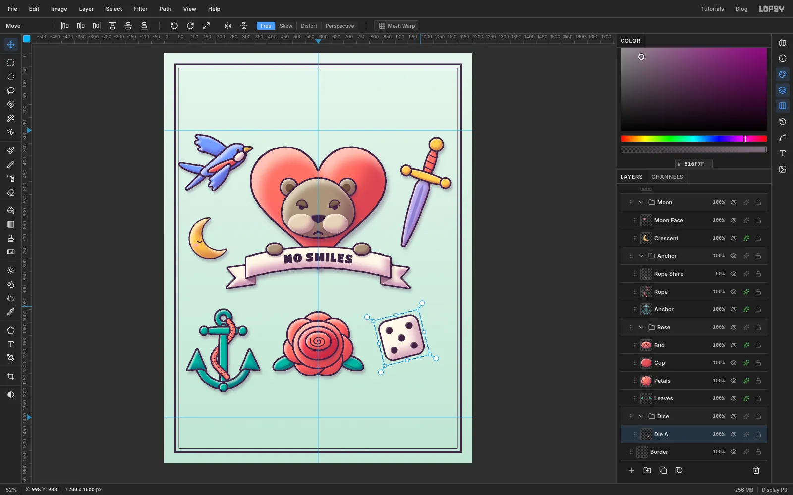

A single layer needs a selection before the Move tool shows its handles. Draw a rectangular marquee round the die, pick the **Move** tool, and drag just outside a corner to tilt it about 14° anticlockwise. Press [[Ctrl+D]] to commit, then add the Drop Shadow. Adding it after the tilt means it still falls straight down and to the right.

Make `Die B` the same way, a little smaller, overlapping the first die's lower right corner, with three coral `#E8555A` pips. Tilt it about 12° the other way.

## Scatter stars and sparkles

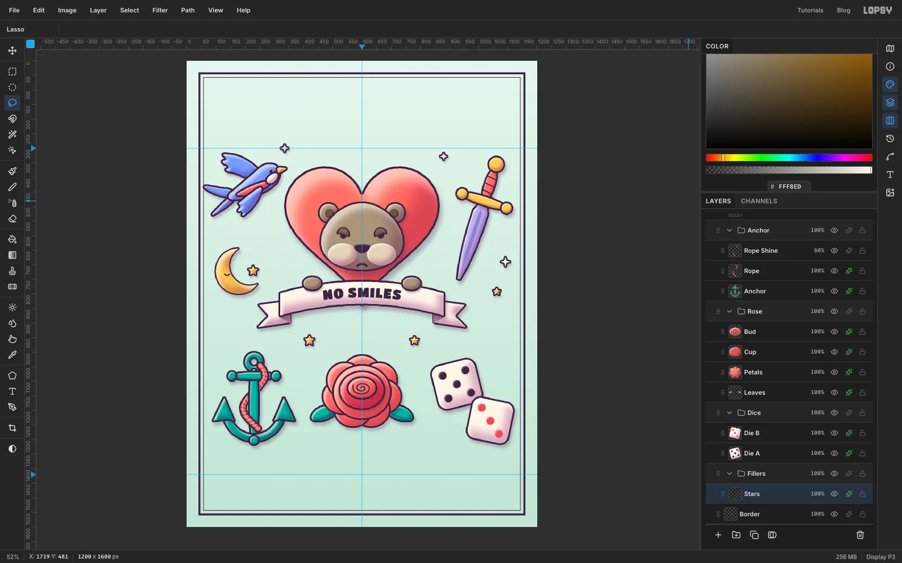

Make a `Fillers` group with a `Stars` layer. Lasso small five-point stars in butter and four-point sparkles in cream: drag slowly from point to point and the little wobbles disappear under the outline. Give them a 5 px outline. Put them only in real gaps: inside the moon's curve, between the two rows of designs, beside the dagger blade and above the swallow.

Space them out. Flash sheets look crowded enough without stars touching the designs.

## Add the price tags

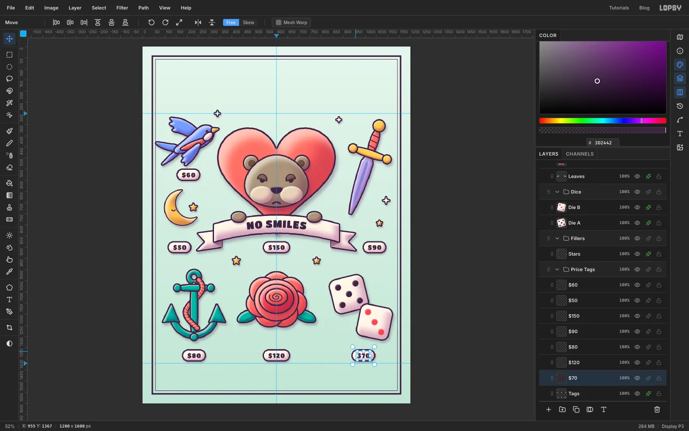

Make a `Price Tags` group with a `Tags` layer. Under each design, drag a rectangle about 96 × 44 px (112 px wide for three-digit prices). Then **Shrink** it by `21` and **Grow** it by `21`: shrinking that far squashes it to a thin line, and growing it back gives perfectly round ends. Give it the clay treatment in cream. Line the tags up: the three in the middle row share one baseline, and so do the three at the bottom.

For each price, select **Tags**, pick the **Text** tool with **Titan One** at `28` in plum, click just above the tag and type the price. Press [[Tab]], then switch to the **Move** tool and nudge the text with the arrow keys until it's centred in its pill.

## Set the clay title

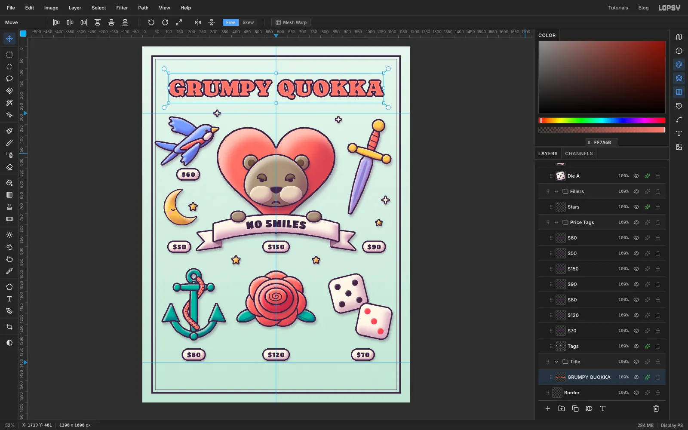

Select **Border** and make a `Title` group. With the Text tool, choose **Caprasimo**, size `96`, coral `#FF7A6B`, and type `GRUMPY QUOKKA` in the empty space at the top. Commit, then use the Move tool's **Align center horizontally** button, or the arrow keys, to centre it about 40 px below the top border.

In its effects, turn on **Stroke** (`#3D2442`, Width `7`) and **Inner Glow** (`#FFE6DC`, Size `9`, Opacity `75`). The pale inner glow puffs the letters up like the clay pieces.

## Give the title some thickness

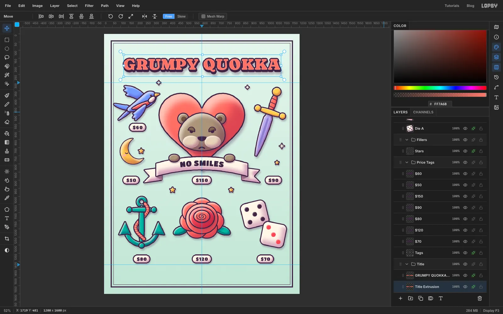

Click **Duplicate Layer**. The copy lands on top and stays as the coral face. The original, now underneath, becomes the extrusion:

1. Click the lower **GRUMPY QUOKKA** row and rename it `Title Extrusion`.
2. In its effects, turn off **Inner Glow**, turn on **Color Overlay** in plum, and add a **Drop Shadow** (`#4A2D55`, Blur `18`, Offset `7` / `14`, Opacity `34`).
3. With the Move tool, nudge it 3 px right and 8 px down with the arrow keys.

The plum copy now shows below each letter as a solid edge, so the type looks like it was rolled out of clay.

## Add the small type

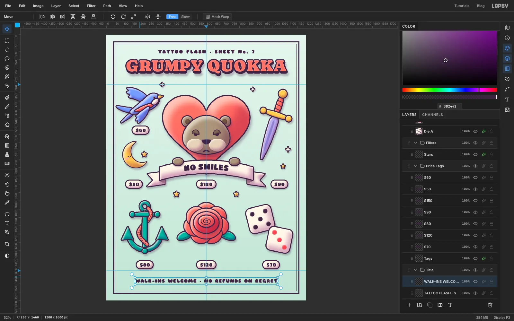

Select a raster layer first, so changing the font doesn't restyle the title. Then set **Sniglet** at `30`, plum, weight **ExtraBold**, and type `TATTOO FLASH · SHEET No. 7` above the title. In the **Text** panel, set **Letter spacing** to `4`. Centre it between the border and the title.

Make the footer the same way, with letter spacing `2`: `WALK-INS WELCOME · NO REFUNDS ON REGRET`, centred below the bottom row of tags. Keep it at least 50 px above the inner border line.

## Pin the corners using the grid

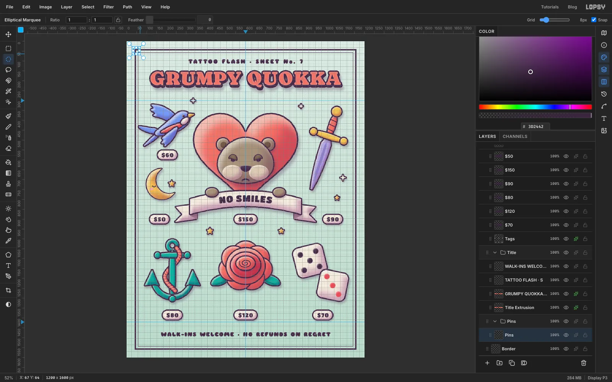

Flash sheets are pinned to the wall. Choose **View → Show Grid**. A **Grid** size slider and a **Snap** checkbox appear at the right end of the options bar. Set the grid to 8 px and make sure **Snap** is ticked. Make a `Pins` group and layer. Then drag a 32 px circle with the **Elliptical Marquee** over each corner of the border. Snap pulls each circle exactly onto the grid, so all four sit at the same spot on their corners.

Fill them with the outline and coral steps. Then untick **Snap** and hide the grid **before** you shade them, otherwise the shifted selections snap too. Add a small white dot to each pin for a glossy highlight.

## Make a plasticine grain

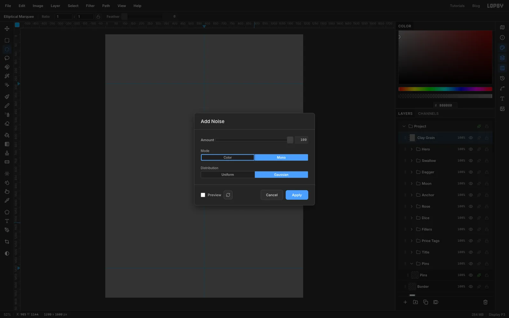

Add a layer named `Clay Grain` and drag it to the very top of the Layers panel, above the **Hero** group. Set the foreground to mid grey `#808080` and **Edit → Fill** the whole layer.

Choose **Filter → Add Noise…** and set **Amount** `100`, **Mono** and **Gaussian**. Then run **Filter → Gaussian Blur…** at radius `3` to clump the noise into soft lumps.

## Emboss the grain

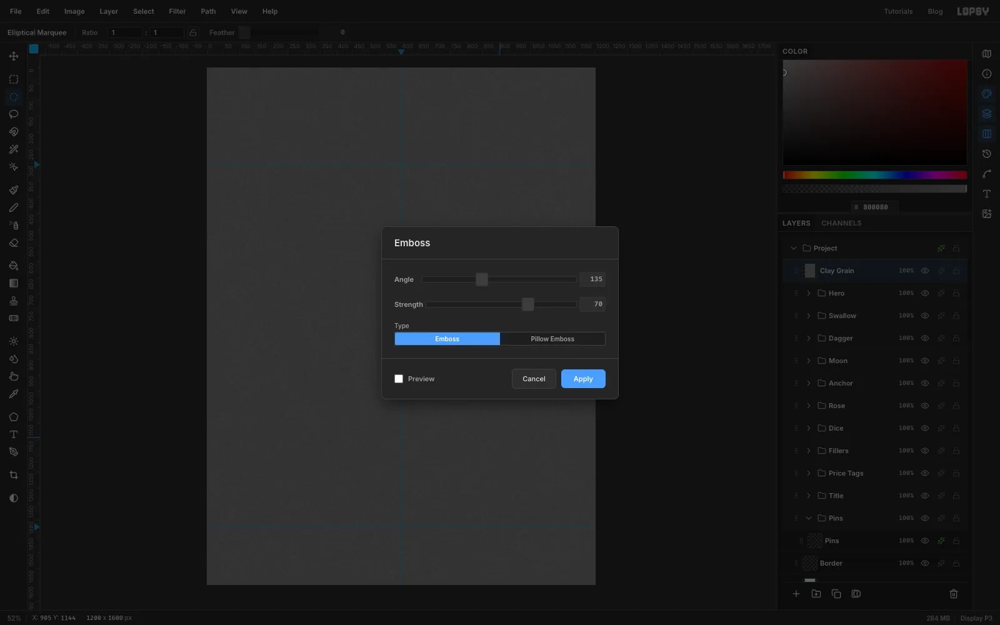

Choose **Filter → Emboss…** with **Angle** `135` and **Strength** `70`, and apply it. Emboss shades each lump from one side, so the noise looks like a pressed, slightly bumpy surface instead of static.

Then boost it with **Filter → Brightness/Contrast…**, **Contrast** `70`.

## Blend the grain over the clay

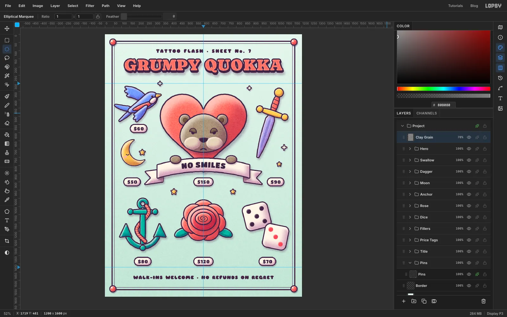

Open the **Clay Grain** layer's effects, set the **Blend** dropdown to **Overlay**, and lower the layer's opacity to `70%`. Grey disappears in Overlay mode and only the bumps stay, so the whole sheet takes on the slightly lumpy surface of real plasticine.

## Polish the spacing

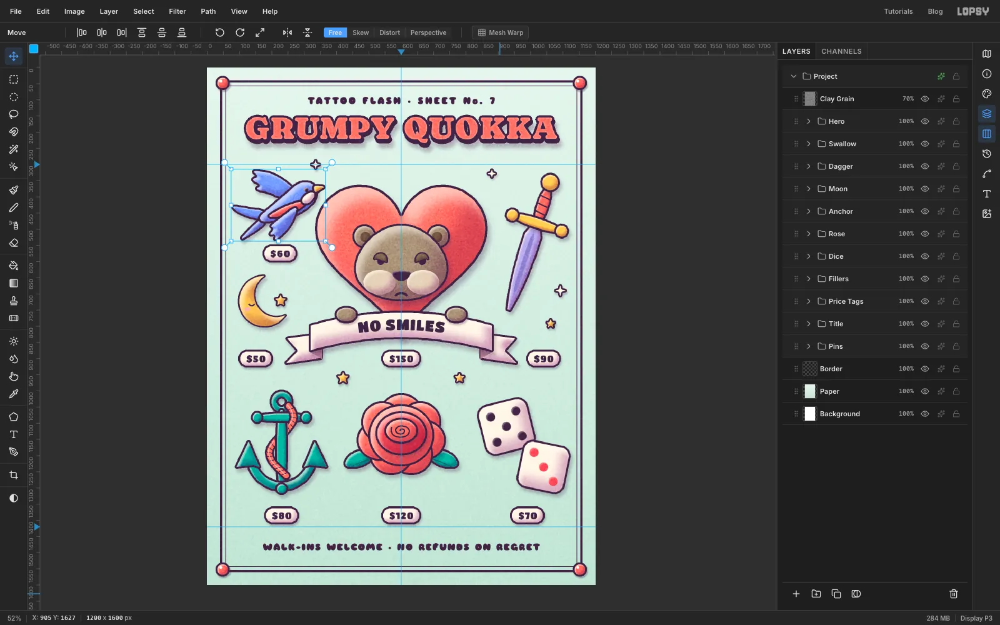

Step back and look for anything crowding something else. On this sheet three things needed fixing:

- The swallow's tail touched the inner border line. Select the **Swallow** group, pick the **Move** tool and press [[Shift]]+[[Right]] twice to move it 20 px right.
- The $60 tag then sat off-centre under the swallow, and $50 was too close to the banner's left tail. On the **Tags** layer, draw a marquee round the tag, switch to the **Move** tool and nudge it with the arrow keys (20 px right for $60, 15 px left for $50). Press [[Ctrl+D]], then nudge each price text by the same amount.
- A tiny point of the heart's outline showed under the middle of the banner. Select **Heart**, draw a small marquee just under the banner's bottom edge, and press [[Delete]].

Last checks before you export:

- Every design has a price tag directly under it, and the tags line up in rows.
- Nothing touches the border. Keep at least 20 px between any design and the inner line.
- The banner text has the same space above and below.
- All shadows fall the same way, down and to the right.

Finish with **File → Quick Export PNG**, and save the layers with **File → Save Project**.
