Claymorphism is the look of soft, inflated 3D objects: rounded shapes, pastel colours, a bright edge where the light hits, and a gentle shadow underneath. You don't need a 3D program for it. In this tutorial you'll make **Yogurt Zeppelin**, a 1200 × 1600 poster for an imaginary dairy that delivers by blimp. Every object starts as a flat fill. Layer effects and a few Multiply layers do the "clay" work. It's about 35 layers in all, so name them as you go and take it one object at a time.

The palette:

- Sky `#FFE6D4` → `#FFC8DA` → `#C4B5F4`
- Sun `#FFFBE8` → `#FFE9B8` → `#FFCF9C`
- Sun glow `#FFF0C8`
- Hull `#9BE8CF`, hull shade `#FFFFFF` → `#E9DCFF` → `#8A9FE0`
- Pink `#FF9DB8` / `#FF8FA8` / `#FF7AA2` (hull band, fins and cup band, headline)
- Cream `#FFF1DC` / `#FFF8EE` / `#FFF2F6` (gondola, cup, yogurt)
- Cloud `#FFFAFC`, cloud shadow `#9A7FD0`, cloud edge `#D6C8FF`
- Purple `#7B5EA7` (YOGURT and the propeller), headline shadow `#8D4A9A`
- Badge `#FFD36E`, badge text `#C2457A`
- Berries `#7F8CFF` / `#FF7AA2`, cherry `#FF4D6D`

## Start a portrait canvas

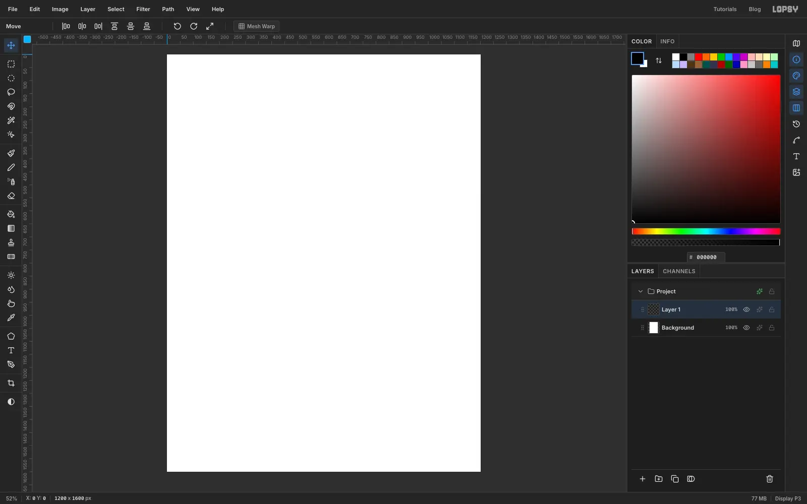

Open [Lopsy](/). In the **New Document** dialog, choose **Pixels** and type `1200` × `1600`. Click **Create**.

Double-click the empty layer's name and call it `Sky`. Every layer name in this tutorial is a suggestion, but matching them makes the steps easier to follow.

## Paint the pastel sky

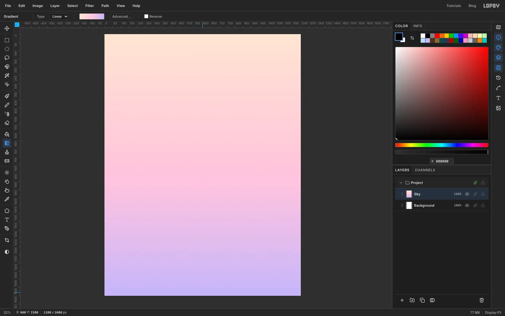

Pick the **Gradient** tool and click **Advanced…**. Set three stops: `#FFE6D4` at the start, `#FFC8DA` at 50% and `#C4B5F4` at the end. Click **Done**, make sure nothing is selected, and drag from near the top of the canvas straight down to near the bottom.

Keep the sky soft. Claymorphism works because everything is low-contrast and the objects are the brightest things on the page.

## Add a glowing sun

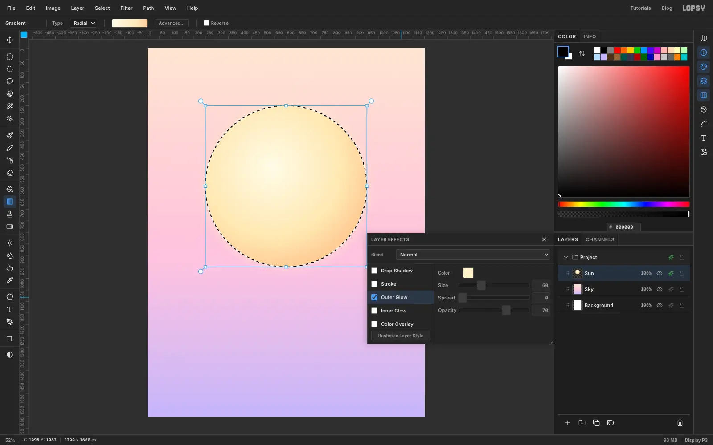

Add a layer named `Sun`. Pick the **Elliptical Marquee** and drag out a circle about 700 px wide, a little above the middle of the canvas.

Choose the **Gradient** tool again, set the type to **Radial** and use the stops `#FFFBE8`, `#FFE9B8` at 70% and `#FFCF9C`. Drag from just up-and-left of the circle's centre out to its edge, so the bright spot sits off-centre like a lit ball.

Open the layer's effects (the sparkle icon on its row), switch on **Outer Glow**, and set the colour to `#FFF0C8`, Size to `60` and Opacity to `70`.

## Fill the hull and give it clay edges

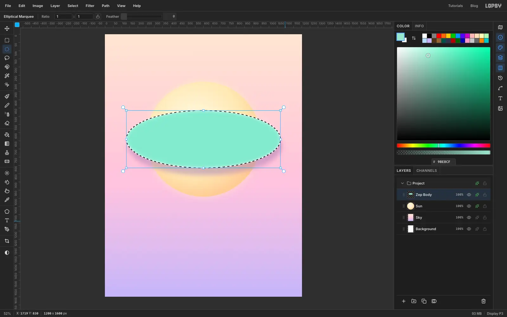

Add a layer named `Zep Body`. Set the foreground colour to `#9BE8CF`. With the Elliptical Marquee, drag a wide, flat ellipse across the sun, roughly 940 px wide and 350 px tall. Fill it with **Edit → Fill**.

These two effects are the heart of the clay look:

1. **Drop Shadow** in `#8D6FB0`: Blur `45`, Offset Y `45`, Offset X `10`, Opacity `45`.
2. **Inner Glow** in `#FFFFFF`: Size `30`, Opacity `80`. This brightens the rim, which makes the shape look inflated.

> **Tip:** Keep the shadow tinted with a darker version of the background hue. A grey or black shadow would make the clay look dirty.

## Shade the hull with a Multiply layer

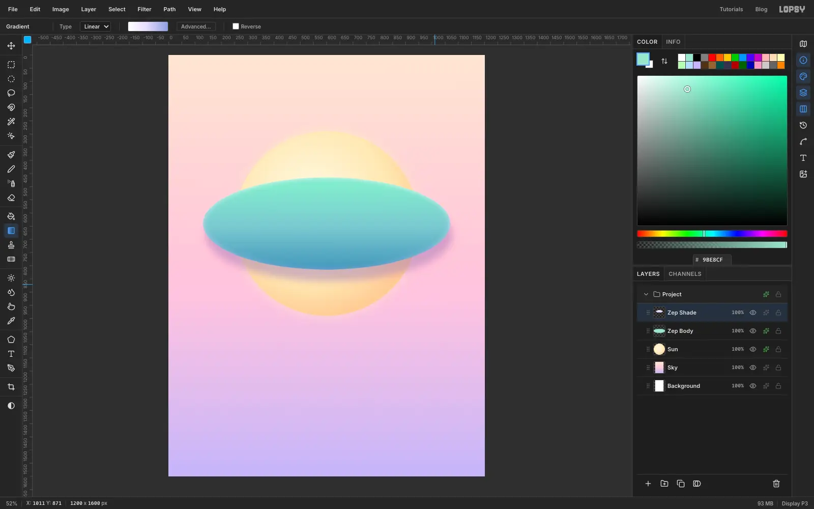

Leave the ellipse selected. Add a layer named `Zep Shade`, open its effects, and pick **Multiply** from the Blend dropdown at the top of the panel.

With the Gradient tool, use three stops: `#FFFFFF`, `#E9DCFF` at 45% and `#8A9FE0`. Make sure the type is back on **Linear**, then drag from the top of the ellipse down to its bottom edge. Because the selection is still active, the shading stays inside the hull. Multiply only ever darkens, so the white end leaves the mint untouched.

## Add a highlight and a stripe

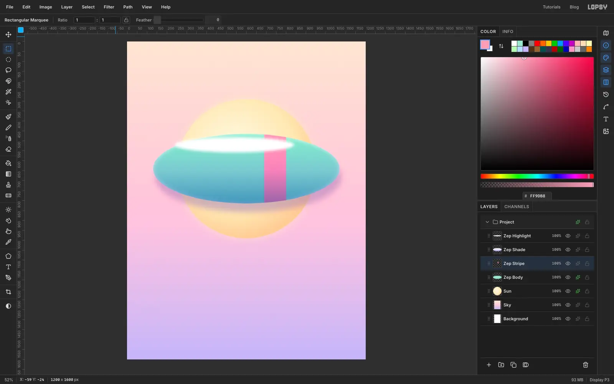

For the highlight, add a layer named `Zep Highlight`, set the foreground to white, and drag a thin ellipse near the top-left of the hull. Choose **Select → Feather…**, enter `14` and apply it. Fill, deselect with [[Ctrl+D]], and lower the layer's opacity to 55%.

For the stripe, click the `Zep Body` row and add a layer called `Zep Stripe`, so it sits just above the hull. Redraw the same hull ellipse and fill it with `#FF9DB8`. Now draw a tall, narrow rectangle with the **Rectangular Marquee** across the part you want to keep. Use **Select → Inverse**, press [[Delete]], and deselect. Only the band remains, with its ends neatly following the hull.

## Draw the tail fins

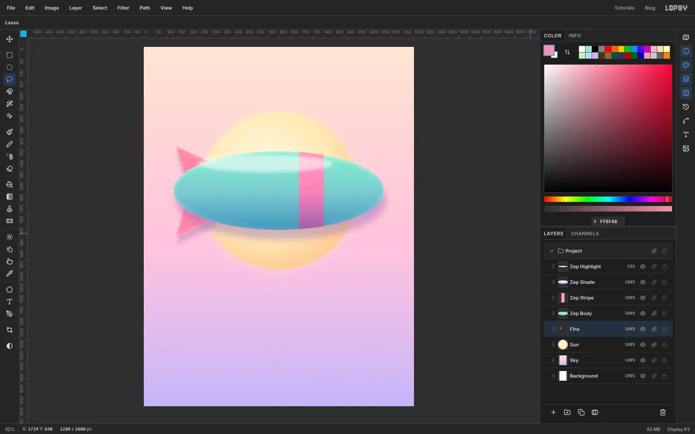

Click the **Sun** row, then add a layer named `Fins`. It lands above the sun but below the hull, which is where fins belong.

Set the foreground to `#FF8FA8`. With the **Lasso**, drag a rough triangle for each fin: an upper one pointing up and to the left, and a lower one pointing down and to the left. Both should start well inside the hull, since the hull will cover their roots. Fill each. Give the layer a **Drop Shadow** (`#8D6FB0`, Blur `30`, Offset Y `30`, Opacity `40`) and an **Inner Glow** (`#FFE6EE`, Size `22`, Opacity `75`).

## Build the gondola, windows and propeller

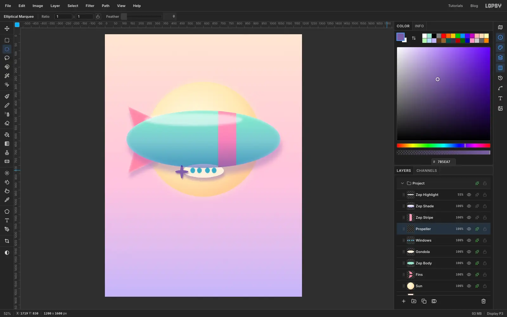

Click `Zep Body` and add three layers, one at a time:

- `Gondola` — a small flat ellipse under the hull in `#FFF1DC`, with the same Drop Shadow and an Inner Glow.
- `Windows` — four small ellipses in `#5AA9C4`, spaced evenly along the gondola and filled one at a time, with a pale `#C9F1FF` Inner Glow.
- `Propeller` — two thin crossed ellipses (one tall, one wide) in `#7B5EA7`, with a small Drop Shadow.

## Group the airship and tilt it

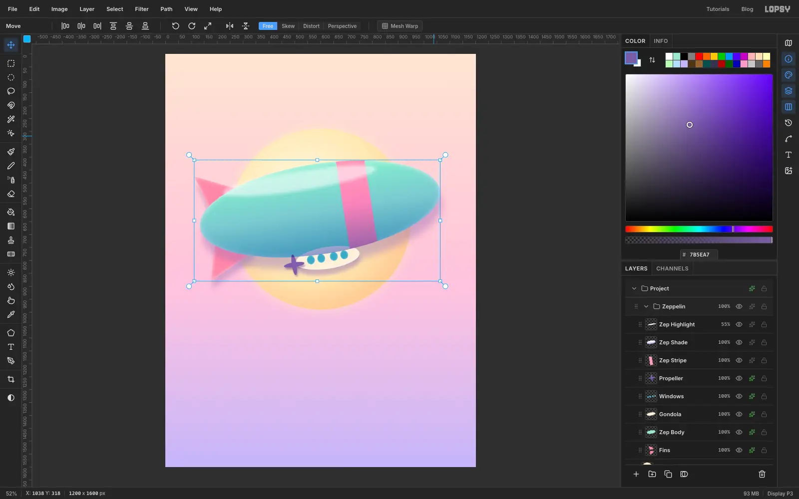

Click the `Fins` row, then Shift-click `Zep Highlight` to select the whole run of airship layers. Choose **Layer → Group Layers** ([[Ctrl+G]]) and rename the group `Zeppelin`.

Pick the **Move** tool with the group selected and leave the transform mode on **Free**. Dragging inside the canvas moves the whole airship at once, so slide it until it sits across the sun. To tilt it, move the pointer just outside a corner handle until the cursor changes, then drag in a slow arc so the nose (the right end, away from the fins) rises about 9°. Press [[Ctrl+D]] to commit the transform. In the Move tool, that commits rather than deselects.

## Make the yogurt cup

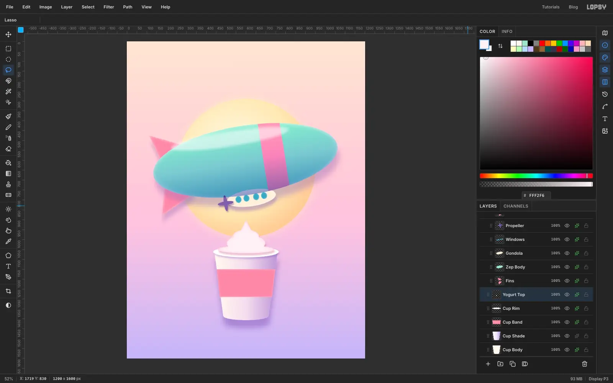

Click `Sun` before you add layers, so the cup doesn't land inside the airship group. Work from the bottom up:

1. `Cup Body` — with the Lasso, drag around a wide-top, narrow-bottom cup shape with a curved base. Fill with `#FFF8EE`, then add a lilac Drop Shadow (`#7A55B3`, Blur `40`, Offset Y `40`, Opacity `50`) and a white Inner Glow.
2. `Cup Shade` — set to **Multiply**. Re-select the cup and drag a horizontal gradient from `#FFFFFF` through `#F1E4FF` to `#B79AE0`, so the right side turns slightly lilac.
3. `Cup Band` — a trapezoid across the middle in `#FF8FA8`, with a soft pink Inner Glow.
4. `Cup Rim` — a flat white ellipse across the top, with a small Drop Shadow.
5. `Yogurt Top` — build the swirl on one layer in `#FFF2F6`: a flat ellipse sitting inside the rim, a smaller taller ellipse on that, a smaller one again on top, then a little Lasso triangle for the curled tip. Add a `#C06A90` Drop Shadow and a pink `#FFB3C8` Inner Glow.

## Add a cherry and puffy clay clouds

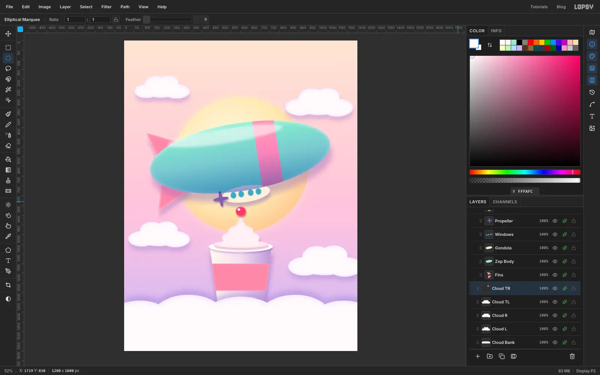

Make a `Cherry` layer above `Yogurt Top`: a `#FF4D6D` circle with a tiny white dot for the shine, a small Drop Shadow, and a pink Inner Glow.

For the clouds, add one layer per cloud and place them around the page: one behind the left of the headline, one behind its right, one lower-left beside the cup and one lower-right. In each, fill five overlapping ellipses of different sizes in `#FFFAFC`, with the biggest in the middle. Put a Drop Shadow (`#9A7FD0`, Blur `34`, Offset Y `22`, Opacity `40`) and an Inner Glow (`#D6C8FF`, Size `26`, Opacity `70`) on every layer. The Inner Glow gives each cloud its pillowy edge.

For the cloud bank across the bottom (`Cloud Bank`), fill two staggered rows of big ellipses that overflow the page on both sides, and flip the Drop Shadow's Offset Y to `-24` so the shadow falls up onto the cup. Then add a `Bank Shade` layer set to **Multiply** at about 55% opacity. Use a soft lavender `#C9B6F2`, feather your ellipse selections by 35 px, and fill a few shapes in the dips of the bank. That gives it the lavender fade at the bottom.

## Set the headline

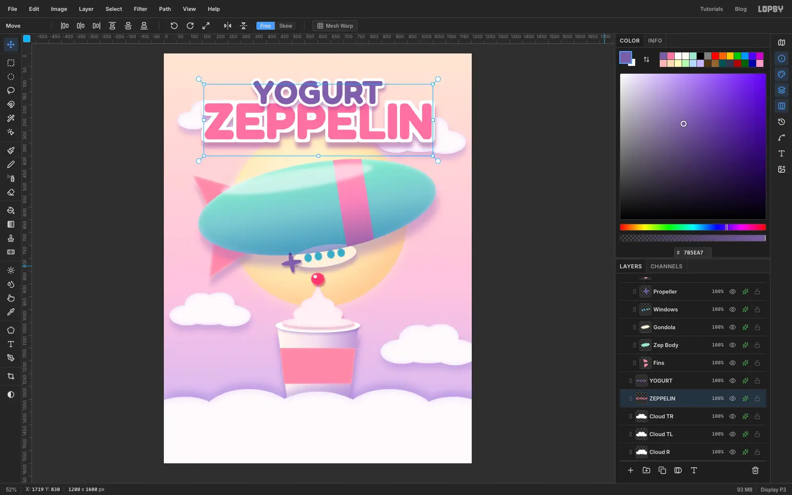

Click a layer that isn't text first, otherwise changing the font and size will restyle that text layer. Pick the **Text** tool, choose **Fredoka**, set the weight to **Bold**, size `200` and a pink fill of `#FF7AA2`, and click near the top to type `ZEPPELIN`. Press [[Tab]] to commit.

Add a white **Stroke** (Width `12`) and a purple **Drop Shadow** (`#8D4A9A`, Blur `24`, Offset Y `22`, Opacity `55`). Use the **Move** tool's *Align center horizontally* button to centre it.

Click a non-text layer again, then make `YOGURT` the same way at size `128` in `#7B5EA7` with a Width `10` stroke. Centre it and nudge it up with the arrow keys until its white outline clears the big word, leaving a comfortable margin above it.

> **Tip:** Text lands lower than where you click. If a line ends up in the wrong place, don't retype it. Move the layer with the arrow keys; [[Shift]]+arrow moves 10 px at a time.

## Add the tagline, berries and sparkles

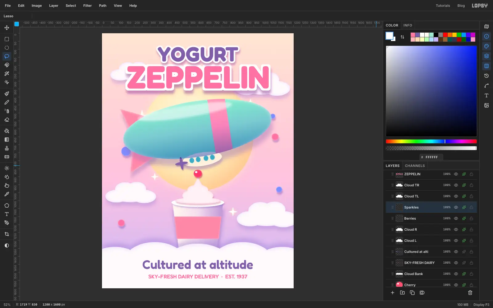

On the cloud bank, add `Cultured at altitude` in Fredoka SemiBold at `78` in `#7B5EA7`, and the line `SKY-FRESH DAIRY DELIVERY · EST. 1937` at `34`. Centre both and keep them well inside the bottom margin.

Add a `Berries` layer and fill a few small circles in `#7F8CFF` and `#FF7AA2`, scattered around the airship and the left cloud. One tucked partly behind the hull is fine. Use the same Drop Shadow and white Inner Glow so they match the other clay objects.

For the sparkles, make a `Sparkles` layer. Use the Lasso to drag a thin four-pointed star, like a long diamond pulled out in four directions, fill it with white, and repeat at a few sizes. Add an **Outer Glow** in `#FFF4B8`.

## Rotate a price-style badge

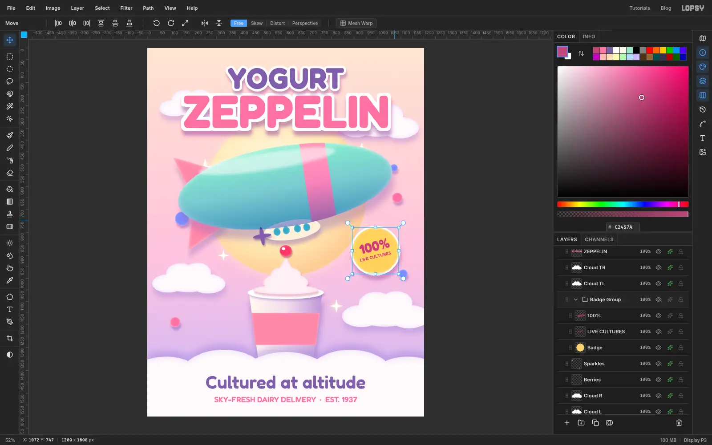

Make a `Badge` layer with a `#FFD36E` circle about 200 px wide. Add a white **Stroke** (Width `8`), a purple Drop Shadow and a `#FFF3C9` Inner Glow.

Type `100%` (Fredoka Bold, `58`, `#C2457A`) and `LIVE CULTURES` (SemiBold, `19`). Move them onto the badge. Keep the small line well inside the circle: it must clear the edge on both sides.

Group the three layers as `Badge Group`. With the Move tool, rotate the group about 14° counter-clockwise, the same way you tilted the airship, and commit with [[Ctrl+D]]. Rotating the group means the numbers and the circle turn together, so you don't have to rotate three layers by hand.

## Add film grain

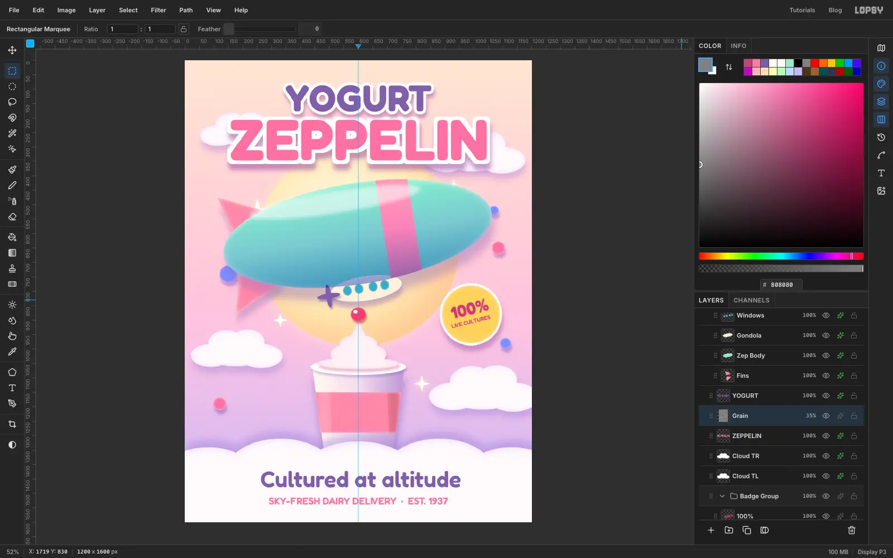

Click the top layer and add a layer named `Grain`. Set the foreground to `#808080` and fill the whole layer with **Edit → Fill**. Choose **Filter → Add Noise…**, turn on **Mono**, set Amount to `60` and apply it.

Set the layer's blend mode to **Overlay** and its opacity to about 22%. Grain stops the gradients from looking plastic, and it hides any banding.

## Final checks

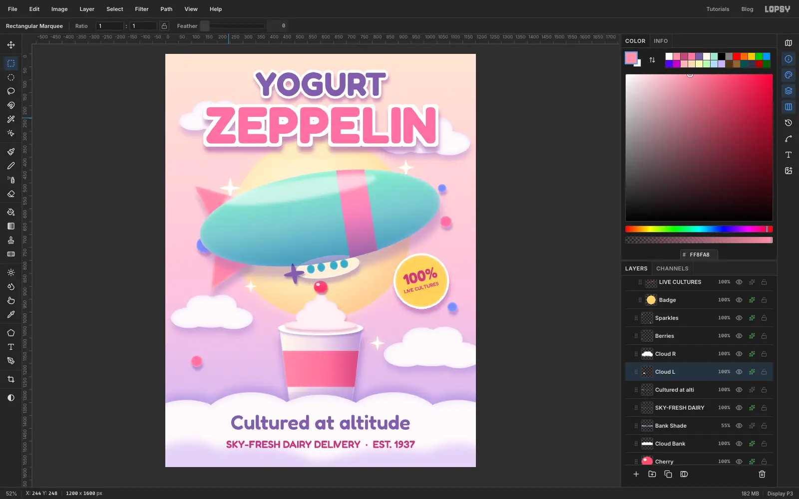

Step back and look at the whole poster. A few things are worth fixing before you export:

- The two headline lines need a clear gap between their white outlines. If they merge, nudge `YOGURT` up.
- Keep the text away from the edges. Only the cloud bank and the side clouds should run off the page.
- If the small tagline is hard to read in light pink, give it a **Color Overlay** in `#B8407A` and raise its size to about `40`.
- Make sure the airship has some breathing room under the headline. Nudge the `Zeppelin` group and the `Sun` down together if it feels cramped, and drop the cherry so it sits on the tip of the swirl.
- Fix a blotchy spot by re-filling the shape and adding a gentle Multiply gradient over it, instead of stacking more strokes.

Finish with **File → Quick Export PNG**, and save the project with **File → Save Project** so you can reopen it later.
