Cut-paper collage suits a small record label because it looks handmade:
layered scraps, torn edges with a white paper core, soft shadows where one
sheet lifts off another, and printed textures like halftone and sheet music.
It's the look of Eric Carle's painted-tissue animals crossed with an indie
label's hand-glued flyers.

In this tutorial you'll make a **1200 × 1200 px** logo for a fictional label,
**Copper Lark Records**. You'll cut every piece in Lopsy with the Lasso,
marquees and the Shape tool. Nothing is imported.

The palette is kraft paper and five "papers":

- Kraft `#D9C6A2`, cream paper `#EFE6D0`, torn-edge cream `#F2EAD8`
- Teal `#2F6E69`, halftone dots `#6FB3A8`
- Vinyl black `#1C1A18`, copper label `#C0652F`
- Lark rust `#C9743A`, wing brown `#7A3A1E`, tail `#5B2C17`, breast `#F1E3C4`, beak `#E2A93B`

Fonts: **Abril Fatface** for the wordmark and **Special Elite** for the
typewriter details.

## Lay down kraft paper and guides

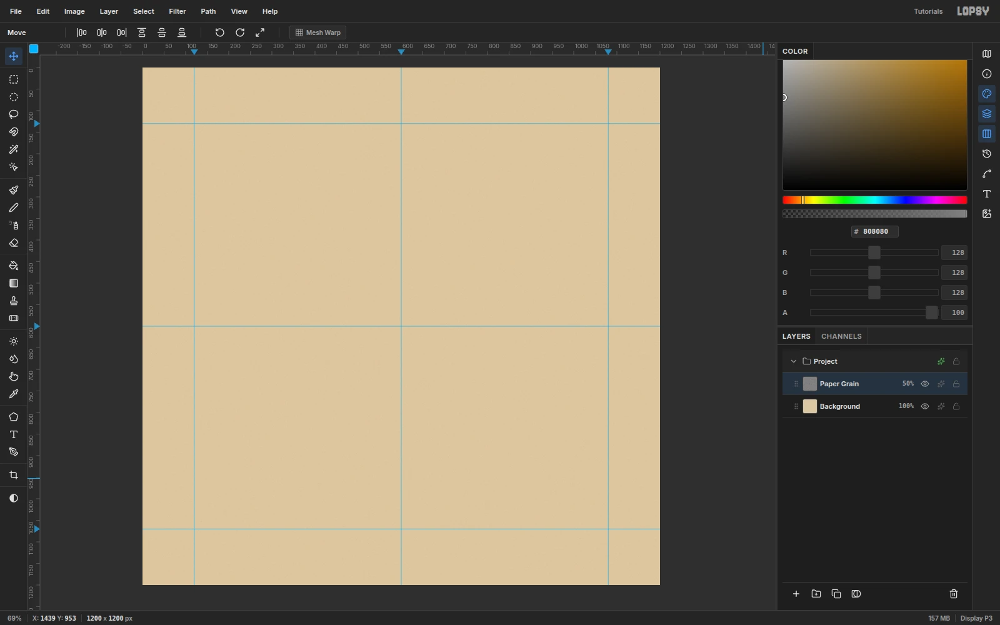

Create a **1200 × 1200** document with a white background. Click the
`Background` layer, set the foreground to `#D9C6A2` and choose
**Edit → Fill**.

Click the top ruler about 120 px in from each side for vertical guides, then
[[Cmd]]-click the middle of it: [[Cmd]] snaps a guide to a layout fraction,
so it lands exactly on the center. On the left ruler, click about 130 px
from the top and from the bottom, and [[Cmd]]-click the middle. The outer
guides are your safe margins, and the center guides help you line up the
badge.

Rename `Layer 1` to `Paper Grain` and give it some texture:

1. Fill it with `#808080`.
2. Choose **Filter → Add Noise…**, set **Amount** to `45`, pick **Mono** and **Gaussian**, and click **Apply**.
3. Choose **Filter → Gaussian Blur…** with a **Radius** of `1`.
4. Open the layer's effects drawer (the sparkle icon), set **Blend** to **Overlay**, and set the layer opacity to **50%**.

The gray disappears and only a fine paper tooth is left on the kraft.

## Tear a scrap of sheet music

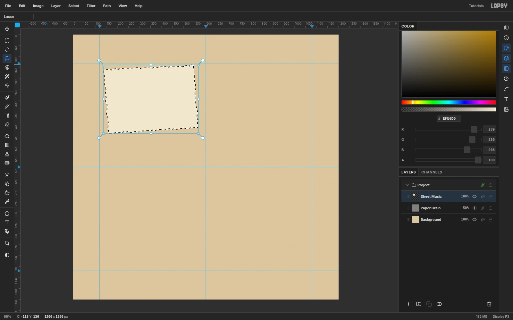

Click **Add Layer** and name it `Sheet Music`. Pick the **Lasso** and drag a
rough rectangle, about 410 × 290 px, in the upper-left quarter. Start just
inside where the left and top margin guides cross, and stop a little short
of the vertical center guide. Let the top edge rise slightly toward the
right. Wiggle the pointer a little along each side so the edges look torn
rather than cut.

Set the foreground to `#EFE6D0` and choose **Edit → Fill**. Keep the
selection, and run **Filter → Add Noise…** at `10` so the paper isn't
perfectly flat.

## Rule the staves and notes

Keep the selection active so nothing spills off the paper. Pick the
**Brush**, set **Size** `3`, **Hardness** `100` and **Opacity** `85`, and set
the foreground to `#3B302A`.

- **Staff lines:** click at the left edge, then [[Shift]]-click at the right
  edge to draw a straight line. Draw five lines 13 px apart about a quarter
  of the way down the scrap, then a second staff of five below it, leaving
  a gap of about 55 px between the two.
- **Bar lines:** [[Shift]]-click three short verticals across each staff,
  about 130 px apart, with the last one near the scrap's right edge.
- **Notes:** set **Size** to `12` and click a note head on a line or in a
  space. Then go back to Size `3` and [[Shift]]-click a 36 px stem straight
  up from the right side of each head. Keep every stem the same length so it
  reads as real notation.

Press [[Cmd+D]] to deselect.

## Type a title and merge it down

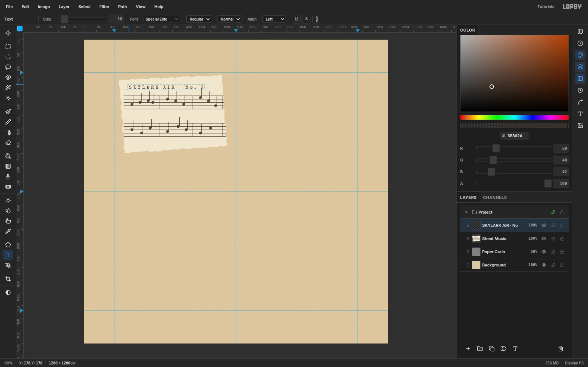

Pick the **Text** tool, choose **Special Elite** in the font browser, set
**Size** to `18`, and click just inside the scrap's top-left corner, above
the first staff. Type `SKYLARK AIR · No. 9` and press [[Tab]] to commit.

With the text layer active, press [[Cmd+E]] (**Merge Down**). The title
becomes part of the paper, so it turns with the scrap in the next step.

## Rotate the scrap and tuck it in

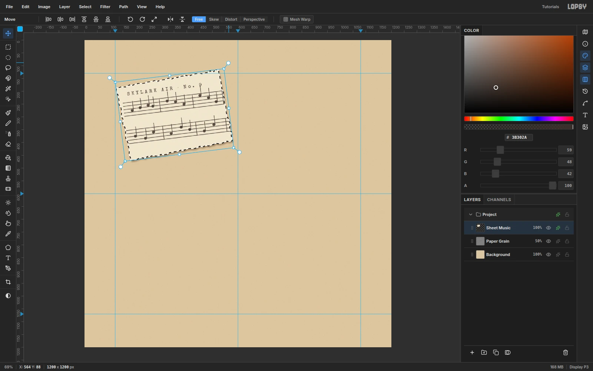

Open the Sheet Music layer's effects drawer and turn on **Drop Shadow**:
color `#3A2410`, **Offset X** `3`, **Offset Y** `6`, **Blur** `8`,
**Opacity** `40`.

[[Cmd]]-click the layer thumbnail to select its pixels, then press [[V]] for
the **Move** tool. Drag just outside the top-right corner handle to rotate
about **−7°**. Drag the scrap so its left edge sits on the left margin guide
and its right side will slide behind the badge you make next, then press
[[Cmd+D]] to commit.

## Cut the teal disc

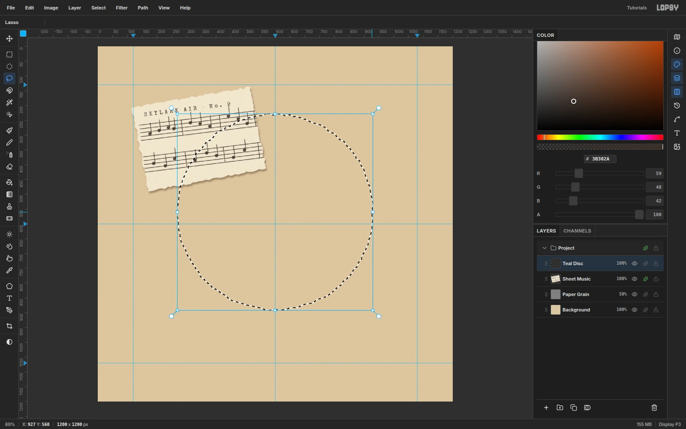

Click **Add Layer** and name it `Teal Disc`. With the Lasso, drag a freehand
circle about 660 px across, centered on the vertical guide and sitting a
little above the horizontal one (its center about 40 px higher). Let the
line wobble by a few pixels. A perfect
circle looks die-cut, and a slightly uneven one looks torn by hand.

Fill with `#2F6E69`, run **Add Noise…** at `12`, and deselect.

## Print halftone dots on the disc

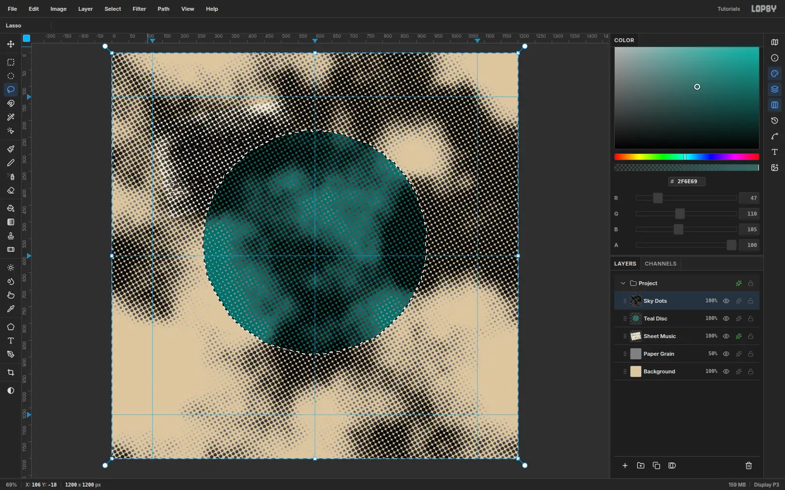

Collage papers are often pages from old magazines, so give the teal a
printed dot texture.

1. Add a layer named `Sky Dots`. Choose **Filter → Clouds…** with a **Scale** of `4`.
2. Choose **Filter → Halftone…** and set **Dot Size** to `12` and **Angle** to `30`.
3. [[Cmd]]-click the **Teal Disc** thumbnail (`Sky Dots` stays the active layer) and choose **Select → Inverse**. Press [[Delete]], then [[Cmd+D]].
4. In Sky Dots' effects, turn on **Color Overlay** with `#6FB3A8`, and set the layer opacity to **30%**.

The dark dots turn into soft, lighter teal mottling that stays inside the
disc.

## Give the disc a torn white edge

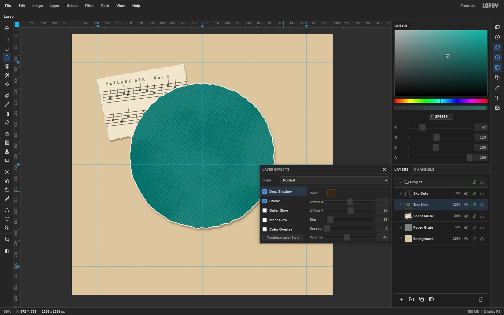

When you tear real paper, the white core shows along the edge. In Teal Disc's
effects:

- **Stroke**: color `#F2EAD8`, **Width** `4`, position **Outside**
- **Drop Shadow**: `#3A2410`, offsets `6` / `10`, **Blur** `16`, **Opacity** `45`

Use deeper shadows for pieces that sit higher in the stack. The disc gets
10 px, the bird will get 6 px and the tape will get 3 px.

## Build the vinyl record

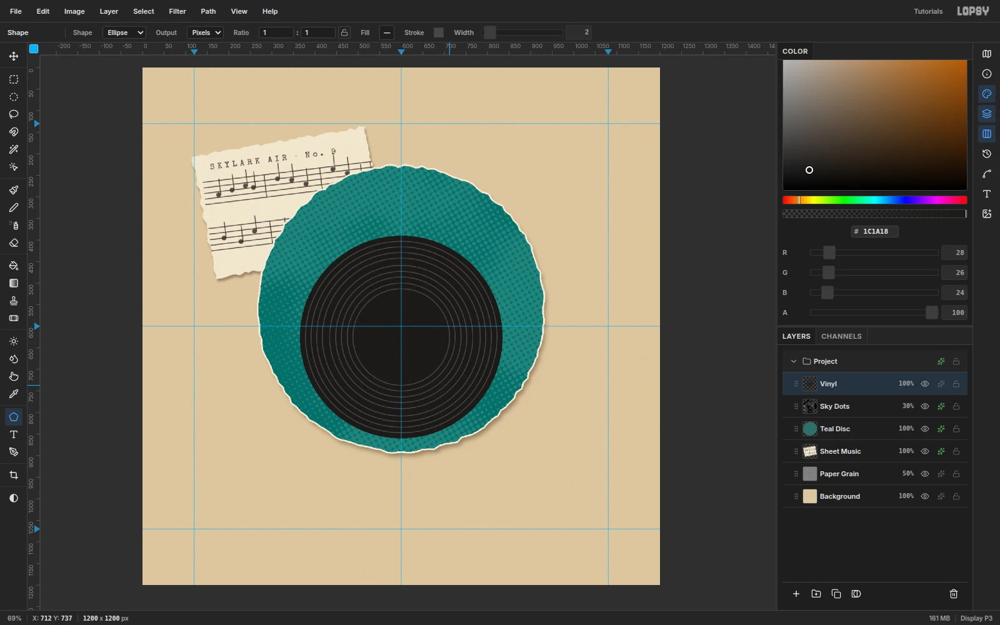

Add a layer named `Vinyl`. With the **Elliptical Marquee**, hold [[Cmd]] and
drag a 470 px circle centered on the vertical guide, sitting low on the teal
disc: its center is about 25 px below the horizontal guide. Fill with
`#1C1A18`, run **Add Noise…** at `4`, and deselect.

> **Tip:** For an exact circle, click once with the Elliptical Marquee while
> nothing is selected. A dialog opens where you can type the corners: **From**
> `365`, `390` and **To** `835`, `860`.

For the grooves, pick the **Shape** tool. Set **Shape** to **Ellipse**, click
the Fill swatch and choose **Remove fill**, then add a **Stroke** in a dark
gray (about `#494747`) at **Width** `2`.

> **Tip:** The Shape tool draws from the **center out**. Press at the record's
> center and hold [[Cmd]] as you drag diagonally for a true circle. The
> distance you drag becomes the radius, so every ring stays concentric. The
> X and Y readout in the status bar helps you find the same center point
> each time.

Drag rings with radii of about 222, 209, 196, 183, 166, 152, 139, 125 and
112 px. Then give Vinyl a **Drop Shadow** (`#10201E`, `5` / `9`, Blur `14`,
Opacity `50`).

## Add a crisp shine and the copper label

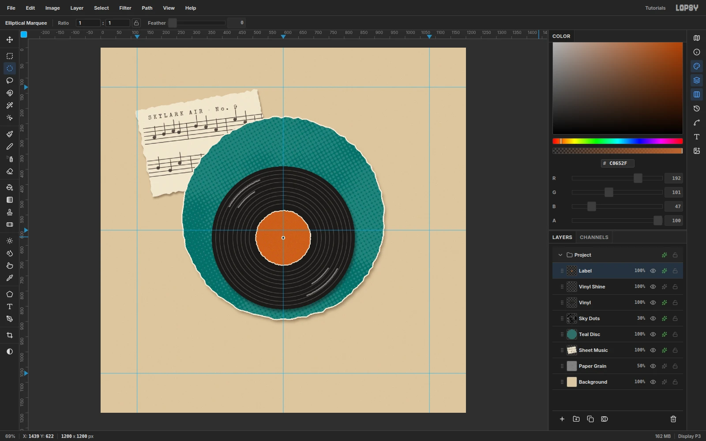

**Shine:** Add a layer named `Vinyl Shine`. Use the Brush at **Size** `5`,
**Hardness** `100`, **Opacity** `45` in white, and drag two short arcs in the
upper left and two in the lower right, following the grooves. [[Cmd]]-click
the Vinyl thumbnail, choose **Select → Inverse**, press
[[Delete]] and deselect. Set the blend mode to **Screen**. Thin, hard arcs look
like printed shine. A soft airbrush blob looks digital.

**Label:** Add a layer named `Label`. Lasso a slightly wobbly circle, about
176 px across, centered on the record. Fill with `#C0652F`, and add noise at
`14`. Use the
Elliptical Marquee to select a 12 px circle in the middle, press [[Delete]]
for the spindle hole, and add a 3 px cream **Stroke**.

## Draw a circular path for the label text

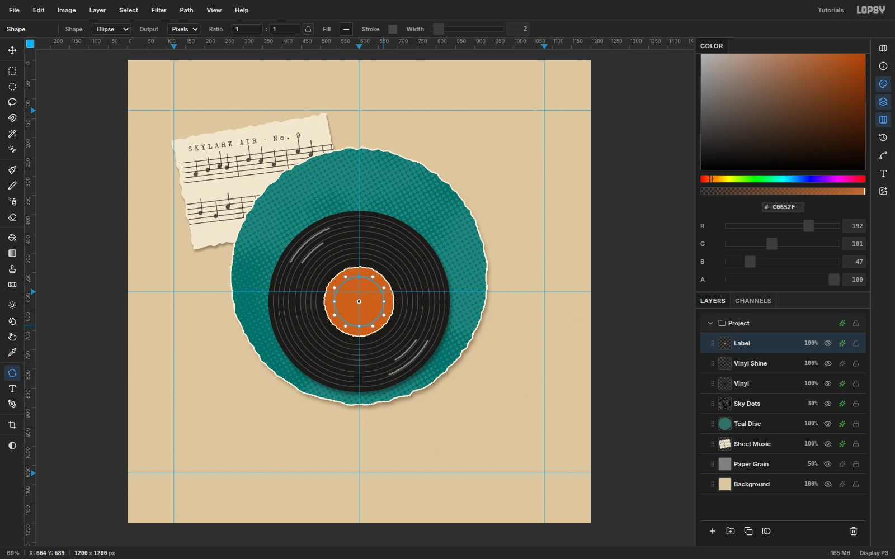

Pick the **Shape** tool again and set **Output** to **Path**. Press at the
label's center and [[Cmd]]-drag 64 px out, for a circle 128 px across. This
creates `Path 1`. Set **Output** back to **Pixels** afterwards.

## Set the label text on the path

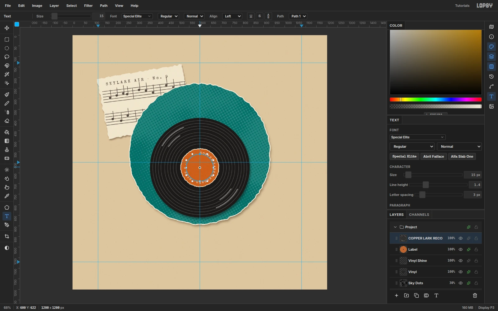

Set the foreground to `#F2EAD8`. With the Text tool in **Special Elite** at
**Size** `15`, click on the label and type `COPPER LARK RECORDS · SIDE A · `.
In the options bar, set **Path** to **Path 1** and press [[Tab]].

In the **Text** panel, set **Letter spacing** to `3`. The path is only about
400 px around, and any text past the end of the path isn't drawn. With too
much tracking the end of the line disappears.

## Group the record

Click the label text layer, [[Shift]]-click `Teal Disc`, and choose
**Layer → Group Layers**. Double-click the new group and rename it `Record`.
Collapse it to keep the panel tidy.

## Cut the lark's body in three pieces

Click `Sheet Music` and add a layer named `Tail`. Drag its grip above the
`Record` group so the lark sits on top of the record. On the left of the
teal disc, lasso a long, tapering tail that angles up and to the right,
about 190 px long, from its tip up to where the body will start. Fill it
with `#5B2C17`.

Add a layer named `Body`. The Lasso always replaces the selection, so build
the body from three fills on the same layer, all in `#C9743A`:

1. A tilted oval for the body, about 270 × 155 px, just left of the vertical guide in the upper part of the teal disc. Tip it up toward the head, and let its underside rest on the record's top edge.
2. A round head, about 106 px across, up and to the right of the body, near the top of the teal disc.
3. A smaller oval for the neck between them that joins the two and leaves a slight dip along the back.

Now [[Cmd]]-click the Body thumbnail to load all three as one selection.

## Paint the body and tail

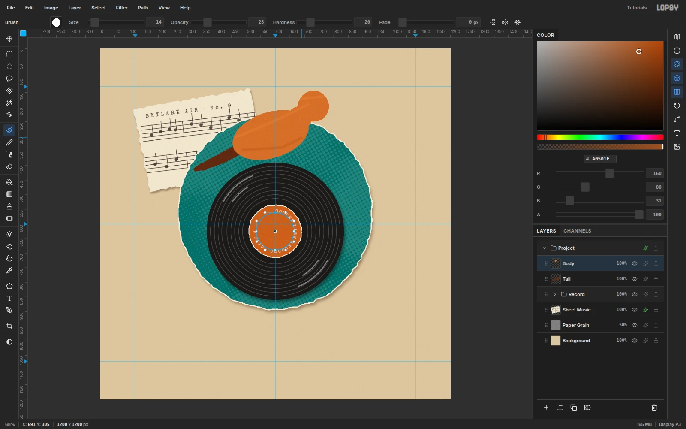

With the body selection still active, add noise at `14`. Then paint soft
streaks with the Brush at **Size** `14`, **Hardness** `20`, **Opacity** `28`:

- `#E39152` along the back and over the head, where light hits
- `#A0501F` along the belly

The selection keeps every stroke on the paper. Deselect.

## Add a streaked cream breast

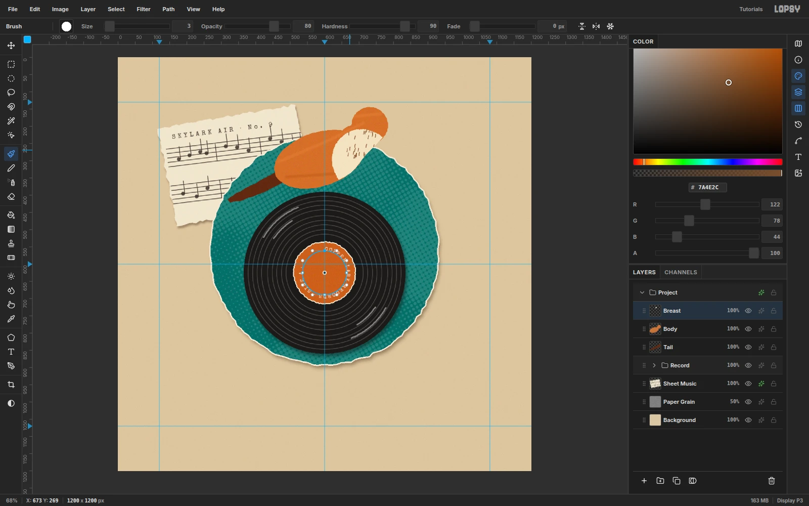

Add a layer named `Breast`. Lasso a crescent from under the beak down the
front of the body to the belly, and fill with `#F1E3C4`. Add noise at `10`.

Larks have **streaks**, not spots. Spots read as a thrush. With the Brush at
**Size** `3` and `#7A4E2C`, drag about 30 short strokes, each 9 px long and
nearly vertical, packed mostly on the upper breast.

## Cut the wing and scallop its feathers

Add a layer named `Wing`. Lasso a long leaf-shaped folded wing, about
270 × 100 px, from the shoulder just behind the neck, back and down to a
point over the base of the tail.
Fill with `#7A3A1E` and add noise at `14`.

With the Brush at **Size** `3` in `#E0AA72`, draw three staggered rows of
small U-shaped arcs, each about 20 px wide and opening toward the head. The
pale edges read as overlapping feathers.

## Add the crest, beak, eye and legs

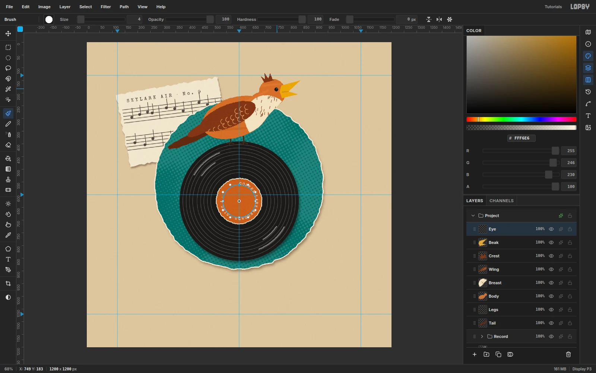

- **Legs:** Click `Tail` and add a layer named `Legs`, so it sits under the body. Use the Brush at Size `6` in `#3B2A1A` and [[Shift]]-click two legs from the belly down to the record's top rim. Add three short toes on each at Size `5`.
- **Crest:** Above `Wing`, add a layer named `Crest` and lasso a small ragged tuft of three or four points rising from the back of the crown. Fill with `#7A3A1E`. Keep it short and flush with the head. A tall single spike looks like a horn.
- **Beak:** Add a layer named `Beak` and lasso one piece with an open V that starts inside the face, so it stays attached. Fill with `#E2A93B`, then brush a 3 px gape line in `#9C6A18`.
- **Eye:** Add a layer named `Eye`, press [[Cmd+D]], and click once with a hard Brush at Size `15` in `#1C1A18`. Click a 4 px `#FFF6E6` highlight dab near the top right.

## Lift the lark off the page

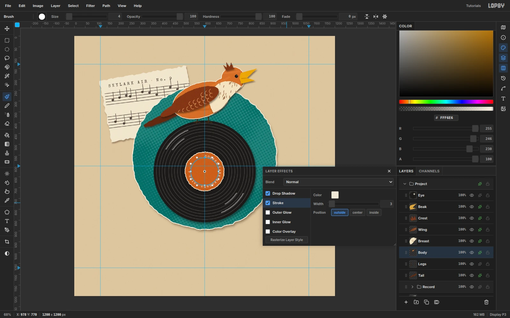

Give **Tail, Body, Wing, Breast, Crest** and **Beak** a **Drop Shadow** in
`#1A1008` with offsets `3` / `6`, **Blur** `8` and **Opacity** `45`. Give Body
a 3 px cream **Stroke** too, so the whole bird gets the same torn-paper
outline as the disc.

Click `Eye`, [[Shift]]-click `Tail`, choose **Layer → Group Layers**, and
name the group `Lark`.

## Cut a paper music note

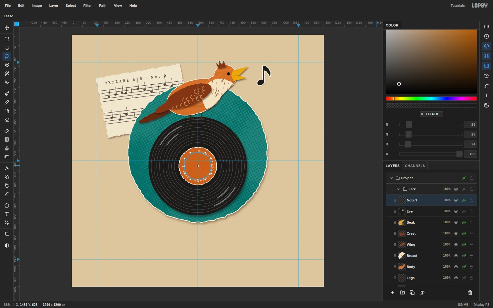

With `Eye` selected, add a layer named `Note 1`. Build the note in
`#1C1A18`:

1. Lasso a tilted oval head, about 34 × 24 px, in the open space to the right of the lark's beak, level with its head. Fill it and deselect.
2. For the stem, use a hard Brush at Size `6`. Click at the right side of the head, then [[Cmd+Shift]]-click about 80 px straight above it.
3. Lasso a curved flag from the top of the stem sweeping down to the right, and fill it.

Give it a 4 px cream **Stroke** and a small **Drop Shadow** (`2` / `4`,
Blur `5`, Opacity `40`) so it matches the other paper pieces.

## Copy, scale and rotate a second note

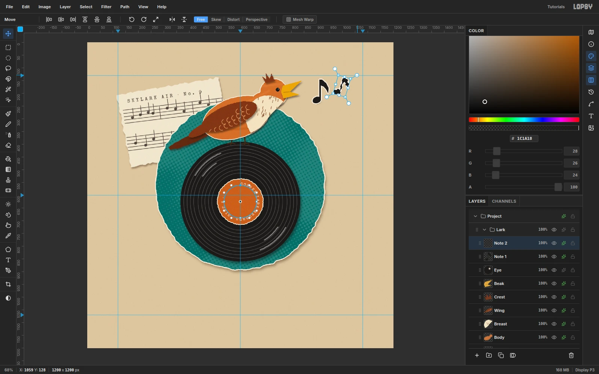

Drag a **Rectangular Marquee** snugly around the note, press [[Cmd+C]], then
[[Cmd+V]]. The copy is pasted in place on a new layer.
Rename it `Note 2`.

With the **Move** tool:

1. Drag from inside the selection up and to the right, about 100 px across and 55 px up, keeping it inside the right margin guide.
2. Drag the bottom-right corner handle in to scale it to about 80%.
3. Drag just outside a corner to rotate it about **16°**, then press [[Cmd+D]].

Pasted pixels don't bring layer effects with them, so add the same cream
Stroke and Drop Shadow to Note 2.

## Tear the black wordmark strip

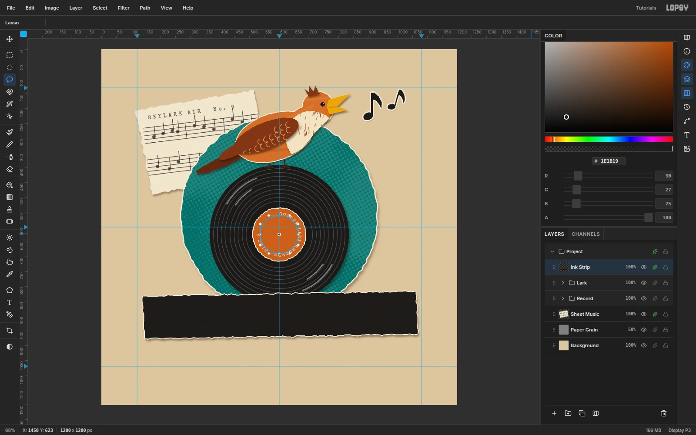

Collapse the `Lark` group, then add a layer named `Ink Strip` and drag it
above `Lark`. Lasso a torn band about 140 px tall across the lower part of
the page, running from just inside the left margin guide to just inside the
right one. Its top edge should overlap the bottom of the record, and the
whole band tilts up about one degree to the right (the right end sits about
16 px higher).

Fill with `#1E1B19` and add noise at `10`. Add a 3 px cream **Stroke** and a
**Drop Shadow** (`4` / `8`, Blur `10`, Opacity `45`).

> **Tip:** Overlap the record by about 40 px, not by just a few pixels. A
> near-miss between two edges looks like a mistake, and a clear overlap looks
> like a choice.

## Set the wordmark and track it out

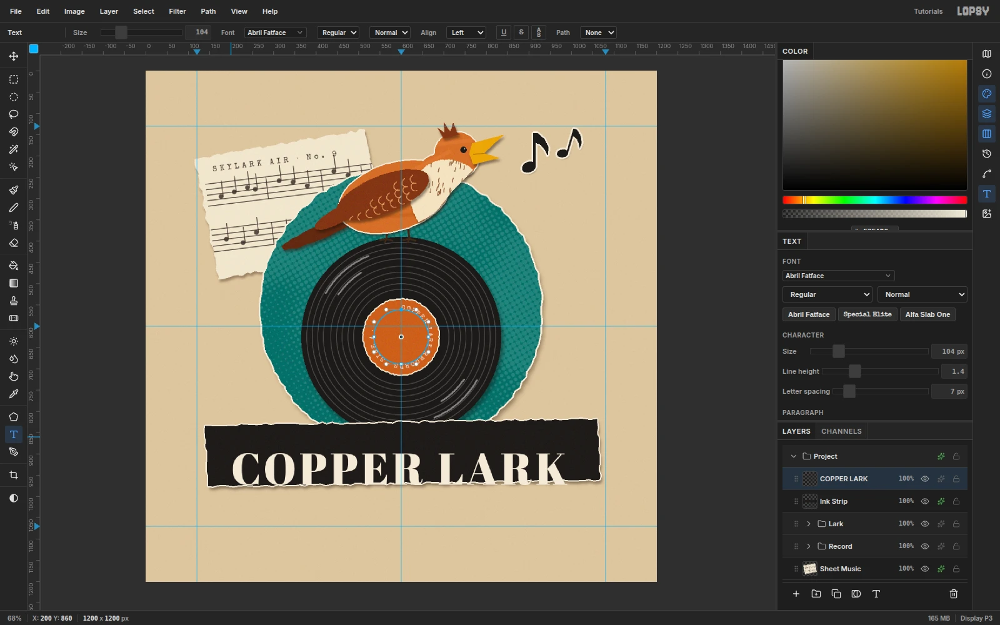

Set the foreground to `#F2EAD8`. Use the Text tool with **Abril Fatface** at
**Size** `104`, click on the strip, type `COPPER LARK`, and press [[Tab]].

In the **Text** panel, set **Letter spacing** to `7`. Abril Fatface's heavy
capitals crowd each other at 0. A little tracking opens up the word space
and makes the line read as a logo.

## Seat the wordmark and match the tilt

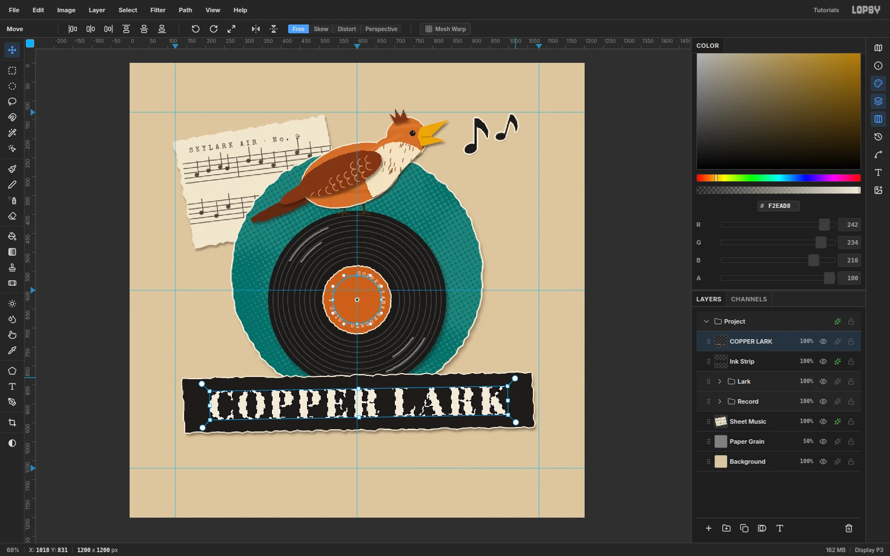

Center the type optically inside the paper. The 104 px Abril Fatface
capitals are about 74 px tall, so center the caps rather than the text box.
With the **Move** tool, nudge with the arrow keys ([[Shift]] moves 10 px)
until there's about 34 px of black above and below the caps, and about
70 px at each end.

[[Cmd]]-click the text layer's thumbnail and rotate about **−1°** to follow the
strip's tilt, then press [[Cmd+D]]. The name has no descenders, so nothing
hangs below the baseline.

## Add a masking-tape tagline

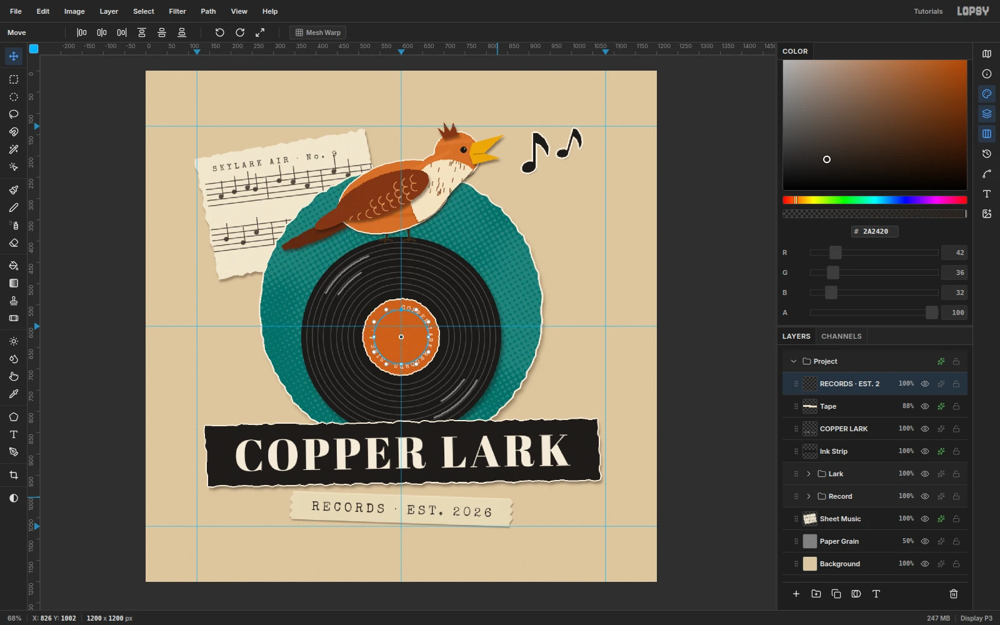

Add a layer named `Tape`. Just below the ink strip, lasso a band about
510 × 66 px, centered on the vertical guide, zigzagging the two short ends
like torn tape. Fill with `#EFE4C6`, add noise
at `8`, set the layer to **88%**, and add a light **Drop Shadow**
(`1` / `3`, Blur `4`, Opacity `35`). [[Cmd]]-click its thumbnail, rotate it
about **+2°**, and press [[Cmd+D]].

Set the foreground to `#2A2420`. Use **Special Elite** at **Size** `30` to
type `RECORDS · EST. 2026`, then rotate it +2° as well. Nudge it until it's
centered on the tape, with about 44 px of clear tape at each end.

Add one more short tape strip named `Corner Tape`, about 116 × 38 px, rotated
**−40°** over the sheet music's top-left corner at 80% opacity. Now the scrap
looks taped down.

## Finish with grain and a vignette

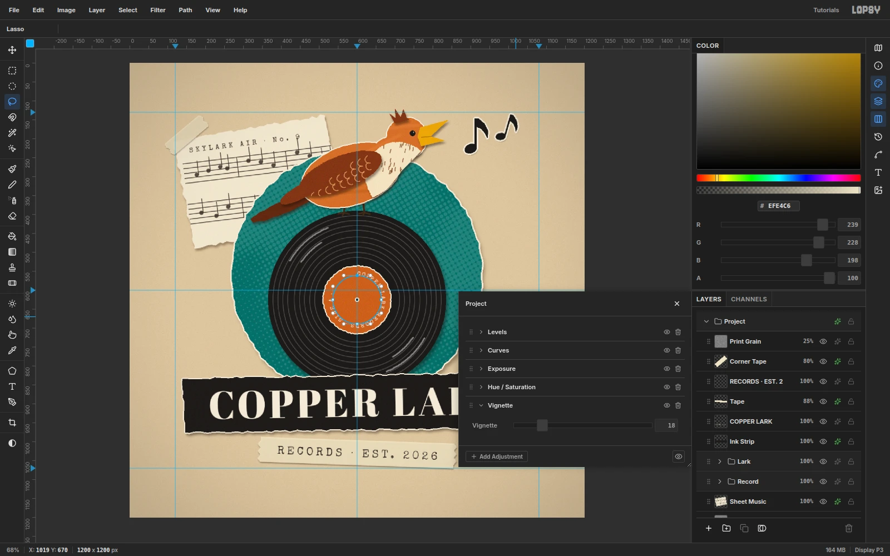

Click `Paper Grain` and click **Duplicate Layer**. Rename the copy
`Print Grain`, drag it to the top of the stack, and set it to **25%**. The
overlay grain now runs across every paper piece, which ties them together as
one printed sheet.

Click the `Project` group, open its drawer, and choose **Add Adjustment →
Vignette** at `18` for a gentle darkening at the corners.

Save with **File → Save Project**, then **File → Quick Export PNG**.
