El Lissitzky's 1919 poster *Beat the Whites with the Red Wedge* is about as
simple as political graphics get: a red triangle stabs into a circle. The
Soviet constructivists who came after him, including Rodchenko, the Stenberg
brothers and Klutsis, kept to the same short list: flat red, black and cream,
steep diagonals, and heavy condensed type.

In this tutorial you'll use that list for the cover of a made-up magazine,
**APIARY**, *Journal of the Working Hive*. Issue No. 7 covers the **Drone
Uprising**: a red wedge drives into a black hive disc, and a geometric
worker bee leads the charge. You'll pattern-fill a honeycomb, print a red
halftone shadow, and draw the bee from rotated lasso shapes. Then you'll
copy and paste a swarm, rotate type onto the wedge, and finish with a paper
and grain texture. The document is 1200 × 1600 px.

The palette:

- Paper `#EAE0C8`
- Ink black `#17130F`
- Constructivist red `#C8261B`, with `#8E1A12` for shadowed wings
- Honey ochre `#F2B01E`

## Lay down the paper

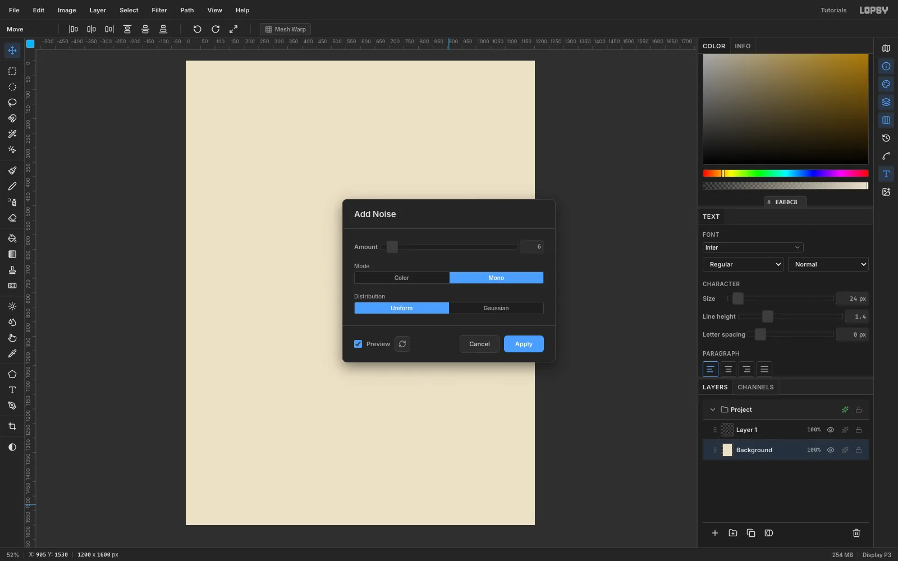

Choose **File → New**, check that **Unit** is **Pixels**, and enter
**1200 × 1600** with a **White** background. Set the foreground color to
`#EAE0C8`, select the Background layer and choose **Edit → Fill**. Then run
**Filter → Add Noise…** with **Mono** and **Amount 6**. The flat cream picks
up a faint newsprint tooth.

> **Tip:** If you clicked a preset tile first, the Unit may have switched to
> Inches. 1200 × 1600 *inches* is far too big to create.

## Set margins with guides and a grid

Click the **top ruler** at x = 60, 600 and 1140 to drop three vertical
guides, and the **left ruler** at y = 250 and 1250 for two horizontal ones.
The outer guides are your 60 px margins. The horizontal guides mark the
bottom of the masthead and the top of the headline. Turn on
**View → Show Grid**, which also turns on **Snap**, at the default 16 px.

## Draw the hive disc

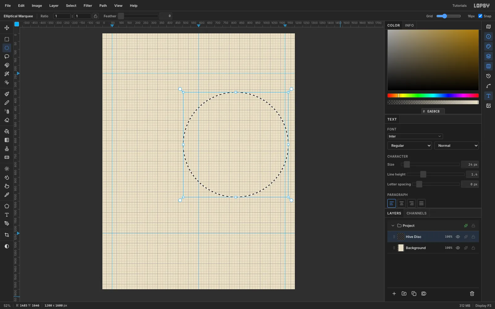

Rename *Layer 1* to **Hive Disc**. Pick the **Elliptical Marquee** and drag a **656 × 656** circle with its
top-left corner near **(504, 368)**. With Snap on, the corners lock to the
grid. Fill it with ink black `#17130F` using **Edit → Fill**, then deselect
with [[Cmd+D]].

## Print a halftone shadow

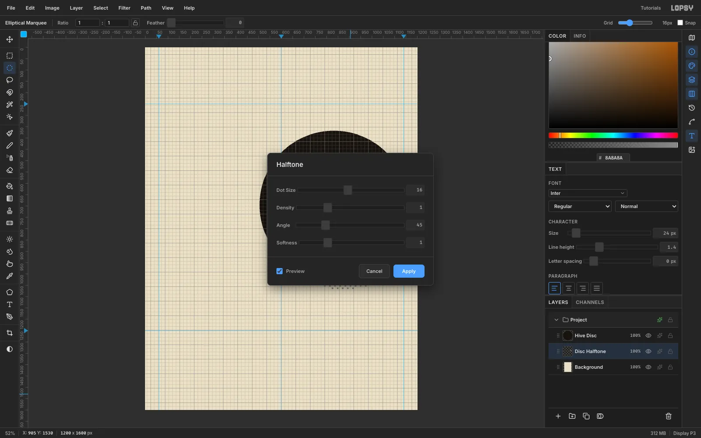

Untick **Snap**. Select the Background and click **Add Layer** to put a
**Disc Halftone** layer under the disc. Draw the same 656 px circle offset
by about **+44, +44**, fill it with mid grey `#8A8A8A`, deselect, and run
**Filter → Halftone…** with **Dot Size 16**, **Angle 45** and
**Softness 1**. A flat grey turns into an even grid of round dots.

## Turn the dots red

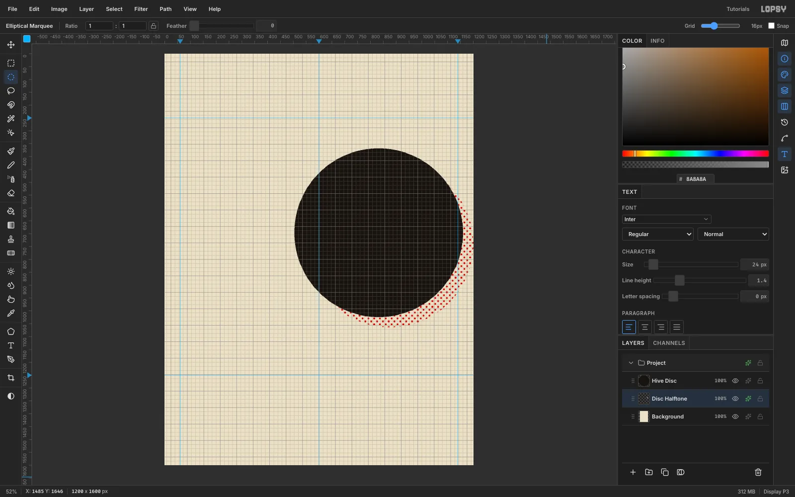

Open the layer's effects (the effects button on its row), enable
**Color Overlay** and set it to `#C8261B`. Halftone dots spill a little past
the circle, so draw a circle 8 px smaller over the dots, choose
**Select → Inverse** and press [[Delete]]. What's left is a crisp crescent of
red dots, like a misregistered second ink.

## Build a honeycomb tile

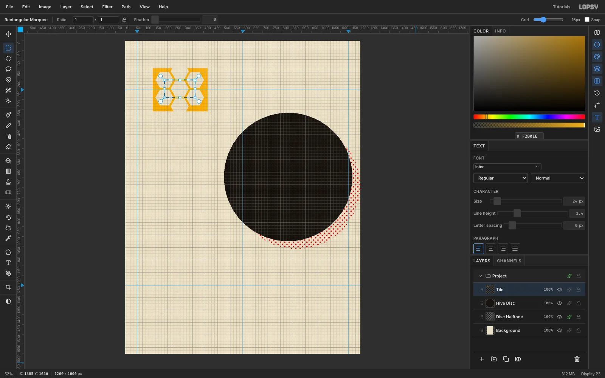

Add a temporary **Tile** layer. Marquee a rectangle and fill it with ochre
`#F2B01E`. Then, for each cell, use the **Lasso** to draw a flat-topped
hexagon (radius about 46 px) and press [[Delete]] to punch it out. Space the
cell centres **156 px** apart horizontally and **90 px** vertically, with an
extra cell in the middle of each block. The punched-out lattice leaves
honeycomb walls about 10 px thick. Marquee exactly one repeat, **156 × 90**,
choose **Edit → Define Pattern**, then delete the Tile layer.

## Fill the disc with honeycomb

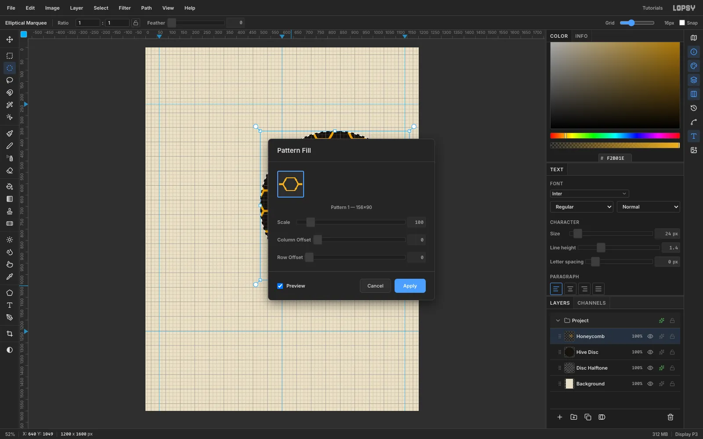

Select **Hive Disc** and add a **Honeycomb** layer above it. Draw the
**same** 656 px circle as the disc (not a smaller one, or the cells stop
short of the rim and leave a black ring). Choose
**Edit → Fill with Pattern…**, pick your pattern, turn on **Preview** and
**Apply** at **Scale 100**.

## Fill a few cells with honey

Choose the **Paint Bucket** with the foreground still ochre and click inside
five cells that don't touch each other. The walls hold each fill inside its
hexagon. Stay away from the cut cells at the rim: they're open to the
transparent area outside the disc, so the fill floods the whole layer. If
that happens, undo with [[Cmd+Z]].

## Drive in the red wedge

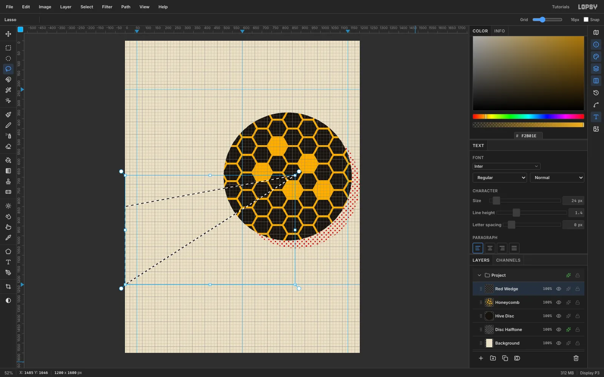

Add a **Red Wedge** layer above the honeycomb. With the **Lasso**, click
through three points: **(0, 850)**, **(870, 690)** and **(0, 1250)**. This
gives a long triangle whose tip stabs into the disc. Fill it with
`#C8261B`, deselect, and give it grit with **Filter → Add Noise…**,
**Mono**, **Amount 10**.

## Cut the bee's wing and body

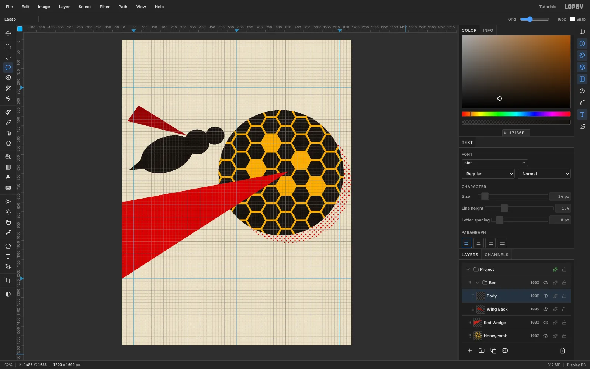

Select Red Wedge and click **New Group**. Name the group **Bee**. Inside it,
build the bee from lasso polygons, every piece tilted about **−22°** so the
bee climbs parallel to the wedge:

- **Wing Back:** a long, sharp triangle in dark red `#8E1A12`, sweeping up and back from the thorax.
- **Body** (ink black): an oval abdomen about 290 × 180 px, a pointed stinger triangle, a round thorax, and a smaller round head.

Keep everything flat, with no outlines. Constructivist illustration is cut
paper, not line drawing.

## Add stripes, legs, antennae and the front wing

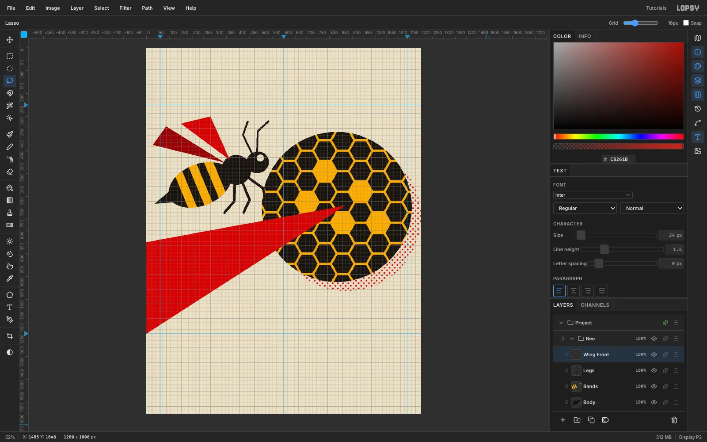

On a **Bands** layer, lasso three ochre bands that follow the curve of the
abdomen. On a **Legs** layer, use the **Brush** at **Size 12**,
**Hardness 100** to draw three angular two-segment legs. Switch to
**Size 9** for two antennae. Finish with a **Wing Front** layer: a second
sharp triangle in `#C8261B`, overlapping the first. Two reds read as two
wings without any outline.

## Move the bee as one group

Click the **Bee** group row and drag with the **Move** tool. All five layers move together. Nudge the bee up and left until its
legs clear the disc. Press [[Cmd+Z]] and [[Cmd+Shift+Z]] to compare: the
group returns exactly to where it was.

## Draw one small bee

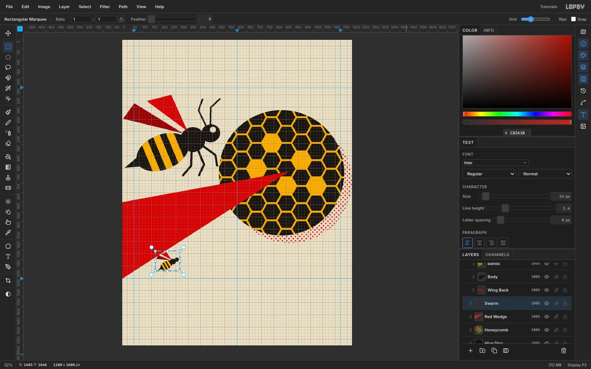

Select Red Wedge and add a **Swarm** layer. Using the same shapes at about
**30 %** size and **−30°**, draw a small bee just below the wedge's lower
edge: dark red back wing, black body, ochre bands and red front wing. Then
drag a **Rectangular Marquee** snugly around it.

## Copy and paste the swarm

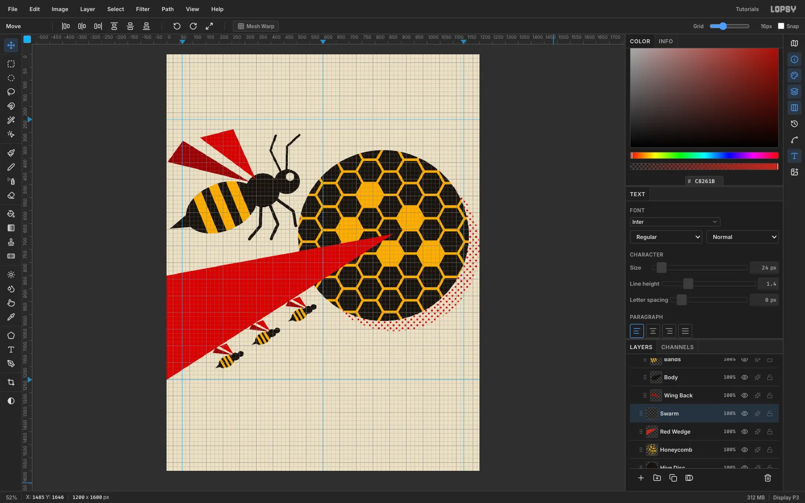

Press [[Cmd+C]] then [[Cmd+V]]. The paste lands in place on a new layer.
Drag it up and to the right with the Move tool, about **+140, −90**. Repeat
from the Swarm layer with an offset of **+280, −180**. Then select the top
pasted layer and choose **Layer → Merge Down** twice to fold both copies
back into Swarm.

## Set the UPRISING headline

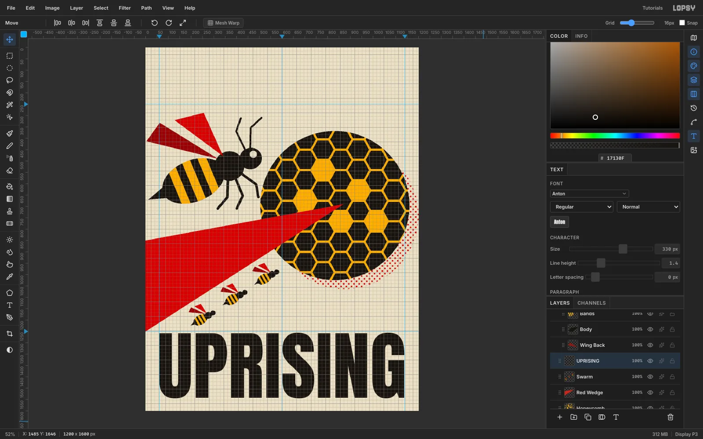

Choose the **Text** tool and set the font to **Anton** and the size to
**330** *before* clicking. Then click in empty space below the wedge, type
**UPRISING** in ink black and press [[Tab]] to commit. Move it so the
letters run from the left guide to the right guide, with the top of the
caps at about **y = 1255**.

## Rotate DRONE to match the wedge

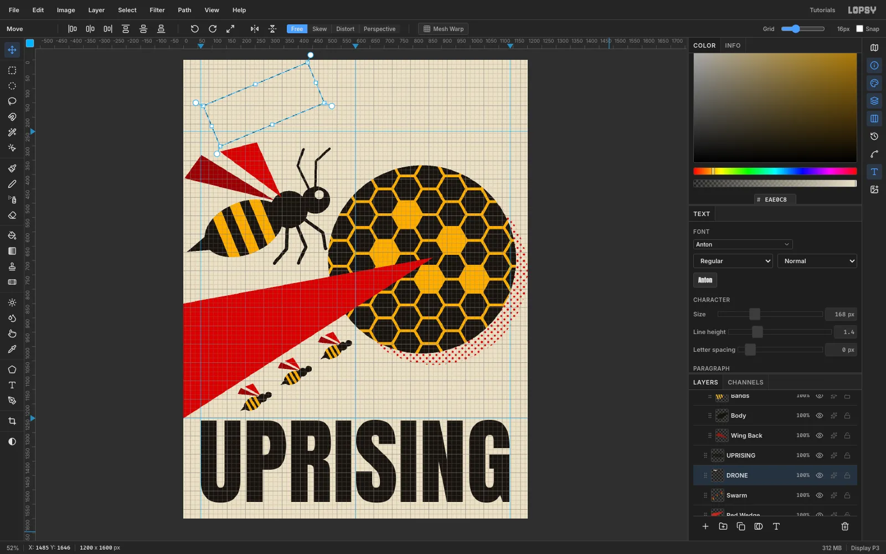

Set **Anton 168** in cream `#EAE0C8`. Click in the empty masthead area,
type **DRONE** and commit. On the paper it's almost invisible for now.
Select the DRONE layer, marquee tightly around the word, and drag the
**rotate handle** just outside the top-right corner until it turns
**−22.5°**, the angle of the wedge. Press [[Cmd+D]] to commit the
transform.

> **Tip:** Set the final size *before* you rotate. Changing a text layer's
> size afterwards redraws it straight.

## Slide DRONE onto the wedge

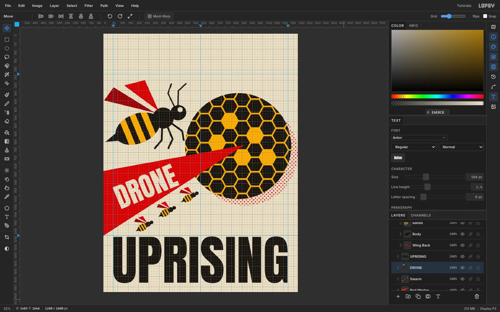

With the **Move** tool, drag DRONE down onto the wedge. Center it on the
wedge's midline, toward the wide end where there is room for the cap
height. Keep a little red visible above the "NE" and below the "D".

## Stack the masthead

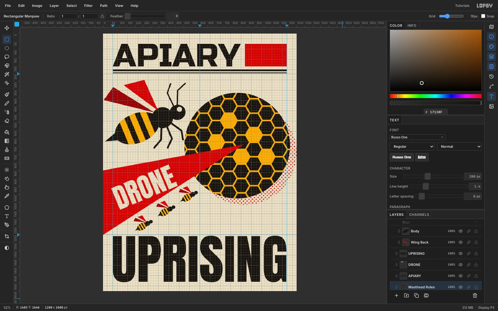

Set **APIARY** in **Russo One 200**, ink black, and move it to the top-left
margin (60, 64). On a **Masthead Rules** layer, marquee-fill three shapes:

- a red issue box, **260 × 140** at (880, 64)
- a **12 px** black rule across the margins at y = 222
- a **4 px** rule at y = 242

## Add the issue number and taglines

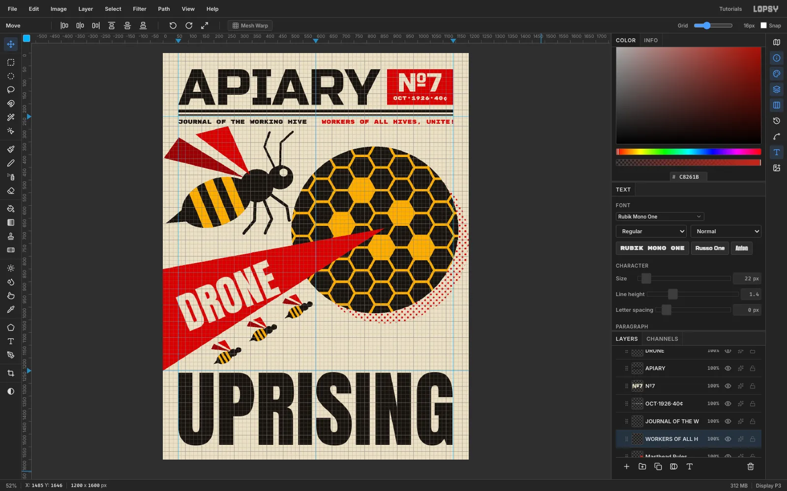

Paste **№7** into the issue box in **Russo One 104**, cream. Pasting with
[[Cmd+V]] is the easiest way to type the № sign. Below it, set
**OCT·1926·40¢** in **Rubik Mono One 21**. Under the rules, add
**JOURNAL OF THE WORKING HIVE** in black and
**WORKERS OF ALL HIVES, UNITE!** in red, both **Rubik Mono One 22**.
Align the first to the left margin and the second to the right.

## Lasso a tilted coverline slab

Constructivist covers rarely have just one diagonal. Add a
**Coverline Bar** layer and lasso a **500 × 150** rectangle tilted
**−12°**, centred near **(885, 1105)**, so it tucks under the disc. Fill it
with `#C8261B` and add the same **Mono Amount 10** noise as the wedge.

## Set and rotate the coverlines

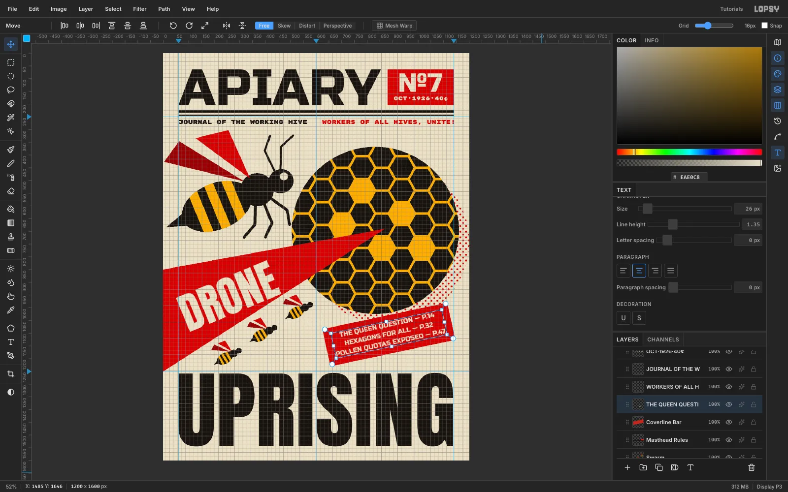

Drag a **Text** box about 470 px wide over the slab. Set **Russo One 26**,
**Line height 1.35**, **Align center**, cream, and type three lines:

- THE QUEEN QUESTION — P.14
- HEXAGONS FOR ALL — P.32
- POLLEN QUOTAS EXPOSED — P.47

Commit with [[Tab]]. Then marquee the text and rotate it **−12°**, the same
angle as the slab.

## Center the coverlines on the slab

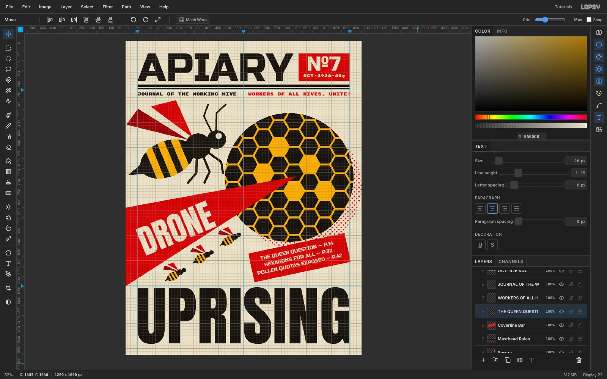

Press [[Cmd+D]] to commit, then drag the text so it sits centred on the
slab with even red margins on every side. The slab now makes a second
diagonal against the steeper wedge.

## Add a grain layer

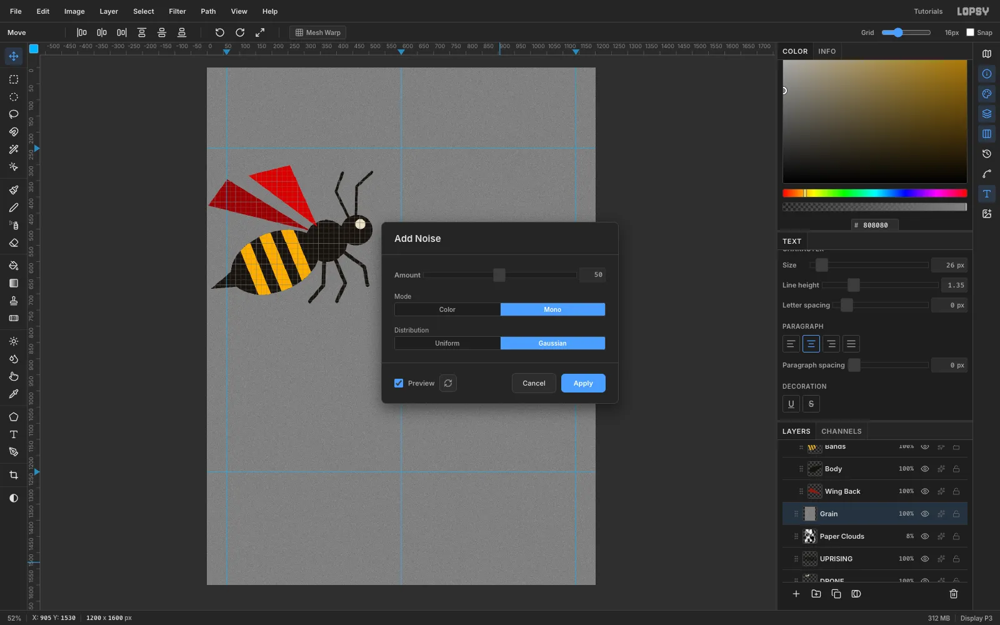

For print texture, add a **Paper Clouds** layer, run
**Filter → Clouds…**, set its blend mode to **Multiply** and its opacity to
**8 %**. Then add a **Grain** layer, fill it with `#808080`, and run
**Add Noise** with **Mono**, **Gaussian**, **Amount 50**. Set Grain to
**Overlay** at **35 %**. Mid grey is neutral in Overlay, so only the speckle
shows.

## Put the texture on top of everything

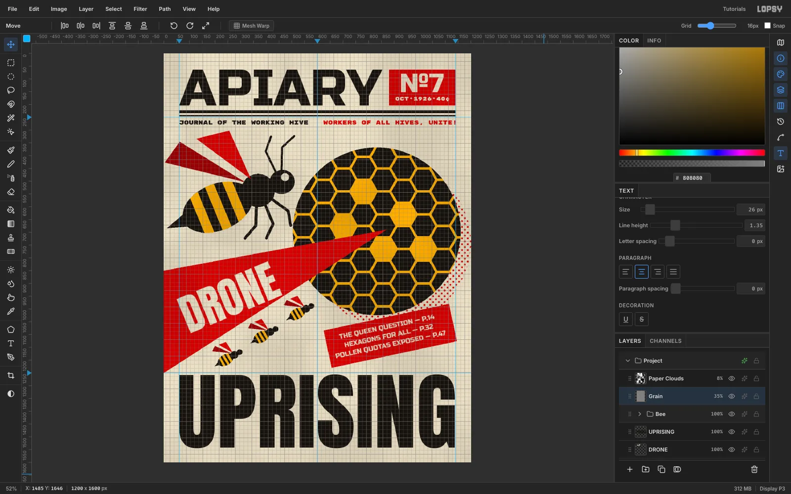

The texture layers were created under the Bee group, so the bee would look
too clean. Collapse the group, then drag each texture layer by its grip
above the **Bee** row. Now one paper surface covers the ink, the wedge and
the bee.

## Polish the tangents

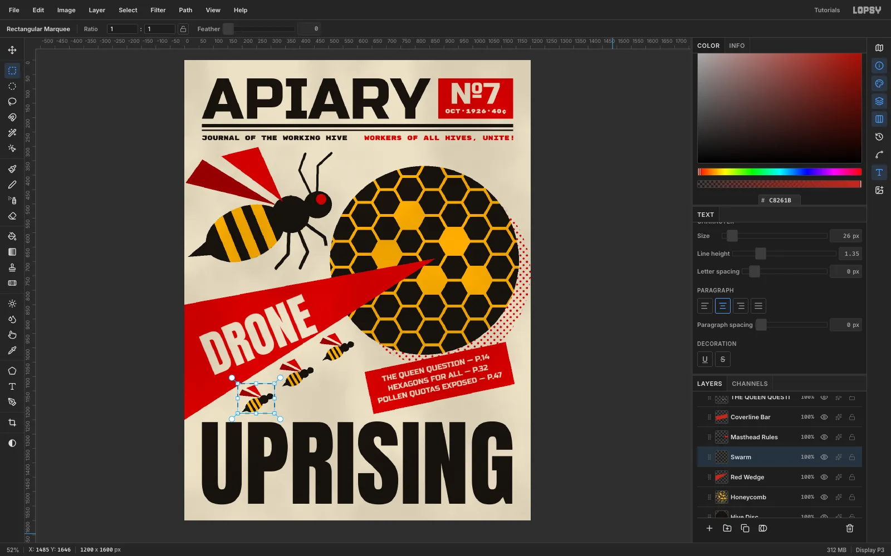

Check the cover for near-misses:

- **Leg tip.** Erase the tip of the bee's front leg (Eraser, Size 34) so it no longer kisses the disc.
- **Eye.** Circle-select the bee's eye on the Bands layer and fill it red. A flat red dot is more on-style than a cartoon highlight.
- **Swarm.** Marquee the lowest small bee and press [[Delete]] so UPRISING has room. Then move the Swarm layer so the last two bees sit under the wedge.
- **Halftone.** Move the halftone layer about 45 px left so the dots stay inside the page.
- **Coverlines.** Nudge the text a few pixels to even out the slab's margins.

## Export the cover

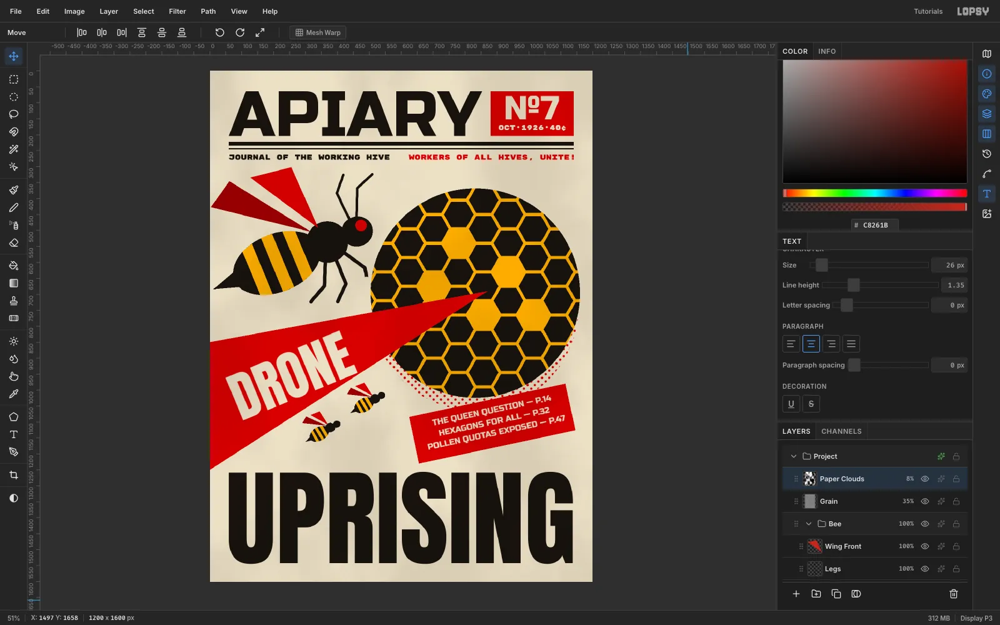

Hide the grid and guides from the **View** menu, then choose
**File → Quick Export PNG** for the finished cover. Use
**File → Save Project** to keep the layers editable. To make another issue,
swap the wedge and disc for a different pair of shapes and keep the palette.
