Soviet constructivist posters from the 1920s were built from a small kit of parts:
- a cut-out photograph,
- one flat red,
- black bars at a steep diagonal, and
- heavy sans-serif type set sideways.

Rodchenko used that kit to sell biscuits and books, so it suits a menu as well. This tutorial makes a menu for a made-up 1930 workers' canteen beside the Empire State Building construction site: *Jackhammer Automat*, "fuel for the builders of tomorrow".

The photo is Lewis Hine's **Icarus, Empire State Building** (1930). The Metropolitan Museum of Art has released it as CC0 on Wikimedia Commons (`Icarus, Empire State Building MET DP106525.jpg`). Download the 1920 px version. The cable the worker is riding gives the whole design its diagonal.

The palette is one paper, one ink and one red:

- Paper `#EAE3D1`
- Ink `#15130F`
- Constructivist red `#BF382A`

> **Tip:** On a wide-gamut (Display P3) screen, Lopsy reads a typed hex code as a P3 colour. The codes above are the P3 values; they export as a brick red close to sRGB `#D0261C`. On a standard sRGB screen, type `#D0261C`, `#ECE3CF` and `#16130F` instead.

Fonts: **Anton** for the masthead, the vertical word and the dish names, **Russo One** for labels and the Cyrillic, and **Tenor Sans** for the descriptions.

## Set up the page and guides

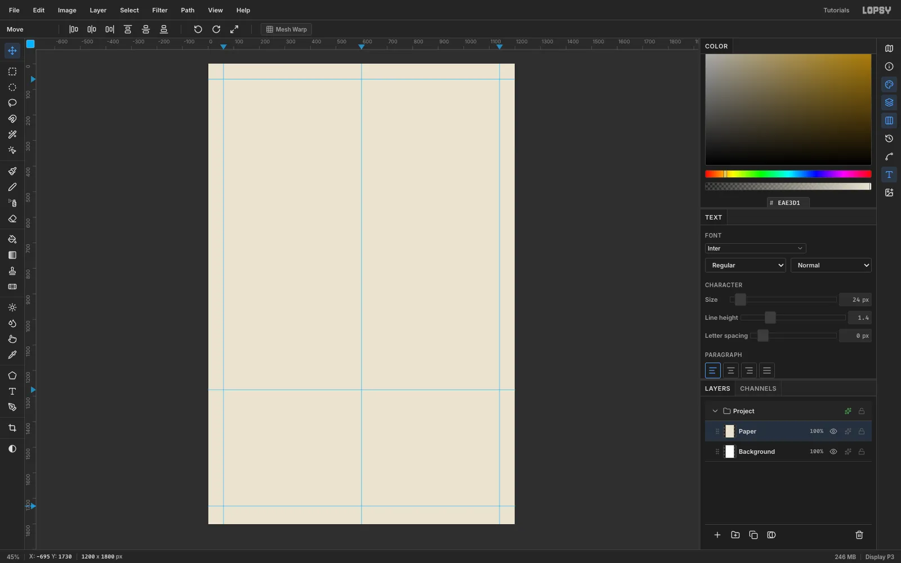

1. Create a **1200 × 1800 px** document with a white background. Keep the unit on **Pixels**.
2. Rename *Layer 1* to `Paper` and fill it with `#EAE3D1` (**Edit → Fill**).
3. Click the rulers to add guides. A click on the top ruler adds a vertical guide, and a click on the left ruler adds a horizontal one.
   - Vertical guides: **60**, **600** and **1140** (the margins and the column split).
   - Horizontal guides: **60**, **1275** (the top of the menu) and **1730** (the top of the footer).

## Draw the red sun

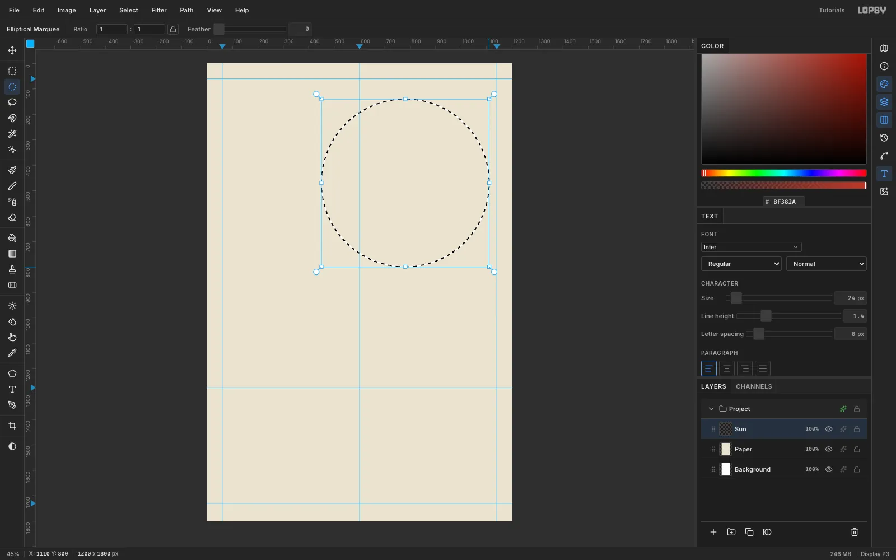

1. Add a layer called `Sun`.
2. With the **Elliptical Marquee**, drag a circle from **(450, 140)** to **(1110, 800)**. That is a 660 px sun centred at (780, 470).
3. Fill it with the red `#BF382A`, then press [[Cmd+D]].

This is the only large red shape in the design. Everything else in red stays small, so the sun keeps its weight.

## Paste and scale the photo

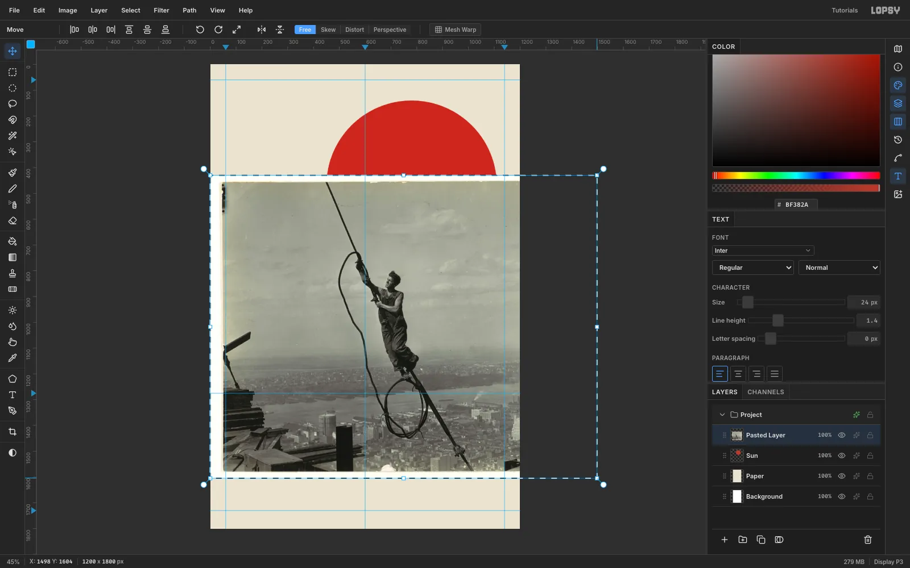

1. With `Sun` active, copy the photo and press [[Cmd+V]]. Lopsy fits it to the canvas, centres it and switches to the **Move** tool with the transform box live.
2. Hold [[Cmd]] and drag the bottom-right handle out so the photo is about **1500 × 1176 px**. The top-left corner stays pinned.
3. Press [[Cmd+D]] to commit, rename the layer `Icarus`, and drag it **47 px right** and **520 px up**. The worker's fist should sit inside the sun, near its top-left.

Most of the photo now runs off the top and right of the canvas. That's fine, because you'll cut away the sky.

## Desaturate and punch up the contrast

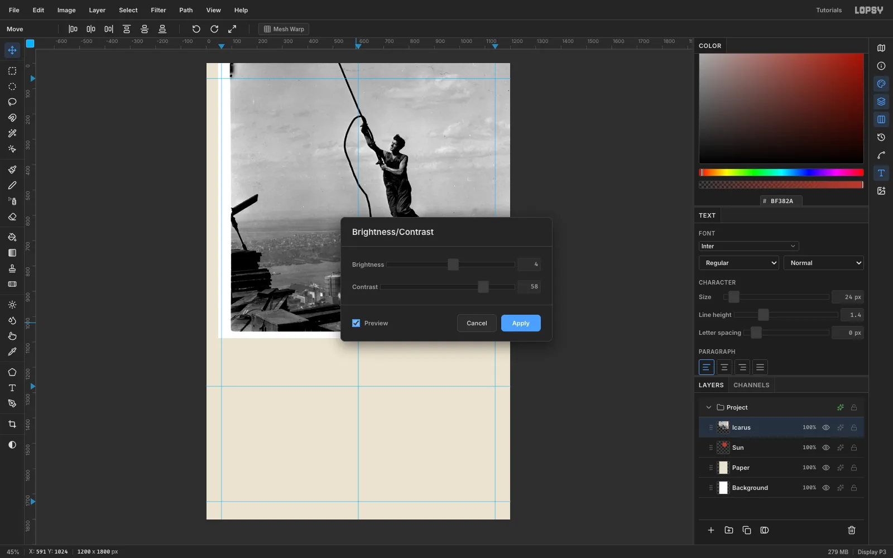

1. Run **Filter → Desaturate**.
2. Open **Filter → Brightness/Contrast…**, set **Brightness 4** and **Contrast 58**, and check that **Preview** is on.

The overalls and cable should reach near black, and the sky should stay light grey. Strong blacks are what make the cutout read as a print later.

## Protect the face before you cut

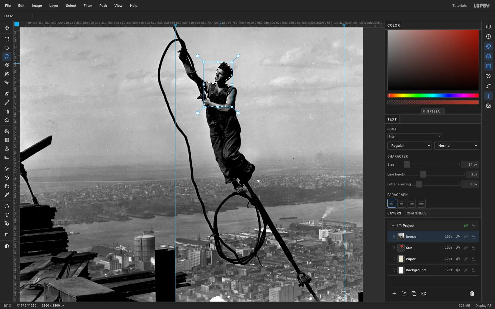

The worker's face and arms are nearly as pale as the sky. The Magic Wand would eat straight through his nose and chin, so copy them to a layer of their own first.

1. Zoom in on the worker ([[Ctrl]] + scroll wheel).
2. With the **Lasso**, trace just inside the lit skin: the hair, the forehead, the nose, the lips, the chin and neck, the top of the shoulder and the lower hand. Follow the dark hair and clothing edges wherever they touch sky.
3. Press [[Cmd+C]], then [[Cmd+V]]. The copy pastes back in place, on a new layer above the photo.
4. Rename the new layer `Figure`.

However hard the wand bites the photo below, the face now survives on the `Figure` layer.

## Cut the city into a hard-edged block

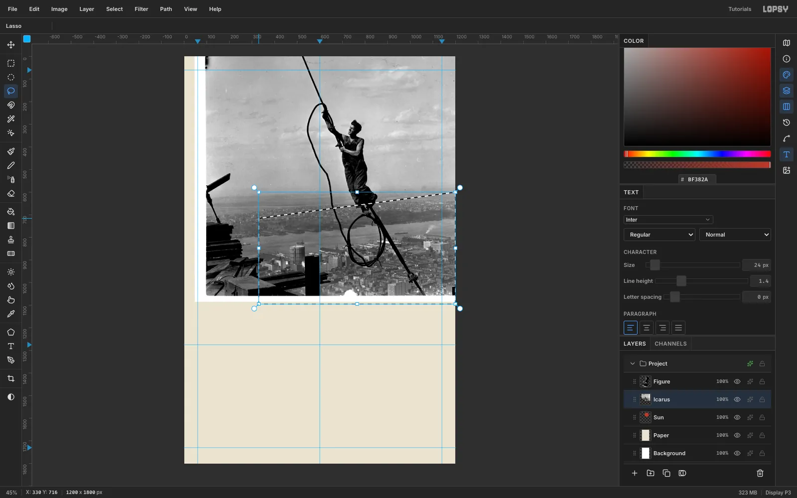

Constructivist photomontage cuts photos with a ruler, not around the subject. Lift the city onto its own slab:

1. On `Icarus`, lasso a four-sided shape with corners at **(330, 716)**, **(1215, 598)**, **(1215, 1095)** and **(330, 1095)**. The top edge climbs at the same angle the black band will use.
2. Press [[Cmd+C]], then [[Cmd+V]], and rename the new layer `City`.

The haze on the horizon has no clean edge, so a ruled cut is both easier and more authentic than tracing it.

## Wand away the sky

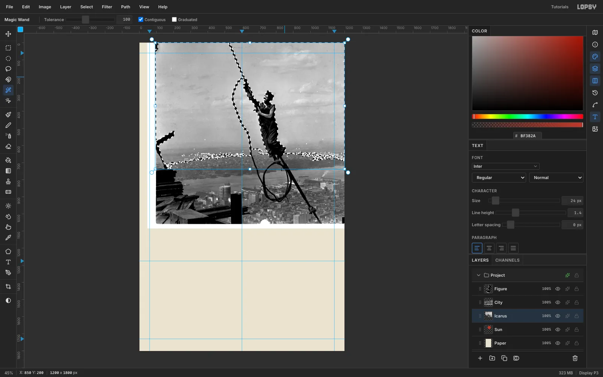

1. Select `Icarus` and pick the **Magic Wand**. Set **Tolerance** to **100**, turn **Contiguous** on and **Graduated** off.
2. Click the sky, then [[Shift]]-click every separate pocket of sky: inside the cable loop, between the cable and the worker, and down both sides.
3. Run **Select → Feather…** at **1 px**. It softens the stair-stepped wand edge without leaving a halo.
4. Press [[Delete]], then [[Cmd+D]].
5. Lasso everything left of the city block and the timbers in the bottom-left corner, and delete that too.

Then zoom along the cable and the legs. Lasso any leftover specks of haze *above* the city's cut line and delete them. Stay above the line, so the city block's top edge stays razor straight.

## Turn the photo into a duotone

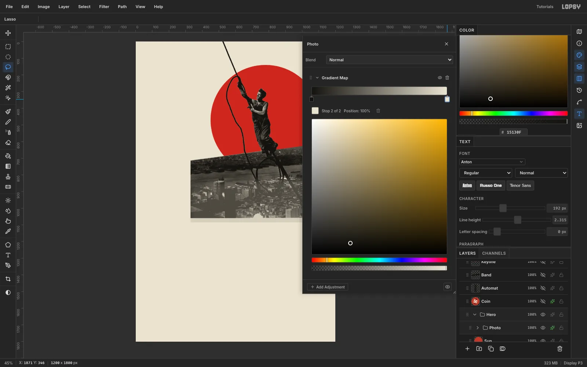

1. In the Layers panel, click `Icarus`, then [[Shift]]-click `Figure` to select all three photo layers.
2. Choose **Layer → Group Layers** and rename the group `Photo`.
3. Open the group's effects drawer (the sparkle button on its row) and click **Add Adjustment → Gradient Map**.
4. Click the left stop and type ink `15130F` into the hex field. Click the right stop and type paper `EAE3D1`.

Every grey in the photo now maps onto your two printing colours, so the photo's whites are the paper, not a cold grey.

Finally, select `City` and run **Brightness/Contrast** at **−22 / +34**. The skyline gets real blacks, so it reads as a slab and not as haze.

That can crush the bottom of the slab into a solid black mass against the band. To lift it:
1. Lasso the lower part of the city, from about y **860** down past the band.
2. Run **Select → Feather…** at **40 px**.
3. Run **Brightness/Contrast** at **+20 / −6**.

The feather hides the edge of the change.

## Lay the black band and its red keyline

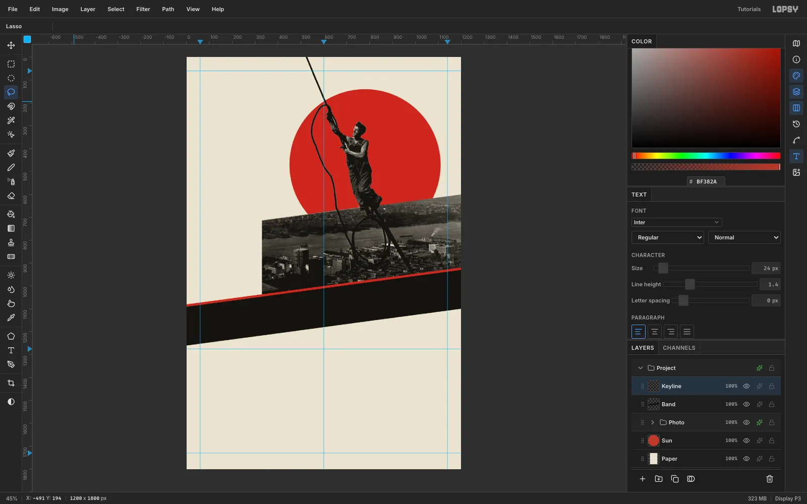

1. Add a layer called `Band` and drag it above the `Photo` group.
2. Lasso a strip whose top edge runs from **(−20, 1093)** to **(1220, 927)** and whose bottom edge runs from **(−20, 1263)** to **(1220, 1097)**. Start the lasso on the canvas; points can then run past the edges. Fill it with ink.
3. Add a layer called `Keyline`. Pick the **Brush** at Size **10** and Hardness **100** in red. Click on the left edge of the canvas just above the band's top edge (at about y **1085**), then [[Shift]]-click on the right edge the same distance above it (about y **925**). That lays a **10 px** strip along the band's top edge.

The slope is **−7.6°** (it rises 2 px for every 15 px across). The city's top edge, the band and every rotated word share this one angle.

The keyline matters more than it looks: without it, the dark girders at the bottom of the photo merge into the black band.

## Set the masthead on the band

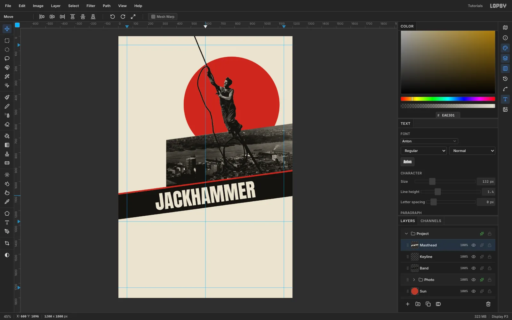

1. Click `Keyline`, pick the **Type** tool and set **Anton** at **132 px** in paper colour.
2. Click in an empty part of the page and type `JACKHAMMER`, then press [[Tab]] to commit.
3. Click **Rasterize Layer** in the Layers panel. Rotated live text is fragile, so rasterize it first.
4. Draw a **Rectangular Marquee** just larger than the word, switch to the **Move** tool, and drag just outside the top-right corner to rotate it **−7.6°**.
5. Press [[Cmd+D]] and drag the word onto the band. Centre it at **x 600** with about **27 px** of band above and below. Rename the layer `Masthead`.

## Plug AUTOMAT into the band

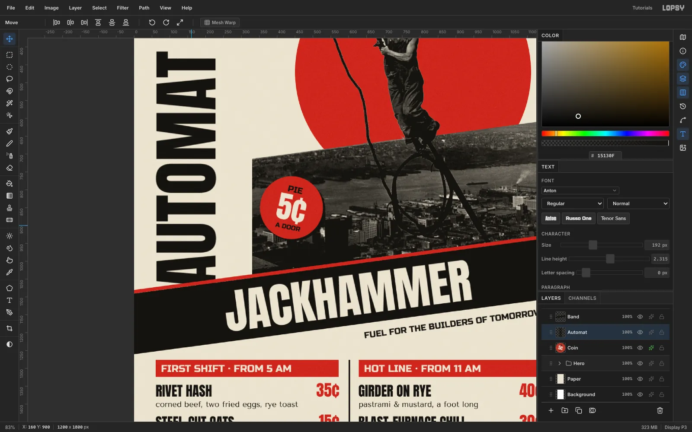

1. Click `Band` and set **Anton** at **192 px** in ink. Type `AUTOMAT` in empty canvas, press [[Tab]] and rasterize it.
2. Marquee the word, switch to the **Move** tool, and hold [[Cmd]] while you drag the rotate handle. The angle snaps in 15° steps, so stop at **−90°**. The word now reads bottom to top.
3. Press [[Cmd+D]] and move it so its left edge sits on the **60** guide and its bottom at **y 1072**.
4. Drag the `Automat` row *below* `Band` in the Layers panel.

The keyline and band now slice across the foot of the first A at the band's angle: a Lissitzky-style joint where the vertical word plugs into the diagonal. Keep the A's crossbar and counter above the cut, or the word reads "?UTOMAT".

AUTOMAT is set smaller than JACKHAMMER on purpose. It is taller, but JACKHAMMER on its black band must stay the first thing you read.

## Add the nickel coin

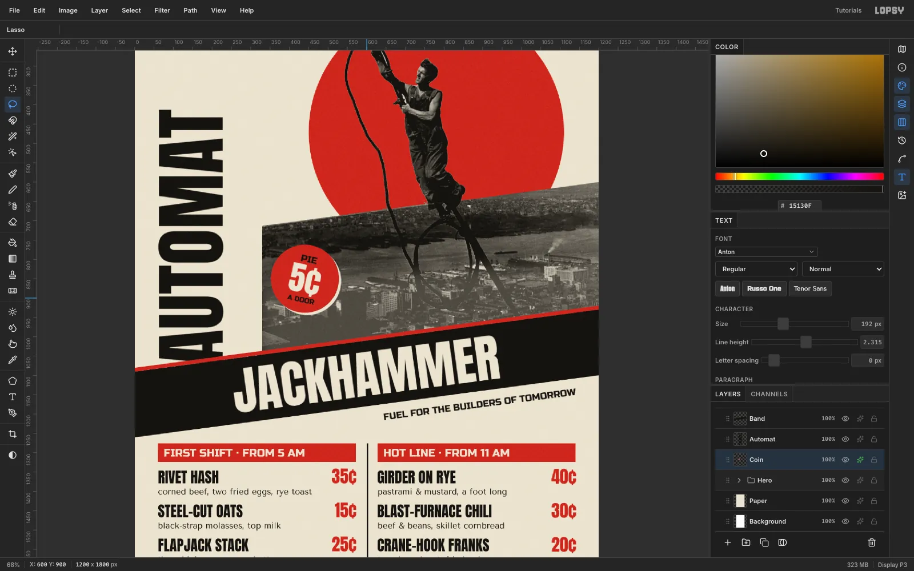

1. Click `Automat`, add a layer called `Coin`, and fill a **176 px** circle centred at **(440, 850)** in red.
2. Select `Coin` before you set up each line, and add three centred lines:
   - `PIE` in Russo One 24 px, ink,
   - `5¢` in Anton 84 px, paper, and
   - `A DOOR` in Russo One 18 px, ink.

   Leave about 24 px of red above PIE and below A DOOR.
3. Click the top text layer and run **Layer → Merge Down** three times, which merges them into the disc.
4. Marquee the coin and rotate it **+12°**. That's a deliberate counter-diagonal against the band.
5. In **Layer effects → Drop Shadow**, set **Color** to paper, **Offset** 6 / 6, **Blur 0** and **Opacity 100**.

A black shadow disappears into the dark city. A paper-coloured one reads like a second, misregistered print pass.

## Rule the menu on a grid

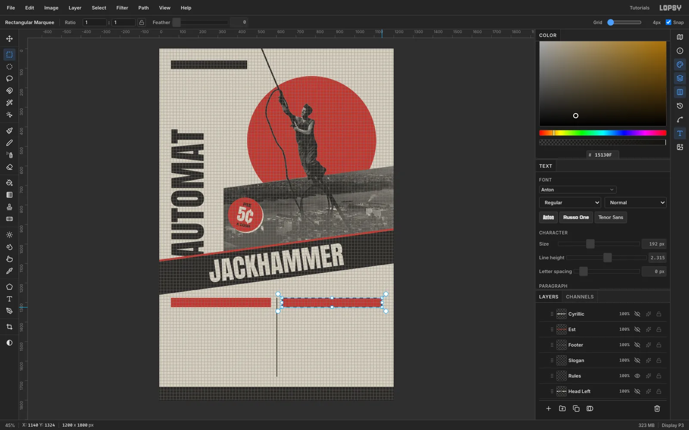

1. Select `Masthead`, click **New Group** and call the group `Menu`. Add a layer called `Header Bars` inside it.
2. Turn on **View → Show Grid** and set **Grid** to **4 px**. **Snap** switches on with the grid.
3. Snap two red bars from **(60, 1276)** to **(572, 1324)** and from **(628, 1276)** to **(1140, 1324)**.
4. On a `Rules` layer, snap these in ink:
   - a **68 px** footer bar across the bottom, and
   - a nameplate bar from **(60, 60)** to **(450, 104)**. It ends exactly at the sun's left edge.

   Then draw the **4 px** column rule down the centre guide with the **Pencil** ([[N]]) at Size 4: click at y **1276** and [[Cmd+Shift]]-click at y **1680**.
5. Hide the grid and untick **Snap** before you place any type. With snap on, arrow nudges jump a whole grid cell.

## Set the dishes and align the prices

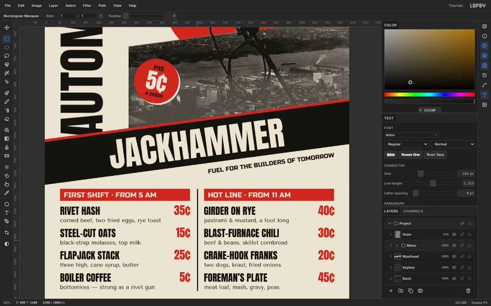

Put each block of type in its own text layer, and space the lines with **Line height** instead of typing one layer per line. Select `Header Bars` before you set up each block.

1. **Headers:** `FIRST SHIFT · FROM 5 AM` and `HOT LINE · FROM 11 AM` in Russo One 28 px, **Line height 1.4**, paper, 16 px in from the left of each bar and centred vertically.
2. **Dish names:** Anton 38 px, ink, with **Line height** set to **2.316** in the Text panel *before* you click, to give an 88 px pitch. Type all four names as one block per column. Left column: `RIVET HASH`, `STEEL-CUT OATS`, `FLAPJACK STACK`, `BOILER COFFEE`. Right column: `GIRDER ON RYE`, `BLAST-FURNACE CHILI`, `CRANE-HOOK FRANKS`, `FOREMAN’S PLATE`.
3. **Descriptions:** Tenor Sans 22 px with **Line height 4** (the same 88 px pitch). Place them **46 px** below the names, so each sits about 10 px under its dish.
4. **Prices:** drag an *area* text box instead of clicking, type the four prices, and set **Align** to **Right** in the options bar. Anton 44 px, red, **Line height 2**. Move each block so its right edge sits on the header bar's right edge (**572** and **1140**).

A right-aligned box lines up `5¢` under `35¢` exactly.

## Add the nameplate, slogan and footer

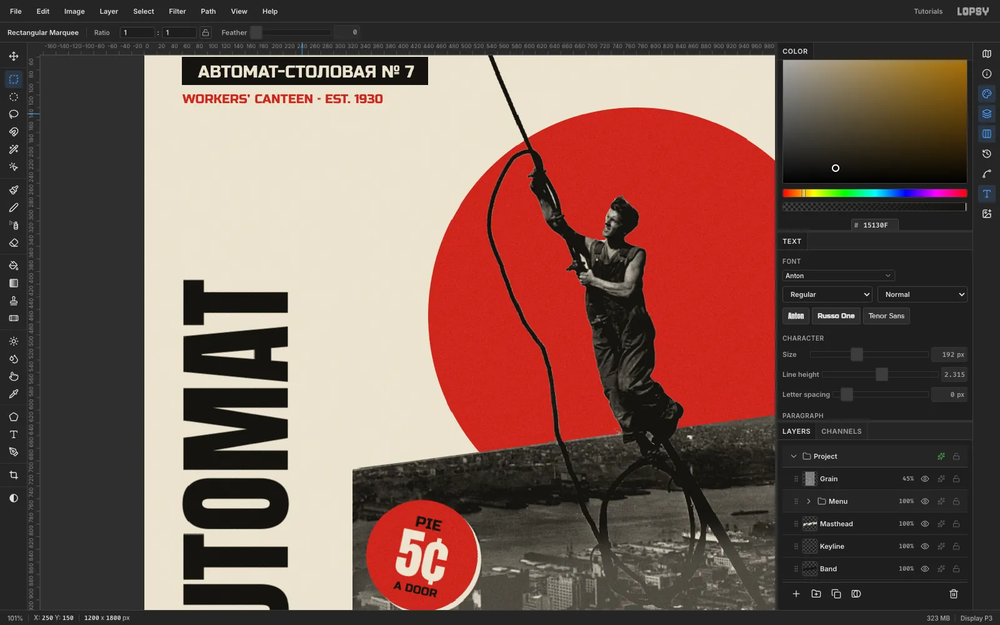

Select `Rules` before you set up each line, and set **Line height** to **1.4**.

1. **Nameplate:** `АВТОМАТ-СТОЛОВАЯ № 7` ("Automat-Canteen No. 7") in Russo One 26 px, paper, centred on the black bar. Russo One has Cyrillic, and pasting the text with [[Cmd+V]] is the most reliable way to enter it.
2. **Subline:** `WORKERS’ CANTEEN · EST. 1930` in Russo One 20 px, red, 14 px under the bar.
3. **Slogan:** `FUEL FOR THE BUILDERS OF TOMORROW` in Russo One 24 px, ink. Rasterize it, rotate it **−7.6°**, and tuck it under the band with its right end on the **1140** guide.
4. **Footer:** `34TH ST. & FIFTH AVE.  ·  OPEN 5 AM TO MIDNIGHT  ·  NICKELS AT EVERY DOOR` in Russo One 22 px, paper, centred in the footer bar.

To finish the structure, select `Sun` and [[Shift]]-click the `Photo` group, then choose **Layer → Group Layers** and call the group `Hero`. Now you can drag the whole sun-and-photo unit around to test the balance. [[Cmd+Z]] and [[Shift+Cmd+Z]] step it back and forth exactly.

## Print it on paper

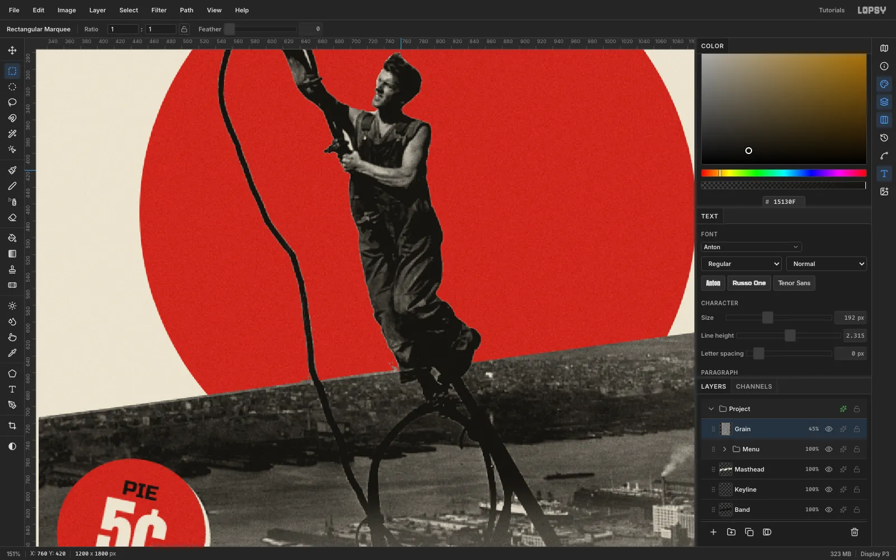

A flat red on flat cream still looks like a screen. Add a grain layer at the very top of the stack, above the `Menu` group:

1. Fill it with `#808080`.
2. Run **Filter → Add Noise…** at **100**, **Mono**, **Gaussian**.
3. Run **Gaussian Blur** at **1.2**, so the grain looks like paper tooth, not digital noise.
4. Set the layer to **Overlay** at **45%**.

Export with **File → Quick Export PNG**, and keep the layers with **File → Save Project**.
