Constructivist designers like Rodchenko, the Stenberg brothers and Klutsis
built covers from a few loud parts: a flat red disc, black machine
silhouettes, and heavy condensed type set vertically or on a steep diagonal.
Dziga Vertov's *kino-eye*, a camera lens drawn as a human eye, turns up again
and again.

In this tutorial you'll use that vocabulary for the cover of a made-up zine,
**Industrial Insomnia**, issue 07 of *The Night Shift Zine*. The eye can't close
because its iris is a clock stuck at 3 AM. You'll draw everything with
selections and the brush, build a gear by rotating pasted copies, and finish
with misregistered type and halftone print texture.

The palette is: cream `#ECE2C6`, red `#C62828` and ink black `#171514`.

## Create the zine canvas

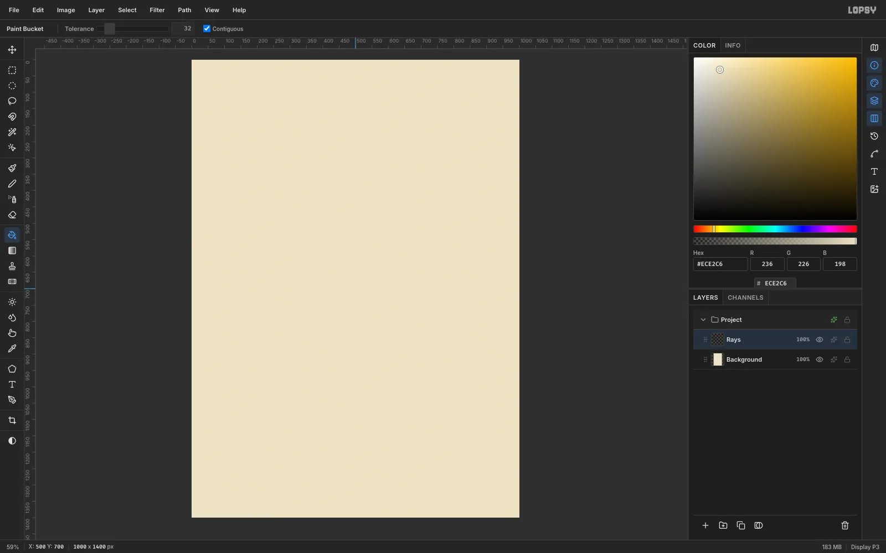

Open [Lopsy](/). In the **New Document** dialog, type `1000` for **Width** and
`1400` for **Height**, choose a **White** background, and click **Create**.
That's close to the A5 proportion most zines are printed at.

Select the **Background** layer and set the foreground to `#ECE2C6` in the
Color panel's hex field. Press [[G]] for the **Paint Bucket** and click the
canvas. Then double-click **Layer 1** and rename it `Rays`.

## Lasso a searchlight ray

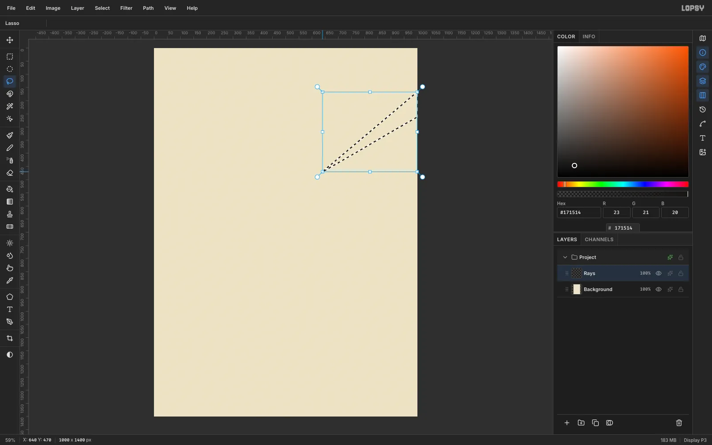

The rays will seem to shine out from behind the eye, so they all start at the
eye's centre, (640, 470). Press [[L]] for the **Lasso**. Press the mouse down
at that point, drag out past the right edge of the canvas at about y = 150,
come down to about y = 250, and drag back to the start.

Set the foreground to `#171514`, click inside the wedge with the Paint Bucket
and press [[Cmd+D]] to deselect.

## Add two more rays

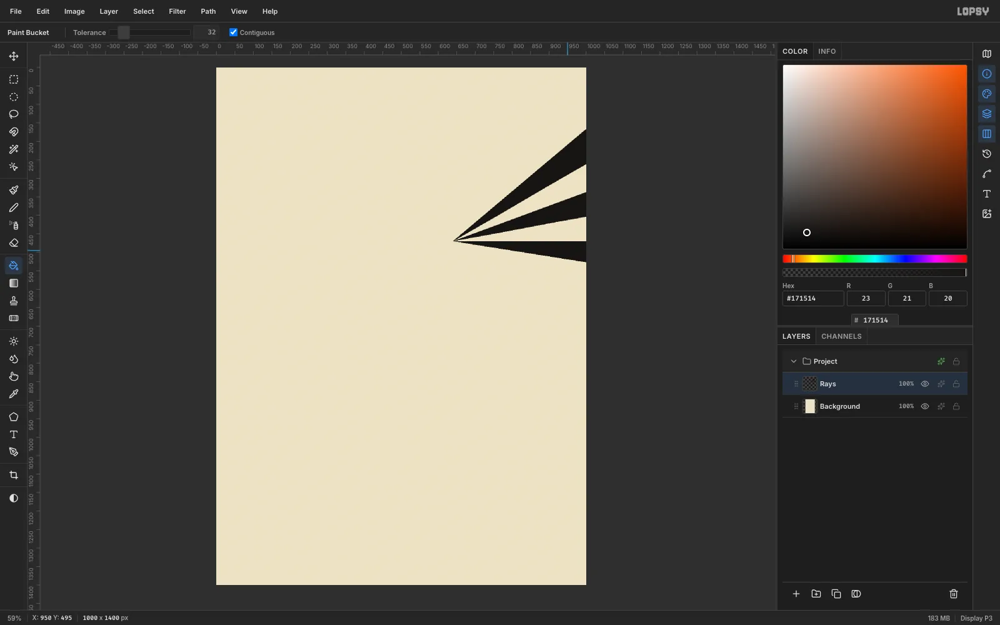

Lasso and fill two more wedges from the same point. The second one reaches the
right edge between y = 330 and 400, and the last, thinner one between y = 470
and 530. Rays of different widths look more dynamic than evenly spaced ones.

> **Tip:** The lasso always replaces the selection, so fill each wedge before
> you draw the next one. Click well inside a thin wedge. A bucket click outside
> the selection does nothing.

## Draw the red sun

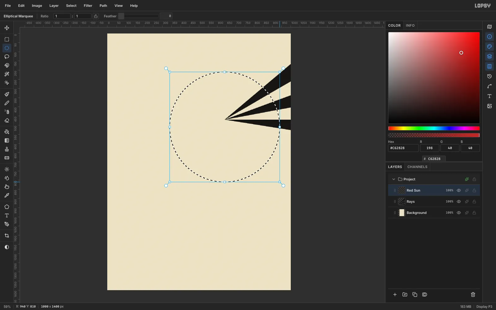

Click **Add Layer** and name it `Red Sun`. Pick the **Elliptical Marquee**,
hold [[Cmd]] and drag from (340, 210) to (940, 810) to make a perfect circle
600 px across. Set the foreground to `#C62828` and fill it with the Paint
Bucket. Press [[Cmd+D]].

The circle hides where the rays start, so they now seem to come out from
behind the sun.

## Add halftone dots to a copy

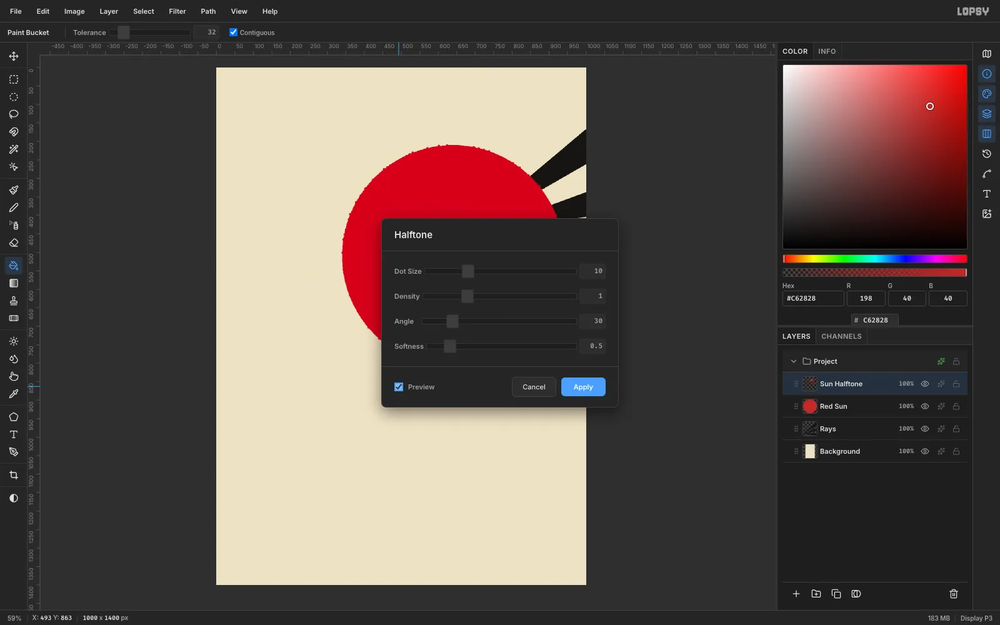

Click **Duplicate Layer** and rename the copy `Sun Halftone`. Choose
**Filter → Halftone…**, set **Dot Size** to `10`, **Angle** to `30` and
**Softness** to `0.5`, tick **Preview**, and click **Apply**.

## Trim the ragged edge

Halftone dots along the edge stick out past the circle. To trim them, draw the
same circle again with the Elliptical Marquee, press [[Cmd+Shift+I]] to invert
the selection, and press [[Delete]]. Deselect with [[Cmd+D]].

## Multiply the dots into the red

Open the layer's **Layer Effects** (the sparkle icon on its row), set the blend
mode to **Multiply**, and close the panel. Then set the layer's opacity to about
**45%**. The dots now read as ink texture, but the red still looks red.

## Lasso the eye

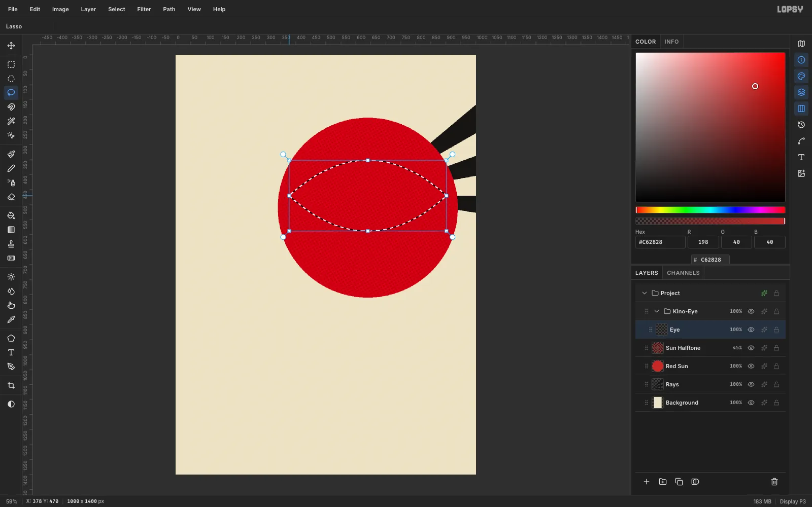

Select `Sun Halftone` and click **New Group** in the Layers panel. Name the
group `Kino-Eye` and add a layer inside it called `Eye`.

Lasso an almond shape centred on (640, 470), about 524 px wide and 236 px
tall. Trace two gentle arcs that meet in points at the left and right. Fill it
with cream `#ECE2C6`.

## Outline the eye with a Stroke effect

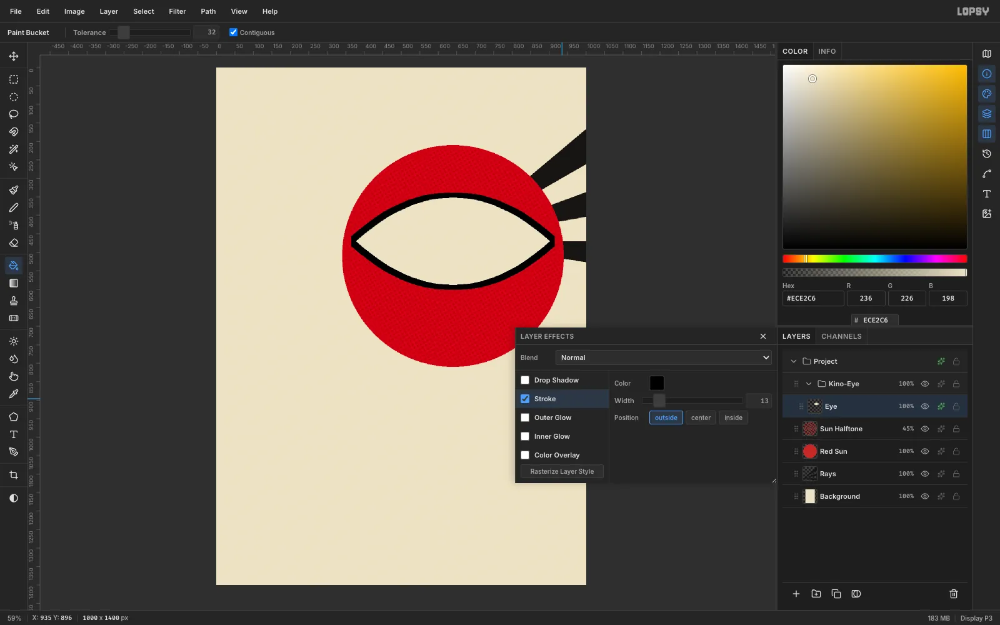

Open the `Eye` layer's **Layer Effects**, turn on **Stroke** and set **Width**
to `13`. The default black works. A live effect is easier to change later than
a painted outline.

## Shift-click the lashes

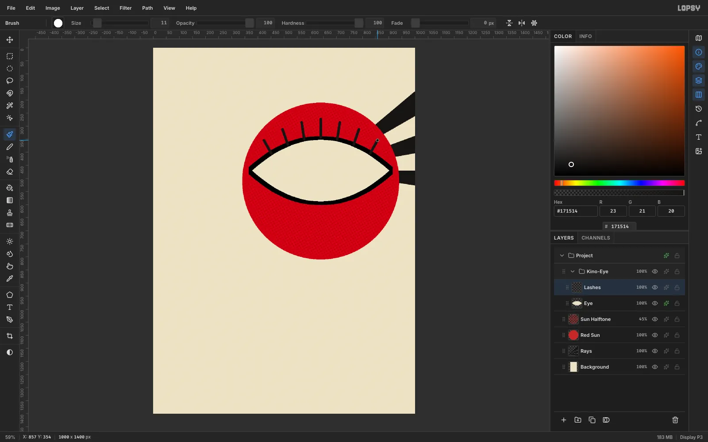

Add a `Lashes` layer. Press [[B]] for the **Brush** and set **Size** to `11`,
**Hardness** to `100` and **Opacity** to `100`, with the foreground black.

For each lash, click once on the upper lid. Then hold [[Shift]] and click
60–70 px further out, on a line pointing away from a spot below the eye. That
fans the seven lashes out like rays. Make the middle lashes a little longer
than the outer ones.

## Paint clock ticks with radial symmetry

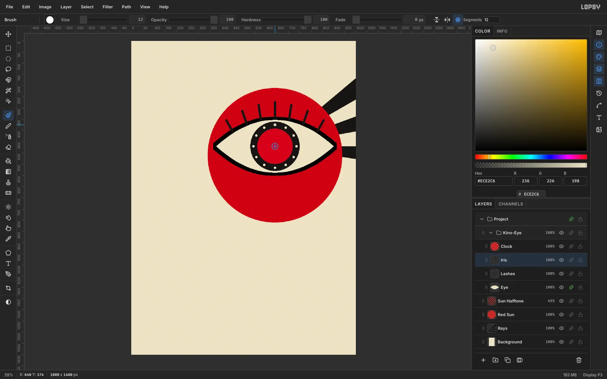

Add an `Iris` layer and fill a black circle 220 px across centred on the eye.
Add a `Clock` layer above it and fill a red circle 158 px across, also
centred.

Select `Iris` again and set the foreground to cream. With the Brush at **Size**
`12`, click the **Radial Symmetry** button in the options bar and change the
segment count to `12`. Hold [[Cmd]] and click the centre of the clock to move
the symmetry centre there. Then click once just inside the rim at 12 o'clock.
All twelve ticks appear at once.

Click **Radial Symmetry** again to turn it off before you go on. While it's on,
it takes over every [[Cmd]]+click.

## Set the hands to 3 AM

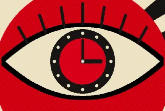

Select `Clock` and set the foreground to black. Use the brush's Shift-click line
trick again:

1. At **Size** `16`, click the centre, then Shift-click 60 px to the right for
   the hour hand.
2. At **Size** `10`, click the centre, then Shift-click about 72 px up for the
   minute hand.
3. Switch to cream and click once at the centre for a pivot dot.

## Rotate pasted copies into a gear

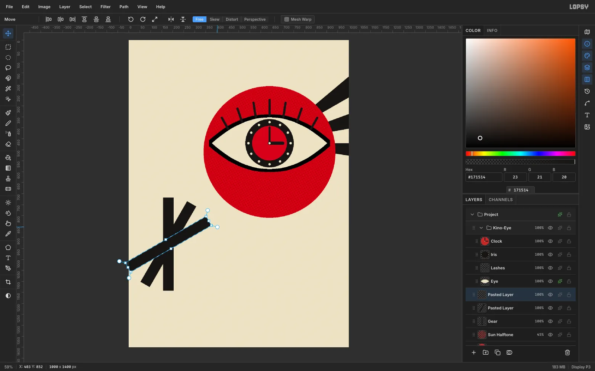

Select `Sun Halftone` and add a layer called `Gear`. It sits below the
Kino-Eye group. Make a rectangular marquee 48 × 424 px with its top-left at
(156, 718) and fill it black. That bar is two opposite teeth. Press
[[Cmd+C]] to copy it and [[Cmd+D]] to deselect.

Press [[Cmd+V]]. The copy is pasted in place on a new layer. Draw the same
marquee over it, press [[V]] for **Move**, hold [[Cmd]] and drag a round
rotation handle. [[Cmd]] snaps the rotation to 15° steps, so stop at **30°**.
Press [[Enter]], then [[Cmd+D]].

## Finish the ring of teeth

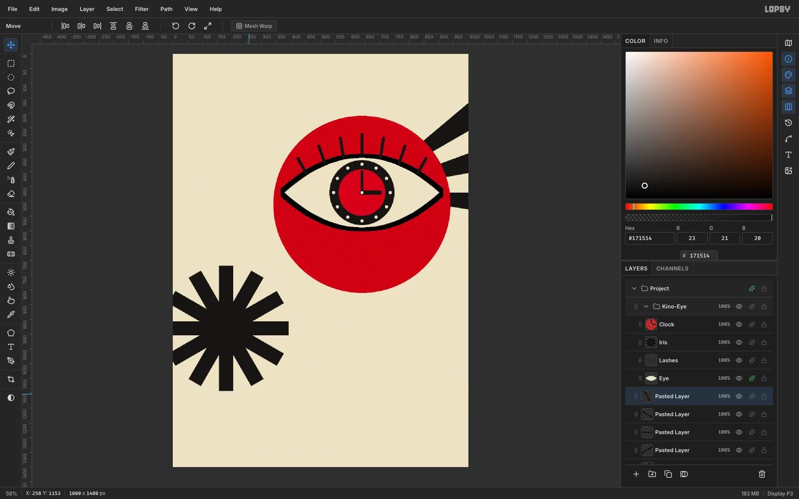

Repeat the paste, marquee and rotate for **60°, 90°, 120° and 150°**. Six
crossed bars give you twelve evenly spaced teeth.

> **Tip:** Draw the marquee again after every paste. Without a selection, a
> drag on the canvas moves the layer instead of rotating it.

## Add the hub and axle hole

Choose **Layer → Merge Down** five times to merge all the copies into `Gear`.
Make an elliptical marquee 330 px across centred on (180, 930) and choose
**Edit → Fill** to fill the hub. Then make a 110 px circle in the same centre
and press [[Delete]] to punch out the axle hole.

The teeth on the left run off the canvas. A cropped machine part feels bigger
than one shown whole.

## Lasso the diagonal band

Add a layer called `Band`. Lasso a band that rises about **15°** from left to
right, with corners at (0, 1150), (1000, 870), (1000, 1080) and (0, 1360), and
fill it black. The bottom of the gear now tucks behind the band.

## Type INSOMNIA on the band

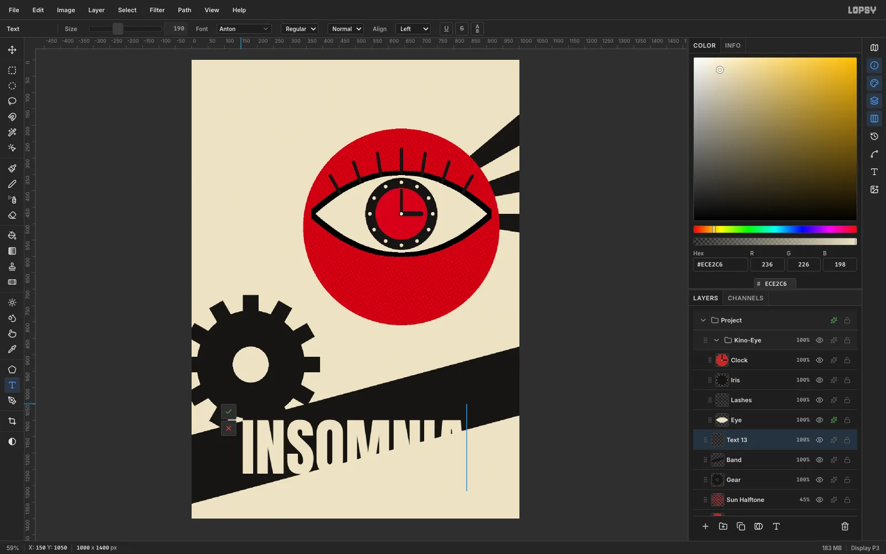

Press [[T]] for the **Text** tool. Open the font browser, search for **Anton**
and click it. Set **Size** to `190` and the foreground to cream. Click on the
band at about (150, 1050) and type `INSOMNIA`. Press [[Tab]] to commit.

Typing over the black band means you can see the cream letters while you work
on them.

## Rotate the headline to the band's angle

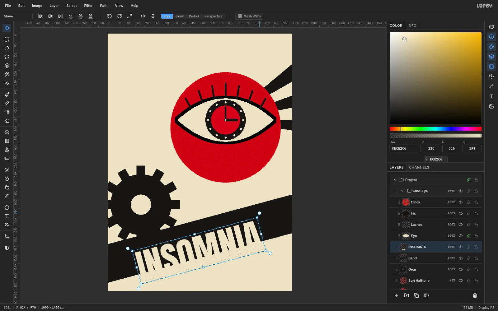

Click **Rasterize Layer** at the bottom of the Layers panel. Draw a rectangular
marquee around the word and press [[V]]. Hold [[Cmd]] and drag a rotation
handle to **−15°**, press [[Enter]], then [[Cmd+D]].

Then drag the word with the **Move** tool until it sits centred on the band,
with its middle at about (520, 1117).

## Build a red misregistration

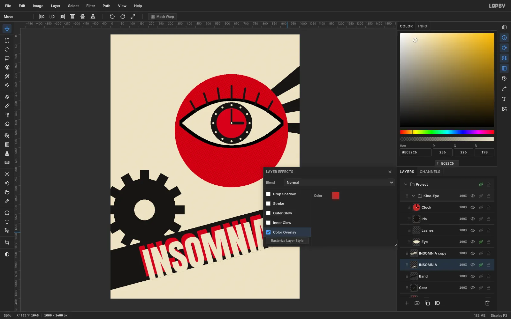

Old two-colour presses rarely lined the plates up exactly. To fake that, click
**Duplicate Layer** and move the copy until it sits **9 px right and 9 px
down** from the original. Then select the original INSOMNIA layer underneath,
open its **Layer Effects**, turn on **Color Overlay** and set the colour to
`#C62828`.

## Check the offset

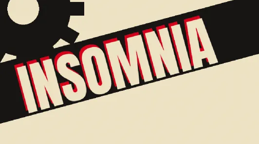

The red shows only along the top and left of each letter, like a plate that
slipped during the print run. If the edge looks too thick, move the cream copy
a few pixels back towards the original.

## Lasso the factory roof

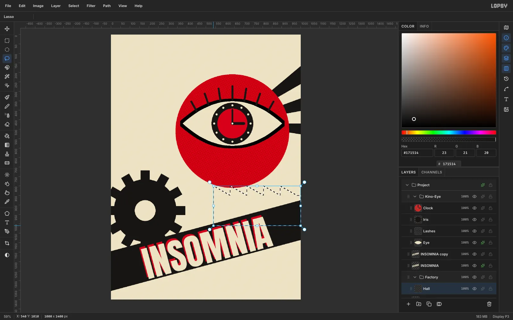

Select `Band` and click **New Group**. Name it `Factory`. It goes in above the
band but below the headline, so the letters stay on top. Add a `Hall` layer
inside it.

Lasso a sawtooth roofline. Start at (540, 1010), go up to (540, 850), then zig
up and down five times: up to y = 800, and back down to y = 850 every 88 px.
Finish at the right edge and come back down to y = 1010. Fill it black.

## Add windows and chimneys

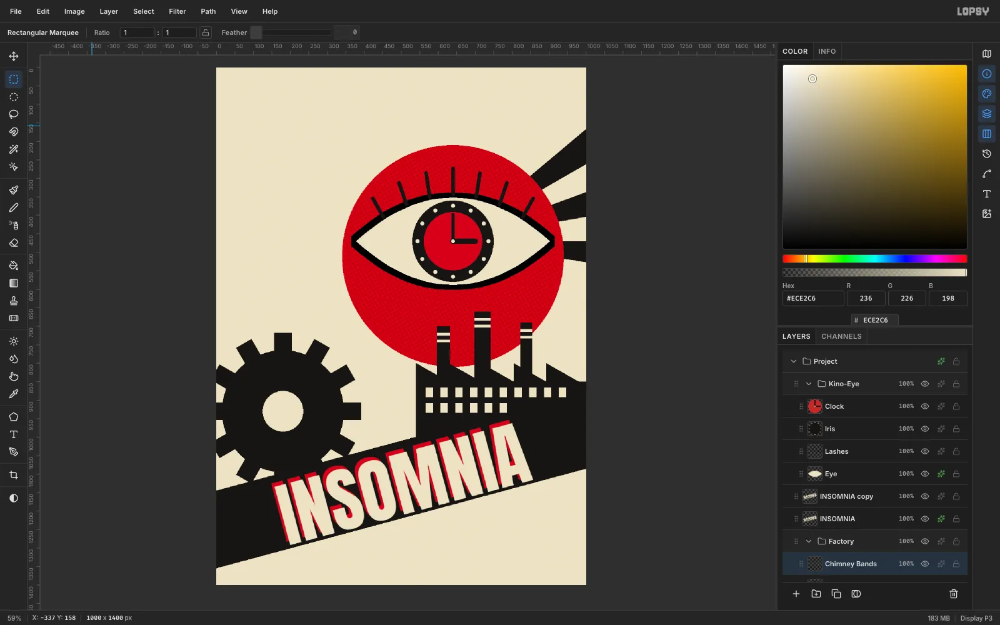

Add these layers inside the Factory group:

- `Windows`: cream 20 × 26 px rectangles every 40 px, in two rows at y = 866
  and y = 908. Marquee each one and use **Edit → Fill**.
- `Chimneys`: three black rectangles down to y = 860. Make them 36, 44 and
  32 px wide, starting at x = 596, 698 and 822, with their tops at y = 700,
  660 and 690.
- `Chimney Bands`: two thin cream stripes near the top of each chimney.

The chimneys stand in front of the sun, which gives the cover its depth.

## Puff out cream steam

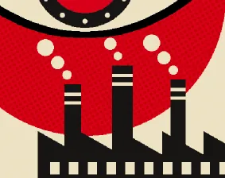

Add a `Steam` layer at the top of the Factory group. Above each chimney, fill
two or three cream circles with the Elliptical Marquee. Start at about 20 px
across and make each one bigger as it rises up and to the left.

Flat, stepped puffs suit the style better than soft, brushed smoke, and cream
on red is the cover's strongest contrast.

## Set INDUSTRIAL vertically

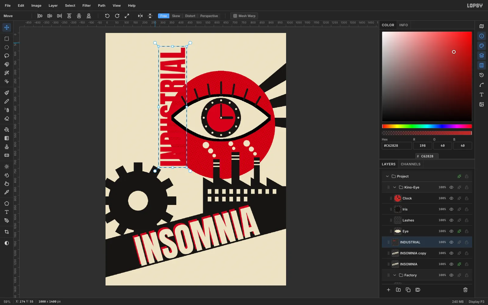

Select the top INSOMNIA layer so the new text goes in above it. Set the
foreground to red and the Size to `160`. Click at (40, 300) in the empty
top-left area, type `INDUSTRIAL`, and press [[Tab]].

Rasterize it, marquee it, and rotate it **−90°** so it reads from bottom to
top. Press [[Enter]], then move it to the left edge, from about y = 20 down to
y = 676. That leaves a clear gap above the gear's top tooth.

## Outline the issue number

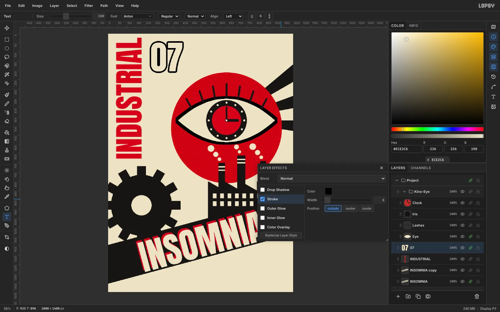

Set the Size to `180` and the foreground to cream. Click at (228, 2) and type
`07`, then press [[Tab]] and rasterize it. Open its **Layer Effects** and turn
on **Stroke** with **Width** `8`.

The number is cream on cream, so all you see is the black outline. It's clearly
readable but stays lighter than INDUSTRIAL.

## Build the masthead

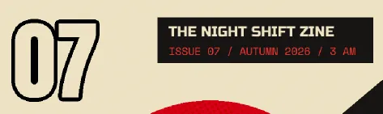

Add a `Masthead` layer and fill a black rectangle 450 × 96 px with its top-left
at (530, 36). Then set two lines of type inside it:

1. `THE NIGHT SHIFT ZINE` in cream **Russo One** at Size `30`, clicked in at
   (552, 46).
2. `ISSUE 07 / AUTUMN 2026 / 3 AM` in **Space Mono** Regular at Size `22`, in a
   brighter red `#E0463A`, clicked in at (553, 92).

Rasterize each line when you finish it.

> **Tip:** Wait for the canvas to show the new font before you click
> **Rasterize Layer**. Text committed while a font is still downloading keeps
> the fallback face, and rasterizing bakes it in. If that happens, change the
> Size by 1 to re-render the text.

## Rotate the slogan

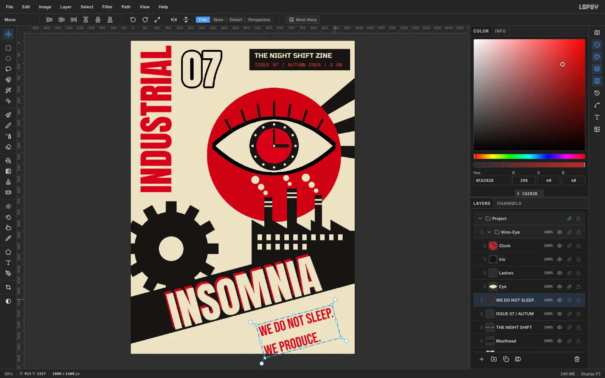

Switch to **Bebas Neue** at Size `64` in red. Click at (580, 1215), type
`WE DO NOT SLEEP.`, press [[Enter]], and type `WE PRODUCE.`. Press [[Tab]] and
rasterize the layer.

Marquee the two lines and rotate them **−15°** so they run parallel to the
band. Then move them up and right until they sit in the cream triangle under
the band, with a clear margin above the bottom of the canvas.

## Add paper grain

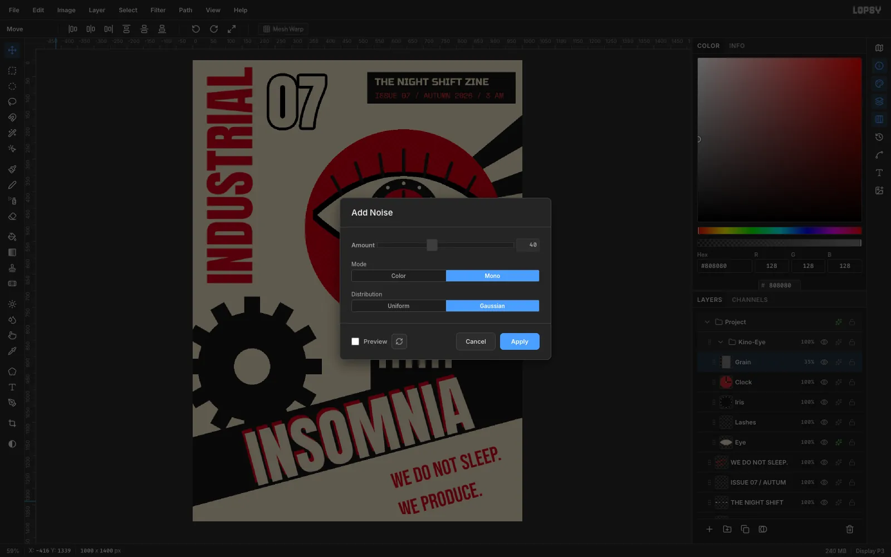

Select `Clock` and add a layer called `Grain`. Set the foreground to `#808080`,
press [[Cmd+A]], and choose **Edit → Fill**. Then choose
**Filter → Add Noise…**, set **Amount** to `40`, pick **Mono** and
**Gaussian**, and click **Apply**.

Set the Grain layer's blend mode to **Overlay** and its opacity to about
**35%**. Mid-grey disappears in Overlay, so only the speckle is left. That's
enough to make the flat inks look printed.

## Export the finished cover

Choose **File → Quick Export PNG** to export the cover, and **File → Save
Project** to keep an editable `.lopsy` file with all the layers and groups.

For a follow-up issue, keep the grid and change the hero. Try a megaphone in
the disc, a different time on the clock, or a second band running the other
way. For another take on the same style, see
[the propaganda poster invitation](/tutorials/propaganda-poster-party-invitation/).
