A tattoo flash sheet is a sales page: a bordered sheet of ready-to-tattoo
designs, each with a number a client can point at. Flash traditionally uses
bold outlines and a few flat colours. In this tutorial you'll give it a
**holographic** finish instead. Every design is filled with a foil ramp that
runs cyan → magenta → violet → mint → yellow, and a dark nebula makes the
colours glow.

The theme is **COSMIC X-RAY**: bones you'd see on an x-ray light box, mixed
with space. You'll draw an x-ray skull with a comet, a skeletal hand holding
a crescent moon, a heart inside a ribcage with a shooting star, and a ringed
planet. Nearly every shape is a Lasso or marquee selection filled with a
gradient. Selections, layer effects and copy / paste do the rest.

The palette:

- Ink ground `#0B0720`, outline ink `#120A2E`
- Foil ramp `#22E8FF` → `#FF3FD8` → `#7B4DFF` → `#3DFFC8` → `#FFE45C`
- Pastel foil (bones and badges) `#B8F7FF` → `#FFB3F0` → `#C9B6FF` → `#B3FFE6` → `#FFF3B0`

## Lay down the ink ground and a foil wash

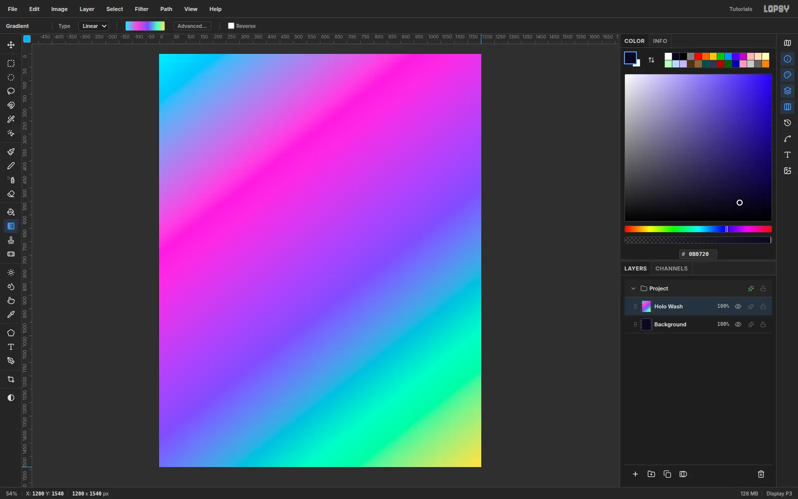

Choose **File → New**, enter **1200 × 1540** (close to the classic 11 × 14
inch flash sheet) and click **Create**. Click the **Background** row, set the
foreground to `#0B0720` and choose **Edit → Fill**.

Double-click **Layer 1**, rename it **Holo Wash**, and pick the **Gradient**
tool. Click **Advanced…** and set five stops: `#22E8FF` at 0%, `#FF3FD8` at
30%, `#7B4DFF` at 58%, `#3DFFC8` at 80% and `#FFE45C` at 100%. Drag a
**Linear** gradient from the top-left corner to the bottom-right corner.

## Turn the wash into a nebula

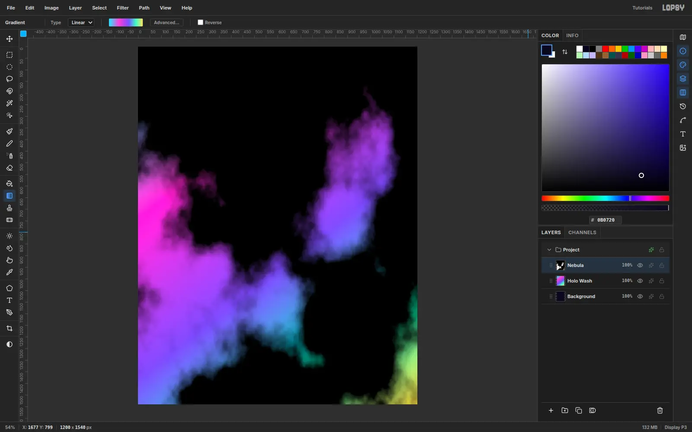

Add a **Nebula** layer and run **Filter → Clouds…** at **Scale 4**. Then
run **Filter → Brightness/Contrast…** with **Brightness −45** and
**Contrast 90**, so most of the cloud goes black and only wisps stay bright.
Open the layer's effects and set **Blend** to **Multiply**. The foil wash
now only shows through the wisps.

## Scatter a star field

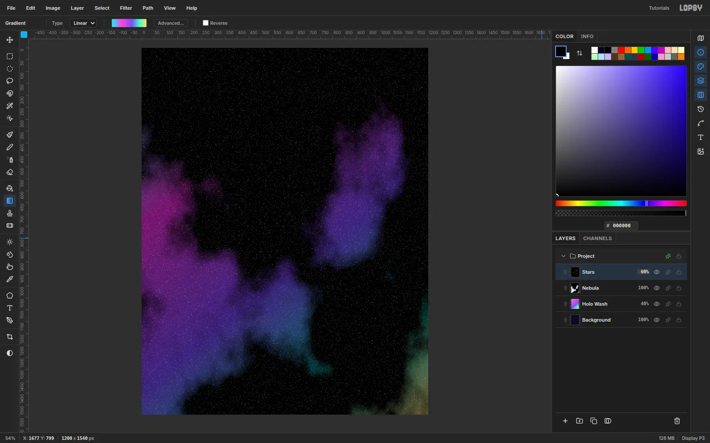

First set **Holo Wash** to **40%** opacity, so the colour stays in the
background. Then add a **Stars** layer, fill it black, and run **Filter → Add Noise…** with
**Amount 100** and **Mono**. Then run **Filter → Threshold…** at **Level 48**.
Only the brightest noise grains survive, and they become stars. Set the layer
to **Screen** at **60%**, so the black disappears and only the stars stay.

## Build the double foil border

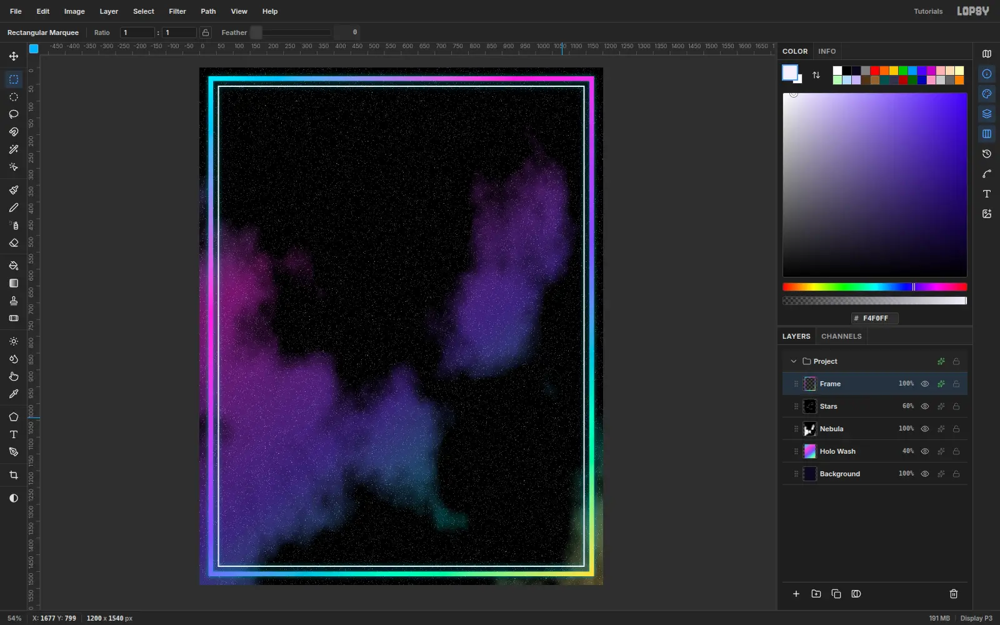

Add a **Frame** layer. Marquee **1148 × 1488** at **(26, 26)** and drag the
foil gradient corner to corner. Press [[Cmd+D]], marquee **1120 × 1460** at
**(40, 40)** and press [[Delete]]. That leaves a 14 px band.

For the inner rule, marquee **1092 × 1432** at **(54, 54)**, fill it with
`#F4F0FF`, choose **Select → Shrink…** with **3 px**, and press [[Delete]].
Add an **Outer Glow** in `#22E8FF` (**Size 18**, **Opacity 55**). Then click
**Rasterize Layer Style** to bake it in: glows are recalculated every time the
canvas redraws, and a flash sheet ends up with a lot of them.

> **Tip:** Always press [[Cmd+D]] before starting a new marquee. Dragging
> from *inside* an existing selection moves that selection instead of drawing
> a new one.

## Place guides for a 2 × 2 layout

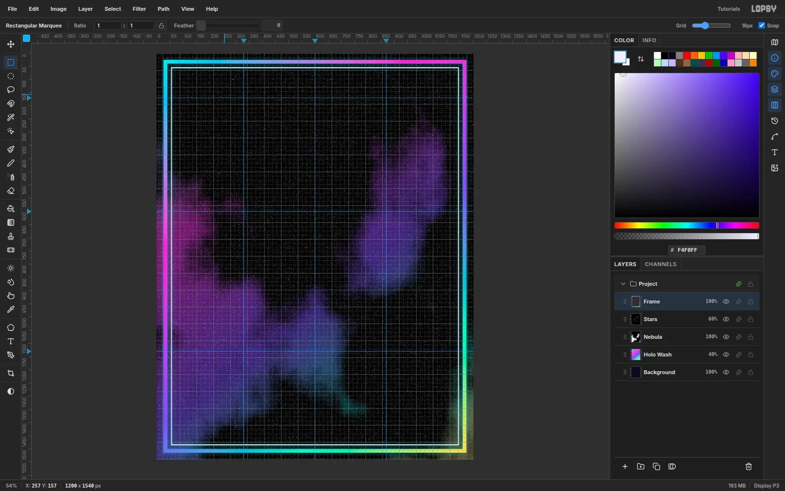

Click the top ruler at **x 330**, **600** and **870**, and the left ruler at
**y 170**, **600** and **1130**. Those are the column centres, the sheet's
middle, the banner line and the two row centres. Turn on **View → Show Grid**
with an **8 px** grid for later alignment, then turn it off again while you
draw freehand shapes.

## Cut the ribbon's swallowtails

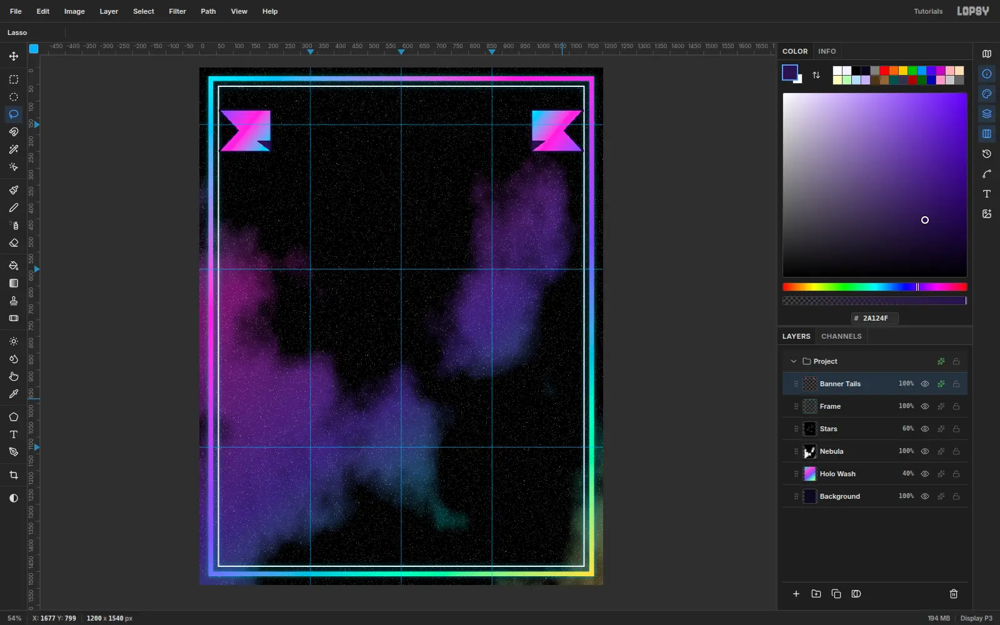

Add a **Banner Tails** layer. With the **Lasso** (L), click out a swallowtail:
(210, 128), (62, 128), (118, 188), (62, 248), (210, 248). Fill it with a
**Linear** `#7B4DFF` → `#FF3FD8` → `#22E8FF` gradient, and repeat the tail
mirrored on the right. Lasso a small triangle under each inner end
((170, 218), (210, 218), (210, 248)) and fill it with `#2A124F`. That's the
fold where the ribbon turns behind itself. Add a 6 px `#120A2E` **Stroke**.

## Lay the ribbon band over the tails

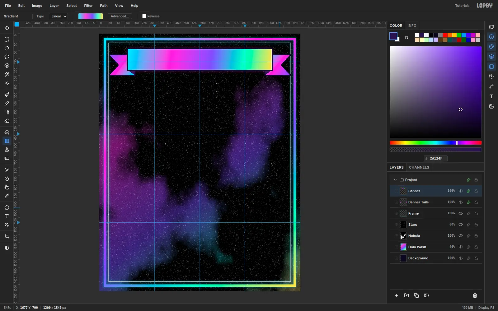

Add a **Banner** layer, marquee **860 × 126** at **(170, 92)** and drag the
five-stop foil gradient across it. Give it a 7 px ink **Stroke**, a white
**Inner Glow** (**Size 14**, **Opacity 70**) for a chrome edge, and a
`#FF3FD8` **Outer Glow** (**Size 30**, **Opacity 60**). Rasterize the style on
both ribbon layers.

## Set the title in Rye

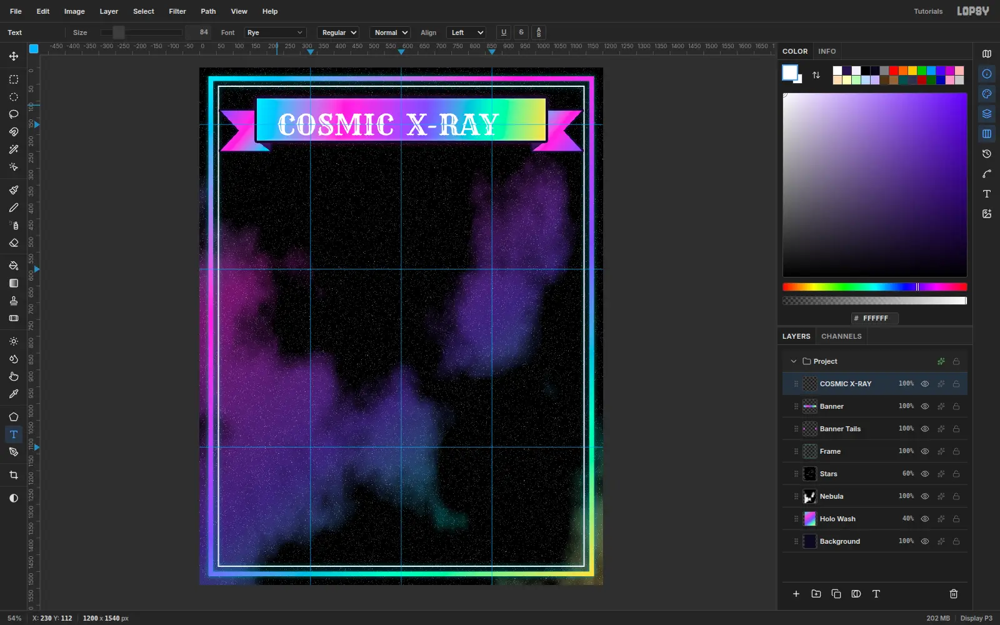

Choose the **Text** tool (T), set **Size 84** and pick **Rye** in the font
browser. Its spurred Western capitals look like hand-painted flash lettering.
With white as the foreground, click on the ribbon and type `COSMIC  X-RAY`
with **two** spaces. Rye's space is narrow, and a single one runs the words
together. Press [[Tab]] to commit.

## Recolour the type in ink

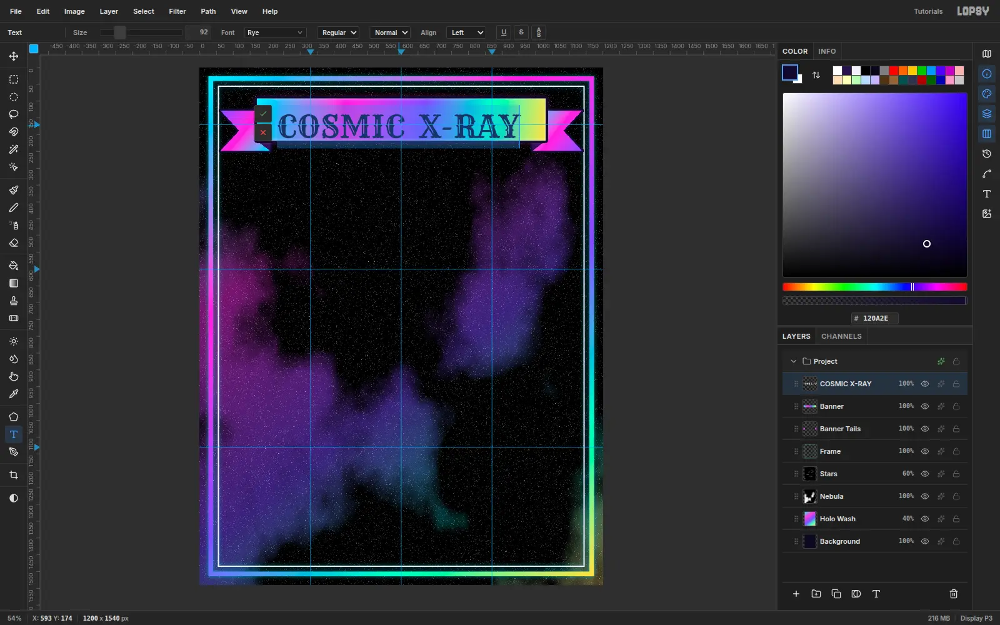

White on a bright foil band is hard to read. Raise **Size** to **92**, click
into the title with the Text tool, press [[Cmd+A]] to select every letter,
and set the foreground to `#120A2E`. The selected text takes the new colour.
Press [[Tab]] to commit.

## Seat the title in the ribbon

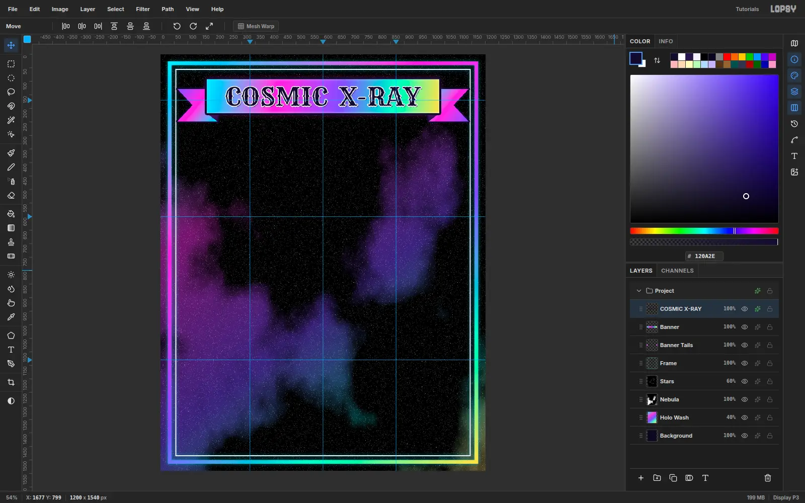

Switch to **Move** (V) and nudge the title with the arrow keys (hold
[[Shift]] for 10 px) until the letters sit in the middle of the band. That's about 70 px from each end
of the band, and 27 px above and below the caps.
Add a white **Stroke** of **3** and a `#2A124F` **Drop Shadow** with
**Offset 4 / 4**, **Blur 0** and **Opacity 55**. The white keyline separates
the ink from the foil, and the hard offset shadow reads as a printed sticker.

## Launch a comet

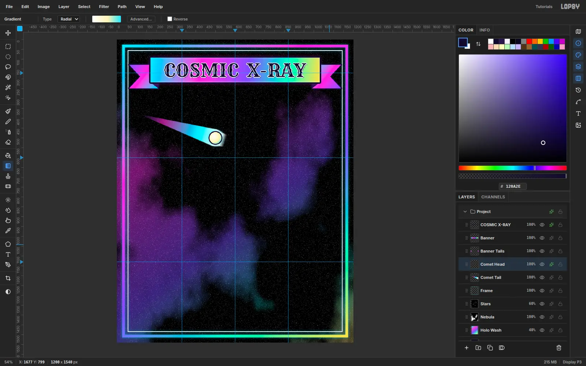

Add a **Comet Tail** layer. Lasso a long tapered wedge from **(500, 500)** to
**(115, 380)**, about 88 px wide at the head. Fill it with a **Linear**
gradient from the head to the tip: white, `#22E8FF` at 25%, `#FF3FD8` at 70%
(alpha 60%), and `#7B4DFF` at 0% alpha. Press [[Cmd+D]] and run
**Filter → Motion Blur…** at **Angle 17**, **Distance 24**.

On a **Comet Head** layer, fill a 60 px circle at (500, 500) with a
**Radial** white → `#FFF3B0` → `#22E8FF` gradient. Give it a 5 px ink
**Stroke** and a `#22E8FF` **Outer Glow** (**Size 40**, **Opacity 90**).

## Draw the skull

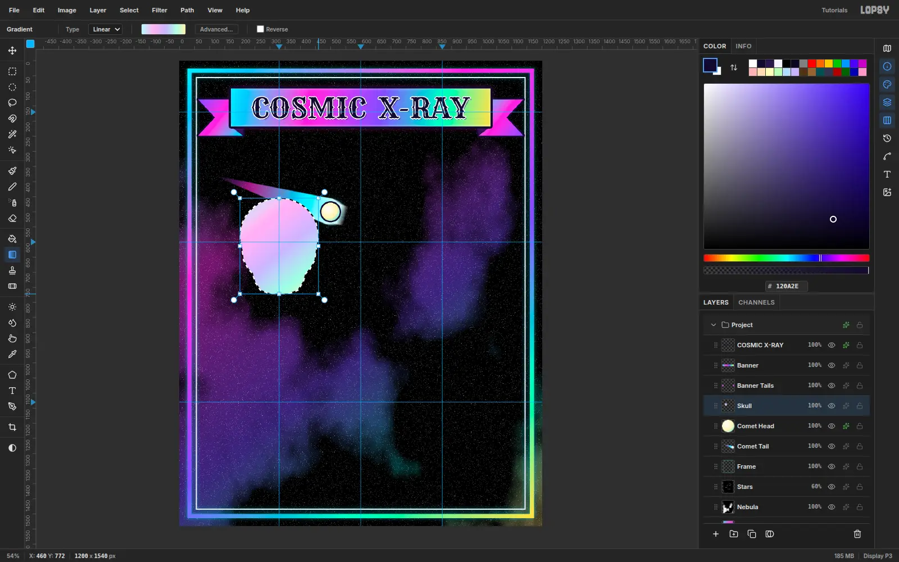

Add a **Skull** layer. Lasso a skull centred on **(330, 620)**: a domed
cranium 260 px wide, cheekbones that flare at y 690, and a jaw that narrows
to a 60 px chin at y 772. Fill it with the pastel foil diagonally from the
top-left. A lighter ramp keeps bone looking like bone. Add a 7 px ink
**Stroke** and a `#7B4DFF` **Inner Glow** (**Size 34**, **Opacity 80**) so
the edges darken like an x-ray.

## Cut in the eyes, nose and teeth

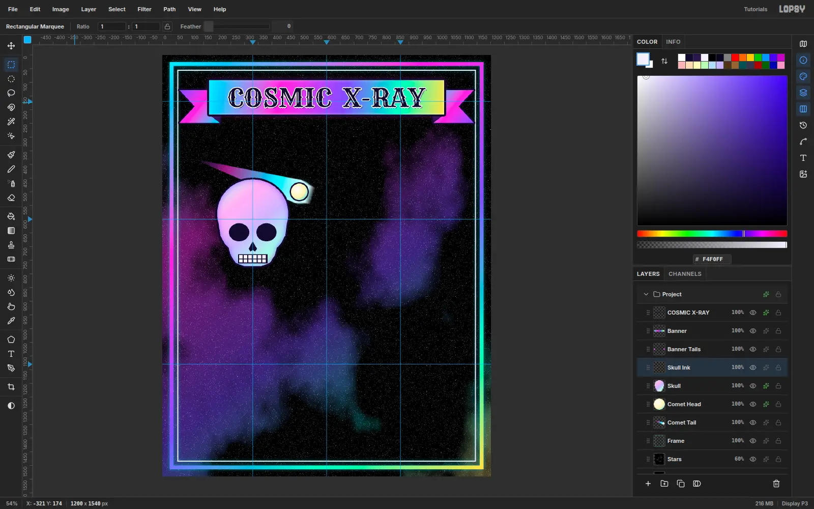

On a **Skull Ink** layer, use the **Elliptical Marquee** to fill two
74 × 66 eye sockets at (280, 648) and (380, 648) with ink. Lasso a spade
shape for the nose. Marquee a 108 × 34 mouth at (276, 728) and fill it. Then
fill two rows of 13 px `#F4F0FF` squares, 17 px apart, for the teeth.

## Trace the x-ray sutures

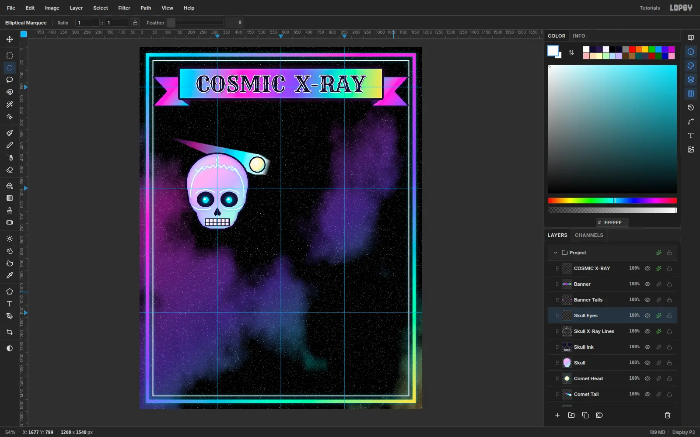

Add a **Skull X-Ray Lines** layer and pick the **Brush** (B) at **Size 5**,
**Hardness 100**, in white. Click where a line starts, then
[[Shift]]-click each next point. Each click draws a straight segment from the
last one, so you can build the zig-zag coronal suture across the crown, the
temple curves, and arcs over the brows and cheekbones point by point. Give
the layer a `#22E8FF` **Outer Glow** (**Size 16**, **Opacity 90**).

On a **Skull Eyes** layer, fill a 26 px cyan circle in each socket with a
small white catch-light, and add a cyan **Outer Glow** (**Size 26**).

> **Tip:** Hold the pointer still for about 1.5 s mid-stroke and Lopsy
> smooths the stroke into a clean line or curve, which also ends it.
> Shift-click chains avoid that for deliberate, jointed linework.

## Shape the hand

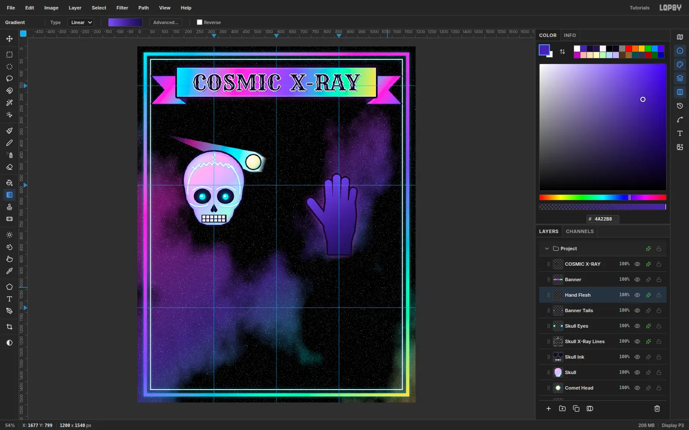

Select **Banner Tails** so new layers land outside the skull, and add a
**Hand Flesh** layer. Lasso a palm around (870, 670), then lasso a capsule
for each finger and the thumb, filling each with `#4A22B8`. The overlaps
merge into one hand. [[Cmd]]-click the layer thumbnail to select its shape,
and drag a diagonal `#7B4DFF` → `#3A1C8C` → `#1C0E4A` gradient from the
upper left, the same light direction as the skull. Add a 7 px ink **Stroke**
and a `#FF3FD8` **Outer Glow** (**Size 30**, **Opacity 85**).

## Add jointed bones

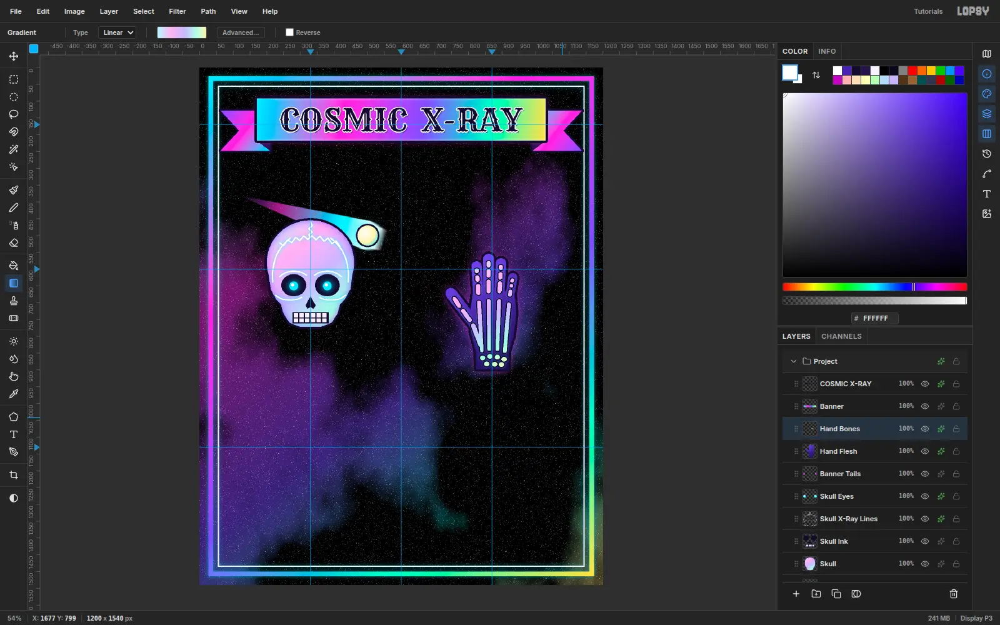

On a **Hand Bones** layer, lasso-fill thin white capsules: three phalanges
per finger with a 6 px gap at every joint, four metacarpals fanning to the
wrist, three thumb bones, and seven small round carpals. [[Cmd]]-click the
thumbnail and refill the bones with the pastel foil, then give them a 3 px
ink **Stroke** and a cyan **Outer Glow**. The dark gaps are what make it read
as an x-ray rather than a glove.

## Rest a crescent moon on the fingertips

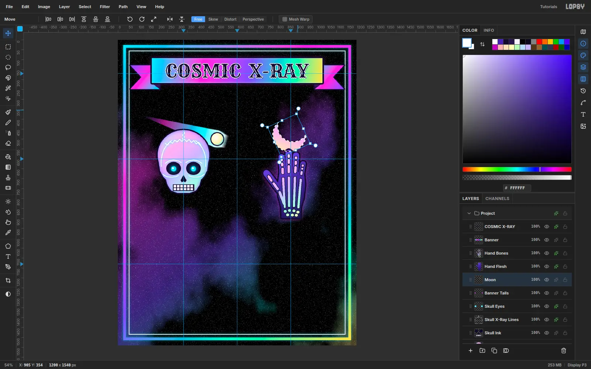

Select **Banner Tails** again and add a **Moon** layer, so the fingertips
overlap the moon. Fill a 168 px circle at (864, 480) with a
`#FFF3B0` → `#FFB3F0` → `#22E8FF` gradient. Then select a 152 px circle
offset up and right (centre (898, 450)) and press [[Delete]] to bite out the
crescent. [[Cmd]]-click the thumbnail, switch to **Move**, and drag a corner
**rotation handle** about **25°** anticlockwise so the horns cradle the
fingertips. Press [[Cmd+D]], then add an ink **Stroke**, a white **Inner
Glow** and a pale yellow **Outer Glow**.

## Group the first two designs

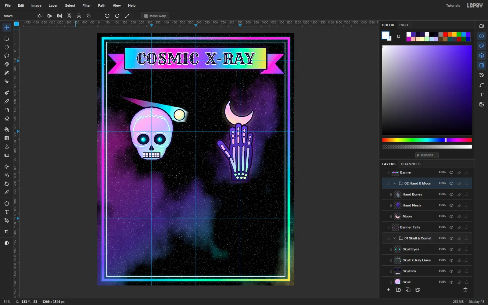

Rasterize the layer styles you've finished. Click **Comet Tail**,
[[Shift]]-click **Skull Eyes** and choose **Layer → Group Layers**. Name the
group **01 Skull & Comet**. Do the same for **Moon** to **Hand Bones** as
**02 Hand & Moon**. Each flash design is now one unit you can move.

## Fill the heart

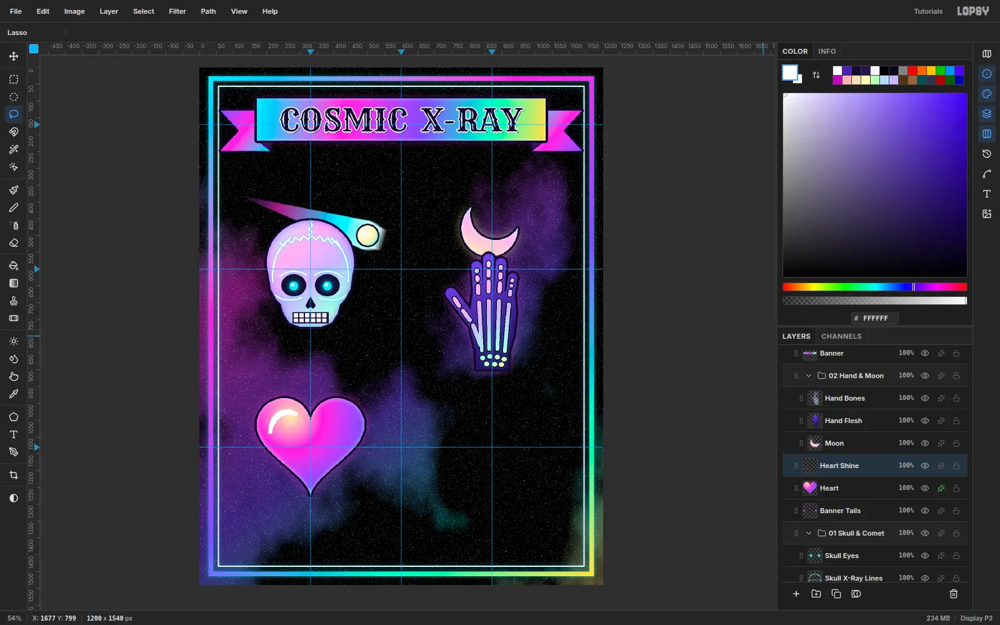

Add a **Heart** layer and lasso a classic heart centred at (330, 1103),
320 px wide. Drag a **Radial** gradient from (270, 1040) out to (480, 1280)
with `#FFF3B0`, `#FF3FD8` at 30%, `#7B4DFF` at 68% and `#22E8FF`. Add a 7 px
ink **Stroke**, a white **Inner Glow** and a `#FF3FD8` **Outer Glow**. On a
**Heart Shine** layer, fill a curved kidney-shaped glint on the left lobe in
white and set it to **Screen**.

## Wrap it in a ribcage

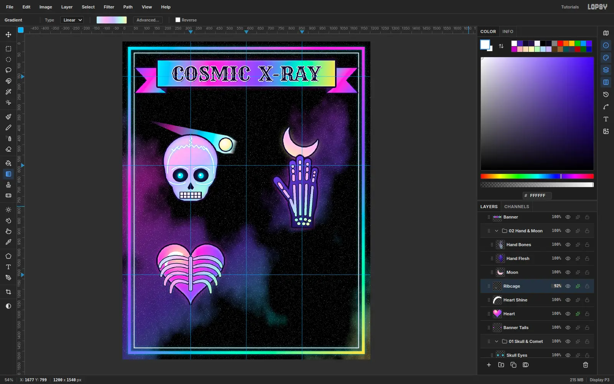

On a **Ribcage** layer, fill a vertical sternum capsule, then four pairs of
curved, tapering rib bands that sweep out and down from it. Each rib is one
Lasso selection. [[Cmd]]-click the thumbnail, refill with the pastel foil, and
add a 3 px ink **Stroke** and a cyan **Outer Glow**. At **92%** opacity the
heart glows faintly through the bone.

## Add a shooting star

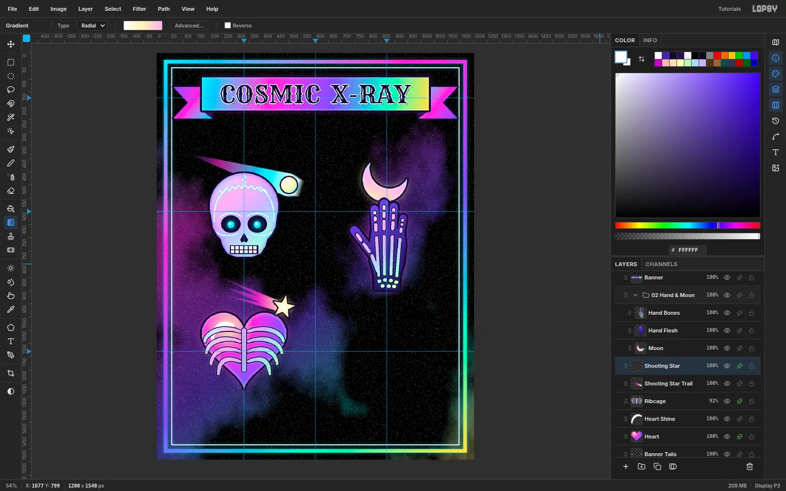

On a **Shooting Star Trail** layer, lasso three thin wedges from (470, 962)
up-left toward (240, 880), and fill each with `#FFF3B0` → `#FF3FD8` (alpha
80%) → `#7B4DFF` (alpha 0). Add **Motion Blur** (**Angle 19**,
**Distance 14**). On a **Shooting Star** layer, lasso a five-point star at
(480, 962) and fill it with a radial white → `#FFF3B0` → `#FFB3F0` gradient.
Add an ink **Stroke** and a warm **Outer Glow**. Group the heart layers as
**03 Heart & Star**.

## Shade a banded planet

Click **Banner Tails** so the planet starts outside group 03, and add a
**Planet** layer. Fill a 236 px circle at (870, 1140) with a **Radial**
gradient from the upper left: white, `#B8F7FF`, `#C9B6FF`, `#FF3FD8`,
`#3A1C8C`. Pick **Dodge / Burn** (O), set **Mode: Burn**, **Exposure 16** and
**Size 110**, and drag once along the lower-right edge to turn the sphere away
from the light.

On a **Planet Bands** layer, lasso four slanted bands across the planet in
`#7B4DFF`. To clip them, click the **Planet** row, [[Cmd]]-click its
thumbnail, click back on **Planet Bands**, choose **Select → Inverse** and
press [[Delete]]. Set the bands to **Multiply** at **45%**.

## Tilt the ring

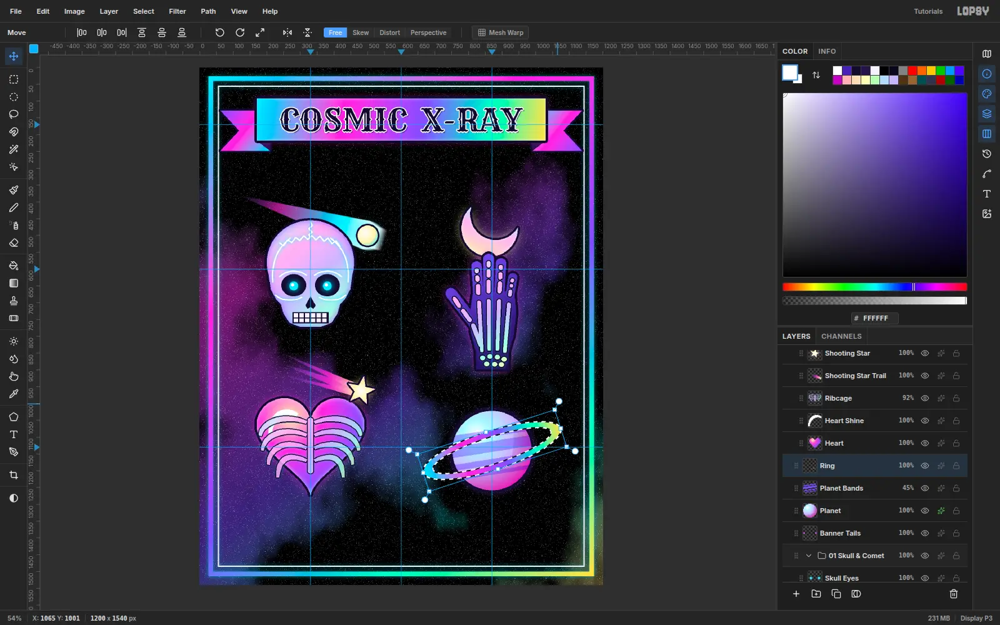

Add a **Ring** layer. Fill a 430 × 116 ellipse centred on the planet in
white, then select a 368 × 80 ellipse at the same centre and press
[[Delete]]. [[Cmd]]-click the thumbnail and drag the foil gradient across it
left to right. With the selection still active, use the **Move** tool's
rotation handle to tilt the ring about **18°** anticlockwise.

## Erase the back of the ring

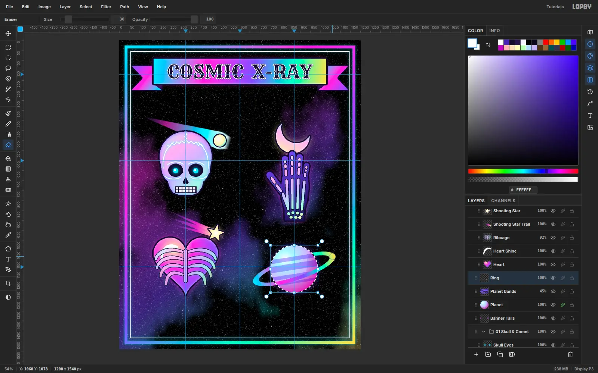

Now the ring needs to pass *behind* the planet. Click the **Planet** row,
[[Cmd]]-click its thumbnail, then click back on the **Ring** row. The
planet's shape is now the selection, and the Ring layer is active. Pick the
**Eraser** (E) at **Size 30**, click at the left end of the ring's upper arc,
and [[Shift]]-click along it to the right end. The selection keeps the eraser
inside the disc, so only the back arc over the planet disappears.

Add an ink **Stroke** and a cyan **Outer Glow** to the ring. Add a 44 px
**Moonlet** at its upper right. Then group **Planet** to **Moonlet** as
**04 Ringed Planet**.

> **Tip:** Load the selection *from the Planet row* and then switch layers.
> If you [[Cmd]]-click Planet's thumbnail while Ring is active, the first
> eraser dab swaps the selection for Ring's own shape.

## Number the designs

Flash numbers let a client say "number 3, please". Add a **Badge 1** layer,
fill a 54 px circle at (112, 302) with the pastel foil, and give it an ink
**Stroke** and a cyan **Outer Glow**. Rasterize the style so the effects travel
with the pixels. Then marquee the badge, press [[Cmd+C]], [[Cmd+V]] (it
pastes in place on a new layer) and [[Cmd+D]], and drag the copy with
**Move** to (700, 380). Paste two more copies at (112, 862) and (652, 952).
Each badge sits just above and to the left of its own design.

Set each number in **Rye**, **Size 34**, ink, and nudge it with the arrow keys
until it's centred on its badge.

## Turn a sparkle into an eight-point glint

On a **Sparkle** layer, lasso a four-point star with concave sides, 68 px
across, at (560, 790) and fill it white. Marquee it, then [[Cmd+C]] and
[[Cmd+V]]. [[Cmd]]-click the pasted layer's thumbnail and rotate it **45°**
with the Move tool's rotation handle.

## Scale the copy and merge it

Press [[Cmd+D]], [[Cmd]]-click the thumbnail again, and [[Cmd]]-drag the
bottom-right handle inward to about **80%**. [[Cmd]] keeps the scale uniform.
Press [[Cmd+D]], nudge the copy back to the original's centre and choose
**Layer → Merge Down**. Add a white **Outer Glow** (**Size 22**,
**Opacity 95**) and rasterize it.

## Scatter the glints

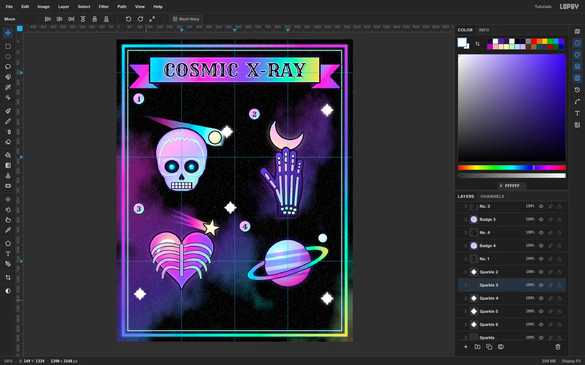

Copy and paste the glint into the empty spaces: (1070, 360), (140, 1320),
(1070, 1320) and (600, 880) between the rows. Use [[Cmd+X]] and [[Cmd+V]] to
move the original up beside the comet at (560, 470). Scale two of the copies
down to about 65% so they read as further away.

## Plate the signature line

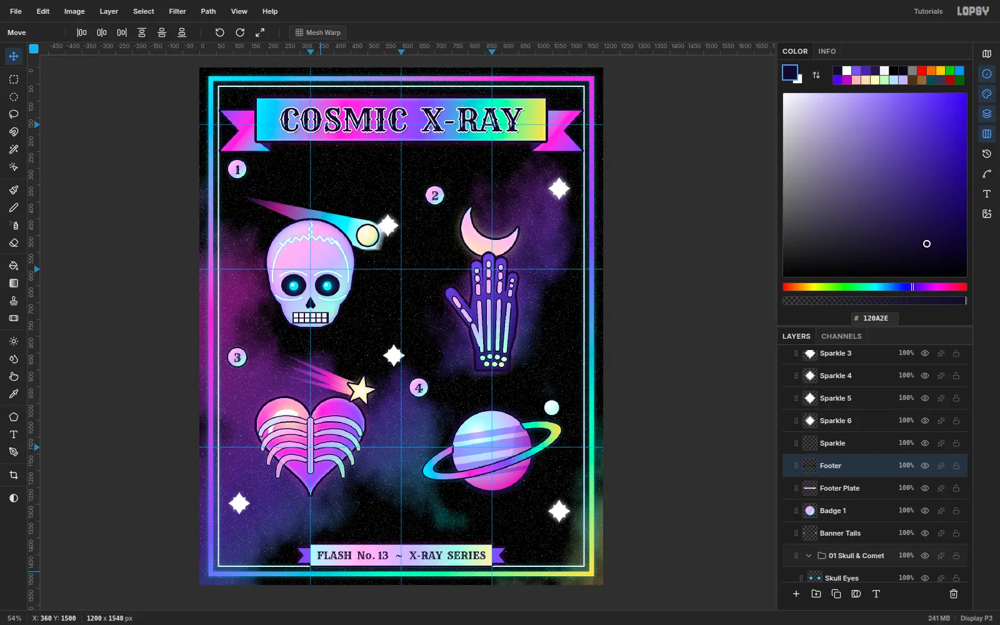

Every sheet needs its series line. On a **Footer Plate** layer, lasso two
small notched ends in `#7B4DFF`, then marquee **540 × 62** at **(330, 1420)**
and fill it with the pastel foil. Give it a 4 px ink **Stroke** and a pink
**Outer Glow**, and rasterize it. Set `FLASH  No. 13   ~   X-RAY  SERIES` in
**Rye 30**, ink, and nudge it to the centre of the plate. On a plate, the line
stays readable over the busiest part of the star field.

## Drop the bottom row into balance

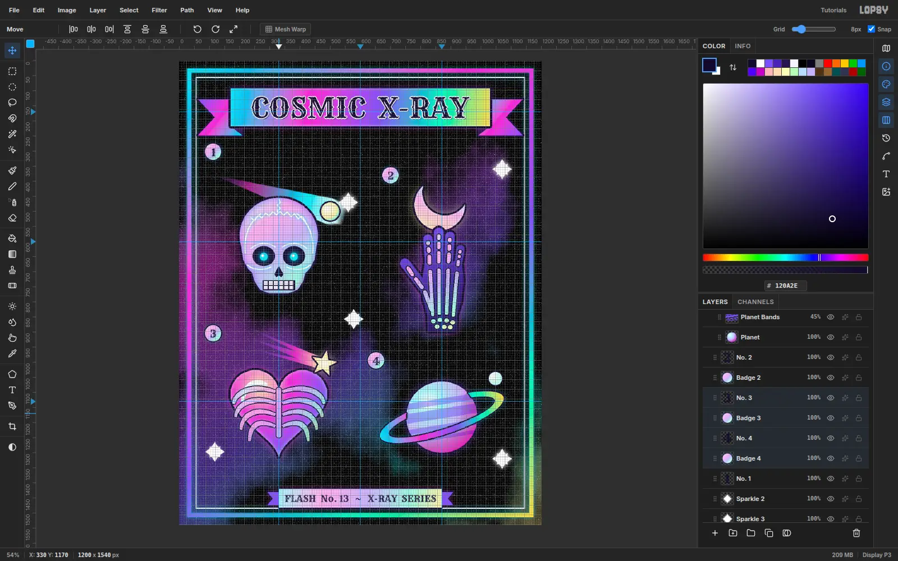

The bottom row sits too high and leaves a dead band above the footer. Turn on
**View → Show Grid**. Click the **03 Heart & Star** group, then
[[Cmd]]-click **04 Ringed Planet**, **Badge 3**, **No. 3**, **Badge 4** and
**No. 4**. With **Move**, drag the heart down about **40 px**. Every selected
layer and group moves together and snaps to the 8 px grid. Turn the grid off.

This is also a good time to check your history: [[Cmd+Z]] three times, then
[[Cmd+Shift+Z]] three times, and the row lands exactly where you left it.

## Finish with bloom, fringe and grain

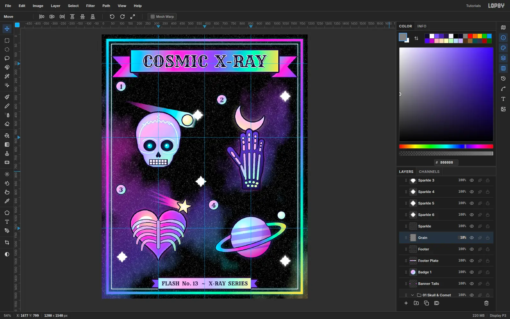

Select **Stars** and run **Filter → Bloom…** (**Threshold 40**,
**Soft Knee 50**, **Radius 6**, **Intensity 140**) so the brightest stars
bloom. Select **Comet Tail** and run **Filter → Chromatic Aberration…**
(**Amount 7**, **Direction 17**) for a foil-like colour split along the
streak. Last, add a **Grain** layer above everything: fill it with `#808080`,
run **Add Noise…** (**Amount 22**, **Mono**, **Gaussian**), and set it to
**Overlay** at **18%**. Export with **File → Quick Export PNG**.

> **Tip:** Save a `.lopsy` project too. Swap the foil ramp for gold and
> black, and the same sheet becomes a traditional flash page.
