Cyberpunk branding is neon on near-black, half-broken on purpose. You get a
glowing emblem, a chromatic split on the type, stray HUD read-outs and
Japanese signage.

In this tutorial you'll make **Dragon Izakaya**, a 2000 × 2000 px logo for a
fictional all-night bar in Neo-Shinjuku. Everything is drawn in Lopsy. The
dragon is lasso polygons over a striped synthwave sun, the rays come from the
**Sunburst** filter, and the glitch is RGB offsets plus two sliced strips of
the title nudged sideways.

The palette:

- Night `#07050F`, silhouette `#0C0818`
- Neon cyan `#05D9E8`, neon magenta `#FF2A6D`, toxic yellow `#F9F002`
- Sun gradient `#F9F002` → `#FF2A6D` → `#6A0DAD`
- Split cyan `#00F0FF`, split magenta `#FF2BD6`, sign yellow `#FFE14D`

## Set up the canvas and guides

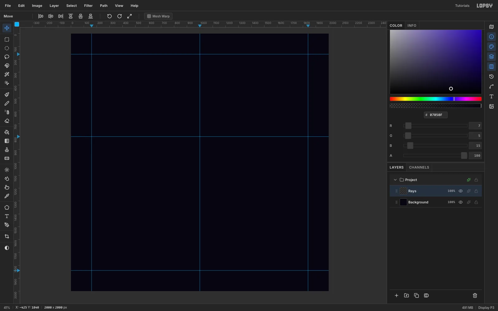

Choose **File → New**, set the unit to **Pixels**, and create a
**2000 × 2000** document with a white background.

1. Select the **Background** layer, set the foreground to `#07050F`, and choose **Edit → Fill** (with nothing selected, it fills the whole layer).
2. Click the top ruler about 160 px in from each side, then [[Cmd]]-click ([[Ctrl]]-click) the middle of it. The modifier snaps that guide exactly to the centre.
3. Click the left ruler about 160 px from the top and bottom, and once more at about 800, a little above the middle.

The outer guides are your safe margin. The sun will sit where the centre guide
crosses the 800 guide.

## Cut a soft window for the rays

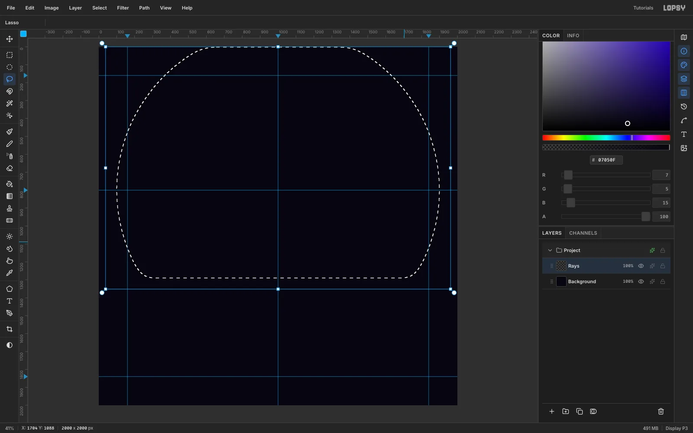

Rename **Layer 1** to *Rays*. The rays shouldn't streak behind the title, so
limit them before you draw them:

1. With the **Lasso**, drag a big circle centred on the guide crossing, about 900 px in radius so it nearly touches the canvas edges. Cut its bottom off with a flat, horizontal run about two-thirds of the way down the canvas (around 1290 on the left ruler). That's just above where the title will go.
2. Choose **Select → Feather…** and set **120**.

Filters respect the selection, feather included, so the rays will fade out at
its edge.

## Paint rays with the Sunburst filter

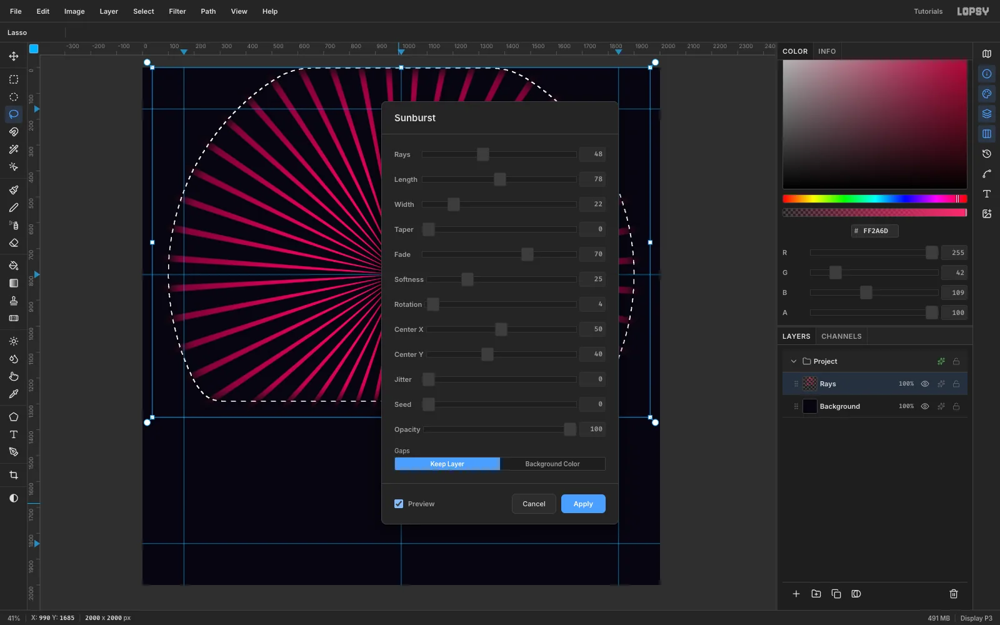

Set the foreground to magenta `#FF2A6D` and choose **Filter → Sunburst…**:

- **Rays** 48, **Length** 78, **Width** 22, **Taper** 0
- **Fade** 70, **Softness** 25, **Rotation** 4
- **Center X** 50, **Center Y** 40 (that's the 800 guide)
- **Opacity** 100, **Gaps** Keep Layer

Tick **Preview** to check it, then **Apply** and press [[Cmd+D]].

## Knock the rays back

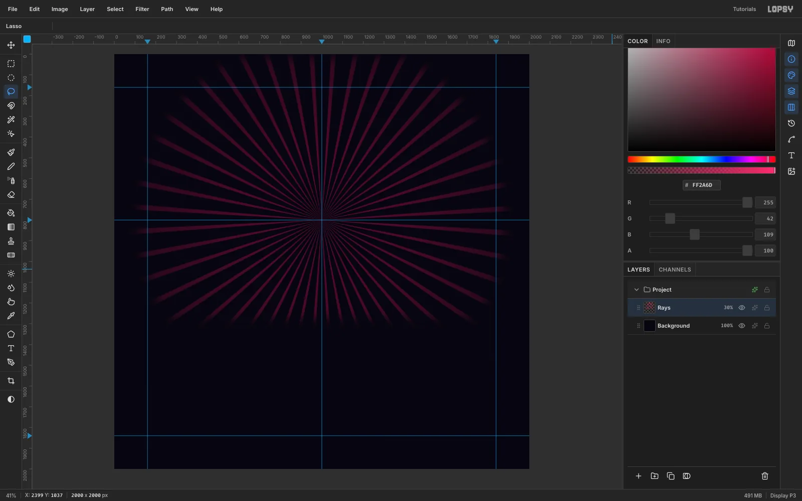

Open the Rays layer's effects drawer, set the blend mode to **Screen**, then
set the layer opacity to **30%**.

At full strength the rays turn into dirty stripes. At 30% they read as light
and leave room for the neon on top.

## Draw the synthwave sun

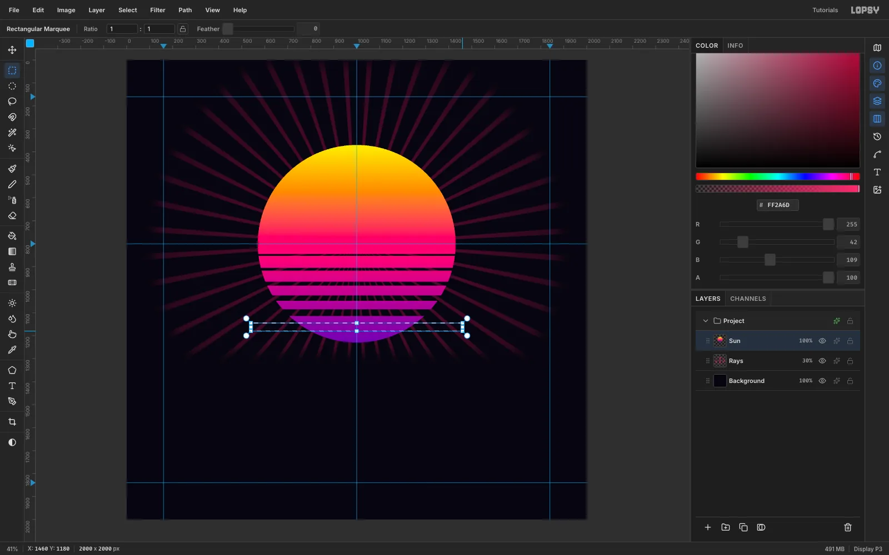

Add a layer called *Sun*:

1. With the **Gradient** tool, open **Advanced…** and set three stops: `#F9F002` at 0%, `#FF2A6D` at 50% and `#6A0DAD` at 100%.
2. With the **Elliptical Marquee**, [[Cmd]]-drag a circle about 860 px across, centred on the guide crossing. [[Cmd]] keeps it round.
3. Drag a **Linear** gradient from the circle's top edge straight down to its bottom edge.

Now cut the slits across the lower half. Each one is a **Rectangular
Marquee** a little wider than the sun, then [[Delete]]. Start just below the
800 guide and space the slits about 60 px apart. They get taller as they go
down: **8**, **12**, **17**, **23**, **29** and **35 px**.

> **Tip:** For exact slit heights, click once with the Rectangular Marquee
> instead of dragging (with nothing selected) and type the corners into the
> dialog. The first slit runs from about 845 to 853 on the left ruler.

## Give the sun a glow

Deselect, open the Sun's effects drawer and enable **Outer Glow**:

- Colour `#FF2A6D`
- **Size** 70, **Spread** 10, **Opacity** 70

## Lasso the dragon silhouette

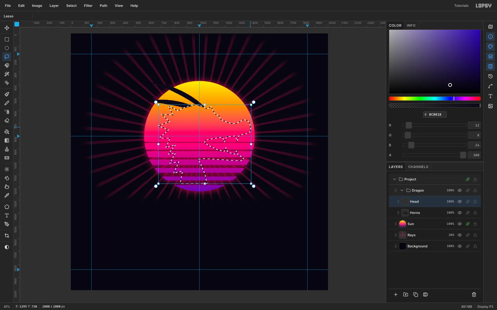

Click **New Group**, name it *Dragon*, and add a layer called *Horns* inside
it. Set the foreground to `#0C0818`.

The dragon faces right, with its head filling the sun. Lasso two long, thin
horns, holding [[Shift]] as you start the second, and fill both at once:

- The bases sit on top of the head, a little left of the centre guide and about 220 px above the 800 guide.
- The tips sweep back and up to the upper left, past the sun's edge. One ends near the top of the sun, the other about 150 px lower.

Add a *Head* layer and lasso the whole head in one pass, then **Edit → Fill**:

1. **Snout.** Start at the tip of the nose, just inside the sun's right edge, bump up over a nostril, and run back along the brow to a pointed brow ridge just right of the centre guide.
2. **Mane.** Drop down the back of the skull as a row of sharp spikes, about 70–90 px deep, pointing back to the left.
3. **Neck.** Keep going into a neck with smaller dorsal spikes that ends flat near the bottom of the sun.
4. **Jaws.** Come back up the throat. Draw an open lower jaw with two upward fangs, then the upper jaw with two downward fangs back to the nose.

Deselect, click the Head row and choose **Layer → Merge Down**. Rename the
result *Dragon Head*.

## Outline it in neon

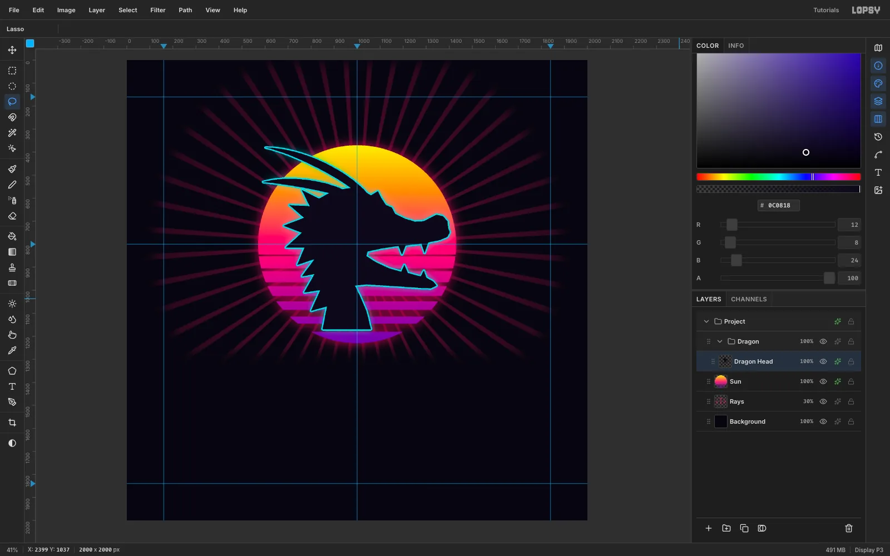

On *Dragon Head*, enable two effects:

- **Stroke:** colour `#05D9E8`, **Width** 6, position **Outside**
- **Outer Glow:** colour `#05D9E8`, **Size** 50, **Spread** 4, **Opacity** 60

A dark silhouette against a bright disc is the strongest shape in the logo,
so keep the fill a flat near-black.

## Add the eye and tapered whiskers

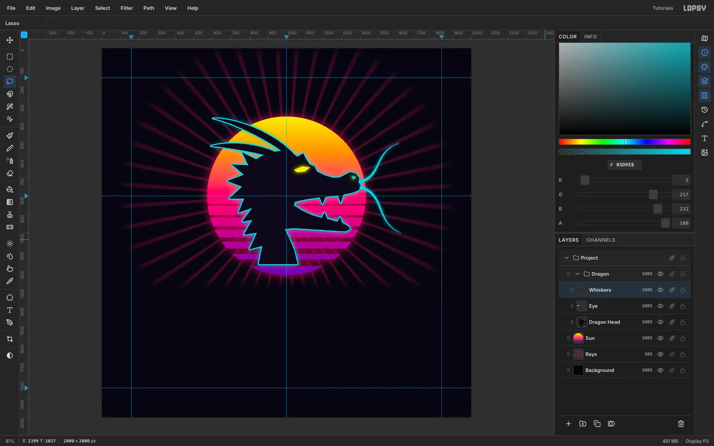

Add an *Eye* layer:

1. Lasso a narrow slanted slit, about 90 px long, under the brow ridge. Fill it `#F9F002`.
2. Lasso a small nostril triangle and fill it `#05D9E8`.
3. Give the layer an **Outer Glow** in `#F9F002`: **Size** 28, **Spread** 20, **Opacity** 90.

Add a *Whiskers* layer. Draw each whisker as a thin **ribbon** with the Lasso:
go out along one side of an S-curve and come back along the other side. Start
about 13 px wide at the lip and end in a point.

- The upper whisker curls up and out from the nose, ending about 200 px above it.
- The lower whisker curls down from just below it, ending about 250 px below the nose.

Both run about 220 px out to the right, past the sun's edge.

Fill both `#05D9E8` and add an **Outer Glow** (`#05D9E8`, Size 22, Spread 10,
Opacity 85). A tapered ribbon looks like a whisker; a stroke of one width
looks like a cable.

## Shade behind the side text

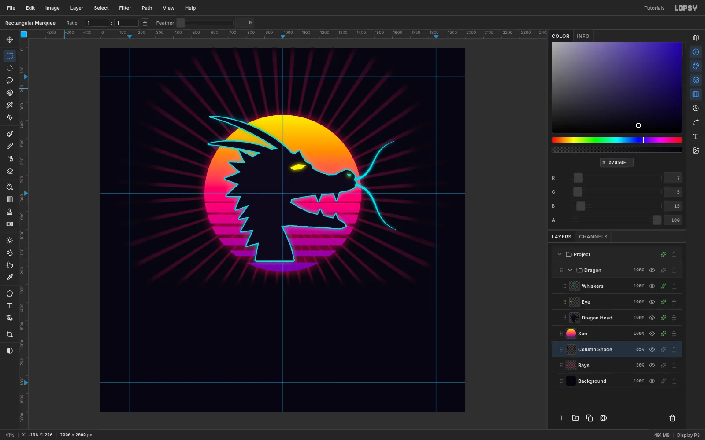

Click the *Rays* row and add a layer called *Column Shade*:

1. Pick the **Rectangular Marquee** and set **Feather** to 60 in the options bar.
2. Marquee a tall panel about 190 px wide, straddling the left margin guide and running from about 300 to 1050 on the left ruler. Fill it `#07050F`.
3. Do the same over the right margin guide.

Set **Feather** back to 0 and the layer opacity to 85%. The Japanese columns
will sit on these calm panels instead of on the rays.

## Set the type

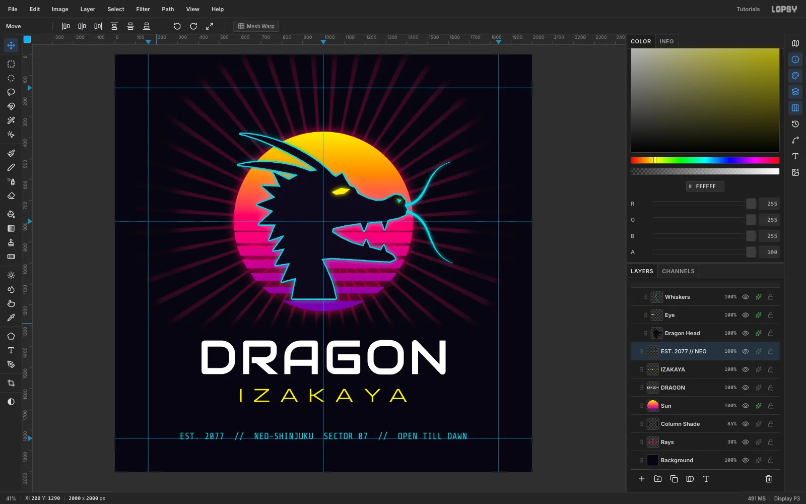

For each line, select *Sun*, set up the text, then click in empty canvas
below the sun and type:

- **Footer:** Share Tech Mono, size 44, `#05D9E8`, letter spacing 0. Type `EST. 2077  //  NEO-SHINJUKU  SECTOR 07  //  OPEN TILL DAWN`.
- **IZAKAYA:** Michroma, size 84, `#F9F002`, letter spacing 46.
- **DRAGON:** Audiowide, size 230, `#FFFFFF`, letter spacing 10.

Select each one with the **Move** tool and click **Align center
horizontally** in the options bar. Then nudge them up or down with the arrow
keys ([[Shift]] + arrow moves 10 px):

- DRAGON sits a little below the flat bottom of the ray window, with its caps starting around 1340 on the left ruler.
- IZAKAYA sits under it, with about 80 px of air between them.
- The footer sits just above the bottom margin guide.

> **Tip:** Pick a title face whose O is a plain ring. A slashed or barred O turns DRAGON into "DRAGΘN" at logo size.

## Split the title into RGB

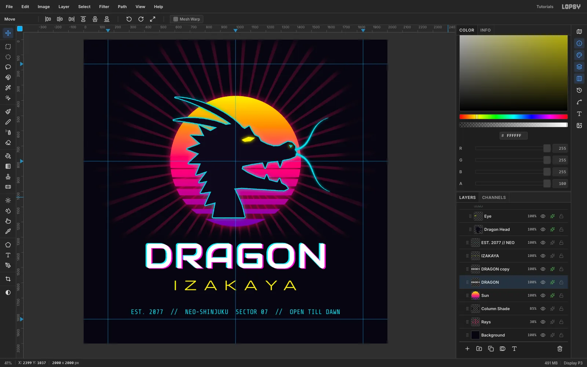

1. Select *DRAGON* and click **Duplicate Layer**. The copy sits exactly on top of the original.
2. On the **copy** (the top layer), add a **Drop Shadow**: `#FF2BD6`, Offset X 8, Offset Y 4, **Blur 0**, **Opacity 100**. That gives a hard magenta offset.
3. Select the **original** underneath and nudge it 8 px left and 4 px up.
4. Give the original a **Color Overlay** in `#00F0FF`.

## Glitch two slices

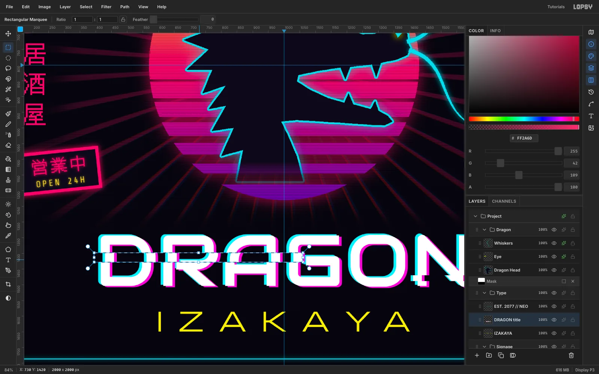

Select the original DRAGON and click **Rasterize Layer Style** in its
effects drawer, so the cyan becomes pixels. Then click the copy and
**Merge Down** (the merge bakes the magenta shadow in). Rename it
*DRAGON title*.

Now tear it in two places:

1. With the Rectangular Marquee, select a 30 px strip across the upper half of D, R and A, a little over a third of the way down the caps. Switch to **Move** and drag the strip **13 px right** (or nudge it), then press [[Cmd+D]].
2. Select an 18 px strip across the lower part of the N and move it **14 px left**.

Keep the tears off the O, and keep each shifted piece overlapping its own
stroke. If a strip lands in empty counters, it reads as a strikethrough.

## Stack the Japanese columns

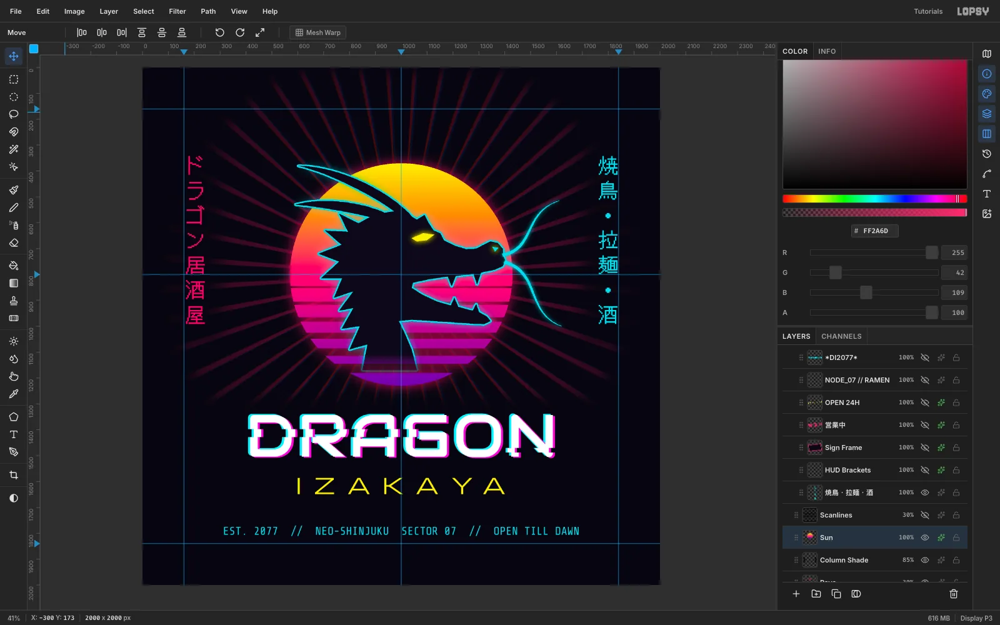

With *Sun* selected, pick the Text tool:

1. Choose **DotGothic16** at size 78 and turn on **Vertical text** (the A-over-B toggle in the options bar).
2. Set the foreground to magenta `#FF2A6D`, click near the top of the left shade panel, and paste `ドラゴン居酒屋` with [[Cmd+V]]. Commit with [[Tab]] and set **Letter spacing** 18 in the Text panel.
3. Do the same at the top of the right shade panel with `焼鳥・拉麺・酒` in `#05D9E8`.

Then select *Sun* again and turn the toggle off.

## Frame it with HUD brackets and rules

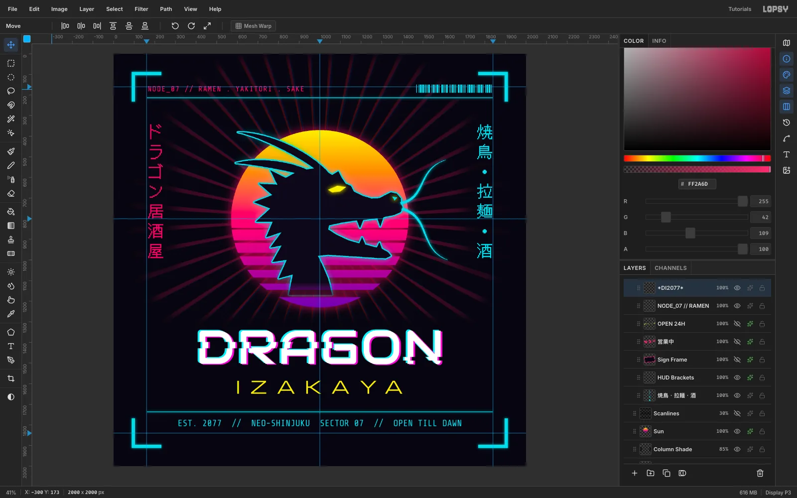

Add a *HUD Brackets* layer. Choose **View → Show Grid** (it turns Snap on),
then fill eight Rectangular Marquee bars in `#05D9E8`. Each is 16 px thick and
144 px long, making an L in each corner about 88 px in from the canvas edges.
The grid keeps all four corners identical. Hide the grid again and untick
**View → Snap to Grid**.

On the same layer, draw two 3 px rules from the left margin guide to the
right one with the **Pencil** ([[N]]) at **Size 3**: click on the left guide,
then [[Cmd+Shift]]-click on the right one so the line snaps level.

- one about 50 px below the top margin, under the label row you're about to add
- one about 100 px above the bottom margin, over the footer

Give the layer an **Outer Glow** (`#05D9E8`, Size 18, Spread 10, Opacity 70).

Add the top labels, selecting *HUD Brackets* before you set up each one:

- **Left:** `NODE_07 // RAMEN . YAKITORI . SAKE` in Share Tech Mono 36, `#FF2A6D`, letter spacing 3, with its left edge on the left margin guide.
- **Right:** `*DI2077*` in **Libre Barcode 39**, size 96, `#05D9E8`, with its right edge on the right margin guide.

## Squash the barcode

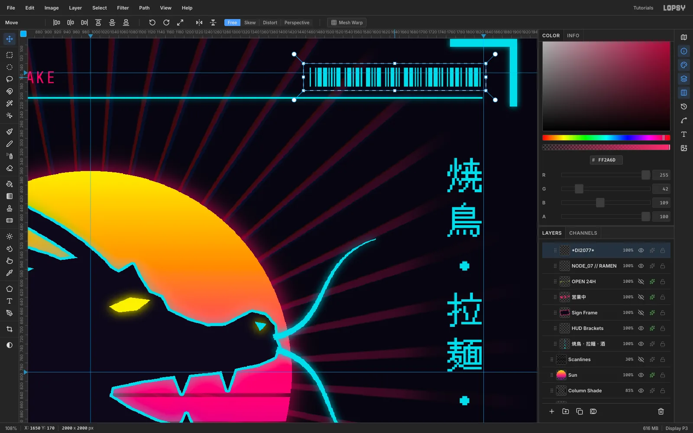

The barcode is taller than the label beside it. Rasterize it, draw a
Rectangular Marquee around it, switch to **Move**, and drag the
**top-middle** handle down until the bars are about **40 px** tall, the height
of the label's capitals. Press [[Cmd+D]], then nudge it so its
bottom lines up with the label's baseline.

## Build the neon sign

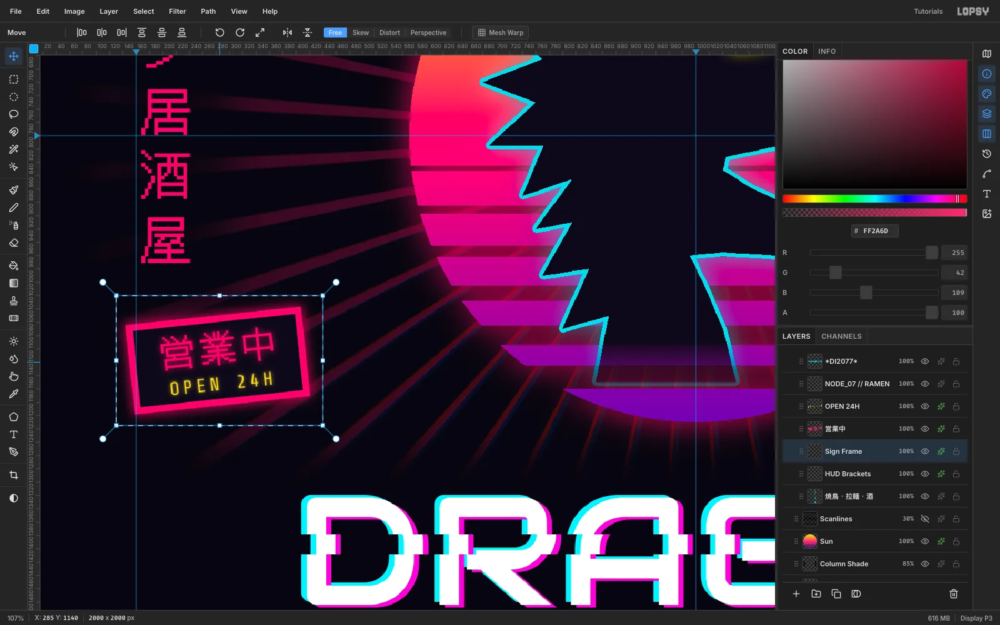

Select *HUD Brackets* so the sign stacks above it, and add a *Sign Frame*
layer:

1. Fill a `#FF2A6D` rectangle about 265 × 135 px on the left margin, just below the left shade panel.
2. **Select → Shrink…** by 9, press **Delete**, then fill the inside `#0C0818`.
3. Add an **Outer Glow** (`#FF2A6D`, Size 24, Spread 10, Opacity 80).

Add two texts, selecting *Sign Frame* before you set up each one:

- `OPEN 24H`: Share Tech Mono 28, `#FFE14D`, letter spacing 5. Glow `#FFE14D`, Size 10, Opacity 60.
- `営業中`: DotGothic16 54, `#FF2A6D`, letter spacing 7, pasted in. Glow `#FF2A6D`, Size 14, Opacity 70.

Centre both on the frame with 14 px of padding above and below.

Rasterize the two texts. Then tilt all three layers together:

1. Click *Sign Frame* and [[Shift]]-click `OPEN 24H` so all three layers are selected. Press [[Cmd+D]] so nothing is marqueed.
2. With **Move**, one box frames the whole sign. Drag the rotate handle just off the top-right corner about **−6°** (anticlockwise).
3. Press [[Cmd+D]].

## Fade the neck and add scanlines

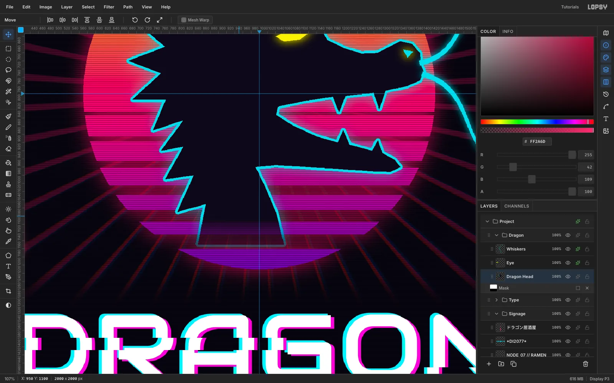

The flat end of the neck looks like a pedestal. Select *Dragon Head* and
click **Rasterize Layer Style** in its effects drawer, so the stroke and glow
become pixels.

1. Click **Add Mask**, then click the **Mask** row.
2. With the Gradient tool (black → white, **Reverse** on), drag straight down over the last 90 px or so of the neck, ending at its flat bottom edge.

The neck and its outline now dissolve into the stripes.

> **Tip:** Bake the effects first. Live effects follow the mask, so a live Stroke would trace a fresh outline along the faded edge instead of fading with it.

For the CRT texture, define a 200 × 5 tile with one 2 px black line and use
**Edit → Fill with Pattern…** on a *Scanlines* layer directly above *Sun*, at
30% opacity. It textures the sun and rays but leaves the title crisp.

## Group, add chromatic fringing and export

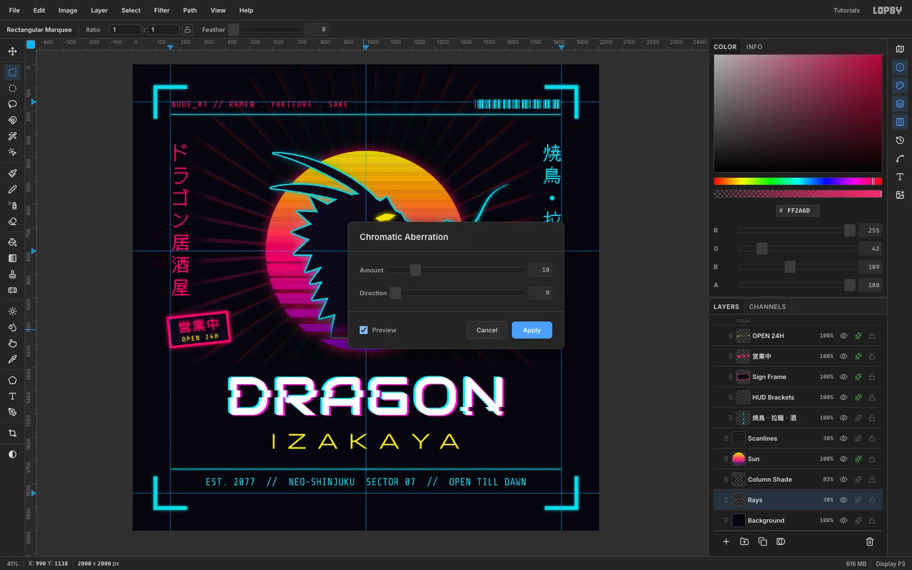

Tidy the stack:

1. Shift-click *EST…* and *DRAGON title* and choose **Layer → Group Layers**. Name it *Type*.
2. Do the same for the signage and HUD layers (*Signage*).

Finally, select *Rays* and run **Filter → Chromatic Aberration…** (Amount 10,
Direction 0) for a faint red and blue fringe.

**File → Save Project**, then **File → Quick Export PNG**.
