In 1922 Kurt Schwitters and Theo van Doesburg printed the *Kleine Dada
Soirée* poster: a huge red DADA scattered in every direction, overprinted with
black type in a dozen faces. In this tutorial you'll borrow that idea for a
menu. **Ursonate Wurst** is a made-up 1923 Hannover sausage stand named after
Schwitters' sound poem *Ursonate*. Its prices are "in billions of marks, new
every day", a hyperinflation joke.

The menu works because one rule holds the chaos together. The red letters go
wherever they like, but everything a diner has to *read* is printed on calm
paper slips with even margins.

Along the way you'll use:

- point text, area text with left and right alignment, underline and letter spacing
- Rasterize Layer, ⌘-drag scaling, rotate handles and 180° flips
- Clouds, Add Noise, Gaussian Blur and Threshold
- the Magic Wand to cut one layer to another layer's shape
- a pasted public-domain engraving, torn-edge lassos and Merge Down
- text on a circular path for a rubber stamp
- Multiply, Soft Light and Lighten blend modes
- groups, guides and the Eraser

The palette is two inks, a stamp colour and two papers:

- Newsprint `#EBE0C5`, slip paper `#F3ECD9`
- Vermilion `#C43A2B`
- Ink black `#1A1714`
- Stamp blue `#2B3E9C`

## Lay down the newsprint

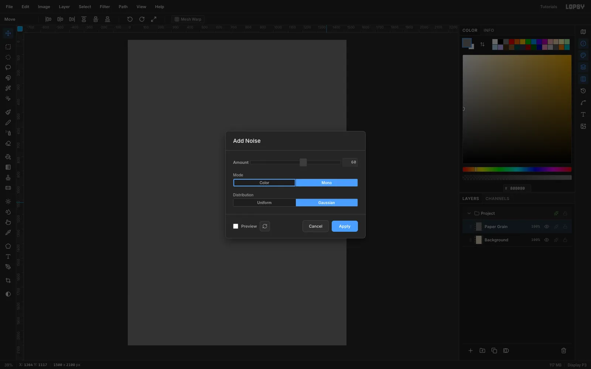

Open [Lopsy](/). In the **New Document** dialog, set **Width** `1500` and
**Height** `2100`, choose a **White** background and click **Create**.

1. Select **Background**, set the foreground to `#EBE0C5` and choose **Edit → Fill**.
2. Rename **Layer 1** to `Paper Grain`, fill it with `#808080`, then choose **Filter → Add Noise…**. Set **Amount** `60`, click **Mono** and **Gaussian**, and **Apply**.
3. Open the layer's effects (✦), set the blend mode to **Soft Light**, and set its opacity to 35%.
4. Add a layer named `Toning`, fill it white, run **Filter → Clouds…** and set it to **Multiply** at 6%.

Keep **Paper Grain** and **Toning** at the top of the stack as you go. They
texture every ink above the paper, so the whole sheet looks printed at once.

## Set a giant W

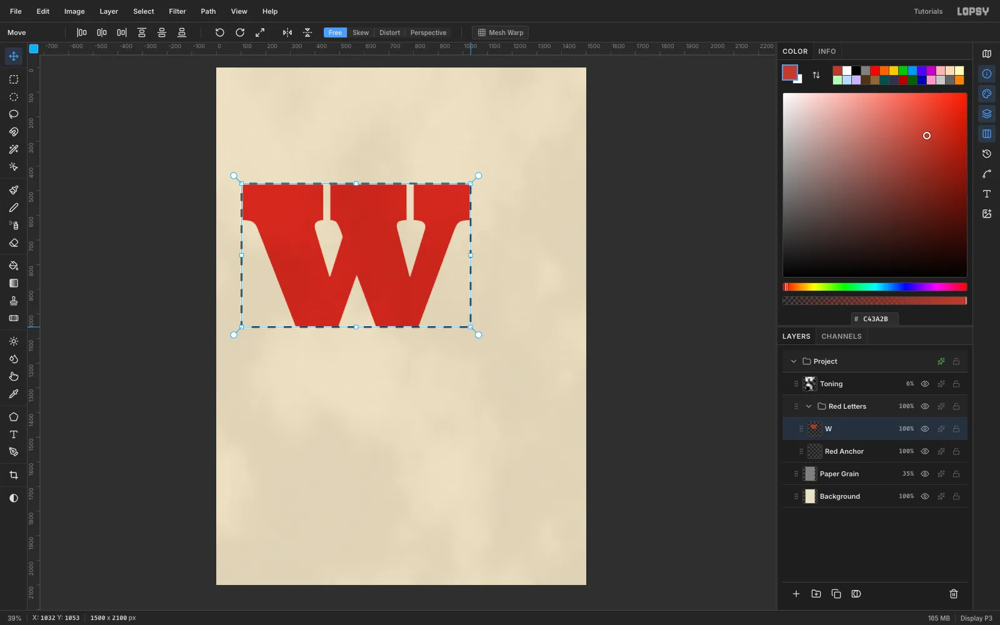

Choose **New Group** in the Layers panel and name it `Red Letters`. Click
**Add Layer** while the group is selected, so an empty layer named
`Red Anchor` lands inside it. New text goes directly above the active layer,
so this anchor keeps every letter in the group.

Pick the **Text** tool ([[T]]). Choose **Ultra** in the font browser, set
**Size** `500` and the colour `#C43A2B`, click in the canvas, type `W` and
press [[Tab]]. Click **Rasterize Layer** in the Layers footer.

Text tops out at 500 px, so scale the raster instead. Draw a **Rectangular
Marquee** a few pixels larger than the W, switch to the **Move** tool ([[V]]),
hold [[Cmd]] and drag the bottom-right handle out to about 160%. Holding
[[Cmd]] keeps the proportions. Press [[Cmd+D]] to commit.

## Tilt it

Marquee the W again. With the **Move** tool, hover just outside the top-right
corner until the cursor turns into a crosshair, then drag to rotate it about
−7°. Press [[Cmd+D]] and drag the W so its top-left sits around (40, 300).

## Scatter the rest of WURST

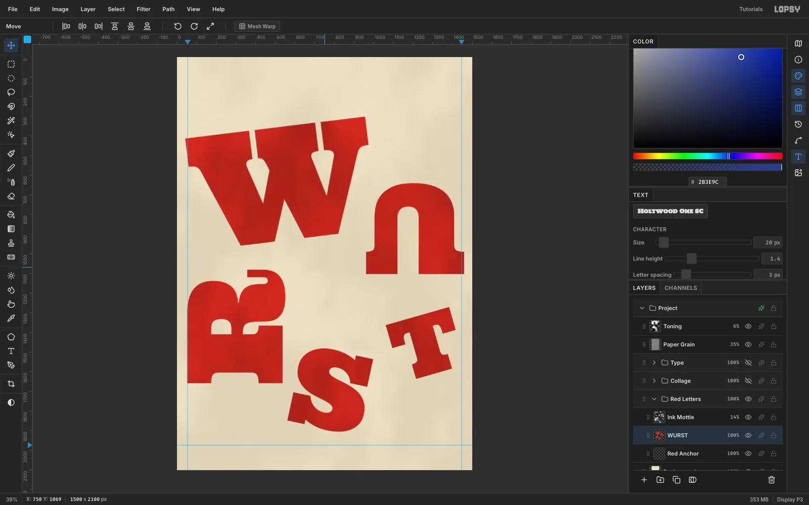

Make each remaining letter the same way: type it with `Red Anchor` selected,
rasterize, scale, rotate and move it.

- **U**: 125%, rotated 180° so it hangs upside down, at (960, 640)
- **R**: 135%, rotated −90° so it lies on its back, at (50, 1080)
- **S**: 110%, rotated 12°, at (560, 1480)
- **T**: 85%, rotated −16°, at (1060, 1270)

Turned upside down, Ultra's slab feet almost close the U's counter, so it
reads as a keyhole. Marquee from (1120, 950) to (1228, 1110) on the **U**
layer and press [[Delete]] to open the counter.

## Add ink density

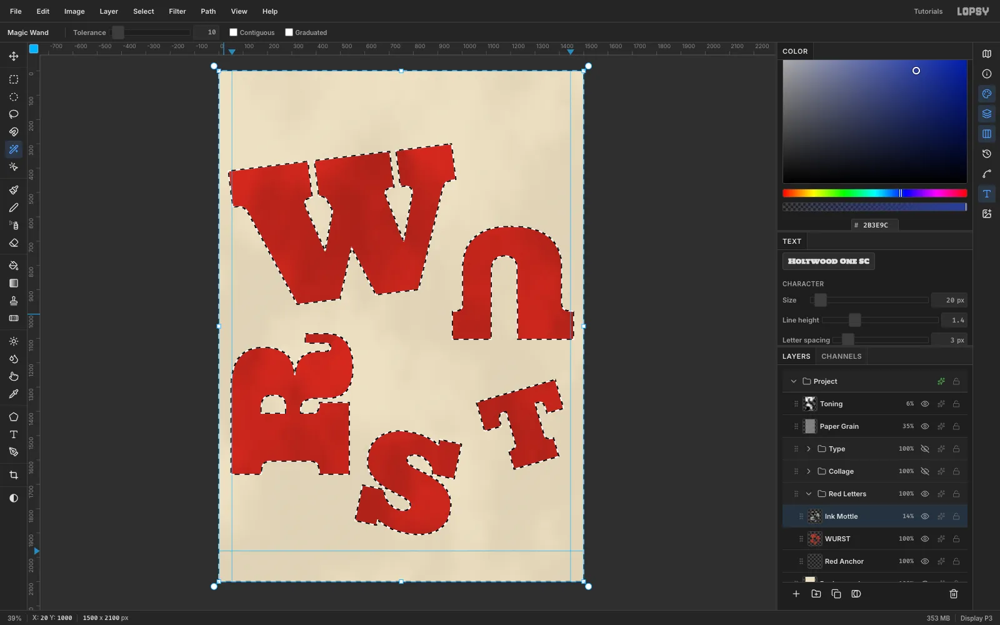

Real litho red is never perfectly flat. Click the **W** row and choose
**Layer → Merge Down** four times so all five letters become one layer, then
rename it `WURST`.

1. Add a layer named `Ink Mottle`, fill it white and run **Filter → Clouds…** with **Scale** `7`.
2. Pick the **Magic Wand**, untick **Contiguous**, select **WURST** and click any empty part of the canvas. That selects everything *except* the letters.
3. Click the **Ink Mottle** row and press [[Delete]], then [[Cmd+D]].
4. Set **Ink Mottle** to **Multiply** at 14%.

## Paste in a found engraving

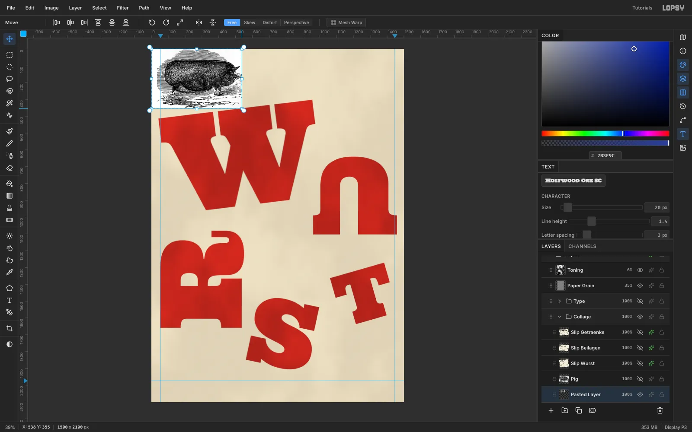

Dada collages reused printed scraps. This one is a public-domain Berkshire pig
from *Brett's Colonist's Guide* (1883), found on Wikimedia Commons.

Collapse **Red Letters**, create a group named `Collage` and drag its grip so
it sits above **Red Letters**. Add a layer named `Pig Scrap` inside it. Copy
the engraving in your browser and press [[Cmd+V]]. It lands at the top-left
with its transform box live. [[Cmd]]-drag the corner down to 56% and press
[[Cmd+D]]. Rename the layer `Pig`, rotate it about 5° and set it to
**Multiply** so its white paper disappears.

## Tear it out of the page

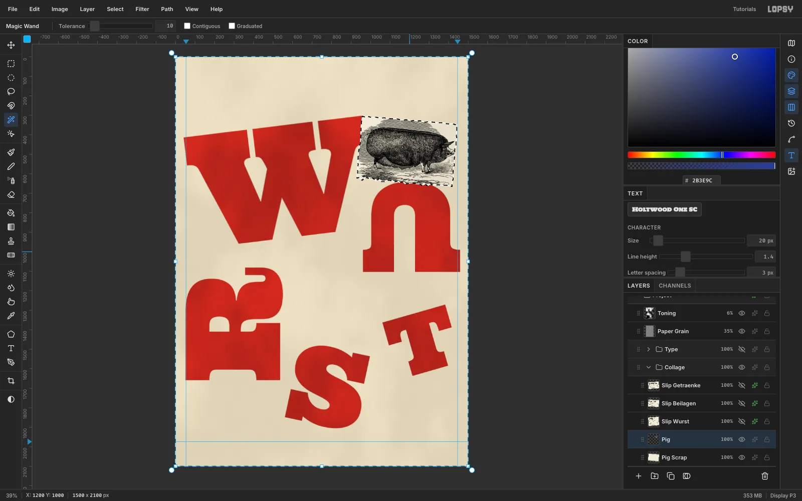

On **Pig Scrap**, use the **Lasso** to draw a rough rectangle around the pig,
about 490 × 320. Zigzag the edges by a few pixels every 15 px or so, with
slightly bigger tears on one side. Fill it with `#F2EBD8`. Place the scrap so
its right edge stops at x 1444.

To trim the engraving to the scrap, select **Pig Scrap**, click its empty
surroundings with the **Magic Wand** (**Contiguous** off), then click the
**Pig** row and press [[Delete]]. The selection survives the row click, so
everything outside the paper disappears. Slide the pig before you trim so its
snout stays on the paper.

## Set the masthead

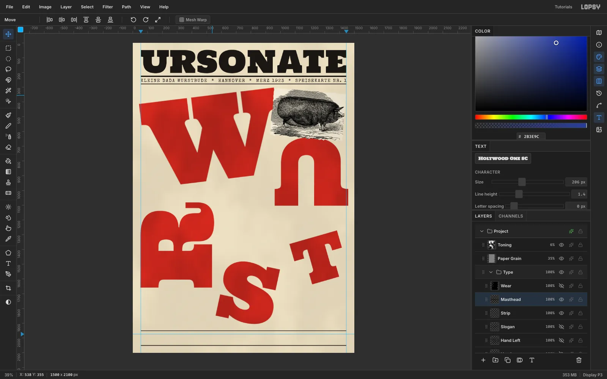

Create a `Type` group above **Collage** with an empty `Type Base` layer inside.
Click the top ruler at **54** and **1446** to drop margin guides.

1. With **Holtwood One SC** at size `206` and colour `#1A1714`, type `URSONATE` and move it to x 54, y 46.
2. Add a layer named `Rules`. Marquee from (54, 222) to (1446, 230), **Edit → Fill**, then do the same from (54, 276) to (1446, 280).
3. In **Special Elite** at `30`, type `KLEINE DADA WURSTBUDE  *  HANNOVER  *  MERZ 1923  *  SPEISEKARTE NR. 1`. Special Elite has no ✶ glyph, so use typewriter asterisks.
4. Open the **Text** panel and raise **Letter spacing** until the line spans the guides exactly. Here that was `4.3`. Centre it between the rules.

> **Tip:** Select a raster layer such as **Rules** before you change any Text panel value. With a text layer selected, the panel restyles that layer.

## Overprint a slogan across the W

Type `DADA IST GEGEN DIE ZUKUNFT!` ("Dada is against the future") in
**Anton** at `74`, then click **Rasterize Layer**. Marquee it and rotate it
about −7° with the rotate handle so its baseline follows the tilt of the W.
Press [[Cmd+D]]. Black type over the red reads cleanly and gives the giant
letter a job.

## Hang a slogan upside down

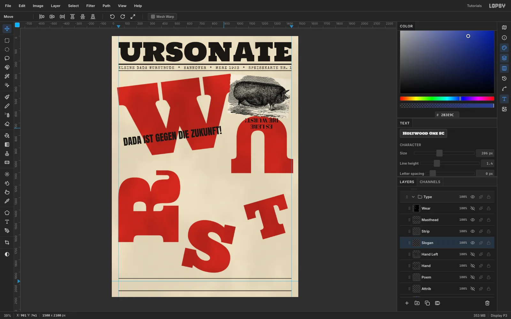

Drag an area-text box about 340 px wide. In the options bar choose
**Abril Fatface** at `56` and **Align Center**, set **Line height** to `1.1`
in the Text panel, and type `ES LEBE` [[Enter]] `DIE WURST!` ("long live
the sausage!").

Rasterize it, rotate it 180°, then [[Cmd]]-drag it down to 82%. Centre it on
the U's arch at about (1206, 703). Check that it sits fully on red, with
clear space above the counter and below the pig scrap.

## Set a menu slip

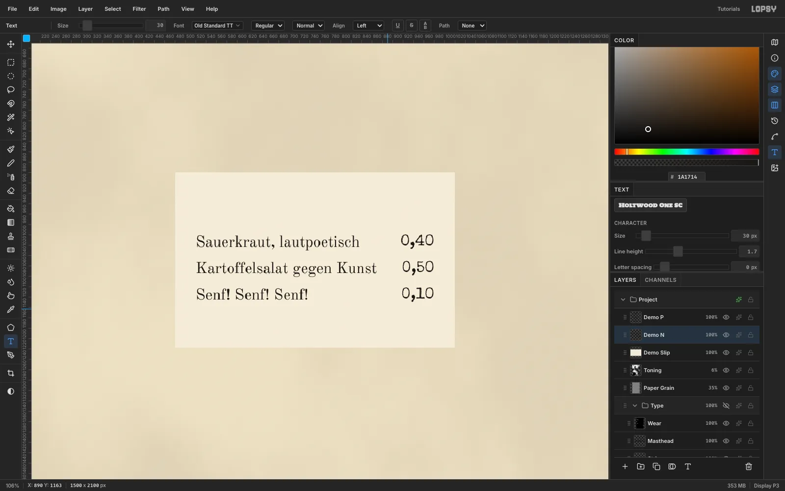

Each menu section is printed on its own scrap of paper. Inside **Collage**, add
a layer named `Slip Beilagen`, marquee from (60, 1572) to (600, 1909) and fill
it with `#F3ECD9`. In the Text panel, set **Line height** to `1.7` so every
row is 51 px apart.

1. **Prices:** drag an area box from x 470 to 560, 110 px below the slip's top. Use **Special Elite** `30` with **Align Right**, and type `0,40`, `0,50` and `0,10` on separate lines.
2. **Dishes:** drag a second box from x 100 to 470, starting at the same height. Use **Old Standard TT** `30` with **Align Left**, and type `Sauerkraut, lautpoetisch`, `Kartoffelsalat gegen Kunst` and `Senf! Senf! Senf!`.

Area text has an exact hit box, so the two columns can sit side by side. Keep
40 px of paper on every side and at least 55 px between the longest dish and
its price.

## Head it, foot it and tear it

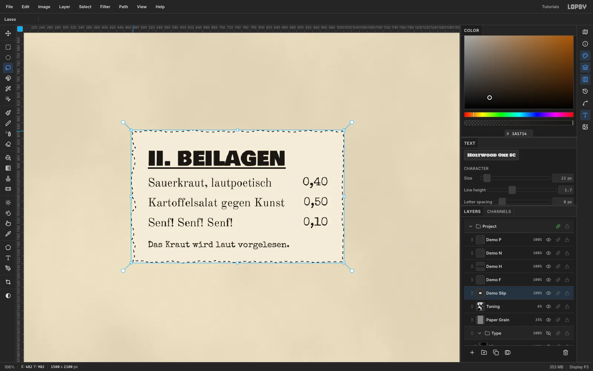

Select the slip layer, turn on **Underline** in the options bar, and type
`II. BEILAGEN` in **Bowlby One SC** at `50`, 40 px in from the top-left.
Turn underline off again, then add `Das Kraut wird laut vorgelesen.` in
Special Elite `22`, 12 px below the last dish.

> **Tip:** Click a blank part of the canvas for each new point text. A click inside another text layer's box edits that layer instead.

Lasso a zigzag rectangle 2 px inside the slip, choose **Select → Inverse**
and press [[Delete]]. Then click each text row, starting with the one
directly above the slip, and choose **Layer → Merge Down** until the slip is
one layer.

## Paste the slip down

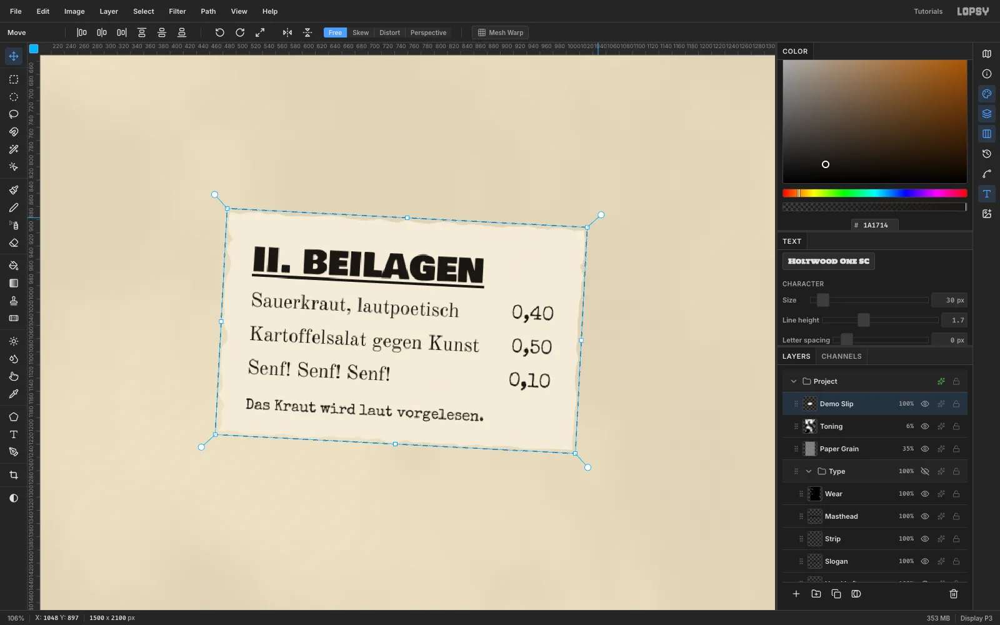

Marquee the slip and rotate it 3°, then press [[Cmd+D]]. In its effects add
a **Drop Shadow** with **Offset X** `2`, **Offset Y** `3`, **Blur** `3` and
**Opacity** `40`. A tight contact shadow makes it look pasted down; a big
soft one makes it float.

## Make all three slips match

Build the other two slips with exactly the same padding, row pitch, fonts and
shadow:

- **I. WÜRSTE**, from (515, 985) to (1050, 1424), rotated −4°: Bratwurst „Merz“ 1,20 · Bockwurst ohne Zukunft 1,10 · Weißwurst à la Tzara 1,40 · Blutwurst Simultan 1,00 · Die Wurst an sich 2,—, with the footnote `Preise in Billionen Mark, täglich neu!`
- **III. GETRÄNKE**, from (942, 1572) to (1462, 1909), rotated −4°: Bier „Cabaret Voltaire“ 0,60 · Selters Hausmann 0,30 · Schnaps fmsbw 0,80, with the footnote `fmsbw: bitte nicht aussprechen.`

Number the slips in reading order: I in the middle, then II on the left and
III on the right. The red letters can run wild because the slips stay calm
and readable.

## Add printer's fists

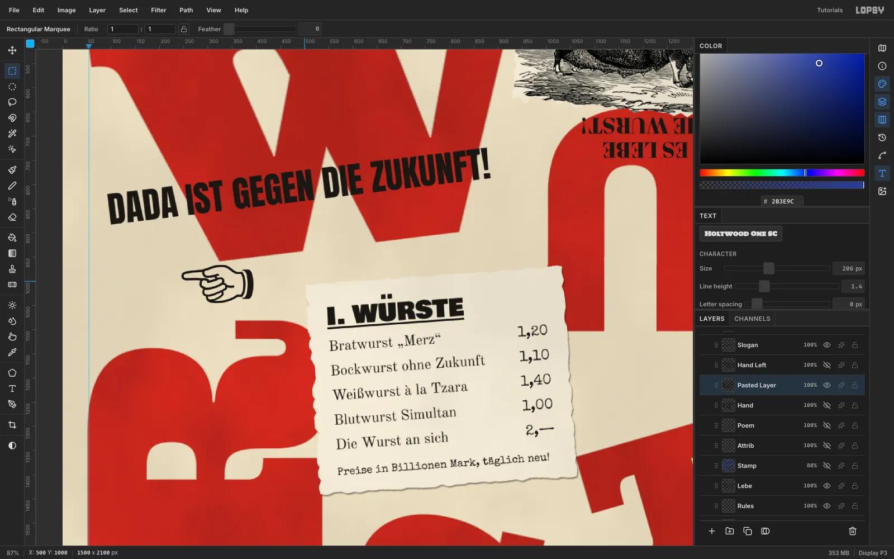

In **Noto Sans Symbols 2** at `130`, paste the glyph `☞` into a new text
layer and rasterize it. Put it at about (245, 965), pointing at the Würste
heading.

For a matching fist on the other side, marquee it, press [[Cmd+C]], wait a
couple of seconds for the clipboard to update, and press [[Cmd+V]]. The copy
lands in place above the original. Choose **Image → Flip Horizontal**, rename
it `Hand Left` and drag it to about (1078, 1150) so it points back at the slip.

## Close with a sound-poem footer

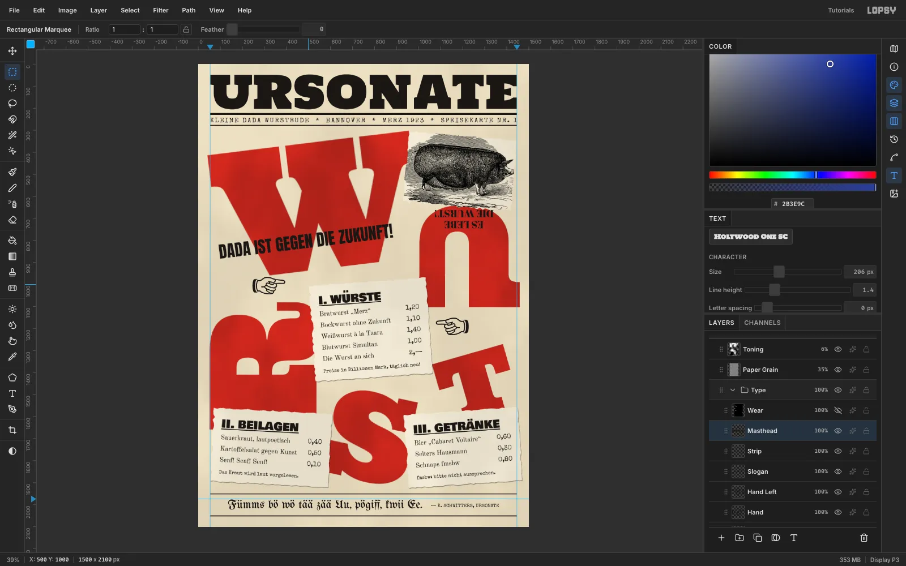

On **Rules**, fill two more bars from (54, 1949) to (1446, 1953) and from
(54, 2049) to (1446, 2053). The bottom margin then matches the top.

Set the first line of the *Ursonate*, `Fümms bö wö tää zää Uu, pögiff, kwii
Ee.`, in **UnifrakturMaguntia** at `54`. Add `— K. SCHWITTERS, URSONATE` in
Special Elite `22`. Centre the pair between the guides and the two rules, and
line up the attribution with the Fraktur baseline.

## Cut the stamp rings

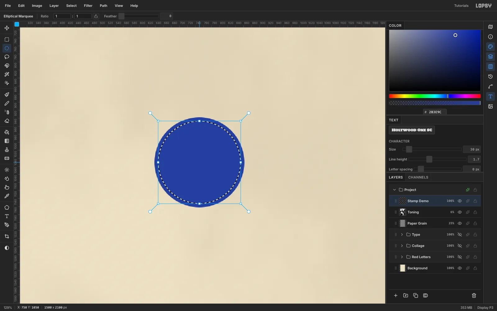

Add a layer named `Stamp` and set the foreground to `#2B3E9C`. It's easiest
to build the stamp large on empty paper (hide the groups for a moment), then
shrink it into place.

1. Draw an **Elliptical Marquee** with radius 112, choose **Edit → Fill**, then **Select → Shrink…** by `9` and press [[Delete]]. That leaves the outer ring.
2. Draw a radius-76 circle at the same centre, fill it, **Shrink** by `4` and press [[Delete]].

## Run text around a circle

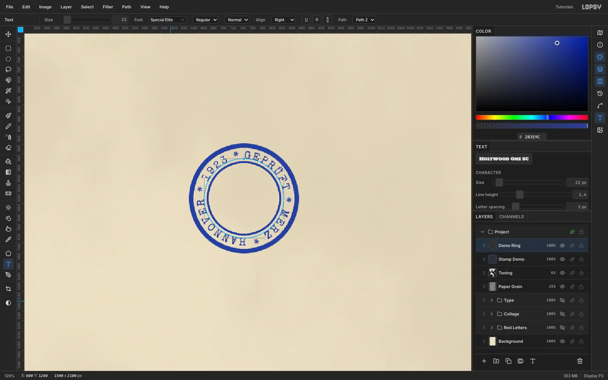

Pick the **Shape** tool, set **Shape** to **Ellipse** and **Output** to
**Path**, and drag from the stamp's centre out 81 px. This makes a circular
path that starts at 12 o'clock.

Type `GEPRÜFT * MERZ * HANNOVER * 1923 * ` (ending with a space) in Special
Elite `22`, press [[Tab]], and choose the new path in the **Path** dropdown in
the options bar. Then nudge **Letter spacing** until the end of the text meets
the start. `3` closed the gap here. Glyphs sit on the outside of the path, so
a path radius a little inside the outer ring keeps them between the two rings.

## Finish the stamp

Centre `DADA` in Bowlby One SC `38` and `Nr. 7` in Special Elite `20` inside
the inner ring. Merge the three text layers down into **Stamp**, rotate it
−14°, and set it to **Multiply** at 88% so it overprints like ink. In the
Paths panel, click the path's row to hide its outline.

## Place it where it reads

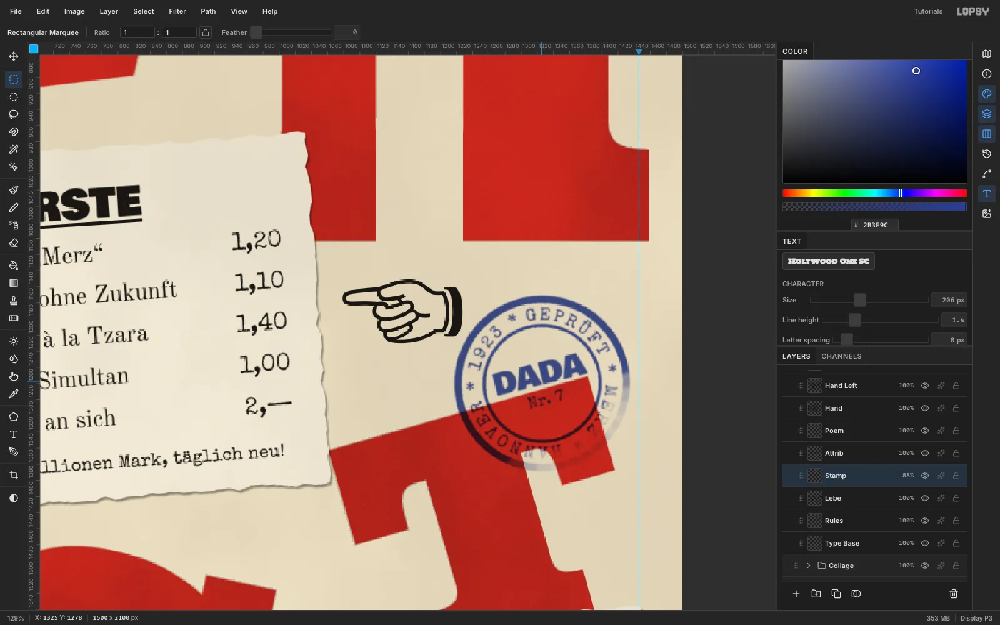

Show the groups again. At its build size (an outer radius of about 110) the
stamp is already right. Centre it at (1325, 1278), in the cream pocket under
the U's leg. Blue on cream reads clearly. Over red it turns a
muddy purple, so let only about a third of the stamp cross the T. Leave at
least 25 px between the ring and any text.

## Give it uneven pressure

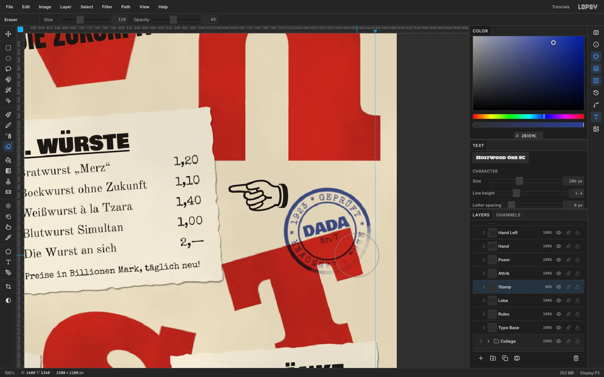

A rubber stamp is never inked evenly. Pick the **Eraser**, set **Size** `110`
and **Opacity** `45`, and drag one arc along the lower-right of the ring. That
side now looks lightly pressed.

## Print in some wear

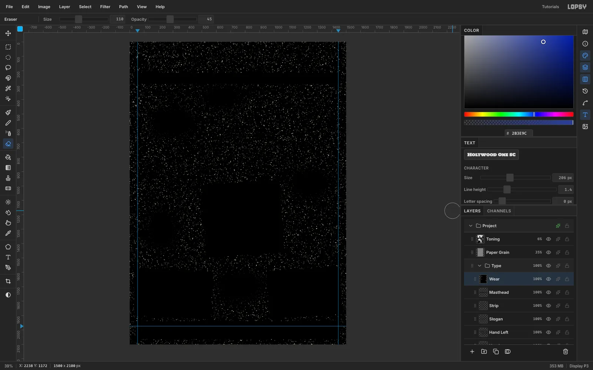

At the top of the **Type** group, add a layer named `Wear` and fill it with
`#808080`.

1. Run **Add Noise** with **Amount** `100`, **Mono** and **Gaussian**.
2. Run **Gaussian Blur** with **Radius** `4`.
3. Run **Threshold** at `135`, which leaves about 3% white specks. Run **Gaussian Blur** `0.8` to soften their edges.
4. Add a layer filled with `#EBE0C5`, set it to **Multiply** and **Merge Down**, which turns the specks newsprint-coloured.
5. Set **Wear** to **Lighten**. Black does nothing, and each speck knocks a paper-coloured chip out of the ink underneath.

Specks inside small type change letters (an `l` becomes `!`). [[Cmd]]-click
each slip's thumbnail, choose **Select → Grow…** `4`, and **Edit → Fill**
**Wear** with black. Do the same with marquees over the strip and the footer.

> **Tip:** Don't Magic Wand the specks themselves. A selection of thousands of tiny islands can freeze the editor while its outline redraws, so the blend-mode route is faster.

## Break up the pattern

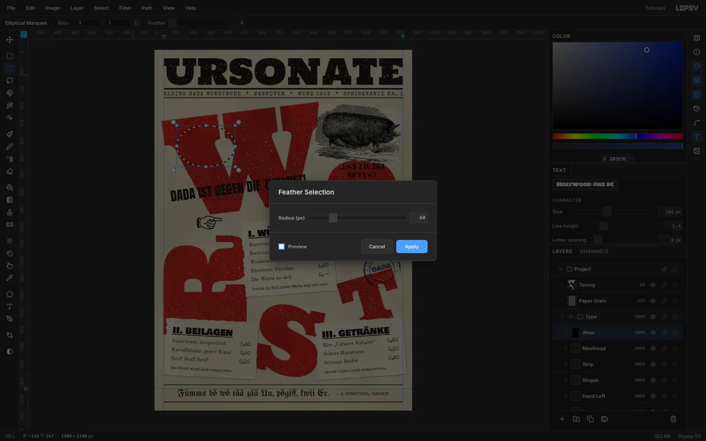

Even speckle everywhere looks like a filter. Draw a few large
**Elliptical Marquees** over the letters, choose **Select → Feather…** with
`60`, and fill them with black on **Wear**. This leaves cleaner, better-inked
patches. Finally, drag **Paper Grain** up to sit just under **Toning**, so the
grain textures the inks too.

Save with **File → Save Project** and export with **File → Quick Export PNG**.
