Dada was a 1916 art protest that answered a senseless war with deliberate
nonsense: ransom-note lettering, torn paper, jokes with a straight face and
objects in the wrong place. This tutorial makes a 1200 × 1600 px invitation
to an event that makes no sense, the annual regatta of the Iguana Yacht
Club, in the same spirit. There are no photographs. Every scrap is a flat
colour cut out with the **Lasso** or a marquee, lifted off the page with
a hard shadow so it looks like paper glued down.

The ransom-note title is six small layers, each a coloured tile with one
letter in its own font. You'll build them, tilt them, and move them as one
group.

The tools you'll meet along the way:

- the **Lasso**, **Elliptical Marquee** and **Rectangular Marquee**, plus **Select → Shrink**
- layer effects: **Drop Shadow** and **Stroke**
- the **Gradient** tool, **Filter → Halftone** and a **layer mask**
- text in **Abril Fatface**, **Anton**, **Bungee**, **Special Elite** and more, merged into tiles
- the **Move** tool's rotate handle, and its corner handles for scaling a whole group
- the **Pencil** with [[Shift]]-click lines
- **Filter → Fibers**, **Add Noise** and **Smoke** for paper texture
- layer **groups**, a guide, and **undo / redo**

The palette is old newsprint, five loud inks and two greens:

- Newsprint `#E8DEC6`
- Ink black `#141414`
- Vermilion `#D7261E`
- Mustard `#EDB21E`
- Teal `#1E8C8A`
- Cobalt `#2B4FA0`
- Iguana green `#4F9A3C` / `#1F5E2A`
- Dewlap orange `#E8691C`

## Start with newsprint

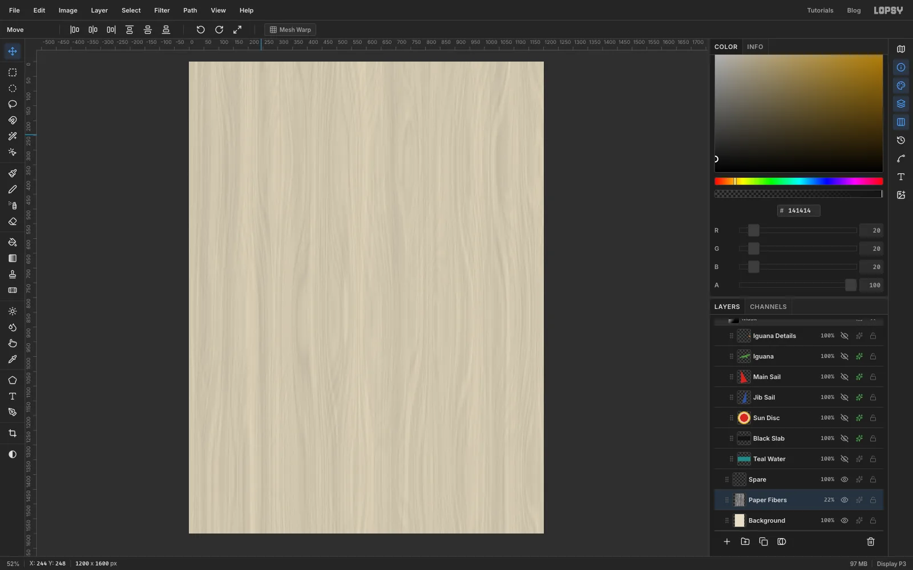

Choose **File → New**, set the units to **Pixels**, type **1200** and **1600**
and click **Create**. To set a colour, click the foreground swatch in the Color
panel, type the code into the hex box and press [[Enter]]. Do that with newsprint
`#E8DEC6`, then choose **Edit → Fill** on the Background layer: Fill paints the
current selection, or the whole layer when nothing is selected, in the foreground colour.

A few habits you'll use all the way through. The **+** at the bottom of the Layers panel adds a
layer, and the folder icon next to it adds a group. Double-click a layer's name to rename it.
The sparkle icon on the right of a layer's row opens the effects drawer, where the layer's
**Blend** mode and its effects such as **Drop Shadow** live. The layer's opacity is the **%** figure on its row.

Add a layer and name it *Paper Fibers*. Choose **Filter → Fibers**, set
**Variance** and **Strength** to 30 and apply. It looks like streaky wood, which
is fine for now. In the effects drawer set the layer's **Blend** to **Multiply**, then drop its
opacity to about **22%**. What's left is a faint grain, like an old page.

Click the group icon at the bottom of the Layers panel and name the
group *Collage*. Everything in the next few steps goes inside it. A new layer
lands inside a group when one of the group's layers is selected.

## Tear the water and the slab

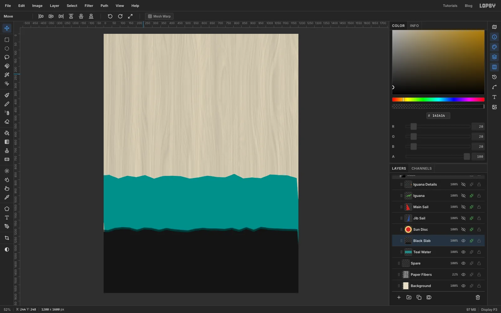

Add a layer named *Teal Water* inside *Collage*. Set the foreground to teal
`#1E8C8A`. The **Lasso** is freehand: press and hold the mouse button, move the
pointer, and release to close the shape. Start at the left edge a little over halfway
down the page and sweep to the right, wobbling the pointer up and down a few
pixels as you go so the edge looks torn. Carry on past the right edge, go down to about
a third of the way above the bottom, come back along a second wobbly line and
release near where you started. Choose **Edit → Fill**.

Add *Black Slab* above it, set the foreground to ink black `#141414`, and
lasso a second torn edge about three quarters of the way down, then
straight round the bottom corners so the slab runs off the page. Fill it.

Open the effects drawer for the slab and switch on **Drop Shadow**. Set
**Offset X** to 0, **Offset Y** to -12, **Blur** to 4 and **Opacity** to 60.
The negative Y throws the shadow upward, so the slab sits on top of the water.

> **Tip:** Drag the lasso past the page edge. Anything outside the page is
> clipped, and it saves you aiming at the exact corner.

## Cut out the sun

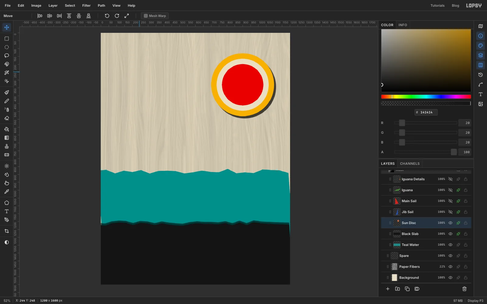

Add *Sun Disc*. With the **Elliptical Marquee**, drag a circle about 400 px
across in the upper right, and fill it with mustard `#EDB21E`. Choose
**Select → Shrink…**, set **Amount (px)** to 34 and fill with newsprint. Shrink
by 34 again and fill with vermilion `#D7261E`. Deselect with [[Cmd]]/[[Ctrl]]+[[D]].

Give this layer a **Drop Shadow** with **Offset X** 12, **Offset Y** 14,
**Blur** 3 and **Opacity** 70. Every cut-paper layer from here on gets the
same hard shadow, so the shadows all fall the same way.

## Cut the two sails

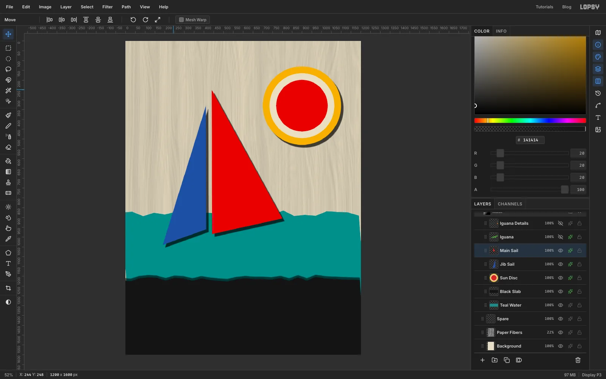

Add *Jib Sail*, set the foreground to cobalt `#2B4FA0` and draw a tall
thin triangle with the Lasso. Hold the button down and drag in straight runs
from corner to corner: the tip near the upper middle, down to the foot on the water,
out to a third point on the left, then back to the tip before you release.
Fill it. Add *Main Sail* above it, set vermilion, and cut a bigger triangle that shares the
same vertical edge as the jib but leans out to the right. Fill it.

Give both the same **Drop Shadow** as the sun. The shared edge becomes the mast.

## Cut the iguana

Add *Iguana* above the sails, set the foreground to green `#4F9A3C` and
use the Lasso to build the animal in one continuous drag of straight runs,
changing direction at each corner, the way you cut paper with scissors. Start at the thin
tail tip at the lower left, climb along the back to the head, drop to the snout,
come back under the chin, step down for the front leg, run along the belly,
step down again for the back leg, and return along the bottom of the tail to
the start before you release. About twenty corners is plenty, and straight
edges suit cut paper better than smooth ones. Follow the silhouette in the
screenshot, and if you don't like the result, undo and cut it again. Fill it, add the same **Drop Shadow**,
and the sails now appear to sit on its back.

## Add the spines, the dewlap and the eye

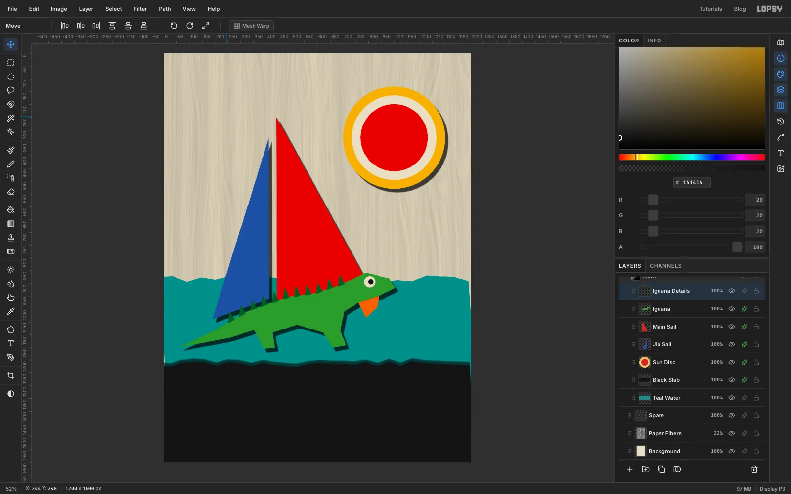

Add a layer called *Iguana Details* above the iguana. Set the foreground to dark green `#1F5E2A`
and lasso ten small triangles along the back, each sitting on the back line and leaning
slightly toward the head. A new Lasso shape replaces the old selection, so lasso one
triangle, fill it, and repeat for the next.

Switch the foreground to orange `#E8691C` and fill a small angular flap under the chin for the dewlap. For
the eye, drag a small circle with the Elliptical Marquee and fill it with newsprint, then drag a
smaller circle slightly forward inside it and fill that with ink black.

## Fade in a halftone with a mask

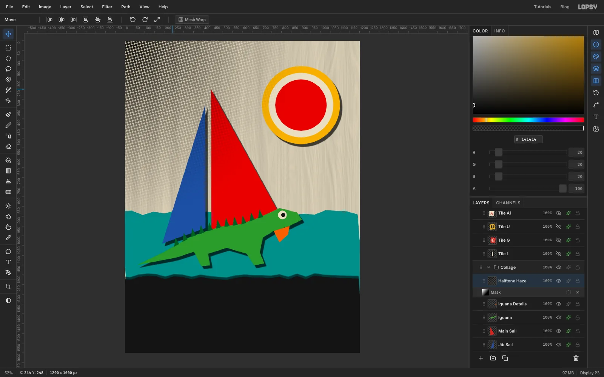

Add *Halftone Haze* above *Iguana Details*. Pick the **Gradient** tool and
set **Type** to **Radial**. Click **Advanced…** to open the gradient editor, which shows a bar
with a colour stop at each end. Click the left stop and pick ink black at full alpha, then click the right stop
and pick the same black with its **A** (alpha) value at 0, so the gradient fades out to nothing. Click **Done**, then drag from the top-left
corner out to about two thirds of the way across the page.

Choose **Filter → Halftone**, set **Dot Size** to 14 and **Angle** to 15 and apply. In the
effects drawer set the layer's **Blend** to **Multiply**. The dots print on top of the sails and
the paper, so everything looks like it has been through a screen press.

The dots are too heavy near the middle, so add a mask. Click **Add Mask** at the
bottom of the Layers panel, then click the mask's small thumbnail under the layer to edit it.
While you edit a mask the page shows a blue wash wherever the mask hides the layer. Pick the Gradient tool again, set **Type**
to **Linear**, make the left stop white and the right stop black (white reveals the dots and black hides them), and drag from the top-left of the page diagonally to the lower right.
Click the layer's own row to leave mask editing and the blue wash goes away. The dots now fade out smoothly.

## Make the ransom-note title

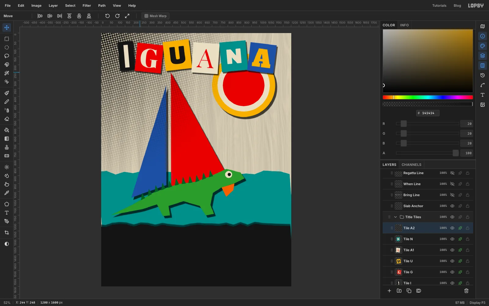

Click the *Project* row and press the group icon. Name it *Title Tiles*. Finish one
tile completely before you start the next. Each tile takes four moves:

1. Add a layer, drag a **Rectangular Marquee** about 190 px wide and 210 tall, and fill it with the tile colour.
   Make the **I** tile narrower, about 110 px, and let the others vary a little in height.
2. Click the tile's row so a raster layer is active, pick the **Text** tool, choose the font, set the size and colour, click on the tile and type the letter. Press [[Tab]] to commit.
3. With the **Move** tool, nudge the letter until it sits in the middle of the tile, then choose **Layer → Merge Down**.
4. Double-click the merged layer's name and rename it, for example *Tile G*.

The letters are: **I** Anton 190 cream on ink black, **G** Abril Fatface 190 cream on vermilion,
**U** Bungee 170 ink on mustard, **A** Playfair Display 190 vermilion on newsprint, **N** Rubik Mono One 150 cream
on teal, and a second **A** in Alfa Slab One 170 in mustard on cobalt. Keep a gap of about 15 px between tiles.

To tilt a tile, drag a **Rectangular Marquee** around its edges, pick the **Move** tool, and look for the rotate cursor
just outside a corner of the marquee's box. Drag in an arc around the box centre until the tile leans about 5 to 7°, then
press [[Cmd]]/[[Ctrl]]+[[D]] to finish. Alternate left and right from tile to tile so the row looks chaotic, then give each tile a
**Drop Shadow** with **Offset X** 7, **Offset Y** 9, **Blur** 3 and **Opacity** 65.

Finally, click the *Title Tiles* group row, pick the Move tool, hold [[Cmd]]/[[Ctrl]] and drag a corner handle toward the
centre to shrink all six tiles together by about 7%. Press [[Cmd]]/[[Ctrl]]+[[D]] to commit, then nudge the group with the
arrow keys until the left and right margins match, roughly 90 px each. The N and A tiles will overlap the top of the sun, which is
fine, because they are meant to look glued down over it.

> **Tip:** Click a raster layer before you start the text. If a text layer is still active when you change the font or
> size, the change restyles that layer instead of creating a new one.

## Set YACHT CLUB on the slab

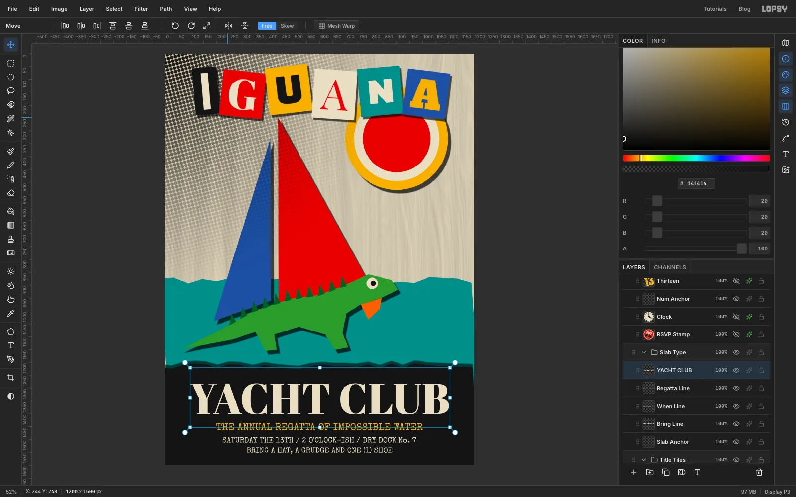

Click the *Project* row, add a group named *Slab Type* and a layer inside it called *Slab Anchor*. It stays empty. It is
just a raster layer to click before you create new text, so the text doesn't restyle an existing text layer. Click the *Slab Anchor* row, pick the Text tool, choose **Abril Fatface** at
size **166** in newsprint and type `YACHT CLUB`. Press [[Tab]] to commit.

Add three more lines in **Special Elite**: `THE ANNUAL REGATTA OF IMPOSSIBLE WATER` at 38 in mustard,
then `SATURDAY THE 13TH / 2 O'CLOCK-ISH / DRY DOCK No. 7` and `BRING A HAT, A GRUDGE AND ONE (1) SHOE` at 29 in newsprint.

Click the top ruler at the middle of the page to drop a vertical guide, then use the **Align center
horizontally** button in the Move tool's bar for each line. Leave the title a good 80 px from the left and right
edges and a little breathing room under the torn slab edge, and keep the last line at least 40 px above the bottom
of the page. Text this close to the edge looks cramped.

## Stamp the RSVP

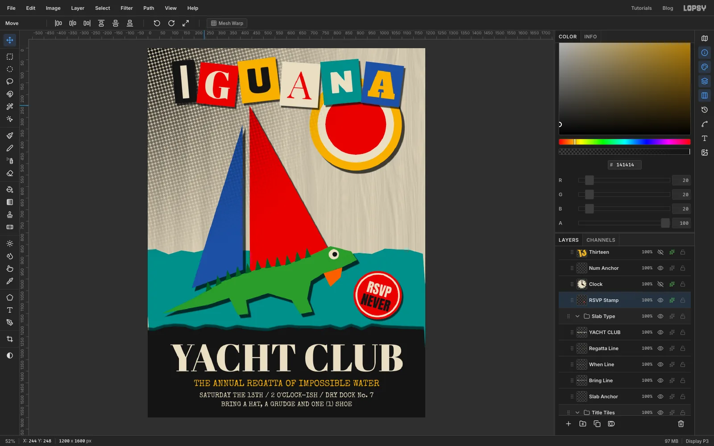

Click the *Project* row, add a group named *Dada Bits* and a layer in it called *RSVP Stamp*. With the
Elliptical Marquee drag a circle about 210 px across on the water, to the right of the iguana's head.
Fill it vermilion, shrink by 9 px and fill it newsprint, shrink by 7 px and fill it vermilion again.

Add two text layers in **Anton** at size 56, clicking the stamp's row before each: `RSVP` in newsprint and
`NEVER` in ink black. Centre them in the disc with a small gap between the lines. Select the lower text layer,
choose **Layer → Merge Down** twice so both words join the stamp, rename the layer *RSVP Stamp*, then
turn it about 16° with the Move tool and add the same **Drop Shadow** as before.

## Hang a clock on the wall

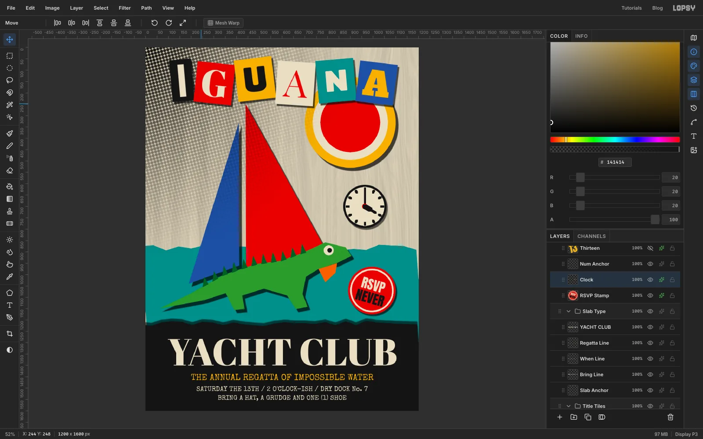

Add a layer called *Clock*. Drag a circle about 190 px across, fill it ink black, shrink by 9 and fill it with
newsprint. Pick the **Pencil**, set the **Size** in the options bar to 9 and the colour to ink black. Click once at the centre to set a start point, then
hold [[Shift]] and click straight up to the 12 position: the Pencil draws a straight line from your last click, which is the minute hand. Click at the centre again and [[Shift]]-click
toward four o'clock for the hour hand, which should be shorter than the minute hand. Raise the size to 17 and go over the inner half of the hour hand so it reads thicker.

Switch to the Elliptical Marquee, drag a tiny circle at the centre and fill it vermilion. Go back to the Pencil
at size 9 and [[Shift]]-click twelve short ticks around the rim. Add the usual **Drop Shadow**. The time is
wrong on purpose.

## Add the 13 and the tape

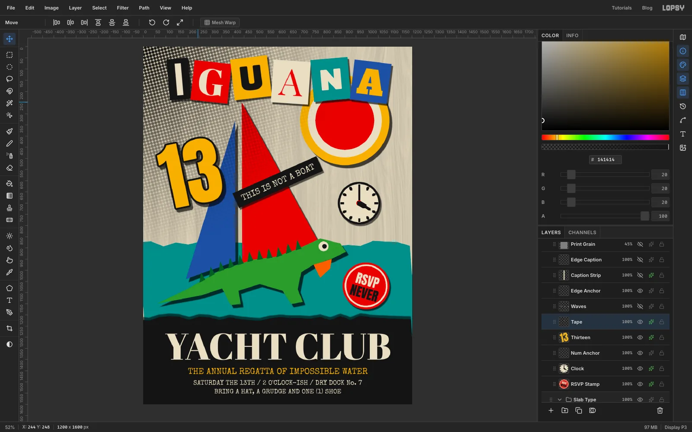

Add a layer called *Num Anchor*. Choose **Anton**, size **330**, mustard, and type `13`. Open the effects drawer and switch
on **Stroke** with **Width** 8 in ink black, then **Drop Shadow** with **Offset X** 10, **Offset Y** 12, **Blur** 3 and
**Opacity** 65. Turn it about 12° anticlockwise with the Move tool's rotate handle and place it on the left, over
the blue sail.

For the tape, add a layer called *Tape*, drag a Rectangular Marquee across the red sail about six times as wide as it is tall
and fill it ink black. Add `THIS IS NOT A BOAT` in **Special Elite**, size 38, newsprint, and centre it on the strip leaving a
clear stretch of black at both ends. Use **Layer → Merge Down** so the text and strip become one layer, rotate the tape about 24° anticlockwise, and add a **Drop Shadow**.

> **Tip:** Check that the text fits the strip before you merge it. Cream letters that spill past the black end
> disappear against the paper.

## Draw the waves

Add a layer named *Waves* and choose the **Pencil** at size 7 in newsprint. Click once at the start of a line,
then hold [[Shift]] and click a zigzag of points (each click joins to the last one), alternating up and down about 20 px every 30 px. Repeat for two
more short runs, staggered, below and to the left of the iguana.

## Caption the edge

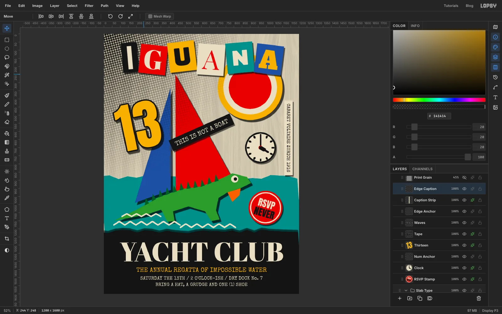

Add a layer named *Edge Anchor* and click it (like *Slab Anchor*, it stays empty). Type `CABARET VOLTAIRE ZURICH 1916` in **Special Elite** at 27 in ink black,
in the open area of the page, and rename the layer *Edge Caption*. Rotate it **90° clockwise**
with the Move tool first, while it is still in the middle of the page, then drag it to the right edge. If you
move it before rotating, its box runs off the page and the rotation clips.

Add a layer called *Caption Strip* directly under the caption, and fill a narrow Rectangular Marquee about 50 px wide with newsprint
so the type sits on its own scrap of paper, about 40 px in from the edge. Give it a **Drop Shadow**.

## Add grain and smoke

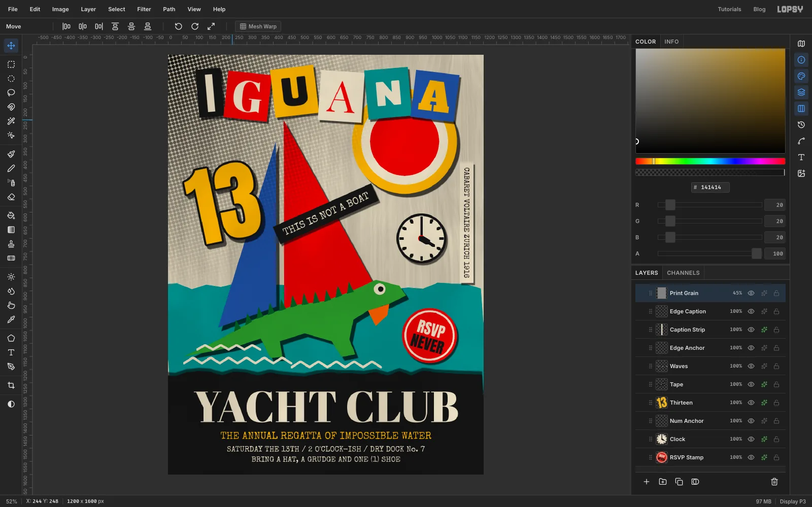

Add a layer called *Print Grain* on top. Set the foreground to mid grey `#808080` and choose **Edit → Fill**. Choose **Filter → Add
Noise**, switch on **Mono** and **Gaussian**, set **Amount** to 40 and apply. In the effects drawer set the layer's **Blend**
to **Overlay** and its opacity to **45%**.

Add one more, *Ink Smoke*: fill it with `#808080`, run **Filter → Smoke** with **Scale** 5 and **Turbulence** 60, set its **Blend**
to **Multiply** and drop the opacity to just **9%**. Anything higher turns the cream to mud.

## Try moving the title as one piece

This part is optional. Click the *Title Tiles* group row, pick the **Move** tool and drag on the canvas.
All six tiles and their shadows move together, and nothing else does.

## Undo and export

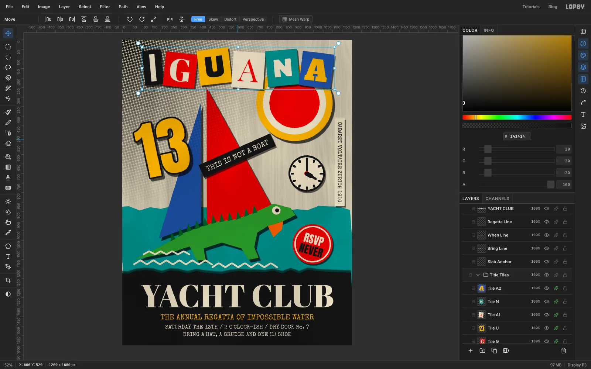

Press [[Cmd]]/[[Ctrl]]+[[Z]] and the tiles return exactly to where they were.
[[Cmd]]/[[Ctrl]]+[[Shift]]+[[Z]] puts them back at the lower position, and you can undo once more.
Export the invitation with **File → Quick Export PNG** and keep the project to tweak a
tile or a line later.

If you open the downloadable project you will notice a few empty layers named *Spare* and *Anchor*. They are only there to click before
creating new text, and you can delete them.
