A tattoo flash sheet is a menu. It's a sheet of ready-to-tattoo designs, each
with a number and a price, and clients pick one off the wall. Classic flash
uses bold black outlines around flat colour. **De Stijl**, the 1917 Dutch
movement of Mondrian and Theo van Doesburg, uses black lines between flat
planes of red, yellow and blue. The two fit together surprisingly well.

In this tutorial you'll make a **1400 × 1800 px** flash sheet called
*Rattlesnake Moon*. Every design is built from straight-edged planes: lasso
a shape, fill it black, then fill each colour plane **inset by 8 px** so a
black line is left between them. The grid is snapped, the title is built
from rectangles on a 5 × 5 raster like van Doesburg's 1919 alphabet, and
nothing is imported.

The palette:

- Paper `#EDE5D1`, white planes `#F4EEDF`, ink `#141414`
- Red `#D1291F`, yellow `#F2C230`, blue `#1F4E9A`
- Dagger steel `#C9C4B8` / `#8E8B84`

Fonts: **Space Mono** Bold (labels) and **Archivo Black** (credits). The
title is drawn, not typed.

## Make the paper

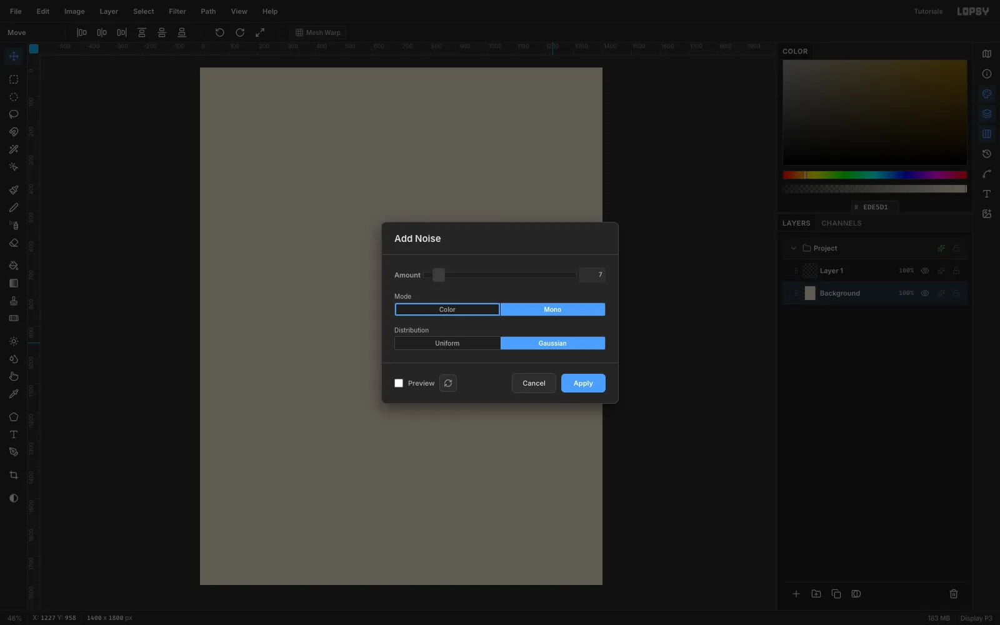

Choose **File → New**, keep the unit on **Pixels**, and create a
**1400 × 1800** document with a white background.

1. Set the foreground to `#EDE5D1`, select **Background** and choose
   **Edit → Fill** with no selection, which fills the whole layer.
2. Choose **Filter → Add Noise…**. Pick **Mono** and **Gaussian**, set the
   Amount to **7** and click **Apply**. This gives the sheet a faint paper
   tooth.
3. Rename **Layer 1** to **Color Planes**.

## Snap the Mondrian colour blocks

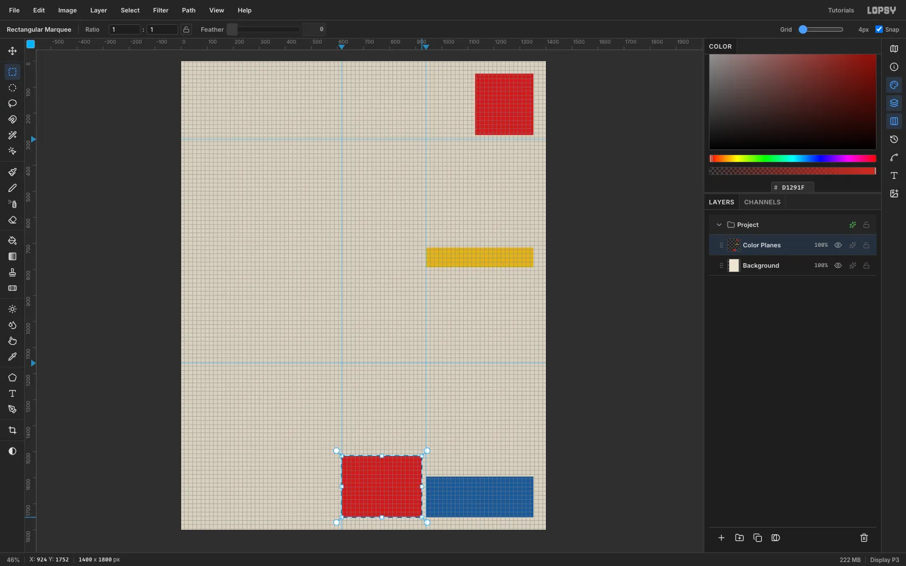

Choose **View → Show Grid**. In the options bar, drag the **Grid** slider to
**4px** and tick **Snap**. Every edge of the grid falls on a multiple of
4 px, so each marquee snaps into place. Then click the rulers to drop guides
at the main rules: on the top ruler at about **616** and **940**, and on the
left ruler at about **300** and **1160**. That splits the page into a header,
a big hero cell at the upper left, a right-hand column, and a bottom row.

On **Color Planes**, draw each block with the Rectangular Marquee and fill it
with **Edit → Fill**. The black rules you cut next will trim the edges, so
each block only needs to fill its cell without spilling past the rules into
the next one:

- Red `#D1291F`: the top-right corner cell, about 224 × 236 px, which will hold the sheet number, and the bottom of the middle column, right of the 616 guide, from about 1516 down to the frame.
- Yellow `#F2C230`: a thin strip across the right-hand column, about 76 px tall, a little above that column's middle (about 716 to 792 on the left ruler).
- Blue `#1F4E9A`: the bottom-right corner cell, right of the 940 guide, from about 1596 down to the frame.

## Cut the black rules

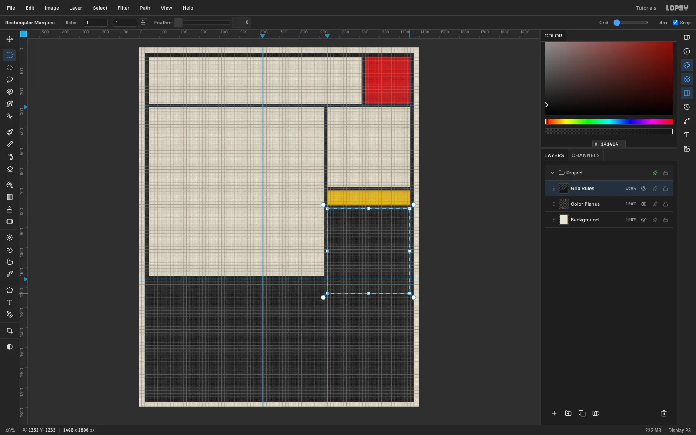

Add a layer named **Grid Rules**. Marquee the whole page with a 28 px
margin all round and fill it with `#141414`. Then marquee each cell and press
[[Delete]]. Leave a **20 px** black frame around the outside and **16 px**
rules between cells. Each guide sits on the right or bottom edge of a rule:

- **Header:** a 236 px tall band across the top, cut into a wide title cell and the 224 px wide red number cell at the right, with a 16 px rule between them. The header's bottom rule ends on the 300 guide.
- **Hero:** from the 300 guide down to 16 px above the 1160 guide, and from the frame across to 16 px short of the 940 guide.
- **Right column:** everything right of the 940 guide, cut into five cells stacked with 16 px rules: the swallow cell (down to about 700), the yellow strip, the rose cell (down to about 1232), the compass cell (down to about 1580) and the blue block.
- **Bottom row:** below the 1160 guide. The dagger cell runs across to 16 px short of the 616 guide. Right of that guide, the credits cell ends at about 1500, with the red block below it.

Notice that the rule under the credits cell and the rule above the blue
block don't line up: they're 80 px apart. A stagger that big reads as
deliberate; a 20 px one reads as a mistake.

Select both layers, choose **Layer → Group Layers**, and name the group
**Mondrian Grid**.

> **Tip:** If you'd rather type the cells than drag them, click once with the
> Rectangular Marquee while nothing is selected. A dialog opens with **From**
> and **To** fields for the exact corners.

## Build the title from rectangles

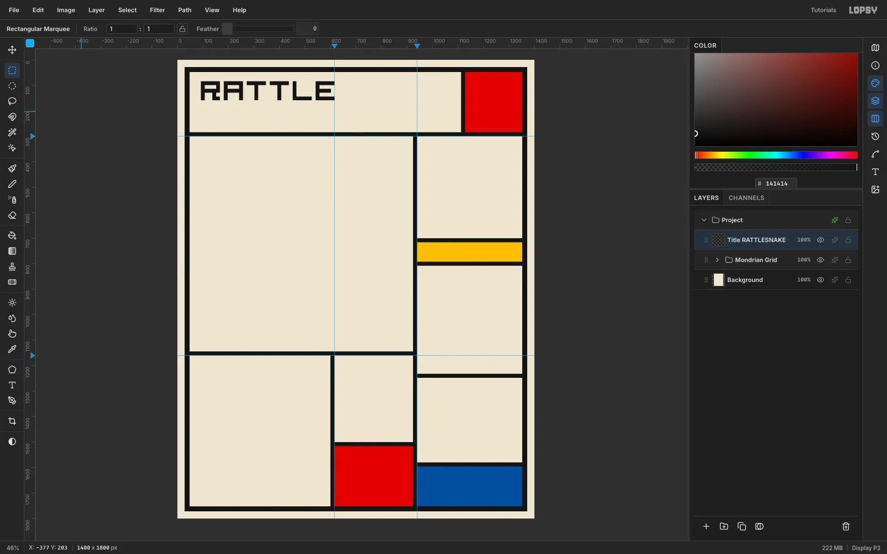

Van Doesburg drew his alphabet on a square split into a 5 × 5 raster. Each
letter here uses **15 px cells**, and letters are one cell apart. Untick
**Snap** first, because 15 isn't a multiple of 4.

On a new layer **Title RATTLESNAKE**, starting about 40 px in from the
header cell's top-left corner, draw each letter as rectangles (one per run of filled cells) and fill them black.
For example, **R** is a full top bar, the two sides, a full middle bar, then
a stepped leg. **N** and **K** use single-cell steps for their diagonals.

Repeat on **Title MOON** in red, one line lower: start its letters 96 px
below the top of RATTLESNAKE, which leaves a one-cell gap plus a little air. On
**Sheet Seven**, draw a large cream **7** with 30 px cells in the red block.
Group the three layers as **Header**, and turn the grid off.

## Lasso the moon

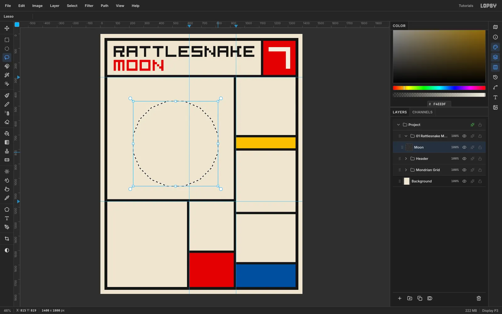

Make a new group **01 Rattlesnake Moon** and a layer **Moon** inside it.

The moon is faceted rather than round. With the **Lasso**, drag a
**16-sided polygon** about 600 px across, centred in the hero cell. Four
evenly spaced corners per quarter of the circle gives you 16 facets: press at
the top, drag in straight runs from corner to corner round like a clock face,
and let go back at the start. Fill it black. Straight facets keep
the crescent in the same language as the grid.

> **Tip:** For dead-straight facets, click each corner with the **Pen Tool**
> instead, click **Commit path**, then **Path to Selection** in the Paths
> panel.

## Cut the crescent

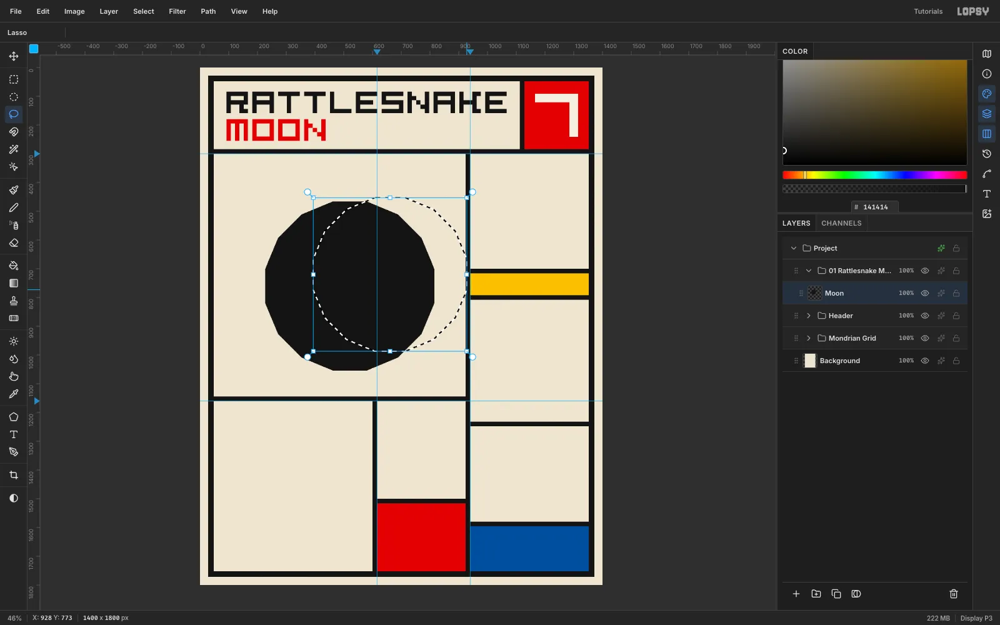

Lasso a second, slightly smaller 16-gon, about 545 px across, shifted about
140 px right and 40 px up from the first, and press [[Delete]]. Offsetting the cut up and to the right tilts the horns
slightly, like a tattoo moon.

## Inset the colour with Magic Wand and Shrink

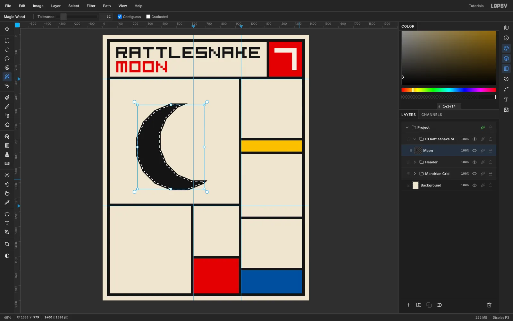

This is the core technique of the whole sheet:

1. Click the black crescent with the **Magic Wand** to select it exactly.
2. Choose **Select → Shrink** and enter **8**.
3. **Edit → Fill** with yellow `#F2C230`.

The 8 px of black left all around becomes the outline. Every plane on the
sheet uses the same 8 px, so the line weight stays consistent.

## Lay down the snake silhouette

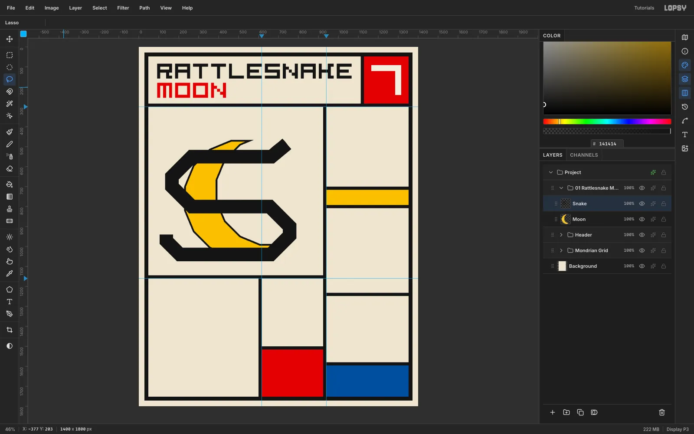

Add a layer **Snake** above Moon. The body is one **68 px** band with
mitred corners that zigzags down the hero cell like an S:

1. Start at the neck, up and to the right of the moon, and step down-left at 45° to the top bar.
2. Run the top bar left across the moon's upper horn to near the left side of the cell, then turn down the left side.
3. Run the middle bar right, across the middle of the crescent, then turn down the right side.
4. Run the bottom bar left near the bottom of the cell, then turn up into a short tail at the far left.

Keep the three bars about 250 px apart. Lasso the whole outline in one pass,
dragging straight runs that turn at both edges of the band at every corner,
and fill it black. Only 45° and 90°
turns are used, so the S stays geometric but still reads as coiling.

## Fill the body plane by plane

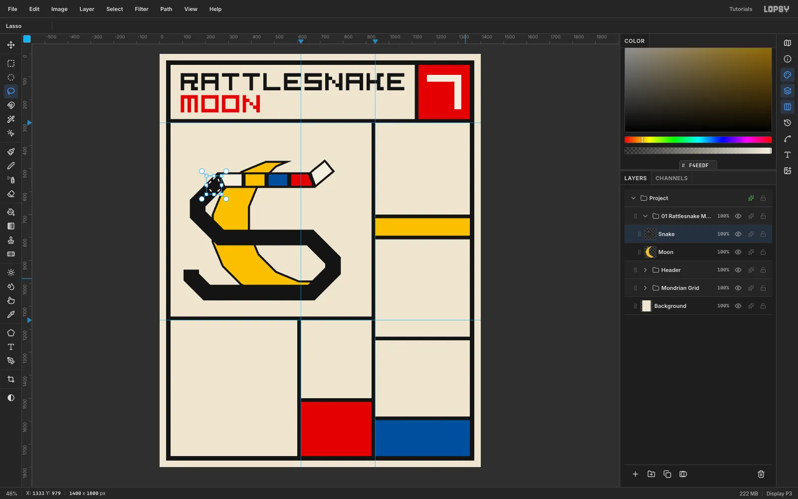

Split each straight run into segments of about 90 px. For each segment:

1. Lasso the segment (the corner pieces are trapezoids that meet the miter).
2. Choose **Select → Shrink 8**.
3. Fill it with the next colour in the cycle: cream, red, blue, yellow.

## Check the rhythm

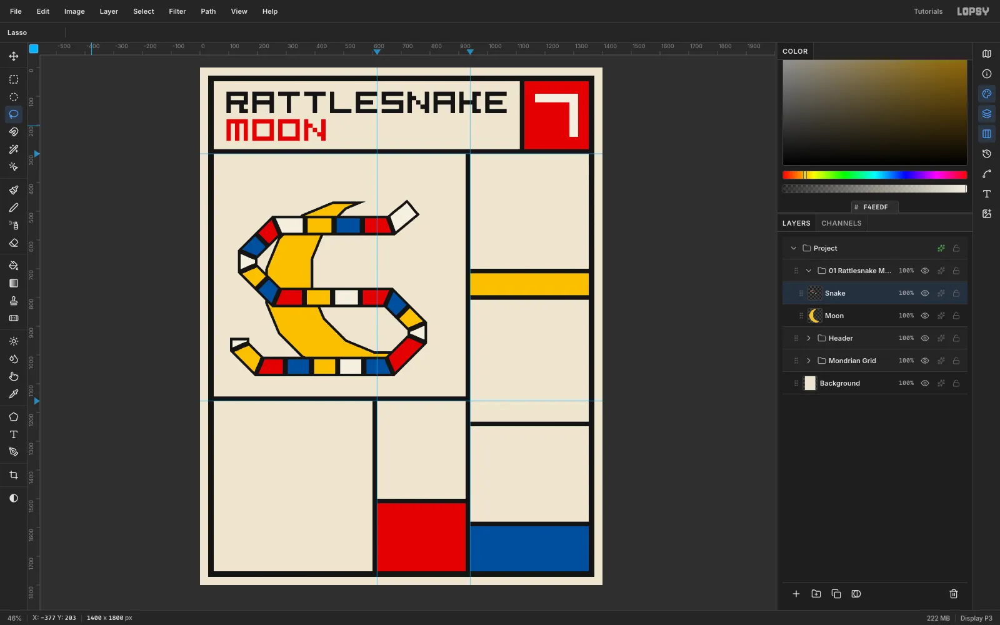

The colours should never repeat side by side. The black seams are 16 px
between planes (8 + 8) and 8 px along the outer edge, the same as the moon.

## Copy the upper horn

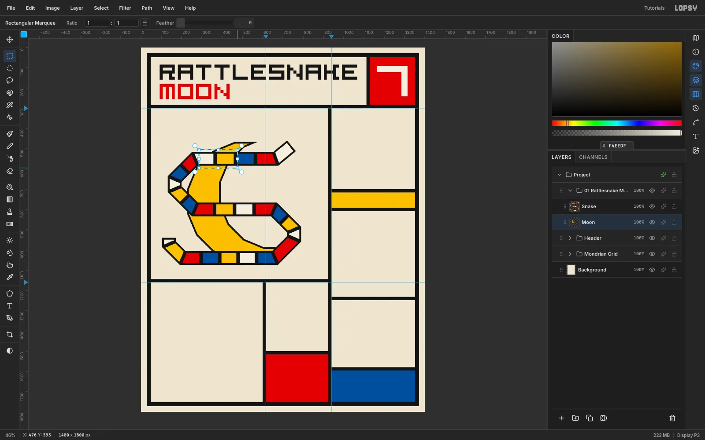

The snake has to weave: in front of the moon at the middle and bottom bars,
behind it at the top bar. Select **Moon**, marquee the piece of the upper
horn where the top bar crosses it, a little wider and taller than the bar,
and press [[Cmd+C]].

## Paste the horn over the snake

Press [[Cmd+V]]. The paste lands in place on a new layer, directly above
Moon. Rename it
**Moon Horn** and drag its row above **Snake** in the Layers panel. The
horn now covers the top bar, so the snake appears to loop behind the moon.

## Add the head and the rattle

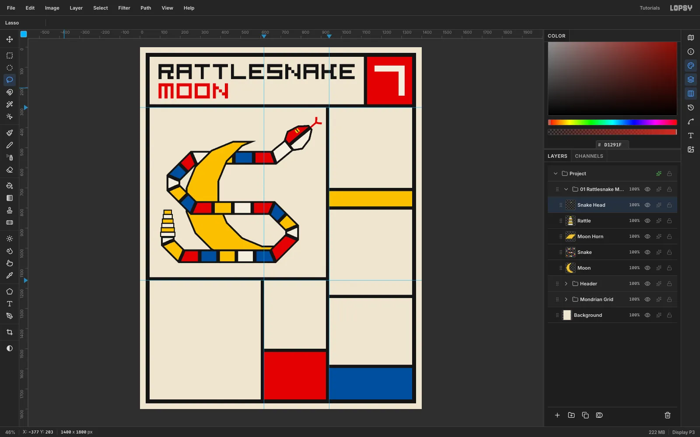

On a layer **Snake Head**, lasso a wedge-shaped viper head pointing up and
to the right, 40° above horizontal. Fill it black, then fill two inset
planes: a red crown and a cream jaw, with the 8 px black line between them
reading as the mouth. Add an 18 px yellow eye with a black vertical slit
and a forked red tongue.

On **Rattle**, stack six mitred rectangles up from the tail tip. They are
26 px tall and narrow from **76** to **42 px** wide. Fill each one black,
shrink it by **4** and fill it cream or yellow in turn. Keep them square so
they match the rest of the sheet.

## Scatter and scale the sparkles

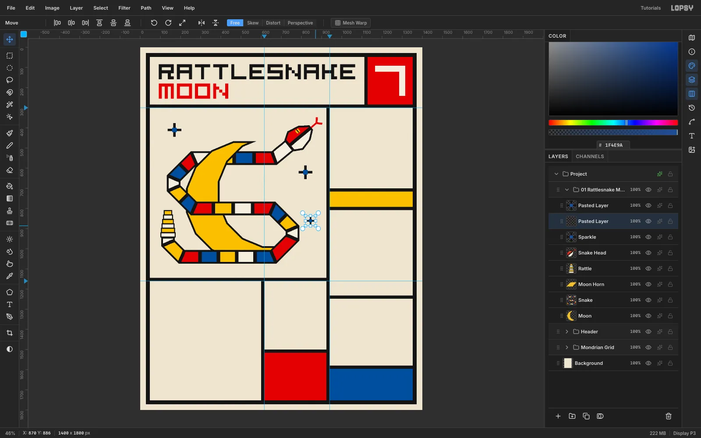

On **Sparkle**, draw a black plus about 68 px across with a blue square in
the middle. To duplicate it:

1. Marquee it and press [[Cmd+C]], then [[Cmd+V]].
2. Use the **Move** tool to drag each copy into place. Put one in the empty
   top-left corner and one to the right of the lower bend.
3. On the second copy, marquee it and hold [[Cmd]] while you drag a corner
   handle inward. That scales it uniformly to about two-thirds.
4. Press [[Cmd+D]] to commit.

Then click the top pasted layer and choose **Layer → Merge Down** twice.

## Nudge the whole group

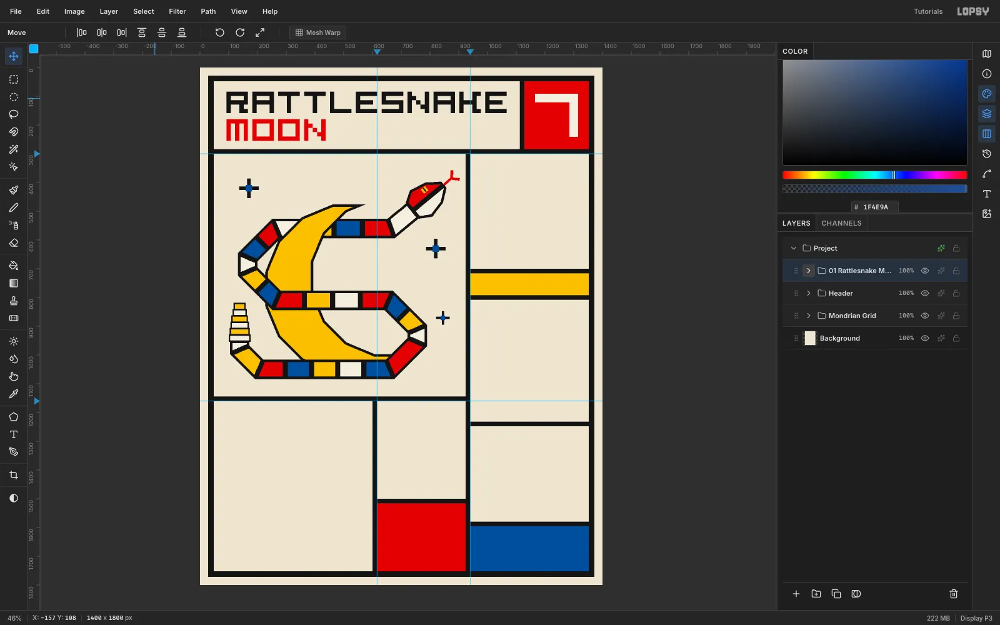

Select the **01 Rattlesnake Moon** group row and switch to the Move tool.
Press [[Shift+Down]] to nudge the whole group 10 px down, so it sits
optically centred in its cell. Moving the group moves every layer inside it
together.

## Draw the swallow

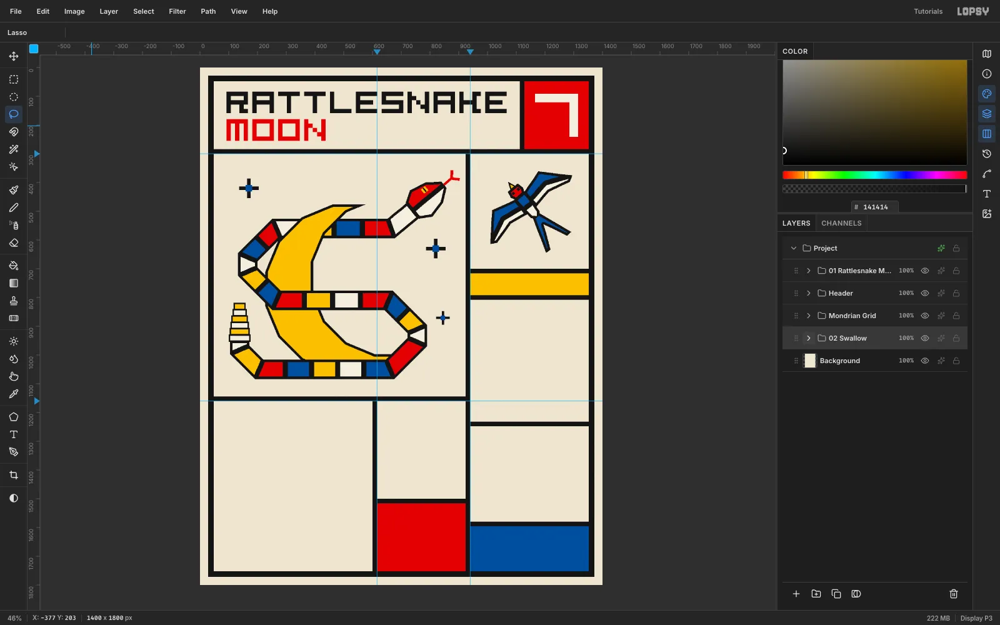

Make a group **02 Swallow** with a layer **Swallow**. The bird is seen from
above, flying up and to the left at 40°. Lasso each part at its final angle:
a hexagonal red head, a pointed yellow beak, a blue back, a cream belly,
swept wings with blue leading and cream trailing planes, and a forked blue
tail.

As before, fill each part black, then fill each plane with **Shrink 8**.
Draw it at the final angle instead of rotating it afterwards. A rotated
hard-edged selection comes out with stair-stepped edges.

## Layer the spiral rose

In a group **03 Rose**, draw the stem and two blue leaves first. Then add
four nested squares centred in the rose cell, a little above its middle,
each turned 24° further than the last:

- 212 px at 14°, red
- 168 px at 38°, cream
- 124 px at 62°, red
- 82 px at 86°, cream

Fill each square black, then fill it with **Shrink 8**. Finish with a black
centre square. The corners that poke past the square below read as layered
petals. Keep the planes large, because slivers under about 15 px look like
noise.

## Lasso the compass outline

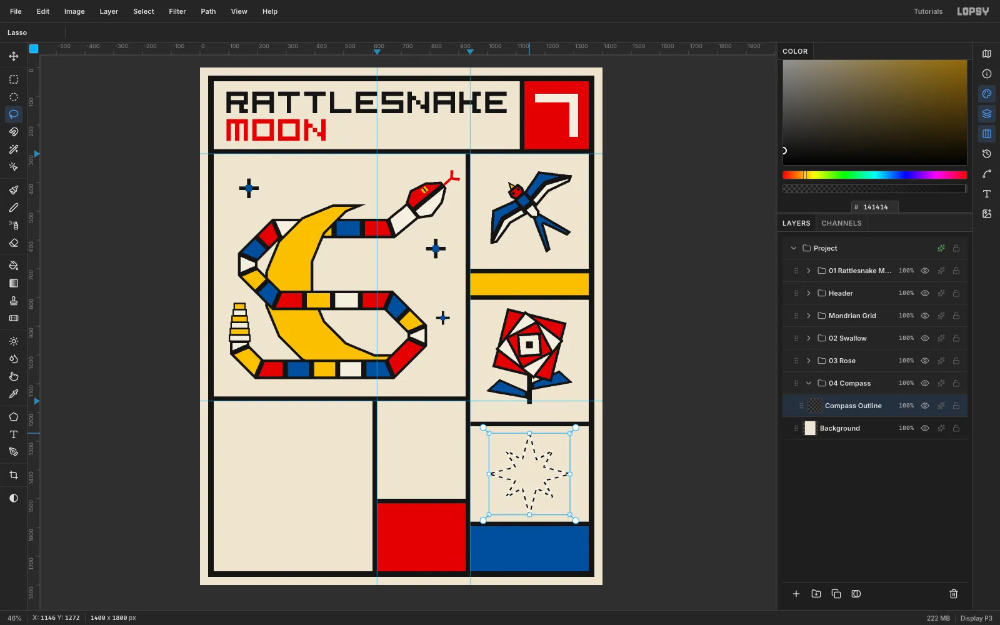

In a group **04 Compass**, make a layer **Compass Outline**. Lasso an
eight-pointed star whose outline sits **8 px** outside the points, with
sharp mitred tips. Fill it black.

This is the same 8 px outline you get from Shrink, grown outward instead.
The Stroke layer effect would also outline the star, but it rounds the
tips, and every other corner on this sheet is sharp.

## Split the compass points

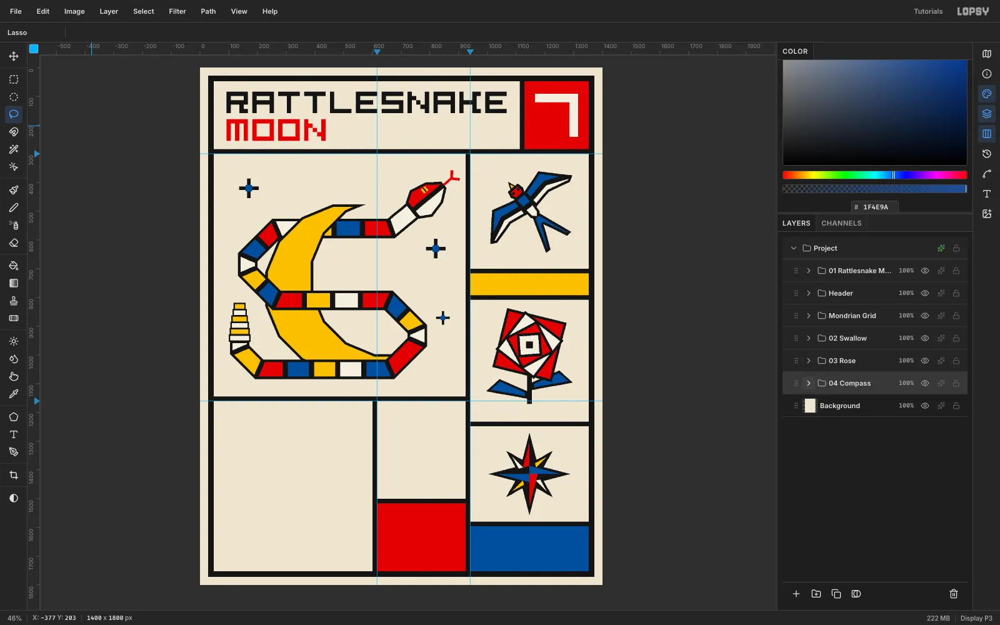

On a layer **Compass** above the outline, fill each point as two triangles
from the centre, one half black and one half coloured:

- The four long points (110 px) take red and blue.
- The four short points (84 px) take yellow and cream.

The light and dark halves give the classic nautical-star bevel with no
shading at all.

## Build the dagger

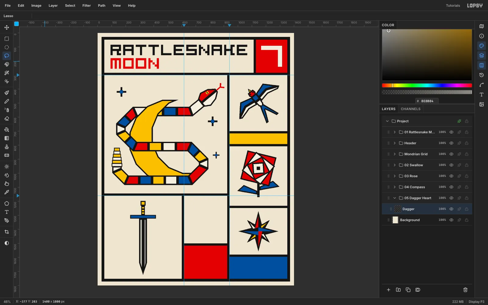

In a group **05 Dagger Heart**, make a layer **Dagger**, centred across the
bottom-left cell. Build it from rectangles and a lasso:

- A yellow square pommel, and a black grip with three yellow bands
- A blue crossguard
- A long blade split down the middle into light `#C9C4B8` and dark
  `#8E8B84` halves with **Shrink 8**

## Add the heart, banner and MOM

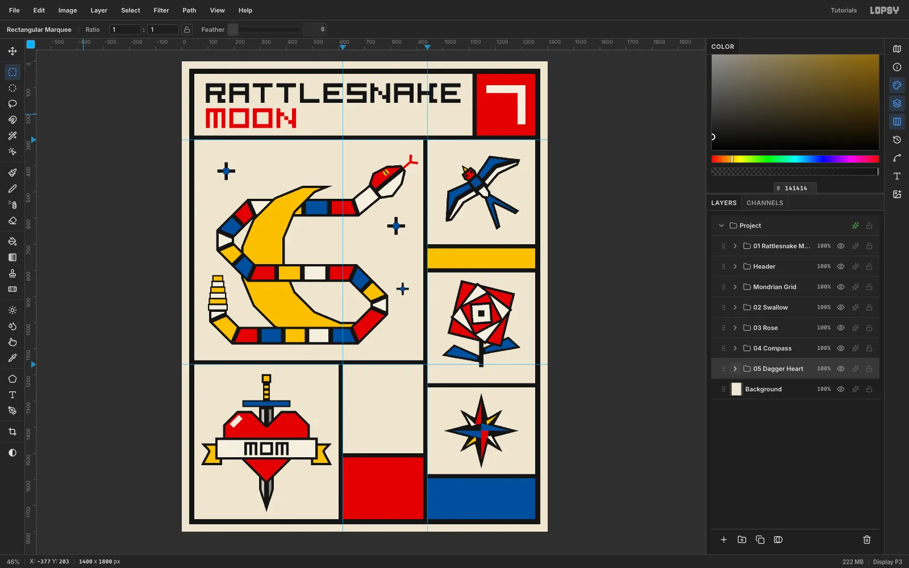

On **Heart**, above the dagger, lasso a chamfered heart and fill it black,
then red with **Shrink 8**. Add a cream highlight on the upper-left lobe.
The dagger now appears to pass through it.

On **Banner**, fill a 392 × 84 px rectangle across the heart and cream-inset
it by 8 px. Add folded yellow tails behind each end.

On **Banner MOM**, draw **MOM** in the same raster as the title, with 10 px
cells, centred on the banner. Using the raster face here ties the flash
to the title.

## Set the tagline

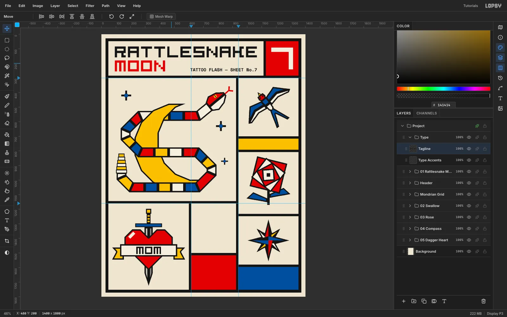

Make a group **Type** at the top of the stack with a raster layer
**Type Accents** inside it. Click Type Accents so new text lands in the
group.

With the Text tool, choose **Space Mono**, weight **Bold (700)**, size
**30**. Click in the empty header cell and type
**TATTOO FLASH — SHEET No.7**, then press [[Tab]] to commit. With the Move
tool, arrow-nudge it until its right edge lines up with the final E of
RATTLESNAKE and its baseline sits level with the bottom of MOON.

## Number and price each design

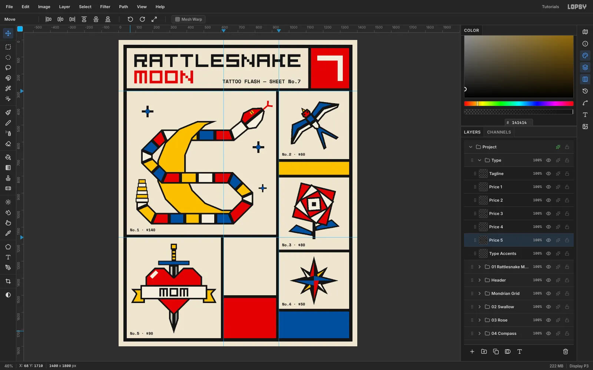

Flash needs a number and a price for each design. Type each label in Space
Mono Bold **22**:

- No.1 · $140, No.2 · $60, No.3 · $80, No.4 · $50, No.5 · $90

Put each one 20 px in from the cell's left edge and about 20 px above its
bottom rule. Give them all the same inset so they line up down the sheet.

## Fill the credits and colour blocks

In the credits cell, type **WALK-INS / WELCOME** in Archivo Black **36**.
Add a 140 × 12 px red bar on Type Accents, then
**OPEN DAILY / 12 — 10 PM / NO APPOINTMENT / NEEDED** in Space Mono **21**.
Stack the three with 26–28 px gaps and centre the block vertically.

Type **EST. 1917** and **AMSTERDAM** in Archivo Black **43** in cream and
centre each in its block. Use the same size for both so the cap heights
match. Add **PRICES INCLUDE COLOUR** (Space Mono Bold 20) in the yellow
strip.

## Rotate the vertical credit

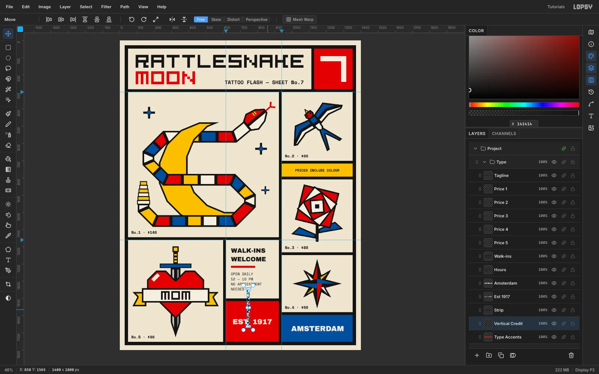

Type **HAND-PAINTED FLASH** in Space Mono Bold **20** somewhere empty. Then:

1. Click **Rasterize Layer** in the Layers panel, so the credit becomes
   plain pixels you can turn like any other artwork.
2. Marquee the text and switch to the Move tool.
3. Click **Rotate 90° CCW** in the options bar, then press [[Cmd+D]].

Arrow-nudge it into the narrow gap at the right side of the credits cell,
with its bottom level with the last line of the hours.

## Draw the construction lines

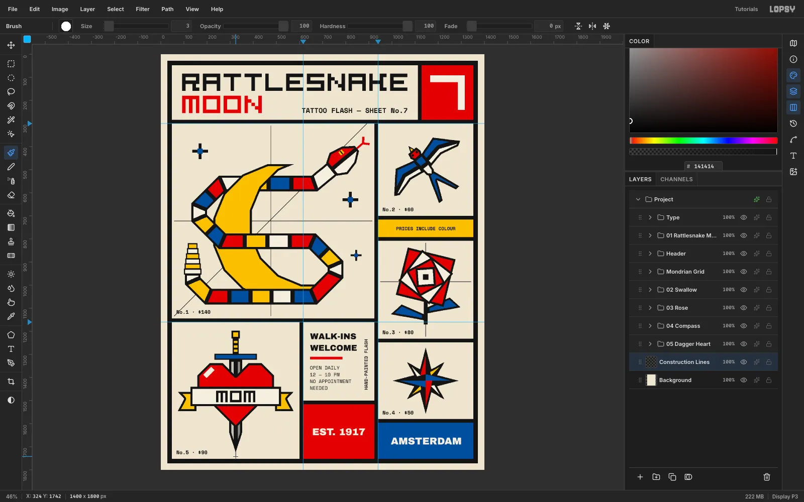

Add a layer **Construction Lines** just above Background, under everything.
Use the Brush at size **3**, hardness **100**, in black. Click once, then
[[Shift]]-click the far end to draw a straight line. Draw:

- A vertical, a horizontal and a 45° diagonal through the hero
- A cross through the rose
- A vertical through the dagger

Then use the **Eraser** at size **40** to clear any line that crosses a
price label. Leave lines out of the swallow and compass cells, where they
would read as extra wings or compass points.

## Recolour them with Color Overlay

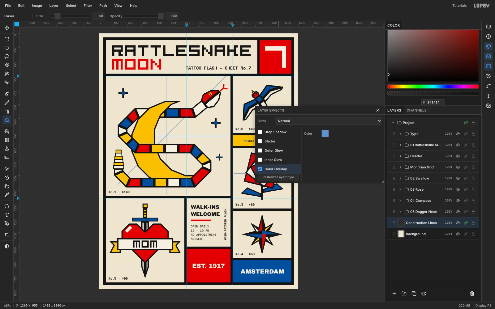

Open the layer's **Layer effects**, enable **Color Overlay** and set it to
`#5E8FD0`. Designers' non-photo blue can now change without redrawing
anything. Set the blend mode to **Multiply** and the opacity to **55%**, so
the lines sit quietly on the paper like pencil guides.

## Tone the paper and add grain

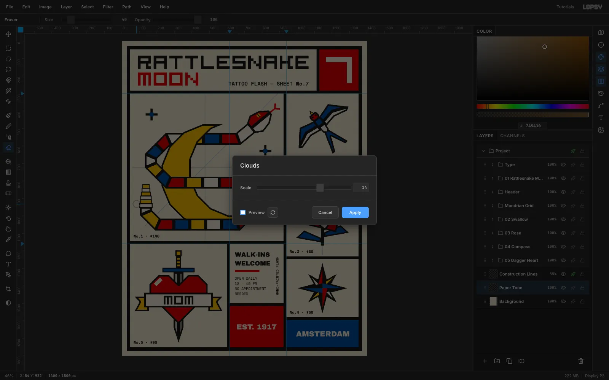

Add a layer **Paper Tone** just above Background and run
**Filter → Clouds…** at **Scale 14**, then **Filter → Gaussian Blur…** at
**Radius 6**. Set it to
**Multiply** at **6%**. Because it sits *under* the colour planes, it tints
only the paper, and the red, yellow and blue stay flat.

For the print texture, add a top-level layer **Ink Grain** above the Type
group. Fill it with `#808080`, run **Filter → Add Noise…** at **Amount 50** (Mono,
Gaussian), and
set it to **Overlay** at **50%**.

## Final polish

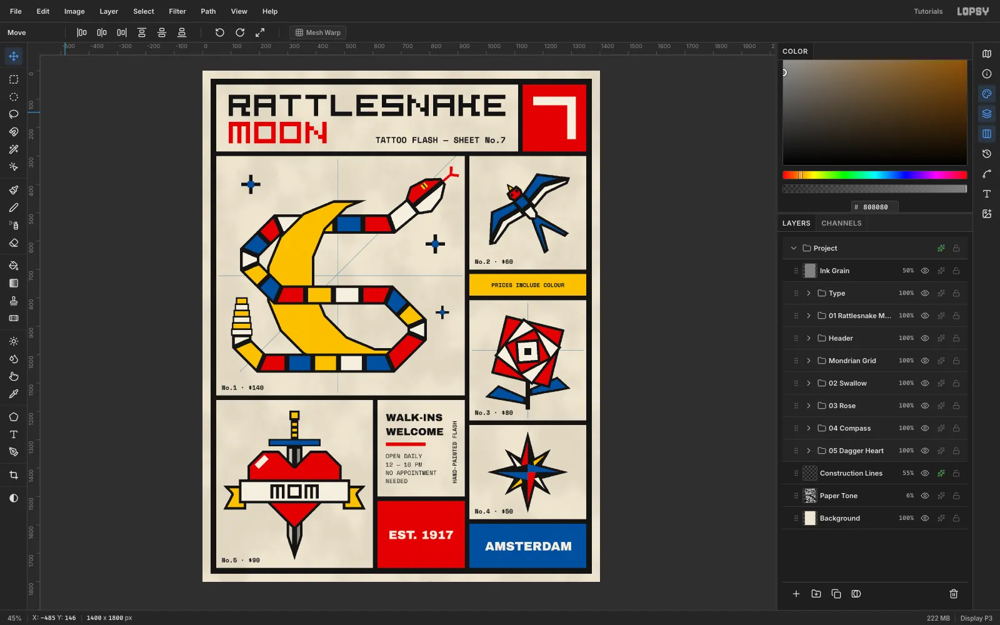

Check each design against its cell's edges before you export. Here the rose
sat too close to the rule above it, so select the **03 Rose** group and nudge
it down about 24 px ([[Shift+Down]] twice, then [[Down]] four times). The
snake's bottom bar crowded its price label, so nudge the whole
**01 Rattlesnake Moon** group up 20 px.

Choose **File → Quick Export PNG**, and **File → Save Project** to keep the
layered `.lopsy` file.

> **Tip:** Every inset on this sheet is 8 px. If you add a design of your
> own, fill the silhouette black and then Shrink 8, and it will sit in the
> set.
