Deconstructivist graphic design came out of Cranbrook in the 1980s and David
Carson's *Ray Gun* in the 1990s. It breaks the grid on purpose: type is
sliced and shifted, planes collide at conflicting angles, and one colour rule
holds all the chaos together. The architects of the same name, such as Hadid,
Libeskind and Gehry, did the same thing to buildings.

This cover is for a made-up music and architecture quarterly, **RIFT**. Its
cover story is **Iannis Xenakis**, the composer who was also Le Corbusier's
engineer. In 1954 he drew the string glissandi of *Metastaseis* as straight
lines on a pitch/time graph. Four years later those ruled lines became the
hyperbolic-paraboloid shells of the Philips Pavilion. You'll draw those
shells from straight brush lines and cut a literal rift through the page.
You'll also split the masthead and make the headline change colour as it
crosses a plane. The document is 1400 × 1820 px.

The palette:

- Concrete `#C9C5BC`, formwork seams `#6F6B64`
- Ink `#141414`
- Ultramarine `#2A2FD8`
- Acid lime `#D3F53A`
- Off-white `#F4F3EE`

## Pour the concrete

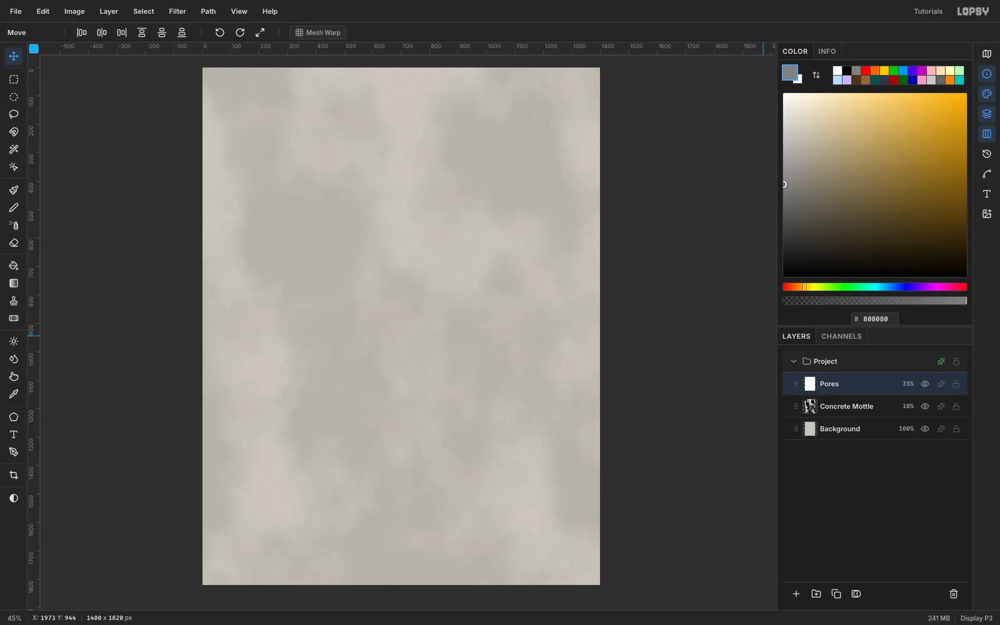

Choose **File → New**, set **Unit** to **Pixels** and enter **1400 × 1820**
with a **White** background. Fill the Background with `#C9C5BC` using
**Edit → Fill**. Rename *Layer 1* to **Concrete Mottle** and run
**Filter → Clouds…** at **Scale 6**. Then, in the layer's effects drawer,
set **Blend** to **Multiply**, and set the layer's opacity to **10 %**.

For pores, add a **Pores** layer and fill it with `#808080`. Run
**Filter → Add Noise…** with **Mono**, **Gaussian** and **Amount 100**, then
**Filter → Threshold…** at **Level 84**. Set the layer to **Multiply** at
**35 %**.
Only a scatter of dark specks survives.

## Add board-form seams and tie holes

Poured concrete remembers its formwork. Add a **Formwork** layer and pick the
**Brush** at **Size 3**, **Hardness 100**, in `#6F6B64`. For each seam,
click once at one end, then **Shift-click** the other end to draw a straight
line. Draw a horizontal seam every 350 px down the page (350, 700, 1050,
1400 and 1750 on the left ruler) and one vertical seam straight down the
centre. That divides the wall into 700 × 350 px boards.

Each board gets six tie holes in two rows of three. Space them evenly: about
a sixth, half and five-sixths of the way across the board, and a quarter and
three-quarters of the way down it. For each hole, [[Cmd]]-drag a 14 px circle
with the **Elliptical Marquee** and fill it. Set the layer to **Multiply** at
**45 %**.

## Tilt the blue plane

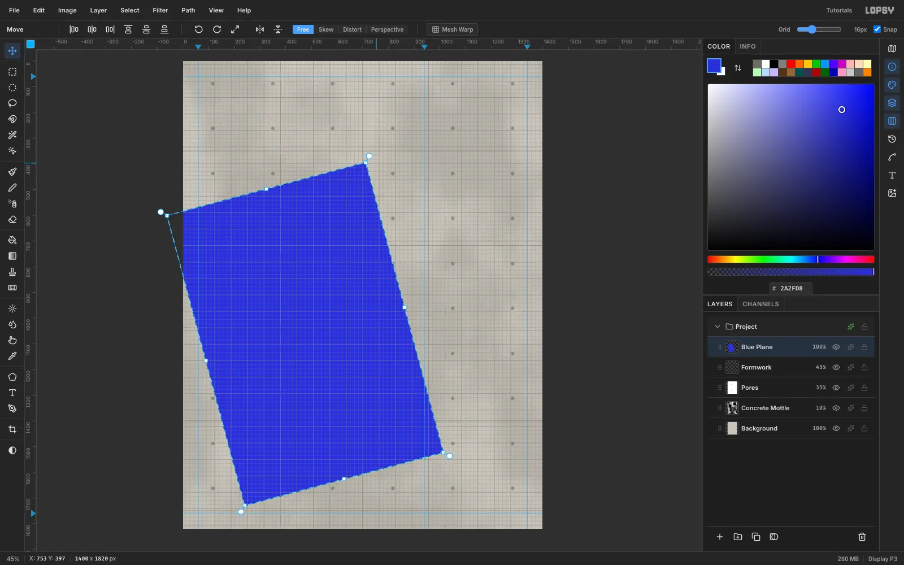

Set margin guides first. Click the top ruler about 60 px in from each side,
plus once at about 940 to mark the left edge of the right-hand text column.
Click the left ruler about 60 px from the top and from the bottom. Then turn
on **View → Show Grid**, which also switches on **Snap**. Add a
**Blue Plane** layer, drag a tall **Rectangular Marquee** about
800 × 1170 px, starting just inside the left margin about a quarter of the
way down the page, and fill it with `#2A2FD8`.

Switch to the **Move** tool, grab the rotate handle just outside the top-right
corner, and drag it counter-clockwise. With grid snap on, rotation snaps in
15° steps, so stop at **−15°**. Press [[Cmd+D]] to commit, then turn the grid
off again.

## Draw the first ruled lines

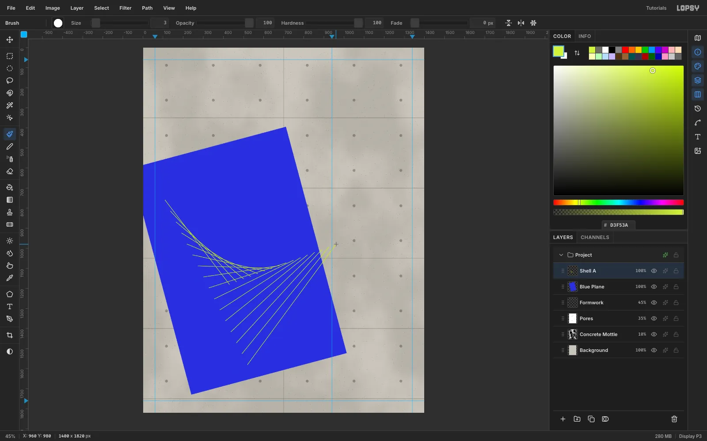

A hyperbolic paraboloid is a curved surface built entirely from straight
lines. Take a twisted four-corner frame. Join evenly spaced points on one
edge to evenly spaced points on the opposite edge, and the lines sweep a
curve out of nothing.

Add a **Shell A** layer and set the Brush to **Size 3**, **Hardness 100**,
in lime `#D3F53A`. Pick four corners for a twisted frame over the tilted
plane:

- **A** just inside the plane's left edge, about 40% of the way down the page
- **B** near the plane's bottom, a little left of the page's centre
- **C** just past the plane's right edge, a little below the middle of the page
- **D** inside the plane, about 400 px above B and slightly to its left

Divide edge A→B and edge D→C into 16 evenly spaced points each. Click a point
on A→B, then Shift-click the matching point on D→C. After 16 lines the saddle
curve already shows.

> **Tip:** The X and Y readout at the bottom-left of the window shows where
> the pointer is, which makes it easy to space the points evenly.

## Complete three shells

For the second family of lines on Shell A, join the points on A→D to the
points on B→C. Then add a **Shell B** layer in ink `#141414`. Its frame
shares Shell A's corner B, runs about 600 px right to a second corner at
about the same height, rises to a sharp apex almost straight above that
corner, about 500 px down the page, and comes back to an inner corner about
400 px above B, near the centre of the page. Draw both families of lines the
same way. The shell rises past the plane onto the concrete, like the Philips
Pavilion's spike.

Finish with a **Shell Seam** layer in lime: a single family of 11 lines
linking Shell A's D→C edge to Shell B's D→C edge.

## Slice a lime band across everything

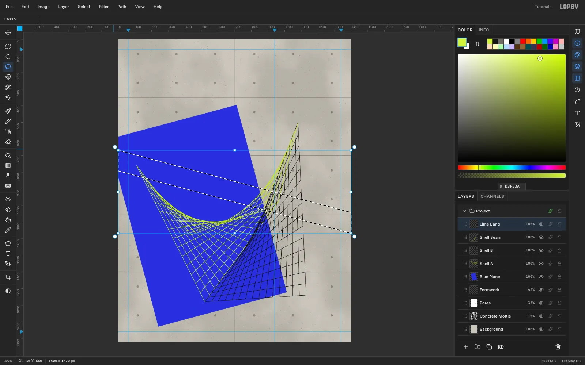

Add a **Lime Band** layer on top of the shells. With the **Lasso**, drag a
thin parallelogram in four straight runs, **124 px** tall, that runs right across the page and a
little off both sides. Start just outside the left edge, about 660 px down,
and end just outside the right edge about 390 px lower. That drop makes a
band descending at **+15°**, the mirror of the plane's −15°, so the two form
an **X** for Xenakis. Fill it with `#D3F53A` and deselect. Because it sits above the
shells, it cuts straight through them.

## Slide everything below the band

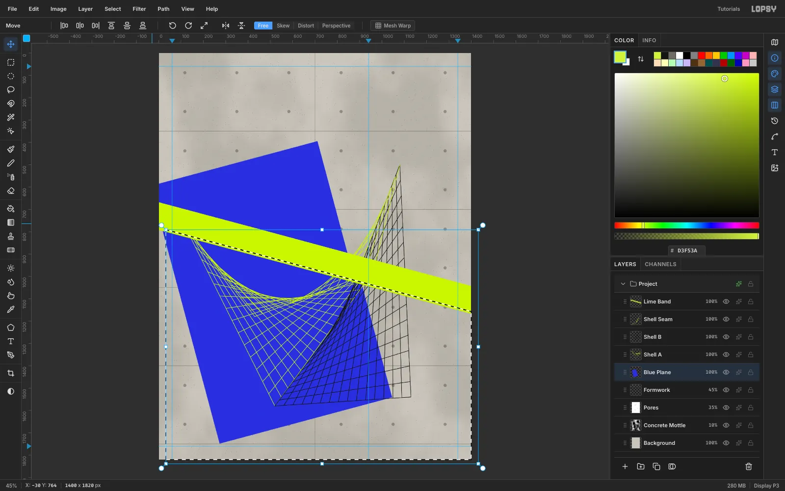

Deconstructivist planes don't line up; they slip. Select **Blue Plane** and
lasso everything below the band: press outside the left edge of the page and
drag straight along a line 20 px above the band's lower edge to outside the
right edge, then run down past the bottom of the page and back, and let go. Switch to the **Move** tool and nudge **32 px right** and
**19 px down** ([[Shift+Right]] three times, [[Right]] twice, [[Shift+Down]] once,
[[Down]] nine times).

The selection moves with the pixels, so re-draw the same lasso before
nudging **Shell A**, **Shell B** and **Shell Seam** by the same amount.

## Set and scale the masthead

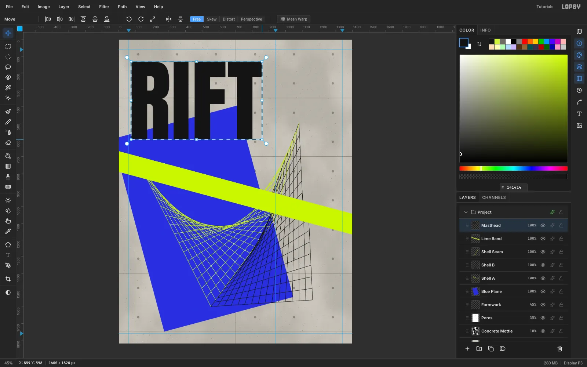

Choose the **Text** tool, set the font to **Anton** and the size to **430**,
and click near the top-left. Type **RIFT** in ink and press [[Tab]]. Click
**Rasterize Layer** in the Layers panel, marquee the word, and hold [[Cmd]]
while dragging the bottom-right handle to scale it uniformly to about
**125 %**. Press [[Cmd+D]], then drag it until its top-left corner lines up
with the top and left margin guides.

## Split the masthead

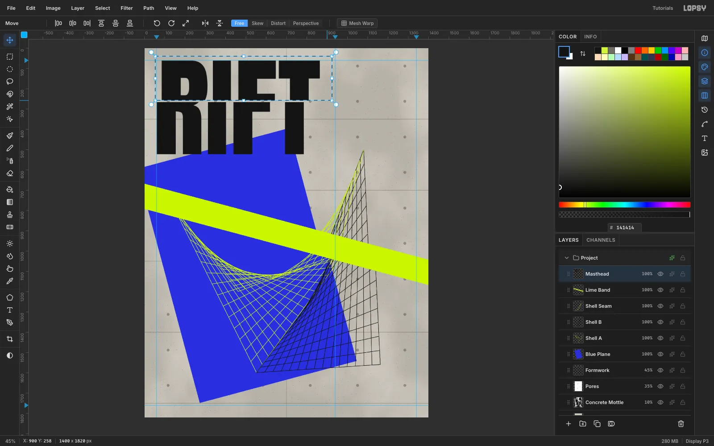

Marquee an **8 px** strip straight across the middle of the word, a little
wider than it, and press [[Delete]] to open a gap. Then marquee everything
above the cut and nudge it **24 px right** with the Move tool (two
[[Shift+Right]] presses, then four [[Right]]). Press [[Cmd+D]]. The word still reads as RIFT, but it's visibly torn.

## Set the headline

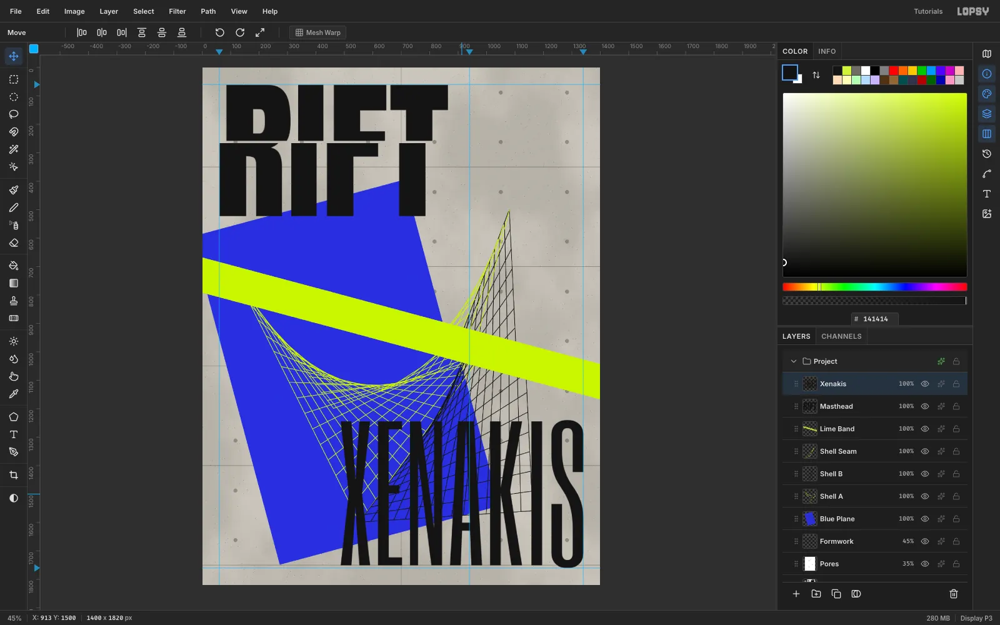

Set **Six Caps** at **500** in ink, click in empty space and type
**XENAKIS**. Rasterize it, marquee it and [[Cmd]]-drag a corner to about
**120 %**. Press [[Cmd+D]] and move it so its bottom-right corner sits
exactly on the bottom and right margin guides. Zoom in and finish with the
arrow keys.

## Turn the letters lime over the plane

Marquee the headline, press [[Cmd+C]], then press [[Cmd+V]]. The copy lands
in place on a new layer, so rename it **Xenakis Lime**.

Select **Blue Plane**, choose the **Magic Wand** and click anywhere on the
blue: the wand selects the plane's pixels only. Click the **Xenakis Lime**
row (the selection stays), choose **Select → Inverse** and press [[Delete]].
Deselect, open the layer's effects and enable **Color Overlay** in
`#D3F53A`. The headline now changes colour exactly at the plane's edge.

## Rotate the kicker to the band's angle

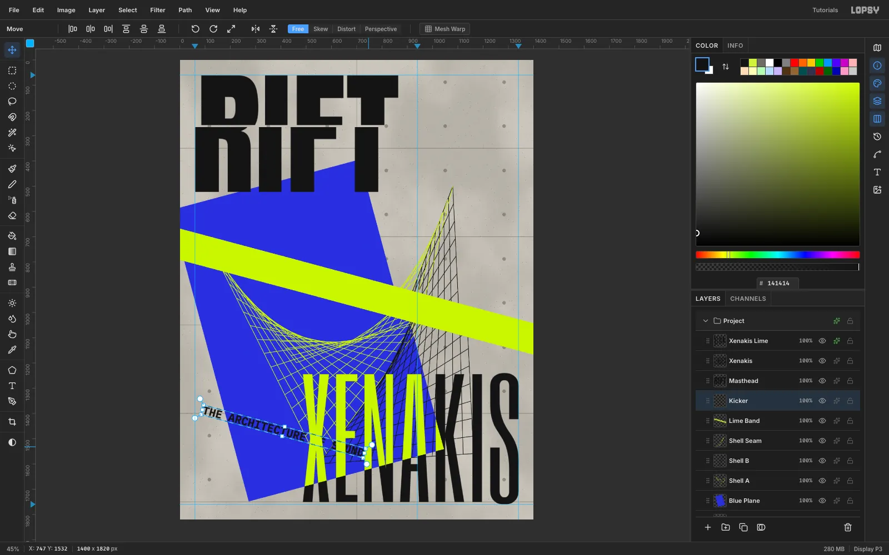

Set **IBM Plex Mono**, weight **700**, size **44**, and type
**THE ARCHITECTURE OF SOUND** in ink somewhere empty. Rasterize it and
marquee it. With the **Move** tool, hold [[Cmd]] and drag the rotate handle
clockwise: [[Cmd]] snaps rotation to 15° steps, so stop at **+15°**. Press
[[Cmd+D]].

## Seat the kicker on the band

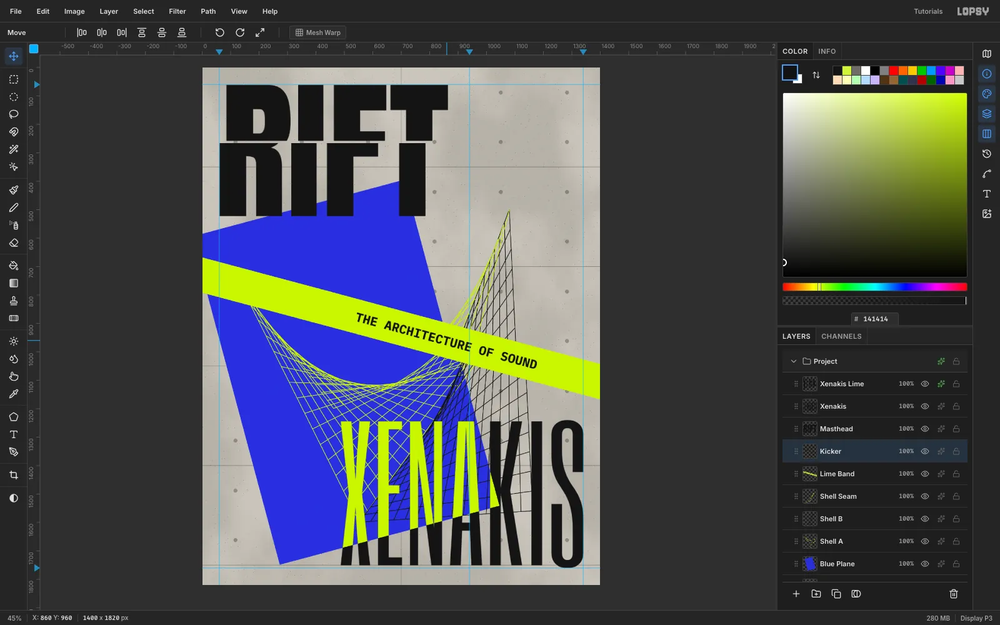

Drag the kicker onto the band, a little right of the page's centre, so it
sits on the band's centre line with the same space above and below the
caps. That puts it
right above the headline, so the two read as one cover line.

## Add the issue line and the deck

Starting on the 940 guide, set **IBM Plex Mono 500** at **22** for
three lines: *ISSUE 23 / AUTUMN 2026*, *MUSIC / ARCHITECTURE / NOISE* and
*EUR 14  USD 16  GBP 12*. Below it, set the deck in **Instrument Serif 44**:
*He drew the string / glissandi of Metastaseis / as straight lines, then /
poured them in concrete.* The calm serif against the torn masthead is the
contrast deconstructivism needs.

## Stack the cover lines and group them

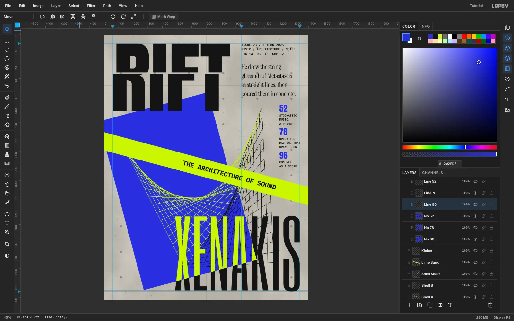

In the narrow column right of the black shell, set three page numbers in
**Anton 56** ultramarine, stacked 160 px apart and starting level with the
shell's apex. Under each, 65 px lower, add a cover line in **IBM Plex Mono 500** at **20**:
*STOCHASTIC / MUSIC, / A PRIMER*, *UPIC: THE / MACHINE THAT / DRAWS SOUND*
and *CONCRETE / AS A SCORE*. Click the first row, **Shift-click** the last
and choose **Layer → Group Layers**. Name the group **Cover Lines**, then
nudge the group so its longest line ends on the right margin guide.

## Add a vertical barcode

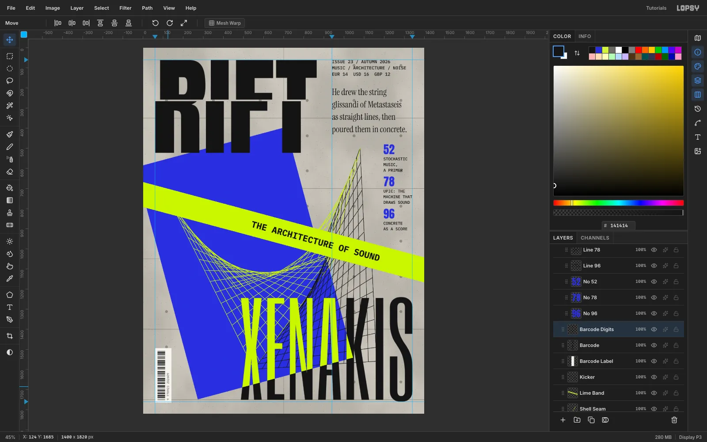

Add a **Barcode Label** layer and fill a narrow rectangle, about
82 × 270 px, in the bottom-left corner, sitting on the left and bottom margin
guides, with `#F4F3EE`. Set `*RIFT23*` in
**Libre Barcode 39** at **64**, rasterize it, and turn it with the Move
tool's **Rotate 90° CCW** button. Set the digits *9 770923 202609* in
**IBM Plex Mono 15**, rotate them the same way, and stand them next to the
bars.

> **Tip:** Click Rotate 90° with nothing selected and the whole layer turns
> about its own content, so it stays roughly where you set it.

## Draw the Metastaseis score

This is the idea behind the whole cover, drawn small. On a **Score** layer,
use the white Brush at **Size 3** to draw an L-shaped axis about
**206 × 160 px**. Then draw 18 straight lines across it. They start evenly
spaced on the left and end bunched on the right, so their crossings trace
the same curve as the shells. Caption it in **IBM Plex Mono 14** white:
*METASTASEIS, 1954 / BARS 309-314*.

Add an elevation mark too: **+21.00** in Plex Mono 17 at the black shell's
apex, with a short Shift-click leader line.

## Add print grain

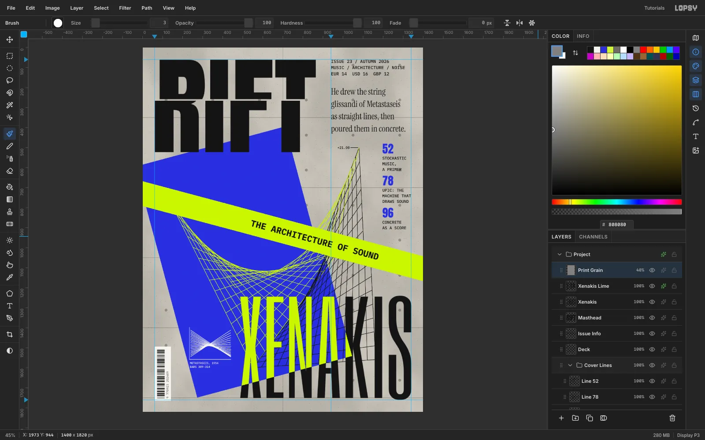

Select the top layer and add a **Print Grain** layer. Fill it with
`#808080`, run **Filter → Add Noise…** with **Mono**, **Gaussian** and **Amount 60**, and set it to
**Overlay 40 %**. The flat inks pick up a printed tooth.

## Open the rift

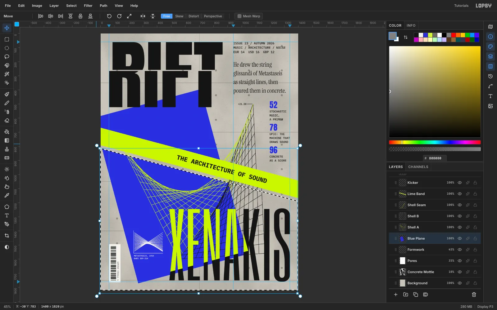

The slide in step 7 is hidden under the band, so the break needs to be
visible. Zoom in and lasso exactly along the band's lower edge, from outside
the left side of the page to outside the right side, then down past the
bottom of the page and back. Nudge
**Blue Plane**, **Shell A**, **Shell B** and **Shell Seam** **6 px left**
and **23 px down**, re-drawing the lasso for each layer. Move the score
layers by the same amount with no selection.

A strip of raw concrete opens under the band. That's the rift the
magazine is named after.

## Re-clip the lime headline

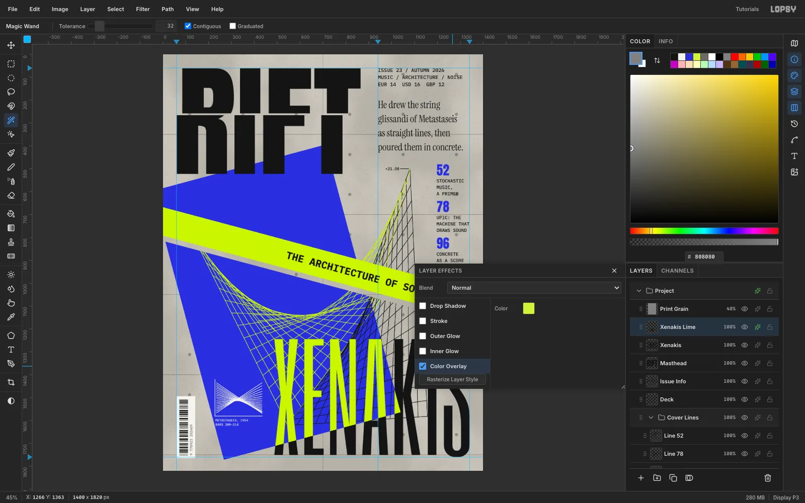

The plane moved, so the lime/black split in XENAKIS no longer follows its
edge. Delete **Xenakis Lime** and repeat step 11: copy and paste the
headline in place, wand-select the plane, choose **Select → Inverse**, press
[[Delete]] and add the lime **Color Overlay**.

## Turn the black shell lime over the plane

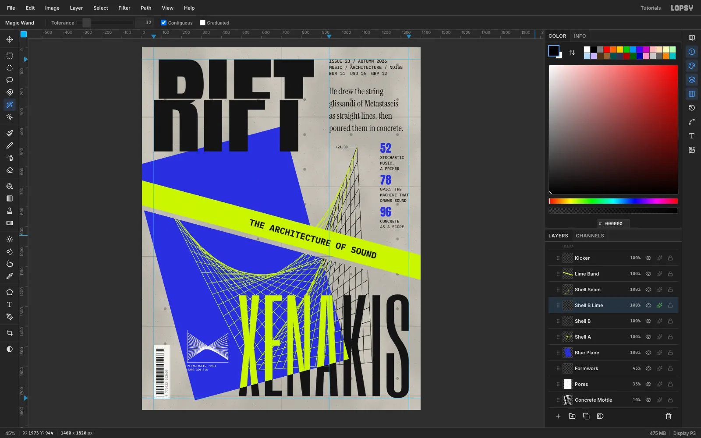

Apply the same rule to the black shell: black lines on ultramarine have
almost no contrast. Wand-select the plane on **Blue Plane**, click
**Shell B**, then copy and paste in place. Name the copy **Shell B Lime**
and give it a lime **Color Overlay**. Now one rule runs through the whole
cover: lime on blue, ink on concrete.

## Select the headline with a margin

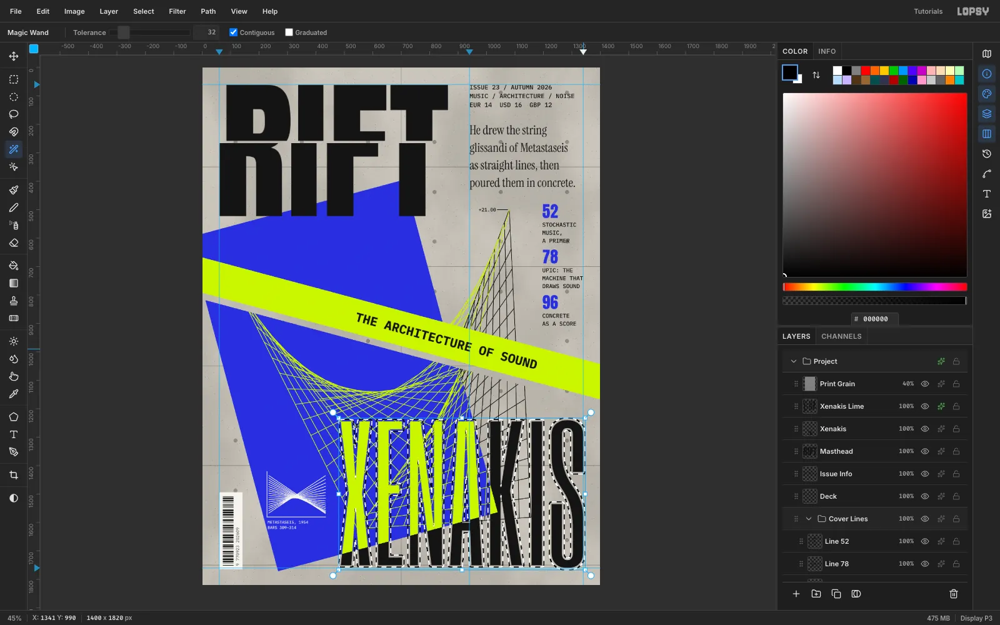

The shells run straight through the headline's letters. [[Cmd]]-click the
**Xenakis** layer thumbnail to load its letters as a selection. Then choose
**Select → Grow…** and enter **6 px**.

## Knock the lines out around the letters

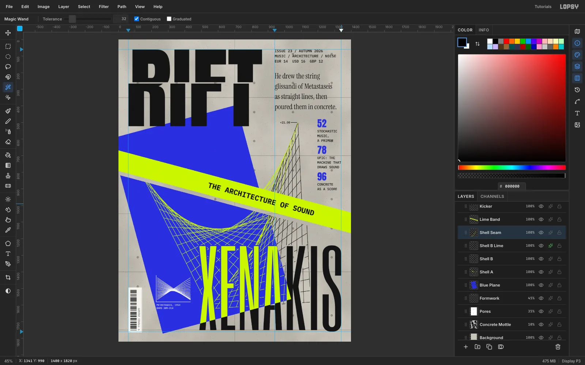

With the grown selection still active, click **Shell A**, **Shell B**,
**Shell B Lime** and **Shell Seam** in turn and press [[Delete]] on each.
Every letter now has a 6 px gap where the lines stop short. Press
[[Cmd+D]].

## Reseat the score

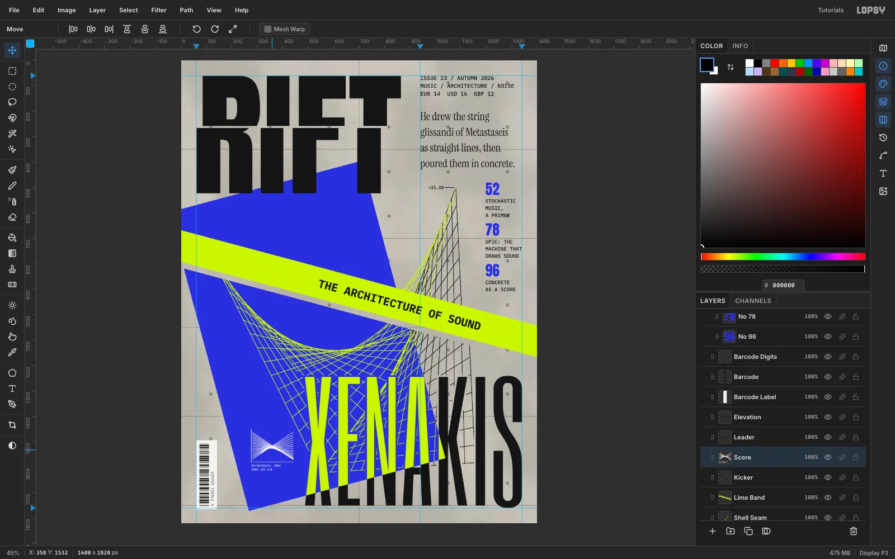

Drag the **Score Label** row directly above **Score**, rasterize it and
choose **Layer → Merge Down**. Marquee the merged score, [[Cmd]]-drag a
corner down to **80 %**, press [[Cmd+D]] and move it inward so it has about
90 px of blue to the plane's left edge and 45 px to the X.

## Share one right edge

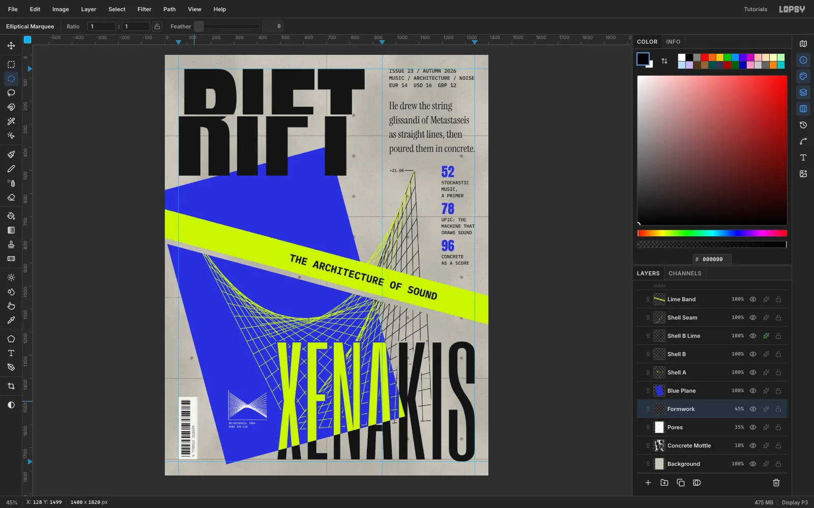

Shift-click the **Issue Info** and **Deck** rows and nudge both
**30 px right** so the deck's longest line ends on the right margin guide,
the same edge as the cover lines and XENAKIS. Select the three barcode layers
the same way and nudge them **14 px up** so the label's bottom sits on the
lowest formwork seam. Finally, on
**Formwork**, delete the tie holes that sit under type or peek through the
masthead gap: an **Elliptical Marquee** over each one, then [[Delete]].

## Ink the lines that leave the plane

The lime strands that climb over the concrete toward the apex are nearly
invisible there. Wand-click the lower plane, **Shift-click** the upper
plane to add it, and choose **Select → Inverse**. Copy **Shell A** and paste
in place as **Shell A Ink**, with a **Color Overlay** in `#141414`. Repeat
for **Shell Seam**. Then choose **File → Quick Export PNG**, and
**File → Save Project** to keep the layers.
