Deconstructivist graphic design grew out of the late 1980s and early 1990s.
Students at Cranbrook Academy of Art, the magazine *Emigre*, and art
directors like David Carson and Neville Brody took the tidy Swiss grid and
started pulling it apart. They sliced words into strips, let letters fall
off the edges of the shapes they sat on, layered type over type, and tilted
whole planes. It looks chaotic, but the best of it hides a very orderly
grid underneath.

That balance suits a menu, because people still have to be able to order
from it. In this tutorial you'll make the menu for an imaginary restaurant
called **Lost Wax**, a wood-fire kitchen in an old bronze foundry. The name
comes from lost-wax casting, where the mould is broken open to free the
metal, which is a good excuse to break the type. All the deconstruction
happens in the display type and the planes. The dishes and prices sit on a
plain two-column grid.

The page is 1500 × 2100 px, a 5:7 sheet. Everything is drawn in Lopsy, so
you don't need any photos.

The tools you'll use along the way:

- **guides**, the **Pencil** with [[Shift]]-click straight lines, and the **Lasso**
- the **Gradient** tool, inside selections and on a **layer mask**
- **Filter → Add Noise** and **Filter → Halftone**
- the **Difference** and **Multiply** blend modes and a **Color Overlay** effect
- the **Rectangular** and **Elliptical Marquee**, including their exact-size dialogs
- **Rasterize Layer** and the **Move** tool's rotate, scale and **Skew** modes
- **Anton** and **Space Mono** text, letter spacing and line height
- layer **groups**

The palette is concrete paper, near-black ink, molten orange and verdigris:

- Concrete paper `#D8D5CD`, grain grey `#F4F4F4` (texture layer only)
- Plate black `#080808`, ink `#151515`, hairline grey `#77736B`
- Molten `#F4B545` → `#E05F32` → `#814D27`
- Verdigris band `#6FA697` → `#2B4C47`, dot ink `#1D2F2C`, ghost `#3F9A86`

> **Tip:** On a wide-gamut (Display P3) screen, Lopsy reads a typed hex code as a P3 colour, and the codes above are P3 values. On a standard sRGB screen, type molten `#FFB21B` → `#F2541C` → `#8A4A1D`, verdigris `#5DA896` → `#1E4D47` and ghost `#009C85` instead. The greys and blacks are the same in both.

> **Note:** Shortcuts are written for a Mac. On Windows, use [[Ctrl]] wherever it says [[Cmd]].

## Create the page

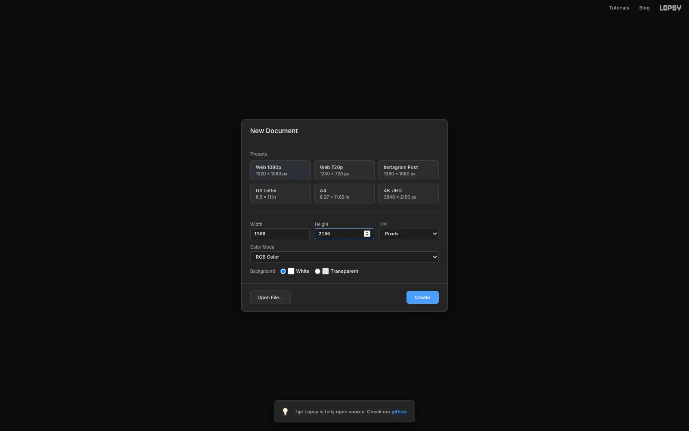

Choose **File → New**. Keep the unit on **Pixels**, type **1500** for the
width and **2100** for the height, keep the white background, and click
**Create**.

## Paint the concrete paper

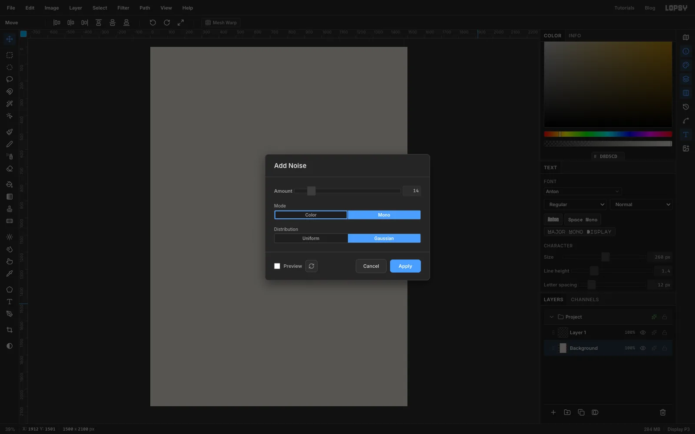

Click the *Background* row, set the foreground colour to `#D8D5CD` and
choose **Edit → Fill**. Then choose **Filter → Add Noise**, pick **Mono**
and **Gaussian**, set **Amount** to **14** and click **Apply**. The page
now has a faint speckle, like poured concrete or cheap uncoated stock.

## Lay down the guides

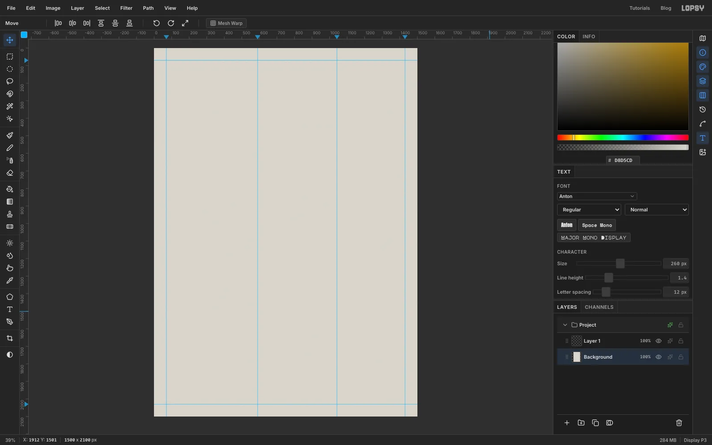

A click on a ruler drops a guide at that spot. Click the top ruler at
**70**, **590**, **1042** and **1430**, then click the left ruler at
**70** and **2030** for the top and bottom margins. Zoom in if you want
them exact. A few pixels either way won't hurt anything.

These guides are the hidden order under the chaos:

- **70** and **590** are the left edges of the two menu columns.
- **1042** to **1430** is a narrow column for the word WAX.

## Draw two construction lines

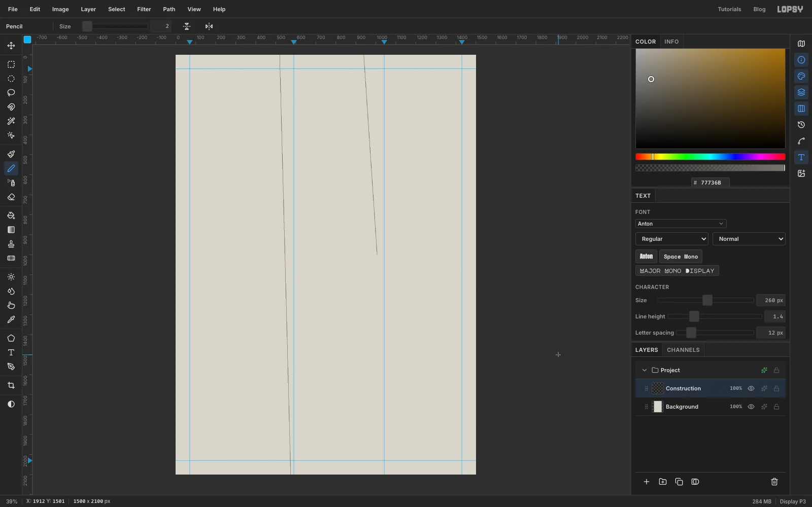

Draftsmen leave their construction lines on the drawing, and so will you.

Rename *Layer 1* to **Construction** by double-clicking its name. Set the
foreground to hairline grey `#77736B`, pick the **Pencil** ([[N]]) and set
**Size** to **2**. A Pencil click followed by a [[Shift]]-click draws a
straight line between the two points.

1. The first line will mark the right edge of the black plate. Click on the top edge of the page a little left of the 1042 guide (about x 940). Then [[Shift]]-click about halfway down the page, just left of the same guide (about x 1007, y 1000). That's where WAX will start.
2. The second line runs down the gutter between the two menu columns. Click on the top edge about 70 px left of the 590 guide. Then [[Shift]]-click on the bottom edge just left of that guide.

## Lasso the black plate

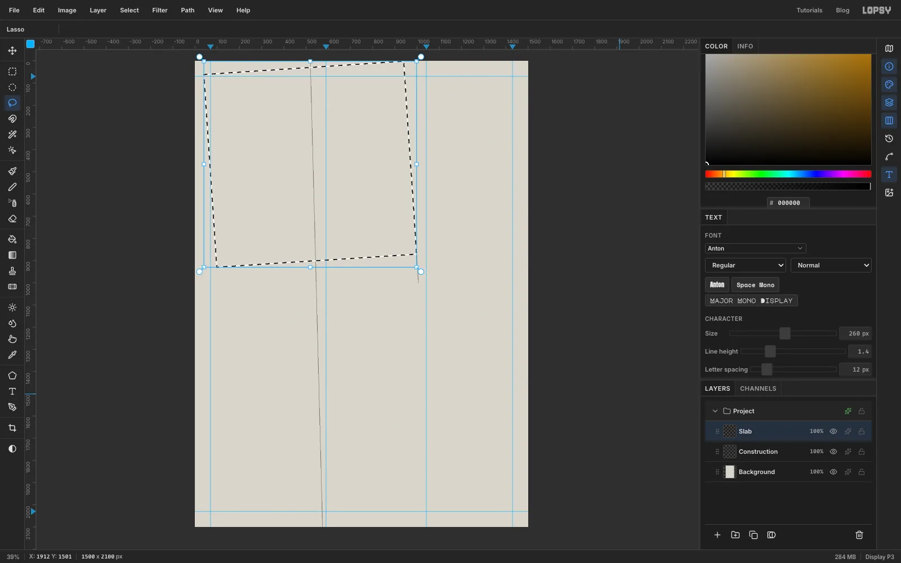

Click **Add Layer** in the Layers panel and name the new layer **Slab**.

Pick the **Lasso** ([[L]]) and trace a big, slightly tilted square. Hold
the mouse button down and drag in straight runs between the corners:

- Start just right of the left margin, about 60 px below the top edge.
- Go to the top edge where your first construction line starts.
- Follow that line down to about y 870.
- Cut back across to the left, finishing about 70 px lower than the right-hand corner.
- Return to the start.

The plate ends up about 900 px wide and tipped about 4° anticlockwise.

## Fill the plate and give it grain

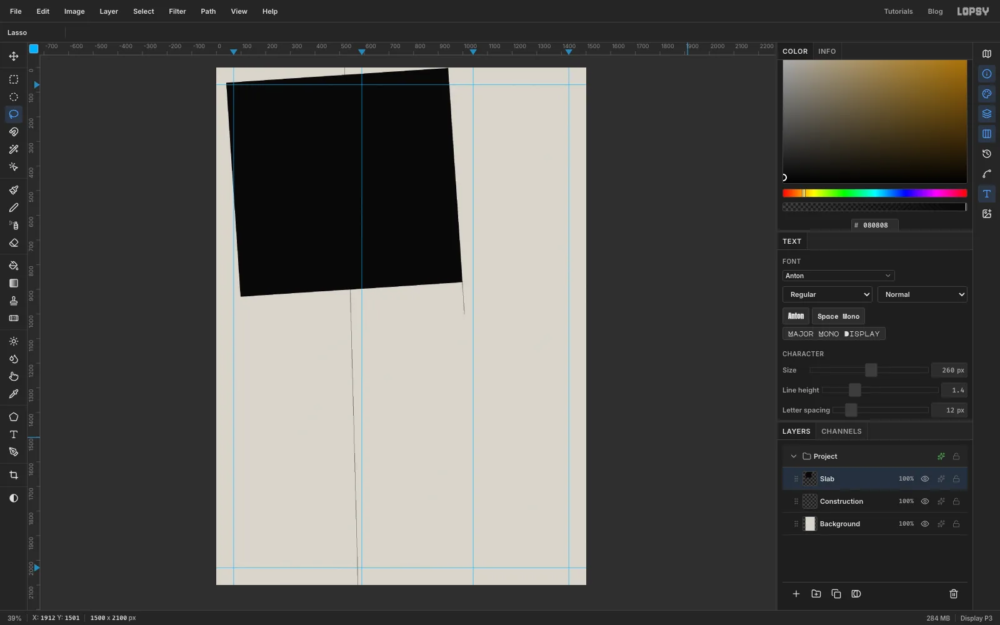

Set the foreground to `#080808` and choose **Edit → Fill**. While the
selection is still active, choose **Filter → Add Noise** again with
**Mono**, **Gaussian** and **Amount 16**, then press [[Cmd+D]] to deselect.

Why near-black and not pure black? Noise can't go darker than black, so a
pure `#000000` plate keeps almost no grain and looks pasted on. At
`#080808` the grain survives, and the plate still matches the pure black
that LOST will turn into where it leaves the plate.

## Cut the ring

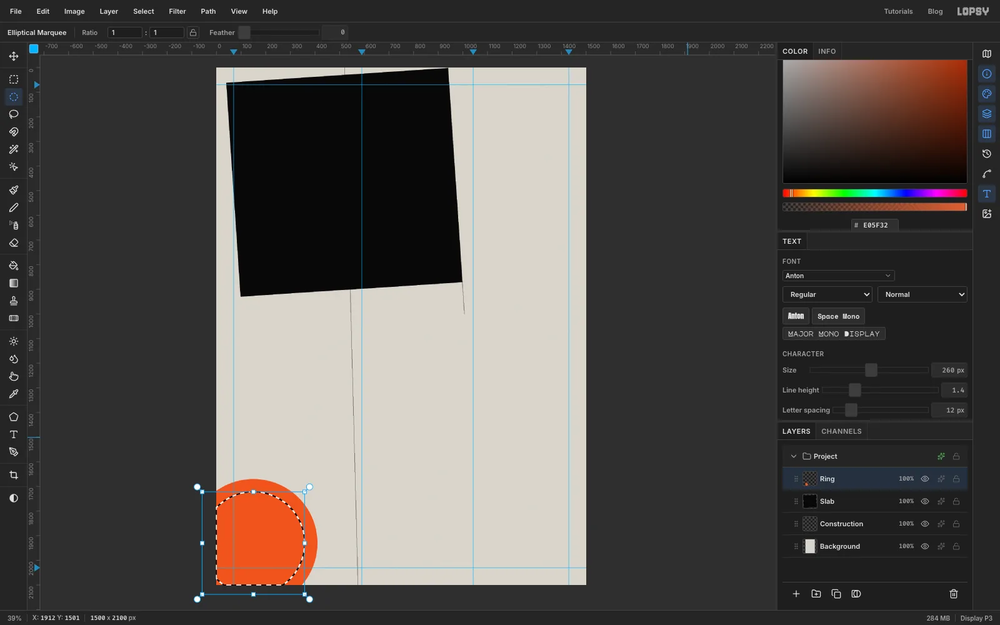

With *Slab* selected, click **Add Layer** and name the new layer **Ring**.
It lands above the plate. Set the foreground to `#E05F32`.

Pick the **Elliptical Marquee** and click once on the canvas without
dragging. That opens the **Elliptical Selection** dialog, where you can
type exact corners. Enter **From** x **-110**, y **1670** and **To**
x **410**, y **2190**, then click OK. The values can run past the canvas
edge, so the circle hangs half off the bottom-left corner. Choose
**Edit → Fill**.

Click once more and enter **From** x **-58**, y **1722** and **To**
x **358**, y **2138**. That's a smaller circle with the same centre.
Press [[Delete]] to punch out the middle, then [[Cmd+D]].

## Pour a molten gradient into the ring

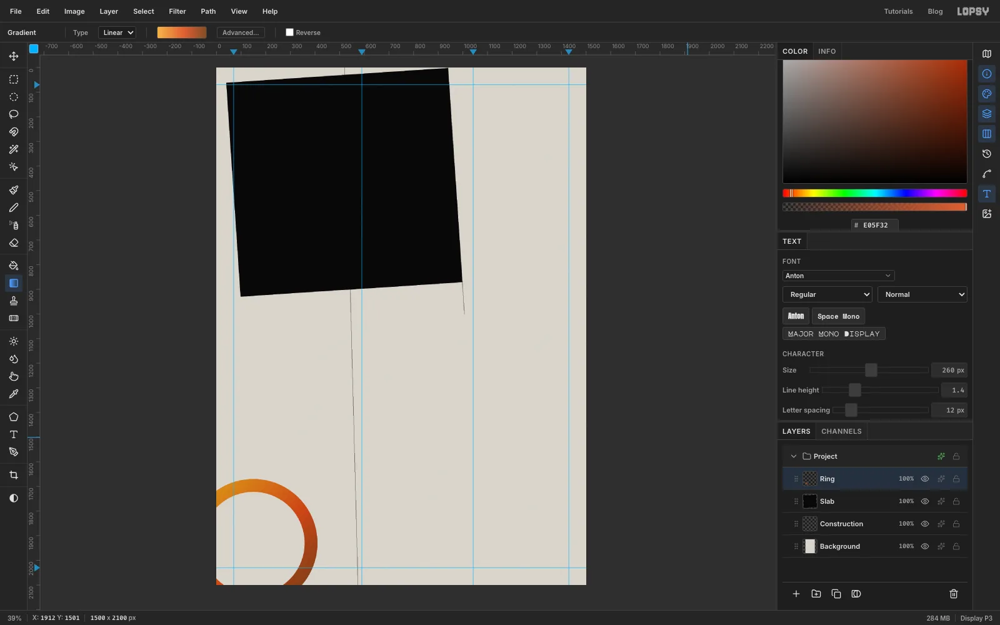

[[Cmd]]-click the *Ring* thumbnail in the Layers panel to select its
pixels. Pick the **Gradient** tool, choose **Linear**, and click
**Advanced…** to set three stops:

- `#F4B545` at the left end
- `#E05F32` at about 55%
- `#814D27` at the right end

Drag from just outside the ring's top left to just outside its bottom
right, then press [[Cmd+D]].

Open the layer's effects drawer with the sparkle button on its row, and set
the **Blend** dropdown to **Multiply**. The ring picks up the paper's
texture as if it were printed ink.

## Cut the verdigris band

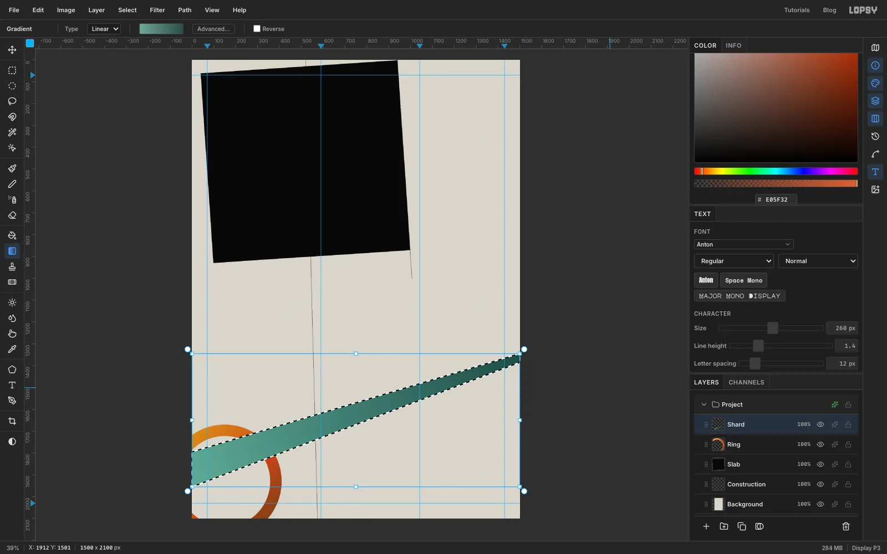

Click **Add Layer** and name the layer **Shard**. With the **Lasso**, trace a
long sliver that climbs from left to right:

- Start on the left edge about a quarter of the way down the ring (around y 1795).
- Run to the right edge about two-thirds of the way down the page (y 1345).
- Drop down about 40 px.
- Come back to the left edge, about 160 px below where you started.

The band is about 160 px thick on the left and narrows to a blunt 40 px end
on the right.

With the **Gradient** tool, set **Advanced…** to two stops, `#6FA697` on the
left and `#2B4C47` on the right. Drag along the band from its left end to
its right end.

## Turn a copy into a halftone plate

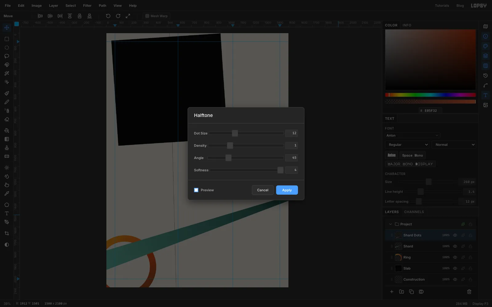

Press [[Cmd+D]], switch to the **Move** tool ([[V]]) and choose **Layer →
Duplicate Layer**. Rename the copy **Shard Dots**.

Choose **Filter → Halftone** and set **Dot Size** to **12**, **Angle** to
**45** and **Softness** to **8**. Click **Apply**. The gaps between the
dots are transparent, so the copy acts like a second printing plate.

## Ink the dots and knock them off register

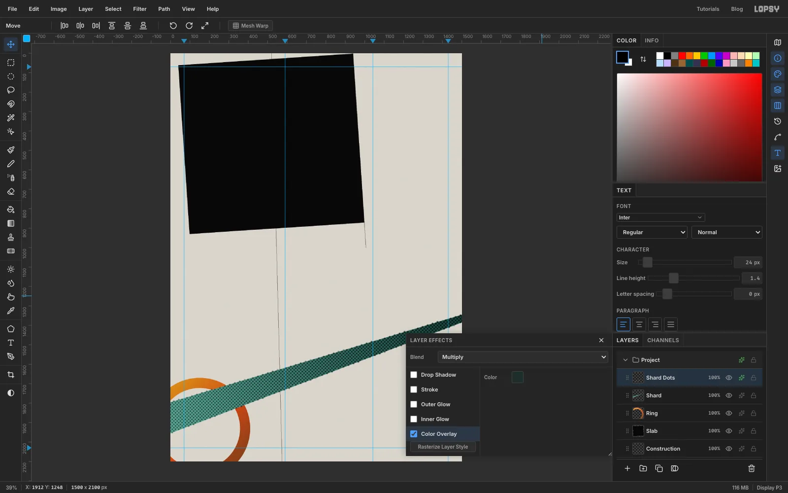

On *Shard Dots*, open the effects drawer, enable **Color Overlay**, and set
its colour to dot ink `#1D2F2C`. Set the **Blend** dropdown to
**Multiply**.

Now shift the plate off register. With the **Move** tool active and nothing
selected, use the arrow keys to nudge the layer about 14 px right and 22 px
up. [[Shift]]+arrow moves it 10 px at a time. The dots now spill just past
the band's top edge, like a screen print where the second colour landed a
little off.

## Fade the dots with a layer mask

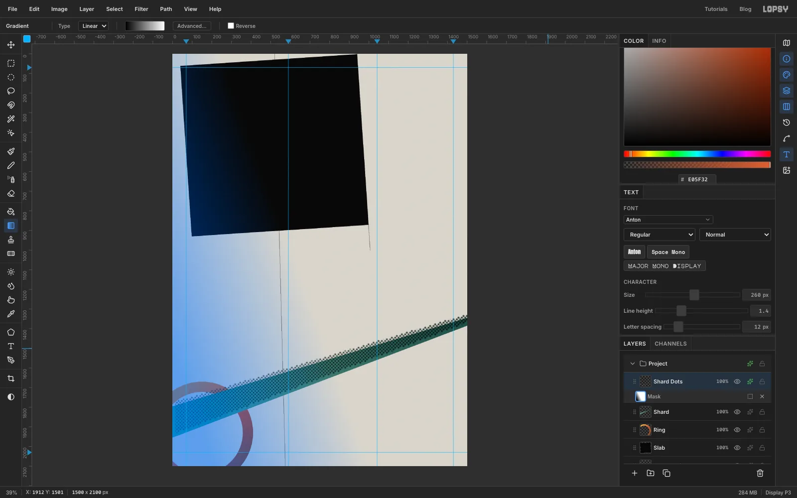

With *Shard Dots* selected, click **Add Mask** at the bottom of the Layers
panel, then click the new mask thumbnail to edit it. The canvas gets a blue
wash while you're painting on a mask.

With the **Gradient** tool, set **Advanced…** to black at the left and
white at the right. Drag from the band's lower-left end to about the middle
of the band. Black hides and white shows, so the dots now fade in from
nothing on the left. Click the *Shard Dots* layer thumbnail (not the mask)
to go back to editing pixels.

## Set the word LOST

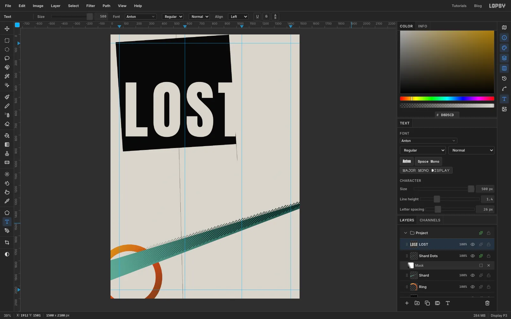

Make sure *Shard Dots* is the active row, so the type lands above
everything you've made so far. Pick the **Text** tool ([[T]]). In the
options bar, choose the font **Anton** and set **Size** to **500**. In the
**Text** panel, set **Letter spacing** to **26**. Set the foreground
colour to paper `#D8D5CD`.

Click in an empty spot near the top of the page, type **LOST**, and press
[[Tab]] to finish. The layer is named *LOST* after its text. With the
**Move** tool, drag the word so the L sits about 70 px inside the plate's
left edge and the cap tops are at y 380. The very end of the T's crossbar
should hang just past the plate's right edge.

## Knock it out with Difference

Open the effects drawer for *LOST* and set **Blend** to **Difference**.

Difference subtracts one colour from the other. On the black plate the
letters still come out paper-coloured. Where a letter leaves the plate, it
sits on paper, and paper minus paper is black. So the T's crossbar tip now
reads as a black notch cut out of the page. That one blend mode gives you
deconstructivism's favourite move, type that changes colour as it crosses
from one plane to another.

## Slice the word

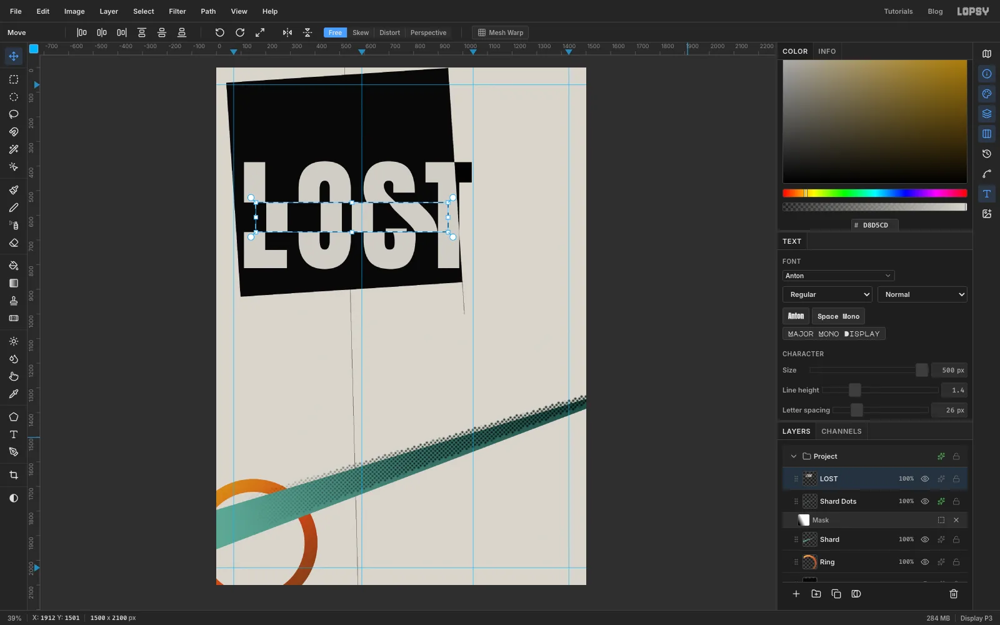

To cut type with selections it has to be pixels. Click the **Rasterize
Layer** button at the bottom of the Layers panel. It's the T icon that
appears while a text layer is selected.

With the **Rectangular Marquee** ([[M]]), draw a band through the middle
of the L, O and S. Run it from just left of the L to the gap between the S
and the T, covering roughly the middle third of the letters' height (about
120 px).
If you'd rather type it, click once without dragging and enter **From**
60, 548 and **To** 850, 668.

Switch to the **Move** tool and drag inside the selection about 90 px to
the right. Keep the drag level, and stop before the S's strip touches the
T. Press [[Cmd+D]].

## Slide a thin band the other way

Draw a second, much thinner band low across the O, S and T. Start it in
the gap between the L and the O and run it just past the T. Make it about
43 px tall, ending about 40 px above the baseline (y 735 to 778). With the
**Move** tool, drag it about 45 px to the **left**. Press [[Cmd+D]].

Two cuts, going in opposite directions, are enough. The cap tops and the
baseline still carry the word, so LOST stays readable even though its
middle is broken.

## Set WAX and fill it with molten metal

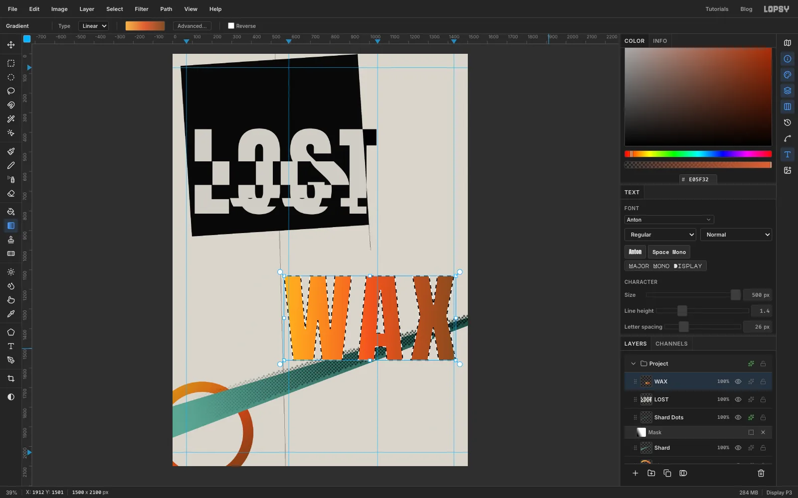

With *LOST* still active, pick the **Text** tool. Keep **Anton** at
**500**, set the colour to `#E05F32`, click in the empty lower half of the
page and type **WAX**. Press [[Tab]], then click **Rasterize Layer**.

[[Cmd]]-click the *WAX* thumbnail. With the **Gradient** tool, set
**Advanced…** to `#F4B545`, `#E05F32` at 50% and `#814D27`, and drag from
the left edge of the W to the right edge of the X. Press [[Cmd+D]].

## Stand WAX on end

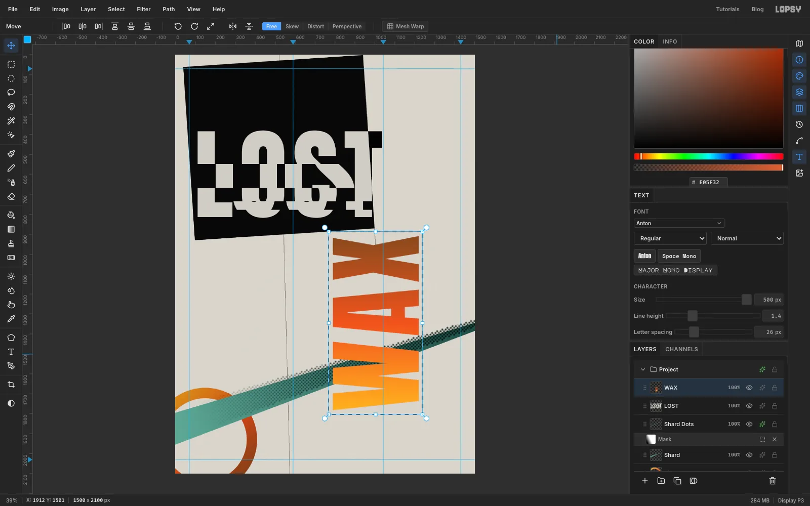

Draw a **Rectangular Marquee** around WAX with a little room to spare.
Keep its edges at least 20 document pixels away from the guides, because a
marquee edge that comes close to a guide snaps onto it and can cut letters off.
Switch to the **Move** tool.

Move the pointer just outside the box's top-right corner until it turns
into a rotate cursor. Then hold [[Cmd]] and drag anticlockwise. [[Cmd]]
snaps the angle to 15° steps, so stop at **-90°**. WAX now reads from
bottom to top, and the yellow end of the gradient is at the bottom, like
hot metal settling. Press [[Cmd+D]].

## Scale WAX to fit its column

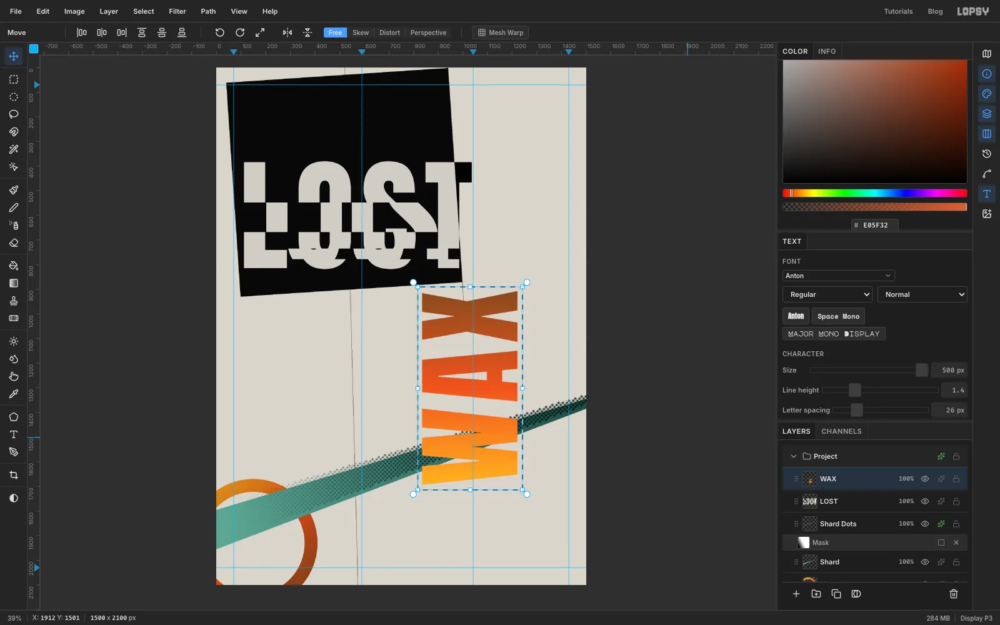

Draw a new marquee around the upright WAX. With the **Move** tool, hold
[[Cmd]] and drag the **bottom-left** corner handle up and to the right
until the box is about 90% of its size. [[Cmd]] keeps the proportions, and
the opposite top-right corner stays where it is. The word ends up about
390 px wide, which fits between the 1042 and 1430 guides. Press [[Cmd+D]].

## Seat WAX on the grid

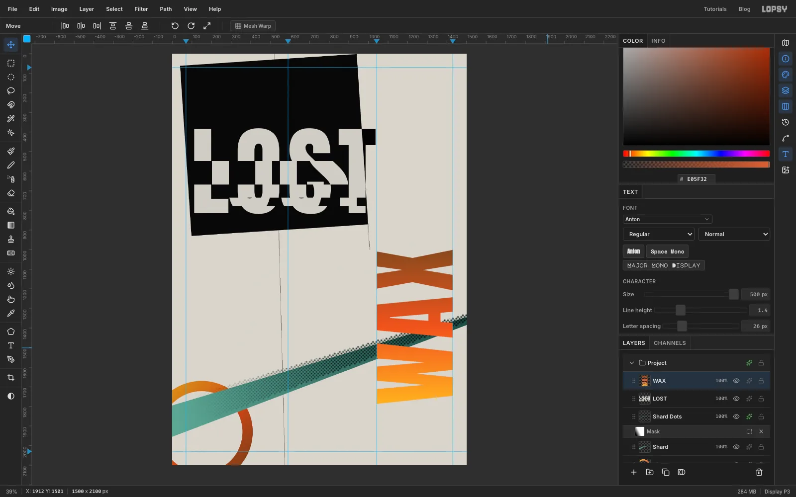

Drag WAX so its right edge sits on the **1430** guide and the top of the X
is at about **y 1000**, where your first construction line stops. Use the
arrow keys for the last few pixels. Its left edge now lands on the
**1042** guide, and its top will line up with the IRON heading.

## Set the four section headings

With *WAX* selected, click **New Group** and name it **Menu**. Click **Add
Layer** to put an empty layer inside the group, and name it **Rules**.
Rules does two jobs. It's where you'll draw the gauge later, and clicking
it before you start each new piece of text keeps the text inside *Menu*.

> **Tip:** A Text-tool click inside an existing text layer's box edits that layer instead of starting a new one. Create each new block in an empty spot, then drag it into place with the **Move** tool.

Set the headings in **Anton** at **96**, in ink `#151515`, with letter
spacing back at **0**. Put **FIRE** on the 70 guide just under the plate's
bottom-left corner, with its cap top at y 960. Put **IRON** on the 590
guide, 40 px lower, so its cap top lines up with the top of WAX. Put
**ASH** on the 70 guide at y 1350 and **POUR** on the 590 guide at y 1750.

Lopsy names a text layer after its text. Rename the headings **H FIRE**,
**H IRON**, **H ASH** and **H POUR**, so they're easy to tell apart from
the lists you're about to add.

## Set the dishes

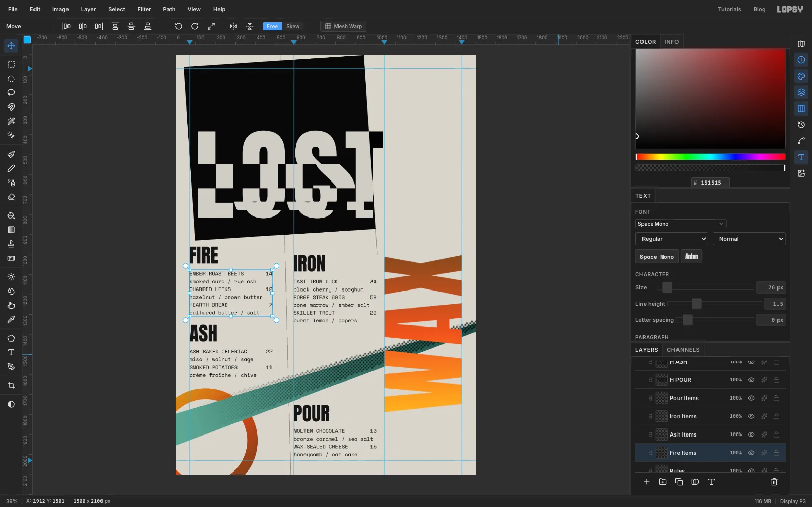

Set the dish lists in **Space Mono** Regular at **26**, ink `#151515`. In
the Text panel, set **Line height** to **1.5** and **Letter spacing** to
**0**.

Each dish takes two lines. The first line is the name in capitals with the
price at the end. The second line is the ingredients in lower case. Press
[[Return]] between lines. Space Mono is monospaced, so you can line the
prices up with spaces. Pad each name line so that the name, the spaces and
the price add up to exactly 26 characters. The prices then end in the same
column, about 410 px from the left edge of the block.

The dishes used here are:

- FIRE: `EMBER-ROAST BEETS 14` with smoked curd / rye ash, `CHARRED LEEKS 12` with hazelnut / brown butter, `HEARTH BREAD 7` with cultured butter / salt
- IRON: `CAST-IRON DUCK 34` with black cherry / sorghum, `FORGE STEAK 600G 58` with bone marrow / ember salt, `SKILLET TROUT 29` with burnt lemon / capers
- ASH: `ASH-BAKED CELERIAC 22` with miso / walnut / sage, `SMOKED POTATOES 11` with crème fraîche / chive
- POUR: `MOLTEN CHOCOLATE 13` with bronze caramel / sea salt, `WAX-SEALED CHEESE 15` with honeycomb / oat cake

Put each list on its column's guide, about 40 px below its heading.
Rename the lists **Fire Items**, **Iron Items**, **Ash Items** and
**Pour Items**.

## Number the sections and add the hours

Type **01**, **02**, **03** and **04** in **Space Mono Bold**, **26**,
orange `#E05F32`. Create them in empty space at the right of the page,
because a click right next to a heading would edit the heading. Then drag
each one to sit 16 px right of its heading, level with the cap tops.

Under WAX, on the 1042 guide, set the hours and address in Space Mono Bold
**22** with **Line height 1.4**:

- **WED–SUN, FROM 5PM / UNTIL THE FIRE DIES**, about 50 px below the bottom of WAX, named **Hours**
- **14 FOUNDRY ROW / RESERVATIONS (555) 014-1150**, a line's height lower again, named **Address**

## Skew POUR so it runs like poured metal

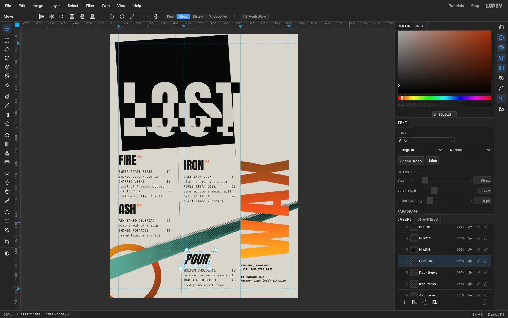

Select *H POUR*, click **Rasterize Layer**, and draw a marquee around it
with a little room to spare. Switch to the **Move** tool and click
**Skew** in the options bar. Drag the **top-middle** handle about 36 px to
the right. The bottom edge stays put, so the word leans forward like an
italic. Press [[Cmd+D]] and click **Free** to leave Skew mode.

The R now leans into the **04**. Nudge the 04 right until it sits 16 px
past the slanted R again.

## Draw the pour-temperature gauge

The empty top-right corner gets a little scientific instrument. It's a
scale from 0° at the bottom to 1150° at the top, with the stages of a
bronze casting marked on it.

Click *Rules*, set the foreground to ink `#151515`, and pick the **Pencil**
at **Size 3**.

1. Draw the spine about 60 px right of the 1042 guide. Click at y 440 and [[Shift]]-click straight below it at y 860. That's 420 px for 1150°.
2. Add eleven ticks to the right of the spine, one every 42 px, each a click and a [[Shift]]-click. Make the top, middle and bottom ticks about 46 px long and the rest about 20 px.

Click **Add Layer** and name it **Pointer**. Set the foreground to
`#E05F32`. Lasso a small triangle pointing left at the top tick, choose
**Edit → Fill** and press [[Cmd+D]]. Then use the Pencil to draw two
92 px orange lines out from the spine at the 700° and 150° marks. On a
420 px scale those fall at y 604 and y 805.

Label the marks in **Space Mono Bold 20**, each centred on its line:
**1150° pour** in orange next to the pointer, then **700° burnout**,
**150° dewax** and **0°** in ink. Those are the real temperatures for
pouring bronze, burning the wax out of the mould, and melting the wax.
Name the labels **Scale 1150**, **Scale 700**, **Scale 150** and
**Scale 0**.

## Add the temperature headline

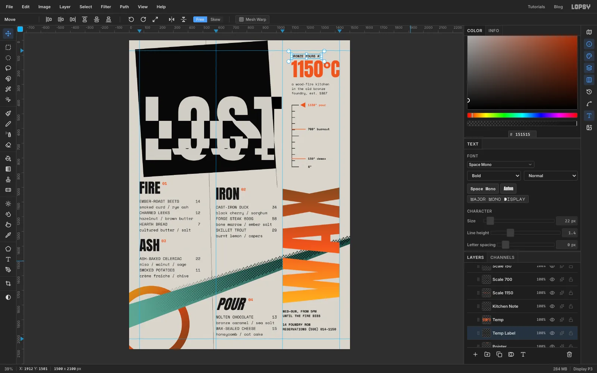

Above the gauge, set three pieces of type that share its left edge:

- **1150°C** in **Anton 132**, orange `#E05F32`, named **Temp**. Drag it until its right edge sits on the **1430** guide, with its cap top at y 136. At this size its left edge lands right above the gauge's spine.
- **BRONZE POURS AT** in **Space Mono Bold 22**, ink, named **Temp Label**. Line its left edge up with 1150°C's left edge, about 20 px above it.
- **a wood-fire kitchen / in the old bronze / foundry, est. 1887** in **Space Mono Regular 22** with **Line height 1.4**, named **Kitchen Note**. Put it on the same left edge, about 40 px below 1150°C.

## Ghost the word MOULD

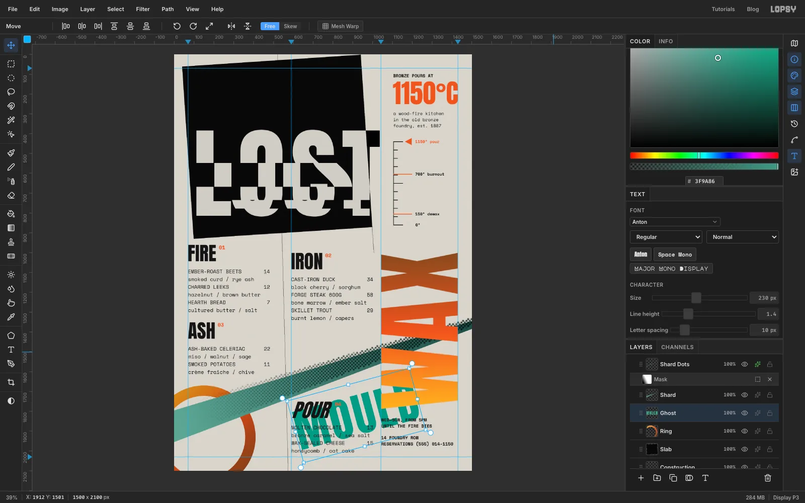

The column under IRON is empty, and the deconstructivists hated a quiet
gap. Fill it with a ghost word that slides behind the band.

Click the *Ring* row, so the new text lands between the ring and the band.
Set the **Text** tool to **Anton 230**, **Letter spacing 10**, and the
colour to `#3F9A86`. Type **MOULD** in an empty spot near the bottom of the
page, press [[Tab]], and rename the layer **Ghost**.

With the **Move** tool and nothing selected, the live text gets a
transform box of its own. Hold [[Cmd]] and drag a rotate handle until the
word tilts **15°** anticlockwise. That's roughly the angle of the band.

## Tuck MOULD behind the band and WAX

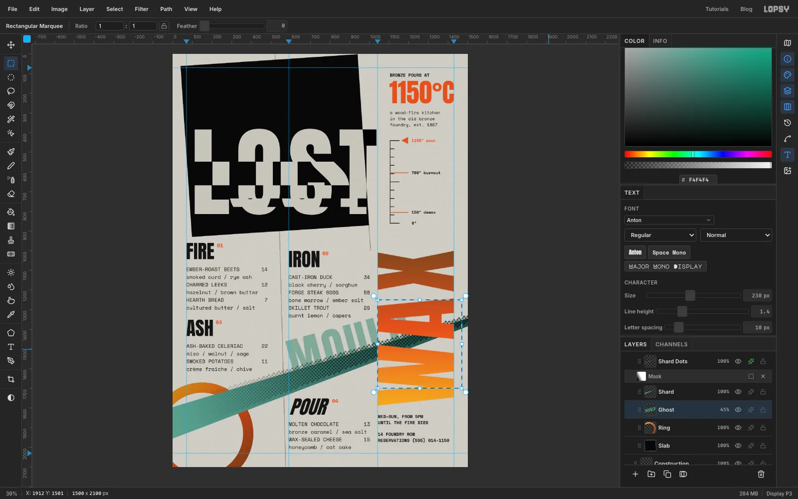

Drag MOULD into the empty space under IRON. The M should start just right
of the gutter hairline, the bottoms of the letters should slide under the
band, and the far end should run behind WAX. Set its **Blend** to
**Multiply** and its opacity to **45%**, so it reads as a ghost behind
the menu.

Part of the D still shows in the gaps between WAX's letters. Click
**Rasterize Layer** to turn *Ghost* into pixels. Then draw a marquee that
starts on the **1042** guide (the marquee snaps to it) and covers
everything of MOULD to its right. Press [[Delete]] and [[Cmd+D]].

## Group the planes

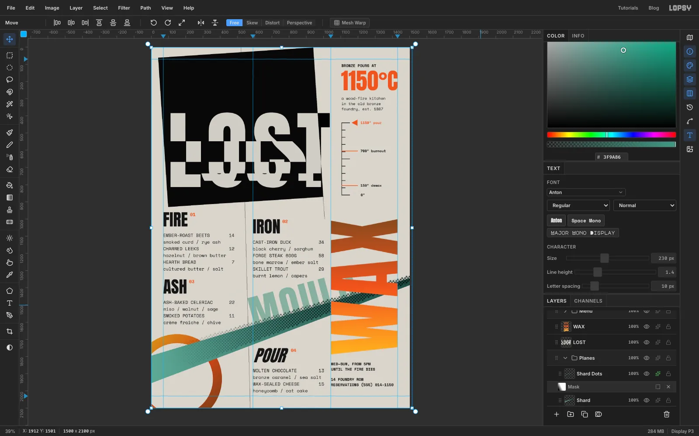

Click the *Slab* row, then [[Shift]]-click the *Shard Dots* row to select
everything from the plate up to the dots. Choose **Layer → Group Layers**
and name the group **Planes**. The stacking order stays the same, and the
background shapes now fold away under one row.

## Print it with grain

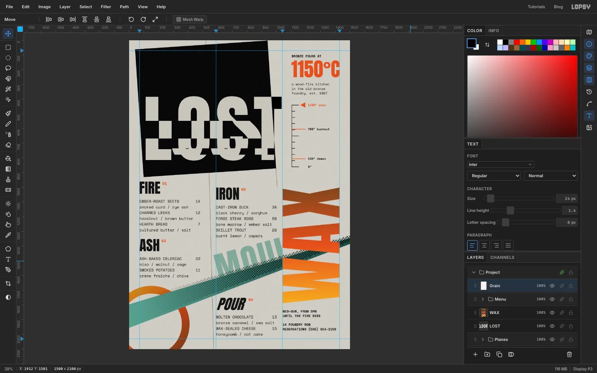

Click the *Project* row and click **Add Layer**. The new layer goes on top
of everything. Name it **Grain**, fill it with grain grey `#F4F4F4` using
**Edit → Fill**, then run **Filter → Add Noise** with **Mono**,
**Gaussian** and **Amount 40**. Set the layer's **Blend** to **Multiply**.
The grain grey nearly vanishes in Multiply, and only the speckle stays,
over the inks as well as the paper.

Export with **File → Quick Export PNG**, and keep an editable copy with
**File → Save Project**.
