Deconstructivism takes something whole and pulls it apart on purpose. Zaha
Hadid's early paintings of buildings show this best: each building is broken
into sharp, overlapping planes that seem to fly off the canvas. This tutorial
turns that idea on a living thing. **Whale Song** is an 1800 × 1200 px
painting of a humpback whale. Its song radiates out as rings that have
fractured, and its tail is breaking into shards and drifting away.

There is no text in this one. The whale is painted with soft brushes, Dodge
and Burn. The "deconstructed" part is made the way a designer would: lasso a
piece, cut it, paste it back in place, then drag and rotate it. Each piece is
moved a little further and turned a little more than the one before it, and
that steady increase is what makes the break read as an explosion rather than
a row of slices.

The tools you'll meet along the way:

- the **Gradient** tool, linear and radial, with the **Advanced** stop editor
- **Filter → Sunburst**, **Smoke**, **Gaussian Blur**, **Hue/Saturation** and **Add Noise**
- the **Elliptical Marquee**, **Lasso** and **Rectangular Marquee**, including subtracting and intersecting selections
- the **Brush** with the Soft Round and Bubbles presets, **Dodge / Burn**, **Spray** and the **Eraser**
- **Cut**, **Paste**, the **Move** tool's rotate, scale and **Perspective** handles, and arrow-key nudges
- the **Drop Shadow**, **Inner Glow**, **Outer Glow** and **Stroke** layer effects
- blend modes (**Screen**, **Soft Light**, **Multiply**, **Overlay**), groups, **Merge Down**, and adjustments on the root group

The palette is deep ocean blue with three hard accents:

- Ocean `#2A56B8` → `#12286E` → `#03061A`
- Light rays `#BFE4FF`, head glow `#5E8FE6`
- Whale `#0D1534` → `#3A5687` → `#DCD3C2`
- Coral `#FF6B57` / `#E2483A` / `#D24434`
- Bone `#EFE6D4`
- Void `#03050E`
- Glass `#9CC6FF`, tint `#1A2A5A`

## Lay down the ocean

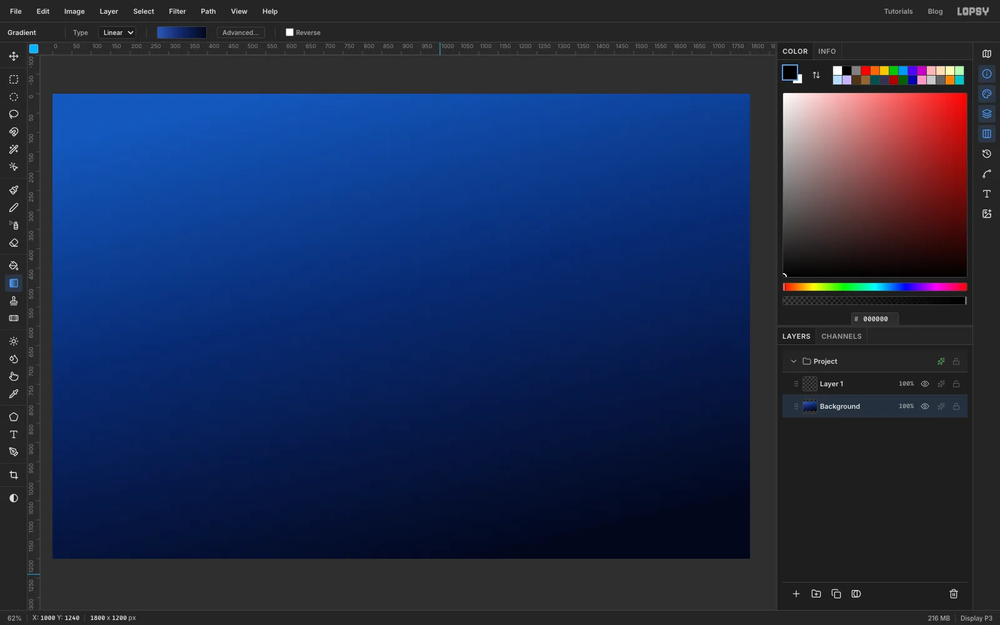

Choose **File → New**, keep the units on **Pixels**, set the size to
**1800 × 1200** and click **Create**.

Click the *Background* row and pick the **Gradient** tool. Click **Advanced…**
in the options bar to open the Gradient Editor:

1. Click the gradient bar halfway along to add a third stop.
2. Set the left stop to `#2A56B8`, the middle stop to `#12286E` (drag it to
   about 45%) and the right stop to `#03061A`.
3. Click **Done**.

Drag from just above the top edge, about a third of the way in from the left,
to just below the bottom edge, a little right of centre. The slight slant puts
the brightest water at the top left, where the light will come from.

## Add shafts of light with Sunburst

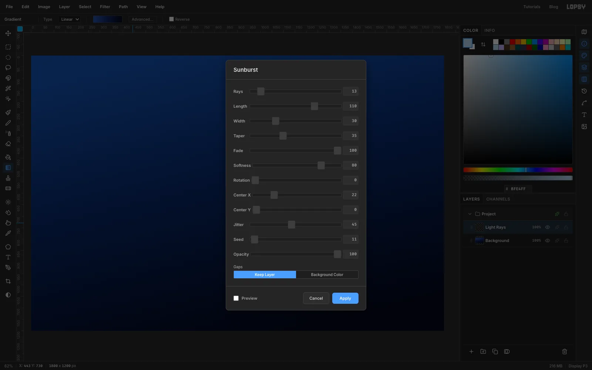

Rename *Layer 1* to *Light Rays* and set the foreground colour to pale blue
`#BFE4FF`. Open **Filter → Sunburst** and set:

- **Rays** 13, **Length** 110, **Width** 30
- **Taper** 35, so the beams are nearly parallel
- **Fade** 100 and **Softness** 80, so each ray dissolves before its tip
- **Center X** 22 and **Center Y** 0, which puts the origin on the top edge, left of centre
- **Jitter** 45 and **Seed** 11, so the rays have uneven lengths

Click **Apply**. Open the layer's effects drawer, set the **Blend** to
**Screen**, and drop the layer's opacity to **30%**. At full strength the rays
look like a cartoon spotlight. At 30% they read as light coming through
water.

## Stir in murk and a glow behind the head

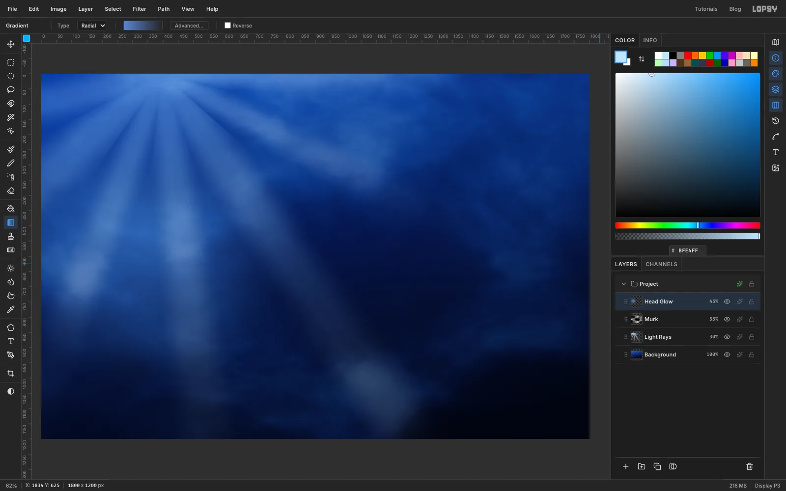

Add a layer called *Murk* and choose **Filter → Smoke** with **Scale** 3 and
**Turbulence** 65. Set it to **Soft Light** at **55%**. It breaks up the flat
gradient into drifting clouds of silt.

Add one more layer called *Head Glow*. Pick the **Gradient** tool, set the type
to **Radial**, and use two stops of `#5E8FE6`: the left one fully opaque, the
right one at 0% opacity. Drag outward about 520 px from a point about 330 px
in from the left and 520 px down. That's where the whale's head will sit. Set
the layer to **Screen** at **45%**. The lift behind the head is what lets a
dark whale stand out later.

## Cut in the back planes

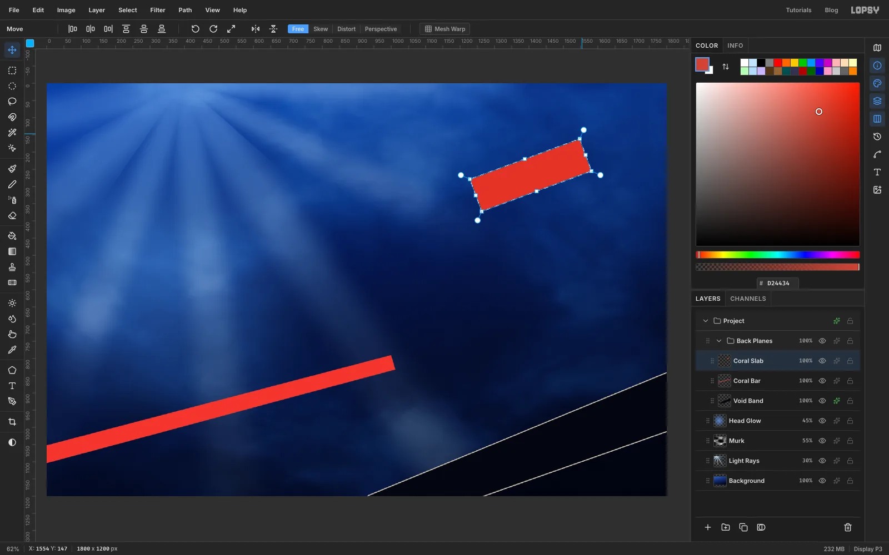

Click **New Group** in the Layers panel and name it *Back Planes*. These flat
shapes sit behind the rings and the whale, like the solid planes in a
Suprematist painting.

- **Void Band.** Add a layer and lasso a strip about 170 px wide that rises
  from the bottom edge, about halfway across, to the right edge about two
  thirds of the way down. Fill
  it with `#03050E`. In the effects drawer turn on **Stroke** at **3** px in
  `#CFC6B6`, so its edges read as cut lines rather than shadow.
- **Coral Bar.** Add a layer and lasso a thin parallelogram, about 45 px
  thick, from the left edge low down to a point a little past the canvas
  middle. Fill it with `#E2483A`.
- **Coral Slab.** Add a layer, drag a Rectangular Marquee about 340 × 100 px in
  the upper right and fill it with `#D24434`. Switch to the **Move** tool,
  drag just outside a corner handle to rotate it about **20° anticlockwise**, so
  it rises to the right, then press
  [[Cmd]]+[[D]] to commit. Run **Filter → Gaussian Blur** at **2** px so it
  sits a little back in the water, then add a **Drop Shadow** of 10 / 12,
  **Blur** 14, **Opacity** 35.

## Radiate the song rings

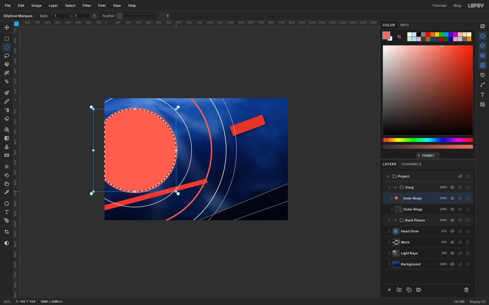

Make another group called *Song* and drag it above *Back Planes*. Inside it
add a layer called *Outer Rings*. The rings are centred on the tip of the
whale's snout, **297 px** in from the left and **513 px** down. They are far
bigger than the canvas, so zoom out with [[Cmd]]+[[-]] twice first.

Each ring is two circles with the same centre:

1. With the **Elliptical Marquee** and nothing selected, click once on the
   canvas without dragging. That opens the **Elliptical Selection** dialog,
   where you type the corners of the box the circle fits in: the centre minus
   the radius, and the centre plus the radius. For a radius of 1000 that is
   **From** −703, −487 **To** 1297, 1513. Set the foreground to the ring's
   colour and choose **Edit → Fill**.
2. Do the same with the radius minus the ring's thickness (997 for a 3 px
   ring of radius 1000) and press [[Delete]].

On *Outer Rings* make bone rings `#EFE6D4` with radii **1000** (3 px thick)
and **900** (6 px), a coral `#FF6B57` ring at **760** (13 px), and a bone ring
at **560** (5 px). Add a second layer, *Inner Rings*, and make a coral ring at
**420** (14 px), a bone ring at **290** (5 px) and a coral ring at **170**
(10 px).

## Break the inner rings into quadrants

Now break the rings into four quarters and twist each one:

1. On *Inner Rings*, take the **Lasso** and draw a pie-slice wedge from the
   ring centre, out past the biggest inner ring and back. Cover about a
   quarter of the circle.
2. Press [[Cmd]]+[[X]] then [[Cmd]]+[[V]]. The quarter pastes back exactly
   where it was, on its own layer, already selected.
3. Drag it a little way outward, about 25–40 px.
4. Drag just outside a corner handle to rotate it **10–14°**. Press
   [[Cmd]]+[[D]] to commit.

Do this four times, once for each quarter, and turn them different ways:
clockwise, then anticlockwise, and so on. The Move tool turns a piece around
its own middle, not around the ring centre. So when you drag a quarter
outward, also drag it a little sideways in the direction it is going to turn.
That keeps its arcs roughly on their orbit, and you see the ends step past
each other instead of the whole quarter wandering off. Cutting each quarter
onto its own layer keeps one move from dragging the others. When you're done,
**Merge Down** the four pasted layers back into *Inner Rings*.

> **Tip:** Cut and paste rather than just moving a lasso selection. The
> lasso's edge is anti-aliased, and the paste carries that soft edge with it,
> so you don't leave a faint ghost of the arc behind.

## Slide the outer rings apart

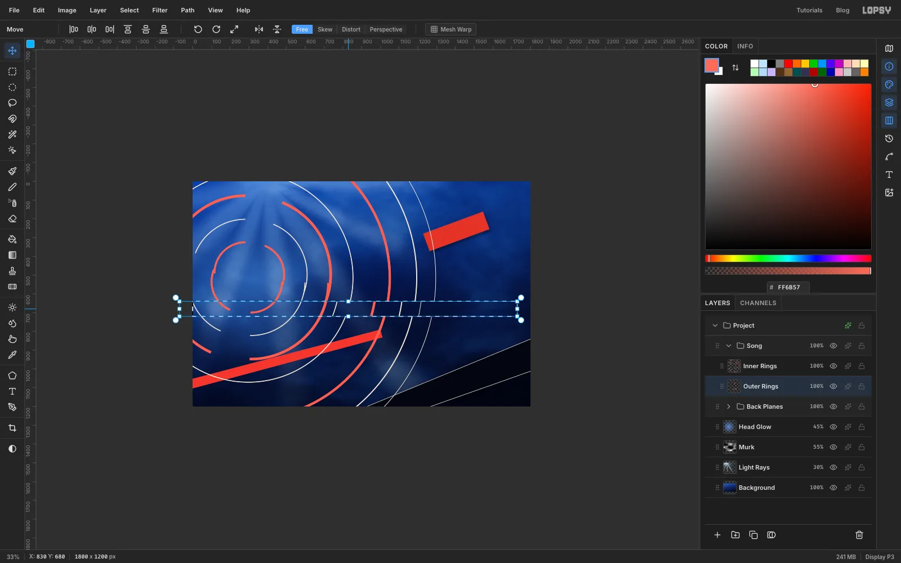

On *Outer Rings*, drag a **Rectangular Marquee** right across the canvas, a
band about 80 px tall just below the middle. A Rectangular Marquee has crisp
edges, so here you can move the selection directly without leaving a ghost.
Switch to the **Move** tool and
drag the band 70 px to the left. Every arc it crosses now steps sideways. Then
marquee a tall, narrow column a little right of centre and drag it about 55 px
up.

Take the **Eraser** at a big size (about 240) and **40%** opacity, and stroke
once along the top edge and once along the bottom edge. The outer rings now
fade out toward the frame instead of being chopped off by it.

Finally, give *Inner Rings* an **Outer Glow** in `#FF8A70`, **Size** 16,
**Opacity** 45, so the song itself seems to give off light.

## Draw the humpback

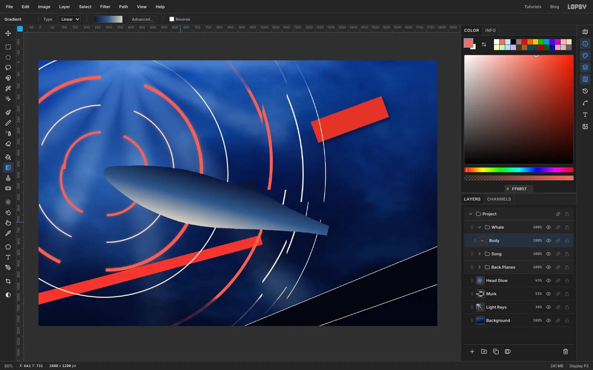

Make a group called *Whale* above *Song* and add a layer called *Body*. With
the **Lasso**, draw the whale's outline. The snout tip sits on the ring
centre, and the body angles slightly downward as it goes right. It is about
1000 px long to the end of the tail stock, which ends about 1300 px from the
left, and about 230 px deep at its deepest. Draw it in this order:

- a rounded, slightly flattened snout at the far left
- a long back that rises gently and then falls
- a small hooked dorsal fin about two thirds of the way along
- a tail stock that narrows to about a fifth of the body's depth
- a deep, rounded belly on the way back

Leave the flukes off for now. They get drawn as broken pieces later.

Open the Gradient Editor and set three stops: `#0D1534`, `#3A5687` and
`#DCD3C2`. Drag a **Linear** gradient straight across the body's depth, from
just above the back to just below the belly. This gives the dark back and
pale belly a humpback has, called countershading.

## Shade the body with soft brushes

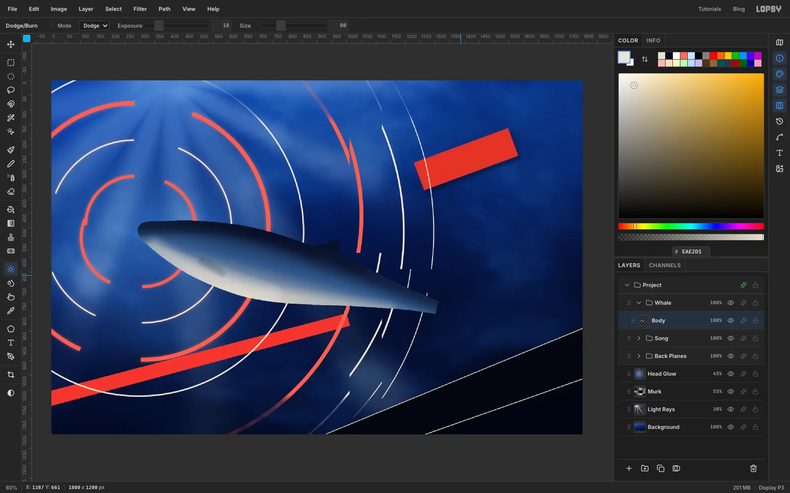

[[Cmd]]-click the *Body* thumbnail to load the whale's shape as a selection,
so nothing you paint can spill off the body.

1. Pick the **Brush**, choose the **Soft Round** preset, and set **Size** 130,
   **Hardness** 0, **Opacity** 55. In near-black `#070C22`, paint **one long
   stroke** along the back from the snout to the tail.
2. Switch to `#EAE2D1`, **Size** 90, **Opacity** 35, and paint one long stroke
   along the belly.
3. Choose **Dodge / Burn**, set it to **Burn** at **Exposure** 20 and **Size**
   70, and run it along the very top edge of the back. Then switch to
   **Dodge** at **Exposure** 18 and **Size** 80 and pass it once along the
   throat.
4. With the selection still loaded, choose **Select → Shrink** by **10** and
   run **Filter → Gaussian Blur** at **8** px to melt the strokes together.
   Shrinking first keeps the blur off the outline, so the silhouette stays
   crisp.

> **Tip:** Keep the strokes long and running along the body. Short strokes
> across the body leave a row of stripes that even a blur won't hide.

## Paint the face

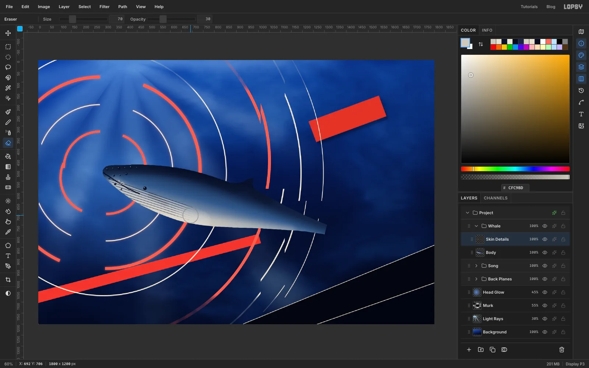

Add a layer called *Skin Details*. [[Cmd]]-click the *Body* thumbnail again so
the details stay on the whale.

- **Throat grooves.** Set the Brush to **Size** 4, **Hardness** 100,
  **Opacity** 60, in `#D9D2C3`. Click below the chin and [[Shift]]-click about
  a third of the way back to draw seven parallel straight lines. Do the same in
  `#1B2546` at **Size** 3, a few pixels above each one, so every groove gets a
  shadow.
- **Mouth and eye.** With a **6** px brush, drag a dark `#070B1E` line from the snout tip back and
  down to below the eye. Click once with a **17** px brush for the eye, then
  add a **5** px `#EDE6D6` highlight up and to the left of it.
- **Tubercles.** These are the knobs on a humpback's snout. Click a dozen dark
  `#0B1229` dots of different sizes, from 7 to 14 px, along the top of the
  snout and the jaw. Then add a much smaller `#E6DFCF` dot on the upper-left of
  each one, so they read as bumps catching the light.
- **Barnacles.** Click a small cluster of 6 px `#CFC9BD` dots on the chin.

Soften the back ends of the grooves with a big **Eraser** at **30%**, then
**Merge Down** into *Body*.

## Add the pectoral fin

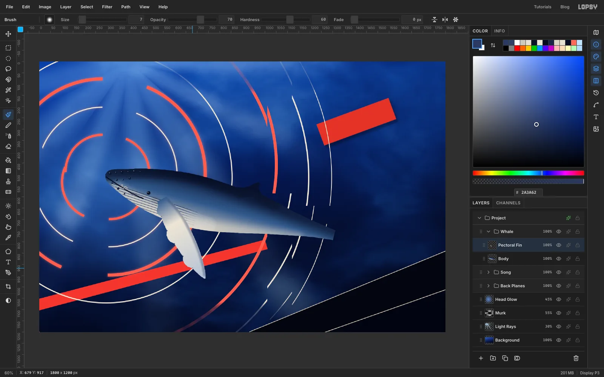

Humpbacks have the longest flippers of any whale, and their leading edge is
bumpy. Add a layer called *Pectoral Fin* above *Body*. Lasso a long blade
that hangs down and back from just behind the head, almost to the bottom
third of the canvas. Make it:

- narrow and rounded at the root
- widest about a third of the way down
- tapering to a point at the tip
- with five or six round bumps along the front edge

Fill it with a three-stop gradient from `#3A5687` through `#ECE5D5` to
`#B5C0D3`, dragged from the root to the tip. Shade the back edge with a soft
**26** px `#2E3F66` brush at **40%**. Click a small `#2A3A62` dot into each notch between
the bumps, so the bumps get a little undercut.

Back on *Body*, give the fin a contact shadow: **Burn** at **Exposure** 20 with
a small **28** px brush, in a short stroke along the line where the fin joins
the body.

## Crack the body

The break should start inside the whale, not at a clean edge. On *Body*,
lasso two thin zig-zag slivers, about 7 px wide, just behind the dorsal fin.
Run one down from the back and one up from the belly. Press [[Delete]] on
each. The ocean shows through, like fault lines.

## Shatter the tail

Now break the tail into pieces. Plan six slanted cuts across the tail stock,
behind the cracks. Space them about 50 px apart near the body and about 43 px
apart toward the tail. That gives five bands between the cuts, numbered 1 to
5 from the body end, plus the tail stock behind the last cut. For each
piece:

1. On *Body*, **Lasso** the band.
2. Press [[Cmd]]+[[X]], then [[Cmd]]+[[V]] to paste it in place on a new layer.
3. Drag it to the right and up or down. Turn it by dragging outside a corner
   handle, then press [[Cmd]]+[[D]].

Start with the **tail stock** and work toward the head. Each piece moves
further and turns more than the one in front of it. Rename each pasted layer
as you go:

- *Tail Stock*: about 190 px out, 12° anticlockwise
- *Shard 6* (band 5): 150 px, 32° clockwise
- *Shard 5* (band 4): 108 px, 24° anticlockwise
- *Shard 4* (band 3): 72 px, 18° clockwise
- band 2: lasso its top and bottom halves separately. *Shard 2* (the top)
  goes about 40 px up and right, 15° anticlockwise. *Shard 3* (the bottom)
  goes about 50 px down and right, 10° clockwise
- *Shard 1* (band 1, nearest the body): only 14 px, 8° clockwise

Alternate up and down, and clockwise and anticlockwise, so the pieces fan
out.

> **Tip:** Every cut, paste, move and rotate is its own history step. If the
> fan looks wrong, step back through the whole run with [[Cmd]]+[[Z]] and
> replay it with [[Cmd]]+[[Shift]]+[[Z]].

When you're done, lasso the area just behind the first cut on *Body* and press
[[Delete]] once more. This clears the faint anti-aliased line the cuts leave
behind.

## Draw a split fluke

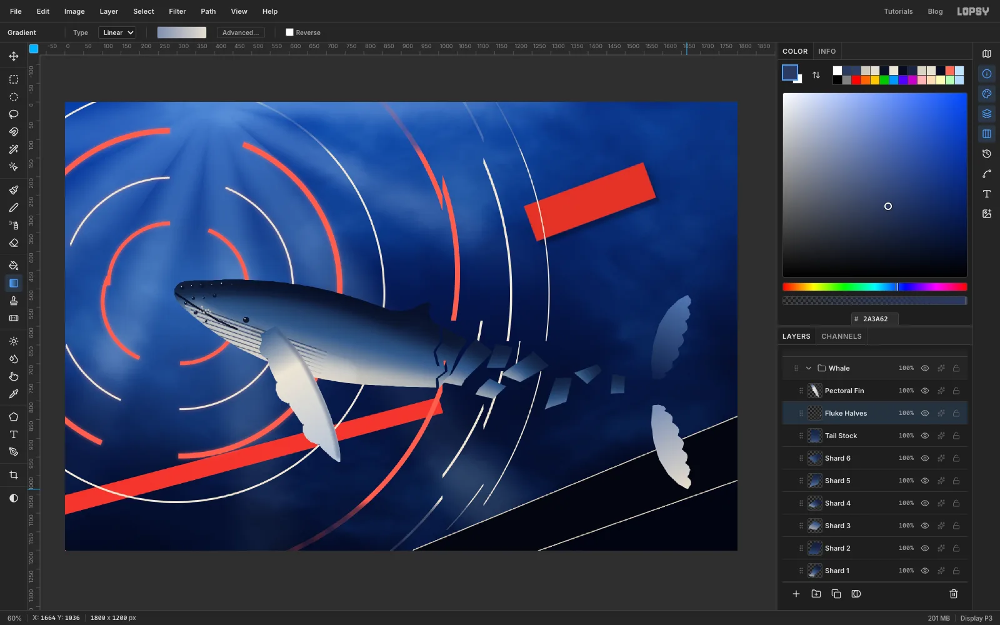

Click *Tail Stock* and add a layer above it called *Fluke Halves*. A
humpback's fluke is wide, with a notch in the middle and a scalloped trailing
edge. Here it has split into two halves, drawn about 60 px beyond the end of
the tail stock:

1. Lasso the **upper half**, a crescent about 235 px long. Its root is about
   1570 px in from the left and 740 px down, and it rises from there, leaning
   slightly back. It has a smooth, rounded front edge and a back edge made of
   six or seven small rounded scallops. Fill it with a gradient from
   `#14204A` at the root to `#5A76AE` at the tip.
2. Lasso the **lower half** as its mirror image, with its root about 70 px
   below the first. Fill it pale, from `#7F8FB2` to `#E6DECE`, as though it has
   rolled over and is showing its white underside.

Draw both halves standing almost upright. That makes the scallops easy to
draw, and you'll open them into a V once the rest of the scene is in.

## Vary the shards and light their edges

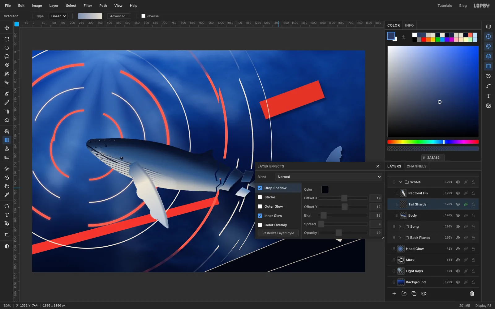

If every shard is the same blue, the pieces merge into one shape. To make
them look like parts of a curved body catching the light, give a few of them
different tones with **Filter → Hue/Saturation**:

- lighten *Shard 3* (**Lightness** +24) and *Shard 5* (+18)
- darken *Shard 4* (**Lightness** −22) and *Shard 6* (−18), so they read as near-black

Then click the *Fluke Halves* row and choose **Layer → Merge Down** until all
the pieces are one layer, and name it *Tail Shards*. Stop before you reach
*Body*. In its effects drawer:

- **Inner Glow** in bone `#EFE6D4`, **Size** 4, **Opacity** 60, which puts a
  thin lit rim on every shard
- **Drop Shadow** in `#01020A`, offset **10 / 12**, **Blur** 12, **Opacity** 40

On *Body* add an **Outer Glow** in `#DFE8FF`, **Size** 12, **Opacity** 22, as a
faint rim light that separates the whale from the water.

## Lay a bone bar across and break it

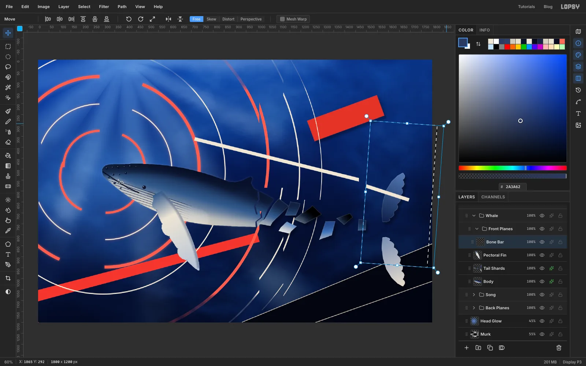

Click *Pectoral Fin* and make a *Front Planes* group, so it sits inside
*Whale* above the fin. Add a layer in it called *Bone Bar*.

1. Pick the **Shape** tool, choose **Rectangle**, and set the fill to bone
   `#EFE6D4`. Drag out a bar about 980 × 16 px across the upper middle of the
   canvas.
2. [[Cmd]]-click the thumbnail and rotate the bar **14°** with the **Move**
   tool, so it runs down toward the upper fluke.
3. Break it. Drag a **Rectangular Marquee** around the bar's right third,
   then drag that piece **30 px right and 40 px down**. Rotate it about **4°**
   and press [[Cmd]]+[[D]].

The break needs to be big enough to look deliberate. A 15 px step reads as a
mistake.

## Raise a glass pane with Perspective

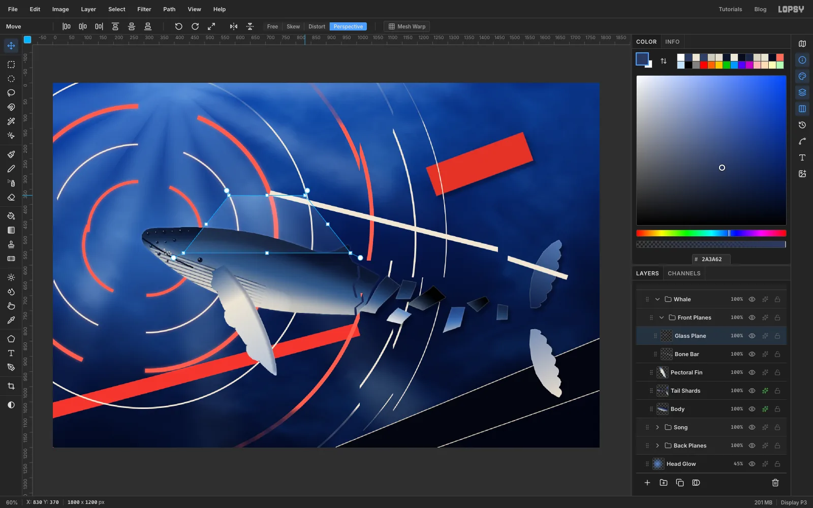

Add a layer called *Glass Plane*. Marquee a rectangle about 550 × 230 px
whose bottom edge cuts across the whale's back. Fill it with a gradient of
`#9CC6FF` from 32% opacity at the top to 10% at the bottom, then set the layer
to **Screen**.

[[Cmd]]-click its thumbnail, pick the **Move** tool, and click **Perspective**
in the options bar. Drag the top-right corner about 150 px to the **left**
and a little down.
Perspective moves the opposite top corner the same distance the other way, so
the rectangle becomes a keystone that leans away from you. Press [[Cmd]]+[[D]]
and click **Free** to go back to normal transforms.

## Tint the whale where the glass covers it

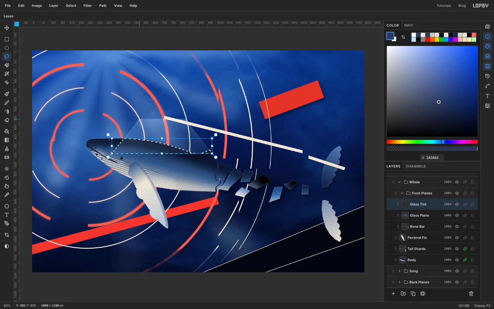

A glass pane over the whale should tint whatever is behind it. Add a layer
called *Glass Tint* and build that overlap as one selection:

1. [[Cmd]]-click the *Body* thumbnail.
2. Pick the **Lasso**, hold [[Shift]]+[[Alt]] and draw around the glass
   keystone. Shift+Alt **intersects**, so only the whale inside the glass
   stays selected.

Fill it with navy `#1A2A5A`, set the layer to **Multiply** at **35%**, and
deselect.

On a new layer called *Glass Edge*, use a **2** px Hard Round brush in bone.
Click the glass's bottom-left corner and [[Shift]]-click its top-left, then
[[Shift]]-click the top-right corner. Set the layer to **60%**. Highlighting
only two edges makes it look like glass catching the light, not a box drawn
round it.

## Scatter the debris

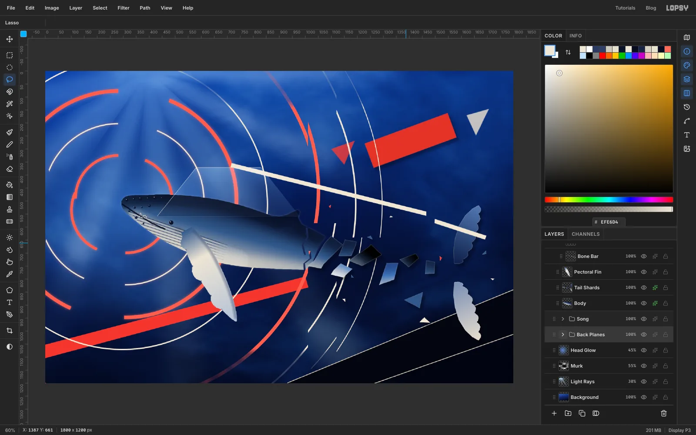

Add a layer called *Debris* and lasso a dozen small triangles of different
sizes, from about 10 px chips to 40 px pieces. Cluster them along the path the
shards are flying, in bone, `#E2483A` and `#3A5687`. Give the layer the same
**Drop Shadow** and **Inner Glow** settings as the shards, so everything in
the explosion is lit the same way.

For depth, expand *Back Planes* and add a layer called *Far Debris* above
*Coral Slab*. Lasso two larger triangles near the slab, one coral and one
bone. Blur them with **Gaussian Blur** at **2.5** px and set the layer to **80%**.
The blur pushes them back into the water behind the whale.

## Release plankton and a column of bubbles

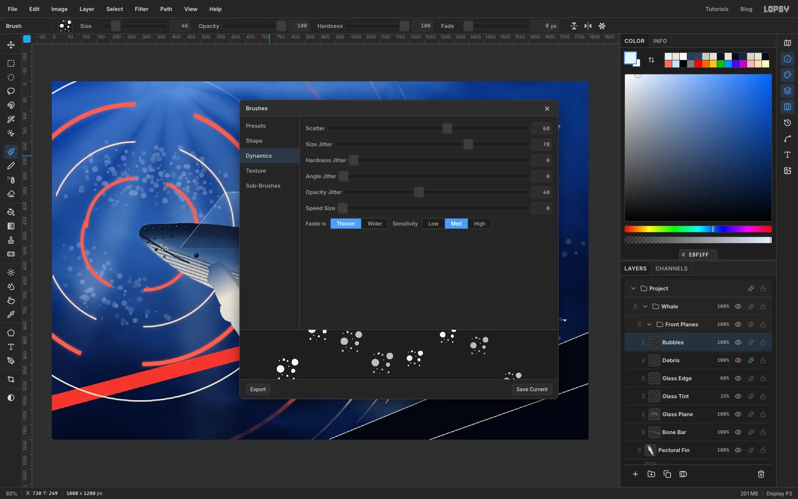

**Plankton.** Add a layer called *Plankton* above *Head Glow*. Choose the
**Spray** tool with **Size** 200, **Density** 10, **Opacity** 80 and
**Softness** 40. Spray pale `#E8F1FF` in loose drifts around the head. Drop
**Density** to 4 for a thinner trail through the shatter. Set the layer to
**Screen** at **45%**.

**Bubbles.** Add a layer called *Bubbles* at the top of *Front Planes*.
Open the **Brushes** modal (click the brush-tip thumbnail at the left of the
Brush options bar) and pick the **Bubbles** preset. Then set:

- **Size** 46 and **Spacing** 140 on the **Shape** tab
- **Scatter** 60, **Size Jitter** 70 and **Opacity Jitter** 40 on the **Dynamics** tab

Close the modal. In `#DCEBFF`, drag one wobbly stroke from the blowhole up to
the top edge.

> **Tip:** Spray uses whatever tip the Brush last had selected. The Brush is
> still on Hard Round from the glass edges, which is what you want. If you
> ever spray after using the Bubbles preset, switch the Brush back to a round
> tip first, or the plankton comes out as tiny bubbles.

## Add grain and grade the whole piece

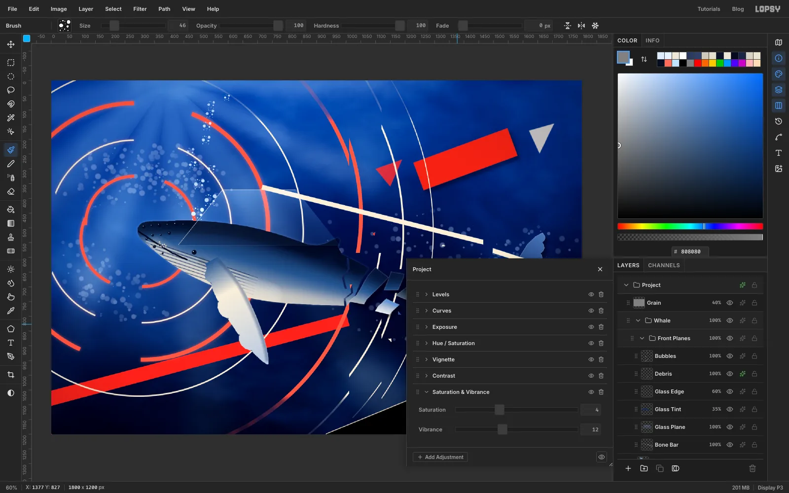

**Grain.** Add a layer called *Grain* at the very top, above *Whale*. Fill it
with mid grey `#808080`, then run **Filter → Add Noise** at **14**. Set it to
**Overlay** at **40%**. The fine grain stops the smooth gradients looking like
vector clip-art.

**Grade.** Click the *Project* group row and open its drawer. Use **Add
Adjustment** to add:

- **Vignette** at 26
- **Contrast** at +10
- **Saturation & Vibrance**, with Saturation +4 and Vibrance +12

These are non-destructive, so you can come back and change them at any time.

## Splay the fluke

Now step back and look at the whole frame. This is the point to judge
balance, because only now can you see everything together. Upright, the two
fluke halves look like a pair of shells. A split fluke should open into a V.
On *Tail Shards*:

1. Lasso loosely around the upper half. It has empty water all round it, so
   the selection doesn't need to be tight.
2. Rotate it **25°** clockwise with the **Move** tool, then drag it a little
   down and right, so its root sits on the line of the tail stock.
3. Press [[Cmd]]+[[D]].

Do the same to the lower half: rotate it **25°** anticlockwise and drag it up
and to the right, so the two roots nearly touch.

## Push the slab back

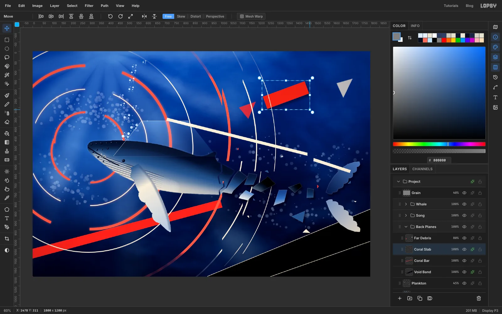

With the whole scene in, the coral slab turns out to be the biggest block of
strong colour in the top half, and it pulls the eye away from the whale.
Expand *Back Planes* and click *Coral Slab*:

1. Marquee around it.
2. With the **Move** tool, hold [[Cmd]] and drag the bottom-right corner
   handle in until the slab is about **70%** of its size. Press [[Cmd]]+[[D]].
3. Nudge it left with [[Shift]]+[[←]] until the outer rings cross over it,
   so the planes and the song lock together.
4. Run **Hue/Saturation** at **Lightness** −10 so it sits deeper than the
   coral bar.

Last, click *Far Debris*, marquee the coral triangle and drag it up and to
the left, clear of the slab, so the two shapes don't touch. Raise the layer
back to **100%**: at 80% the blurred bone triangle turns grey, and blur alone
is enough to push it back.
