Dieselpunk borrows the look of the 1930s and 40s machine age: streamlined trains, airships, searchlights, and posters airbrushed in smooth gradients. The great railway posters of the time, like A. M. Cassandre's *Nord Express*, put the viewer down by the tracks. The engine looms, and the rails and telegraph wires rush off to a single vanishing point.

This card does the same for Christmas Eve. The *Quicksilver Comet* streamliner charges out of the dark with a wreath on its nose, under a full moon and a passing airship. Everything is drawn in Lopsy from selections, gradients, Pen paths and layer effects, with no photos.

Along the way you'll use:

- **ruler guides** and a vanishing point to keep the perspective honest
- the **Pen** tool for the airship and the locomotive's bullet nose, with **Path to Selection** and Enter-to-stroke
- **Lasso** selections combined with **Shift** (add), **Alt** (subtract) and **Shift+Alt** (intersect)
- **Cmd**-clicking layer thumbnails to paint inside shapes
- linear and radial **gradients** with transparent stops, plus **layer masks**
- the **Spray** tool for stars and snow, and a **Brush** with scatter and jitter for wreath needles
- **Move**-tool transforms on groups and on several layers at once, and **Distort** to letter the train in perspective
- **Clouds**, **Smoke**, **Gaussian Blur**, **Motion Blur** and **Add Noise**
- **Outer Glow**, **Inner Glow**, **Stroke** and **Drop Shadow** effects, and the **Screen**, **Multiply** and **Overlay** blend modes
- live text in **Syncopate**, **Federo** and **Big Shoulders**

The palette is cool night blues with one warm accent (the headlight) and one festive one (the red skirt):

- Night sky `#0A1322` → `#1B3150` → `#4F6A86`
- Moon `#F2EEDF`, moon glow `#9FB3D6`
- Snow `#7F97B8` → `#4F6589` → `#26365A`
- Gunmetal body `#1E2630` → `#36424F` → `#6C7D90`
- Red skirt `#B23A33` → `#8E2A2A` → `#5E1A1E`
- Chrome `#EEF3F7`, lamplight `#FFC861`, window glow `#FFCF7A`
- Pine `#1D4635`, berries `#C8343A`, bow `#B22D31`
- Mat `#0D1A33`, cream type `#F3ECDC`

> **Tip:** Positions are in document pixels, written `x, y`. The status bar at the bottom shows where the pointer is. When a step says to fill, that's **Edit → Fill**, and [[Cmd+D]] deselects.

## Start a portrait card

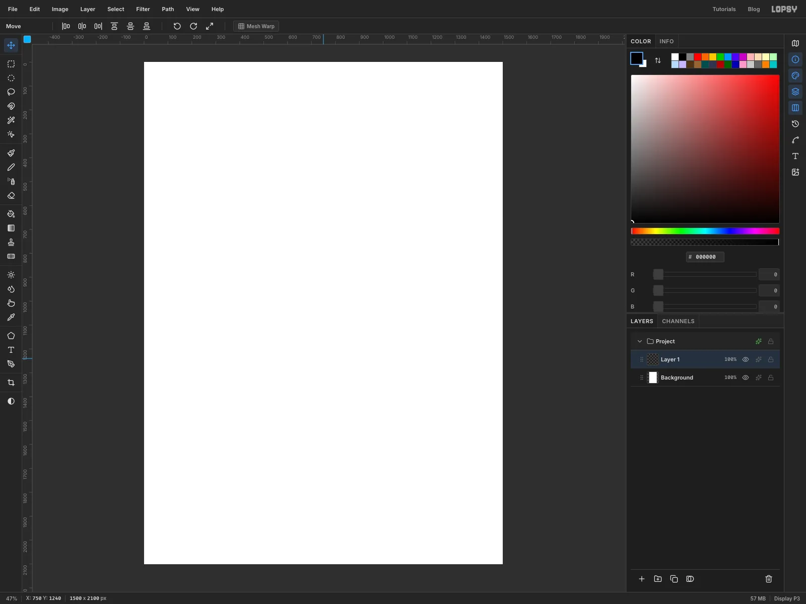

Open [Lopsy](/). In the **New Document** dialog, set **Width** to `1500` and **Height** to `2100`, leave the background white and click **Create**. That's a 5 × 7 card at 300 dpi.

## Place the horizon and margins

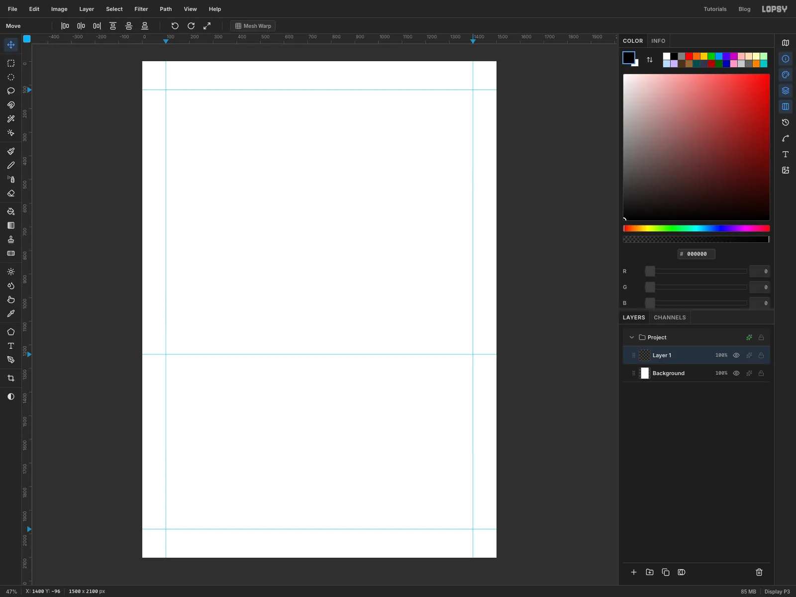

A single click on a ruler drops a guide.

1. Click the left ruler at `1240`. This is the **horizon**, and the eye level of the whole picture: everything in the distance meets it.
2. Click the left ruler at `120` and `1980`, and the top ruler at `100` and `1400`. These mark a safe area: keep the title and the important parts of the picture inside them, because the edges get covered by a mat at the end.

Everything that runs into the distance (the train, the rails, the telegraph wires) heads for one **vanishing point**: `1700, 1240`. That's on the horizon, just off the right edge of the canvas. Keep it in mind; you'll aim at it a lot.

## Paint the night sky

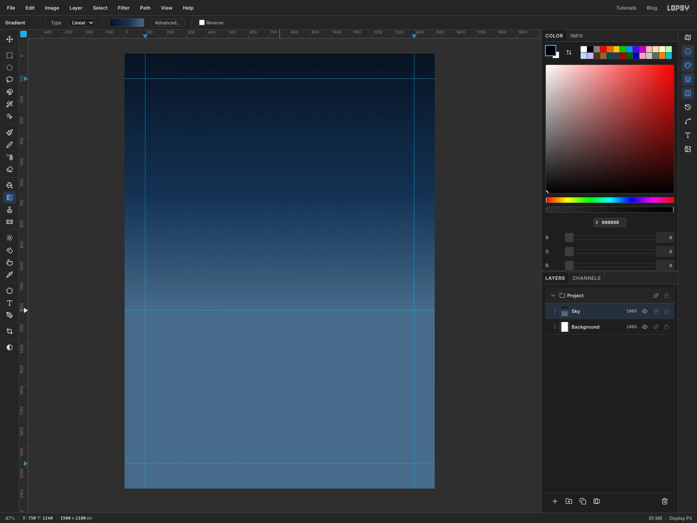

1. Double-click **Layer 1**'s name and rename it `Sky`.
2. Pick the **Gradient** tool, set the type to **Linear** and click **Advanced…** to open the Gradient Editor. Make three stops: `#0A1322` at the left, `#1B3150` just past the middle and `#4F6A86` at the right. Click **Done**.
3. Drag from the top edge of the canvas straight down to the horizon guide.

Below the horizon the last colour carries on. The snow will cover it later.

## Spray a field of stars

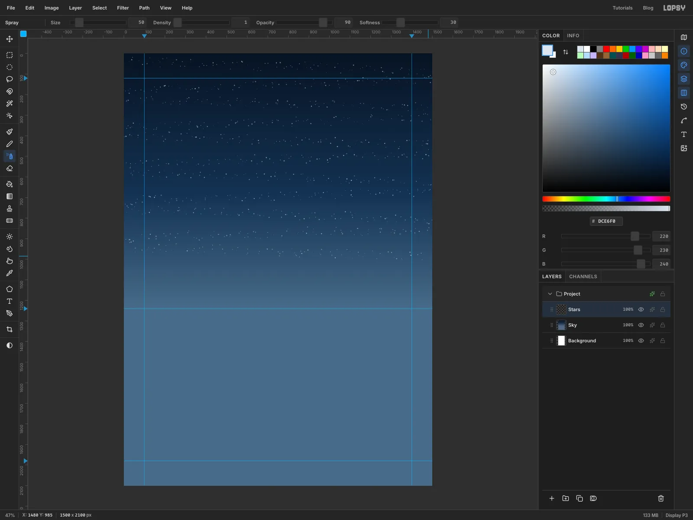

1. Click **Add Layer** in the Layers panel and name the layer `Stars`.
2. Set the foreground colour to `#DCE6F0`.
3. Pick the **Spray** tool and set **Size** `50`, **Density** `1`, **Opacity** `90` and **Softness** `30`.
4. Zigzag across the sky from the left edge to the right and back, working down in rows about 90 px apart until you're a little above the horizon.

At this size each puff leaves just one or two tiny dots, so you get a dusting of stars rather than a cloud.

## Fade the stars near the horizon

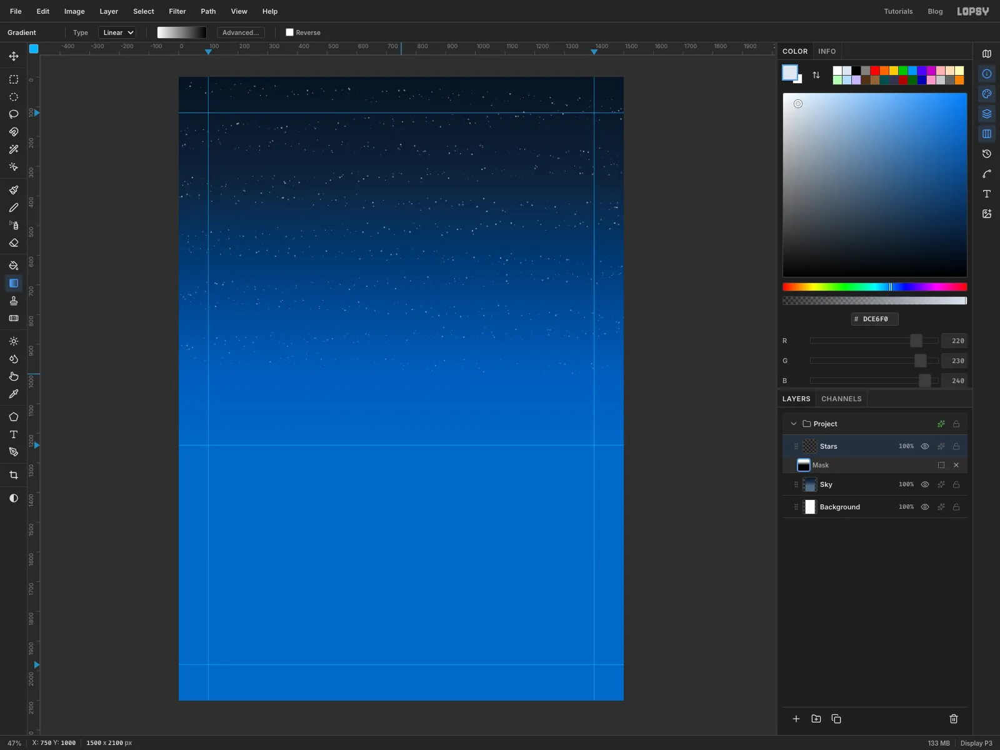

Real stars disappear into the haze low in the sky.

1. With `Stars` selected, click **Add Mask** at the bottom of the Layers panel. A **Mask** row appears under the layer.
2. Click the mask's thumbnail to edit the mask. The blue tint shows what the mask hides.
3. Pick the **Gradient** tool and click **Advanced…**. Click the middle stop and press **Delete** in the editor to remove it, then set the two remaining stops to white on the left and black on the right. Click **Done** and drag from `750, 350` straight down to `750, 1000`.
4. Click the `Stars` layer name to go back to editing its pixels.

## Hang a full moon

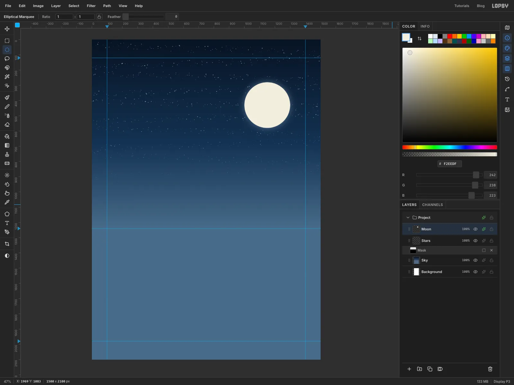

1. Add a layer called `Moon` and set the foreground to `#F2EEDF`.
2. With the **Elliptical Marquee**, drag from `1000, 280` to `1300, 580` for a 300 px circle. Hold [[Cmd]] while you drag to keep it round.
3. Fill it and deselect.
4. Click the effects button on the `Moon` row (the sparkle icon) to open the effects drawer. Tick **Outer Glow** and set **Size** `120`, **Opacity** `50` and the glow colour to `#9FB3D6`.

## Give the moon a little texture

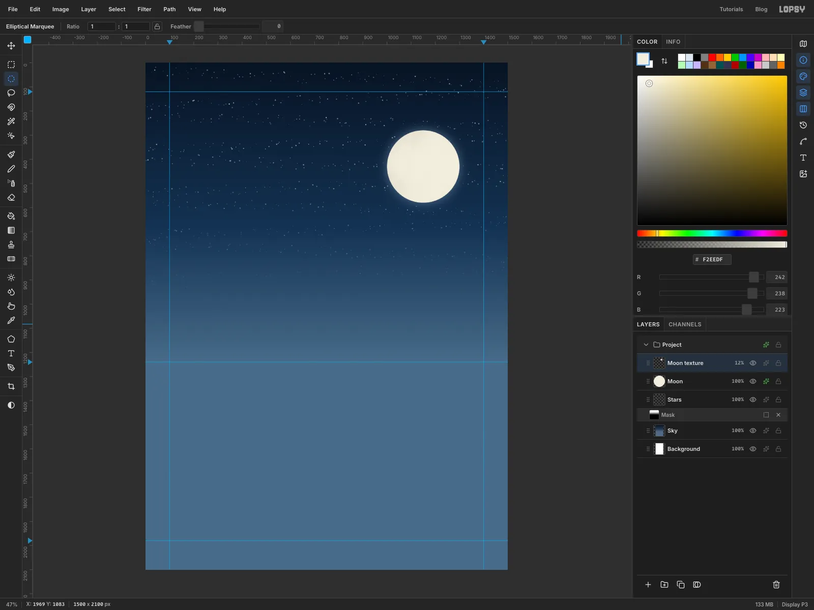

1. Add a layer called `Moon texture`.
2. Hold [[Cmd]] and click the `Moon` thumbnail. That loads the disc as a selection.
3. Choose **Filter → Clouds…**, set **Scale** to `5` and click **Apply**. The clouds stay inside the circle.
4. Deselect. In the effects drawer set the layer's blend mode to **Multiply**. Then click its opacity percentage on the row and drag it down to `12%`.

Keep it subtle. A strongly mottled moon looks grey and dull.

## Add haze along the horizon

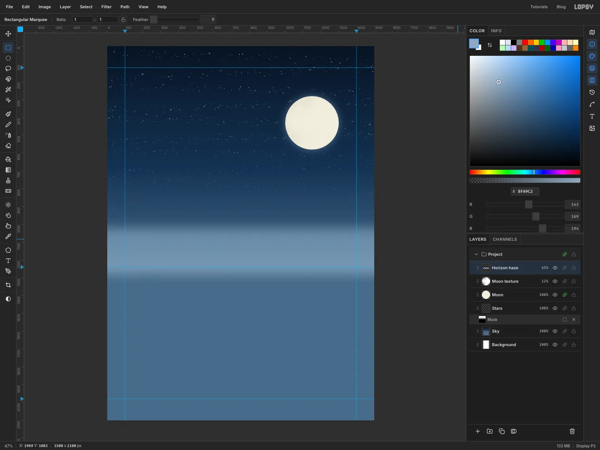

1. Add a layer called `Horizon haze`.
2. With the **Rectangular Marquee**, drag from just off the left edge at `y 1020` to just off the right edge at `y 1280`, so the band runs edge to edge across the horizon.
3. Choose **Select → Feather…**, enter `60` and apply.
4. Fill with `#8FA9C2`, deselect, then set the layer to **Screen** at `45%`.

## Lasso three searchlight beams

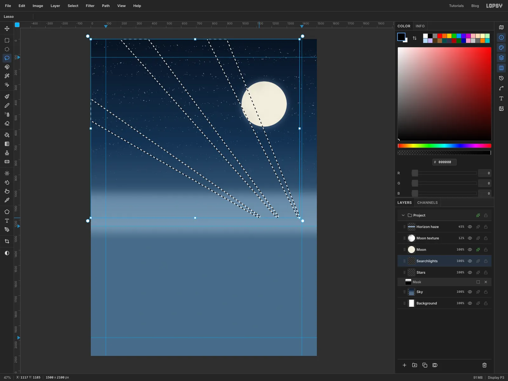

Searchlights raking the sky are a staple of 1930s premieres and expos.

1. Click the `Stars` row, then **Add Layer**, and name the new layer `Searchlights`. A new layer always lands just above the one you've selected, so the beams sit behind the moon.
2. With the **Lasso**, draw a long thin wedge: start with a narrow base about 12 px wide near the horizon at `1240, 1180`, and fan out to about 150 px wide at the top edge around `x 260`.
3. Hold [[Shift]] and draw a second wedge from `1380, 1180` up to the top edge around `x 820`, ending about 120 px wide.
4. Hold [[Shift]] again for a third, from `1120, 1180` out to the left edge around `y 420`.

Shift adds each new shape to the selection, so all three fill together.

## Light the beams

1. Pick the **Gradient** tool and open **Advanced…**. Set both stops to `#CFE0F0`. Drag the left stop's opacity to about `75%` and the right stop's to `0`.
2. Drag the gradient from the base of the beams at `1250, 1180` up towards `600, 200`. The beams are bright at the base and fade as they climb.
3. Deselect and run **Filter → Gaussian Blur…** with a **Radius** of `8` to soften the edges.
4. Set the layer to **Screen** at `55%`.

## Draw the airship hull with the Pen

1. Click the `Moon texture` row, then click **New Group** and name the group `Airship`. Inside it, add a layer called `Hull`.
2. Open the **Paths** panel from the right-hand rail (the curved-line icon).
3. Pick the **Pen** tool and draw a teardrop. A click places a sharp corner; a press-and-drag pulls out handles for a smooth curve.
   - Press at `945, 440` and drag straight up to `945, 396` for a round, blunt nose.
   - Press at `1070, 386` and drag right to `1170, 386` for the top of the hull.
   - Click once at `1350, 438` for the pointed tail.
   - Press at `1070, 494` and drag left to `1000, 494` for the belly.
   - Click back on the first anchor to close the path.
4. Click **Path to Selection** at the bottom of the Paths panel. Fill the selection with `#141C2E` and deselect.
5. Give `Hull` an **Inner Glow**: **Size** `6`, **Opacity** `100`, colour `#F4ECD0`. With the moon right behind it, the airship should be a dark silhouette with a thin rim of moonlight.

## Add fins, a gondola and running lights

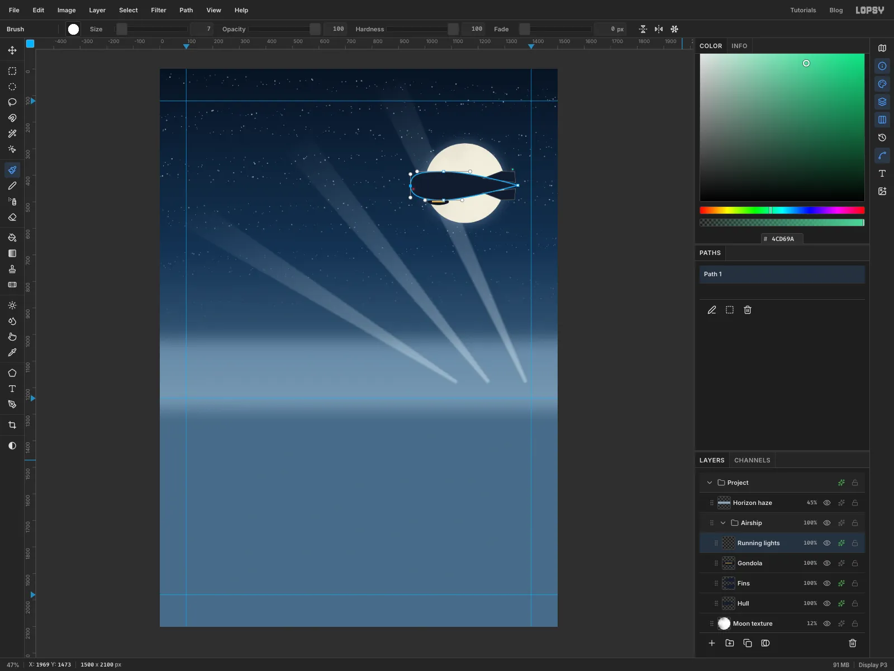

1. Add a layer called `Fins`. Lasso a small trapezoid on the top of the tail, from `1215, 412` up to `1288, 384`, across to `1338, 386` and down to `1342, 428`. Hold [[Shift]] and mirror it underneath: `1215, 466`, `1288, 494`, `1338, 492`, `1342, 450`. Fill with `#141C2E` and give it the same cream **Inner Glow** at size `4`.
2. Add a layer called `Gondola`. Drag an elliptical marquee from `1010, 488` to `1090, 512` under the hull and fill it with `#0F1520`. Then draw a thin rectangle across it from `1026, 497` to `1074, 502` and fill it with lamplight `#FFC861`.
3. Add a layer called `Running lights`. Pick the **Brush**, set **Size** `7` and **Hardness** `100`. Click once at the nose with `#E8363A` (red, port side) and once at the top fin with `#4CD69A` (green). Add a small **Outer Glow** (size `12`, opacity `80`, colour `#FF9A80`).

## Tilt and shrink the airship as one group

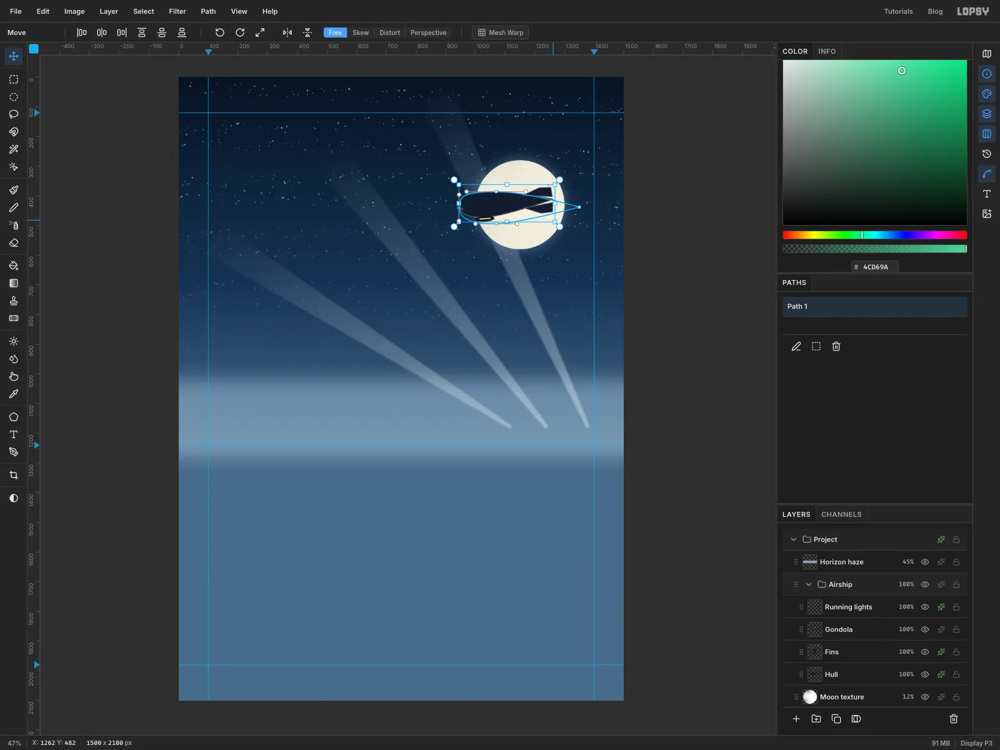

Because the airship parts share a group, you can transform them together.

1. Press [[Cmd+D]] so nothing is selected, then click the `Airship` group row.
2. Pick the **Move** tool. A box with handles appears around all four layers.
3. Hover just outside a corner until the cursor turns into a curved arrow, then drag to rotate the airship about 4° counter-clockwise, nose down. Press [[Cmd+D]] to commit. Cmd+D both deselects and commits a pending transform.
4. Click the group row again. Hold [[Cmd]] and drag the bottom-right corner handle inwards until the box is about four-fifths of its old size. Cmd keeps the proportions. Commit with [[Cmd+D]].
5. With the group still selected, press [[Shift+Right]] four times (each press moves 10 px) to slide the airship 40 px to the right, so the moon frames it and only the tail pokes past its edge.

## Raise a deco skyline

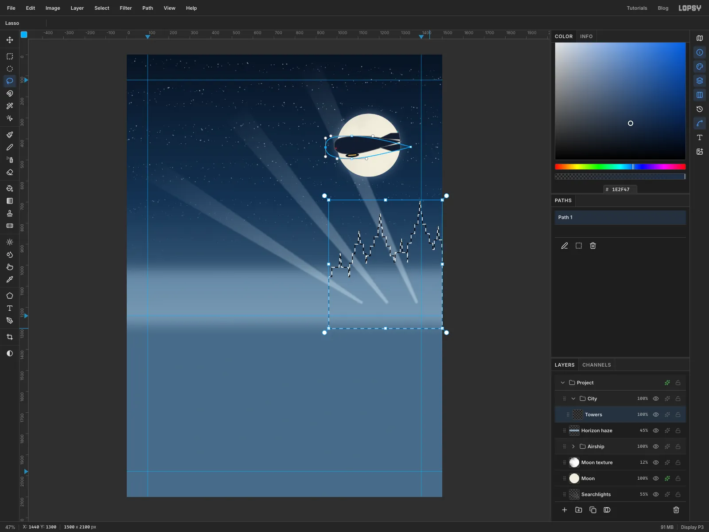

1. Collapse the `Airship` group (the arrow on its row), then click the `Horizon haze` row so the next group lands above it. Click **New Group**, name it `City`, and add a layer called `Towers`.
2. Set the foreground to `#1E2F47`.
3. With the **Lasso**, draw six skyscrapers side by side between `x 960` and the right edge, each 80–130 px wide. Hold [[Shift]] for each tower after the first.
   - Give each tower one to three setbacks: every 45 px or so up, step both sides in by 11–18 px, like a wedding cake.
   - Finish each with a needle spire about 12 px wide at the base and 70 px tall.
   - Vary the heights. The tallest, at `x 1335` to `1455`, has its top ledge at about `y 760`. The shortest stops near `y 1010`.
   - Run every base down past the horizon to `y 1300`.
4. Fill and deselect. Add an **Inner Glow** (size `4`, opacity `50`, colour `#B9CADB`) for a frosting of snow on the ledges.

Only their tops will show above the train's roof, so they don't need much detail.

## Switch on the windows

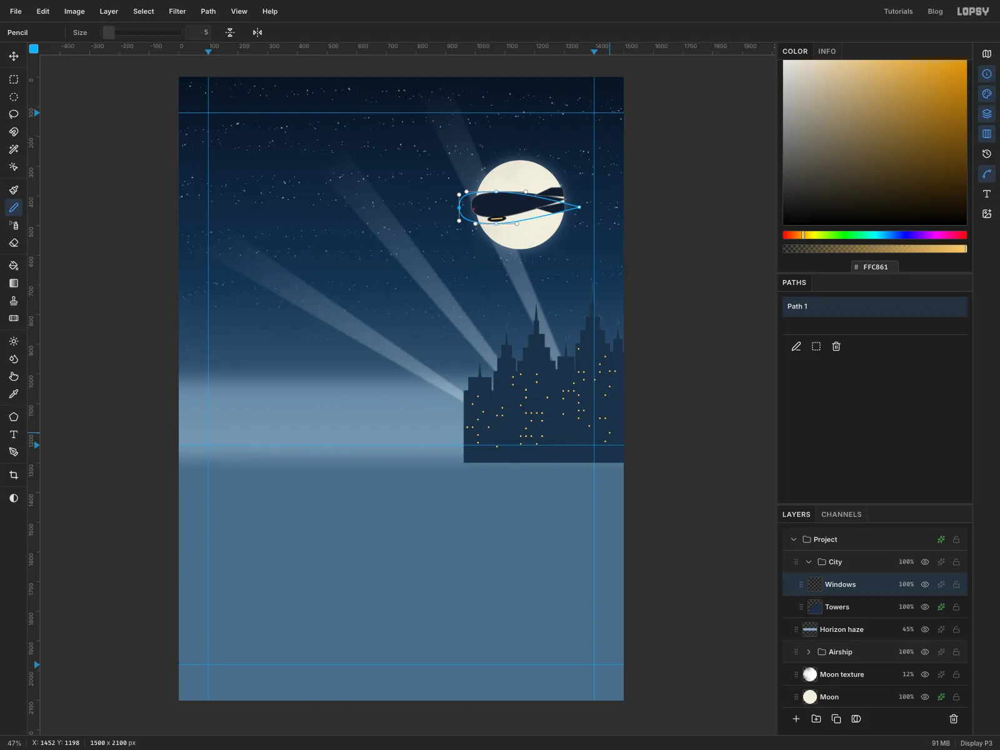

1. Add a layer called `Windows`.
2. Pick the **Pencil**, set the size to `5` and the colour to `#FFC861`.
3. Click windows in loose rows on each tower, leaving most of the spots dark. A few lit windows per tower look more real than a full grid.

## String the telegraph wires

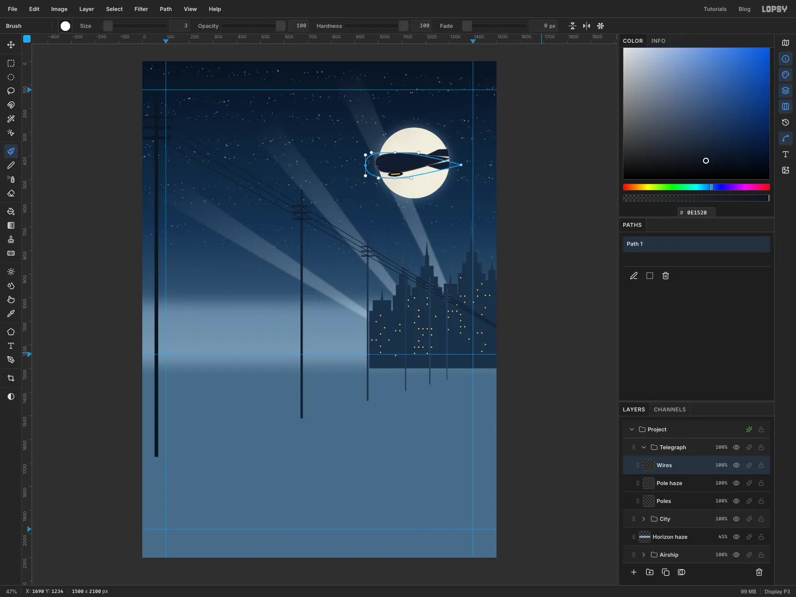

Converging wires are the most Cassandre-like thing in the picture.

The three wires will run from the left edge at `y 200`, `245` and `290` straight to the vanishing point. The poles and their crossarms line up with those lines, so picture them first.

1. Collapse `City`, click its row, then **New Group** `Telegraph` and a layer called `Poles`. Set the foreground to `#0E1520`.
2. Lasso six tall, thin poles, holding [[Shift]] after the first. They get shorter, thinner and closer together as they recede:
   - The nearest stands at `x 60`, 16 px wide, with its top at about `y 127`.
   - The others stand at about `x 675`, `954`, `1113`, `1218` and `1290`, shrinking each time to only 4 px wide.
   - Each pole's top sits a little above the top wire: about 110 px for the nearest, less for each one further away.
   - Run each pole down past the horizon; the snowfield will cover the bottom.
3. With [[Shift]] still held, give each pole three short crossarms, one where each wire line crosses it.
4. Fill and deselect.
5. Add a layer called `Pole haze`, [[Cmd]]-click the `Poles` thumbnail and drag a linear gradient from `500, 700` to `1350, 700`, fading from transparent `#3A4F78` to `#3A4F78` at 85% opacity. The far poles now fade into the night. Deselect.
6. Add a layer called `Wires`. Pick the **Brush** at size `3`. Click just off the left edge at `y 200`, then hold [[Shift]] and click near the vanishing point, out in the grey area right of the canvas. Shift-click draws a straight line between the two clicks. Do the same from `y 245` and `y 290`.

## Lay down the snowfield

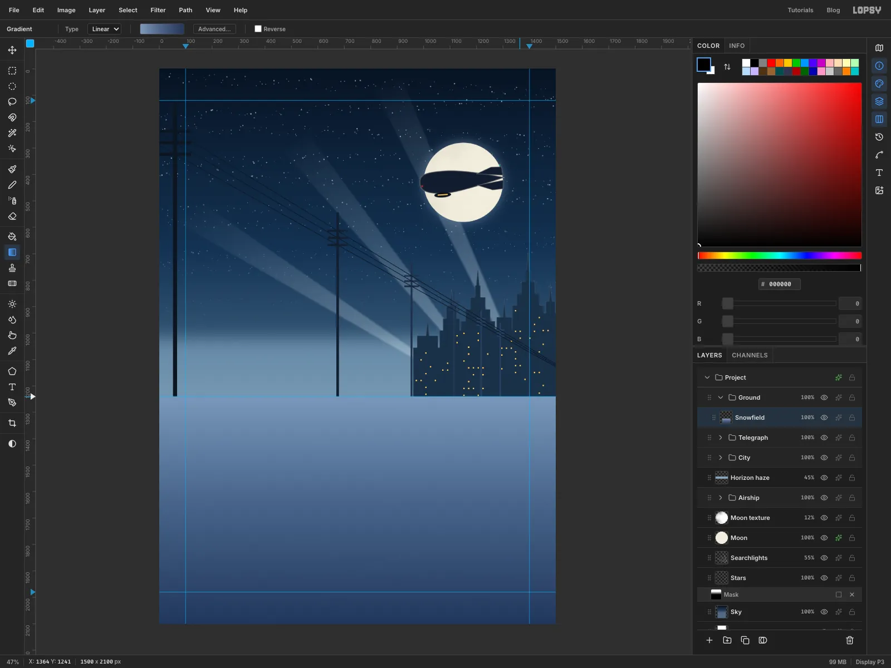

1. Collapse `Telegraph`, click its row, then **New Group** `Ground` and a layer called `Snowfield`.
2. Drag a rectangular marquee from just off the left edge at `y 1236` down past the bottom-right corner.
3. Make a three-stop gradient, `#7F97B8` → `#4F6589` → `#26365A`, and drag it from the horizon straight down to the bottom edge.
4. Deselect, then run **Filter → Add Noise…** with **Amount** `6` and **Mono** for a fine grain in the snow.

It's darker at the bottom because the moon is behind the scene. That also leaves room for the headlight to light the snow later.

## Lay the track

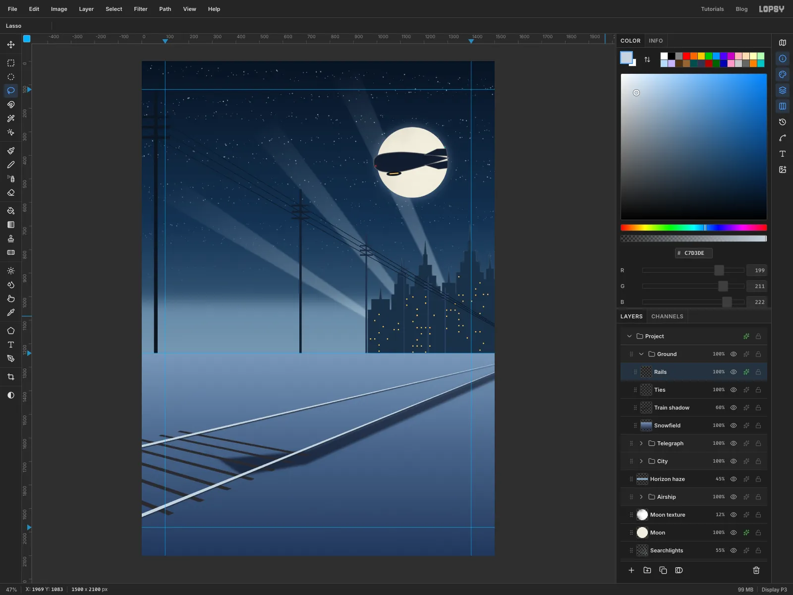

The two rails both run to the vanishing point. The near rail leaves the left edge at about `y 1922` and the far rail at about `y 1630`.

1. Add a layer called `Train shadow`. Lasso the shadow the train will cast, a long thin wedge that widens under the nose: `700, 1655`, out to the right edge at `1660, 1258` and down to `1660, 1282`, back to `700, 1712`, then under the nose through `430, 1760`, `250, 1640` and `330, 1690`. Fill with `#0E1428`, deselect, blur it with **Gaussian Blur** `14`, and set it to **Multiply** at `60%`.
2. Add a layer called `Ties`. Ties are square to the rails, so in perspective they slant up to the left, towards a second vanishing point far off the left side of the picture. Lasso nine short bars, holding [[Shift]] after the first. Each one runs from the near rail up and to the left to the far rail, overhanging both a little:
   - One of the nearest runs from `305, 1800` up to about `-143, 1668`, off the left edge, and is about 22 px thick.
   - A middle one runs from `495, 1723` to `56, 1622`.
   - The furthest you'll see runs from `645, 1663` to `222, 1583`, only about 16 px thick.
   - Space the rest so they close up and thin out towards the right, and add a couple more below the nearest one, about 70 px apart along the rail, running off the lower left.
   - Fill with `#2B2A2E`.
3. Add a layer called `Rails` above the ties. Lasso two long, thin wedges that both end in a point at the vanishing point. Hold [[Shift]] for the second one.
   - The near rail starts at the left edge between `y 1922` and `1936`.
   - The far rail starts between `y 1630` and `1640`.
   - Fill both with `#C7D3DE`.
4. Give `Rails` a **Drop Shadow**: **Offset X** `0`, **Offset Y** `5`, **Blur** `3`, **Opacity** `70`, colour `#1E2633`.

The near rail runs under the near side of the train, so the train will sit on it rather than beside it.

## Plant a tree line and soften the horizon

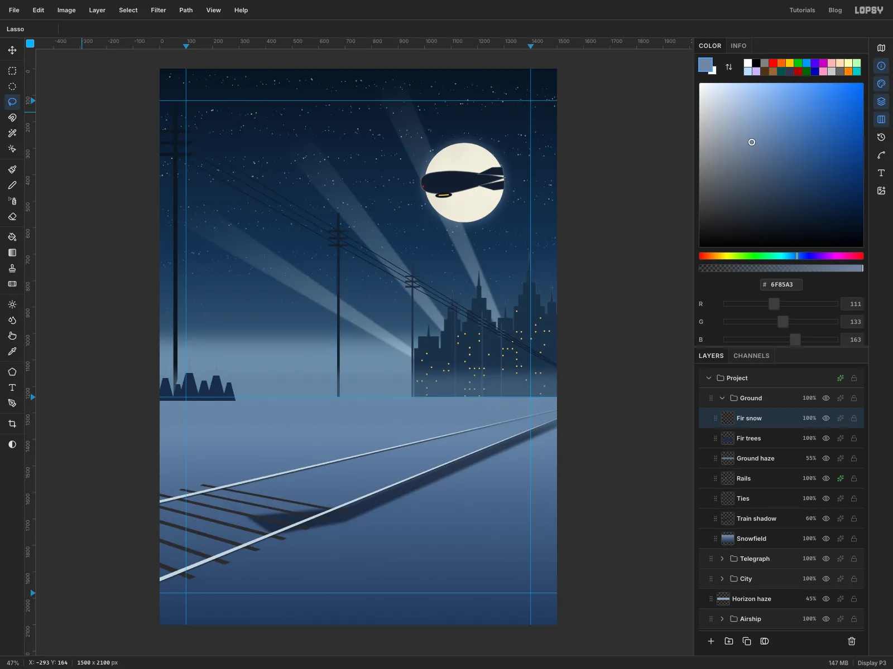

1. Add a layer called `Ground haze`. Drag a marquee edge to edge from `y 1150` to `y 1350`, **Feather** it by `50`, fill with `#5F7894` and set the layer to `55%`. This blurs the line where the snow meets the sky.
2. Add a layer called `Fir trees`. On the far left, lasso six tall, narrow triangles standing on the horizon between `x 22` and `x 262`, between 76 and 140 px tall. Fill them with `#1C2A48`.
3. Add a layer called `Fir snow`. For each tree, lasso a small triangle over its top third: start at the tree's tip and follow its two sides a third of the way down. Fill with `#6F85A3`.

## Draw the bullet nose with the Pen

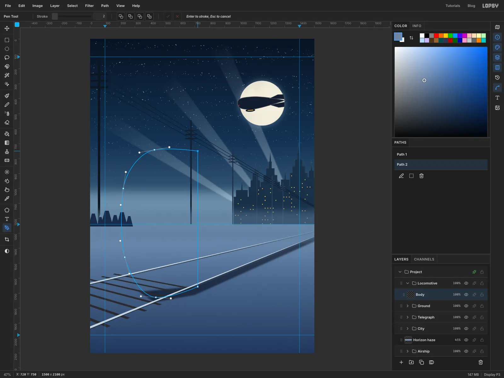

1. Collapse `Ground`, click its row, then **New Group** `Locomotive` and a layer called `Body`.
2. Pick the **Pen** and trace the nose. Remember: click for a corner, press and drag for a curve.
   - Click at `720, 750`, where the nose meets the roof.
   - Press at `430, 742` and drag left to `330, 760`.
   - Press at `222, 1000` and drag down to `205, 1110`. This is the front of the nose.
   - Press at `232, 1460` and drag down to `262, 1570`.
   - Press at `440, 1728` and drag right to `540, 1735`.
   - Click at `720, 1657` on the bottom edge.
   - Click the first anchor to close the path.

## Add the side of the train

1. Click **Path to Selection** in the Paths panel.
2. Hold [[Shift]] and lasso the long side of the train. Its top and bottom edges both aim at the vanishing point.
   - Start where the nose meets the roof, at `700, 740`.
   - Go to the right edge at about `y 1220` (draw a little past the edge, to `x 1660`).
   - Drop down to about `y 1257`.
   - Come back to the bottom of the nose at `700, 1666`.

Shift adds the wedge to the nose, so you have the whole locomotive selected.

## Fill the body with gunmetal

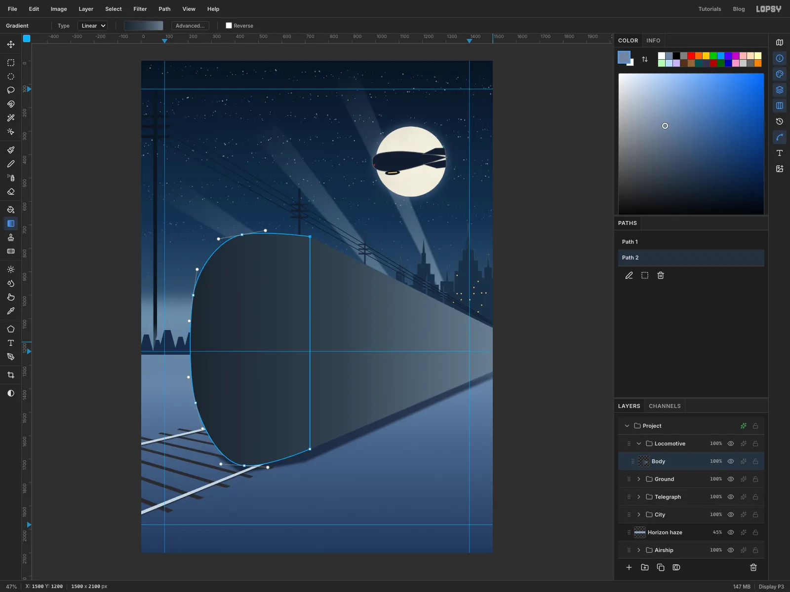

Make a three-stop gradient, `#1E2630` → `#36424F` → `#6C7D90`. Drag it horizontally from the nose (`220, 1200`) to the right edge. The far end is lighter because it's further away in the haze. Then deselect.

## Model the nose with light and shade

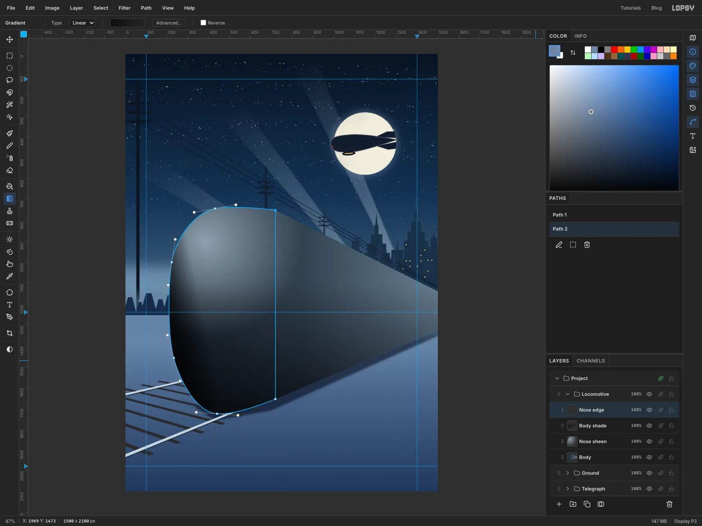

Each of these goes on its own layer. [[Cmd]]-click the `Body` thumbnail first, so the gradient stays inside the train.

1. Add `Nose sheen`. Load the body selection and drag a **radial** gradient from `380, 900` out to `760, 1180`, fading from `#B4C6D6` at 70% to transparent. A radial gradient is centred where the drag starts. Deselect and set the layer to **Screen**.
2. Add `Body shade`. Load the body and drag a linear gradient from `600, 1100` down to `600, 1730`, fading from transparent `#070A10` to `#070A10` at 80%. Set it to **Multiply**.
3. Add `Nose edge`. Load the body and drag from `205, 1150` to `345, 1120`, fading from `#05080D` at 75% to transparent. Set it to **Multiply**. The leading edge now turns away from the light, so the nose reads as round.

## Paint the red skirt

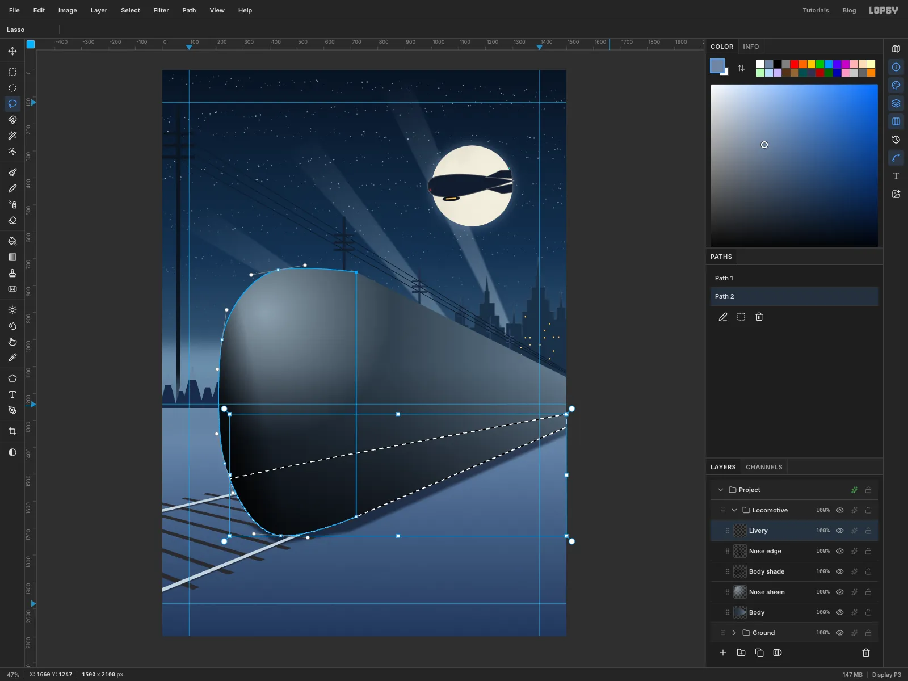

1. Add a layer called `Livery` and [[Cmd]]-click the `Body` thumbnail.
2. Hold [[Shift+Alt]] and lasso around everything **below** the skirt line. Shift+Alt intersects, so only the part of the body inside your lasso stays selected. The line is low on the side and curves down as it wraps round the nose:
   - Start just past the right edge at about `y 1247`.
   - Pass through `1200, 1333` and `700, 1425`.
   - Curve on through `450, 1475` and `250, 1517` to the tip of the nose.
   - Close the lasso well below the train.
3. Fill the selection with a three-stop gradient, `#B23A33` → `#8E2A2A` → `#5E1A1E`, dragged from `700, 1430` down to `760, 1700`. That's brighter at the top, like airbrushed enamel. Deselect.

## Add chrome speed stripes

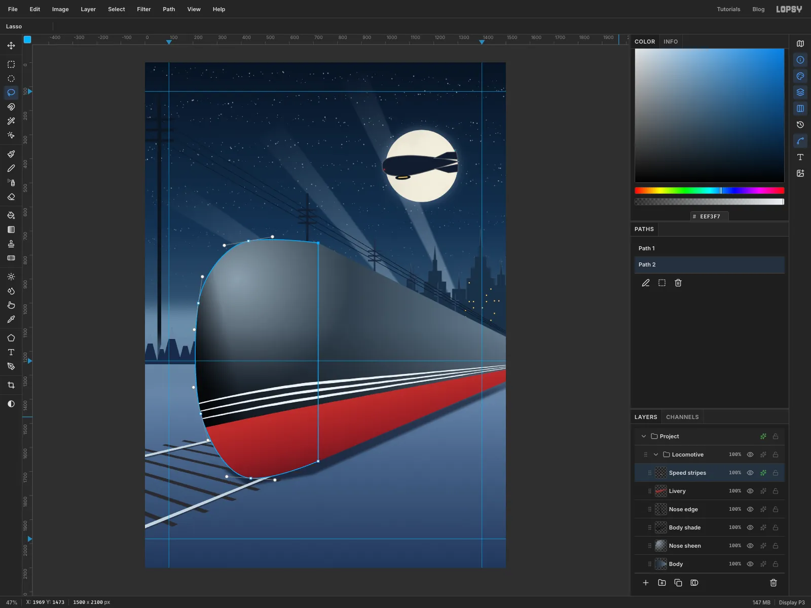

1. Add a layer called `Speed stripes`.
2. Lasso three thin stripes just above the red, running parallel to the skirt line. Hold [[Shift]] after the first.
   - Like everything on the side, each stripe aims at the vanishing point, so it's about 12 px thick where the nose meets the side and narrows to a point at the far end.
   - Round the nose the stripes curve gently down. The top stripe passes `700, 1328` and `500, 1357` and reaches the front of the nose at about `230, 1413`. The other two follow it 30 and 60 px lower.
   - Make each one thinner as it wraps round the front of the nose, because you're seeing that part of it at an angle.
   - Draw them a little past the front of the nose. You'll trim them next.
3. Fill with chrome `#EEF3F7` and deselect.
4. To trim the stripe ends to the body, [[Cmd]]-click the `Body` thumbnail, choose **Select → Inverse**, press [[Delete]], then deselect.
5. Add a light **Drop Shadow** (offset Y `2`, blur `2`, opacity `35`, colour `#0A0E14`).

## Catch the moonlight on the roof

1. Add a layer called `Roof sheen`.
2. Pick the **Pen**, set **Stroke** to `9` in the options bar, and set the foreground to `#C9D7E4`.
3. Draw an open path just inside the top edge of the train:
   - Click out past the right edge at about `1660, 1232`.
   - Click at `720, 762`.
   - Press at `438, 755` and drag to `345, 772`.
   - Press at `238, 990` and drag to `224, 1080`.
4. Press [[Enter]]. The path is saved to the Paths panel and stroked onto the layer in one go.
5. Blur it with **Gaussian Blur** `5` and set the layer to **Screen**.

## Run a chrome crest down the nose

Streamliners often had a chrome strip down the middle of the nose. It also shows the nose's curve.

1. Add a layer called `Nose crest`, set **Stroke** to `7` and the foreground to `#DCE5EE`.
2. Draw it from the bottom up, so your first click is well away from the roof path:
   - Press at `430, 1722` and drag to `380, 1680`.
   - Press at `335, 1240` and drag up to `335, 1060`.
   - Press at `375, 860` and drag to `405, 815`.
   - Click at `500, 758` on the roof.
3. Press [[Enter]] to stroke it.
4. Blur it by `2`, add an **Outer Glow** (size `14`, opacity `45`, colour `#B9CADB`) and set the layer to `70%`.

## Mark the panel seams

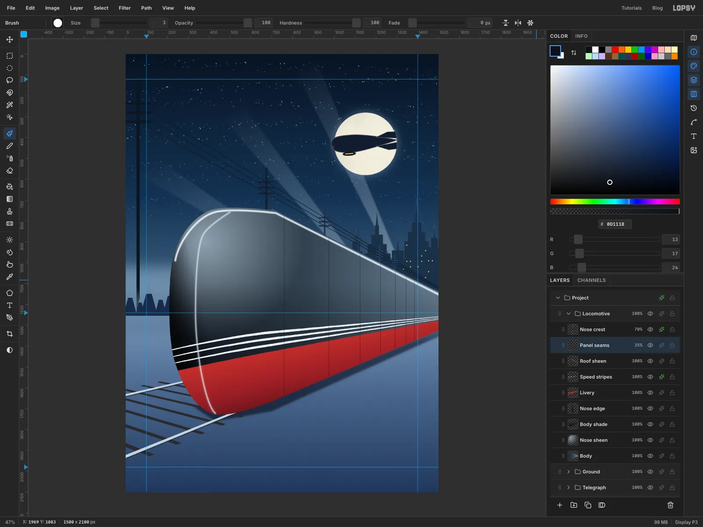

1. Click the `Roof sheen` row, then add a layer called `Panel seams`. The crest stays on top of everything you add to the train from here on.
2. Pick the **Brush** at size `3`, **Hardness** `100`, colour `#0D1118`.
3. For each seam, click just under the roof edge, then [[Shift]]-click just above the bottom edge. Vertical lines stay vertical in this kind of perspective.
4. Put the seams at `x 760`, `974`, `1124`, `1222`, `1291`, `1343` and `1383`. They crowd together the further away they are.
5. Set the layer to **Multiply** at `35%`.

## Light up the cab

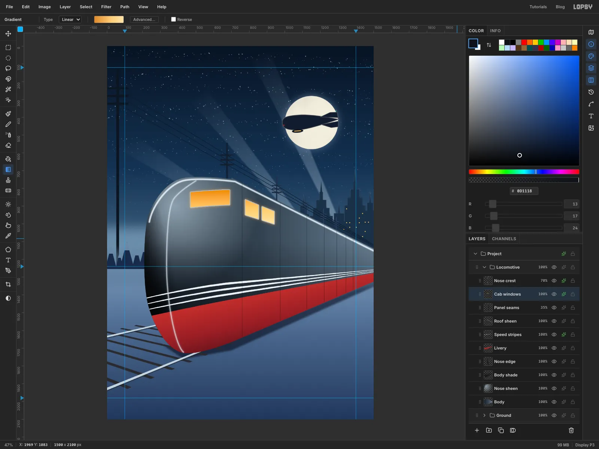

1. Add a layer called `Cab windows`.
2. Lasso the windscreen on the shoulder of the nose. Its top edge curves gently from `470, 822` to `690, 810`, and its bottom edge from `470, 908` to `690, 893`.
3. Hold [[Shift]] and add two side windows on the flank. Their top and bottom edges should slope towards the vanishing point:
   - `778, 864` – `852, 895` along the top and `778, 950` – `852, 973` along the bottom.
   - `872, 903` – `940, 930` along the top and `872, 979` – `940, 1001` along the bottom.
4. Fill them with a gradient from `#E08A2A` through `#FFCF7A` to `#FFE3A8`, dragged from `y 800` down to `y 990`, so the cab looks lit from below.
5. Add an **Outer Glow** (size `22`, opacity `55`, colour `#FFB347`) and a **Stroke** (width `4`, colour `#AEBBC8`) for chrome frames.

## Switch on the headlight

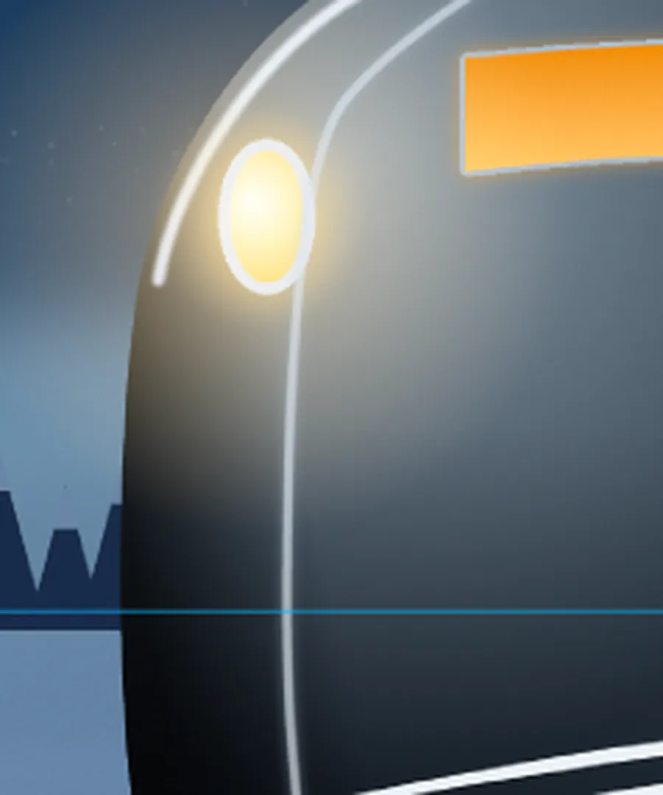

1. Add a layer called `Headlight`. Drag an elliptical marquee from `292, 892` to `348, 992`. It's narrower than it is tall because it sits on the curved side of the nose.
2. Fill it with a radial gradient from `#FFFDF2` through `#FFE6A8` to `#FFC861`, dragged from just above the centre outwards. Deselect.
3. Add a **Stroke** (width `9`, colour `#D7E1E9`) for the bezel and a big **Outer Glow** (size `150`, opacity `80`, colour `#FFC861`).
4. Add a layer called `Headlight halo` and drag a radial gradient from the lamp's centre about 240 px down: `#FFD98A` at 85%, then `#FFC861` at 35%, then transparent. Set it to **Screen**.
5. Add a layer called `Livery glint`, [[Cmd]]-click the `Livery` thumbnail and drag a radial gradient from `330, 1470` out about 270 px, from `#C86A5E` at 80% to transparent. Set it to **Screen**. That's the headlight's glow reflected in the red paint.

## Build the wreath

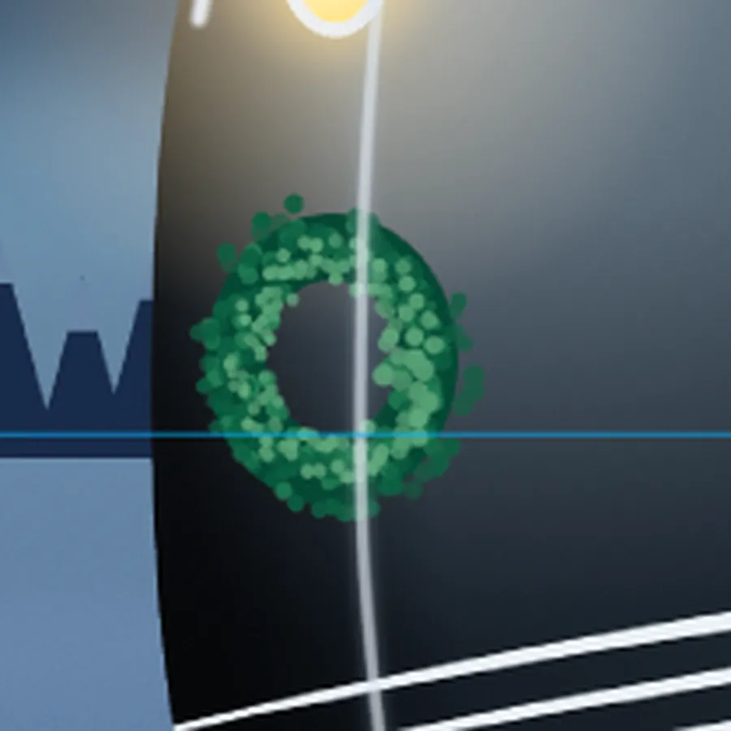

1. Add a layer called `Wreath`. Drag an elliptical marquee from `242, 1107` to `394, 1283`. Then hold [[Alt]] and drag a smaller one from `278, 1147` to `358, 1243` to cut out the middle. Fill the ring with `#1D4635` and deselect.
2. Pick the **Brush** and click the brush thumbnail at the left of the options bar to open the **Brushes** window.
   - On the **Shape** tab set **Size** `16`, **Hardness** `70` and **Spacing** `30`.
   - On the **Dynamics** tab set **Scatter** `70`, **Size Jitter** `60` and **Opacity Jitter** `40`.
   - Close the window.
3. Paint round the ring three times in different greens. Each loop is a slightly different oval:
   - `#3F7D58` round the middle of the ring.
   - `#2A5E44` round the outer edge.
   - `#6FA57E` round the inner edge.

The scatter breaks each stroke into clumps of needles.

## Add berries and a bow

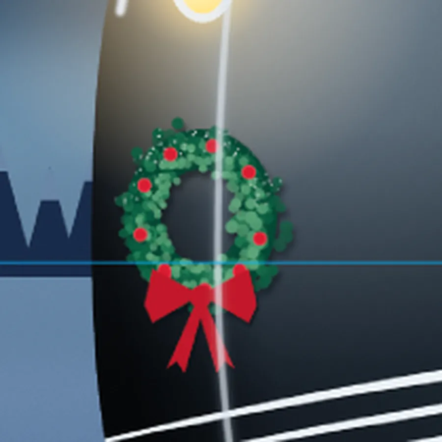

1. Add a layer called `Berries`. With the **Elliptical Marquee**, drag a small 14 px circle on the ring, then hold [[Shift]] and add eight more spaced round it. Fill with `#C8343A` and give the layer a tiny **Inner Glow** (size `3`, colour `#FFD0C0`) for a shine.
2. Add a layer called `Bow`. Hold [[Shift]] for each piece after the first:
   - Lasso two triangular loops, each about 50 px across, meeting at the bottom of the ring around `318, 1272`.
   - Lasso two tails about 70 px long with notched ends, hanging down from the middle.
   - Use the Elliptical Marquee for a round knot about 22 px across in the middle.
   - Fill with `#B22D31`.
3. Give `Bow` a **Drop Shadow** (offset `2`, `4`, blur `4`, opacity `60`) and `Wreath` a softer one (offset `3`, `6`, blur `8`, opacity `55`), both in `#0A0E14`, so they sit on the paint.
4. Add a layer called `Wreath snow`. [[Cmd]]-click the `Wreath` thumbnail, pick the **Spray** (Size `40`, Density `6`, colour `#F1F5F9`) and spray along the top of the ring. Deselect.

## Turn the wreath to the curve of the nose

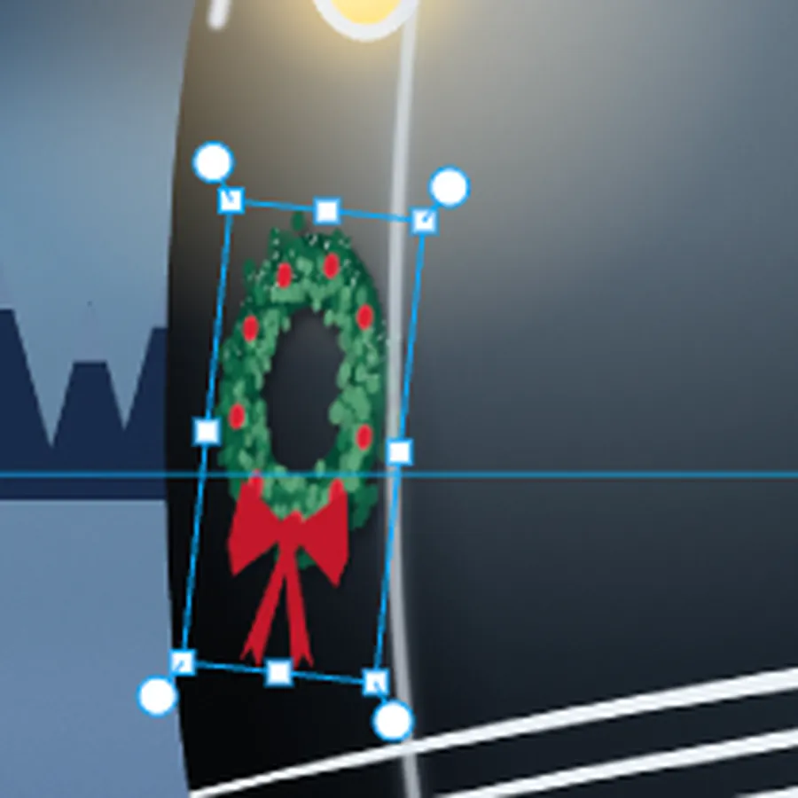

The wreath faces you straight on, but the nose is turned away. Squash it to match:

1. Click the `Bow` row, then [[Shift]]-click the `Wreath` row. That selects all four wreath layers.
2. With the **Move** tool, a single box surrounds them. Drag the handle in the middle of the right edge to the left until the box is about 60% of its width.
3. Rotate it about 6° clockwise from just outside a corner, so it tilts with the nose.
4. Press [[Cmd+D]] to commit. All four layers are transformed together in one undo step.

## Set the name on a belt

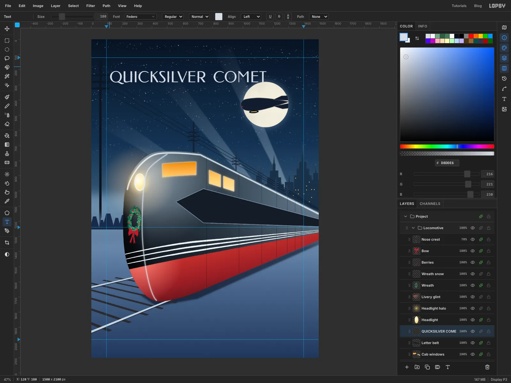

1. Click the `Cab windows` row and add a layer called `Letter belt`.
2. Lasso a long dark band along the side that ends in a point towards the nose, like a chrome speed whisker:
   - Start at `740, 987` and go along the top to the right edge at about `y 1229`.
   - Come down the right edge to about `y 1239`, and back along the bottom to `740, 1209`.
   - Finish with the point at `560, 1071`.
3. Fill it with `#161C25` and give it a **Stroke** (width `3`, colour `#8FA3BF`) for thin chrome rules.
4. Set the foreground to `#D8DDE6`. Pick the **Text** tool, set the font to **Federo** (an Art Deco face) and **Size** to `100`.
5. Click in empty sky near the top left, at about `120, 180`, and type `QUICKSILVER  COMET` with two spaces between the words. Press [[Tab]] to commit. Make sure the whole line fits on the canvas.
6. Click **Rasterize Layer** in the Layers panel toolbar. **Distort** works on pixels, not live text.

The extra space keeps the two words apart once perspective squeezes the far end.

## Distort the lettering into perspective

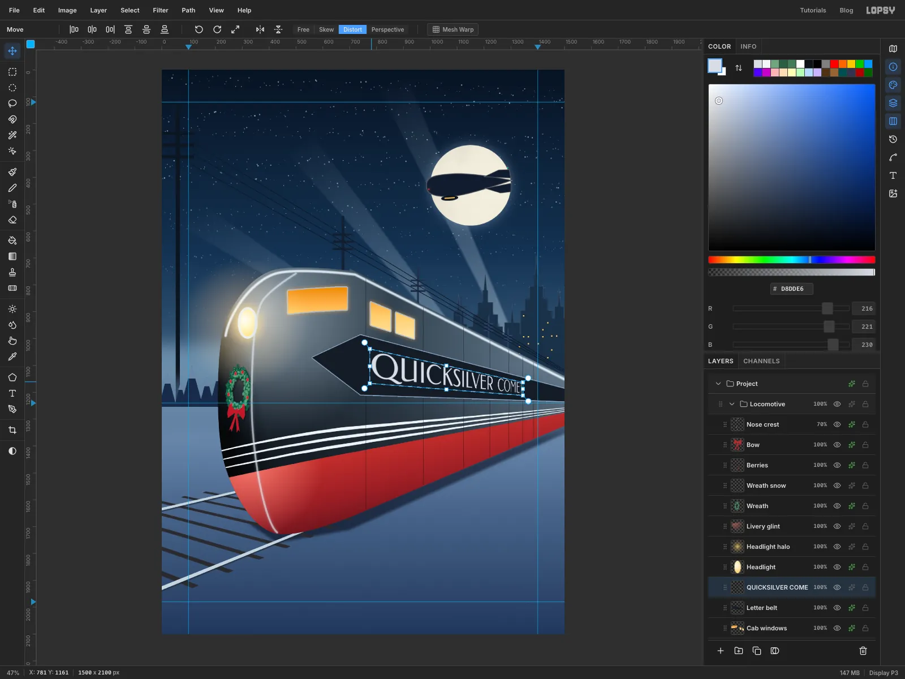

1. Drag a rectangular marquee just around the lettering.
2. Pick the **Move** tool and click **Distort** in the options bar. In Distort mode each corner handle moves on its own.
3. Drag each corner onto the belt. Grab the handle itself (the cursor changes to a diagonal arrow):
   - Top-left to `775, 1039`.
   - Top-right to `1345, 1163`.
   - Bottom-right to `1345, 1212`.
   - Bottom-left to `775, 1167`.
4. Press [[Cmd+D]] to commit. Rename the layer `Lettering` and add a small **Drop Shadow** (offset `2`, `3`, blur `3`, opacity `70`).

Distort is a true perspective warp, so the letters shrink steadily towards the vanishing point.

## Throw the headlight beam

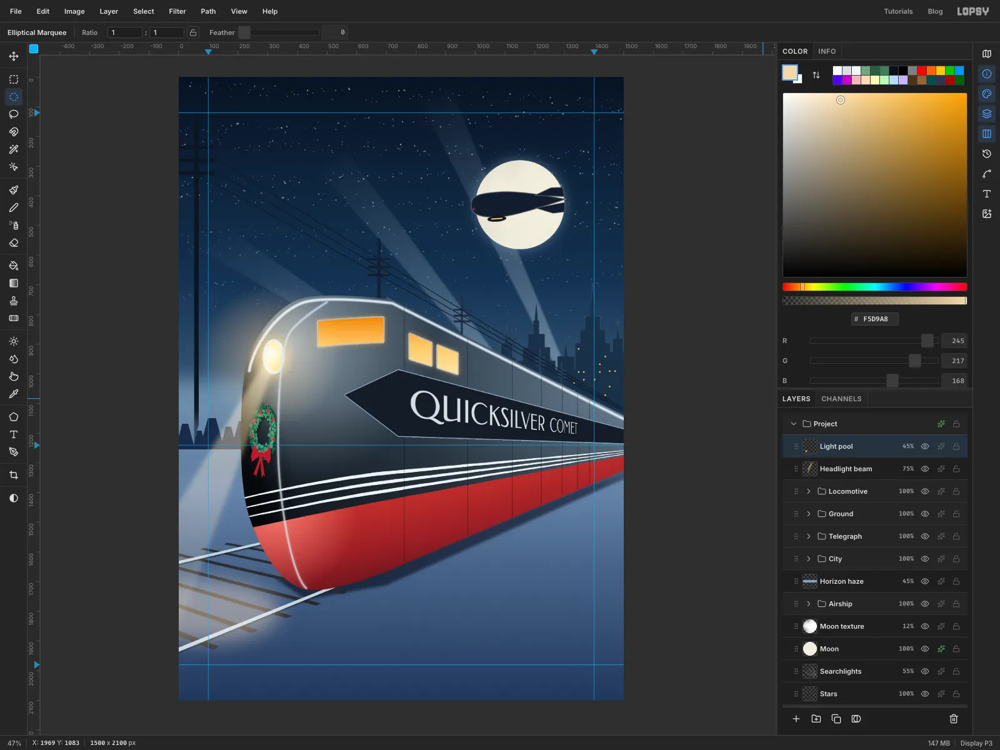

1. Collapse `Locomotive`, click its row and add a layer called `Headlight beam`. With the group collapsed, the new layer lands above it.
2. Lasso a cone from the lamp at `300, 940` down to well off the left edge, between about `y 1700` and `y 2300`, and back to the lamp.
3. Fill it with a gradient of `#FFE2A0` from 75% to transparent, dragged from the lamp down towards `-60, 2000` (off the canvas). Deselect.
4. Blur it with **Gaussian Blur** `24`, then set it to **Screen** at `75%`.
5. Add a layer called `Light pool`. Drag an elliptical marquee from `-160, 1695` (off the left edge) to `340, 1905`, **Feather** it by `63` and fill with `#F5D9A8`. Deselect, blur it by `30`, and set it to **Screen** at `45%`. That's where the beam hits the snow ahead of the train.

Aim the cone low, along the track. If it lights the horizon, the trees turn into a flat grey wall.

## Kick up snow along the skirt

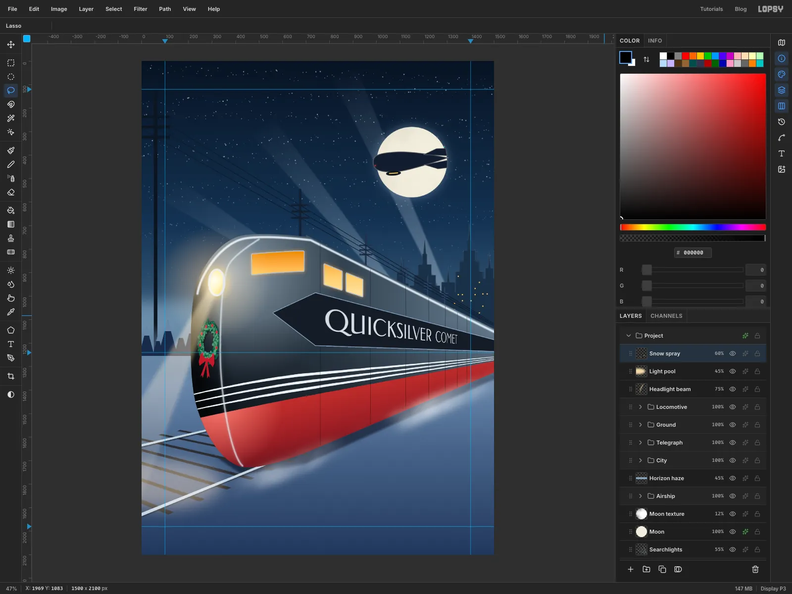

1. Add a layer called `Snow spray`.
2. Lasso a band that hugs the bottom edge of the train, from about 25 px above it to 90 px below. Start at the nose around `x 380` and run past the right edge. **Feather** it by `40`.
3. Choose **Filter → Smoke…** with **Scale** `6` and **Turbulence** `70`, then deselect.
4. Run **Filter → Motion Blur…** with **Angle** `156` (roughly the slope of the train's bottom edge) and **Distance** `40`, so the powder streams back along the train.
5. Set the layer to **Screen** at `60%`.

## Let it snow, in three depths

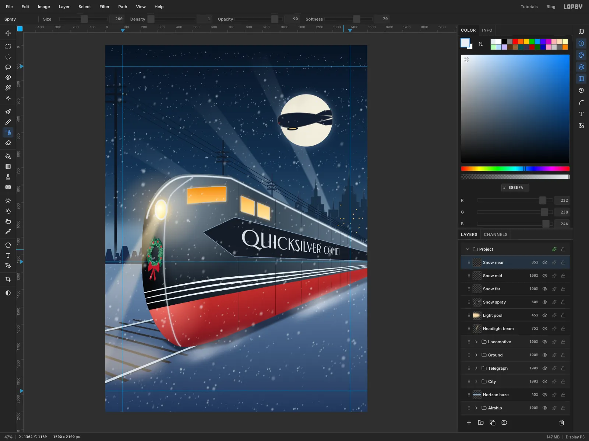

Three layers of flakes give the snowfall depth: fine and faint far away, big and soft up close. Set the foreground to `#E8EEF4` and pick the **Spray**.

- Add a layer called `Snow far`. Set **Size** `110`, **Density** `2`, **Opacity** `80`, **Softness** `60`, and zigzag from edge to edge down the whole picture in rows about 175 px apart. Run **Filter → Motion Blur…** with **Angle** `115` and **Distance** `6`.
- Add a layer called `Snow mid`. Set **Size** `170` and **Density** `1` (keep the same opacity and softness), zigzag in rows about 230 px apart, and blur it the same way with **Distance** `9`.
- Add a layer called `Snow near`. Set **Size** `260`, **Density** `1`, **Opacity** `90`, **Softness** `70`, zigzag in rows about 300 px apart, blur with **Distance** `14`, and set the layer to `85%`.

The bigger the Spray size, the bigger the flakes, so the near layer reads as closest.

## Add airbrush grain

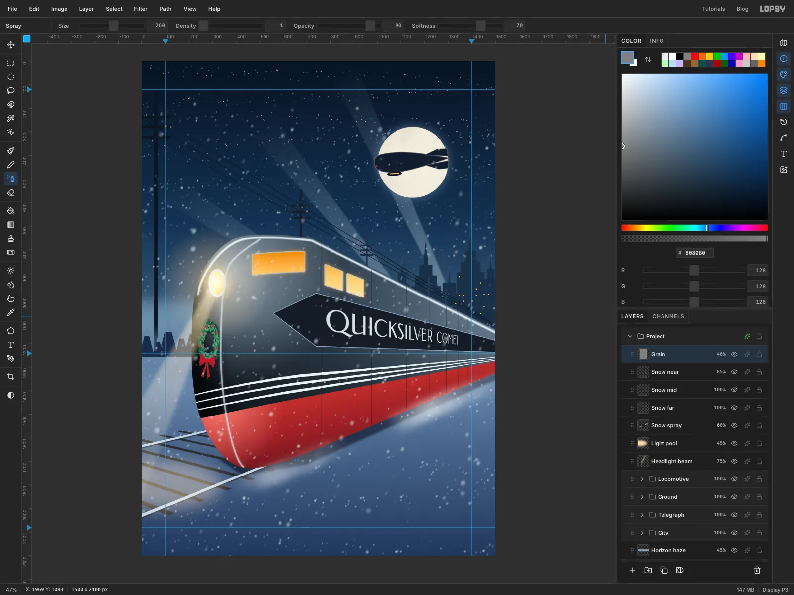

1. Add a layer called `Grain` and fill it with mid-grey `#808080`.
2. Run **Filter → Add Noise…** with **Amount** `18` and **Mono**.
3. Set the layer to **Overlay** at `40%`.

Overlay makes the grey disappear and leaves only the noise. That's the fine, speckled texture of an airbrushed poster.

## Set the greeting

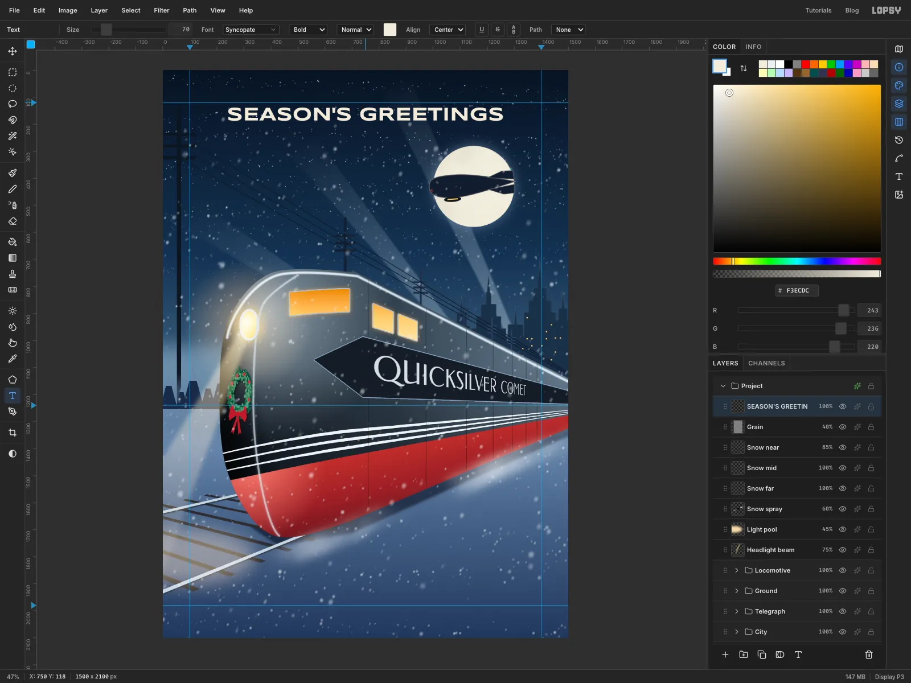

1. Pick the **Text** tool and set **Align** to **Center** in the options bar. With centred point text, the spot you click becomes the middle of the line.
2. Set the font to **Syncopate**, weight **Bold**, **Size** `70`, and the foreground to cream `#F3ECDC`.
3. Click at `750, 118`, just on the top margin guide and halfway across, and type `SEASON'S GREETINGS`. Press [[Tab]].
4. Add a **Drop Shadow**: **Offset Y** `6`, **Blur** `10`, **Opacity** `80`, colour `#050A14`.

Syncopate's very wide capitals echo the extended lettering of 1930s travel posters.

## Plate the title in chrome

1. Add a layer called `Title chrome` above the title.
2. [[Cmd]]-click the title layer's thumbnail. The selection follows the letter shapes.
3. Make a four-stop gradient:
   - `#FFFFFF` at the left.
   - `#C9D6E2` just before the middle.
   - `#8B9DB0` just after the middle.
   - `#F2E2C2` at the right.
4. Drag it from the top of the capitals straight down to their baseline (`y 137` to `y 187`). The sharp light-to-dark step in the middle gives the classic chrome horizon line. Deselect.

The live text underneath keeps its drop shadow, and you can still edit it.

## Frame it with a mat

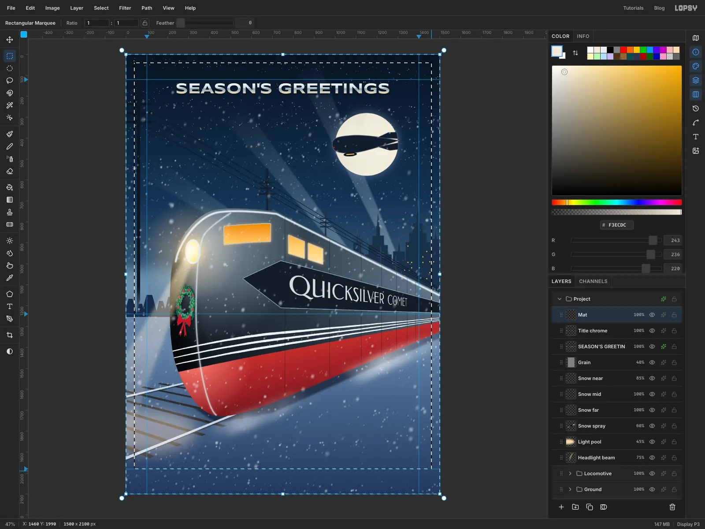

1. Add a layer called `Mat`. Drag a rectangular marquee from outside the top-left corner to outside the bottom-right one, so it covers the whole canvas.
2. Hold [[Alt]] and drag a second marquee from `40, 40` to `1460, 1990`. Alt subtracts it, leaving a 40 px border with a deeper strip at the bottom for the credit.
3. Fill with `#0D1A33` and deselect.
4. Add a layer called `Frame line`. Drag a marquee from `40, 40` to `1460, 1990`, then [[Alt]]-drag one from `47, 47` to `1453, 1983` to leave a 7 px ring. Fill it with cream `#F3ECDC` and set the layer to `75%`.

The mat cleanly crops everything that ran off the edge: wires, rails, the train and the snow.

## Add the credit line

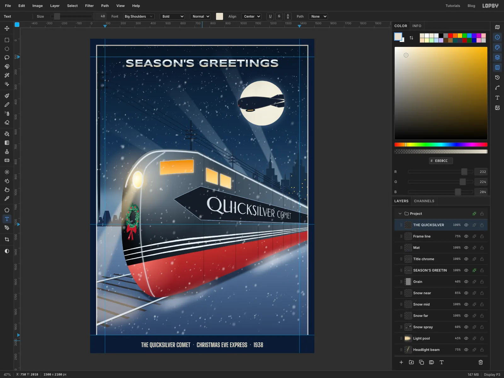

1. With the **Text** tool still set to **Center**, choose **Big Shoulders**, weight **Bold**, **Size** `40`, colour `#E8E0CC`.
2. Click at `750, 2018`, in the middle of the bottom strip, and type `THE QUICKSILVER COMET  ·  CHRISTMAS EVE EXPRESS  ·  1938`. Press [[Tab]].
3. Choose **File → Quick Export PNG** to save the card, and **File → Save Project** to keep the layers.

The condensed caps fit the long line comfortably inside the mat, with roughly equal space above and below.
