## Look at the finished menu

Skate graphics borrow from the shop wall:

- grip-tape grain and Vans-style checkerboards
- loud title lettering with hard offset shadows
- flames on the deck
- stickers slapped on at an angle

In this tutorial you'll build a 1024 × 1408 menu for **Mango Kickflip**, a
snack shack at the skatepark. Along the way you'll use:

- **Add Noise**, **Halftone**, **Clouds** and **Threshold**
- copy and paste on a snapping grid
- a tapered brush with **Radial Symmetry**
- Google fonts, point text and right-aligned area text
- the **Move** tool's scale and rotate handles
- **Stroke**, **Drop Shadow**, **Outer Glow** and **Color Overlay** effects
- the **Spray** tool, a **Gradient** clipped by the **Magic Wand**, and a layer group

The palette is grip black `#171717`, mango `#FFB321`, checker orange
`#FFA51F`, hot pink `#FF2E88`, teal `#1FD6C1` and cream `#FFF6E6`.

> **Tip:** Hard offset shadows, with **Blur** at 0, are what make this look read
> as skate rather than generic neon. Use them on every "sticker".

## Make a grip-tape background

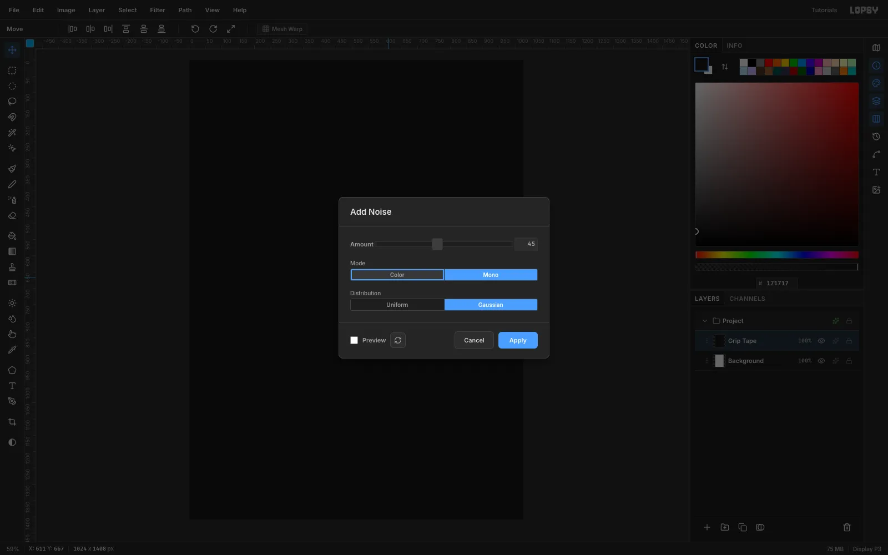

Open [Lopsy](/). In **New Document**, set **Width** `1024` and **Height**
`1408`, then click **Create**.

Rename `Layer 1` to `Grip Tape`. Set the foreground to `#171717` and choose
**Edit → Fill**. Then choose **Filter → Add Noise**, pick **Mono** and
**Gaussian**, set **Amount** to `45` and click **Apply**. You get the fine
sandpaper grain of grip tape.

## Double a checker tile across the top

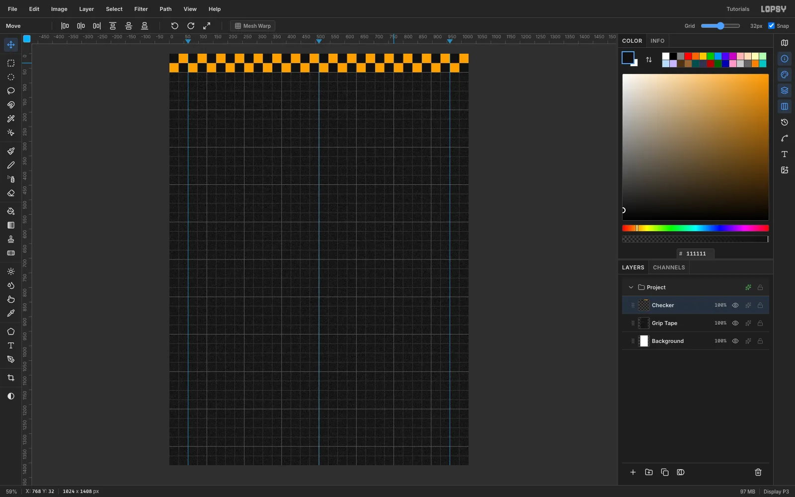

Choose **View → Show Grid** and drag the **Grid** slider in the options bar to
`32px`. **Snap** switches on with the grid.

> **Tip:** Adjust the Grid slider with the mouse. Pressing the arrow keys
> while it has focus nudges the active layer instead.

Add a layer named `Checker`:

1. Marquee the strip from `0,0` to `1024,64` and fill it with `#FFA51F`.
2. Fill two black `#111111` squares: `0,0` to `32,32` and `32,32` to `64,64`.
   That's a 64 × 64 tile.
3. Marquee the tile, press [[Cmd+C]] then [[Cmd+V]], and drag the paste 64 px
   to the right with the **Move** tool ([[V]]). The grid snaps it into place.
4. Press [[Cmd+D]] and [[Cmd+E]] to merge it down.

Repeat with a 128, 256 and 512 px wide marquee. Four doublings fill the row.

## Duplicate the band to the bottom

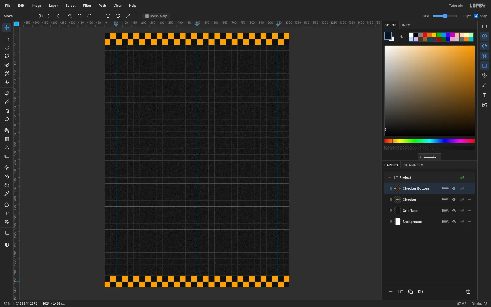

Click **Duplicate Layer** in the Layers panel, then click the copy's row. With
the **Move** tool, drag it down until it snaps to the bottom edge (`y = 1344`).
Rename it `Checker Bottom`.

## Paint a sunburst with radial symmetry

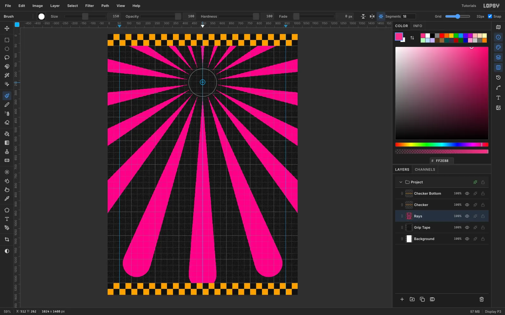

Select `Grip Tape` and add a layer named `Rays`. Choose the **Brush** ([[B]]):

- **Size** `150`, **Hardness** `100`
- in the Brushes modal, **Taper** `950` and **Spacing** `5`

Click **Radial Symmetry** in the options bar and set **Segments** to `18`.
[[Cmd]]-click the canvas at about `512,260` to move the symmetry centre there.

Set the foreground to `#FF2E88`. Drag one stroke from near the bottom of the
canvas straight up to the centre. The taper narrows each ray to a point.

Turn **Radial Symmetry** off, then set the `Rays` layer's opacity to `28%`.

## Add a halftone glow behind the title

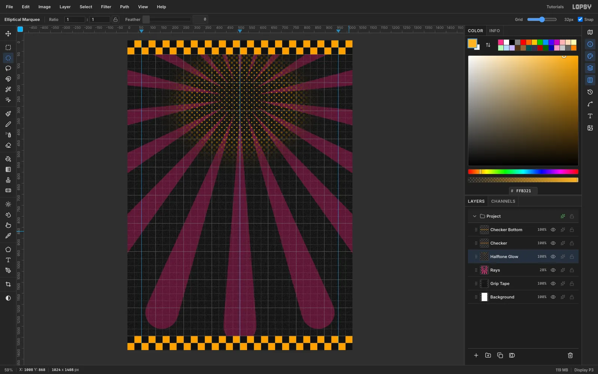

Add a layer named `Halftone Glow`. Draw an **Elliptical Marquee** from about
`212,70` to `812,510`, fill it with `#FFB321` and deselect.

Apply **Filter → Gaussian Blur** at **Radius** `70`. Then apply
**Filter → Halftone** with:

- **Dot Size** `16`
- **Density** `1`
- **Angle** `45`
- **Softness** `1`

The blurred edge turns into dots that shrink as they fade.

## Set the MANGO title

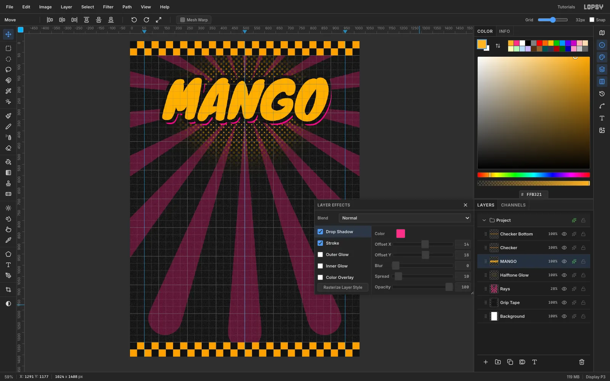

Choose the **Text** tool ([[T]]), set **Size** to `230` and the font to
**Knewave**, and set the foreground to `#FFB321`. Click near `110,100` and type
`MANGO`. Press [[Tab]] to commit, then drag it with **Move** until it's
centred.

Open the layer's effects with the ✦ button on its row:

- **Stroke**: `#111111`, **Width** `12`
- **Drop Shadow**: `#FF2E88`, **Offset X** `14`, **Offset Y** `18`,
  **Blur** `0`, **Spread** `10`, **Opacity** `100`

## Scale the KICKFLIP type

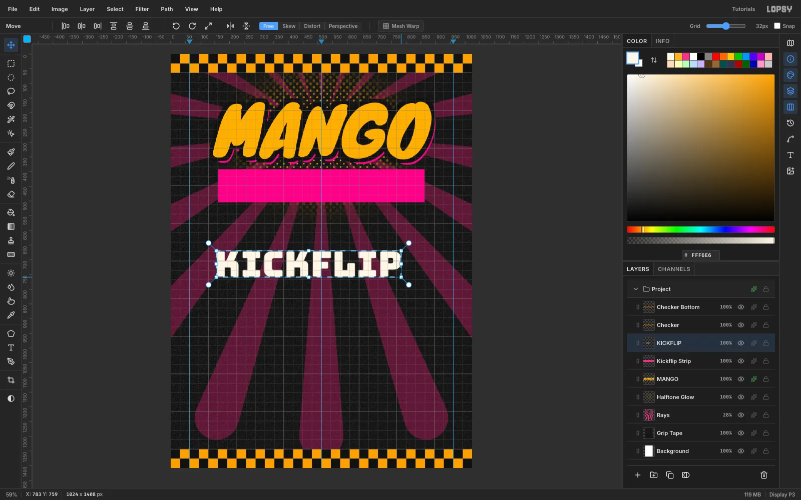

Select a raster layer, add a layer named `Kickflip Strip`, and fill a
marquee from `162,392` to `862,504` with `#FF2E88`.

Set cream `#FFF6E6` Bungee type at `92` and type `KICKFLIP` in empty space
lower down. Click **Rasterize Layer** at the bottom of the Layers panel.

Marquee the word, switch to **Move**, and [[Shift]]-drag the bottom-right
handle out to about 130%. Press [[Cmd+D]] to commit the scale.

> **Tip:** Press [[Cmd+D]] after every scale or rotation, before you move the
> layer.

## Merge and rotate the bar

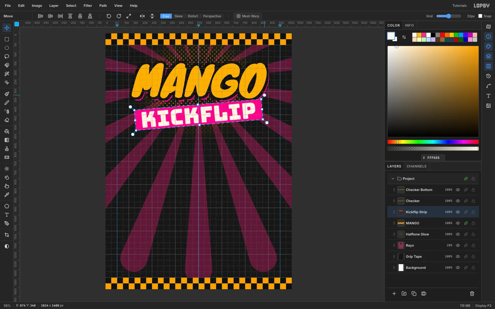

Drag `KICKFLIP` onto the centre of the pink strip and press [[Cmd+E]] to
merge it down. Marquee the whole bar, then drag just outside a corner handle
to rotate it about 5° so it rises to the right. Press [[Cmd+D]].

The bar overlaps the bottom of MANGO like a slapped-on sticker.

## Style the bar and add a tagline

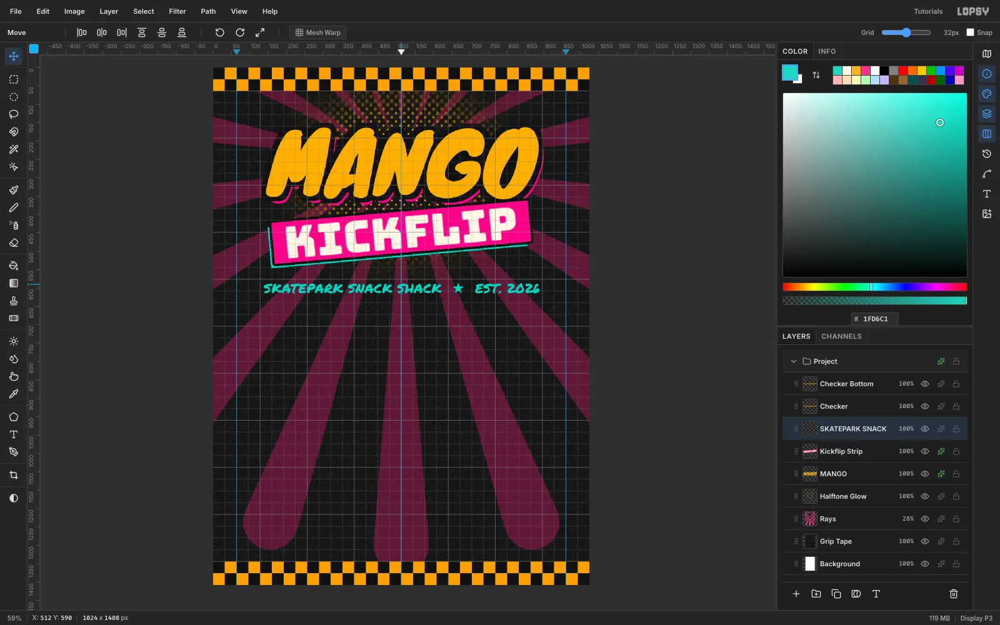

Give `Kickflip Strip` these effects:

- **Stroke**: `#111111`, **Width** `7`
- **Drop Shadow**: `#1FD6C1`, **Offset X** `-10`, **Offset Y** `12`,
  **Blur** `0`, **Spread** `6`

Then type the tagline in **Permanent Marker**, size `36`, colour `#1FD6C1`:
`SKATEPARK SNACK SHACK  ★  EST. 2026`. Paste it with [[Cmd+V]] so the ★
comes through. Centre it under the bar at about `y = 584`.

## Make taped section headers

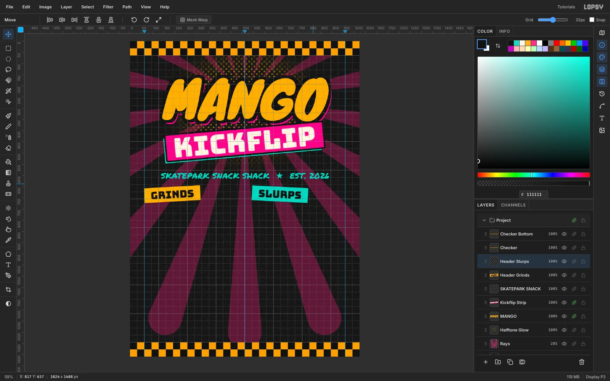

For each header, add a layer and fill a 250 × 66 marquee at `y = 650`:

- `Header Grinds` at `x = 64` in `#FFB321`
- `Header Slurps` at `x = 544` in `#1FD6C1`

Type the label in black Bungee `46`, rasterize it, and drag it onto the tag.
Merge it down, then rotate the tag 3°: `GRINDS` counter-clockwise and
`SLURPS` clockwise.

## Set the items with area text

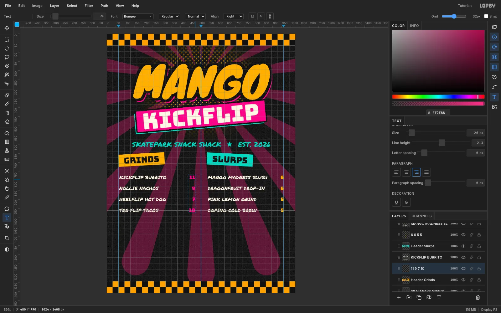

Open the **Text** panel from the right-hand toolbar. For each column, drag a
text box instead of clicking. That makes area text with a fixed width.

- **Names**: Permanent Marker `26`, **Line height** `2.3`, cream. Drag from
  `68` to `432` (left) and `548` to `912` (right), then paste four lines.
- **Prices**: Bungee `26`, **Line height** `2.3`, **Align right**. Use boxes
  `420`–`480` and `912`–`962`.

Using the same size and line height keeps every price level with its item.

## Back the menu with a board

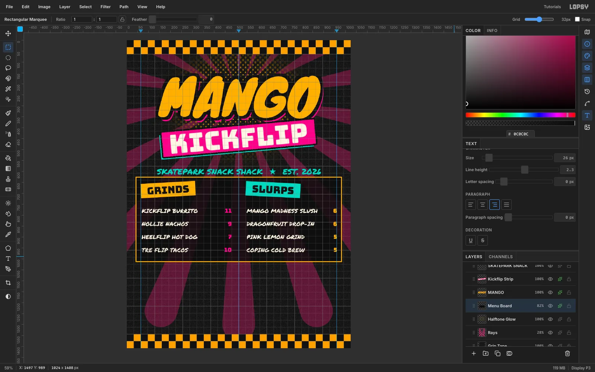

Select `Halftone Glow` so the new layer lands beneath the type, and add a
layer named `Menu Board`. Fill a marquee from `40,624` to `984,1014` with
`#0C0C0C`. Give it an orange `#FFB321` **Stroke** set to **inside**.

## Draw dotted leaders

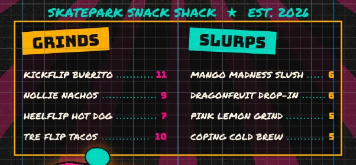

Add a layer named `Leaders` above the board. Choose the **Brush** with
**Size** `5` and **Hardness** `100`. In the Brushes modal, set **Taper** to
`0` and **Spacing** to `300`, which spaces the dabs out into dots.

For each row, click just after the item name, then [[Shift]]-click just before
the price. Each pair of clicks makes one straight dotted line. Set the layer
to `75%` opacity.

## Make the board solid and tilt it

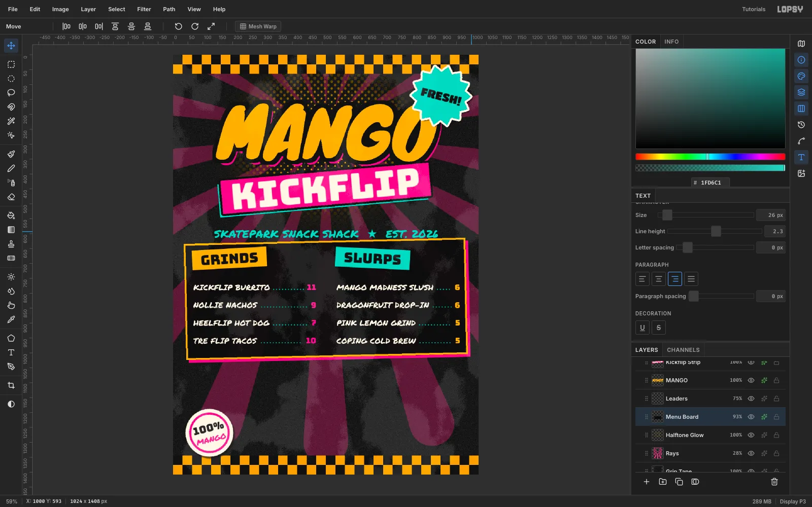

The rays showing through hurt legibility. Raise `Menu Board` to `93%`, set
its **Stroke** **Width** to `6`, and add a **Drop Shadow** of `#FF2E88` at
offset `9,9` with **Blur** `0`.

Marquee the board and rotate it about 1° counter-clockwise. That's just
enough to look pasted on.

## Add descriptions and match the prices

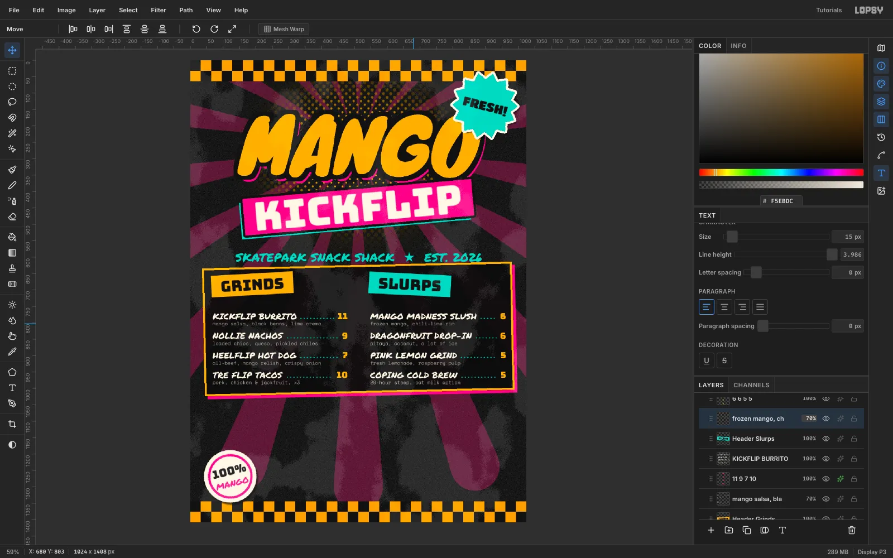

Type each column's descriptions as area text in **Space Mono** `15`, colour
`#F5EBDC`. Set **Line height** to `3.9867`, which is 59.8 ÷ 15, so each line
lands under its item. Move each block 7 px below the first item. Use
[[ArrowUp]] / [[ArrowDown]] for 1 px nudges. Set both layers to `70%`
opacity.

Give the pink price column a **Color Overlay** of `#FFB321`, so every price
reads as the same kind of information.

## Rasterize and enlarge MANGO

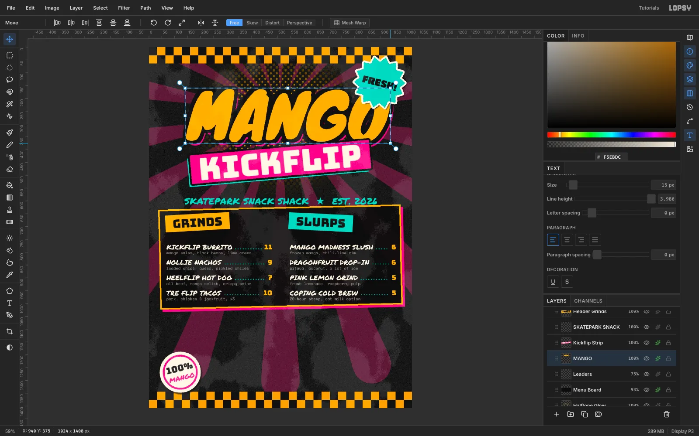

Select `MANGO`, click **Rasterize Layer**, and marquee the lettering.
[[Shift]]-drag the bottom-right handle out by about 7%, then press [[Cmd+D]]
and drag it back to centre. The Stroke and Drop Shadow effects stay live on
the raster layer.

## Melt the title with drips

With `MANGO` still selected, choose the **Brush** with **Hardness** `100` and
the foreground `#FFB321`. Under the feet of the M, A and N:

1. Drag a short vertical stroke, 20 to 70 px long, at **Size** `13`–`18`.
2. Click a dab 9 px wider at the bottom for the drop.
3. Brush a wider, shorter stroke at the top so the drip flares into the
   letter.

Because the drips are painted on the title layer itself, its black stroke
and pink shadow wrap around them.

## Tuck spray bursts behind the bar

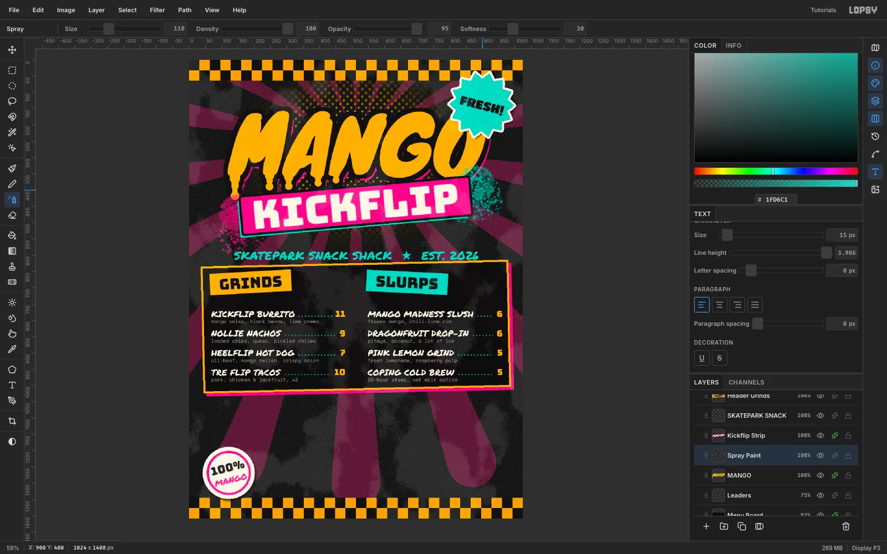

Select `MANGO` and add a layer named `Spray Paint`, which lands just under the
bar. Choose **Spray** ([[J]]) with **Size** `110`, **Density** `100` and
**Opacity** `95`. Spray a small pink `#FF2E88` burst behind the bar's left
end, and a teal `#1FD6C1` one behind its right end.

> **Tip:** Drag in quick, large moves. A slow drag currently leaves only one
> cloud at the starting point.

## Shape the skateboard deck

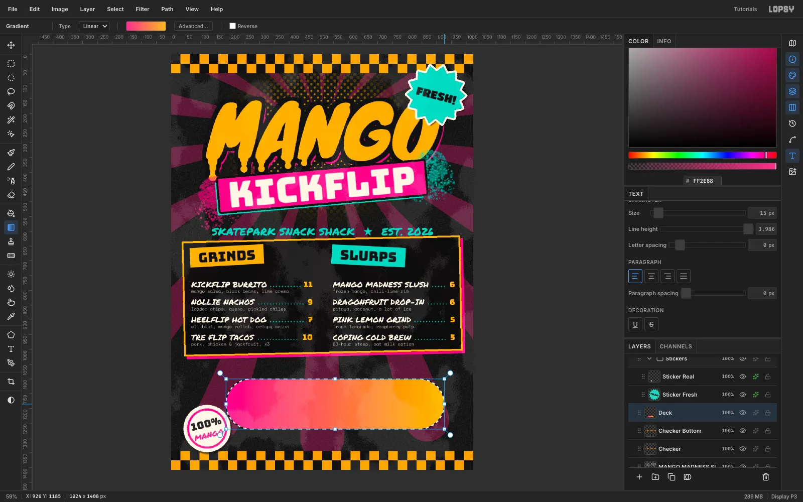

Select `Checker Bottom` and add a layer named `Deck`. Build the pill shape
with three fills:

- a rectangle from `271,1100` to `841,1270`
- 170 px circles at each end, `186,1100` and `756,1100`

Click it with the **Magic Wand** ([[W]]) to select the whole shape. Choose
the **Gradient** tool and click **Advanced…**. Set the stops to `#FF2E88` and
`#FFB321` with the hue strip and colour square, then drag across the deck
from end to end.

## Paint flames on the deck

Keep the selection active. It stops the brush from painting outside the
deck. Choose the **Brush**: **Size** `50`, **Taper** `170`, colour `#141414`.

Drag ten slightly curving strokes from below the deck's bottom edge upward.
Alternate their lengths between about 120 and 175 px. The taper turns each
stroke into a flame tip.

## Outline the deck and cast a hard shadow

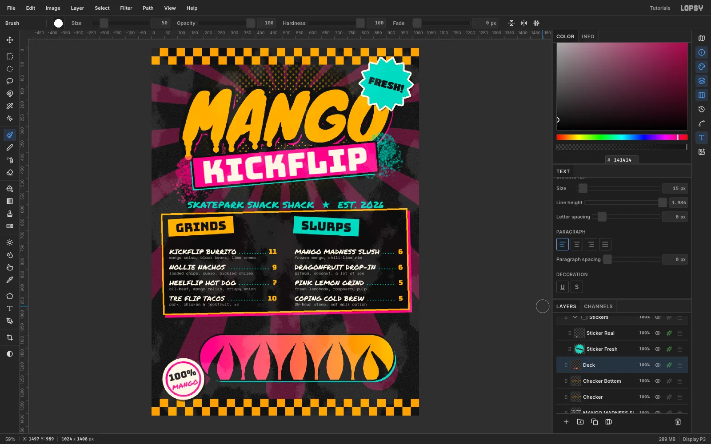

Deselect, then add these effects to `Deck`:

- **Stroke**: `#111111`, **Width** `6`
- **Drop Shadow**: `#1FD6C1`, offset `10,10`, **Blur** `0`, **Spread** `4`

## Add trucks and wheels on their own layer

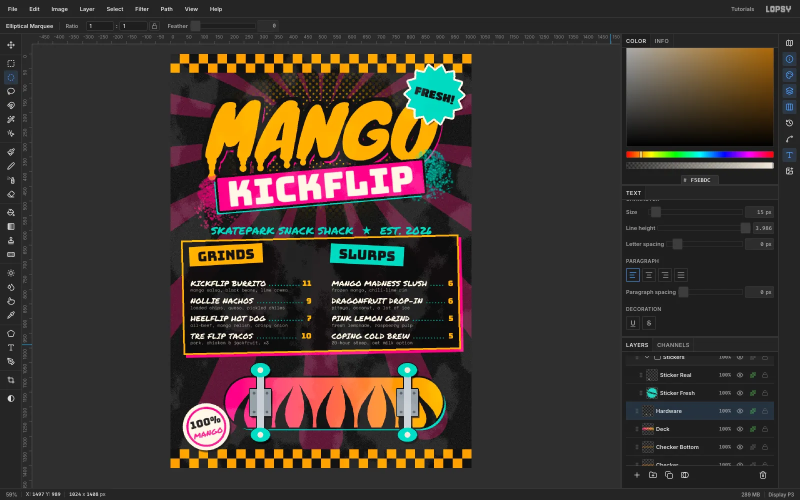

Add a layer named `Hardware`. For trucks centred at `x = 306` and `x = 806`:

- a `#9AA1A8` baseplate, 72 × 92
- a `#C9CED3` hanger bar, 24 × 212
- four `#5E656B` bolt dots on the baseplate
- 66 × 48 teal ellipse wheels past each edge of the deck
- a cream hub dot on each wheel

Give `Hardware` a black **Stroke** of `3` and a **Drop Shadow** of black at
offset `5,7`, **Blur** `4`, `75%`. The shadow makes the trucks sit *on* the
graphic instead of cutting through it.

## Merge and tilt the board

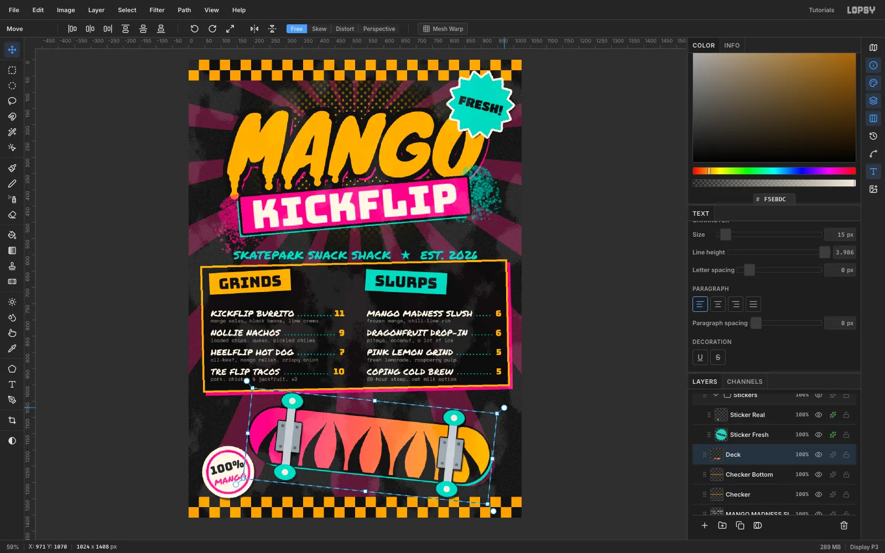

Press [[Cmd+E]] to merge `Hardware` into `Deck`. Merge Down bakes both
layers' effects into the pixels, so the composite doesn't change.

Marquee the board, rotate it about 6° clockwise, and press [[Cmd+D]]. Add an
**Outer Glow** of `#FF8A1F` (**Size** `36`, **Spread** `8`, **Opacity** `45`)
for heat.

## Slap on a starburst sticker

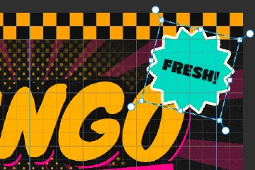

Add a layer named `Sticker Fresh`. Draw a 14-point star with the **Lasso**
(outer radius `100`, inner radius `80`) around `898,138`. Fill it with
`#1FD6C1`.

Type `FRESH!` in black Titan One `38` in empty space, rasterize it, drag it
onto the star and merge it down. Add a cream **Stroke** of `7` for the die-cut
edge and a soft black **Drop Shadow**, then rotate the sticker 14°.

## Add a round badge

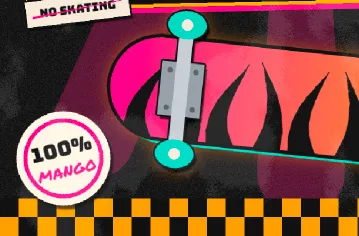

On a new layer, fill three concentric circles:

- cream, 160 px
- pink, 136 px
- cream, 122 px

Merge in `100%` in black Bungee `34` and `MANGO` in pink Permanent Marker
`26`. Add a drop shadow, rotate the badge -14°, and park it in the
bottom-left corner.

## Scatter small stickers

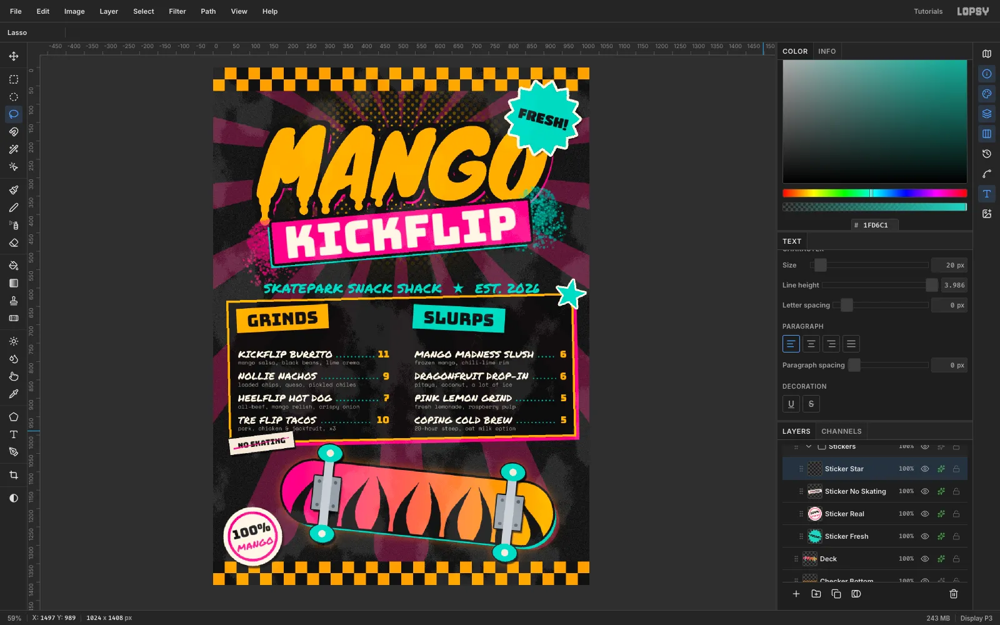

Stickers look best stuck over edges:

- a cream `NO SKATING` label in Bungee `20`, struck through with a pink
  [[Shift]]-click brush line and tilted -7° over the board's bottom-left edge
- a small five-point teal star with a cream stroke on the board's top-right
  corner

## Make a worn-print grunge layer

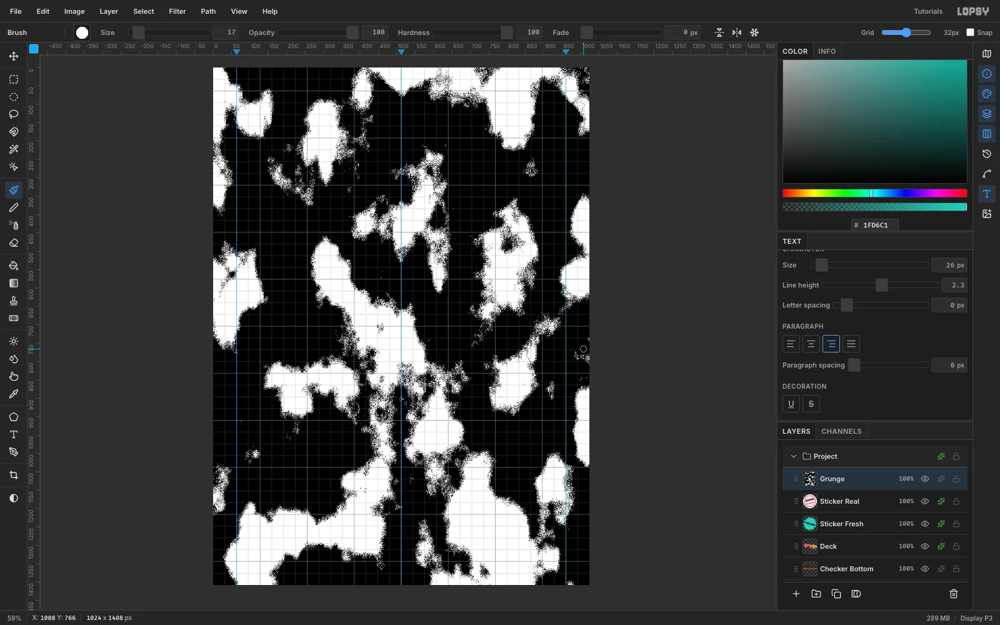

Add a layer named `Grunge` at the top of the stack. Apply these filters in
order:

1. **Filter → Clouds** at **Scale** `10`
2. **Filter → Add Noise**: **Mono**, **Uniform**, **Amount** `70`
3. **Filter → Threshold** at **Level** `175`

You get speckled white blotches.

## Group the stickers and finish

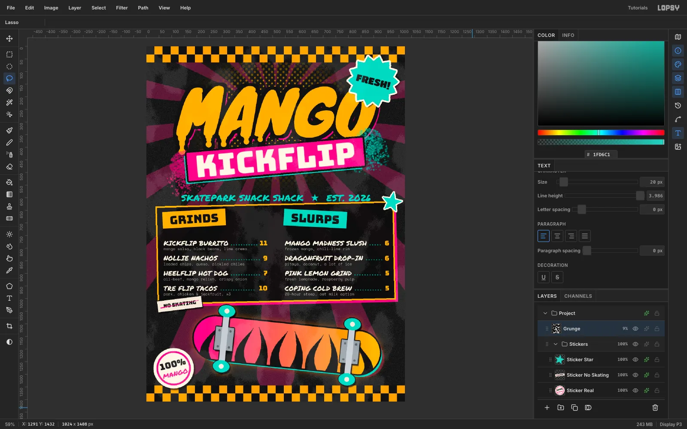

Open the ✦ drawer on `Grunge`, set **Blend** to **Screen**, and drop its
opacity to `9%`. It fades the ink in patches, like a worn screen print.

Click `Sticker Fresh`, [[Shift]]-click the other stickers, and choose
**Layer → Group Layers**. Rename the group `Stickers`. Now you can move all
the stickers at once, or hide them to check the layout underneath.

Hide the grid and guides, then export with **File → Quick Export PNG** and
save a `.lopsy` project so you can reprint the menu when the prices change.
