A duotone poster uses two inks, and that makes a strong data visualization.
Colour stops decorating and starts carrying meaning. Everything ordinary is
one ink, and the one thing you want the reader to see is the other.

In this tutorial you'll make **Bee Survival**, a 1600 × 2000 px poster about
the share of managed U.S. honey bee colonies lost each year from 2010 to
2026. It uses the published annual-loss figures from the Auburn University /
Apiary Inspectors of America survey and the earlier Bee Informed Partnership
survey, rounded to one decimal. If you publish your own version, check the
figures against the latest report.

You'll draw the bee and the honeycomb in **greyscale**, then turn the whole
illustration duotone with one **Gradient Map**. The chart is built with
marquees on exact pixel values, so every bar is honest.

The palette:

- Ink: `#1C1526`
- Honey: `#F2A516`, with darker bars in `#9C6B1C`
- Cream: `#FFF1C9`

The chart data, as annual loss in %:

- '10 36.4, '11 28.9, '12 45.0, '13 34.2, '14 42.1, '15 40.5, '16 33.2, '17 38.9
- '18 40.4, '19 44.0, '20 45.5, '21 39.0, '22 48.2, '23 55.1, '24 55.6, '25 39.9

## Set up the canvas and guides

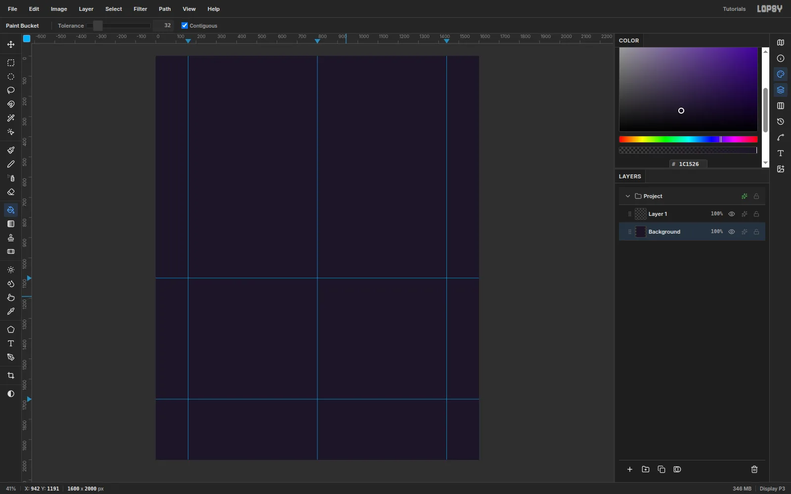

Choose **File → New**, set **Width** to 1600 and **Height** to 2000 px, and
click **Create**.

1. Select the **Background** layer, set the foreground colour to `#1C1526`, press [[G]] for the Fill tool and click the canvas.
2. Click the top ruler at **160**, **800** and **1440** for the margins and centre line.
3. Click the left ruler at **1100** and **1700**. These mark the top of the chart (the 60% line) and its baseline.

## Draw a column of hexagons

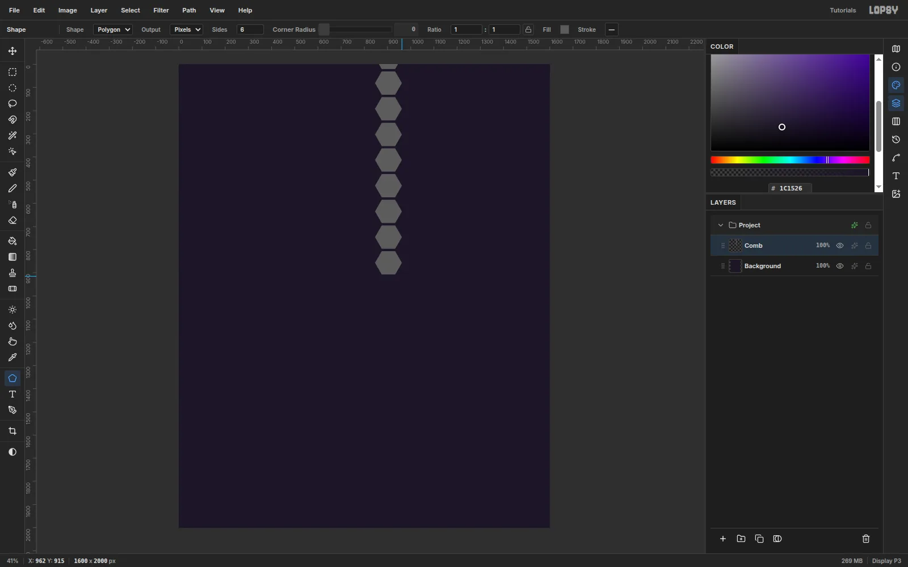

Rename **Layer 1** to *Comb*. Press [[U]] for the Shape tool, set **Shape**
to *Polygon* with **6** sides, and set the fill swatch to a mid grey
(`#5C5C5C`).

The Shape tool draws from the centre outwards. Drag from each centre 58 px
down and to the right to make a hexagon about 116 px across. Place nine
centres at x **904**, starting at y −30 and stepping down **111 px**
(−30, 81, 192 … 857).

> **Tip:** Draw the whole illustration in greys. A Gradient Map will turn every grey into ink, honey or cream later, so all you're setting now is how light each part is.

## Duplicate and offset the column into a comb

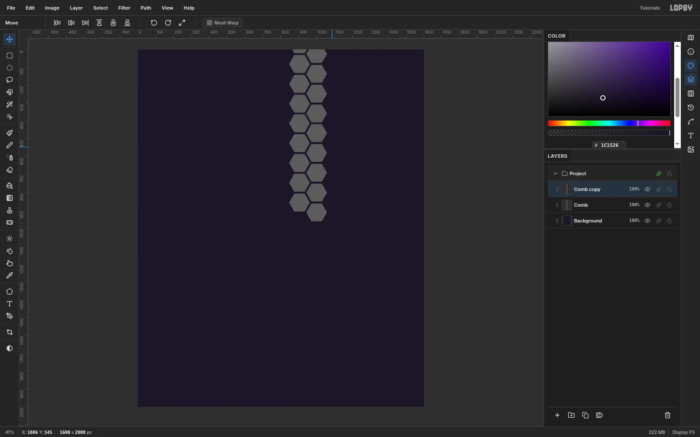

Click **Duplicate Layer** in the Layers panel, then **click the copy's row**
so that only the copy is selected. Press [[V]] and drag the copy 96 px right
and 55 px down. It starts 10 px off, so the drag itself is 86 × 45. The
cells now interlock.

Press [[Cmd+E]] (Merge Down). Then duplicate and move again:

1. Duplicate, move **192 px** right, merge.
2. Duplicate, move **384 px** right, merge.

You now have eight columns filling the top-right corner.

## Vary the cells with the Fill tool

Press [[G]] and click single cells to give the comb some life:

- `#9C9C9C` for honey-filled cells in a band through the middle.
- `#DADADA` for five capped cells in the top-right corner.
- `#474747` for six empty cells scattered down the left edge.

## Clip the abdomen stripes

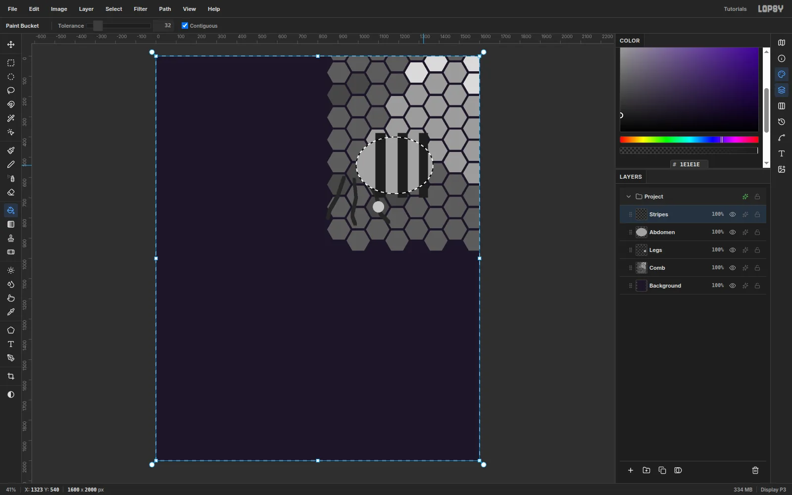

Build the bee from separate layers above *Comb*:

1. *Legs*: press [[N]] for the Pencil, **Size** 16, colour `#262626`, and draw three bent legs down from about (930, 600), (980, 610) and (1040, 600). With the Shape tool in *Ellipse* mode, add a small pale ellipse (`#C7C7C7`, dragged 28 px out from its centre at (1100, 745)) on the back leg as a pollen basket.
2. *Abdomen*: drag a `#A3A3A3` ellipse from its centre at (1180, 540) out 190 px across and 140 px down.
3. *Stripes*: with the Rectangular Marquee, fill three `#1E1E1E` bands from y 380 to 700, at x 1085–1135, 1195–1245 and 1300–1345.

To trim the stripes to the body, [[Cmd]]-click the *Abdomen* thumbnail to
load its shape as a selection. Then **click the Abdomen row and click back on
Stripes**. Choose **Select → Invert** ([[Shift+Cmd+I]]) and press [[Delete]].

> **Tip:** Don't skip the click away and back. Right after a thumbnail [[Cmd]]-click, Delete wipes the whole active layer (a known issue). Switching rows first commits the selection.

## Add the head, thorax and antennae

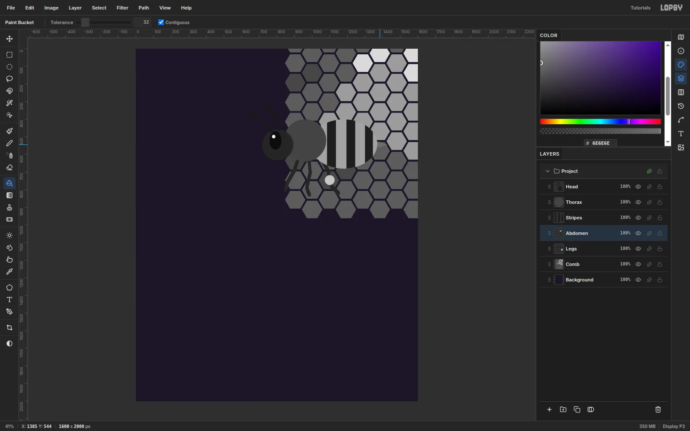

Add *Thorax* and *Head* layers above *Stripes*, and use the Shape tool in
*Ellipse* mode:

- Thorax: `#424242`, dragged from (960, 520) out 120 px both ways.
- Head: `#242424`, dragged from (805, 545) out 88 px. Add an eye in `#0A0A0A`, dragged from (792, 520) out 34 × 52 px, and a `#F2F2F2` highlight dragged 10 px out from (782, 498).

On *Head*, draw two antennae with the Pencil, **Size** 10 and `#1A1A1A`,
curving up and left from the top of the head. Click once at each tip with
**Size** 22 to club them. On *Abdomen*, use the **Lasso** to draw a small
triangle off the tail, from (1360, 522) to (1428, 544) to (1360, 566), and fill
it with `#6E6E6E` for the stinger.

## Merge the bee and outline it

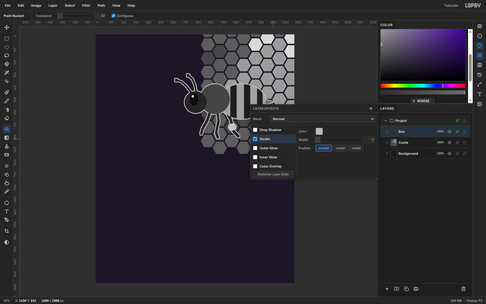

Select *Head* and press [[Cmd+E]] four times to merge the parts into one
layer. Rename it *Bee*.

Open the layer's effects, tick **Stroke** and set:

- Colour `#BDBDBD`
- **Width** 7
- Position **outside**

The outline becomes cream after the Gradient Map. It separates the dark body
from the dark comb, the way a print keyline does.

## Draw and rotate the wings

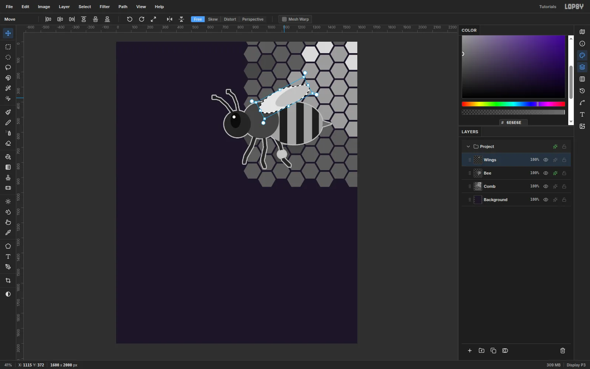

Add a *Wings* layer above *Bee*. Draw two ellipses from their centres: a
`#E6E6E6` one from (1000, 395) out 150 × 60 px, and a smaller `#C2C2C2` one
from (1085, 410) out 125 × 48 px.

[[Cmd]]-click the *Wings* thumbnail and press [[V]]. Drag the **top-right
rotation handle** (the circle just outside the corner) until the wings tilt
up about **28°**. Then drag inside the box to move them about 85 px right and
24 px up, onto the thorax. Press [[Cmd+D]] to commit and [[Cmd+E]] to merge
them into *Bee*.

## Scale and tilt the whole bee

[[Cmd]]-click the *Bee* thumbnail, press [[V]], and [[Cmd]]-drag the
bottom-right corner handle out to **115%**. Hold [[Cmd]] to keep the
proportions. Press [[Cmd+D]].

Load the selection again and drag a rotation handle **12°** counter-clockwise,
so the bee climbs toward the headline. Press [[Cmd+D]].

> **Tip:** If a thin seam shows around the pollen basket after all the merging, use the Elliptical Marquee to select a 39 px-radius circle on it. Choose **Edit → Fill** with `#BDBDBD`, then fill a 33 px circle with `#C6C6C7`.

## Make it duotone with a Gradient Map

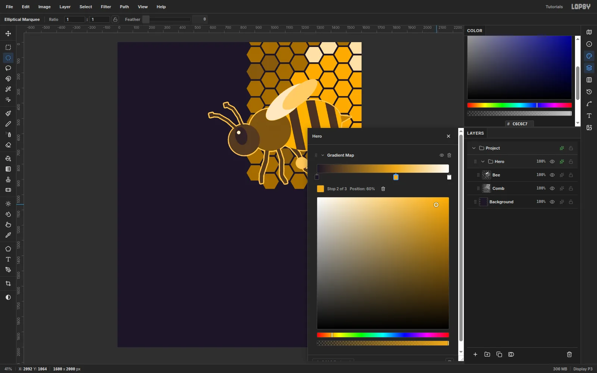

Click *Comb*, [[Shift]]-click *Bee*, and choose **Layer → Group Layers**.
Rename the group *Hero*.

Click the group's effects button to open its adjustment stack. Choose **Add
Adjustment → Gradient Map** and edit the stops:

1. Left stop: `#1C1526`.
2. Click the handle row at **60%** to add a stop, and set it to `#F2A516`.
3. Leave the right stop white.

Every grey now maps onto the ink-to-honey ramp. The dark stripes and eye
become ink, and the pale wings and capped cells become cream.

## Fade the honeycomb into the ink

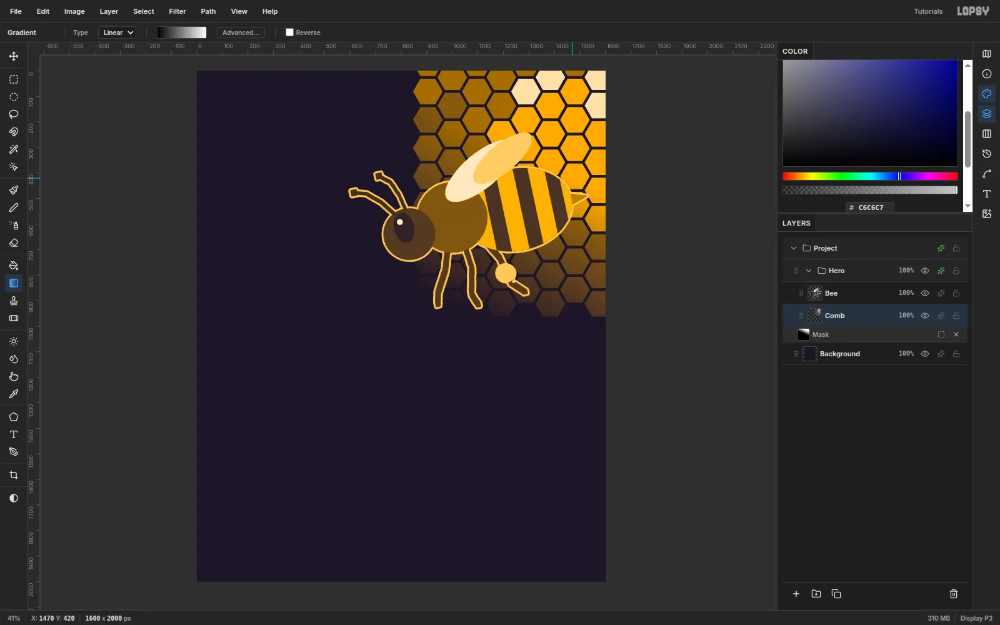

Select *Comb* and click **Add Mask**. Click the **mask thumbnail** to edit
the mask. Choose the **Gradient** tool (Linear, black to white) and drag from
**(1150, 1000)** up to **(1470, 420)**.

Press [[Esc]] and click another layer's row to leave mask editing. The cells
now fade diagonally into the background, and the bottom row disappears
completely.

> **Tip:** Inside a group with an adjustment, the canvas doesn't show the mask while you're still editing it. Leave mask edit to see the result.

## Draw the bars on exact values

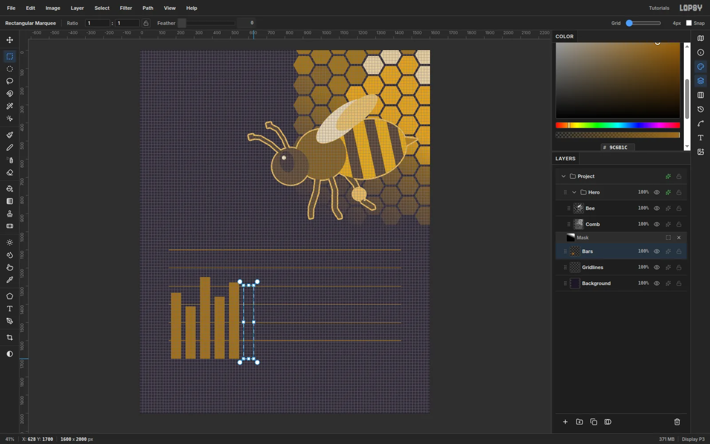

Select *Background* and add a *Gridlines* layer. Press [[N]] (Pencil,
**Size** 2, `#F2A516`). For each of y **1600, 1500, 1400, 1300, 1200 and
1100** (10% to 60%), click at x 160 and [[Shift]]-click at x 1440 to draw a
straight line. Set the layer to **40%** opacity.

Add a *Bars* layer. Turn the grid on with [[Cmd+']] and **untick Snap**. The
grid is only a visual reference here. Snap would round each bar top to a
grid line, and the chart has to be exact.

For each bar *i* (0 to 15), marquee from x **172 + 80 × i**, 56 px wide, from
y **1700 − 10 × value** down to 1700. Click inside with the Fill tool in
`#9C6B1C`. That scale is 10 px per percentage point, so '15 (40.5%) runs from
y 1295 to 1700.

## Highlight the record years

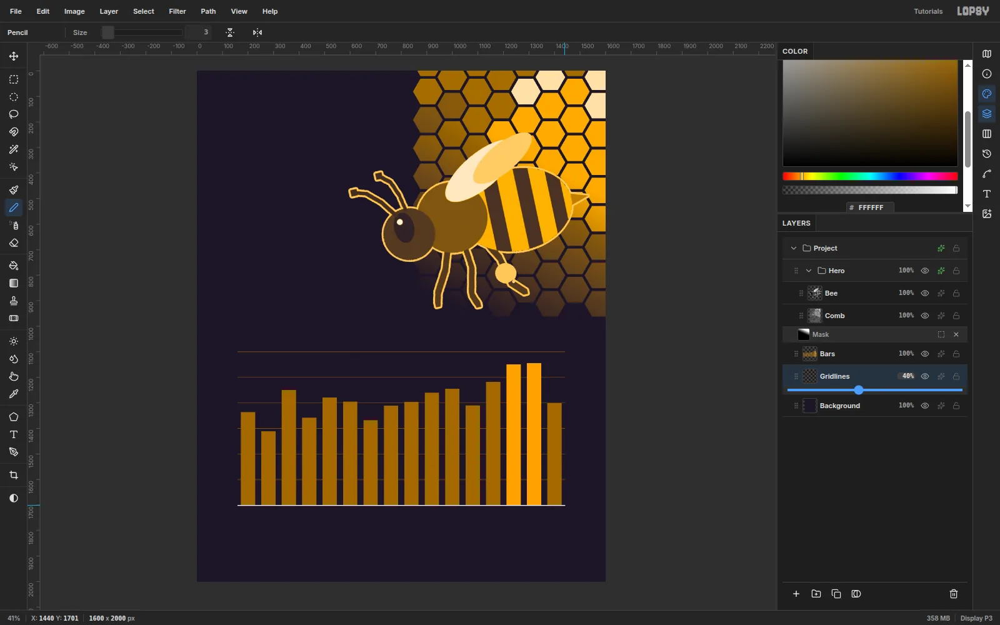

Marquee the **'23** and **'24** bars again and fill them with `#F2A516`.
These two record years are the story, so they get the bright ink.

With the Pencil at **Size** 3 in white, click at (160, 1701) and
[[Shift]]-click at (1440, 1701) for the baseline. Turn the grid off.

## Make a dotted 50% line

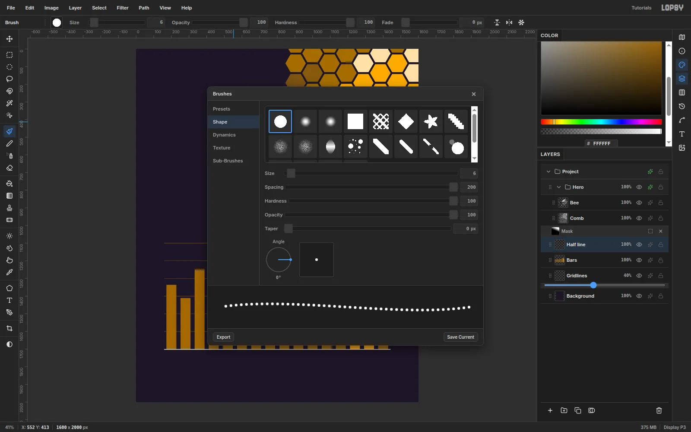

Add a *Half line* layer above *Bars*. Press [[B]], set **Size** 6 and
**Hardness** 100, and open the brush presets. On the **Shape** tab, set
**Spacing** to **300**. Each dab is now its own dot.

Click at (160, 1200) and [[Shift]]-click at (1440, 1200). Give the layer a
**Color Overlay** of `#FFF1C9`.

## Group the chart

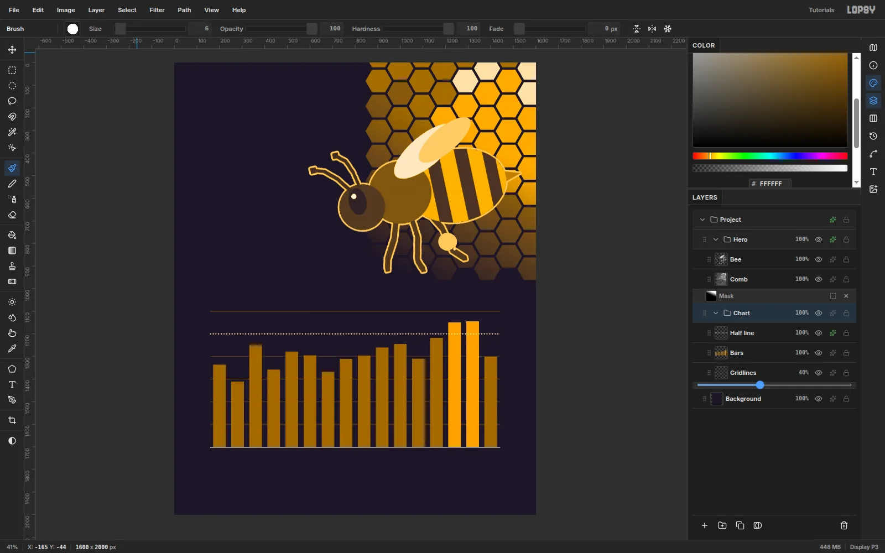

Click *Gridlines*, [[Shift]]-click *Half line*, and choose **Layer → Group
Layers**. Rename the group *Chart*. Now the whole chart can be moved or
hidden in one step.

## Set the headline

Before each new text layer, **click the Background row**. Font and size
changes apply to the active text layer, and this keeps them off the text
you've already set. Also click to type in empty canvas, well away from other
type, and move the layer into place afterwards. A click just below a big
headline edits the headline instead.

1. Kicker: **IBM Plex Mono**, Medium, **24**, `#F2A516`: `THE STATE OF THE AMERICAN HIVE  /  2010–2026`. Move its letters to start at (162, 150).
2. Title: **Anton**, Regular, **160**, white: `BEE SURVIVAL`. Move it so the caps start at (160, 202), 32 px under the kicker.

The **L** sits behind the honeycomb, because text layers land above
*Background*, below *Hero*.

## Bring the title above the honeycomb

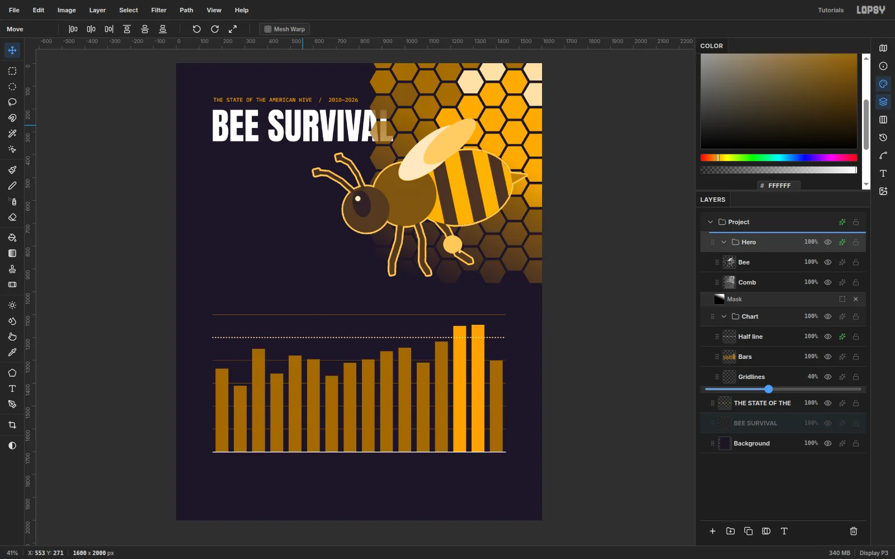

Drag the *BEE SURVIVAL* row by its **grip** (the dotted handle on the left)
up to the top half of the *Hero* row. The title now sits over the comb. The
top-left cells are faded dark honey, so the headline stays readable.

## Add the stat and the chart's dek

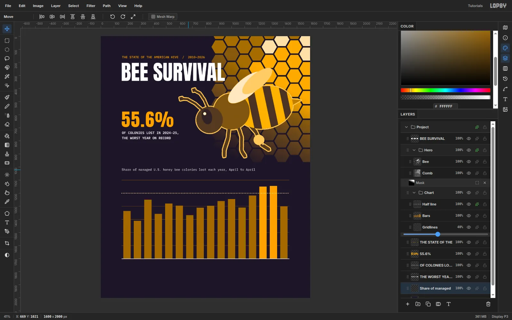

A good data poster pulls one number out of the chart:

1. **Anton** **136** in `#F2A516`: `55.6%`. In the **Text** panel, set **Letter spacing** to 6 so the period doesn't touch the fives. Place it at (160, 575).
2. **IBM Plex Mono** SemiBold **26**, white: `OF COLONIES LOST IN 2024–25,` at (162, 728) and `THE WORST YEAR ON RECORD` at (162, 768).
3. **IBM Plex Mono** Regular **24**, white: `Share of managed U.S. honey bee colonies lost each year, April to April` at (160, 1010).

Every block now starts on the x 160 margin.

## Warm the whites to cream

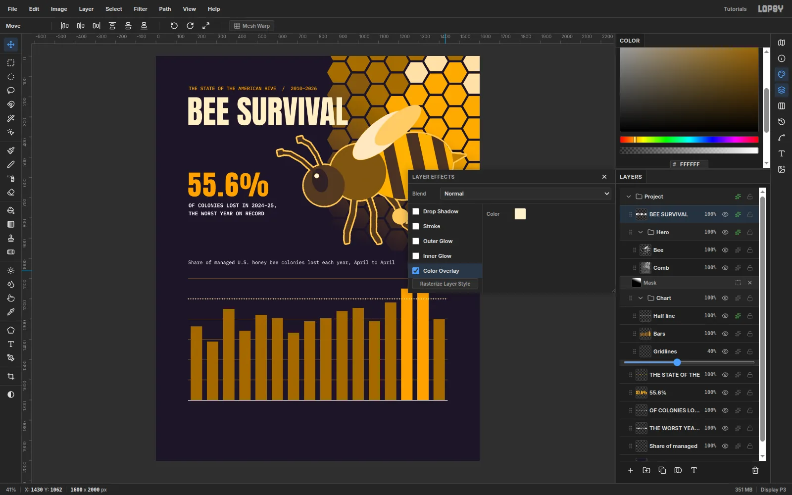

Pure white is a third colour on a duotone poster, so warm it to the paper
tone. On *BEE SURVIVAL*, the two stat lines and the dek, open **Layer
Effects**, tick **Color Overlay** and set it to `#FFF1C9`.

## Label the axes

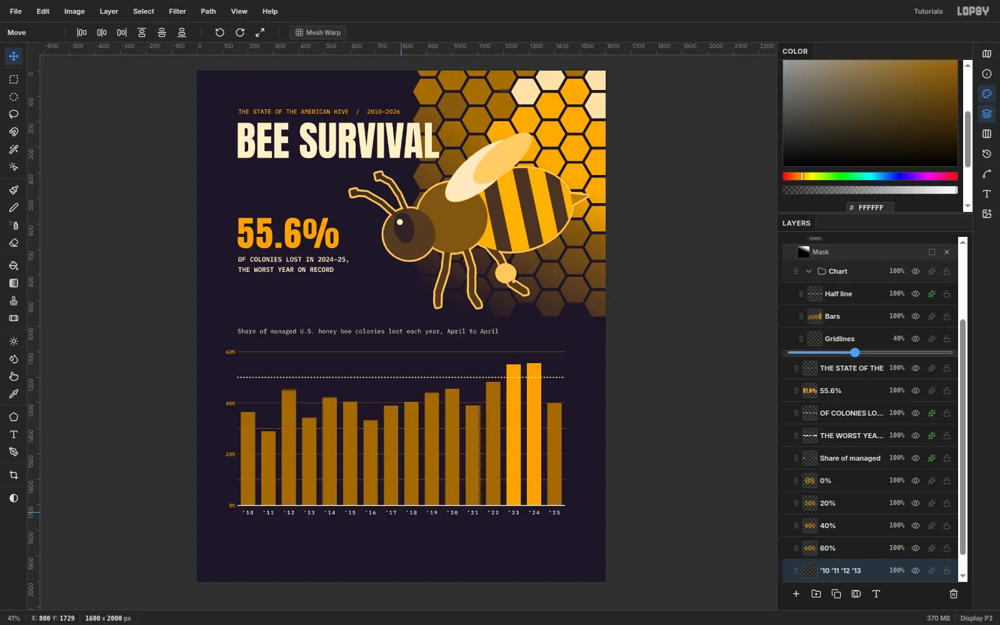

Axis labels are **IBM Plex Mono** Medium **20**:

- `0%`, `20%`, `40%` and `60%` in `#F2A516`, right-aligned to x **148** and centred on their gridlines.
- One text layer for the years: `’10  ’11  ’12` … `’25` with two spaces between each, in white. In the **Text** panel, set **Letter spacing** to **4**. The labels then land on the 80 px bar pitch. Centre the layer on x 800 with its top at y 1722, and give it the cream Color Overlay.

## Label every bar and knock out the line

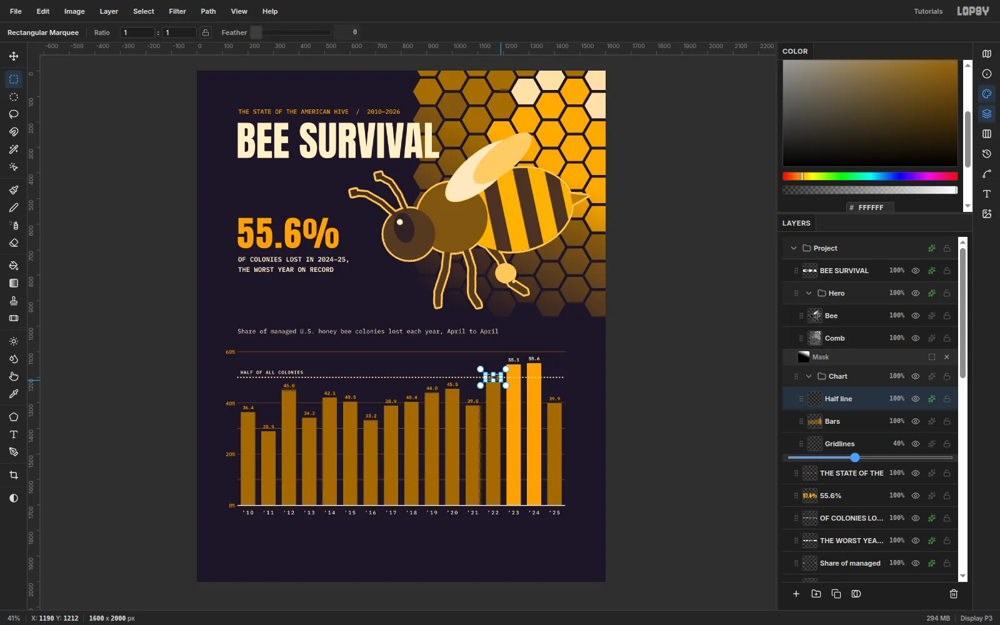

Label all 16 bars with **IBM Plex Mono** SemiBold **18**. Use `#F2A516` for
most and `#FFF1C9` for **55.1** and **55.6**. Centre each one on its bar at
x **200 + 80 × i**, with its bottom 12 px above the bar's top. One label
style with no % signs is quicker to read than mixed styles.

Add `HALF OF ALL COLONIES` (18 SemiBold, **Letter spacing** 1.5, cream
overlay) just above the dotted line at (172, 1174).

The **48.2** label sits right on the dotted line. Select *Half line*, marquee
from (1130, 1188) to (1190, 1212), and press [[Delete]] to knock the dots out
behind it.

## Add the source note

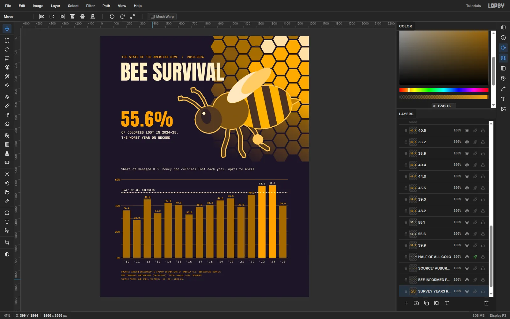

In **IBM Plex Mono** Regular **16**, `#F2A516`, set three lines at x 162,
at y **1802**, **1830** and **1858**:

- `SOURCE: AUBURN UNIVERSITY & APIARY INSPECTORS OF AMERICA U.S. BEEKEEPING SURVEY;`
- `BEE INFORMED PARTNERSHIP (2010–2019). TOTAL ANNUAL LOSS, ROUNDED.`
- `SURVEY YEARS RUN APRIL TO APRIL, SO ’24 = 2024–25.`

The last line tells the reader what each year label means.

## Make a grain layer

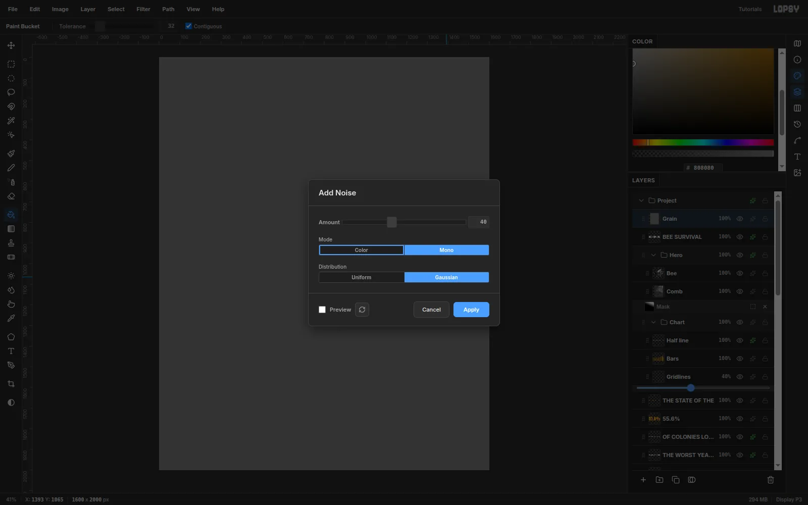

Select the *BEE SURVIVAL* row so the new layer lands on top, then add a
*Grain* layer. Fill it with `#808080`. Choose **Filter → Add Noise…** and
set:

- **Amount** 40
- **Mono**
- **Gaussian**

Click **Apply**.

## Blend the grain and export

Set *Grain* to **Overlay** and **45%** opacity. The flat ink and honey pick
up a fine print texture, and mid-grey noise leaves the colours where they
were.

Choose **File → Quick Export PNG** to save the poster.
