A duotone prints a photo with just two inks. On a t-shirt that's a real advantage: every ink is another screen at the print shop, and a two-ink design costs far less than full colour while still reading as a photograph.

This tutorial builds a souvenir tee for **El Yunque National Forest** in Puerto Rico, the only tropical rainforest in the U.S. National Forest System. It uses two public-domain photos from Wikimedia Commons:

- `20180317-OC-PJK-4858 TONED.jpg`, La Coca Falls, a USDA photo by Preston Keres.
- `Canopy at El Yunque National Forest (29777835063).jpg`, a palm canopy shot by Roy Hewitt, USFWS.

Every colour in the finished design is one of three:

- Shirt `#F2EAD8` (the fabric, not an ink)
- Emerald ink `#0E4D3A`
- Hibiscus ink `#FF5D73`

Work on a **1600 × 2000 px** document. That's a 4:5 print area, and its width divides by four, which keeps layer masks well behaved.

## Draw the arch window and its keyline

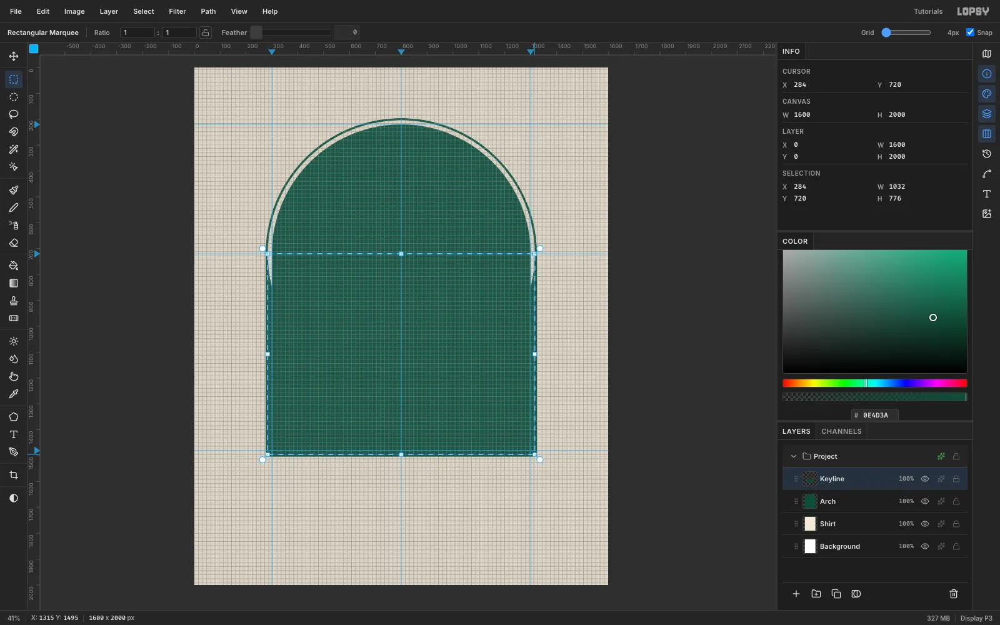

1. Create a **1600 × 2000** document and fill the Background with the shirt colour `#F2EAD8` (**Edit → Fill** with no selection). Rename it `Shirt`.
2. Click the top ruler at x **300**, **800** and **1300**, and the left ruler at y **220**, **720** and **1480**, to drop guides.
3. Turn on **View → Show Grid**, set the grid to **4 px** and leave Snap on, so every marquee lands on whole numbers.
4. On a new **Arch** layer, fill the emerald `#0E4D3A` into an **Elliptical Marquee** circle from (300, 220) to (1300, 1220), then into a **Rectangular Marquee** from (300, 720) to (1300, 1480). Together they make the arch.
5. On a new **Keyline** layer, fill a bigger arch the same way (circle radius 524, rectangle 276–1324 wide down to 1504). Then marquee the same shape at radius **515** and press [[Delete]] on each part.

That leaves a 9 px emerald ring with a 15 px gap around the window. The Arch layer is only a stencil, so hide it once the photo is in place.

> **Tip:** Build rings from plain marquees. Loading a layer's shape with a [[Cmd]]-click on its thumbnail and then pressing Delete can clear the whole layer.

## Paste and scale the waterfall photo

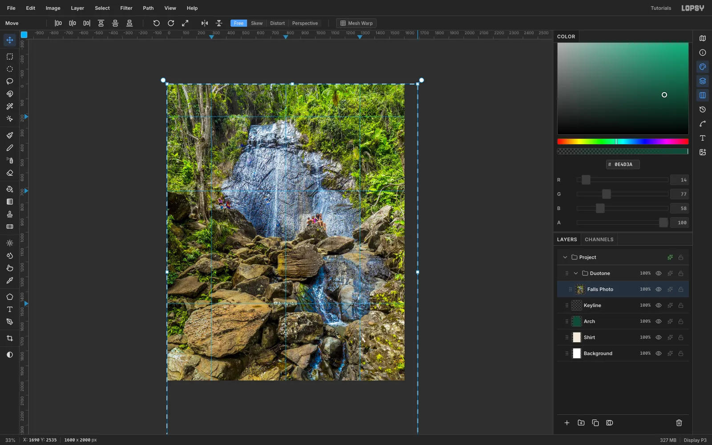

1. Click **New Group** in the Layers panel and name it `Duotone`.
2. Copy the La Coca Falls photo (scaled to 1300 px wide) and press [[Cmd+V]]. Lopsy centres the paste inside the group and switches to the **Move** tool.
3. Hold [[Cmd]] and drag the bottom-right handle out until the photo is about **1690 × 2535**, roughly 130%. Zoom out with [[Cmd+-]] first so the handle stays on screen.
4. Press [[Cmd+D]] to commit, then drag the photo so the white cascade runs straight down the middle guide. Rename the layer `Falls Photo`.

Scaling up crops in on the falls, so the cascade fills the whole height of the arch.

## Clone out the hikers

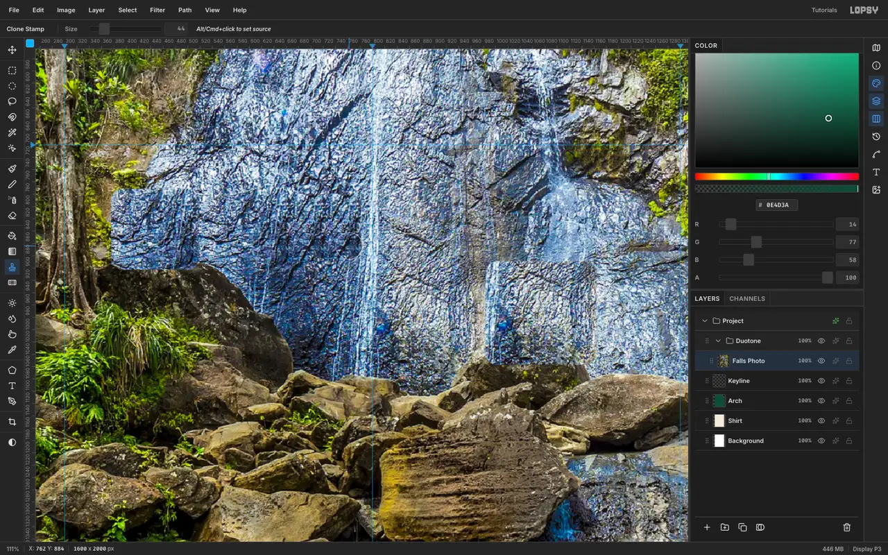

The photo has a group of hikers climbing the rocks, which you don't want on a shirt.

1. Zoom in with [[Ctrl]] and the scroll wheel.
2. Pick the **Clone Stamp** (Size 44).
3. [[Alt]]-click a patch of plain rock at the same height as the hikers, then paint over them in short horizontal strokes.
4. Re-sample for each group, so the texture comes from nearby.

The Clone Stamp is *aligned*: the offset from your first [[Alt]]-click stays fixed for every stroke after it. Keep the source to one side of the hikers, never above or below them.

## Clip the photo to the arch

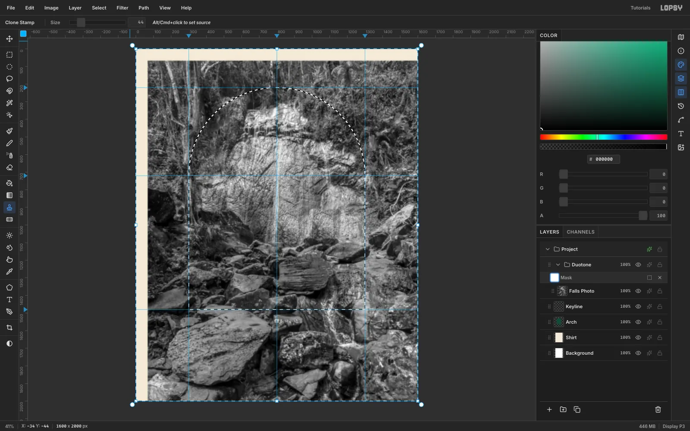

1. With **Falls Photo** active, run **Filter → Desaturate**, then **Filter → Gaussian Blur** with radius **6**. The blur wipes out fine rock texture that would otherwise turn into noisy speckle in the duotone.
2. Select the **Duotone** group and click **Add Mask**, then click the mask row (**Edit mask for Duotone**).
3. [[Cmd]]-click the **Arch** thumbnail to load the arch as a selection, and run **Select → Inverse**.
4. Set the foreground to black and choose **Edit → Fill**. In mask mode this fills the mask, not the pixels.

The photo now only shows inside the arch. Because the mask is on the group, anything else you put in the group is clipped too.

## Map the photo to two inks

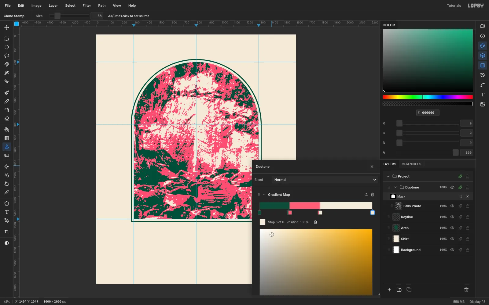

1. With the **Duotone** group selected, open the effects drawer and choose **Add Adjustment → Gradient Map**.
2. Click the gradient bar to add stops until there are six, then set them in pairs so each tone band is flat:
   - 0% and 26%: emerald `#0E4D3A`
   - 27% and 55%: hibiscus `#FF5D73`
   - 56% and 100%: shirt `#F2EAD8`

Using pairs of stops only 1% apart gives hard edges between the bands, so the result separates cleanly into two screens. Shadows print emerald, mid-tones print pink, and the highlights are bare shirt.

> **Tip:** Place the two break points on the photo's histogram. Here the 25% and 53% quantiles of the photo's greys (61 and 137) became the stops.

## Give the falls a source

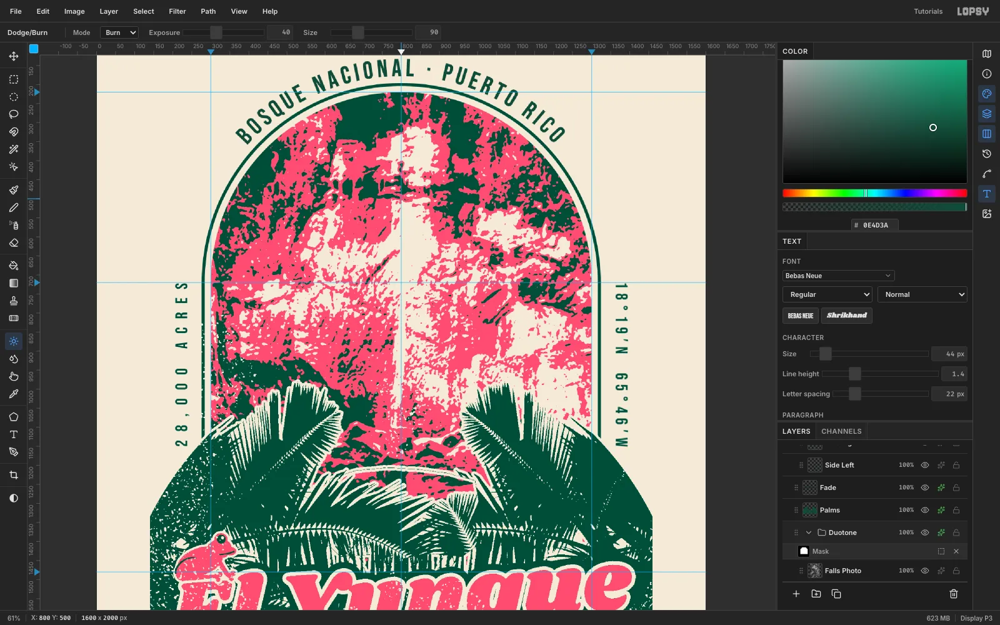

At first the top of the cascade blended into pale rock and read as sky. Fix it on the photo, not the map:

1. Select **Falls Photo** and pick **Dodge / Burn**.
2. Set **Mode** to **Burn**, **Exposure** to **40** and **Size** to **90**.
3. Drag four vertical strokes down the rock on either side of the cascade, from the top of the arch to about y 580.

The burned rock drops below the bone threshold, so the water now has pink and emerald walls from top to bottom and reads as a waterfall.

## Cut palm silhouettes from a photo

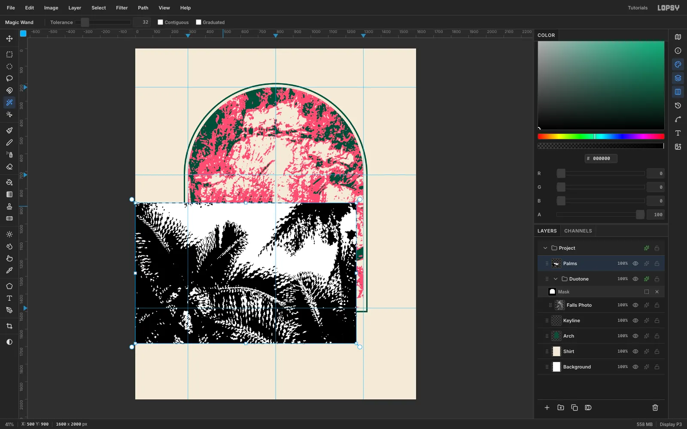

1. Click **Keyline**, paste the palm canopy photo (scaled to 1320 px wide) and press [[Cmd+D]].
2. Drag its row above the Duotone group and rename it `Palms`. Move it to (−60, 880).
3. Run **Filter → Desaturate**, then **Filter → Threshold** at **150**. The fronds become solid black against white sky.
4. Pick the **Magic Wand**, untick **Contiguous**, click the sky and press [[Delete]].
5. Marquee the right half of the layer (x 800 and up) and press [[Delete]], and delete the strip left of x 140 too.

You now have the left half of a frame of palms.

## Mirror the palms into a symmetric frame

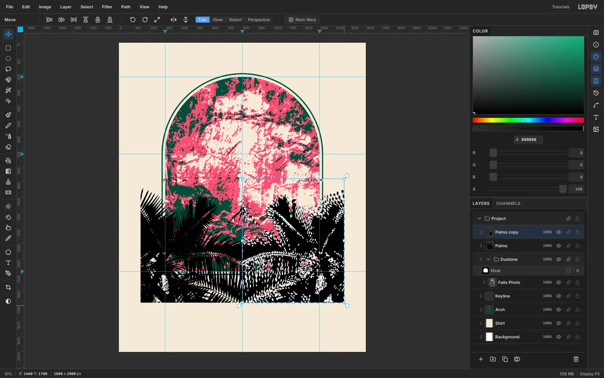

1. Switch to the **Move** tool and choose **Layer → Duplicate Layer**. The copy lands 10 px right and 10 px down, so press [[Shift+Left]] and [[Shift+Up]] once each to put it back.
2. Marquee a box centred on x 800, from (140, 870) to (1460, 1700).
3. Click **Flip Horizontal** in the Move options bar. It flips around the marquee's centre, so the copy mirrors exactly onto the right side.
4. Press [[Cmd+D]], then **Layer → Merge Down**.
5. Round off the band: Elliptical Marquee centred on (800, 1762) with radii 760 × 860, **Select → Inverse**, [[Delete]]. Then marquee everything below y 1672 and delete that too.

The two big palms now make a V that leads the eye up to the falls.

## Break up the mirror seam

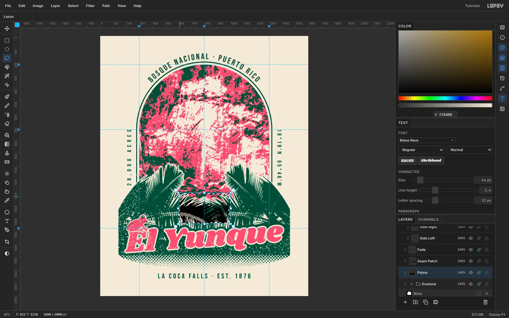

A perfect mirror leaves a tell-tale "inkblot" right at the centre, which here is the base of the waterfall. Cover it with real, un-mirrored fronds:

1. Paste the canopy photo again as `Seam Patch`, put it in the same place, then **Desaturate** and **Threshold 150**.
2. Lasso the centre of the band (roughly x 600–1000, y 1206–1446), **Select → Inverse**, and [[Delete]] everything outside it. Magic-wand the white and delete it as before.
3. On **Palms**, lasso the same outline and delete it, so the patch fills the hole.
4. Select **Seam Patch** and choose **Layer → Merge Down**.

> **Tip:** Merge Down resets the lower layer's effects and blend mode. Add the Palms effects *after* the merge. Then [[Cmd]]-click the Palms thumbnail and **Edit → Fill** emerald twice to seal the hairline where the two lasso edges meet.

Give **Palms** a **Color Overlay** in emerald and an outside **Stroke** of **7 px** in shirt `#F2EAD8`. The bone outline separates the fronds from the emerald band behind them.

## Dissolve the band into halftone dots

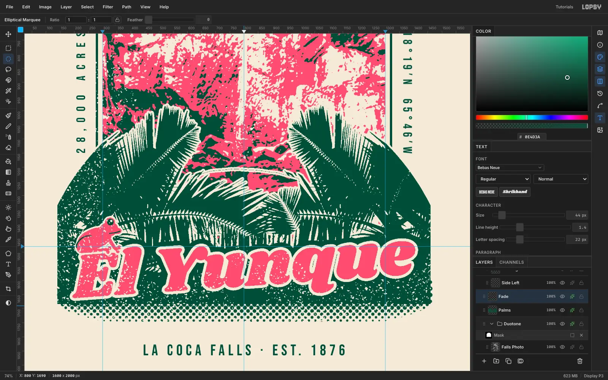

1. Add a **Fade** layer above Palms.
2. Set the Gradient tool's stops to black → light grey `#C8C8C8`. Marquee (140, 1600)–(1460, 1800) and drag a **Linear** gradient from y 1684 down to y 1782.
3. Elliptical Marquee centred on (800, 1640), radii 700 × 150. Run **Select → Inverse**, then **Select → Feather** **36**, and **Edit → Fill** with white. The dots will now shrink to nothing toward the curved edge instead of being sliced by it.
4. Press [[Cmd+D]] and run **Filter → Halftone** with **Dot Size 16**, **Angle 45** and **Softness 1**.
5. Fill a solid emerald strip from y 1620 to 1684, so the dots grow out of the band. Delete anything below y 1746, where dots would be too small to print.
6. Add a **Color Overlay** in emerald.

Finally, round the band's two bottom corners with a small lasso (about a 34 px radius), deleting on both **Palms** and **Fade**.

## Set the script title with a halo

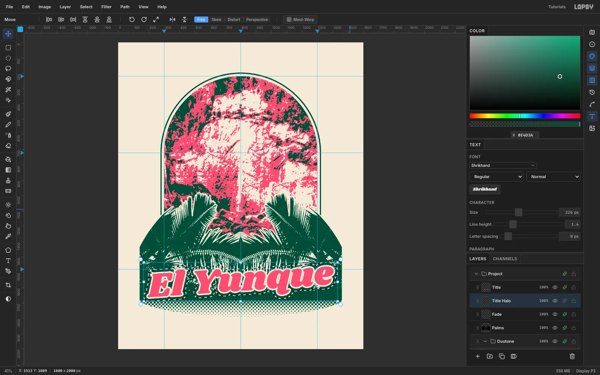

1. Select a raster layer (**Fade**) so the text options don't restyle an existing text layer.
2. Pick the **Text** tool with **Shrikhand**, **226 px**, colour `#FF5D73`. Click in empty canvas near the top and type `El Yunque`, then press [[Tab]].
3. Click **Rasterize Layer**. Marquee the title with a few pixels to spare, switch to **Move** and drag just outside the top-right corner to rotate it **−4°**. Press [[Cmd+D]].
4. Move it so it's centred on x 810 with its lowest ink at y 1647. That gives the "E" about 37 px of emerald below it.
5. Add an outside **Stroke** of **10 px** in shirt `#F2EAD8`.
6. On a new **Title Halo** layer below the title, [[Cmd]]-click the title's thumbnail, run **Select → Grow** **26** and fill it emerald.

The emerald halo gives the script its own shape to sit on, so it stays readable over the busy fronds.

> **Tip:** Rasterize text *before* rotating it. Live rotated text can capture your next text-tool click from anywhere on the canvas.

## Curve the forest name over the arch

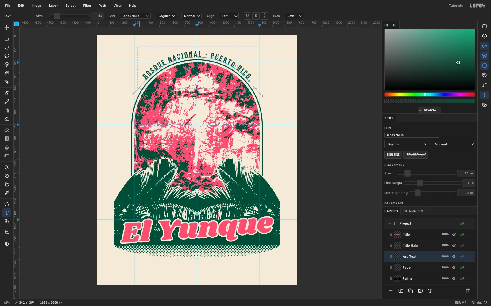

1. With **Fade** active, open the **Text** panel and set **Letter spacing** to **10**.
2. Set straight text in **Bebas Neue** at **64 px**, emerald: `BOSQUE NACIONAL · PUERTO RICO`. Its width is 906 px.
3. With the **Pen** tool, draw a three-anchor arc centred on the arch (800, 720) with radius **542**. Span it slightly more than 906 px, centred on the top of the arch, and click **Commit path**.
4. Select the text layer and pick the path in the options bar's **Path** menu.

The glyphs sit on the outside of the arc, 18 px clear of the keyline all the way round. Hide the path afterwards by clicking its row in the Paths panel.

## Add the side labels and footer

1. Set the footer `LA COCA FALLS · EST. 1876` in Bebas Neue **54 px** with letter spacing **12**. Click **Align center horizontally**, then nudge it to y **1826**.
2. Set `28,000 ACRES` (spacing **22**) and `18°19′N · 65°46′W` (spacing **10.6**) at **44 px**. Adjust the spacing until both are exactly 428 px long, so they read as a pair.
3. Rasterize each label and rotate it with the Move tool: **−90°** on the left, **+90°** on the right.
4. Move them to x **206** and x **1362**, spanning y **702–1129**. That centres them on the arch's straight walls, about 40 px from the keyline.

Reset the Text panel's letter spacing to 0 afterwards, because it carries over to the next text.

## Perch a coquí on the title

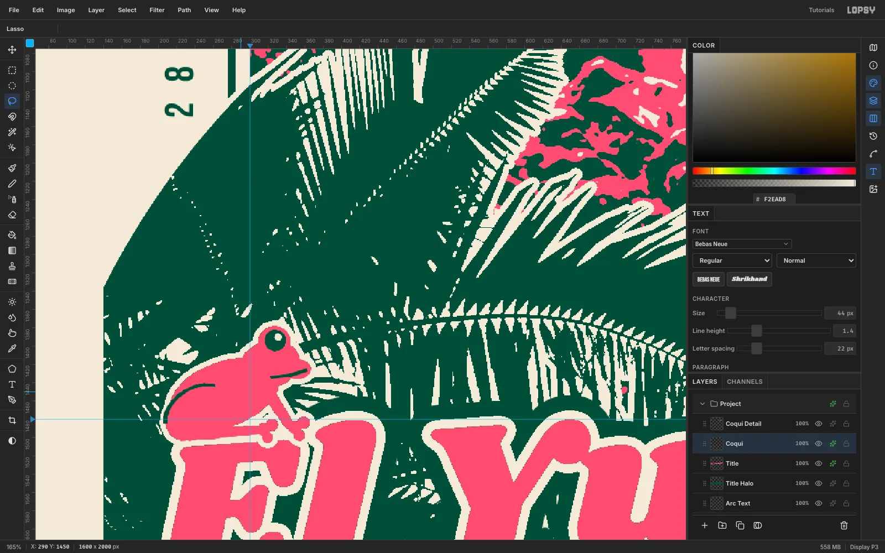

The coquí is the tiny tree frog whose "ko-KEE" call fills El Yunque at night. It's a nice detail for people who know the forest.

1. On a new **Coqui** layer above the title, build the frog from filled **Lasso** shapes in hibiscus pink:
   - a body, a head and a snout
   - an eye bump that breaks the top of the head
   - a folded thigh
   - a front arm
   - six round toe pads
2. On **Coqui Detail**, fill the eye and the leg and mouth lines emerald, and add a tiny bone highlight in the eye.
3. Give **Coqui** a **6 px** bone **Stroke**.
4. Group the two layers and move the group so the feet sit on the top of the "E".
5. On **Palms**, [[Cmd]]-click the Coqui thumbnail, **Select → Grow** **20** and fill emerald. That clears the fronds behind its outline.

## Add screen-print wear

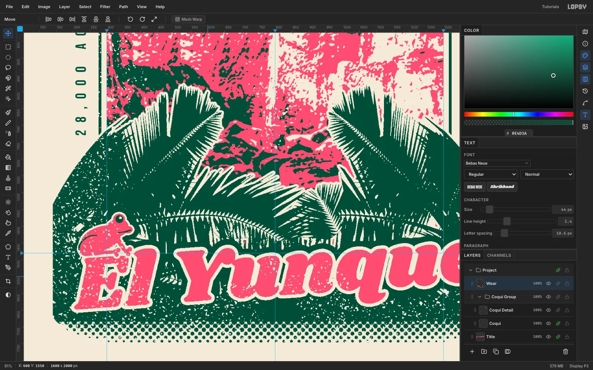

1. Add a **Noise** layer, fill it mid-grey `#808080` and run **Add Noise** at **100**, **Mono**, **Gaussian**.
2. Run **Gaussian Blur 5**, then **Threshold** at the value that leaves about 8% white. For this noise that was **132**.
3. Magic-wand a white speck (Contiguous off), click **Add Layer**, fill the selection with the shirt colour and name the layer `Wear`. Delete the Noise layer.
4. On a **Clouds** layer, run **Clouds** (Scale 3) and **Threshold** it at its 62% quantile. Magic-wand the black, switch to **Wear** and press [[Delete]]. Delete the Clouds layer.
5. Marquee over the footer, the side labels and the arched text, and delete the wear there so small type stays sharp.

The specks are only on some areas: heavy on the band's left and on "El Yu", light elsewhere. That reads as a worn print rather than a filter laid over the whole design.

Export with **File → Quick Export PNG**. For the print shop, the emerald and pink areas separate into two screens, and everything bone is bare shirt.
