Before infographics had a name, atlas publishers in the 1820s to 1850s printed a plate called *A Comparative View of the Heights of the Principal Mountains*. Every famous peak was squeezed into one imaginary range and drawn to a common scale. The plates were engraved in copper, printed in black, and then coloured by hand with flat watercolour washes. They're still one of the most charming ways to show a set of numbers.

In this tutorial you'll make your own, using real heights in feet. Everything that looks engraved is built from **five tiny hatching patterns** that you draw once and then pour into selections with **Edit → Fill with Pattern…**. Along the way you'll use:

- **Combined selections:** Shift+Alt to intersect, and Alt to subtract.
- A **layer mask** with a gradient.
- **Brush spacing** for dotted lines.
- **Effects:** Stroke.
- **Rotation, copy and paste, and Merge Down** for the corner ornaments.
- **Duplicate and Rasterize** to make engraved capitals.
- The **Text panel's Paragraph spacing**, which lines the scale figures up with the scale bars.

The data, in feet above sea level:

- **Eastern Hemisphere:** Ben Nevis 4,413, Olympus 9,573, Fuji 12,388, Matterhorn 14,692, Mont Blanc 15,774, Elbrus 18,510, Kilimanjaro 19,341, K2 28,251, Everest 29,032.
- **Western Hemisphere:** Aconcagua 22,838, Chimborazo 20,548, Denali 20,310, Popocatépetl 17,802, Rainier 14,411, Washington 6,288.
- **Two reference heights:** the snow line at the Equator (about 15,700 ft) and Gay-Lussac's 1804 balloon ascent (23,018 ft).

The fonts are free Google Fonts:

- **Old Standard TT**, a 19th-century "modern" face, for the labels and figures
- **Playfair Display SC** Black for the title capitals
- **Pinyon Script**, a copperplate script, for the subtitle

The palette:

- Paper `#EDE2C4`, mountain paper `#E9DDBE`, snow `#F8F4E8`
- Engraver's ink `#1E1A16`, sepia grid `#5B4A39`
- Forest wash `#7C9A62`, rock wash `#CFA968`, crag wash `#A8998A`
- Sea `#C7D2CD`
- Snow-line carmine `#A3312A`
- Balloon basket `#4A3524`

**The scale.** The chart runs from 0 ft at the shoreline (y 1290) to 30,000 ft (y 320). That's 970 px for 30,000 ft, or about **32.3 px per 1,000 ft**. To find any summit, take the height in thousands of feet, multiply by 32.3 and subtract from 1290. Everest, at 29.032 thousand feet, comes out at about y 352. The Info panel shows the cursor position while you work.

## Create a 2400 × 1600 document

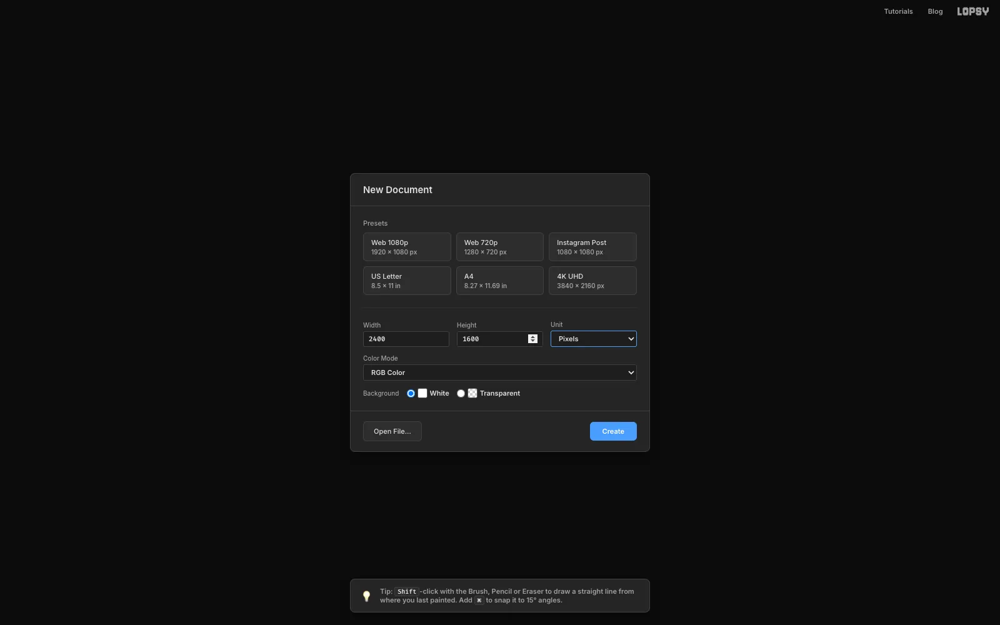

Open [Lopsy](/). In the **New Document** dialog, set **Width** to `2400` and **Height** to `1600` pixels, keep the **White** background and click **Create**. A wide 3:2 sheet gives the range plenty of room.

## Lay down the paper and the plate mark

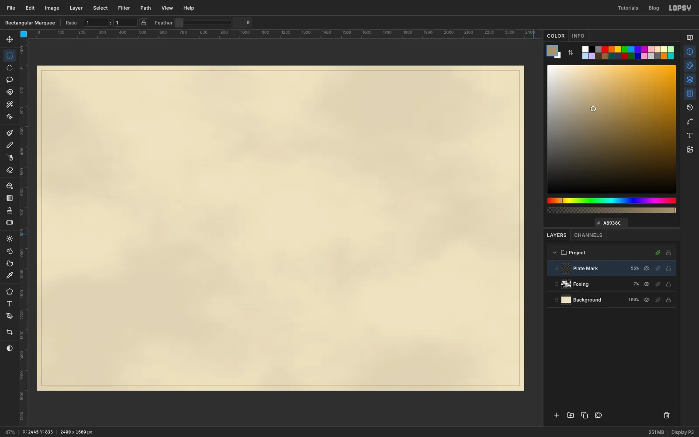

1. Select **Background**, set the foreground colour to `#EDE2C4` and choose **Edit → Fill**.
2. Run **Filter → Add Noise…** with Amount `5`, **Mono** and **Gaussian**.
3. Rename **Layer 1** to *Foxing* and run **Filter → Clouds…** at Scale `4`. In the layer effects drawer, set its blend mode to **Multiply**, then set the layer's opacity to `7%`. That gives you a faint, uneven age stain.

An engraving is printed by pressing a copper plate into damp paper, which leaves a dented "plate mark" just inside the edge. Fake one:

1. Add a layer called *Plate Mark*.
2. Draw a rectangular marquee about 22 px in from every edge and fill it with `#A8936C`.
3. Draw a second marquee 3 px inside the first and press [[Delete]]. That leaves a thin frame.
4. Run **Filter → Gaussian Blur…** at `2`, set the layer to **Multiply**, and set its opacity to `55%`.

## Draw five hatching tiles

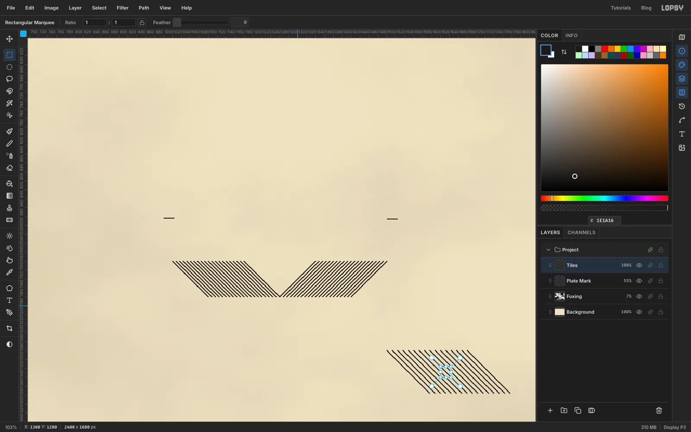

Engravers built every tone from lines. You'll make five line tiles and save each one with **Edit → Define Pattern**, which captures the marquee area of the active layer. Add a scratch layer called *Tiles* and use ink `#1E1A16`:

1. **Pattern 1, close rules.** Fill a marquee 24 px wide and 2 px tall. Then draw a 24 × 8 marquee with the strip across its middle and choose **Define Pattern**.
2. **Pattern 2, close diagonal hatching.** Pick the **Brush** at Size `3` and Hardness `100`. Draw a row of parallel 45° lines running down to the right: click at the top of each line and Shift+click at the bottom. Start each line 8 px to the right of the last one (watch X in the Info panel). Draw a 16 × 16 marquee in the middle of the block and define it.
3. **Pattern 3, the same leaning the other way.** Draw a second block of lines running up to the right and define a 16 × 16 square from it. You'll lay this over Pattern 2 to make cross-hatching.
4. **Pattern 4, open rules.** A 2 px strip in a 24 × 12 box.
5. **Pattern 5, open diagonal hatching.** Lines 12 px apart, captured as a 24 × 24 square.

Because the line spacing divides evenly into each tile, the patterns repeat without seams. Delete the *Tiles* layer when you're done; the patterns stay available.

> **Tip:** Lopsy numbers patterns in the order you define them. If you redo a tile, its number changes, so pick patterns by the size shown in the picker's tooltip: 24×8, 16×16, 24×12 and 24×24. Patterns 2 and 3 are both 16×16, so check the thumbnail to tell them apart.

## Set up the layers and lasso the first peak

Select *Plate Mark* and add these layers, from bottom to top:

- *Sky Rules*, *Grid*, *Clouds* and *Peaks Fill*
- *Snow* and *Wash*
- *Lit Hatch*, *Shadow Hatch* and *Outline*

The mountains are drawn **back to front, tallest first**, so each smaller peak overlaps the one behind it. Start with **Everest**, centred at x 1325 with its summit at y 352. Its base is about 600 px wide and sits on the shoreline. Pick the **Lasso** and draw the silhouette, adding a few small notches on each slope so it looks like rock.

Select *Peaks Fill*, set the foreground to `#E9DDBE` and choose **Edit → Fill**.

## Ink the outline and select the lit face

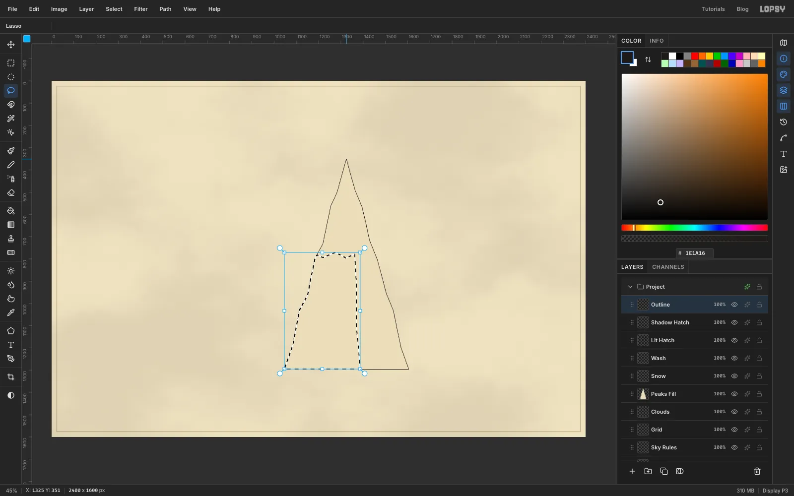

With the silhouette still selected, click *Lit Hatch*, *Shadow Hatch* and *Outline* in turn and press [[Delete]] on each. That clears anything a taller peak left behind this one, which matters from the second peak onwards.

Make the outline on *Outline*:

1. Choose **Select → Grow…** by `1` and fill with ink.
2. Choose **Select → Shrink…** by `2` and press [[Delete]].

That leaves a crisp 2 px line.

The light comes from the upper left, so the left side of each peak is lit. Narrow the selection to the lit face below the snow:

1. Hold **Shift+Alt** and lasso everything below a zigzag drawn across the range at 15,700 ft (y 782). This intersects the selection.
2. Hold **Alt** and lasso the right-hand shadow face. Run the lasso from the summit down a slightly wandering ridge to the base, out to the right base corner, and back up the right slope. This subtracts it.

## Rule the lit face and hatch the shadow face

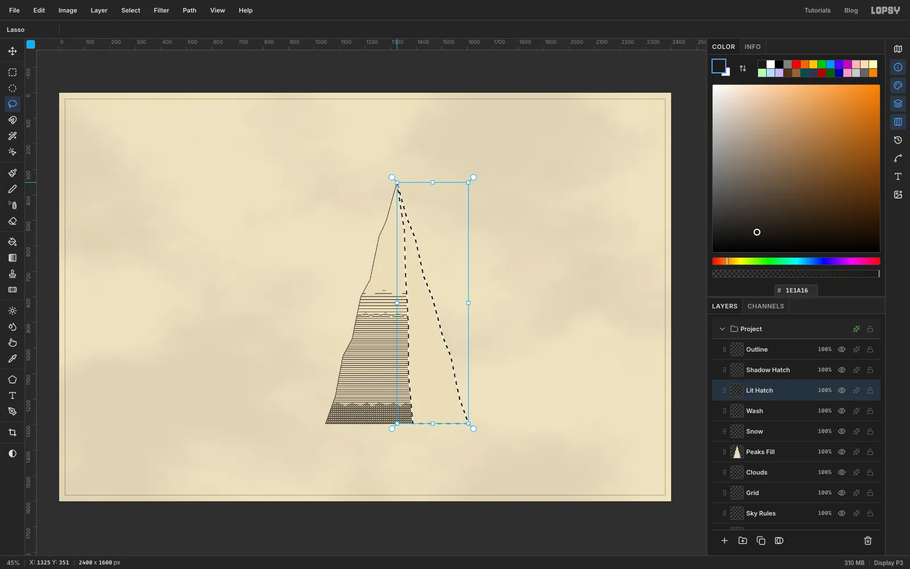

On *Lit Hatch*, choose **Edit → Fill with Pattern…** and pick **Pattern 4** (open rules). Then darken the lower half:

1. Shift+Alt lasso everything below a zigzag halfway up the peak, press [[Delete]], and fill with **Pattern 1**.
2. Shift+Alt lasso a narrow band along the foot and fill with **Pattern 2**. The diagonal lines over the rules cross-hatch the foothills.

Now lasso the shadow face on its own, with no modifier. Zoom in and follow the same ridge as before, then hug the right-hand outline. The outline on top hides small wobbles.

On *Shadow Hatch*:

1. Fill the face with **Pattern 5**.
2. Shift+Alt the below-snow zigzag, press [[Delete]] and fill with **Pattern 2**.
3. Shift+Alt the lower half and add **Pattern 3** on top.

The shadow side now goes from open hatching in the snow to dense cross-hatching at the base.

## Add the ridge and a heavier shadow edge

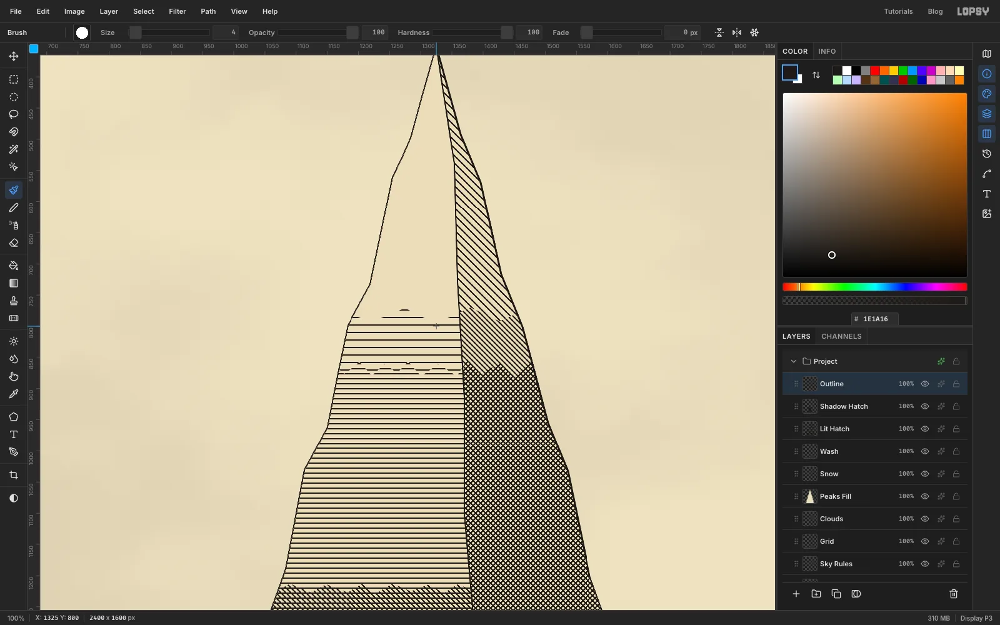

Press [[Ctrl+D]] to deselect, then select *Outline*. With the **Brush** at Size `3`, click the summit and Shift+click down the ridge between the two faces. Switch to Size `4` and Shift+click down the right-hand slope. Engravers cut shadow edges deeper, and the thicker line does the same job.

## Add the next peaks behind and in front

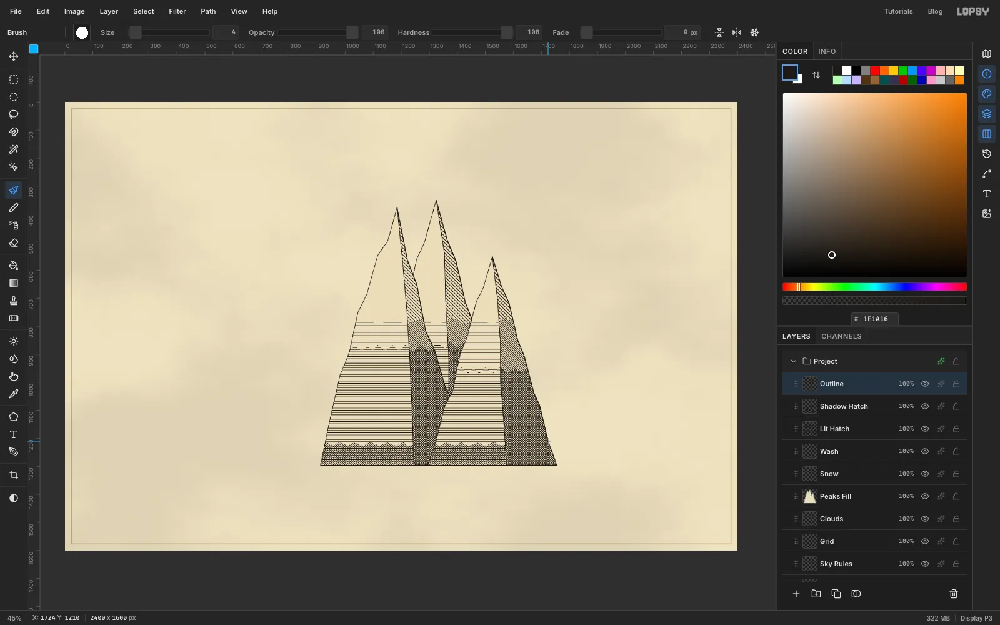

Draw **K2** next, at x 1185 with its summit at y 377, then **Aconcagua** at x 1525, summit y 552. For each one, repeat everything from the Lasso in "Set up the layers and lasso the first peak" through "Add the ridge and a heavier shadow edge". You don't need to add the layers again.

The [[Delete]] at the start of each peak is what makes this work. Whatever is inside the new silhouette is wiped from the hatch and outline layers first, so the new mountain cleanly blocks the lines of the ones behind it.

## Finish all fifteen peaks

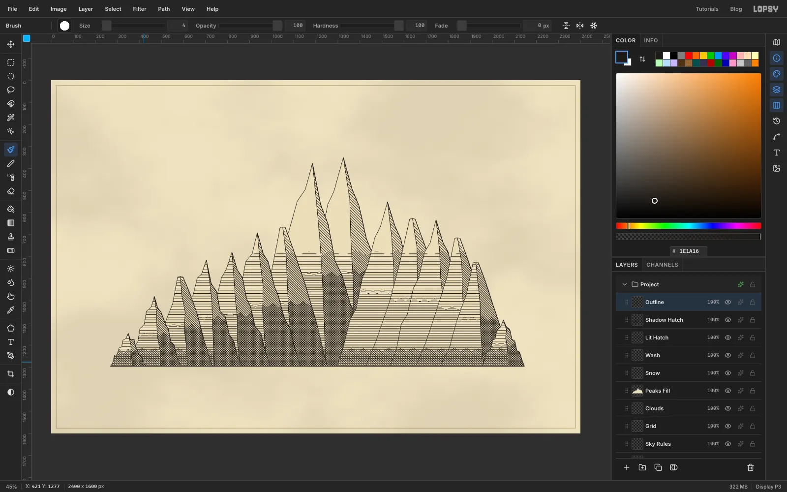

Carry on in height order. Here are the centre lines, with each summit worked out from the scale:

- Chimborazo x 1638 (y 626) and Denali x 1745 (y 633)
- Kilimanjaro x 1050 (y 665) and Elbrus x 935 (y 692)
- Popocatépetl x 1842 (y 714) and Mont Blanc x 820 (y 780)
- Matterhorn x 704 (y 815) and Rainier x 1925 (y 824)
- Fuji x 586 (y 889) and Olympus x 468 (y 980)
- Washington x 2050 (y 1087) and Ben Nevis x 350 (y 1147)

Make each base roughly 90 px wide plus half the peak's height in pixels. Give the volcanoes (Fuji, Kilimanjaro, Popocatépetl, Chimborazo and Rainier) smooth, concave slopes with a small flat crater top, and make the Matterhorn and K2 sharp horns.

That's the whole range in black and white, and it already reads as a chart. The tallest peaks stand in the middle, where the two hemispheres meet.

## Brighten the snow caps

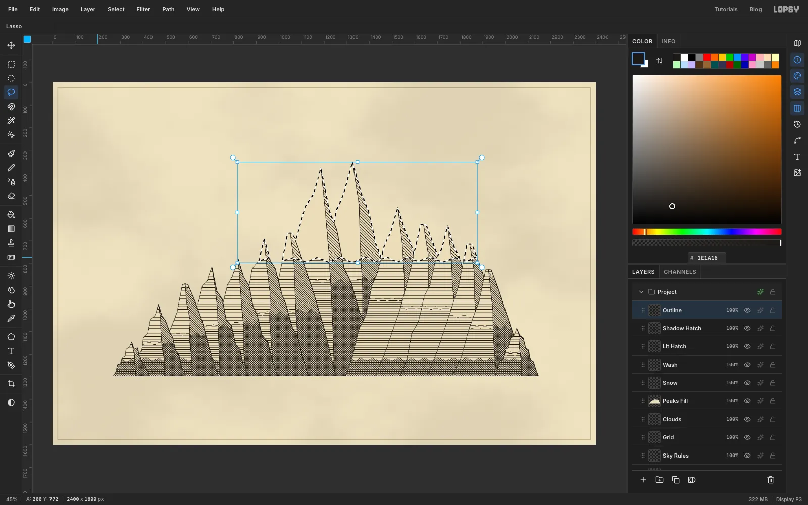

Hold [[Ctrl]] (or [[Cmd]] on a Mac) and click the *Peaks Fill* thumbnail to load the whole range as a selection. Then hold **Alt** and lasso everything below the same snow zigzag you used for the hatching. What's left is every summit above 15,700 ft.

Select *Snow* and fill with `#F8F4E8`, a little whiter than the paper.

## Hand-colour the altitude bands

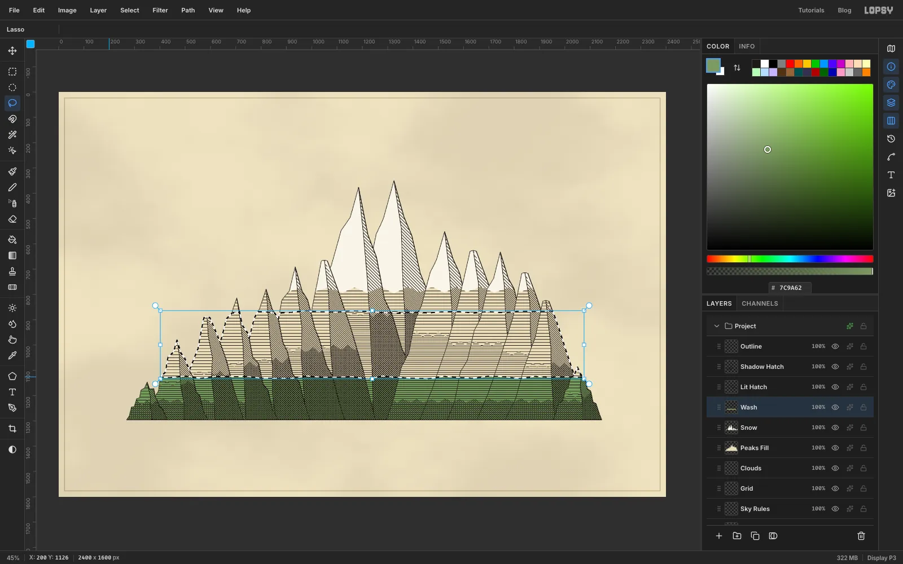

Colourists laid on flat washes, one band at a time. Do the same on *Wash*:

1. **Forest.** Ctrl/Cmd-click the *Peaks Fill* thumbnail. Shift+Alt lasso everything below a slightly wavy line at 5,000 ft (y 1128), and fill with `#7C9A62`.
2. **Rock.** Ctrl/Cmd-click again and Shift+Alt lasso below 13,000 ft (y 870). Then Alt lasso below 5,000 ft, keeping this line a few pixels *below* the first one so the bands overlap slightly and no paper gap opens up. Fills on the same layer simply replace each other, so the overlap is invisible. Fill with `#CFA968`.
3. **Crags.** Load the range once more, Shift+Alt the below-snow zigzag, Alt lasso below 13,000 ft (again a touch low), and fill with `#A8998A`.

## Set the washes to Multiply

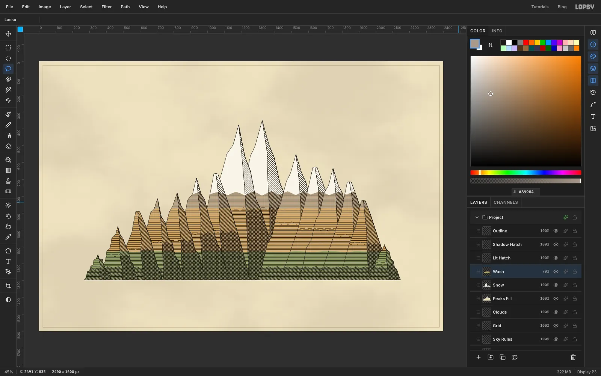

Deselect, open the layer effects drawer for *Wash*, set it to **Multiply**, and set its opacity to `70%`. The ink lines show through the colour, just as they would under real watercolour.

## Rule the sky and fade it with a mask

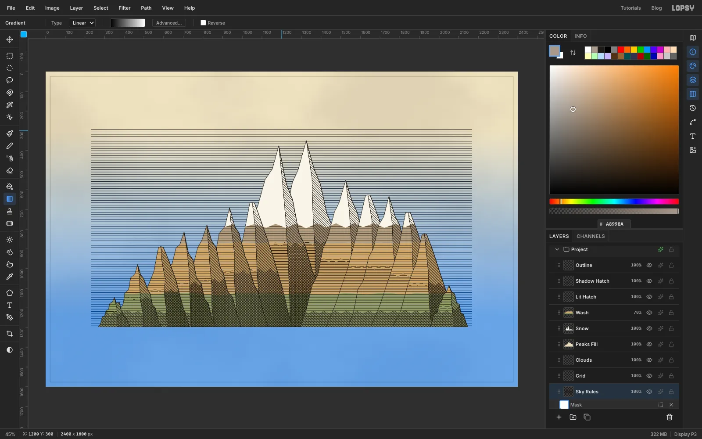

Engravers drew skies as fine horizontal rules that thin out towards the horizon.

1. Select *Sky Rules* and draw a marquee from x 232 to x 2168 (just inside where the scale bars will go), from y 290 down to the shoreline. Fill it with **Pattern 4**, then deselect.
2. Click **Add Mask** at the bottom of the Layers panel, then click the mask thumbnail (**Edit mask for Sky Rules**).
3. Pick the **Gradient** tool and open **Advanced…**. Set the stops to black on the left and white on the right.
4. Drag from just above the shoreline (y 1240) straight up to the top of the sky.

Click the layer's own row to leave mask editing, then set its opacity to `45%`. The ruling should be lighter than the mountains so the peaks stand forward.

Now add the height lines on *Grid*:

1. Set the **Brush** to Size `4`, then click **Open brush presets** and set **Spacing** to `200` on the **Shape** tab. Use colour `#5B4A39`.
2. Shift+click dotted lines across the chart at 5,000 (y 1128), 10,000 (y 967), 20,000 (y 643), 25,000 (y 482) and 30,000 ft (y 320). Leave out 15,000 ft, because the snow line will sit just above it.
3. Add one vertical dotted line at x 1457, the low point between Everest and Aconcagua, to divide the hemispheres.
4. Set Spacing back to `1` afterwards.

## Draw two ruled clouds

On *Clouds*, build a cumulus from overlapping ovals:

1. Draw one **Elliptical Marquee**, then hold **Shift** while you add five more: a few round puffs on top and one long flat oval underneath.
2. Hold **Alt** and drag a rectangle across the bottom to slice it flat.
3. Fill with `#F3ECDA`, then add **Pattern 4**.
4. Shift+Alt a rectangle over the lower third, fill it with the paper colour again, and add **Pattern 1**, so the underside is darker.
5. Add a second, smaller cloud near the top of the sky, just right of the hemisphere divider.
6. Deselect and give the layer a **Stroke** effect, `2` px in ink.

## Build the striped scale bars

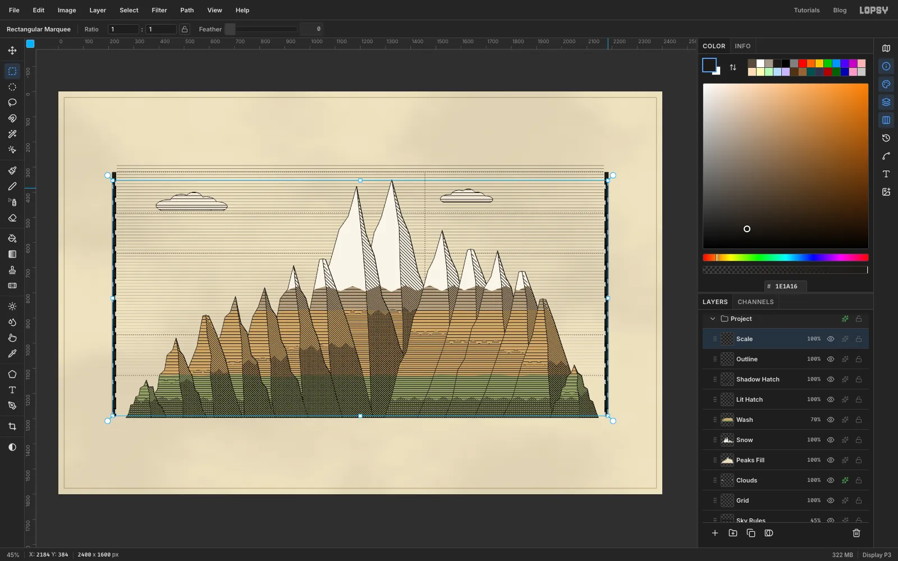

Select *Outline* and add a layer called *Scale*.

1. Fill two bars 16 px wide, running from 30,000 ft (y 320) down to the shoreline. Put the left one at x 214 and the right one at x 2170.
2. Draw a marquee just inside the left bar covering the 0–1,000 ft segment. Then hold **Shift** and add the same for 2,000–3,000, 4,000–5,000 and so on up both bars. Each segment is 32.3 px tall.
3. Fill with `#F3ECDA`. The bars become a classic striped scale.
4. With the Brush at Size `3`, Shift+click a short tick on the outside of each bar every 5,000 ft.

## Add the sea, the snow line and the frame

1. **Sea.** Add a layer called *Sea*. Fill a strip from the shoreline down to y 1345 across the whole chart with `#C7D2CD`, add **Pattern 1**, and draw a 4 px ink coastline along its top.
2. **Snow line.** Add a layer called *Snow Line*. Set the Brush to Size `5`, Spacing `220` and colour `#A3312A`, and Shift+click one dotted red line across the chart at 15,700 ft (y 782).
3. **Frame.** Add a layer called *Border*. Make each rule by filling a rectangle and then deleting a slightly smaller one inside it.

For the frame, make a 10 px rule 48 px in from the canvas edge and a 2 px rule 20 px inside that. Then add a 3 px frame round the chart itself, from x 120 to 2280 and from y 288 to 1347.

## Turn a square into a corner diamond

Add a layer called *Corner Ornament*. Over the top-left corner of the heavy rule:

1. Fill a 44 px square with ink.
2. **Shrink** it by `5` and fill with paper.
3. **Shrink** by `5` again and fill with ink.

Draw a marquee just around the square and switch to the **Move** tool. Grab the rotation handle beside a corner and drag it round to 45°. On a Mac, hold [[Cmd]] while you drag so the angle snaps in 15° steps. Then press [[Ctrl+D]] to commit.

## Copy it to the other three corners

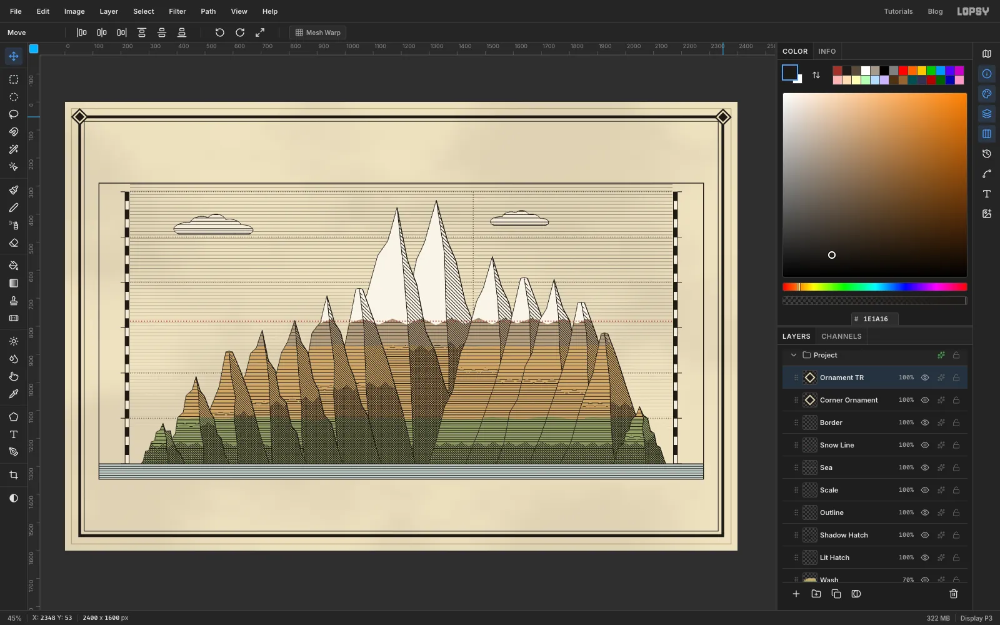

Marquee the diamond, press [[Ctrl+C]], then [[Ctrl+V]]. The copy is pasted in place as a new layer. Drag it with the **Move** tool to the top-right corner of the heavy rule, then paste and drag twice more for the bottom corners.

When all four are placed, select the copy just above *Corner Ornament* and choose **Layer → Merge Down**. Repeat until the four diamonds are on one layer.

## Engrave a balloon at 23,018 feet

A period chart loved a curiosity. Gay-Lussac's 1804 balloon ascent reached 23,018 ft, higher than any person had climbed. Select *Corner Ornament* and click **New Group**, rename the group *Balloon*, and add a layer called *Balloon Envelope* inside it.

1. Draw an elliptical marquee about 72 × 88 px, centred at x 1975 and y 462.
2. Shift+lasso a short cone under it.
3. Fill with paper.
4. Hold **Alt** and drag an oval offset up and to the left of the envelope. That leaves a crescent on the right.
5. Fill the crescent with **Pattern 2** for the shadow.
6. Deselect and add a `3` px ink **Stroke** effect.

## Rig the balloon and mark its height

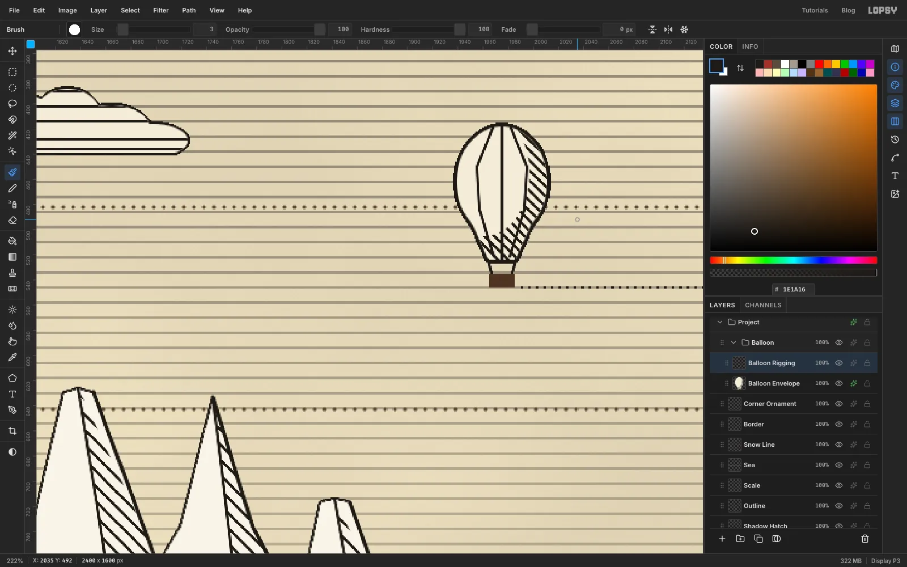

On a new *Balloon Rigging* layer, use the Brush at Size `3`:

1. Draw three gores down the envelope. Build each one from three or four short Shift+click segments that bow outward.
2. Shift+click two ropes down to the basket.
3. Fill a small basket in `#4A3524`, with its bottom exactly at 23,018 ft (y 546).
4. With Spacing `200`, Shift+click a dotted line from the basket to the right scale bar, so the height can be read off the scale.

## Label every peak

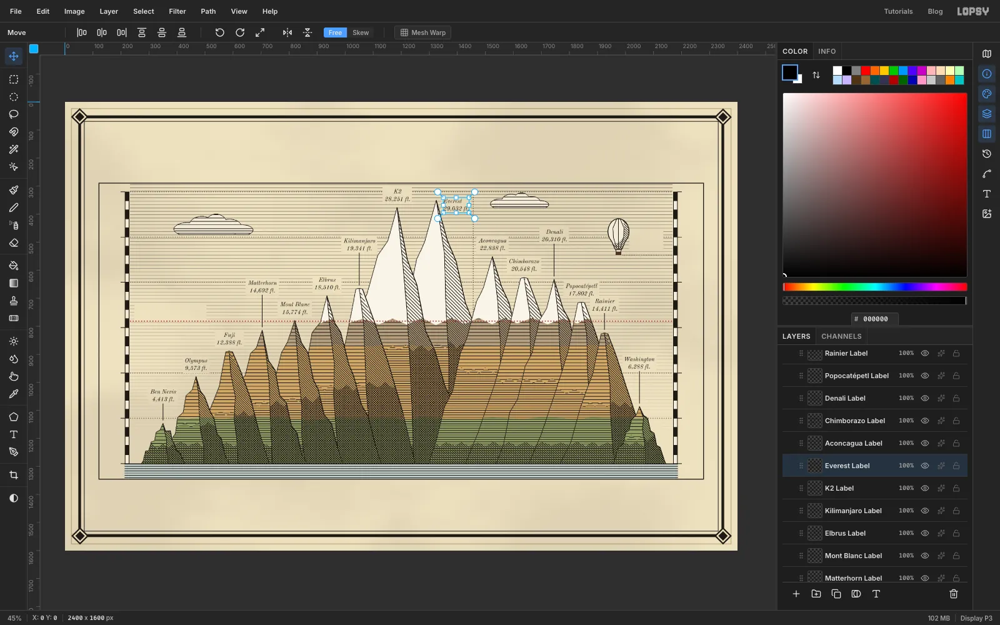

Select *Corner Ornament* again, add a group called *Peak Labels*, and add a layer called *Leaders* inside it. With *Leaders* selected, choose the **Text** tool and set its options before you click the canvas: **Old Standard TT**, Style **Italic**, Size `21` and Align **Center**. In the **Text** panel, set Line height to `1.3`.

For each peak, drag a text box above its summit and type two lines: the name, then the height (for example *Everest* / *29,032 ft.*). Name each layer after its peak, such as *Everest Label*. Seat the labels consistently:

- **Centre each label over its summit, with 20 px of air** between the bottom of the height and the peak.
- **Where a neighbour or a slope is in the way, raise the label by one or two label heights** (about 56 px each). Then draw a thin leader line straight down to the summit on *Leaders* with the Brush at Size `3`. Matterhorn, Kilimanjaro, Denali, Rainier, Washington and Ben Nevis need one.
- **Everest is too close to the top of the frame**, so set its label just to the right of the summit.
- **Two labels side by side at the same height can read as one line.** Keep at least 70 px between them, or stagger them.

## Set the scale figures and captions

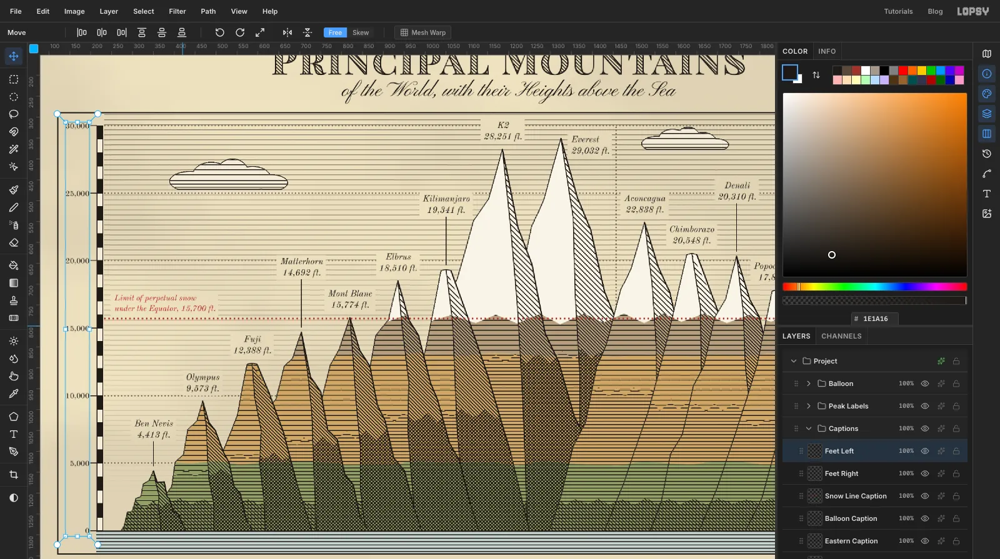

First tidy the margins. On *Sea*, marquee the two narrow strips outside the scale bars and press [[Delete]], so the figures will sit on bare paper.

Select *Corner Ornament*, add a group called *Captions*, and add an empty layer called *Caption Anchor* inside it. With the anchor selected, new text layers land inside the group.

For the left scale (*Feet Left*), choose **Old Standard TT**, Style **Normal**, Size `18` and Align **Right**. Drag a tall text box in the margin left of the bar and type one figure per line: `30,000`, `25,000`, `20,000`, `15,000`, `10,000`, `5,000`, `0`.

In the **Text** panel, set **Line height** to `1.25` and **Paragraph spacing** to `139`. Each line then advances 22.5 + 139 = 161.5 px, which matches the 5,000 ft spacing of the ticks. Nudge the block with the arrow keys until `30,000` is centred on the top tick. Make a left-aligned copy for the right scale and call it *Feet Right*.

> **Tip:** Text panel changes also become the Text tool's defaults. Set Paragraph spacing and Letter spacing back to `0` before typing the next caption.

Then add the rest:

- **Snow-line caption.** In **Old Standard TT** Italic, 19 px, carmine `#A3312A`: "Limit of perpetual snow / under the Equator, 15,700 ft." Put it in the clear sky just above the red line at the left.
- **Balloon caption.** "Gay-Lussac's / balloon, 1804 / 23,018 ft." in 18 px italic beside the balloon.
- **Hemisphere captions.** EASTERN HEMISPHERE and WESTERN HEMISPHERE at 20 px with Letter spacing `6`. Centre each under its half of the chart, either side of the divider.

## Set the title type

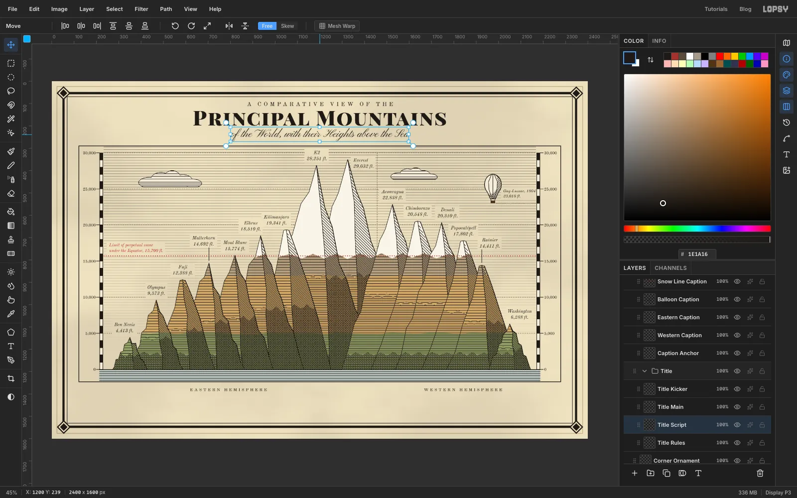

Select *Corner Ornament*, add a group called *Title*, and add a layer called *Title Rules* inside it. Create three centred text layers:

1. **Title Kicker.** "A COMPARATIVE VIEW OF THE" in **Old Standard TT** at `26` px with Letter spacing `10`.
2. **Title Main.** "Principal Mountains" in **Playfair Display SC** Black (`900`) at `92` px with Letter spacing `4`. The small-caps face turns it into PRINCIPAL MOUNTAINS.
3. **Title Script.** "of the World, with their Heights above the Sea" in **Pinyon Script** at `50` px.

Keep about 20 px between the script's descenders and the chart frame.

On *Title Rules*, Shift+click a pair of thin rules on each side of the kicker with the Brush. Lasso a small diamond at each outer end and fill it.

## Hollow out the capitals

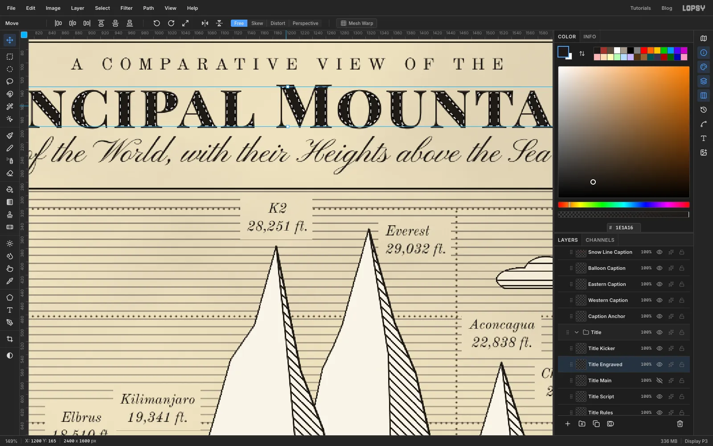

Solid black capitals look modern. Period title lettering was outlined and filled with fine hatching:

1. Select *Title Main* and click **Duplicate Layer** at the bottom of the Layers panel.
2. Click **Rasterize Layer** on the copy and rename it *Title Engraved*.
3. Hide *Title Main* with its eye icon.
4. Ctrl/Cmd-click the *Title Engraved* thumbnail to select the letters.
5. Choose **Select → Shrink…** by `3`.

## Hatch the inside of the letters

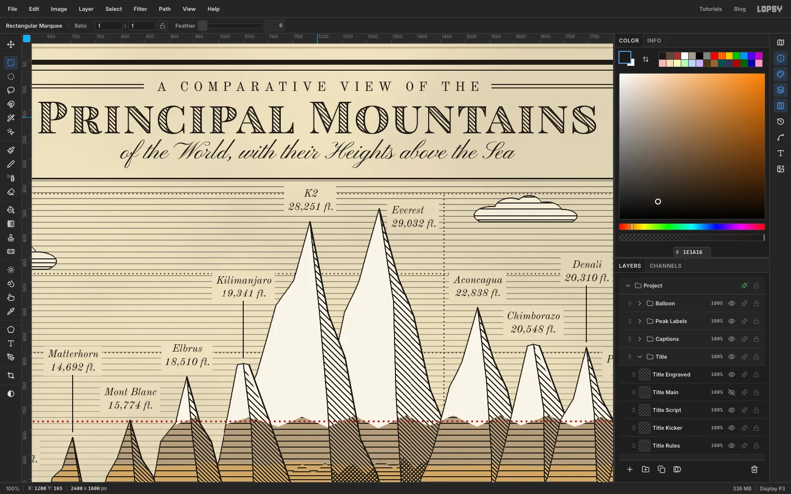

Press [[Delete]] to clear the inside of the letters, leaving a 3 px outline. Then choose **Edit → Fill with Pattern…** and pick **Pattern 2**. The diagonal hatching fills only the hollowed letters, so you get engraved, shaded capitals that still read from across the room.

## Build the legend swatches

Select *Corner Ornament*, add a group called *Legend*, and add a *Legend Swatches* layer inside it. Make four 56 × 38 swatches in a row along the bottom. Fill each with the colour its band actually shows on the chart, which is the wash multiplied over the paper at 70%:

- forest `#95A06C`
- rock `#CAA96F`
- crags `#B19F81`
- snow `#F8F4E8`

Add **Pattern 1** to the first two and **Pattern 4** to the third, so they look like the hatched slopes.

For the keylines:

1. Drag a marquee 2 px larger than the first swatch.
2. Alt+drag the swatch itself out of it, leaving a thin frame.
3. Do the same for the other three swatches, holding **Shift** for each outer rectangle so it adds to the selection.
4. Fill the selection with ink.

Add a short red dotted sample of the snow line as the fifth key.

## Label the legend and add the footnote

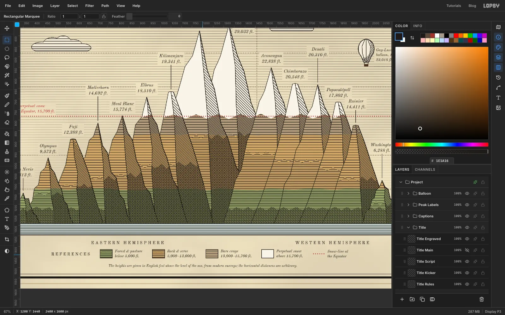

Label each key in 18 px italic:

- "Forest & pasture / below 5,000 ft."
- "Rock & scree / 5,000–13,000 ft."
- "Bare crags / 13,000–15,700 ft."
- "Perpetual snow / above 15,700 ft."
- "Snow-line at / the Equator"

Set REFERENCES to the left of the swatches with Letter spacing `5`, vertically centred on them. Finish with a one-line italic footnote centred under the legend: "The heights are given in English feet above the level of the sea, from modern surveys; the horizontal distances are arbitrary." A good chart always says where its numbers came from.

> **Tip:** At fit-to-screen zoom, the scale handles of a short text layer can cover most of it. To move a one-line caption, select its row and nudge it with the arrow keys ([[Shift]] for 10 px steps) rather than dragging it.

## Cut the sky ruling behind the lettering

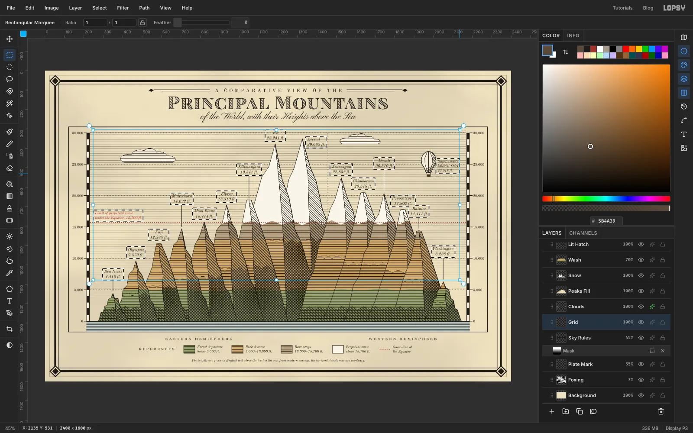

Lettering over ruled lines is hard to read, and an engraver simply didn't cut lines behind the words. Do the same:

1. Draw a rectangular marquee around the first peak label, about 8 px larger than the type on every side.
2. Hold **Shift** and add one for every other peak label, plus the snow-line and balloon captions.
3. Select *Sky Rules* and press [[Delete]], then select *Grid* and press [[Delete]].
4. Deselect.

The words now sit in clean paper, and the plate is finished.
