Before photography could be printed, the pictures in bird books were
**etchings and engravings**. An artist cut lines into a copper plate. Ink
held in those lines printed the picture, and a colourist then washed
watercolour over each copy by hand. The engraver had no grey: every tone
was a line. Thick lines sitting close together read as dark, and thin lines
far apart read as light.

In this tutorial you'll get that look from a photo for a birthday card
called **The Imperial Quail**. The card is 1400 × 1960 px. A California
quail stands on a post inside an oval of ruled lines, with "Many Happy
Returns" engraved below it. Under the plate are pencil notes, the way a
printmaker signs a proof.

The trick behind the line work is simple. Lay a layer of soft stripes over
the photo at half opacity and run **Threshold**. Where the photo is dark,
the stripes fatten into heavy lines. Where it's light, they thin to
hairlines or vanish. You'll do it three times: flat rules for the sky, a
diagonal set for the bird, and an upright set for the post. Then you'll add
a second, crossing set in the deepest shadows.

The tools you'll meet along the way:

- **Magic Wand** with [[Shift]] to add and **Lasso** with [[Alt]] to subtract, plus **Select → Inverse** for a clean cut-out
- **Desaturate**, **Hue/Saturation**, **Brightness/Contrast** and **Unsharp Mask** to prepare the photo
- linear and radial **gradients**, and a scaled selection for an oval fade
- **Edit → Define Pattern** and **Fill with Pattern** for stripe tiles
- the **Move** tool's rotate handle and **Mesh Warp** to bend the hatching
- **Threshold**, the **Multiply** and **Lighten** blend modes, and **Merge Down**
- **Selection → Path** and **Stroke Path** for an engraved outline
- **Clouds**, **Add Noise** and **Emboss** for the paper and the plate
- the **Brush** with Taper, the **Pencil** with [[Shift]]-click lines, and the **Eraser**
- **Pinyon Script**, **IM Fell English SC**, **IM Fell English** italic and **La Belle Aurore**
- **groups**, copy and paste, **Flip Horizontal**, and undo / redo

The palette is sepia ink on cream paper, with soft watercolour washes:

- Paper `#F4EAD8`, plate tone `#E6DCC8`, wiped highlight `#F3ECDD`
- Etching ink `#2D1D14`
- Slate wash `#8C97A3`, chestnut `#A0603A`, buff `#D9B77E`, umber `#8A6A4A`
- Sky wash `#C9D6DC`
- Plate shadow `#BCAE92`, plate highlight `#FFFBF2`
- Graphite `#6E6E6E` (the pencil notes)

The bird is a public-domain photo from the U.S. Fish and Wildlife Service:
*California Quail* on Wikimedia Commons. Any bird photo shot against a soft,
out-of-focus background will work the same way.

## Create the card and mark out the plate

Choose **File → New**, set **Width** to `1400` and **Height** to `1960` in
**Pixels**, keep the **White** background and click **Create**.

Now mark where the copper plate will sit. With the rulers showing, click
the top ruler at 130, 700 and 1270 to drop vertical guides for the plate's
left edge, its centre and its right edge. Then click the left ruler at 120
and 1720 for the top and bottom of the plate. Watch the ruler readout, or
zoom in a little, to land close to those numbers; a few pixels either way
doesn't matter. The plate is pushed towards
the top, which leaves a deep margin underneath for the pencil notes. A real
print is matted the same way.

## Paste the photo

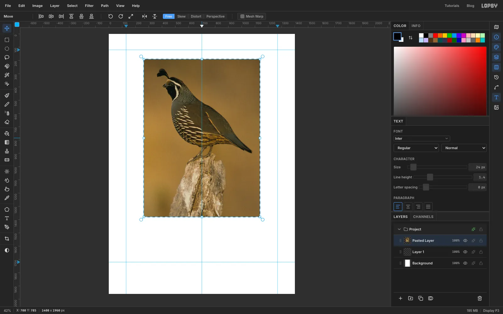

The photo used here is
[California Quail (9405494428)](https://commons.wikimedia.org/wiki/File:California_Quail_(9405494428).jpg)
from Wikimedia Commons. Crop it to the bird and its perch in any image
viewer, about 875 × 1190 px, copy it and press [[Cmd+V]] in Lopsy. The photo arrives as a new layer, selected
and ready to move. Drag it up so the bird's head sits about a fifth of the
way down the plate and the post is roughly centred on the middle guide.
Press [[Cmd+D]] to drop the selection, then double-click the layer name and
rename it **Quail Photo**.

## Select the background with the Magic Wand

Pick the **Magic Wand**. Set **Tolerance** to `34` and turn **Contiguous**
on. Click the ochre background to the left of the bird. Then hold
[[Shift]] and click each patch the first click missed: behind the tail, on
both sides of the post, above the head, and between the legs. Shift adds
each new area to the selection.

## Take the post and legs back out

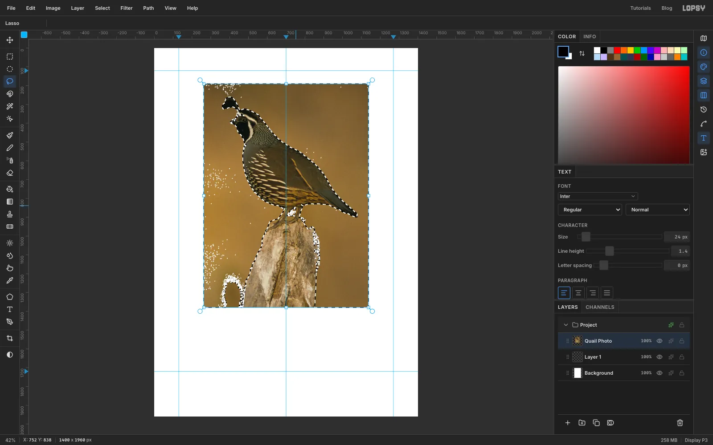

A soft background and a sunlit post are close in colour, so the wand
always grabs some of the post as well. Fix that with the **Lasso**. Hold
[[Alt]] and draw round the whole post to subtract it from the selection.
Do the same round each thin leg. Without the legs the bird would float
above its perch.

Press [[Delete]] to clear the background, then [[Cmd+D]].

## Clean up the edges

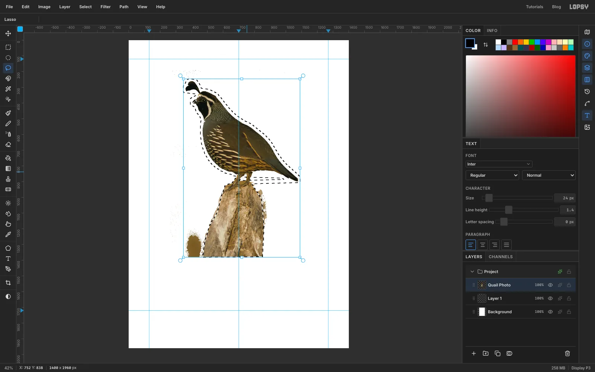

The wand leaves specks of background in the feathers' fringe. Draw a loose
**Lasso** a little way outside the bird and post, hold [[Shift]] and add
loops round the legs. Choose **Select → Inverse** and press [[Delete]]
again. Everything outside your loose outline goes, and the bird is left
clean. Press [[Cmd+D]].

If small patches of background are still caught between the legs, click
each one with the Magic Wand and press [[Delete]].

## Turn the photo into clear grey tones

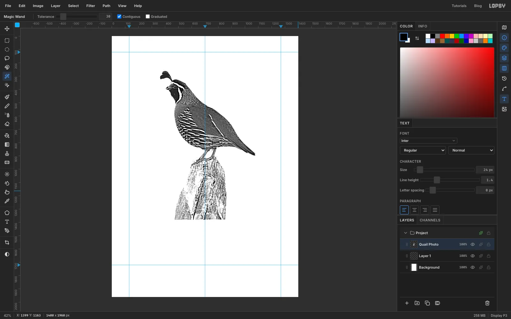

An etching needs a clear range from light to dark, so prepare the photo
first:

1. **Filter → Desaturate** removes the colour.
2. **Filter → Hue/Saturation**, **Lightness** `20`, lifts the dark bird.
3. **Filter → Brightness/Contrast**, **Contrast** `35`, separates the
   feather markings.
4. **Filter → Unsharp Mask**, **Radius** `6`, **Amount** `1.8`, sharpens
   the scalloped breast and the stripes on the flank.

## Darken the post

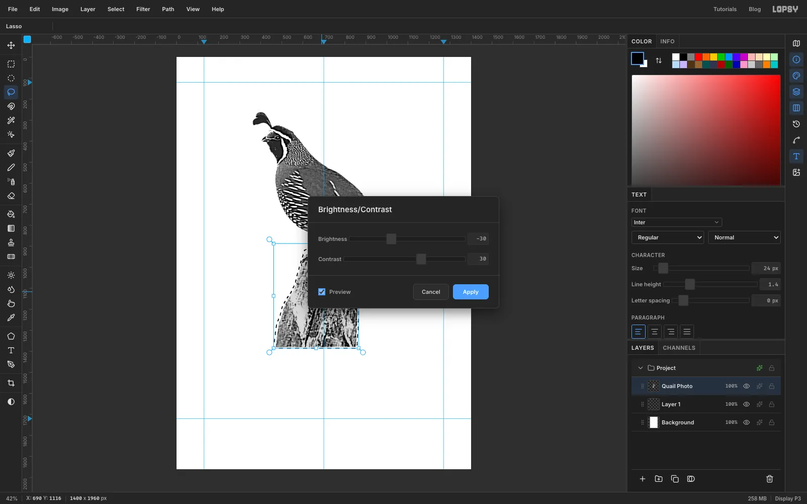

The post is now much paler than the bird and would engrave as almost
nothing. Lasso round the post, open **Filter → Brightness/Contrast**, set
**Brightness** to `-30` and **Contrast** to `30`, and tick **Preview** to
check it. Click **Apply**, then [[Cmd+D]].

## Fade out the foot of the post

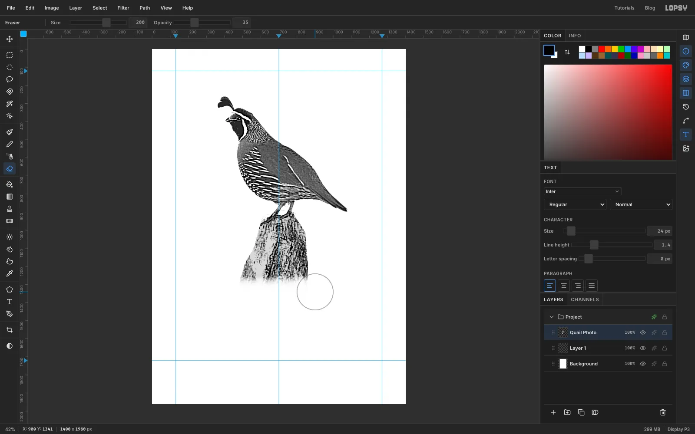

Pick the **Eraser**, set **Size** to `200` and **Opacity** to `35`, and
drag four slow horizontal strokes across the bottom of the post. Each
stroke removes a little more, so the post dissolves into the paper instead
of ending in a hard cut. Engravings of birds on perches nearly always fade
out like this.

## Lay in the sky

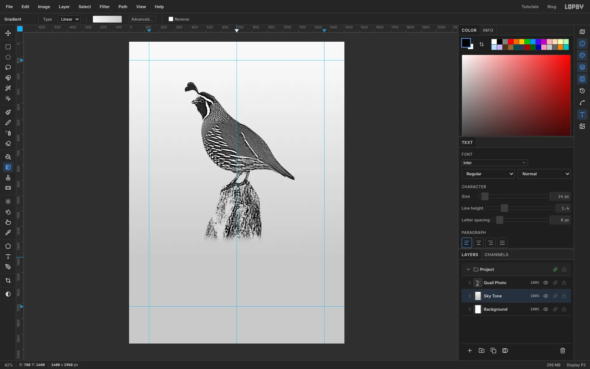

Click the empty **Layer 1** that came with the new document (it sits under
the photo) and rename it **Sky Tone**. Pick
the **Gradient** tool, set the type to **Linear**, and in **Advanced…**
make the stops `#F7F7F7` and `#C8C8C8`. Drag from just below the top of the
plate down to the foot of the post. This tone becomes the ruled sky: dark
grey turns into thick rules, light grey into hairlines.

## Fade the sky into an oval

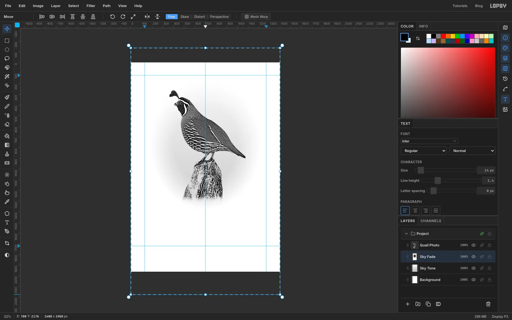

Click **Add Layer** and name it **Sky Fade**. In the Gradient tool's
**Advanced…** editor, make three white stops: `0%` opacity at the left end,
`0%` opacity at about `58%`, and `100%` opacity at the right end. Set the
type to **Radial** and drag from the middle of the bird straight out to the
right-hand plate guide. You get a clear circle with white outside it.

The picture is taller than it is wide, so stretch the circle. Choose
**Select → All**, switch to the **Move** tool, and drag the top-middle
handle up and the bottom-middle handle down until the white just covers
the corners of the plate. Press [[Cmd+D]].

## Leave a margin of paper round the bird

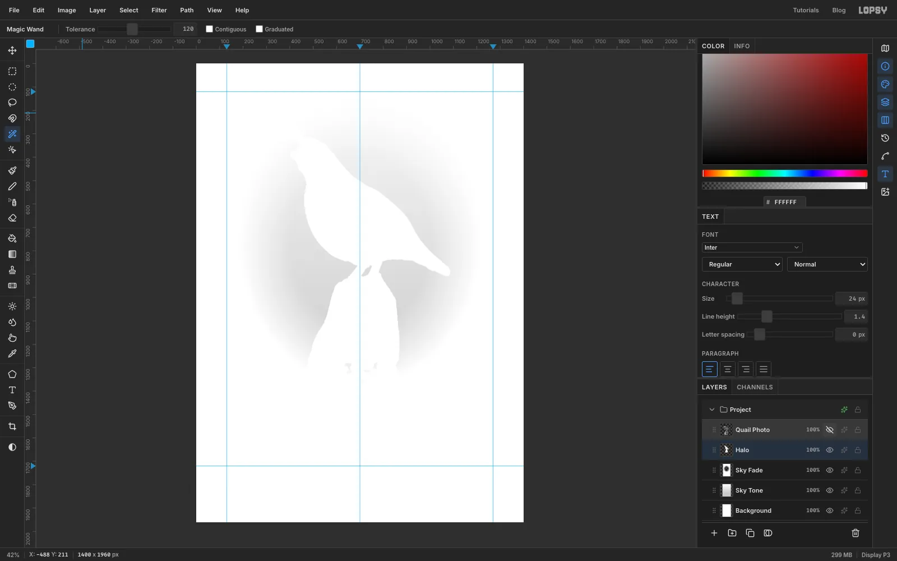

Engravers stop the background lines just short of the subject so it stands
out. Click **Add Layer** and name it **Halo**.

You'll select the bird several times from here on, always the same way:
click the **Quail Photo** row, pick the **Magic Wand**, turn **Contiguous**
off, set **Tolerance** to `120`, click the empty area around the bird and
choose **Select → Inverse**. The wand only looks at the layer you've
clicked, but the selection it makes stays put when you click another
layer, so you can then switch to the layer you want to work on.

Select the bird that way, then click back on **Halo**. Then
choose **Select → Shrink** `4` and **Select → Grow** `13`. The shrink gets
rid of stray specks before the grow pushes the edge out. On the Halo layer
choose **Edit → Fill** with white and press [[Cmd+D]].

## Flatten everything into one tone layer

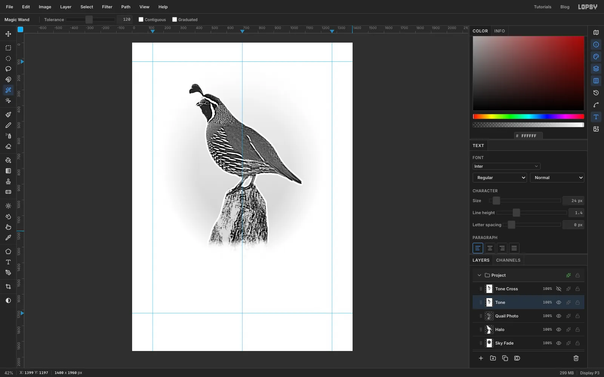

With the **Quail Photo** row selected, choose **Select → All**, then
**Edit → Copy Merged** and [[Cmd+V]]. Name the new layer **Tone**. Repeat
the paste and name the copy **Tone Cross**, then hide it with its eye icon.
You'll use it later for the cross-hatching.

Select the bird again from **Quail Photo**, choose **Select → Grow** `9`
and then **Select → Inverse**, and click back on **Tone**. Run
**Filter → Add Noise** at **Amount** `6` with **Mono** and **Gaussian**.
That slight grain makes the sky rules break up gently as they fade out
towards the edge, the way worn plate lines do.

## Draw the stripe tiles

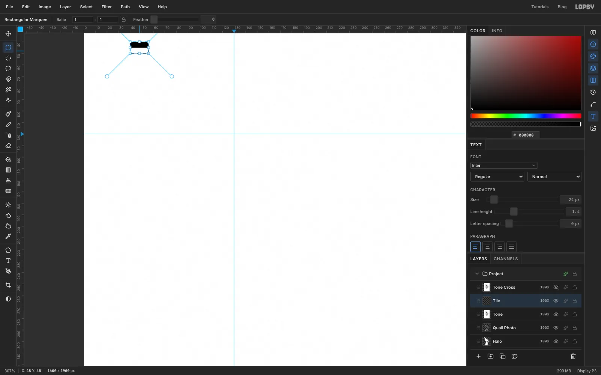

All the hatching comes from two tiny stripe tiles. Click **Add Layer** and
zoom in on the top-left corner.

1. With the **Rectangular Marquee**, select a bar 16 px wide and 5 px tall
   and **Edit → Fill** it black.
2. Marquee the bar plus 5 px of empty space below it (16 × 10) and choose
   **Edit → Define Pattern**. That's a coarse stripe for the sky and the
   post.
3. Beside it, fill a 16 × 3 bar, marquee it with 3 px of space below
   (16 × 6) and **Define Pattern** again. That's a fine stripe for the
   bird.

Delete the tile layer when you're done.

## Fill a layer with stripes

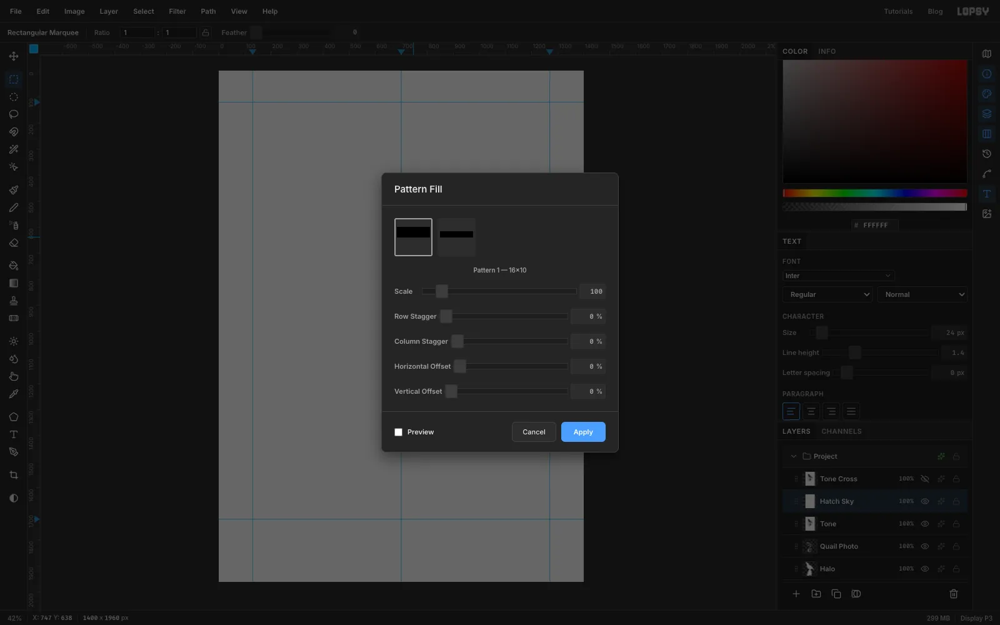

Click **Add Layer** above **Tone** and name it **Hatch Sky**. Choose
**Edit → Fill** with white, then **Edit → Fill with Pattern…**. Pick the
16 × 10 tile and click **Apply**. Run **Filter → Gaussian Blur** at
**Radius** `3`. The blur turns each hard stripe into a soft ridge, and the
soft ridge is what lets Threshold make thick and thin lines later.

Add another layer, **Hatch Bird**, and do the same with the fine 16 × 6
tile and a Gaussian Blur of `2`.

## Turn the bird's hatching

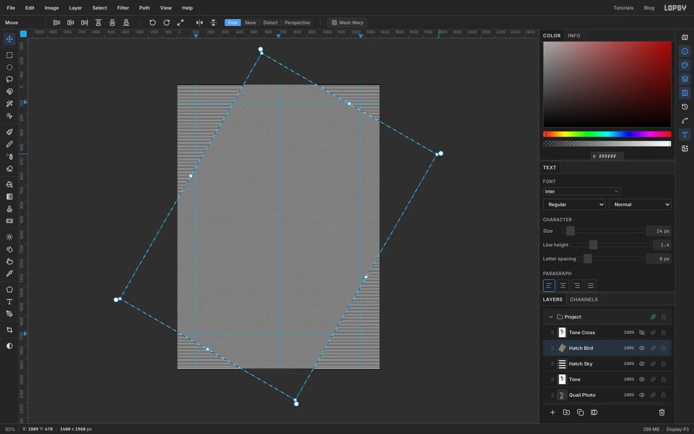

Lines that run with the form make an engraving. Zoom out so the whole page
fits with room around it. On **Hatch Bird**, choose **Select → All**,
switch to the **Move** tool, hold [[Cmd]] and drag the rotate handle just
outside a corner. [[Cmd]] snaps to 15° steps, so stop at **30°**. The lines
now slope down along the bird's back. Press [[Cmd+D]] to apply. The empty
corners don't matter, because you'll only keep the stripes inside the
bird.

## Bend the lines round the body

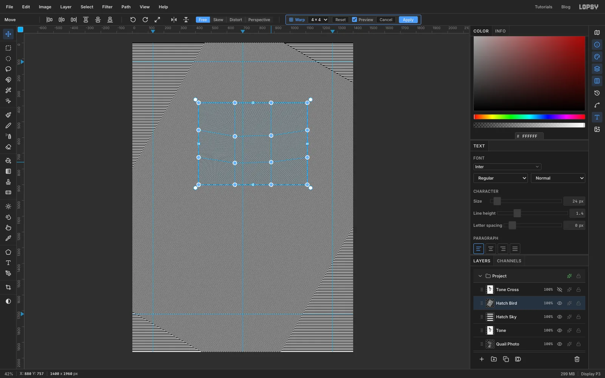

Straight lines make the bird look flat. The stripe layers are opaque, so
first hide **Hatch Sky** and drop **Hatch Bird** to about 40% so you can
see the bird underneath. Marquee the bird's body. On the
Move tool's options bar click **Mesh Warp**, keep the **4 × 4** grid and
tick **Preview**. Drag the four inner points down by about 30–40 px. The
stripes bow downward through the middle of the body, so they follow the
curve of the breast. Click **Apply**, set **Hatch Bird** back to 100% and
show **Hatch Sky** again.

## Give the bird and the post their own lines

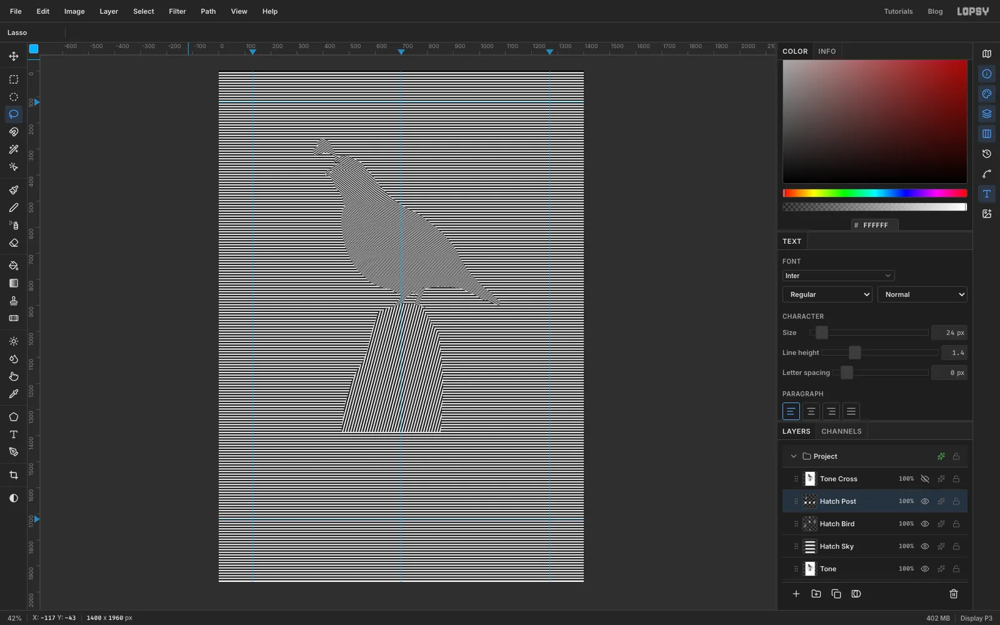

Now give each part of the picture its own set of lines:

The sky rules can stay as they are; the tone underneath decides where they
show. The bird and the post need trimming:

1. Click **Quail Photo** and Magic Wand the empty area around the bird.
   That selects everything *except* the bird.
2. Hold [[Shift]] and lasso round the post to add it, click **Hatch Bird**
   and press [[Delete]]. Only the bird keeps its diagonals.
3. Add a **Hatch Post** layer. Fill it with the coarse stripes, blur it by
   `3` and rotate it **−75°** so the lines run almost straight up, like
   wood grain.
4. Lasso the post, **Select → Inverse**, and [[Delete]].

## Lay the stripes over the tone

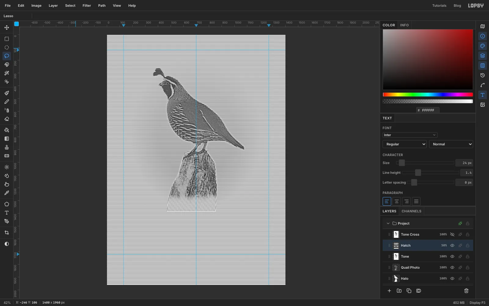

Click **Hatch Post** and choose **Layer → Merge Down**. Then click
**Hatch Bird** and **Merge Down** again, so all three sets of stripes are
on one layer. Rename it **Hatch** and set its opacity to **50%** with the
opacity button on its row. Through the half-transparent stripes, the
photo's darks and lights are still visible.

## Run Threshold

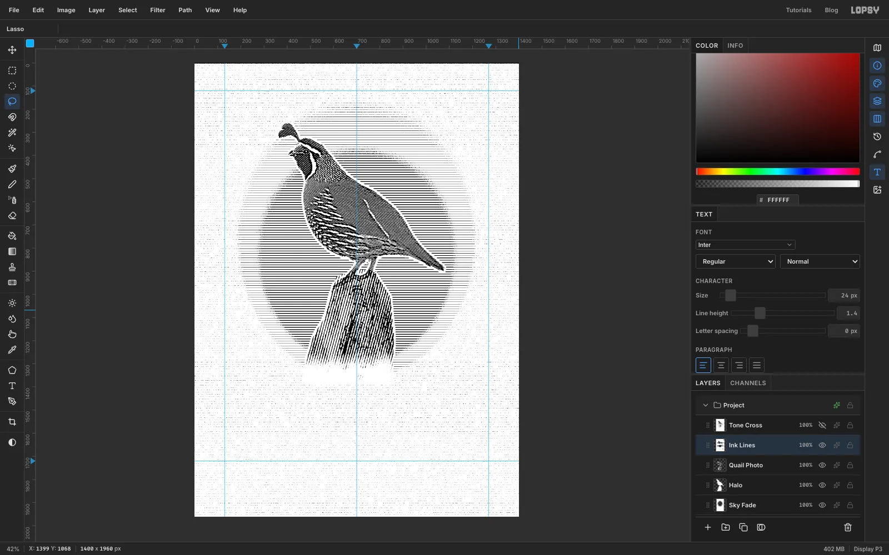

With **Hatch** selected, choose **Layer → Merge Down** once more to bake
the stripes into **Tone**. Rename the result **Ink Lines** and run
**Filter → Threshold** at **Level** `128`. Every pixel becomes black or
white. In the dark feathers the soft ridges cross the halfway point early,
so the lines swell. In the pale sky they barely cross it, so the rules thin
to hairlines. That is the engraving.

To tidy the edge of the page, select an ellipse slightly bigger than the
sky oval, choose **Select → Inverse** and **Edit → Fill** with white to
remove any stray specks outside it.

## Add cross-hatching in the shadows

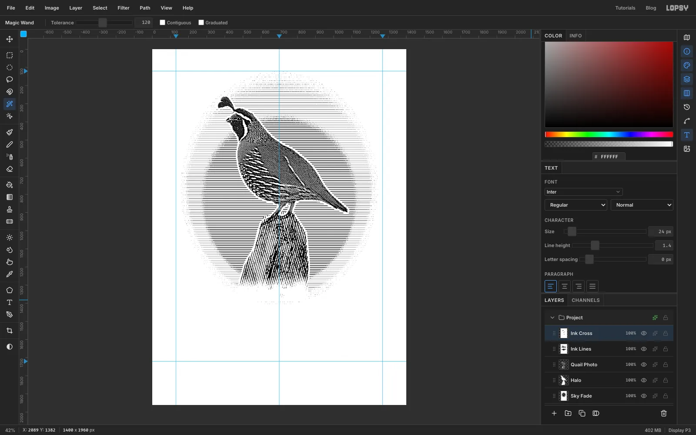

Show **Tone Cross** and hide **Ink Lines**. Brighten it with
**Filter → Brightness/Contrast**, **Brightness** `60`, so only the deepest
shadows are still dark.

With **Tone Cross** selected, click **Add Layer** so the new layer sits
right above it. Make it exactly like **Hatch Bird**: fill with white, **Fill
with Pattern** using the fine tile, **Gaussian Blur** `2`, then
**Select → All** and rotate it **−60°** with [[Cmd]] held. Select
everything outside the bird (Magic Wand the empty area on **Quail Photo**)
and delete it from the new layer. Set it to **50%**, **Merge Down** and run
**Threshold** `128`, as before. Only the dark mask,
throat and flanks get crossing lines.

Name the result **Ink Cross**, show **Ink Lines** again, set **Ink Cross**
to **Multiply** in the layer effects drawer's blend menu, and
**Merge Down**. Name the merged layer **Etching**.

## Engrave an outline

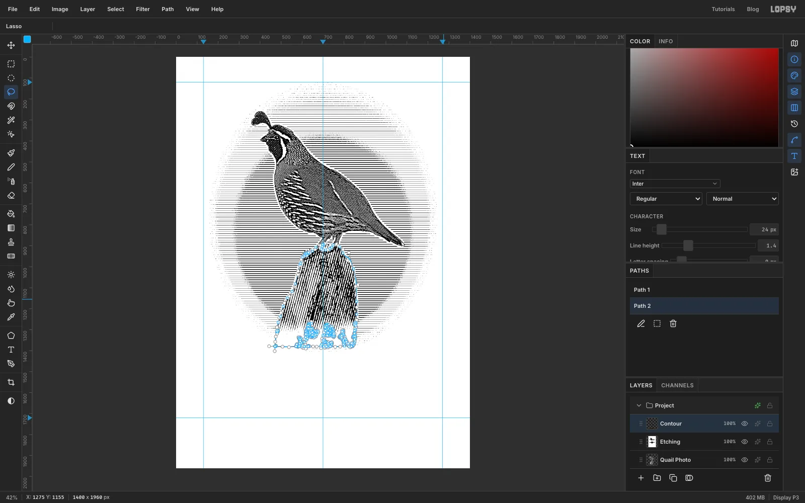

A crisp outline holds the shape together. Select the bird *without* the
post: Magic Wand the empty area on **Quail Photo**, **Select → Inverse**,
then hold [[Alt]] and lasso out the post. Choose **Select → Selection → Path**. Then
make a selection of just the post and convert that too. Converting the two
parts one at a time gives you two clean paths that you can stroke
separately.

Add a layer called **Contour**. In the **Paths** panel select each path,
click **Stroke Path**, and set **Width** to `2` with black. Marquee the
faded bottom of the post and delete the outline there so it fades with the
post. Then **Merge Down** the Contour into **Etching**.

## Print it in sepia ink on cream paper

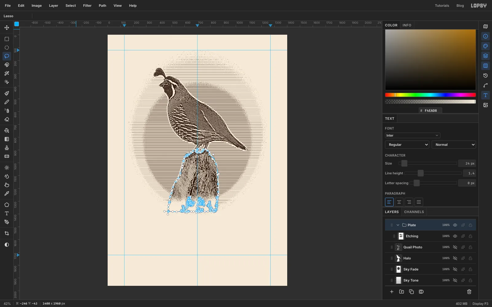

Black ink looks digital. Add a layer above **Etching**, fill it with
`#2D1D14` and set it to **Lighten**: black lines turn brown and white stays
white. **Merge Down**, run **Gaussian Blur** `1` to soften the pixel edges
the way ink spreads into paper, and set **Etching** to **Multiply**.

Hide **Quail Photo**, **Halo**, **Sky Fade** and **Sky Tone**. Fill the
**Background** with the paper colour `#F4EAD8`. With **Etching** selected,
choose **Layer → Group Layers** and name the group **Plate**.

## Give the plate its tone

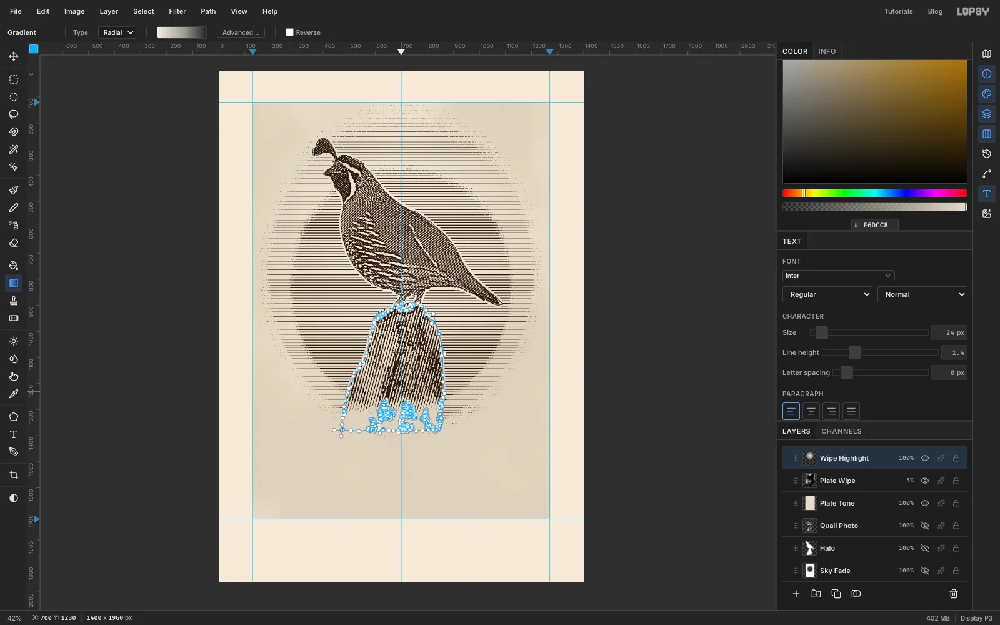

When an etching is printed, a thin film of ink is left on the plate. That
makes the plate area a shade darker than the margin, and printers wipe a
lighter patch where they want the eye to go.

1. Add a **Paper Grain** layer just above the Background. Fill it with
   `#808080` and run **Add Noise** `30` (Mono, Gaussian), **Gaussian Blur**
   `1` and **Emboss** at `135°`, Strength `30`. Set it to **Overlay** at
   **35%**.
2. Above the hidden photo, add **Plate Tone**. Marquee from guide to guide,
   round the corners with **Select → Shrink** `14` then **Grow** `14`, and
   fill with `#E6DCC8`.
3. Keep that selection active, add **Plate Wipe** and run
   **Filter → Clouds**. Set the layer to **Multiply** and turn it down to
   **5%**, then press [[Cmd+D]].
4. Add **Wipe Highlight**. In the gradient's **Advanced…** editor, make
   both stops `#F3ECDD` and drag the right stop's opacity to 0, as you did
   for the oval fade. Drag a **Radial** gradient from the bird's middle down
   to the foot of the post.

You may still see the anchor points of the two outline paths on the post,
as in the screenshot. Delete both paths in the **Paths** panel when you're
done.

## Press in the plate mark

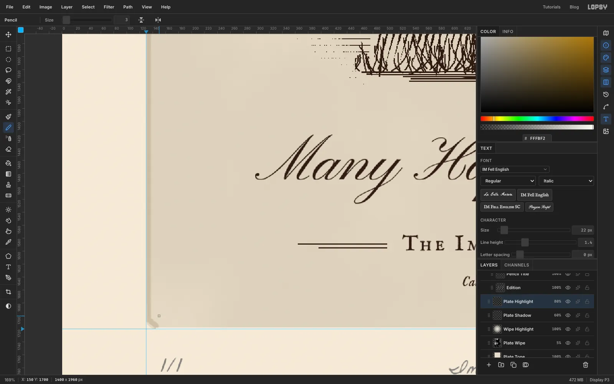

The press squeezes the paper round the edge of the plate and leaves a
shallow dent. Fake that with two thin layers:

- **Plate Shadow**: the **Pencil** at **Size** `6` in `#BCAE92`. Click
  near the top-left corner of the plate, then [[Shift]]-click at the top
  right to draw a straight line. Draw the left edge the same way. Run
  **Gaussian Blur** `2` and set the layer to **60%**.
- **Plate Highlight**: the Pencil at **Size** `3` in `#FFFBF2`, along the
  bottom and right edges, then **Gaussian Blur** `1`.

Light falls from the top left, so the top and left walls of the dent are in
shadow and the bottom and right catch the light.

## Hand-tint with watercolour washes

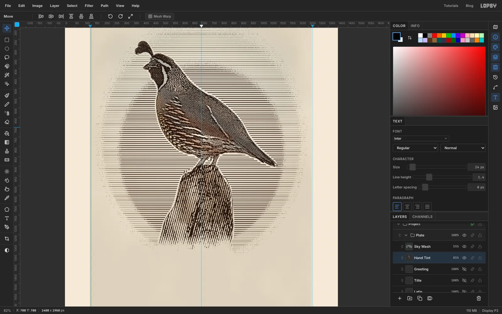

Inside the **Plate** group, add a **Hand Tint** layer set to **Multiply**.
Select the bird from **Quail Photo**, leave out the post with an
[[Alt]]-lasso, and choose
**Select → Grow** `3` so the colour spills just past the lines, as a real
colourist's wash does. Click back on **Hand Tint** before you paint. Use the **Brush** with **Hardness** `0` and soft,
loose strokes:

- slate `#8C97A3` at **Size** `200`, **Opacity** `60` over the head, breast and back
- chestnut `#A0603A` at **Size** `90` along the flank stripes
- buff `#D9B77E` down the belly
- a little brown `#7E5A3E` on the crown and plume

Lasso the post and wash it with umber `#8A6A4A`. Run **Gaussian Blur** `3`
to melt the strokes together. Then take the **Eraser** at **Opacity** `30`
and lift out a few patches of slate so paper shows through. Set the layer
to **85%**.

Add a **Sky Wash** layer on **Multiply**. Select everything outside the
bird and paint pale blue `#C9D6DC` across the top of the oval, then set the
layer to **55%**. Both washes are easy to strengthen later, once you can
judge them next to the lettering.

## Grow some grass

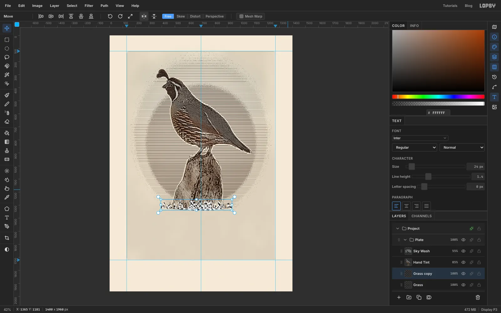

Add a **Grass** layer above **Etching**. Open the brush presets from the
Brush options bar, go to the **Shape** tab and set **Size** `3`,
**Hardness** `100` and **Taper** `110`. Taper makes each stroke thin out
to a point, like a stroke of the burin. Draw single blades upward from the
foot of the post. Vary their height between about 20 and 80 px and lean
them in different directions. Set Size to `2` and Taper to `0` for a few
short horizontal strokes of ground. Drag the layer up if needed so the
ground meets the post. Then marquee the strip just below the ground on
**Etching** and fill it with white, so no stray sky specks sit under the
grass.

For a fuller tuft, choose **Layer → Duplicate Layer**, click the copy's
row, marquee round the grass and click **Flip Horizontal** in the Move
options bar. Name the copy **Grass Back**. Delete the outermost blades on
both layers with a marquee so the clump tapers out, and add a few short
blades hugging the post.

## Patch the gap under the feet

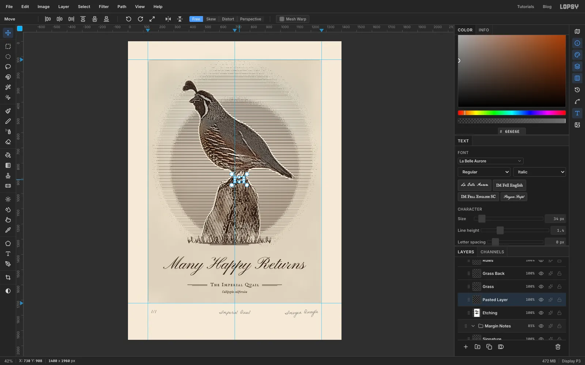

The paper halo leaves a pale gap between the feet where the photo had a
patch of background. On **Etching**, lasso a small piece of the post's
engraving just below the gap, press [[Cmd+C]] and then [[Cmd+V]]. The copy
pastes in place on its own layer. Drag it up about 25 px to cover the gap,
press [[Cmd+D]], and **Merge Down**.

## Engrave the lettering

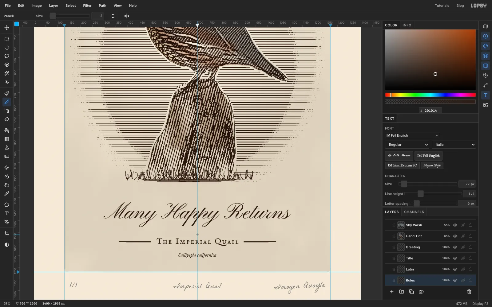

Click the **Grass Back** row first, so the lettering lands inside the Plate
group, above the grass. Pick the **Text** tool, choose a dark brown (`#2D1D14`) and
set the font. To avoid clicking inside other text, type each line in the
empty lower margin and then move it into place:

1. **Many Happy Returns** in **Pinyon Script**, **Size** `96`.
2. **The Imperial Quail** in **IM Fell English SC**, **Size** `34`, with
   **Letter spacing** `4` in the Text panel. Set Letter spacing back to `0`
   before the next line.
3. **Callipepla californica** in **IM Fell English**, **Size** `22`. Set
   the options bar's style dropdown to **Italic** *before* you click to
   type. That way the italic face loads with the text.

Rename the layers **Greeting**, **Title** and **Latin**. Centre each line
with the Move tool's **Align center horizontally** button, then drag it
into place. Leave a generous gap, about 80 px, between the grass and the
script. Set the title comfortably below the script's descenders, tuck the
Latin name a little under the title, and keep clear paper between the
Latin name and the bottom of the plate.

On a new **Rules** layer, use the **Pencil** at **Size** `2` with
[[Shift]]-click lines to draw a double rule on each side of the title. Make
the inner line shorter than the outer one.

## Sign it in pencil

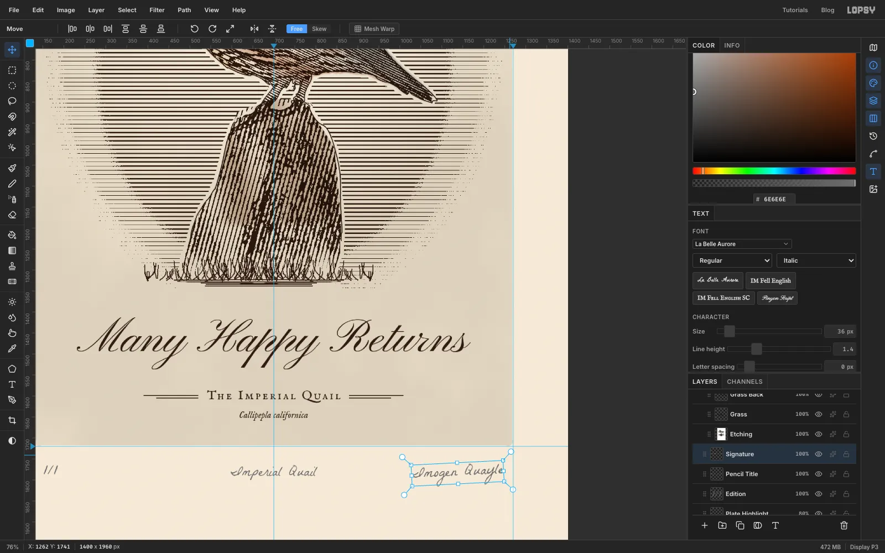

Printmakers number, title and sign each proof in pencil below the plate.
Click a layer *outside* the Plate group (**Plate Highlight**) so the notes
are added outside it, set the colour to graphite `#6E6E6E`, and use
**La Belle Aurore** at about **Size** `34`. Type **1/1** at the left plate
edge, the title in the middle, and a signature lined up with the right
edge. Set all three on the same baseline, and rename the layers **Edition**,
**Pencil Title** and **Signature**.

Signatures are never perfectly level. Select the signature with the
**Move** tool, drag its rotate handle up about **3°**, and press
[[Escape]] to commit.

## Group the pencil notes

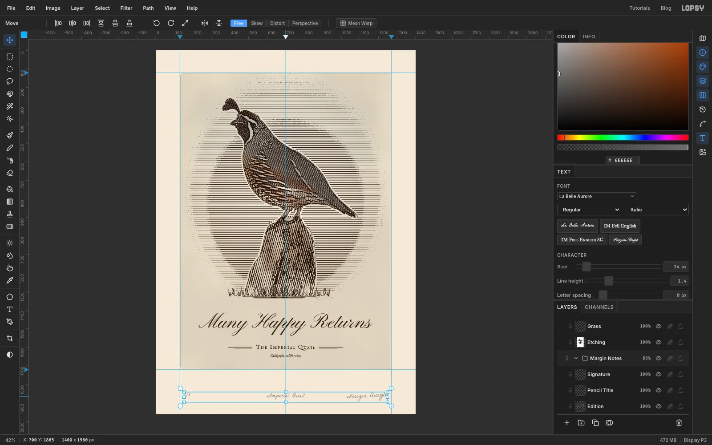

Click **Signature**, [[Shift]]-click **Edition** to select all three
notes, and choose **Layer → Group Layers**. Name the group **Margin
Notes** and set it to **85%** so the pencil sits back.

Now the notes move together. Click the group's row, pick the **Move** tool
and drag them down until they sit comfortably under the plate. If you
overshoot, [[Cmd+Z]] puts them back. Fine-tune with the arrow keys.

Finally, look at the whole card. If the washes feel faint next to the
lettering, raise **Hand Tint** and **Sky Wash** to 100%.

Save the project with **File → Save Project** and export the card with
**File → Quick Export PNG**.

> **Tip:** Every layer is still separate, so you can change things later.
> Hide **Hand Tint** and **Sky Wash** for a plain sepia proof, or swap the
> greeting for a name. The line work is baked into one **Etching** layer,
> so to change it, go back to the hidden photo and run the stripe and
> Threshold steps again.
