A 19th-century etching builds all of its tone from lines. The plate is never
painted. Engravers darkened a sky by cutting ruled lines deeper and thicker,
and brightened it by thinning them to hairlines. Rock was shaded with
cross-hatching, and water with long wavering strokes.

In this tutorial you'll use that line-only rule for a sepia plate called
**The Juniper Light**: a lighthouse on a headland, a wind-bent juniper, and a
moon that thins the sky lines around it. A copperplate caption goes
underneath.

Along the way you'll use:

- **Define Pattern** and **Fill with Pattern**
- **Gaussian Blur** plus **Threshold** to make lines swell
- **Mesh Warp** for the sea
- the magic wand, lasso and elliptical marquee
- brush presets with jitter
- rotation handles and grid snapping
- Google fonts

The palette is small:

- paper `#E9DFC6` and plate tone `#DDCFAE`
- ink `#3A2A1B` and deep ink `#2E2117`
- highlight cream `#EFE5CC`

## Make the paper and the plate

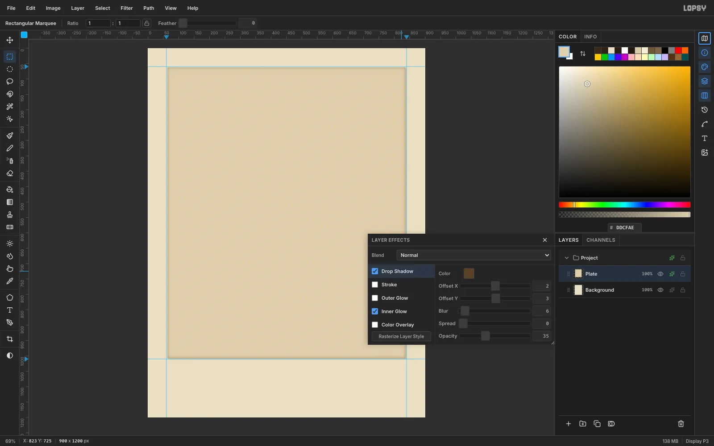

Create a **900 × 1200** document with **File → New** and a white background.
Click the top ruler at 60 and 840, and the left ruler at 60 and 1010, to
drop four guides that mark the plate.

1. Fill **Background** with `#E9DFC6` (**Edit → Fill**). Run **Filter → Add
   Noise** at Amount **6**, with **Mono** and **Gaussian**, for a paper tooth.
2. Rename **Layer 1** to **Plate**. Marquee from (63, 62) to (837, 1007),
   fill it with `#DDCFAE`, then run Add Noise again at **5**.
3. Open the Plate's layer effects. Add an **Inner Glow** (`#6B4F2E`, Size
   18, Opacity 45) and a **Drop Shadow** (`#5A4128`, offset 2/3, Blur 6,
   Opacity 35). This makes the bevelled edge a copper plate presses into
   the paper.

## Rule the sky with a line pattern

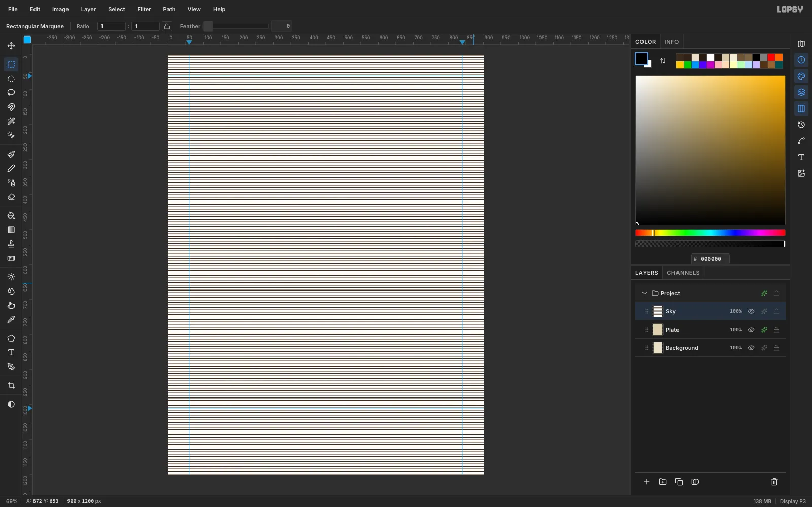

Next, make the tile. On a scratch layer, fill a **48 × 2 px** black bar, then
marquee it together with **5 px** of empty space beneath it (48 × 7 in
total). Choose **Edit → Define Pattern**, then delete the scratch layer.

1. Add a layer called **Sky** and fill it white with no selection active.
2. Add a layer called **Sky Rule** and fill it black. Then choose **Edit →
   Fill with Pattern…**, pick your 48 × 7 tile at Scale 100 and click
   **Apply**.
3. Choose **Layer → Merge Down** to put the lines onto the white.

> **Tip:** Always fill the layer before you pattern-fill it. On a brand-new
> empty layer, Fill with Pattern currently paints a solid block instead of
> tiling.

## Add a radial tone

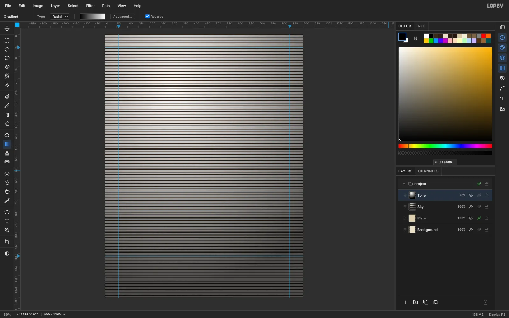

The ruled lines are all the same weight at this point. To make them swell,
give the layer a tone:

1. Add a layer called **Tone** and pick the **Gradient** tool.
2. Set **Type** to **Radial** and tick **Reverse**.
3. Drag from where the moon will sit, at (300, 240), out past the far corner
   to about (1000, 800).
4. Set the layer's blend mode to **Multiply** and its opacity to **70 %**,
   then Merge Down.

Now the lines are white at the moon and grey toward the corners.

## Threshold the lines into an engraved sky

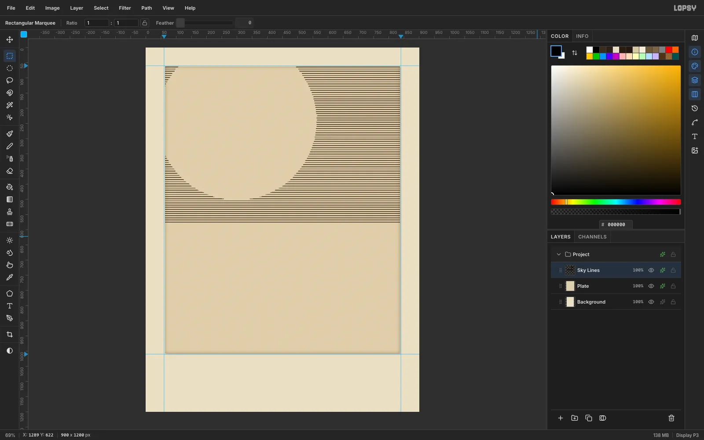

Run **Filter → Gaussian Blur** at **3 px**. Then run **Filter → Threshold**
at **96**. Where the tone is light, the blurred lines drop below the
threshold and disappear. Where it's dark, they come back full strength.

1. Pick the **Magic Wand**, untick **Contiguous**, click any white pixel and
   press [[Delete]].
2. Marquee the sky area, from (63, 63) to (837, 576). Choose **Select →
   Inverse** and delete the rest.
3. Add a **Color Overlay** of `#3A2A1B` to turn the black lines into sepia
   ink.
4. Rename the layer **Sky Lines**.

## Engrave the moon's halo rings

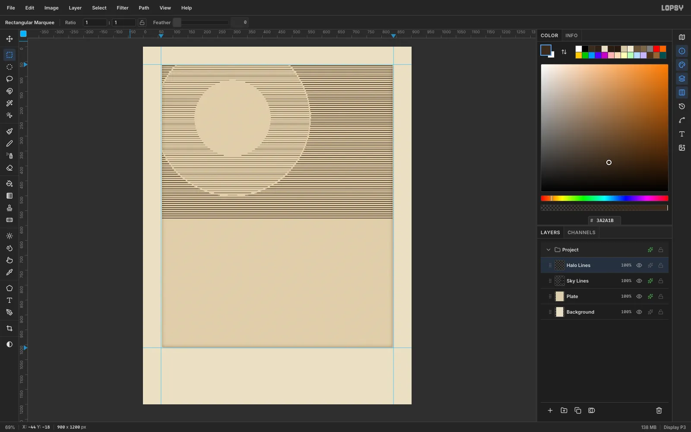

Define a second tile with a **1 px** line (48 × 1 px of ink over 6 px of
space). Then:

1. Add a layer called **Halo Lines**. Fill it, then pattern-fill it with the
   1 px tile.
2. Use the **Elliptical Marquee** to draw a circle from (42, −18) to
   (558, 498). Choose **Select → Inverse** and delete everything outside it.
3. Draw a second circle from (172, 112) to (428, 368) and delete its inside.
4. Trim everything outside the sky rectangle.

The result is two rings of hairline rules, which is how an engraver fakes
glow.

## Draw and hatch the moon

1. Add a layer called **Moon**. Fill an ellipse from (248, 188) to
   (352, 292) with `#F3EAD3`, then add an **inside Stroke** of `#3A2A1B`
   at Width 2.
2. Leave a slightly smaller circle selected. The selection clips the brush,
   so hatching can't escape the disc.
3. Pick the **Brush** with the **Hard Round** preset at Size **2.6** and
   Opacity **80**. Draw seven arcs that bow toward the right limb.
4. Add a few short strokes at **50 %** opacity for craters.

> **Tip:** Keep hairlines at Size 2.6 or larger. At present, Sizes below
> about 2.5 barely paint at all.

## Swell the sea with Mesh Warp

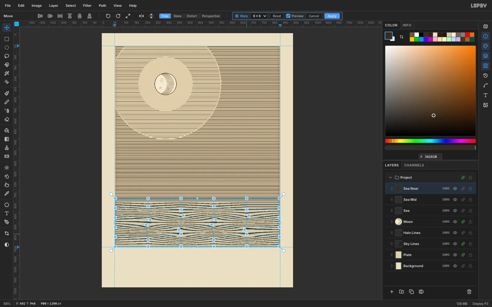

Water is made of three bands of ruled lines. Each is a layer that you fill,
pattern-fill with the 2 px tile, then trim to its band:

- (63, 578) to (837, 700) at Scale **60**
- (63, 700) to (837, 800) at Scale **90**
- (63, 800) to (837, 1007) at Scale **140**

The lines get coarser as they come closer.

To bend the nearest band, marquee it and pick the **Move** tool, then click
**Mesh Warp**. Set the grid to **6 × 6** and tick Preview. Drag the inner
handles alternately up and down by 8–16 px, with small sideways offsets.
Click **Apply**, then merge the three bands into one **Sea** layer.

## Cut a crisp horizon and a glitter path

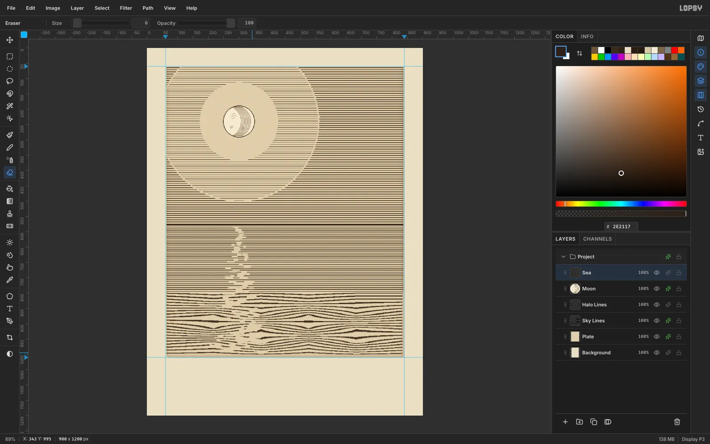

Engravings don't have soft haze. Fill a 3 px rectangle from (63, 575) to
(837, 578) with `#2E2117` for a hard horizon.

Then pick the **Eraser** at Size **6** and Opacity **100**. Cut short
horizontal dashes down the sea, centred under the moon (x ≈ 300). Keep them
narrow near the horizon and let them spread to about ±80 px and grow longer
near the bottom. The gaps read as moonlight dancing on the water.

## Build the headland silhouette

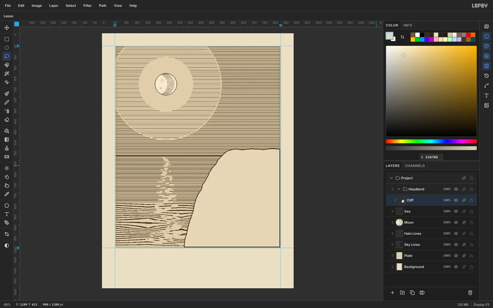

Click **New Group** and name it **Headland**. Add a layer inside it called
**Cliff**.

Use the **Lasso** to draw the cliff. Curve the edge from the bottom at
(385, 1007) up to the top at (590, 552), bowing out toward the sea, with a
little jitter so it reads as rock. Run it along the top at y ≈ 545 to the
right edge.

Fill it with `#E4D7B8` and add an **inside Stroke** of `#2E2117` at
Width 3.

## Cross-hatch the rock

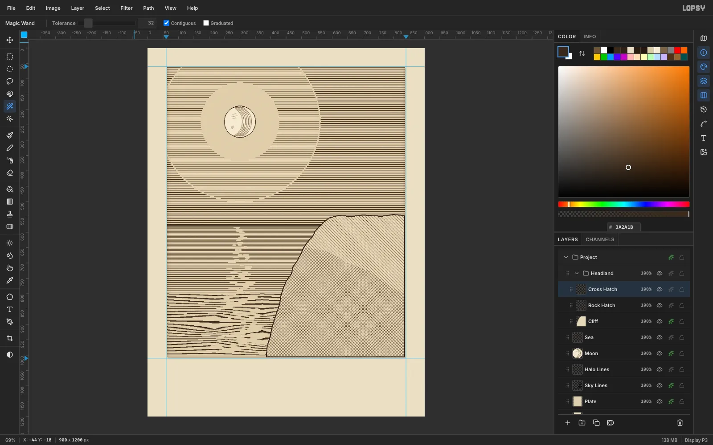

Define a **10 × 10** tile with a single diagonal line. This one tiles
seamlessly.

1. Add a layer called **Rock Hatch**, fill it, pattern-fill it with the
   diagonal tile, and clip it to the cliff. To clip, click the Cliff with
   the contiguous **Magic Wand**, return to Rock Hatch, then choose **Select
   → Inverse** and press [[Delete]].
2. Repeat on a layer called **Cross Hatch**, then run **Image → Flip
   Horizontal** so its lines cross the first set.
3. Lasso the shadowed lower face. Invert, delete, and clip it to the cliff
   again.

## Model the strata and crevices

Add a **Rock Detail** layer and pick the Hard Round brush at Size **3.2**.
Draw seven strata lines from the cliff edge to the right side. Each one
slopes down about 18 px and sags in the middle like a bedding plane.

Under each of the top six strata, lasso a thin wedge at the cliff edge and
fill it with `#2E2117` for a crevice. Then lasso a heavy rock mass along the
cliff foot and fill it solid. Finish it with two cream highlight strokes at
Size 2.6.

This gives the bottom of the plate the deep darks it needs.

## Build the lighthouse and its beam

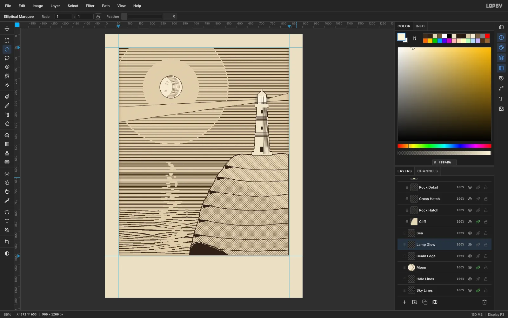

On a **Tower** layer, build the tower from fills:

1. Lasso a tapered shaft, 70 px wide at the base (y 546) and 44 px at the top
   (y 330). Fill it with `#EFE5CC`.
2. Add rectangles for the gallery deck and the plinth, an ellipse for the
   dome, a lighter `#FBF5E4` lantern and a thin finial.
3. Give the layer a 2 px **outside Stroke**.

On **Tower Detail**, at Size 2.6:

- draw three lantern mullions and railing ticks
- add seven vertical hatch strokes down the right third for shadow
- add two banded rings of horizontal lines
- fill the door and two windows

For the beam, lasso a long wedge from the lantern (706, 297) to the left edge
of the plate. Delete that wedge from **Sky Lines** and **Halo Lines**, then
rule its two edges with the brush. A blurred cream disc behind the lantern
(Gaussian Blur 14) makes the lamp the brightest point on the plate.

## Paint the wind-bent juniper

On a **Juniper** layer, brush the trunk from the cliff top at (612, 552) in
a curve out to (452, 444). Go from Size 14 at the root to 10, and add
3–6 px side branches.

Fill eight small ellipses with `#241810` for the foliage pads. Then select
the top part of each pad with the elliptical marquee and brush paper-coloured
diagonal strokes through it. This is engraved highlight.

Finally, open the brush presets and pick **Slash**:

- in the **Shape** tab, set Size 10 and Spacing 40
- in the **Dynamics** tab, set Scatter 35, Angle Jitter 50 and Size Jitter 40

Stroke around the top of each pad for needles.

## Duplicate and rotate the gulls

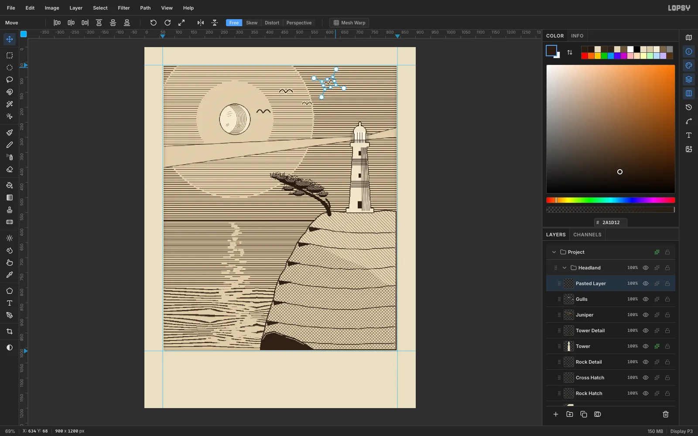

On a **Gulls** layer, draw two gulls as a pair of arcs each, at Size 4 and
3.2. Add an **outside Stroke** of paper colour at Width 3 so each bird
knocks the sky lines away around itself.

For more birds:

1. Marquee a gull, press [[Cmd+C]] then [[Cmd+V]], drag the copy into
   place, and press [[Enter]].
2. Choose **Merge Down** so the copy picks up the stroke.
3. For the third gull, marquee it and pick **Move**. Drag the round handle
   just outside a corner to bank it about 20°, then press [[Enter]].

> **Tip:** Scale or rotate, then press [[Enter]], then move. Dragging inside
> a live transform box currently drops the pending rotation or scale.

## Add sea stacks and surf

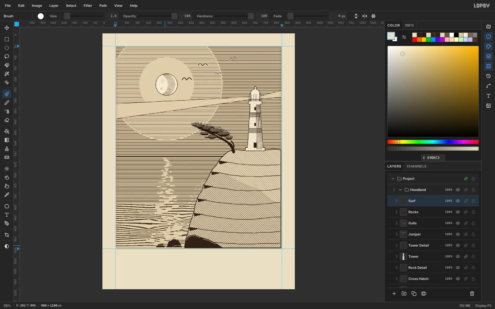

On a **Rocks** layer, lasso and fill two low sea stacks at the waterline
with `#2E2117`, and give each a cream highlight stroke.

On **Surf**, brush short wavy cream strokes that start at the cliff edge and
trail out to sea, every 16 px down the cliff. Add a couple of foam curls
beside the rocks.

## Snap the double-rule frame

Choose **View → Show Grid**. Snap turns on with it, so marquees land on the
16 px lattice.

1. On a **Frame** layer, marquee from about (68, 73) to (832, 998) and fill
   it with deep ink.
2. Choose **Select → Shrink** by 3 px and press [[Delete]] to leave a 3 px
   outer rule.
3. Repeat 16 px further in with a 1 px shrink for the inner hairline.
4. Hide the grid again.

Last, add a **Margin** layer: a plate-toned ring between the plate edge and
the frame, so no line work peeks past the rule.

## Set the copperplate caption

Period plates carry a plate number and an engraver's credit under the
corners, and a centred title below.

1. Fill a 1 px **Rule** from (330, 1043) to (570, 1044).
2. With the **Text** tool, set the subtitle first so it can't catch the
   title's hit box. Use **Pinyon Script** at 30 px in `#2E2117`:
   *Moonrise over the northern headland*.
3. Set the title in **Cormorant SC SemiBold** at 52 px: **The Juniper
   Light**. In the Text panel, give it Letter spacing **4**.
4. Add the plate marks in **Old Standard TT** at 16 px, with Letter
   spacing **1**: *Pl. XII* on the left and *J. L. sculp.* on the right.

Centre the lines with arrow-key nudges ([[Shift]] + arrow moves 10 px). Line
the marks up with the frame.

## Export the finished etching

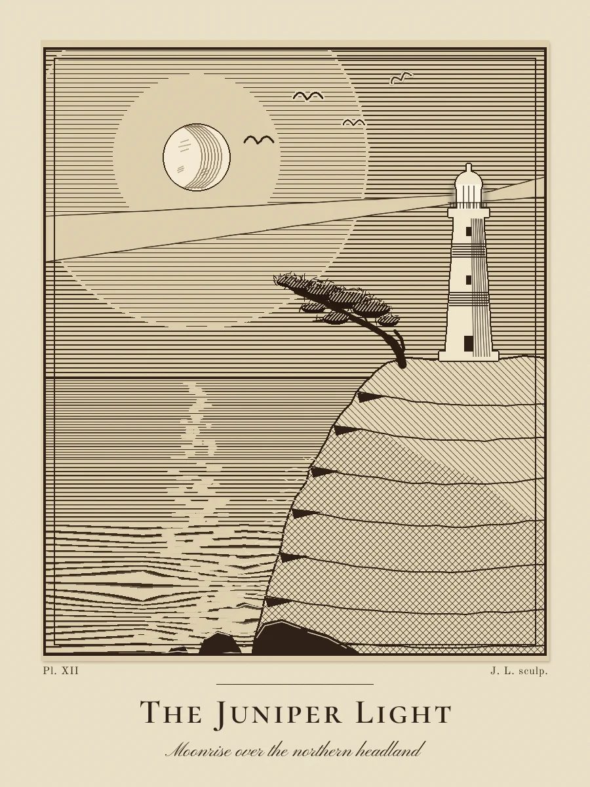

Choose **File → Quick Export PNG** for the flat image and **File → Save
Project** to keep every layer. The whole plate is built from about thirty
layers of ruled, hatched and cut line. Nothing in it is airbrushed, which is
what makes it read as a print rather than a painting.
