A 19th-century etching builds all of its tone from lines. The plate is never
painted. Engravers darkened a sky by cutting ruled lines deeper and thicker,
and brightened it by thinning them to hairlines. Rock was shaded with
cross-hatching, and water with long wavering strokes.

In this tutorial you'll use that line-only rule for a sepia plate called
**The Juniper Light**: a lighthouse on a headland, a wind-bent juniper, and a
moon that thins the sky lines around it. A copperplate caption goes
underneath.

Along the way you'll use:

- **Define Pattern** and **Fill with Pattern**
- **Gaussian Blur** plus **Threshold** to make lines swell
- **Mesh Warp** for the sea
- the magic wand, lasso and elliptical marquee
- brush presets with jitter
- rotation handles and grid snapping
- Google fonts

The palette is small:

- paper `#E9DFC6` and plate tone `#DDCFAE`
- ink `#3A2A1B` and deep ink `#2E2117`
- highlight cream `#EFE5CC`

## Make the paper and the plate

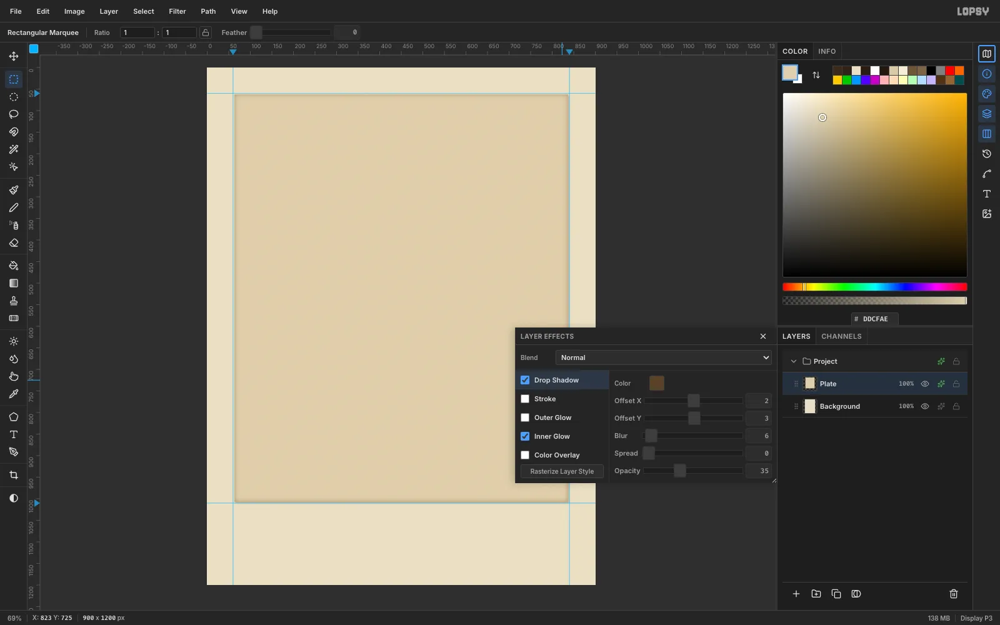

Create a **900 × 1200** document with **File → New** and a white background.
Drop four guides to mark the plate: click the top ruler about 60 px in from
each side, then click the left ruler about 60 px from the top and again at
about 1010, which leaves a deeper margin at the bottom for the caption.

1. Fill **Background** with `#E9DFC6` (**Edit → Fill**). Run **Filter → Add
   Noise** at Amount **6**, with **Mono** and **Gaussian**, for a paper tooth.
2. Rename **Layer 1** to **Plate**. Drag a marquee just inside the four
   guides, fill it with `#DDCFAE`, then run Add Noise again at **5**.
3. Open the Plate's layer effects. Add an **Inner Glow** (`#6B4F2E`, Size
   18, Opacity 45) and a **Drop Shadow** (`#5A4128`, offset 2/3, Blur 6,
   Opacity 35). This makes the bevelled edge a copper plate presses into
   the paper.

## Rule the sky with a line pattern

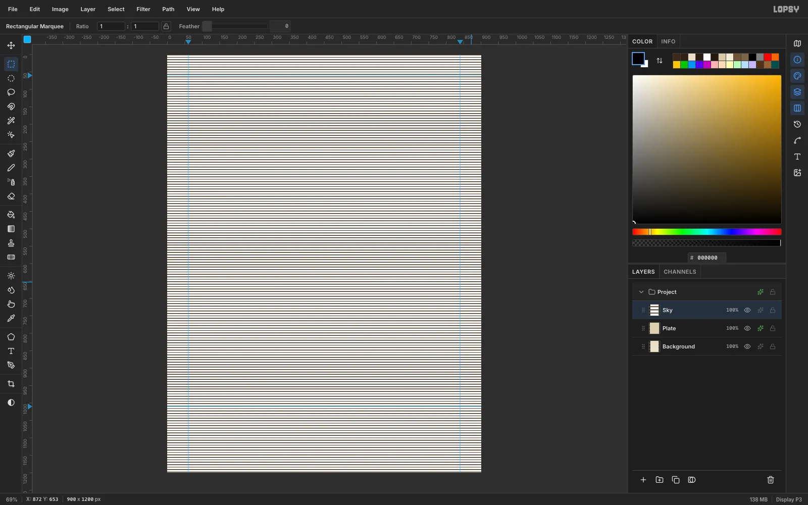

Next, make the tile. On a scratch layer, fill a **48 × 2 px** black bar, then
marquee it together with **5 px** of empty space beneath it (48 × 7 in
total). Choose **Edit → Define Pattern**, then delete the scratch layer.

1. Add a layer called **Sky** and fill it white with no selection active.
2. Add a layer called **Sky Rule**. With nothing selected, choose **Edit →
   Fill with Pattern…**, pick your 48 × 7 tile at Scale 100 and click
   **Apply**. The tile's empty rows stay transparent, so you get black lines
   on a clear layer.
3. Choose **Layer → Merge Down** to put the lines onto the white.

> **Tip:** Tile sizes need to be exact. Press [[Cmd+D]], then click (don't
> drag) with the **Rectangular Marquee** to type the corners into the
> Rectangular Selection dialog. From 0, 0 To 48, 2 gives the bar, and From
> 0, 0 To 48, 7 gives the whole tile.

## Add a radial tone

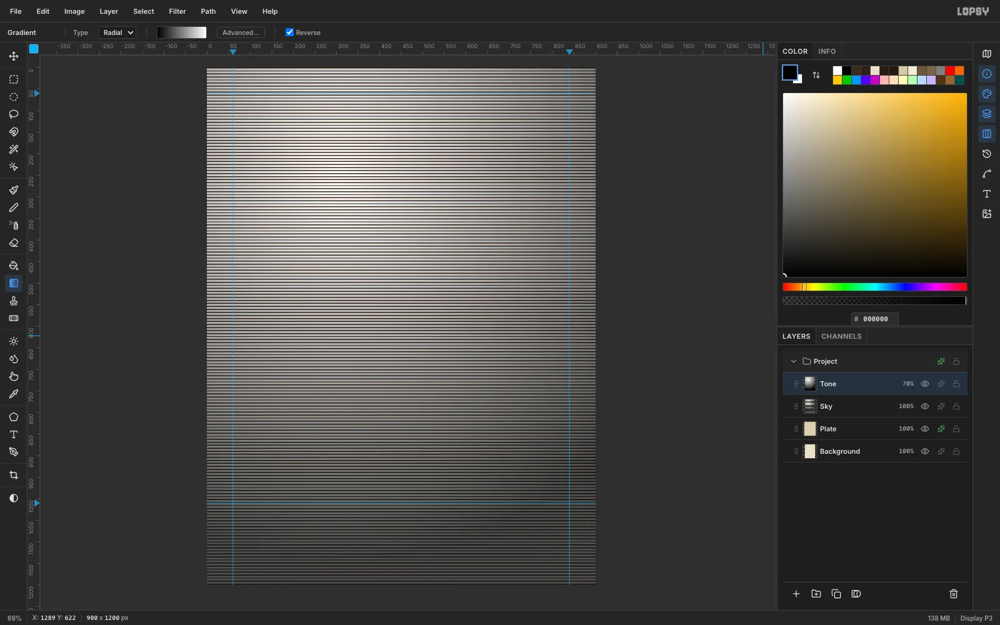

The ruled lines are all the same weight at this point. To make them swell,
give the layer a tone:

1. Add a layer called **Tone** and pick the **Gradient** tool.
2. Set **Type** to **Radial** and tick **Reverse**.
3. Drag from where the moon will sit, about a third of the way across and a
   fifth of the way down the page, out past the right edge of the canvas to
   about two-thirds of the way down.
4. Set the layer's blend mode to **Multiply** and its opacity to **70 %**,
   then Merge Down.

Now the lines are white at the moon and grey toward the corners.

## Threshold the lines into an engraved sky

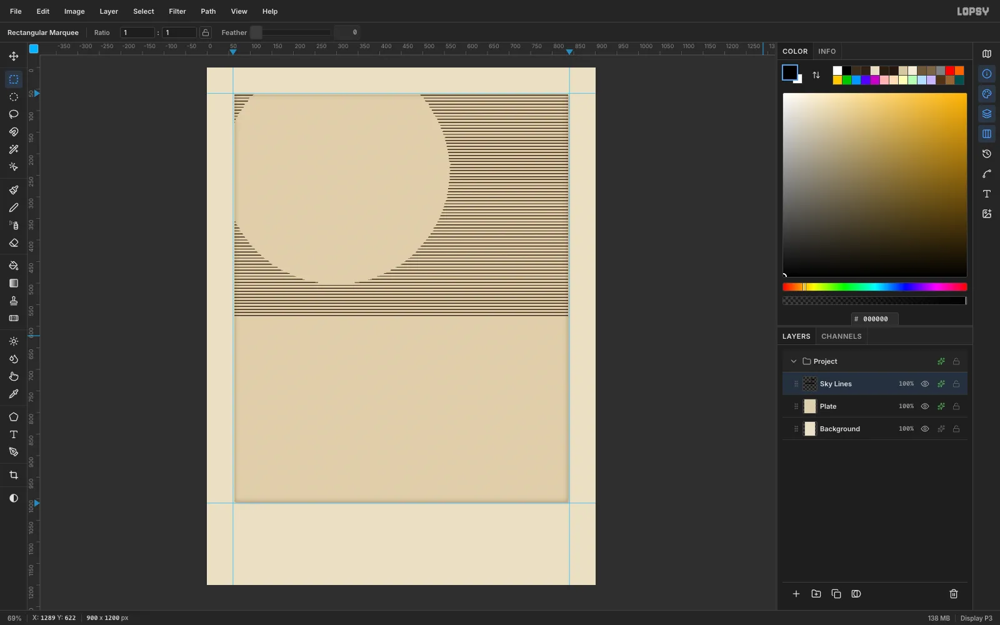

Run **Filter → Gaussian Blur** at **3 px**. Then run **Filter → Threshold**
at **96**. Where the tone is light, the blurred lines drop below the
threshold and disappear. Where it's dark, they come back full strength.

1. Pick the **Magic Wand**, untick **Contiguous**, click any white pixel and
   press [[Delete]].
2. Marquee the sky: from the top-left corner of the plate, just inside the
   guides, across to the right guide and down to about 576 on the left ruler,
   a little above halfway. That bottom edge is your horizon. Choose **Select →
   Inverse** and delete the rest.
3. Add a **Color Overlay** of `#3A2A1B` to turn the black lines into sepia
   ink.
4. Rename the layer **Sky Lines**.

## Engrave the moon's halo rings

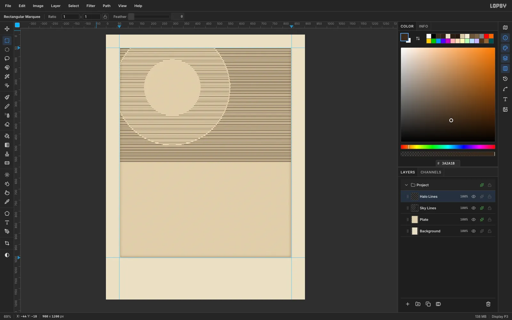

Define a second tile with a **1 px** line (48 × 1 px of ink over 6 px of
space). Then:

1. Add a layer called **Halo Lines** and pattern-fill it with the 1 px tile.
2. Use the **Elliptical Marquee** to draw a circle about 516 px across,
   centred on the moon's spot. It's big enough to run a little off the top of
   the plate. Choose **Select → Inverse** and delete everything outside it.
3. Draw a second circle about half that size (256 px) on the same centre and
   delete its inside.
4. Trim everything outside the sky rectangle.

The result is two rings of hairline rules, which is how an engraver fakes
glow.

> **Tip:** Concentric circles are easier to get right with typed corners.
> Press [[Cmd+D]], click once with the Elliptical Marquee and enter From
> 42, −18 To 558, 498 for the outer circle. Deselect again and enter From
> 172, 112 To 428, 368 for the inner one.

## Draw and hatch the moon

1. Add a layer called **Moon**. Fill a circle about 104 px across, centred in
   the bare disc of the halo (typed corners: From 248, 188 To 352, 292), with
   `#F3EAD3`. Then add an **inside Stroke** of `#3A2A1B` at Width 2.
2. Choose **Select → Shrink…** by about 3 px so a slightly smaller circle
   stays selected. The selection clips the brush, so hatching can't escape
   the disc.
3. Pick the **Brush** with the **Hard Round** preset at Size **2.6** and
   Opacity **80**. Draw seven arcs that bow toward the right limb.
4. Add a few short strokes at **50 %** opacity for craters.

## Swell the sea with Mesh Warp

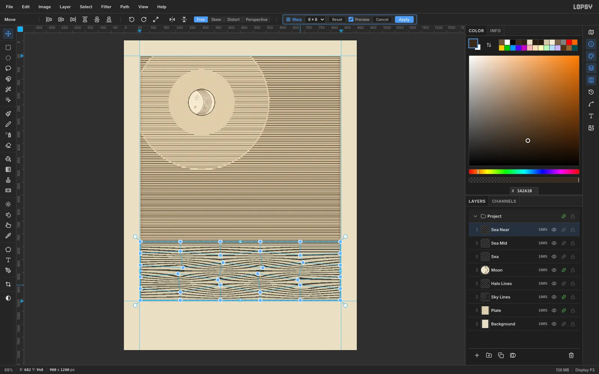

Water is made of three bands of ruled lines, each on its own layer. For each
band, marquee it across the full width of the plate, then pattern-fill it
with the 2 px tile. Fill with Pattern stays inside the selection.

- from the horizon down to about 700 on the left ruler, at Scale **60**
- from 700 down to about 800, at Scale **90**
- from 800 down to the bottom of the plate, at Scale **140**

The lines get coarser as they come closer.

To bend the nearest band, marquee it and pick the **Move** tool, then click
**Mesh Warp**. Set the grid to **6 × 6** and tick Preview. Drag the inner
handles alternately up and down by 8–16 px, with small sideways offsets.
Click **Apply**, then merge the three bands into one **Sea** layer.

## Cut a crisp horizon and a glitter path

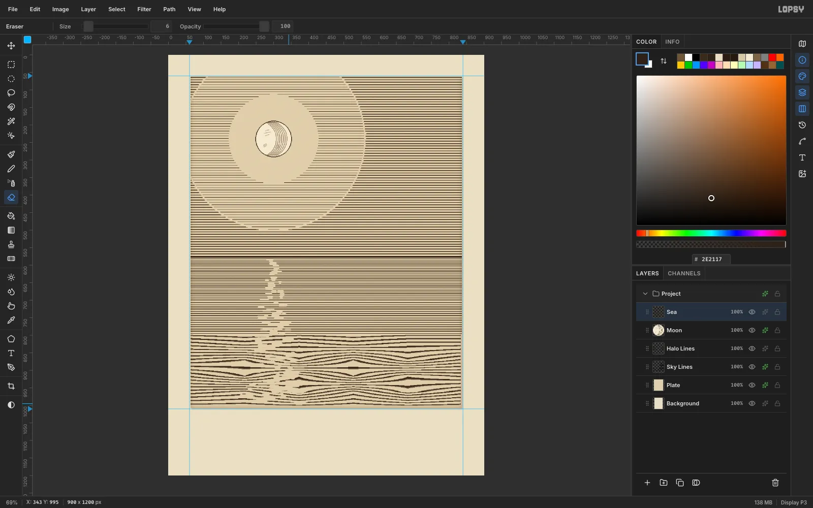

Engravings don't have soft haze. Marquee a strip 3 px tall right along the
horizon, across the whole plate, and fill it with `#2E2117` for a hard
horizon.

Then select **Sea** and pick the **Eraser** at Size **6** and Opacity
**100**. Cut short horizontal dashes down the sea, in a column directly
under the moon. Keep them narrow near the horizon, and let them spread to
about 80 px either side and grow longer near the bottom. The gaps read as
moonlight dancing on the water.

## Build the headland silhouette

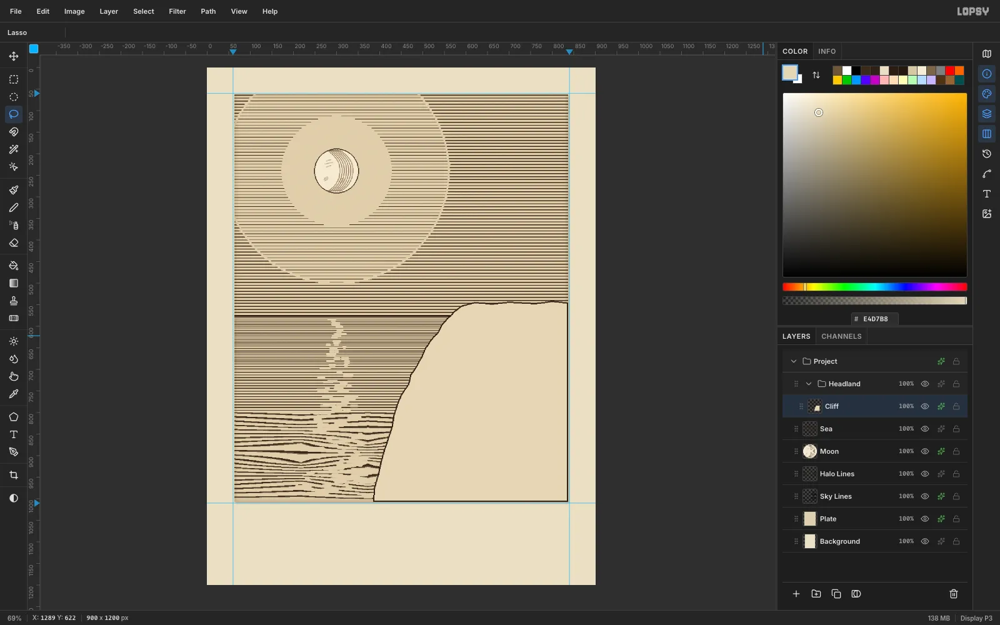

Click **New Group** and name it **Headland**. Add a layer inside it called
**Cliff**.

Use the **Lasso** to draw the cliff. Start at the bottom of the plate a
little left of centre and curve the edge up and to the right, bowing out
toward the sea, to a point about two-thirds of the way across and just above
the horizon. Add a little jitter so it reads as rock. Then run the top edge
along just above the horizon to the right side of the plate, and close the
shape around the bottom-right corner.

Fill it with `#E4D7B8` and add an **inside Stroke** of `#2E2117` at
Width 3.

## Cross-hatch the rock

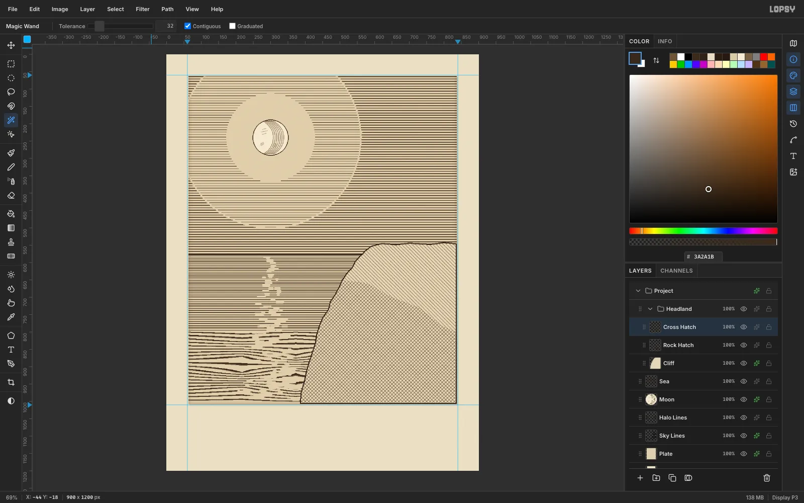

Define a **10 × 10** tile with a single diagonal line. This one tiles
seamlessly.

1. Add a layer called **Rock Hatch**, pattern-fill it with the diagonal
   tile, and clip it to the cliff. To clip, click the Cliff with
   the contiguous **Magic Wand**, return to Rock Hatch, then choose **Select
   → Inverse** and press [[Delete]].
2. Repeat on a layer called **Cross Hatch**, then run **Image → Flip
   Horizontal** so its lines cross the first set.
3. Lasso the shadowed lower face. Invert, delete, and clip it to the cliff
   again.

## Model the strata and crevices

Add a **Rock Detail** layer and pick the Hard Round brush at Size **3.2**.
Draw seven strata lines from the cliff edge to the right side of the plate.
Each one slopes down a little (about 18 px over its length) and sags in the
middle like a bedding plane.

Under each of the top six strata, lasso a thin wedge at the cliff edge and
fill it with `#2E2117` for a crevice. Then lasso a heavy rock mass along the
cliff foot and fill it solid. Finish it with two cream highlight strokes at
Size 2.6.

This gives the bottom of the plate the deep darks it needs.

## Build the lighthouse and its beam

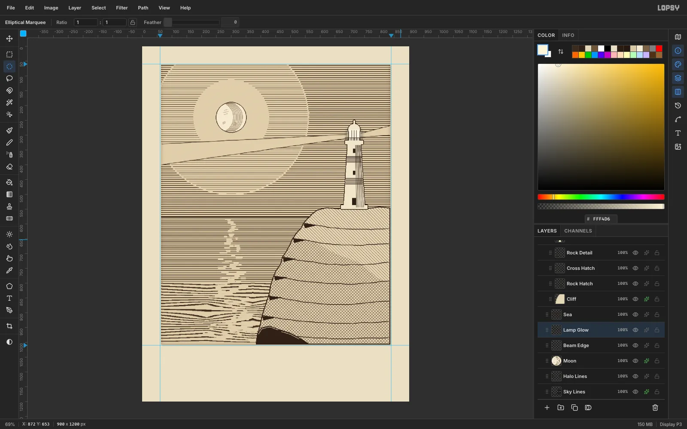

On a **Tower** layer, build the tower from fills:

1. Stand the tower on the cliff top, about four-fifths of the way across.
   Lasso a tapered shaft, 70 px wide where it meets the cliff and 44 px wide
   at the top, about 215 px higher. Fill it with `#EFE5CC`.
2. Add rectangles for the gallery deck and the plinth, an ellipse for the
   dome, a lighter `#FBF5E4` lantern and a thin finial.
3. Give the layer a 2 px **outside Stroke**.

On **Tower Detail**, at Size 2.6:

- draw three lantern mullions and railing ticks
- add seven vertical hatch strokes down the right third for shadow
- add two banded rings of horizontal lines
- fill the door and two windows

For the beam, lasso a long wedge that starts at the lantern and widens as it
crosses the sky to the left edge of the plate. Delete that wedge from **Sky Lines** and **Halo Lines**, then
rule its two edges with the brush. A blurred cream disc behind the lantern
(Gaussian Blur 14) makes the lamp the brightest point on the plate.

## Paint the wind-bent juniper

On a **Juniper** layer, brush the trunk from the cliff top, just in from
its edge, in a curve that leans out over the sea toward the upper left,
about 160 px across and 110 px up. Go from Size 14 at the root to 10, and
add 3–6 px side branches.

Fill eight small ellipses with `#241810` for the foliage pads. Then select
the top part of each pad with the elliptical marquee and brush paper-coloured
diagonal strokes through it. This is engraved highlight.

Finally, open the brush presets and pick **Slash**:

- in the **Shape** tab, set Size 10 and Spacing 40
- in the **Dynamics** tab, set Scatter 35, Angle Jitter 50 and Size Jitter 40

Stroke around the top of each pad for needles.

## Duplicate and rotate the gulls

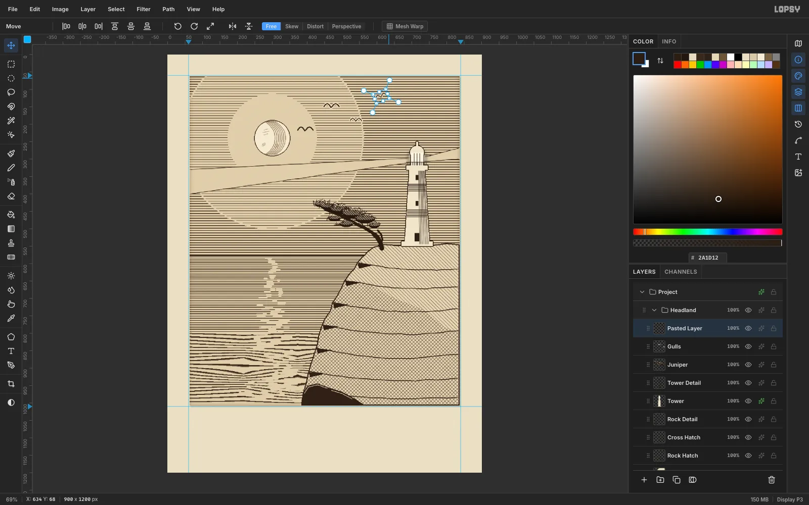

On a **Gulls** layer, draw two gulls as a pair of arcs each, at Size 4 and
3.2. Add an **outside Stroke** of paper colour at Width 3 so each bird
knocks the sky lines away around itself.

For more birds:

1. Marquee a gull, press [[Cmd+C]] then [[Cmd+V]], drag the copy into
   place with the **Move** tool, and press [[Cmd+D]] to commit.
2. Choose **Merge Down** so the copy picks up the stroke.
3. For the third gull, marquee it and pick **Move**. Drag the round handle
   just outside a corner to bank it about 20°, then press [[Cmd+D]].

> **Tip:** Commit each change with [[Cmd+D]] before you start the next one.
> If you drag a piece into place and then want to scale it, commit the move
> first and marquee it again, so the handles show the scale as you drag.

## Add sea stacks and surf

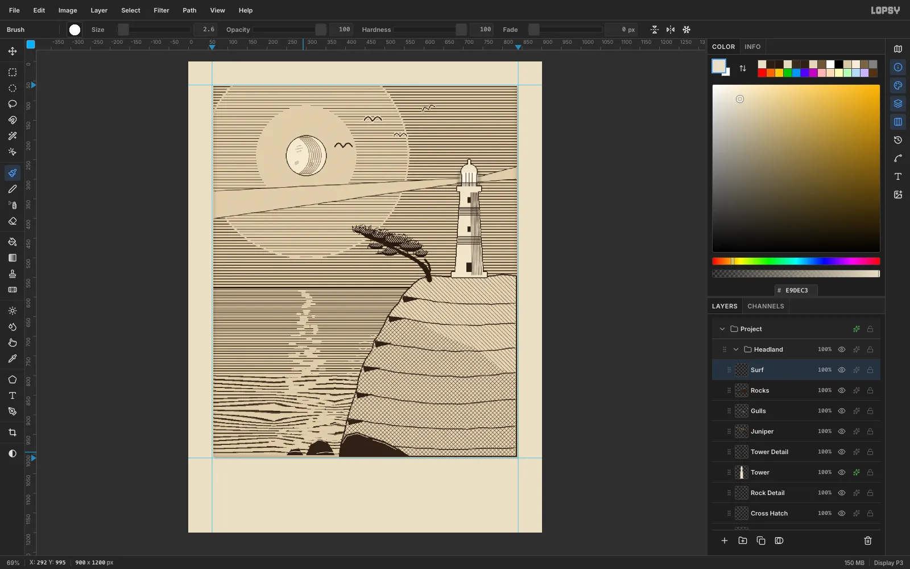

On a **Rocks** layer, lasso and fill two low sea stacks at the waterline
with `#2E2117`, and give each a cream highlight stroke.

On **Surf**, brush short wavy cream strokes that start at the cliff edge and
trail out to sea, one every 16 px or so down the cliff. Add a couple of foam curls
beside the rocks.

## Snap the double-rule frame

Choose **View → Show Grid**. Snap turns on with it, so marquees land on the
16 px lattice.

1. On a **Frame** layer, drag a marquee a few pixels inside the plate edge
   on every side. Its corners snap to the nearest grid lines. Fill it with
   deep ink.
2. Choose **Select → Shrink…** by 3 px and press [[Delete]] to leave a 3 px
   outer rule.
3. Repeat one grid cell (16 px) further in, with a 1 px shrink, for the inner
   hairline.
4. Hide the grid again.

Last, add a **Margin** layer: a plate-toned ring between the plate edge and
the frame, so no line work peeks past the rule.

## Set the copperplate caption

Period plates carry a plate number and an engraver's credit under the
corners, and a centred title below.

1. On a **Rule** layer, fill a 1 px line about 240 px long, centred on the
   page, a little way below the plate.
2. With the **Text** tool, set the subtitle in **Pinyon Script** at 30 px in
   `#2E2117`: *Moonrise over the northern headland*.
3. Set the title in **Cormorant SC SemiBold** at 52 px: **The Juniper
   Light**. In the Text panel, give it Letter spacing **4**.
4. Add the plate marks in **Old Standard TT** at 16 px, with Letter
   spacing **1**: *Pl. XII* on the left and *J. L. sculp.* on the right.

Create each line in empty canvas, then move it into place: the title just
under the rule and the subtitle under the title. Nudge with the arrow keys
([[Shift]] + arrow moves 10 px), and line the marks up with the frame's left
and right edges.

> **Tip:** To centre a line on the page, select its layer, pick the **Move**
> tool and click **Align center horizontally** in the options bar.

## Export the finished etching

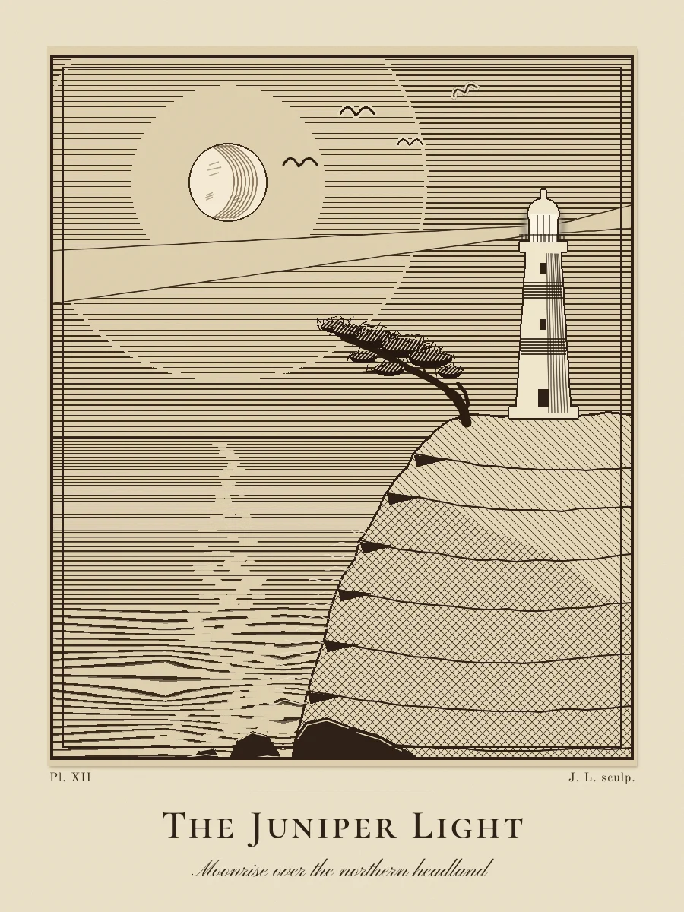

Choose **File → Quick Export PNG** for the flat image and **File → Save
Project** to keep every layer. The whole plate is built from about thirty
layers of ruled, hatched and cut line. Nothing in it is airbrushed, which is
what makes it read as a print rather than a painting.
