Exotica records from the late 1950s sold a fantasy island. The covers were a
flat travel-poster sunset, black palm silhouettes, a hut with a lit window,
and a title in a loose script. On top sat the label's trade dress: a band with
the orchestra's name, a HI-FI badge and a catalog number.

In this tutorial you'll make **Rhumba Bungalow**, a 1600 × 1600 px LP cover
for a fictional record by Leo Marquez & His Bamboo Orchestra. Almost every
shape is a **Lasso** polygon. The period look comes from a few moves:

- **Posterize** turns the sky gradient into flat ink bands.
- A tiny **Define Pattern** tile, **Fill with Pattern** and the **Perspective**
  transform make the sea.
- **Halftone**, grain and a worn ring age the finished sleeve.

The palette:

- Sky: `#0E2446` → `#6B2F6A` → `#E8605A` → `#FFC75E`
- Sea: `#F08A6A` → `#8A4A78` → `#27405E` → `#0A1F33`
- Plum silhouettes `#2A1433`, hut `#3B1B40`, lamp gold `#FFC46B`
- Trade-dress cream `#F4E6C8`, ink `#24102E`, red `#C8323A`

## Set up the canvas and paint the sky

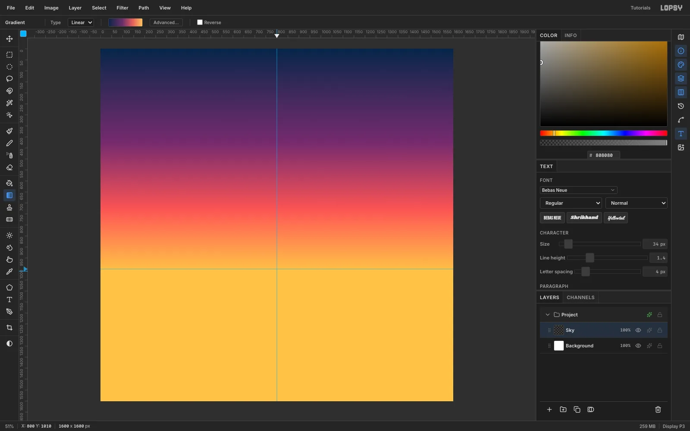

Choose **File → New**, set the unit to **Pixels**, and create a
**1600 × 1600** document. Rename **Layer 1** to *Sky*.

1. [[Cmd]]-click the middle of the top ruler to drop a guide exactly at the centre. Then [[Cmd]]-click the left ruler at about 1000, a little short of two-thirds of the way down. It snaps to exactly 5/8 of the height, which is your horizon.
2. Pick the **Gradient** tool, set **Type** to Linear, and open **Advanced…**. Make four stops: `#0E2446` at 0, `#6B2F6A` at 42%, `#E8605A` at 72% and `#FFC75E` at 100%.
3. Drag from the top edge straight down to the horizon guide. Hold [[Cmd]] as you drag to keep the line exactly vertical.

> **Tip:** With [[Cmd]] held, the ruler's hover label shows the fraction (1/2, 5/8 …) the guide will snap to, so you can check it before you click.

## Posterize the sky into ink bands

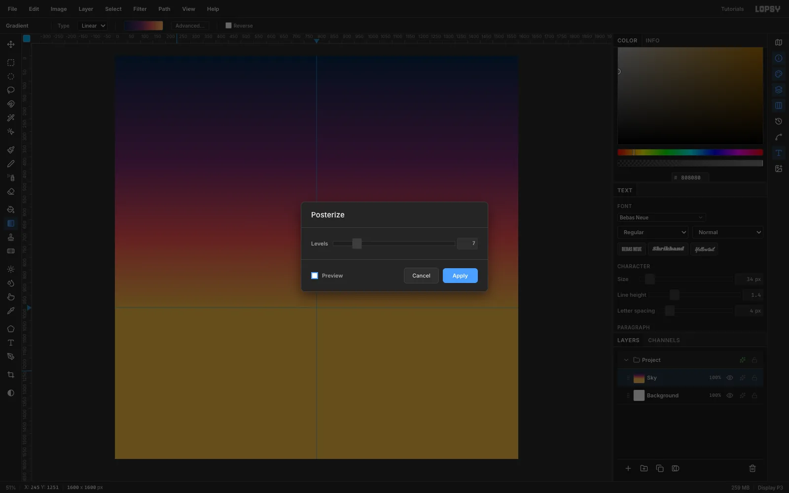

A smooth airbrushed gradient reads as modern. Old covers were printed in a
few flat inks.

Choose **Filter → Posterize…**, set **Levels** to **7**, and click **Apply**.
The band edges come out slightly ragged, like ink on uncoated card.

## Add the setting sun

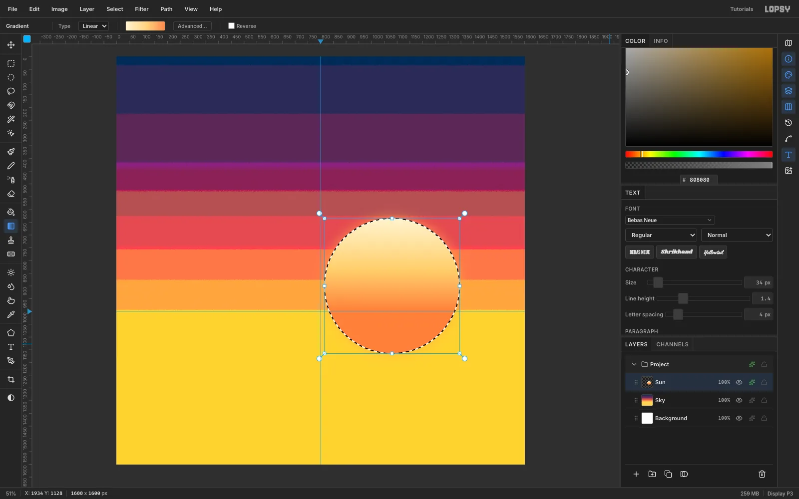

Add a layer called *Sun*.

1. With the **Elliptical Marquee**, hold [[Cmd]] and drag a circle about **530 px** across, right of centre. Place it so its middle sits roughly 280 px right of the centre guide and 100 px above the horizon, which leaves its lower third below the horizon.
2. In the Gradient editor, set the stops to `#FFF4D2`, `#FFD37A` at 55% and `#FF8A4C`. Drag from the top of the circle down to the horizon guide.
3. Open the layer's effects and turn on **Outer Glow**: colour `#FFB45A`, **Size** 63, **Spread** 10, **Opacity** 70.

The sun sits right of centre so the bungalow can have a clean sky behind it
later.

## Draw streak clouds

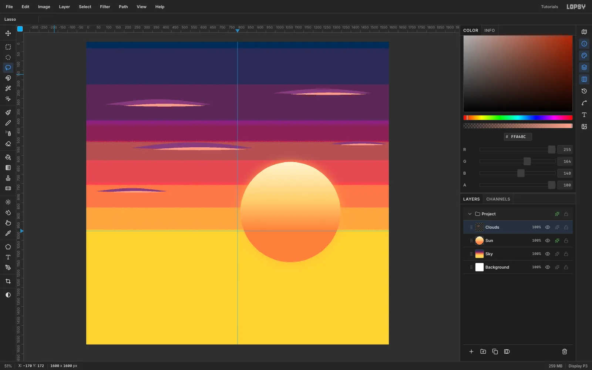

Add a *Clouds* layer. Travel-poster clouds are long, thin lenses: a curved
top and a flatter bottom.

1. With the **Lasso**, trace a 400–650 px lens and **Edit → Fill** it with `#7E3F7C`. Make five of them, and keep them away from the sun.
2. Inside each one, fill a shorter, thinner lens with `#FFA48C` along its lower edge. This is the sunlit underside.

## Lay in the sea

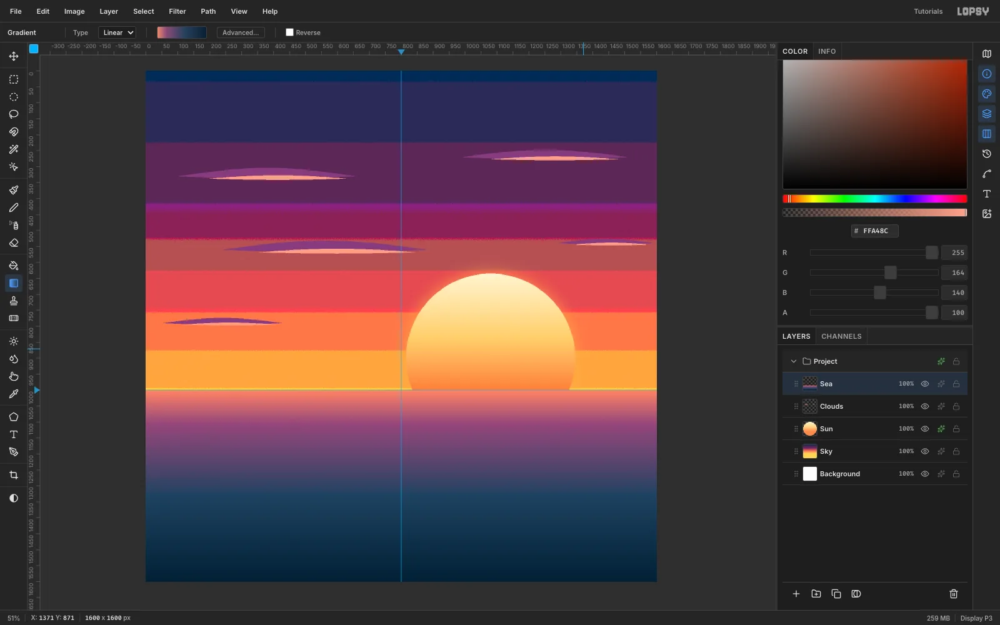

Add a *Sea* layer and marquee everything from the horizon guide down to the
bottom edge. Fill it with a linear gradient from `#F08A6A` through
`#8A4A78` (18%) and `#27405E` (55%) to `#0A1F33`.

Leave the sea smooth. **Posterize** works per channel, and on these hues it
throws in grey and green bands.

## Draw one tile of wave dashes

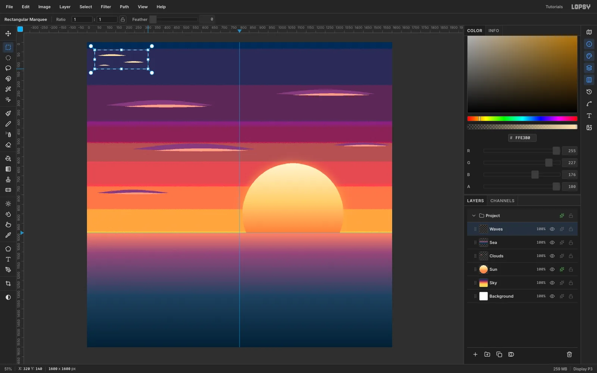

Add a *Waves* layer. Near the top-left corner, lasso and fill three small
lens-shaped dashes in `#FFE3B0`, about 150, 110 and 60 px long.

1. Draw a rectangular marquee about 280 × 100 px around them, leaving a little empty space on every side. That space sets the gap between dashes.
2. Choose **Edit → Define Pattern**.
3. Press [[Delete]] to clear the tile. The pattern stays in the library.

> **Tip:** For an exact tile, deselect and click once (don't drag) with the **Rectangular Marquee**. In the dialog, enter From 40, 40 To 320, 140.

## Tile the pattern across the sea

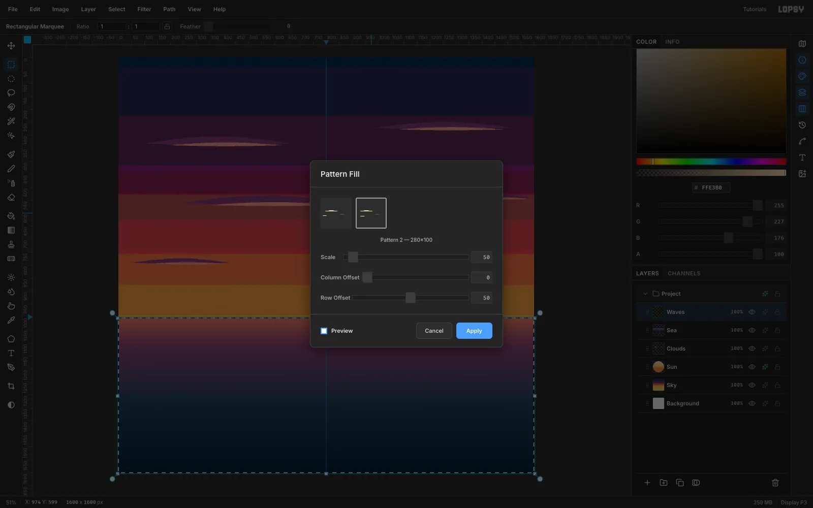

Marquee the sea again, starting a few pixels below the horizon guide so no
dashes sit on the horizon line, and running to the bottom edge. Choose
**Edit → Fill with Pattern…**, pick the newest tile, and set:

- **Scale** 50
- **Column Stagger** 50, which staggers the columns so the dashes don't line up

Click **Apply**. The dashes are evenly sized, so the sea still looks like
wallpaper. The next step fixes that.

## Foreshorten the waves with Perspective

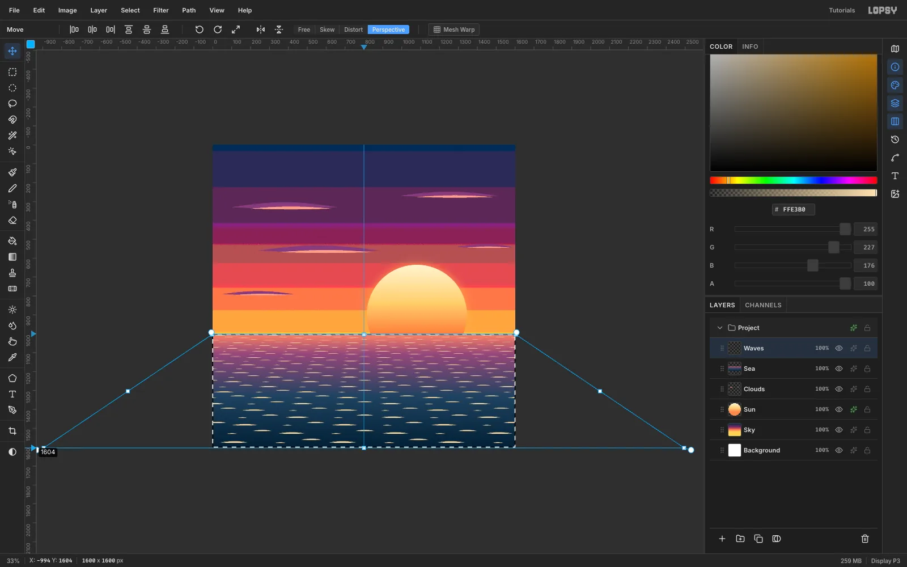

Keep the marquee and switch to the **Move** tool. Press [[Cmd+-]] twice so you
can reach past the canvas edge, then choose **Perspective** in the options
bar.

1. Drag the **bottom-left corner handle** a long way left, well past the canvas edge (about 1000 px, or most of a canvas width). The bottom-right corner mirrors it.
2. Press [[Cmd+D]] to commit, then [[Cmd+0]] to fit the canvas again.

Perspective is a true projective transform. The dashes near the horizon
shrink and crowd together, and the ones in the foreground grow. Set the Waves
layer to **Screen** at **45%**.

## Make a glitter path under the sun

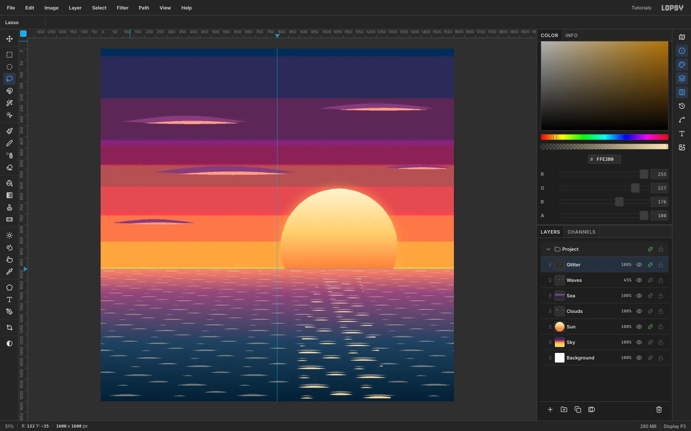

With Waves selected, choose **Layer → Duplicate Layer**. Rename the copy
*Glitter*, set it to **100%** opacity, and add a **Color Overlay** of
`#FFD98A`.

1. Lasso a trapezoid under the sun. Make its top edge about 270 px wide, centred under the sun at the horizon, and its bottom edge about 580 px wide, running just past the bottom of the canvas.
2. Choose **Select → Feather…** with a **Radius** of **45**, then **Select → Inverse**.
3. Press [[Delete]].

Only a soft-edged path of gold dashes remains, widening toward the viewer.

## Draw the first palm

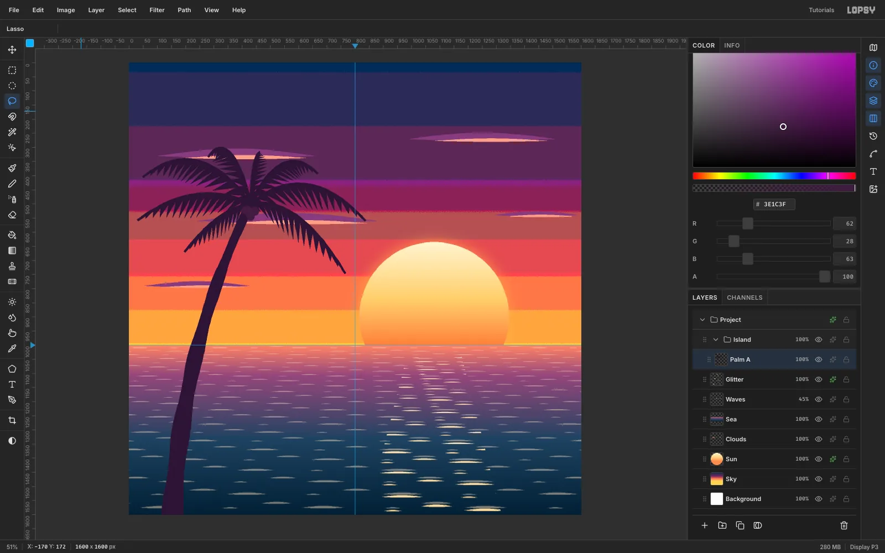

Select Glitter and click **New Group**. Name the group *Island*, then add a
layer inside it called *Palm A*. Use plum `#2A1433` for everything.

1. **Trunk:** lasso a long, gently curved taper from off the bottom-left edge (about 70 px wide) up to a crown a little over a quarter of the way across and just under a third of the way down, where it's about 26 px wide.
2. **Fronds:** lasso eight arched crescents radiating from the crown. Each one has a smooth top edge and a saw-toothed lower edge of leaflets that hang down and sweep toward the tip. Make them 240–440 px long, and let the side fronds droop further than the top ones.
3. **Coconuts:** with a hard **Brush** (Size about 24) in `#3E1C3F`, click three overlapping dabs under the crown.

Hanging leaflets on arched stems are what make it read as a coconut palm. If
the leaflets stick out straight on both sides, it looks like a pine branch.

## Copy, flip and scale the second palm

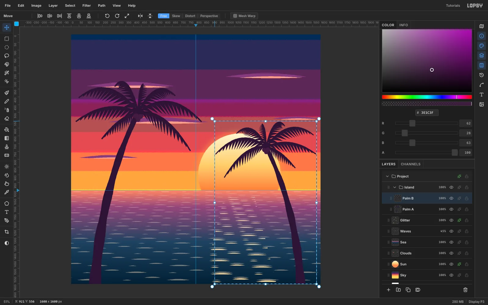

There's no need to draw the second palm from scratch.

1. Marquee the whole canvas, then [[Cmd+C]] and [[Cmd+V]]. Rename the pasted layer *Palm B*.
2. Marquee the canvas again and, with the **Move** tool, click **Flip Horizontal**. Press [[Cmd+D]].
3. Marquee the new palm. Hold [[Cmd]] and drag its top-left corner handle toward the opposite corner, to about **80%** (Cmd keeps the scale uniform). Press [[Cmd+D]].
4. Marquee it once more and drag it about **190 px** right, so the crown sits over the right side of the sun and the trunk leaves the canvas at the right edge.

## Build the stilt bungalow

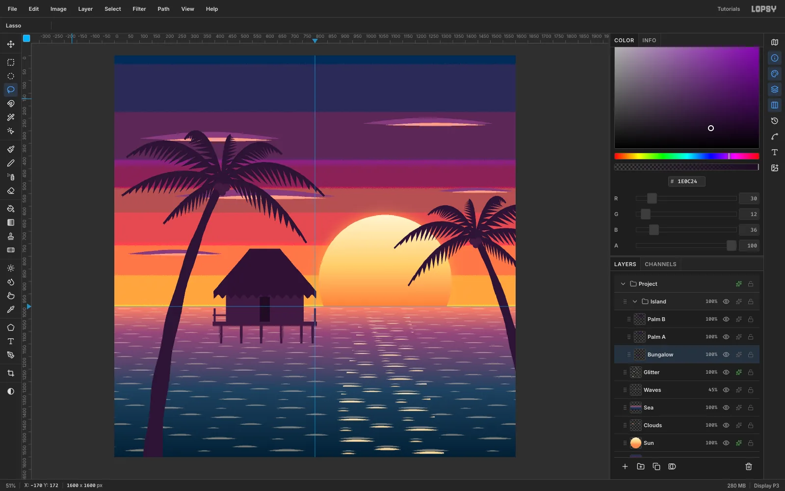

With Palm A selected, add a *Bungalow* layer and fill lasso shapes:

- **Walls, deck, rail, six stilts and two torch posts:** `#3B1B40`. Centre the hut about 200 px left of the centre guide, clear of the sun. The walls are about 310 px wide and 125 px tall and straddle the horizon. The deck is an 18 px band along their base, and the stilts drop about 70 px below it into the sea.
- **Roof:** `#2B1333`, a hip roof from a 120 px ridge about 165 px above the walls, flaring out to eaves that overhang each wall by about 50 px. Its lower edge zig-zags in 17 px steps for the thatch fringe.
- **Door:** `#1E0C24`.

Drag the Bungalow row below Palm A by its grip, so the palm trunk passes in
front of the hut.

## Add thatch texture with Fibers

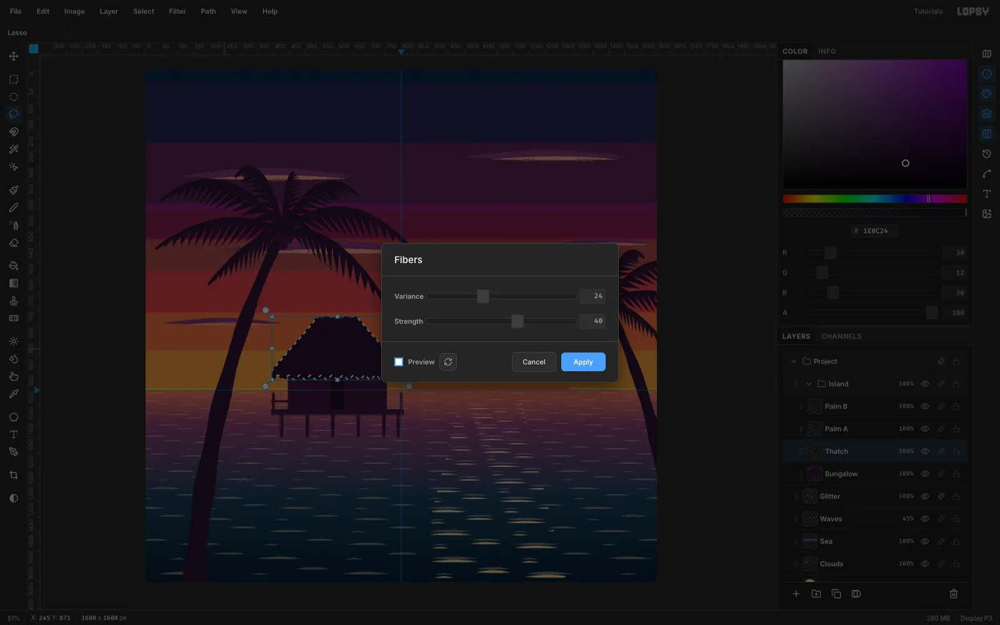

Add a *Thatch* layer above Bungalow and lasso the roof shape again. Choose
**Filter → Fibers…** and set **Variance** 24 and **Strength** 40. The filter
only fills the selection.

Deselect, set the layer to **Overlay**, and set it to **55%**. The strands
now read as straw on the dark roof.

## Light the windows and torches

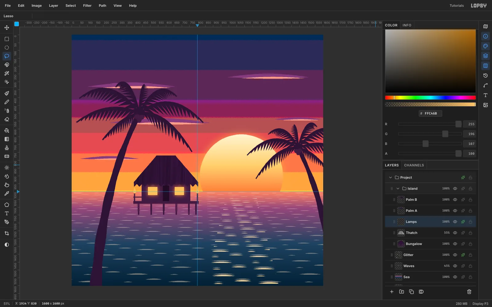

Add a *Lamps* layer above Thatch and fill two window rectangles and two small
flame shapes on top of the torch posts, all in `#FFC46B`.

Turn on **Outer Glow**: colour `#FF9A48`, **Size** 40, **Spread** 5,
**Opacity** 85. These warm points are the second focal point after the sun.

## Reflect the stilts in the water

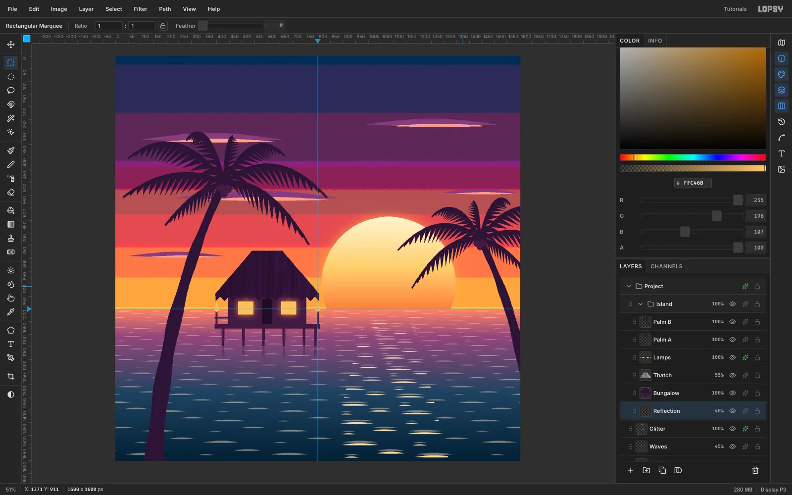

1. Duplicate the Bungalow layer and rename the copy *Reflection*. The copy lands 10 px right and 10 px down.
2. Marquee around the hut and click **Flip Vertical** in the Move options. Press [[Cmd+D]].
3. With the Move tool, drag the flipped copy so its stilts line up with the originals and its top meets the bottoms of the stilts.
4. Marquee everything from about 75 px below the stilt tips to the bottom edge, **Feather** it by **40**, and press [[Delete]]. Only the stilt reflections are left, and they fade out before the title area.
5. Run **Filter → Motion Blur…** with an **Angle** of 90 and a **Distance** of 18. Set the layer to **40%** and drag it below Bungalow.

## Paddle out a canoe

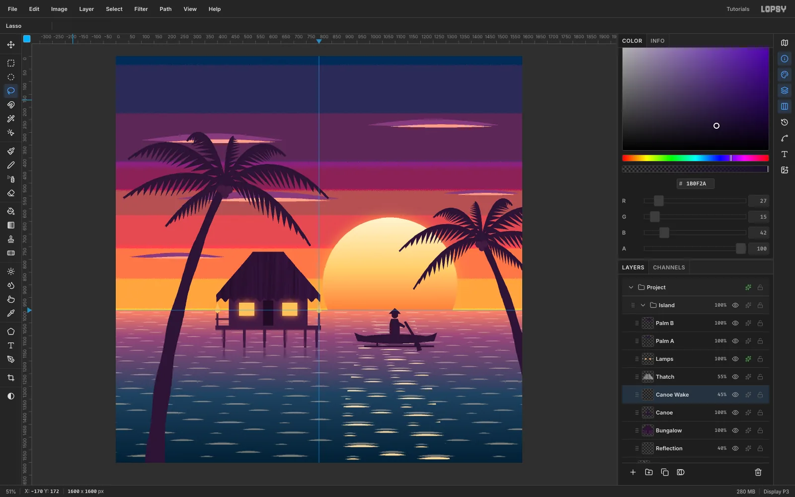

Add a *Canoe* layer and lasso these shapes in `#2A1433`:

- An upturned hull about 320 px long, sitting on the glitter path with its waterline a little below the bungalow deck
- A seated figure with a conical hat and one arm reaching to the paddle
- An angled paddle and a thin outrigger float

Below it, on a *Canoe Wake* layer at **45%**, fill a very thin 380 px lens in
`#1B0F2A`. Placing the canoe on the glitter path makes it read as a
silhouette.

## Start the trade-dress band

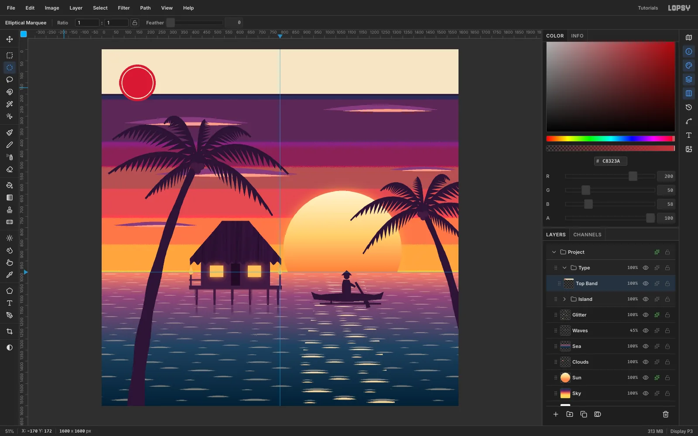

Collapse Island. Select Glitter, click **New Group**, name it *Type*, and drag
its row above Island. Inside Type, add a layer called *Top Band*.

1. Fill a rectangle across the full width, from the top edge down to an eighth of the height (200 px), with `#F4E6C8`. For the rule along its bottom edge, pick the **Pencil** ([[N]]) at Size 6 in `#24102E`, click at the left edge 3 px above the band's bottom, and [[Cmd+Shift]]-click at the right edge.
2. Build the badge near the left end of the band, about 160 px in from the left edge and low enough to hang over the rule. Stack three **Elliptical Marquee** fills on the same centre: red `#C8323A` about 164 px across, cream at 144 px, and red again at 136 px. The result is a red disc with a thin cream ring.

> **Tip:** Circles that share a centre are easiest with typed corners. Deselect before each one, click once with the Elliptical Marquee, and enter From 78, 68 To 242, 232 for the outer disc, From 88, 78 To 232, 222 for the cream, and From 92, 82 To 228, 218 for the inner red.

## Cut the badge onto its own layer

The badge needs to rotate on its own, so move it off the band. Marquee a
circle about **168 px** across around it, just outside its red edge, and
press [[Cmd+X]], then [[Cmd+V]]. The badge pastes back in place on a new
layer. Rename it *Badge*.

## Letter and tilt the badge

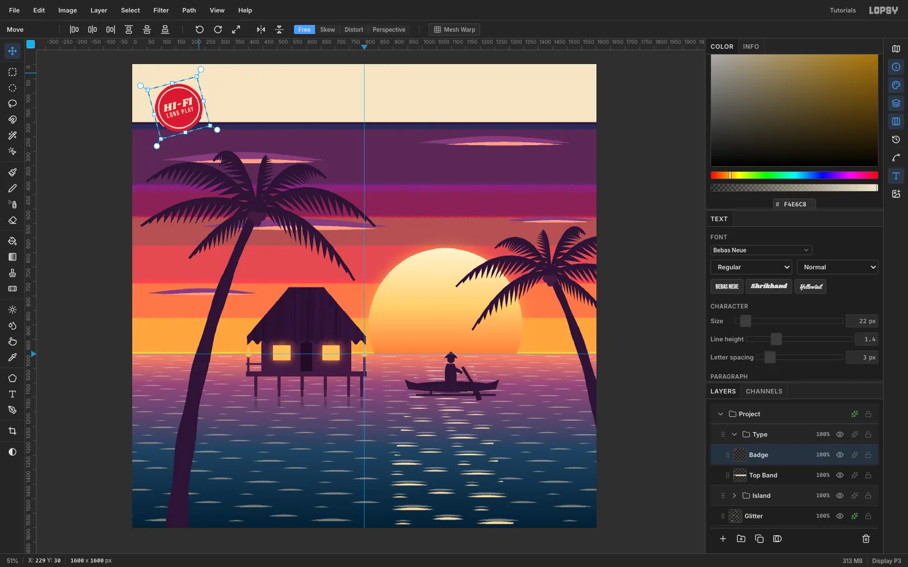

Set **HI-FI** in **Shrikhand** at 36 px and **LONG PLAY** in **Bebas Neue**
at 22 px with 3 px letter spacing, both in `#F4E6C8`. Create each one in
empty canvas, then move them so the pair is centred on the badge.

1. Select each text layer and click **Rasterize Layer**, then use **Layer → Merge Down** twice so both land on Badge.
2. Marquee the badge. With the **Move** tool, drag a corner rotation handle about **−15°**. Press [[Cmd+D]].

> **Tip:** Check the **Letter spacing** value in the Text panel before each new text layer. It carries over from the last text you set.

## Set the credit line and catalog number

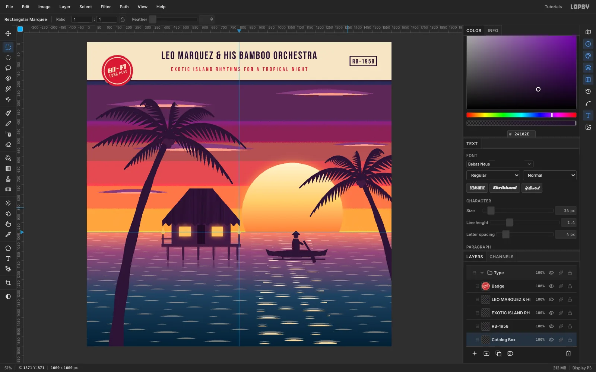

With Top Band selected (so the new text lands above it):

- **LEO MARQUEZ & HIS BAMBOO ORCHESTRA:** Bebas Neue 56 px, `#24102E`, letter spacing 4, about 48 px below the top edge.
- **EXOTIC ISLAND RHYTHMS FOR A TROPICAL NIGHT:** Bebas Neue 30 px, `#C8323A`, letter spacing 7, under the first line with a small gap.
- **RB-1958:** Bebas Neue 34 px, `#24102E`, letter spacing 4, with its right edge about 90 px in from the canvas edge.

Centre both headline lines on the centre guide. The **Move** tool's **Align
center horizontally** button does it in one click. On a *Catalog Box* layer,
fill a rectangle that leaves about 15 px of padding around RB-1958. Then use
**Select → Shrink…** by **3** and press [[Delete]] to leave a thin frame.

## Stack the title over the sea

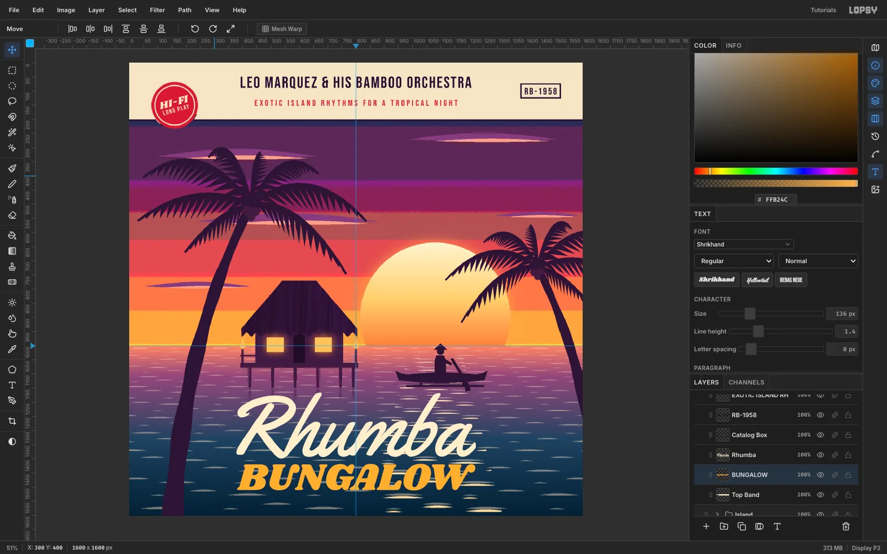

Create each word in empty canvas, then position it:

- **Rhumba:** **Yellowtail** 300 px, `#FFF0CF`. Place it in the sea below the bungalow and canoe, centred on the canvas.
- **BUNGALOW:** **Shrikhand** 136 px, any orange for now. Place it directly under Rhumba, with its left edge in line with Rhumba's.

At these sizes both words are about 845 px wide, so they stack as a lockup.
The script's baseline sits just above the slab, and the bottom margin is
about 90 px.

## Fill BUNGALOW with a sunset gradient

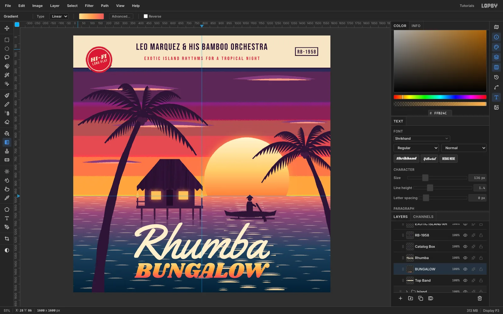

1. Select BUNGALOW and click **Rasterize Layer**.
2. [[Cmd]]-click its thumbnail to select just the letters.
3. Click **Add Layer**, then drag a linear gradient through the letter height from `#FFE08A` through `#FFA24C` to `#F2555A`.
4. Deselect and use **Merge Down** to bake the gradient into the letters.

## Give the type one hard shadow

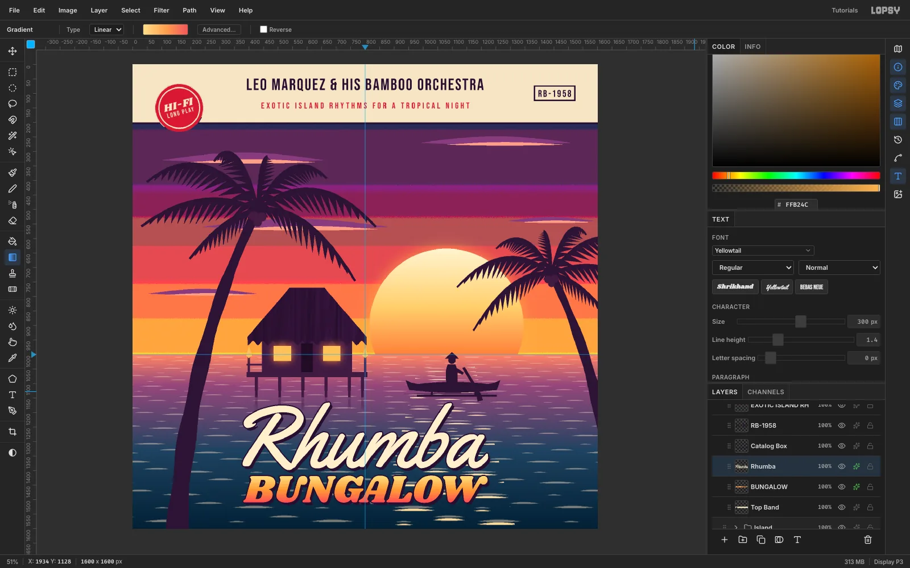

Give both Rhumba and BUNGALOW the same effects:

- **Drop Shadow:** `#24102E`, **Offset X** 7, **Offset Y** 9, **Blur** 0, **Spread** 0, **Opacity** 100
- **Stroke:** `#24102E`, **Width** 4

Use one depth treatment for all the display type. The title then reads as a
single printed plate instead of two unrelated effects.

## Screen-print the sky with Halftone

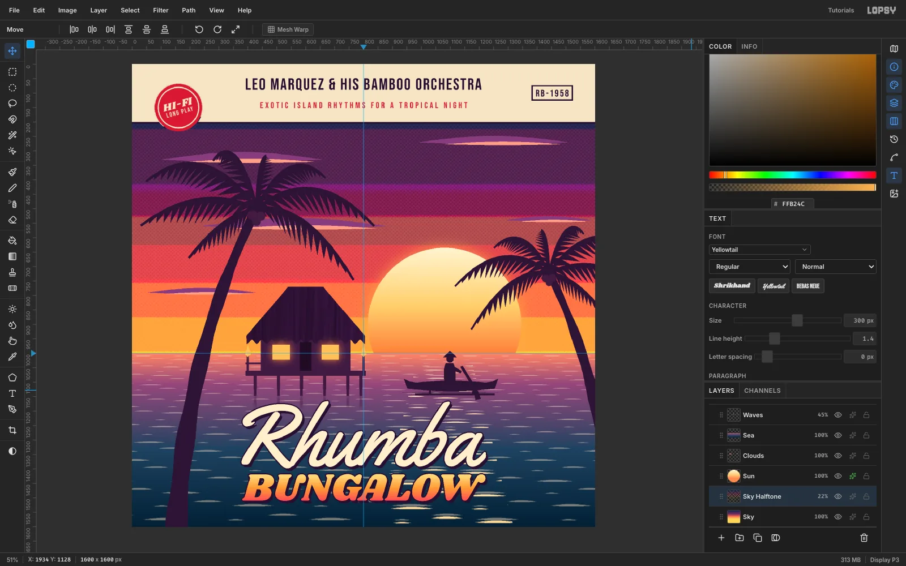

Duplicate the Sky layer and rename the copy *Sky Halftone*. Run
**Filter → Halftone…** with **Dot Size** 9, **Angle** 45 and **Softness** 1.
Set the layer to **Multiply** at **22%**.

The dots only show up close, but they give the sky a printed texture.

## Age the sleeve with ring wear and grain

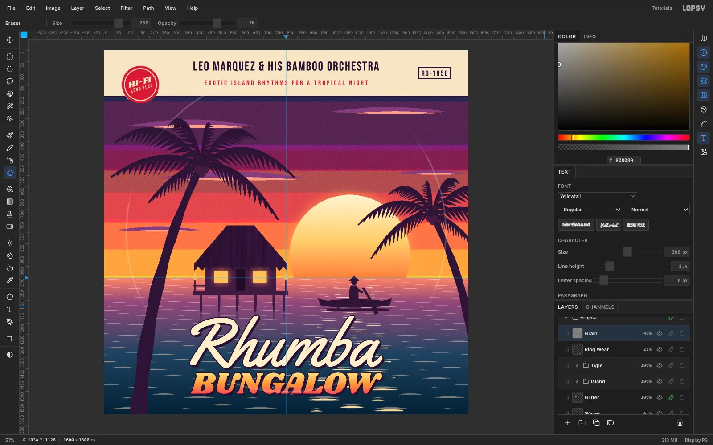

Old sleeves wear a pale circle where the record inside rubs through.

1. Add a *Ring Wear* layer at the root and drag it above the Type group.
2. Fill a circle about **1410 px** across, centred on the canvas, with `#FFF3DC` (typed corners: From 95, 95 To 1505, 1505). Use **Select → Shrink…** by **5**, then [[Delete]] to leave a thin ring.
3. Run **Gaussian Blur** with a **Radius** of 3 and set the layer to **Screen**.
4. With a soft **Eraser** (**Size** 260, **Opacity** 70), drag along four stretches of the ring to break it up.

For grain, add a *Grain* layer, **Edit → Fill** it with `#808080`, and run
**Filter → Add Noise…** at an **Amount** of 60 with **Mono**. Set it to
**Soft Light** at **40%**.

## Refine the layout

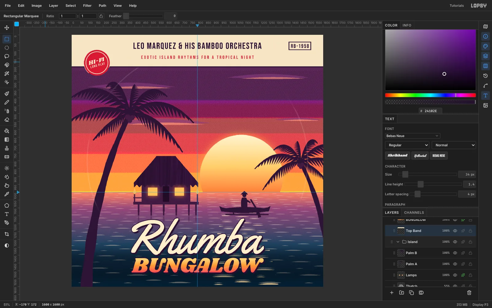

Step back and fix what competes:

- **Ring Wear:** marquee the band, from the top edge to just below its rule, press [[Delete]], and drop the layer to **12%**. The worn ring should never cross the cream band.
- **Clouds:** set the layer to **60%** and delete the low-left streak that crowded the hut roof.
- **Band edge:** on Sky, marquee the thin navy strip that Posterize left just under the rule and fill it with the next band's colour, `#552A55`.
- **Catalog box:** nudge the box and RB-1958 up 30 px so they're centred on the credit line.
- **Badge:** nudge it down 27 px, so it stamps further into the sky. Fill the band's hole behind its old position with cream and redraw the rule there.
- **Title Shade:** on a new *Title Shade* layer under Island, marquee a full-width band from just above BUNGALOW to just below it, feather it by 60 and fill it with `#07182A`. Set it to **Multiply** at **45%** so the slab lettering reads clearly against the water.
- **Palms:** move Palm A 60 px left so its trunk clears the R, and scale Palm B to 90% toward the right edge.

Save the project, then choose **File → Quick Export PNG**.
