Alpine folk art, such as Swiss and Tyrolean *Bauernmalerei* painted furniture
and cut-paper *Scherenschnitte*, runs on a few simple rules:

- a small set of flat, earthy colours
- shapes repeated with strict symmetry
- hearts, tulips and edelweiss wherever there's a gap

In this tutorial you'll use those rules for a zine cover called **YODEL of
the Uplands**. It has a dotted red border, two crossed alphorns, and a painted
mountain medallion with a sunburst and a scalloped ring. A woodtype title, a
swallowtail ribbon and a halftone print texture finish it off.

Along the way you'll use:

- the Brush's **Radial Symmetry**, **Spacing** and **Taper**
- lasso and elliptical marquee fills
- **Duplicate**, **Flip Horizontal** and rotation handles
- groups, layer effects and Google fonts
- **Copy Merged** and the **Halftone** filter

The palette has six colours: red `#B3261E`, fir green `#1E4D2B`, ochre
`#D4A017`, cream `#F4EAD2`, ink `#2A1E17` and paper `#EFE3C8`. The sky is a
slate blue, `#6E8FB0`.

## Make the paper

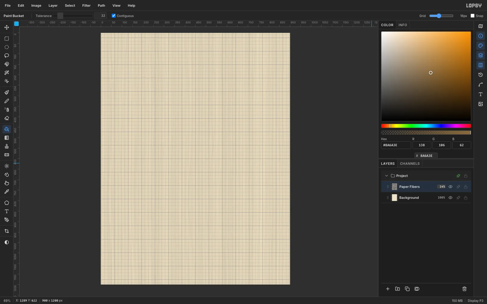

Open [Lopsy](/). In the **New Document** dialog, set **Width** to `900`,
**Height** to `1200` and **Background** to **White**, then click **Create**.

Select **Background**. In the Color panel's hex field, set the foreground to
`#EFE3C8`. Press [[G]] for the **Paint Bucket** and click the canvas. Then add
a little tooth: choose **Filter → Add Noise…**, pick **Mono** and **Gaussian**,
set **Amount** to `4` and click **Apply**.

Double-click **Layer 1** and rename it `Paper Fibers`, then:

1. Set the foreground to `#8A6A3E`.
2. Choose **Filter → Fibers…**, set **Variance** `20` and **Strength** `48`, and click **Apply**.
3. Open the layer's effects (the ✦ button on its row) and set **Blend** to **Multiply**.
4. Set the row's opacity to `14%`.

## Cut the frame with the grid

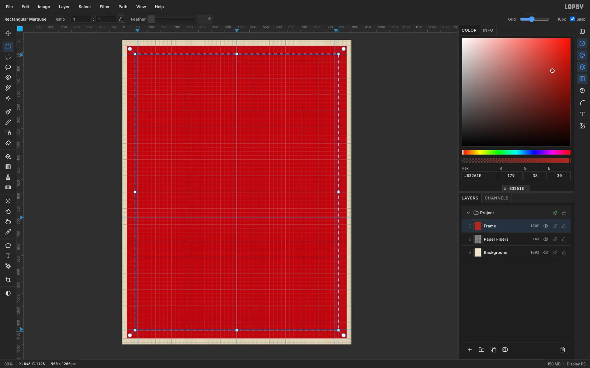

Choose **View → Show Grid**. Showing the grid switches **Snap** on in the
options bar, and the grid is 16 px.

Click the top ruler at `60`, `450` and `840` for vertical guides, and the left
ruler at `60`, `700` and `1140` for horizontal ones. The `450`/`700` crossing
is the centre of the medallion you'll paint later.

1. Click **Add Layer** and name the layer `Frame`. Set the foreground to `#B3261E`.
2. With the **Rectangular Marquee** ([[M]]), drag from about (20, 20) to (880, 1180). Snap pulls the edges onto the grid.
3. Fill it with the Paint Bucket.
4. Marquee from (52, 52) to (848, 1148) and press [[Delete]] to hollow it out.
5. Press [[Cmd+D]] to deselect, then **untick Snap**. The rest of the cover uses exact positions.

## Add frame dots and heart corners

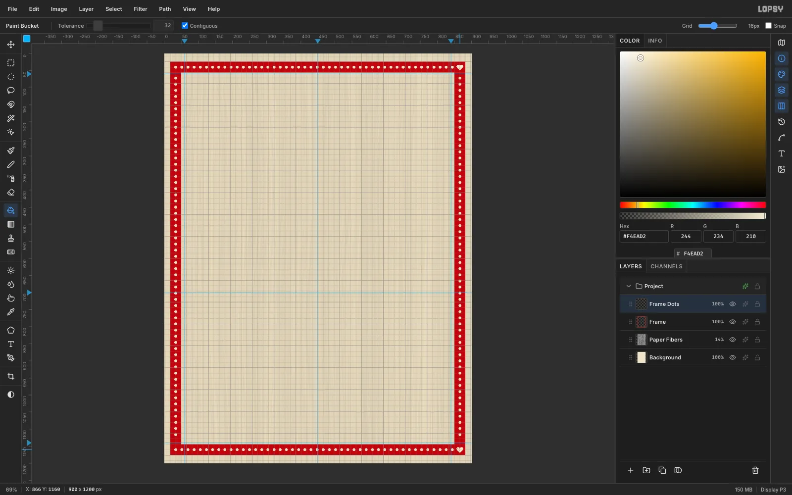

Add a layer named `Frame Dots` and press [[B]] for the **Brush**. Open the
brush presets. On the **Shape** tab, set **Size** `9`, **Hardness** `100` and
**Spacing** `355`. With spacing that wide, a stroke lays down separate dots.

Set the foreground to cream `#F4EAD2`. Draw each side with a click and a
[[Shift]]-click, which paints a straight dotted line:

- top: (34, 40) to (866, 40)
- bottom: (34, 1160) to (866, 1160)
- left: (34, 72) to (34, 1128)
- right: (866, 72) to (866, 1128)

Finish the corners with small hearts. Draw a 20 px heart with the **Lasso**
([[L]]) on each corner square and fill it cream.

> **Tip:** The Paint Bucket fills the colour you click. If your click lands on a dot, it only recolours that dot, so click the empty part of the heart instead.

## Draw an alphorn

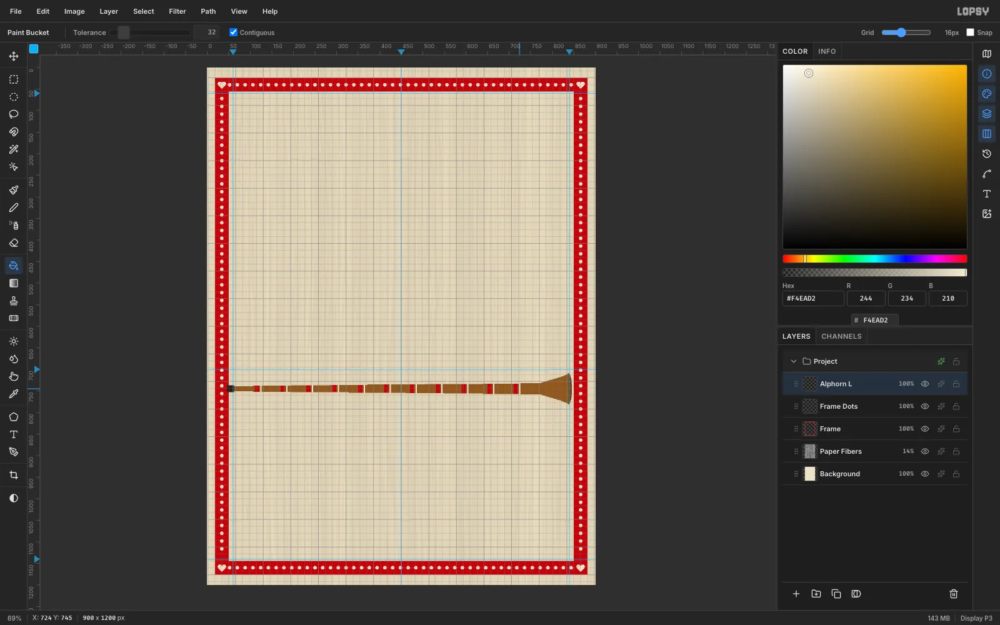

Add a layer named `Alphorn L`. Build the horn lying flat across the middle,
and rotate it later.

1. **Body:** with the Lasso, trace a long taper. Start at (62, 739), go to (772, 732), flare out to (838, 711), come down to (838, 779), back to (772, 758) and (62, 751), then release. Fill it with `#8A5A2B`.
2. **Mouthpiece:** marquee a 16 × 16 square at (46, 737) and fill it with ink `#2A1E17`.
3. **Bell rim:** with the **Elliptical Marquee**, drag a 16 × 72 oval at (830, 709) and fill it with `#6B4320`.
4. **Bands:** every 60 px from x `110` to `710`, marquee a 10 px-wide strip from y `700` to `790` and bucket-click the horn inside it with red `#B3261E`. Then add a 3 px cream strip 13 px to the right of each red band.

Because the bucket only floods the horn's brown pixels, each band wraps the
horn neatly without spilling onto the paper.

## Duplicate and flip the second horn

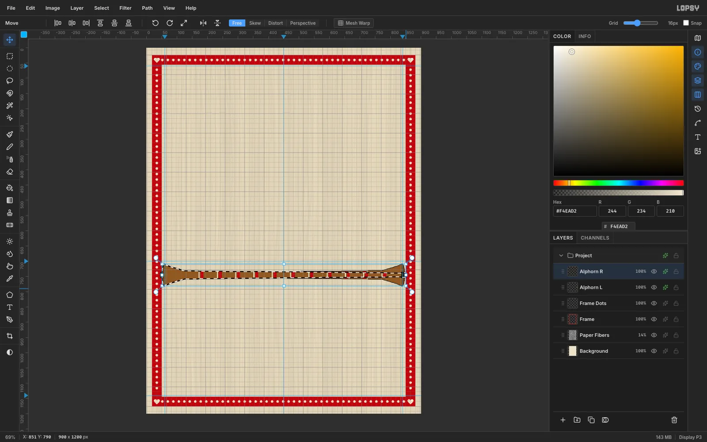

Give the horn an outline first so that both copies get it. Open **Alphorn L**'s
effects, tick **Stroke**, and set **Width** `2`, position **outside**, colour ink.

Click **Duplicate Layer** and rename the copy `Alphorn R`. If the copy lands
offset, use the **Move** tool ([[V]]) and the arrow keys to put it exactly on
top of the original.

Marquee from (46, 700) to (851, 790) around the horn. Press [[V]] and click
**Flip Horizontal** in the options bar. The bell now points left.

> **Tip:** After you click an options-bar button, click the status bar before you press any keys. The button keeps keyboard focus, so pressing [[Enter]] or [[Space]] clicks it again and flips the horn back.

Press [[Cmd+D]].

## Rotate the horns into an X

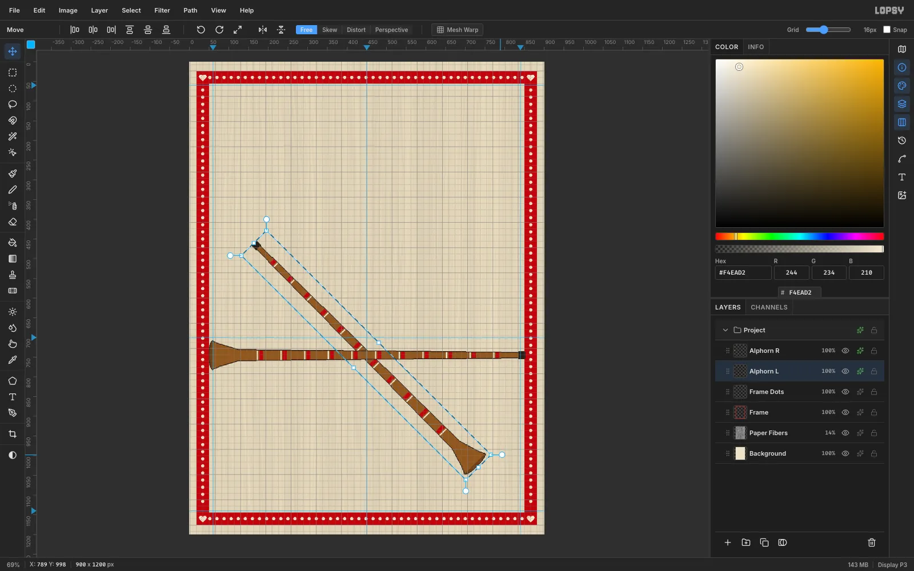

Select **Alphorn L** and marquee the same (46, 700) to (851, 790) box. With the
Move tool, drag the **top-right rotation handle** (the circle just outside the
corner) clockwise. Hold [[Cmd]] so it snaps in 15° steps, and stop at **45°**,
with the bell pointing to the lower right. Press [[Cmd+D]] to commit.

## Cross the second horn

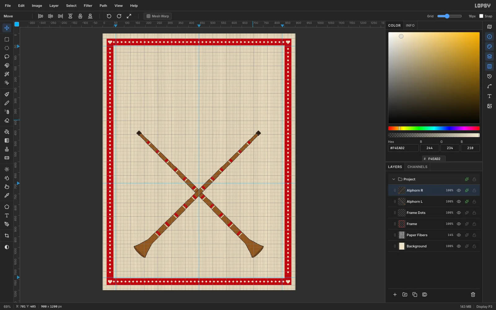

Select **Alphorn R**, marquee the same box, and rotate it **45°
counter-clockwise** so its bell points to the lower left. Press [[Cmd+D]].

The two horns now cross at the centre guide. The medallion will cover the
crossing, leaving the mouthpieces and bells showing like an emblem.

## Paint the sky disc and sunburst

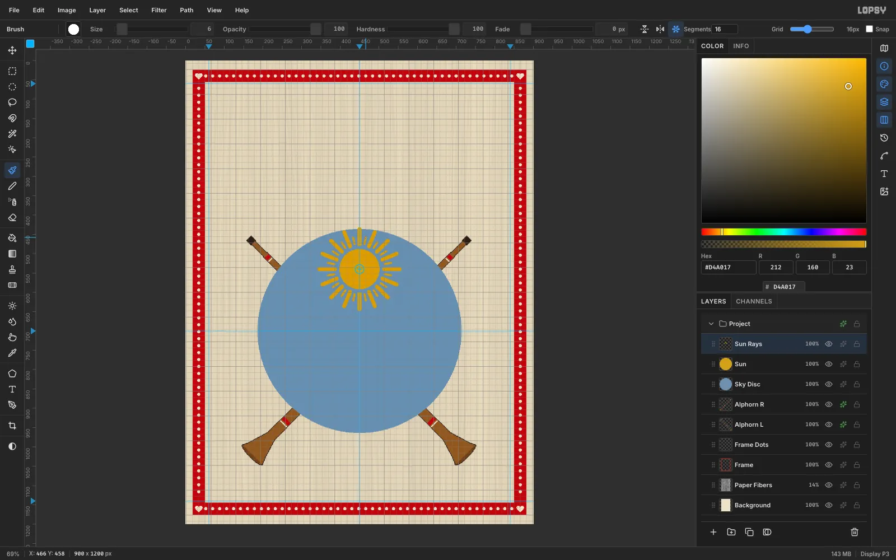

Select **Alphorn R** and add a layer named `Sky Disc`. Drag an **Elliptical
Marquee** of 528 × 528 at (186, 436) and fill it with `#6E8FB0`.

Add a layer named `Sun`, marquee a 104 × 104 circle at (398, 488), and fill it
with ochre `#D4A017`.

Next, add a layer named `Sun Rays` and select the Brush. In the brush presets,
set **Spacing** back to `10` and **Size** to `11`. Then:

1. Click **Radial Symmetry** in the options bar and set **Segments** to `16`.
2. [[Cmd]]-click the sun's centre at (450, 540) to move the symmetry centre there.
3. Drag straight up from (450, 476) to (450, 436). Sixteen rays appear at once.
4. For the short rays in between, set **Size** to `6` and drag from (463, 475) to (466, 458).
5. Click **Radial Symmetry** again to turn it off.

## Build the mountains and hills

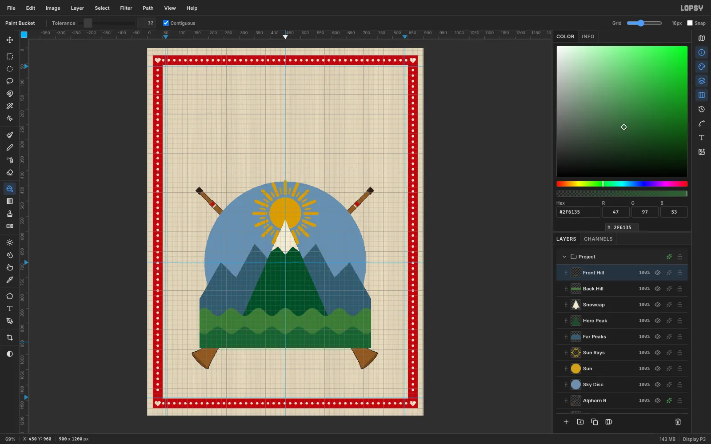

Folk painting likes mirror symmetry, so keep every shape balanced around the
450 guide. Add one layer per shape, lasso it, and fill it:

- **Far Peaks** `#3B5A6E`: a zigzag through (170, 820), (240, 700), (290, 750), (350, 640), (420, 720), (450, 690), then the mirror image out to (730, 820). Close it along the bottom at y 980.
- **Hero Peak** fir green `#1E4D2B`: a triangle (296, 910), (450, 560), (604, 910).
- **Snowcap** cream: (450, 560), (496, 664), (474, 648), (450, 674), (426, 648), (404, 664).
- **Back Hill** `#4B7A3C`: a band with a wavy, scalloped top around y 862 (about 88 px per wave), closed at the bottom.
- **Front Hill** `#2F6135`: the same wave around y 922, offset by half a wave.

## Add the chalet and fir trees

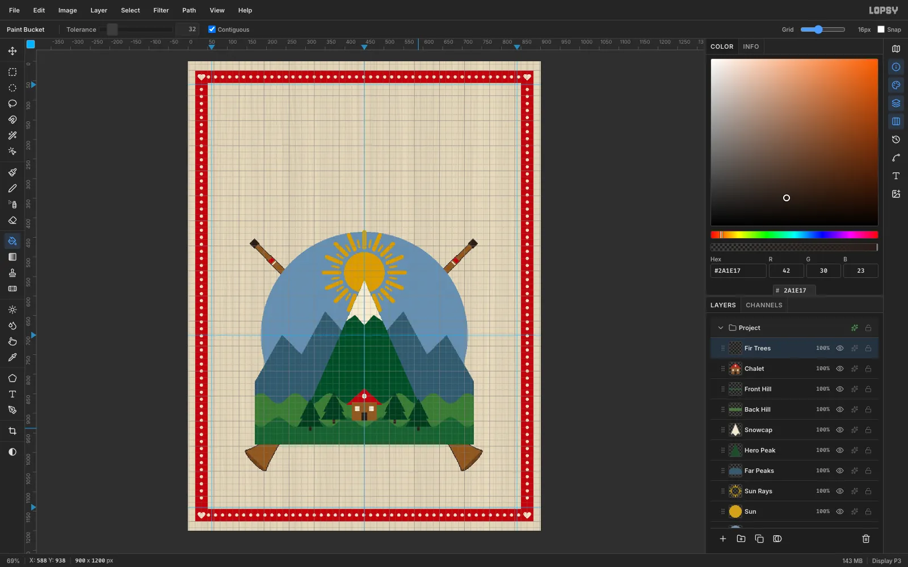

Select **Front Hill** and add a layer named `Chalet`:

- body: a 64 × 46 rectangle at (418, 872) in `#8A5A2B`
- roof: a red triangle (404, 878), (450, 836), (496, 878)
- windows: two cream 12 px squares at (426, 882) and (462, 882), and a round 12 px window at (444, 850)
- door: an ink 14 × 20 rectangle at (443, 898)

Add a `Fir Trees` layer. Each tree is two stacked lasso triangles in
`#163B21` plus a short ink trunk. Put two trees at x `372` and `528` (base at
y 916) and two smaller ones at x `312` and `588` (base at y 934).

## Clip the landscape to the disc

The peaks and hills overhang the disc. To trim them:

1. Drag the 528 × 528 elliptical marquee at (186, 436) again.
2. Choose **Select → Inverse**.
3. Click each of **Fir Trees**, **Chalet**, **Front Hill**, **Back Hill**, **Far Peaks** and **Sun Rays** in turn, pressing [[Delete]] after each one. The selection stays put while you switch layers.
4. Press [[Cmd+D]].

## Add scallops, ring and dots

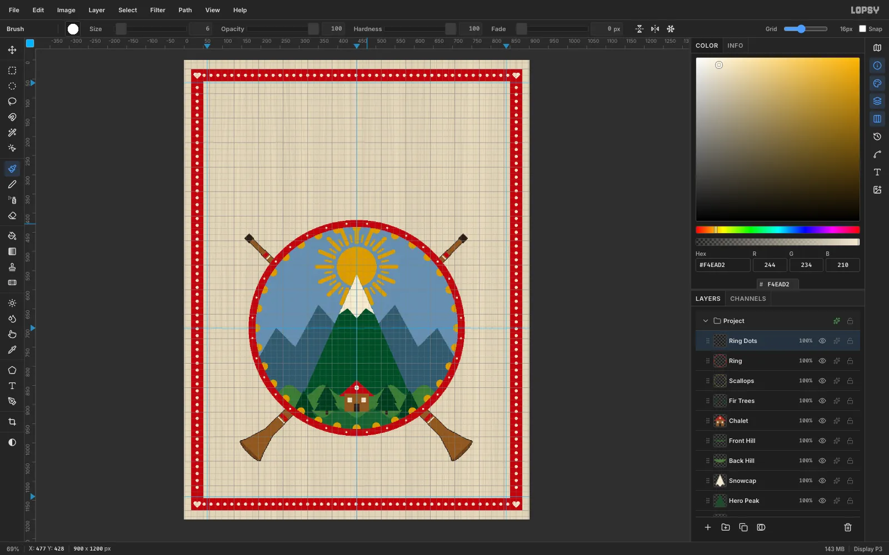

Select **Fir Trees** and add a layer named `Scallops`. With the Brush at
**Size** `22` in ochre, turn on **Radial Symmetry** with `32` segments.
[[Cmd]]-click the medallion centre (450, 700), then click once at (450, 438).
Thirty-two half-hidden dabs make a scalloped inner edge.

Add a `Ring` layer. Fill a 564 × 564 elliptical marquee at (168, 418) with red,
then marquee the 528 disc at (186, 436) and press [[Delete]]. This leaves a
clean 18 px ring.

Add `Ring Dots`, set the brush to **Size** `6` in cream, and keep 32 radial
segments centred on (450, 700). Click once at (477, 429). That point is
rotated half a step from the scallops, so the dots sit between them. Turn
radial symmetry off.

## Turn the front hill into a golden field

The dark firs disappear against the dark front hill. Open **Front Hill**'s
effects, tick **Color Overlay** and set the colour to `#C99A2E`. The hill turns
into a harvest field. Because it's an effect rather than a repaint, you can
still change the colour later.

## Group the horns and the medallion

Select **Ring Dots** and add a layer named `Ribbon Tails`. It sits above
everything you'll group, so new work lands on top.

Click **Ring Dots**, [[Shift]]-click **Sky Disc**, and click **Group Layers**.
Name the group `Medallion`. Do the same with **Alphorn R** and **Alphorn L**
and name that group `Alphorns`. Collapse both groups to keep the panel short.
You can now select a whole group and move it as one piece.

## Draw the swallowtail ribbon

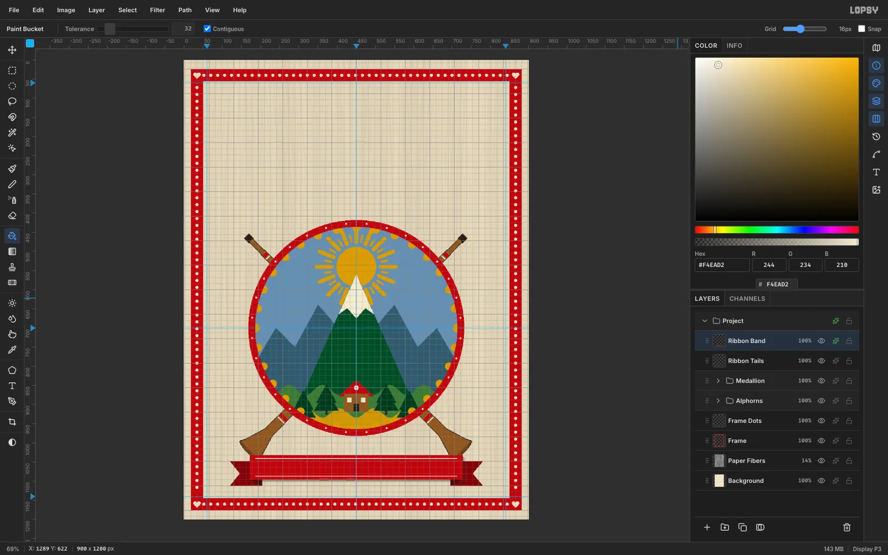

On **Ribbon Tails**, lasso the left tail with `#7A1712`: (120, 1048),
(204, 1048), (204, 1112), (120, 1112), with the notch point at (146, 1080).
Draw its mirror image on the right, from x 780 to 696. Add two small
fold triangles in `#4A0E0A` where the band meets the tails, at
(172–204, 1096–1112) and (696–728, 1096–1112).

Add a layer named `Ribbon Band`. Fill a 556 × 64 rectangle at (172, 1032) with
red, then add two 2 px cream rules at y `1040` and `1086`, from x 186 to 714.

Finally, open the band's effects, tick **Drop Shadow**, and set **Offset X**
`4`, **Offset Y** `5`, **Blur** `4`, colour ink and **Opacity** about `40`.

## Set the issue line

With **Ribbon Band** still selected, press [[T]] for the **Text** tool:

1. Open the **Font** browser, search `Special Elite` and click it. Set **Size** to `30` and the foreground to cream.
2. Click an empty spot near the bottom of the canvas, type `ZINE No. 7  -  HERBST 2026`, and press [[Tab]] to commit.
3. With the Move tool, drag the text onto the ribbon so it's centred at (450, 1064).

## Add the tagline

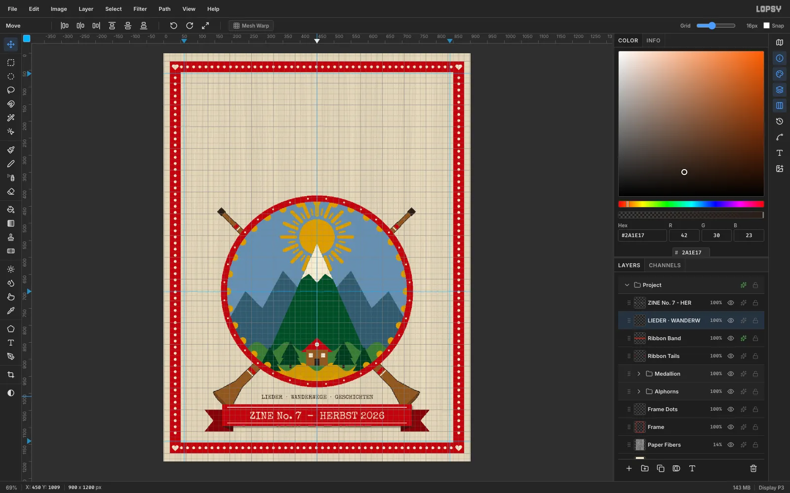

Click **Ribbon Band** again so the new type doesn't restyle the issue line.
Keep **Special Elite**, but set **Size** to `17` and the foreground to ink.

Copy `LIEDER  ·  WANDERWEGE  ·  GESCHICHTEN` to your clipboard. Click an empty
spot and **paste** it with [[Cmd+V]]. The middle dots are easiest to paste
rather than type. Press [[Tab]], then move the tagline to centre it at
(450, 1009).

## Set the woodtype title

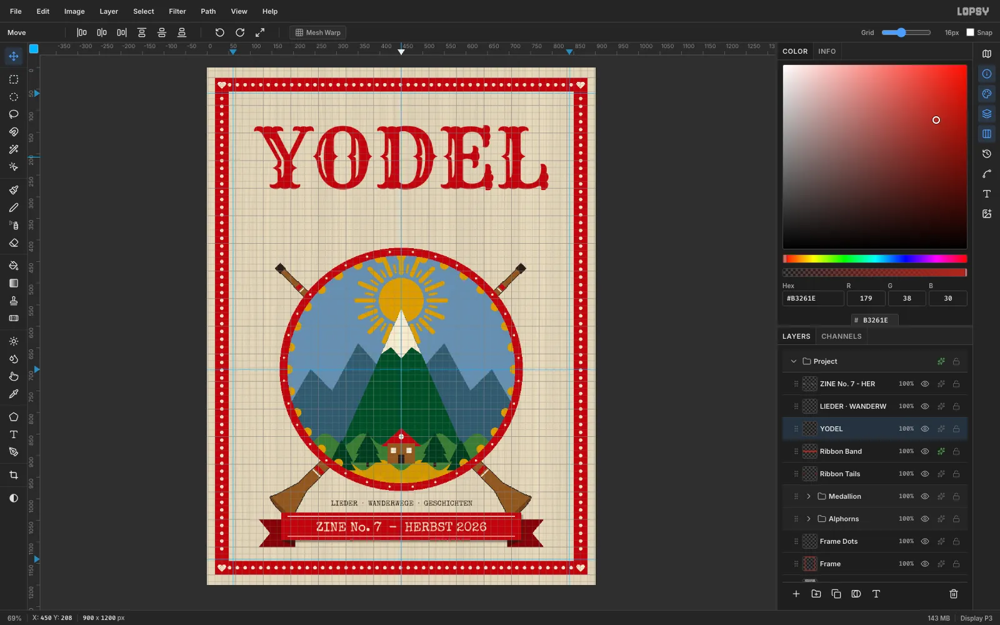

Select **Ribbon Band**. In the Text tool, pick **Rye**, a Western woodtype
face that suits folk posters. Set **Size** to `190` and the foreground to red.

Wait a moment for the font to download, then click at about (110, 80), type
`YODEL` and press [[Tab]]. Nudge it with the Move tool until it's centred on
the 450 guide.

## Give the title a cream outline and ink shadow

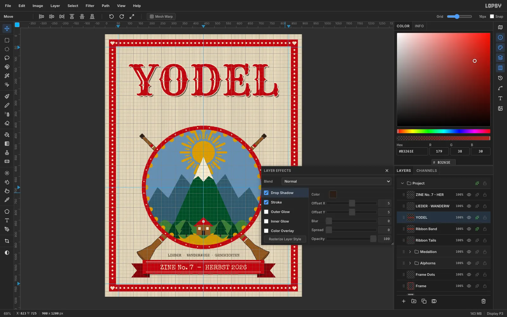

Open **YODEL**'s effects:

- **Stroke:** **Width** `3`, **outside**, cream.
- **Drop Shadow:** **Offset X** and **Offset Y** `5`, **Blur** `0`, colour ink, **Opacity** `75`.

The hard, unblurred shadow gives the title the slightly raised look of printed
woodtype.

## Add the subtitle and ornaments

Select **Ribbon Band** and set type again: **Berkshire Swash**, **Size** `64`,
fir green. Type `of the Uplands`, commit, and centre it at (450, 334).

Add a layer named `Ornaments`:

- two red lasso hearts about 38 px wide at (206, 338) and (694, 338)
- two 3 px ochre rules, 120 px long, at (300, 390) and (480, 390)
- a tiny ochre heart between the rules at (450, 392)

## Grow a vine in the margin

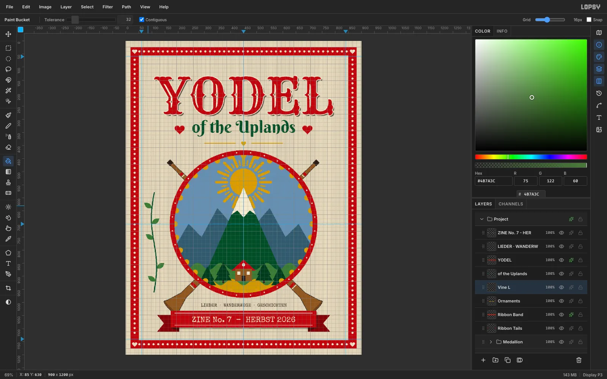

Add a layer named `Vine L`. In the brush presets, set **Size** `5`,
**Spacing** `10` and **Taper** `0`. Paint a gently wavy fir-green stem up the
left margin, from (108, 960) to (108, 580).

For the leaves, lasso small almond shapes, about 36 px long and tilted
upwards, and fill them with `#4B7A3C`. Alternate sides at y `920`, `870`,
`760`, `700` and `640`.

## Add the tulip, heart and edelweiss

- **Tulip:** lasso a three-petal tulip on top of the stem, through (90, 590), (82, 556), (97, 568), (108, 538), (119, 568), (134, 556), (126, 590), (108, 600). Choose **Edit → Fill** with red. Add a small ochre flame in the middle the same way.
- **Heart:** lasso a small heart on the stem at (115, 815) and **Edit → Fill** it red.
- **Berries:** click a few ochre dots (**Size** `8`) beside the leaves.

> **Tip:** Use **Edit → Fill** for shapes that sit on top of the stem. The Paint Bucket would only recolour the stem pixels under your click, but Fill covers the whole selection.

For the **edelweiss**, set the brush **Taper** to `80` so each stroke ends in
a point. Turn on **Radial Symmetry** with `9` segments and [[Cmd]]-click
(108, 488) to centre it there. Then paint three layers of petals, each with a
single short outward drag:

1. green `#4B7A3C` bracts at **Size** `12`
2. cream petals at **Size** `14`
3. white highlights at **Size** `8`

Turn radial symmetry off and set **Taper** back to `0`. Finish with a cluster
of tiny ochre and brown dots in the centre.

## Mirror the vine

Duplicate **Vine L** and rename the copy `Vine R`. Marquee from (52, 420) to
(848, 1020). This box is centred on the 450 guide, so a flip mirrors the vine
exactly into the right margin.

Press [[V]], click **Flip Horizontal**, click the status bar, and press
[[Cmd+D]].

## Fake a slight misregistration

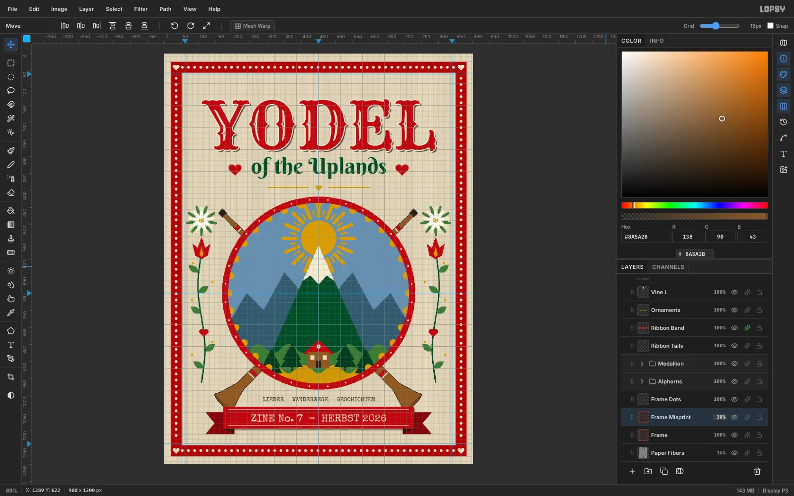

Screen prints and risographs never line up perfectly. To fake that:

1. Duplicate **Frame** and rename the copy `Frame Misprint`.
2. With the Move tool (and Snap off), press the right arrow **3** times and the down arrow **2** times.
3. Set the copy's blend mode to **Multiply** and its opacity to `30%`.

You get a faint darker edge, like a second plate that slipped.

## Add a halftone print texture

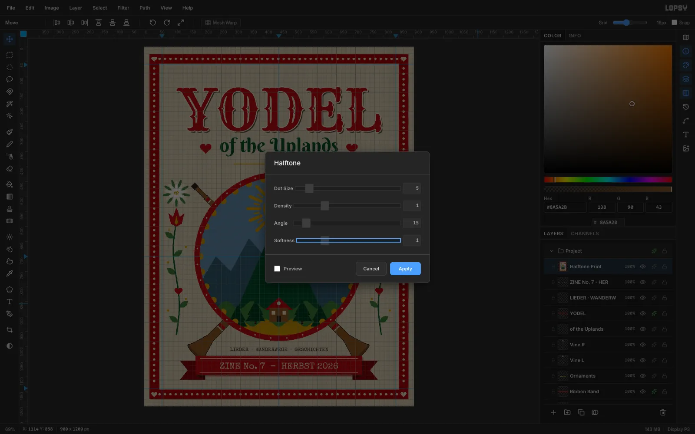

Select the top layer in the stack, then:

1. Choose **Select → All**, then **Edit → Copy Merged**, then **Edit → Paste**. This puts a flattened copy of the whole cover on a new layer.
2. Rename the layer `Halftone Print` and press [[Cmd+D]].
3. Choose **Filter → Halftone…**, set **Dot Size** `5`, **Density** `1`, **Angle** `15` and **Softness** `1`, and click **Apply**.
4. Set the layer to **Multiply** at `12%`.

The dots are only just visible, but they make every flat colour look printed
on paper.

## Export the cover

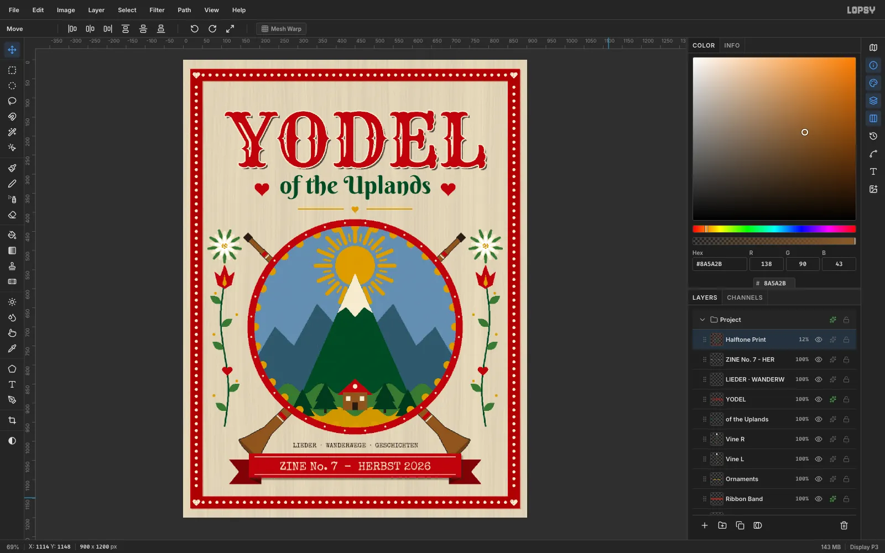

Turn off **View → Show Grid** and **View → Show Guides** to check the design
without them. Then choose **File → Quick Export PNG** for the image, and
**File → Save Project** to keep every layer, group and effect editable for the
next issue.

To keep going, swap the subtitle for another region or season, change
the ribbon text, or recolour the Front Hill overlay for a winter or spring
cover.
