Italian Futurists loved speed, noise and machines. Their posters threw
**lines of force** across the page, repeated a moving shape to show motion,
and set type on a slant in loud primary colours. This tutorial builds a
1200 × 1600 px flier for an imaginary concert of wind machines, using
those same ideas: a burst of rays behind a spinning fan, three coloured
echoes of the blades, and a heavy tilted slab for the lettering.

Nearly everything is a flat fill, so the work is mostly **Lasso** and
**Elliptical Marquee** shapes, a few **Pencil** lines and some live text.
The motion trail comes from duplicating one layer and turning it with the
**Move** tool's rotate handle.

The tools you'll meet along the way:

- **Filter → Sunburst** for two layers of rays
- the **Lasso** and **Elliptical Marquee**, plus **Select → Shrink**
- the **Pencil** with [[Shift]]-click straight lines
- the **Gradient** tool and **Filter → Halftone**
- **Duplicate Layer** and the **Move** tool's rotate handle
- layer effects: **Color Overlay**, **Stroke** and **Drop Shadow**
- **Anton**, **Oswald** and **IBM Plex Mono** text, rotated while it is still live text
- a layer **group**, and **undo / redo**

The palette is cream paper, a dimmer cream for small print, and four inks:

- Paper cream `#EFE3C8`, dim cream `#E8DCC0`
- Mustard `#E8A92C`
- Vermilion `#D9411E`
- Cobalt `#1F3FA8`
- Ink black `#16120E`

## Start with the paper

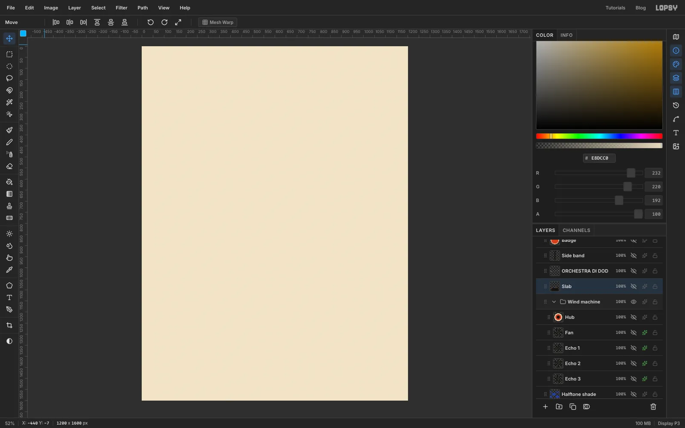

Choose **File → New**, set the units to **Pixels**, type **1200** and
**1600**, and click **Create**. Click the foreground colour box, type
`EFE3C8` in the hex field, then choose **Edit → Fill** to paint the
page cream, then double-click the layer's name and rename it **Paper**.
Everything else goes above it.

## Lay down the mustard rays

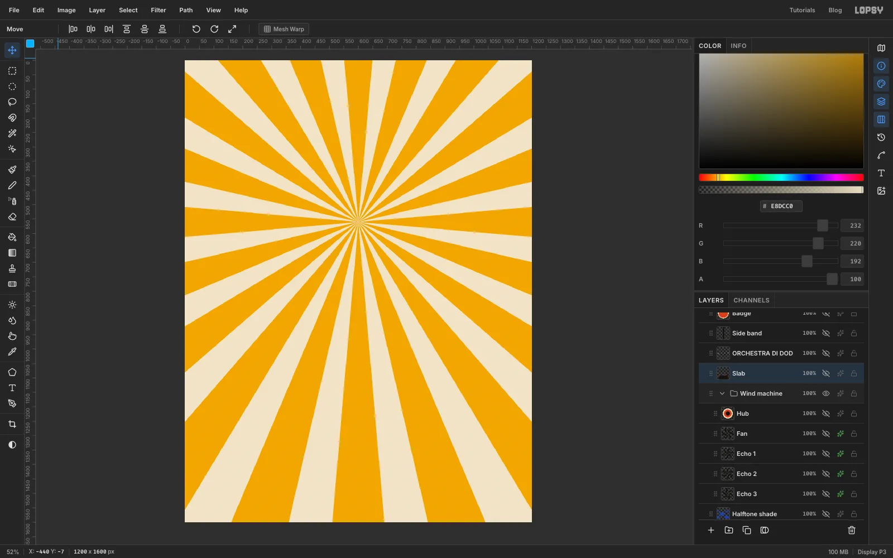

Add a layer and name it *Mustard rays*. Set the foreground to mustard
`#E8A92C` and choose **Filter → Sunburst**. Set **Rays** to 20, **Length**
to 150, **Width** to 55, **Taper** to 0 and **Fade** to 0. Move **Center X**
to 50 and **Center Y** to 35, so the rays start a little above the middle
of the page, which is where the fan will sit. Click **Apply**.

## Add the vermilion spikes

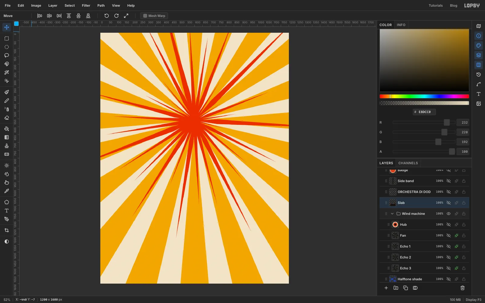

Add another layer, *Vermilion spikes*, and set the foreground to vermilion
`#D9411E`. Run **Filter → Sunburst** again with **Rays** 30, **Length** 80,
**Width** 22, **Taper** 100, **Jitter** 80, **Seed** 31 and **Rotation** 3.
Keep **Center X** at 50 and **Center Y** at 35. High taper turns each ray
into a needle, and the jitter makes them uneven, like a hand-cut shape.

## Cut the flat colour planes

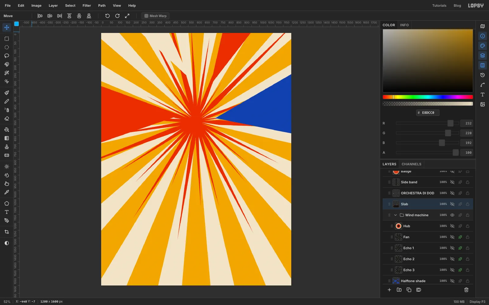

Add a layer called *Planes* and pick the **Lasso**. Futurist posters stack
big flat wedges that all point at the action, so draw four triangles that
start off the canvas and aim at the centre. Click three corners for each,
then finish by clicking the first point and choose **Edit → Fill**:

- a long vermilion wedge from the left edge, a third of the way down
- a cream wedge from the top edge, left of centre
- a cobalt wedge from the right edge, a third of the way down
- a second vermilion wedge from the top edge, right of centre

The cream wedge is subtle against the cream rays. That's fine: it only breaks up the pattern a little.

## Draw the speed lines

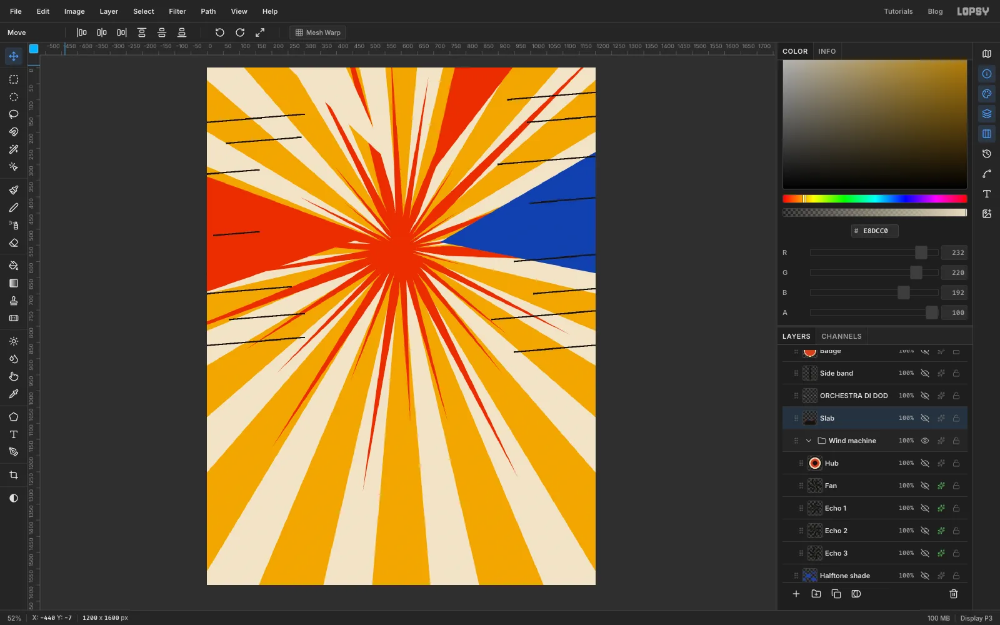

Add a layer called *Speed lines* and set the foreground to ink black
`#16120E`. Pick the **Pencil** and set **Size** to 4. Click where a line
should start, then hold [[Shift]] and click where it should end. Make
about a dozen lines of different lengths, some touching the page edge and
some floating, on both sides of the fan area. Tilt every one by the same
small amount, rising slightly to the right, so they all run parallel to the slab you'll add later (a gentle slope, about 1 px up for every 12 px across).

> **Note:** The Layers panel in these screenshots comes from the finished file, so it lists layers you haven't made yet. Follow the step text, not the panel.

## Draw the broken rings

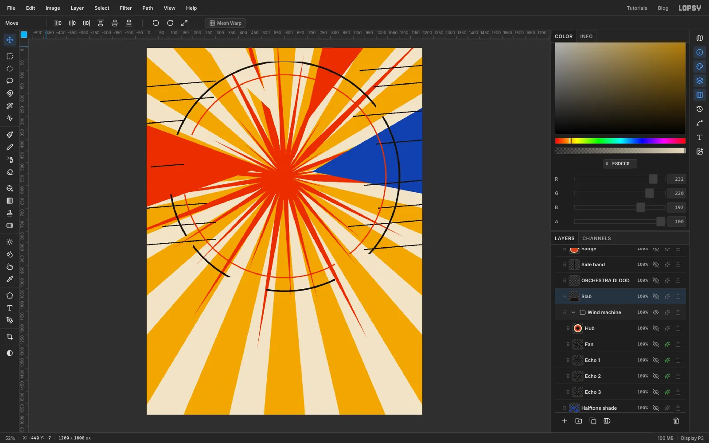

Add a layer called *Rings*. Pick the **Elliptical Marquee**, hold
[[Shift]], and drag a big circle centred on the burst that nearly touches the left and right edges of the page, about **1010 px** across (the status bar shows the size as you drag). Fill it with ink black, then choose **Select →
Shrink**, enter **7**, click **Apply** and press [[Delete]]. A thin black ring is left. Repeat with a slightly
smaller circle, about **890 px** across and centred on the same point, filled with vermilion and shrunk by
**5** before deleting.

The rings feel mechanical when they are broken. Switch to the **Rectangular
Marquee**, drag small boxes over the sides and press [[Delete]] each time to
cut gaps into both rings, leaving a few separate arcs.

## Print a halftone shadow

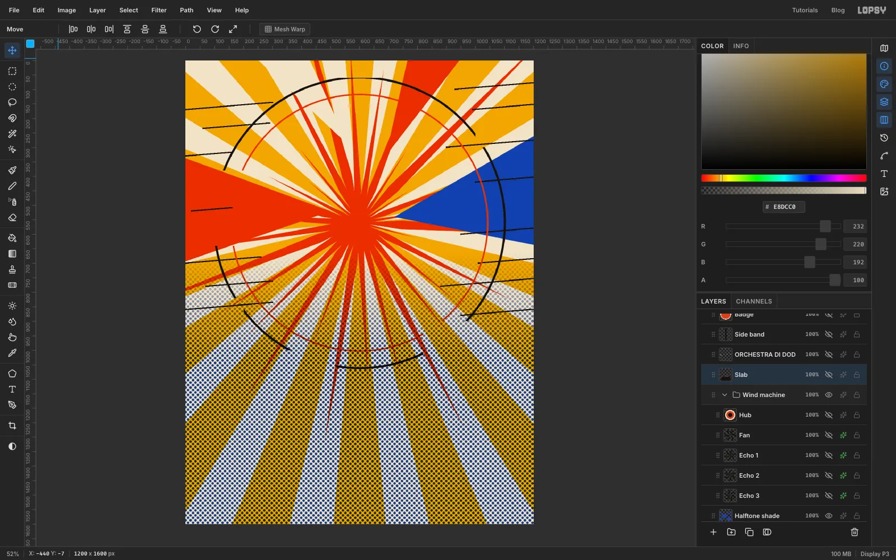

Add a layer called *Halftone shade*. Choose the **Gradient** tool, set the type to
**Linear** and open **Advanced** to give it two stops: cobalt `#1F3FA8` at
the start and the same cobalt at the end with **Opacity** set to 0. Drag
from near the bottom of the page straight up to about two-fifths of the
way up. Then choose **Filter → Halftone** and set **Dot Size** to 12. The smooth
fade becomes a screen of dots.

Open the layer's effects drawer and set its **Blend** to **Multiply**, so the
dots print into the rays. You'll cover the bottom of the page with a slab
later, so only the upper part of the dots remains visible.

## Cut the fan blades

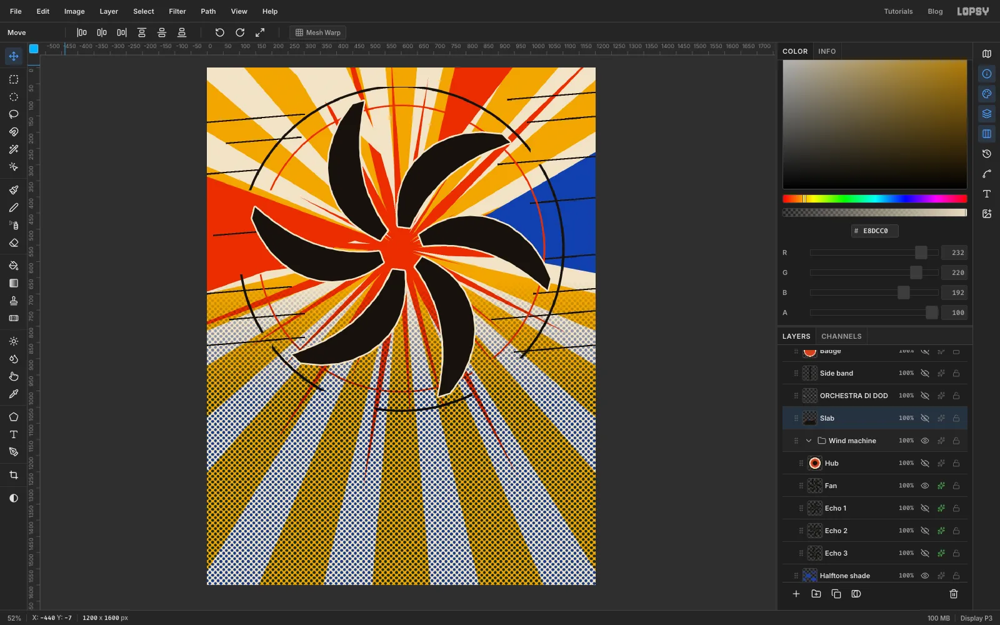

Add a layer called *Fan* and set the foreground to ink black. With the
**Lasso**, draw one blade as a thin curved crescent: start at the centre of
the burst, curve outward in a long arc about 470 px long, widest in the
middle and tapering to a point, then return along a second curve to close
it. Click many small steps for a smooth curve, then choose **Edit → Fill**.

Repeat the shape five more times at roughly 60° intervals around the centre, so the blades all sweep the same way like a pinwheel. They don't need to match exactly; slight differences look hand-cut. (For identical blades, fill one, duplicate the layer, turn the copy 60° as in the next step, and merge it down.) Keep the whole fan
roughly centred on the burst, because the next step turns it around that point.

## Rotate a copy for the motion trail

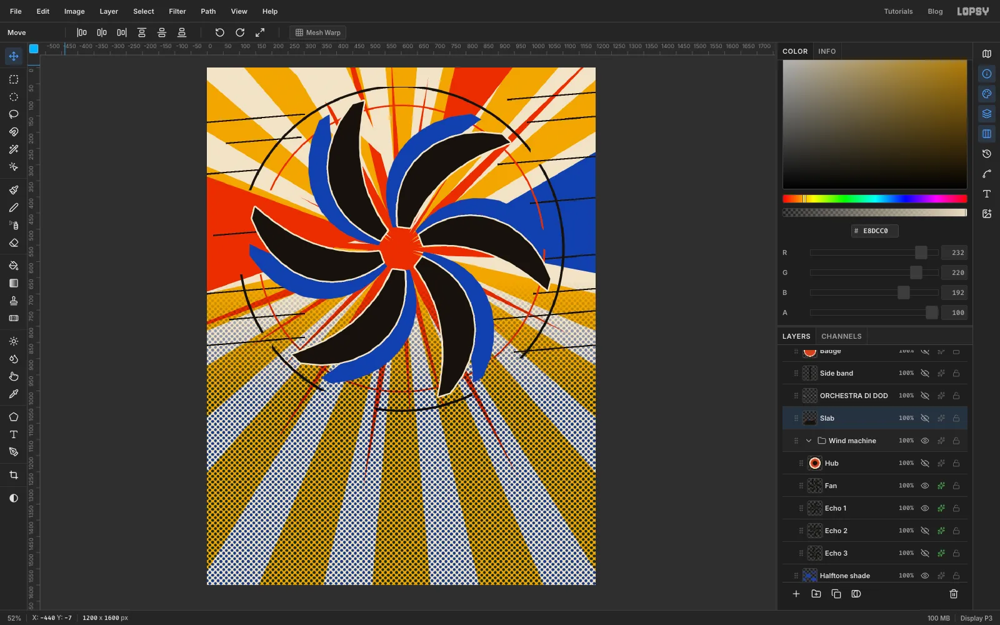

Choose **Layer → Duplicate Layer**, click the new *Fan copy* row, and rename it
*Echo 1*. Pick the **Rectangular Marquee** and drag a box that just contains
the whole fan, with the same margin on all sides so its centre is the centre
of the burst. With a selection active, the copy rotates around the centre of the box, which is the hub, instead of around the middle of the whole layer. Switch to the **Move** tool and drag the round rotate handle
outside a corner about **14°** anticlockwise. Press [[Cmd]]/[[Ctrl]]+[[D]] to commit
and deselect.

Open the layer's effects drawer, switch on **Color Overlay** and set the
colour to cobalt `#1F3FA8`. Drag the *Echo 1* row below *Fan*.

## Repeat for two more echoes

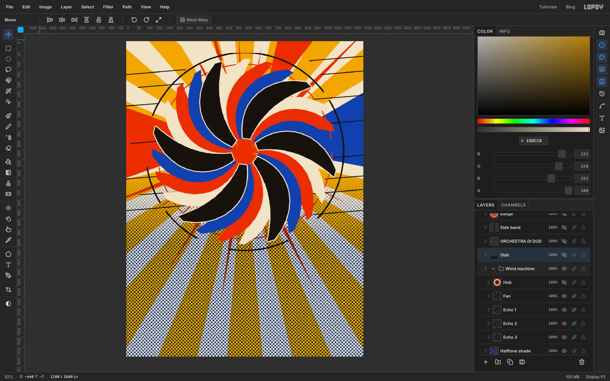

Duplicate *Echo 1*, click the copy, rotate it another 14° anticlockwise the same way,
rename it *Echo 2* and drag it below *Echo 1*. Change its **Color Overlay** to vermilion
`#D9411E`. Make *Echo 3* from *Echo 2* in the same way, dragging each new echo below the previous one so the stack reads Fan, Echo 1, Echo 2, Echo 3 from the top, with a cream
`#EFE3C8` overlay. Together they read as one blade moving through three
stages, the same trick Giacomo Balla used for a dog on a leash.

Select *Fan* and switch on **Stroke** in the effects drawer: cream, width
**5**. The thin pale outline keeps the black blades from merging with the
black arcs and lines.

## Add the hub

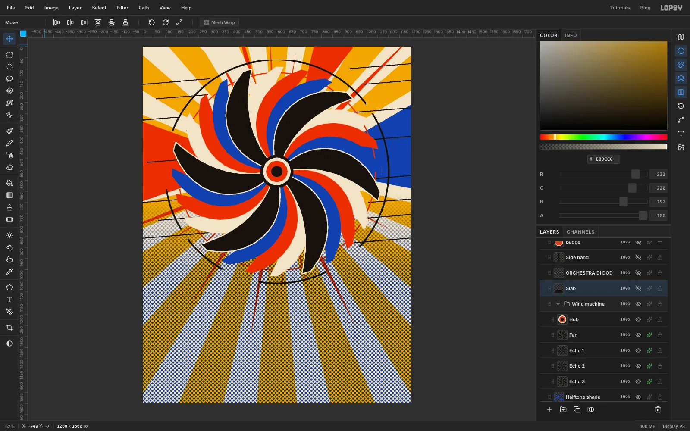

Add a layer called *Hub* above *Fan*. With the **Elliptical Marquee**, hold
[[Shift]] and drag a circle about 150 px across centred on the fan and fill it with ink
black. Choose **Select → Shrink** by **12** and fill with cream, then shrink the new selection again by **14** and fill with vermilion, then once more by **22** and fill with ink black.

Now group the machine. Click the *Hub* row, hold [[Shift]] and click the
*Echo 3* row so all five layers are selected, then choose **Layer → Group
Layers**. Rename the group *Wind machine*. You can now move or scale the whole
fan as one thing.

## Build the slab

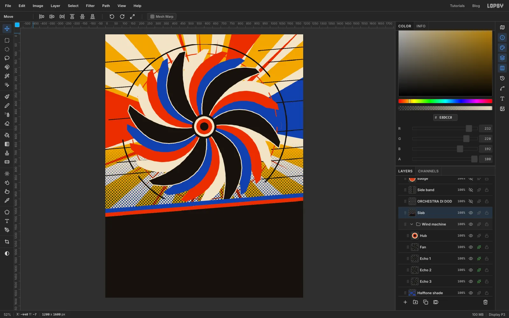

Add a layer called *Slab* above everything by clicking the top group in the
Layers panel first. With the **Lasso**, click a corner off the left edge about
two-thirds of the way down the page, then a corner off the right edge about
100 px higher, then the bottom right and bottom left corners, and close the
shape. Fill it with ink black.

On the same layer, draw two thin parallel bands right above its top edge in the same way: first vermilion, then cobalt
above it, each about 25 px tall and running at exactly the same angle.
The slab's slope sets the angle for all the type.

## Set the title

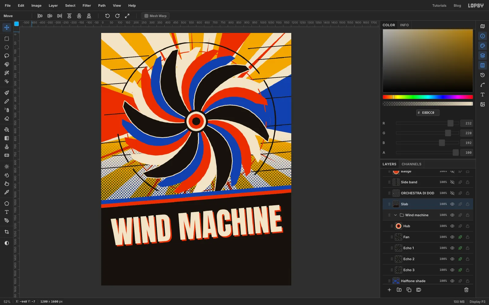

Click the *Slab* row so a raster layer is active, pick the **Text** tool,
choose **Anton**, set the size to **196** and the colour to cream
`#EFE3C8`, then click on the slab and type `WIND MACHINE`. Press [[Tab]] to commit the text.

With the **Move** tool, the text layer shows a box with rotate handles at its
corners. Drag the top-right handle upward until the baseline is parallel
to the slab edge, about 5°. Then drag the title so it is centred left to right, with
a margin of roughly 60 px on each side and a clear gap below the stripes.

Open the effects drawer, switch on **Drop Shadow**, set the colour to
vermilion `#D9411E`, **Offset X** and **Offset Y** to 8, **Blur** to 0 and
**Opacity** to 100. The hard offset looks like a printing misregistration.

> **Tip:** Click a raster layer before you create new type. If a text layer
> is still active when you change the font or size, the change restyles that
> layer instead of starting a new one.

## Add the subtitle and details

Make three more text layers, clicking the *Slab* row each time. First
**Oswald** at 50, mustard `#E8A92C`: `GRANDE SERATA FUTURISTA DI RUMORI E VENTO`.
Then **Oswald** at 38, cream: `GIOVEDÌ 29 OTTOBRE · ORE 20.30 · TEATRO DAL VERME · MILANO`.
Finally **IBM Plex Mono** at 29, `#E8DCC0`: `ORCHESTRA DI DODICI MACCHINE EOLICHE — INGRESSO LIRE 5`.

Rotate each one to match the slope of the title (matching by eye along the slab's edge is fine), and centre each line under the one above it.
Leave about 35 px between lines and a margin of at least 40 px above the bottom edge
so nothing crowds the border.

## Add the side band and the price badge

Add a layer called *Side band* above the slab. With the **Rectangular
Marquee**, drag a tall narrow box near the right edge, from about an eighth of the way down to about half the page,
and fill it with ink black. Create text in **Anton** at 58 with
**Letter spacing** 6, type `MACCHINA DEL VENTO`, then rotate it 90° clockwise with the
Move tool's handle and drop it into the band, leaving even padding at both ends.

For the badge, add a layer called *Badge*, drag an **Elliptical Marquee**
about 150 px across, and fill it ink black. Shrink by **8** and fill with cream, shrink by
**8** again and fill with vermilion. Set **Anton** at 58 in cream, with letter spacing at 0,
type `L. 5`, turn it 14° anticlockwise and centre it in the disc. Place it just below the side band so it doesn't touch the lettering, with the end of the black ring passing close by.

## Finish with paper grain

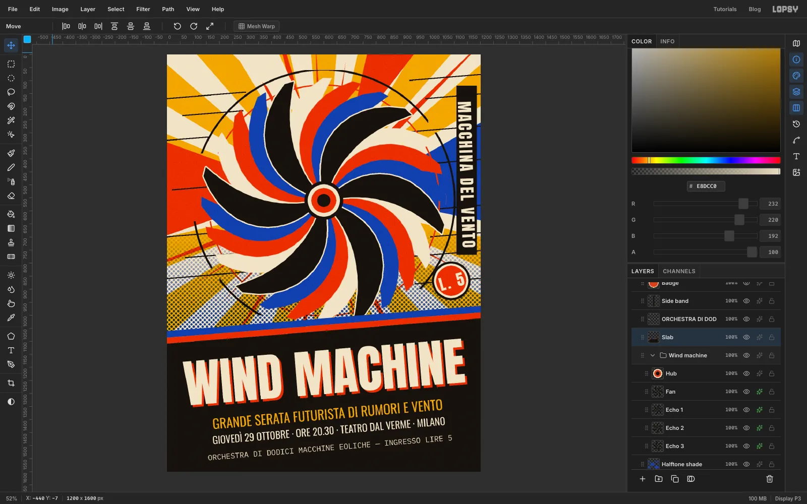

Add a layer called *Grain* above everything. Set the foreground to mid grey
`#808080` and fill the layer with **Edit → Fill**. Choose **Filter → Add Noise**, switch to **Mono**, set **Amount**
to 60 and apply. Then open the effects drawer, set the layer's **Blend** to **Overlay** and drop its opacity to **55%**.

## Try moving the machine as one piece

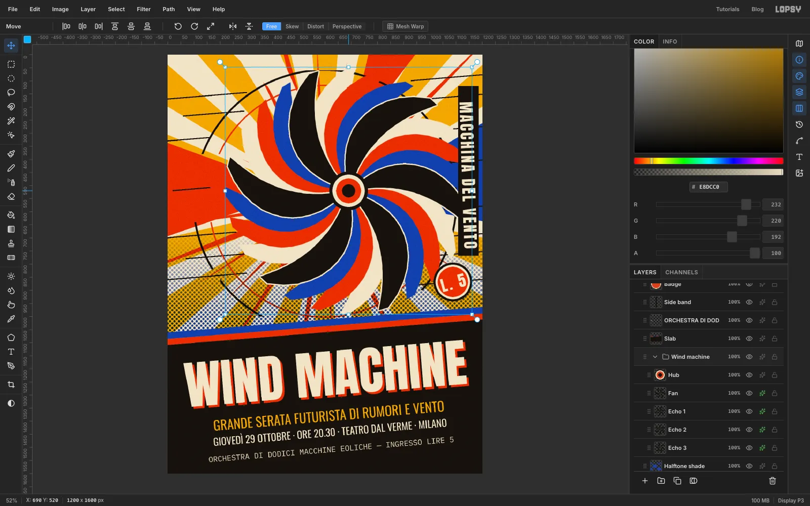

This part is optional. Click the *Wind machine* group row, pick the **Move**
tool and drag on the canvas. The fan, echoes and hub move together while
the slab, type and rays stay put.

## Undo and export

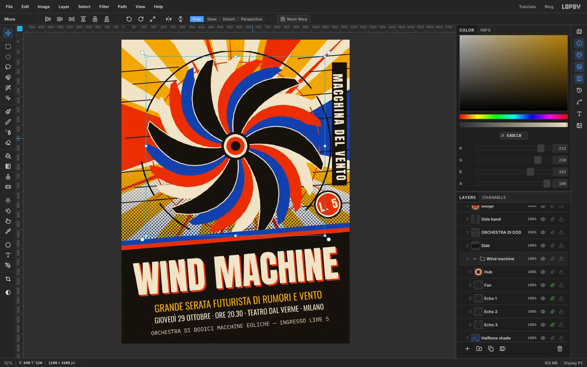

Press [[Cmd]]/[[Ctrl]]+[[Z]] and the group snaps back exactly where it was.
[[Cmd]]/[[Ctrl]]+[[Shift]]+[[Z]] redoes the move, and undo once more if you want it back in place. Export the flier with **File → Quick Export PNG**, or save the project to keep every layer for later tweaks.
